---
author:
- "*Giacomo Sturm*"
date: |
  *Dipartimento di Ingegneria Civile, Informatica e delle Tecnologie Aeronautiche  
  Università degli Studi “Roma Tre"*
title: |
  **Calcolatori Elettronici**  
  Appunti delle Lezioni di Calcolatori Elettronici  
  *Anno Accademico: 2023/24*
---

\providecommand{\labelText}[2]{#1}

# Introduzione: Storia e Tipologia dei Calcolatori

Un calcolatore è un oggetto che fornisce un risultato, dato un insieme di dati inseriti. Per calcolatore elettronico si intende un calcolatore realizzato mediante componenti elettroniche. Lo studio dei calcolatori elettronici consiste nello studio dei principi del loro funzionamento, e la relazione tra la loro architettura ed il software di base.

Verrà analizzata la loro organizzazione e la loro architettura, considerando riferimenti a processori moderni e reali, analizzando le tecniche di ottimizzazione utilizzate da quest’ultimi, utilizzando simulatori e casi di studio.

## Evoluzione delle Architetture

L’evoluzione delle architetture dei calcolatori elettronici si è svolta principalmente negli ultimi settant’anni. Il processo complessivo che ha portato alla nascita dei calcolatori moderni viene diviso in generazioni, ed è dovuto a numerosi “architetti” che negli anni hanno migliorato lavorando sulle architetture precedenti.

Si chiama generazione zero, l’insieme di calcolatori analogici, progettati per risolvere semplici operazioni di addizione, moltiplicazione e divisione, ideati, e realizzati, da Pascal e Leibniz.

Il primo calcolatore programmabile venne ideato da Charles Babbage. Costruì prima una macchina differenziale in grado di calcolare funzioni polinomiali, mentre progettò la prima macchina programmabile, completamente analogica, in grado di leggere un input scritto su piastre di rame perforate, e fornire un output, sempre su piastre di rame, utilizzando i dati e le operazioni inserite in input. Per poter operare su questi dati di input per fornire istruzioni alla macchina è necessario un linguaggio di programmazione, e la prima persona che ha tentato di implementare il linguaggio di Babbage fu Ada Lovelace. Nonostante questo progetto non venne mai realizzata, anche per le limitazioni tecnologiche dell’epoca.

Durante la seconda guerra mondiale vennero realizzate le prime macchine elettromeccaniche, che utilizzarono il progetto di Babbage, aggiungendo relè per realizzare un prototipo funzionante. La prima macchina di questo tipo venne realizzata in Germania, ma fu distrutta durante la guerra, mentre la prima macchina che realizzò il progetto di Babbage venne costruita negli Stati Uniti chiamato (Harvard) Mark I. Le istruzioni ed i dati venivano inseriti tramite schede perforate.

La prima generazione rappresenta il periodo dove vennero abbandonate le componenti meccaniche dei calcolatori. La prima macchina del genere venne create da Alan Turing per decifrare il codice Enigma, realizzata tramite valvole, chiamata Colossus, progetto quindi mantenuto segreto.

Dopo la guerra non servirono più a scopi bellici, per cui si tentò di vendere calcolatori sul mercato, creando la prima società di sviluppo e vendita di calcolatori sul mercato, Univac. Tuttavia i calcolatori dell’epoca rimangono limitati al campo scientifico, militare ed istituzionale.

Negli anni ’50 John von Neumann descrisse l’idea di un calcolatore moderno, dove i dati vengono memorizzati su degli indirizzi di memoria.

L’IBM cominciò la sua storia vendendo calcolatori nel 1953, e continuo ad essere rilevante in questo ambito fino agli anni ’80. In queste macchine ogni elemento viene definito dal termine “word”, composto da un certo numero di bit, per i primi calcolatori della IBM di 36 bit.

La fine degli anni ’50 e l’inizio degli anni ’60 vide l’avvento dei transistor, che permisero di realizzare macchine molto più compatte e veloci. Da un progetto sperimentale del MIT venne fondata la società rivale della IBM, la DEC. Utilizzando transistor vennero diminuiti i costi, e venne introdotta l’idea di utilizzare uno schermo grafico per l’interazione con l’utente. Il primo calcolatore costruito dalla DEC, PDP-1, fu il primo calcolatore di massa.

Per accedere ad un calcolatore si utilizzavano dei terminali, tramite un canale di comunicazione chiamato bus, per permettere anche la comunicazione tra elementi interni al calcolatore prodotti tra società differenti. Si parla comunque di grossi calcolatori per applicazioni scientifiche, militari o di pubblica amministrazione, chiamati “mainframe”, dove ogni utente accedeva al calcolatore tramite terminali. Sistemi più piccoli venivano venduti a piccole aziende, oppure di appoggio ai mainframe.

Fino agli anni ’80 non vennero introdotti cambiamenti radicali all’architettura dei calcolatori, invece i miglioramenti di questi periodi ai calcolatori riguardarono soprattutto l’ottimizzazione del software e dell’hardware. Questa rappresenta la terza generazione dei calcolatori, con l’aumento delle prestazioni e la virtualizzazione delle risorse, per permettere un accesso più semplice da parte dell’utente grazie ai sistemi operativi. I calcolatori di questa generazione ebbero enorme successo all’interno di istituti di ricerca, soprattutto università, e con l’avvento del sistema UNIX, indipendente dalla piattaforma aumentò la facilita di realizzare programmai su calcolatori diversi.

I primi “Personal Computer” vennero introdotti negli anni ’80, dall’IBM, che fornì pubblicamente l’architettura del calcolatore, questo rappresenta l’inizio della quarta generazione. In seguito aumentò in enorme maniera l’utilizzo di PC, trainato dall’aumento delle capacità della CPU, e dalla diminuzione dei costi delle memorie principali e secondarie. Inoltre con l’introduzione delle interfacce grafiche da parte del Macintosh e con l’introduzione dei portatili, i calcolatori divennero macchine generalmente compatte, abbassando il livello di conoscenza necessario per poterli utilizzare. Inoltre l’introduzione dei calcolatori portatili rivoluzionarono la telefonia mobile, ed aumentarono considerevolmente l’accessibilità.

Per quinta generazione si riferisce ad i calcolatori “invisibili”, in applicazioni embedded, dopo che la Apple introdusse il primo computer palmare, PDA. La maggior parte dei dispositivi moderni contengono microcontrollori, piccoli processori, distribuiti in un contesto completamente pervasivo, su ogni dispositivo collegato ad una qualche fonte di energia. Questo concetto viene chiamato anche dell’“Internet of Things”.

## Legge di Moore

Uno dei fondatori dell’Intel, Moore, negli anni ’60 definì empiricamente l’omonima legge, secondo cui il numero di transistor su un chip, CPU, memoria, etc., raddoppia ogni 18 mesi. Questo corrisponde ad un aumento del 60% all’anno.

L’evoluzione reale sembra aver seguito l’andamento descritto da Moore, ma recentemente l’evoluzione sta rallentando, a causa dei limiti fisici nella realizzazione dei transistor. Per cui esiste un limite superiore al numero di transistor su un unico chip. Per misurare la quantità di transistor su un singolo chip si utilizza la grandezza “Livello di Integrazione”, si riescono a creare chip con un livello di integrazione nell’ordine di grandezza dei nanometri, ma livelli di integrazione superiore sono difficilmente realizzabili. Il limite teorico per memorizzare un bit di informazione corrisponde allo spin di un elettrone, per cui ci si aspetta una riduzione ulteriore nei prossimi anni.

Oltre alla legge di Moore son presenti diverse statistiche per misurare l’evoluzione tecnologica dei processori. Dagli anni 2000 si utilizzano più di un core su un unico processo, introducendo semplici forme di parallelismo. Uno dei motivi principali per cui vennero introdotte queste architetture deriva dal limite alla frequenza di funzionamento di un processore, poiché all’aumentare della frequenza aumenta il suo calore prodotto. Le frequenze maggiori raggiunte da processori si trovano nell’ordine dei GHz, queste producono calore negli ordini delle centinaia di Watt, che necessitano di dispositivi di raffreddamento dedicato ed efficienti. Per aumentare le prestazioni senza aumentare la frequenza, si introducono quindi forme di parallelismo nei processori. Una forma semplice consiste nella duplicazione dei componenti, oppure della “pipeline”, che realizza le stesse prestazioni senza introdurre parallelismo fisico. Gia dal 2000 quindi la frequenza operazionale dei processori è rimasta costante, ed ha subito una leggera diminuzione, allo stesso modo del calore generato da un singolo processore. Anche se è possibile realizzare processori mono-core che lavorano a frequenze molto elevate, il costo associato al raffreddamento dei componenti non lo rende un approccio economicamente attuabile.

Dal punto di vista tecnologico per migliorare le prestazioni, bisogna cercare forme diverse di realizzazione di processori, che non utilizzano transistor, una di queste possibili tecnologie riguardano la computazione quantistica.

La legge di Nathan afferma che il software è un gas, riempie sempre completamente qualsiasi contenitore in cui viene inserito. Per cui molto velocemente e facilmente un calcolatore diventa obsoleto, questo alimenta un circolo vizioso che spinge l’evoluzione tecnologica, e rappresenta quindi la legge di Moore.

## Tipologie di Processori

Un calcolatore è un dispositivo in grado di ricevere dei dati, di memorizzare in piccola parte i dati, di elaborare i dati, e di produrre un output. In generale un qualsiasi d dispositivo elettronico in grado di soddisfare queste quattro specifiche può essere considerato un calcolatore. Si possono quindi definire diverse classi di calcolatori o processori sulla base delle loro prestazioni, all’aumentare delle prestazioni aumenta quindi il costo associato ad un dato processore. Esistono calcolatori monouso o “usa e getta”, e microprocessori di basso costo, utilizzati negli elettrodomestici, automobili, o altri oggetti che non richiedono di capacità di computazione elevate, e soddisfano compiti specifici. Processori più evoluti, ma sempre specializzati, vengono utilizzai per applicazioni “mobile”, oppure per piattaforme di gioco. L’unica differenza rispetto ad un Personal Computer è la loro specializzazione, mentre i processori di questa categoria svolgono applicazioni più generali “General Purpose”, in grado di essere programmati. Processori ancora più avanzati vengono utilizzati per fornire servizi, non per l’elaborazione personale, e vengono chiamati server, ma in termini di tecnologia non presenta differenze evidenti rispetto ad un PC. Veniva utilizzati processori ancora più potenti, chiamati “Mainframe”, sulla base della centralizzazione della computazione, dove un singolo processore soddisfa le richieste di tutti gli utenti, ma non vengono più utilizzati a favore dell’elaborazione distribuita.

Processori usa e getta come gli RFID “Radio Frequency IDentification” rappresentano la categoria di processori più diffusa, sono tipicamente passivi, senza batteria, ma esistono dispositivi attivi, di dimensione molto contenuta, nell’ordine di qualche millimetro, contenente un piccolo processore dotati di un transponder radio. Contiene una memoria di 128 bit complessivi. Il transponder è in grado di ricevere segnali su una certa frequenza, inviato da un lettore, questo segnale radio fornisce ulteriormente l’energia necessaria per alimentare il processore che invia il numero memorizzato in memoria. Gli RFID attivi dotati di una batteria non necessitano di essere molto vicini al lettore per operare, uno di questi dispositivi è il “Telepass”.

Microprocessori sono oggetti di plastica che contengono un processore, una piccola memoria, e forniscono un collegamento con l’esterno da vari piedini metallici. Necessitano di un’alimentazione esterna, su uno di questi piedini. Questi processori non sono programmabili, e vengono usati in applicazioni di controllo.

Processori specializzati, non estendibili, ma di prestazioni molto superiori ai microprocessori sono i “Game Computer”, che presentano effetti grafici speciali, per cui in generale presentano un processore grafico specializzato “Graphical Processing Unit” o GPU, ed un software di base limitato. Oltre alla memoria di base chiamata RAM, contengono la memoria di video, per gestire la visualizzazione a schermo chiamata VRAM. Generalmente questi processori CPU o GPU lavorano a non più di 4 GHz, per fornire informazioni sulle prestazioni di un processore si considera la banda di un processore, che rappresenta il numero di operazioni effettuabili in un dato intervallo di tempo. Si usa l’unità di misura FLOPS “FLOating points Per Second” supponendo il caso peggiore, quindi operazioni su numeri a virgola mobile. In generale questi dispositivi presentano una banda nell’ordine dei tera FLOPS. Questi sistemi sono chiusi, quindi non è possibile aumentare le prestazioni aggiungendo ulteriori chip al dispositivo. Appartengono alla stessa categoria le applicazioni Mobile, che presentano processori anche a otto core, con frequenze inferiori, poiché non presentano un sistema di raffreddamento attivo, e contengono una batteria e non un’alimentazione costante, per cui si utilizzano queste frequenze per diminuire il consumo energetico del processore. I processori utilizzati nell’ambito Mobile appartengono alla famiglia ARM, questa non è una casa produttrice come Intel o AMD, ma rappresentano una categoria di processori che vengono realizzati da diversi produttori, poiché è un’architettura aperta, di cui sono note le specifiche ed il linguaggio macchina. Questo modello di mercato si basa interamente sulle licenze vendute dalla casa produttrice ARM, per cui si quando si parla di un processore di questa famiglia, si include anche la casa produttrice che ha prodotto il processore. Recentemente la Apple ha esteso l’uso di processori ARM anche su applicazioni di Personal Computer. Su questi dispositivi le funzionalità I/O vengono fornite tramite un ’interfaccia grafica basate su touch-screen.

Il Personal Computer si riferisce alla disciplina dell’elaborazione personale dei dati. Sono processori di specifiche non molto diverse dalle precedenti, ma sono programmabili. Tutti questi dispositivi sono connessi alla rete, per cui appartengono all’Internet of Things. La differenza tra un PC ed un server è la disciplina secondo cui l’elaborazione dei dati non è personale, ma fornisce un servizio. Tipicamente questi servizi vengono fornite tramite diversi server che lavorano in parallelo secondo la disciplina COW “Cluster Of Workstation”, collegati tramite una rete ad alta velocità, che presentano una ridondanza nella replicazione dei dati, in caso uno di questi server abbia un malfunzionamento. La tendenza al parallelismo è quindi presente non solo a livello microscopico sui singolo processori, ma anche a livello macroscopico utilizzando più server. Permettono di continuare ad erogare il servizio in caso di un malfunzionamento, ed è molto raro che la maggior parte dei server nel cluster falliscono contemporaneamente. La realizzazione di questi server segue la disciplina della scalabilità orizzontale, ovvero vengono aggiunti nuovi server all’aumentare degli utenti, quando invece è presente un unico server si parla di scalabilità verticale, dove per fornire servizi a più utenti si aumentano le prestazioni di un unico server.

Esiste una tendenza di molte organizzazione a non realizzare un sistema di elaborazione con risorse proprie, ma utilizzare risorse nel Cloud, un’esempio molto diffuso è l’AWS, o gli Amazon Web Service, che forniscono memoria, memorizzazione di dati, e capacità di computazione accessibile nel Cloud. In questo approccio si sta ritornando all’approccio del Mainframe, ma in questo caso il terminale di accesso alle risorse fornite nel Cloud è anch’esso un calcolatore avente risorse di calcolo proprie, per elaborare una parte dei dati “In Premise”.

Verranno trattati tre diversi tipi di processori, appartenenti alla famiglia Intel, ARM, ed un processore appartenente alla famiglia dei microcontrollori della famiglia AVR.

### Architettura Intel

Il primo processore commercializzato dalla Intel è il 4004, con una frequenze tra le frazioni di un MHz, ed in grado di gestire poche centinaia di bit di memoria. Una variante di questo processore, specializzato per microcontrollori il 8008, fornì la base per la creazione del primo processore “general purpose” su un circuito integrato, il 8080, a 8 bit.

La prima cifra nel nome corrisponde al tipo di architettura del processore, indica il numero di bit in cui vengono salvati e gestiti i dati sui registri del processore. A partire dagli anni ’90 si cominciò ad utilizzare nomi diversi dai numeri per indicare i processori. Si introdussero memorie cache, ed all’inizio degli anni 2000 si introdussero diverse forme di parallelismo fisico, e non solo, mantenendo le frequenze inferiori ai 4 GHz. Per molti anni si utilizzava lo stesso processore anche per la gestione dello schermo, ma già da parecchi anni è la norma utilizzare un processore dedicato per questo scopo.

I processori moderni si differenziano in diverse categorie, rappresentanti diversi settori di mercato:

- Intel Core i3;

- Intel Core i5;

- Intel Core i7;

- Intel Core i9;

- Xeon.

Tutti i processori moderni della stessa famiglia sono compatibili con lo stesso linguaggio macchina. La denominazione di un processore indica le sue prestazioni, e sono quindi destinati a diversi settori di mercato, per cui l’evoluzione non dipende più dal nome del processore, ma dalla generazione dei processori. Attualmente ci si trova in una generazione intermedia tra la tredicesima e la quattordicesima, in generale un salto generazionale viene definito dal livello di integrazione, i processori moderni hanno un livello di integrazione di 7 nanometri. Sono tutte architetture che presentano fino ad otto core, ma recentemente invece di utilizzare core identici sullo stesso processore sono state introdotte architetture ibride i cui core sono di almeno due forme diverse chiamati “p-core”, per le prestazioni in termini di calcoli complessi, e gli “e-core”, sono più efficienti in termini di consumo di energia. POssono avere fino a 24 stadi di pipeline, che permettono di avere altre forme di parallelismo, senza utilizzare parallelismi fisici.

Utilizzando un’unica catena di produzione, in base alla qualità in cui vengono prodotti si ottengono diversi processori, disattivando le componenti che non funzionano correttamente sul processore, e si vendono quindi come dei processori aventi prestazioni minori rispetto ad una versione completamente funzionante.

Il processore Intel Core i7 presenta sei core abilitati su otto core disponibili, la sua versione completamente abilitata corrisponde al processore Xeon. Presenta poco più di un miliardo di transistor ed un livello di integrazione nell’ordine dei 22 nanometri. Verrà analizzato in dettaglio nella sezione sulle microarchitetture .

### Architetture ARM

La società Acorn inventò negli anni ’80 questo tipo di architettura bastata sui principi RISC (Acorn RISC Machine). Venne usato sui primi tablet prodotti dalla Apple. Nasce come un processore integrato ed a basso consumo energetico. Presenta un modello di commercializzazione diverso rispetto al resto del mercato, utilizzano un’architettura aperta, che permette a diverse case produttrici di realizzare questi processori, vendendo le licenze per poter produrre il processore. Ogni processore ARM viene quindi accompagnato dal nome dell’azienda che l’ha realizzato.

Si analizzerà in seguito l’Nvidia Tegra 2, un SOC “System Of a Chip” contenente due processori della famiglia ARM, una piccola GPU ed ulteriori componenti, .

### Architettura AVR

L’architettura AVR corrisponde a processori progettati per elettro-domestici, e per funzioni specifiche. Nacque da un progetto universitario del NIT nel 1996, dal nome dei suoi creatori Alf and Vergard RISC Processor. Presenta lo stesso pinout dell’8051 Intel. Presenta vari timer, un orologio interno, trasmettitore di impulso, interfaccia di sensori, convertitori analogico-digitali, transponder e comparatore di tensioni. Presenta memorie nell’ordine delle centinaia dei kilobyte per la memoria persistente Flash, una memoria programmabile da poche migliaia di byte “EEPROM”, ed una memoria principale fino ad un massimo di 16 KB, per i microcontrollori più potenti.

# Sistemi di Numerazione Binaria

Quando si misura la memoria si utilizza l’unità di misura byte, corrispondente a 8 bit, e si tende ad utilizzare potenze di due invece di potenze di dieci. Invece quando si considera una velocità si utilizzano bit, e potenze di dieci.

Si utilizza questa notazione per la struttura fisica della memoria, la cua dimensione viene definita dal numero di bit di un indirizzo binario. Dato un indirizzo definito da $n$ bit, sono possibili $2^n$ indirizzi distinti di memoria. Per cui è più semplice lavorare con potenze di due quando si analizza la memoria.

<div class="center">

|   Byte   |          |                     |    Bit    |     |         |
|:--------:|:--------:|:-------------------:|:---------:|:---:|:-------:|
|          |          |                     |           |     |         |
|  $2^0$   |    B     |        Byte         |  $10^0$   |  b  |   bit   |
|          |          |                     |           |     |         |
| $2^{10}$ | KB (KiB) | KiloByte (KibiByte) | $10^{10}$ | Kb  | Kilobit |
|          |          |                     |           |     |         |
| $2^{20}$ | MB (MiB) | MegaByte (MebiByte) | $10^{20}$ | Mb  | Megabit |
|          |          |                     |           |     |         |
| $2^{30}$ | GB (GiB) | GigaByte (GigiByte) | $10^{30}$ | Gb  | Gigabit |
|          |          |                     |           |     |         |
| $2^{40}$ | TB (TiB) | TeraByte (TebiByte) | $10^{40}$ | Tb  | Terabit |

</div>

Nei sistemi di numerazione binaria è presente una differenza sostanziale tra il concetto di numero, un entità astratta, ed il concetto di numerale, una sua possibile rappresentazione in un dato sistema di numerazione. Nell’ambito dei calcolatori elettronici il numero di caratteri diversi per poter rappresentare un numero è finito, poiché lo è la dimensione dei registri di memoria. Per cui i numeri possono essere rappresentati a precisione finita, e si perdono alcune proprietà come la chiusura rispetto alle sue operazioni, sono presenti errori di arrotondamento di un numero, ciò corrisponde ad un errore di “overflow”. Inoltre non è possibile rappresentare tutti i numeri reali, essendo infiniti, per cui possono essere rappresentati solo numeri con un numero finito di cifre decimali in un dato intervallo.

## Rappresentazione a Virgola Fissa

In generale un numero viene rappresentato rispetto ad una base $b$, dove ciascuna cifra $a_i$ del numerale rappresenta il coefficiente di una potenza della base $b$: $$\begin{gathered}
    N:a_m\cdots a_0,a_{-1}\cdots a_{-k}\\
    N=\displaystyle\sum_{i=-k}^ma_ib^i
\end{gathered}$$ Questa rappresentazione viene chiamata posizionale. Per rappresentare un numero utilizzando una base $b$, sono necessari $b$ simboli distinti per poter rappresentare tutte i possibili coefficienti. Dopo aver esaurito le dieci cifre arabe $0,\cdots,9$ bisogna utilizzare diversi caratteri, per basi esadecimali si usano lettere dell’alfabeto per completare l’alfabeto di simboli utilizzato $A,\cdots,F$. Ogni numerale deve essere quindi associato alla sua base per poter ricavare le informazioni del numero che rappresenta.

Questa rappresentazione si dice a virgola fissa, poiché viene definito a priori tramite il parametro $k$ il numero di cifre dopo la virgola utilizzate.

### Sistema Posizionale

Per rappresentare l’insieme dei numeri naturali, viene utilizzata il sistema posizionale, in notazione binaria con $n$ bit si possono esprimere tutti i numeri nell’intervallo $[0,2^n-1]$. Si sfruttano quindi tutte le $2^n$ posizioni disponibili, dove devono essere rappresentati per ogni numerale anche gli $0$ non significativi.

Le operazioni aritmetiche di base come la somma si svolgono cifra a cifra, portando il resto sulla cifra successiva, in caso il risultato non possa essere rappresentato utilizzando $n$ bit si ha un errore di overflow, o trabocco, nella propagazione del resto. Anche la moltiplicazione viene effettuata cifra a cifra tra i due numerali, poiché sono presenti solo due simboli in base due, i prodotti parziali sono pari a zero, oppure al moltiplicando, la somma tra i prodotti parziali si svolge come descritto precedentemente. Inoltre è possibile si verifichi un errore di overflow sulle moltiplicazioni, molto più facilmente rispetto ad una somma.

Il sistema posizionale include la rappresentazione di numeri con una parte decimale, può essere rappresentato utilizzando $n$ bit, fissata la posizione della virgola nel numerale. Si possono così rappresentare numeri a parte decimale positivi. In questo modo è possibile effettuare le operazioni di somma allo stesso modo dei numeri naturali. Nella moltiplicazione non si possono rappresentare ulteriori cifre decimali, per cui si perde precisione effettuando questa operazione tra due numerali a virgola fissa. Moltiplicare un numerale per $2^n$ corrisponde a spostare la virgola di $n$ posizioni a sinistra, mentre per $2^{-n}$ corrisponde a spostare la virgola di $n$ posizioni a sinistra.

### Rappresentazione tramite Modulo e Segno

Per rappresentare i numeri con segni è necessario modificare il sistema posizionale, sono possibili diverse variazioni per ottenere questo risultato. Una di queste si indica come rappresentazione per modulo e segno, dove il primo bit del numerale indica il segno del numero, se è $0$ è positivo, mentre se è $-1$ è negativo, mentre si usano $n-1$ bit per il modulo. In questo modo si riduce l’intervallo di rappresentazione, potendo rappresentare numeri su un intervallo simmetrico $[-2^{n-1}+1,2^{n-1}-1]$, ma sono possibili due rappresentazioni per lo zero $\pm0$

### Rappresentazione Complemento ad Uno ed a Due

La rappresentazione complemento a 1 si aggiunge uno zero a sinistra, si utilizza la rappresentazione posizionale per numeri positivi, mentre per numeri negativi si rappresenta il modulo nella rappresentazione posizionale, ed in seguito si complementa il numerale bit a bit. L’intervallo di rappresentazione coincide per la rappresentazione per modulo e segno $[-2^{n-1}+1,2^{n-1}-1]$, ed allo stesso modo è presente una doppia rappresentazione dello zero.

Per evitare la doppia rappresentazione dello zero si utilizza il sistema della complementazione a due, una piccola variante del complemento ad uno. Se il numero è positivo si utilizza la rappresentazione posizionale, mentre per un numero negativo si rappresenta il suo modulo con la rappresentazione posizionale, si complementa bit per bit e si somma ad uno. In questo modo l’intervallo di rappresentazione con $n$ bit coincide a $[-2^{n-1},2^{n-1}-1]$, ed è possibile un’unica rappresentazione dello zero. Per cambiare di segno di un numerale in questa rappresentazione è sufficiente complementare a due il numerale.

Nel sistema a complemento a due per effettuare l’operazione di somma è sufficiente svolgere una somma bit a bit, si verifica un overflow se la somma tra due numerali dello stesso segno cambia il segno, altrimenti bisogna ignorare il trabocco ed il risultato è sempre corretto. Per svolgere l’operazione di differenza si cambia di segno il secondo numerale e si svolge una somma. Per cambiare di segno un numerale rappresentato nel sistema posizionale, o in complemento a due, è sufficiente calcolare il suo complemento a due. Le moltiplicazioni tra due numerali in questa rappresentazione si svolgono tra i valori assoluti, e se necessario si complementa il risultato.

### Rappresentazione ad Eccesso

Esiste un’altra rappresentazione chiamata ad eccesso. Dati $n$ bit, si definisce un numero noto chiamato eccesso, generalmente $2^{n-1}$. Può rappresentare numeri sullo stesso intervallo della rappresentazione a complemento a due. Per rappresentare un numero si somma all’eccesso, ottenendo un numero sicuramente positivo per cui si può rappresentare utilizzando semplicemente il sistema posizionale. In pratica i numerali si ottengono da quelli della rappresentazione a complemento a due, complementando il bit più significativo. In questa rappresentazione i numerali sono disposti sequenzialmente dal più piccolo al più grande, a distanza di uno tra di loro.

Si considerano le rappresentazioni trattate precedentemente a confronto tra di loro, con 3 bit:

<div class="center">

| Decimale | Modulo e Segno | Complemento a 1 | Complemento a 2 | Eccesso a 4 |
|:--------:|:--------------:|:---------------:|:---------------:|:-----------:|
|    +3    |      011       |       011       |       011       |     111     |
|    +2    |      010       |       010       |       010       |     110     |
|    +1    |      001       |       001       |       001       |     101     |
|    +0    |      000       |       000       |       000       |     100     |
|    -0    |      100       |       111       |                 |             |
|    -1    |      101       |       110       |       111       |     011     |
|    -2    |      110       |       101       |       110       |     010     |
|    -3    |      111       |       100       |       101       |     001     |
|    -4    |                |                 |       100       |     000     |

</div>

I bit più significativi si trovano sempre verso destra, e rappresentano l’ordine di grandezza del numero. In tutti questi sistemi, il primo bit, il più significativo, identifica sempre il segno del numerale e dipende dalla rappresentazione usata.

Un numerale identifica solamente una sequenza di cifre, il numero corrispondente dipende dalla rappresentazione, e questa deve essere necessariamente fornita, insieme al numerale, per poter associato ad un numero.

## Rappresentazione a Virgola Mobile

La rappresentazione di numeri tramite virgola fissa non è un sistema efficiente, poiché si usa lo stesso numero di bit, per tutti i numeri di ordini di grandezza diversi, quindi spesso le cifre più significative non forniscono informazioni aggiuntive per poter identificare il numero, e sono quindi superflue. Per poter ovviare a questo problema si considera una rappresentazione detta a virgola mobile, o “floating point”, dove l’ordine di grandezza è codificato anch’esso nella sequenza binaria, in questo modo è quindi possibile codificare numeri molto più grandi e molto più piccoli, a parità di bit, rispetto ad una codifica a virgola fissa. L’intervallo di rappresentazione risulta quindi notevolmente esteso. Ogni numero reale viene rappresentato mediante una coppia di due numeri: $(m, e)$. Dove $m$ viene chiamata mantissa, e $e$ esponente. Deve inoltre essere fornita la base del sistema di numerazione usato $b$, per poter decodificare il numero originario $n$: $$\begin{gathered}
    n=m\cdot b^e
\end{gathered}$$ La mantissa inoltre deve essere normalizzata tra due potenze successive della base $b$, per fornire un’unica rappresentazione per ogni numero: $$\begin{gathered}
    b^{b-i}\leq|m|<b^i
\end{gathered}$$

Entrambi questi numeri vengono rappresentati mediante un numero finito di cifre, soltanto alcuni dei numeri nell’intervallo sono rappresentabili, per il numero limitato delle cifre significative disponibili, questo provoca quindi errori di arrotondamento. Inoltre si possono verificare errori di underflow o overflow in negativo od in positivo, poiché si possono rappresentare numeri nell’ordine di grandezza massimo o minimo in base al valore massimo contenuto nell’esponente $e$.

Nel 1985 l’“Institute of Electrical and Electronics Engineers” definì lo standard 754 per i numeri a virgola mobile. Formato non proprietario, quindi non dipendente dalla specifica architettura. Vennero definite due rappresentazioni a virgola mobile. Una semplice precisione, tramite 32 bit, ed una a doppia precisione, da 64 bit, utilizzando notazioni con una mantissa normalizzata e denormalizzata, lasciando alcune configurazioni riservate. In entrambe le rappresentazioni un bit, il più significativo, viene riservato per il segno del numero, nella notazione a singola precisione 8 bit sono riservati per l’esponente, ed i restanti 23 per la mantissa; nella rappresentazione a doppia precisione, oltre al segno, 11 bit vengono utilizzati per l’esponente, e 52 per la mantissa.

L’esponente viene codificato tramite la rappresentazione ad eccesso. Nella singola precisione, ad eccesso 127, per fornire più spazio agli elementi positivi, avendo un intervallo di rappresentazione di $[-127, +128]$, ma le configurazioni con tutti zero ed uno sono riservate, quindi effettivamente l’esponente è compreso nell’intervallo $[-126, +127]$. La mantissa, normalizzata, rappresenta solo la parte decimale con la notazione posizionale ed è compresa tra uno e due $1\leq m<2$, si omette quindi nella rappresentazione binaria l’uno che precede la parte decimale, ma bisogna considerarlo quando si effettuano operazioni tra numeri a virgola fissa. Per cui l’intervallo di rappresentazione dei numeri normalizzati, senza il segno, è $[2^{-126}, \sim2^{128}]$. Sono presenti alcune configurazioni riservate, se la mantissa e l’esponente sono entrambe sequenze di zero, si rappresenta lo zero, se la mantissa è zero e l’esponente sono tutti uno, rappresenta un overflow, se la mantissa è non nulla, e l’esponente sono tutti uni, identifica un “Not A Number” o NAN, invece con una mantissa non nulla, ed un esponente di tutti zero, si identifica un numero denormalizzato. Il numero più grande normalizzato è quindi formato da un’esponente con tutti uno, tranne il bit meno significativo pari a zero, che rappresenta un 127, mentre la mantissa pari a tutti uno, approssimata a due, per cui si ha $2^{127}\cdot\sim2\approx2^{128}$. Mentre il numero più piccolo è composto da un’esponente avente un unico uno nella posizione meno significativa, corrispondente ad un -126, mentre la mantissa nulla, corrispondente ad uno: $2^{-126}$.

Nella rappresentazione denormalizzata, l’esponente è composto da tutti zero e vale convenzionalmente $2^{-126}$, mentre la mantissa è un numero compreso tra zero ed uno, poiché viene rappresentato nella notazione posizionale, ed avendo 23 bit, il numero più piccolo rappresentabile dalla mantissa è $2^{-23}$, per cui il numero più piccolo rappresentabile è $2^{-149}$, mentre il numero più grande corrisponde a $\sim2^{-126}$, poiché la mantissa composta da tutti uno viene approssimata ad uno.

Per effettuare operazioni di somma tra due numeri $n_1$ ed $n_2$ in virgola fissa, si confrontano i loro esponenti, ed in caso sia necessario, si scala la mantissa corrispondente all’esponente minore, per raggiungere l’altro esponente. Traslando la mantissa bisogna considerare l’uno omesso dalla rappresentazione decimale, ma sempre presente, detto anche “uno dell’ingegnere”, perdendo i bit meno significativi. In questo modo si eguagliano gli esponenti dei due numeri, traslando la mantissa del numero $\min\{n_1,n_2\}$ di $|e_1-e_2|$ posizioni. La somma presenta quindi un errore di approssimazione.

Per la moltiplicazione si moltiplicano tra di loro le mantisse e si sommano gli esponenti, ed in caso si scala per normalizzare la mantissa, producendo anche in questo caso un’errore di approssimazione. In tutte le operazioni è possibile quantificare l’errore di approssimazione effettuato, si definisce quindi l’errore assoluto $e_A$ commesso, la differenza tra il numero rappresentato dal numerale $n'$ ed il numero effettivo $n$: $$\begin{gathered}
    e_A=n'-n
\end{gathered}$$ Più grande è il numero, maggiore è la probabilità di commettere errori di approssimazione. Mentre si definisce l’errore relativo, il rapporto tra l’errore assoluto ed il numero effettivo rappresentato: $$\begin{gathered}
    e_R=\displaystyle\frac{e_A}{n}=\frac{n'-n}{n}
\end{gathered}$$ L’errore relativo quindi decresce all’aumentare del numero rappresentato, ed assume valore massimo costante su tutto l’intervallo di rappresentazione pari al numero di cifre a disposizione sulla mantissa, utilizzando una mantissa normalizzata. Invece utilizzando una rappresentazione denormalizzata l’errore relativo massimo non è costante.

## Rappresentazione Esadecimale

Per rappresentare numeri esadecimali sono necessarie sedici cifre, oltre alle dieci cifre arabe, si considerano caratteri alfabetici dalla “A” alla “F”. Si ha così un alfabeto da sedici simboli, si può usare per rappresentare in maniera compatta delle stringhe binarie, partendo da destra associando ad ogni 4 bit il numero esadecimale corrispondente: $$\begin{aligned}
    &0000\to 0& 1000\to8&\\
    &0001 \to 1&1001\to9&\\
    &0010\to2&1010\to\mathrm{A}&\\
    &0011\to3&1011\to\mathrm{B}&\\
    &0100\to4&1100\to\mathrm{C}&\\
    &0101\to5&1101\to\mathrm{D}&\\
    &0110\to6&1110\to\mathrm{E}&\\
    &0111\to7&1111\to \mathrm{F}&
\end{aligned}$$

Per codificare caratteri esistono diverse convenzioni e standard, il codice ASCII, ancora in uso nelle interfacce a linea di comando. Può rappresentare solamente 128 caratteri codificati in 8 bit, espressi in esadecimale da due cifre, dove il primo bit, chiamato bit di parità, viene usato per controllare eventuali errori nella trasmissione. Ogni numerale esadecimale viene associato ad un’istruzione di testo (0-1F), oppure ad un carattere (20-7F).

Successivamente venne introdotto il codice Unicode, codificato mediante 16 bit, in grado di codificare 65536 elementi. Codifica 336 simboli di alfabeti latini, 112 accenti e simboli diacritici, alfabeti che non utilizzano caratteri latini, 21000 ideogrammi cinesi. I restanti caratteri vengono assegnati da un consorzio.

Ulteriori sistemi di codifica di caratteri basati su Unicode sono UTF-8 e UTF-16, che utilizzano una lunghezza variabili di bit, permettono di rappresentare molti più caratteri, non necessariamente alfabetici, come emoji e simboli matematici. Tutte le codifiche che cominciano con uno zero rappresentano il codice ASCII, mentre per altri prefissi rappresentano codifiche più lunghe. Il linguaggio Java utilizza UTF-16, ma nella serializzazione su file utilizza una variazione non standard dell’UTF-8.

# Organizzazione Generale di un Calcolatore

I calcolatori elettronici sono composti da dispositivi elettronici in grado di eseguire direttamente solo un numero limitato di istruzioni semplici, il linguaggio macchina che fornisce al calcolatore la sequenza di istruzioni da eseguire è il linguaggio al più basso livello, per cui non è adatto alle persone. Per poter fornire istruzioni ad un calcolatore bisogna utilizzare un linguaggio di programmazione, ed un compilatore che lo traduce in linguaggio macchina, eseguibile dal calcolatore. Un calcolatore è formato da vari elementi: un processore, contenete un’unità di controllo, un’unità aritmetico logica e diversi registri interni, essenziali per il suo funzionamento; una zona di memoria principale, tipicamente una Random Access Memory o RAM; una zona di memoria diversa dalla RAM, memoria volatile esterna, collegata tramite un bus. Il processore scambia dati con la memoria centrale tramite il bus, e ne memorizza il contenuto all’interno dei suoi registri. Alcuni registri particolari sono il “Program Counter” PC che indirizza l’istruzione successiva, e l’“Instruction Register” IR che contiene l’istruzione corrente. Inoltre è possibile siano presenti altri dispositivi di ingresso o uscita, collegati al bus, il principale è la memoria secondaria, non volatile, sullo stesso canale di comunicazione, convenzionalmente realizzata tramite dischi rigidi; è un dispositivo di ingresso-uscita poiché è possibile leggere e scrivere dati sul disco.

## Processore

### Ciclo di Fetch-Decode-Execute

All’interno della CPU sono presenti un numero di registri limitati, l’ALU “Arithmetic Logic Unit”, ed un registro di uscita. Ogni istruzione esegue lo stesso percorso all’interno della CPU. I dati vengono salvati sul registro interno, vengono trasferiti tramite dei bus interni sui registri di entrata ed in seguito inviati alla ALU e il risultato viene salvato su un registro di uscita. Questo ciclo macchina si ripete allo stesso modo per ogni singola istruzione eseguita dalla CPU, e rappresenta il data path, attraversato da ogni singolo dato gestito dal processore. Lo schema fisico di questo ciclo verrà analizzato più approfonditamente nella sezione .

La CPU ripete continuamente una stessa serie di istruzioni; carica le istruzioni dalla memoria al registro delle istruzioni IR, in seguito il PC, viene incrementato, poiché contiene l’indirizzo di memoria dove è presente la seguente istruzione. In generale le istruzioni vengono salvate sequenzialmente sulla memoria, per cui è sufficiente incrementare il PC per poter passare all’istruzione immediatamente successiva. Non sempre viene eseguita l’istruzione immediatamente successiva, poiché sono possibili istruzioni condizionali che possono generare dei salti, inviando un’indirizzo di memoria diverso dal seguente al PC. Dopo aver aggiornato il PC, viene decodificata l’istruzione letta a questo indirizzo. Queste istruzioni possono non richiedere espressamente dei dati, ma in caso lo richieda nella fase successiva si cerca l’indirizzo di memoria dov’è contenuto il dato su cui bisogna applicare l’istruzione, ed in seguito viene caricato su un registro. Dopo aver salvato i dati sul registro, questi attraversano l’ALU, eseguendo l’istruzione, e vengono salvati sul registro d’uscita. Il ciclo si ripete questo cercando l’esecuzione successiva in memoria.

### Architetture CISC e RISC

Per eseguire un’istruzione la CPU può effettuare un’esecuzione diretta, dove l’hardware stesso è costruito per eseguire una singola istruzione macchina. Altrimenti è possibile effettuare un’interpretazione dove ogni istruzione macchina viene scomposta in istruzioni più semplici eseguibili dal processore. Per distinguere l’istruzione macchina dalle istruzioni eseguibili dal processore, più semplici ed elementari, queste vengono chiamate microistruzioni. Queste microistruzioni non sono note e sono incorporate all’interno del processore, mentre le istruzioni macchina sono note, e vengono convertite all’interno del processore in una sequenza di microistruzioni. Il vantaggio dell’esecuzione diretta è la capacità di eseguire direttamente l’istruzione sull’hardware, ma necessita di un hardware abbastanza complesso da poterle eseguire, permette inoltre un’esecuzione molto più efficiente, a scapito della semplicità dell’hardware. Nel caso dell’interpretazione, avendo disaccoppiato le istruzioni macchina dalle istruzioni eseguibili dal processore è possibile avere un repertorio di istruzioni molto più esteso, quindi l’hardware è relativamente semplice e più compatto, è quindi possibile una maggiore flessibilità nel progetto. Questo approccio della microprogrammazione considera un’architettura dove sono eseguibili microistruzioni singole come il trasferimento di dati tra registri, trasferimento verso la memoria centrale, e lettura di dati in memoria, operazioni della ALU e sui registri. Spetta all’unità di controllo della CPU di interpretare le istruzioni macchina, eseguendo un microprogramma. Questo programma è contenuto in una memoria ROM, “Read Only Memory”, sul chip del processore. Utilizzando questo approccio è possibile avere un disegno strutturato, ed una semplice correzioni degli errori, inoltre è possibile aggiungere facilmente nuove istruzioni, inserendo nel microprogramma la loro interpretazione.

Poiché l’efficienza è il parametro fondamentale su cui si basa la creazione di progetti informatici, il primo approccio è preferibile, poiché è molto più efficiente rispetto al secondo. Per cui anche se un processore utilizza interpretazione, se non è più efficiente rispetto ad un processore ad esecuzione diretta, allora è preferibile quest’ultimo, nonostante la sua complessità. Questi due architetture vengono chiamate RISC, “Reduced Instruction Set Computer”, la prima, e CISC, “Complex Instruction Set Computer”, la seconda. Il numero di istruzioni eseguibili è una conseguenza dell’uso di uno dei due approcci, per cui questa classificazione non dipende dal numero di istruzioni eseguibili da un processore, ma dal modo in cui vengono eseguite. Nelle architetture RISC di esecuzione diretta sono possibile un numero ristretto di istruzioni, eseguite sui registri, dove sono presenti istruzioni apposite per poter effettuare accessi in memoria, ed ogni istruzione segue un ciclo di macchina. Nelle architetture CISC le istruzioni vengono interpretate tramite un microprogramma, aumentando il numero di istruzioni eseguibili, queste istruzioni vengono eseguite in memoria, inoltre ogni istruzione essendo composta da molte microistruzione comprende più di un singolo ciclo di macchina. Le prime architetture furono del tipo RISC, in seguito i progettisti utilizzarono l’architettura CISC, considerata migliore, ma considerando la migliore efficienza delle architetture RISC i progettisti di sistemi veloci riconsiderarono l’approccio dell’esecuzione diretta verso gli anni ’80.

Per la retrocompatibilità dei processori Intel, alcune istruzioni dei loro processori sono istruzioni CISC, le loro ultime architetture commercializzate contengono quindi molte istruzioni e sono di tipo ibrido per mantenere questa retrocompatibilità. Le architetture ARM invece seguono vengono realizzate secondo l’approccio dell’esecuzione diretta.

I calcolatori moderni vengono progettati utilizzando l’approccio RISC, e sono utilizzate varie tecniche per massimizzare la banda, la velocità con la quale le istruzioni vengono eseguite in un’unità di tempo, misurate tramite FLOPS, nell’ordine dei TFLOPS (Tera-FLOPS) per calcolatori moderni avanzati. Per aumentare questa banda si introducono meccanismi di parallelismo fisico, o architetture super-scalari oppure basata su pipeline. Per semplificare la decodifica delle istruzioni vengono realizzate tramite formati molto regolari. Inoltre vengono limitati i riferimenti alla memoria, accessibile solo tramite le istruzioni LOAD e STORE, tramite componenti hardware dedicate. Inoltre si tende ad ampliare il numero di registri interni del processore.

Questi principi anche se proprio della filosofia RISC, vengono rispettati in parte anche dalle architetture CISC.

## Parallelismo

Per aumentare le prestazioni di un calcolatore è necessario introdurre forme di parallelismo, poiché aumentare ulteriormente la frequenza di funzionamento dei suoi componenti non corrisponde ad un aumento delle sue prestazioni, per la necessità di sistemi di raffreddamento avanzati. A livello fisico è possibile aumentare il numero delle componenti, utilizzando più di un core, a tutti gli effetti processori indipendenti sullo stesso chip che lavorano in parallelo. Alternativamente è possibile introdurre forme di parallelismo senza duplicare le componenti fisiche dell’hardware, che operano a livello delle istruzioni.

### Pipeline

Uno di questi meccanismi viene chiamato Pipelining, rappresenta l’idea della catena di montaggio, dividendo ogni istruzione eseguita dal processore in fasi, ed ognuna di questa fasi viene eseguita da una componente diverse del processore. Ogni componente rappresenta uno stadio diverso della pipeline, a livello di hardware, ed effettuano queste fasi diverse simultaneamente. In questo modo più istruzioni possono essere eseguite contemporaneamente, avendo un’istruzione diversa ad ogni stadio, essendo componenti indipendenti. Viene quindi completata un’istruzione ad ogni ciclo, ad ogni segnale di clock, e si guadagna un fattore pari al numero di stadi nella pipeline capaci di lavorare in parallelo. Si chiama pipeline, storicamente, poiché si riferisce un tubo dove gli elementi inseriti escono in un ordine sequenziale ed osservando l’interno di un tubo ad ogni dato istante sono presenti più di un elemento al suo interno, a diversa distanza dall’uscita. L’efficienza della istruzioni si misura tramite due parametri, la latenza e la sua ampiezza di banda. Questo metodo trova un compromesso tra queste due. La latenza è il tempo impiegato per eseguire ogni istruzione, poiché ognuno degli $n$ stadi viene eseguito in un tempo di clock $T$, la latenza è lineare rispetto al numero di stadi: $n\cdot T$. Mentre la banda rappresenta il numero di istruzioni effettuate in un’unità di tempo, e viene notevolmente aumentata utilizzando la pipeline, poiché a regime ad ogni ciclo di clock viene completata un’istruzione. La latenza è quindi inversamente proporzionale alla velocità di clock: $T^{-1}$. Avendo tempi di clock nell’ordine dei nano secondi si ottiene una banda di $1000\cdot T^{-1}$ MIPS, Milioni di Istruzioni Per Secondo. Poiché anche se sono presenti molti stadi, a regime, viene sempre completata un’istruzione ogni periodo di clock. Questo rappresenta una situazione ideale. poiché sono presenti delle dipendenze tra un’istruzione ed un’altra, per cui è possibile che l’esecuzione di un’istruzione debba aspettare il termine dell’esecuzione di un’altra, creando dei “buchi” nella pipeline, diminuendo la banda attuale.

Dentro uno stesso processore è possibile introdurre un parallelismo ulteriore su un’unico core tramite architetture superscalari, che raddoppiano il numero di pipeline interne al singolo core, utilizzando una componente hardware dedicata che avvia più di un’istruzione insieme. Inoltre è possibile introdurre un parallelismo a livello degli stadi più complessi, per cui solo lo stadio più lento viene parallelizzato per aumentare la sua velocità. Per permettere ciò è necessario che le istruzioni eseguite in queste due pipeline, siano indipendenti l’una dall’altra, affinché non utilizzino una i risultati dell’altra o viceversa, per non diminuire la banda.

Questo tipo di architettura viene implementata nei processori Intel, parallelizzando lo stadio più lento, inserendo diverse unità funzionali indipendenti. Questi metodi di parallelismo permettono di aumentare le prestazioni di un singolo processore al massimo di dieci volte.

### SIMD e MIMD

Per aumentare ulteriormente le prestazioni non è sufficiente un parallelismo a livello delle istruzioni, per cui i calcolatori moderni, oltre ad implementare questo tipo di parallelismo nei loro processori, utilizzano più componenti che operano in parallelo.

Esistono quindi due diverse tecniche per aumentare il numero delle componenti fisiche:

- SIMD: “Simple Instruction Multiple Data”, molti processori in grado di eseguire operazioni elementari lavorano in parallelo;

- MIMD: “Multiple Instruction Multiple Data”, più processori indipendenti in grado di effettuare operazioni complesse lavorano in parallelo.

La tecnica SIMD viene utilizzata nelle GPU, o nei vecchi processori matriciali e vettoriali, per effettuare operazioni su matrici e vettori molto efficientemente, per la gestione dello dello schermo nel caso delle GPU. Per la loro capacità di effettuare operazioni matriciali molto velocemente le GPU hanno trovato successo nell’ambito del Machine Learning e Deep Learning, per l’uso moderno di reti neurali stratificate, implementate utilizzando matrici sovrapposte a vari livelli. Per questo motivo la casa produttrice Nvidia, leader nella produzione di GPU, ha ottenuto enorme successo anche in questo settore. Le operazioni tipiche di una GPU, su pixel, vertici, archi e figure sono operazioni semplici, effettuate dai core CUDA, nel caso di GPU della Nvidia, contenenti decine di processori, ognuno dei quali contiene decine di core, in questo modo si rende possibile l’esecuzione di centinaia o migliaia di operazioni ad ogni ciclo di clock.

La GPU Fermi, prodotta nel 2009 dalla Nvidia possiede 16 processori, ognuno contenente 32 core, contenente ognuno due pipeline a tre stadi, permettendo alla GPU di effettuare fino a 512 operazioni per ogni ciclo di clock.

Le architetture che implementano la MIMD contengono diversi processori indipendenti che comunicano su uno stesso bus, per accedere ad una memoria condivisa centrale, tramite la quale si scambiano dati. Questo può provocare un rallentamento delle prestazioni se il bus non è in grado di trasferire dati ad una sufficiente velocità, per cui rappresenta il collo di bottiglia del sistema. Per ovviare in parte a questo problema si introduce la tecnica di caching, ovvero inserendo all’interno di ogni processore una piccola memoria locale, su cui salvano i dati, per evitare di dover accedere costantemente alla memoria condivisa, rallentando le operazioni. Questa implementazione si chiama multiprocessore, e non è l’unico metodo di parallelismo fisico adottato, ormai di norma per i processori odierni è l’architettura multicore che introduce all’interno di uno stesso processore più core, indipendenti, montati sullo stesso chip. Ognuno di questi core può avere una cache autonoma di livello L1, ed una cache condivisa tra tutti i core, di livello L2. Questi tipi di architetture possono essere omogenee, avendo core identici, oppure eterogenee utilizzando due tipi diversi di core, i p-core, più performanti, utilizzati per svolgere operazioni più laboriose, e gli e-core, più efficienti in termini di consumo energetico. Le architetture eterogenee sono quindi in grado di delegare le istruzioni a questi core in base alla loro complessità per minimizzare il costo energetico. Ogni core può implementare architetture multiscalari per aumentare ancora di più il livello di parallelismo. Questi core avere un accoppiamento stresso, con una cache condivisa, oppure lasco, con una cache privata per ogni core. Questo tipo di architetture si diffuse a partire dal 2003, creati dalla IBM, Intel e AMD. I processori odierni della Intel utilizzano un’architettura eterogenea.

Un’ulteriore livello di parallelismo viene introdotto creando dei cluster di computer, dove ogni elemento è un calcolatore indipendente, questo tipo di sistema viene usato quando si devono trattare dati massivi. I singoli componenti di questo cluster sono dei server montati su un supporto rettangolare, chiamato anche “blade server”, per il modo in cui viene montato. In queste architetture di cluster la comunicazione avviene tramite scambio di messaggi, senza una memoria condivisa centrale, il paradigma del “shared nothing”. In un singolo data center è possibile siano presenti decine di migliaia di server singoli. Questa architettura favorisce la scalabilità orizzontale del sistema, dove per aumentare le prestazioni è sufficiente aggiungere nuovi server al cluster, invece di migliorare i server già esistenti. Inoltre in questo modo è possibile implementare un metodo di resistenza ai guasti replicando ogni dato all’interno di nodi diversi del cluster.

Per cui dal livello più stretto di accoppiamento si ha la tecnica del threading all’interno di un processore; le architetture co-processore, con un processore più piccolo e dipendente, a supporto di una CPU centrale; le architetture multiprocessore, ad accesso ad una memoria condivisa e più lasca con accesso ad una memoria privata per ogni processore. Infine si ha l’architettura multicomputer, o di cluster, dove le comunicazioni tra gli elementi avvengono tramite l’internet. Questi computer possono essere collocati nello stesso data center in caso di un cluster di server, oppure possono essere dislocati e connessi solamente tramite l’internet.

## Dispositivi di Memoria

La memoria centrale di un calcolatore è l’elemento che contiene sia i programmai che i dati, tramite una memorizzazione binaria. La memoria viene divisa in celle, o locazioni, di memoria, e rappresentano le singole unità indirizzabili, la minima dimensione è quella di un byte, il minimo indirizzabile. In genere è divisa in word, o parole, composte da un certo numero di byte, in base all’architettura, ognuna delle quali possiede un univoco indirizzo. Solo tramite questi indirizzi il processore è in grado di accedere al dato nella cella di memoria, la memoria massima è quindi limitata dalla dimensione massima dell’indirizzo di memoria. Dato un indirizzo composto da $n$ bit, allora sarà possibile specificare solamente $2^n$ indirizzi di memoria diversi, e quindi zone di memoria diverse. Il numero di bit dipende dall’architettura, i processori moderni sono a 32 o 64 bit, quindi sono in grado di indirizzare al massimo $2^{64}$ zone di memoria. La memoria quindi dipende oltre dalla dimensione della parola, anche dal numero di bit dell’indirizzo, per definire lo spazio indirizzabile. Una memoria di una stessa dimensione può essere indirizzata differentemente in base alla suddivisione delle celle e alla lunghezza di parola, per cui negli anni si sono trovate diverse soluzioni per indirizzare la stessa quantità di memoria.

Oltre alla memoria centrale esistono memorie secondarie, di costo per bit minore, ma con una velocità di lettura e scrittura peggiore. Si può quindi realizzare una gerarchia di memoria, ponendo in cima le memorie a più stretto accoppiamento con il processore fino alle più lente memorie secondarie. Scendendo nella gerarchia la velocità di accesso diminuisce, ma la dimensione della memoria aumenta:

- Registri: le zone di memoria utilizzate dal processore per contenere i dati usati durante l’esecuzione delle istruzioni, comprese nel data path. Hanno una capacità massima di $2^4$ byte, ed un tempo di accesso minore di un nanosecondo: $t_A\leq10^{-9}\,\mathrm{s}$;

- Cache: le zone di memoria interne al processore dove vengono salvati memorizzati di memoria dalla memoria centrale. Hanno una capacità massima nell’ordine dei MB, con un tempo di accesso di qualche nanosecondo $t_A\approx2\cdot10^{-9}\,\mathrm{s}$;

- Memoria Centrale: la zona di memoria dove sono contenuti i programmi ed i dati, ha una dimensione dell’ordine dei GB, con un tempo di accesso di una decina di nanosecondi $t_A\approx10\cdot10^{-9}\,\mathrm{s}$;

- Dischi Magnetici, HDD, o a Stato Solido, SSD: le unità di memoria secondaria, non volatili, di dimensione nell’ordine dei TB, con un tempo di accesso dai millisecondi (HDD) ai microsecondi (SSD) $t_A\approx10^{-6}/10^{-3}\,\mathrm{s}$;

- Nastro o Dischi Ottici: unità di memoria ormai obsolete, con una dimensione nell’ordine dei TB o maggiore, ed un tempo di accesso che di centinaia di millisecondi $t_A\approx100\cdot10^{-3}\,\mathrm{s}$.

Solamente il livello più alto è a diretto contatto con la CPU, i restanti dati devono essere trasferiti tra i vari livelli durante l’esecuzione.

### Codici di Correzione

Poiché l’accesso a memoria è molto costoso, è conveniente implementare dei codici di correzione per non leggere dati errati, o dover accedere nuovamente in memoria per dover rileggere il dato. Queste tecniche vengono usare per garantire quindi l’affidabilità della memoria, nella lettura e scrittura di informazioni binarie. Questi codici di correzione inseriscono un certo numero $r$ di bit ridondanti, su $n$ bit totali, di cui $m=n-r$ bit di interesse. Per cui si utilizza un sottoinsieme di $2^m$ di tutte le possibili configurazioni $2^n$. Si definisce la distanza di Hamming tra due codifiche il numero di bit diversi tra le due, invece la distanza di Hamming $h$ di un codice corrisponde alla minima distanza di Hamming tra due codifiche valide. Utilizzando questo parametro è possibile calcolare quanti errori è possibile rilevare e correggere in una data codifica. Per poter rilevare errori su $k$ bit occorre avere una distanza di Hamming della codifica $h=k+1$, ovvero avere un numero di bit pari a $k\leq h-1$. Invece per correggere errori su $k$ bit è necessaria una distanza di Hamming di $h=k+2$, quindi sono necessari $k\leq (h-1)/2$ bit.

Per rilevare un errore singolo su una sequenza binaria è sufficiente aggiungere un unico bit, chiamato bit di parità. Questa tecnica di controllo di parità sceglie questo bit in modo che il numero complessivo di uno nella codifica sia sempre pari, o dispari in base all’implementazione. Questo codice ha quindi una distanza di Hamming pari a due, ed è possibile rilevare l’errore utilizzando circuiti molto semplici. Le memorie sono quindi in grado di segnalare un parity error nel momento in cui un errore, singolo, si manifesta. Poiché sono componenti altamente affidabili, avere una rilevazione di errore singolo è sufficiente per rilevare tutti gli errori che si possono verificare in fase di trasmissione.

Invece per correggere un errore singolo data una codifica da $n$ bit totali, $m$ di dati e $r$ di ridondanti, sono necessarie $n$ codifiche errate a distanza di Hamming pari ad uno da ciascuna codifica valida, per ognuna di essere. In totale ogni codifica valida richiede $n+1$ totali, si ha che il numero di bit totali utilizzati per la codifica deve rispettare la seguente relazione: $$\begin{gathered}
    (n+1)\cdot2^m\leq2^n\Rightarrow(m+r+1)\cdot\cancel{2^m}\leq\cancel{2^m}\cdot2^r\\
    m+r+1\leq2^r\tag{\stepcounter{equation}\theequation}
\end{gathered}$$ All’aumentare del numero di bit $m$, l’overhead, decresce. L’overhead rappresenta la percentuale del numero degli $m$ bit dei dati da aggiungere per correggere gli errori, il suo andamento viene rappresentato dalla curva rossa nella figura seguente:

<figure id="fig:overhead">
<p> 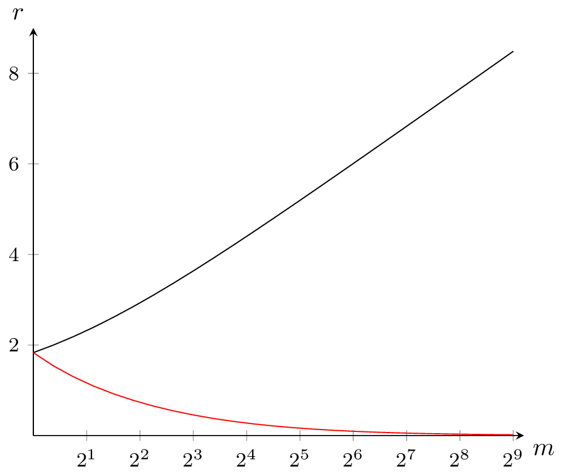</p>
<figcaption>Bit da Aggiungere per Correggere un Errore Singolo</figcaption>
</figure>

### Caching

Si è discusso precedentemente di come l’accesso alla memoria centrale rallenti le operazioni svolte dal processore. Memorie veloci sono disponibili, ma solo per piccole dimensioni, non rappresentano quindi la soluzione a questo problema. Per cui per risolvere questo problema si inserisce una piccola memoria all’interno della CPU stessa, di dimensione molto minore della memoria centrale, in grado di memorizzare i dati necessari allo svolgimento delle istruzioni, velocizzando di gran lunga le istruzioni, poiché questa memoria interna ha la stessa velocità del processore. Questa zona di memoria interna si chiama cache, e memorizza le ultime zone di memoria acceduta dalla CPU, per evitare accessi ripetuti in memoria centrale. Inoltre memorizza le zone di memoria attorno a queste, le più probabili ad essere richieste dalla CPU. Rispetta due principi di località:

- Temporale: Poiché una stessa zona di memoria verrà acceduta più di una sola volta dalla CPU, come l’aggiornamento di una singola variabile;

- Spaziale: Se serve una certa locazione di memoria, probabilmente verranno richieste anche le locazioni intorno a questa, come per un array.

Per cui vengono trasferiti interi blocchi di memoria nella cache ad ogni singola lettura in memoria centrale.

Si definisce il cache hit ratio, la percentuale di volte che una parola letta, viene ritrovata nella cache, su $k$ letture di seguito. Poiché dopo la prima lettura l’intera zona di memoria viene salvata nella cache, si hanno $k-1$ cache hit, quando viene trovato nella cache, ed una singola cache miss, quando non viene trovato nella cache. Si ha quindi un cache hit ratio pari a: $$H=\displaystyle\frac{k-1}{k}$$ Data questa metrica può essere quindi calcolato il tempo medio di accesso a memoria, dato il tempo di accesso alla memoria centrale $m$, ed il tempo di accesso alla cache $c$: $$A=c+(1-H)\cdot m$$ Per ogni cache miss, un intero blocco di memoria viene spostato nella cache.

La cache è trasparente rispetto alla memoria centrale, ovvero il processore non è in grado di determinare se il dato che sta leggendo provenga dalla memoria centrale oppure dalla cache, l’unica differenza è la velocità di accesso.

### Schede di Memoria

Esistono diversi tipi di schede di memoria, ognuna con un certo numero di piedini, e di chip di memoria. Alcune presentano bit di parità, realizzati tramite un chip in più. Ogni tipologia di scheda di memoria è standardizzata, per permettere ai costruttori di realizzare schede di memoria in grado di comunicare correttamente con il processore. Le principali tipologie sono:

- SIMM, “Single Inline Memory Module”: memorie a 32 bit, utilizzano 72 piedini, e dalle 8 ai 16 chip di memoria di 128 MB ciascuno;

- DIMM, “Double Inline Memory Module”: memorie a 64 bit, aventi tra i 120 e 240 piedini, con 8 chip di memoria da 256 MB;

- SO-DIMM, “Small Outline-DIMM”: schede DIMM di dimensione ristretta utilizzate in notebook di piccole dimensioni;

- DDR/DDR2/DDR3/(M)DDR4/DDR5, “Double Data Rate”: introducono un meccanismo di pipeline nella lettura e scrittura, e possono avere fino a 288 pin.

Le memorie SIMM vengono utilizzate a coppie nei processori Pentium, per avere un bus dati a 64 bit. Ogni scheda di memoria DDR presenta una tacca diversa, per impedire che sia montata fisicamente su un supporto non valido.

### Dischi Magnetici

I dischi magnetici, o hard disk, termine usato per ogni memoria secondaria, sono memorie non volatili che si basano sulle proprietà elettro-magnetiche di alcuni materiali. Vengono realizzati tramite dei dischi di alluminio sovrapposti, di meno di dieci centimetri di diametro, con una densità di bit pari a 25 Gb/cm. I dati vengono memorizzati su traccie concentriche, divise in settori, ognuna di pochi micron in altezza, ogni settore contiene un migliaio di bit. Sono presenti circa 50000 tracce per centimetro del disco, larghe circa 200 nanometri. I bit vengono registrati verticalmente sulle tracce. Ogni settore presenta un preambolo per allineare la testina che legge i dati, i dati, ed un ECC “Error-Correcting Code”, per correggere gli errori in lettura, poiché presenta una percentuale di errore relativamente elevata. Per cui la capacità formattata di un disco diminuisce del 15% rispetto alla sua capacità effettiva. Questi dischi ruotano ad una velocità costante, tra i 5400 ai 10800 giri al minuto, o RPM, con una banda di 150 MB/s, leggendo un settore in pochi microsecondi: $t_A=3.5\,\mu\mathrm{s}$. Un braccio meccanico si sposta radialmente sul disco per leggere o scrivere i bit. Quando deve scrivere viene attraversato da una piccola corrente, generando un campo magnetico orientando in uno di due versi, per indicare uno zero oppure un uno, le particelle magnetiche disposte sul disco. In lettura il disco non viene attraversato da corrente, ma quando la testina passa sopra ad un bit magnetico, questo genera un piccolo campo elettrico per induzione all’interno del braccio, misurabile come zero o uno in base al suo verso.

Si utilizzano due misure di velocità del disco, il burst rate, la velocità da quando la testina è sopra il primo bit, ed il sustained rate, che calcola la velocità di trasferimento in un certo intervallo e comprende il tempo necessario per allineare la testina. Le traccie vengono sovrapposte a fino a formare un cilindro ed ogni lato di un disco può essere usato per memorizzare dati diversi. Ogni lato è quindi disposto di un suo braccio meccanico per leggere e scrivere i dati. Il tempo di accesso ad un dato può essere scomposto come il tempo di spostamento delle testine sul cilindro desiderato, “Seek Time”, che dipende in parte dalla distanza attuale dalla testina, in una decina di millisecondi al massimo $t_S\approx5/10\,\mathrm{ms}$, ed il tempo di spostamento sul settore desiderato, “Latency”, in un paio di millisecondi $t_L\approx3/6\,\mathrm{ms}$: $$\begin{gathered}
    t_A=t_S+t_L
\end{gathered}$$

Ogni traccia concentrica presenta un numero diverso dei settori, poiché la velocità angolare dipende dalla distanza dal centro del disco, e bisogna mantenere la velocità di lettura di un singolo settore costante, altrimenti bisognerebbe modificare la velocità di rotazione del disco. Per gestire l’organizzazione dei dati sul disco sono necessarie delle capacità elaborative, sono quindi presenti dei processori specializzati nel disco, chiamati controllori di disco.

Furono definiti degli standard per i dischi magnetici, il primo standard del IDE nato con il PC XT dell’IBM, aveva in totale 500 MB di memoria, ed una banda di pochi MB al secondo. Lo standard EIDE lo stende mediante lo schema LBA “Logical Block Addressing”, un meccanismo di trasformazione da un indirizzo logico ad uno fisico, tramite una tabella di conversione, con una memoria massima gestibile di 128 GB. I dati vengono trasmessi tramite lo standard ATA “AT Attachment” e per le versioni successive ATAPI “ATA PAcket Interface”, per ottenere una banda fino ai 100 MB/s. Da ATAPI-6 venne aumentata la massima memoria gestibile, fino ad un massimo di 128 PB, mentre da ATAPI-8 e successivi, il trasferimento si basa sullo standard SATA “Serial ATA”, utilizzando connettori da meno bit, e tensioni più basse con velocità di trasmissione di decine di MB al secondo. Si utilizza una trasmissione seriale dei dati per risolvere un problema fisico di comunicazione sul bus, i bit viaggiano a diverse velocità sul bus, poiché attraversano linee strutturalmente diverse, questo fenomeno viene chiamato bus skew. Questo impone quindi un limite superiore alla velocità di trasmissione di un dato, mentre la trasmissione sequenziale dei bit, ovvero in forma seriale, non presenta limiti, e potenzialmente non presenta limiti alla velocità di trasferimento dei dati. Ulteriori accorgimenti utilizzano controller ed interfacce più intelligenti, SCSI “Small Computer System Interface”, tramite bus con connessioni daisy chain, nella versione moderna Serial Attached SCSI per avere velocità di trasferimento dei dati fino a 10 Gb al secondo.

### Dischi RAID

Utilizzando più di un disco magnetico è possibile aumentare la velocità di trasferimento dei dati. Questa soluzione si chiama RAID “Redundant Array of Inexpensive Disks”, usa più dischi per implementare un meccanismo di parallelismo in acceso ai dati, e meccanismi di resistenza ai guasti. Questo sistema si contrappone ai SLED “Single Large Expensive Disk”. Nel RAID il singolo dato viene diviso e memorizzato su più dischi, tramite un processo di “Data Striping”, in modo che possa essere acceduto in parallelo su più dischi.

Sono possibili diverse configurazioni, da RAID 0 a 5, cambiando il numero dei dischi e la distribuzione dei blocchi di dati di un file su di essi. Il RAID di livello 0 consiste nel utilizzare $n$ dischi per memorizzare un singolo dato, guadagnano un fattore $n$ sia in lettura che in scrittura. Ma peggiore la frequenza degli errori, MTBF “Mean Time Between Failures”, e non sono presenti meccanismi di resistenza ai guasti, non c’è ridondanza:

<figure>
<p> 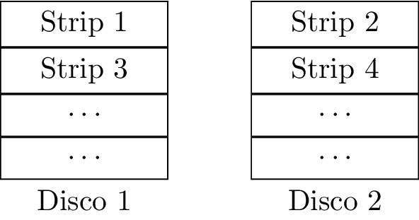</p>
<figcaption>RAID Livello 0 con Due Dischi</figcaption>
</figure>

Il RAID di livello 1 consiste in un RAID 0 dove tutti i dischi sono duplicati, una tecnica di shadowing, avendo la possibilità di resistere a guasti multipli, inoltre offre la possibilità di bilanciare il carico:

<figure>
<p> 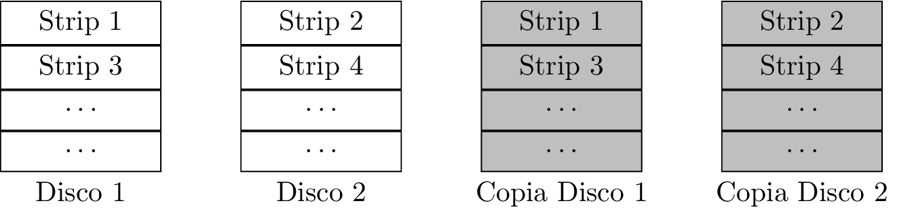</p>
<figcaption>RAID Livello 1 con Quattro Dischi</figcaption>
</figure>

Il RAID di livello 2 introduce un sistema di correzione di errori introducendo un overhead ed un bit di parità; dividendo il singolo dato a livello di word o di byte, ed ogni porzione di byte, nibble, o bit vengono salvati sul disco. In questo modo si ha una resistenza a guasti semplici e guadagna un fattore in lettura e scrittura in base al numero di dischi utilizzati. Ma per ottenere ciò i dischi devono essere sincronizzati in rotazione. Questo sistema è più efficiente all’aumentare dei dischi, per diminuire la percentuale di bit ridondanti da inserire, come mostrato nella figura :

<figure>
<p> 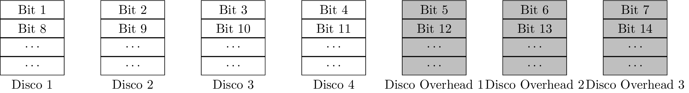</p>
<figcaption>RAID Livello 2 con Sette Dischi</figcaption>
</figure>

Il RAID di livello 3 rappresenta una versione semplificata del RAID 2, consente una distribuzione a livello di bit, ed un overhead contenuto realizzato da un bit di parità, permette di recuperare i dati persi in caso di guasto sapendo quale disco è rotto:

<figure>
<p> 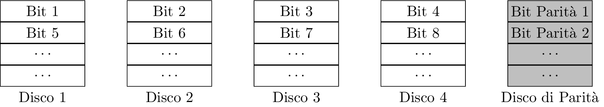</p>
<figcaption>RAID Livello 3 con Cinque Dischi</figcaption>
</figure>

I RAID di livello 2 e 3 permettono di effettuare una sola operazione su disco per volta, poiché ogni operazione coinvolge tutti i dischi. Nel RAID di livello 4 si effettua uno striping a livello di blocco, ed i drive non sono sincronizzati, la strip dell’ultimo disco contiene i bit di parità dell’insieme di bit omologhi di tutte le altre strip:

<figure>
<p> 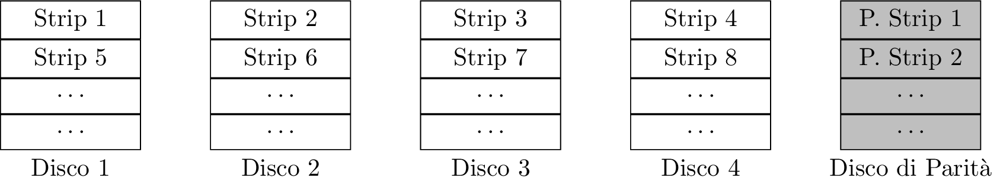</p>
<figcaption>RAID Livello 4 con Cinque Dischi</figcaption>
</figure>

Riesce quindi a resistere ai guasti come un RAID 3, ma l’ultimo disco rappresenta un collo di bottiglia, poiché è necessario per ogni operazione di lettura. Per cui nel RAID 5 viene distribuita la strip di parità su tutti i dischi per minimizzare l’accesso ad un singolo disco:

<figure>
<p> 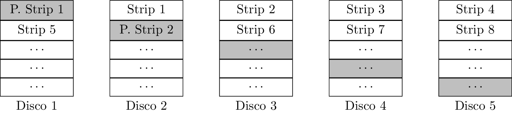</p>
<figcaption>RAID Livello 5 con Cinque Dischi</figcaption>
</figure>

### Dischi a Stato Solido

I “Dischi” a Stato Solido, SSD, chiamati dischi per motivi storici, memorizzano dati in maniera non volatile, sfruttano il fenomeno dell’“Hot-Carrier Injection” dei transistor. Questa è una proprietà negativa dei transistor, dove gli elettroni che transitano il transistor possono superare lo strato isolante e rimanere in maniera permanente sui suoi componenti. Vengono quindi realizzate celle di memoria flash, a stato solido, quindi senza necessità di un’alimentazione, formate da vari transistor. I transistor vengono coperti da due strati isolanti, uno sopra “Control Gate” CG, ed uno sotto “Floating Gate” FG, per catturare le cariche. Alimentando il CG, vengono catturate le cariche sul FG, anche in assenza di alimentazione, e si misura la presenza di cariche poiché aumenta la tensione di commutazione. Si effettua quindi un test di commutazione a basso voltaggio per rilevare la presenza di cariche, ed in caso assegnare uno zero o un uno. Poiché sono presenti componenti puramente elettriche, questo sistema è estremamente veloce rispetto a dei dischi magnetici, con velocità di trasferimento nell’ordine dei centinaia di MB al secondo. Ma presenta dei difetti rispetto a HDD, poiché la frequenza di fallimenti è molto più elevata, e sono possibili un massimo di 100000 scritture prima di dover sostituire il dispositivo. Inoltre è molto più costoso di un disco magnetico, con un costo per GB di qualche euro, invece di qualche centesimo. Si addice per la sua compattezza alle applicazioni mobile, ed ai flash drive. La capacità può essere aumentata ulteriormente utilizzando celle multi-livello, e si può diminuire la frequenza di errore tramite una distribuzione uniforme delle letture e scritture sulle celle dell’unità, per evitare che si verifichi un guasto su una cella molto prima di un altra.

## Dispositivi I/O e Scheda Madre

I dispositivi di input e output forniscono all’utente la capacità di comunicare con il controllore, e sono collegati, come tutte le altre componenti, ad un bus e sono controllati da specifici processori, che trasferiscono autonomamente i dati in memoria, secondo la convenzione DMA “Direct Memory Access”, senza dover passare per il processore. Questi dispositivi possono comunicare alla CPU tramite le interruzioni, e poiché condividono lo stesso bus, gli accessi devono essere regolati.

La base di un controllore è costituita dalla scheda madre, dove sono presenti i connettori per i vari componenti. La scheda madre contiene i bus su cui vengono trasferiti i dati tra le varie componenti, su di essa vengono montate il processore, le schede di memoria, e collegati i dispositivi di memoria secondaria e di I/O connessi a corrispondenti connettori. Il bus è costituito da una serie di piste sul circuito stampato, spesso sono presenti più di uno secondo diversi standard.

# Circuiti Digitali e Memorie

Un calcolatore è una macchina realizzata a livelli, dove una macchina virtuale trasforma le istruzioni in un linguaggio fornito ad una macchina virtuale di livello inferiore, fino ad trasformare le istruzioni nel linguaggio macchina, eseguibile dal processore. Si utilizzano molti livelli intermedi per analizzare meglio la distinzione tra la compilazione o l’interpretazione della macchina virtuale, con cui interagisce l’utente ed il programmatore, e la macchina reale, che esegue a livello fisico le istruzioni sull’hardware. Si considera quindi una stratificazione che divide questi due livelli per permettere un’implementazione progressiva e modulare, in modo che un linguaggio di programmazione usato ad un certo livello non dipenda dall’hardware e siano presenti diverse soluzioni allo stesso livello. In questo modo è possibile ottenere una trasparenza all’utente finale ed alle applicazione che rende possibile di implementare diversi linguaggi di programmazione sulla stessa piattaforma ed introdurre lo stesso linguaggio su più piattaforme diverse.

Ogni livello richiede una diversa astrazione del calcolatore. Il più basso livello L0 rappresenta la logica digitale, la combinazione delle porte logiche che formano le componenti principali del calcolatore. Il livello successivo L1 utilizza queste componenti per realizzare le microarchitetture ed implementa a livello di hardware il data path, i registri, l’ALU, i bus di controllo. A questo livello si sceglie se si tratta di un’esecuzione diretta o di un’interpretazione tramite microprogrammazione. Al livello successivo L2 si ha un processore unico, che richiede input e fornisce output in linguaggio macchina, è possibile quindi definire un set di istruzioni del linguaggio macchina dello specifico processore. Al livello successivo ancora L3 si ha un’interpretazione parziale tramite un sistema operativo che permette di gestire e virtualizzare le risorse del calcolatore. Salendo al livello superiore L4 è possibile scrivere programmai in linguaggio assembly, che vengono tradotti dal sistema operativo in linguaggio macchina, essenzialmente in corrispondenza uno ad uno con esso. In questo modo è possibile realizzare compilatori, per salire al livello successivo L5, dove sono presenti linguaggi di programmazione tradotti dal compiler in linguaggio macchina. Il livello 2 è il livello più basso a cui un utente può programmare, ma normalmente si programma al livello 5.

## Algebra Booleana

Un circuito digitale è un circuito elettronico molto semplice, in cui gli ingressi e le uscite assumono solo due livelli, sono binari. Dato un set di input $i_1\cdots i_n$ un circuito digitale produce un set di output $o_1\cdots o_m$: $$\begin{gathered}
    \begin{cases}
        o_1=f_1(i_1,\cdots,i_n)\\
        \vdots\\
        o_m=f_m(i_1,\cdots,i_n)
    \end{cases}
\end{gathered}$$

Queste funzioni $f_j$ vengono chiamate funzioni logiche o booleane, sono tutte funzioni aventi come dominio e codominio l’insieme contenente i due valori 0 e 1: $$\begin{gathered}
    f:\{0,1\}\to\{0,1\}
\end{gathered}$$ Per cui sono possibili un numero finito di combinazioni e quindi di funzioni booleane, dati $n$ input. Sono possibili $2^n$ combinazioni di valori in input, e quindi $2^{2^n}$ possibili combinazioni in output, e quindi funzioni booleane distinte. Inoltre è possibile descrivere in maniera esaustiva una singola funzione booleana, tramite una tabella della verità, esprimendo tutte le possibili combinazioni in input ed il loro risultato in output:

<div class="center">

|  $i_1$   | $\cdots$ | $i_{n-1}$ |  $i_n$   |   $f$    |
|:--------:|:--------:|:---------:|:--------:|:--------:|
|    0     | $\cdots$ |     0     |    0     |  $o_1$   |
|    0     | $\cdots$ |     0     |    1     |  $o_2$   |
| $\vdots$ | $\ddots$ | $\vdots$  | $\vdots$ | $\vdots$ |
|    1     | $\cdots$ |     1     |    1     |  $o_m$   |

</div>

Con 1 bit in ingresso, ed in uscita, si hanno solo 4 funzioni disponibili:

<div class="center">

| $x_1$ | SET0 | Buffer | NOT | SET1 |
|:-----:|:----:|:------:|:---:|:----:|
|   0   |  0   |   0    |  1  |  1   |
|   1   |  0   |   1    |  0  |  1   |

</div>

Le funzioni SET0 e SET1 impostano il valore ad uno o zero, indipendentemente dagli ingressi, mentre la funzione identità, restituisce il valore che gli viene passato, viene anche chiamata Buffer, e non rappresenta propriamente un operatore poiché non applica alcuna trasformazione agli ingressi o alle uscite. La funzione unaria più importante è il NOT che restituisce il valore opposto del valore che gli viene passato. Con 2 bit sono possibili 16 funzioni booleane, le più importanti sono AND ed OR, ma esistono altre funzioni di interesse come NAND, NOR, XOR, XNOR:

<div class="center">

| $x_1$ | $x_2$ | AND | OR  | NAND | NOR | XOR | XNOR |
|:-----:|:-----:|:---:|:---:|:----:|:---:|:---:|:----:|
|   0   |   0   |  0  |  0  |  1   |  1  |  0  |  1   |
|   0   |   1   |  0  |  1  |  1   |  0  |  1  |  0   |
|   1   |   0   |  0  |  1  |  1   |  0  |  1  |  0   |
|   1   |   1   |  1  |  1  |  0   |  0  |  0  |  1   |

</div>

Se $x$ e $y$ sono due variabili booleane, l’AND si rappresenta come un prodotto $x\cdot y$, l’OR come una somma $x+y$ ed il NOT come $\bar{x}$. Date queste tre sole funzioni è possibile rappresentare ogni altre funzione booleana. Per cui data una funzione booleana ad $n$ variabili si definisce la Forma Canonica la seguente espressione: $$f:=\sum_{j=1}^m\prod_{i=1}^nx_{ij}^*$$ Dove $x_{ij}^*$ vale $x_i$ oppure $\bar{x}_i$ e viene chiamato mintermine.

Di seguito si elencano le proprietà dell’algebra booleana:

<div class="center">

|          Commutativa          |              $a+b=b+a$               |              $a\cdot b=b\cdot a$              |
|:-----------------------------:|:------------------------------------:|:---------------------------------------------:|
|          Associativa          |          $a+(b+c)=(a+b)+c$           |     $a\cdot(b\cdot c)=(a\cdot b)\cdot c$      |
|         Assorbimento          |           $a+(a\cdot b)=a$           |                $a\cdot(a+b)=a$                |
|         Distributiva          | $a\cdot(b+c)=(a\cdot b)+(a\cdot c)$  |       $a+(b\cdot c)=(a+ b)\cdot(b+ c)$        |
|          Idempotenza          |               $a+a=a$                |                 $a\cdot a=a$                  |
| Esistenza di Minimo e Massimo |               $a+1=1$                |                  $a\cdot0=0$                  |
|   Esistenza del Complemento   |            $a+\bar{a}=1$             |              $a\cdot \bar{a}=0$               |
| Esistenza di Elementi Neutri  |               $a+0=a$                |                  $a\cdot1=a$                  |
|      Legge di De Morgan       | $\overline{a+b}=\bar{a}\cdot\bar{b}$ |     $\overline{a\cdot b}=\bar{a}+\bar{b}$     |
| Assorbimento del Complemento  |        $a+\bar{a}\cdot b=a+b$        | $\bar{a}\cdot(a+\bar{b})=\bar{a}\cdot\bar{b}$ |

</div>

## Porte Logiche

Le porte logiche sono circuiti elementari che realizzano gli operatori dell’algebra booleana. Qualsiasi funzione booleana può essere realizzata dalle sole porte AND, OR e NOT. Inoltre può essere dimostrato come queste due porte possono essere rappresentate solamente usando le porte NAND o NOR, per cui queste due porte sono, singolarmente, complete e possono essere realizzate per realizzare qualsiasi circuito.

Le porte logiche vengono rappresentate tramite i seguenti simboli circuitali:

<figure>
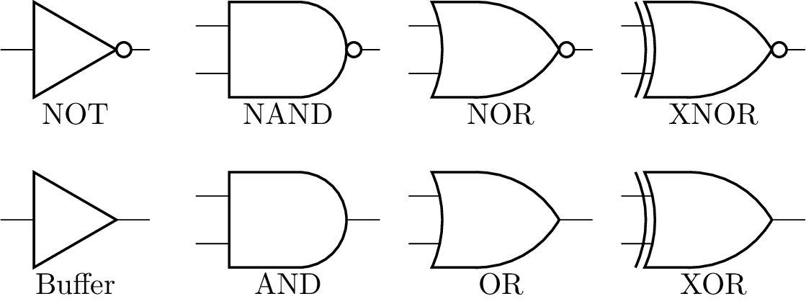
<figcaption>Porte Logiche</figcaption>
</figure>

Il NOT si rappresenta sinteticamente come un pallino, quando si vuole negare l’entrata di una porta, o l’uscita per rappresenta le corrispettive porte negate. Le porte internamente sono realizzate da due transistor, tutte le porte a due input, e da un transistor, la porta NOT, tranne la porta Buffer poiché non modificando l’input non necessita di alcun componente circuitale aggiuntivo. I transistor permettono un tempo di commutazione ad altissima velocità:

<figure>
<p>      </p>
<figcaption>Realizzazione Porte Logiche</figcaption>
</figure>

I valori di zero ed uno vengono rappresentati come valori alti o bassi di tensione, differenziati da pochi volt. In base alle scelte di progetto un segnale provoca l’azione corrispondente se è alto o basso, per identificare questo si definisce il segnale asserito, quando assume il valore che provoca l’azione, mentre si parla di segnale negato altrimenti. Per indicare che il segnale è alto non si applicano alterazioni al segnale S, altrimenti si segna con una barra sopra al segnale $\overline{\mathrm{S}}$. La Intel utilizza una notazione differente, adatta al set di carattere i ASCII, ed in seguito Unicode, per il segnale negato, tramite il cancelletto: S#.

Si possono utilizzare le proprietà dell’algebra booleana per ottimizzare la realizzazione di circuiti logici, per diminuire il numero di transistor necessari. Permettono di semplificare la funzione booleana, oppure per utilizzare solo alcune porte per la scarsità di un certo tipo di porte sul mercato, come le porte AND.

Si mostra ora la completezza delle porte NAND e NOR:

<figure>
<p> 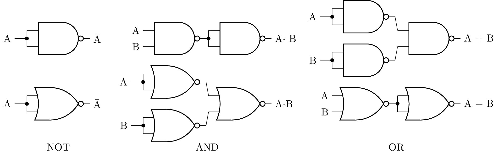</p>
<figcaption>Completezza Porte NAND e NOR</figcaption>
</figure>

Inoltre la porta XOR, “EXCLUSIVE OR”, può essere realizzata utilizzando due porte AND ed una OR, oppure solamente porte NAND:

<figure>
<p> 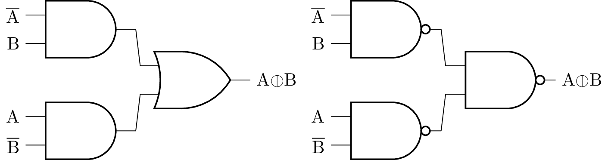</p>
<figcaption>Porta XOR Realizzata Utilizzando AND, OR e NAND</figcaption>
</figure>

Le porte logiche vengono vendute in circuiti integrati contenenti più di una porta, e connessi da piedini numerati all’esterno. Insieme al singolo chip vengono forniti le loro specifiche sulla posizione degli ingressi e le uscite delle varie porte contenute nel circuito. Devono essere sempre presenti gli ingressi di alimentazione VCC e di massa GND. Per orientare il circuito è presente una tacca o notch da una parte del chip, confrontandola con la scheda tecnica fornita:

<figure>
<p> 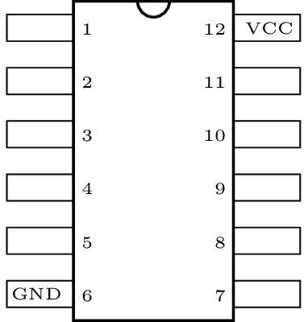</p>
<figcaption>Chip da 12 Pin</figcaption>
</figure>

Questi chip vengono divisi in base al livello di integrazione:

- SSI, “Small Scale”: con al massimo una decina di porte;

- MSI, “Medium Scale”: fino ad un centinaio di porte;

- LSI, “Large Scale”: fino a $10^5$ porte;

- VLSI, “Very Large Scale”: più di $10^5$ porte.

Per questi chip i tempi di commutazione variano da $0.1$ a $10$ nanosecondi. Un processore è un VLSI, con molte porte e molti piedini, per fare spazio al numero di piedini necessari esistono diverse configurazioni la “Dual Inline Packages” DIPs, per circuiti di piccole dimensione presentano i piedini al lato, i “Pin Grid Arrays” PGAs, che presenta piedini su un’intera faccia del chip, ed i “Land Grid Arrays” LGAs, utilizzati per i processori moderni, come i PGAs presentano una matrice più fitta di piedini.

I circuiti digitali possono essere divisi in due classi di circuiti, i combinatori ed i sequenziali. I primi combinano più input, e l’output dipende solamente dagli input, mentre nei secondi l’output dipende anche dallo stato del circuito. I circuiti combinatori vengono usati per realizzare i componenti di un processore, mentre i circuiti sequenziali per realizzare le componenti delle schede di memoria.

## Circuiti Combinatori

I circuiti combinatori sono circuiti digitali dove l’uscita dipende solamente dagli ingressi.

### Multiplexer

Un multiplexer è un circuito combinatorio avente $n$ ingressi di controllo, $2^n$ ingressi controllati, ed unica linea di output. Gli $n$ ingressi di controllo sono necessari ad identificare quale degli $2^n$ ingressi controllati da mandare in uscita. Internamente viene formato da $2^n$ porte AND per ogni ingresso controllato, ognuna collegata ad un ingresso di controllo ed ad un univoca combinazione degli ingressi di controllo. Tutte queste porte AND vengono poi collegate ad una singola porta OR, per permettere a qualsiasi ingresso sia stato abilitato di uscire.

<figure>
<p> </p>
<figcaption>Multiplexer 4<span class="math inline">×</span>2</figcaption>
</figure>

Queste porte AND vengono chiamate porte di abilitazione, poiché effettivamente abilitano una uscita di un segnale. Vengono usati nella conversione parallelo-seriale di un bus, avente tante linee, ad un bus, avente una linea singola. Vengono abilitate tutte le linea, iterando su ogni linea, una alla volta, per convertire il segnale in seriale. Un multiplexer è in grado inoltre di implementare una qualsiasi funzione booleana di $n$ variabili. Le entrate di controllo rappresentano i mintermini, inoltre le entrate controllate vengono cablate a zero o ad uno a seconda che il mintermine compaia o meno nella forma canonica.

### Decodificatore

Un decodificatore è un circuito combinatorio a $n$ ingressi e $2^n$ uscite, dove una sola delle uscite assume valore uno, in base alla combinazione di valori di ingresso. Vengono usati per indirizzare una locazione di memoria, trasformando una sequenza di bit, nella corrispondente linea che identifica l’indirizzo. Effettua l’operazione inverse del multiplexer, trasformando una serie di dati seriali in parallelo.

<figure>
<p> 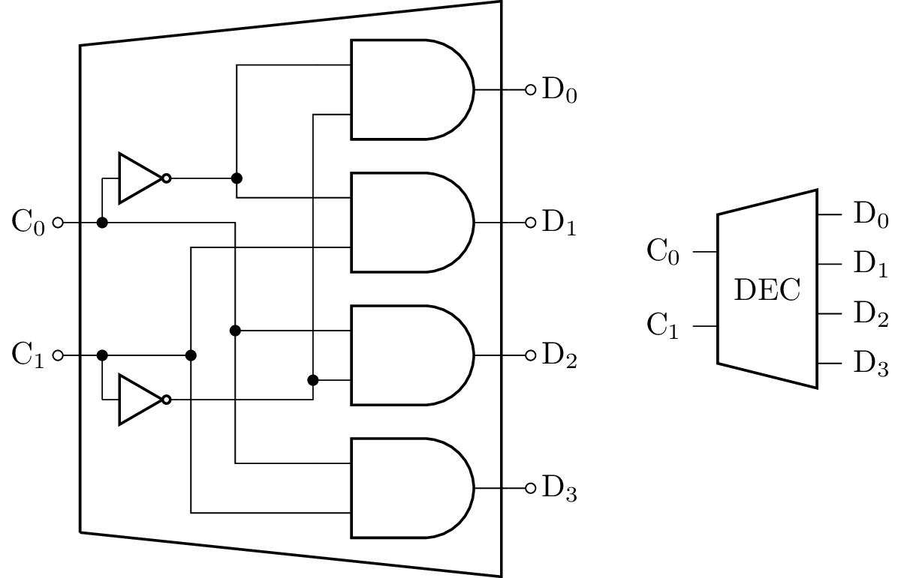</p>
<figcaption>Decodificatore 2<span class="math inline">×</span>4</figcaption>
</figure>

### Comparatore

Un comparatore è un circuito combinatorio che controlla se due stringhe in entrata sono identiche, comparando i bit omologhi delle due per valore, tramite tante porte XOR quanti sono i bit delle stringhe. Se tutti i bit sono uguali, allora ogni porta XOR restituisce 0, e quindi la porta NOR finale restituisce 1, altrimenti se restituisce 0, le due stringhe differiscono per almeno un bit.

<figure>
<p> 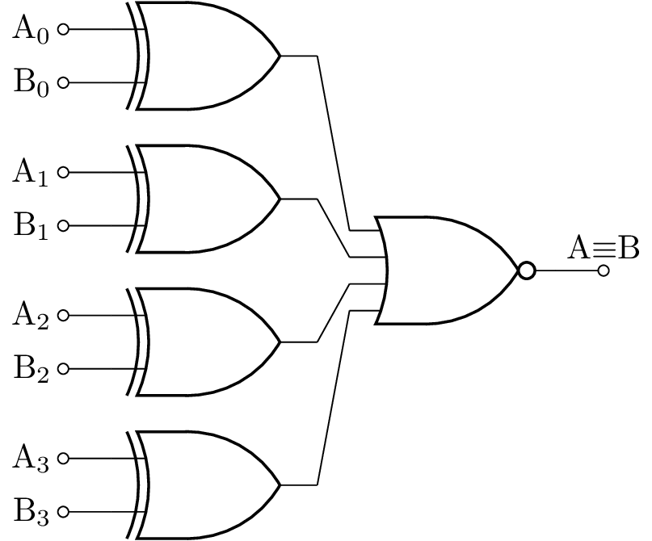</p>
<figcaption>Comparatore a 4 Bit</figcaption>
</figure>

### Shifter

Lo shifter è un circuito combinatorio in grado di traslare una data sequenza di bit in ingresso di un bit verso destra il segnale di controllo C vale uno, verso sinistra altrimenti, perdendo il bit più o meno significativo in base al tipo di spostamento effettuato.

<figure>
<p> 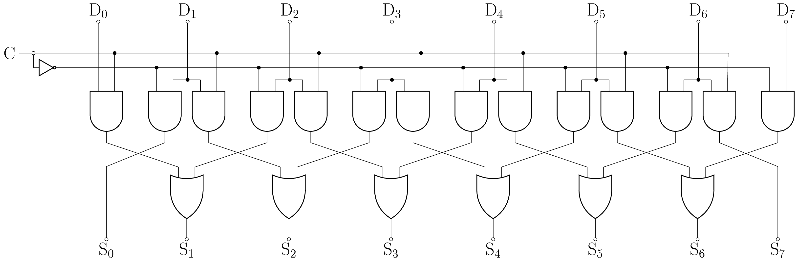</p>
<figcaption>Shifter a 8 Bit</figcaption>
</figure>

### Semi-Addizionatore

Un semi-addizionatore o “Half-Adder” è un circuito combinatorio a due uscite e due ingressi, è in grado di sommare due bit tra di loro, restituisce il valore della loro somma, ed un eventuale riporto, o carry.

<figure>
<p> 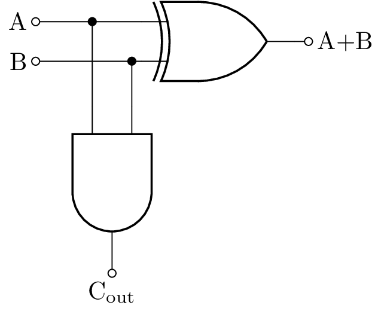</p>
<figcaption>Half Adder</figcaption>
</figure>

<div class="center">

|  A  |  B  | A+B | C$_{\mathrm{out}}$ |
|:---:|:---:|:---:|:------------------:|
|  0  |  0  |  0  |         0          |
|  0  |  1  |  1  |         0          |
|  1  |  0  |  1  |         0          |
|  1  |  1  |  0  |         1          |

</div>

Per effettuare una somma tra stringhe di più bit deve essere propagato il resto. Per effettuare questo tipo di somma si considera un “Full-Adder”

### Addizionatore

L’addizionatore è un circuito combinatorio a tre ingressi e due uscite, viene usato per effettuare la soma di numerali a più bit, poiché possiede un ingresso in più per inserire il riporto dell’addizione precedente:

<div class="center">

|  A  |  B  | C$_\mathrm{in}$ | A+B | C$_\mathrm{out}$ |
|:---:|:---:|:---------------:|:---:|:----------------:|
|  0  |  0  |        0        |  0  |        0         |
|  0  |  0  |        1        |  1  |        0         |
|  0  |  1  |        0        |  1  |        0         |
|  0  |  1  |        1        |  0  |        1         |
|  1  |  0  |        0        |  1  |        0         |
|  1  |  0  |        1        |  0  |        1         |
|  1  |  1  |        0        |  0  |        1         |
|  1  |  1  |        1        |  1  |        1         |

</div>

<figure>
<p> 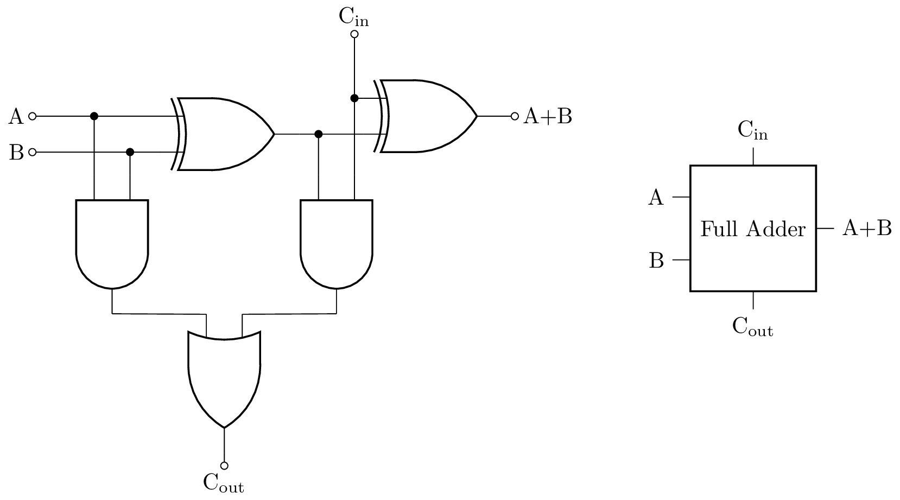</p>
<figcaption>Full Adder</figcaption>
</figure>

Per realizzare queste somme vengono collegati più Full-Adder uno dopo l’altro per effettuare la somma tra tutti i bit dei due numerali. In caso i numerali siano formati da molti bit, il tempo necessario alla propagazione del riporto è lineare con il numero di Full-Adder presenti nella catena, per cui nei processori vengono inseriti dei componenti in grado di calcolare solamente il riporto a priori, per poter effettuare la somma di tutti i bit in parallelo ed ottenere una complessità costante, invece che una complessità lineare per l’operazione.

<figure>
<p> 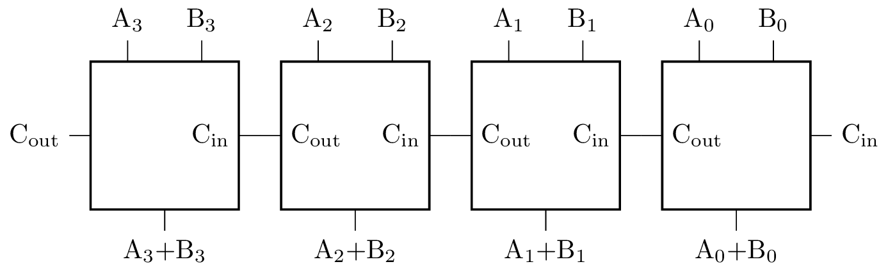</p>
<figcaption>Sommatore a 4 Bit</figcaption>
</figure>

### ALU

L’ALU è la componente logico algebrica, effettua tutte le operazioni all’interno di un calcolatore. Per realizzare ALU a più bit, si possono montare in sequenza più ALU ad un singolo bit, in grado di effettuare quattro operazioni elementari, dati due bit in input A e B:

- A AND B: 00

- A OR B: 01

- NOT B: 10

- A + B: 11

Le prime tre sono operazioni logiche implementate tramite singole porte logiche, mentre la somma si ottiene tramite un unico Full Adder. Per decidere quale operazione effettuare su un dato input vengono forniti altri due input di controllo per scegliere quale operazione F$_0$ e F$_1$ tramite un decoder di controllo. Sono presenti inoltre due porte di abilitazione per gli ingressi A e B, ed i loro due ingressi di controllo ENA e ENB. Inoltre poiché applica l’operazione di negazione sull’input B, si può disabilitare l’input A tramite il segnale INVA. Poiché viene montato in serie ad altre ALU ha bisogno di input ed output per il riporto della somma:

<figure>
<p> 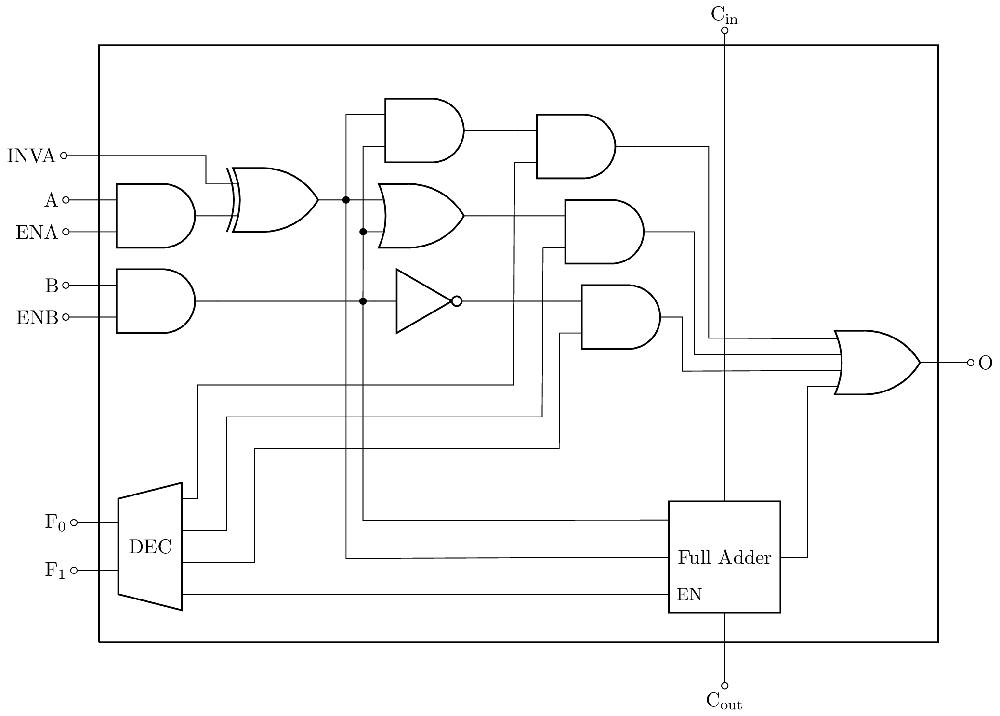</p>
</figure>

<figure>
<p> 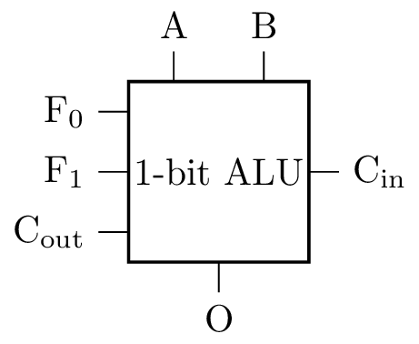</p>
<figcaption>ALU ad 1 Bit</figcaption>
</figure>

Più ALU vengono montate una dopo l’altra per ottenere un’ALU ad $n$ bit. Ogni ALU ad un bit viene chiamata un bit slice, una “fetta” dell’ALU completa:

<figure>
<p> 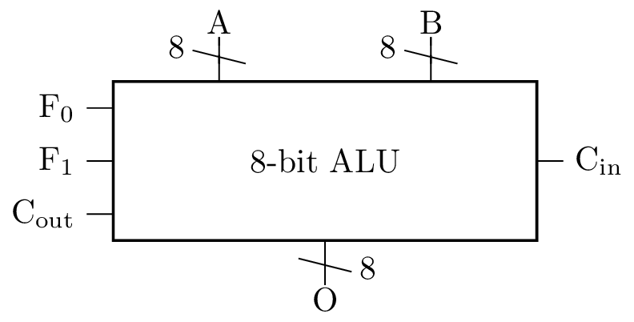</p>
</figure>

<figure>
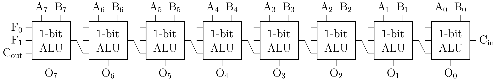
<figcaption>ALU ad 8 Bit</figcaption>
</figure>

ALU ad $n$ bit così create soffrono del problema della propagazione del riporto, poiché ogni stadio deve aspettare il riporto del precedente, di complessità lineare rispetto ad $n$. Per risolvere questo problema possono essere impiegate forme di parallelismo, dividendo l’ALU in due ALU da $n/2$ bit e duplicando la seconda metà. In questo modo si calcola la somma della seconda metà dei bit, inserendo uno zero ed un uno alle due ALU da $n/2$ in parallelo, in modo che al termine della somma tra i primi $n/2$ bit si possa scegliere, in base al riposto, l’altra metà della somma corrispondente, già calcolata. Si dimezza così il tempo necessario per effettuare una somma su $n$ bit:

<figure>
<p> 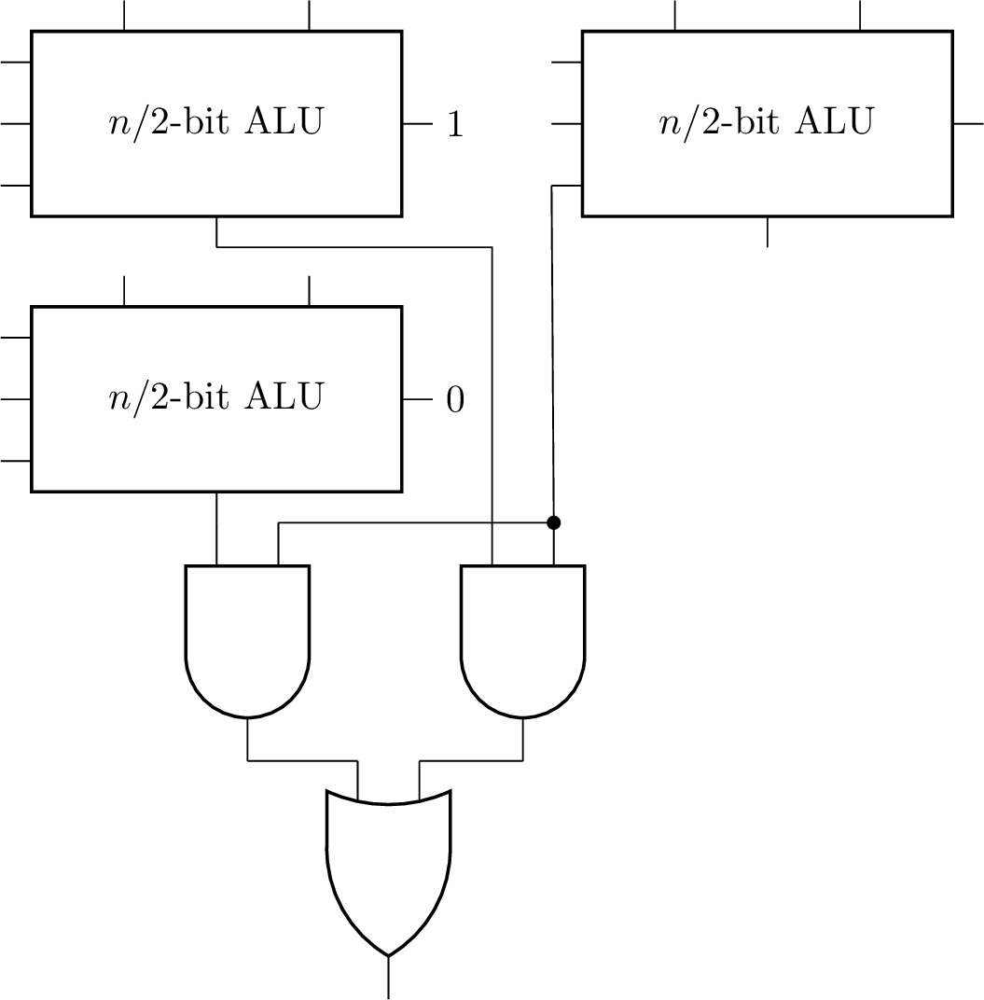</p>
<figcaption>ALU Parallelizzata</figcaption>
</figure>

### Clock

In un circuito digitale tutti i cambiamenti di stato vengono sincronizzati da un segnale di clock, realizzato da un componente digitale approssimabile ad un’onda quadra. Da un clock primario, generalmente vengono ricavati per sottrazione, sfasatura ed altre operazioni, diversi segnali, di frequenza maggiore o minore dell’originale. Si può sfasare il segnale originale semplicemente utilizzando una porta buffer, per ritardare il segnale. Tutte le transizioni di stato possono avvenire in corrispondenza dei fronti o dei livelli delle onde.

Poiché il tempo di transito di un segnale attraverso un circuito non è istantaneo, è possibile che i segnali corretti arrivino ritardati, ma alla stessa frequenza. Per cui può essere necessario inserire ritardi all’interno di un circuito digitale per ottenere l’effetto desiderato, per “aspettare” i segnali di interesse.

## Circuiti Sequenziali

I circuiti sequenziali sono circuiti digitali, contenti uno stato interno codificato delle variabili $s_j$ interne al circuito. Le uscite del circuito dipendono quindi oltre che dagli ingressi dalla storia passata del circuito, tramite le variabili $s_j$, memorizzate in elementi di memoria binari. Ad ogni transizione questi circuiti calcolano le uscite ed il nuovo valore dello stato. I circuiti sequenziali vengono quindi utilizzati per realizzare la memoria del calcolatore.

### Latch

Il Latch è un circuito sequenziale utilizzato per rappresentare un dispositivo di memoria elementare. Viene realizzato tramite due porte NOR, interconnesse con un ciclo a controreazione tra le loro uscite. Presenta due segnali in input S, set, e R, reset, ed un singolo output Q, ed il suo complemento $\overline{\mathrm{Q}}$. Presenta due stati stabili con Q=1 e Q=0. I due segnali di input S ed R si trovano a default pari a zero, ed il circuito mantiene il suo stato. Il circuito commuta sui livelli quando S o R valgono uno, e non devono mai andare entrambi ad uno, altrimenti lo stato del sistema non non è definito. In questo caso, lo stato dipende dalla prima porta a commutare nel circuito. Con S=1, si assegna Q ad uno, con R=1, si resetta lo stato, quindi si imposta Q a zero.

<figure>
<p> 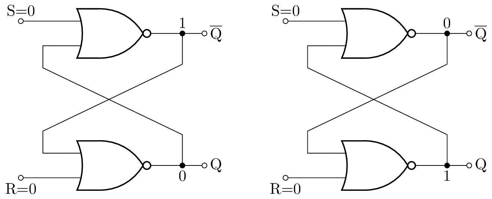</p>
<figcaption>Latch, Stati Stabili</figcaption>
</figure>

Poiché il segnale in uscita è di interessa solamente quando il clock è ad uno, si inseriscono delle porte di abilitazione a monte degli ingressi S ed R, in modo che questi segnali vengano trasferiti solamente quando il segnale di clock CK è ad uno. Vengono poi ignorati quando il clock vale 0.

<figure>
<p> 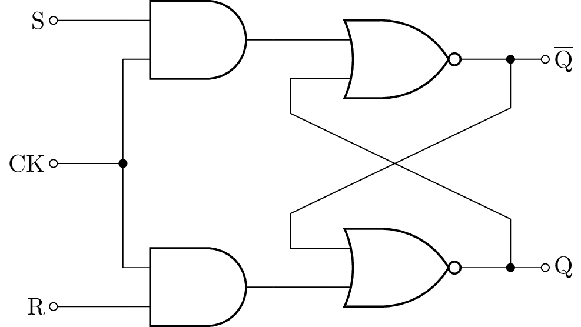</p>
<figcaption>Latch con Clock</figcaption>
</figure>

Il Latch D, “Delay”, trasferisce il valore dell’ingresso D, solamente quando il clock cambia valore e va ad uno, cambia quindi ad ogni fronte di clock, e non ad ogni livello come il Latch precedente. Il segnale di input D viene negato da una porta NOT, il valore non negato è il segnale S, mentre il segnale complementato è il segnale R.

<figure>
<p> 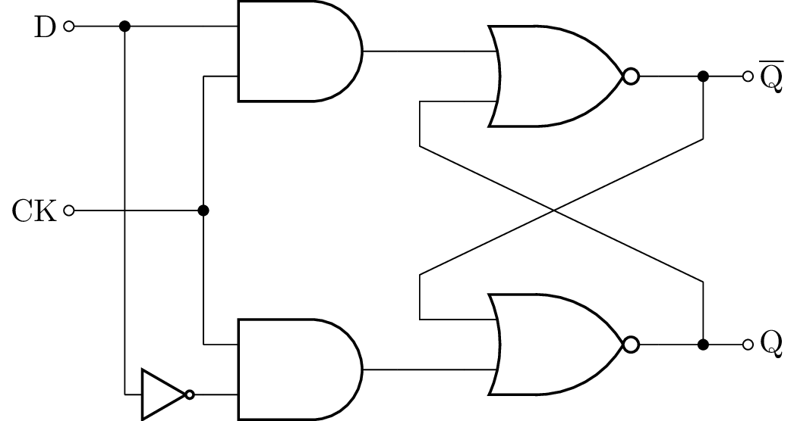</p>
<figcaption>Latch Delay</figcaption>
</figure>

I Latch possono commutare su livelli alti, o bassi, tramite una porta NOT a monte dell’ingresso del segnale di clock nel circuito:

<figure>
<p>   </p>
<figcaption>Simbolo Latch D</figcaption>
</figure>

### Flip-Flop

Un Flip-Flop è un circuito sequenziale, variante del Latch che commuta solamente sui fronti del clock, più sicura rispetto a quest’ultimi. Utilizza un generatore di impulsi, formato da una porta AND che accetta come input un segnale, ed il suo complemento. Poiché il segnale viene complementato da una porta NOT, realizzata da un transistor, il suo tempo di commutazione non è istantaneo, per cui la porta NOT viene abilitata per un intervallo di tempo molto ristretto, creando un impulso. Un flip flop viene quindi realizzato da un Latch D, inserendo un generatore di impulsi prima dell’ingresso del segnale di clock. Più la commutazione è veloce, per cui più è breve il segnale di impulso, più è sicuro il circuito.

<figure>
<p> 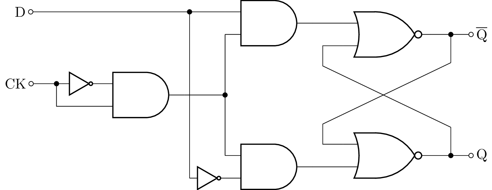</p>
<figcaption>Flip Flop D</figcaption>
</figure>

I Flip-Flop D possono commutare ad ogni fronte di salita o di discesa, semplicemente inserendo una porta NOT prima del segnale di clock. Rappresentata da un pallino nella sua rappresentazione circuitale compatta:

<figure>
<p>   </p>
<figcaption>Simbolo Flip Flop D</figcaption>
</figure>

### Chip di Memoria

I Flip-Flop sono gli elementi basi di memorizzazione del calcolatore. Ognuno viene realizzato utilizzando tra i 6 ed i 10 transistor. Ogni Flip-Flop è in grado di memorizzare un singolo bit, per cui una serie di otto Flip-Flop può memorizzare un byte. Una zona di memoria è quindi formata da vari Flip-Flop su un’unica riga per ogni word, tutti connessi ad un unico segnale di clock. Molti Flip-Flop possono essere montati su un unico chip per costruire un chip di memoria contenente varie locazioni.

<figure>
<p> 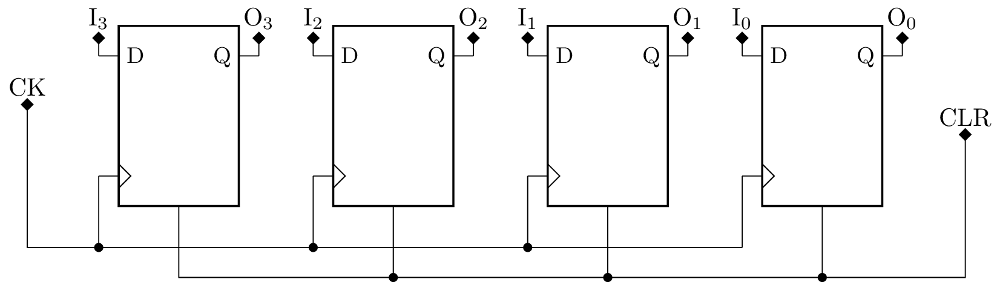</p>
<figcaption>Registro a 4 Bit</figcaption>
</figure>

Ogni registro presenta varie righe di Flip-Flop per ogni word in grado di memorizzare. Dato un registro da $n$ word, presenta $\log_2n$ linee di indirizzo per abilitare la specifica locazione di memoria. Questo viene effettuato tramite un decodificatore ed una serie di porte di abilitazione a monte dei Flip-Flop. Ogni chip di memoria inoltre presenta un segnale per specificare l’operazione da effettuare, un segnale per abilitare la lettura OE, “Output Enable”; un segnale per abilitare la scrittura WE, “Write Enable”; ed un segnale per abilitare la chip CS, “Chip Select”, un interruttore generale per l’intera chip. Può essere presente un segnale di RD, “Read”, per abilitare il segnale di clock e quindi la lettura e scrittura sul chip:

<figure>
<p> 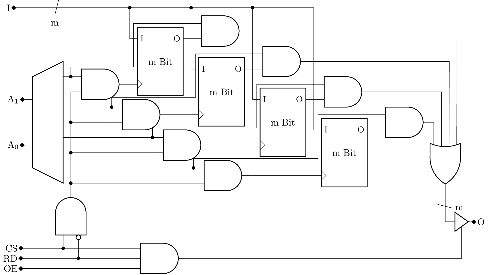</p>
<figcaption>Chip Contenente 4 Parole da m Bit</figcaption>
</figure>

La dimensione di memoria disponibile in un chip cresce molto più velocemente del numero di piedini disponibili per poterla trasferire ed indirizzare, poiché il numero dei piedini su un singolo contenitore è limitato. Per dimezzare il numero di piedini necessari al trasferimento dei dati, questi vengono inviati sulle stesse linee sia in lettura che in scrittura, tramite un dispositivo a tre stadi. Questo si comporta come un circuito chiuso o aperto, in base ad un segnale di controllo C inserito. Se questo segnale vale 1 si comporta come circuito chiuso e permette ai segnali di output di uscire, mentre se il segnale vale zero, si comporta come circuito aperto, permettendo ai segnali di input di entrare senza alterare il resto del circuito. Permette di usare gli stessi piedini del chip per ogni lettura e scrittura, in generale viene usato su qualsiasi connessione ai bus o a linee bidirezionali.

<figure>
<p> 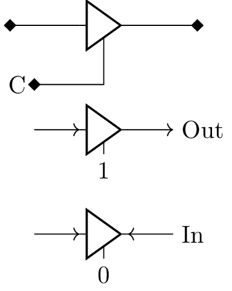</p>
<figcaption>Dispositivo a Tre Stadi</figcaption>
</figure>

Quindi per ogni chip di memoria, oltre ai tre segnali di abilitazione, sono necessari $m$ linee di dati, in base al numero di bit di una parola salvata, e $\log_2n$ linee di indirizzo, dove $n$ sono il numero di locazioni di memoria univoche all’interno dell’unico chip.

<figure>
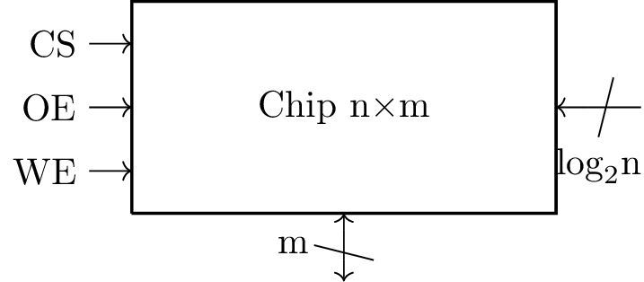
<figcaption>Chip di Memoria con n Parole da m Bit</figcaption>
</figure>

### Matrice di Selezione

Il numero dei piedini nel chip non è l’unico problema nell’indirizzamento di una specifica locazione di memoria. Un decoder a $n$ bit richiede $2^n$ porte AND per poter trasformare un input in un indirizzo. Per risparmiare nella complessità di questa operazione può essere utilizzato un sistema noto come matrice di selezione.

Si fornisce un esempio in un caso dove ogni locazione sia composta da un bit, e siano presenti da un massimo di $2^n$ parole, disposte su una matrice quadrata. Ogni bit viene quindi identificato da una coppia di coordinate, è possibile quindi dividere l’indirizzo in due metà RAS, “Raw Address Strobe” e CAS “Column Address Strobe”. Questa coppia di linee di controllo in uscita dalla matrice di selezione individua un’univoca locazione di memoria, dimezzando il numero di piedini necessari, poiché è possibile inviare le due metà dell’indirizzo in modo seriale.

<figure>
<p> 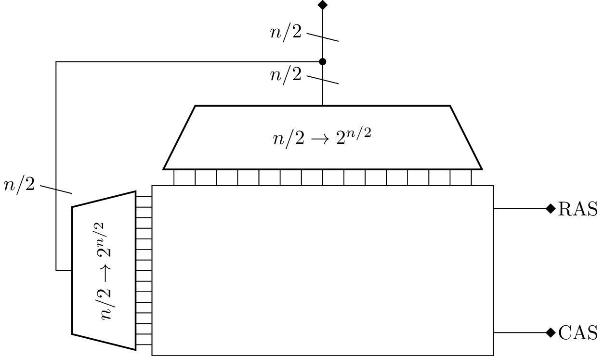</p>
<figcaption>Matrice di Selezione</figcaption>
</figure>

Inviando le due metà dell’indirizzo separatamente sugli stessi piedini, è meno efficiente, ma viene preferito in caso il chip abbia bisogno di un elevato numero di linee di trasmissione. Questa tecnica inoltre riduce notevolmente il numero di porte AND richieste per indirizzare una locazione di memoria. Utilizzando un singolo decoder a $n$ bit si richiedono $2^n$ porte AND, mentre utilizzando due decoder da $n/2$ bit sono necessarie $2^{(n/2)+1}$ porte AND, diminuendo di diversi ordini di grandezza il loro numero. Questo diminuisce di gran lunga la complessità della logica di decodifica del chip.

### Tipi di Memoria

Utilizzando questi chip possono essere realizzate diversi tipi di memorie, programmabili e non. Il tipo di memoria utilizzato come memoria centrale è la RAM, “Random Access Memory”, che permette operazioni di lettura e scrittura, ed è volatile, al contrario della ROM, “Read Only Memory”, che non può essere modificata, ma è permanente. La SRAM, “Static RAM”, è un tipo di memoria realizzata tramite Flip-Flop, per cui è molto veloce, con un tempo di commutazione di pochi nanosecondi: $t_A\approx5\,$ns, utilizzate per creare cache; la DRAM, “Dynamic RAM” invece utilizza delle capacità parassite dei condensatori, ed è quindi molto più lente $t_A\approx70\,$ns, ma a basso costo, e richiede refresh ed alta densità. La DRAM può utilizzare una matrice di selezione, FPM, oppure una pipeline in lettura e scrittura per aumentare la banda nel caso di EDO, “Extended Data Output”. La SDRAM, “Synchronous DRAM”, offre delle prestazioni migliori sincronizzando gli elementi di memoria contenuti, ha sostituito la DRAM, come tipo di memoria centrale in un calcolatore. Le memorie DDR, offrono un meccanismo di pipeline in scrittura ed in lettura, ed una frequenza di aggiornamento fino ai $3.6$ GHz, per permettere trasferimenti di dati fino a $25.6$ Gb al secondo.

Le memorie ROM per essere utilizzate devono essere scritte, per cui esistono vari modi di scrittura su una ROM, in base al suo tipo. Una PROM, “Programmable ROM”, è una memoria in grado di essere scritta, utilizzata per elettro domestici e piccoli apparecchi elettrici, e non è possibile eliminarne i dati. Altri tipi di PROM permettono la cancellazione dei dati salvati, per realizzare prototipo, tramite raggi UV le EPROM, “Erasable PROM”, ed elettricamente le EEPROM, “Electrical EPROM”.

Le memorie flash sono tipi di EEPROM, utilizzate nelle SSD, con un ciclo di $50\,$ns, ed un numero di scritture massime limitato.

Utilizzando un chip di memoria PROM è possibile realizzare circuiti logici arbitrari, tramite le FPGA, “Field Programmable Gate Array”. Questi dispositivi contengono due componenti duplicati, una tavola di verità, memorizzata in una piccola zona di memoria, chiamata LUT, “LookUp Tables”, che permettono di realizzare una qualsiasi funzione booleana. Ed un sistema di connessioni programmabili per gestire gli input e gli output di questa funzione.

# Bus

I bus sono canali di comunicazioni tra le varie componenti di un calcolatore, possono essere interni, non standardizzati, o esterni, standardizzati, ai suoi singoli componenti. Vengono realizzati da linee stampate sul silicone della scheda madre del calcolatore, in generale è sempre presente un bus dedicato per la comunicazione tra la CPU e la memoria centrale, ed almeno un bus condiviso per la gestione dell’IO. I bus esterni sono standardizzati per permettere a dispositivi realizzati da costruttori diversi di comunicare senza problemi.

La comunicazione su un bus viene sempre regolata da un protocollo, secondo cui sono presenti solo due dispositivi che assumono uno il ruolo di master, che regola la trasmissione, e di slave. Uno stesso dispositivo può assumere ruoli diversi in base alla connessione. I vari dispositivi sono connessi al bus tramite un bus transceiver, realizzato tramite dispositivo a a tre stati, oppure di tipo open collector, più semplice realizzato da un OR logico sulle linee del bus. Non tutte le comunicazioni sul bus devono passare necessariamente per la CPU, infatti per i dispositivi di IO, è permesso accedere direttamente alla memoria centrale, DMA.

La larghezza di banda di un bus corrisponde al numero di linee parallele che lo compongono. Possono essere presenti linee separate di indirizzo o di controllo per specificare l a locazione di memoria, e linee di dati, dove vengono trasferiti i dati letti dal dispositivo slave. Si indica con banda di trasferimento il numero di linee moltiplicato per la velocità di trasferimento. La scelta corretta per aumentare la banda di trasferimento non è sempre aumentare il numero di linee, poiché all’aumentare della velocità aumenta il bus skew, ovvero le linee più veloci dovranno sempre aspettare le linee più lente, creando un ritardo costante nella trasmissione dei dati, per cui per bus moderni si preferisce una trasmissione seriale dei dati per non essere limitati da questo fenomeno.

## Bus Sincrono ed Asincrono

Quando la trasmissione è regolata rispettando un clock, si parla di bus sincrono, dove le varie operazioni di una trasmissione dipendono dall’intervallo di tempo passato. Per cui viene di un bus vengono forniti i tempi o cicli di clock in cui i comandi vengono asseriti ad ogni passaggio della comunicazione. Sono sempre presenti delle linee di indirizzo ADDR, e dei dati DATA. Inoltre sono presenti linee di controllo per aspettare che i dati siano stabili sulle linee dei dati quando il segnale di WAIT viene mandato a zero, asserito per un numero intero di cicli di clock prima di poter leggere i dati, considerando il tempo necessario allo slave per fornire i dati richiesti. Altre due linee RD e MREQ indicano l’operazione di lettura che si sta effettuando, quando sono asseriti, e durano fino a quando non viene terminata l’operazione. Le specifiche del bus indicano quanto tempo trascorre dalla negazione del segnale WAIT alla lettura dei dati alla terminazione dell’operazione di lettura e la negazione dei segnali RD e MREQ e della permanenza dei dati sul bus. In generale questi segnali di controllo vengono inviati negati, per cui si tratta di $\overline{\hbox{RD}}\m@th$, $\overline{\hbox{MREQ}}\m@th$, $\overline{\hbox{WAIT}}\m@th$. Questo protocollo temporizzato deve rispettare le caratteristiche dei dispositivi utilizzati nella trasmissione, in generale il segnale di WAIT viene mantenuto asserito per interi di cicli di bus, e determina la durata complessiva della trasmissione, mentre i segnali di RD e MREQ vengono asseriti al fronte di discesa del clock.

<figure>
<p><br />
</p>
<figcaption>Bus Sincrono</figcaption>
</figure>

Si parla invece di bus asincroni, quando non sono regolati da un clock interno, per permettere la comunicazione di dispositivi che utilizzano frequenze diverse. Per permettere la comunicazione quindi i due dispositivi devono inviarsi segnali di sincronizzazione. Si ha un sistema ad eventi, dove ogni evento avviene in risposta ad altri eventi, tramite asserzioni di segnali di controllo e o sincronizzazione. Oltre ai segnali descritti per i bus sincroni sono presenti altri due segnali di controllo MSYN, asserito dal master per avvertire lo slave che ha effettuato un’operazione. In seguito dopo che il dispositivo slave ha caricato i dati richiesti sul bus, asserisce il segnale SSYN per indicare che i segnali sono pronti sul bus. Non è quindi necessario un esplicito segnale di WAIT, poiché l’attesa per la stabilità dei dati viene indicata direttamente dal dispositivo slave. Anche questi due segnali vengono trasmessi negati $\overline{\hbox{MSYN}}\m@th$ e $\overline{\hbox{SSYN}}\m@th$.

<figure>
<p><br />
</p>
<figcaption>Bus Asincrono</figcaption>
</figure>

## Arbitraggio

Quando sono presenti solo due dispositivi sullo stesso bus non è necessario un criterio per determinare a quale dispositivo sia permesso comunicare, ma per bus di IO spesso sono connessi più dispositivi e bisogna stabilire quale dispositivo possa utilizzare il bus, risolvendo eventuali conflitti. L’arbitraggio di un bus spesso viene gestito da un chip dedicato nel microprocessore. Ogni dispositivo connesso al bus, è connesso anche a delle linee di richiesta per l’utilizzo del bus. Inoltre è presenta una linea di bus grant per fornire ad uno dei dispositivi il permesso di utilizzare il bus. Questa linea viene propagata a partire dall’arbitro formando una catena che connette tutti i dispositivi connessi al bus. In questo modo il primo dispositivo che ha richiesto il bus intercetta questo segnale di grant e lo nega per il resto della catena. I conflitti vengono risolti favorendo i primi dispositivi connessi, ma questo non è un metodo efficiente, poiché non viene specificato l’ordine delle porte di un calcolatore.

Per cui si realizza un arbitraggio a più livelli di priorità, dove sono presenti più linee di richiesta e di grant, per ogni livello di priorità. Entrambe connesse come l’arbitraggio normale, ed i conflitti vengono risolti favorendo le linee ad alta priorità, ma all’interno della stessa catena di priorità vale la posizione.

In generale viene data priorità ai dispositivi più lenti, anche se lo stesso bus è connesso alla CPU o alla memoria centrale. In caso un dispositivo non viene permesso di accedere al bus per un certo periodo di tempo il sistema operativo gli permette di comunicare assegnando un livello di priorità più alto a questo dispositivo, per evitare ai dispositivi di dover aspettare tempi infiniti.

In casi semplici di applicazioni embedded, il processore stesso è l’arbitrio. Utilizzando un numero di linee di priorità pari al numero dei dispositivi connessi al bus si può realizzare un disaccoppiamento completo tra i dispositivi.

L’arbitraggio completamente opposto consiste nell’escludere l’arbitrio, utilizzando un arbitraggio decentralizzato. In questo tipo di arbitraggio sono presenti oltre alla linea di richiesta, una linea che indica che il bus è occupato “busy”, ed una linea di arbitraggio alimentata da una tensione costante dall’esterno connessa a catena tra tutti i dispositivi connessi, quindi sempre asserita. Quando un dispositivo ha necessità del bus invia una richiesta di bus, e verifica che sia libero, se è libero e la linea di arbitraggio è asserita asserisce la linea busy, diventa master e nega la linea di arbitraggio. In caso la linea di arbitraggio è negata, non diventa master e nega la stessa linea in uscita.

## PCI e PCIe

Mentre la banda di un bus si misura in bit per secondo, la sua velocità di trasmissione si quantifica in byte per secondo. In generale l’operazione che richiede una banda costante ed elevata è la visualizzazione a schermo del video. Considerando un video HD con una risoluzione di 1080p con 3B per ogni pixel, ogni frame pesa $\sim$<!-- -->5.2MB, quindi 60 frame al secondo necessitano di una velocità di trasmissione di 310 MB/s, mentre per visualizzare a schermo il video con queste specifiche, prima bisogna spostarlo nella memoria principale, ed in seguito nella memoria video VRAM, quindi è necessaria una velocità di trasmissione doppia 620 MB/s.

I primi standard di bus furono l’ISA ed il successivo EISA, entrambi con una frequenza di 8.33 MHz, il primo riesce a trasferire 2 byte per ciclo, con una velocità quindi di 16.7 MB/s, mentre il secondo standard ha una velocità doppia di 33.3 MB/s, insufficiente per poter visualizzare un video in HD. Negli anni ’90 la Intel creò lo standard dei bus PCI, “Peripheral Component Interconnect”, con una velocità fino a 528 MB/s, incorporando un meccanismo di pipeline nella trasmissione dei dati e delle istruzioni. Alla fine degli anni ’90 l’Intel introdusse lo standard AGP, “Advanced Graphics Port” per aumentare le prestazioni delle schede grafiche, ottenendo prestazioni quattro volte migliori di un bus PCI, con velocità fino a 2.1 GB/s. Per bus moderni si preferisce utilizzare la nomenclatura “Initiator” e “Target”, invece di slave e master.

Il bus PCI è un bus sincrono con una frequenza di aggiornamento di 33 o 66 MHz, con una transizione di scrittura più compatta, avendo un ciclo di idle tra due transizioni, utilizzando la linea AD sia per gli indirizzi sia per i dati, e la linea di controllo sia per specificare il comando e abilitare l’operazione.

Il bus PCI incorpora forme di parallelismo delle linee, ma questo rappresenta un limite per la banda totale del bus, a causa del fenomeno del bus skew. Per cui nel 2004 venne introdotto il PCIe, “PCI express”, una forma di PCI più veloce, che utilizza una comunicazione seriale, dove il limite massimo per la banda dipende solamente dalla frequenza del bus, raggiungendo i 20 GB/s ed oltre. Poiché comunica con uno slot più piccolo, la comunicazione tra dispositivi avviene tramite uno switch, collegando i singoli dispositivi attraverso una coppia di connessioni seriali punto a punto. Un singolo slot può accogliere più di una singola connessione PCIe, quindi una stessa scheda può contenere diversi dispositivi connessi indipendentemente tra di loro.

I dati vengono trasmessi come in una rete di computer, divisi in pacchetti con un header, il dato salvato nella payload ed un codice di correzione CRC per aumentare l’affidabilità. Quindi i cavi possono essere prodotti di lunghezza maggiore. Nella versione 6.0 con uno slot dotato di 16 connessioni seriali è possibile raggiungere una banda massima di 120 GB/s. Ma utilizzando più bus PCIe in parallelo si verifica il fenomeno del bus skew, per cui la banda è minore di questo valore ideale.

Inoltre in base alla dimensione dei buffer per i pacchetti è presente un controllo del flusso. In generale sono possibili quattro spazi di indirizzamento, per la memoria, per dispositivi di IO, per la configurazione e per eventuali messaggi. La trasmissione avviene su un protocollo multistrato formato da quattro livelli lungo coppie di corsie, dividendo ogni pacchetto in una decina di bit. Il primo livello del software permette la retrocompatibilità e gestisce i pacchetti; nel livello di transizione viene inserito l’header ed i dati del pacchetto; nel livello di connessione viene inserito un numero di sequenza per poter ricostruire il pacchetto in testa al pacchetto, ed un codice di correzione in fondo al pacchetto; nel livello fisico infine il pacchetto viene incapsulato dal frame tramite cui viene inviato sulle linee fisiche del bus, e poi viene letto in ordine inverso, livello per livello per ottenere il dato.

## USB

Lo standard USB, “Universal Serial Bus”, venne concordato da varie aziende per la gestione di dispositivi di IO a bassa velocità negli anni ’90. Ma le versioni moderne dei bus USB permettono una banda sui 10 GB/s ed oltre. Gli obiettivi principali di questo standard, che furono tutti raggiunti, comprendevano l’assenza di uno switch centrale, un’installazione del bus di tipo esterno, con un cavo di connessione unificato che fornisce l’alimentazione stessa, con un connettore standardizzato. Inoltre è possibile collegare fino a 127 dispositivi simultaneamente, ed è in grado di supportare dispositivi real-time, che necessitano di tempi di aggiornamento stretti. L’aspetto più importante consiste nella possibilità di connettere un nuovo dispositivo a PC accesso, senza effettuare un reboot per riconoscere il dispositivo o realizzare una connessione al bus. Infine si è rispettata l’esigenza di realizzare i bus ed i dispositivi utilizzanti a prezzi economici. Sono disponibili tre possibili connettori A, B e C, ormai l’USB di tipo C sta diventando il tipo di connessione favorita a livello globale per applicazioni mobile, e sta soppiantando i connettori di tipo A per la comunicazione. La particolarità del tipo C è la simmetria del connettore per rendere irrilevante il verso in cui viene inserito. La banda massima è andata sempre ad aumentare con il passare degli anni, ora con USB4 2.0 si riescono a raggiungere bande di 120 Gb/s.

Per comunicare sul bus si considera sempre un root hub, potenzialmente ogni dispositivo può essere eletto a root hub, oppure hub di livello inferiore se ad esso vengono collegati altri dispositivi tramite bus USB. In questo modo si crea un’albero avente come radice il root hub, ed ogni dispositivo che vuole comunicare invia i suoi dati attraverso questo bus al suo hub fino a raggiungere la radice. Il cavo del bus è composto nella versione più semplice da una tensione a +5V, una connessione a massa e due linee di segnale. Quando viene connesso un dispositivo interviene il sistema operativo tramite interrupt, per non riavviare il sistema, ed il dispositivo richiede una certa banda, e gli viene assegnato un indirizzo dal SO per mantenere un inserimento a caldo dei dispositivi.

Ogni connessione tra root hub e dispositivo è dedicata, mediata da vari hub intermedi. Oltre all’USB venne introdotto uno standard competitivo, ormai caduto in disuso, il FireWire IEEE 1394, anch’esso seriale.

Come per i bus PCIe i bus vengono incapsulati all’interno di un frame, emesso sempre ogni millisecondo con un errore del 5% massimo. Questa frequenza di trasmissione è fissa per ogni dispositivo USB. Se non avviene una trasmissione si ha un idle frame contenente solamente il dato SOF, “Start Of Frame”, per segnalare l’inizio del frame. Quando invece è presente una comunicazione, oltre a questo pacchetto vengono inseriti altri pacchetti, dalla radice il pacchetto IN o OUT per richiedere la lettura o scrittura, ed il pacchetto ACK o NACK finale per eventuali errori o per il riconoscimento. Il dispositivo connesso invece crea il pacchetto di dati, contenente il numero del pacchetto SYN, per ricostruirlo, il numero del processo assegnato PID, il dato salvato nella PAYLOAD, ed un codice di correzione di errore CRC.

Invece delle interruzioni per le trasmissioni viene utilizzato il polling, ovvero periodicamente vengono analizzate tutte le periferiche per individuare se qualcuna ha inviato dei frame, ed eventualmente effettuare l’operazione di lettura o scrittura. Poiché questo controllo viene effettuato dal calcolatore può rallentare il calcolo, ma permette di gestire i dispositivi connessi sia come hardware che come software, non permesso dall’uso esclusivo degli interrupt.

# Microarchitettura di una CPU

Al livello della microarchitettura si studia come la CPU implementi le istruzioni macchina utilizzando dispositivi digitali, come registri, ALU, etc. analizzati precedentemente, senza considerare le specifiche realizzative. Ora astratti e considerati come scatole nere. Questa descrizione considera il flusso dei dati attraverso questi componenti diversi.

In generale il data path di una generica microarchitettura di una CPU è formata da una serie di registri che contengono l’operazione gli operandi ed il loro risultato, un’ALU dei registri di output ed input all’ALU e bus interni per collegare questi componenti. Inoltre sono presenti alcune linee di controllo per selezionare l’operazione da effettuare nel’ALU e quali registri abilitare in entrata ed in uscita. La gestione delle istruzioni viene affidata ad una sezione dedicata al controllo nella CPU, diversa in base al tipo di architettura RISC o CISC. Nell’esecuzione diretta, le istruzioni vengono eseguite direttamente dalla microarchitettura e realizzano esecuzione molto efficiente, ma un’architettura complessa. Mentre nell’esecuzione per interpretazione la microarchitettura sa eseguire solo microistruzioni e l’istruzione completa deve essere quindi scomposta, da una componente di controllo più semplice.

Per studiare il comportamento di una microarchitettura si considera un’implementazione della JVM, “Java Virtual Machine”, con sole istruzione su interi. Storicamente non si è implementata in hardware, poiché erano già presenti architetture molto diffuse. Per implementarla bisogna realizzare il data path, la temporizzazione dell’esecuzione, l’accesso alla memoria ed alla cache, il formato delle microistruzioni e la sezione di controllo. Si considera un’architettura CISC a 32 bit, con 8 bit per le istruzioni.

## Data Path

Il data path è composto da una serie di registri e l’ALU. I primi quattro registri sono responsabili della comunicazione con la memoria centrale. Rappresentano una coppia di registri sempre presenti in ogni processore. La prima coppia MAR, “Memory Address Register”, e MDR, “Memory Data Register”, contengono l’indirizzo di memoria del dato, il primo, ed il dato contenuto in quell’indirizzo viene salvato nel secondo registro. La seconda coppia effettua lo stesso processo per memorizzare le istruzioni, il PC indica quale istruzione sta venendo eseguita, ed il MBR, “Memory Buffer Register”, contiene l’istruzione di 8 bit, in figura rappresenta un quarto di un registro normale. Questi quattro registri sono sempre utilizzati per la lettura e la scrittura verso l’esterno. I successivi registri sono di uso generale e la loro denominazione dipende dalla specifica architettura, vengono utilizzati per memorizzare dati parziali, ognuno con un nome simbolico per la sua specifica funzione. Per semplicità di controllo si utilizza un registro accumulatore H, “Holding register”, che contiene sempre un operando dell’operazione, mentre il secondo operando viene inviato all’ALU dal bus B. Questo rappresenta anche un vincolo per cui è sempre necessario memorizzare uno dei due operandi in H. A valle dell’ALU si utilizza uno shifter per permettere di traslare l’output di un bit, può essere necessario quando si effettuano operazioni su virgola mobile e bisogna traslare la mantissa.

Poiché il bus B è condiviso tra tutti i registri sono necessari segnali di abilitazione, in figura in grigio, per permettere ad un singolo dato di essere spostato all’ingresso dell’ALU. Oltre a questi segnali di controllo ad ogni registro viene associato un segnale di controllo, in figura in nero, per abilitare l’input nel registro, per memorizzare il dato in uscita sul bus C. Possono essere abilitati in questo modo più di un registro, per salvare il risultato parziale. Un altra linea di controllo da 6 bit sceglie l’operazione necessaria sull’ALU. Inoltre lo shifter all’inizio del bus C richiede due segnali di controllo per stabilire l’operazione da effettuare, o non effettuare in caso non si voglia traslare il dato.

<figure>
<p> 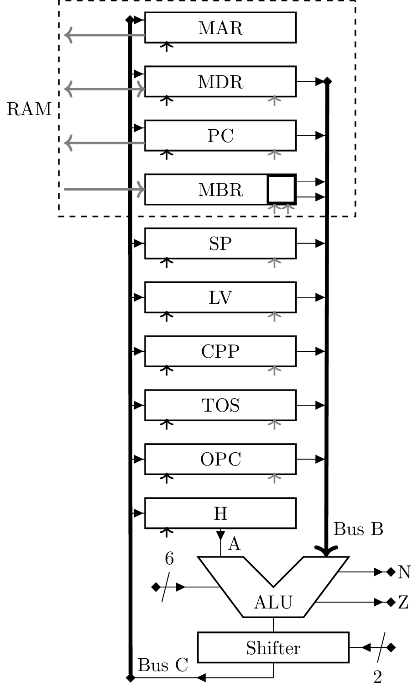</p>
<figcaption>Data Path</figcaption>
</figure>

Il PC viene incrementato utilizzando questo stesso data path, salvando un 1 nel registro accumulatore e sommandolo al contenuto attuale del PC, poiché nella maggior parte dei casi le istruzioni sono salvate in locazioni contigue della memoria.

Per l’ALU si considera un’ALU a 32 bit realizzata da 1 bit slices come l’ALU trattata in precedenza. Questa presenta quindi sei input di controllo per ottenere 16 operazioni diverse:

<div class="center">

| F$_0$ | F$_1$ | ENA | ENB | INVA | INC |         Operazione         |
|:-----:|:-----:|:---:|:---:|:----:|:---:|:--------------------------:|
|   0   |   1   |  1  |  0  |  0   |  0  |             A              |
|   0   |   1   |  0  |  1  |  0   |  0  |             B              |
|   0   |   1   |  1  |  0  |  1   |  0  | $\overline{\hbox{A}}\m@th$ |
|   1   |   0   |  1  |  1  |  0   |  0  | $\overline{\hbox{B}}\m@th$ |
|   1   |   1   |  1  |  1  |  0   |  0  |            A+B             |
|   1   |   1   |  1  |  1  |  0   |  1  |           A+B+1            |
|   1   |   1   |  1  |  0  |  0   |  1  |            A+1             |
|   1   |   1   |  0  |  1  |  0   |  1  |            B+1             |
|   1   |   1   |  1  |  1  |  1   |  1  |            B-A             |
|   1   |   1   |  0  |  1  |  1   |  0  |            B-1             |
|   1   |   1   |  1  |  0  |  1   |  1  |             -A             |
|   0   |   0   |  1  |  1  |  0   |  0  |          A AND B           |
|   0   |   1   |  1  |  1  |  0   |  0  |           A OR B           |
|   0   |   1   |  0  |  0  |  0   |  0  |             0              |
|   1   |   1   |  0  |  0  |  0   |  0  |             1              |
|   1   |   1   |  0  |  0  |  1   |  0  |             -1             |

</div>

I valori di default dei segnali di controllo sono ENA ed ENB entrambi asseriti ed INVA asserito basso, a 0.

La temporizzazione del data path dipende dal tipo di architettura RISC o CISC, e dipende se ogni microistruzione impiega un ciclo di clock per essere eseguita.

In generale in un singolo ciclo di clock, dal fronte di discesa vengono asseriti i segnali di controllo per abilitare il ciclo, e vengono passati i valori sul bus B e dal registro accumulatore all’ALU. Dopo che l’ALU ha elaborato i dati ed inviato il suo contenuto sullo shifter, dopo che i dati sono stabili su questo componente vengono propagati dal bus C a tutti i registri abilitati in input. Nel fronte di salita quindi vengono salvati i dati dal bus C ai registri e dalla memoria centrale ai registri associati. Viene quindi incrementato il PC o il MPC, “Micro PC”, se si tratta di microistruzioni, per caricare nel fronte di discesa corrispondente al ciclo di clock successivo la nuova istruzione nell’IR o MIR, “Micro IR”.

I tempi di assestamento dei segnali di controllo dell’ALU e dello shifter, di propagazione lungo il bus B e C possono essere analizzati come sottocicli, impliciti. Un singolo ciclo ci clock corrisponde sempre ad un passaggio per il data path.

## Micro-Istruzioni

Una microistruzione per un processore di architettura CISC avente questo data path deve avere 36 bit per accomodare tutti i segnali di controllo e le informazioni necessarie per la microistruzione successiva. Sono necessari 9 bit per la selezione dei registri da abilitare i registri sul bus C, e altrettanti per abilitare i registri in uscita sul bus B. Poiché i registri sul bus B possono essere abilitati solo uno alla volta, si possono utilizzare solamente quattro bit connessi ad un decodificatore per abilitare uno solo dei registri. Sono necessari 8 bit per scegliere le funzioni dell’ALU e dello shifter, 2 per la lettura e scrittura dei dati, ed un bit per la lettura delle istruzioni. Inoltre bisogna indirizzare la microistruzione successiva, tramite 9 bit, con un massimo di 512 microistruzioni indirizzabili. Inoltre servono 3 bit per definire la scelta dell’operazione da eseguire, read, write o fetch, per recuperare l’istruzione dalla memoria centrale.

Una microistruzione è composta da sei sezioni:

- Addr (9 bit): Contiene l’indirizzo della prossima microistruzione;

- JAM (3 bit): Sceglie la prossima microistruzione e permette di effettuare salti date configurazione dei suoi tre bit JMPC, JAMN e JAMZ;

- ALU (8 bit): Imposta i sei comandi per l’ALU già discussi, ed i due bit per configurare i comandi dello shifter SLL8 e SRA1;

- C (9 bit): Abilita i registri per memorizzare il contenuto del bus C;

- M (3 bit): Corrisponde alle istruzioni di controllo per la memoria, WRITE, READ e FETCH;

- B (4 bit): Indica quale indirizzo da inviare su B.

Il contenuto di B viene inviato ad un decodificatore, ed i registri validi corrispondono ai primi nove valori da 0 a 8, mentre per valori da 9 a 15 non corrisponde un registro valido.

Per creare questi bit, è presente una memoria dove viene contenuto il microprogramma per creare la microistruzione, composto da 512 locazioni da 36 bit, che conservano tutte le possibili microistruzioni eseguibili dal processore. Si utilizza un MPC per trasformare una singola istruzione contenuta nel MBR in una serie di microistruzioni, corrispondenti all’implementazione dell’istruzione.

Per eseguire una microistruzione quindi viene incrementato il MPC, mentre il MIR contiene la microistruzione corrente. Il contenuto del MPC diventa stabile sul livello alto del clock, a quel punto è pronto per essere eseguito nel periodo successivo, e viene caricata nel MIR sul fronte di discesa dell’impulso di clock.

Il comando JMPC, “Jump to PC”, indica che la prossima istruzione da essere eseguita non è una microistruzione, ma la prossima istruzione contenuta nel PC, inoltre può realizzare istruzioni condizionali. Per implementarle a livello di hardware si utilizzano le due uscite della ALU N, “Negative”, e Z, “Zero”, salvati in flip flop, ed in base al contenuto del JMPC, è possibile alterare il contenuto del MPC per saltare da un’istruzione ad un’altra.

Per un’architettura RISC, all’arrivo di un’istruzione viene generata la sequenza di bit, tramite un semplice decodificatore di istruzioni, che implementa un’istruzione macchina, molto meno complesso del microprogramma presente nelle architetture CISC, e appena viene eseguita, ne viene caricata un’altra sul PC, salvando quindi sulla complessità interna del processore.

In questo processore si assume che ogni microistruzione viene eseguita in un singolo ciclo di clock, per realizzare un unico ciclo macchina, implementando l’intero data path, dal registro di partenza al registro di destinazione, dopo aver eseguito le operazioni necessarie. Per cui per realizzare un’istruzione macchina, viene caricata nel PC l’istruzione in un ciclo di clock, e tutti gli altri cicli successivi realizzano le microistruzioni nel registro MPC, fino alla fine della sequenza di queste microistruzioni, oppure se si vuole realizzare un’istruzione condizionale.

Il dato JAM rappresenta tre bit JAMPC o JMPC, JAMN “Jump if Negative” e JAMZ, “Jump if Zero”. Se ogni bit di JAM vale zero non vengono eseguiti salti, se invece JMPC vale uno, allora gli 8 bit bassi di Addr vengono passati ad un OR con il contenuto del MBR, in questo modo vengono realizzati salti condizionati in tutto il Control Store. Altrimenti il bit più alto di Addr è dato da: $$\mbox{(JAMZ AND Z) OR (JAMN AND N) OR Addr[8]}$$

<figure>
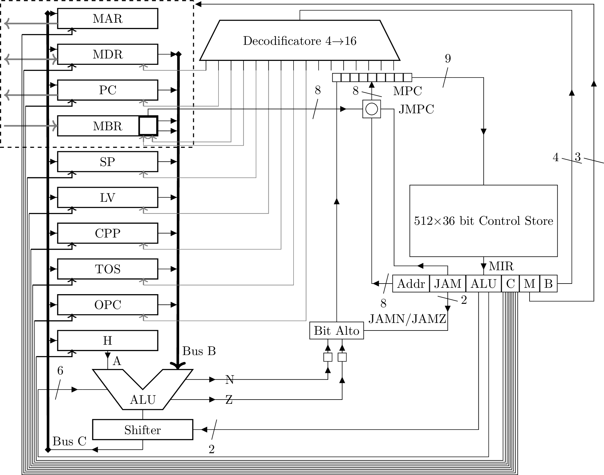
<figcaption>Microarchitettura CISC</figcaption>
</figure>

In caso di un’architettura RISC al posto del control store è presente un decodificatore di istruzioni per realizzare le rispettive microistruzioni.

## Forme di Parallelismo

Per migliorare le prestazioni bisogna massimizzare il rapporto velocità/prezzo. Per migliorare le prestazioni si considerano tre approcci, l’approccio di aumentare la frequenza di clock è stata abbandonata recentemente, per le risorse necessarie da affidare al raffreddamento del processore. Gli altri due approcci possibili consistono nell’inserire forme di parallelismo fisico, nella forma di componenti dedicate o duplicare le componenti già presenti, ed introducendo un meccanismo di pipeline nel data path.

Il PC deve solo essere incrementato, e l’unico modo consiste nell’utilizzare un ciclo macchina per incrementare il suo valore e memorizzarlo sul suo registro, per risparmiare questo ciclo macchina ogni volta che viene eseguita un’istruzione, si introduce una componente dedicata al caricamento di un’istruzione, la IFU “Instruction Fetch Unit”. Utilizza due registri di istruzioni, con due possibili formati da 8 bit, ed uno da 16 bit, associati a due registri delle istruzioni MBR1 e MBR2. Dentro quest’unità sono presenti dei contatori in grado di memorizzare quest istruzioni, ed effettua operazioni di “pre-fetching”, per caricare più istruzioni insieme, realizzando una coda di istruzioni salvate nei due registri interni, in modo che è sempre presenta un’istruzione successiva ad eseguire appena viene terminata l’esecuzione della precedente.

<figure>
<p> 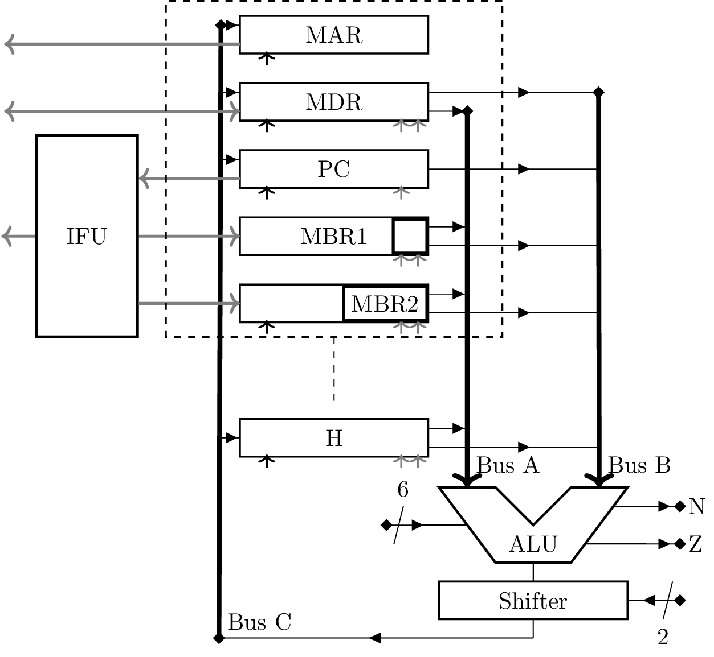</p>
<figcaption>Data Path con IFU</figcaption>
</figure>

Il resto del data path rimane invariato, ma per evitare il collo di bottiglia sul registro accumulatore sono presenti due linee di bus, parallele collegate all’ALU, per aumentare le prestazioni. Per cui sono necessarie due linee di controllo su ogni registro per scegliere tra i due registri. L’architettura è quindi più complessa nella sezione di controllo, raddoppiando i bit necessari per il caricamento sul bus A e B.

In questo modo si riduce il numero di cicli macchina, ovvero attraversamento del data path, a costo di una maggiore complessità del sistema.

Per introdurre un meccanismo di pipeline in questo sistema bisogna considerare la gestione del lavoro in stati autonomi rispetto agli altri. L’IFU è uno di questi stati completamenti autonomi, per cui rappresenta il primo stadio di una possibile pipeline. Per realizzare a livello di hardware degli stadi del data path si introducono inserendo delle frontiere, dei semplici registri, in entrata ed in uscita dall’ALU, per dividere il data path in diversi stadi autonomi. L’ultimo stadio è quindi il passaggio ai registri di partenza del data path. In questo modo si sono definiti esplicitamente quattro stadi che il processore deve eseguire per realizzare un data path.

<figure>
<p> 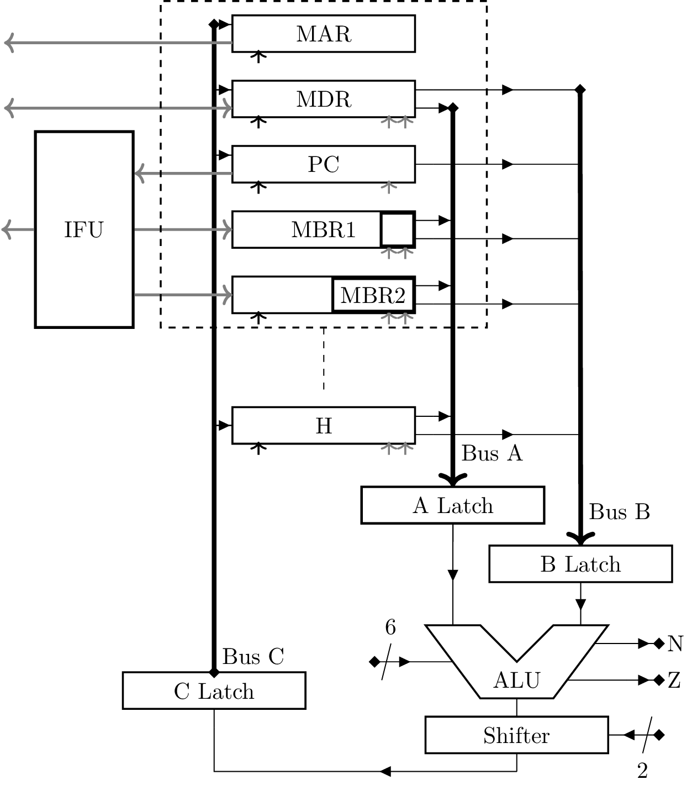</p>
<figcaption>Data Path con Pipeline</figcaption>
</figure>

## Memorie Cache

All’interno del chip del processore sono presenti locazioni di memoria cache per non limitare la CPU dalla velocità della memoria. La vicinanza spaziale tra questi componenti permette di aumentare la velocità di lettura e scrittura.

Nelle cache vengono memorizzate locazioni contigue di memoria, poiché si ha alta probabilità di accedere ad indirizzi molto vicini, e di accedere più volte agli stessi indirizzi. Le cache possono essere organizzate in gerarchie a due o tre livelli, inclusive, dove ognuna contiene quella del livello superiore.

Le cache di primo livello sono realizzate con due cache per le istruzioni ed i dati. Le cache di secondo e terzo livello sono unificate, poiché non distinguono tra dati ed istruzioni, e sono condivise tra tutti i core, quella di secondo livello, e tra tutti i processori sulla stessa scheda, quella di terzo livello sulla strada tra la CPU e la memoria centrale.

Le dimensione della cache cresce all’aumentare del livello, quelle di livello uno sono principalmente nell’ordine dei KB, poiché sono interne al processore, le cache di livello sono nell’ordine dei MB, mentre le cache di terzo livello, poiché non sono ristrette dalla dimensione della CPU arrivano a vari GB di memoria. Si parla di cache inclusive, poiché ciascuna contiene quella del livello superiore.

Le cache sono completamente invisibili al programmatore, poiché non si ha visibilità della memoria cache, solo della memoria principale come indirizzi di memoria. Non si può mai fare riferimento ad un’indirizzo di cache, poiché gestito solamente a livello di hardware automaticamente.

A livello di prestazioni invece è possibile determinare quando gli accessi a memoria vengono eseguiti tramite memoria cache o centrale, semplicemente in base al tempo di esecuzione del programma.

Lo spazio di memoria è organizzato in blocchi da 4 a 64 byte, chiamate linee o slot nella cache. Ognuna linea può contenere diverse parole di un certo numero di byte, in base all’architettura. Tutti i trasferimenti avvengono al livello di blocco, dalla memoria principale ad uno slot della cache, contenente uno o più blocchi di memoria. Questo introduce diversi livelli di granularità nella composizione della memoria:

<figure>
<p> 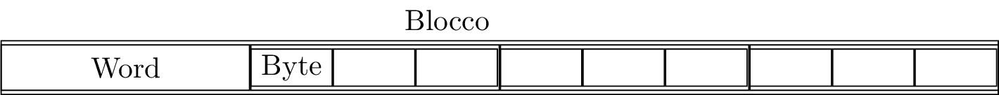</p>
<figcaption>Blocco di Memoria Centrale</figcaption>
</figure>

Gli indirizzi devono anch’essi rappresentare questi livelli di granularità, per cui i primi bit di un indirizzo rappresentano in quale blocco si trova il dato a cui si vuole accedere, generalmente è composto dal numero maggiore di bit, poiché una memoria presenta numerosi blocchi di memoria distinti, contenti ciascuno poche decine di byte, fino a raggiungere diversi GB di dimensione complessiva. I successivi bit identificano la parola ed il singolo byte della parola dove si trova il dato cercato. Si considera un indirizzo da 32 bit con 27 bit per indirizzare il blocco di memoria, 3 per indirizzare la parola e 2 per indirizzare il byte. Per cui si utilizzano blocchi di memoria da 32 byte, con parole da 4 byte.

La dimensione della cache è più piccola della memoria principale quindi non è possibile ottenere una corrispondenza biunivoca tra le loro locazioni. Per cui la memoria cache viene gestita come una memoria associativa, associando ad ogni blocco di memoria una chiave, o etichetta “tag”.

Si considera una memoria con uno spazio indirizzabile di $2^n$ byte, diviso in $2^{n-r}$ blocchi di memoria da $2^r$ byte. I primi $n-r$ bit più significativi indirizzano il blocco in memoria centrale. Di questi bit, gli ultimi $s$ corrispondono all’indirizzo della linea di cache dov’è memorizzato, tra le $2^s$ disponibili, ed i primi $n-s-r$ contengono l’etichetta. Se il blocco di memoria si trova in cache si trova in quell’indirizzo, altrimenti bisogna cercarlo in memoria centrale:

<figure>
<p> 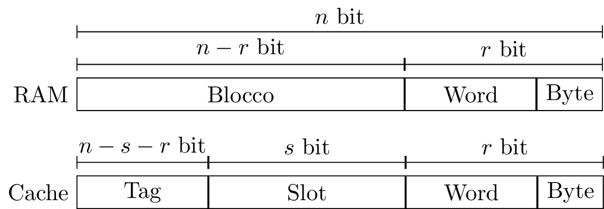</p>
<figcaption>Indirizzo di Memoria</figcaption>
</figure>

Quindi dall’indirizzo del blocco in memoria centrale da $n-r$ bit, i primi $s$ bit assumono il valore dell’etichetta, mentre i successivi $s$ bit indirizzano lo slot associato della cache.

Il formato delle linee di cache rispetta la struttura dell’indirizzo, presenta un bit V per indicare se il contenuto dello slot è valido, o in uso. Il tag di $n-s-r$ bit, ed il blocco di memoria di $2^r$ byte, quindi $2^3\cdot2^r=2^{r+3}$ bit:

<figure>
<p> 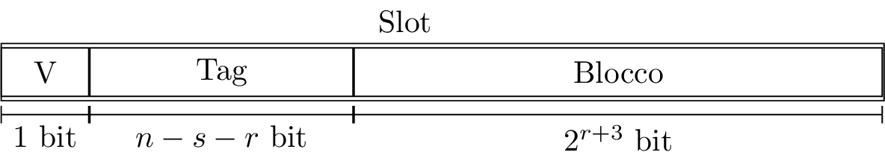</p>
<figcaption>Linea di Cache</figcaption>
</figure>

Tradizionalmente si memorizza a partire dal basso, da locazioni con tutti zero. Per cercare un dato in cache, si considera il suo indirizzo di memoria principale, si rimuovono i primi $s$ bit di tag, e si cerca lo slot corrispondente all’indirizzo così ottenuto, se il tag corrisponde si controlla il bit V, se questo bit è asserito alto, allora il dato è stato trovato, Cache Hit, altrimenti bisogna cercarlo in memoria principale, e si trasferisce l’intero blocco di memoria corrispondente in cache quando viene trovato, Cache Miss. Se si trasferisce un blocco di memoria in uno slot già in uso, il suo contenuto viene sovrascritto e ne viene cambiata l’etichetta, quindi è possibile che vengano sovrascritti dati memorizzati in cache a seguito di una cache miss. Per cui anche se è presente spazio libero nella cache il dato viene buttato, questo rappresenta una limitazione delle cache a mappatura diretta.

Questa limitazione può essere risolta utilizzando una cache associativa ad insiemi dove è possibile inserire più di un blocco in un singolo slot. Ogni slot è composto da $n$ elementi composti da un bit valido un tag e l’informazione, in questo modo si evita di sovrascrivere i dati significativi ad ogni cache miss. Ma quando uno slot diventa completamente pieno bisogna necessariamente eliminare un blocco di memoria salvato, in generale si sovrascrive quello più vecchio. Questo tipo di architettura ad insiemi si chiama anche a più vie, ed ogni blocco diverso contenuto in una slot rappresenta una via della linea di cache.

In caso di scrittura, se il dato si trova in cache si possono effettuare due strategie, si aggiorna il valore in memoria principale solamente quando viene rimosso dalla cache, la tecnica “write back” di allineamento alla fine. Altrimenti si può aggiornare il valore sia in cache che in memoria principale quando questo viene modificato, e si paga l’accesso in memoria principale, la tecnica “write through” Invece quando si effettua un cache miss in scrittura si può optare di portare il blocco in cache per poterlo modificare più agevolmente, “write allocation”, oppure si può effettuare direttamente la scrittura in memoria, “write to memory”.

## Esempi di Microarchitetture

### Architettura Intel i7

Si considera una microarchitettura Intel molto diffusa l’i7. I processori moderni della Intel condividono lo stesso nome, e per distinguere processore più avanzati si dividono in base alla loro evoluzione. I processori odierni sono di quattordicesima generazione, ma non contengono differenze notevoli dalla tredicesima, per cui condividono il nome “Raptor Lake”, con un livello di integrazione di 7 nm. L’architettura i7 di prima generazione viene chiamata “Sandy Bridge” introdotta nel 2011, con un livello di integrazione di 32 nm.

Il processore i7 utilizza un’architettura CISC tradizionale, a 64 bit, ed un linguaggio macchina molto complesso, con un set di istruzioni “disordinato”, per mantenere la retrocompatibilità, di lunghezza variabile da 1 a 17 byte, con otto registri interni. Questo gli permette di effettuare operazioni su interi da 8, 16 e 32 bit, ed a virgola mobile su 32 e 64 bit. Per le operazioni più frequente si è realizzata un’implementazione diretta RISC, che rappresenta il nucleo del processore, è quindi un’architettura ibrida. Presenta una lunga pipeline, e dai 4 ai 6 core, ed un’architettura superscalare. Il processore è hyper-threaded, inserendo istruzioni e porzioni di un processo, in altre pipeline, per realizzare più linee di esecuzione o thread paralleli.

La prima generazione di quest’architettura ha una frequenza di clock di 3.5 GHz, con una cache di primo livello di 32 KB per i dati e le istruzioni, una di secondo livello di 256 KB e di terzo livello condivisa da 4 a 15 MB. La scheda utilizza un pinout logico diverso dai precedenti con 1155 pin, alcuni pin del processore sono dedicati a comunicare con il bus PICe. Ha bisogno di un supporto esterno invece per comunicare con altri processori e componenti del calcolatore.

Consuma da 17 ai 150 W per stati differenti di consumo tramite diversi valori di voltaggio, e necessita quindi di un sistema di raffreddamento dedicato.

Nella piedinatura sono presenti due canali diversi da 124 linee ciascuno per accedere alla memoria, mentre metà delle linee sono dedicata per alimentare il processore e collegarlo ad una messa a terra. I due canali per accedere alla memoria sono indipendenti tra di loro, utilizzano linee a 64 bit con un bus sincrono a 666 MHz, per un trasferimento di dati complessivo di 20 GB/s. Mentre i restanti pin sono utilizzati per collegare il processore con il bus PCIe, e per la comunicazione con i chipset DMI come SATA, USB, Audio, flash, etc. Le linee per la trasmissione con il bus PCIe sono composte da 16 linee con una banda di 16 GB/s.

I restanti pin vengono usati per il controllo dello stato del processore, 11 per la diagnostica ed uno per il segnale di clock; mentre altri 62 pin sono dedicati per un futuro e non sono assegnati ad alcuna linea o bus specifici.

Le interruzioni vengono gestite allo stesso modo dei primi processori 8088, sia con l’utilizzo di un APIC, “Advanced Programmable Interrupt Controller” un controllore dedicato alla gestione delle interruzioni.

Inoltre il monitoraggio della temperatura tramite sensori di calore permette di diminuire autonomamente la frequenza del processore per raffreddarlo, un processo chiamato “thermal throttling”.

Per queste architetture il processore è affiancato da coprocessori per aumentarne le prestazioni, con anch’essi connessioni PICe e seriali per dispositivi di I/O. Questi coprocessori sono dedicati alla comunicazione per dispositivi esterni come schede grafiche o dispositivi audio, connessi a bus USB, SATA o PCI.

Il bus per la comunicazione con la memoria centrale implementa una pipeline, e permette fino a 4 transazioni sovrapposte. La memoria viene organizzata come una matrice di selezione, dove gli indirizzi di riga e colonna vengono inviati sullo stesso canale di indirizzo. Ogni interfaccia DRAM presenta tre gruppi di linee per l’invio e l’attivazione di indirizzi, i comandi da attuare sui dati, read/write, e chiusura e preparazione per la prossima transazione. Questo meccanismo funziona solamente con memorie di tipo sincrono.

Si possono individuare quattro componenti fondamentali. Il componente per la comunicazione con la memoria e la cache di terzo livello, contenente la cache di secondo livello e l’interfaccia per la memoria. La componente “front end” dedicata decodifica le istruzioni e contiene la cache di primo livello delle istruzioni, i registri contenenti le microistruzioni e la IFU. Questa componente contiene il “branch predictor” per eseguire istruzioni future senza esplicita richiesta, se vengono ritenute probabili di essere eseguite successivamente. Questa preleva le istruzioni dalla cache di secondo livello e le decodifica e le invia alla cache di primo livello per le istruzioni, scomponendole in microistruzioni RISC, in appoggio ad una cache L0. Un’altra componente di esecuzione contiene l’ALU e la cache di primo livello per i dati, che comunica direttamente con la cache di secondo livello e con l’ultima componente. L’ultima componente gestisce il controllo dell’esecuzione scegliendo le microistruzioni da eseguire e ritira in ordine le microistruzioni eseguite.

Per realizzare istruzioni condizionali, l’esecuzione speculativa le esegue tutte, e dopo aver calcolato la condizione viene scelta l’istruzione opportuna.

La cache di secondo livello unificata, è a 8 vie con 256 KB di memoria ed un sistema di write back, mentre la cache di terzo livello ha 12 vie con 20 MB, entrambe le cache hanno slot da 64 byte.

### Architettura ARM

I processori ARM appartengono ad una famiglia dedicata principalmente alle applicazioni mobile anche se recentemente la Apple li sta utilizzando per realizzare notebook. Sono architetture aperte, non prodotti da un’unica casa produttrice, poiché l’azienda ARM detiene solamente i diritti d’autore. Ogni processore viene quindi affiancato dal nome della sua casa produttrice.

Si considera il processore OMAP4430 della Texas Instruments, una SOC che utilizza due microprocessori ARM Cortex A9. Questi realizzano un’architettura a 32 bit con un bus di memoria di 32 bit, è un’architettura RISC pura, con due livelli di cache. Presenta un livello di istruzioni ridotto e ordinato di 4 byte per istruzione, con 16 registri generali ed altri 32 registri opzionali per operazioni a virgola mobile. L’architettura è abbastanza semplice, superscalare con 4 core distinti ed una pipeline ad 11 stadi. Questi core hanno una frequenza di clock di un GHz ed un livello di integrazione di 45 nm.

Il processore oltre questi due core utilizza una GPU dedicata ed un componente ISP per la manipolazione delle immagini con un’altro processore VPU per codificare e decodificare il video.

Questo tipo di architetture sono mirate all’efficienza, con un basso consumo, nell’ordine dei milli Watt, ed una gestione dinamica del voltaggio necessario. Rappresenta un’architettura superscalare con 2 istruzioni per ciclo, e una cache di 32 KB di primo livello per istruzioni con un totale di 8000 istruzioni, ed un’altra per i dati; inoltre utilizza una cache unificata di secondo livello di 1MB. Nel suo insieme è realizzato da un unico canale di comunicazione ad altissima velocità a cui sono collegati tutti i sistemi, anche i microprocessori, essenzialmente un bus condiviso per tutte le risorse.

La pipeline a livello del data path viene realizzata tramite componenti fisici dedicati alle varie operazioni. Una componente di lancio preleva le istruzioni da eseguire, fino a quattro per ogni ciclo di clock e le conserva in un registro buffer. L’unità successiva di esecuzione le decodifica e produce lo stack di istruzioni da eseguire. Utilizza due di queste unità in parallelo, contengono ALU per somme e per prodotti con registri dedicati, un’unità di load/store alle cache di primo livello dei dati, ed un’unità per effettuare operazioni vettoriali secondo la tecnica SIMD, opzionale. L’interfaccia di memoria costituisce un’altra componente separata, con una massima memoria indirizzabile di 4 GB, su due canali indipendenti.

### Microcontrollori

L’introduzione di chip a basse prestazioni negli anni ’70 ha rivoluzionato permettendo di abbassare di molto i costi di produzione. Per piccole applicazioni infatti l’economicità prevale sulle prestazioni dei processori.

Si analizza il microcontrollore ATmega168, un chip semplificato con meno di un milione di transistor, utilizza un’architettura RISC a 8 bit, con 32 registri eterogenei. Le sue istruzioni vengono eseguite in un singolo ciclo macchina, ed implementa una pipeline a due stadi, il prelievo delle istruzioni, e la loro esecuzione. La sua architettura è molto semplice, utilizzando un unico bus centrale, una memoria centrale sincrona da 1 KB per dati volatili ed una memoria EEPROM da 1 KB per dati statici. Non utilizza una RAM esterna, e contiene 16 KB di memoria flash.

Questo microcontrollore viene utilizzato per applicazioni embedded, dal costo di pochi euro. La sua architettura è basata sull’ISA AVR. La sua scheda è molto piccola, con sole 28 porte. 23 di queste sono dedicate alla gestione dell’I/O con un interfaccia seriale, mentre tre sono utilizzate per l’alimentazione e la messa a terra. Le ultime due linee sono utilizzate per configurare i circuiti analogici.

I suoi registri sono ad 8 bit, sono divisi in gruppi, 32 vengono utilizzati per i dati temporanei, inoltre contiene un registro di stato, oltre al PC e IR. Poiché viene realizzato attraverso un bus centrale, il data path lo attraversa ad ogni ciclo macchina. Vengono usati due registri per indirizzare la memoria e tre registri per indirizzare le istruzioni.

L’esecuzione di un’istruzione consiste di due stadi, nella prima l’istruzione viene prelevata dall’IR, e nella seconda viene letta dal registro sorgente, elaborata dall’ALU, ed il risultato viene memorizzato nel registro destinazione. Tutto questo viene eseguito in due cicli di clock, con una frequenza da 10 a 20 MHz.

# Linguaggio Assemblativo 8088

Un linguaggio assemblativo è un linguaggio simbolico, programmabile dall’utente, in corrispondenza biunivoca con il linguaggio macchina. Per ogni istruzione binaria eseguibile dal processore, esiste una versione simbolica, rappresentata da un comando molto semplice, dove gli operatori sono i registri del processore, nascondendo i dettagli bassissimi del codice binario.

Il livello più basso in cui si programma oggi non è più il linguaggio assemblativo, in generale i sistemi operativi non si spingono oltre il livello di C o C++. Non è quindi un linguaggio pensato da essere usato direttamente dall’utente. I compilatori trasformando il codice in linguaggio assemblativo creando un codice oggetto, e molto spesso produce un codice migliore. Però è possibile scrivere piccole routine locali in linguaggio assemblativo, dedicate La conoscenza del linguaggio assemblativo permette di comprende meglio il comportamento ed il funzionamento del processore nell’esecuzione delle istruzioni.

Molti linguaggi consentono di incorporare pezzi di codice che utilizzano linguaggio assemblativo, in C si introduce il linguaggio all’interno del corpo di `asm{...}`.

Oltre all’assemblatore che dato questo linguaggio produce un linguaggio binario, effettuando un lavoro molto semplice, esiste un tracer, o interprete che permette di eseguire un codice assemblativo un’istruzione alla volta, per simulare la sua esecuzione come un debugger.

Ciascuna delle istruzioni di un linguaggio di programmazione viene trasformata in una serie di istruzioni in forma binaria, corrispondenti a istruzioni in linguaggio assemblativo.

Un tracer è uno strumento molto primitivo per la sua interfaccia ed utilizzo. Il file assemblativo viene scritto su un qualsiasi file di testo, che può essere inviato al tracer per eseguire le istruzioni mostrando una mappatura dei registri del processore ad ogni istruzione, indicando l’istruzione attuale. Inoltre mostra una mappa della memoria indicando il loro contenuto.

Gli esempi tratteranno del linguaggio appartenente alla famiglia Intel x86. Rappresenta un linguaggio di una vasta famiglia di ISA della famiglia Intel, a partire dal processore 8086, retrocompatibile da ogni processore Intel fino come un processore i7 moderno. Nelle versioni moderne viene associato al numero di bit dell’architettura come x86-32 o x86-64. Poiché queste versioni sono molto complesse si considera solamente il linguaggio di una delle prime versioni del processore ad 8 bit il x86 per il processore 8088 ed operazioni solamente su numeri interi. Ma può essere eseguito anche su processori moderni, senza modifiche. Questa architettura è un’architettura a 16 bit, e può avere indirizzi a 20 bit ed un mega di memoria centrale. Presenta un bus di dati di un byte, l’unità indirizzabile è quindi un byte.

## Registri

Presenta un quattordici registri divisi in quattro gruppi funzionali: una serie di registri utilizzati divisi in coppie, uno per la gestione degli array `SI` e `DI`, e l’altra coppia per la gestione della zona di memoria come pila `SP` e `BP`;

- Registri di uso generale `AX`, `BX`, `CX`, `DX`, divisi in due sezioni da 8 bit `#H`, high bits, e `#L`, low bits, per indirizzare una sezione del registro;

- Registri del sistema operativo per contenere i segmenti del codice `CS`, “Code Segment”, dei dati `DS`, “Data Segment”, dello stack di esecuzione `SS`, “Stack Segment”, e la memoria aggiuntiva in caso sia necessaria `ES`, “Extra Segment”;

- Registri per la gestione di indici, `SI`, “Source Index”, e `DI`, “Destination Index”, e puntatori allo stack `SP`, “Stack Pointer”, e `BP`, “Base Pointer”;

- Una coppia di registri, uno per le condizioni `CC`, “Condition Codes”, ed uno per le istruzioni, `IP`, “Instruction Pointer”, contenente anche il `PC`.

I registri generali sono divisi per mantenere la retrocompatibilità con processori a 8 bit. Negli anni quindi si è aggiunto a questi registri, mantenendo la retrocompatibilità contenendo queste sezioni di registri, permettendo di indirizzare queste sezioni di registro, simulando l’esistenza di registri semplificati come porzioni del registro più grande. La disposizione dei registri rimane invariata anche nelle architetture a 64 bit, con quattro registri di uso generale, sei per gestire il sistema operativo, altri quattro per gestire lo stack e gli array. Inoltre si ha un registro che contiene le “flag”, per contenere lo stato del processore, ogni bit del registro rappresenta il risultato di operazioni e del suo stato.

Il linguaggio indirizza direttamente questi registri. Le istruzioni presentano un formato semplice, sono composte da un codice operativo simbolico seguito da argomenti, specifica un registro o un indirizzo di memoria principale. Per indicare un indirizzo di memoria principale bisogna specificare il numero tra parentesi.

I registri di uso generale vengono usati ciascuno per operazioni specifiche:

- Il registro `AX` viene usato come accumulatore per memorizzare il risultato di un’elaborazione di molte istruzioni, anche implicitamente, sovrascrivendo il valore contenuto;

- Il registro `BX` viene usato come accumulatore oppure come puntatore alla memoria;

- Il registro `CX` viene usato come contatore di cicli;

- Il registro `DX` come registro di dati e come `AX` usato per contenere le istruzioni lunghe due parole: `DX`:`AX`.

Tutti i registri vengono rappresentati come coppie di registri da 8 bit, accessibili autonomamente. Per cui è possibile salvare un dato in `AX`, e successivamente modificarne il valore tramite riferimenti a `AH` e `AL`, modificando il valore contenuto nel registro a 16 bit `AX`.

I registri puntatore ed indice hanno uno scopo più specifico, `SP` è un puntatore alla cima della pila, e `BP` punta alla base della pila, e vengono aggiornati automaticamente dal sistema operativo. Il record di attivazione viene quindi gestito autonomamente, ma è possibile inserire o rimuovere istruzioni e dati manualmente attraverso i comandi `PUSH` e `POP`. I registri `SI`, indice sorgente, e `DI`, indice destinazione, sono sono indici usati per indirizzare un array e gestire un array, usato in combinazione con `BP`. Il registro di stato rappresenta un insieme di registri da 1 bit, creati automaticamente dal sistema operativo, impostati da operazioni aritmetiche o di controllo per l’attività del processore:

- Registro `Z`: il risultato è zero;

- Registro `N`: il risultato è negativo;

- Registro `O`: il risultato ha causato un overflow;

- Registro `C`: il risultato ha generato un riporto;

- Registro `A`: riporto ausiliario, oltre i 3 bit;

- Registro `P`: controlla la parità del risultato;

- Registro `I`: attiva le interruzioni;

- Registro `T`: abilita il tracing;

- Registro `D`: permette operazioni su stringhe.

I restanti bit non vengono utilizzati.

I registri di segmento, gestiti dal sistema operativo puntano a quattro segmenti correntemente attivi. Il registro `CS` punta al segmento contenente le istruzioni da eseguire contenute nella memoria centrale, ed il `DS` al segmento contenente i dati. Il registro `SS` punta al segmento dello stack. Questi segmenti correnti sono di dimensione fissa da 64 KB, per cui se non è più sufficiente lo spazio si può usare il registro `EX`, che punta ad un segmento extra. Il SO inserisce il primo elemento del segmento in questi registri a tempo di esecuzione, poiché vengono salvati sequenzialmente.

La memoria è segmentata divisa in segmenti di dimensione fissa di 64 bit. Ogni segmento rappresenta un’unità di memoria indipendente, formata da locazioni contigue di memoria. Inizia ad un indirizzo di memoria multiplo di 16. A livello del programma vede una memoria che comincia dall’indirizzo 0, ma è un indirizzo relativo alla porzione di memoria indirizzata dal segmento dei dati. Per ottenere il registro effettivo viene sommato l’indirizzo relativo `CS` e si aggiungono 4 zeri a destra per ottenere indirizzi a 20 bit e si somma all’indirizzo a 20 bit per ottenere l’indirizzo effettivo. Per cui è sempre necessario l’intervento di un indirizzo di segmento per indirizzare la memoria centrale.

La gestione della pila utilizza un meccanismo simile, utilizzando due puntatori alla cima ed alla coda della pila, ed ad ogni operazione di push o di pop modificando il valore contenuto in `SP`. Il segmento di stack è costituito da parole di 2 byte. Lo stack cresce andando dagli indirizzi alti, relativi ad un indirizzo di memoria effettivo, a quelli più bassi. `SS` punta all’indirizzo di partenza dello stack e `SP` punta alla locazione in cima allo stack, indirizzo più basso di `SS`. Allo stesso modo vengono gestiti gli array, utilizzando i registri `DI` e `SI`.

## Indirizzamento

Per utilizzare i dati contenuti in un registro o nella memoria centrale come argomenti di un’operazione, sono possibili vari modi per indirizzarli.

- Indirizzamento a registro: L’operando si trova in un registro e viene specificato il nome del registro: `BX`;

- Indirizzamento immediato: L’operando è contenuto nell’istruzione, e rappresenta una costante di 8 o 16 bit: `#`;

- Indirizzamento diretto: L’operando si trova in memoria principale, l’istruzione contiene l’indirizzo dei dati in memoria tra parentesi: `(#)`;

- Indirizzamento indiretto a registro: L’indirizzo del dato in memoria principale si trova in un registro, BX, SI o DI, tra parentesi, ed il suo contenuto viene interpretato come indirizzo di memoria: `(BX)`;

- Indirizzamento indiretto a registro con spiazzamento: L’indirizzo si ottiene dalla somma di una costante con il contenuto di uno dei registri usati come indirizzo: `#(BX)`;

- Indirizzamento a registro indice: L’indirizzo si ottiene dalla somma del contenuto di due registri: `(BX)(SI)`;

- Indirizzamento a registro indice con spiazzamento: L’indirizzo si ottiene dalla somma del contenuto di due registri con una costante: `#(BX)(SI)`.

Utilizzare un registro come indirizzo alla memoria principale è utile quando vengono utilizzati molti dati, come nel caso di array.

Utilizzando il registro ad indice è possibile gestire array diversi. Il registro BX in generale rappresenta la base del registro, mentre SI viene usato come indice per scorrere gli elementi dell’array. In generale quando non viene specificato esplicitamente un indirizzo un registro, si usa il registro `AX`, il registro di default per salvare il risultato delle operazioni, essenzialmente il registro accumulatore.

## Scrittura del Codice

Si utilizzerà un assemblatore as88 molto primitivo, con tre componenti: il programma assemblatore as88 che prende come argomento il nome di un file contente il codice; l’emulatore o interprete s88 dell’architettura 8088; ed il programma che lancia il tracer per il debugging t88. Per eseguire questi programmi su un codice scritto in linguaggio assemblativo si utilizzano i seguenti comandi:

``` bash
> as88 nome_file.s
> s88 nome_file
> t88 nome_file.$
```

Un programma in assembler è composto da tre sezioni diverse individuate dalla sintassi `.SECT` seguite da una delle tre etichette associate alle sezioni:

- `.TEXT`: sezione di testo che contiene le istruzioni;

- `.DATA`: sezione che contiene i dati;

- `.BSS`: sezione che contiene i dati non inizializzati.

A partire dall’indirizzo zero la sezione `.DATA` specifica cos’è presente nella memoria principale. Oltre a queste direttive si utilizzano `.BYTE`. `.WORD` e `.LONG` per salvare gli argomenti in una sequenza di byte, parole, o sequenze più lunghe di byte. Per memorizzare stringhe di caratteri, necessariamente di formato ASCII, passate come argomento si utilizzano le direttive `.ASCII` e `ASCIZ` per memorizzare uno zero finale.

Prima delle sezioni è possibile definire etichette globali o locali. Le etichette globali rappresentano identificatori alfanumerici univoci, mentre le etichette locali sono utilizzabili solamente nella sezione di testo e costituiscono una sola cifra, possono inoltre essere utilizzate più di una volta. Entrambe le etichette vengono seguite dal simbolo “:”. Questa sezione viene chiamata prologo, in generale vengono definite etichette per aumentare la leggibilità del codice, per quanto possibile. Per attribuire valori costanti alle etichette si utilizza la sintassi: `nome_simbolico = costante`.

I valori numerici possono essere decimali, ottali, cominciano per `0`, oppure esadecimali, cominciano per `x0`. Inoltre per commentare una linea di codice si utilizza il simbolo “!”.

Il tracer permette di effettuare un’esecuzione sequenziale, di un’istruzione alla volta e monitorare lo stato ed il contenuto dei registri e della memoria. Per interagire con il tracer è possibile fornire un insieme di comandi contenuti in un file, in modalità batch; oppure inserendo manualmente i comandi da tastiera, in modalità interattiva, seguiti dal tasto invio.

Per visualizzare la mappatura in memoria bisogna utilizzare il comando \\ seguito dal nome dell’etichetta il cui valore si vuole controllare.

### Chiamate di Sistema

Durante l’esecuzione del programma è indispensabile invocare delle routine di sistema, tramite un identificatore, o un nome simbolico, ed effettuare operazioni sulla pila. Prima inserendo gli argomenti nella pila ed in seguito l’identificatore della chiamata di routine. Per invocare la funzione di sistema si utilizza `SYS` che cerca l’identificatore della funzione di sistema ed i suoi argomenti nella pila. Gli identificatori di una chiamata di sistema vengono preceduti dal simbolo “\_” prima del nome della chiamata.

Il risultato di questa chiamata viene salvato nel registro `AX`, o in caso sia di formato long nei registri `AX:DX`. Gli argomenti di questa chiamata devono essere rimossi dallo stack dalla funzione chiamante.

L’interprete as88 dispone di 12 chiamate di sistema:

<figure>
<p> 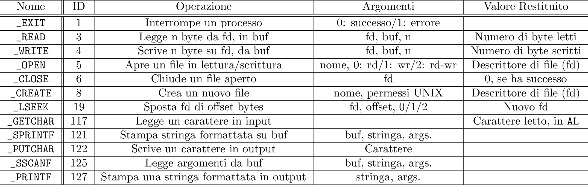</p>
<figcaption>Chiamate di Sistema</figcaption>
</figure>

Convenzionalmente la chiamata di per chiudere il processo ha l’etichetta `_EXIT`

Per inserire un’istruzione o un dato sulla pila si utilizzano le istruzioni `PUSH` e `POP`, che prendono come argomento un intero, solo l’inserimento, o un indirizzo effettivo entrambe:

``` gas
    PUSH X
    POP Y
```

Le operazioni modificano il puntatore `SP`, indirizzato implicitamente. Ad ogni aggiunta viene decrementato di due byte, ed ad ogni rimozione diminuito di due byte. Mentre le operazioni `PUSHF` e `POPF` trasferiscono il contenuto dal registro flag alla cima dello stack o viceversa.

In seguito quando viene chiamata la funzione di sistema tramite `SYS`, controlla sulla pila per cercare un dato valido da utilizzare come identificatore di funzione, in seguito cerca sulla pila gli argomenti della funzione.

Per la funzione di uscita, il valore 0 indica che non è stato generato un errore, in caso contrario bisogna inserire il valore assegnato al codice di errore corrispondente. L’argomento assegnato come valore di uscita può essere intercettato dal sistema operativo per gestire l’errore.

### Istruzioni

L’istruzione `MOV` effettua l’operazione di copia e trasferimento trasferendo un byte o una parola, in questa versione formata da due byte, da una sorgente `Y` ad una destinazione `X`, indirizzati in uno dei metodi descritti precedentemente:

``` gas
    MOV X, Y    # X <- Y
```

Mon è possibile caricare un valore immediato in un registro segmento, inoltre il registro `CS` non è utilizzabile come destinazione di uno spostamento. Per trasferire dati di un byte viene utilizzata l’istruzione `MOVB`, poiché i registri sono divisi in due sezioni entrambe da un byte. Quindi lavorando con dati da un byte sono presenti otto registri di uso generale, ma due non sono indirizzabili dalla `MOV(B)`, i rispettivi `CR` e `CL`.

Queste operazioni ad un byte si ottengono aggiungendo `B` al nome dell’istruzione, e non verranno utilizzate nei programmi considerati.

Le operazioni di somma e sottrazione vengono effettuate dalle istruzioni `ADD` e `SUB` effettuando l’operazione sul registro destinazione `Y`, dato l’operando sorgente `X`, memorizzando il risultato nell’indirizzo destinazione:

``` gas
    ADD X, Y    # Y <- Y + X    
    SUB X, Y    # Y <- Y - X
```

L’operazione `ADC` e `SBB` comprende nella sottrazione il flag del riporto.

La moltiplicazione prende un unico argomento `MUL`, il primo operando utilizzato è implicito ed è il registro accumulatore, mentre il secondo specificato indica il valore per cui moltiplicarlo. Se si moltiplicano parole, il risultato viene salvato in `AX:DX`. La divisione ha un solo argomento `DIV`, il primo operando è sempre il registro accumulatore, e divide il sorgente `AX` per l’argomento e salva il risultato in `AL`, ed il resto in `AH`, mentre per divisioni di parole salva il risultato in `AX` ed il resto in `DX`:

``` gas
    MUL X   # AX(:DX) <- AX * X
    DIV X   # AX\AL <- (DX:)AX / X; DX\AH <- C
```

Quando vengono precedute dal carattere “I”: `IDIV/IMUL`, effettuano la moltiplicazione o divisione con segno.

Esistono operazioni logiche per effettuare la negazione e l’inversione di segno, per gli interi quindi complementa a due, mentre la negazione complementa ad uno, `NEG` e `NOT`. Le istruzioni di incremento e decremento sono `INC` e `DEC`. Inoltre si utilizzano operazioni logiche principali, dove il primo argomento è sempre `AX` implicito `AND`, `OR` e `XOR`. Altre operazioni principali permettono lo scorrimento a destra o sinistra di un certo numero di bit o byte `SHR`, `SHL`, `ROR` e `ROL`:

``` gas
    NEG X       # X <- cp2(X)
    NOT X       # X <- !X
    INC X       # X <- X + 1
    DEC X       # X <- X - 1
    AND X, Y    # X <- X and Y
    OR X, Y     # X <- X or Y
    XOR X, Y    # X <- X xor Y 
    SHR X, Y    # X <- X >> Y 
    SHL X, Y    # X <- X << Y
    ROR X, Y    # X <- (X >> Y) | (X << (16\32 - Y))
    ROL X, Y    # X <- (X << Y) | (X >> (16\32 - Y))      
```

L’istruzione `JMP` effettua dei salti per trasferire il controllo all’istruzione specificata come etichetta. Esistono due tipi di salto, uno corto dove il controllo rimane nel segmento di codice corrente, mentre nel salto lungo modifica il contenuto del registro `CS`:

``` gas
    JMP _tag
    # ...
_tag:
    # operazioni
```

In caso più etichette sono omonime utilizza salta alla prima etichetta che trova.

Tramite l’istruzione `CMP` è possibile effettuare un confronto, sottraendo due operandi, aggiornando il registro di stato tramite i bit `N` e `Z`, se il risultato è zero, oppure è negativo:

``` gas
    CMP X, Y    # X - Y 0 => N\Z <- 1\0
```

Per realizzare salti condizionali bisogna effettuare un confronto tramite quest’operazione controllando il contenuto del registro di stato. Sono quindi presenti molti tipi di istruzioni diverse per diversi stati, accomunate dal primo carattere “J”: `J#`. La verifica della condizione si basa sui valori dei registri di flag. Se la condizione è verificata, passa il controllo all’istruzione di indirizzo specificato dal salto, altrimenti l’esecuzione prosegue all’istruzione successiva. Utilizzando queste operazioni sono possibili salti di una massima lunghezza di 128 byte. Inoltre sono presenti vari nomi simbolici per lo stesso tipo di salto condizionato:

``` gas
    JG   _tag   # Maggiore 
    JGE  _tag   # Maggiore o Uguale
    JL   _tag   # Minore
    JLE  _tag   # Minore o Uguale
    JE   _tag   # Uguale
    JNE  _tag   # Non Uguale
    JB   _tag   # Inferiore
    JBE  _tag   # Inferiore o Uguale
    JA   _tag   # Superiore
    JAE  _tag   # Superiore o Uguale
    JO   _tag   # Overflow
    JNO  _tag   # Non Overflow
    JS   _tag   # Negativo
    JNS  _tag   # Non Negativo
    JCXZ _tag   # CX Nullo
```

Utilizzando salti condizionati è possibile realizzare dei cicli, ma sono presenti istruzioni per semplificare l’operazione. L’istruzione `LOOP` consente di implementare espliciti cicli, prendendo come argomento un’etichetta, controllando il contenuto del registro `CX`, che viene decrementato e se vale zero effettua l’istruzione successiva al `LOOP`, se il contenuto è diverso da zero salta all’etichetta assegnata. Un semplice ciclo si può realizzare quindi come:

``` gas
    MOV CX, numero-cicli
_tag:  
    # operazioni 
    # ...
    LOOP _tag
```

Sono presenti altre varianti come `LOOPE`, “Loop Equal” e `LOOPNE`, “Loop Not Equal”, che dipendono da valori diversi dei registri flag.

Per effettuare operazioni su stringhe ed array, ovvero su dati contenuti nella memoria principale esistono un insieme di istruzioni apposite. Si utilizza l’istruzione `MOVSB` per spostare l’indirizzo di un byte nella memoria principale memorizzato nell’indirizzo `SI` all’indirizzo di memoria principale puntato da `DI`. Gli indirizzi nei registri `SI` e `DI` vengono incrementati o decrementati in base al valore del bit di direzione nel registro di flag. Con il comando `CLD` si indica che devono essere incrementati, mentre con l’istruzione `STD` gli indirizzi vengono decrementati. Per effettuare operazioni su parole, due byte, si utilizza il comando `MOVSW`.

Utilizzano l’istruzione `REP` come prefisso si itera l’esecuzione dell’operazione `MOVSB` su un numero di volte definito dal valore contenuto nel registro `CX`, inizializzato alla lunghezza della stringa o del vettore, decrementato fino a zero. Gli indirizzi `SI` e `DI` sono inizializzati con l’indirizzo della stringa o array sorgente e l’indirizzo della stringa o dell’array destinazione. Ad ogni iterazione viene incrementato o decrementato il valore dei due registri.

L’istruzione `LODSB` trasferisce il contenuto del byte di memoria indirizzato da `DI` nel registro `AL`. Al termine dell’operazione il registro dell’indirizzo viene incrementato o decrementato in base al valore contenuto nel registro di flag. Come per lo spostamento tra indirizzi di memoria, si può usare `LODSW` per indirizzare parole di 16 bit, al registro `AX`.

L’istruzione `STOSB` trasferisce in memoria il contenuto del registro `AL` nella locazione indirizzata da `DI`. Come per le precedenti operazioni il registro di indirizzo viene incrementato o decrementato, a seconda del registro di flag. Per spostare parole si utilizza `STOSW`.

Per confrontare due byte indirizzati in memoria principale si utilizza `CMPSB` dai registri `SI` e `DI`, salva il risultato nei registri di flag. Per confrontare due parole si utilizza `CMPSW`.

Invece per confrontare il contenuto di un registro `AL` con un indirizzo di memoria principale, indirizzato da `DI`, si utilizza l’istruzione `SCASB`. Per confrontare parole si utilizza l’istruzione `SCASW` con il registro `AX`.

Per ripetere queste istruzioni oltre ad `REP` si possono utilizzare due varianti `REPE` e `REPNE` che si ripetono fino a quando il confronto fallisce oppure ha successo.

### Chiamate di Procedura

Uno dei principi principali della programmazione è la decomposizione in moduli, scomponendo il codice in funzioni o metodi. Questi moduli diversi vengono chiamate procedure, essenzialmente invocano l’esecuzione di codice contenuto in un’altra sezione o segmento di memoria. Per cui bisogna tenere un riferimento alla procedura chiamante per poter restituire il controllo dell’esecuzione. Le informazioni necessarie per l’esecuzione di un modulo vengono conservate nel record di attivazione, con un riferimento al modulo invocante con un indirizzo di ritorno ed il vecchio `BP` per aggiornarlo dopo la rimozione di questo stack. Il record di attivazione della procedura in esecuzione si trova in cima alla pila. Gli stack frame non sono tutti della stessa lunghezza poiché durante l’esecuzione è possibile siano aggiunti dati allo stack. La vecchia base del record permette di determinare la dimensione di questo stack per rimuoverlo ed aggiornare i nuovi `SP` e `BP` correttamente.

<figure>
<p> 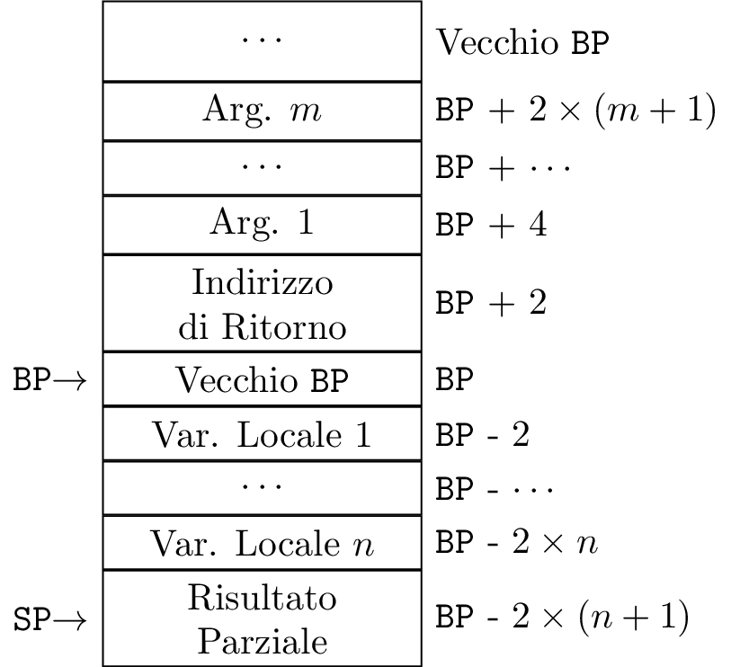</p>
<figcaption>Stack di una Subroutine</figcaption>
</figure>

Per trasferire il controllo del programma ad una subroutine si effettua tramite il comando `CALL` che prende come argomento un’etichetta associata ad una porzione di codice. Invece la funzione `RET`, restituisce il controllo al programma invocante, salvato automaticamente nella pila all’invocazione della subroutine.

``` gas
    CALL tag
    # ...
tag: 
    # ...
    RET
```

Prima di invocare la subroutine se sono necessari degli argomenti bisogna impilarli nello stack in ordine inverso. Nel prologo della funziona invocata bisogna salvare nella pila il vecchio `BP`, inizializzare il nuovo record di attivazione ed inserendo variabili locali da usare nella subroutine:

``` gas
tag:
    PUSH BP     # vecchio BP
    MOV BP, SP  # aggiorno il BP: BP <- SP
    SUB SB, xx  # aggiungo spazio per salvare le variabili locali
```

Alternativamente si possono usare diverse `PUSH` per inserire le variabili locali direttamente nello stack. Alla fine di una procedura, prima di restituire il controllo, bisogna rimuovere le variabili locali, svuotando il record di attivazione, aggiornando il `SP` al `BP` del RDA della procedura invocante, e bisogna rimuovere il vecchio `BP`:

``` gas
    MOVE SP, BP
    POP BP
    RET
```

Dopo essere tornati nella procedura invocante, bisogna rimuovere gli argomenti inseriti nella pila aggiornando il `SP`:

``` gas
    CALL subroutine
    ADD SP, xx      # numero di argomenti aggiunti * 2
```

In generale quindi una chiamata di procedura ha una sintassi simile al codice seguente:

``` gas
    CALL tag
    ADD SP, xx      # numero di argomenti aggiunti * 2
    # ...
tag:
    PUSH BP         # vecchio BP
    MOV BP, SP      # aggiorno il BP: BP <- SP
    SUB SB, xx      # aggiungo spazio per salvare le variabili locali
    # ...
    MOVE SP, BP
    POP BP
    RET
```
