# DSSeA

<!-- Page 1 -->

1. Decision making 
02_Decision_Makin
g.pdf
 
Non molto tempo fa la maggior parte delle decisioni era presa in funzione delle 
esperienze personali (e spesso sulla fortuna). Negli ultimi decenni, la matematica e la 
computer science si è evoluta al fine di permettere di perfezionare le tecniche e 
prevedere possibili risultati di fronte a opzioni varie. Gli approcci quantitativi, basati 
su dati, si sono resi necessari a fronte dell’elevata quantità di dati a disposizione. Il 
Decision Making permette di applicare metodi quantitativi di supporto per aiutare 
diverse figure aziendali. 
Un buon processo decisionale vuol dire essere in possesso di informazioni pertinenti 
e appropriate che permettono di effettuare la scelta migliore tra le alternative. Le 
decisioni sono prese su dati storici già in possesso o raccogliendo informazioni 
specifiche. 
Le informazioni si presentato sottoforma di fatti, numeri, impressioni, grafici, 
immagini. Queste informazioni devono essere raccolte da diverse fonti e organizzate. 
Il processo di organizzazione ed esame delle informazioni prende il nome di 
processo di modellazione. I modelli sono creati per aiutare i responsabili delle 
decisioni a comprendere le ramificazioni della scelta delle opzioni. 
 
Le decisioni sono prese ad ogni livello aziendale. Solitamente si individuano quattro 
tipologie di decisioni: 
1. Alta dirigenza 
2. Team di gestione intermedia di progetti 
3. Gestione operativa e team di progetto

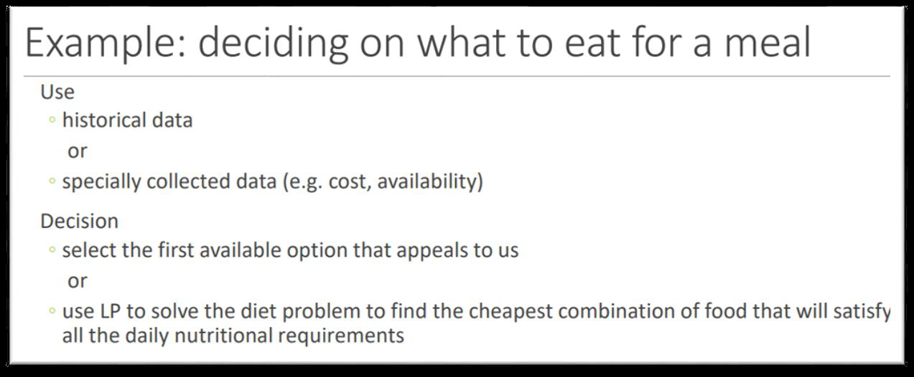

<!-- Page 2 -->

4. Singoli dipendenti 
 
Tipi di decisione: 
 
• Decisioni non strutturate: L’addetto alle decisioni deve fornire una valutazione 
e visione della definizione del problema in cui non ci si può ricondurre a 
nessuna procedura già nota. Il tipo di decisione non è mai stata presa e non ci 
si può ricondurre a scelte già fatte in precedenza. Ad esempio, iniziare una 
nuova attività imprenditoriale. 
• Decisioni strutturate: l’opposto delle precedenti. È presente una routine di 
decisioni che si ripetono più volte. Riconducibili a procedure ripetibili. Ad 
esempio, pianificazione degli ordini sulla base di ordini passati. 
• Decisioni semi-strutturate: a metà tra le due, una parte del problema può 
essere ricondotto a procedure ben definite, altre invece no. Parzialmente 
programmabili. 
 
Tipi di decisione:

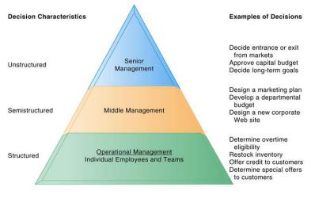

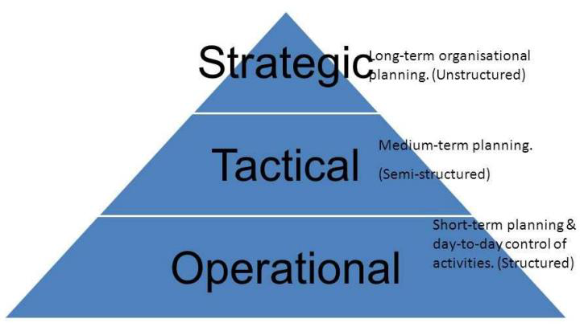

<!-- Page 3 -->

• Decisioni strategiche: Riguardano l’intera organizzazione (o una parte 
rilevante di essa). Di solito sono decisioni strategiche a lungo termine e 
difficilmente reversibili. Esempi, acquisizioni di aziende, nuovi prodotti 
commercializzati, investimenti. Necessita di previsioni di mercato, tendenze 
politiche e sociali, in generale previsioni sul futuro e vincoli da dover 
sottostare (legislativo, ambientali, politici, tecnologici). 
• Decisioni di tipo tattico: riguarda una parte delle funzioni aziendali e 
solitamente a medio termine (6 mesi – 1 anno). Ad esempio, pianificare la 
preparazione stagionale di dipendenti, prezzi stagionali, bilanci e capacità di 
produzione. Sono necessarie informazioni su costi, vendite, rapporti delle 
performance, sintesi delle attività e budget a disposizioni. 
• Decisioni operative: riguardano singole attività, a breve termine. Di solito i 
rischi sono più contenuti, possono essere chiamate amministrative o di 
routine. Sono prese con frequenze molto più alte, di tipo strutturato. Ad 
esempio, organizzare scheduling aziendale, manutenzione. 
 
Tipi di decisione: 
• Programmate: decisioni che si sanno in anticipo di doverle fare. Solitamente 
seguono una struttura e routine. Ripetute nel tempo e permettono di 
prendere decisioni con numerose informazioni a disposizione. Ad esempio, 
ordini di materie prime per un’azienda. 
• Non programmate: decisioni nuove, inattese, necessitano di particolare 
attenzione, solitamente non strutturate e basate su criteri non ben definiti. 
Probabilmente non si hanno informazioni complete a disposizione, necessita 
di pensiero creativo per prendere tali decisioni, per questo motivo anche 
chiamate decisioni ad alto coinvolgimento. Ad esempio, scelte per adottare o 
meno una nuova tecnologia. Prevede di raccogliere in anticipo delle 
informazioni aggiuntive per effettuare la decisione corretta.

<!-- Page 4 -->

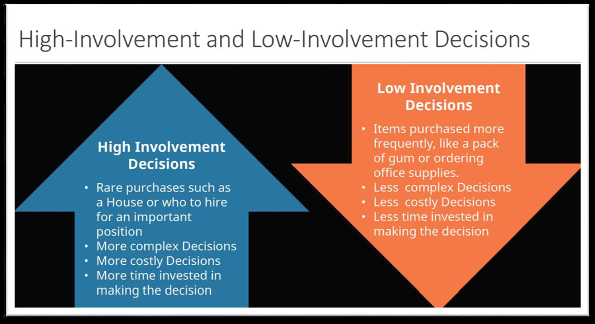

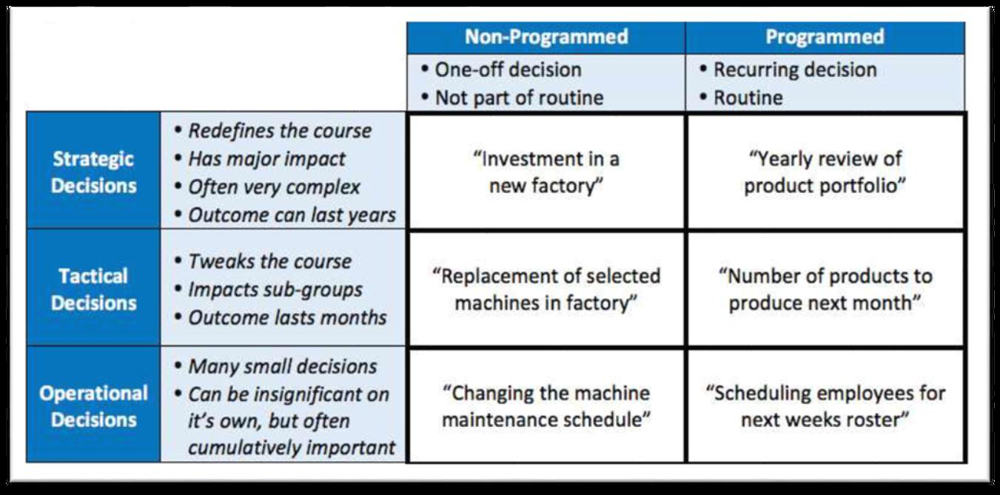

<!-- Page 5 -->

Processo decisionale: 
 
• Step 1 – identificazione del problema: per prima cosa si procede a identificare 
il problema e gli obiettivi, successivamente quali sono i risultati che ci si 
aspetta. 
• Step 2 – raccolta delle informazioni: una volta identificato il problema, si 
raccolgono delle informazioni pertinenti. Capire quali sono le informazioni 
necessarie e da quali fonti ottenerle. La raccolta delle informazioni può 
avvenire da fonti interne o esterne all’azienda. 
• Step 3 – generare alternative: Varie soluzioni al problema presentato in 
funzione di trade-off e obiettivi da soddisfare. 
• Step 4 – valutazione delle alternative: Si valutano le diverse alternative 
proposte in funzione di quanto effettuato da altre aziende, analisi di scelte del 
passato, possibili punti di fallimento. 
• Step 5 – la decisione: si sceglie l’alternativa migliore tra quelle proposte, non 
sempre la soluzione è chiara. 
• Step 6 – attuare la decisione: si sviluppa un piano per implementare le scelte 
fatte. 
• Step 7 – valutazione e monitoring: si analizza l’impatto che tale decisione ha 
portato con più obiettività possibile. Si cerca eventualmente di correggere 
eventuali scelte non andate a buon fine. 
Spesso si preferisce la qualità delle informazioni alla quantità e se tali informazioni 
sono usate in modo appropriato.

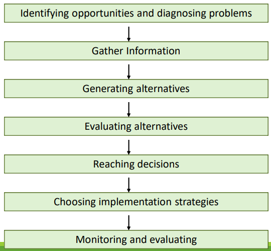

<!-- Page 6 -->

2. Decision Support Systems 
03_generalita_DSS.
pdf
 
È necessario permette a chi prenderà le decisioni di accedere ai dati rilevanti ed 
eventualmente proporre scelte alternative. È importante che tali sistemi permettano 
ai decisori di analizzare in maniera semplice i dati generati e permettano anche di 
analizzare le informazioni in modo che siano utili per giungere alla decisione, 
solitamente si predilige un supporto interattivo. I sistemi riguardano molti contesti 
diversi. 
Caratteristiche chiave di un sistema di supporto alle decisioni: 
• Combinare tecniche analitiche con l’accesso ai dati e attività di recupero. 
• Avere un focus sulle caratteristiche interattive e rendere lo strumento facile da 
utilizzare. Scambio delle informazioni tra sistema di supporto e decisore. 
• Enfatizzare la flessibilità e l’adattabilità per essere in grado di accogliere 
eventuali cambiamenti a livello aziendale nell’approccio decisionale. 
 
Componenti principali: 
 
• Data management: ha il ruolo di ottenere i dati dai diversi database a 
disposizione. A sua volta contiene un DB, un DBMS e un sistema di 
interrogazione per DB. 
• Sottosistema di gestione: comprende la gestione di tipo finanziario, statistico 
e generalmente modelli quantitativi per fornire capacità analitiche all’azienda. 
• Interfaccia utente: permette all’utente di accedere ai dati tramite interfacce 
grafiche user-friendly e intuitive.

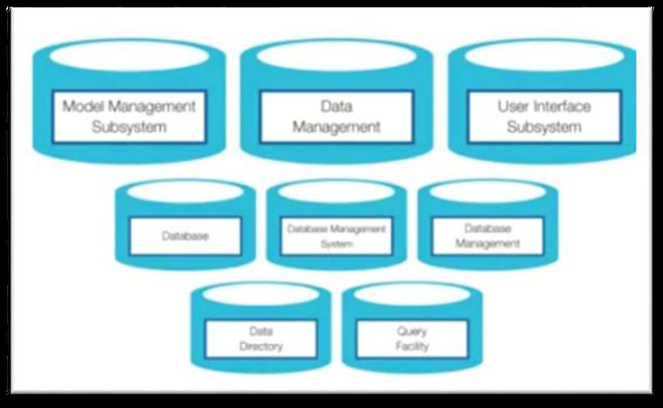

<!-- Page 7 -->

Tipi di DSS: 
 
• Data driven: sistemi che hanno a che fare con elevati carichi di dati numerici. 
• Document driven: basati su tipi di file strutturati (documenti, video, file audio, 
immagini). Si basa sulla ricerca e recupero di tali documenti. Ad esempio, 
wikipedia. 
• Knowledge driven: si basano su conoscenza ed esperienza. Incorporano tale 
esperienza nel sistema per supportare il processo decisionale automatizzato. 
Legato a intelligenza artificiale e reti neurali. 
• Model driven: basati su modelli di ottimizzazione o simulazione per giungere a 
uno o più obiettivi. Ad esempio, excel può essere usato per questo fine. 
• Communication driven: orientati alla comunicazione. Sistemi di supporto che 
aiutano alla comunicazione di gruppo. Ad esempio, Teams rientra in tali 
sistemi. 
Evoluzione delle applicazioni DSS, Management Support Systems: 
• Sistemi esperti: programmi che incorporano la conoscenza e possono 
risolvere automaticamente dei problemi che gli esperti normalmente 
risolvono, emulando il loro comportamento tramite intelligenza artificiale. Ad 
esempio, sistema automatico di configurazione di un prodotto, sistema 
autonomo; sistema di emergenze americane 911, sistema di supporto 
all’operatore. Necessita di knowledge base e risorse software per 
implementarli. 
Permette di catturare le informazioni degli esperti per automatizzare diverse 
azioni e svolgerle più velocemente. Sono specializzati unicamente nelle 
operazioni per le quali sono stati istruiti e non hanno facoltà di 
apprendimento.

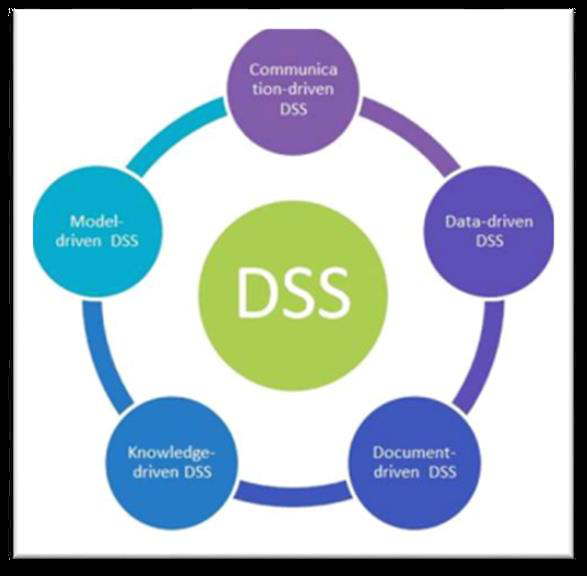

<!-- Page 8 -->

• Sistemi di supporto di gruppo: usati per la generazione di idee, scrittura di 
gruppo e in generale le attività svolte da più persone contemporaneamente. 
Ad esempio, Teams, Google docs, Dropbox. 
• Sistemi GIS e GPS: usati per la localizzazione. Sistemi Informativi Geografici 
che favoriscono scelte di marketing, ad esempio demografia. 
• Knowledge management system: wikipedia. Sistemi per l’utilizzo delle 
conoscenze e la loro diffusione e condivisione. 
• Executive information systems: sistemi per dirigenti che forniscono 
informazioni su clienti, concorrenza, report e indicatori ad alto livello. A 
seconda del tipo di dirigenza si andranno a generare report specifici. 
Caratterizzati da UI particolarmente semplice rispetto agli operatori che 
eventualmente possono entrare nel dettaglio delle informazioni. 
 
Business intelligence – DSS-BI: 
L’uso dei DSS è passato dagli specialisti a chiunque. Una serie di strumenti sono stati 
abilitati che hanno portato allo sviluppo dei DSS business intelligence. 
Il termine racchiude diversi concetti diversi, come database strumenti e 
metodologie. L’obiettivo principale della BI è quello di consentire un facile accesso ai 
dati e ai modelli, al fine di fornire ai manager la possibilità di condurre analisi e 
trasformare i dati in informazioni per prendere decisioni. 
Architetture simili in quanto le BI si evolvono dai DSS. 
DSS 
BI 
Offrono un supporto specifico al 
processo decisionale 
Supporto indiretto, con analisi di dati. 
Solitamente non propone una soluzione 
al problema. 
Orientamento verso gli analisti 
Orientamento di tipo esecutivo e 
strategico 
Costruiti ad hoc sui problemi da 
affrontare 
Costruiti con software commerciali 
Metodologie spesso provenienti dal 
mondo accademico 
Strumenti software sviluppati da 
compagnie 
 
Model-Driven DSS: 
Centrati sui modelli e la manipolazione di essi. I sistemi OLAP (On-Line Analytical 
Processing) che permettono analisi complesse dei dati possono essere classificati

<!-- Page 9 -->

come DSS model-driven. Generalmente usano modelli complessi di tipo finanziario, 
simulativo, o di ottimizzazione per aiutare i decisori nell’analisi delle decisioni. 
Solitamente non si parla di quantità estremamente elevate di dati, ma di dati di 
interesse limitati, in quanto il focus è centrato sui modelli. Ad esempio, banche 
possono usare model-driven DSS per valutare decisioni di prestiti; società di trasporti 
per generare ottimizzazioni di tratte e fermate di rifornimento. Permette inoltre di 
stabilire prezzi per i clienti. 
• Decision analysis: metodi che fanno valutazioni di tipo quantitativo legate a 
diverse azioni possibili. Includono spesso valutazioni delle probabilità e le 
alternative vengono valutate usando delle funzioni di utilità. 
• Optimization and mathematical programming models: Spesso nelle decisioni 
è necessario ottimizzare alcuni criteri. 
• Simulation techniques: si riferisce a qualsiasi approccio che imita il 
comportamento di un sistema e cerca di prevedere il comportamento 
simulandolo. Un modello usato in una simulazione può catturare diversi 
dettagli a seconda dello scopo della simulazione stessa. Si eseguono diverse 
run della simulazione per ottenere statisticamente i media dei risultati più 
precisi. 
L’obiettivo è quello di costruire un modello che può essere manipolato e testato. Si fa 
utilizzo di variabili che indicano le incognite del problema, tipicamente le decisioni 
da prendere. I parametri riguardano tutte le informazioni di esame, anche le 
incertezze. Cambiare i dati del problema consente di fare un’analisi diversa per 
capire maggiormente i vari casi. 
Il processo di modellazione inizia con l’identificazione del problema, si identificano le 
variabili del modello (decisioni da prendere e le relazioni), si applica un metodo 
risolutivo per scegliere tra più soluzioni, si ha la presenza di un analista che si occupa 
di specificare ipotesi, previsioni, aiuta a costruire il modello e integrarlo con nuove 
componenti. Un model-driven DSS necessita di essere valutato e gestito. 
Due tipi di analisi: 
• analisi statica: valutazione delle decisioni in funzione di un’istantanea; 
• analisi dinamica: si usa per situazioni che cambiano nel tempo. Deve tenere 
conto che anche i dati di input possono cambiare nel tempo. 
Tipi di problemi che possono essere analizzati: 
• Analisi costi-benefici: dati tali costi e benefici, qual è la scelta raccomandata? 
• Previsioni: quale sarà la domanda di un prodotto?

<!-- Page 10 -->

• Finanza: quanto capitale è necessario? 
• Inventario, controllo e stoccaggio: quanto ordine devo effettuare? 
• Allocazione e trasporto: qual è la miglior posizione per la mia operazione? 
Quanto deve essere esteso il magazzino? 
Categorie generali dei modelli quantitativi: 
• Modelli di tipo finanziario: spesso incorporati in specifici DSS. Possono aiutare 
nella scelta dei prezzi dei prodotti determinando il punto di pareggio e il target 
di ritorno, si procede con una analisi What-if valutando le previsioni di vendita 
al variare del prezzo. 
• Modelli di analisi decisionale: aiutano a valutare le poche diverse alternative. 
Tali alternative sono poche e descritte da opportune tabelle, grafici, pro e 
contro per aiutare a scegliere l’alternativa più adatta al contesto. 
• Modelli di forecasting (previsione): Modelli in cui si fanno previsioni, parte 
integrande di molti DSS. Possono essere costruiti da zero o utilizzando 
strumenti software. Possono essere costruiti ad hoc o usando strutture 
preconfigurate. Prevede come cambieranno le variabili in previsione futura. 
• Modelli di ottimizzazione su reti: sono di varia natura (pianificazione, 
controllo, assegnazione, …). 
• Modelli di simulazione: Per un nuovo prodotto si deve conoscere, ad esempio, 
se le attrezzature sono adeguate, si necessita di cambiare tipo di produzione, 
ecc. Solitamente si riferisce a esperimenti ripetuti più volte per ottenere in 
media il comportamento del sistema. 
 
3. Richiami/introduzione alla modellazione PLI (e cenni alla PNL) 
 
Nel processo decisionale è necessario modellare il problema, tramite modelli 
concreti (prototipi) o un modello astratto in cui si rappresenta il problema reale 
tramite modelli matematici.

<!-- Page 11 -->

I modellatori permettono di scrivere in maniera semplificata il problema utilizzando 
linguaggi algebrici. Successivamente i risolutori commerciali si occupano di 
risolverlo. 
Tipi di modelli: 
• Nella teoria dei giochi, ci sono più decisori e spesso sono in competizione (a 
volte cooperano), con i propri obiettivi. Ad esempio, nel mercato ci sono più 
prodotti competitor. 
• Modelli di simulazione: si cerca di rappresentare un sistema che si studia. 
• Modelli analitici: relazioni di tipo matematico tra le incognite del problema, 
che rappresentano le decisioni da dover prendere. Si cerca di legare tra di loro 
tali decisioni mediante relazioni, che rappresentano i vincoli del problema. Si 
definisce una funzione obiettivo. 
Le soluzioni del modello sono sempre soluzioni della rappresentazione che abbiamo 
costruito del problema reale. Essendo un modello, esiste sempre uno scarto tra la 
realtà e il modello stesso. Tra le caratteristiche fondamentali si trovano quindi

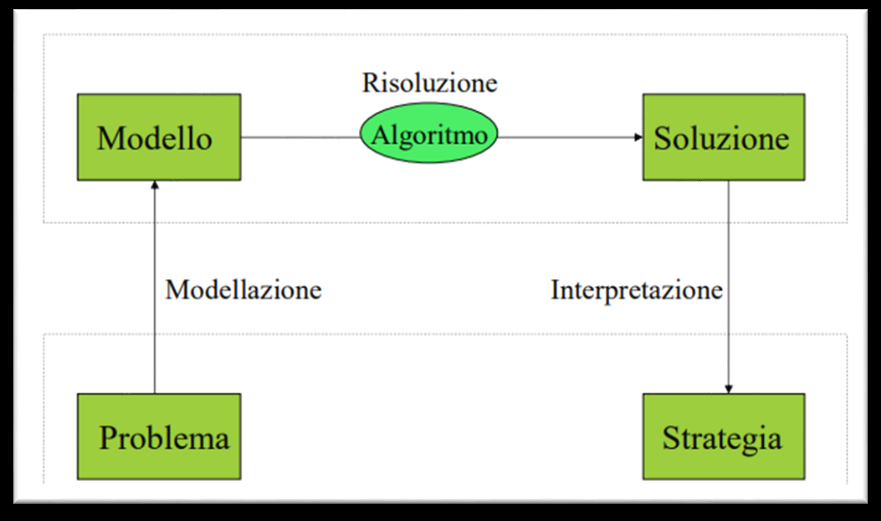

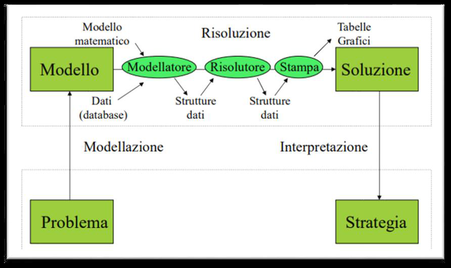

<!-- Page 12 -->

proprio la capacità del modello di fornire previsioni corrette sul comportamento 
della realtà modellata in determinate circostanze di interesse e l’utilizzabilità del 
modello. 
La qualità del modello è garantita da un trade-off tra la necessità di tenere in conto 
di tutti gli elementi necessari ed avere un modello sufficientemente semplice. 
Esempi: 
04_modelli_program
mazione_matematica.p 
 
Tecniche standard per utilizzare variabili intere per rappresentare varie situazioni: 
• Limiti inferiori/superiori: variabili nulle o con un valore contenuto in un certo 
intervallo 
 
 
• Costi fissi di attivazione: per produrre anche solo una quantità infinitesimale 
di un certo prodotto, si incorre in un costo fisso k per attivare la produzione. 
Non produrre nulla invece ha costo 0.

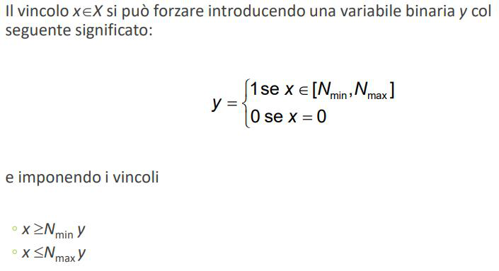

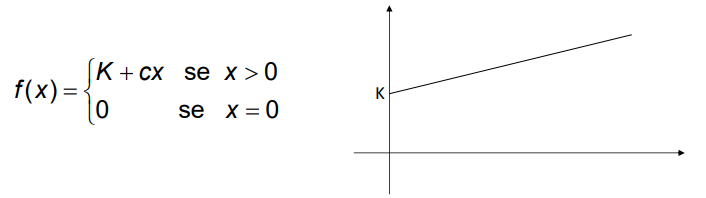

<!-- Page 13 -->

• Economie di scala: spesso, più unità si producono, minore è il costo unitario 
 
 
 
 
 
in cui gli effettivi coefficienti che partecipano alla funzione obiettivo sono 
solamente quelli che corrispondono al preciso intervallo di produzione scelto,

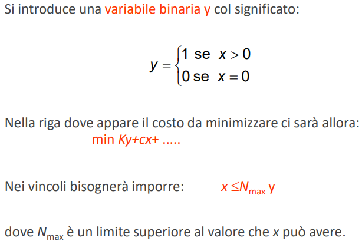

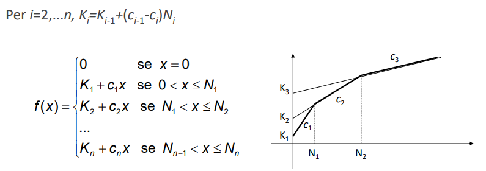

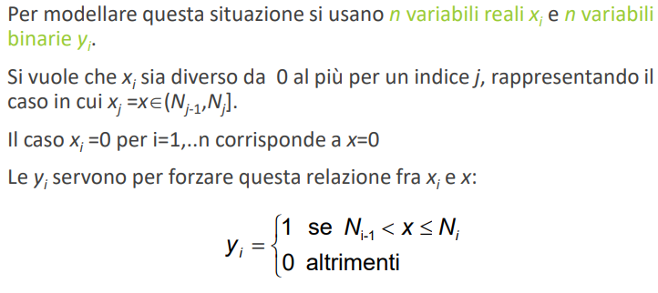

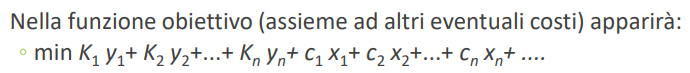

<!-- Page 14 -->

tutti gli altri valori saranno annullati dai vari valori di yi. 
 
• Selezione da un insieme finito: le variabili binarie possono essere usate come 
selettori (come y nel caso precedente). Si impone che la somma di tutte le 
variabili binarie sia minore uguale a 1, o esattamente 1 nel caso vogliamo 
includere esattamente una soluzione. 
 
4. Risoluzione dei problemi di programmazione matematica 
05_cenni_solutori_p
rogr_mat.pdf
 
Modello matematico: 
• Si parte da una descrizione verbale del problema e successivamente si formula 
in termini matematici. 
• Si individuano le variabili di decisione (ovvero le grandezze di interesse che si 
possono controllare) che costituiscono le incognite del problema, che 
definiscono i vincoli e l’insieme ammissibile. 
• Si esprimono quantitativamente i legami tra le variabili e le limitazioni sulle 
variabili stesse. 
• Si definisce la funzione obiettivo che si vuole minimizzare. 
Complessivamente il problema è della forma min f(x) con x appartenente a S. 
 
Un modellatore fornisce un’interfaccia verso un risolutore, permettendo di evitare di 
imparare il linguaggio proprio del risolutore, ma usare particolari interfacce che 
possono dialogare con qualunque risolutore.

<!-- Page 15 -->

Hanno l’obiettivo di fornire un linguaggio semplice per descrivere modelli complessi 
ad alto livello e interpretabile da un software. Si fornisce uno strumento 
indipendente dal risolutore. Tiene distinte la struttura logica del modello dal valore 
dei dati numerici allo scopo di modificare i dati senza cambiare modello. 
 
 
5. Problemi di allocazione di risorse – esempio catena del freddo 
06_CasoStudio_Distri
buzione_catena_fredd 
Localizzazione: problemi di dove piazzare un impianto; allocazione: come assegnare 
determinate attività all’interno di un centro. 
• Definire la locazione di centri di servizio 
• Soddisfare la domanda di uno o più beni da parte di centri di domanda 
• La domanda deve essere allocata al fine di permettere a ciascun centro di 
domanda di essere servito da almeno un centro di servizio.

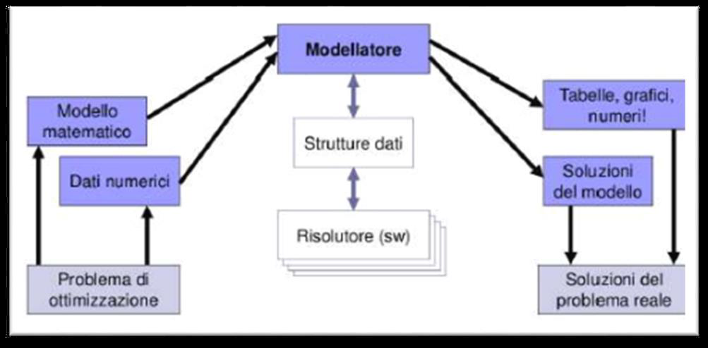

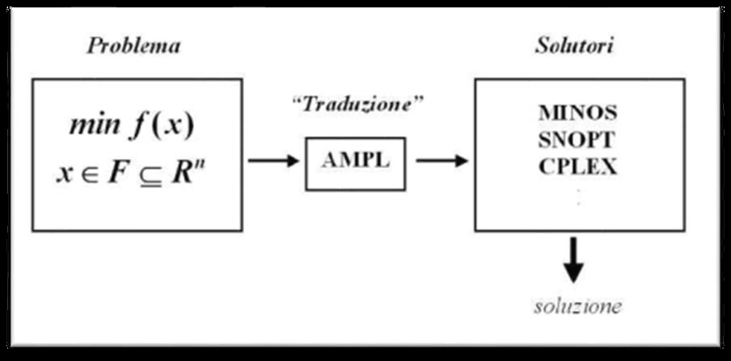

<!-- Page 16 -->

Spesso i modelli di localizzazione si rappresentano tramite un grafo, in cui i nodi 
rappresentano i centri di domanda / servizio. Spesso i grafi sono bipartiti, gli archi 
rappresentano che una domanda è fatta ad uno specifico centro di servizio, tra due 
centri di domanda non possono esserci archi. 
 
Nei modelli non capacitati ogni centro di domanda è servito da un solo centro di 
servizio e si sceglie la locazione a costo minimo con la minor somma dei costi di 
attivazione. Nei modelli capacitati frazioni di domanda possono essere allocate 
presso più centri di servizio. 
• Problemi p-mediana: necessario attivare esattamente p centri di servizio, 
minimizzando la somma dei costi di afferenza, costo medio. 
• Problemi p-centro: si attivano p centri di servizio cercando di minimizzare il 
massimo costo di afferenza. 
Catena del freddo: 
Barriera di ingresso dettata dal problema dello stoccaggio, mercato relativamente 
chiuso in quanto è richiesto un elevato capitale per poter entrare nel business. È 
necessario gestire le varie fasi della produzione, trasporto, stoccaggio e vendita. Il 
tempo di vendita del prodotto surgelato è inversamente proporzionale alla 
temperatura di conservazione.

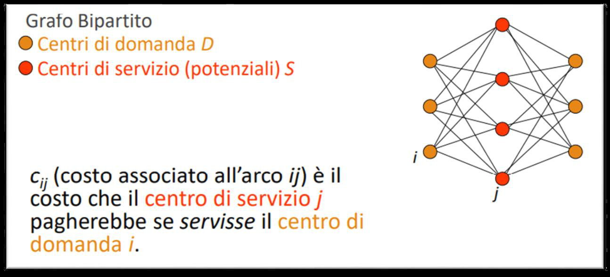

<!-- Page 17 -->

La logistica prevede l’utilizzo di quattro canali di distribuzione (commodities), che 
dipendono dal mercato di destinazione e dalle caratteristiche del formato della 
confezione del prodotto. 
Dai centri di produzione i prodotti finiti vengono distribuiti ai Centri Primari di 
Distribuzione – PDC non appena sono disponibili (sourcing). Successivamente i 
prodotti vengono trasferiti ai Centri Secondari di Distribuzione – SDC (flusso 
primario). La domanda dei Centri Secondari di Distribuzione deve essere soddisfatta 
da un solo Centro Primario di Distribuzione. Il prodotto immagazzinato in un PDC 
può essere anche trasbordato in un altro PDC, che deve essere temporaneamente 
rifornito (flusso interpolo). Infine, i prodotti vengono inviati ai siti di vendita al 
dettaglio successivi (flusso secondario). 
 
La gestione deve tenere conto della qualità dei prodotti, direttamente correlati alla 
temperatura alla quale gli stessi prodotti devono essere mantenuti; i costi di 
gestione, che includono il trasporto, stoccaggio, handling (movimentazione) e costi 
amministrativi. 
Il sourcing si occupa di soddisfare la domanda stagionale, ma con produzione make-
to-stock, ovvero produzione e messa in magazzino, l’alternativa è la produzione

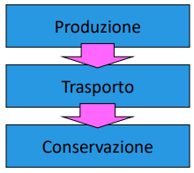

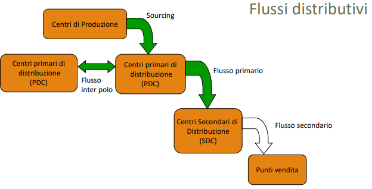

<!-- Page 18 -->

make-to-order, ovvero produrre solamente su richiesta. Gestione degli acquisti 
centralizzati a livello corporate, spedizione dei lotti presso i CPD. 
Stoccaggio: I depositi secondari possono essere concessionari o centralizzati, hanno 
l’obiettivo di garantire l’approvvigionamento ai punti vendita; i depositi primari sono 
orientati alla logistica. Lo stoccaggio deve garantire una serie di requisiti strutturali, 
come temperatura da mantenere, capacità; e costi, di storage fissi o di 
movimentazione per i singoli bancali. 
Trasporto: si occupa di gestire il flusso dai CPD ai CSD. Trasporto effettuato su 
gomma, spesso affidati a privati. Deve tenere conto dei costi a tariffazione. 
 
 
6. Applicazioni nella sanità – esempi 
07_applicazioni_sanit
à.pdf
 
 
7. Cenni alla complessità computazionale 
08_cenni_complessi
ta_computazionale.p 
In modo informale si usa dire che un determinato problema è facile se si riesce a 
risolverlo in modo efficiente, viceversa difficile un problema per cui questo non sia 
possibile. Per efficienza si intende la velocità con cui si riesce a risolvere il problema. 
Il tempo di esecuzione, ovvero il tempo impiegato per trovare una soluzione, 
dipende da hardware, compilatore, input, ecc. Per valutare la complessità di un

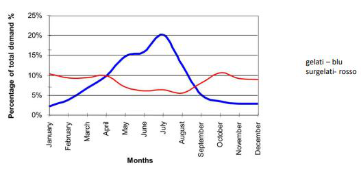

<!-- Page 19 -->

algoritmo, bisogna stabilire un modello di calcolo di riferimento. Un modello di 
calcolo è una macchina astratta che definisce l’insieme delle operazioni ammissibili 
ed eseguibili durante una computazione. 
Si misurano le risorse di calcolo usate da un algoritmo in funzione della dimensione 
dell’istanza in input. Esistono due modalità di dimensionare l’input: quantità di 
memoria effettiva usata; parametrizzazione della dimensione dell’input, ovvero 
numero di elementi nella sequenza. La complessità degli algoritmi è espressa in 
notazione asintotica rispetto alla dimensione dell’input (notazioni O grande, omega, 
theta). 
Complessità degli algoritmi e dei problemi: 
Ci si concentra sui problemi risolubili, ovvero quelli per cui esiste un algoritmo 
risolutivo che in tempo finito riesce a trovare una soluzione. Si distinguono i 
problemi trattabili da quelli intrattabili, dove trattabile significa che il problema può 
essere risolto prima che sia diventato inutile averne trovato una soluzione (tempo 
finito ma troppo elevato). 
Algoritmo (deterministico): insieme di operazioni da eseguire per risolvere un 
problema. 
Sia Tempo (I) il numero di passi elementari di un algoritmo sull’istanza I. Allora, la 
complessità computazionale dell’algoritmo è: 
 
T(n) è il numero di passi elementari dell’algoritmo sulle istanze di ingresso che 
comportano più lavoro per l’algoritmo stesso. 
Analisi del caso peggiore in quanto l’upper bound rappresenta una garanzia sul 
tempo di esecuzione su ogni possibile istanza di input. 
• Un algoritmo A ha una complessità computazionale O(f(n)) su istanze di 
dimensione n se T(n)=O(f(n)) 
• Un problema P ha una complessità computazionale O(f(n)) se esiste un 
algoritmo che risolve P la cui complessità computazionale è O(f(n)) 
 
Tipologie di problemi: 
• Problemi di decisione (o riconoscimento): problemi che richiedono una 
risposta binaria (sì o no). Ad esempio, il numero x è primo? Dato un grafo G, G 
è bipartito? Grafo Hamiltoniano (se un ciclo tocca tutti i nodi)?

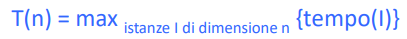

<!-- Page 20 -->

• Problemi di ricerca: richiedono di restituire una soluzione del problema. Ad 
esempio, trovare la media di un insieme di numeri. 
• Problemi di ottimizzazione: richiedono di restituire la soluzione migliore 
(rispetto ad un prefissato criterio) tra tutte quelle possibili. Ad esempio, 
trovare il cammino di lunghezza minima tra due nodi di un grafo. 
La classe P: un problema di decisione A appartiene alla classe P se esiste un 
algoritmo di soluzione la cui complessità e polinomiale nelle dimensioni dell’input. 
Ovvero, un problema se può essere risolto in tempo polinomiale. Ad esempio, 
connessione, alberi ricoprenti, programmazione lineare. 
La classe NP: Un problema di decisione A appartiene alla classe NP se, data 
un’istanza affermativa di tale problema, è possibile fornire un certificato dal quale si 
possa verificare in tempo polinomiale che tale istanza è affermativa. Perché un 
problema sia in NP, non è necessario che esso sia risolubile in tempo polinomiale, 
ma solo che, se l’istanza è affermativa, ciò sia verificabile in tempo polinomiale. Non 
si tratta dunque di determinare in tempo polinomiale se l’istanza è affermativa o 
negativa, ma solo, data un’istanza affermativa, di avere la possibilità di verificarlo in 
tempo polinomiale. 
La classe P è inclusa nella classe NP. 
La classe co-NP: come la classe NP ma simmetrica. Un problema di decisione A 
appartiene alla classe NP se, data un’istanza NEGATIVA di tale problema, è possibile 
fornire un certificato dal quale si possa verificare in tempo polinomiale che tale 
istanza è negativa. 
Riduzione polinomiale tra problemi: Un problema di decisione A si riduce 
polinomialmente a un problema di decisione B se, data un’istanza a di A, è possibile 
costruire in tempo polinomiale un’istanza b del problema B tale che a è affermativa 
se e solo se b è affermativa. Se si sa risolvere il problema B allora si sa risolvere 
anche il problema A. 
Problemi NP-completi: Un problema A si dice NP-completo se: 
• A∈NP 
• Preso un qualunque problema B∈NP, B si riduce polinomialmente ad A. 
Se un problema è NP-completo, vuol dire che esso è almeno altrettanto difficile 
quanto qualunque altro problema in NP. Dunque, i problemi NP-completi 
rappresentano i più difficili problemi in NP.

<!-- Page 21 -->

8. Commesso viaggiatore – TSP 
09_introduzione_com
messo_viaggiatore.pd 
 
9. Metodi euristici 
10_Metodi_euristici.
pdf
 
Non c’è nessuna garanzia a priori sulla qualità della soluzione. Algoritmi di 
approssimazione garantiscono a propri che la soluzione non si discosti di molto dalla 
soluzione ottima, forniscono una valutazione teorica sulla qualità della soluzione 
trovata nel caso peggiore. Gli euristici in generale non forniscono alcuna garanzia 
sulla bontà della soluzione trovata, nel caso peggiore possono comportarsi molto 
male in termini di soluzione, molto lontana dall’ottimo e/o per tempi di calcolo 
esponenziale. Nella pratica però questi algoritmi si comportano bene e spesso si 
preferiscono agli approcci che garantiscono determinate garanzie. 
Gli algoritmi euristici possono essere classificati come segue: 
• Algoritmi costruttivi: sfruttano le proprietà strutturali delle soluzioni 
ammissibili del problema. Viene costruita una soluzione ad hoc del problema a 
partire da zero. Dipendono fortemente dal problema considerato e di solito 
richiedono tempo di calcolo polinomiale. 
• Algoritmi enumerativi: si esaminano diverse soluzioni generate rapidamente e 
viene scelta la migliore. Devono solamente essere adattate al problema 
considerato. Potrebbe richiedere tempo di calcolo esponenziale nel caso 
peggiore. 
Sono classificati secondo il metodo usato per la generazione delle soluzioni: 
o Le nuove soluzioni si ricavano modificando leggermente la struttura 
delle soluzioni già note. Ad esempio, ricerca locale 
o Le nuove soluzioni provengono dalla soluzione di problemi parziali di 
dimensioni più piccole. Ad esempio, tecniche basate su PL, come 
varianti Brench and Bound. 
Analisi degli algoritmi euristici: un algoritmo euristico può essere analizzato sia da 
un punto di vista teorico sia da uno sperimentale:

<!-- Page 22 -->

• Analisi teorica a priori: valutare alcune proprietà formali dell’algoritmo, come 
la sua complessità temporale ed eventualmente il suo rapporto di 
approssimazione, ossia per quanto la soluzione trovata si discosta dalla 
soluzione ottima. 
• Analisi sperimentale a posteriori: descrive come l’algoritmo funziona 
effettivamente nella pratica. 
Il metodo sperimentale applicato agli algoritmi euristici permette di studiare gli 
algoritmi come se fossero un tipo di fenomeno naturale. 
Il metodo sperimentale seguito nelle scienze naturali è: 
1. partire da osservazioni quantitative (misure) 
2. formulare un modello per interpretare le osservazioni 
3. progettare esperimenti per convalidare il modello 
4. fare gli esperimenti e misurare i risultati 
5. verificare se il modello si adatta ai risultati o no 
6. migliorare il modello fino a quando non è soddisfacente. 
Tale analisi mira a capire quanto tempo di calcolo impiega l’algoritmo e la qualità 
delle soluzioni trovate. Oltre a questo, è di interesse la robustezza rispetto ad alcuni 
parametri rilevanti delle istanze. Per tali obiettivi si osservano principalmente il 
valore/costo della soluzione euristica e il tempo di calcolo necessario per calcolarla. 
Il data set dovrebbe includere: 
• Istanze con diverse dimensioni. 
• Istanze con diverse caratteristiche parametrizzate. 
• Istanze con diverso tipo di applicazioni, di metodi di generazione, di 
distribuzioni di probabilità. 
È necessario che gli esperimenti siano riproducibili. Le istanze sono generate ed 
esattamente riproducibili. La descrizione dell’algoritmo deve essere esaustiva e 
precisa, con l’inclusione del settaggio dei parametri (dettagli dell’implementazione 
software, hardware utilizzato, SO, RAM). 
Si considera quindi la qualità della soluzione, testando l’algoritmo per ogni istanza 
generata con una certa impostazione dei parametri e dei semi di generazione 
pseudo-random. Si cerca di dare una descrizione dei risultati ottenuti usando 
diagrammi statistici. Solitamente si procede confrontando i valori generati 
dall’algoritmo con la soluzione ottima, ricavando il valore medio dell’errore relativo, 
si analizza quindi la varianza di tale errore relativo. I risultati sono spesso influenzati 
da pochi risultati cattivi e potrebbe non essere conosciuto il valore ottimo.

<!-- Page 23 -->

I risultati del tempo di calcolo sono estratti in maniera analoga. Si eseguono più run 
con valori fissati delle dimensioni del problema, si ricavano i tempi di esecuzione e si 
effettua una media. Utilizzo della funzione di distribuzione Run Time Distribution – 
RTD per ottenere diagrammi del tempo di calcolo mantenendo fissa la dimensione n 
e altri parametri rilevanti. Un diagramma di scaling si analizza per lo studio empirico 
del tempo di calcolo al variare di n. 
Il confronto tra algoritmi per lo stesso problema è effettuato in funzione della qualità 
delle soluzioni e del tempo impiegato. 
 
10. Metodi costruttivi 
 
Tecniche che costruiscono una soluzione ammissibile (o in generale poche soluzioni). 
Tale soluzione è costruita andando a guardare la struttura di una soluzione 
ammissibile. Di solito sono algoritmi molto semplici, o greedy. 
The Knapsack Problem: sono disponibili n oggetti e un contenitore di capacità 
limitata B, per ogni oggetto sono noti peso wi e valore pi. Si vuole individuare il 
sottoinsieme di oggetti di valore totale massimo il cui peso non superi la capacità del 
contenitore. 
Algoritmo greedy (versione 1): 
• ordina gli oggetti per profitti non crescenti, tali che p1≥ p2 ≥ .... ≥ pn 
• inserisci gli oggetti nel contenitore fino a che vi è capienza 
• restituisci la soluzione S così ottenuta. 
Algoritmo greedy (versione 3): 
• ordina gli oggetti per densità non crescente, cioè tali che p1 /w1 ≥ p2 /w2 ≥ .... ≥ 
pn /wn. 
• inserisci gli oggetti nel contenitore fino a che vi è capienza; sia S la soluzione 
così ottenuta e z il suo valore, 
• se z≥pMAX (dove pMAX = maxi=1,..n{pi} è il profitto massimo), scegli come 
soluzione ottima S, altrimenti scegli come soluzione l’oggetto di profitto 
massimo. 

<!-- Page 24 -->

• Insertion Heuristics: euristica più utilizzata se si cerca una soluzione in tempi 
estremamente rapidi senza porre troppa attenzione alla soluzione. Si sceglie 
un nodo di partenza randomico e si costruisce un cammino, aggiungendo 
iterativamente nuovi nodi seguendo un certo criterio. Tale criterio consiste 
nello scegliere una funzione che permette di selezionare il nodo successivo e 
dove inserire il nuovo nodo nel cammino corrente. 
o Nearest Neighbor: ad ogni passo l’algoritmo seleziona il nodo più vicino 
all’ultimo nodo inserito nel cammino corrente T. Tale nodo viene 
inserito alla fine di T. 
o Nearest Insertion: ad ogni passo l’algoritmo sceglie il nodo con distanza 
minima da un qualsiasi nodo di T. Tale nodo viene inserito nel punto in 
cui si crea un incremento minimo della funzione obiettivo. 
o Farthest Insertion: ad ogni passo viene scelto il nodo la cui distanza dal 
nodo più vicino è massima (fra tutte le distanze minime, si sceglie la 
massima). Il nodo viene inserito nel cammino T nel punto in cui 
l’inserimento fa crescere di meno la funzione obiettivo. L’idea è di 
scegliere subito i nodi più spinosi. 
o Cheapest Insertion: l’algoritmo sceglie il nodo il cui inserimento nel 
cammino T introduce il minimo incremento nella funzione di T. Valuta 
ogni nodo singolarmente e richiede in generale più tempo. 
o Random Insertion: l’algoritmo sceglie in maniera casuale il nodo 
successivo da inserire. Tale nodo è inserito dove fa crescere di meno la 
lunghezza del cammino. 
o Smallest Sum Insertion: l’algoritmo seleziona il nodo j tale che la sua 
distanza da tutti i nodi in T è minima. Il nodo viene inserito alla fine di T.

<!-- Page 25 -->

• Savings Methods: si inizia da un insieme di semplici cicli parziali, che vengono 
poi iterativamente uniti fino a che non si ottiene un unico ciclo che tocca tutti i 
nodi del grafo. Si deve decidere con quale criterio sono definiti i cicli iniziali, 
come si selezionano le coppie di cicli da unire e come si uniscono i cicli. 
Sia (Ti,Tj) il risparmio (saving) associato ad una coppia di cicli parziali Ti eTj 
definito come la differenza fra la somma delle lunghezze di Ti eTj e la 
lunghezza della loro unione. Viene scelta la coppia Ti ,Tj di risparmio massimo. 
• Euristiche basate su alberi ricoprenti: 
o Algoritmo albero: calcola l’albero ricoprente di peso minimo T. 
raddoppia tutti gli archi di T, ottenendo il multigrafo euleriano TE. Dato 
un ciclo euleriano (ciclo che attraversa tutti gli archi del grafo una e una 
sola volta) CE su TE, si calcoli un ciclo hamiltonianto CH, cancellando tutti 
i nodi ripetuti. 
o Algoritmo di Christofides: Calcola l’albero ricoprente di peso minimo T; 
Calcola il matching perfetto di peso minimo M sul sottografo completo 
indotto da tutti i nodi che hanno grado dispari in T; Aggiungi gli archi di

<!-- Page 26 -->

M a T ottenendo il grafo euleriano GE; Dato un ciclo euleriano CE su GE, 
si calcoli un ciclo hamiltoniano CH (cancellando tutti i nodi ripetuti).

<!-- Page 27 -->

Nel caso TSP metrico (caso simmetrico e pesi che soddisfano la disuguaglianza 
triangolare) sono algoritmi di approssimazioni, ovvero forniscono una garanzia 
a propri sulla qualità della soluzione trovata, ma necessitano di più tempo per 
trovare la soluzione. 
• Algoritmi per istanze geometriche: Punti su un piano come nodi di un grafo. 
o Algoritmi a generazione di inviluppo: Si costruisce inizialmente un 
poligono P0 contenente l’insieme V={v1 , v2, …, vn } dei punti o nodi. P0

<!-- Page 28 -->

può essere la figura piana convessa di area minima che contiene quei 
punti, i.e. l’inviluppo convesso dei punti dati. 
 
o Algoritmi a sezione: Ciascun problema viene scomposto in sotto 
problemi corrispondenti a sezioni della regione di spazio interessata. 
Per ogni sezione viene risolto un problema di cammino hamiltoniano di 
peso minimo. I cammini così ottenuti vengono poi uniti per ottenere un 
unico cammino hamiltoniano per il problema globale. 
 
o Algoritmi sweep: dividere in settori (spicchi) l'area in cui sono i nodi e 
visitarli nell'ordine. Più precisamente, si fissa un punto centrale nell'area 
e da esso si trae un raggio che scorre l'area stessa, in verso orario o 
antiorario. Il percorso viene costruito collegando via via, nell'ordine, i 
nodi toccati dal raggio. 
Questo algoritmo ha un vantaggio teorico, dato che le sue soluzioni 
godono di una proprietà tipica della soluzione ottima di un problema di 
commesso viaggiatore: gli archi che ne fanno parte non si incrociano 
mai fra loro.

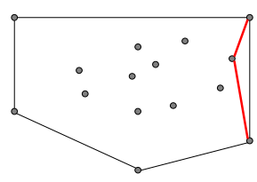

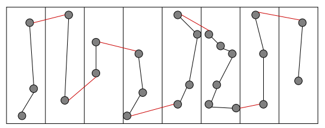

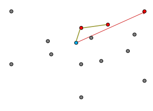

<!-- Page 29 -->

11. Metodi di ricerca locale 
Ricerca nello spazio delle soluzioni modificando leggermente la struttura di soluzioni 
già note. Si basa sull’approccio più semplice e istintivo all’ottimizzazione: andare per 
tentativi. La messa a punto dell’algoritmo spesso risulta però laboriosa. 
Supponiamo di avere un problema di minimizzazione con x soluzione ammissibile e 
f(x) valore funzione obiettivo. Si definisce un insieme di soluzioni vicine alla 
soluzione ammissibile x (vicinato di x, N(x)). Si cerca nel vicinato una soluzione 
migliore di quella a disposizione. Se nel vicinato si trova una soluzione migliore, 
allora ci si sposta dalla soluzione ammissibile x a y e si riparte da y con l’esplorazione 
del suo intorno. Se invece nel vicinato di x non si scopre nessuna soluzione migliore, 
allora vuol dire che x è un minimo locale. Lo spostamento da x a y si dice mossa. 
Con la ricerca locale ci si ferma in un ottimo locale x*, ossia tale che f(𝑥̅)≤f(x) 
xN(𝑥̅). Un ottimo globale è un ottimo locale, ma non viceversa. 
Il processo di ricerca è rappresentato all’interno del grafo di ricerca in cui i nodi 
rappresentano soluzioni ammissibili e gli archi collegano ogni soluzione x con quelle 
del suo vicinato. 
Scelte di fondo: 
• Soluzione iniziale ammissibile: generata da un’euristica ad hoc per il 
particolare problema o può essere generata casualmente. È possibile anche 
eseguire l’algoritmo a partire da diverse soluzioni iniziali, ottenendo così 
diverse soluzioni euristiche e scegliere poi la migliore (Multi Start). 
• Vicinato: bisogna definire in modo preciso e opportuno il vicinato di una 
soluzione. Con vicinati piccoli ci si muove più facilmente ma si potrebbe 
rimanere bloccati in un minimo locale; con vicinati grandi si utilizza più tempo 
per ottenere una soluzione migliore, ma si hanno meno probabilità di 
rimanere bloccati in minimi locali. La scelta della grandezza del vicinato si basa 
su questo trade-off. 
• Esplorazione: occorre avere a disposizione un algoritmo efficiente per 
esplorare il vicinato. A seconda di come vengono fatte queste scelte ne 
emerge un algoritmo più o meno migliore. 

<!-- Page 30 -->

Mossa 2-OPT: eliminare due archi dal ciclo corrente e riconnetterli in modo diverso. 
Una mossa è conveniente se la somma dei costi dei due archi è minore della somma 
dei costi degli archi dopo aver effettuato lo swap. 
Mossa 3-OPT: eliminare tre archi dal ciclo corrente e inserirne altri tre in modo da 
ricreare un ciclo, al crescere della dimensione del vicinato la probabilità di trovare 
l’ottimo diminuisce. Per ridurre i tempi di calcolo si limita il numero di mosse 
possibili ad ogni iterazione dell’algoritmo di ricerca locale. Passando da k=2 a k=3 si 
ha un miglioramento sensibile nella qualità della soluzione trovata. Passando a k=4 i 
miglioramenti rispetto alla soluzione fornita da k=3 risultano piuttosto piccoli. 
Scelte realizzative nella ricerca locale: 
• Definizione del vicinato: connessa al concetto di perturbazione di una 
soluzione ammissibile. Nel caso del TSP lo scambio di posizioni tra due oggetti 
è spesso la scelta più naturale. 
• Forza di un vicinato: un vicinato definito in un certo modo è tanto forte quanto 
più la qualità delle soluzioni prodotte dall’algoritmo è indipendente dalla 
bontà della soluzione di partenza. Solitamente un vicinato forte corrisponde 
ad un vicinato grande e richiede una certa capacità di calcolo per visitarlo. 
• Modo in cui viene esplorato il vicinato di una soluzione: 
o First improvement: l’esplorazione del vicinato termina non appena si 
trova una soluzione migliore di quella corrente. 
o Steepest descent: si esplora comunque tutto il vicinato e scegliere la 
soluzione che porta il massimo miglioramento della funzione obiettivo. 
La ricerca locale è concettualmente semplice e facile da implementare. Il criterio di 
arresto dell’algoritmo in generale però è troppo rigido: nella grande maggioranza dei 
problemi reali la funzione obiettivo presenta un grande numero di minimi locali e 
l’algoritmo potrebbe rimanere bloccato in tali minimi locali. 
Tipi di vicinato: 
• Vicinati basati sulla distanza: le soluzioni sono rappresentate da vettori di 
incidenza, vettori di bit. Si definisce distanza di Hamming fra due vettori 0-1 il 
numero di componenti in cui i due vettori sono diversi. Nei vicinati basati sulla 
distanza ci si sposta da una soluzione x a una soluzione x' che sia a distanza di 
Hamming minore o uguale a una certa soglia k. 
• Vicinati definiti da una operazione: si ottiene definendo un insieme O di 
operazioni (mossa) che possono essere eseguite sulle soluzioni del problema.

<!-- Page 31 -->

I metodi di ricerca locale visti finora sono a profondità fissa, ovvero per passare da 
una soluzione corrente a una soluzione vicina si eseguono un certo tipo di operazioni 
fissate. 
Ricerca locale a profondità variabile: ha come obiettivo il ridurre le possibilità di 
rimanere bloccati in un minimo locale. Il numero di scambi usato per passare dalla 
soluzione corrente alla successiva non è fissato a priori. Di solito per passare da una 
soluzione x a una y si applica una sequenza di t mosse non fissate a priori ottenendo 
una sequenza di soluzioni e scegliendo la migliore fra queste. Per fare ciò si utilizza 
una funzione che indica il guadagno ottenibile per ogni sequenza di scambi. 
 
Algoritmo Ricerca Locale: 
• sia data una soluzione euristica (A;B); 
• per ogni coppia di vertici aA e bB valuta: guadagno(a,b) = Da + Db -2wab; 
• tra tutte le coppie aventi guadagno positivo (se ve ne sono), scegli quella che 
dà guadagno massimo (prova tutti gli swap); 
• reitera fino a quando non esistono più guadagni positivi. 
Aumentando la dimensione del vicinato, aumentano gli scambi da effettuare tra i 
vertici di A e B (due vertici ciascuno). Pertanto, la dimensione del vicinato assume il 
valore di O(n4), rendendo il calcolo troppo dispendioso. Si assume un nuovo tipo di 
vicinato, nell’algoritmo di Kernigan e Lin. 
Algoritmo di Kernigan e Lin: 
 
Il criterio di arresto prevede che, se tra le n partizioni individuate nei passi intermedi 
nessuna risulta strettamente migliore, allora ci si arresta. Ciò prevede un vicinato 
esteso ma con un costo computazionale limitato (O(n3)). 
Sperimentalmente si è notato che l’algoritmo offre buoni risultati, applicabile in 
modo naturale ai problemi in cui vi sono da collocare oggetti tra due risorse.

<!-- Page 32 -->

A partire dagli anni ’80, la ricerca si è indirizzata verso approcci euristici che 
generalizzano la ricerca locale, cercando di ovviare ai suoi principali difetti. Questi 
approcci sono noti come metaeuristiche. 
 
12. Simulated Annealing 
13_simulated_anneali
ng.pdf
 
Algoritmo a soglia: si parte da una soluzione di partenza x, si fissa k uguale a zero. Si 
genera una soluzione del vicinato, si verifica se il valore della soluzione non si 
discosta di una soglia tk dalla soluzione x, se così è si accetta la soluzione, altrimenti 
si aumenta il contatore e si ripete fino a che non viene verificato un criterio di 
arresto. Inizialmente si accettano soluzioni che peggiorano anche di molto la 
soluzione attuale. Nel seguito si riduce sempre più la disponibilità a peggiorare. 
Simulated annealing è una tecnica di ricerca locale di algoritmo a soglia la cui 
ispirazione viene dalla meccanica statistica e applicata principalmente ad algoritmi di 
ottimizzazione. Il meccanismo a soglia per sfuggire ai minimi locali è di tipo 
probabilistico. 
Oltre ad accettare soluzioni che migliorano la soluzione obiettivo, in certi casi si 
accettano anche transizioni che portano a peggioramenti. La probabilità di accettare 
tali deterioramenti varia nel corso del processo di ricerca e discende lentamente 
verso zero. Verso la fine della ricerca, di fatto, si accettano solo miglioramenti, 
diventando una semplice ricerca locale. Però questa possibilità di accettare 
peggioramenti permette di abbandonare i minimi locali e visitare soluzioni con 
caratteristiche diverse. 
Se il sistema si trova all’equilibro termico ad una certa temperatura T, allora la 
probabilità che esso sia in una data configurazione s dipende dall’energia dello stato 
E(s) e segue la distribuzione di Boltzmann. 
 
Negli anni ’50, Metropolis fece una simulazione per calcolare la distribuzione di un 
sistema di particelle all’equilibrio termico. Supposto che il sistema si trovi in una

<!-- Page 33 -->

configurazione q avente energia E(q), allora un nuovo stato r, con energia E(r), si può 
generare spostando una delle particelle dalla sua posizione. Se la nuova 
configurazione ha un livello di energia più basso della precedente il nuovo stato 
viene accettato; se invece la nuova configurazione ha un livello di energia più alto 
della precedente, non viene respinto, bensì viene accettato con una probabilità pari 
alla differenza delle energie. 
A partire da questa simulazione, Kirkpatrick utilizzò tali schemi per risolvere 
problemi di ottimizzazione combinatoria. Sostituì l’energia con il valore della 
funzione obiettivo, lo stato (configurazione del sistema fisico) come soluzione del 
problema. La minimizzazione è raggiunta scaldando prima il sistema e 
successivamente raffreddando lentamente fino a raggiungere una configurazione 
stabile. 
Schema di principio del Simulate Annealing: 
• L’energia diventa la funzione obiettivo 
• Le configurazioni di particelle divengono le configurazioni di parametri del 
problema da ottimizzare 
• Ricercare uno stato minimo di energia significa ricercare una soluzione che 
minimizza la funzione obiettivo 
• La temperatura diventa un parametro di controllo, indica la probabilità di 
accettare o meno un peggioramento della funzione obiettivo. 
Per implementare l’algoritmo bisogna stabilire come far variare i parametri, come 
scende la temperatura, per quanto tempo far rimanere invariata la temperatura. 
Definire un modo per generare nuove soluzioni a partire da quelle già note (analogo 
al vicinato).

<!-- Page 34 -->

Con theta temperatura e x 
soluzione ammissibile. 
 
 
 
 
 
 
 
 
 
L’algoritmo parte da una soluzione x e un valore di theta, si procede fino a che non si 
verifica una condizione di arresto, questa situazione si verifica quando si raggiunge 
una soluzione soddisfacente o in corrispondenza del raggiungimento della 
temperatura di congelamento. 
Schema di annealing statico: 
• Valore iniziale di theta: di solito valore abbastanza alto e fissato stimando la 
differenza di due funzioni obiettivo dello stesso vicinato. 
• Funzione per diminuire theta nel tempo: tipicamente si moltiplica per una 
costante alfa minore di 1 [0.8, 0.99]. 
• Criterio di arresto: di solito si ferma quando si raggiunge una certa 
temperatura, si fissa un valore di theta basso che corrisponda con la fine 
dell’algoritmo. È necessario anche fissare un valore massimo di iterazioni che 
possono essere effettuate senza variare theta. 
 
13. Tabu Search 
14_tabu_search.pdf

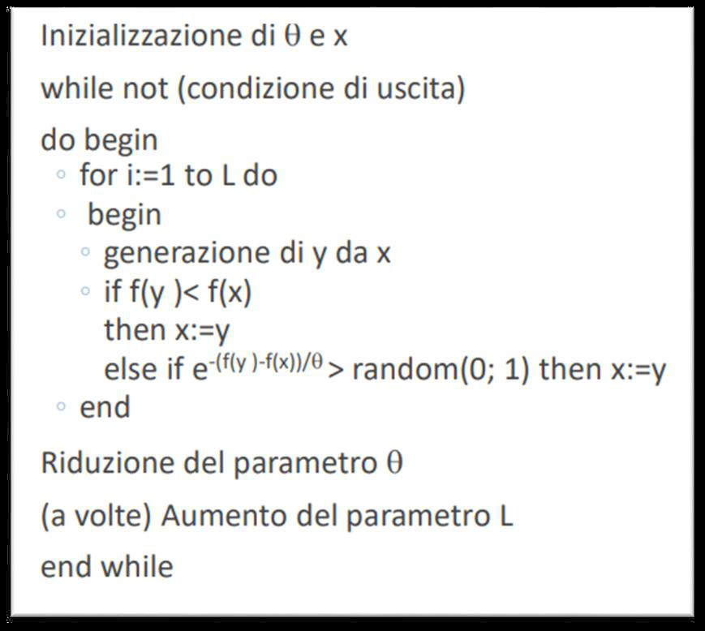

<!-- Page 35 -->

Nella ricerca locale classica ci si ferma in un minimo locale. L’informazione che si 
possiede è quindi la migliore soluzione corrente con il relativo valore della funzione 
obiettivo. 
Nella Tabu Search, per uscire dai minimi locali, mantiene memoria delle ultime 
soluzioni visitate e fa in modo di uscire dai minimi locali evitando di tornare sulle 
soluzioni già visitate. 
Di solito, a partire da una soluzione x, ci si sposta sulla soluzione yN(x) in 
corrispondenza del minimo peggioramento della funzione obiettivo. Però, se ci 
spostiamo su y ed esploriamo il suo vicinato, è probabile che la migliore soluzione sia 
x. 
 
Nella Tabu Search, si tiene in memoria le ultime mosse, in modo da non ripeterle al 
contrario. Nell’esempio precedente si vieta quindi di ritornare nel primo ottimo 
locale. Alcune soluzioni possono essere escluse. 
La Tabu list T è una coda in cui vengono memorizzate le informazioni sulle ultime 
soluzioni al fine di impedire di tornare su soluzioni già visitate. La Tabu list permette 
di memorizzare le ultime soluzioni visitate (computazionalmente oneroso) oppure di 
memorizzare solamente alcune caratteristiche della soluzione (come l’ultima mossa 
effettuata). 
La lunghezza della lista, o Tabu tenure, nel caso sia troppo lunga, potrebbe 
inutilmente vincolare il processo di ricerca verso l’ottimo globale. Viceversa, per una 
lunghezza troppo corta, potrebbe rendere possibile il ciclaggio. Il valore ottimale 
della lunghezza della tabu list tipicamente non supera il valore 10. Una lunghezza 
dinamica è stata scelta come compromesso in alcuni problemi. 
I criteri di arresto più comuni sono: 
• Numero di iterazioni massime; 
• Numero di iterazioni dall’ultimo miglioramento della funzione obiettivo 
massimo;

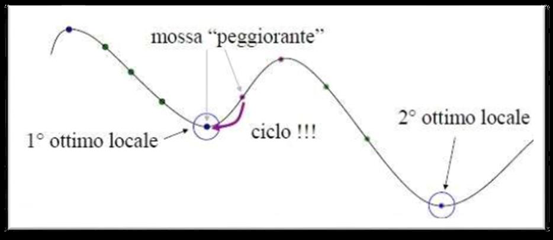

<!-- Page 36 -->

• Raggiungimento di una certa qualità della soluzione trovata. 
Criteri di aspirazione: in presenza di determinate condizioni, è possibile effettuare 
ugualmente una mossa tabu, se tale mossa ci porta sicuramente in una regione non 
visitata, o se ci porta ad una soluzione migliore dell’ottimo corrente. 
Algoritmo di tabu search: 
 
Due aspetti da tenere in considerazione, valido per tutte le meta-euristiche, è di 
usare, oltre alla tabu list, una memoria che consenta di usare intensificazione e 
diversificazione della ricerca. 
Intensificazione: se ci si trova in una regione dello spazio, in cui le soluzioni hanno 
delle caratteristiche che rendono la regione promettente, si può voler intensificare la 
ricerca in questa determinata zona. Per fare questa cosa solitamente c’è una 
memoria a medio termine ausiliaria (solitamente di ricorrenza). È possibile riavviare 
la ricerca dalla migliore soluzione attualmente conosciuta e fissando i componenti 
che sembrano più promettenti. L’intensificazione è utilizzata in molte 
implementazioni di TS, ma non sempre necessaria. 
Diversificazione: concetto opposto all’intensificazione. Si cerca di spostare 
forzatamente la ricerca in una porzione di spazio non ancora visitata. Di solito si usa 
una memoria a lungo termine in cui si registra quali componenti sono state usate per 
ottenere la soluzione corrente. Si usano due principali tecniche: 
• Re-start diversification: si forzano alcune componenti usate raramente nella 
soluzione corrente e riavviare la ricerca da quel punto.

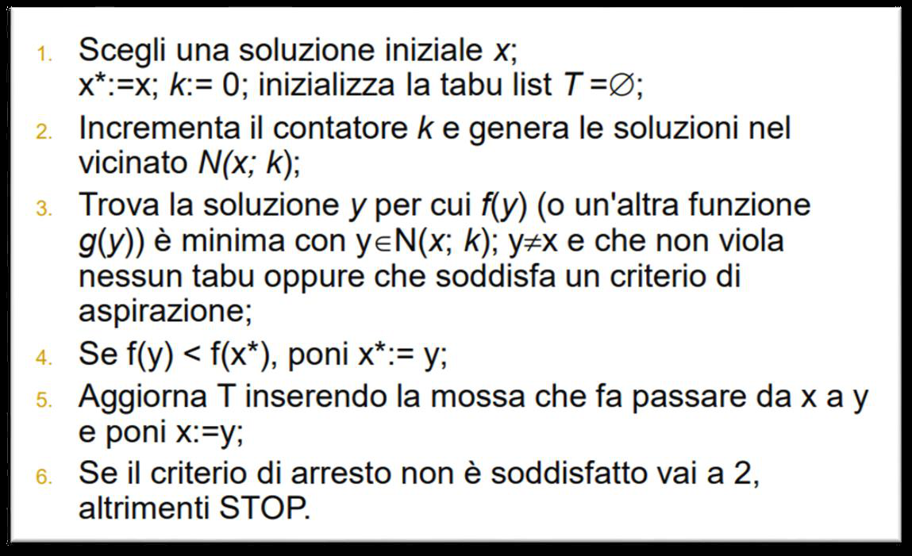

<!-- Page 37 -->

• Continuous diversification: si modifica la ricerca aggiungendo un termine alla 
funzione obiettivo legata alla frequenza di apparizione di alcune componenti, 
cercando di evitare che le stesse componenti appaiano più volte. 
Varianti della tabu search: 
• Probabilistica: si cerca di incorporare un elemento probabilistico nella ricerca. 
Ad ogni passo viene scelta la mossa in funzione dei valori di probabilità. 
Inserimento di randomizzazione per introdurre diversificazione e non 
rimanere bloccati in minimi locali. Le mosse più attraenti, che producono 
valori di funzione obiettivo più piccoli dovrebbero ricevere una maggiore 
probabilità di accettazione. Viceversa, per mosse fatte di recente la probabilità 
di accettazione è molto bassa. L’algoritmo diventa probabilistico. 
• A soglia: nella fase migliorativa si scelgono solo mosse che portano un 
miglioramento della funzione obiettivo, se non sono presenti si passa alla fase 
mista, in cui si seleziona, fra le soluzioni ammissibili, la soluzione 
probabilisticamente migliore. 
• Reactive: la tabu list ha una lunghezza dinamica, in cui la lunghezza all’inizio è 
unitaria (tiene conto solo dell’ultima mossa) e viene aumentata quando si 
cicla, ovvero quando si ritorna a soluzioni già visitate. Viene diminuita quando 
per un po’ non si cicla. 
 
14. Algoritmi genetici 
15_Alg_genetici.pdf
 
Si ispirano al processo evolutivo degli organismi in natura. Fanno parte dei weak 
methods, ovvero si fanno poche assunzioni dei problemi. Sono molto efficienti in 
quanto necessitano di poche informazioni per funzionare e possono essere applicati 
a molti problemi diversi. 
Si usa una stringa per rappresentare una soluzione e si effettuano trasformazioni 
semplici su tale stringa per generare nuove soluzioni. 
Si suppone di avere un certo insieme di soluzioni, rappresentate da stringhe, di vario 
genere. Una funzione di fitness misura la qualità di tali soluzioni e può essere 
coincidente con la funzione obiettivo (spesso lo è). Si generano nuove soluzioni, 
“accoppiando” le soluzioni tra di loro. La nuova generazione può essere di varia 
numerosità e si effettua una selezione. Con la popolazione così selezionata si 
ricomincia il processo.

<!-- Page 38 -->

Le soluzioni sono rappresentate da stringhe, dette cromosomi, composti da geni 
(singoli bit). Dalla combinazione di due individui (crossover) nasce una nuova 
soluzione. Combinando opportunamente due stringhe si crea una terza stringa che 
mantiene i geni di entrambi i genitori. Si cerca di gestire la dimensione della 
popolazione. A ogni generazione verranno escluse dall’evoluzione dell’algoritmo 
tutte le soluzioni con basso valore di funzione obiettivo (selezione). Dopo un certo 
numero di iterazioni si verifica che le soluzioni non migliorano più, per diversificare la 
ricerca, si introduce un nuovo operatore detto mutazione che, prima di procedere 
alla successiva generazione, in alcuni degli individui della popolazione viene alterato 
un gene. 
 
Condizione di uscita: raggiungimento di una soluzione soddisfacente, con un valore 
di fitness giudicato buono, oppure il raggiungimento di un numero prefissato di 
generazioni da elaborare, con uno stallo di miglioramento per un numero fissato di 
generazioni. 
Selezione genitori: di solito c’è una probabilità che ciascun individuo diventi 
genitore, spesso tale probabilità è legata al valore di fitness: 
• Roulette wheel: ogni individuo riceve una porzione di una roulette 
proporzionale al proprio valore di fitness. Chi ha una fitness maggiore ha una 
probabilità maggiore di essere selezionato. 
• Tournament: si selezionano solo alcuni membri a caso e poi si sceglie il 
migliore tra questi. 
• Rank-based roulette wheel: simile alla roulette proporzionale, ma la porzione 
che ogni individuo riceve è basata interamente sul ranking 
Riproduzione: generazione di nuovi punti dello spazio di ricerca. Ciascuna coppia di 
individui prescelti genera con probabilità pc una coppia di figli. Si verifica uno 
scambio di geni tra i due genitori.

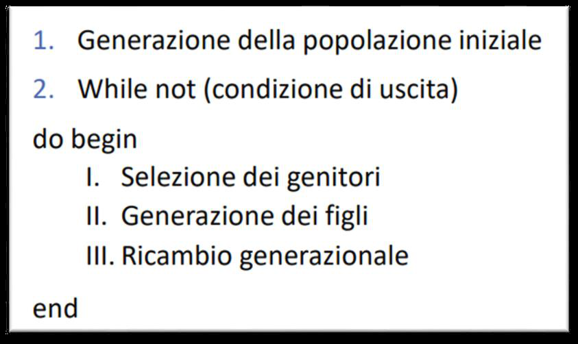

<!-- Page 39 -->

Attraverso la mutazione, con una probabilità pm, si sceglie casualmente un bit 
all’interno della stringa di un individuo e si complementa il suo valore (da 0 si 
trasforma in 1 o viceversa). 
Ricambio generazionale: si deve formare la popolazione da trasmettere alla 
generazione successiva, operando una selezione fra gli individui di cui si dispone, per 
limitate la dimensione della popolazione di soluzioni. 
• Ricambio generazionale classico: alla popolazione dei genitori si sostituisce la 
popolazione dei figli. 
• Ricambio classico con eccezioni: si preserva dalla scomparsa l’esemplare 
migliore in assoluto (o comunque un numero molto limitato di elementi), 
qualora la nuova popolazione non dovesse contenere nessuna soluzione 
migliore di esso. 
• Selezione naturale: tra genitori e figli in base alla qualità di ciascuno di essi. 
Sopravvivono solo gli esemplari migliori.

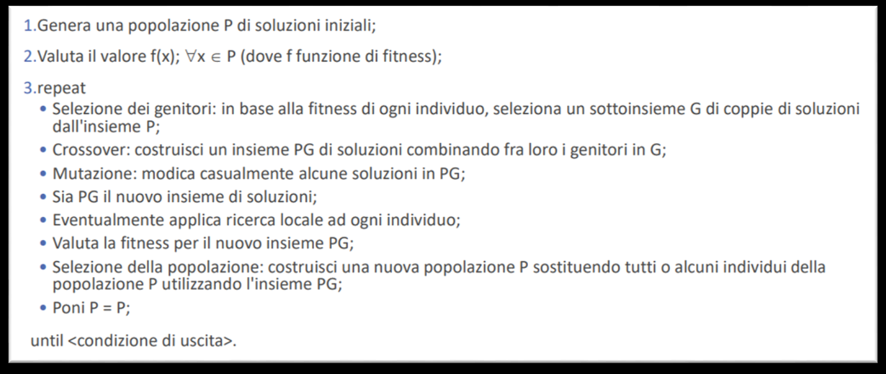

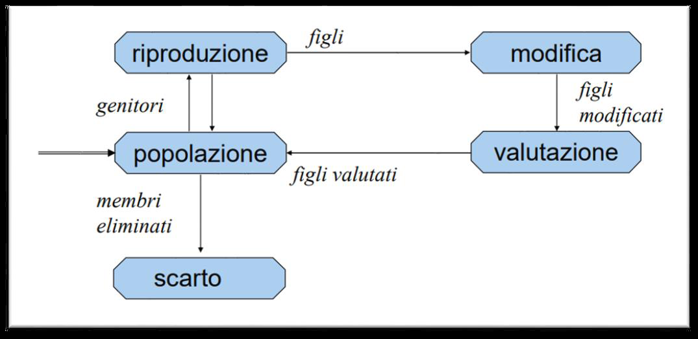

<!-- Page 40 -->

15. Altre metaeuristiche 
16_Altre_metaeuristic
he.pdf
 
Classificazione delle metaeuristiche: classificazione in cinque modi diversi a seconda 
di come sono definite. 
• Trajectory methods vs population-based methods: metodi trajectory 
(traiettoria) in cui si porta avanti una singola soluzione alla volta (tabu search e 
simulated annealing). Si esce dai minimi locali con una soluzione corrente alla 
volta, viene mantenuta in memoria la soluzione migliore trovata in quanto 
accetta anche soluzioni correnti che peggiorano la funzione obiettivo. Gli 
algoritmi, come i genetici, che portano avanti tante soluzioni, sono metodi 
basati sulla popolazione. Tecniche in cui si hanno tante soluzioni correnti e si 
usano metodi per generare nuove soluzioni da aggiungere alla popolazione.
 
• Nature-inspired vs non-nature inspired: classificazione basata su cui si ispira 
l’algoritmo: 
 
• Dynamic vs static objecting function: classificazione basata sul fatto che 
l’obiettivo cambia o non cambia durante l’esecuzione dell’algoritmo. Gli

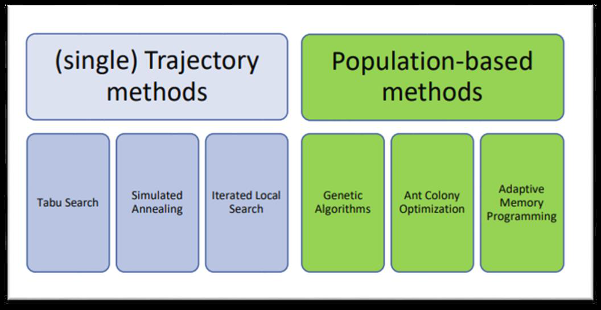

<!-- Page 41 -->

algoritmi statici mantengono invariata la soluzione obiettivo, tali funzioni 
obiettivo eventualmente possono considerare la non ammissibilità del 
problema. Altre tecniche prevedono la modifica della funzione obiettivo al fine 
di uscire dai minimi locali. 
 
• One vs various neighborhood structures: classificazione in base all’utilizzo di 
più tipi di vicinato. Ci sono alcune tecniche che utilizzano più vicinati e 
consentono, nel caso l’algoritmo rimanga intrappolato in un minimo locale di 
un vicinato, di cercare una soluzione in un altro vicinato. 
 
• Memory usage vs memory-less: classificazione in base all’utilizzo di una 
memoria riguardante la ricerca passata. Algoritmi che accettano un 
peggioramento della soluzione tengono traccia delle ultime mosse fatte per 
non rieseguirle nuovamente. Altre tecniche non necessitano di tenere traccia 
di mosse effettuate ma utilizzano altri parametri di controllo.

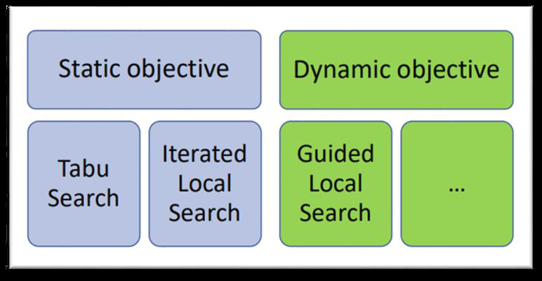

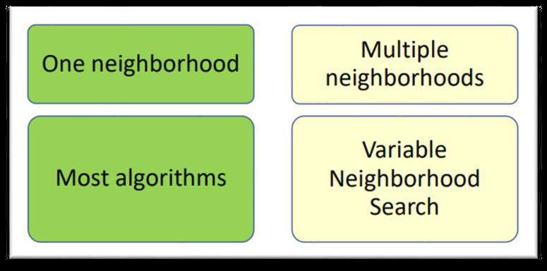

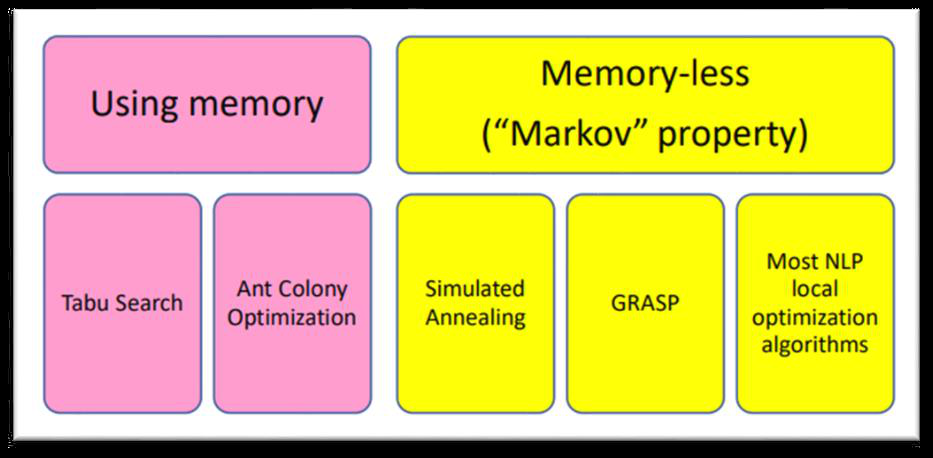

<!-- Page 42 -->

TRAJECTORY METHODS: 
Iterated Local Search – ILS: si effettua una ricerca locale fino a che non si rimane 
bloccati in un minimo locale. Si effettua una modifica alla soluzione corrente 
(eventualmente basandosi anche sul passato) in modo tale da spostarsi dall’ottimo 
locale e si ricomincia con la ricerca locale. Con perturbazioni molto piccole c’è il 
rischio di ritornare sul minimo locale, con perturbazioni troppo grandi c’è il rischio di 
stravolgere totalmente l’esecuzione dell’algoritmo.

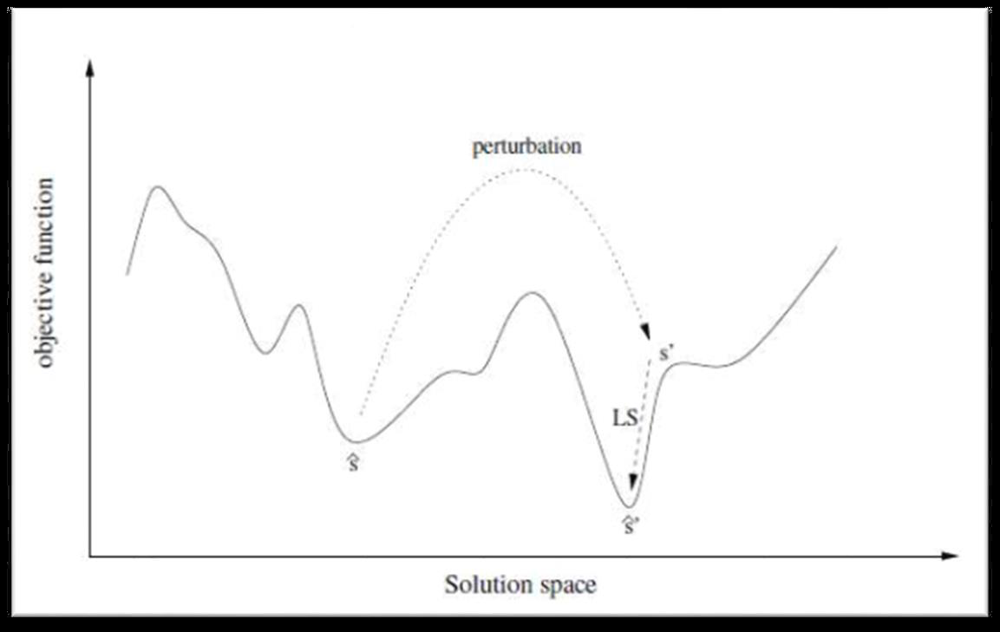

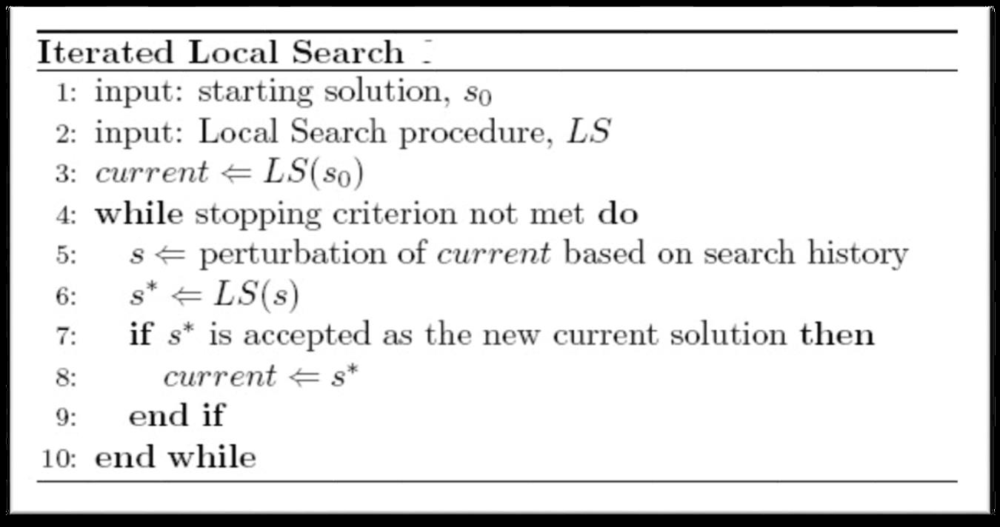

<!-- Page 43 -->

La soluzione iniziale si costruisce casualmente tramite euristiche costruttive. Si 
applica la ricerca locale e si effettua una perturbazione se si rimane bloccati, si 
effettua una mossa in un vicinato più grande per cambiare la soluzione corrente, se 
si ritorna allo stesso ottimo locale si effettua una perturbazione più forte. 
Solitamente una perturbazione è accettata se porta ad un ottimo locale migliore del 
precedente. 
Solitamente la forza delle perturbazioni è misurata attraverso il numero di 
componenti della soluzione che vengono modificate. Se troppo forte diviene simile 
ad un multistart casuale e se troppo debole la ricerca locale può annullare tale 
perturbazione. Di solito si usa una perturbazione in un vicinato di ordine superiore a 
quello utilizzato dall’algoritmo. 
Se la fase di ricerca locale e il metodo usato per la perturbazione funzionano bene, la 
soluzione iniziale influenza solo i primi passi della ricerca. Utilizzare un’euristica 
costruttiva o una soluzione casuale non porta a differenze significative. 
Il criterio di accettazione prevede che di solito si accetta il nuovo minimo locale dopo 
la perturbazione solo se porta un miglioramento, si accetta sempre o si effettuano 
scelte intermedie. Il criterio di accettazione deve bilanciare l’intensificazione e la 
diversificazione della ricerca. 
La ricerca locale è gestita come black box, generalmente possono variare le 
performance in base all’algoritmo usato per la ricerca locale. Per ogni ricerca 
utilizzata è necessario usare un particolare metodo di scelta della perturbazione ed 
entrambi influenzano il criterio di accettazione. 
 
Variable Neighborhood Search – VNS: algoritmo di ricerca che si basa su vicinati 
sempre più ampi. Se nel vicinato non viene trovata alcuna soluzione migliore della 
corrente, si allarga la definizione di vicinato e si esplora nuovamente il vicinato. Si 
procede iterativamente per kmax vicinati finché non si trova una soluzione migliore e 
si cerca in quel vicinato. Ogni volta che si accetta una nuova soluzione si ritorna alla 
dimensione più piccola del vicinato. Ci si ferma solamente quando in nessuno dei 
kmax vicinati si trova una soluzione migliore della corrente. 
Variante Basic in cui la ricerca locale dell’ottimo avviene solo nel primo vicinato, i 
successivi vicinati sono visitati in maniera casuale in quanto troppo estesi e 
richiederebbero troppo tempo ad essere visitati normalmente. A differenza della 
variante Descent che visita completamente ogni vicinato per cercare la soluzione 
migliore e non permette il peggioramento della soluzione.

<!-- Page 44 -->

Dynamic Local Search – DLS: simile alla precedente. Non cambia il vicinato, ma la 
funzione obiettivo. Spesso è usata nei problemi in cui a lungo non si riesce a 
migliorare la soluzione obiettivo. 
Si utilizza una funzione di penalità w in cui la soluzione viene divisa in elementi e 
ciascun elemento viene associato ad un peso. Una funziona ausiliaria che dipende 
sia dalla funzione obiettivo che dai pesi. Tale funzione ausiliaria è utilizzata nella 
ricerca locale. 
La ricerca locale considera le penalità w e non solo la funzione obiettivo z. inoltre 
fornisce due soluzioni: una soluzione finale x, localmente ottima per la funzione 
obiettivo modificata f; e il miglior ottimo corrente xZ rispetto alla funzione obiettivo 
originale z. 
Guided Local search – GLS: per uscire dai minimi locali si cambia dinamicamente la 
funzione obiettivo in modo da rendere l’ottimo corrente meno desiderabile. Il 
meccanismo utilizzato è basato sul distinguere le soluzioni tra di loro. è possibile che 
cambiando la funzione obiettivo si riesca ad uscire da un minimo locale.

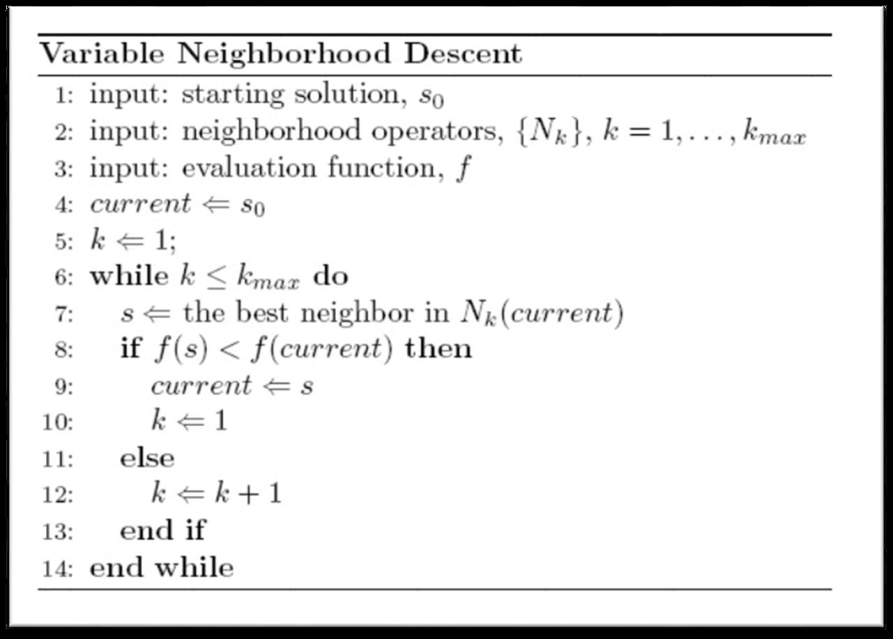

<!-- Page 45 -->

Tale modifica della funzione obiettivo avviene esclusivamente quando si rimane 
bloccato in un minimo locale (diversamente dalla DLS che viene cambiata ad ogni 
iterazione). 
Nella GLS si penalizzano alcune proprietà delle soluzioni, ovvero caratteristiche della 
soluzione o elementi che distinguono una soluzione dall’altra. 
La modifica che riguarda la valutazione delle mosse della GLS è basata sulle features 
che la soluzione deve o non deve avere. Le features rappresentano l’influenza che ha 
la soluzione nella valutazione della mossa nel vicinato. Può essere sia costante che 
variabile e si trova. Spesso si usa una funzione per indicare se ci sono o meno le 
feature (vettore I). 
La funzione obiettivo f indica il valore di una certa soluzione. Di solito si prende 
l’insieme delle features di interesse, si dà un peso a ciascuna feature e si osserva se 
ciascuna feature è presente nella soluzione o meno. Si crea un vettore di penalità 
che indica il numero di volte in cui la feature i è stata penalizzata fino a quel 
momento nell’esecuzione dell’algoritmo. Si indica con f* la funzione estesa di 
valutazione della mossa: 
 
Il parametro lambda indica l’importanza delle features. Inizialmente le penalità sono 
tutte fissate a 0. Quando si raggiunge un ottimo locale, la penalità viene aumentata 
per alcune delle features della soluzione corrente. Questo farà apparire la soluzione

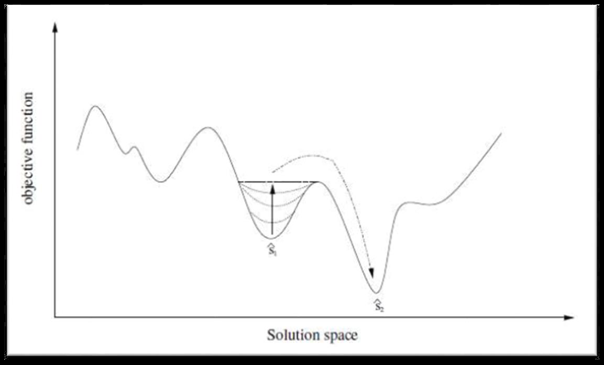

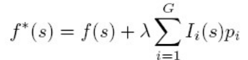

<!-- Page 46 -->

attuale peggiore rispetto ad altre soluzioni vicine, che non hanno le caratteristiche 
penalizzate. 
Per capire quali sono le features da penalizzare si usa l’utilità di una feature i in una 
soluzione s definita come: ui(s) = Ii(s) * ci / (1+pi). 
In un ottimo locale s si aumenta la penalità per la feature che ha il valore più alto di 
utilità di ui(s). 
 
Greedy Randomized Adaptive Search Procedure – GRASP: 
• Greedy: indica che si usa un’euristica costruttiva 
• Randimized: indica che l’euristica base fa passi casuali 
• Adaptive: userà un criterio di scelta adattativa che dipende dall’esecuzione 
dell’algoritmo 
• Search: indica che alterna all’euristica costruttiva l’euristica di scambio. 
È diviso in due fasi: fase di costruzione della soluzione e fase di miglioramento della 
soluzione. Quando si costruisce una soluzione si usa un’euristica costruttiva dinamica 
e una parte di randomizzazione. Tipicamente si costruisce in maniera greedy, un 
elemento alla volta, ma l’elemento soluzione si sceglie in maniera random all’interno

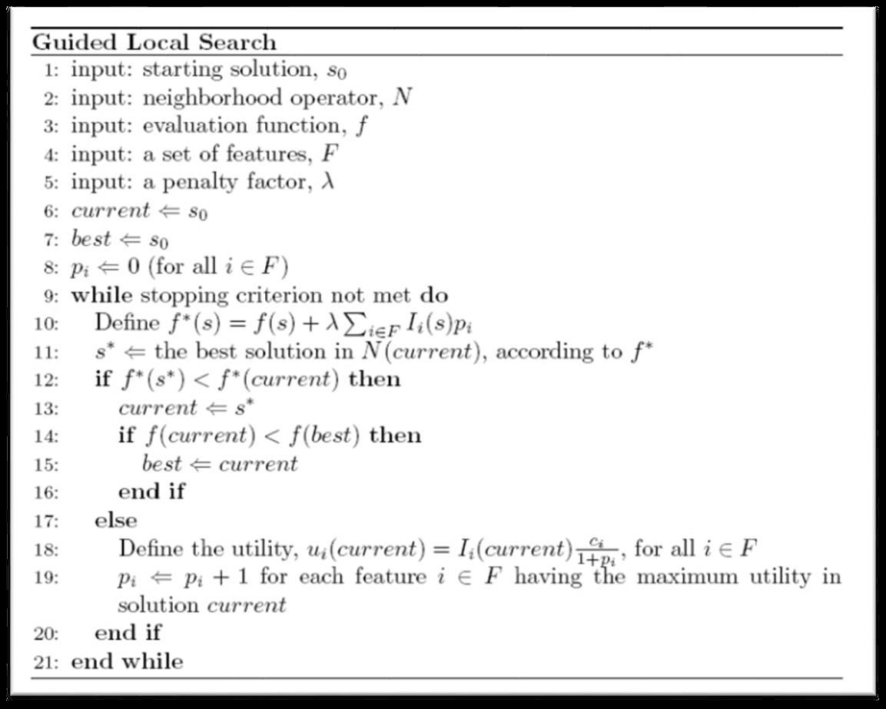

<!-- Page 47 -->

di una lista di scelte candidate. Il miglioramento della soluzione avviene come in 
ricerca locale. 
Very Large Scale Neighborhood Search - VLSN: gli algoritmi di questo tipo si basano 
sull’osservazione che la ricerca in un vicinato ampio porta a trovare ottimi locali di 
alta qualità e può generalmente restituire soluzioni migliori. Tuttavia, la ricerca in un 
vicinato ampio richiede molto tempo, quindi si utilizzano varie tecniche di filtraggio 
per limitare la ricerca. In VLSN il vicinato è tipicamente limitato ad un sottoinsieme di 
soluzioni visitabili in modo efficiente. 
• Large Scale Neigborhood search - LNS: appartiene alla classe VLSN. Metodi di 
ricerca LNS esplorano un vicinato complesso mediante l'uso di euristiche. 
L'uso di vicinati ampi consente di trovare soluzioni candidate migliori ad ogni 
iterazione e quindi di percorrere un percorso di ricerca più promettente. In 
LNS il vicinato è implicitamente definito da metodi (spesso euristici) che 
vengono utilizzati per distruggere e riparare una soluzione già esistente. 
Ad ogni iterazione alcune caratteristiche della soluzione vengono distrutte, si 
applica la riparazione generando una nuova soluzione. Tale soluzione può 
essere o meno accettata, sicuramente se migliorativa. 
• Adaptive Large Neighborhood search: estende l’euristica LNS consentendo 
l’utilizzo di più metodi di distruzione e riparazione all’interno della stessa 
ricerca, a seconda dell’iterazione dell’algoritmo si sceglie una tecnica 
opportuna per effettuare tali operazioni. Omega + e Omega - sono gli insiemi 
che racchiudono le tecniche per rispettivamente distruggere e riparare le 
soluzioni. A ciascuna tecnica sono assegnati dei pesi, che inizialmente sono 
fissati tutti ad 1. Ad ogni passo dell’algoritmo si seleziona una tecnica di 
distruzione e una di riparazione utilizzando i pesi, si genera una nuova 
soluzione, che, se accettata diviene corrente. Alla fine di ogni iterazione si 
aggiornano i pesi, in modo tale che, se si hanno dei miglioramenti si 
continuano a preferire le tecniche che hanno portato miglioramenti, viceversa 
in caso negativo si sfavoriscono tali tecniche che portano a peggioramenti.

<!-- Page 48 -->

POPULATION-BASED SEARCH: 
Dette anche recombination heuristics, partono da un insieme di soluzioni e 
ricombinano gli individui per produrre una nuova popolazione. Alcuni sono 
deterministici altri usano passi non-deterministici. 
In generale, si costruisce un insieme generale di soluzioni e fino a che non si verifica 
una certa condizione di arresto, si generano continuamente nuovi insiemi di 
soluzioni, generazioni, combinando tra di loro individui e decidendo se accettare o 
meno i nuovi individui generati. 
Scatter Search: si basa sul principio di catturare le informazioni rilevanti ed integrarle 
al fine di ottenere nuove soluzioni. Si utilizzano delle euristiche per combinare gli 
individui e mantiene un insieme di soluzioni. 
Si genera una popolazione iniziale di soluzioni. Si migliorano le soluzioni con 
un’euristica di scambio. Si definisce un insieme di riferimento formato da due 
tipologie di soluzioni: il sottoinsieme B, le soluzioni di élite (migliori), per produrre 
risultati migliori e il sottoinsieme D delle soluzioni più diverse le une dalle altre, utili 
per la diversificazione e consentire alla ricerca di allargarsi. Si effettua una

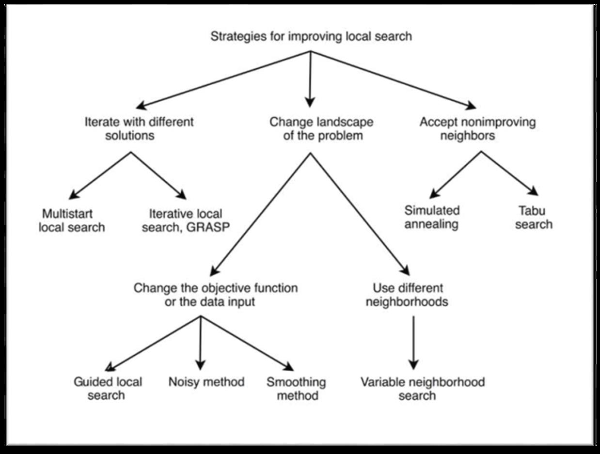

<!-- Page 49 -->

operazione di scelta di coppie, solitamente si combinano elementi appartenenti ai 
due sottoinsiemi secondo lo schema (x,y) ∈ B × (B ∪ D). Si generano nuove soluzioni 
e solitamente le soluzioni vengono migliorate con qualche ricerca locale. L’insieme B 
viene aggiornato con le nuove soluzioni fino a condizione di arresto, quando 
l’insieme di riferimento rimane invariato. 
 
• Diversification Generation Method: generazione iniziale delle soluzioni. La 
qualità non è importante in quanto l’obiettivo è avere una popolazione iniziale 
quanto più diversificata possibile. 
• Improvement method: ricerca locale nei vicinati 
• Subset combination method: si generano dei sottoinsiemi dell’insieme di 
riferimento R. Si prendono tutte le coppie di soluzioni e ad alcune si generano 
dei sottoinsiemi con vari elementi. 
• Solution combination method: adattata ad ogni problema. Combinazione delle 
soluzioni. BxB intensifica la ricerca in quanto combina soluzioni di buona 
qualità. BxD diversifica la ricerca in quanto fa uso di soluzioni lontane tra di 
loro. Solitamente se la combinazione porta a soluzioni non ammissibili si 
usano procedure di riparazione per renderla ammissibile 
• Reference update method: una volta generate le nuove soluzioni, si aggiorna 
l’insieme di riferimento. In B le soluzioni migliori, in D si misura la distanza tra 
le soluzioni e quelle trovate e si scelgono le più distanti tra di loro, 
aggiornando l’insieme. 
Path Relinking: date due buone soluzioni trovate durante la ricerca, è possibile che 
tra le due soluzioni ce ne sia una ancora migliore. Si converte gradualmente una 
soluzione nell’altra.

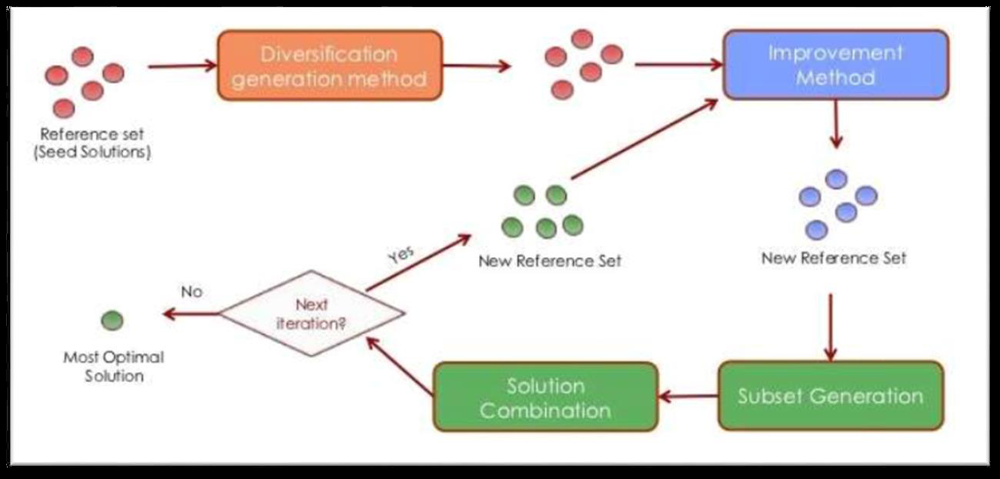

<!-- Page 50 -->

Quasi mai si usa dall’inizio, ma spesso si usa alla fine di un’altra metaeuristica per 
cercare di migliorare le soluzioni che già si possiedono. Si basa su una definizione di 
vicinato. Si prendono le soluzioni di buona qualità e si cerca un percorso da una 
all’altra. Di tutte le soluzioni del vicinato non si cerca la soluzione migliore, ma la 
soluzione che minimizza la distanza dalla soluzione y da raggiungere. La definizione 
di distanza dipende dal problema. Al termine dell’algoritmo verrà creato un percorso 
che da x arriva ad y di soluzioni numerate, tra di esse si sceglie la migliore. 
 
Ant Colony: Si basa sul concetto di stigmergia. Le formiche quando si muovono 
rilasciano sul terreno una sostanza che viene rilevata dalle altre formiche. 
Preferiscono seguire un percorso con maggiore quantità di feromone. Nella ricerca 
del cibo tendono a rilasciare più feromone. A lungo termine i percorsi migliori 
saranno quelli più percorsi.

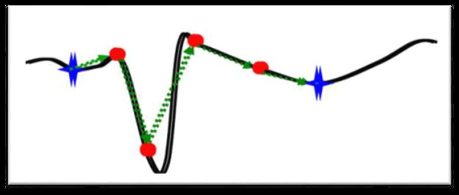

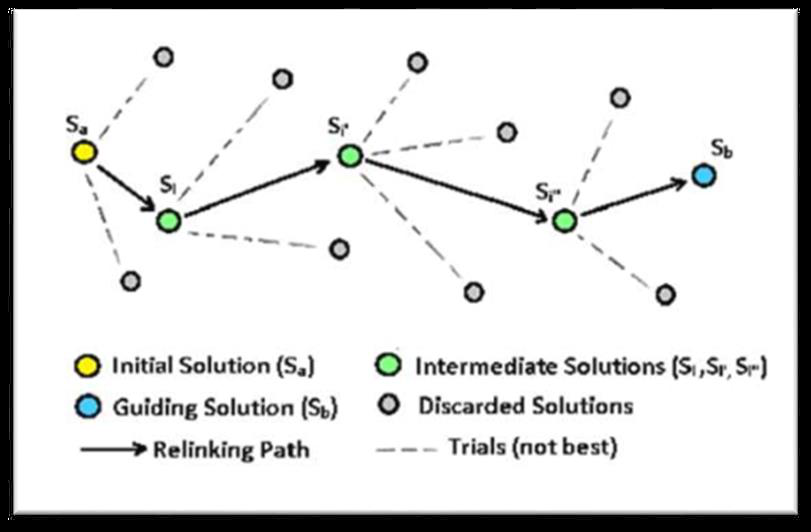

<!-- Page 51 -->

Ogni formica ha uno stato iniziale, ha una condizione di terminazione del percorso, 
crea un elemento di S un componente alla volta, ha una memoria in cui tiene traccia 
del proprio percorso. La formica si muove con una certa probabilità sul grafo a 
seconda della quantità di feromone. Il feromone ad ogni iterazione viene aggiornato, 
se il percorso è visitato da una formica aumenta, al passare del tempo diminuisce.

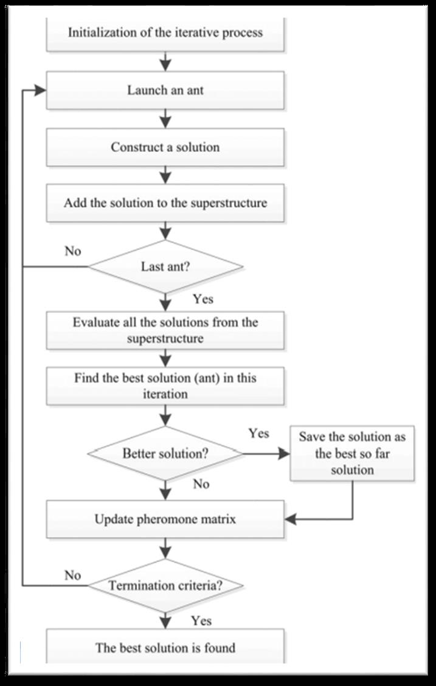

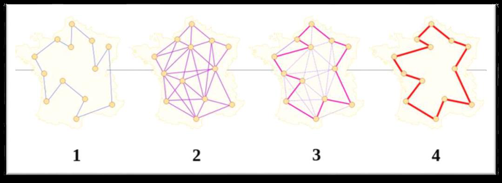

<!-- Page 52 -->

Particle Swarm Optimization: si ispira al comportamento degli stormi di uccelli. Si 
considerano l’insieme degli individui come unico elemento, applicare la stessa mossa 
a tutti gli individui di un insieme evitando che si scontrino tra di loro (siano uguale). 
Un modello semplice usa le seguenti regole: separazione, allineamento e coesione. 
Le modifiche alle soluzioni devono essere eseguite garantendo tali regole. 
L’algoritmo utilizza piccoli jittering casuali per minimizzare la possibilità di 
intrappolamento in minimi locali. Il gran numero di membri che compongono lo 
sciame di particelle rende la tecnica incredibilmente resistente al problema dei 
minimi locali. 
Artificial bee colony – ABC: ogni soluzione può essere pensata come un percorso 
dall’alveare alla fonte di cibo. Ogni ape possiede funzioni diverse: api esploratrici che 
effettuano ricerca casuale, api che effettuano una valutazione della qualità del cibo 
(soluzione) e del percorso, api operaie che cercano il percorso. 
 
 
 
16. Matheuristichs 
17_MatHeuristics.pdf
 
Ibrido fra la programmazione matematica e le metaeuristiche. Si utilizza la soluzione 
di problemi di programmazione matematica come se fosse un’euristica. Si scrive una 
formulazione di un problema dato, ma il solutore commerciale non può risolvere tale 
formulazione in quanto tipicamente si hanno dimensioni troppo grandi per risolvere

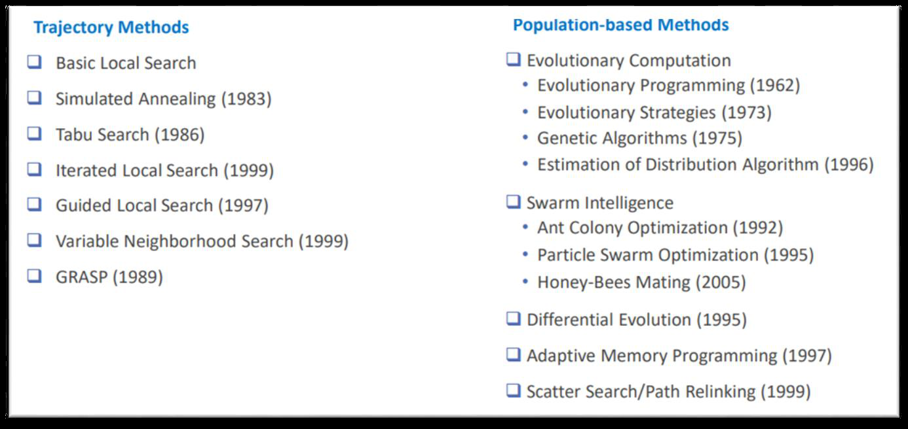

<!-- Page 53 -->

il problema ad ottimo in tempi ragionevoli. Dopo aver analizzato un problema, si 
cerca di trovare un modello di programmazione matematica, di solito si riesce, ma 
non sempre è possibile risolverlo con approccio matematico, in tal caso si ricorre ad 
euristiche ad hoc. Si utilizzano solutori di PM per esplorare un vicinato definito da un 
certo numero di vincoli lineari. 
Local Branching: data una soluzione di riferimento x, si mira a trovare una soluzione 
migliore che non sia troppo lontana da x. Si definisce un vicinato come l’insieme 
delle soluzioni del problema di programmazione matematica che non si discostano di 
più di k componenti dalla soluzione data x. Solitamente k è fissato tra 10 e 20. 
Relaxation-Induced Neighborhood Search – RINS: utilizza un solutore MIP per 
esplorare un vicinato. Effettua una ricerca locale in cui la soluzione ottima locale è 
trovata tramite la soluzione di un problema di programmazione matematica. In 
determinati nodi dell'albero di branch-and-bound, l'attuale soluzione x* del 
rilassamento lineare e la soluzione corrente x vengono confrontate, e tutte le 
variabili intere che hanno lo stesso valore nelle due soluzioni sono fissate. Rende il 
problema più facile da risolvere in quanto il fissaggio delle variabili riduce 
considerevolmente la sua dimensione e spesso fornisce migliori soluzioni rispetto ad 
x. 
Polishing: implementa un’euristica evolutiva MIP che viene richiamata all’interno di 
un albero di branch-and-bound. Si genera una popolazione di dimensione fissata con 
soluzioni ammissibili. Le soluzioni vengono combinate per ottenere soluzioni con 
caratteristiche migliori. Si adotta lo schema RINS. Tali combinazioni sono più lente 
delle euristiche genetiche ma si ottengono risultati qualitativamente superiori. 
Proximity Search: versione duale del local branching. Invece di fissare il vicinato, si 
migliora la soluzione corrente come obiettivo, ponendo la distanza come vincolo. 
 
17. Algoritmi di approssimazione e algoritmi online 
21_Cenni_alg_online_a
px.pdf
 
Algoritmi di approssimazione: euristiche che hanno la caratteristica di fornire una 
garanzia a priori sulla qualità della soluzione trovata, di tipo teorico. 
Algoritmi online: analisi di tipo teorico della bontà della soluzione simile agli 
algoritmi di approssimazione, ma contesto applicativo diverso. Non si conoscono a

<!-- Page 54 -->

priori i dati di input, vengono rivelati durante il processo, ed è necessario prendere 
decisioni in tali contesti. 
Gli algoritmi -approssimati garantiscono che la soluzione trovata abbia un errore 
relativo rispetto all’ottimo limitato da una costante, indipendentemente dalla 
dimensione dell’istanza del problema. 
Un algoritmo online è un algoritmo che riceve l’input (richiesta) un pezzo alla volta e 
deve prendere una decisione ad ogni passo senza sapere ciò che avverrà nel futuro. 
Si confronta la soluzione trovata dall’algoritmo online, con la soluzione trovata da un 
algoritmo offline che conosce tutta la sequenza di richieste in anticipo. Per fare tale 
analisi si assume che ci sia un avversario che ad ogni passo fornisce all’algoritmo 
online la richiesta che lo mette di più nei guai. 
In alcuni contesti non è necessario valutare la bontà delle soluzioni solamente in 
termini di costo, ma anche del tempo: contesti real-time. 
Un algoritmo dinamico affronta problemi in cui ogni volta che i dati di input vengono 
modificati, si deve calcolare in modo efficiente la nuova soluzione. 
 
18. Albero di decisione per la classificazione e analytics 
Apprendimento statistico (o automatico): metodi statistici per determinare in 
maniera automatica qualcosa.

<!-- Page 55 -->

Supervised Learning. Si contrappone alla categoria unsupervised learning. La 
principale differenza è che non si cerca una risposta, ma si possiede solamente un 
insieme di osservazioni, punti, che si vogliono suddividere ma senza attribuire 
etichette, risposte. Per esempio, nel marketing si usa per classificare gli utenti a 
precise categorie, per vari fini. Tipo di lavoro che si effettua è il clustering analysis. 
Nel supervised learning si adotta un’ulteriore classificazione che dipende dalla 
qualità della risposta data. Modelli predittivi o di inferenza.

<!-- Page 56 -->

Per riconoscere l’appartenenza di un elemento ad una classe si può utilizzare un 
albero di decisione. Si può costruire in funzione dei valori degli attributi, ad esempio, 
se x1 è superiore ad una certa soglia, allora il campione appartiene ad una 
particolare classe. Se minore allora si effettua un ulteriore controllo sull’attributo x2 e 
si suddivide in ulteriori classi. 
 
Se a posteriori si verifica che la risposta data dal classificatore è sbagliata si 
commette un errore di generalizzazione. Se la risposta data su un punto del training 
set non è corretta si parla di errore di training.

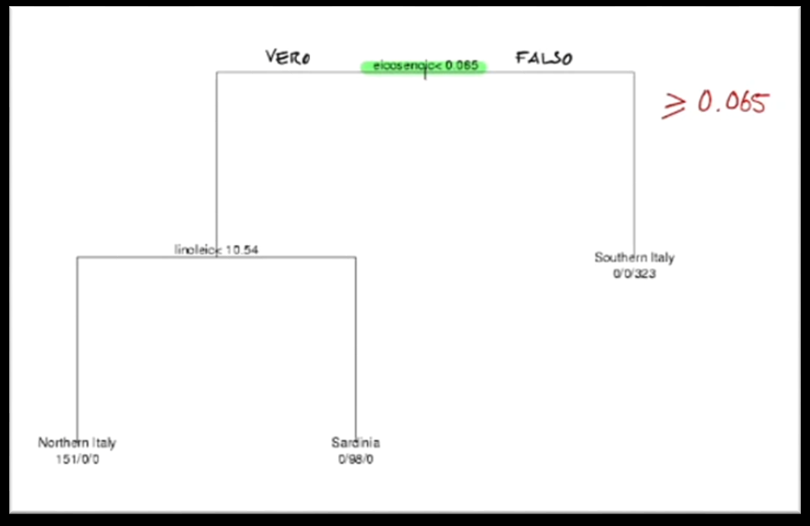

<!-- Page 57 -->

<!-- Page 58 -->

<!-- Page 59 -->

<!-- Page 60 -->

<!-- Page 61 -->

<!-- Page 62 -->

<!-- Page 63 -->

19. Problemi con scenari multipli 
22_ottimizzazione_mu
lti_scenario.pdf 
Scenari multipli: quando è presente un qualche aspetto che è indipendente dalle 
decisioni prese. Ad esempio, investimento in un mercato finanziario, in quanto in 
futuro non si sa l’andamento. Si prevedono diversi scenari di sviluppo futuro. Si cerca 
di agire nel meglio senza conoscere l’effettivo valore dei dati. 
• Sistema: porzione del mondo sul quale la decisione va ad influire. 
• Soluzione o alternativa: insieme degli aspetti controllabili nel sistema 
• Scenario o esito: aspetti non controllabili nel sistema. 
• Impatto: funzione obiettivo, valore associato ad una configurazione. Descrive 
tutti gli aspetti interessanti ai fini della decisione. 
• Decisore o attore: coloro che agiscono e scelgono la soluzione. Di solito chi 
effettua la scelta è indicato come decisore, l’attore può indicare anche chi ha 
interessi in gioco ma non è il vero e proprio decisore. 
Un problema decisionale prevede la scelta di un’alternativa per far sì che il sistema 
finisca in una certa configurazione affinché l’impatto, la funzione obiettivo, sia 
accettata dai decisori. 
Classificazione dei problemi decisionali: 
• Preferenze complesse, cioè insufficienti a definire un concetto di ottimo.

<!-- Page 64 -->

• Scenari molteplici, dunque un ambiente incerto. 
• Decisori molteplici, più persone che concorrono a prendere la stessa decisione 
con eventuali preferenze potenzialmente in conflitto tra loro. 
 
• modelli con preferenza, scenario e decisore semplici (Programmazione 
Matematica) 
• modelli con preferenze complesse, un solo scenario, un solo decisore: 
o obiettivi molteplici (Programmazione multi-obiettivo) 
o preferenza non modellata da obiettivi (Analisi gerarchica) 
o preferenza non transitiva (Metodi Electre) 
• modelli con preferenze semplici, scenari molteplici, decisore semplice: 
o incertezza assoluta (Decisioni in condizioni di ignoranza o 
Programmazione robusta) 
o incertezza descritta probabilisticamente (Decisioni in condizioni di 
rischio o Programmazione stocastica) 
• modelli con preferenza semplice, scenario semplice, decisori molteplici: 
o decisori indipendenti (Teoria dei giochi); 
o decisori costretti a coordinarsi (Decisioni di gruppo) 
Gli scenari descrivono formalmente eventi fuori dal controllo dei decisori, impattano 
fortemente sulla decisione da prendere. Racchiudono qualunque fonte di incertezza 
sul comportamento del sistema. 
La programmazione in condizioni di incertezza affronta problemi di decisione nei 
quali occorre scegliere tra alternative il cui impatto dipende non solo dalle scelte del 
decisore, ma anche da fattori esterni che non possono essere previsti esattamente.

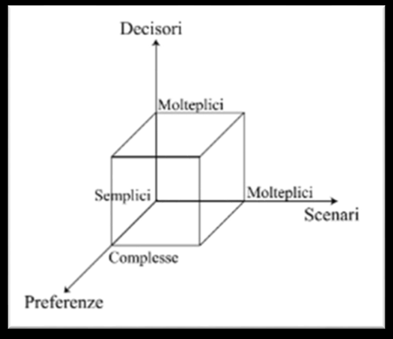

<!-- Page 65 -->

Si vuole quindi minimizzare la funzione obiettivo che dipende sia dalle soluzioni, sia 
dallo scenario. Ottimizzare sulla soluzione x senza conoscere lo scenario finale, 
scegliere x prima di conoscere lo scenario. 
Si dice che un’alternativa x domina fortemente un’alternativa x’ quando il suo 
impatto è almeno altrettanto buono in tutti gli scenari, ciò porta a scartare le 
alternative dominate. Quando si hanno poche alternative, si utilizza una matrice per 
valutare le varie alternative in funzione degli scenari. 
Di solito per prendere una decisione si usa una funzione ausiliaria: 
• Criterio del caso peggiore: si assume che per ogni scelta x fatta, il futuro riservi 
lo scenario che comporta il costo massimo. Si cerca quindi di minimizzare il 
caso peggiore. 
• Criterio del caso ottimo: si assume che per ogni scenario si verrà a realizzare lo 
scenario migliore. Di tutte le soluzioni si sceglie quella che si comporta meglio 
nello scenario migliore. 
• Criterio di Hurwicz: entrambi i criteri precedenti risultano sbilanciati. Hurwicz 
propone una combinazione convessa del caso migliore e peggiore. Si fa uso di 
un coefficiente di pessimismo che pesa l’impatto pessimo e un coefficiente 
complementare che pesa quello ottimo. 
• Criterio di equiprobabilità (Laplace): il criterio precedente prende in 
considerazione solamente gli scenari estremi (migliore e peggiore). Il criterio 
di equiprobabilità considera tutti gli scenari e gli applica a tutti lo stesso peso. 
Si calcola quindi il valore medio degli impatti nei vari scenari. Si sceglie la 
soluzione che in media funziona meglio. 
• Criterio del rammarico (regret): per ogni scenario si determina la soluzione 
ottima. Si valuta il regret di una soluzione, ovvero quanto in ciascuno scenario 
una soluzione si discosta dalla soluzione ottima di quello scenario. Si valuta 
ogni soluzione con un criterio pari al regret massimo e si sceglie la soluzione 
con il regret massimo più piccolo. 
• Criterio delle eccedenze: complementare al precedente, si misura un 
guadagno rispetto alla soluzione peggiore di ogni scenario. Lo scenario 
peggiore è quello in cui l’eccedenza è minima. 
Per ogni scenario si trova la soluzione peggiore, si calcola il surplus associata a 
ciascuna soluzione e per ogni soluzione si calcola l’eccedenza minima, tra 
queste si sceglie la massima.

<!-- Page 66 -->

Programmazione robusta: 
Problemi di ottimizzazione con molti scenari rappresentano problemi troppo difficili 
da risolvere, in quanto l’insieme delle soluzioni solitamente è esponenziale. Per 
programmazione robusta si intende, problemi di programmazione classici con una 
singola funzione obiettivo, ma in cui si hanno una serie di scenari che rappresentano 
che alcuni dati di input non sono noti a priori ma assumono valori diversi per 
ciascuno scenario. 
• Robustezza assoluta: criterio del caso peggiore, funzione min max, che 
minimizza il caso peggiore (massimo). L’obiettivo è difendersi dal caso 
peggiore. 
• Deviazione robusta, che rappresenta il criterio del rammarico, si calcola la 
miglior soluzione per ogni scenario e si misura il valore di regret di ciascuna 
soluzione confrontando ciascuna soluzione con la soluzione migliore. Si misura 
quanto ci si discosta dalla soluzione ottima, nel caso peggiore, e si misurano le 
prestazioni in termini assoluti. 
• Robustezza relativa, che valuta il rapporto fra rammarico e valore ottimo. 
Quanto migliorerebbero in termini relativi le prestazioni se si potesse 
eliminare l’incertezza. 
In un problema di ottimizzazione, lo scenario è caratterizzato dal fatto che alcuni dati 
sono ignoti, spesso tali valori sono compresi in intervalli, oppure offrono alternative. 
A seconda di tali livelli di incertezza si possono presentare problemi più o meno 
difficili da risolvere. In generale i problemi con incertezza a scelta risultano più 
complessi da risolvere rispetto a problemi a scelta. Il caso peggiore, con incertezza 
ad intervalli, è dimostrabile in tempo polinomiale, in quanto si possono analizzare 
solamente gli estremi degli intervalli. Rimane un problema difficile in quanto non si 
sa quale dei due valori è necessario prendere in considerazione per il grafo in esame. 
Programmazione in condizioni di rischio: rispetto alla programmazione in condizioni 
di ignoranza, in cui si ignorano le probabilità che ciascuno scenario si possa 
realizzare, nella programmazione in condizioni di rischio tali probabilità sono note. 
Criterio del valore atteso: ciascuno scenario si può presentare con una certa 
probabilità, si calcola per ogni soluzione il valore atteso. Si sceglie il valore atteso 
migliore. Si calcola una media pesata di ciascuno scenario con la probabilità e si 
sceglie la soluzione con il valore atteso minimo. Il valore atteso però non tiene conto 
di molti aspetti, come ad esempio la presenza di soluzioni diverse tra di loro, spesso 
porta a conseguenze irrealistiche e paradossali.

<!-- Page 67 -->

Teoria dell’utilità stocastica: sono definiti assiomi per stabilire preferenze, non sono 
per la funzione obiettivo, ma al fine di rappresentare la razionalità dell’uomo. Si 
preferiscono scenari in funzione di caratteristiche che hanno. 
 
20. Business/Data analytics 
23_ricapitolazione_an
alytics.pdf
 
Business analytics è il processo scientifico di scoperta di modelli che si possono 
trovare nei dati. Si trasformano i dati in informazioni (insight) utili per prendere 
decisioni. Permette una miglior comprensione del business di interesse. 
Prospetto della business analysis: 
• Descriptive analytics: cosa è successo e perché? Si effettua un’analisi sui dati 
passati usando aggregazione di dati e data mining. A volte si conducono analisi 
di tipo diagnostico per capire i perché degli avvenimenti passati. 
• Predictive analytics: cosa potrebbe succedere nel futuro? Si usano modelli di 
tipo statistico, simulazioni e machine learning. Si utilizza quando si vuole 
stimare il futuro, basandosi sui dati, per cercare di ottenere andamenti futuri. 
Si basa sull’acquisizione delle relazioni tra le variabili esplicative e le variabili 
perviste dagli eventi passati. Può effettuare previsioni anche su eventi già 
accaduti (ad esempio, capire se sono avvenute delle frodi). 
o Churn analysis: analisi della clientela per determinare i clienti che 
presentano un’alta probabilità di passare alla concorrenza, al fine di 
intervenire in anticipo ed evitarne la migrazione. 
o Ricerca di anomalie: tramite algoritmi di machine learning si possono 
identificare situazioni anomali 
o Cross / up selling: le tecniche predittive possono essere utilizzate per 
determinare quali clienti siano più propensi ad acquistare un 
determinato prodotto, permette di compiere azioni mirate. 
Si calcolano le probabilità per le quali certi eventi si avverano. 
• Prescriprive analytics: cosa fare per il futuro? Fa uso di ottimizzazione ed 
euristiche. Si cerca di ottimizzare le decisioni per la gestione del proprio 
business, le soluzioni migliori per il futuro sulla base delle informazioni del 
passato. 

<!-- Page 68 -->

CRISP-DM: modello di processo a sei fasi che descrive il ciclo di vita del data science. 
Fornisce un approccio strutturato alla pianificazione di un progetto di data mining. 
 
• Business Understanding: osservazione degli obiettivi e dei requisiti del 
business, comprensione del problema dal punto di vista aziendale. 
Eventualmente stilare il piano del progetto. 
• Data Understanding: comprendere a pieno le diverse fonti di dati e i diversi 
tipi di dati. 
• Data preparation: preparazione dei dati per la modellazione. Solitamente la 
prima fase coincide con la scelta dei dati e successivamente si procede con la 
pulizia, ovvero correzione e rimozione di valori errati; integrare dati con 
ulteriori informazioni; eventuale riduzione e formattazione. 
• Modeling: si definisce un modello di predizione, solitamente utilizzando un 
algoritmo di machine learning. 
• Evaluation e Deployment: si valutano i modelli costruiti e se soddisfano i criteri 
di successo del business. 
La differenza più grande tra l'apprendimento automatico supervisionato e non 
supervisionato è il tipo di dati utilizzati. L'apprendimento supervisionato utilizza dati 
di addestramento etichettati, mentre l'apprendimento non supervisionato no. 
In modo più semplice, i modelli di apprendimento supervisionato hanno una 
comprensione di base di quali dovrebbero essere i valori di output corretti. 
Supervised Machine Learning problems: quando lo scopo è quello di assegnare 
oggetti a classi diverse, allora stiamo eseguendo un problema di classificazione.

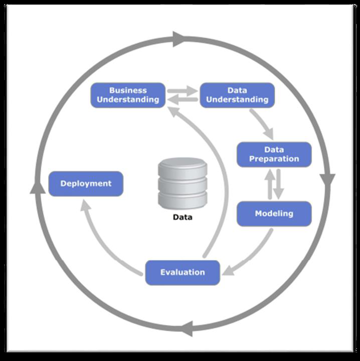

<!-- Page 69 -->

Mentre quando vogliamo predire valori futuri per la caratteristica obiettivo stiamo 
risolvendo un problema di regressione. 
La classificazione è un processo di costruzione di un modello predittivo che descrive 
e distingue i dati appartenenti a diverse classi. Nella prima fase il modello viene 
definito utilizzando un insieme di istanze chiamato training set e nella seconda fase 
viene utilizzato un test set per valutare l’accuratezza del modello. 
La regressione è il processo di costruzione di un modello predittivo in grado di 
prevedere valori continui che rappresentano i valori reali di una certa variabile. 
Anche in questo caso si addestra il modello tramite training set e testing tramite test 
set. 
Overfitting: classificazione eseguita con eccessiva cura, si basa troppo sul training set 
e il modello potrebbe non rispondere correttamente su un nuovo insieme. Viceversa, 
underfitting comporta una classificazione troppo poco accurata 
Classification accuracy: rapporto tra il numero di previsioni corrette e il numero 
totale di campioni in ingresso. 
Analisi dei falsi positivi e falsi negativi che deve risultare contenuto. 
La prescriptive analytics serve a determinare la soluzione e il risultato migliore tra le 
varie possibili scelte, dati i parametri noti. 
 
21. Quantum Annealing 
Il quantum annealing è un processo di ottimizzazione per trovare il minimo globale 
di una funzione obiettivo su un insieme di soluzioni candidate. 
L’idea di base è quella di codificare un problema ad ottimo in un sistema fisico, 
sfruttando le proprietà di raggiungere l’energia minima. Il sistema quantistico evolve 
da uno stato iniziale a uno stato finale, durante il processo esplora diverse 
configurazioni cercando quella con energia minore.

<!-- Page 70 -->

Sfrutta il concetto di quantum tunnelling, il 
quale permette di attraversare barriere di 
energia, permette di esplorare diverse 
configurazioni e sfuggire più facilmente ai 
minimi locali di energia, per farlo passa 
attraverso i picchi.

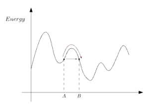
