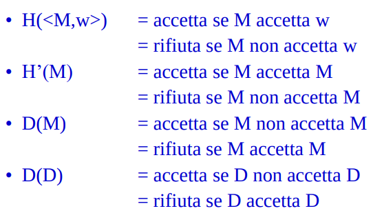

# Decidibilità

Argomenti: Decidibilità di un linguaggio, Indecidibilità di ATM
.: No

## Indecidibilità di $A_{TM}$

Il problema $A_{TM}=\left\{ \left\langle M,w \right\rangle\right\}$ tale che $M$ è una MT che accetta la stringa $w$. Si può dire che il problema è turing-riconoscibile perchè se si sottopone $M$ e $w$ alla MT universale $U$, se prima o poi $U$ arriva ad uno stato accettante, allora si accetta la stringa. 

- `teorema`: il linguaggio $A_{TM}$ è indecidibile
- `dimostrazione`: per assurdo si suppone che esiste una macchina che decide $A_{TM}$ per ottenere una contraddizione

---

## Decidibilità di un linguaggio

- `teorema`: un linguaggio è decidibile se e solo se è sia turing-riconoscibile sia co-turing-riconoscibile.
- `dimostrazione`: si considera il linguaggio $A$ e si suppone che sia decidibile. Se $A$ è decidibile per definizione è anche turing-riconoscibile, allora anche il suo complemento è decidibile, cioè $A$ è co-turing-riconoscibile.

$A$ e $\underline{A}$ sono entrambi turing-riconoscibili. Siano $M$ ed $N$ le $MT$ che riconoscono $A$ e $\underline{A}$, si costruisce una MT che decide $A$ eseguendo $M$ ed $N$ in parallello sullo steso input, se $M$ accetta la macchina accetta, se $N$ accetta la macchina rifiuta.

---