---
author:
- "*Giacomo Sturm*"
date: |
  *Dipartimento di Ingegneria Civile, Informatica e delle Tecnologie Aeronautiche  
  Università degli Studi “Roma Tre"*
title: |
  **Elettrotecnica ed Elettronica**  
  Appunti delle Lezioni di Elettrotecnica ed Elettronica  
  *Anno Accademico: 2023/24*
---

\providecommand{\labelText}[2]{#1}

# Nozioni di Base sull’Elettro-Magnetismo

## Forza Elettrica

Le prime analisi documentate sugli effetti elettrici risalgono agli antichi greci, da cui deriva il nome “electron". Letteralmente significa ambra, poiché quando viene sfregata contro della lana, è capace di attrarre materiali, ovvero è in grado di generare un campo elettrico.

La forza elettrica venne analizzata da Coulomb in maniera simile all’analisi di Newton sulla gravità, poiché le due forze presentano dei comportamenti simili. La forza di gravità è una forza attrattiva tra due masse nello spazio, per cui sono presenti due forze applicate ad entrambe le masse di modulo e direzione uguale, ma verso opposto: $$\boldsymbol{\mathbf{F}}_{1\to2}=G\displaystyle\frac{m_1m_2}{r^2}\hat{\boldsymbol{\mathbf{r}}}_{1\to2}=-\boldsymbol{\mathbf{F}}_{2\to1}$$ Analogamente la forza elettrica è presente solo nell’interazione tra due elementi dotati di una carica che può presentarsi in due classi diverse, per convezione positiva o negativa, vengono misurate in Coulomb $C$ nel SI. Due cariche appartenenti alla stessa classe si oppongono, mentre due cariche appartenenti a due classi diverse si attraggono: $$\begin{gathered}
    \boldsymbol{\mathbf{F}}_{1\to2}=-k_0\displaystyle\frac{q_1q_2}{r^2}\hat{\boldsymbol{\mathbf{r}}}_{1\to2}=-\boldsymbol{\mathbf{F}}_{2\to1}\\
    F=k_0\displaystyle\frac{|q_1q_2|}{r^2}
\end{gathered}$$ Viene chiamata $k_0$ costante elettrica nel vuoto.

La forza di gravità è una forza solamente attrattiva e presenta una sola classe di masse a differenza della forza elettrica. Poiché la forza di gravità si presenta solamente dall’interazione tra due masse, una massa singola nello spazio non è soggetta a forze di gravità. Questa massa è pronta ad interagire con un eventuale seconda massa per comunicare tra di loro la massa deforma in qualche modo lo spazio. Convenzionalmente si considera una deformazione convessa nella zona di spazio dove si trova la massa:

<figure>

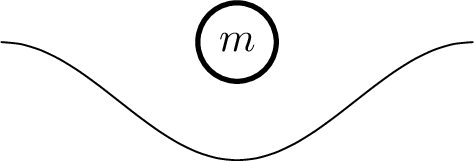 

</figure>

Poiché le cariche possono appartenere a due classi diverse per convenzione una carica positiva crea una deformazione concava, mentre una negativa una deformazione convessa:

<figure>

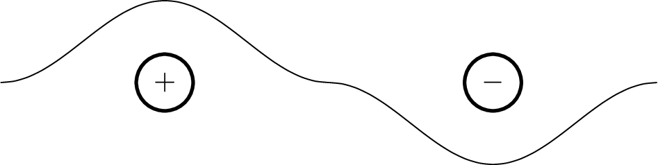 

</figure>

Per cui le cariche positive tendono a “scendere", mentre le cariche negative tendono a “salire". La deformazione spaziale è dovuta ad un campo gravitazionale o elettrico, dalle interazione del campo si genera una forza gravitazionale o elettrica.

## Campo Elettrico

Un campo elettrico $\boldsymbol{\mathbf{E}}(x,y,z)$ è un campo vettoriale, ovvero è un insieme di vettori per ogni punto dello spazio dipendenti dalla loro posizione. Per misurare il campo generato da una carica $Q$ positiva per convenzione, si considera un’altra carica positiva $q<<Q$ usata per misurare la forza elettrica $\boldsymbol{\mathbf{F}}$ generata dall’interazione con il campo $\boldsymbol{\mathbf{E}}$. Si considera invece della costante elettrica nel vuoto $k_0$, la costante di permettività dielettrica nel vuoto $\varepsilon_0$: $$\begin{gathered}
    k_0=\displaystyle\frac{1}{4\pi\varepsilon_0},\:
    \varepsilon_0\approx8.86\times10^{-12}\left[\mathrm{C}^2\cdot\mathrm{m}^{-2}\cdot\mathrm{N}^{-1}\right]
\end{gathered}$$ Per misurare il campo elettrico in punto dello spazio di posizione $\boldsymbol{\mathbf{r}}$ si considera la forza per unità di carica in quel punto: $$\boldsymbol{\mathbf{E}}(x,y,z)=\displaystyle\frac{\boldsymbol{\mathbf{F}}(x,y,z)}{q}=\frac{1}{4\pi\varepsilon_0}\frac{Q}{r^2}\hat{\boldsymbol{\mathbf{r}}}\left[\frac{\mathrm{N}}{\mathrm{C}}\right]$$ Il campo elettrico generato da una singola carica puntiforme ha una direzione radiale e verso entrante se è una carica negativa ed uscente se si tratta di una carica positiva. Per indicare la direzione ed il verso di un campo vettoriale vengono usate linee di forza, la cui tangente in un punto rappresenta la direzione ed il verso del campo nello stesso punto.

<figure>

   

</figure>

In generale una forza elettrica è effetto dall’interazione di una carica $q$ con un campo elettrico $\boldsymbol{\mathbf{E}}$, indipendentemente da ciò che genera il campo elettrico. Nel caso di una carica stazionaria o in moto rettilineo uniforme, si considera un campo elettro-stazionario, per cui la forza generata si esprime come il prodotto per la carica ed il campo elettrico: $$\boldsymbol{\mathbf{F}}=q\boldsymbol{\mathbf{E}}$$

L’unità di misura fondamentale usata per analizzare fenomeni elettrici nel SI è l’Ampere $A$, intensità di corrente, che ha sostituito il Coulomb $C$, unità di carica, entrambe sono cognomi di scienziati che hanno studiato l’elettricità, a differenza delle restanti grandezze fondamentali. Ciò spiega come non fosse chiaramente identificabile la causa dei fenomeni elettrici in passato.

In caso sia presente più di una carica stazionaria nel vuoto, per determinare il campo elettrico in un dato punto si considera il principio di sovrapposizione degli effetti (P.S.E.), applicabile solo in situazioni di tipo lineare, come nel vuoto essendo un elemento lineare. Per il principio della sovrapposizione degli effetti, il campo in un punto è dato dalla somma vettoriale di tutti i campi in quel punto, per cui i campi agiscono indipendentemente l’uno dall’altro. In una configurazione a due cariche, una positiva ed una negativa, il campo totale agente su una carica positiva posta in una posizione $P$ risulta essere: $\boldsymbol{\mathbf{E}}_P=\boldsymbol{\mathbf{E}}_1+\boldsymbol{\mathbf{E}}_2$.

<figure>

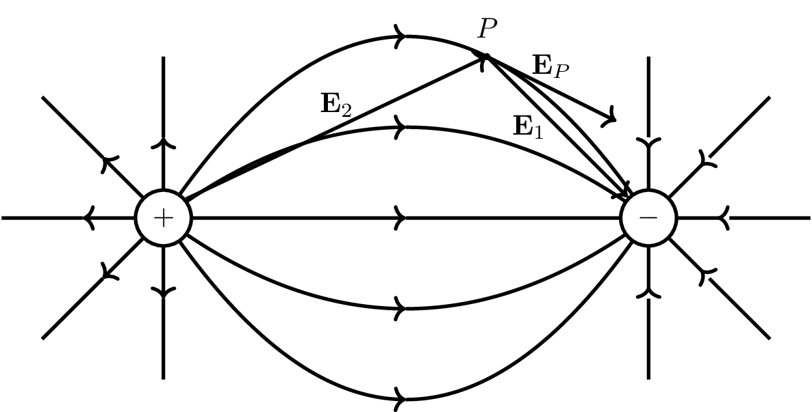 

</figure>

Il campo elettrico stazionario, come il campo gravitazionale, è conservativo, per cui il lavoro svolto equivale all’opposto della differenza di energia potenziale. Per convenzione lo stato di riferimento dell’energia potenziale elettrica si trova ad una distanza infinita dalla carica, per cui l’energia corrisponde al lavoro necessario per spostare una carica $q$ da una distanza infinita ad una distanza finita $R$ da un campo elettrico $\boldsymbol{\mathbf{E}}$. Si considera una campo elettrico generato da una carica puntiforme $Q$: $$\begin{gathered}
    \Delta U(r)=-L=-\displaystyle\int_{+\infty}^R\boldsymbol{\mathbf{F}}\cdot \mathrm{d}\boldsymbol{\mathbf{r}}\\
    \displaystyle\int_{+\infty}^Rq\boldsymbol{\mathbf{E}}\cdot \mathrm{d}\boldsymbol{\mathbf{r}}=\int_{+\infty}^R\frac{1}{4\pi\varepsilon_0}\frac{qQ}{r^2}\cancelto{1}{\hat{\boldsymbol{\mathbf{r}}}\cdot \hat{\boldsymbol{\mathbf{r}}}}dr\\
    \cancelto{0}{-\displaystyle\frac{1}{4\pi\varepsilon_0}\frac{qQ}{+\infty}}+\frac{1}{4\pi\varepsilon_0}\frac{qQ}{R}\\
    U(r)=\frac{1}{4\pi\varepsilon_0}\frac{qQ}{R}=-L(r)\tag{\stepcounter{equation}\theequation}
\end{gathered}$$

Viene definito il potenziale elettrico $V$ il lavoro per unità di carica, viene misurato nel SI in Volt V: $$\Delta V=\displaystyle-\frac{L}{q}=-\int\frac{\boldsymbol{\mathbf{F}}}{q}\cdot \mathrm{d}\boldsymbol{\mathbf{r}}=-\int\boldsymbol{\mathbf{E}}\cdot \mathrm{d}\boldsymbol{\mathbf{r}}$$ Corrisponde ad un integrale di linea del campo elettrico $\boldsymbol{\mathbf{E}}$. Per un campo elettrico stazionario generato da una carica puntiforme $Q$ corrisponde a: $$V=\displaystyle\frac{1}{4\pi\varepsilon_0}\frac{Q}{R}\:\left[\mathrm{V}\right]=\left[{\mathrm{m}\cdot\mathrm{N}}\cdot\mathrm{C}^{-1}\right]$$

In forma differenziale, il potenziale elettrico corrisponde a: $$\mathrm{d}V=-\boldsymbol{\mathbf{E}}\cdot \mathrm{d}\boldsymbol{\mathbf{r}}=-(E_x\mathrm{d}x+E_y\mathrm{d}y+E_z\mathrm{d}z)$$ Il differenziale $\mathrm{d}V$ è un differenziale totale di un campo scalare $V(x,y,z)$, per cui corrisponde alla somma delle variazioni su ogni coordinata del differenziale della stessa: $$\mathrm{d}V=\displaystyle\frac{\partial V}{\partial x}\mathrm{d}x+\frac{\partial V}{\partial y}\mathrm{d}y+\frac{\partial V}{\partial z}\mathrm{d}z$$ Per il principio di identità dei polinomi risulta: $$\displaystyle\frac{\partial V}{\partial x}=-E_x,\:\frac{\partial V}{\partial y}=-E_y,\:\frac{\partial V}{\partial z}=-E_z$$

Si considera l’operatore differenziale vettoriale nabla: $${\boldsymbol{\mathbf{\nabla}}}:=\left(\displaystyle\frac{\partial}{\partial x},\,\frac{\partial}{\partial y},\,\frac{\partial}{\partial z}\right)$$ Per cui è possibile esprimere la relazione tra il potenziale elettrico ed il campo elettrico considerando l’operazione di gradiente su un campo scalare $\boldsymbol{\mathbf{\boldsymbol{\mathbf{\nabla}}}}V$: $$\boldsymbol{\mathbf{E}}=-{\boldsymbol{\mathbf{\nabla}}}V$$ La capacità di un campo di ammettere un potenziale è una condizione sufficiente della conservatività di un campo vettoriale. Un’altra condizione sufficiente dipende dal risultato della circuitazione del campo, ovvero l’integrale di linea su un qualsiasi percorso chiuso $\lambda$ del campo $\boldsymbol{\mathbf{E}}$. Se la circuitazione del campo è nulla, allora il campo in questione è conservativo: $$\Gamma_\lambda(\boldsymbol{\mathbf{E}})=\displaystyle\oint_{\lambda}\boldsymbol{\mathbf{E}}\cdot \mathrm{d}\boldsymbol{\mathbf{\lambda}}=0$$ Se il campo non è conservativo, implica che il campo è variabile per cui la circuitazione risulta diversa da zero.

Oltre all’operazione di gradiente su un campo scalare, se si considera un campo vettoriale $\boldsymbol{\mathbf{a}}(x,y,z)$, si possono definire altre due operazioni: la divergenza ed il rotore. La divergenze è definita come il prodotto scalare tra l’operatore nabla ed il campo $\boldsymbol{\mathbf{a}}$: $$\begin{gathered}
    {\boldsymbol{\mathbf{\nabla}}}\cdot\boldsymbol{\mathbf{a}}=\displaystyle\left(\frac{\partial}{\partial x}\hat{\boldsymbol{\mathbf{x}}}+\frac{\partial}{\partial y}\hat{\boldsymbol{\mathbf{y}}}+\frac{\partial}{\partial z}\hat{\boldsymbol{\mathbf{z}}}\right)\cdot\left(a_x\hat{\boldsymbol{\mathbf{x}}}+a_y\hat{\boldsymbol{\mathbf{y}}}+a_z\hat{\boldsymbol{\mathbf{z}}}\right)\\
    \displaystyle\frac{\partial a_x}{\partial x}\cancelto{1}{\hat{\boldsymbol{\mathbf{x}}}\cdot\hat{\boldsymbol{\mathbf{x}}}}+\frac{\partial a_y}{\partial x}\cancelto{0}{\hat{\boldsymbol{\mathbf{y}}}\cdot\hat{\boldsymbol{\mathbf{x}}}}+\frac{\partial a_z}{\partial x}\cancelto{0}{\hat{\boldsymbol{\mathbf{z}}}\cdot\hat{\boldsymbol{\mathbf{x}}}}+
    \frac{\partial a_x}{\partial y}\cancelto{0}{\hat{\boldsymbol{\mathbf{x}}}\cdot\hat{\boldsymbol{\mathbf{y}}}}+\frac{\partial a_y}{\partial y}\cancelto{1}{\hat{\boldsymbol{\mathbf{y}}}\cdot\hat{\boldsymbol{\mathbf{y}}}}+\frac{\partial a_z}{\partial y}\cancelto{0}{\hat{\boldsymbol{\mathbf{z}}}\cdot\hat{\boldsymbol{\mathbf{y}}}}+
    \frac{\partial a_x}{\partial z}\cancelto{0}{\hat{\boldsymbol{\mathbf{x}}}\cdot\hat{\boldsymbol{\mathbf{z}}}}+\frac{\partial a_y}{\partial z}\cancelto{0}{\hat{\boldsymbol{\mathbf{y}}}\cdot\hat{\boldsymbol{\mathbf{z}}}}+\frac{\partial a_z}{\partial z}\cancelto{1}{\hat{\boldsymbol{\mathbf{z}}}\cdot\hat{\boldsymbol{\mathbf{z}}}}\\
    {\boldsymbol{\mathbf{\nabla}}}\cdot\boldsymbol{\mathbf{a}}=\displaystyle\frac{\partial a_x}{\partial x}+\frac{\partial a_y}{\partial y}+\frac{\partial a_z}{\partial z}\tag{\stepcounter{equation}\theequation}
\end{gathered}$$ Il rotore è definito come il prodotto vettoriale tra l’operatore nabla ed il campo $\boldsymbol{\mathbf{a}}$: $$\begin{gathered}
    {\boldsymbol{\mathbf{\nabla}}}\times\boldsymbol{\mathbf{a}}=
    \begin{vmatrix}
        \hat{\boldsymbol{\mathbf{x}}} & \hat{\boldsymbol{\mathbf{y}}} & \hat{\boldsymbol{\mathbf{z}}} \\
        \displaystyle\frac{\partial}{\partial x} & \displaystyle\frac{\partial}{\partial y} & \displaystyle\frac{\partial}{\partial z}\\
        a_x & a_y & a_z
    \end{vmatrix}=
    \begin{vmatrix}
        \displaystyle\frac{\partial}{\partial y} & \displaystyle\frac{\partial }{\partial z}\\
        a_y & a_z
    \end{vmatrix}\hat{\boldsymbol{\mathbf{x}}}-
    \begin{vmatrix}
        \displaystyle\frac{\partial}{\partial x} & \displaystyle\frac{\partial}{\partial z}\\
        a_x & a_z
    \end{vmatrix}\hat{\boldsymbol{\mathbf{y}}}+
    \begin{vmatrix}
        \displaystyle\frac{\partial}{\partial x} & \displaystyle\frac{\partial}{\partial y}\\
        a_x & a_y
    \end{vmatrix}\hat{\boldsymbol{\mathbf{z}}}\\
    {\boldsymbol{\mathbf{\nabla}}}\times\boldsymbol{\mathbf{a}}=\left(\displaystyle\frac{\partial a_z}{\partial y}-\frac{\partial a_y}{\partial z}\right)\hat{\boldsymbol{\mathbf{x}}}-\left(\frac{\partial a_x}{\partial z}-\frac{\partial a_z}{\partial x}\right)\hat{\boldsymbol{\mathbf{y}}}+\left(\frac{\partial a_y}{\partial x}-\frac{\partial a_x}{\partial y}\right)\hat{\boldsymbol{\mathbf{z}}}\tag{\stepcounter{equation}\theequation}
\end{gathered}$$

### Teorema di Gauss

> Il flusso totale, entrane o uscente, del campo elettrico $\boldsymbol{\mathbf{E}}$ generato da cariche interne ad una qualsiasi superficie chiusa $S$, attraverso la stessa superficie equivale al rapporto tra la carica totale e la costante di permettività dielettrica nel vuoto $\varepsilon_0$: $$\Phi_{S}(\boldsymbol{\mathbf{E}})=\displaystyle\frac{Q}{\varepsilon_0}$$

Analogamente alla portata di un liquido attraverso una superficie, il flusso $\Phi$ di un campo vettoriale $\boldsymbol{\mathbf{v}}$ determina l’intensità del campo attraverso una data superficie $S$.

<figure>

 

</figure>

Il flusso è massimo quando il campo e la superficie sono tra di loro perpendicolari: $\Phi_S(\boldsymbol{\mathbf{v}})=|\boldsymbol{\mathbf{v}}|\cdot S$. Per determinare il flusso attraverso una superficie $S$ inclinata rispetto al campo $\boldsymbol{\mathbf{v}}$ bisogna considerare la componente del campo che passa perpendicolarmente attraverso la superficie, per cui si definisce il versore giuntura di una superficie $\hat{\boldsymbol{\mathbf{n}}}_S$ come il vettore di modulo unitario, direzione normale alla superficie nel punto e di verso uscente se la superficie è concava, ed entrante se è convessa: $\Phi_S(\boldsymbol{\mathbf{v}})=\boldsymbol{\mathbf{v}}\cdot\hat{\boldsymbol{\mathbf{n}}}S$. In caso la superficie sia ondulata, la giacitura cambierebbe in base alla sua posizione, per cui per determinarne il flusso si considera un’approssimazione tramite la somma di flussi dello stesso campo attraverso suddivisioni della superficie, ognuna con una giacitura diversa: $\Phi_S(\boldsymbol{\mathbf{v}})\approx\sum_{i=1}^N\boldsymbol{\mathbf{v}}\cdot\hat{\boldsymbol{\mathbf{n}}}_iS_i$. Al diminuire della superficie $S_i$, la precisione aumenta, per cui per una superficie infinitesima si può determinare esattamente l’infinitesimo di flusso attraverso l’intera superficie: $\Phi_{\mathrm{d}S}(\boldsymbol{\mathbf{v}})=\boldsymbol{\mathbf{v}}\cdot\hat{\boldsymbol{\mathbf{n}}}\mathrm{d}S=\mathrm{d}\Phi_{S}(\boldsymbol{\mathbf{v}})$. In caso le suddivisioni siano finite, il flusso viene calcolato tramite una sommatoria, altrimenti per suddivisioni infinite si considera un integrale chiuso sulla superficie totale $S$: $$\displaystyle\Phi_S(\boldsymbol{\mathbf{v}})=\int_{S}\boldsymbol{\mathbf{v}}\cdot\hat{\boldsymbol{\mathbf{n}}}\mathrm{d}S$$

Nel caso del teorema di Gauss, si considera una situazione semplificata, dove è presenta una singola carica $Q$ nel centro di una superficie sferica $S$ di raggio $r$. Considerando una sezione infinitesima della superficie $\mathrm{d}S$, il versore giacitura $\hat{\boldsymbol{\mathbf{n}}}$ risulta essere sempre parallelo al campo elettrico $\boldsymbol{\mathbf{E}}$ generato dalla carica, poiché si trova nel centro della sfera. Per cui il campo elettrico passante per ogni sezione infinitesima è costante, considerando l’integrale del flusso si ottiene: $$\begin{gathered}
    \Phi_S(\boldsymbol{\mathbf{E}})=\displaystyle\oint_{S}E\cancelto{1}{\hat{\boldsymbol{\mathbf{r}}}\cdot\hat{\boldsymbol{\mathbf{n}}}}\mathrm{d}S=\oint_S\frac{Q}{4\pi\varepsilon_0r^2}\mathrm{d}S=\frac{Q}{4\pi\varepsilon_0r^2}\oint_S\mathrm{d}S=\frac{Q}{4\pi\varepsilon_0r^2}4\pi r^2\\
    \Phi_S(\boldsymbol{\mathbf{E}})=\frac{Q}{\varepsilon_0}\tag{\stepcounter{equation}\theequation}
\end{gathered}$$

<figure>

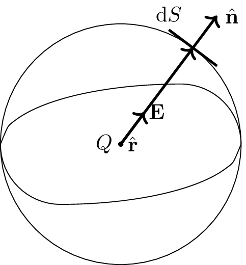 

</figure>

Ciò implica che il campo elettrico ammette l’esistenza di sorgenti singole. Infatti se una carica si trova all’interno di una superficie chiusa, tutte le linee di campo generate escono attraverso la superficie, mentre se la carica si trovasse all’esterno della superficie, tutte le linee di campo entranti sarebbero necessariamente anche uscenti, ed il flusso totale sarebbe dato dalla somma del flusso entrante e del flusso uscente risultando nullo.

### Teorema della Divergenza e I Legge di Maxwell

Il flusso attraverso una superficie chiusa è dato dalla somma del flusso per ogni faccia della superficie. Considerando un cubo infinitesimo con facce parallele ai piani cartesiani ed un campo elettrico $\boldsymbol{\mathbf{E}}$ passante per quel cubo, si calcola il flusso totale sommando il flusso sulle sue sei facce.

<figure>

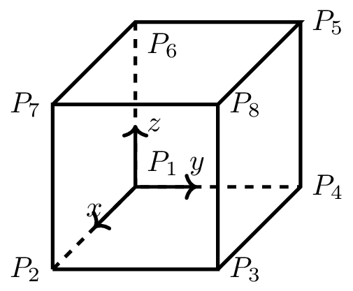 

</figure>

$$\begin{aligned}
    &P_1(x,y,z) &P_5(x,y+\mathrm{d}y,z+\mathrm{d}z)\\
    &P_2(x+\mathrm{d}x,y,z) &P_6(x,y,z+\mathrm{d}z)\\
    &P_3(x+\mathrm{d}x,y+\mathrm{d}y,z) &P_7(x+\mathrm{d}x,y,z+\mathrm{d}z)\\
    &P_4(x,y+\mathrm{d}y,z) &P_8(x+\mathrm{d}x,y+\mathrm{d}y,z+\mathrm{d}z)
\end{aligned}$$

Il flusso attraverso la faccia $P_1P_2P_3P_4$ risulta essere: $$\Phi_1(\boldsymbol{\mathbf{E}})=\boldsymbol{\mathbf{E}}\cdot\hat{\boldsymbol{\mathbf{n}}}\mathrm{d}S=(E_x\cancelto{0}{\hat{\boldsymbol{\mathbf{x}}}\cdot\hat{\boldsymbol{\mathbf{n}}}}+E_y\cancelto{0}{\hat{\boldsymbol{\mathbf{y}}}\cdot\hat{\boldsymbol{\mathbf{n}}}}+E_z\cancelto{-1}{\hat{\boldsymbol{\mathbf{z}}}\cdot\hat{\boldsymbol{\mathbf{n}}}})\mathrm{d}S=-E_z\mathrm{d}x\mathrm{d}y$$ Poiché il campo elettrico è antiparallelo alla giuntura della superficie.

Considerando la faccia $P_5P_6P_7P_8$, il campo elettrico varia prima di attraversare la faccia. La variazione dipende dalla variazione lungo l’asse $z$, per cui il cambiamento del campo elettrico dipende dalla sua derivata parziale ${\partial\boldsymbol{\mathbf{E}}}/{\partial z}$. Il cambiamento effettivo è dato dalla derivata parziale moltiplicata per lo spostamento effettuato sull’asse $z$, trattandosi di un cubo infinitesimo lo spostamento è infinitesimo $\mathrm{d}z$. Per cui il campo che attraversa la faccia risulta essere: $$\boldsymbol{\mathbf{E}}+\displaystyle\frac{\partial \boldsymbol{\mathbf{E}}}{\partial z}\mathrm{d}z$$ Per cui il flusso risulta essere: $$\Phi_2=\left(E_z+\displaystyle\frac{\partial E_z}{\partial z}\mathrm{d}z\right)\mathrm{d}x\mathrm{d}y$$

Analogamente alla prima faccia, il flusso attraverso le due facce $P_1P_2P_6P_7$ e $P_1P_4P_5P_6$ risultano essere: $$\begin{gathered}
    \Phi_3=-E_y\mathrm{d}x\mathrm{d}z\\
    \Phi_5=-E_x\mathrm{d}y\mathrm{d}z
\end{gathered}$$ Analogamente alla seconda faccia, il campo elettrico varia prima di attraversare le facce $P_3P_4P_5P_8$ e $P_2P_3P_7P_8$, ed il loro flusso risulta essere: $$\begin{gathered}
    \Phi_4=\left(E_y+\displaystyle\frac{\partial E_y}{\partial y}\mathrm{d}y\right)\mathrm{d}x\mathrm{d}z\\
    \Phi_6=\left(E_x+\displaystyle\frac{\partial E_x}{\partial x}\mathrm{d}x\right)\mathrm{d}y\mathrm{d}z
\end{gathered}$$

Il flusso totale attraverso il cubo infinitesimo risulta quindi essere: $$\begin{gathered}
    \Phi=\displaystyle\sum_{i=1}^6\Phi_i\\
    \begin{matrix}
        -E_z\mathrm{d}x\mathrm{d}y & -E_y\mathrm{d}x\mathrm{d}z & -E_x\mathrm{d}y\mathrm{d}z\\
        +\left(E_z+\displaystyle\frac{\partial E_z}{\partial z}\mathrm{d}z\right)\mathrm{d}x\mathrm{d}y & +\left(E_y+\displaystyle\frac{\partial E_y}{\partial y}\mathrm{d}y\right)\mathrm{d}x\mathrm{d}z & +\left(E_x+\displaystyle\frac{\partial E_x}{\partial x}\mathrm{d}x\right)\mathrm{d}y\mathrm{d}z
    \end{matrix}\\
    \displaystyle\frac{\partial E_z}{\partial z}\mathrm{d}x\mathrm{d}y\mathrm{d}z+\frac{\partial E_y}{\partial y}\mathrm{d}x\mathrm{d}y\mathrm{d}z+\frac{\partial E_x}{\partial x}\mathrm{d}x\mathrm{d}y\mathrm{d}z\\
    \Phi=\left(\displaystyle\frac{\partial E_x}{\partial x}+\frac{\partial E_y}{\partial y}+\frac{\partial E_z}{\partial z}\right)\mathrm{d}x\mathrm{d}y\mathrm{d}z
\end{gathered}$$

Si considera il volume del cubo infinitesimo $\mathrm{d}\tau=\mathrm{d}x\mathrm{d}y\mathrm{d}z$, mentre la superficie infinitesime che racchiude il volume $\mathrm{d}S$. Il flusso attraverso il cubo equivale alla divergenza del campo elettrico: $$\Phi_{\mathrm{d}S}(\boldsymbol{\mathbf{E}})={\boldsymbol{\mathbf{\nabla}}}\cdot\boldsymbol{\mathbf{E}}\mathrm{d}\tau=\mathrm{d}\Phi_S(\boldsymbol{\mathbf{E}})$$ Per cui è possibile determinare il flusso di un campo elettrico (stazionario) $\boldsymbol{\mathbf{E}}$ attraverso una superficie chiusa $S$, considerando l’integrale sul volume racchiuso dalla superficie $\tau$ della divergenza del campo. Ciò viene chiamato teorema della divergenza. $$\displaystyle\oint_S\boldsymbol{\mathbf{E}}\cdot\hat{\boldsymbol{\mathbf{n}}}\mathrm{d}S=\int_{\tau}{\boldsymbol{\mathbf{\nabla}}}\cdot\boldsymbol{\mathbf{E}}\mathrm{d}\tau$$ Per il teorema di Gauss il flusso di un campo elettrico $\boldsymbol{\mathbf{E}}$ attraverso una qualsiasi superficie chiusa $S$ è dato dal rapporto delle carica totale $Q$ interna alla superficie e la permettività dielettrica nel vuoto $\varepsilon_0$. Dato un mezzo con densità uniforme di carica $\rho_Q$, la carica totale può essere espressa come l’integrale sull’intero volume della densità: $$Q=\displaystyle\int_{\tau}\rho_Q\mathrm{d}\tau$$ Per il teorema di Gauss e per il teorema della divergenza: $$\begin{gathered}
    \displaystyle\int_{\tau}{\boldsymbol{\mathbf{\nabla}}}\cdot \boldsymbol{\mathbf{E}}\mathrm{d}\tau=\int_{\tau}\frac{\rho_Q}{\varepsilon_0}\mathrm{d}\tau\\
    {\boldsymbol{\mathbf{\nabla}}}\cdot\boldsymbol{\mathbf{E}}=\displaystyle\frac{\rho_Q}{\varepsilon_0}
\end{gathered}$$

Viene definito vettore dello spostamento elettrico nel vuoto $\boldsymbol{\mathbf{D}}:=\varepsilon_0\boldsymbol{\mathbf{E}}$, per cui si può esprimere l’equazione precedente come: $${\boldsymbol{\mathbf{\nabla}}}\cdot\boldsymbol{\mathbf{D}}=\rho_Q\,\displaystyle\left[{\mathrm{C}}\cdot{\mathrm{m}^{-3}}\right]$$ Questa è la prima legge di Maxwell in forma locale.

### Teorma del Rotore

In un campo elettrico conservativo, la circuitazione lungo un qualsiasi percorso chiuso è nulla. Poiché il campo elettrico equivale all’inverso del gradiente del potenziale ed il potenziale è lavoro per unità di carica di un campo conservativo, su un percorso chiuso il lavoro è nullo, quindi anche la circuitazione. Esistono invece campi elettrici che non producono lavoro, ma forza elettro-motrice, per cui la circuitazione su un percorso chiuso è diversa da zero.

Considerando una superficie quadrata infinitesima attraversata da un campo elettrico $\boldsymbol{\mathbf{E}}$, si vuole calcolare la sua circuitazione, sommando la circuitazione sui suoi quattro lati infinitesimi, come il prodotto scalare tra il campo elettrico e lo spostamento $\mathrm{d}\boldsymbol{\mathbf{\lambda}}$. Per convenzione si considera una circuitazione positiva in senso antiorario.

<figure>

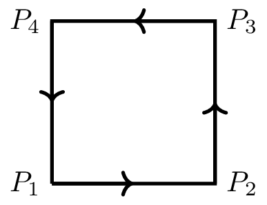 

</figure>

$$\begin{aligned}
    &P_1(x,y,z)\\
    &P_2(x+\mathrm{d}x,y,z)\\
    &P_3(x+\mathrm{d}x,y+\mathrm{d}y,z)\\
    &P_4(x,y+\mathrm{d}y,z)
\end{aligned}$$

Sul lato $P_1P_2$, il campo elettrico varia con l’aumento della coordinata $x$, poiché ogni componente del campo elettrico dipende dalle $3$ coordinate, la variazione di una coordinate implica una variazione di tutte le componenti del campo. La circuitazione risulta quindi essere: $$\Gamma_1=\boldsymbol{\mathbf{E}}\cdot \mathrm{d}\boldsymbol{\mathbf{\lambda}}=\left(E_x\hat{\boldsymbol{\mathbf{x}}}+\displaystyle\frac{\partial E_x}{\partial x}\mathrm{d}x\hat{\boldsymbol{\mathbf{x}}}+E_y\hat{\boldsymbol{\mathbf{y}}}+\frac{\partial E_y}{\partial x}\mathrm{d}y\hat{\boldsymbol{\mathbf{y}}}+E_z\hat{\boldsymbol{\mathbf{z}}}+\frac{\partial E_z}{\partial x}\mathrm{d}z\hat{\boldsymbol{\mathbf{z}}}\right)\cdot \mathrm{d}\boldsymbol{\mathbf{x}}=\left(E_x+\frac{\partial E_x}{\partial x}\mathrm{d}x\right)\mathrm{d}x$$ Analogamente per il lato $P_2P_3$, il campo elettrico varia con l’aumento delle coordinata $x$ e $y$, per cui per ogni componente del campo sarà aggiunta una variazione dipendente dall’aumento delle $x$ e un’altra dall’aumento delle $y$: $$\Gamma_2=\left(E_y\hat{\boldsymbol{\mathbf{y}}}+\displaystyle\frac{\partial E_y}{\partial x}\mathrm{d}x\hat{\boldsymbol{\mathbf{y}}}+\frac{\partial E_y}{\partial y}\mathrm{d}y\hat{\boldsymbol{\mathbf{y}}}\right)\cdot \mathrm{d}\boldsymbol{\mathbf{y}}=\left(E_y+\frac{\partial E_y}{\partial x}\mathrm{d}x+\frac{\partial E_y}{\partial y}\mathrm{d}y\right)\mathrm{d}y$$

Per i lati $P_3P_4$ e $P_4P_1$ la direzione in cui vengono attraversati è opposta alla verso delle coordinate, per cui la circuitazione per questi lati è negativa: $$\begin{gathered}
    \Gamma_3=-\left(E_x+\displaystyle\frac{\partial E_x}{\partial x}\mathrm{d}x+\frac{\partial E_x}{\partial y}\mathrm{d}y\right)\mathrm{d}x\\
    \Gamma_4=-\left(E_y+\displaystyle\frac{\partial E_y}{\partial y}\mathrm{d}y\right)\mathrm{d}y
\end{gathered}$$

La circuitazione totale risulta essere quindi: $$\begin{gathered}
    \Gamma=\Gamma_1+\Gamma_2+\Gamma_3+\Gamma_4\\
    \begin{matrix}
        \displaystyle\left(E_x+\frac{\partial E_x}{\partial x}\mathrm{d}x\right)\mathrm{d}x+\left(E_y+\frac{\partial E_y}{\partial x}\mathrm{d}x+\frac{\partial E_y}{\partial y}\mathrm{d}y\right)\mathrm{d}y\\
        \displaystyle-\left(E_x+\frac{\partial E_x}{\partial x}\mathrm{d}x+\frac{\partial E_x}{\partial y}\mathrm{d}y\right)\mathrm{d}x-\left(E_y+\frac{\partial E_y}{\partial y}\mathrm{d}y\right)\mathrm{d}y
    \end{matrix}\\
    \Gamma=\left(\displaystyle\frac{\partial E_y}{\partial x}-\frac{\partial E_x}{\partial y}\right)\mathrm{d}x\mathrm{d}y
\end{gathered}$$ La circuitazione totale equivale alla componente del rotore del campo elettrico parallela alla normale al piano individuato dalla superficie descritta dal percorso $\lambda$. Poiché la circuitazione è uno scalare, per conservare solo questa componente si considera il prodotto scalare tra il rotore del campo elettrico ed il versore giacitura. Considerando il differenziale della superficie $\mathrm{d}S=\mathrm{d}x\mathrm{d}y$, la circuitazione totale su una superficie infinitesimale è: $$\Gamma_{\mathrm{d}\lambda}=\boldsymbol{\mathbf{E}}\cdot \mathrm{d}\boldsymbol{\mathbf{\lambda}}=({\boldsymbol{\mathbf{\nabla}}}\times\boldsymbol{\mathbf{E}})\cdot \hat{\boldsymbol{\mathbf{n}}}\mathrm{d}S=\mathrm{d}\Gamma_\lambda$$ Integrando quest’ultima equazione si ottiene che la circuitazione per un qualsiasi percorso chiuso $\lambda$ di un campo elettrico (stazionario) $\boldsymbol{\mathbf{E}}$ è esattamente il flusso del rotore del campo elettrico attraverso la superficie $S$ descritta dal quel percorso $\lambda$. Questo rappresenta il teorema del rotore: $$\displaystyle\oint_{\lambda}\boldsymbol{\mathbf{E}}\cdot \mathrm{d}\boldsymbol{\mathbf{\lambda}}=\int_S({\boldsymbol{\mathbf{\nabla}}}\times\boldsymbol{\mathbf{E}})\cdot\hat{\boldsymbol{\mathbf{n}}}\mathrm{d}S$$

Per il teorema della circuitazione ed il teorema del rotore, per tutti i campi conservativi, il rotore di un campo elettrico è nullo, condizione necessaria affinché un campo vettoriale sia conservativo: $${\boldsymbol{\mathbf{\nabla}}}\times\boldsymbol{\mathbf{E}}=\boldsymbol{\mathbf{0}}$$

## Corrente e Magnetismo

La corrente è una grandezza fisica che rappresenta un flusso di cariche, convenzionalmente positive, che si muovono dentro un mezzo. Nel SI viene misurata in Ampere A. La corrente può essere definita in duo modi:

I$\left.\right)$ Si può considerare la corrente come la somma algebrica di cariche $\Delta Q$ che passano attraverso una superficie, sezione del mezzo dove fluiscono, in un intervallo di tempo $\Delta Q$, ovvero la velocità in cui il flusso di cariche si muove attraverso la data superficie. Questa rappresenta solo un’approssimazione della corrente effettiva, viene chiamata corrente media: $i_m={\Delta Q}/{\Delta t}$. Per ottenere la corrente effettiva, si considera il limite per l’intervallo di tempo di osservazione $\Delta t\to0$, in questo modo si considera la corrente istantanea, ovvero la variazione di carica istantanea: $$i:=\lim_{\Delta t\to0}\displaystyle\frac{\Delta Q}{\Delta t}=\frac{\mathrm{d}Q}{\mathrm{d}t}\,[\mathrm{C}\cdot\mathrm{s}^{-1}]=[\mathrm{A}]$$

II$\left.\right)$ Si può formulare la corrente considerando il concetto del mezzo continuo, visione della fisica classica secondo cui il materiale è continuo. Questa visione è paradossale poiché a livello microscopico è stato osservato che diverse grandezze non sono continue, ma per i fini prefissati non si incontra questo paradosso. Si considera un volume continuo con una certa densità di carica $\rho_Q$, e in moto con una certa velocità $\boldsymbol{\mathbf{v}}$. La corrente allora corrisponde alla portata attraverso una certa superficie $S$, ovvero corrisponde al flusso del vettore $\rho_Q\boldsymbol{\mathbf{v}}$ attraverso la superficie $S$: $$i:=\displaystyle\int_S\rho_Q\boldsymbol{\mathbf{v}}\cdot\hat{\boldsymbol{\mathbf{n}}}\mathrm{d}S$$

<figure>

 

</figure>

Il vettore $\rho_Q\boldsymbol{\mathbf{v}}$ corrisponde al vettore densità di corrente $\boldsymbol{\mathbf{J}}\left[\mathrm{C}\cdot\mathrm{m}^{-2}\cdot\mathrm{s}\right]$, che rappresenta la corrente in forma vettoriale.

Come una carica è in grado di generare un campo elettrico, una corrente è in grado di generare un campo magnetico. Nei magneti permanenti la corrente generatrice di campo dipende dal movimento degli elettroni all’interno del materiale.

Si considera un mezzo filiforme, ovvero monodimensionale, composto di materiale conduttore, tipicamente un qualche metallo, dove gli elettroni sono liberi di muoversi all’interno. Si considera che un effetto esterno non definito abbia causato uno spostamento degli elettroni all’interno del filo, può essere dovuto all’avvicinamento di una carica negativa, spostando gli elettroni in un’altra zona del filo. Ciò crea due zone nel filo, una carica positivamente, l’altra carica negativamente, questa differenza di potenziale interna al filo si rappresenta come una corrente di spostamento di cariche $i$, in una certa direzione.

Ampere ha sperimentalmente dimostrato che intorno al filo si può misurare un campo di forze, formato da linee di campo concentriche con il filo come centro. Il vero di questo campo si ottiene mediante la regola della mano destra: se la corrente si muove dall’alto verso il basso, allora il campo ha verso orario, altrimenti ha verso antiorario.

<figure id="fig:corrente-filo">
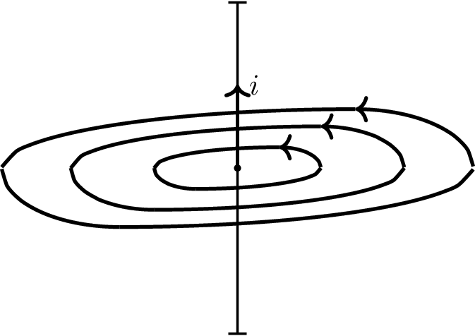
<figcaption>Vista Laterale</figcaption>
</figure>

Il campo generato dalla corrente è il campo magnetico $\boldsymbol{\mathbf{H}}$. Le circonferenza generate sono il luogo dei punti dello spazio tangenti al campo $\boldsymbol{\mathbf{H}}$ in quel punto. La circuitazione del campo $\boldsymbol{\mathbf{H}}$ su una sua circonferenza corrisponde alla corrente concatenata $i_c$ moltiplicata per un fattore $n$, poiché potrebbero essere presenti multiple correnti passanti all’interno di quel percorso $\lambda$: $$\displaystyle\oint_{\lambda}\boldsymbol{\mathbf{H}}\cdot \mathrm{d}\boldsymbol{\mathbf{\lambda}}=(n)i_c$$

Per il teorema della circuitazione: $$\displaystyle\oint_{\lambda}\boldsymbol{\mathbf{H}}\cdot \mathrm{d}\boldsymbol{\mathbf{\lambda}}=\int_S(\boldsymbol{\mathbf{\nabla}}\times\boldsymbol{\mathbf{H}})\cdot\hat{\boldsymbol{\mathbf{n}}}\mathrm{d}S=i_c$$

La corrente passante per il filo può essere espressa come il flusso della densità di carica attraverso la sezione $S'$ del materiale filiforme, questo flusso corrisponde allo stesso flusso per la superficie individuata dalla circonferenza $\lambda$, poiché in mezzi non metallici, ovvero conduttori, i contributi si annullano: $$\displaystyle\int_S(\boldsymbol{\mathbf{\nabla}}\times\boldsymbol{\mathbf{H}})\cdot\hat{\boldsymbol{\mathbf{n}}}\mathrm{d}S=\int_{S'}\boldsymbol{\mathbf{J}}\cdot\hat{\boldsymbol{\mathbf{n}}}\mathrm{d}S=\int_S\boldsymbol{\mathbf{J}}\cdot\hat{\boldsymbol{\mathbf{n}}}\mathrm{d}S$$

<figure id="fig:corrente-campo-magnetico">
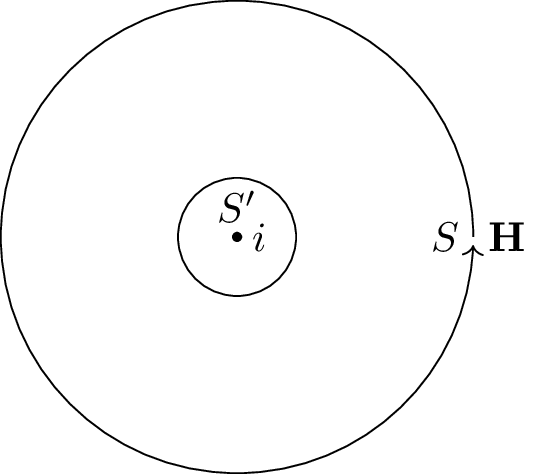
<figcaption>Vista Verticale</figcaption>
</figure>

Questa relazione tra rotore del campo magnetico e vettore densità di carica viene chiamato teorema di Ampere, ed in forma locale si presenta come: $$\boldsymbol{\mathbf{\nabla}}\times\boldsymbol{\mathbf{H}}=\boldsymbol{\mathbf{J}}$$ Considerando il vettore di induzione magnetica $\boldsymbol{\mathbf{B}}=\mu_0\boldsymbol{\mathbf{H}}$, dove $\mu_0$ è la costante di permeabilità magnetica nel vuoto: $$\mu_0=4\pi\cdot10^{-7}$$ Si esprime il teorema di Ampere in forma locale come: $$\boldsymbol{\mathbf{\nabla}}\times\boldsymbol{\mathbf{B}}=\mu_0\boldsymbol{\mathbf{J}}$$ A questo risultato ottenuto da Ampere verrà aggiunto il fattore di corrente di spostamento di Maxwell.

### Teorema di Ampere-Maxwell e II Legge di Maxwell

Il teorema da Ampere da solo descrive una situazione paradossale, per cui l’intervento di Maxwell perfezionò l’analisi compiuta da Ampere.

Per descrivere il paradosso contenuto nel teorema di Ampere si considera un filo dove scorre una certa corrente $i$. Il filo è reciso in una sezione e vengono poste due lamine metalliche ad ambo le parti della sezione tagliata. Maxwell osservò sperimentalmente che la corrente continua a fluire nel resto del filo, per cui deve essere necessariamente presente qualcosa nella zona di vuoto tra il filo capace di muovere le cariche, per cui paradossalmente la corrente attraversa il vuoto, ma è stato descritto precedentemente come sia impossibile per la corrente fluire per un mezzo non conduttore come il vuoto.

Per spiegare il paradosso, si considera che la corrente deposita sulla lamina cariche positive, mentre la corrente dall’altra parte del vuoto preleva cariche positive dalla lamina, quindi le due lamine sono una carica positivamente, mentre l’altra carica negativamente. La carica delle due lamine può essere spiegata per un effetto induttivo, ma fisicamente la corrente preleva e deposita cariche positive sulle due maglie metalliche.

La corrente che passa attraverso il filo può essere espressa come il flusso del campo magnetico generato attraverso una cerchio di raggio $r$ e centrato nel filo: $$i=\int_S{\boldsymbol{\mathbf{H}}}\cdot\hat{\boldsymbol{\mathbf{n}}}\mathrm{d}S$$

Si considera inoltre un volume di base la superficie su cui si è effettuato l’operazione di flusso, che racchiude la maglia attaccata alla porzione del filo considerata.

<figure>

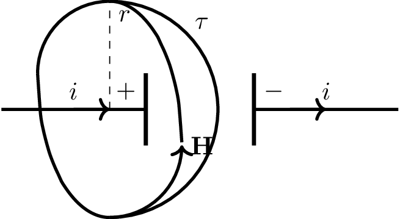 

</figure>

La corrente poiché è continua dovrebbe trovarsi anche tra le due armature, ma nel volume individuato il campo magnetico è nullo, per cui non è presente un flusso di cariche. Per spiegare questo paradosso si considera la corrente come variazione di carica per unità di tempo: $i={\mathrm{d}Q}/{\mathrm{d}t}$. Sull’armatura considerata si accumulano cariche, per cui è presenta una variazione di carica nel tempo. L’armatura carica produce quindi un campo elettrico, individuabile tramite il teorema di Gauss, considerando un cubo avente due facce parallele alla lamina. Se la lamina è sufficientemente estesa, il campo elettrico $\boldsymbol{\mathbf{E}}$ generato è sempre ortogonale alle due facce parallele alla lamina, e costante su tutta la superficie. Per simmetria la lamina genera due campi di modulo e direzione uguale e verso opposto:

<figure>

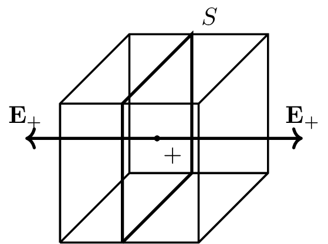 

</figure>

Il flusso totale passante per la superficie chiusa $S$ corrisponde a: $$\Phi_{S_\mathrm{tot}}(\boldsymbol{\mathbf{E}})=\displaystyle\oint_{S_\mathrm{tot}}\boldsymbol{\mathbf{E}}\cdot\hat{\boldsymbol{\mathbf{n}}}\mathrm{d}S=\int_{2S}E\mathrm{d}S=2ES$$ Per il teorema di Gauss lo stesso flusso corrisponde al rapporto tra le carica del interna alla superficie e la permettività dielettrica nel vuoto: $$2ES=\displaystyle\frac{Q}{\varepsilon_0}$$

Si considera con un processo analogo anche l’armatura carica negativamente, poiché su entrambe le armature è presenta la stessa carica in modulo, i campi generati dalla due armature non si annullano solo nella zona tra le due, dove il campo totale è doppio.

<figure>

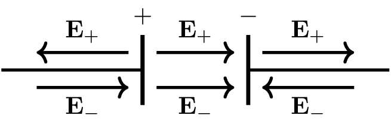 

</figure>

Si esprime la carica presente sulle armature considerando la densità superficiale di carica $\delta_Q$, per cui il campo totale (interno) generato dalle maglie risulta essere: $$\begin{gathered}
    2ES=\displaystyle\frac{\delta_QS}{\varepsilon_0}\\
    E_\mathrm{tot}=2E=\displaystyle\frac{\delta_Q}{\varepsilon_0}
\end{gathered}$$

Si esprime la quantità di carica presente sulle armature mediante la densità volumetrica di carica $\rho_Q$: $$i=\displaystyle\frac{\mathrm{d}Q}{\mathrm{d}t}=\frac{\mathrm{d}}{\mathrm{d}t}\int_{\tau}\rho_Q\mathrm{d}\tau$$ Per la prima equazione di Maxwell, e per il teorema della divergenza: $$i=\displaystyle\frac{\mathrm{d}}{\mathrm{d}t}\int_{\tau}\boldsymbol{\mathbf{\nabla}}\cdot\varepsilon_0\boldsymbol{\mathbf{E}}\mathrm{d}\tau=\frac{\mathrm{d}}{\mathrm{d}t}\oint_{S_\mathrm{tot}}\varepsilon_0\boldsymbol{\mathbf{E}}\cdot\hat{\boldsymbol{\mathbf{n}}}\mathrm{d}S$$ Poiché il campo elettrico è sempre ortogonale alle armature, il flusso per l’intera superficie è uguale al flusso attraverso le sole armature $S_A$, per cui la superficie di integrazione diventa aperta: $$i=\displaystyle\frac{\mathrm{d}}{\mathrm{d}t}\int_{S_A}\varepsilon_0\boldsymbol{\mathbf{E}}\cdot\hat{\boldsymbol{\mathbf{n}}}\mathrm{d}S$$ Poiché non si deriva per la stessa variabile di integrazione, si può invertire l’ordine delle operazioni, considerano la derivata parziale rispetto al tempo, invece di una derivata totale, poiché il campo è una funzione multivariabile: $$i=\displaystyle\int_{S_A}\varepsilon_0\frac{\partial \boldsymbol{\mathbf{E}}}{\partial t}\cdot\hat{\boldsymbol{\mathbf{n}}}\mathrm{d}S$$

Si esprime questa corrente, chiamata corrente di spostamento, mediante il flusso di un nuovo vettore di intensità di corrente $\boldsymbol{\mathbf{J}}_S$: $$i_S=\displaystyle\int_{S_A}\varepsilon_0\frac{\partial \boldsymbol{\mathbf{E}}}{\partial t}\cdot\hat{\boldsymbol{\mathbf{n}}}\mathrm{d}S=\int_{S_A}\boldsymbol{\mathbf{J}}_S\cdot\hat{\boldsymbol{\mathbf{n}}}\mathrm{d}S$$ Viene definita la corrente di spostamento di Maxwell in forma locale: $$\boldsymbol{\mathbf{J}}_S=\displaystyle\varepsilon_0\frac{\partial \boldsymbol{\mathbf{E}}}{\partial t}=\frac{\partial \boldsymbol{\mathbf{D}}}{\partial t}$$

Per la continuità delle correnti in un mezzo conduttore fluisce $\boldsymbol{\mathbf{J}}$, mentre nel vuoto scorre $\boldsymbol{\mathbf{J}}_S$, poiché ai due capi del filo la corrente è la stessa, necessariamente la corrente nel mezzo e la corrente di spostamento devono essere uguali $\boldsymbol{\mathbf{J}}=\boldsymbol{\mathbf{J}}_S$. Se non è presenta una variazione di campo elettrico, entrambe i vettori di intensità di corrente diventano nulli e non fluisce corrente nè nel filo nè nel vuoto.

<figure>

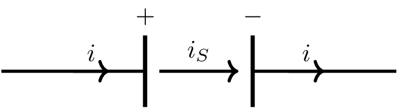 

</figure>

Con aggiunta la corrente di spostamento di Maxwell, il teorema di Ampere-Maxwell, o seconda equazione di Maxwell, in forma integrale diventa: $$\oint_{\lambda}\boldsymbol{\mathbf{H}}\cdot \mathrm{d}\boldsymbol{\mathbf{\lambda}}=i_c+i_S$$ Per il teorema del rotore: $$\begin{gathered}
    \displaystyle\oint_{\lambda}\boldsymbol{\mathbf{H}}\cdot \mathrm{d}\boldsymbol{\mathbf{\lambda}}=\int_S(\boldsymbol{\mathbf{\nabla}}\times\boldsymbol{\mathbf{H}})\cdot\hat{\boldsymbol{\mathbf{n}}}\mathrm{d}S=i_c+i_S=\int_S(\boldsymbol{\mathbf{J}}+\boldsymbol{\mathbf{J}}_S)\cdot\hat{\boldsymbol{\mathbf{n}}}\mathrm{d}S\\
    \boldsymbol{\mathbf{\nabla}}\times\boldsymbol{\mathbf{H}}=\boldsymbol{\mathbf{J}}+\boldsymbol{\mathbf{J}}_S
\end{gathered}$$ In forma locale, si esprime mediante il rotore campo di induzione magnetica $\boldsymbol{\mathbf{B}}$: $$\boldsymbol{\mathbf{\nabla}}\times\boldsymbol{\mathbf{B}}=\mu_0\left(\boldsymbol{\mathbf{J}}+\varepsilon_0\displaystyle\frac{\partial \boldsymbol{\mathbf{E}}}{\partial t}\right)$$

## Campo Elettro-Motore

Il campo elettro-motore è un tipo di campo fondamentale in elettronica ed elettronica, può essere generato da conversioni energetiche, tramite induzione magnetica o un’operazione ibrida tra le due, come una turbina che ruota meccanicamente, insieme ad un campo magnetico per generare un campo elettro-motore che genera elettricità. Un campo elettro-motore genera una differenza di potenziale o tensione, ma non è garantito che queste due grandezze coincidono.

A differenza del campo elettrico, non è un campo conservativo: $\boldsymbol{\mathbf{\nabla}}\times\boldsymbol{\mathbf{E}}_m\neq0$. Il lavoro per unità di carica del campo elettro-motrice, equivale alla forza elettro-motrice, ma non corrisponde alla grandezza fisica forza: $$\displaystyle\int_{\lambda}\boldsymbol{\mathbf{E}}_m\cdot \mathrm{d}\boldsymbol{\mathbf{\lambda}}=F_{\mathrm{e.m.}}$$ Poiché non è un campo conservativo, cambiando il percorso $\lambda$ su cui viene spinta la carica di prova, cambierà la forza elettro-motrice generata.

Si considera una situazione dove sono presenti due cariche a contatto, una positiva, l’altra negativa. Quando sono a contatto il campo elettro-statico complessivo generato dalle cariche è nullo, mentre se vengono separate mediante un campo elettro-motore $\boldsymbol{\mathbf{E}}_m$, sarà generato anche un campo elettro-statico $\boldsymbol{\mathbf{E}}_S$ opposto del precedente: $\boldsymbol{\mathbf{E}}_m=-\boldsymbol{\mathbf{E}}_S$. Questa relazione di equivalenza tra i due campi non è generale, poiché uno è un campo conservativo, mentre l’altro non conservativo. Il campo elettro-statico è presente solo se un campo elettro-motore ha separato le due cariche. La forza elettro motrice generata, per un certo percorso $\lambda$ è: $$\displaystyle\int_{\lambda}\boldsymbol{\mathbf{E}}_m\cdot \mathrm{d}\boldsymbol{\mathbf{\lambda}}=-\int_{\lambda}\boldsymbol{\mathbf{E}}_s\cdot \mathrm{d}\boldsymbol{\mathbf{\lambda}}$$ Il percorso $\lambda$ è definito dal campo elettro-motore, la conservatività di $\boldsymbol{\mathbf{E}}_s$ è quindi irrilevante in queste condizioni. Poiché il suo lavoro per unità di carica è opposto alla forza elettro motrice per un certo percorso $\lambda$, cambia anch’esso in base a questo percorso. Dato che il campo elettro-statico corrisponde all’opposto del gradiente del potenziale $V$, si considera solo la componente di coordinata curvilinea $\lambda$: $$\displaystyle\int_{\lambda}\boldsymbol{\mathbf{E}}_m\cdot \mathrm{d}\boldsymbol{\mathbf{\lambda}}=\int_{\lambda}\frac{\partial V}{\partial\lambda}\cancelto{1}{\hat{\lambda}\cdot\hat{\lambda}}\mathrm{d}\boldsymbol{\mathbf{\lambda}}=\Delta V_{\lambda}$$

Quindi la forza elettro-motrice per un certo percorso $\lambda$ è uguale alla differenza di potenziale tra l’inizio e la fine del percorso creato dal campo elettro-motore.

Una batteria è un oggetto che, mantenendo separate cariche positive e negative mediante reazioni chimiche all’interno, è in grado di generare una differenza di potenziale ed un campo elettrico-stazionario tra i due morsetti, punti di accesso di materiale conduttore, necessari per poter usufruire della differenza di potenziale generata.

Per misurare una differenza di potenziale si usa un voltmetro, uno strumento che presenta due puntali, uno positivo ed uno negativo, restituisce la differenza tra il potenziale al puntale positivo ed il puntale negativo $V_+-V_-$. Il segno della differenza di potenziale fornisce informazione sulla carica dei morsetti della batteria. Se i due morsetti vengono coperti con un materiale isolante come la plastica, il campo elettro-statico non ne influisce, ma il voltmetro registra una tensione nulla. Per cui per misurare una differenza di potenziale sono necessarie delle porte di accesso di materiali conduttori, dello strumento di misura e dell’oggetto, per poter misurare il campo elettro-statico.

Il campo elettro-statico è immagine del campo elettro-motrice con una proprietà, fino a quando non cambia il percorso. La conservatività del campo elettro-statico permette di esprimere il rotore del campo elettro-motore come: $$\boldsymbol{\mathbf{\nabla}}\times\boldsymbol{\mathbf{E}}_m=\boldsymbol{\mathbf{\nabla}}\times\boldsymbol{\mathbf{E}}_m+\boldsymbol{\mathbf{\nabla}}\times\boldsymbol{\mathbf{E}}_s$$

### Teorema di Faraday-Neumann-Lenz e III Legge di Maxwell

Faraday studiò le interazioni tra il campo magnetico e la corrente. Nei suoi esperimenti usò una spira di materiale conduttore, attraversata ortogonalmente da un campo magnetico variabile nel tempo $\boldsymbol{\mathbf{H}}(t)=\mu_0\boldsymbol{\mathbf{B}}(t)$, all’interno del percorso descritto dalla spira. Faraday osservò che variando il campo magnetico, all’interno della spira cominciava a scorrere una corrente variabile nel tempo, ovvero un flusso di cariche. Questo flusso viene generato da un campo elettro-motore $\boldsymbol{\mathbf{E}}_m$, indotto dal campo magnetico $\boldsymbol{\mathbf{H}}(t)$. Sulla spira compare una forza elettro motrice uniformemente distribuita, poiché la corrente è uguale in ogni punto della spira.

<figure>

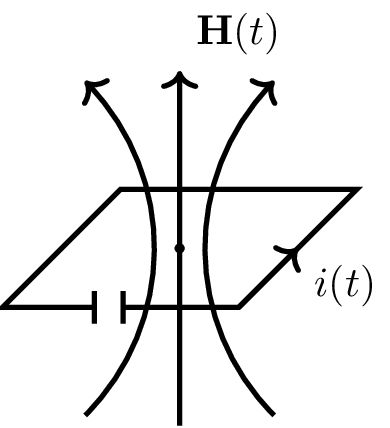 

</figure>

Grazie ad osservazioni sperimentali si è dimostrato che la corrente è direttamente proporzionale all’inverso della variazione del campo di induzione magnetica: $i(t)\propto\boldsymbol{\mathbf{B}}(t)$, per cui si oppone al cambiamento del campo. Questo effetto venne formalizzato da Faraday, Neumann e Lenz, per esprimere la corrente generata si considera la circuitazione del campo elettrico indotto. Spesso si taglia il filo per indicare la differenza di potenziale descritta dalla circuitazione, rimasta invariata, quindi il percorso attraversato è aperto: $$\displaystyle\int_{\lambda}\boldsymbol{\mathbf{E}}\cdot \mathrm{d}\boldsymbol{\mathbf{\lambda}}=-\frac{\mathrm{d}\Phi(\boldsymbol{\mathbf{B}})}{\mathrm{d}t}=-\int_S\frac{\partial \boldsymbol{\mathbf{B}}}{\partial t}\cdot\hat{\boldsymbol{\mathbf{n}}}\mathrm{d}S$$ Dove $S$ rappresenta qualsiasi superficie con cui si concatena il campo $\boldsymbol{\mathbf{B}}$ individuata dal percorso $\lambda$. Per il teorema del rotore: $$\displaystyle\int_S(\boldsymbol{\mathbf{\nabla}}\times\boldsymbol{\mathbf{E}})\cdot\hat{\boldsymbol{\mathbf{n}}}\mathrm{d}S=-\int_S\frac{\partial \boldsymbol{\mathbf{B}}}{\partial t}\cdot\hat{\boldsymbol{\mathbf{n}}}\mathrm{d}S$$ In forma locale si presenta come: $$\boldsymbol{\mathbf{\nabla}}\times\boldsymbol{\mathbf{E}}=\displaystyle-\frac{\partial \boldsymbol{\mathbf{B}}}{\partial t}$$ Poiché si parla di rotore, si può esprimere il campo elettrico come la somma del campo elettro-motore indotto e del campo elettro-statico tra la differenza di potenziale, anche se la loro somma è nulla, dato che il campo elettro-statico è irrotazionale: $$\boldsymbol{\mathbf{\nabla}}\times\boldsymbol{\mathbf{E}}_m+\boldsymbol{\mathbf{\nabla}}\times\boldsymbol{\mathbf{E}}_s=-\displaystyle\frac{\partial \boldsymbol{\mathbf{B}}}{\partial t}$$ Quest’equazione rappresenta la terza legge di Maxwell.

### IV Legge di Maxwell

Rispetto ad un campo elettrico, un campo magnetico, generato da un magnete permanente o indotto da una corrente, presenta delle differenza considerevoli. Considerando un magnete permanente, si definiscono nord e sud magnetico le zone di comportamento del materiale, non è presenta una divisione netta tra le due zone poiché questo comportamento dipende da andamenti microscopici. Il nord magnetico è la zona del mezzo dove escono linee di forza, mentre il sud magnetico è la zona del materiale dove entrano linee di forza. Queste linee di forza si propagano nel mezzo, senza interruzione di continuità:

<figure>

 

</figure>

Di conseguenza, per ogni superficie chiusa attraversata da un campo magnetico, il numero delle linee di forza entrante è pari al numero delle linee di forza uscenti, quindi il flusso del campo del campo magnetico $\boldsymbol{\mathbf{B}}$ è nullo. Per il teorema della divergenza si può esprimere come:

$$\displaystyle\oint_{S}\boldsymbol{\mathbf{B}}\cdot\hat{\boldsymbol{\mathbf{n}}}\mathrm{d}S=\int_{\tau}\boldsymbol{\mathbf{\nabla}}\cdot\boldsymbol{\mathbf{B}}\mathrm{d}\tau=0$$

Di conseguenza non può esistere un monopolo magnetico, a differenza del campo elettrico, le cui sorgenti possono esistere singolarmente. Un campo la cui divergenza è nulla viene chiamato campo solenoidale. In forma locale si esprime la quarta ed ultima equazione di Maxwell: $$\boldsymbol{\mathbf{\nabla}}\cdot\boldsymbol{\mathbf{B}}=0$$

## Equazioni di Maxwell e Grandezze Fisiche

Vengono riportata in forma locale le quattro equazioni di Maxwell, precedentemente ricavate: $$\begin{cases}
        \boldsymbol{\mathbf{\nabla}}\times\boldsymbol{\mathbf{E}}=-\displaystyle\frac{\strut \partial \boldsymbol{\mathbf{B}}}{\strut \partial t}\\
        \boldsymbol{\mathbf{\nabla}}\times\boldsymbol{\mathbf{B}}=\mu_0\left(\boldsymbol{\mathbf{J}}+\displaystyle\frac{\strut \partial \boldsymbol{\mathbf{D}}}{\strut \partial t}\right)\\
        \boldsymbol{\mathbf{\nabla}}\cdot\boldsymbol{\mathbf{D}}=\rho_Q\\
        \boldsymbol{\mathbf{\nabla}}\cdot\boldsymbol{\mathbf{B}}=0
    \end{cases}$$ Possono anche essere espresse in forma integrale, oppure considerando i campi di spostamento elettrico nel vuoto $\boldsymbol{\mathbf{D}}=\varepsilon_0\boldsymbol{\mathbf{E}}$ e di induzione magnetica nel vuoto $\boldsymbol{\mathbf{B}}=\mu_0\boldsymbol{\mathbf{H}}$. Non sempre questi campi si trovano nel vuoto, per cui si definiscono le costanti di permettività dielettrica relativa al mezzo $\varepsilon_r>1$ e di permeabilità magnetica relativa al mezzo $\mu_r>1$. Quando vengono usate le costanti di permeabilità e permettività per un mezzo diverso dal vuoto si considera $\varepsilon=\varepsilon_0\cdot\varepsilon_r$ e $\mu=\mu_0\cdot\mu_r$. Maggiore è la costante dielettrica relativa, più il materiale si dice dielettrico.

Per determinare le grandezze fisiche dei campi analizzati, si considera la circuitazione del campo magnetico: $$\begin{gathered}
    \displaystyle\oint_{\lambda}\boldsymbol{\mathbf{H}}\cdot \mathrm{d}\boldsymbol{\mathbf{\lambda}}=i_c\to[H]=\mathrm{A}\cdot\mathrm{m}^{-1}
\end{gathered}$$ Per cui risulta che il campo magnetico si misura in Ampere per metro, si considera Ampere-spire, quando la corrente è concatenata più volte per la presenza di spire sovrapposte tra di loro. Il rotore del campo magnetico $\boldsymbol{\mathbf{H}}$ corrisponde ad una derivata spaziale, per cui si misura in Ampere su metro quadro: $$=\mathrm{A}\cdot\mathrm{m}^{-2}$$

Per definire il vettore di induzione magnetica $\boldsymbol{\mathbf{B}}$ si considera la terza equazione di Maxwell in forma integrale: $$\displaystyle\left[\oint_{\lambda}\boldsymbol{\mathbf{E}}\cdot \mathrm{d}\vec\lambda=-\frac{\mathrm{d}\Phi_S(\boldsymbol{\mathbf{B}})}{\mathrm{d}t}\right]\to\frac{\mathrm{N}\cdot \mathrm{m}}{\mathrm{A}\cdot \mathrm{s}}=\frac{[B]\cdot \mathrm{m}^2}{SI{s}}\to[B]=\mathrm{N}\cdot\mathrm{A}^{-1}\cdot\mathrm{m}^{-1}:=\mathrm{T}$$ Viene definita la grandezza fisica Tesla T per quantificare l’intensità del campo di induzione magnetica $\boldsymbol{\mathbf{B}}$. Ora è possibile definire la grandezza della permeabilità magnetica: $$\displaystyle\left[\mu_0=\frac{{B}}{{H}}\right]\to\frac{\mathrm{N}}{\mathrm{A}\cdot \mathrm{m}}\cdot\frac{\mathrm{m}}{\mathrm{A}}=\frac{\mathrm{N}}{\mathrm{A}^2}:=\mathrm{H}\cdot\mathrm{m}^{-1}$$ Viene definita la grandezza Henry H come Newton per metro su Ampere quadro, servirà in seguito a quantificare l’auto e mutua induttanza.

Un vettore di intensità di corrente $\boldsymbol{\mathbf{J}}$ può esistere solo in un mezzo conduttivo, rappresenta l’unico elemento riferito al mezzo nelle equazioni di Maxwell. La corrente si muove nello stesso verso del vettore $\boldsymbol{\mathbf{J}}$, ma trattandosi di uno scalare non fornisce informazioni aggiuntive sulla grandezza, poiché la direzione di una corrente è solo una convenzione, e le sue proprietà non cambierebbero se fluisse nel verso opposto. Una corrente si misura con un amperometro montato in serie su di un circuito, la freccia della corrente indica solamente la direzione dell’amperometro. Inoltre il verso della corrente indica una differenza di potenziale, dal potenziale più basso a quello più alto. All’interno di un materiale conduttore le cariche non si muovono spontaneamente, per cui affinché sia presente una differenza di potenziale $\Delta V=v$, deve essere presenta un campo elettro-statico $\boldsymbol{\mathbf{E}}$, dovuto ad un campo elettro-motore $\boldsymbol{\mathbf{E}}_m$. La direzione verso il potenziale più basso, ovvero il minimo del campo scalare potenziale è individuato dal gradiente $\boldsymbol{\mathbf{\nabla }}V$. Il gradiente è un vettore che indica il punto di minimo, per cui la direzione del vettore densità di corrente $\boldsymbol{\mathbf{J}}$ dipende dall’opposto del gradiente del potenziale, ovvero dal campo elettrico: $\boldsymbol{\mathbf{J}}\propto-\boldsymbol{\mathbf{\nabla }}V\propto\boldsymbol{\mathbf{E}}$.

<figure>

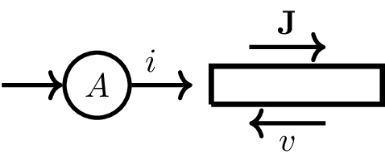 

</figure>

Per i materiali di corrente, il campo elettrico impresso è uguale alla vettore di intensità di corrente moltiplicato per un fattore $\rho_e$, chiamato resistività elettrica, relativo al materiale considerato, chiamato resistività elettrica. Poiché il materiale internamente impedisce ad alcune cariche di fluire, per cui rallenta la nube elettronica che scorre nel mezzo, viene definita la grandezza fisica ohm $\Omega$ per misurare questa resistività: $$\displaystyle\left[\boldsymbol{\mathbf{E}}=\rho_{e}\boldsymbol{\mathbf{J}}\right]\to\frac{\mathrm{N}}{\mathrm{A}\cdot \mathrm{s}}\frac{\mathrm{m}^2}{\mathrm{A}}=\frac{\mathrm{N}\cdot \mathrm{m}^2}{\mathrm{A}^2\cdot \mathrm{s}}:=\Omega\cdot\mathrm{m}$$ La presenza della resistività rappresenta la maggiore differenza tra lo studio dei campi e lo studio dei circuiti.

## Onde Elettro-Magnetiche

All’interno delle equazioni di Maxwell sono presenti dei componenti incrociati del campo elettrico $\boldsymbol{\mathbf{E}}$ e del campo magnetico $\boldsymbol{\mathbf{B}}$, per cui descrivono un fenomeno che si auto-sostiene, ovvero si propaga. Per determinare in che modo questo campo elettro-magnetico si propaga nello spazio, si considerano le necessarie ipotesi per poter descrivere semplicemente le sue proprietà. Da notare che le proprietà di questo campo si mantengono anche senza le ipotesi che considereremo. Per ottenere queste proprietà è sufficiente considerare solo le equazioni del rotore di Maxwell. Si studia la situazione nel vuoto, senza la presenza di conduttori, per cui la corrente di conduzione $\boldsymbol{\mathbf{J}}$ è nulla e la densità di carica $\rho_Q$ è nulla: $$\begin{cases}
        \boldsymbol{\mathbf{\nabla}}\times\boldsymbol{\mathbf{E}}=-\displaystyle\frac{\strut \partial \boldsymbol{\mathbf{B}}}{\strut \partial t}\\
        \boldsymbol{\mathbf{\nabla}}\times\boldsymbol{\mathbf{B}}=\mu_0\varepsilon_0\displaystyle\frac{\strut \partial \boldsymbol{\mathbf{E}}}{\strut \partial t}
    \end{cases}$$

Per ipotesi il campo elettrico è presente solo sulla coordinata $x$ e la variazione del campo elettrico sulle $x$ rispetto alla coordinata $z$ è nulla. Le ulteriori ipotesi verranno discusse solo quando saranno rilevanti: $$\begin{aligned}
    &1\left.\right)\boldsymbol{\mathbf{E}}(x,y,z,t)=E_x(x,y,z,t)\hat{\boldsymbol{\mathbf{x}}}\\
    &2\left.\right)\displaystyle\frac{\partial E_x}{\partial z}=0
\end{aligned}$$

Dalla prima ipotesi segue che il rotore del campo elettrico ha un’unica componente $z$, per cui, per il principio di identità dei polinomi e per la terza l’equazione di Maxwell, anche il campo magnetico $\boldsymbol{\mathbf{B}}$ varia solo sulla coordinata $z$: $$\begin{gathered}
    \boldsymbol{\mathbf{\nabla}}\times\boldsymbol{\mathbf{E}}=
    \begin{vmatrix}
        \hat{\boldsymbol{\mathbf{x}}} &\hat{\boldsymbol{\mathbf{y}}}&\hat{\boldsymbol{\mathbf{z}}}\\
        \displaystyle\frac{\partial}{\partial x}&\displaystyle\frac{\partial}{\partial y}&\displaystyle\frac{\partial}{\partial z}\\
        E_x&0&0
    \end{vmatrix}=
    \displaystyle\cancelto{0}{\frac{\partial E_x}{\partial y}}\hat{\boldsymbol{\mathbf{y}}}-\frac{\partial E_x}{\partial y}\hat{\boldsymbol{\mathbf{z}}}=-\frac{\partial \boldsymbol{\mathbf{B}}}{\partial t}\\
    \displaystyle\frac{\partial B_x}{\partial t}=\frac{\partial B_y}{\partial t}=0\\
    \displaystyle\frac{\partial E_x}{\partial y}=\frac{\partial B_z}{\partial t}
\end{gathered}$$

Per la seconda equazione di Maxwell, considerando solo la componente $x$ del rotore, sempre per il principio di identità dei polinomi si ottiene: $$\begin{gathered}
    \boldsymbol{\mathbf{\nabla}}\times\boldsymbol{\mathbf{B}}=\mu_0\varepsilon_0\displaystyle\frac{\partial E_x}{\partial t}\hat{\boldsymbol{\mathbf{x}}}\\
    \left(\displaystyle\frac{\partial B_z}{\partial y}-\frac{\partial B_y}{\partial z}\right)=\mu_0\varepsilon_0\frac{\partial E_x}{\partial t}
\end{gathered}$$ Si definiscono due funzioni con versori diversi ortogonali, poiché non colloquiano tra di loro.

Si ottiene quindi il seguente sistema: $$\begin{cases}
        \displaystyle\frac{\strut \partial E_x}{\strut \partial y}=\frac{\strut \partial B_z}{\strut \partial t}\\
        \displaystyle\frac{\strut \partial B_z}{\strut \partial y}-\frac{\strut \partial B_y}{\strut \partial z}=\mu_0\varepsilon_0\frac{\strut \partial E_x}{\strut \partial t}
    \end{cases}$$ Si deriva rispetto al tempo la seconda equazione e invertendo l’ordine di derivazione si ottiene: $$\begin{gathered}
    \displaystyle\frac{\partial^2B_z}{\partial y\partial t}-\frac{\partial^2B_y}{\partial z\partial t}=\mu_0\varepsilon_0\frac{\partial^2E_z}{\partial t^2}\\
    \displaystyle\frac{\partial}{\partial y}\frac{\partial B_z}{\partial t}-\frac{\partial}{\partial z}\cancelto{0}{\frac{\partial B_y}{\partial t}}=\mu_0\varepsilon_0\frac{\partial^2E_x}{\partial t^2}\\
    \displaystyle\frac{\partial^2E_x}{\partial y^2}=\mu_0\varepsilon_0\frac{\partial^2E_x}{\partial t^2}
\end{gathered}$$ Quest’equazione ottenuta descrive il comportamento di un’onda. Per ipotesi l’onda si propaga solo sulla coordinata $y$, e si considera sempre per ipotesi solamente l’onda diretta e si esclude quella riflessa. Le soluzioni di questo tipo di equazione d’onda sono tutte le possibili funzioni, che presentano come argomento le coordinate su cui l’onda si propaga, in questo caso $y$. Come argomento della soluzione si considera la traslazione dell’onda nello spazio e si inserisce il fattore correttivo $ct$, dove $c$ è la velocità di propagazione dell’onda: $$\mathrm{Sol}:=\{f(y-ct)+g(y+ct):t\geq0\}$$ Per ipotesi si esclude la funzione riflessa $g$. Si sceglie la funzione più semplice come soluzione dell’onda diretta, una funzione sinusoidale. Non si può considerare $y-ct$ come argomento della funzione sinusoidale, poiché l’argomento deve essere monodimensionale. Si considera la relazione tra l’argomento $\alpha$, misurato in radianti e la variabile $y$, in metri. Viene definita $\lambda$ lunghezza d’onda, e rappresenta la distanza tra due punti uguali dell’onda: $$\displaystyle\frac{y}{\alpha}=\frac{\lambda}{2\pi}\to\alpha=\frac{2\pi y}{\lambda}$$ Questo valore viene chiamato numero d’onda. Si considera l’ampiezza massima $E_{\max}$, per cui il campo elettrico si esprime come: $$E_x=E_{\max}\sin\left(\displaystyle\frac{2\pi (y-ct)}{\lambda}\right)$$

Inserendo questa funzione d’onda nell’equazione d’onda precedentemente si ottiene: $$\begin{gathered}
    \displaystyle\frac{\partial^2}{\partial y^2}\left(E_{\max}\sin\left(\displaystyle\frac{2\pi (y-ct)}{\lambda}\right)\right)=\mu_0\varepsilon_0\frac{\partial^2}{\partial t^2}\left(E_{\max}\sin\left(\displaystyle\frac{2\pi (y-ct)}{\lambda}\right)\right)\\
    \displaystyle E_{\max}\frac{4\pi^2}{\lambda^2}\sin\left(\frac{2\pi (y-ct)}{\lambda}\right)=\mu_0\varepsilon_0E_{\max}\frac{4\pi^2c^2}{\lambda^2}\sin\left(\frac{2\pi (y-ct)}{\lambda}\right)\\
    1=\mu_0\varepsilon_0c^2
\end{gathered}$$ $$c=\displaystyle\frac{1}{\sqrt{\mu_0\varepsilon_0}}$$ La velocità di propagazione dell’onda elettro-magnetica nel vuoto, corrisponde alla velocità della luce nel vuoto. Questa velocità sarà sempre minore se il campo attraversa un mezzo diverso dal vuoto, a causa delle costanti di permettività e permeabilità relative, per cui la velocità appena ottenuta rappresenta la massima velocità raggiungibile da questo tipo di onde.

<figure>

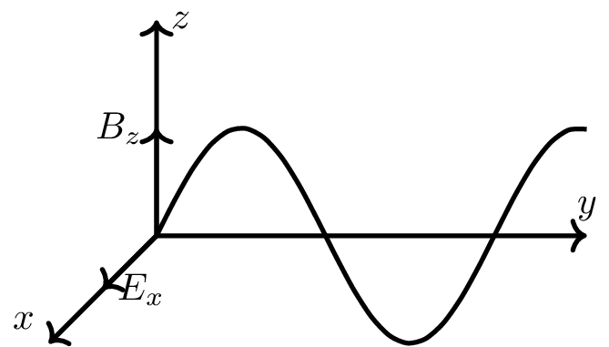 

</figure>

## Energia e Potenza

Si considerano diverse situazione per ricavare l’energia e la potenza del campo elettrico e magnetico.

Dato un materiale conduttore, si esprime la forza elettrica come la carica $q$ trasportata che interagisce con un certo campo elettrico $\boldsymbol{\mathbf{E}}$, per cui si può esprimere la potenza come: $$P=\boldsymbol{\mathbf{F}}\cdot\boldsymbol{\mathbf{u}}=q\boldsymbol{\mathbf{E}}\cdot\boldsymbol{\mathbf{u}}=\rho_Q\tau\boldsymbol{\mathbf{E}}\cdot\boldsymbol{\mathbf{u}}$$ Per un materiale conduttore il vettore intensità di carica corrisponde a $\boldsymbol{\mathbf{J}}=\rho_Q\boldsymbol{\mathbf{u}}$, per cui la potenza in un materiale conduttore si ricava tramite: $$P=\tau\boldsymbol{\mathbf{E}}\cdot\boldsymbol{\mathbf{J}}$$ Si definisce la densità di potenza $P_\tau$ come la potenza $P$ generata in un certo volume $\tau$: $$P_{\tau}=\displaystyle\frac{P}{\tau}=\boldsymbol{\mathbf{E}}\cdot\boldsymbol{\mathbf{J}}\,\left[\mathrm{W}\cdot\mathrm{m}^{-3}\right]$$

Dato un materiale dielettrico nel continuo, dotato di una certa densità di carica $\rho_Q$. Per ricavare l’energia prodotta dal campo elettrico, si considera l’integrale di linea, poiché potrebbe essere presente un campo elettro-motore non conservativo, su un tratto $\lambda$ del materiale: $$\mathscr{E}=\displaystyle\int_{\lambda}\boldsymbol{\mathbf{F}}\cdot \mathrm{d}\boldsymbol{\mathbf{\lambda}}=q\int_{\lambda}\boldsymbol{\mathbf{E}}\cdot \mathrm{d}\boldsymbol{\mathbf{\lambda}}$$

<figure>

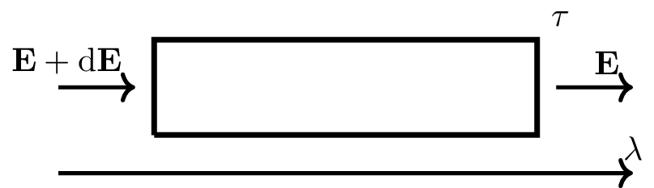 

</figure>

Si considera un volumetto interno al materiale di lunghezza $\mathrm{d}\lambda$, e si considera il campo elettrico unidirezionale, solo sulla coordinata curvilinea definita dal percorso $\lambda$. Per la prima equazione di Maxwell: $$\boldsymbol{\mathbf{\nabla}}\cdot\varepsilon_0\boldsymbol{\mathbf{E}}=\varepsilon_0\displaystyle\frac{\partial E_{\lambda}}{\partial\lambda}=\rho_Q$$ La carica $q$ corrisponde all’integrale della densità di carica sul volume $\tau$ del materiale considerato: $$\mathscr{E}=\displaystyle\int_{\tau}\varepsilon_0\frac{\partial E_{\lambda}}{\partial\lambda}\mathrm{d}\tau\cdot\int_{\lambda}\boldsymbol{\mathbf{E}}\cdot \mathrm{d}\boldsymbol{\mathbf{\lambda}}$$ Si considera il differenziale totale dell’energia rispetto al volume $\tau$ ed alla coordinata $\lambda$: $$\mathrm{d}\mathscr{E}=\displaystyle\frac{\partial \mathscr{E}}{\partial \tau}\mathrm{d}\tau+\frac{\partial\mathscr{E}}{\partial \lambda}\mathrm{d}\lambda$$ Sostituendo l’integrale precedentemente ottenuto si ottiene: $$\begin{gathered}
    \mathrm{d}\mathscr{E}=\frac{\partial}{\partial \tau}\left(\displaystyle\int_{\tau}\varepsilon_0\frac{\partial E_{\lambda}}{\partial\lambda}\mathrm{d}\tau\cdot\int_{\lambda}\boldsymbol{\mathbf{E}}\cdot \mathrm{d}\boldsymbol{\mathbf{\lambda}}\right)\mathrm{d}\tau+\frac{\partial}{\partial \lambda}\left(\displaystyle\int_{\tau}\varepsilon_0\frac{\partial E_{\lambda}}{\partial\lambda}\mathrm{d}\tau\cdot\int_{\lambda}\boldsymbol{\mathbf{E}}\cdot \mathrm{d}\boldsymbol{\mathbf{\lambda}}\right)\mathrm{d}\lambda\\
    \mathrm{d}\mathscr{E}=\displaystyle\varepsilon_0\frac{\partial E_{\lambda}}{\partial\lambda}\mathrm{d}\tau\cdot E\mathrm{d}\lambda\\
    \displaystyle\frac{\partial E_{\lambda}}{\partial \lambda}\mathrm{d}\lambda=\mathrm{d}E\to\boldsymbol{\mathbf{E}}\cdot \mathrm{d}\boldsymbol{\mathbf{E}}=E\mathrm{d}E\\
    \mathrm{d}\mathscr{E}=\varepsilon_0E\mathrm{d}E\mathrm{d}\tau\\
    \frac{\mathrm{d}\mathscr{E}}{\mathrm{d}\tau}=\varepsilon_0\boldsymbol{\mathbf{E}}\cdot \mathrm{d}\boldsymbol{\mathbf{E}}\mathrm{d}\mathscr{E}_{\tau}
\end{gathered}$$ Per cui integrando entrambe le parti si ottiene la densità energetica o energia totale per unità di volume: $$\mathscr{E}_\tau=\varepsilon_0\displaystyle\int_{0}^E\boldsymbol{\mathbf{E}}\cdot \mathrm{d}\boldsymbol{\mathbf{E}}=\frac{1}{2}\varepsilon_0E^2$$ Si può esprimere come: $$\mathscr{E}_{\tau}=\displaystyle\frac{1}{2}\boldsymbol{\mathbf{E}}\cdot\boldsymbol{\mathbf{D}}\,\left[\mathrm{J}\cdot{m}^{-3}\right]$$

Dato un materiale magnetico, la densità di potenza precedentemente calcolata può essere  
espressa come: $$P_\tau=\boldsymbol{\mathbf{E}}\cdot\boldsymbol{\mathbf{J}}\to \mathrm{d}P=EJ\mathrm{d}\tau\to P=\displaystyle\int_{\tau}EJ\mathrm{d}\lambda \mathrm{d}S=\int_{S}E\mathrm{d}S\cdot\int_{\lambda}J\mathrm{d}\lambda$$ Si possono separare gli integrali poiché il campo elettrico dipende solo dalla superficie, mentre il vettore densità di carica dal percorso. L’integrale del campo elettrico su una superficie $S$ corrisponde alla differenza di potenziale $v$, mentre l’integrale dell’intensità di corrente su un percorso $\lambda$ corrisponde alla corrente passante in quel percorso: $$P=v\cdot i$$

Questa situazione avviene all’interno di un toro, un solido di forma come una ciambella, dove il campo magnetico è ortogonale al campo elettrico generato, la superficie $S$ è una sezione del cilindro ravvolto su sé stesso per creare il toro, dove calcolo il flusso, ed il percorso $\lambda$ è una circonferenza passante per il toro.

La potenza si può esprimere, in questa situazione favorevole, come: $$P=\displaystyle\frac{\partial \phi(\boldsymbol{\mathbf{B}})}{\partial t}\oint_{\lambda}\boldsymbol{\mathbf{H}}\cdot \mathrm{d}\boldsymbol{\mathbf{\lambda}}$$ Poiché il percorso, il campo magnetico ed il campo di induzione magnetica sono paralleli si ottiene la seguente formula: $$\begin{gathered}
    P=\displaystyle\frac{\mathrm{d}BS}{\mathrm{d}t}H\lambda=\frac{\mathrm{d}B}{\mathrm{d}t}H\tau\\
    P_{\tau}=\displaystyle\frac{\mathrm{d}B}{\mathrm{d}t}H=\frac{\mathrm{d}\mathscr{E}_\mathrm{tot}}{\mathrm{d}t}\\
    \mathrm{d}\mathscr{E}_\mathrm{tot}=H\mathrm{d}B=\mu_0H\mathrm{d}H\\
    \mathscr{E}_\mathrm{tot}=\displaystyle\mu_0\int_0^HH\mathrm{d}H=\frac{1}{2}\mu_0H^2
\end{gathered}$$ Questa può essere espressa come: $$\mathscr{E}=\displaystyle\frac{1}{2}\boldsymbol{\mathbf{H}}\cdot\boldsymbol{\mathbf{B}}$$

# Modello Circuitale a Parametri Concentrati

Quando si studia la propagazione dei campi elettro-magnetici all’interno di materiali e circuiti, si considerano le leggi costitutive del mezzo materiale: $$\begin{cases}
        \boldsymbol{\mathbf{D}}=\varepsilon\boldsymbol{\mathbf{E}}\\
        \boldsymbol{\mathbf{B}}=\mu\boldsymbol{\mathbf{H}}\\
        \boldsymbol{\mathbf{J}}=\sigma(\boldsymbol{\mathbf{E}}+\boldsymbol{\mathbf{E}}_m)+\boldsymbol{\mathbf{J}}_m
    \end{cases}$$ Dove $\boldsymbol{\mathbf{J}}_m$ è la corrente indotta da un campo elettro-motore. Si ottiene quest’ultima formula, considerando la relazione tra campo elettrico e densità di corrente mediante resistività: $\boldsymbol{\mathbf{E}}=\rho_e\boldsymbol{\mathbf{J}}$. Il fattore $\sigma$ corrisponde all’inverso della resistività e si identifica con la conducibilità, con cui si esprime la corrente di conduzione dovuta al campo elettro-statico $\boldsymbol{\mathbf{E}}$ dovuto al campo elettro-motore $\boldsymbol{\mathbf{E}}_m$: $$\begin{gathered}
    \boldsymbol{\mathbf{J}}=\sigma\boldsymbol{\mathbf{E}}=\sigma(\boldsymbol{\mathbf{E}}+\boldsymbol{\mathbf{E}}_m)\\
\end{gathered}$$ Non si esclude se sia presente una corrente dovuta ad una conversione energetica, come un campo elettro-motore: $$\boldsymbol{\mathbf{J}}=\sigma(\boldsymbol{\mathbf{E}}+\boldsymbol{\mathbf{E}}_m)+\boldsymbol{\mathbf{J}}_m$$ La costante $\sigma$ si può misurare in siemens $S$ per metro: $$=\displaystyle\left[\frac{1}{\rho_e}\right]=\Omega^{-1}\cdot\mathrm{m}^{-1}=\mathrm{S}\cdot\mathrm{m}^{-1}$$

Il modello circuitale viene definito tramite osservazione sperimentali, per produrre un modello matematico, con cui è possibile simulare rappresentazioni fisiche non realizzabili o distanti dall’elettro-magnetismo. Questo modello così creato è un’approssimazione dei fenomeni fisici in atto all’interno del circuito, ma sotto certe condizioni può descrivere con considerevole precisione gli andamenti del circuito reale.

## Principi Cardinali di Kirchhoff

I principi di Kirchhoff descrivono l’andamento dell’elettro-magnetismo a regime stazionario, ovvero ogni grandezza fisica $x$ è invariante nel tempo $\dot x(t)=0$, ciò rappresenta una visione galileiana della fisica, per cui non descrive a pieno i fenomeni fisici.

In questa situazione, si considerano le equazioni di Maxwell inerenti al rotore: $$\begin{cases}
        \boldsymbol{\mathbf{\nabla}}\times\boldsymbol{\mathbf{E}}=\boldsymbol{\mathbf{0}}\\
        \boldsymbol{\mathbf{\nabla}}\times\boldsymbol{\mathbf{H}}=\boldsymbol{\mathbf{J}}
    \end{cases}$$

In forma integrale, si considera la circuitazione del campo elettrico su un qualsiasi percorso chiuso $\lambda$: $$\displaystyle\oint_{\lambda}\boldsymbol{\mathbf{E}}\cdot \mathrm{d}\boldsymbol{\mathbf{\lambda}}=0$$ Si separa il percorso $\lambda$ in $n$ diverse sezioni $\lambda_k$. La direzione su ogni sezione identifica sia la sezione di percorso $\lambda_k$ che il potenziale $v_k$ tra l’inizio e la fine del percorso $\lambda_k$. Questi potenziali vengono misurati senza mai cambiare il verso del voltmetro usato.

Il percorso chiuso $\lambda$ corrisponde all’unione di tutti i $n$ percorsi $\lambda_k$: $$\lambda=\bigcup_{k=1}^n\lambda_k$$ Per cui la circuitazione su tutto il percorso chiuso corrisponde alla somma di ogni integrale di circuitazione su ogni sezione del percorso $\lambda$. L’integrale di circuitazione del campo elettrico $\boldsymbol{\mathbf{E}}$ su un certo percorso $\lambda_k$ corrisponde all’opposto potenziale tra l’inizio e la fine del percorso: $$\begin{gathered}
    -\int_{\lambda_k}\boldsymbol{\mathbf{E}}\cdot \mathrm{d}\boldsymbol{\mathbf{\lambda}}=v_k\\
    \displaystyle\sum_{k=1}^n\left(-\int_{\lambda_k}\boldsymbol{\mathbf{E}}\cdot \mathrm{d}\boldsymbol{\mathbf{\lambda}}\right)=\sum_{k=1}^nv_k
\end{gathered}$$ Poiché si trova in una situazione a regime stazionario, la circuitazione su un percorso chiuso cel campo elettrico è nullo, per cui la somma dei potenziali su ogni sezione del percorso chiuso è nulla: $$\displaystyle\sum_{k=1}^nv_k=0$$ Quest’equazione si identifica come secondo principio di Kirchhoff, o principio di Kirchhoff alle tensioni. Se non si cambia mai il verso del voltmetro, non sarà necessario cambiare il segno del potenziale $v_k$ nella sommatoria. Se il verso non fosse uguale per ogni potenziale, bisognerebbe considerare per ogni potenziale $v_k$ il suo segno nella somma algebrica.

<figure>

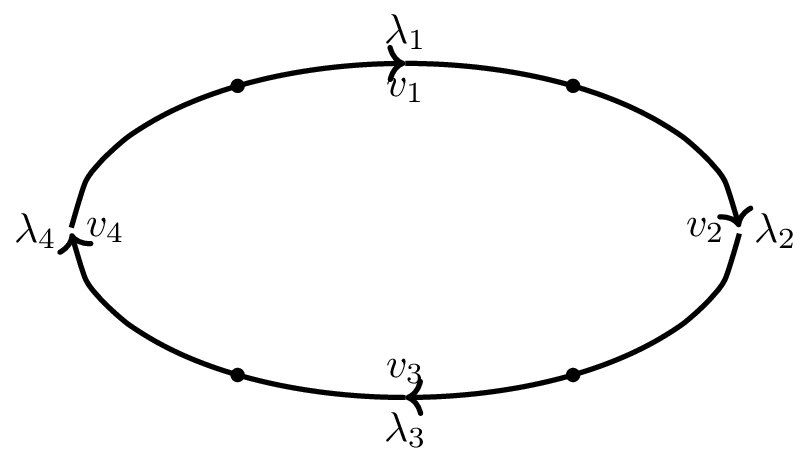 

</figure>

Per ricavare il primo principio di Kirchhoff si considera la divergenza del rotore del campo magnetico $\boldsymbol{\mathbf{H}}$: $$\begin{gathered}
    \boldsymbol{\mathbf{\nabla}}\cdot(\boldsymbol{\mathbf{\nabla}}\times\boldsymbol{\mathbf{H}})=\boldsymbol{\mathbf{\nabla}}\cdot\boldsymbol{\mathbf{J}}\\
    \displaystyle\boldsymbol{\mathbf{\nabla}}\cdot\left(\displaystyle\left(\frac{\partial H_z}{\partial y}-\frac{\partial H_y}{\partial z}\right)\hat{\boldsymbol{\mathbf{x}}}-\left(\frac{\partial H_x}{\partial z}-\frac{\partial H_z}{\partial x}\right)\hat{\boldsymbol{\mathbf{y}}}+\left(\frac{\partial H_y}{\partial x}-\frac{\partial H_x}{\partial y}\right)\hat{\boldsymbol{\mathbf{z}}}\right)\\
    \displaystyle\frac{\partial^2H_z}{\partial x\partial y}-\frac{\partial^2H_y}{\partial x\partial z}-\frac{\partial^2H_x}{\partial x\partial z}+\frac{\partial^2H_z}{\partial x\partial y}+\frac{\partial^2 H_y}{\partial x\partial z}-\frac{\partial^2H_x}{\partial y\partial z}=0\\
    \boldsymbol{\mathbf{\nabla}}\cdot\boldsymbol{\mathbf{J}}=0
\end{gathered}$$ Per cui la densità di corrente è solenoidale a regime stazionario. Tramite l’inverso del teorema della divergenza, si ottiene, considerando il volume $\tau$ ricoperto da una qualsiasi superficie chiusa $S$: $$\displaystyle\int_{\tau}\boldsymbol{\mathbf{\nabla}}\cdot\boldsymbol{\mathbf{J}}\mathrm{d}\tau=\oint_{S}\boldsymbol{\mathbf{J}}\cdot\hat{\boldsymbol{\mathbf{n}}}\mathrm{d}S=0$$

Scomponendo la superficie $S$ in $n$ superfici esterne $S_k$, si può esprimere il flusso della densità di carica attraverso $S$ come la somma dei flussi di $\boldsymbol{\mathbf{J}}$ attraverso le superfici esterne $S_k$: $$\displaystyle\oint_{S}\boldsymbol{\mathbf{J}}\cdot\hat{\boldsymbol{\mathbf{n}}}\mathrm{d}S=\sum_{k=1}^n\int_{S_k}\boldsymbol{\mathbf{J}}\cdot\hat{\boldsymbol{\mathbf{n}}}\mathrm{d}S=0$$ Il flusso della densità di corrente attraverso una superficie $S_k$ equivale alla corrente passante per quella superficie $i_k$. Poiché la somma dei flussi è nulla, allora necessariamente anche la somma delle correnti attraverso ogni superficie $S_k$, sezione della superficie chiusa $S$, deve essere nulla: $$\displaystyle\sum_{k=1}^ni_k=0$$ Quest’equazione corrisponde al primo principio di Kirchhoff. Una corrente può essere sia entrante che uscente in base al verso dell’amperometro, per cui sarebbe necessario specificarne il verso all’interno della somma algebrica. Per rappresentare il primo principio con una sommatoria semplice si misurano tutte le correnti nello stesso verso, per cui si esprime come la somma delle correnti entranti nella superficie chiusa $S$, alcune delle quali sono di segno negativo, corrispondenti alle correnti uscenti dalla superficie.

<figure>

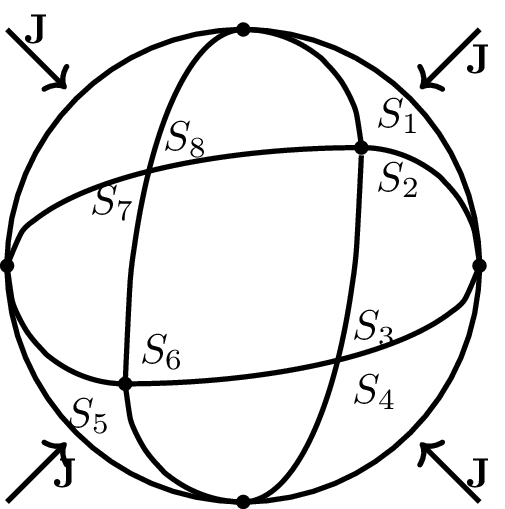 

</figure>

Queste leggi vengono anche espresse rispetto a maglie e nodi, elementi particolari, favorevoli, dei circuiti. Queste leggi inoltre possono essere usufruite dagli strumenti di misura.

## Regioni di un Circuito

Nel tempo il campo elettro-magnetico si propaga come un’onda, poiché i campi sono accoppiati nelle quattro equazioni, ma ciò non avviene a regime stazionario. Poiché le leggi di Kirchhoff sono approssimazioni, si vuole determinare la precisione di date leggi. Si considera un canale, guida d’onda, passante per due punti $A$ e $B$. distanti $d$, attraversato da un flusso di cariche. Sono presenti due osservatori in $A$ e $B$, che misurano la corrente sinusoidale, entrambi aventi lo zero temporale comune. Viene espressa la velocità di propagazione dell’onda con $c$. Viene osservato che l’onda sinusoidale partita da $A$, viene misurata da $B$ con un certo ritardo $\tau$.

<figure>

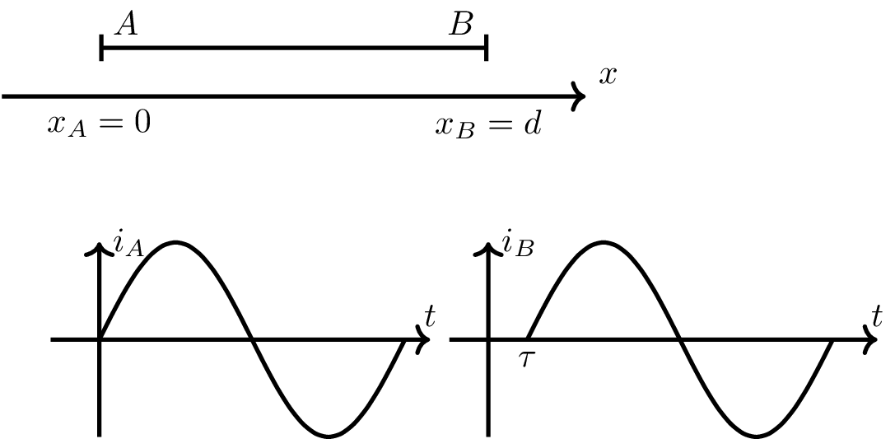 

</figure>

Si suppone che l’onda non si attenui, per cui l’ampiezza in $A$ è uguale all’ampiezza in $B$: $$\begin{cases}
        i_A(t)=I\sin(\omega t)\\
        i_B(t)=I\sin(\omega(t-\tau))
    \end{cases}$$

Poiché gli operatori interni alla funzione sinusoidale sono adimensionali, bisogna esprimere la correlazione tra l’angolo in radianti $\alpha$ e l’intervallo di tempo $t$. Si identifica l’intervallo di tempo in cui avviene una riproduzione completa dell’onda $T$, in radianti $2\pi$. Per cui si considera la relazione: $$t:\alpha=T:2\pi\to\displaystyle\alpha=\frac{2\pi}{T}t$$ La pulsazione $T$ dell’onda sinusoidale corrisponde al fattore ${2\pi}/T$, misurato in radianti al secondo: $$\omega=\displaystyle\frac{2\pi}{T}\,\left[\mathrm{rad}\cdot\mathrm{s}^{-1}\right]$$ Si considera un ciclo, una singola riproduzione della sinusoide. Per determinare quante volte si ripete in un intervallo di tempo si considera la grandezza fisica frequenza: $$f=\displaystyle\frac{1}{T}$$ Considerando una qualsiasi superficie chiusa che contiene il canale $AB$, la densità elettrica è prima entrante in $A$ e poi uscente in $B$, per cui la divergenza di $\boldsymbol{\mathbf{J}}$ è nulla.

Il sistema si dice sia quasi-stazionario se il lettore $A$ legge la stessa corrente del lettore $B$, ovvero è presente un errore accettabile o trascurabile. Per cui le due correnti sono approssimativamente congruenti: $$\begin{gathered}
    i_A\cong i_B\\
    I\sin\displaystyle\left(\frac{2\pi}{T}t\right)\cong I\sin\left(\frac{2\pi}{T}t-\frac{2\pi}{T}\tau\right)\\
    \tau=\displaystyle\frac{d}{c}\to \displaystyle 2\pi f\frac{d}{c}=2\pi \mathrm{d}\frac{f}{c}=\frac{2\pi d}{\lambda}\\
    \tau\to 0\iff \lambda>>d
\end{gathered}$$ L’errore è trascurabile se la lunghezza d’onda è considerevolmente maggiore della distanza tra il trasmettitore ed il ricevitore. L’uso del modello adatto dipende dal valore delle grandezze trattate, in elettrotecnica si studiano frequenze nell’ordine dei GHz, per cui si considerano modelli di circuiti adimensionali, nei quali, dal punto di vista euclideo, tutti i punti coincidono. In questo modo si possono trattare i campi in un ambiente quasi-stazionario, quindi usando le leggi di Kirchhoff; poiché ancora non disponiamo di modelli di calcolo abbastanza avanzati per poter descrivere sistemi elettro-magnetici molto complessi che richiedono l’uso delle equazioni di campo.

Si può rappresentare quest’approssimazione nei termini dei tempi o degli spazi, oppure tramite la velocità come $c\to\infty$, per esplicitare l’impossibilità fisica di questa situazione, considerando la formula per la velocità di propagazione delle onde elettro-magnetiche attraverso un mezzo materiale, ciò si ottiene solo se il prodotto tra la permettività e la permeabilità è nullo: $\mu\cdot\varepsilon=0$. In base a quale delle costanti è nulla si determinano diverse regioni, caratterizzate da diverse proprietà fisiche. Un circuito è formato da varie regioni collegate l’una tra l’altra, come fosse un mosaico. La denominazione di queste regioni che ne segue è arbitraria:

### Regione N

Si considera la regione nulla, una regione di vuoto circuitale, diversa dal vuoto fisico, dove le costanti di permettività e permeabilità sono entrambe nulla, per cui ci si trova in uno stato di quasi-stazionarietà elettro-magnetica. Inoltre la conducibilità è anch’essa nulla. In questa situazione di vuoto, le equazioni costitutive del mezzo assumono tutte valori nulli. Dalle equazioni di Maxwell risulta che il campo elettrico è sempre conservativo $\boldsymbol{\mathbf{\nabla}}\times\boldsymbol{\mathbf{E}}=0$, e la densità elettrica è solenoidale $\boldsymbol{\mathbf{\nabla}}\cdot\boldsymbol{\mathbf{J}}=0$. Ciò permette di scegliere arbitrariamente due punti per poter definire una differenza di potenziale.

$$\begin{cases}
        \boldsymbol{\mathbf{D}}=\varepsilon\boldsymbol{\mathbf{E}}=0\\
        \boldsymbol{\mathbf{B}}=\mu\boldsymbol{\mathbf{H}}=0\\
        \boldsymbol{\mathbf{J}}=\sigma(\boldsymbol{\mathbf{E}}+\boldsymbol{\mathbf{E}}_m)+\boldsymbol{\mathbf{J}}_m=0
    \end{cases}$$

### Regione EQP

Si considera il duale di una regione, una regione che presenta delle proprietà opposte rispetto ad un’altra regione. La regione di equipotenzialità, o conduttore perfetto o corto circuito ideale è la regione duale della regione nulla. Presenta anch’essa la quasi-stazionarietà del campo elettro-magnetico, ma la conducibilità è infinita. Il campo elettrico è nullo $\boldsymbol{\mathbf{E}}=0$ e la densità di corrente impressa è nulla $\boldsymbol{\mathbf{J}}_m=0$. La terza legge costitutiva del mezzo da luogo ad una forma indeterminata, per cui il valore della densità di corrente, non nullo e finito, non può essere determinato mediante le equazioni di Maxwell. Sapendo con quali regioni è collegata è possibile determinare la densità di corrente attraverso questa regione. Inoltre poiché il campo elettrico è nullo non può essere presente una differenza di potenziale.

$$\begin{cases}
        \boldsymbol{\mathbf{D}}=\varepsilon\boldsymbol{\mathbf{E}}=0\\
        \boldsymbol{\mathbf{B}}=\mu\boldsymbol{\mathbf{H}}=0\\
        \boldsymbol{\mathbf{J}}=\sigma(\boldsymbol{\mathbf{E}}+\boldsymbol{\mathbf{E}}_m)+\boldsymbol{\mathbf{J}}_m=\infty\cdot0\to\boldsymbol{\mathbf{J}}=?
    \end{cases}$$

### Regione C

Nella regione di condensatore ideale, è presente uno stato di quasi-stazionarietà magnetica $\boldsymbol{\mathbf{B}}=0$ e la conducibilità è nulla. Il campo elettro-motore è nullo $\boldsymbol{\mathbf{E}}_m=0$ e la densità di corrente indotta è nulla $\boldsymbol{\mathbf{J}}_m=0$. La permettività elettrica assume un valore non nullo.

$$\begin{cases}
        \boldsymbol{\mathbf{D}}=\varepsilon\boldsymbol{\mathbf{E}}\neq0\\
        \boldsymbol{\mathbf{B}}=\mu\boldsymbol{\mathbf{H}}=0\\
        \boldsymbol{\mathbf{J}}=\sigma(\boldsymbol{\mathbf{E}}+\boldsymbol{\mathbf{E}}_m)+\boldsymbol{\mathbf{J}}_m=0
    \end{cases}$$

Per le equazioni di Maxwell si ottiene che il campo elettrico in questa regione è conservativo $\boldsymbol{\mathbf{\nabla}}\times\boldsymbol{\mathbf{E}}=0$, e il rotore del campo magnetico dipende dal solo campo di spostamento elettrico $\boldsymbol{\mathbf{\nabla}}\times\boldsymbol{\mathbf{H}}={\partial D}/{\partial t}$. In questa regione è presente un materiale puramente dielettrico, verrà in seguito identificata come un condensatore, caratterizzato dalla grandezza fisica capacità $C$.

### Regione LM

La regione di induttore ideale, si trova in uno stato di quasi-stazionarietà elettrica $\varepsilon=0$, la permeabilità è non nulla e conducibilità infinita, per ottenere una forma indeterminata nelle leggi costitutive del mezzo. Rappresenta il duale del condensatore ideale. Il campo elettro-motore è nullo $\boldsymbol{\mathbf{E}}_m=0$, la densità di corrente di induzione è nulla $\boldsymbol{\mathbf{J}}_m=0$. Il campo elettrico $\boldsymbol{\mathbf{E}}$ è tale da presentare valori sempre finiti di densità di corrente, ma non ricavabili dalle equazioni di Maxwell, poiché si presenta in forma indeterminata nelle leggi costitutive del mezzo. Si ricava da Maxwell che il rotore del campo elettrico è pari al rotore del campo elettrico indotto, una particolare classe di campi elettro-motori generati all’interno di fenomeni elettrici, $\boldsymbol{\mathbf{\nabla}}\times\boldsymbol{\mathbf{E}}=\boldsymbol{\mathbf{\nabla}}\times\boldsymbol{\mathbf{E}}_i$. Poiché $\mu\neq0$, si ha $\boldsymbol{\mathbf{\nabla}}\times\boldsymbol{\mathbf{E}}_i=-{\partial B}/{\partial t}$, mentre il rotore del campo magnetico è pari alla densità di corrente $\boldsymbol{\mathbf{\nabla}}\times\boldsymbol{\mathbf{H}}=\boldsymbol{\mathbf{J}}$, per cui i campi sono disaccoppiati.

$$\begin{cases}
        \boldsymbol{\mathbf{D}}=\varepsilon\boldsymbol{\mathbf{E}}=0\\
        \boldsymbol{\mathbf{B}}=\mu\boldsymbol{\mathbf{H}}\neq0\\
        \boldsymbol{\mathbf{J}}=\sigma(\boldsymbol{\mathbf{E}}+\boldsymbol{\mathbf{E}}_m)+\boldsymbol{\mathbf{J}}_m=\infty\cdot0\to\boldsymbol{\mathbf{J}}=?
    \end{cases}$$

Questa regione identifica un materiale puramente magnetico che non può condurre, ma può indurre un campo magnetico, tale regione verrà in seguito identificato con l’induttore ideale, definito dalla grandezza fisica induttanza $L$.

### Regione R

Questa regione descrive il resistore ideale in uno stato di quasi-stazionarietà elettro-magnetica $\mu=0$, $\varepsilon=0$. Dove la conducibilità assume valori finiti non nulli $\sigma\neq0$, il campo elettro-motore e la densità di corrente indotta sono entrambi nulli $\boldsymbol{\mathbf{E}}_m=0$, $\boldsymbol{\mathbf{J}}_m=0$.

$$\begin{cases}
        \boldsymbol{\mathbf{D}}=\varepsilon\boldsymbol{\mathbf{E}}=0\\
        \boldsymbol{\mathbf{B}}=\mu\boldsymbol{\mathbf{H}}=0\\
        \boldsymbol{\mathbf{J}}=\sigma(\boldsymbol{\mathbf{E}}+\boldsymbol{\mathbf{E}}_m)+\boldsymbol{\mathbf{J}}_m=\sigma\boldsymbol{\mathbf{E}}
    \end{cases}$$

Rappresenta un materiale in cui il mezzo è resistivo puro. In questo materiale, il campo elettrico è conservativo $\boldsymbol{\mathbf{\nabla}}\times\boldsymbol{\mathbf{E}}=0$ e la densità di corrente è solenoidale $\boldsymbol{\mathbf{\nabla}}\cdot\boldsymbol{\mathbf{J}}=0$. Questa regione verrà identificata dal parametro concentrato resistenza $R$.

### Regione FEM

In questa regione, generatore ideale di forza elettro motrice, è presenta una quasi-stazionarietà elettro-magnetica $\mu=0$ e $\varepsilon=0$. La conducibilità tende all’infinito, il campo elettro-motore è non nullo e finito, per cui è presente un campo elettro-statico $\boldsymbol{\mathbf{E}}_s=\boldsymbol{\mathbf{E}}_m$, poiché il campo elettrico indotto è nullo $\boldsymbol{\mathbf{E}}=0$ per $\mu=0$. Mentre la densità di corrente indotta è nulla $\boldsymbol{\mathbf{J}}_m=0$.

$$\begin{cases}
        \boldsymbol{\mathbf{D}}=\varepsilon\boldsymbol{\mathbf{E}}=0\\
        \boldsymbol{\mathbf{B}}=\mu\boldsymbol{\mathbf{H}}=0\\
        \boldsymbol{\mathbf{J}}=\sigma(\boldsymbol{\mathbf{E}}+\boldsymbol{\mathbf{E}}_m)+\boldsymbol{\mathbf{J}}_m=\infty\cdot0\to\boldsymbol{\mathbf{J}}=?
    \end{cases}$$

La regione rappresenta un materiale dove è presente una pura forza elettro-motrice $\boldsymbol{\mathbf{\nabla}}\times\boldsymbol{\mathbf{E}}\neq0$, e la densità di corrente è solenoidale $\boldsymbol{\mathbf{\nabla}}\cdot\boldsymbol{\mathbf{J}}$. Questa regione genera una forza elettro-motrice pura verso l’esterno. Verrà identificata da un parametro concentrato, la tensione erogata.

### Region IG

Questa regione rappresenta un generatore ideale di corrente, in uno stato di quasi-stazionarietà elettro-magnetica $\mu=0$ e $\varepsilon=0$. La conducibilità è nulla $\sigma=0$, il campo elettro-motore è nullo $\boldsymbol{\mathbf{E}}_m=0$, e la densità di corrente indotta è non nulla e definita $\boldsymbol{\mathbf{J}}_m=0$.

$$\begin{cases}
        \boldsymbol{\mathbf{D}}=\varepsilon\boldsymbol{\mathbf{E}}=0\\
        \boldsymbol{\mathbf{B}}=\mu\boldsymbol{\mathbf{H}}=0\\
        \boldsymbol{\mathbf{J}}=\sigma(\boldsymbol{\mathbf{E}}+\boldsymbol{\mathbf{E}}_m)+\boldsymbol{\mathbf{J}}_m=\boldsymbol{\mathbf{J}}_m
    \end{cases}$$

Poiché la conducibilità è nulla, il valore del campo elettrico $\boldsymbol{\mathbf{E}}$ è indeterminato e non può essere ricavato mediante le equazioni di Maxwell. In questa situazione, il campo elettrico è conservativo $\boldsymbol{\mathbf{\nabla}}\times\boldsymbol{\mathbf{E}}=0$ e la densità di corrente è solenoidale $\boldsymbol{\mathbf{\nabla}}\cdot\boldsymbol{\mathbf{J}}=0$. Questa regione genera corrente, ma avendo conducibilità nulla, non la attraversa, invece fluisce nelle regioni collegate. Rappresenta un materiale in cui il mezzo genera una corrente, verrò in seguito identificato dal parametro concentrato corrente erogata.

# Bipoli Attivi e Passivi

Introducendo parametri concentrati è possibile ricomporre il problema della quasi-stazionarietà.

Un bipolo viene definito come una o più regioni che colloquiano dall’esterno tra due poli. Un polo viene sempre identificato con una regione di equipotenzialità. Poiché in queste regioni non è presente una differenza di potenziale, tra due di queste regioni è possibile esista $v$. In elettrotecnica si riferisce ai poli con il termine morsetti, rappresentano un ingresso ad una regione. Una porta viene definita come una o più regioni dove la corrente di entrata di uscita sono uguali $\boldsymbol{\mathbf{\nabla}}\cdot\boldsymbol{\mathbf{J}}=0$.

<figure>

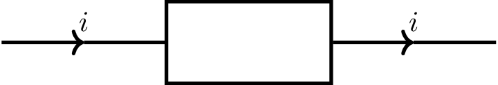 

</figure>

Questa struttura a bipoli non è accessibile all’interno, le proprietà e le caratteristiche interne vengono definite a priori, e non possono essere ricavate dalle leggi dell’elettro-magnetismo. Dall’esterno si osserva solo un campo elettro-statico $\boldsymbol{\mathbf{E}}_s$. Le informazioni note di un bipolo sono dovute ai parametri concentrati.

Viene definito un multipolo come una o più regioni accessibile da una sequenza di morsetti. Viene definita multiporta un multipolo con un numero pari di morsetti i quali a coppie rispettano le condizioni di una porta.

<figure>

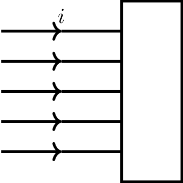 

</figure>

Per convenzione si considerano le correnti sempre entranti, ovvero si considera costante il verso dell’amperometro, per cui le correnti uscenti si indicano con il segno opposto. Il verso delle correnti indica solo la direzione di riferimento dell’amperometro, rispetto a cui vengono misurate le correnti, che possono essere concordi, per cui si trovano con segno positivo, o discordi, quindi si rappresentano con segno negativo. In questo modo si possono rappresentare tutte le correnti come entranti. Per cui bisogna essere metodici nell’assegnazione dei segni alle grandezze fisiche misurate, poiché cambiano in base al riferimento scelto.

<figure>

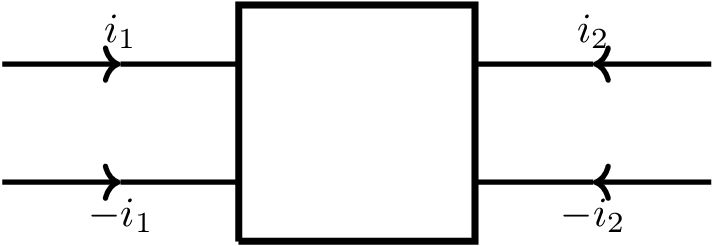 

</figure>

Dato un dipolo, si esprime il riferimento del voltmetro come una freccia che indica il morsetto positivo. La differenza di potenziale si calcola come la differenza tra il morsetto positivo ed il morsetto negativo $v=V_+-V_-$. Si individuano due convenzioni a seconda se il verso della corrente è concorde o discorde al verso del potenziale, questi versi rappresentano i riferimenti usati dagli strumenti di misura. Le modalità di misura cambiano il segno all’interno delle equazioni, queste due convenzioni rappresentano due letture opposte della stessa situazione.

<figure id="fig:convenzioni-misurazione">

  

<figcaption>Convenzioni di Misurazione</figcaption>
</figure>

Se la corrente ed il potenziale hanno verso concorde si considera la convenzione dei generatori, se hanno verso discorde rappresentano la convenzione degli utilizzatori, queste convenzioni esprimono solamente come viene effettuata la misura.

Nella convenzione dei generatori, la corrente di cariche positive fluisce dal potenziale più alto al potenziale più basso, per cui è il potenziale concorde che spinge le cariche, prodotto da un campo elettro-motore $\boldsymbol{\mathbf{E}}_m$, quindi questa regione produce energia. Questo potenziale agisce come una forza elettro motrice, ma non può essere poiché in un regime di quasi-stazionarietà il campo elettrico è conservativo $\boldsymbol{\mathbf{\nabla}}\times\boldsymbol{\mathbf{E}}=0$.

Nella convenzione degli utilizzatori la corrente si muove di moto naturale, per cui la regione non produce ma utilizza energia elettrica prodotta da un’altra zona. Mostra gli effetti imposti dall’esterno sulla regione. Poiché non producono energia, non è presente un campo elettro-motore $\boldsymbol{\mathbf{E}}_m=0$.

Quando ci si trova in una di queste convenzioni, per determinare se il bipolo è un generatore o un utilizzatore si considera il verso della corrente e del potenziale. Se una di queste due grandezze è negativa, allora la situazione analizzata rappresenta l’altra convenzione. Se entrambe sono negative rappresenta comunque la convenzione, poiché entrambe le grandezze sono l’opposto. Per identificare se sono dei generatori o degli utilizzatori si considera la potenza $P=iv$, se i segni sono discordi la potenza è negativa e la situazione analizzata appartiene all’altra convenzione.

Per cui se si analizza con una convenzione dei generatori e la potenza è positiva, si tratta di un generatore, se la potenza è negativa, si tratta di un utilizzatore. Analogamente per la convenzione degli utilizzatori, se la potenza è positiva, si tratta di un utilizzatore, se la potenza è negativa, si tratta di un generatore.

Si determinano le leggi costitutive e i parametri concentrati dei bipoli. Le uniche regioni che non hanno leggi costitutive del mezzo sono il vuoto ed il suo duale l’ equipotenziale, poiché l’unico elemento in queste regioni è rispettivamente il voltmetro e l’amperometro, che non influiscono sulle leggi costitutive.

## Condensatore Ideale

La regione C, viene identificata come il condensatore, una regione di quasi-stazionarietà magnetica, viene identificata come due linee parallele, collegate a morsetti. Viene associato al parametro concentrato capacità $C$, misurata in Farad F. Queste grandezze devono essere attribuite a priori, non possono essere determinate sulla base di leggi. In forma circuitale si rappresenta come:

<figure id="fig:rappresentazione-condensatore">

  

<figcaption>Rappresentazioni di un Condensatore Ideale</figcaption>
</figure>

Si è analizzato precedentemente la situazione di un condensatore a facce piane e parallele su cui si deposita una carica $+Q$ su una faccia, accumulata per un flusso di cariche positive $i$, e un accumulo di cariche negative $-Q$ sull’altra, poiché la stessa corrente ne sottrae cariche positive. Il campo elettrico generato tra le due facce del condensatore corrisponde al rapporto tra la densità superficiale $\sigma$ delle lamine e della costante di permettività $\varepsilon$: $$E=\displaystyle\frac{\sigma}{\varepsilon}$$ Le due facce si trovano ad una distanza $d$ tra di loro, il campo elettrico è monodimensionale, poiché ha solo componenti sulla direzione $x$. Il gradiente del potenziale in un caso monodimensionale corrisponde alla derivata rispetto all’unica direzione: $$-\boldsymbol{\mathbf{\nabla }}V=-\displaystyle\frac{\mathrm{d}V}{\mathrm{d}x}=E_x$$ Si considera in forma integrale, dove i limiti di integrazione corrispondo al potenziale in $A$ ed in $B$, e le coordinate sulle $x$ dei due punti. Si considera per semplicità il punto $A$ coincidente con l’origine dell’asse $x_A=0$, mentre il punto $B$ corrisponde alla distanza $x_B=d$: $$-\displaystyle\int_{A}^B\mathrm{d}V=\int_0^\mathrm{d}E_x\mathrm{d}x$$

Poiché si misura la densità di carica sulla piastra positiva, il campo elettrico è strettamente positivo, affinché il potenziale sia positivo si impone il voltmetro come morsetto positivo sul punto $A$. Quindi il condensatore rappresenta un utilizzatore. Il potenziale risulta: $$v=\displaystyle\frac{\sigma}{\varepsilon}\mathrm{d}$$

Il calcolo della capacità dipende dalla geometria del singolo condensatore. Per evitare questo passaggio si esprime la densità di carica $\sigma$ rispetto alla quantità accumulata sulla faccia positiva: $$\sigma=\displaystyle\frac{Q}{S}\to v=\frac{QS}{\varepsilon}\mathrm{d}$$ La capacità viene definita come il rapporto tra la carica positiva accumulata e la lettura positiva del voltmetro: $$C:=\displaystyle\frac{Q}{v}=\varepsilon\frac{S}{\mathrm{d}}\,[\mathrm{F}]$$ Si può esprimere la grandezza fisica della permettività dielettrica rispetto alla capacità: $$=\displaystyle\frac{\mathrm{A}\cdot \mathrm{s}}{\mathrm{V}\cdot \mathrm{m}}$$ Per cui per una data superficie, la carica accumulata su di essa p pari alla sua capacità per la lettura positiva del voltmetro: $$Q=Cv$$ In questo modo non si ottengono informazioni sulle dimensioni del circuito, ovvero la distanza tra i morsetti. Queste informazioni sono criptate all’interno della regione, non determinabili a posteriori.

Vengono definiti le leggi costitutive del condensatore ideale, rappresentano le relazioni tra il potenziale e la corrente, misurate dall’esterno della regione. Si considera la definizione della corrente come variazione di carica nel tempo: $$i=\displaystyle\frac{\mathrm{d}Q}{\mathrm{d}t}=\frac{\mathrm{d}(Cv)}{\mathrm{d}t}=\cancelto{0}{v\frac{\mathrm{d}C}{\mathrm{d}t}}+C\frac{\mathrm{d}v}{\mathrm{d}t}$$ In questo caso il parametro concentrato della capacità è tempo invariante, per cui la sua derivata è nulla. Regioni con parametri concentrati costanti si chiama tempo invariante. In generale non si analizzano i parametri concentrati dei generatori, ma dei bipoli passivi. Per cui, in convenzione degli utilizzatori, la legge costitutiva del mezzo in forma differenziale del condensatore ideale risulta essere: $$i=\displaystyle C\frac{\mathrm{d}v}{\mathrm{d}t}$$ Se ci trovassimo nella convenzione dei generatori, dovremmo cambiare di segno il potenziale. In forma integrale si considerano gli intervalli di integrazione dall’inizio della misura per $t=0$ e alla fine della misura $t$. Il differenziale del potenziale rappresenta il differenziale di una differenza di potenziali, per cui il suo integrale rappresenta la differenza tra il potenziale alla fine della misura ed all’inizio: $$\displaystyle\int_{v(0^-)}^{v(t)}\mathrm{d}v=\frac{1}{C}\int_{0^-}^ti\mathrm{d}t$$ Si usa la notazione $0^-$, per comprendere il valore che assume la grandezza all’inizio esatto della misurazione, ma è nella maggior parte dei casi superfluo, poiché la funzione potenziale rispetto al tempo è (generalmente) continua quindi $v(0^-)=v(0^+)$. Si ottiene, risolvendo l’integrale: $$v(t)=\displaystyle\int_0^ti\mathrm{d}t+v(0)$$ La componente integrale rappresenta l’evoluzione del potenziale al fluire della corrente all’interno del condensatore, ma risente del valore del potenziale all’inizio della misura, chiamato fattore di memoria. Per cui i bipoli dotati di un fattore che dipende dall’inizio della misurazione vengono chiamati bipoli con memoria, presentano o il potenziale o la corrente in forma differenziale. Se la memoria è nulla, si dice che il bipolo parte scarico, altrimenti si dice carico al valore assunto. In questa rappresentazione non sono limitati gli intervalli di tensioni possibili all’interno del condensatore, ma nella realtà non si può creare un oggetto fisico capace di avere una tensione illimitata.

La potenza (istantanea) del condensatore ideale è come il potenziale e la corrente dipendente dal tempo: $$P(t)=v(t)\cdot i(t)$$ In caso siano presenti più correnti, la potenza si ottiene considerando un morsetto di riferimento su cui si calcolano le differenze di potenziali moltiplicate per la corrente passante per quel morsetto. Sommando tutti queste componenti si ottiene la potenza istantanea per quel multipolo. Si esprime mediante la legge costitutiva del condensatore ideale in forma differenziale: $$P=vC\displaystyle\frac{\mathrm{d}v}{\mathrm{d}t}$$ Poiché ci troviamo nella convenzione degli utilizzatori, se questa potenza fosse negativa, il condensatore erogherebbe energia elettrica.

La potenza corrisponde alla derivata rispetto al tempo dell’energia, per cui diventa: $$\begin{gathered}
    \displaystyle\frac{\mathrm{d}\mathscr{E}}{\mathrm{d}t}=Cv\frac{\mathrm{d}v}{\mathrm{d}t}\\
    \mathrm{d}\mathscr{E}=Cv\mathrm{d}v
\end{gathered}$$ Poiché questo bipolo ha memoria, la sua evoluzione nel tempo potrebbe assumere valori discordi alla memoria, fisicamente se si collega il condensatore carico ad altre regioni che assorbe il potenziale, questo si scarica, alimentando le regioni collegate. In quel lasso di tempo in cui alimenta un oggetto esterno il condensatore si comporta da generatore. Può generare tramite conversione (bipolo attivo) oppure come un bipolo passivo. La differenza tra bipolo attivo e passivo dipende dall’energia del bipolo. Si può esprimere l’energia del condensatore in forma integrale, definita tra due istanti di tempo. Per convenzione si considera l’inizio dell’intervallo al tempo di costruzione del condensatore, in termini matematici tempo remotissimo $-\infty$, dove l’energia contenuta è nulla, fino ad un certo tempo $t$. Si assume che il potenziale al tempo di costruzione sia nullo, per cui il condensatore è scarico quando viene costruito. $$\begin{gathered}
    \displaystyle\int_{\cancelto{0}{\mathscr{E}(-\infty)}}^{\mathscr{E}(t)}\mathrm{d}\mathscr{E}=C\int_{\cancelto{0}{v(-\infty)}}^{v(t)}v\mathrm{d}v\\
    \mathscr{E}(t)=C\displaystyle\frac{1}{2}v^2(t)
\end{gathered}$$ La capacità è definita come una grandezza positiva, per cui l’energia è strettamente positiva, ed al massimo nulla per un certo di istante di tempo $t$. Poiché l’energia è sempre positiva il condensatore si comporta come un bipolo passivo. Per cui il condensatore ideale è un bipolo passivo tempo invariante con memoria.

## Induttore Ideale

Il bipolo induttore ideale è il duale del condensatore ideale, presenta uno stato di quasi-stazionarietà elettrica. La dualità permette di mantenere la forma delle equazioni e cambiare solamente le grandezze fisiche usate. L’induttanza $L$ è il duale della capacità $C$. In generale i parametri concentrati vengono definiti tra il rapporto di due grandezze elettro-magnetiche.Considerando la legge costitutiva del mezzo del condensatore, si ottiene la legge costitutiva dell’induttore ideale come la duale alla legge costitutiva del condensatore: $$i(t)=\displaystyle C\frac{\mathrm{d}v(t)}{\mathrm{d}t}\to v(t)=L\frac{\mathrm{d}i(t)}{\mathrm{d}t}$$

Dato un bipolo induttore ideale si vuole calcolare la sua induttanza, per dimostrate che si tratta del duale del condensatore ideale. Se fosse un multipolo sarebbe associato a diversi parametri di mutua induttanza $M$, tanti quante le coppie di porte. In forma circuitale si rappresenta come:

<figure>

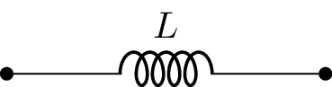 

</figure>

Si considera un filo avvolto in una bobina composta da $N$ spire, ogni spira rappresenta un giro del filo su sé stesso. Si suppone esista una corrente $i$ iniettata dall’esterno. Presenta una conducibilità infinita, per cui la corrente non è vincolata se non dalla legge di Faraday-Neumann-Lenz. Si definisce un percorso chiuso $\lambda$, per semplificare i calcoli poiché il valore della circuitazione non varia, formato da quattro segmenti. Uno di questi coincide con l’asse della bobina, chiamata in questa situazione solenoide, altri due segmenti sono paralleli tra di loro e all’asse $x$. Questo percorso presenta una chiusura all’infinito, ovvero i due segmenti paralleli sono estesi all’infinito matematico, dove sono connessi da un altro segmento, per descrivere un percorso chiuso. La spira viene attraversata da una corrente e produce quindi un campo magnetico $\boldsymbol{\mathbf{H}}$, all’interno della spira il campo magnetico è concorde alla direzione dell’asse $y$, mentre all’esterno è discorde. Per cui il campo magnetico è sempre normale alle sezioni del percorso parallele all’asse $x$. Il modulo campo magnetico è inversamente proporzionale alla distanza dal filo $H={i}/{2\pi r}$ per cui sulla chiusura all’infinito il campo magnetico è nullo.

<figure>

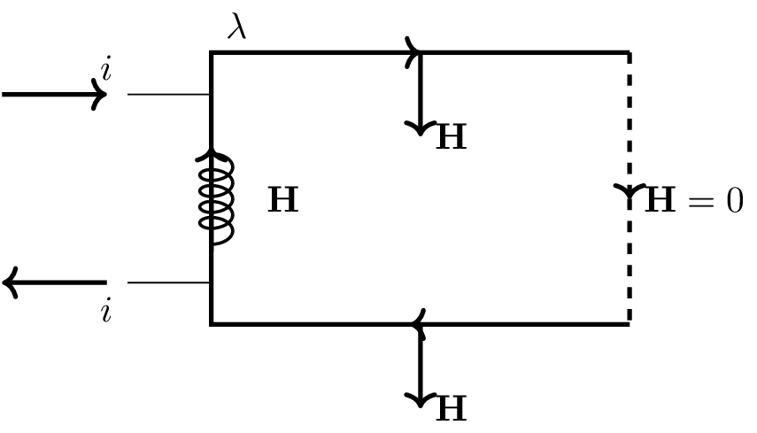 

</figure>

Il campo magnetico è uniformemente distribuito all’interno della superficie $S$ individuata da una spira, per cui si può considerare un qualsiasi percorso che passi parallelamente all’asse della bobina all’interno di essa. Si calcola la circuitazione in senso orario per questo percorso chiuso: $$\begin{gathered}
    \displaystyle\oint_{\lambda}\boldsymbol{\mathbf{H}}\cdot \mathrm{d}\boldsymbol{\mathbf{\lambda}}=\int_{\lambda_{1x}}H\cancelto{0}{-\hat{\boldsymbol{\mathbf{y}}}\cdot\hat{\boldsymbol{\mathbf{x}}}}\mathrm{d}x+\int_{\lambda_{1y}}\cancelto{0}{\boldsymbol{\mathbf{H}}}\cdot \mathrm{d}\boldsymbol{\mathbf{y}}+\int_{\lambda_{2x}}H\cancelto{0}{-\hat{\boldsymbol{\mathbf{y}}}\cdot\hat{\boldsymbol{\mathbf{x}}}}\mathrm{d}x+\int_{\lambda_{2y}}H\cancelto{1}{\hat{\boldsymbol{\mathbf{y}}}\cdot\hat{\boldsymbol{\mathbf{y}}}}\mathrm{d}y\\
    \displaystyle\oint_{\lambda}\boldsymbol{\mathbf{H}}\cdot \mathrm{d}\boldsymbol{\mathbf{\lambda}}=H\int_0^l\mathrm{d}y=Hl
\end{gathered}$$ Dove $l$ rappresenta la lunghezza tra la prima e l’ultima spira del solenoide. La circuitazione del campo magnetico attraverso un percorso equivale al flusso della densità di carica attraverso la superficie individuata da quel percorso, ovvero alla corrente concatenata a quel percorso. In questo caso la superficie viene attraversata tante volte quante sono le spire della bobina, per cui il flusso attraverso la superficie corrispondere ad $N$ volte la corrente che passa per una sola spira, poiché la corrente è la stessa per tutte le spire, perché sono elementi collegati in serie. La corrente concatenata è quindi pari ad $N$ volta la corrente che fluisce attraverso la bobina $i_c=N\cdot i$. La circuitazione risulta quindi: $$\begin{gathered}
    \displaystyle\oint_{\lambda}\boldsymbol{\mathbf{H}}\cdot \mathrm{d}\boldsymbol{\mathbf{\lambda}}=i_c\to Hl=Ni
\end{gathered}$$ Il campo di induzione magnetica è quindi: $$B=\mu H=\displaystyle\frac{\mu N}{l}i$$

Se la corrente fluisse liberamente per la bobina, ci si troverebbe in una situazione di cortocircuito, ma è presente un elemento che limita il valore della corrente, questo elemento è la forza elettro motrice. Se il flusso del campo magnetico, quindi se quest’ultimo è variabile nel tempo, viene generata, ai capi di ciascuna spira, una forza elettro motrice che si oppone alla variazione del flusso, generato dalla corrente. Quindi questa forza elettro motrice generata dalla variazione del flusso si oppone alla corrente, per cui ha verso discorde. Ma nella convenzione degli utilizzatori, si misura la forza contro elettro-motrice, per cui la tensione misurata corrisponde all’opposto di questa forza elettro motrice: $$v=-e$$ Per la terza legge di Maxwell: $$e=-\displaystyle\frac{\mathrm{d}\phi}{\mathrm{d}t}$$ Dove si indica con $\phi$ il flusso del campo magnetico, per semplicità. Per cui il potenziale misurato tra l’uscita di una spira e l’ingresso della precedente corrisponde a: $$v_k=\displaystyle\frac{\mathrm{d}\phi}{\mathrm{d}t}$$ Ma questo valore non corrisponde al valore misurato tra i due morsetti all’inizio ed alla fine della bobina. Per determinare il valore della tensione totale, si considerano tutte le tensioni delle singole spire e la differenza di potenziale totale, viene poi applicato il secondo principio di Kirchhoff, rispetto ad un riferimento orario:

<figure>

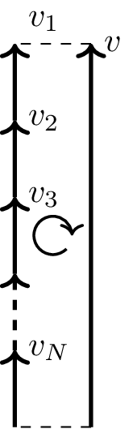 

</figure>

Per cui le letture delle singole tensioni risultano di segno positivo, mentre la lettura totale risulta di segno negativo, e la loro somma è nulla per il secondo principio. Quindi la lettura totale si può esprimere come la somma delle singole differenze di potenziale tra due spire: $$\displaystyle\sum_{k=1}^Nv_k-v=0\to v=\sum_{k=1}^Nv_k=\sum_{k=1}^N\frac{\mathrm{d}\phi}{\mathrm{d}t}=N\frac{\mathrm{d}\phi}{\mathrm{d}t}$$

Si definisce il flusso concatenato con le $N$ spire: $$\phi_c=N\phi$$ Per cui la differenza di potenziale diventa: $$v=N\displaystyle\frac{\mathrm{d}\phi}{\mathrm{d}t}=\frac{\mathrm{d}\phi_c}{\mathrm{d}t}$$

Il flusso per una singola spira si ottiene tramite l’integrale di flusso attraverso la superficie $S$ descritta dalla spira: $$\phi=\displaystyle\int_S\boldsymbol{\mathbf{B}}\cdot\hat{\boldsymbol{\mathbf{n}}}\mathrm{d}S=\int_S\frac{\mu N i}{l}\cancelto{0}{\hat{\boldsymbol{\mathbf{y}}}\cdot\hat{\boldsymbol{\mathbf{n}}}}\mathrm{d}S=\frac{\mu N S}{l}i\to \phi_c=N\phi=\frac{\mu N^2S}{l}i$$ Il potenziale si esprime quindi come: $$\begin{gathered}
    v=\displaystyle\frac{\mathrm{d}}{\mathrm{d}t}\left(\frac{\mu N^2S}{l}i\right),\frac{\mu N^2S}{l}=\mathrm{cost.}\\
    v=\displaystyle\frac{\mu N^2S}{l}\frac{\mathrm{d}i}{\mathrm{d}t}
\end{gathered}$$ Si definisce il parametro concentrato induttanza $L$ come: $$L:=\displaystyle\frac{\mu N^2S}{l}$$ In questo modo usando l’induttanza, si escludono nella legge costitutiva del mezzo materiale dell’induttore ideale, riferimenti alla geometria del componente. Questa grandezza è duale della capacità. Come gli altri parametri viene assegnata, oppure può essere ricavata considerando l’andamento dell’induttore sul resto del circuito, ma non possono essere determinate le proprietà geometriche dell’induttore data l’induttanza. Come per il condensatore ideale si considerano bipoli a parametri costanti, per cui non è presente un componente derivata del parametro concentrato nella legge costitutiva, ciò è incluso quando si considerano circuiti tempo varianti. La legge costitutiva del mezzo materiale dell’induttore ideale in forma differenziale equivale a: $$v=\displaystyle L\frac{\mathrm{d}i}{\mathrm{d}t}$$

Questo bipolo è con memoria, per cui in forma integrale è presenta un fattore che considera lo stato iniziale della corrente passante attraverso la bobina: $$i(t)=\displaystyle\frac{1}{L}\int_{0^-}^tv(t)\mathrm{d}t-i(0^-)$$

Per determinare se questo bipolo è passivo si esprime la potenza mediante la forma differenziale della legge costitutiva. Nella convenzione degli utilizzatori, se l’energia è strettamente positiva allora si tratta di un bipolo passivo, altrimenti se non si riesce a dimostrate la passività si deduce che è attivo. Questo processo è analogo anche nella convenzione dei generatori, poiché si può dimostrare solo se è un bipolo è passivo, ed in caso dedurre se si tratti di un bipolo attivo. In questo caso si considera: $$P=vi=Li\displaystyle\frac{\mathrm{d}i}{\mathrm{d}t}$$ Esprimendo la potenza come derivata dell’energia in funzione del tempo si ottiene: $$\begin{gathered}
    \displaystyle\frac{\mathrm{d}\mathscr{E}}{\mathrm{d}t}=Li\frac{\mathrm{d}i}{\mathrm{d}t}\\
    \mathrm{d}\mathscr{E}=Li\mathrm{d}i\\
    \displaystyle\int_{-\infty}^t\mathrm{d}\mathscr{E}=L\int_{-\infty}^ti\mathrm{d}i\\
    \mathscr{E}(t)-\cancelto{0}{\mathscr{E}(-\infty)}=\displaystyle\frac{1}{2}L\left(i^2(t)-\cancelto{0}{i^2(-\infty)}\right)\\
    \mathscr{E}=\displaystyle\frac{1}{2}Li^2
\end{gathered}$$ L’induttanza è una grandezza strettamente positiva, ed il quadrato della corrente è altrettanto positivo, per cui l’energia è strettamente positiva, quindi l’induttore ideale è un bipolo passivo, ovvero assorbe energia dall’esterno. Mentre la capacità si misura in Farad F, l’induttanza si misura in Henry H, che vengono definiti come: $$=\displaystyle\frac{\mathrm{V}\cdot \mathrm{s}}{\mathrm{A}}=\mathrm{H}$$ Le grandezze base in elettrotecnica sono l’Ampere ed il Volt, per cui tutte le grandezze trattate si esprimono mediante in base a queste due.

## Resistore Ideale

Il resistore ideale è un bipolo in uno stato di quasi-stazionarietà elettro-magnetica, con una conducibilità non nulla e finita, per cui si può esprimere il campo elettro-statico $\boldsymbol{\mathbf{E}}=\boldsymbol{\mathbf{E}}_s$, poiché in questa regione è stato definito il campo elettro-motore nullo, rispetto al vettore densità di corrente $\boldsymbol{\mathbf{J}}$.

Si considera una sezione cilindrica di area $S$ e lunghezza $l$ di un filo, con una giacitura $\hat{\boldsymbol{\mathbf{n}}}$ entrante. Si pone con l’asse $x$ coassiale con l’asse del filo.

<figure id="fig:rappresentazione-resistore">

  

<figcaption>Rappresentazione di un Resistore</figcaption>
</figure>

Poiché il filo è monodimensionale, il gradiente del potenziale corrisponde alla sola derivata rispetto alla coordinata $x$, per cui si può esprimere il campo elettrico come: $$-\boldsymbol{\mathbf{\nabla }}V=\boldsymbol{\mathbf{E}}\to\displaystyle-\frac{\mathrm{d}V}{\mathrm{d}x}=E_x$$ Si integra dopo aver separato le variabili sull’intervallo da $A$ a $B$, si considera il punto $A$ sull’origine dell’asse $x$: $x_A=0$, di conseguenza la coordinata del punto $B$ è: $x_B=l$. Poiché ci troviamo nella convenzione degli utilizzatori, la misura del potenziale corrisponde alla differenza tra il potenziale in $A$ meno il potenziale in $B$: $v=V_A-V_B$. $$\displaystyle-\int_{V_A}^{V_B}\mathrm{d}V=\int_0^lE_x\mathrm{d}x\to V_A-V_B=v=E_xl=\rho Jl$$ Dove $\rho$ rappresenta la resistività elettrica del materiale. Si considera la densità di corrente uniforme sulla sezione $S$, per cui: $$\displaystyle\int_S\boldsymbol{\mathbf{J}}\cdot\hat{\boldsymbol{\mathbf{n}}}\mathrm{d}S=J\int_S\mathrm{d}S\to JS=i\to J=\frac{i}{S}$$ Inserendo questa relazione nell’equazione precedente si ottiene: $$v=\displaystyle\frac{\rho l}{S}i$$ Si definisce il parametro concentrato resistenza e la sua grandezza fisica ohm $\Omega$ come: $$R:=\displaystyle\frac{\rho  l}{S}\,\left[\mathrm{V}\cdot\mathrm{A}^{-1}\right]=[\Omega]$$ In questo modo si ottiene la legge costitutiva del resistore ideale: $$v=Ri$$

Considerando gli ohm, si possono esprimere le grandezze della capacità e dell’induttanza rispetto agli ohm: $$\mathrm{F}=\displaystyle\frac{\mathrm{s}}{\Omega},\,\,\mathrm{H}=\Omega\cdot \mathrm{s}\to \frac{1}{\sqrt{[L\cdot C]}}=\mathrm{s}^{-1}$$ Questa grandezza così ottenuta può esprimere sia la frequenza che la pulsazione, verrà in seguito determinata a quale delle due grandezze fisiche corrisponde. Dalla legge costitutiva si può notare come non sia presenta un fattore differenziale, per cui il resistore ideale è un bipolo senza memoria. Per arrivare a questa legge si è considerata la resistività costante, ma in realtà varia in base alla temperatura. La resistività di un materiale ad una data temperatura $T$ in gradi centigradi si esprime come: $$\rho_T=\rho\left(1+\alpha\theta^\Delta\right)$$

Di conseguenza le prestazioni dei parametri concentrati cambiano in base alle temperature su cui opera il circuito, e devono quindi essere raffreddati dall’esterno per mantenere le loro prestazioni. Questo bipolo è passivo, poiché esprimendo la potenza tramite la legge costitutiva, in questa convenzione degli utilizzatori, si ottiene il prodotto tra due grandezze positive: $$p=vi=Ri^2$$ Quindi l’energia assorbita dal resistore non può che aumentare. Questa energia elettrica assorbita dal resistore, viene trasformata in un’altra forma di energia. Come descritto poco prima, una resistenza provoca un aumento di temperatura, per cui l’energia elettrica viene convertita in energia termica grazie al resistore. Questo fenomeno viene definito effetto Joule. Successivamente questa energia termica può essere convertita in altre forme di energia, ma queste forme, diverse da quella elettrica, non possono essere considerate direttamente in simulazioni di circuiti. Per questo vengono usati i resistori all’interno delle simulazioni dei circuiti per identificare queste conversioni di energia. Da ciò si può dedurre che un resistore, un oggetto che converte energia elettrica in altre forme di energia, è un vettore energetico per l’energia elettrica; inoltre rappresenta il duale passivo del generatore, un oggetto che converte altre forme di energia in energia elettrica.

Considerando ora la potenza di un resistore, essa può essere espressa rispetto al quadrato della corrente $i$ o, mediante la conduttanza $G$, grandezza inversa della resistenza, rispetto al quadrato del potenziale $v$. $$P=Ri^2=Gv^2$$ Se si volesse aumentare l’effetto Joule, ovvero aumentare la potenza del resistore bisognerebbe aumentare o diminuire la resistenza. Poiché entrambe le azioni comporterebbero, senza ulteriori ipotesi l’aumento della potenza e quindi dell’energia convertita. Questo problema si risolve guardando a quale grandezza, tra la corrente e la tensione, viene iniettata dall’esterno all’interno di questa regione, tramite dei generatori di corrente o di tensione. La grandezza che viene iniettata determina quale delle due forme della potenza da applicare per determinarne il suo aumento. Poiché la grandezza inserita dall’esterno rappresenta una variabile indipendente, mentre l’altra grandezza dipende da quest’ultima e dai vari parametri concentrati della regione. Questo problema si può estendere per circuiti più complessi, dove viene risolto tramite il teorema del massimo trasferimento di potenza, che determina il valore che i parametri concentrati devono assumere affinché si ottenga la massima conversione di energia tra circuito ed ambiente esterno.

## Generatori Ideali

Non è possibile dimostrare la passività dei bipoli generatore ideale di corrente e generatore ideale di tensione, per cui questi bipoli sono attivi. Corrente e tensione sono le due grandezze che questi generatori sono in grado di imprimere ai loro morsetti.

In forma circuitale si rappresenta il generatore di corrente dal simbolo:

<figure>

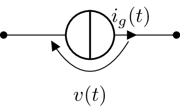 

</figure>

La corrente erogata dal generatore $i_g(t)$ corrisponde alla corrente misurata tra i due morsetti $i(t)$. Questa corrente è imposta e immutabile indipendentemente dalla tensione stabilita ai suoi capi, anche se assume valori infiniti. Per cui questi generatori si chiamano anche di potenza infinita, poiché sono in grado di erogare potenza infinita. Gli elementi attivi presentano dei vincoli per essere inseriti in un circuito. All’interno di un generatore di corrente deve fluire necessariamente una corrente, per cui deve essere connesso ad elementi di un circuito, non può essere collegato al vuoto, ciò rappresenta un caso paradossale, poiché si produrrebbe una corrente che non potrebbe fluire. Il vuoto può essere rappresentato da un generatore di corrente che genera corrente nulla, analogamente ad un resistore con resistenza infinita:

<figure>

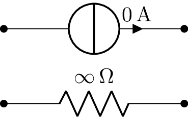 

</figure>

Il duale del generatore di corrente corrisponde al generatore di tensione. Genera una forza elettro motrice $e_g(t)$, che dipende dall’integrale di linea del campo elettro-motore $\boldsymbol{\mathbf{E}}_{em}$. La differenza di potenziale misurata $v(t)$ ai due capi del generatore corrisponde all’opposto della forza elettro-motrice, poiché misura il campo elettro-statico $\boldsymbol{\mathbf{E}}_s$ opposto al campo elettro-motore: $$\begin{gathered}
    e_g(t)=\displaystyle\int_{\lambda_f}\boldsymbol{\mathbf{E}}_{em}\cdot \mathrm{d}\boldsymbol{\mathbf{\lambda}}\\
    v(t)=-\displaystyle\int_{\lambda_s}\boldsymbol{\mathbf{E}}_s\cdot \mathrm{d}\boldsymbol{\mathbf{\lambda}}
\end{gathered}$$

<figure>

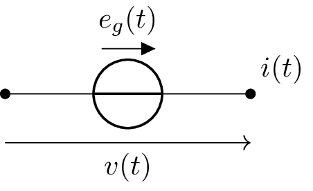 

</figure>

Poiché il campo elettro-statico è conservatore ha rotore nullo, quindi la circuitazione assume valore uguale per qualsiasi percorso $\lambda_v$, mentre la circuitazione del campo elettro-motore dipende dal percorso $\lambda_f$ definito per erogare la forza elettro-motrice $e_g(t)$.

La corrente che attraversa il generatore può essere limitata o illimitata, mantenendo costante i valori di tensione tra i due morsetti, per cui anche questo generatore è vincolato. Il generatore di corrente ideale non può essere collegato ad un cortocircuito ideale, poiché si misurerebbe tra i due morsetti una tensione nulla, ma ciò è impossibile, poiché deve necessariamente essere erogata una tensione, ciò non può avvenire in una regione di equipotenzialità. Rappresenterebbe un modello paradossale, dove il valore della tensione misurata assume due valori, uno nullo misurato tra i due morsetti nel cortocircuito, ed uno non nullo definito dal generatore di tensione, equivalente all’opposto della forza elettro-motrice. Può erogare una tensione nulla, in questo caso simula un cortocircuito ideale, analogo ad un resistore con un valore nullo di $0\,\Omega$:

<figure>

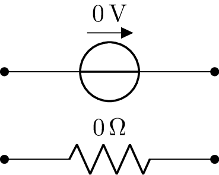 

</figure>

I due generatori possono essere rappresentati da vari simboli diversi in forma circuitale, ma si considerano nel nostro caso solo i simboli precedentemente introdotti.

## Reti Senza Memoria

Due bipoli in serie hanno la stessa corrente, mentre due elementi in parallelo hanno la stessa tensione. Queste grandezze sono misurate ai morsetti iniziali e finali, per cui sono misure esterne. Viene definito lato un insieme di bipoli che stanno tra loro in serie o in parallelo, e sono uniti a formare un solo elemento. Questo elemento chiamato lato, ha la proprietà di avere una tensione, in caso siano in parallelo, oppure una corrente, in caso siano in serie.

Questi bipoli possono essere sia attivi e passivi. In base a questa differenza si definiscono le reti senza memoria, dove sono presenti bipoli attivi e resistori, ovvero tutti gli elementi che non presentano memoria, nelle loro leggi costitutive; mentre le reti con memoria comprendono elementi come gli induttori ed i condensatori, che presentano uno stato iniziale da considerare. Si analizzano per ora solo reti senza memoria, poiché richiedono ulteriori modellazioni matematiche quando vari elementi con memoria sono uniti tra di loro. Elementi omogenei corrispondono ad un elemento equivalente con la stessa unità di misura, mentre tra elementi diversi si ottiene un elemento con grandezze fisiche diverse, per cui è necessario tenerli separati, queste grandezze possono essere uniformate introducendo il concetto di impedenza, ed il suo inverso l’ammettenza, concetti più estesi che verranno discussi successivamente. Si comincia analizzando gli elementi più semplici ovvero i resistori ed i generatori ideali. Le proprietà descritte da questi semplici elementi, descrivono comportamenti di circuiti più complessi, per cui si cercano delle proprietà fondamentali dei circuiti dall’analisi di questi bipoli. Le proprietà fondamentali dei circuiti già analizzate sono i due principi di Kirchhoff, queste proprietà non dipendono dal tipo di bipolo trattato, ma sono proprietà del circuito in quanto tale e corrispondono alle proprietà dei campi. Mentre le leggi costitutive descrivono il comportamento del campo attraverso uno specifico bipolo.

### Resistori in Serie e Parallelo

Si considera un lato composto da una serie finita di $n$ resistori con resistenze $R_k$, per cui la corrente passante per ogni resistore è la stessa corrente misurata tra il morsetto in entrata del primo resistore, individuato dal punto $A$, ed in uscita dell’ultimo resistore, individuato dal punto $B$. Questa equivale alla corrente di lato, questo lato avrà anche una tensione, in convenzione degli utilizzatori $v=V_A-V_B$.

<figure id="fig:resistori-serie">
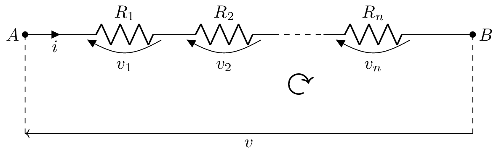
<figcaption>Resistori in Serie</figcaption>
</figure>

Su ogni elemento si può considerare la differenza di potenziale relativa al solo resistore $R_k$, per ogni resistore. Bisogna cercare percorsi utili al calcolo per i principi di Kirchhoff, in questo caso si considera un percorso chiuso composto dal lato e dal voltmetro, unico oggetto rappresentato da frecce, ma si trova nel vuoto circuitale. Se si considera una circuitazione in senso orario, concorde al voltmetro nel percorso così definito, si può applicare il principio di Kirchhoff alle tensioni. $$v-\displaystyle\sum_{k=1}^nv_k=0\to v=\displaystyle\sum_{k=1}^nv_k$$ Per ogni resistore si può considerare la relazione $v_k=R_ki$, la corrente è costante per cui non si indica con il pedice: $$v=\displaystyle\sum_{k=1}^nR_ki=i\cdot\sum_{k=1}^nR_k$$

Al posto della serie di resistori si inserisce un singolo resistore con resistenza $R_s$ pari alla somma algebrica delle resistenza dei singoli resistori. Questa rappresentazione si chiama rappresentazione equivalente, questa equivalenza è valida solo per l’esterno, poiché le singoli tensioni tra i resistori non sono più determinabili da questa rappresentazione, vengono perse le informazioni interne al lato. L’informazione è stata entropicizzata, è stata disordinata, e non può essere determinata senza le informazioni precedenti alla rappresentazione equivalente. $$v=R_si$$

<figure>

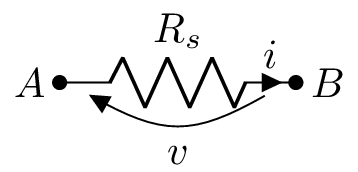 

</figure>

Il caso di resistori montati in parallelo corrisponde al duale dei resistori in serie. Il lato corrisponde ad una serie di $m$ resistori montati in parallelo tra due elementi, per cui la tensione è uguale per ogni resistore $R_k$. All’ingresso di tutta la configurazione del parallelo si inseriscono i morsetti, poiché devono essere esterni.

<figure id="fig:resistori-parallelo">
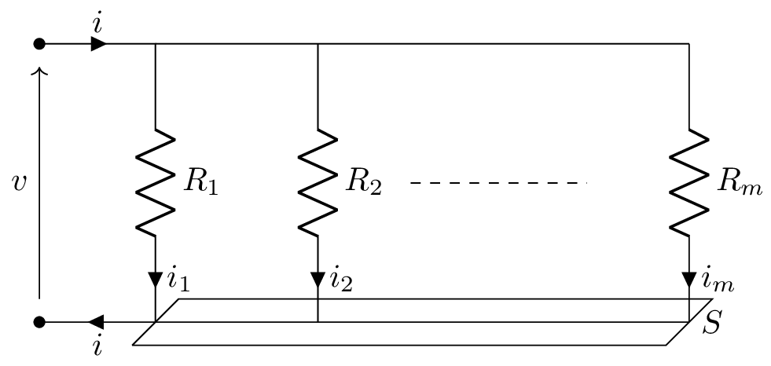
<figcaption>Resistori in Parallelo</figcaption>
</figure>

Se viene attraversato da una corrente $i$ esterna, la corrente passante per ogni resistore $i_k$ è diversa, e per calcolare la corrente complessiva rispetto a queste singole correnti si considera il principio di Kirchhoff alle correnti. Per ottenere informazioni utili si sceglie una superficie $S$ contenente tutte le correnti $i_k$ in modo che siano entranti nella superficie, mentre la corrente $i$ risulta uscente in questa configurazione. Le correnti entranti e quelle uscenti presentano un segno opposto, ed arbitrario per cui la loro somma algebrica risulta nulla:

$$i-\displaystyle\sum_{k=1}^mi_k=0\to i=\sum_{k=1}^mi_k$$ Per la legge costitutiva dei resistori si può esprimere la corrente come $i_k={v}/{R_k}$, allora la corrente totale corrisponde a: $$i=\displaystyle\sum_{k=1}^m\frac{v}{R_k}=v\sum_{k=1}^m\frac{1}{R_k}$$

Si considera $R_p$ la somma algebrica dei reciproci di ogni resistenza per ogni resistore in parallelo, pari alla resistenza equivalente misurata dall’esterno. Per facilitare i calcoli si considera la conduttanza $G_k$, inverso della resistenza, per cui la conduttanza equivalente $G_p$ corrisponde alla somma algebrica delle conduttanze singole dei resistori connessi in parallelo, per ottenere la resistenza equivalente si inverte il valore della conduttanza equivalente $R_p={1}/{G_p}$: $$\begin{gathered}
    G_p=\displaystyle\sum_{k=1}^mG_k\to R_p=\displaystyle\frac{1}{G_p}
\end{gathered}$$ $$i=\displaystyle\frac{v}{R_p}$$

<figure>

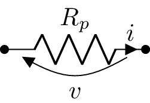 

</figure>

Gli strumenti di misura esterni individuano solamente $R_p$, per ottenere l’informazione completa bisogna tornare alla condizione di partenza.

### Generatori Ideali in Serie e Parallelo

Generatori di tensione in parallelo o presentano tensione uguale tra di loro, altrimenti ci troviamo in una situazione paradossale, poiché in parallelo non possono essere presenti generatori di tensione con tensioni differenti tra di loro. Analogamente non possono essere legati in serie generatori di corrente in serie, poiché oltre al caso banale si arriva ad una situazione paradossale.

Si considera una serie di $n$ generatori di tensione collegati in serie, che presentano tutti una loro polarità, con una forza elettro motrice $e_{gk}$:

<figure id="fig:generatori-tensione-serie">
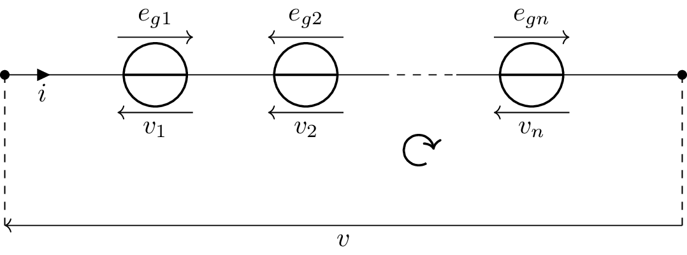
<figcaption>Generatori di Tensione in Serie</figcaption>
</figure>

La tensione generata si misura nella convenzione degli utilizzatori, per cui potrà essere concorde o discorde al verso della forza elettro-motrice, per il primo principio di Kirchhoff si ottiene: $$v=\displaystyle\sum_{k=1}^nv_k=\sum_{k=1}^n(\pm)e_{gk}$$ I valori numerici, compresi il segno, vengono inseriti nel momento del calcolo della tensione complessiva generata da questo lato. Segue che se sono montati in serie, ed i generatori di tensione sono tali che la tensione complessiva è nulla, ci si trova in una situazione di cortocircuito ideale. La forma elettro-motrice totale corrisponde alla forza elettro-motrice equivalente $e_{gs}$ misurata dall’esterno. La sua polarità dipende dalla convenzione usata per misurare ogni singola $v_k$ Se invece fossero montati in parallelo, ciò porterebbe ad una situazione paradossale, poiché la tensione tra ogni elemento montato in parallelo è uguale e, escludendo il caso banale dove ogni generatore di tensione genera la stessa tensione, le tensioni generate da ogni generatore non sono necessariamente uguali tra di loro, per cui ciò risulta in un paradosso, poiché la stessa tensione deve sia essere uguale ad un valore arbitrario e uguale al valore di ogni altra tensione generata.

Analogamente un lato composto da generatori di corrente montati in serie porterebbe allo stesso paradosso, ignorando il caso banale dove tutte le correnti erogate assumono lo stesso valore. Per cui si considera un lato composto da $m$ generatori di tensione montati in parallelo:

<figure id="fig:generatore-corrente-parallelo">
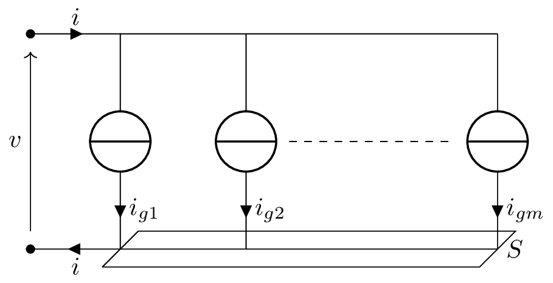
<figcaption>Generatori di Corrente in Parallelo</figcaption>
</figure>

Per il principio di Kirchhoff alle correnti:

$$i=\displaystyle\sum_{k=1}^n(\pm)i_{gk}$$

Si considera una serie di $n$ resistori ed $m$ generatori di tensione, ogni elemento genera una tensione, per cui per il primo principio di Kirchhoff si ottiene una somma di due sommatorie:

<figure id="fig:generatore-tensione-resistori-serie">
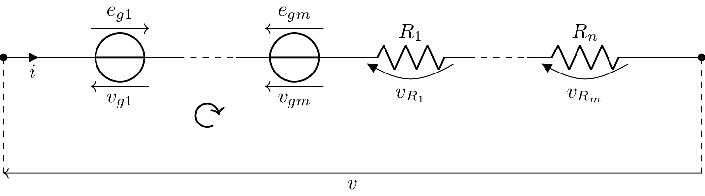
<figcaption>Resistori e Generatori di Tensione in Serie</figcaption>
</figure>

Equivale a sommare tra di loro la serie dei generatori con la serie dei resistori, per cui il lato corrisponde ad lato composto da un resistore equivalente posto in serie con un generatore di tensione equivalente, con valori determinati dalla due sommatorie:

$$v=\displaystyle\sum_{k=1}^mv_{gk}+\sum_{j=1}^nv_{Rj}=\sum_{k=1}^m(\pm)e_{gk}+i\sum_{j=1}^nR_j=(\pm)e_{s}+R_si=v_{s}+v_R$$

Il verso della tensione erogata dipende dal segno del valore complessivo ottenuto dalla sommatoria.

<figure>

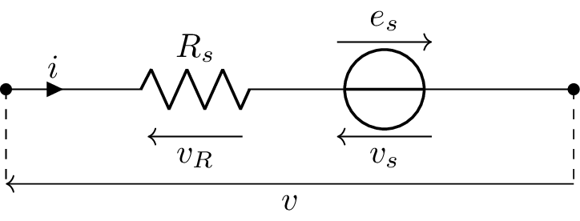 

</figure>

Si considera ora un lato composto da $n$ resistori e $m$ generatori di corrente posti in parallelo.

<figure id="fig:generatore-corrente-resistori-parallelo">
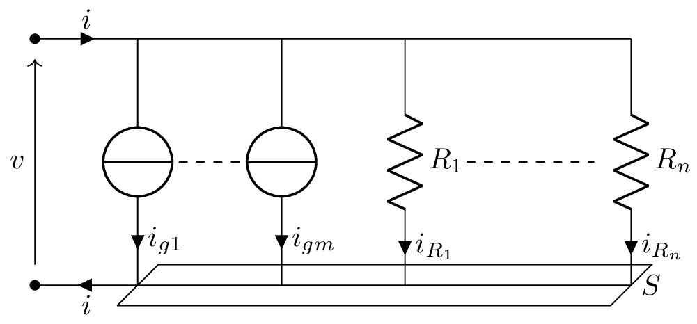
<figcaption>Generatori di Corrente e Resistori in Parallelo</figcaption>
</figure>

Ciò equivale, dall’esterno, ad un lato composto da un resistore con una conduttanza equivalente $G_p$ ed un generatore di corrente, con un verso fissato sulla base del quale si scrivono le sommatorie, con una corrente equivalente $i_{p}$ in parallelo tra di loro:

$$i=\displaystyle\sum_{k=1}^m(\pm)i_{gk}+\sum_{j=1}^ni_{Rj}=i_{p}+v\sum_{j=1}^n\frac{1}{R_j}=i_{p}+\frac{v}{R_p}=i_{p}+vG_p=i_{p}+i_G$$

<figure>

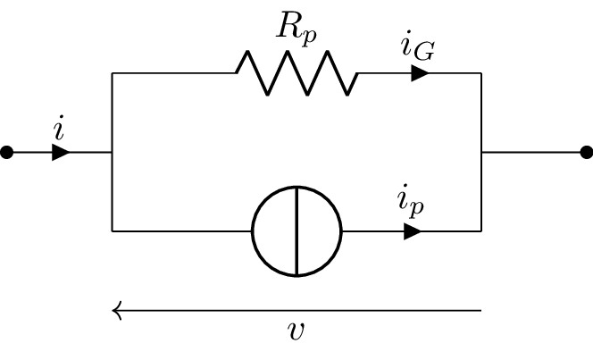 

</figure>

Un lato equivale ad un bipolo con leggi costitutive più complesse e può contenere elementi attivi e passivi insieme, ma ha sempre una tensione ed una corrente.

## Reti con Memoria

### Condensatori in Serie e Parallelo

Si considera un sequenza di $n$ condensatori in serie:

<figure id="fig:condensatore-serie">

<figcaption>Condensatori in Serie</figcaption>
</figure>

La situazione dei condensatori in parallelo viene studiata in fisica mediante i campi, adoperando la definizione propria dei condensatori $C=Q/v$. Per attuare un approccio circuitale si considera la legge costitutiva del bipolo con memoria: $$\begin{gathered}
    i=C\displaystyle\frac{\mathrm{d}v}{\mathrm{d}t}\\
    v=\displaystyle\frac{1}{C}\int_{0^-}^ti\mathrm{d}t+v(0^-)
\end{gathered}$$ Per ottenere lo stesso risultato ottenuto fisicamente, bisogna considerare solo condensatori scarichi, ovvero con memoria nulla. In caso siano carichi si considera un generatore di tensione che genera esattamente una tensione di $v(0^-)$ corrispondente alla memoria del condensatore. In questo modo si introducono informazioni che non esistevano precedentemente, costruendo un circuito applicando il principio di Kirchhoff alle tensione sulla relazione $v=v_C+v(0^-)$, dove $v_C$ rappresenta l’evoluzione della tensione allo scorrere della corrente e $v(0^-)$ la memoria del condensatore:

<figure>

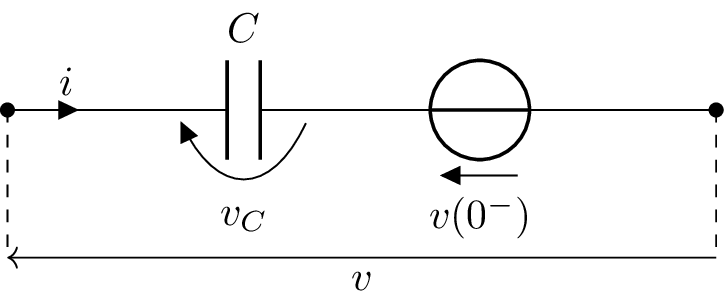 

</figure>

Per ogni condensatore fluisce una stessa corrente $i$. Si considera lo stesso ragionamento dei resistori in serie, processo analogo per ogni serie di elementi uniformi connessi in serie: $$v=\displaystyle\sum_{k=1}^nv_k=\sum_{k=1}^n\left(\frac{1}{C_k}\int_{0^-}^ti\mathrm{d}t+{v_k(0^-)}\right)$$ La corrente che passa per ogni $k-$esimo condensatore è la stessa, per cui si raccoglie nella sommatoria. L’inverso della capacità si chiama elastanza, ma viene usata raramente. L’integrale della corrente corrisponde alla carica contenuta in un condensatore, corrisponde all’analisi fisica che considera la carica totale contenuta da tutti i condensatori la stessa. $$v=\displaystyle\int_{0^-}^ti\mathrm{d}t\sum_{k=1}^n\frac{1}{C_k}+\sum_{k=1}^nv_k(0^-)$$ Spesso si trascurano le condizioni iniziali; per ipotesi si considera solo il caso dove i condensatori sono scarichi. Si definisce allora la capacità equivalente $C_s$: $$\displaystyle\frac{1}{C_s}=\sum_{k=1}^n\frac{1}{C_k}$$

La legge costitutiva del lato composto da condensatori in serie risulta essere: $$v=\displaystyle\frac{1}{C_s}\int_{0^-}^ti\mathrm{d}t+\sum_{k=1}^nv(0^-)$$ Per facilitarne l’analisi si considera il componente tensione iniziale nulla per ogni condensatore: $$v=\displaystyle\frac{1}{C_s}\int_{0^-}^ti\mathrm{d}t$$

<figure>

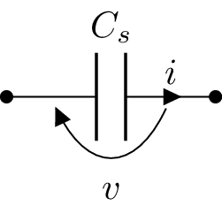 

</figure>

Non si considera l’elastanza poiché le grandezze analizzate in questi casi circuitali verranno collegate direttamente alla corrente ed alla tensione tramite le impedenze. I circuiti con bipoli con memoria sono tempo varianti e l’uso delle impedenze ne facilita l’analisi.

Si considera ora un lato composto da $m$ condensatori in parallelo:

<figure id="fig:condensatore-parallelo">
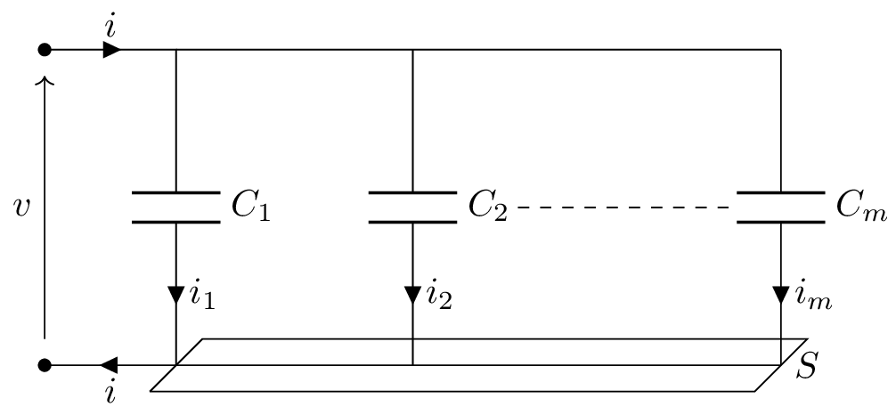
<figcaption>Condensatori in Parallelo</figcaption>
</figure>

Poiché bisogna analizzare in termini correnti si considera la legge costitutiva in forma locale per ogni condensatore $C_k$: $$i_k=C_k\displaystyle\frac{\mathrm{d}v}{\mathrm{d}t}$$

La variazione di tensione è la stessa su tutti i condensatori posti in parallelo. Analogamente ai resistori in parallelo si considera una superficie $S$ dove tutte le correnti passanti per i condensatori sono concordi, mentre la corrente esterna è di verso discorde. Su questa superficie si applica il principio di Kirchhoff alle correnti, scegliendo arbitrariamente un verso di riferimento poiché la loro è sempre nulla. Per ogni insieme di elementi omogenei montati in parallelo si usa questo stesso ragionamento. Si ottiene quindi: $$i-\displaystyle\sum_{k=1}^mi_k=0\to i=\sum_{k=1}^mi_k=\sum_{k=1}^m\left(C_k\frac{\mathrm{d}v}{\mathrm{d}t}\right)=\frac{\mathrm{d}v}{\mathrm{d}t}\sum_{k=1}^mC_k$$

Si definisce capacità equivalente $C_p$ la somma algebrica di tutte le capacità dei condensatori posti in parallelo: $$C_p=\displaystyle\sum_{k=1}^nC_k$$

Per cui la legge costitutiva del mezzo del lato composto da condensatori montati in parallelo si esprime tramite la seguente equazione: $$i=C_p\displaystyle\frac{\mathrm{d}v}{\mathrm{d}t}$$

<figure>

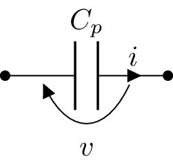 

</figure>

### Induttori in Serie e Parallelo

Poiché l’induttore rappresenta il duale del condensatore, si applica lo stesso ragionamento per ottenere i risultati. Negli induttori in serie si arriva alla formula duale per i condensatori in parallelo, mentre per gli induttori in parallelo, la formula duale dei condensatori in serie. Date le leggi costitutive dell’induttore ideale in forma locale ed integrale: $$\begin{gathered}
    v=L\displaystyle\frac{\mathrm{d}i}{\mathrm{d}t}\\
    i=\displaystyle\frac{1}{L}\int_{0^-}^t v\mathrm{d}t+i(0^-)
\end{gathered}$$

Per un lato composto da $n$ induttori montati in serie si considera la forma locale, e si applica il principio di Kirchhoff alle tensioni:

<figure id="fig:induttore-serie">
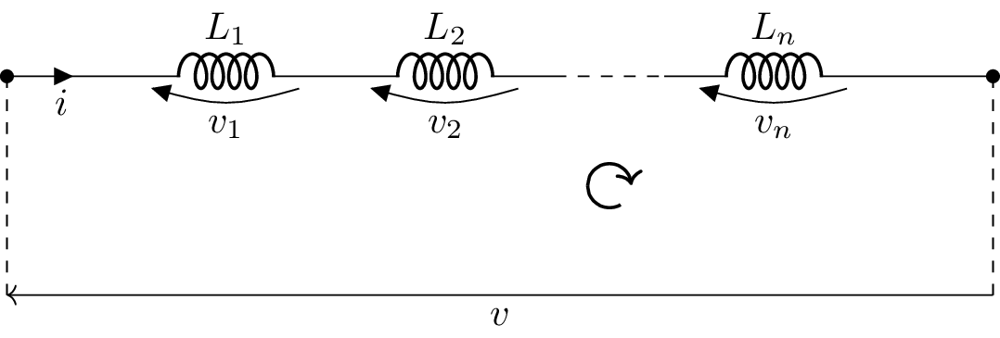
<figcaption>Induttori in Serie</figcaption>
</figure>

$$v-\displaystyle\sum_{k=1}^nv_k=0\to v=\sum_{k=1}^nv_k=\sum_{k=1}^n\left(L_k\frac{\mathrm{d}i}{\mathrm{d}t}\right)=\frac{\mathrm{d}i}{\mathrm{d}t}\sum_{k=1}^mL_k$$ La corrente passante per ogni induttore è la stessa per cui è uguale anche la sua variazione nel tempo. Si definisce l’induttanza equivalente come la somma delle induttanze dei singoli induttori posti in serie:

$$L_s=\displaystyle\sum_{k=1}^nL_k$$

Si può quindi rappresentare questo lato come un singolo induttore di induttanza $L_s$:

$$v=L_s\displaystyle\frac{\mathrm{d}i}{\mathrm{d}t}$$

<figure>

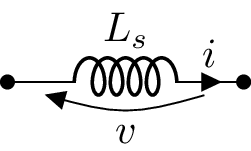 

</figure>

Per un lato composto da $m$ induttori montati in parallelo si considera la forma integrale della legge costitutiva, e si applica il principio i Kirchhoff alle correnti su una superficie $S$, analogamente al caso dei resistori e dei condensatori:

<figure id="fig:induttore-parallelo">
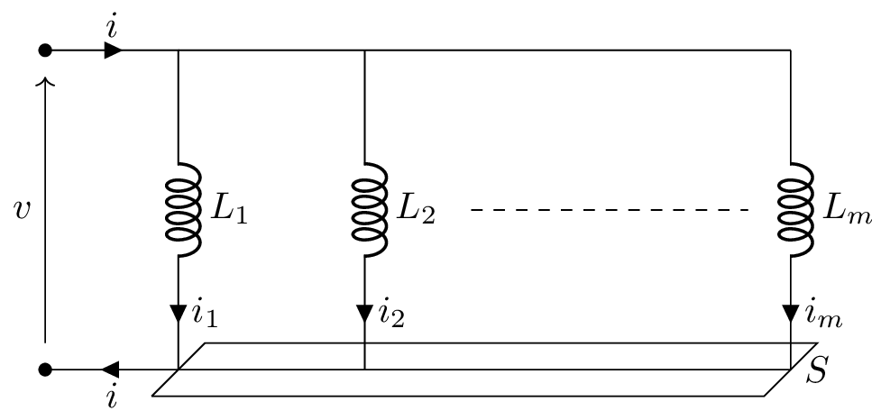
<figcaption>Induttori in Parallelo</figcaption>
</figure>

$$i-\displaystyle\sum_{k=1}^mi_k=0\to i=\sum_{k=1}^mi_k=\sum_{k=1}^m\left(\frac{1}{L_k}\int_{0^-}^t v\mathrm{d}t+i_k(0^-)\right)=\int_{0^-}^t v\mathrm{d}t\sum_{k=1}^m\frac{1}{L_k}+\sum_{k=1}^mi_k(0^-)$$

Si definisce l’induttanza equivalente come:

$$\displaystyle\frac{1}{L_p}=\sum_{k=1}^n\frac{1}{L_k}$$

Per cui la legge costitutiva di un lato composto da induttori in parallelo, considerati per semplicità tutti scarichi, corrisponde a: $$i=\displaystyle\frac{1}{L_p}\int_{0^-}^t v\mathrm{d}t$$

<figure>

 

</figure>

Altrimenti sarebbe necessario inserire un componente generatore ideale di corrente, che eroga una quantità di corrente pari alla memoria complessiva di ogni induttore: $$\begin{gathered}
    i_p=\displaystyle\sum_{k=1}^mi_k(0^-)\\
    i_L=\displaystyle\frac{1}{L_p}\int_{0^-}^t v\mathrm{d}t\\
    i=i_L+i_p
\end{gathered}$$ Considerando il principio di Kirchhoff alle correnti è possibile costruire il circuito equivalente a quest’espressione:

<figure>

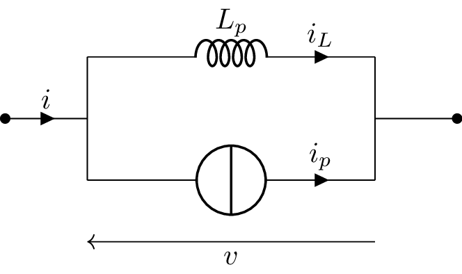 

</figure>

## Forme Norton e Thevenin

I lati composti da resistori e generatori in serie si indicano come forma Thevenin, mentre in parallelo si indicano come forma Norton. Un singolo resistore, può essere entrambe le forme, se i generatori erogano tensione o corrente nulla, per cui è sia Thevenin che Norton, nelle successive analisi ci si riferirà ad un singolo resistore come forma “ambigua" per semplicità. Analogamente si indica un singolo generatore di corrente o di tensione come una forma “estrema", dove la resistenza del resistore è infinita in parallelo e nulla in serie.

<figure>

   

</figure>

### Passaggio da Norton a Thevenin

Le forme Norton e Thevenin sono duali tra di loro, si cerca un modo per trasformale tra di loro. Le forme estreme per la loro definizione non possono essere trasformate. Si considerano le due forme, con la stessa convenzione di misura (utilizzatori) e si considera una rappresentazione esterna tramite la quale è possibile passare tra le due forme. Si esprimono le leggi costitutive delle due forme: $$\begin{gathered}
    v=R_\mathrm{th}i+E_\mathrm{th}\\
    i=G_\mathrm{no}v-I_\mathrm{no}
\end{gathered}$$

Dalla forma Norton si ricava la tensione: $$\begin{gathered}
    v=\displaystyle\frac{i+I_\mathrm{no}}{G_\mathrm{no}}=R_\mathrm{no}(i+I_\mathrm{no})
\end{gathered}$$ Si applica il principio di identità dei polinomi tra le due leggi, e semplificando l’espressione ottenuta si ottiene: $$\begin{gathered}
    R_\mathrm{th}=R_\mathrm{no}\\
    E_\mathrm{th}=R_\mathrm{no}I_\mathrm{no}
\end{gathered}$$ Quest’equazione rappresenta la legge di passaggio tra la forma Norton e la forma Thevenin

# Metodi Risolutivi di Un Circuito

## Topologia dei Circuiti

Per descrivere la topologia dei circuiti si rappresentano dei bipoli generici. Si definisce un lato in maniera più specifica un percorso di bipoli attraversati dalla stessa corrente. Si assegna più importanza alla serie che al parallelo, per semplicità in quest’analisi.

Un nodo è, formalmente, una zona, non un punto, equipotenziale dove convergono almeno tre lati, affinché il principio di Kirchhoff alle correnti dia origine ad un’equazione non banale. Per cui un nodo è obbligatorio se convergono almeno tre lati. Un nodo di calcolo è una zona dove si ammettono anche meno di tre lati, usato appunto ai fini di calcolo. Un nodo non va cercato dalla forma del circuito, da ricordare che la regione di equipotenzialità non rappresenta un lato. Se viene inserito un nodo di calcolo tra due oggetti, non possono essere più considerati in serie.

Un grafo è una stilizzazione del circuito, dove i nodi vengono indicati come dei punti ed i lati come degli archetti che collegano i vari nodi. Il grafo si dice orientata, quando assegna una freccia sugli archi che connettono i nodi. La direzione scelta è arbitraria, indica il verso con cui si misurano sia la corrente che la tensione, per cui un grafo orientato esprime un circuito nella convenzione dei generatori.

Dato un grafo, un albero è rappresentato da un percorso di lati aperto che tocca ogni nodo del grafo. L’albero risultante contiene un numero al massimo uguale al numero di lati del grafo meno uno. Dato un albero, un co-albero è dato dai nodi del grafo e tutti i lati non considerati dall’albero. Gli elementi dell’albero si chiamano rami, mentre gli elementi del co-albero si chiamano corde, mentre gli elementi del grafo mantengono la loro nomenclatura, questo rappresenta una rinominazione degli stessi elementi quando vengono inseriti in un albero o un co-albero. Il numero delle corde non è vincolato al numero dei lati. Questi due grafi così creati sono non comunicanti tra di loro.

Per determinare le correnti e tensioni per ogni lato, si considerano le relazioni su ogni lato, e le leggi costitutive di ogni lato. Per cui dato $l$ numero dei lati, si ottengono $2l$ equazioni, ma è possibile determinare la corrente data la tensione e la legge costitutiva del lato e viceversa, per cui sono necessarie $l$ equazioni. Inoltre si adoperano i principio di Kirchhoff, ma sorge il problema di determinare per quali percorsi chiusi si applicano i principi. Bisogna usarne abbastanza per risolvere le equazioni delle leggi costitutive in funzione della tensione e delle correnti. Per determinare il numero di volte da applicare i principi e per quali percorsi chiusi, si aggiunge all’albero una ed una sola corda del co-albero, per ogni corda, in modo da creare un nuovo percorso chiuso ogni volta. Su questi percorsi chiusi così creati si applicano i principi di Kirchhoff alle tensioni, rispetto al verso della corda inserita. Se i versi dei rami sono opposti, le loro tensioni si indicano di segno opposto. In questo modo si ottengono $c$ equazioni di tensioni, dove $c$ è il numero di corde del co-albero, necessariamente indipendenti tra di loro, poiché in ciascuna di esse è presente solo una volta le tensioni delle corde, poiché non possono essere riscritte come combinazioni lineari. Si esprime in forma matriciale come: $$\begin{bmatrix}
        v_{c,1}\\
        \vdots\\
        v_{c,c}
    \end{bmatrix}+[A]\cdot\begin{bmatrix}
        v_{r,1}\\
        \vdots\\
        v_{r,r}
    \end{bmatrix}=
    \begin{bmatrix}
        0\\
        \vdots\\
        0
    \end{bmatrix}$$ Dove $r$ è il numero di rami, mentre $c$ è il numero di corde, la matrice $A$ di incidenza corde-rami che rappresenta il sistema è una matrice avente $c$ righe e $r$ colonne. In forma compatta si esprime rispetto al vettore tensione corde $[v_c]$ e rami $[v_r]$: $$+[A]\cdot[v_r]=[0]$$ Quest’equazione racchiude tutte le possibili combinazioni di equazioni risultanti dal primo principio di Kirchhoff linearmente indipendenti tra di loro. Si usano le parentesi quadre per denotare la natura matriciale dei componenti, possono essere omesse, ma ciò può causare fraintendimenti sulla natura dei componenti.

Sul grafo si evidenzia, per ogni ramo uno alla volta, quale si sta trattando. Considerando questo ramo si cerca una superficie che ingloba una parte di circuito comprendente solo corde e come unico ramo quello scelto. In questo modo si ottengono $r$ equazioni di correnti, dove $r$ è il numero dei rami dell’albero. Questo processo rappresenta il duale di quello appena svolto. Si ottiene quindi un sistema del tipo: $$\begin{bmatrix}
        i_{r,1}\\
        \vdots\\
        i_{r,r}
    \end{bmatrix}+[B]\cdot\begin{bmatrix}
        i_{c,1}\\
        \vdots\\
        i_{c,c}
    \end{bmatrix}=\begin{bmatrix}
        0\\
        \vdots\\
        0
    \end{bmatrix}$$ La matrice $B$ si chiama matrice di incidenza rami-corde ed ha $r$ righe e $c$ colonne. Questa espressione può essere espressa mediante i vettori di corrente dei rami e delle corde: $$+[B]\cdot [i_{c}]=[0]$$

Le matrici $A$ e $B$ sono componenti duali, la relazione che lega queste due matrici corrisponde a: $$=-[A]^T$$

Per cui i due principi di Kirchhoff non sono tra di loro indipendenti.

Si considera un circuito generico:

<figure>

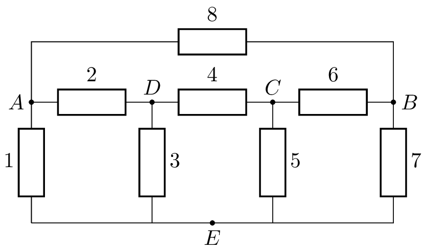 

</figure>

I nodi $A$, $B$ e $E$ non corrispondo esattamente a quei punti nel circuito, ma all’intera zona dove i tre o più lati si incontrano poiché la zona equipotenziale che rappresenta un cavo nel circuito non è un lato. Ma nella rappresentazione grafica si rappresentano come dei singoli punti, e i lati vengono rappresentati come degli archi orientati, di verso scelto arbitrariamente. Per semplicità si opera nella convenzione dei generatori, in modo che il verso degli archi indichi sia il verso di misura dell’ amperometro che del voltmetro. Per cui il circuito considerato si esprime in forma grafica come:

<figure id="fig:grafo-circuito-generico">
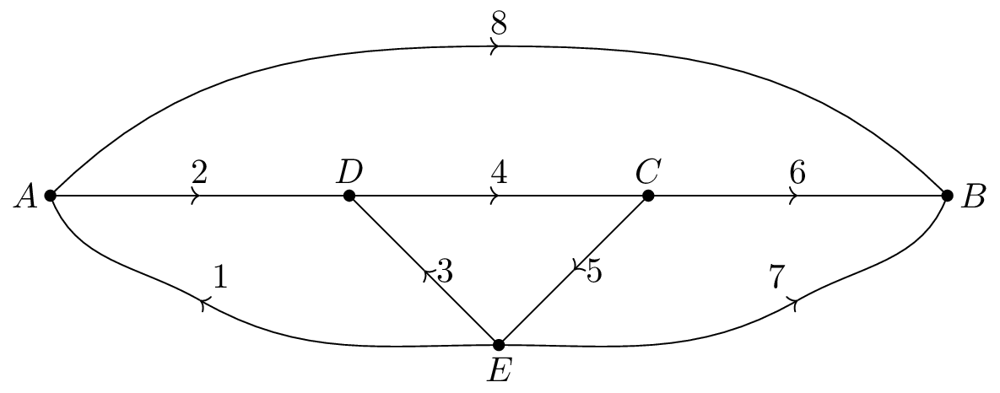
<figcaption>Grafo del Circuito</figcaption>
</figure>

Per creare un albero si scelgono i lati $2$, $3$, $6$, e $8$. In questo caso è solo una coincidenza che il numero dei rami corrisponde al numero delle corde. Il co-albero è quindi composto dai lati $1$, $4$, $5$ e $7$. Questi lati si rinominano in base alla loro posizione nei due nuovi grafi (albero a sinistra e co-albero a destra): $$\begin{gathered}
    \begin{cases}
        l_2=r_1\\
        l_3=r_2\\
        l_6=r_3\\
        l_8=r_4
    \end{cases}\land
    \begin{cases}
        l_1=c_1\\
        l_4=c_2\\
        l_5=c_3\\
        l_7=c_4
    \end{cases}
\end{gathered}$$

<figure id="fig:albero-co-albero">

  

<figcaption>Sotto-Grafi</figcaption>
</figure>

Si applica il secondo teorema di Kirchhoff sulle circuitazioni create inserendo una corda alla volta nel grafo albero, di verso concorde alla corda inserita. Queste circuitazioni si chiamano maglie fondamentali.

<figure>

   

</figure>

<figure id="fig:maglia-fondamentale-3-4">

  

<figcaption>Maglie Fondamentali</figcaption>
</figure>

Da questo si ottiene il sistema delle tensioni del circuito: $$\begin{gathered}
    \begin{cases}
        v_{c_1}+v_{r_1}-v_{r_2}=0\\
        v_{c_2}+v_{r_1}+v_{r_3}-v_{r_4}=0\\
        v_{c_3}-v_{r_1}+v_{r_2}-v_{r_3}+v_{r_4}=0\\
        v_{c_4}-v_{r_2}-r_{v_3}=0
    \end{cases}
\end{gathered}$$ Per cui la matrice di incidenza corde-rami risulta essere: $$+[A]\cdot[v_r]=[0]\to [A]=\begin{bmatrix}
        1&-1&0&0\\
        1&0&1&-1\\
        -1&1&-1&1\\
        -1&1&0&1
    \end{bmatrix}$$

Si applica lo stesso processo, partendo dal co-albero, per definire superfici chiamate tagli fondamentali, che tagliano solo un ramo ed almeno una corda. Il verso di riferimento è dato dal verso del ramo considerato per formare il taglio.

<figure>

    

</figure>

<figure id="fig:tagli-fondamentali-3-4">

   

<figcaption>Tagli Fondamentali</figcaption>
</figure>

La matrice di incidenza rami-corde così ottenuta risulta essere: $$\begin{cases}
        i_{r_1}-i_{c_1}-i_{c_2}+i_{c_3}+i_{c_4}=0\\
        i_{r_2}+i_{c_1}-i_{c_3}-i_{c_4}=0\\
        i_{r_3}-i_{c_2}+i_{c_3}=0\\
        i_{c_4}+i_{c_2}-i_{c_3}-i_{c_4}=0
    \end{cases}:[i_r]+[B]\cdot[i_c]=[0]\to[B]=
    \begin{bmatrix}
        -1&-1&1&1\\
        1&0&-1&-1\\
        0&-1&1&0\\
        0&1&-1&-1&
    \end{bmatrix}$$

Per cui per risolvere il circuito, non è necessario adoperare entrambi i principi di Kirchhoff, poiché producono due sistemi duali. Una volta ottenuta la matrice di incidenza corde-rami, invece di individuare tutti i tagli fondamentali si usa direttamente la sua trasposta per impostare l’equazione delle correnti.

## Teorema di Tellegen

Il teorema di Tellegen rappresenta un teorema fondamentale per la topologia dei circuiti. Questo teorema definisce la proprietà di conservatività delle potenze virtuali di un circuito. Si vuole determinare se un circuito generico rispetta il bilancio energetico, ovvero la somma algebrica dell’energia del sistema istante per istante, che equivale alla somma della potenza erogata e assorbita dal circuito durante l’intervallo di funzionamento, è nulla. Poiché si rappresenta il grafo di un circuito rispetto alla convenzione dei generatori, la potenza assorbita è negativa, mentre la potenza erogata è positiva. Si considera per ogni lato generico $k$ del circuito la sua potenza $P_k$, e si applica una sommatoria per tutti i lati $l$ del circuito: $$\displaystyle\sum_{k=1}^lP_k=\sum_{k=1}^lv_ki_k$$ Questo si può esprimere rispetto alle corde e ai rami, separatamente: $$\displaystyle\sum_{k=1}^cv_{c_k}i_{c_k}+\sum_{k=1}^rv_{r_k}i_{r_k}$$ Questa sommatoria equivale alla trasposta del vettore dei potenziali moltiplicato matricialmente per il vettore delle correnti: $$\begin{pmatrix}
        a_1&\cdots&a_n
    \end{pmatrix}\cdot\begin{pmatrix}
        b_1\\
        \vdots\\
        b_n
    \end{pmatrix}=a_1b_1+\cdots +a_nb_n$$ Quindi si ottiene la seguente espressione: $$\displaystyle\sum_{k=1}^cv_{c_k}i_{c_k}+\sum_{k=1}^rv_{r_k}i_{r_k}=[v_c]^T\cdot[i_c]+[v_r]^T\cdot[i_r]$$ Considerando le equazioni in forma matriciale individuate precedentemente si può esprimere come: $$\begin{gathered}
=-[A]\cdot[v_r]\\
    [i_r]=[A]^T\cdot[i_c]\\
    [v_c]^T\cdot[i_c]+[v_r]^T\cdot[i_r]=\left(-[A]\cdot[v_r]\right)^T\cdot[i_c]+[v_r]^T\cdot\left([A]^T\cdot[i_c]\right)\\
    -[A]^T[v_r]^T[i_c]+[A]^T[v_r]^T[i_c]=0
\end{gathered}$$

Per cui il bilancio energetico di un qualsiasi circuito è sempre verificato, poiché la somma delle sue potenze per ogni lato sarà sempre nulla, ma hanno disaccoppiati i campi, poiché sono solo delle approssimazioni formate dall’unione di regioni quasi-stazionarie tra di loro.

Si considerano ora due circuiti aventi lo stesso grafo, ma potenzialmente lati diversi. Si indicano questi due circuiti come $\alpha$ e $\beta$. Si considera ora il bilancio energetico, usando le tensioni del circuito $\alpha$ e le correnti di $\beta$. Le potenze individuate da questo prodotto per ogni $k-$esimo lato prendono il nome di potenze virtuali. Da notare che la matrice di incidenza rimane invariate, poiché è funzione della sola topologia del circuito.

$$\begin{gathered}
    \displaystyle\sum_{k=1}^cv_{c_k}^\alpha i_{c_k}^\beta+\sum_{k=1}^rv_{r_k}^\alpha i_{r_k}^\beta=[v_c]^{T,\alpha}\cdot[i_c]^\beta+[v_r]^{T,\alpha}\cdot[i_r]^\beta\\
    \left(-[A]\cdot[v_r]^\alpha\right)^T\cdot[i_c]^\beta+[v_r]^{T,\alpha}\cdot\left([A]^T\cdot[i_c]^\beta\right)\\
    -[A]^T[v_r]^{T,\alpha}[i_c]^\beta+[A]^T[v_r]^{T,\alpha}[i_c]^\beta=0
\end{gathered}$$ Quindi il bilancio energetico è verificato anche considerando potenze virtuali, ciò dimostra il teorema di Tellegen.

Per determinare la potenza erogata da un generatore, si calcola la tensione, se generatore Norton, o la corrente, se generatore Thevenin, di lato, nella convenzione dei generatori. I prodotti ottenuti dalla grandezza erogata e la grandezza di lato, indipendentemente dal segno, vengono considerati potenze erogate. Dovranno comunque verificare il bilancio energetico.

## Metodo dei Nodi con Esempi Applicativi

Si è determinato precedentemente che i principi di Kirchhoff non sono dipendenti tra di loro, infatti le loro rispettive matrici di incidenza sono legate dall’espressione: $$=-[B]^T$$

Per cui è possibile risolvere il circuito usando meno equazioni. Uno dei metodi che permettono di usare un numero di equazioni minore dei due principi di Kirchhoff è il metodo del Tableau. Questo metodo permette di avere solo $r$ o $c$ equazioni nel sistema, ciò è favorevole in situazioni dove è presente un numero considerevolmente maggiore di corde rispetto ai rami, diminuendo il tempo necessario alla risoluzione del circuito. Un circuito di questo tipo presenta molti lati in parallelo tra di loro.

Si considera il seguente circuito, su cui verrà adoperato il metodo dei nodi:

<figure>

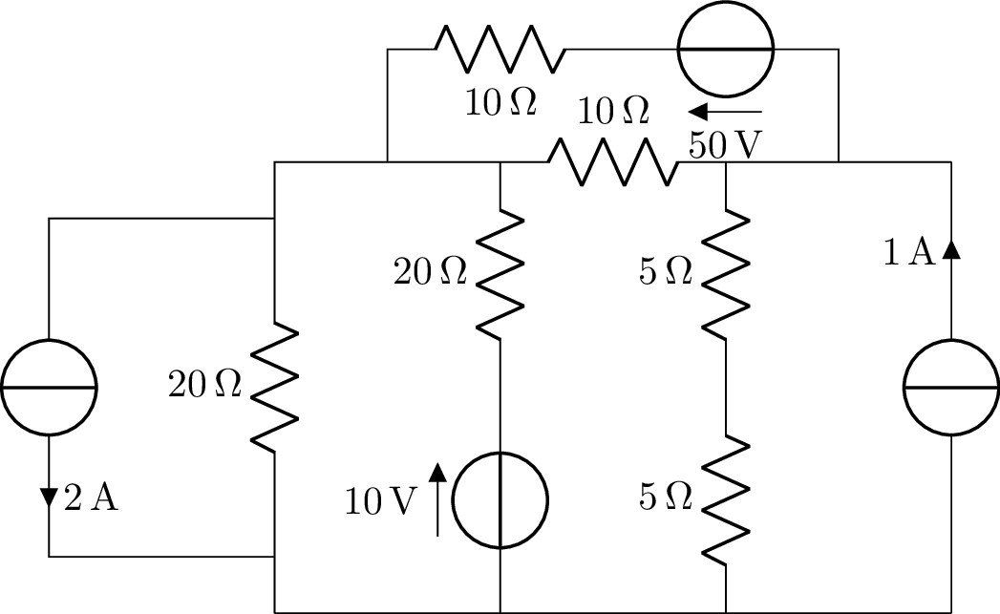 

</figure>

Si crea ora il grafo rappresentativo del circuito, considerando sempre la convenzione dei generatori:

<figure>

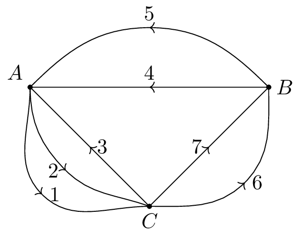 

</figure>

Nel grafo, il verso dei lati corrisponde al verso dei generatori, in modo da non discutere i segni. In caso siano presenti più di un generatore, si sceglie il verso risultante della somma algebrica dei generatori.

Il metodo dei nodi fornisce un metodo di risoluzione, usando solo $n-1$ equazioni, dove $n$ è il numero di nodi del grafo, equivalente al numero dei rami $r$. Si scelgono il nodo $A$ ed il nodo $B$, rispetto ai quali si scrive il primo principio di Kirchhoff scegliendo arbitrariamente un verso di riferimento, tramite una matrice di incidenza nodi-lati $A\in M(n-1,l,\{-1,0,1\})$: $$\begin{gathered}
=[0]\\
    \begin{bmatrix}
        -1&-1&1&1&1&0&0\\
        0&0&0&-1&-1&1&1
    \end{bmatrix}\cdot\begin{bmatrix}
        i_1\\
        i_2\\
        i_3\\
        i_4\\
        i_5\\
        i_6\\
        i_7
    \end{bmatrix}=\begin{bmatrix}
        0\\
        0
    \end{bmatrix}
\end{gathered}$$ Per cui il primo passaggio del metodo dei nodi è la determinazione della matrice di incidenza $A$. Successivamente si determina l’equazione di utilità, per determinare le nuove incognite da usare nelle $n-1$ equazioni. Equazione di utilità risponde al metodo, non dipende risponde a leggi fisiche, ma ad intuizioni computazionali. Vengono quindi definiti i potenziali nodali $[V_\mathrm{no}]\in M(n-1,1,\mathbb{R})$. Si assegna al nodo non considerato un potenziale nullo, in questo caso $C$. Si misurano quindi le tensioni, tenendo il puntale negativo sul nodo $C$. L’equazione risultante si esprime tramite un’altra matrice di incidenza lati-nodi $B\in M(l,n-1,\{-1,0,1\})$: $$\begin{gathered}
    \begin{bmatrix}
        v_1\\
        v_2\\
        v_3\\
        v_4\\
        v_5\\
        v_6\\
        v_7
    \end{bmatrix}\cdot[B]=\begin{bmatrix}
        V_A\\
        V_B
    \end{bmatrix}\to[B]=\begin{bmatrix}
        -1&0\\
        -1&0\\
        1&0\\
        1&-1\\
        1&-1\\
        0&1\\
        0&1
    \end{bmatrix}\\
    [v_l]\cdot[B]=[V_\mathrm{no}]
\end{gathered}$$ Queste due matrici di incidenza sono dipendenti tra di loro: $$=[A]^T$$ In questo modo si può esprimere l’equazione di utilità rispetto alla matrice di incidenza delle correnti $A$: $$\cdot[A]^T=[V_\mathrm{no}]$$

Per attuare queste operazioni i lati devono essere in una forma idonea alla corrente, da ricordare che ci troviamo nella convenzione dei generatori. Le forme idonee sono la forma ambigua, con equazione costitutiva $i=-Gv$, le forme Norton semplice ed estrema, avendo valori di corrente finiti e assegnati a priori, che si comportano come termini noti. Le forme Thevenin, non estreme, possono essere convertite in forme Norton, per cui le uniche forme, senza memoria, non accettate sono la forma Thevenin estrema. Generalizzando il metodo dei nodi, si può includere la forma Thevenin estrema, che non si può esprimere come una forma Norton. Questo metodo dei nodi non generalizzato è valido per tutti i circuiti che non contengono forme Thevenin estreme.

Per ogni generico lato $k$ è esprimibile come una forma Norton, la sua corrente di lato si può quindi esprimere come: $$i_k=i_{gk}-G_kv_k$$

<figure>

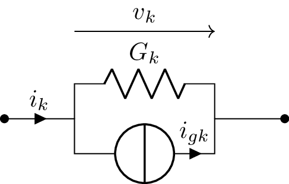 

</figure>

In questo caso si ottengono le seguenti leggi costitutive dei lati: $$\begin{cases}
        i_1=2\,\mathrm{A}&G_1=0\\
        i_2=\displaystyle-\frac{\strut 1}{\strut 20\,\Omega}v_2&i_{g2}=0\\
        i_3=\displaystyle\frac{\strut 10\,\mathrm{V}}{\strut 20\,\Omega}-\frac{1}{20\,\Omega}v_3=\frac{1}{2}\,\mathrm{A}-\frac{1}{20\,\Omega}v_3\\
        i_4=\displaystyle-\frac{\strut 1}{\strut 10\,\Omega}v_4 &i_{g4}=0\\
        i_5=\displaystyle\frac{\strut 50\,\mathrm{V}}{\strut 10\,\Omega}-\frac{1}{10\,\Omega}v_5=5\,\mathrm{A}-\displaystyle\frac{1}{10\,\Omega}v_5\\
        i_6=1\,\mathrm{A} &G_6=0\\
        i_7=\displaystyle\frac{\strut 1}{\strut 5\,\Omega+5\,\Omega}v_7=\frac{1}{10\,\Omega}v_7
        &i_{g7}=0
    \end{cases}$$ Riscrivendole in forma matriciale, bisogna considerare una matrice $M(l,l,\mathbb{R})$ corrispondente alla conduttanza $G_k$, questa matrice si indica come matrice di conduttanza di lato: $$\begin{gathered}
=[I_g]-[G_l][v_l]
\end{gathered}$$ Analizzando la dimensione delle matrici, si nota che necessariamente per ritornare alla forma generica della corrente di lato, gil unici elementi della matrice di conduttanza che possono non essere nulli sono sulla diagonale, per cui la matrice di conduttanza di lato $G_l$ è una matrice diagonale: $$\begin{gathered}
\in D(l,\mathbb{R})\\
    [G_l]=\begin{bmatrix}
        G_{11}&0&\cdots&0&0\\
        0&G_{22}&\cdots&0&0\\
        \vdots&\vdots&\ddots&\vdots&\vdots\\
        0&0&\cdots&G_{l-1\,l-1}&0\\
        0&0&\cdots&0&G_{l\,l}
    \end{bmatrix}
\end{gathered}$$

Si indicano lati “stravaganti", sono dei lati che presentano dei generatori di corrente con un resistore in serie, poiché la corrente erogata dal generatore di corrente non può essere alterata dal resistore posto in serie, per cui la conduttanza relativa a questo lato è nulla. Ovvero rappresenta un Norton estremo. Ma nel calcolo della potenza erogata si considera anche il resistore, poiché la potenza di un Norton estremo non corrisponde alla potenza generata dal lato generico con un generatore avente un resistore in serie. Analogamente per un generatore di corrente in serie ad un generatore di tensione, poiché la corrente passante per il lato dipende dal solo generatore di corrente, per cui la forma equivalente esterna corrisponde alla forma Norton estrema.

Si moltiplicano ora entrambi i lati dell’equazione per la matrice di incidenza nodi-lati: $$\begin{gathered}
=[A]\left\{[I_g]-[G_l][v_l]\right\}\\
    [0]=[A][I_g]-[A][G_l][v_l]\\
    [0]=[A][I_g]-[A][G_l][A]^T[V_\mathrm{no}]
\end{gathered}$$ Si indica il prodotto tra la matrice di incidenza nodi-lati ed il vettore di tutte le correnti erogate dai generatori di corrente in forma Norton, il vettore delle correnti nodali: $$=[I_\mathrm{no}]$$ Viene definita invece la matrice delle conduttanze nodali $[G_\mathrm{no}]$ come: $$=[A][G_l][A]^T$$ Allora l’equazione diventa: $$\begin{gathered}
=[G_\mathrm{no}][V_\mathrm{no}]\\
    [G_\mathrm{no}]^{-1}[I_\mathrm{no}]=[V_\mathrm{no}]
\end{gathered}$$

Dopo aver determinato questi vettori e matrici nodali, si risolvono le equazioni relative ai principi di Kirchhoff: $$\begin{gathered}
^T[v_l]=[V_\mathrm{no}]\\
    [i_l]=[I_g]-[G_l][v_l]
\end{gathered}$$

In seguito bisogna verificare il bilancio energetico del circuito per verificare sia una soluzione valida. $$\begin{gathered}
^T[i_l]=\displaystyle\sum_{k=1}^lv_ki_k=0
\end{gathered}$$

In questo circuito è presente una matrice di conduttanza di lato: $$=\begin{bmatrix}
        0\,\Omega^{-1}&&&&&&\\
        &\displaystyle\frac{1}{20\,\Omega}&&&&&\\
        &&\displaystyle\frac{1}{20\,\Omega}&&&&\\
        &&&\displaystyle\frac{1}{10\,\Omega}&&&\\
        &&&&\displaystyle\frac{1}{10\,\Omega}&&\\
        &&&&&0\,\Omega^{-1}&\\
        &&&&&&\displaystyle\frac{1}{10\,\Omega}
    \end{bmatrix}$$ Un vettore corrente erogata: $$=\begin{bmatrix}
        2\,\mathrm{A}\\
        0\,\mathrm{A}\\
        0.5\,\mathrm{A}\\
        0\,\mathrm{A}\\
        5\,\mathrm{A}\\
        1\,\mathrm{A}\\
        0\,\mathrm{A}
    \end{bmatrix}$$ Un vettore correnti nodali: $$=[A][I_g]=\begin{bmatrix}
        3.5\\
        -4
    \end{bmatrix}$$ Una matrice conduttanza nodale: $$=[A][G_l][A]^T=\begin{bmatrix}
        0.3&-0.2\\
        -0.2&0.3
    \end{bmatrix}$$

Un vettore potenziali nodali: $$=[G_\mathrm{no}]^{-1}[I_\mathrm{no}]=\begin{bmatrix}
        5\\
        -10
    \end{bmatrix}$$ Si risolvono ora i vettori tensioni e correnti di lato: $$=[A]^T[V_\mathrm{no}]=\begin{bmatrix}
        -5\\
        -5\\
        5\\
        15\\
        15\\
        -10\\
        -10
    \end{bmatrix}$$ $$=[I_g]-[G_l][v_l]=\begin{bmatrix}
        2\\
        0.25\\
        0.25\\
        -1.5\\
        3.5\\
        1\\
        1
    \end{bmatrix}$$ Si verifica il bilancio energetico del circuito: $$^T[i_l]=\begin{bmatrix}
        -5&
        -5&
        5&
        15&
        15&
        -10&
        -10
    \end{bmatrix}\cdot\begin{bmatrix}
        2\\
        0.25\\
        0.25\\
        -1.5\\
        3.5\\
        1\\
        1
    \end{bmatrix}
    =0$$ Questo bilancio energetico presenta un errore accettabile in base allo strumento di calcolo usato per determinare il risultato.

### Metodo per Semplice Ispezione e Generalizzazione

Da questo metodo, si possono ottenere delle regole generalizzate che permettono di evitare l’analisi della topologia del circuito. Si indica come scrittura metodo dei nodi per semplice ispezione. Gli elementi della matrice delle conduttanze nodali che si trovano sulla diagonale principale si chiamano autoconduttanze. Si dimostra che si ottengono sommando tutte le $n_{j}$ conduttanze dei lati $l_k$ che affiorano su quel nodo: $$g_{\mathrm{no}_{ij}}=\displaystyle\sum_{k=1}^{n_j}G_{l_k}\,\forall i= j$$ Gli elementi che non si trovano sulla diagonale principale si chiamano mutue- o trans-conduttanze, e rappresentano una somma cambiata di segno delle $n_{ij}$ conduttanze dei lati $l_k$ che collegano due nodi: $$g_{\mathrm{no}_{ij}}=-\displaystyle\left(\sum_{k=1}^{n_{ij}}G_{l_k}\right)\,\forall i\neq j$$ Si può esprimere semplicemente la matrice delle conduttanze nodali, come una matrice quadrata di ordine $n-1$ i cui componenti assumono valori descritti dalla seguente espressione: $$\begin{gathered}
:=(g_{\mathrm{no}_{ij}})\\
    g_{\mathrm{no}_{ij}}=\begin{cases}
        \displaystyle\sum_{k=1}^{n_j}G_{l_k} &i=j\\
        -\displaystyle\left(\sum_{k=1}^{n_{ij}}G_{l_k}\right)&i\neq j
    \end{cases}\tag{\stepcounter{equation}\theequation}
\end{gathered}$$ Da considerare che se il resistore è collegato a vuoto, ovvero non può fluire corrente, non potrà assorbirla e quindi il suo effetto sarà nullo. Per cui non bisogna considerare la conduttanza di resistori collegati a vuoto, oppure in serie ad un generatore di corrente, poiché non sono in grado di alterare la corrente erogata. Per il calcolo della potenza invece, bisogna considerare il contributo di ogni lato. Quindi solo nella risoluzione con la matrice delle conduttanze nodali, e delle resistenze nodali per il metodo delle maglie, non bisogna considerare resistori in serie a generatori di corrente, o connessi a vuoto, rappresentabile come un generatore di corrente che eroga corrente nulla.

Per esprimere il vettore delle correnti nodali si considerano solo i lati con un generatore di corrente, e si attua una somma, tenendo conto del verso delle correnti. Se le correnti sono entranti nel nodo sono positive, negative quelle uscenti: $$\begin{gathered}
:=(i_{\mathrm{no}_{i}})\\
    i_{\mathrm{no}_i}=\displaystyle\sum_{k=1}^{n_i}\pm i_{g_k}\tag{\stepcounter{equation}\theequation}
\end{gathered}$$

Per determinare la corrente $i_k$ passante per un lato $l_k$ si considera la differenza tra la tensione tra i due nodi $A$ e $B$ che racchiudono il lato e la tensione erogata dal lato $v_k$, moltiplicata per la conduttanza del lato $G_k$: $$i_k=[(V_A-V_B)-v_k]G_k$$ Il verso, e quindi il segno ottenuto, è arbitrario e dipende dalla convenzione utilizzata per misurare le grandezze di ogni singolo lato.

Si risolve il seguente circuito con un Thevenin estremo, per cui bisogna modificare il metodo per poterlo usare:

<figure>

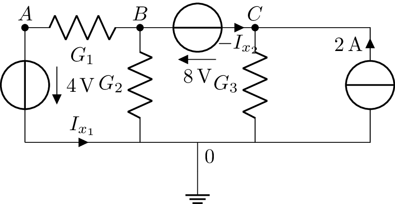 

</figure>

$$\begin{gathered}
    G_1=6\,\Omega\\
    G_2=G_3=12\,\Omega
\end{gathered}$$ Si può inserire un nodo fittizio, oppure si cambiano le incognite. In questo caso si considerano le due correnti incognite nei lati dei Thevenin estremi in $b\to c$ e $a\to0$. Si esprime l’equazione risolutiva del metodo dei nodi, ma bisogna sommare ai termini noti il vettore dei contributi delle correnti incognite $I_{x_{1,2}}$: $$\begin{gathered}
    \begin{bmatrix}
        G_1&-G_1&0\\-G_1&G_1+G_2&0\\0&0&G_3
    \end{bmatrix}\begin{bmatrix}
        V_A\\V_B\\V_C
    \end{bmatrix}=\begin{bmatrix}
        0\\0\\2
    \end{bmatrix}+\begin{bmatrix}
        -I_{x_1}\\I_{x_2}\\-I_{x_2}
    \end{bmatrix}
\end{gathered}$$ Si esprimono le equazioni banali o di vincolo, che esprimono la relazione delle potenze nodali con le tensioni erogate dalle forme Thevenin estreme: $$\begin{gathered}
    V_A=-4\,\mathrm{V}\\
    V_B-V_C=8\,\mathrm{V}\\
    \begin{bmatrix}
        G_1&-G_1&0\\-G_1&G_1+G_2&0\\0&0&G_3
    \end{bmatrix}\begin{bmatrix}
        -4\\V_B\\V_B-8
    \end{bmatrix}=\begin{bmatrix}
        0\\0\\2
    \end{bmatrix}+\begin{bmatrix}
        -I_{x_1}\\I_{x_2}\\-I_{x_2}
    \end{bmatrix}
\end{gathered}$$ Quindi si ritorna ad avere tre incognite $I_{x_1}$, $V_B$ e $I_{x_2}$. Si esprime la nuova matrice dei coefficienti rispetto a questo nuovo vettore delle incognite: $$\begin{gathered}
    \begin{bmatrix}
        I_{x_1}\\V_B\\I_{x_2}
    \end{bmatrix}\implies\left[\mathrm{coef.}\right]=\begin{bmatrix}
        1&-G_1&0\\0&G_1+G_2&-1\\0&G_3&1
    \end{bmatrix}
\end{gathered}$$ Si esprime il nuovo vettore dei termini noti e si risolve il sistema così ottenuto: $$\begin{gathered}
    \begin{bmatrix}
        1&-G_1&0\\0&G_1+G_2&-1\\0&G_3&1
    \end{bmatrix}\begin{bmatrix}
        I_{x_1}\\V_B\\I_{x_2}
    \end{bmatrix}=\begin{bmatrix}
        0\\0\\2
    \end{bmatrix}+\begin{bmatrix}
        4G_1\\-4G_1\\0
    \end{bmatrix}+\begin{bmatrix}
        0\\0\\8G_3
    \end{bmatrix}\\
    [T_\mathrm{no}]=\begin{bmatrix}
        4G_1\\-4G_1\\2+8G_3
    \end{bmatrix}\\
    \begin{bmatrix}
        I_{x_1}\\V_B\\I_{x_2}
    \end{bmatrix}=\begin{bmatrix}
        1&-G_1&0\\0&G_1+G_2&-1\\0&G_3&1
    \end{bmatrix}^{-1}\begin{bmatrix}
        4G_1\\-4G_1\\2+8G_3
    \end{bmatrix}=\begin{bmatrix}
        1.667\\
        6\\
        2.167
    \end{bmatrix}
\end{gathered}$$

### Teorema di Millman

Questo teorema corrisponde al caso più semplice del metodo dei nodi, per cui non fornisce informazioni nuove al metodo. Considera una rete formata da soli lati Thevenin in parallelo:

<figure id="fig:circuito-millman">
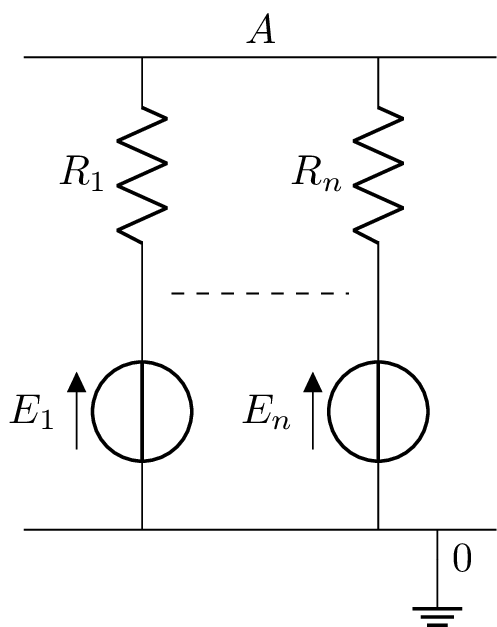
<figcaption>Circuito di Millman</figcaption>
</figure>

Si considera il nodo inferiore il nodo di salto, per il metodo di nodi si può esprimere la tensione tra i due nodi $V_A$ come il rapporto tra la somma delle correnti delle forme Norton equivalenti e la somma delle conduttanze di lato: $$\begin{gathered}
    V_A=\displaystyle\frac{\sum_{k=1}^nG_k\cdot(\pm E_k)}{\sum_{k=1}^nG_k}
\end{gathered}$$

### Aggiunta di Un Nodo Fittizio

Si vuole determinare la corrente $I_x$ passante per un lato di questo circuito:

<figure>

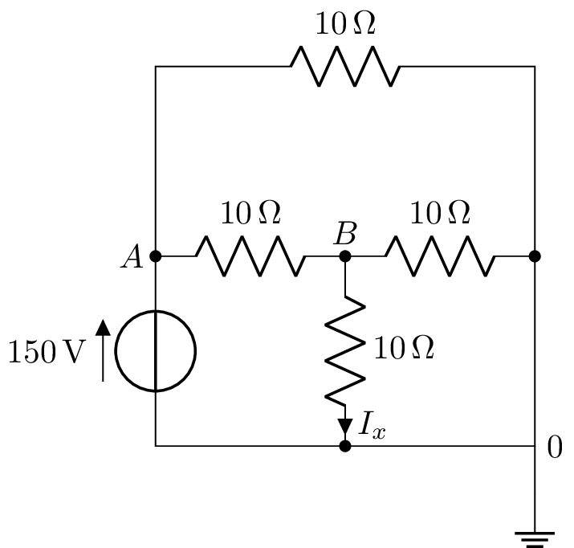 

</figure>

Si inseriscono due resistori di resistenza rispettivamente $8\,\Omega$ e $-8\,\Omega$, invece di un cortocircuito, in serie al lato contenente la forma Thevenin estrema poiché entrambi presentano una resistenza equivalente pari a zero. In questo modo è presente nel circuito un lato Thevenin trasformabile in Norton. Viene quindi aggiunto un nodo fittizio $C$ all’interno del circuito:

<figure>

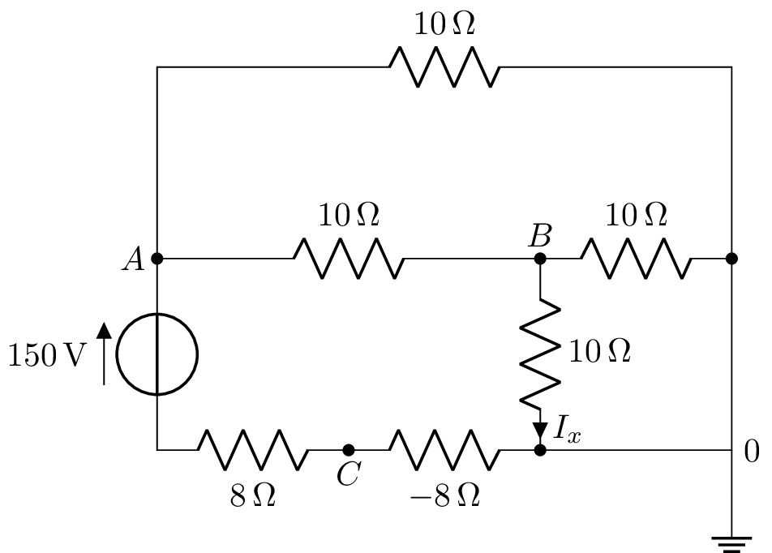 

</figure>

Si esprimono ora le relazioni del metodo dei nodi su questo nuovo circuito, considerando la forma Norton corrispondente del lato Thevenin presente: $$\begin{gathered}
    \begin{bmatrix}
        \displaystyle\frac{\strut 13}{\strut 40}&-\displaystyle\frac{1}{10}&-\displaystyle\frac{1}{8}\\
        -\displaystyle\frac{\strut 1}{\strut 10}&\displaystyle\frac{3}{10}&0\\
        -\displaystyle\frac{\strut 1}{\strut 8}&0&0
    \end{bmatrix}\begin{bmatrix}
        V_A\\V_B\\V_C
    \end{bmatrix}=\begin{bmatrix}
        \displaystyle\frac{\strut 75}{\strut 5}\\0\\-\displaystyle\frac{\strut 75}{\strut 4}
    \end{bmatrix}\\
    \begin{bmatrix}
        V_A\\V_B\\V_C
    \end{bmatrix}=\begin{bmatrix}
        \displaystyle\frac{\strut 13}{\strut 40}&-\displaystyle\frac{1}{10}&-\displaystyle\frac{1}{8}\\
        -\displaystyle\frac{\strut 1}{\strut 10}&\displaystyle\frac{3}{10}&0\\
        -\displaystyle\frac{\strut 1}{\strut 8}&0&0
    \end{bmatrix}^{-1}\begin{bmatrix}
        \displaystyle\frac{\strut 75}{\strut 5}\\0\\-\displaystyle\frac{\strut 75}{\strut 4}
    \end{bmatrix}=\begin{bmatrix}
        150\\50\\200
    \end{bmatrix}
\end{gathered}$$

Il potenziale $V_A$ corrisponde alla tensione originaria, per cui questo metodo non altera le grandezze del circuito. La corrente $I_x$ è quindi semplicemente calcolabile come: $$\begin{gathered}
    I_x=\displaystyle\frac{V_B}{10\,\Omega}=5\,\mathrm{A}
\end{gathered}$$

Alternativamente questo problema può essere risolto tramite trasformazioni in serie ed in parallelo per ottenere una resistenza equivalente, ed una successiva ricomposizione.

## Metodo delle Maglie con Esempi Applicativi

Il metodo delle maglie è il duale del metodo dei nodi, questo metodo si basa sul secondo principio di Kirchhoff. Permette di scrivere tante equazioni tante sono il numero di maglie indipendenti del sistema. Si può raggiungere questo numero scegliendo opportune maglie. Non quelle fondamentali, ma maglie che non contengono altre maglie. Questo tipo di maglie vengono indicati con il termine di anelli. Essendo il duale del metodo dei nodi, per dimostrarlo, si sostituiscono le correnti alle tensioni, le resistenze alle conduttanze ed i lati Norton ai lati Thevenin, nelle formule risolutive. Si considera la seguente rete:

<figure>

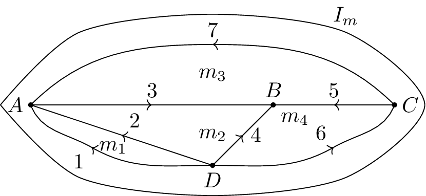 

</figure>

Si può rappresentare in forma matriciale tramite la matrice di incidenza maglie-lati $[B]$, che indica se un certo lato appartiene alla circuitazione di uno degli anelli: $$\begin{gathered}
\cdot[v_l]=[0]\\
    \begin{bmatrix}
        1&-1&0&0&0&0&0\\
        0&1&-1&-1&0&0&0\\
        0&0&1&0&-1&0&-1\\
        0&0&0&1&-1&-1&0
    \end{bmatrix}\cdot\begin{bmatrix}
        v_1\\v_2\\v_3\\v_4\\v_5\\v_6\\v_7
    \end{bmatrix}=\begin{bmatrix}
        0\\0\\0\\0
    \end{bmatrix}
\end{gathered}$$

Analogamente al metodo dei nodi, si usufruisce di un’equazione di utilità per cambiare le incognite e diminuire il numero di equazioni necessarie. Si vogliono esprimere le correnti passanti per i lati come la differenza tra due correnti, e si sceglie una corrente di riferimento, assunta di valore nullo. Si prende ogni lato e si indica come differenza tra due correnti di maglia. Queste incognite fittizie forniscono dalla loro differenza il valore delle correnti passanti per ogni lato. Il loro valore è noto solo a meno di una costante di riferimento, in questo caso $I_m$, corrispondente alla corrente di maglia passante nel vuoto.

Si esprimono quindi le correnti, considerando la corrente di riferimento $I_m=0$, e gli anelli attraversati tutti in verso orario da una corrente associata $I_{m_k}$: $$\begin{gathered}
    i_1=I_{m_1}-0\\
    i_2=I_{m_2}-I_{m_1}\\
    i_3=I_{m_3}-I_{m_2}\\
    i_4=I_{m_4}-I_{m_2}\\
    i_5=I_{m_3}-I_{m_4}\\
    i_6=0-I_{m_4}\\
    i_7=0-I_{m_3}
\end{gathered}$$

Per cui l’equazione di utilità è: $$\begin{gathered}
=\begin{bmatrix}
        i_1\\
        i_2\\
        i_3\\
        i_4\\
        i_5\\
        i_6\\
        i_7
    \end{bmatrix}=\begin{bmatrix}
        1&0&0&0\\
        -1&1&0&0\\
        0&-1&1&0\\
        0&-1&0&1\\
        0&0&1&-1\\
        0&0&0&-1\\
        0&0&-1&0
    \end{bmatrix}\cdot\begin{bmatrix}
        I_{m_1}\\
        I_{m_2}\\
        I_{m_3}\\
        I_{m_4}
    \end{bmatrix}\\
    [H]=\begin{bmatrix}
        1&0&0&0\\
        -1&1&0&0\\
        0&-1&1&0\\
        0&-1&0&1\\
        0&0&1&-1\\
        0&0&0&-1\\
        0&0&-1&0
    \end{bmatrix}
\end{gathered}$$

Questa matrice $[H]$ risulta essere esattamente la trasposta della matrice di incidenza maglie-lati: $$=[B]^T$$

Tutti i lati si rappresentano come lati Thevenin nella convenzione dei generatori. Quindi ogni lato $k-$esimo è definito dall’equazione: $$v_k=E_k-R_ki_k$$

<figure>

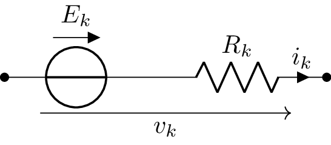 

</figure>

I lati Norton estremi, ambigui, oppure lati in parallelo con il vuoto non possono essere analizzati tramite questo metodo. Verrà poi generalizzato per tenere conto di queste forme. In forma matriciale si può esprimere come: $$\begin{gathered}
=[E_l]-[R_l][i_l]
\end{gathered}$$ La matrice delle resistenze di lato presenta degli zeri solo in presenta di lati Thevenin estremi, può presentare elementi non nulli solo sulla sua diagonale. Si moltiplicano ambo i membri per la matrice di incidenza maglie-lati: $$\begin{gathered}
=[B]\left([E_l]-[R_l][i_l]\right)\\
    [0]=[B][E_l]-[B][R_l][i_l]
\end{gathered}$$ Si sostituisce: $$\begin{gathered}
=[B]^T[I_m]
\end{gathered}$$ Si definisce il vettore tensione di maglia: $$=[B][E_l]$$ Per cui l’equazione diventa: $$\begin{gathered}
=[B][R_l][B]^T[I_m]
\end{gathered}$$ Si definisce la matrice resistenze di maglia: $$\begin{gathered}
=[B][R_l][B]^T
\end{gathered}$$ Il vettore correnti di maglia si calcola tramite la risultante equazione risolutiva della rete: $$\begin{gathered}
=[R_m]^{-1}[E_m]
\end{gathered}$$

### Metodo per Semplice Ispezione

Si considera il seguente circuito. E si esprimono le equazioni senza passare per il grafo del circuito.

<figure>

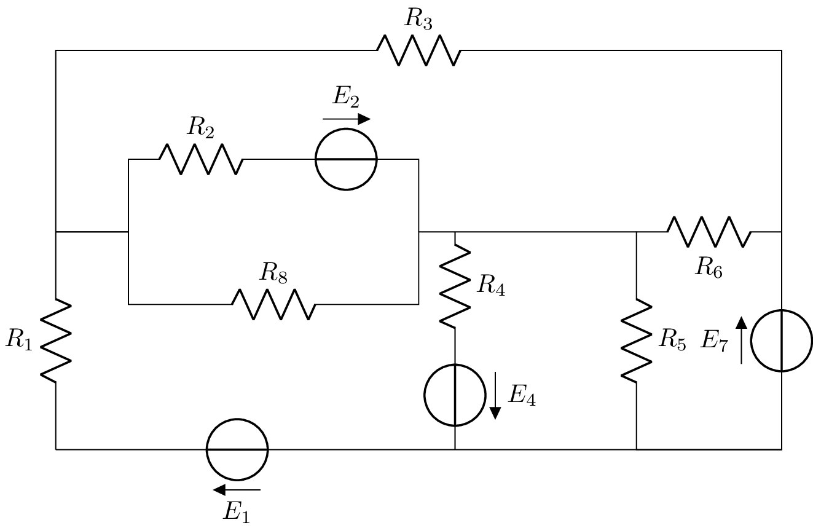 

</figure>

Si rappresenta il vettore tensioni di maglia, controllando per ogni maglia, i lati che presentano un generatore di tensione. Si considerano positive le tensioni erogate da generatori concordi alla direzione di attraversamento della maglia, in questo caso sempre orario, altrimenti si indicano con il segno opposto: $$\begin{gathered}
:=(e_{m_{i}})\\
    e_{m_i}=\displaystyle\sum_{k=1}^{n_i}\pm E_{k_i}\tag{\stepcounter{equation}\theequation}\\
    [E_m]=\begin{bmatrix}
        E_1+E_4\\
        E_2\\
        -E_2\\
        -E_4\\
        -E_7
    \end{bmatrix}
\end{gathered}$$ Si esprime la matrice delle resistenza di maglia. L’autoresistenza si ottiene come la somma delle resistenza dei lati appartenenti alla maglia. Le mutue resistenze si calcolano come la somma cambiata di segno delle resistenze dei lati in comune tra le maglie: $$\begin{gathered}
:=(r_{m_{ij}})\\
    r_{m_{ij}}=\begin{cases}
        \displaystyle\sum_{k=1}^{n_i}R_{k_i}& i=j\\
        \displaystyle-\left(\sum_{k=1}^{n_{ij}}R_{k_{ij}}\right)& i\neq j
    \end{cases}\tag{\stepcounter{equation}\theequation}\\
    [R_m]=\begin{bmatrix}
        R_1+R_4+R_6&-R_8&0&-R_4&0\\
        -R_8&R_2+R_8&-R_2&0&0\\
        0&-R_2&R_2+R_6+R_3&0&-R_6\\
        -R_4&0&0&R_5+R_6&-R_5\\
        0&0&-R_6&-R_5&R_5+R_4
    \end{bmatrix}
\end{gathered}$$ Le correnti di maglia si ottengono come: $$=[R_m]^{-1}[E_m]$$

## Partitore di Tensione e di Corrente con Esempi Applicativi

Si considera il seguente circuito, e si vuole calcolare il valore delle tensioni $V_{x,y}$:

<figure>

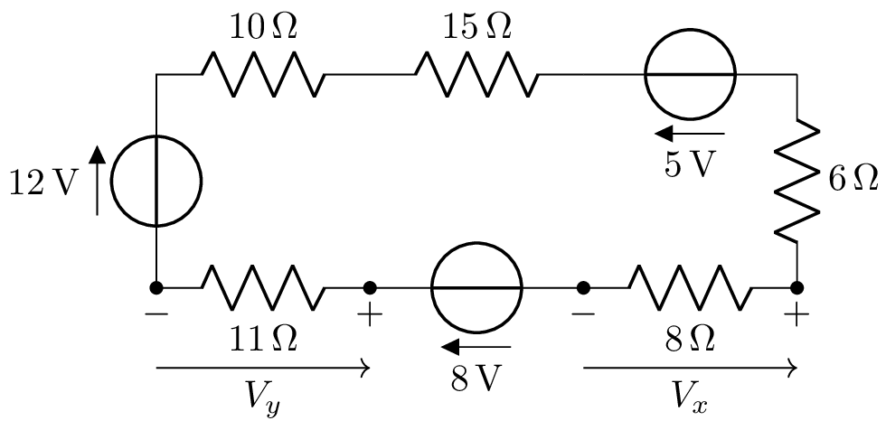 

</figure>

Applicando il secondo principio di Kirchhoff, si può esprimere questo circuito in una forma equivalente all’esterno come:

<figure>

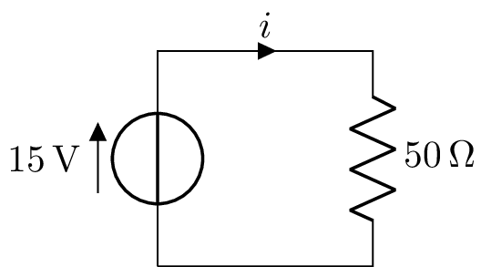 

</figure>

La corrente passante per il circuito è quindi semplicemente: $$\begin{gathered}
    i=\displaystyle\frac{15\,\mathrm{V}}{50\,\Omega}=\frac{3}{10}\,\mathrm{A}
\end{gathered}$$ Data la corrente passante per il circuito, le due tensioni possono essere calcolate facilmente come: $$\begin{gathered}
    V_x=8\,\Omega\cdot \displaystyle\frac{3}{10}\,\mathrm{A}=\frac{12}{5}\,\mathrm{V}\\
    V_y=11\,\Omega\cdot \displaystyle\frac{3}{10}\,\mathrm{A}=\frac{33}{10}\,\mathrm{V}
\end{gathered}$$ Questo corrisponde ad un’equazione di partitore, poiché la tensione $V_k$ assorbita della resistenza $k-$esima in una maglia dove sono presenti solo generatori di tensione e resistori in serie, equivale al rapporto tra il valore della resistenza $R_k$ e la somma delle resistenze $\sum R$, moltiplicato per la tensione globale del lato $E_g$: $$\begin{gathered}
    V_k=\displaystyle\frac{R_k}{\sum_{j=1}^n R_j}E_g
\end{gathered}$$

Come esiste il partitore di tensione, esiste il suo duale il partitore di corrente, dove tutti gli elementi, resistori e generatori di corrente, sono montati in parallelo:

<figure>

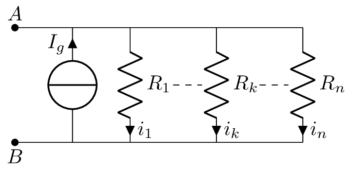 

</figure>

Se sono note tutte le conduttanze di lato, si può esprimere la corrente passante per una singola resistenza $k-$esima come: $$\begin{gathered}
    I_k=\displaystyle\frac{G_k}{\sum_{ij=1}^n G_j}I_g
\end{gathered}$$ Dove $I_g$ è la tensione globale di lato. Si può dimostrare facilmente tramite il metodo dei nodi, considerando il nodo $B$, il nodo di salto. Per cui si ha un’unica equazione: $$\begin{gathered}
    \begin{bmatrix}
        \displaystyle\sum_{j=1}^nG_j
    \end{bmatrix}[V_A]=[I_g]
\end{gathered}$$ Essendoci un’unica equazione la matrice ed i vettori diventano scalari. La tensione tra i due morsetti è quindi: $$\begin{gathered}
    V_A=\displaystyle\frac{I_g}{\sum_{j=1}^nG_j}
\end{gathered}$$ Nota la tensione, la corrente di lato di un $k-$esimo resistore è data da: $$\begin{gathered}
    I_k=G_kV_A=\displaystyle G_k\frac{I_g}{\sum_{ij=1}^n G_j}
\end{gathered}$$ Si è quindi dimostrata la formula del partitore di corrente.

## Generatori Controllati con Esempi Applicativi

Si definisce un tipo di generatori che vivono nella modellistica circuitale. Questi generatori pilotati cercano di emulare il comportamento di oggetti reali, ma essendo solamente un modello, non possono essere realizzati. Esprimono una grandezza, che può essere una tensione o una corrente. Possono essere controllati in corrente o in tensione o in entrambi, ma generalmente sono controllati rispetto ad un’unica grandezza. La grandezza che controlla il generatore si chiama pilota, per cui si indicano anche come generatori pilotati. Non sono quindi indipendenti.

I generatori non controllati, erogano una grandezza costante dovuta ad una trasformazione energetica. Questo oggetto è pilotato da una grandezza, per cui non può essere un bipolo, poiché è necessario un altro ingresso per la grandezza di controllo. La grandezza erogata dal generatore si rappresenta come una funzione, dipendente dalle grandezze di controllo, e presenta tante porte quante sono queste grandezze. Non si può dimostrare la passività di questi elementi, per cui si considerano come degli oggetti attivi. Se non fosse presente un elemento effettivamente indipendente che effettua una conversione energetica, questi elementi non producono energia propria, hanno la possibilità di diventare erogatori, ma sempre a spese di una fonte indipendente, non possono generare loro energia.

In forma circuitale, si rappresentano rispetto ad un insieme di grandezze di controllo $\overline{x}$,:

<figure id="fig:generatori-controllati">

  

<figcaption>Generatori Controllati</figcaption>
</figure>

Per risolvere reti dove sono presenti generatori controllati, in prima analisi vengono analizzati come fossero dei generatori indipendenti. Si considera un circuito dov’è presente un generatore controllato, il metodo risolutivo ottenuto da quest’analisi varrà per ogni rete dov’è presente un generatore pilotato:

<figure>

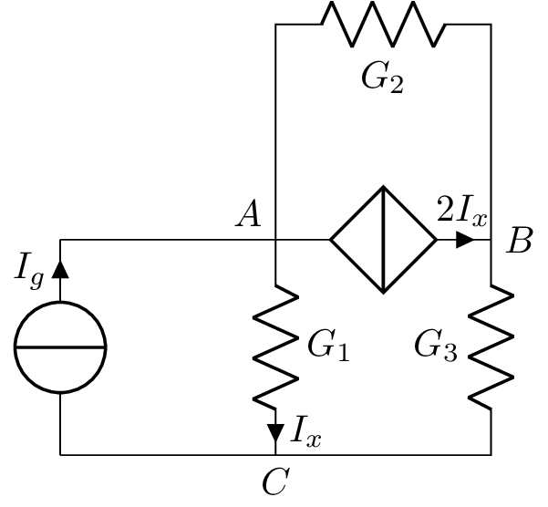 

</figure>

$$\begin{gathered}
    I_g=12\,\mathrm{A}\\
    R_1=28\,\Omega\\
    R_2=4\,\Omega\\
    R_3=8\,\Omega
\end{gathered}$$ Si analizza come se fosse un generatore indipendente, considerando il nodo $C$ il nodo di riferimento: $$\begin{gathered}
=\begin{bmatrix}
        G_1+G_2&-G_2\\
        -G_2&G_2+G_3
    \end{bmatrix}\\
    [I_\mathrm{no}]=\begin{bmatrix}
        I_g-2I_x\\
        2I_x
    \end{bmatrix}
\end{gathered}$$ Si inietta l’equazione di vincolo, fornita dal valore della grandezza che controlla il generatore di corrente, in questo caso la corrente: $$\begin{gathered}
    I_x=G_1V_A\\
    [I_\mathrm{no}]=\begin{bmatrix}
        I_g-2G_1V_A\\
        2G_1V_A
    \end{bmatrix}\\
    \begin{bmatrix}
        I_g-2G_1V_A\\
        2G_1V_A    
    \end{bmatrix}=
    \begin{bmatrix}
        I_g\\
        0
    \end{bmatrix}+\begin{bmatrix}
        -2G_1&0\\
        2G_1&0
    \end{bmatrix}\cdot\begin{bmatrix}
        V_A\\
        V_B
    \end{bmatrix}
\end{gathered}$$ I piloti delle grandezze di lato devono essere espressi in funzione dei potenziali nodali. $$\begin{gathered}
=\begin{bmatrix}
        -2G_1&0\\
        2G_1&0
    \end{bmatrix}\\
    [{\mathrm{coef.}}]=[G_\mathrm{no}]-[P]=\begin{bmatrix}
        3G_1+G_2&-G_2\\
        -G_2-2G_1&G_2+G_3
    \end{bmatrix}
\end{gathered}$$ L’equazione risolutiva della rete diventa: $$\begin{gathered}
=[\mathrm{coef.}]^{-1}\begin{bmatrix}
        I_g\\
        0
    \end{bmatrix}\\
    \begin{bmatrix}
        V_A\\
        V_B
    \end{bmatrix}=
    \begin{bmatrix}
        3G_1+G_2&-G_2\\
        -G_2-2G_1&G_2+G_3
    \end{bmatrix}^{-1}\begin{bmatrix}
        I_g\\
        0
    \end{bmatrix}
\end{gathered}$$ In generale per risolvere una rete controllata, bisogna analizzarla come fosse indipendente. Successivamente si esprimono le grandezze di controllo, nuove incognite. Per poter risolvere il sistema, si considerano equazioni banali o di vincolo, per poter diminuire il numero delle incognite totali del sistema, generalizzando il metodo dei nodi o delle maglie, e si sostituiscono nel sistema. Si esprime così un nuovo vettore delle incognite $[X]$, su cui si scrive una nuova matrice dei coefficienti $[\mathrm{coef.}]$ e si riportano oltre al vettore dei termini noti di partenza $[I_\mathrm{no}]$ o $[E_m]$, in base al metodo usato, le grandezze di vincolo note, tolte dal vettore delle incognite, $[X_\mathrm{no}]$. $$\begin{gathered}
=[I_\mathrm{no}/E_m]+[X_\mathrm{no}]
\end{gathered}$$ Si definisce così un nuovo vettore dei termini noti $[T_\mathrm{no}]$, per risolvere il sistema rispetto alle nuove grandezze: $$\begin{gathered}
=[I_\mathrm{no}/E_m]+[X_\mathrm{no}]\\
    [X]=[\mathrm{coef.}]^{-1}[T_\mathrm{no}]
\end{gathered}$$

## Teorema di Thevenin e Norton

Considerando la forma Thevenin, rappresentazione esterna equivalente di resistenze e generatori di tensione posti in serie, e la forma Norton, rappresentazione esterna equivalente di una serie di resistori e generatori di corrente posti in parallelo, e le regole di passaggio tra le due forme, si può descrivere una rappresentazione equivalente di un intero circuito. Per ottenere tale rappresentazione, si considera come fosse un bipolo, accessibile dall’esterno da soli due morsetti di accesso $A$ e $B$.

<figure>

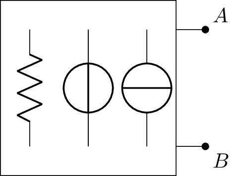 

</figure>

Se esistesse questa rappresentazione, tra i due morsetti sarebbe presente un unico lato, equivalente alla rete analizzata. Questo problema è stato risolto da Thevenin e Norton, basandosi sulle due forme duali omonime. Quindi anche le due dimostrazioni seguenti sono duali tra di loro.

Per dimostrare queste rappresentazioni bisogna riprendere il principio di sovrapposizione degli effetti dalla fisica, e dimostrarne la validità per alcune grandezze dei circuiti. Il principio afferma che se le cause di determinati effetti sono più di una, e se il sistema è lineare, allora l’effetto risultante può essere espresso come la combinazione lineare degli effetti di ogni singola causa, calcolata singolarmente. Bisogna quindi dimostrare che in un circuito le cause sono legate agli effetti da relazioni di proporzionalità lineare. Si dimostra questa proprietà dato il seguente circuito:

<figure>

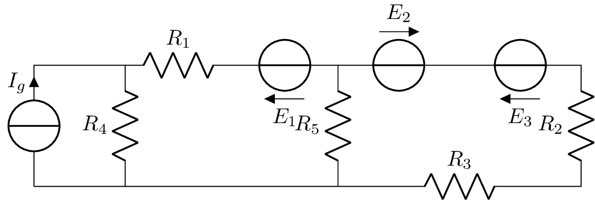 

</figure>

Si risolve mediante il metodo degli anelli, per cui si considera un unico lato i componenti in parallelo $R_4$ e $I_g$, trasformati in forma Norton. $$\begin{gathered}
    \left\{\begin{bmatrix}
        R_1+R_4+R_5&-R_5\\
        -R_5&R_2+R_3+R_5
    \end{bmatrix}\right\}^{-1}
            \begin{bmatrix}
                R_4Ig\\
                0
            \end{bmatrix}^{(1)}+
            \begin{bmatrix}
                -E_1\\
                0
            \end{bmatrix}^{(2)}+
            \begin{bmatrix}
                0\\
                E_2
            \end{bmatrix}^{(3)}+
            \begin{bmatrix}
                0\\
                -E_3
            \end{bmatrix}^{(4)}
    =\begin{bmatrix}
        I_{m_1}\\
        I_{m_2}
    \end{bmatrix}
\end{gathered}$$ Se ogni generatore è indipendente dagli altri allora si possono considerare quattro cause separate, oppure si possono considerare i generatori di tensione insieme tra di loro, oppure si possono considerare tutti insieme come unica causa. Per cui le cause non sono sempre dei singoli elementi, possono rappresentare invece degli insiemi.

Per cui ogni corrente di maglia avrà componenti che dipendono da ogni singola causa nel sistema, dato che il sistema di risoluzione è lineare rispetto alle cause, ovvero rispetto ai generatori di tensione o di corrente. Ciò vale poiché la corrente e la tensione sono due grandezze legate da una relazione lineare tra di loro. Infatti non si può applicare il principio di sovrapposizione degli effetti sulla potenza, poiché ha una relazione quadratica tra le grandezze. Ogni corrente di maglia $I_{m_k}$ si può esprime come: $$\begin{gathered}
    I_{m_k}=I_{m_k}^{(1)}+I_{m_k}^{(2)}+I_{m_k}^{(3)}+I_{m_k}^{(4)}
\end{gathered}$$ Dove il numero dei contributi corrisponde al numero delle cause individuate nel circuito.

Si dimostra il teorema di Thevenin dato il seguente circuito:

<figure>

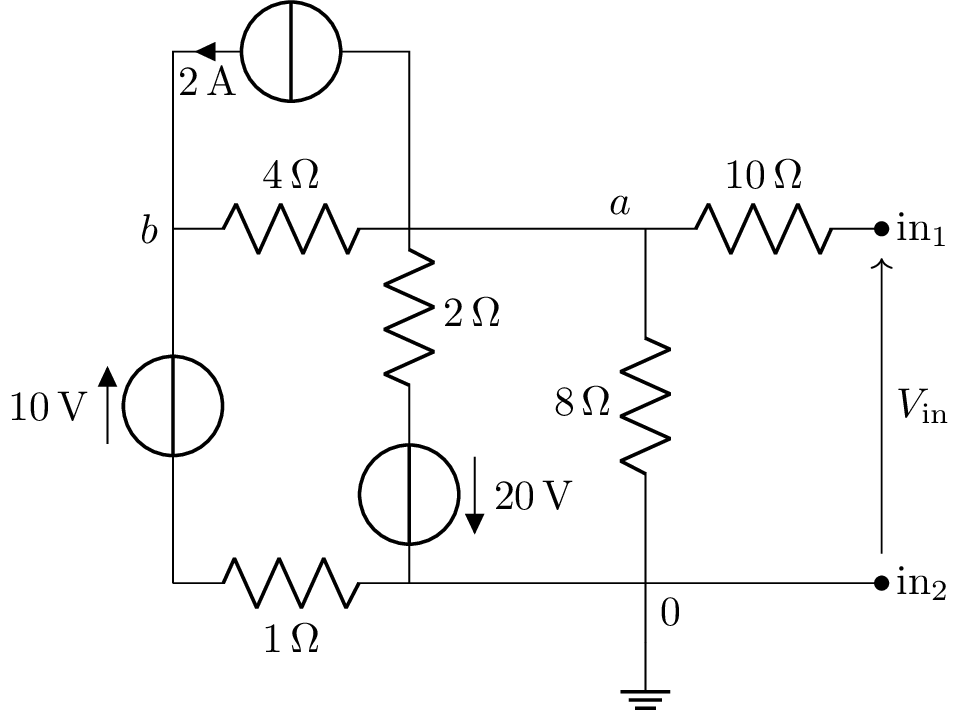 

</figure>

Si risolve tramite il metodo dei nodi, e si considera il nodo $0$ di potenziale nullo, ovvero a terra. Per cui si esprime il lato contenente un generatore di corrente nella forma Thevenin equivalente. La tensione tra i due morsetti $in_1$ e $in_2$ corrisponde al potenziale tra i due nodi $a$ e $o$ $V_{a0}$, poiché il resistore a valle di $in_1$ è un componente passivo. Fino a quando tra i due morsetti è presente il vuoto, quindi non passa corrente, il resistore presenta una tensione nulla, per cui non deve essere considerato nella matrice delle conduttanze di maglia: $$\begin{gathered}
    \begin{bmatrix}
        \displaystyle\frac{\strut 1}{\strut 4}+1&-\displaystyle\frac{\strut 1}{\strut 4}\\
        \displaystyle-\frac{\strut 1}{\strut 4}&\displaystyle\frac{\strut 1}{\strut 2}+\frac{\strut 1}{\strut 4}+\frac{\strut 1}{\strut 8}
    \end{bmatrix}\begin{bmatrix}
        V_b\\
        V_{a0}
    \end{bmatrix}=\begin{bmatrix}
        2+10\\
        -2-\displaystyle\frac{\strut 20}{\strut 2}
    \end{bmatrix}
\end{gathered}$$ Data una matrice di $[M]\in M(2,2,\mathbb{R})$, la sua inversa si calcola come: $$\begin{gathered}
=\begin{bmatrix}
        m_{11}&m_{12}\\
        m_{21}&m_{22}
    \end{bmatrix}\\
    [M]^{-1}=\displaystyle\frac{1}{\det\{[M]\}}\begin{bmatrix}
        m_{22}&-m_{12}\\
        -m_{21}&m_{11}
    \end{bmatrix}
\end{gathered}$$ Questo sistema quindi calcola il potenziale tra i due morsetti collegati a vuoto $V_\mathrm{in}=V_{a0}$, anche chiamata tensione a vuoto. Se fosse presente un generatore di tensione tra i due morsetti in entrata al circuito, di valore pari alla tensione a vuoto calcolata. Tra i due nodi $a$ e $0$ sarebbe presente un potenziale diverso $V_{ac}$, carico, poiché nell’autoconduttanza di $a$ compare il valore del resistore, che era precedentemente scarico, poiché non attraversato da una corrente:

<figure>

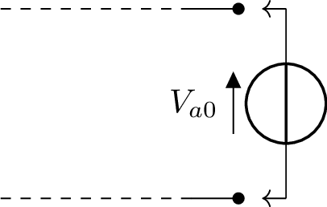 

</figure>

$$\begin{gathered}
    \begin{bmatrix}
        \displaystyle\frac{\strut 1}{\strut 4}+1&-\displaystyle\frac{\strut 1}{\strut 4}\\
        \displaystyle-\frac{\strut 1}{\strut 4}&\displaystyle\frac{\strut 1}{\strut 2}+\frac{\strut 1}{\strut 4}+\frac{\strut 1}{\strut 8}+\frac{\strut 1}{\strut 10}
    \end{bmatrix}\begin{bmatrix}
        V_b\\
        V_{ac}
    \end{bmatrix}=\begin{bmatrix}
        2+10\\
        -2-\displaystyle\frac{\strut 20}{\strut 2}+\frac{\strut V_{a0}}{\strut 10}
    \end{bmatrix}
\end{gathered}$$ Risolvendo questo sistema, si ottiene che la corrente a carico $V_{ac}$ è uguale alla tensione a vuoto, per cui non scorre all’esterno del circuito alcuna corrente. Quindi, se tutto il circuito viene considerato come un unico oggetto, da cui escono due morsetti, allora dall’esterno si può considerare l’intero circuito come un unico lato, rappresentabile in forma Thevenin. Poiché applicando la stessa tensione a vuoto in entrata ad una forma Thevenin, la corrente che attraversa il circuito è a sua volta nulla. Per cui la tensione necessaria affinché il lato Thevenin sia una rappresentazione equivalente dall’esterno dell’intero circuito deve essere pari alla tensione a vuoto tra i due morsetti.

<figure>

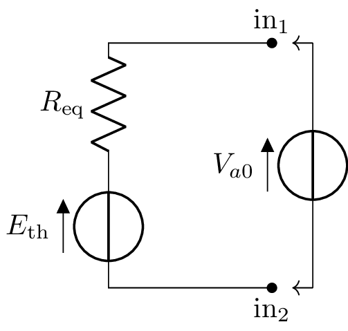 

</figure>

Segue il teorema di Thevenin:

> Una qualsiasi rete può essere rappresentata dall’esterno come un generatore di tensione che eroga una tensione pari alla tensione misurata a vuoto nel circuito, in serie con un resistore di resistenza, pari alla resistenza equivalente misurata nella rete resa passiva

Poiché la rete non è un oggetto passivo, per determinare la resistenza equivalente di Thevenin, la si rende passiva:

<figure>

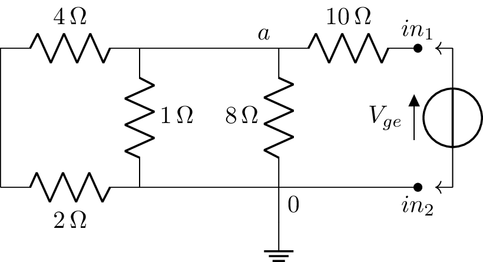 

</figure>

La resistenza Thevenin corrisponde alla resistenza equivalente, misurata dall’esterno, tra i due morsetti di ingresso della rete, quando esse viene resa passiva. Ovvero quando viene sostituito ai generatori di corrente il vuoto, ed ai generatori di tensione il cortocircuito. L’unico generatore rimasto, è un generatore di tensione esterno che eroga una tensione $V_{ge}$ nel circuito.

Per cui risolvendo tramite il metodo dei nodi, dopo aver eliminato il nodo $b$, ora solo di calcolo si ottiene la seguente equazione: $$\begin{gathered}
    \begin{bmatrix}
        \displaystyle\frac{\strut 1}{\strut 2}+\frac{\strut 1}{\strut 4}+\frac{\strut 1}{\strut 8}+\frac{\strut 1}{\strut 10}
    \end{bmatrix}\begin{bmatrix}
        V_{ge}
    \end{bmatrix}=\begin{bmatrix}
        I
    \end{bmatrix}
\end{gathered}$$ La risposta del circuito, reso passivo, rispetto ad una tensione $V_{ge}$ in entrata equivale a quella di un lato Thevenin, dove la matrice di conduttanza equivale alla conduttanza equivalente di Thevenin, misurata dall’esterno. La corrente ottenuta corrisponde alla corrente passante per il circuito quando i due morsetti sono collegati da un generatore di tensione esterno. Questo metodo di calcolo si chiama dell’ amperometro, richiede di rendere passiva la rete, per poi risolverla.

Alternativamente, invece di risolvere il circuito inserendo in entrata un generatore di tensione noto e fittizio, è possibile attuare diverse trasformazioni serie-parallelo fino ad arrivare ad un circuito equivalente composto di un singolo resistore collegato ai due morsetti. In questo modo si ottiene la stessa resistenza equivalente.

Se nella rete originaria sono presenti generatori pilotati, la rete diventa attiva. Rendendo passiva la rete, per misurata la resistenza equivalente, bisogna considerare che i generatori controllati si accendono in base ad altre grandezze dei lati della rete, e non possono essere quindi mai spenti. Allora non si può usufruire del metodo delle trasformazioni in serie ed in parallelo, poiché sono presenti elementi diversi dai resistori. L’unico metodo è quello dell’amperometro, inserendo un generatore noto e fittizio dall’esterno tra i due morsetti in entrata.

Se la rete è collegata ad un resistore esterno $R_5=5\,\Omega$, per estrarre potenza dalla rete, per determinare la corrente assorbita da quest’ultimo si considera la forma equivalente del circuito:

<figure>

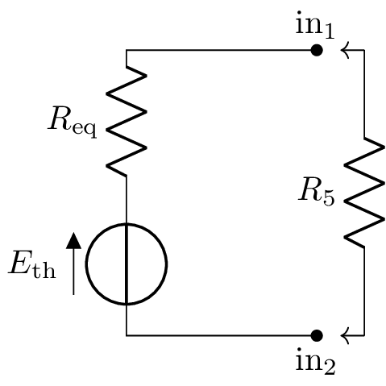 

</figure>

$$\begin{gathered}
    I=\displaystyle\frac{E_\mathrm{th}}{R_5+R_\mathrm{eq}}
\end{gathered}$$ Per verificare questa soluzione, si può risolvere il circuito considerando un resistore di resistenza $R_5=5\,\Omega$ tra i due morsetti, rispetto alla tensione nodale particolare $V_{ap}$. La corrente passante per il lato $R_5$, data la tensione ricavata da quest’equazione, corrisponde alla corrente calcolata studiando la rappresentazione equivalente esterna del circuito: $$\begin{gathered}
    \begin{bmatrix}
        \displaystyle\frac{\strut 1}{\strut 4}+1&-\displaystyle\frac{\strut 1}{\strut 4}\\
        \displaystyle-\frac{\strut 1}{\strut 4}&\displaystyle\frac{\strut 1}{\strut 2}+\frac{\strut 1}{\strut 4}+\frac{\strut 1}{\strut 8}+\frac{\strut 1}{\strut 15}
    \end{bmatrix}\begin{bmatrix}
        V_b\\
        V_{ap}
    \end{bmatrix}=\begin{bmatrix}
        2+10\\
        -2-\displaystyle\frac{\strut 20}{\strut 2}
    \end{bmatrix}
\end{gathered}$$

Per dimostrare la validità generale di questa situazione, si considera una rete generica con due morsetti di ingresso $A$ e $B$. Si inserisce tra i due morsetti $A$ e $B$ un resistore $R_C$. Si vuole calcolare la corrente $I_C$ assorbita dal resistore. Invece di inserire un cortocircuito, si inseriscono due generatori di tensione di polarità opposta, indipendenti ed esterni al circuito, in modo che la tensione generata complessivamente risulta nulla, analogamente all’inserimento di un cortocircuito. La tensione erogata corrisponde alla tensione misurata a vuota tra i due morsetti $V_{AB0}$:

<figure>

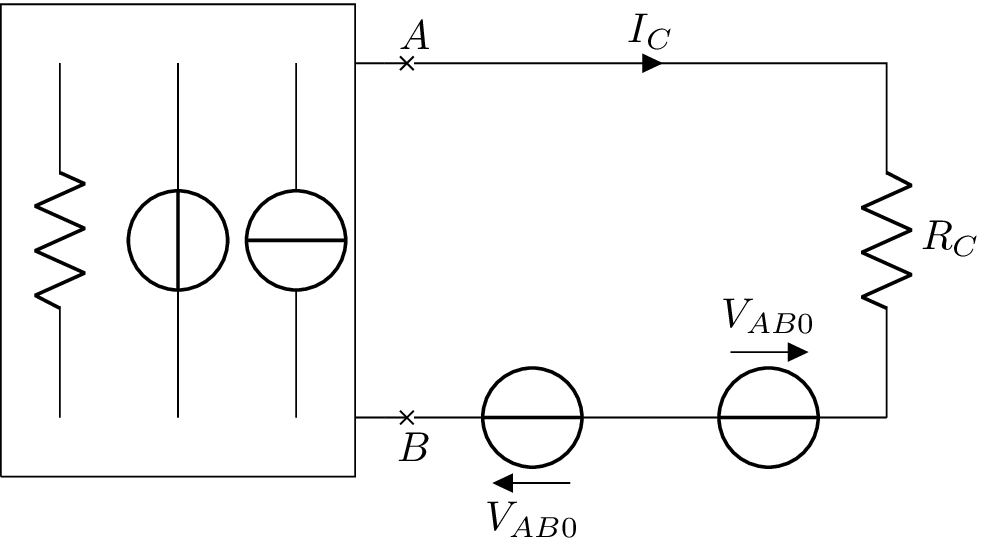 

</figure>

Per il principio di sovrapposizione degli effetti, è possibile la corrente assorbita $I_C$ rispetto a tutte le cause del sistema. Si individuano due cause diverse, una comprende l’intero circuito ed il generatore che eroga la tensione di polarità opposta rispetto alla corrente. Mentre l’altra causa corrisponde al solo generatore di tensione concorde alla corrente: $$\begin{gathered}
    I_C=I_C^{(1)}+I_C^{(2)}
\end{gathered}$$ Per misurare i singoli effetti si considera ogni causa da sola, per cui si rendono passivi tutti gli elementi delle altre cause. La prima causa corrisponde alla situazione di un circuito che presenta in entrata ai due morsetti la tensione misurata a vuoto $V_{AB0}$:

<figure id="fig:prima-causa-corrente-carico">
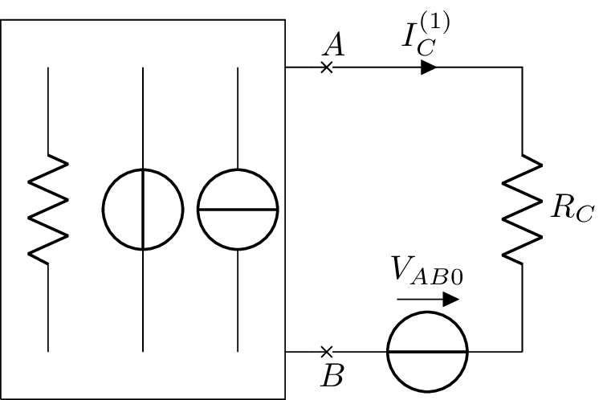
<figcaption>Effetto della Prima Causa</figcaption>
</figure>

Si è precedentemente dimostrato che se viene inserito una tensione pari alla tensione a vuoto tra i due morsetti $A$ e $B$, di polarità opposta, in un circuito qualsiasi, la corrente passante per quel circuito, data questa entrata, è nulla: $$\begin{gathered}
    I_C^{(1)}=\displaystyle\frac{E_\mathrm{th}-V_{AB0}}{R_\mathrm{eq}}=\frac{V_{AB0}-V_{AB0}}{R_\mathrm{eq}}=0
\end{gathered}$$

Per misurare l’effetto della seconda causa, si rende passiva la prima. Ci si trova quindi nella seguente situazione:

<figure id="fig:seconda-causa-corrente-carico">

<figcaption>Effetto della Seconda Causa</figcaption>
</figure>

Considerando la rappresentazione esterna di Thevenin della rete, la corrente derivante da questa causa si ottiene come: $$\begin{gathered}
    I_C^{(2)}=\displaystyle\frac{V_{AB0}}{R_\mathrm{eq}+R_{C}}
\end{gathered}$$ Per il principio di sovrapposizione degli effetti la corrente totale assorbita da un resistore $R_C$ inserito tra i due morsetti di un circuito è calcolabile come: $$\begin{gathered}
    I_C=I_C^{(1)}+I_C^{(2)}=\displaystyle\frac{V_{AB0}}{R_\mathrm{eq}+R_{C}}
\end{gathered}$$

Come già noto, la forma Thevenin è la duale della forma Norton, ed è possibile passare tra le due forme. Per cui è possibile, nota la rappresentazione Thevenin esterna di un circuito, passare ad una rappresentazione Norton esterna. Da notare che il processo per arrivare a questa forma Norton equivalente è indipendente dal processo dimostrato precedentemente per la rappresentazione Thevenin. Per calcolare la corrente erogata tra i due morsetti $I_\mathrm{no}$ invece del vuoto, bisogna inserire un cortocircuito tra i due. Mentre per misurare la resistenza equivalente $R_\mathrm{no}$, si rende passiva la rete, e si applicano trasformazioni in serie e parallelo, oppure tramite il metodo dell’amperometro. Quando sono presenti generatori pilotati nella rete, si applicano le stesse considerazioni per il calcolo nella forma Thevenin.

Questi due calcoli arrivano allo stesso risultato, per cui sono intercambiabili le due rappresentazioni Thevenin e Norton, secondo le formule di passaggio già note: $$\begin{gathered}
    R_\mathrm{th}=R_\mathrm{no}\\
    I_\mathrm{no}=\displaystyle\frac{E_\mathrm{th}}{R_\mathrm{th}}
\end{gathered}$$ Per cui un generico circuito:

<figure>

</figure>

Può essere espresso da queste due rappresentazioni:

<figure id="fig:rappresentazioni-equivalenti">

  

<figcaption>Rappresentazioni Equivalenti di una Rete Adinamica</figcaption>
</figure>

## Teorema del Massimo Trasferimento di Potenza

Si considera un generico circuito, espresso mediante la rappresentazione esterna equivalente di Thevenin, inserendo un resistore $R_M$ in entrata ai morsetti $A$ e $B$:

<figure>

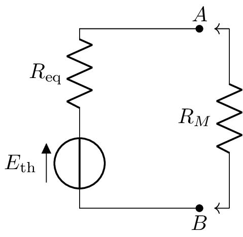 

</figure>

La tensione tra i due morsetti $A$ e $B$ si può calcolare tramite l’equazione per i partitori di tensione: $$\begin{gathered}
    V_{AB}=\displaystyle\frac{R_M}{R_\mathrm{eq}+R_M}E_\mathrm{th}
\end{gathered}$$ Per cui la potenza assorbita dal resistore in $R_M$ corrisponde a: $$\begin{gathered}
    P=R_M\displaystyle\frac{E_\mathrm{th}^2}{(R_\mathrm{th}+R_M)^2}
\end{gathered}$$ Per calcolare la potenza massima trasferibile da questo circuito, si considera la derivata della potenza in funzione della resistenza esterna: $$\begin{gathered}
    \displaystyle\frac{\mathrm{d}P}{\mathrm{d}R_M}=E_\mathrm{th}\frac{\mathrm{d}}{\mathrm{d}R_M}\left(\frac{1}{{R_\mathrm{th}^2}/{R_M}+2R_\mathrm{th}+R_M}\right)
\end{gathered}$$ Per trovare il massimo, bisogna trovare il valore minimo del denominatore, per cui, si deriva solo il denominatore della funzione potenza $P(R_M)$: $$\begin{gathered}
    \displaystyle\frac{\mathrm{d}}{\mathrm{d}R_M}\left(\frac{R_\mathrm{th}^2}{R_M}+2R_\mathrm{th}+R_M\right)=-\frac{R_\mathrm{th}^2}{R_M^2}+1=0\\
    R_M^2=R_\mathrm{th}^2,\,R>0\\
    R_M=R_\mathrm{th}\tag{\stepcounter{equation}\theequation}
\end{gathered}$$ Poiché il valore delle resistenza è sempre strettamente positivo. Per cui il valore della tensione tra i due morsetti in entrata risulta essere: $$\begin{gathered}
    V_{AB}=\displaystyle\frac{R_M}{R_M+R_M}E_\mathrm{th}=\frac{E_\mathrm{th}}{2}
\end{gathered}$$ Si vuole calcolare il rendimento di questo circuito. In generale il rendimento di un sistema è dato dal rapporto tra la potenza utile e la potenza totale del sistema. In questo caso la potenza utile, è la potenza assorbita dalla resistenza $R_M$, mentre la potenza totale è quella generata dal generatore $E_\mathrm{th}$: $$\begin{gathered}
    \eta=\displaystyle\frac{P_\mathrm{utile}}{P_\mathrm{tot}}=\frac{R_{M}I^2}{E_\mathrm{th}I}=\frac{1}{2}\frac{E_\mathrm{th}}{E_\mathrm{th}}=\frac{1}{2}
\end{gathered}$$ Erogando la massima potenza, il rendimento del circuito è la metà. Aumentando il numero di resistenza poste in parallelo in entrata al circuito, la tensione tra i morsetti comincia a diminuire sempre di più. Questo fenomeno si chiama caduta di tensione. La tensione diminuisce fino ad un valore tale che nessuno degli oggetti posti in parallelo sia in grado di assorbire corrente. Per cui anche la potenza, con il rendimento del sistema, diminuisce all’aumentare del numero degli oggetti inseriti in parallelo. I generatori indipendenti sono elementi a potenza infinita, non realizzabili in natura. Per cui per evitare il fenomeno del collasso della tensione, si investe nell’aggiunta di linee di trasferimento della tensione parallele, per diminuire la possibilità del collasso della tensione. Quando si raggiunge la potenza massima, un oggetto connesso alla griglia elettrica, richiede una tensione superiore al suo valore a regime per accendersi, e non avendo una tensione sufficiente dal sistema richiede una corrente maggiore. Ma richiedendo una corrente maggiore, la tensione del sistema diminuisce a sua volta. Questo processo individua il fenomeno del collasso di tensione. Per questo si opera sempre ad un livello di potenza molto lontano dalla potenza massima trasferibile.

# Reti Dinamiche

Si analizzano in questa sezione una serie di circuiti contenenti bipoli con memoria: condensatori ed induttori. Si risolveranno questo tipo di reti, distinguendo circuiti di primo e di secondo ordine. Si considerano parametri concentrati tempo invarianti, per cui le leggi costitutive di questi bipoli con memoria, duali tra di loro, sono: $$\begin{gathered}
    i=\displaystyle C\frac{\mathrm{d}v_C}{\mathrm{d}t}\\
    v=\displaystyle L\frac{\mathrm{d}i_L}{\mathrm{d}t}
\end{gathered}$$

## Circuiti del Primo ordine

### Circuito RC

Si considera una rete, alimentata da un generatore di tensione a corrente continua, posto a valle di un commutatore ideale. Questo commutatore è un oggetto che permette di alterare la struttura del circuito commutando, per chiudere o aprire il circuito. Si considera uno stato iniziale dove il commutatore è aperto, ed all’istante $t=0$, con tempo di commutazione nulla, il circuito si chiude, e comincia a fluire corrente. Tra i due morsetti legati dal commutatore è presente il vuoto prima della chiusura, ed il cortocircuito dopo la commutazione:

<figure>

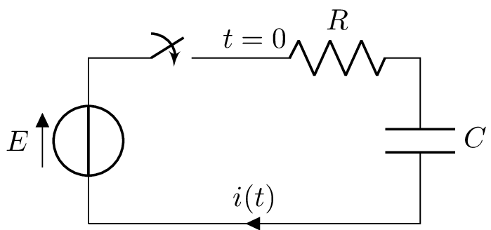 

</figure>

La tensione assorbita dal resistore e dal condensatore sono quindi due grandezze variabili nel tempo. Non fluisce corrente all’interno del circuito prima della commutazione, per cui la corrente è una grandezza variabile nel tempo: $$\begin{gathered}
    i(t)=\begin{cases}
        0&t\leq0^-\\
        i(t)&t>0^+
    \end{cases}
\end{gathered}$$ Per esprimere questo concetto, si considera nelle equazioni risolutive, la tensione generate come una funzione $e(t)$, che assume valore nullo per $t<0$, mentre un valore $E$ pari alla tensione erogata per $t>0$. Per rappresentare questa funzione si considera il segnale gradino unitario $u_{-1}(t)$, non si può parlare di funzione poiché presenta una discontinuità in $t=0$, per cui ci si riferisce a questo oggetto come una distribuzione: $$e(t)=Eu_{-1}(t)$$ Si considerano le tensioni del resistore e del condensatore di polarità opposta rispetto al generatore di tensione. Applicando il principio di Kirchhoff alle tensioni si ottiene la seguente equazione: $$\begin{gathered}
    e(t)=v_R(t)+v_C(t)
\end{gathered}$$ Si considera per ipotesi $t\geq0^+$, per non dover tenere conto gradino unitario. Si inseriscono le leggi costitutive dei bipoli, e si ottiene la seguente equazione differenziale di primo ordine: $$\begin{gathered}
    E=Ri+v_C\\
    E=RC\displaystyle\frac{\mathrm{d}v_C}{\mathrm{d}t}+v_C
\end{gathered}$$ La soluzione di questo tipo di equazione differenziale è formata da un combinazione lineare della soluzione o integrale generale, soluzione dell’equazione omogenea, e della soluzione o integrale particolare, dalla stessa classe di funzioni della forzante: $$v_C(t)=v_{Cg}(t)+v_{Cp}(t)$$ Si risolve l’equazione omogenea: $$\begin{gathered}
    RC\displaystyle\frac{\mathrm{d}v_C}{\mathrm{d}t}+v_C=0
\end{gathered}$$ Per risolvere un’equazione differenziale omogenea, lineare e di ordine $k$ a parametri costanti, si passa per il suo polinomio caratteristico associato. Questo polinomio si ottiene sostituendo ad ogni derivata $k-$esima una variabile di appoggio $\alpha$ elevata all’ordine della derivata $k$: $$\begin{gathered}
    \displaystyle a_k\frac{\mathrm{d}^ky}{\mathrm{d}t^k}+\cdots+a_1\frac{\mathrm{d}y}{\mathrm{d}t}+a_0y=0\\
    P_y(\alpha):a_k\alpha^k+\cdots+a_1\alpha^1+a_0\alpha^0=0
\end{gathered}$$ Le soluzioni dell’equazione differenziale appartengono alla classe di funzioni esponenziali, di argomento le radici del polinomio caratteristico: $$\begin{gathered}
    y_g=k_1e^{\alpha_1t}+\cdots+k_ne^{\alpha_nt}
\end{gathered}$$ Questo è il caso dove ogni radice ha molteplicità pari ad uno. Per ogni radice di molteplicità maggiore di $m(\alpha_i)>1$, la sua soluzione associata corrisponde a: $$\begin{gathered}
    \displaystyle\sum_{j=0}^{m(\alpha_i)}k_{i+j}t^ne^{\alpha_it}=k_ie^{\alpha_it}+\cdots+k_{i+m(\alpha_i)}t^{m(\alpha_i)}e^{\alpha_1t}
\end{gathered}$$ Quindi il polinomio caratteristico associato all’equazione di Kirchhoff del circuito, resa omogenea, corrisponde ad un’equazione lineare, con una sola radice: $$\begin{gathered}
    RC\alpha+1=0\\
    \alpha=\displaystyle-\frac{1}{RC}\\
    v_{Cg}(t)=k_1e^{-\frac{1}{RC}t}
\end{gathered}$$ L’integrale particolare tiene conto della forzante inserita nel sistema, ed appartiene alla sua stessa classe di funzioni, per la proprietà della similarità. In questo caso, la forzante è una costante, per cui l’integrale particolare è: $$\begin{gathered}
    v_{Cp}(t)=k_2
\end{gathered}$$ La soluzione completa è quindi data dalla somma di questi due integrali: $$\begin{gathered}
    v_C(t)=k_1e^{-\frac{1}{RC}t}+k_2
\end{gathered}$$ Per trovare le costanti $k_1$ e $k_2$, si considera il problema di Cauchy, con le equazioni di vincolo fornite dal sistema. La carica del condensatore in $t=0^-$ è nota, per cui si può esprimere rispetto alle due costanti. La tensione erogata dal generatore, per tempi tendenti asintoticamente all’infinito, sarà assorbita completamente dal condensatore. Le equazioni di vincolo sono quindi: $$\begin{gathered}
    \begin{cases}
        v_C(0^-)=k_1+k_2\\
        \displaystyle\lim_{t\to+\infty}v_C(t)=E=k_2
    \end{cases}\\
    \begin{bmatrix}
        1&1\\0&1
    \end{bmatrix}\begin{bmatrix}
        k_1\\k_2
    \end{bmatrix}=\begin{bmatrix}
        v_C(0^-)\\E
    \end{bmatrix}\\
    \begin{cases}
        k_1=v_C(0^-)-E\\
        k_2=E
    \end{cases}\\
    \begin{cases}
        v_C(t)=(v_C(0^-)-E)e^{-\frac{1}{RC}t}+E&t\geq0^+\\
        i(t)=-\displaystyle\frac{1}{R}(v_C(0^-)-E)e^{-\frac{1}{RC}t} &t\geq0^+
    \end{cases}\tag{\stepcounter{equation}\theequation}
\end{gathered}$$ Il condensatore si carica, quando la sua tensione al tempo $t=0^-$ è minore della tensione erogata dal generatore, mentre si scarica quando la sua tensione è maggiore della tensione erogata dal generatore: $$\begin{gathered}
    \mbox{carica: }|v_C(0^-)|<|E|\\
    \mbox{scarica: }|v_C(0^-)|>|E|
\end{gathered}$$

Si considera una carica semplice con $v_C(0^-)=0$, per cui le funzioni della tensione e della corrente diventano: $$\begin{gathered}
    v_C(t)=E\left(1-e^{-\frac{1}{RC}t}\right)u_{-1}(t)\\
    i(t)=\displaystyle\frac{E}{R}e^{-\frac{1}{RC}t}
\end{gathered}$$

L’argomento dell’esponenziale deve essere una grandezza adimensionale, per cui si effettua un’analisi della grandezza fisica di $RC$: $$\begin{gathered}
=\displaystyle\frac{\mathrm{V}}{\mathrm{A}}\\
    [C]=\displaystyle\frac{\mathrm{A}\cdot \mathrm{s}}{\mathrm{V}}\\
    [R\cdot C]=\displaystyle\frac{\mathrm{V}}{\mathrm{A}}\cdot\frac{\mathrm{A}\cdot \mathrm{s}}{\mathrm{V}}=\mathrm{s}\\
    \left[\displaystyle\frac{t}{RC}\right]=1  
\end{gathered}$$ Si è verificato che la grandezza $RC$ è un tempo. Si definisce questa grandezza il tempo caratteristico $\tau$: $$\begin{gathered}
    \tau=RC
\end{gathered}$$

Rappresentando l’andamento rispetto al tempo della tensione e la corrente del circuito si può osservare l’importanza di questo tempo caratteristico. La retta tangente alla tensione $v_C$ in $t=0$ interseca l’asintoto orizzontale $E$ in $t=\tau$, allo stesso modo la retta passante per $i(0)$ ed il tempo caratteristico $\tau$ risulta essere tangente alla funzione della corrente nel tempo.

<figure id="fig:andamento-rc">
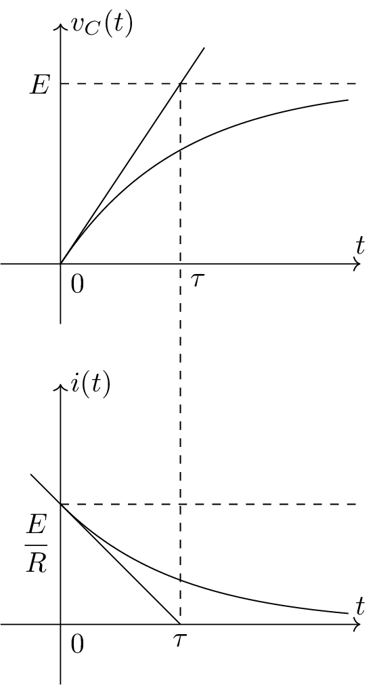
<figcaption>Andamento delle Grandezze di un Circuito RC nel Tempo</figcaption>
</figure>

Si dimostra che l’intersezione tra la retta tangente a $v_C(0)$ e l’asintoto $E$ corrisponde esattamente al tempo caratteristico $\tau$: $$\begin{gathered}
    mt^*=E\\
    m=\displaystyle\frac{\mathrm{d}v_C}{\mathrm{d}t}\\
    \displaystyle\frac{\mathrm{d}}{\mathrm{d}t}\left[E\left(1-e^{-\frac{1}{RC}t}\right)\right]t^*=E\\
    \displaystyle\frac{E}{RC}e^{-\frac{1}{RC}0}t^*=E\\
    t^*=RC=\tau
\end{gathered}$$

Si nota come questo modella presenta un paradosso. Poiché la corrente presenta una discontinuità in $t=0$. Ma rappresenta una grandezza continua, per cui questo modello presenta delle limitazioni nella sua descrizione di un circuito reale. Le grandezze descritte seguono l’andamento così definito, solo se non si trovano nell’intorno di $t=0$. Nell’analisi fisica lo stato si conserva, mentre nei modelli circuitali, approssimazioni dei fenomeni fisici, è presente una discontinuità. Per risolvere questo errore, si considereranno circuiti di ordine superiore, che mantengono la continuità per tutte le grandezze trattate.

### Circuito RL

Il duale della carica o scarica di un condensatore, è il caso della carica o scarica dell’induttore. In questo caso poiché è presente un generatore di corrente, e non può essere inserito a vuoto, il commutatore crea due circuiti chiusi, in modo che il generatore di corrente non sia mai collegato a vuoto:

<figure>

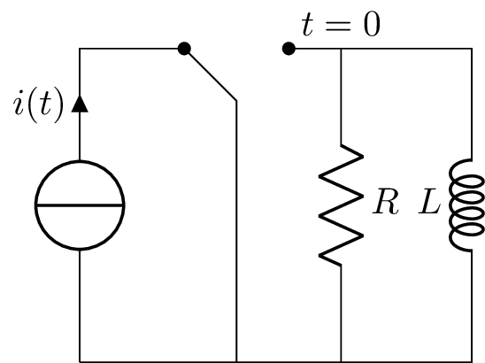 

</figure>

Sarebbe stata una situazione di paradosso collegare il generatore di corrente al vuoto. Si considera il generatore di corrente continua, e per il principio di Kirchhoff alle correnti si ottiene la seguente equazione: $$\begin{gathered}
    i(t)-Gv(t)-i_L(t)=0
\end{gathered}$$ Si considera la legge costitutiva dell’induttore: $$\begin{gathered}
    v=L\displaystyle\frac{\mathrm{d}i_L(t)}{\mathrm{d}t}\\
    i(t)=GL\displaystyle\frac{\mathrm{d}i_L(t)}{\mathrm{d}t}+i_L(t)
\end{gathered}$$ Si considera il commutatore ideale, di tempo di commutazione istantaneo in $t=0$, per cui la corrente passante erogata corrisponde a: $$\begin{gathered}
    i(t)=Iu_{-1}(t)
\end{gathered}$$ Si omette il gradino, considerando tutte le successive analisi per $t\geq0^+$. Si risolve analogamente alla scarica e carica di un condensatore, poiché sono due situazioni completamente duali: $$\begin{gathered}
    GL\displaystyle\frac{\mathrm{d}i_L}{\mathrm{d}t}+i_L=I\\
    P_{i_L}(\alpha):GL\alpha+1=0\\
    \alpha=\displaystyle-\frac{1}{GL}\\
    i_{Lg}(t)=k_1e^{-\frac{1}{GL}t}\\
    i_{Lp}(t)=k_2
\end{gathered}$$ La soluzione totale è quindi: $$\begin{gathered}
    i_L(t)=k_1e^{-\frac{1}{GL}t}+k_2
\end{gathered}$$ Si inseriscono le equazioni del vincolo di questo problema di Cauchy, ovvero la memoria dell’induttore, ed il caso per il tempo tendente asintoticamente all’infinito, dove tutta la corrente erogata dal generatore si trova nell’induttore: $$\begin{gathered}
    \begin{cases}
        i_L(0^-)=k_1+k_2\\
        \displaystyle\lim_{t\to\infty}i_L(t)=I=k_2
    \end{cases}\\
    \begin{bmatrix}
        1&1\\0&1
    \end{bmatrix}\begin{bmatrix}
        k_1\\k_2
    \end{bmatrix}=\begin{bmatrix}
        i_L(0^-)\\E
    \end{bmatrix}\\
    \begin{cases}
        k_1=i_L(0^-)-I\\
        k_2=I
    \end{cases}
\end{gathered}$$ Le funzioni della tensione e della corrente nel tempo sono quindi $$\begin{gathered}
    \begin{cases}
        i_L(t)=(i_L(0^-)-I)e^{-\frac{1}{GL}t}+I\\
        v(t)=\displaystyle-\frac{1}{G}\cancel{\frac{L}{L}}(i_L(0^-)-I)e^{-\frac{1}{GL}t}
    \end{cases}
\end{gathered}$$ Per cui si individuano le due situazioni di carica e scarica dell’induttore: $$\begin{gathered}
    \mbox{carica: }|i_L(0^-)|<|I|\\
    \mbox{scarica: }|i_L(0^-)|>|I|
\end{gathered}$$ Si considera una situazione di semplice carica, dove la memoria è nulla $i_L(0^-)=0$. In questo caso si ottengono quindi le seguenti equazioni per la carica di un induttore scarico: $$\begin{gathered}
    i_L(t)=I\left(1-e^{-\frac{1}{GL}T}\right)\\
    v_L(t)=\displaystyle\frac{I}{G}e^{-\frac{1}{GL}t}
\end{gathered}$$ I grafici della corrente e della tensione nel tempo sono quindi duali a quelli di un condensatore, quindi il tempo caratteristico del sistema è dato da: $$\begin{gathered}
    \tau=GL
\end{gathered}$$ Viene qui rappresentato l’andamento delle grandezze nel tempo, in un caso di semplice carica di un induttore:

<figure id="fig:andamento-circuito-rl">
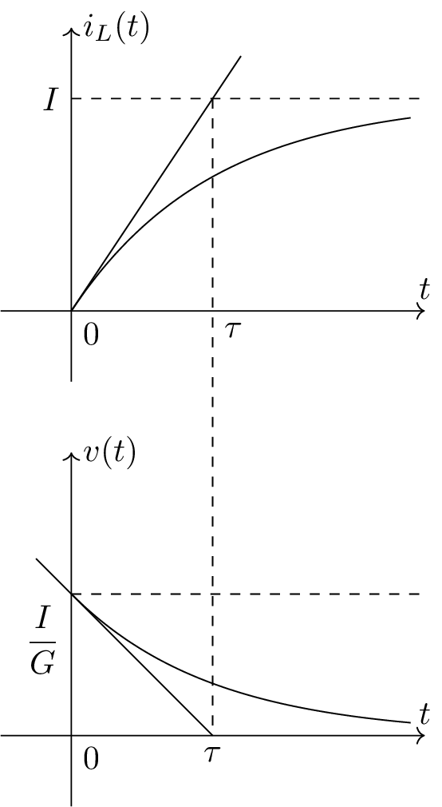
<figcaption>Andamento delle Grandezze di un Circuito RL nel Tempo</figcaption>
</figure>

La tensione è una variabile di stato per il condensatore, poiché il suo valore rimane uguale per $0^{\pm}$, mentre la corrente presenta una discontinuità in $t=0$. I circuiti del primo ordine descrivono i fenomeni adeguatamente per istanti di tempo lontani del tempo di commutazione. Analogamente per l’induttore, invertendo la corrente e la tensione, poiché sono due oggetti duali. Sperimentalmente il comportamento di un circuito reale di carica o scarica di un condensatore o un induttore è molto simile all’andamento approssimato di un circuito di primo ordine. Per modellare l’andamento di un circuito reale nell’intorno di $t=0$ si considerano circuiti del secondo ordine.

## Circuiti del Secondo Ordine

### Fasori

Si considera ora una forzante sinusoidale, e per rappresentarla si adopera una rappresentazione tramite i numeri complessi. In elettrotecnica si lavora con numeri complessi, per facilitare l’analisi di circuiti di ordine superiore al primo. Si vuole ricavare la rappresentazione esponenziale della formula di Eulero. Dato un numero complesso $z$, si considera la sua derivata e si moltiplicano entrambi i lati per l’unità immaginaria: $$\begin{gathered}
    z=|z|(\cos\theta+j\sin\theta)\in\mathbb{C}\\
    \displaystyle\frac{\mathrm{d}z}{\mathrm{d}\theta}=|z|(-\sin\theta+j\cos\theta)\\
    jz=j|z|(\cos\theta+j\sin\theta)=|z|(-\sin\theta+j\cos\theta)\\
    \displaystyle\frac{\mathrm{d}z}{\mathrm{d}\theta}=jz
\end{gathered}$$ Si integra per separazione delle variabili, e si semplifica $z$, ottenendo la rappresentazione di Eulero dell’esponenziale: $$\begin{gathered}
    \displaystyle\int_{z(0)}^{z(\theta)}\frac{\mathrm{d}z}{z}=\int_{0}^{\theta}j\mathrm{d}\theta\\
    \ln\left(\displaystyle\frac{z(\theta)}{|z|}\right)=j\theta\\
    \displaystyle\frac{z(\theta)}{|z|}=e^{j\theta}\\
    z(\theta)=|z|e^{j\theta}\\
    z=|z|(\cos\theta+j\sin\theta)=|z|e^{j\theta}\\
    \cos\theta+j\sin\theta=e^{j\theta}\\
    \cos\theta=\displaystyle\frac{e^{j\theta}+e^{-j\theta}}{2}\\
    \sin\theta=\displaystyle\frac{e^{j\theta}-e^{-j\theta}}{2j}
\end{gathered}$$

Si considerano forzanti sinusoidali. L’uso della funzione seno o coseno è indipendente poiché rappresentano la stessa funzione, di fase differente. Si definisce $E_m$ il valore massimo della forzante. $$\begin{gathered}
    e(t)=E_m\sin(\omega t+\alpha)=\displaystyle\frac{E_m}{2j}\left[e^{j(\omega t+\alpha)}-e^{-j(\omega t +\alpha)}\right]\\
    e(t)=\displaystyle\frac{E_m}{2j}\left[e^{j\omega t}e^{j\alpha}-e^{-j\omega t}e^{-j\alpha}\right]
\end{gathered}$$ Si definisce il fasore, in elettrotecnica, della data forzante, come il numero complesso: $$\begin{gathered}
    \overline{E}=\displaystyle\frac{E_m}{2j}e^{j\alpha}
\end{gathered}$$ In elettronica si definisce come: $$\begin{gathered}
    \overline{E}'=\displaystyle\frac{E_m}{\sqrt2}e^{j\alpha}
\end{gathered}$$ Tramite il fasore si può esprimere la forzante sinusoidale come una combinazione lineare di esponenziali moltiplicati per coefficienti complessi: $$\begin{gathered}
    E_m\sin(\omega t+\alpha)=\overline{E}e^{j\omega t}-\overline{E}^*e^{-j\omega t}
\end{gathered}$$ In questo modo si può compattare l’informazione contenuta nella sinusoide, nel fasore $\overline{E}$, la fase $\alpha$ e la pulsazione $\omega$. In questo modo si lavora nel dominio complesso dei fasori.

### Circuito RLC Serie

Si considera una rete composta da un resistore $R$, un induttore $L$, ed un condensatore $C$, alimentati alla chiusura di un commutatore in $t=0$, da un generatore di tensione che eroga una tensione $E$.

<figure>

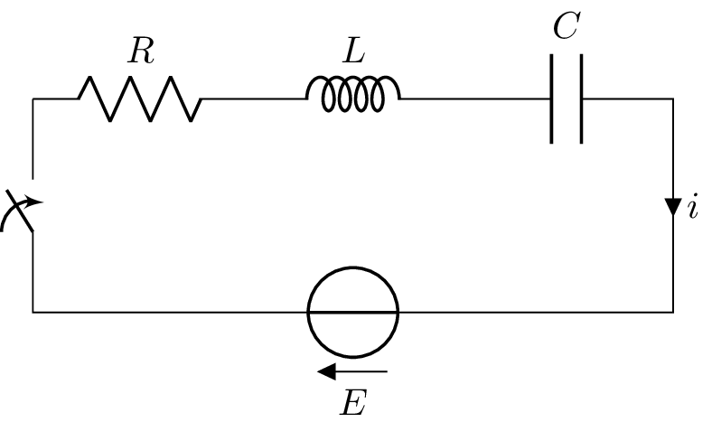 

</figure>

Entrambe le grandezze hanno memoria per $t=0^-$, ovvero prima della chiusura del circuito, ed assumono valori noti: $$\begin{gathered}
    v_C(0^-)\\
    i_L(0^-)
\end{gathered}$$ Essendo presente un’unica maglia, si può applicare direttamente il principio di Kirchhoff alle tensioni, considerando le leggi costitutive dei bipoli inseriti in serie: $$\begin{gathered}
    Eu_{-1}(t)=Ri(t)+\displaystyle L\frac{\mathrm{d}i(t)}{\mathrm{d}t}+v_C(t)\\
    i=\displaystyle C\frac{\mathrm{d}v_C}{\mathrm{d}t}\\
    E=RC\displaystyle\frac{\mathrm{d}v_C}{\mathrm{d}t}+LC\frac{\mathrm{d}^2v_C}{\mathrm{d}t^2}+v_C
\end{gathered}$$ L’aggiunta di un elemento con memoria corrisponde ad un aumento dell’ordine dell’equazione differenziale del sistema. Per calcolare la soluzione $v_C(t)$, si considera prima l’integrale generale $v_{Cg}(t)$, esprimendo l’equazione omogenea associata. In seguito tramite la variabile ausiliaria $\alpha$, si esprime l’equazione caratteristica: $$\begin{gathered}
    LC\frac{\mathrm{d}^2v_C}{\mathrm{d}t^2}+RC\displaystyle\frac{\mathrm{d}v_C}{\mathrm{d}t}+v_C=0\\
    LC\alpha^2+RC\alpha+1=0\\
    \alpha_{1,2}=\displaystyle-\frac{R}{2L}\pm\sqrt{\left(\frac{R}{2L}\right)^2-\frac{1}{LC}}\\
    \Delta=\displaystyle\left(\frac{R}{2L}\right)^2-\frac{1}{LC}\\
    \sigma=\displaystyle-\frac{R}{2L}
\end{gathered}$$ Si individuano $4$ possibili casi, in base al discriminante $\Delta$: $$\begin{gathered}
    \begin{cases}
        \alpha_1\neq\alpha_2\in\mathbb{R}^-&\Delta>0\\
        \alpha_1=\alpha_2^*=\sigma\pm j\omega\in\mathbb{C}&\Delta<0\\
        \alpha_1=\alpha_2\in\mathbb{R}&\Delta=0\to R=2\displaystyle\sqrt{\frac{L}{C}}\\
        \alpha_1=\alpha_2^*\in\mathbb{I}&R=0
    \end{cases}
\end{gathered}$$ Non è possibile realizzare il caso dove $\Delta=0$, poiché non si può conoscere alla perfezione il valore delle grandezze degli oggetti. Sono sempre noti con un certo errore, rappresenta quindi un caso limite. Quando la resistenza è nulla, le soluzioni del polinomio caratteristico sono puramente immaginarie, per cui le soluzioni dell’equazione differenziale sono delle sinusoidi pure. Le grandezze quindi oscillano. Al contrario del caso precedente, è possibile trovarsi in un caso dove la resistenza equivalente è nulla, compensando la resistenza. In questo modo si crea un oscillatore, poiché è sempre presenta un errore di eccesso o di difetto nella sua correzione.

Si definisce la pulsazione $\omega$: $$\begin{gathered}
    \omega=\displaystyle\frac{1}{\sqrt{LC}}
\end{gathered}$$ Inoltre si definisce la pulsazione caratteristica: $$\begin{gathered}
    \omega_C=\sqrt{|\Delta|}
\end{gathered}$$ Si definisce la resistenza critica $R_{\mathrm{cr}}$, per cui $\Delta=0$: $$\begin{gathered}
    R_{\mathrm{cr}}=2\displaystyle\sqrt{\frac{L}{C}}
\end{gathered}$$

### Caso Sovrasmorzato

Nel primo caso si considera come primo caso un resistore di resistenza $R_1>R_{\mathrm{cr}}$, valore ipercritico. In questo caso le radici $\alpha_{1,2}$ sono reali e negative, l’integrale generale risulta essere: $$\begin{gathered}
    v_{Cg}(t)=k_1e^{\alpha_1t}+k_2e^{\alpha_2t}
\end{gathered}$$ Mentre per la proprietà di similarità la soluzione particolare è della stessa classe della forzante, in questo caso continua: $$\begin{gathered}
    v_{Cp}(t)=k_3
\end{gathered}$$ La soluzione totale è quindi: $$\begin{gathered}
    v_C(t)=k_1e^{\alpha_1t}+k_2e^{\alpha_2t}+k_3\\
    i(t)=Ck_1\alpha_1e^{\alpha_1t}+Ck_2\alpha_2e^{\alpha_2t}
\end{gathered}$$ Si esprimono le equazioni di vincolo del problema di Cauchy. Per il tempo tendente asintoticamente all’infinito, la corrente è nulla, e la carica è presente interamente nel condensatore. Per cui la tensione del condensatore in questa situazione è pari alla tensione erogata dal generatore: $$\begin{gathered}
    \lim_{t\to\infty}i(t)=0\rightarrow \lim_{t\to\infty}v_C(t)=k_3=E
\end{gathered}$$ Noti i valori della memoria si possono definire le equazioni di vincolo: $$\begin{gathered}
    v_C(0^-)-E=k_1+k_2\\
    i(0^-)=C\alpha_1k_1+C\alpha_2k_2\\
    \begin{bmatrix}
        k_1\\k_2
    \end{bmatrix}=\begin{bmatrix}
        1&1\\\alpha_1C&\alpha_2C
    \end{bmatrix}^{-1}\begin{bmatrix}
        v_C(0^-)-E\\i(0^-)
    \end{bmatrix}
\end{gathered}$$ Essendo una matrice quadrata di ordine $2$, si può calcolare facilmente la sua inversa: $$\begin{gathered}
    \begin{bmatrix}
        k_1\\k_2
    \end{bmatrix}=\displaystyle\frac{1}{(\alpha_2-\alpha_1)C}\begin{bmatrix}
        \alpha_2C&-1\\-\alpha_1C&1
    \end{bmatrix}\begin{bmatrix}
        v_C(0^-)-E\\i(0^-)
    \end{bmatrix}
\end{gathered}$$ Si considerano $\alpha_{1,2}=\sigma\pm\sqrt\Delta$, l’equazione allora diventa: $$\begin{gathered}
    \begin{bmatrix}
        k_1\\k_2
    \end{bmatrix}=\displaystyle-\frac{1}{2\sqrt{\Delta} C}\begin{bmatrix}
        \alpha_2C&-1\\-\alpha_1C&1
    \end{bmatrix}\begin{bmatrix}
        v_C(0^-)-E\\i(0^-)
    \end{bmatrix}\\
    \begin{cases}
        k_1=\displaystyle-\frac{\strut 1}{\strut 2\sqrt{\Delta} C}\{\alpha_2C[v_C(0^-)-E]-i(0^-)\}\\
        k_2=\displaystyle-\frac{\strut 1}{\strut 2\sqrt{\Delta} C}\{-\alpha_1C[v_C(0^-)-E]+i(0^-)\}
    \end{cases}
\end{gathered}$$

Poiché non sono presenti oscillazioni che cambiano il segno delle grandezze, il caso si chiama sovrasmorzato.

### Caso Sottosmorzato

Considerando un valore di resistenza $R_2<R_{\mathrm{cr}}$, valore subcritico, le radici $\alpha_{1,2}$ sono complesse, così come le costanti $k_1$ e $k_2$. Queste costanti sono anch’essi complessi e coniugati $k_1=k_2^*$. Per dimostrare che sono coniugati, in ogni caso simile: $$\begin{gathered}
    \begin{cases}
        v_C(0^-)-E=k_1+k_2\\
        i(0^-)=C\alpha_1k_1+C\alpha_2k_2
    \end{cases}\\
    \begin{bmatrix}
        k_1\\k_2
    \end{bmatrix}=
    \begin{bmatrix}
        1&1\\\alpha_1C&\alpha_2C 
    \end{bmatrix}^{-1}
    \begin{bmatrix}
        v_C(0^-)-E\\i(0^-)
    \end{bmatrix}\\
    \begin{bmatrix}
        k_1\\k_2
    \end{bmatrix}=\displaystyle-\frac{1}{2j\omega_CC}
    \begin{bmatrix}
        \alpha_1C&-1\\-\alpha_2C&1
    \end{bmatrix}
    \begin{bmatrix}
        v_C(0^-)-E\\i(0^-)
    \end{bmatrix}\\
    \begin{cases}
        k_1=\displaystyle-\frac{\strut 1}{\strut 2j\omega_C C}\{\alpha_2C[v_C(0^-)-E]-i(0^-)\}\\
        k_2=\displaystyle-\frac{\strut 1}{\strut 2j\omega_C C}\{-\alpha_1C[v_C(0^-)-E]+i(0^-)\}
    \end{cases}\\
    \begin{cases}
        k_1=j\left(\displaystyle\frac{\strut \alpha_1^*}{\strut 2\omega_C}[v_C(0^-)-E]-\frac{i(0^-)}{2\omega_CC}\right)\\
        k_2=j\left(\displaystyle-\frac{\strut \alpha_1}{\strut 2\omega_C}[v_C(0^-)-E]+\frac{i(0^-)}{2\omega_CC}\right)
    \end{cases}\implies k_1=k_2^*
\end{gathered}$$ Si esprimono le costanti tramite la rappresentazione di Eulero, in modo da poter scrivere la tensione in funzione del tempo come una combinazione lineare di esponenziali complessi: $$\begin{gathered}
    k_1=|k_1|e^{-j\gamma}\land k_2=|k_1|e^{j\gamma}\\
    \alpha_1=\sigma+j\omega_C=\alpha_2^*\tag{\stepcounter{equation}\theequation}\\
    v_C(t)=k_1e^{\alpha_1t}+k_2e^{\alpha_2t}+E\\
    v_C(t)=|k_1|\left[e^{-(\sigma+j\omega_C)t}te^{j\gamma}+e^{(\sigma-j\omega_C)t}e^{-j\gamma}\right]+E\\
    v_C(t)=|k_1|\left[e^{\sigma t}e^{j(\omega_Ct+\gamma)}+e^{\sigma t}e^{-j(\omega_Ct+\gamma)}\right]+E\\
    v_C(t)=|k_1|e^{\sigma t}\left[e^{j(\omega_Ct+\gamma)}+e^{-j(\omega_Ct+\gamma)}\right]+E\\
    v_C(t)=2|k_1|e^{\sigma t}\cos(\omega_Ct+\gamma)+E\tag{\stepcounter{equation}\theequation}
\end{gathered}$$ Poiché $\sigma<0$, l’ampiezza dell’oscillazione della sinusoide diminuisce nel tempo, quindi è un oscillatorio smorzato. Questo caso si identifica come sottosmorzato.

### Caso Critico

Il terzo caso per $R=R_{\mathrm{cr}}$, corrisponde a delle radici del polinomio caratteristico uguali $\alpha_1=\alpha_2$. Rappresenta un caso di confine tra il caso sovrasmorzato ed il caso sottosmorzato. La radice $\alpha_1$, ha molteplicità $2$, per cui la soluzione dell’equazione differenziale è della forma: $$\begin{gathered}
    \alpha_1=\alpha_2=\displaystyle-\frac{R}{2L}\\
    v_{Cg}(t)=k_1te^{\alpha_1t}+k_2e^{\alpha_1t}\tag{\stepcounter{equation}\theequation}
\end{gathered}$$ La soluzione totale corrisponde a: $$\begin{gathered}
    v_C(t)=k_1te^{\alpha_1t}+k_2e^{\alpha_1t}+E\\
    i(t)=C\left[k_1(e^{\alpha_1t}+\alpha_1te^{\alpha_1t})+k_2\alpha_1e^{\alpha_1t}\right]
\end{gathered}$$ Mentre le costanti $k_1$ e $k_2$ sono: $$\begin{gathered}
    \begin{cases}
        v_C(0^-)-E=k_2\\
        i(0^-)=Ck_1+Ck_2\alpha_1
    \end{cases}\\
    \begin{bmatrix}
        k_1\\k_2
    \end{bmatrix}=\begin{bmatrix}
        0&1\\C&\alpha_1C
    \end{bmatrix}^{-1}\begin{bmatrix}
        v_C(0^-)-E\\i(0^-)
    \end{bmatrix}
\end{gathered}$$ $$\begin{gathered}
    \begin{bmatrix}
        k_1\\k_2
    \end{bmatrix}=\displaystyle-\frac{1}{C}\begin{bmatrix}
        \alpha_1C&-1\\-C&0
    \end{bmatrix}\begin{bmatrix}
        v_C(0^-)-E\\i(0^-)
    \end{bmatrix}\\
    \begin{cases}
        k_1=-\alpha_1[v_C(0^-)-E]+\displaystyle\frac{i(0^-)}{C}\\
        k_2=v_C(0^-)-E
    \end{cases}
\end{gathered}$$

### Caso Oscillatorio Puro

Il quarto caso corrisponde ad inserire un resistore di resistenza nulla $R=0\,\Omega$, e corrisponde ad un circuito LC serie: $$\begin{gathered}
    v_C(t)=L\displaystyle\frac{\mathrm{d}i}{\mathrm{d}t}+v_C=LC\frac{\mathrm{d}^2v_C}{\mathrm{d}t}+v_C\\
    i(t)=C\displaystyle\frac{\mathrm{d}v_C}{\mathrm{d}t}\\
    P_{v_C}(\alpha):LC\alpha^2+1=0\\
    \alpha_{1,2}=\displaystyle\pm j\frac{1}{\sqrt{LC}}=\pm j\omega_C
\end{gathered}$$ Si considera la pulsazione $\omega_C$ la pulsazione di risonanza del circuito $\omega_0$. La soluzione totale risulta essere: $$\begin{gathered}
    v_C(t)=k_1e^{j\omega_0t}+k_2e^{-j\omega_0t}+E\\
    i(t)=jCk_1\omega_0e^{j\omega_0t}-jCk_2\omega_0e^{-j\omega_0t}
\end{gathered}$$ Si calcolano le costanti, mediante le equazioni di vincolo: $$\begin{gathered}
    \begin{cases}
        v_C(0^-)-E=k_1+k_2\\
        i(0^-)=jCk_1\omega_0-jCk_2\omega_0
    \end{cases}\\
    \begin{bmatrix}
        k_1\\k_2
    \end{bmatrix}=
    \begin{bmatrix}
        1&1\\jC\omega_0&-jC\omega_0 
    \end{bmatrix}^{-1}
    \begin{bmatrix}
        v_C(0^-)-E\\i(0^-)
    \end{bmatrix}\\
    \begin{bmatrix}
        k_1\\k_2
    \end{bmatrix}=\displaystyle-\frac{1}{2jC\omega_0}
    \begin{bmatrix}
        -jC\omega_0&-1\\-jC\omega_0&1
    \end{bmatrix}
    \begin{bmatrix}
        v_C(0^-)-E\\i(0^-)
    \end{bmatrix}\\
    \begin{cases}
        k_1=\displaystyle\frac{\strut 1}{\strut 2jC\omega_0}\left\{jC\omega_0\left[v_C(0^-)-E\right]+i(0^-)\right\}\\
        k_2=\displaystyle\frac{\strut 1}{\strut 2jC\omega_0}\left\{jC\omega_0\left[v_C(0^-)-E\right]-i(0^-)\right\}
    \end{cases}\\
    \begin{cases}
        k_1=\displaystyle\frac{\strut 1}{\strut 2}\left[v_C(0^-)-E\right]-j\frac{i(0^-)}{2C\omega_0}\\
        k_2=\displaystyle\frac{1\strut }{\strut 2}\left[v_C(0^-)-E\right]+j\frac{i(0^-)}{2C\omega_0}
    \end{cases}\implies k_1=k_2^*
\end{gathered}$$ Attuando lo stesso procedimento del caso sottosmorzato, si ottiene una sinusoide non smorzata per la tensione: $$\begin{gathered}
    k_1=|k_1|e^{j\gamma}\\
    k_2=|k_1|e^{-j\gamma}\\
    \alpha_1=\alpha_2^*=j\omega_0\\
    v_C(t)=|k_1|\left[e^{j\omega_0t}e^{j\gamma}+e^{-j\omega_0t}e^{-j\gamma}\right]+E\\
    v_C(t)=|k_1|\left[e^{j(\omega_0t+\gamma)}+e^{-j(\omega_0t+\gamma)}\right]+E\\
    v_C(t)=2|k_1|\cos(\omega_0t+\gamma)+E\tag{\stepcounter{equation}\theequation}
\end{gathered}$$ Per cui eccitare in continuo un circuito puramente reattivo, con componenti induttori e condensatori, senza componenti smorzati produce un oscillazione.

### Andamenti del Circuito RLC

In tutti questi casi, la corrente e la tensione sono grandezze continue nel tempo, e riflettono l’andamento di un circuito reale. Si considera un caso semplice dove i bipoli con memoria sono scarichi: $$\begin{gathered}
    v_C(0^-)=0\\
    i(0^-)=0
\end{gathered}$$

Si considera l’andamento delle grandezze nel caso sovrasmorzato, la curva di colore nero, nel caso sottosmorzato la curva di colore rosso e nel caso critico la curva di colore blu:

<figure id="fig:andamento-rlc-serie">

  

<figcaption>Andamento delle Grandezze di un Circuito RLC Serie nel Tempo</figcaption>
</figure>

$$\begin{aligned}
    &v_C^{(1)}(t)=k_1e^{\alpha_1t}+k_2e^{\alpha_2t}+E     &C\alpha_1k_1e^{\alpha_1t}+C\alpha_2k_2e^{\alpha_2t}=i^{(1)}(t)\\
    &v_C^{(2)}(t)=2|k_1|e^{\sigma t}\cos(\omega_Ct+\gamma)+E     &2C|k_1|\sigma e^{\sigma t}\cos(\omega_Ct+\gamma)-2C|k_1|\omega_Ce^{\sigma t}\sin(\omega_Ct+\gamma)=i^{(2)}(t)\\
    &v_C^{(3)}(t)=k_1te^{\alpha_1t}+k_2e^{\alpha_1t}+E     &Ck_1(e^{\alpha_1t}+\alpha_1te^{\alpha_1t})+Ck_2\alpha_1e^{\alpha_1t}=i^{(3)}(t)
\end{aligned}$$ Le grandezze così definite dal circuito di ordine due sono continue, anche nell’intorno di $t=0$, per cui questo tipo di circuiti offre una descrizione più accurata di fenomeni reali. Il modello corretto è quindi sempre un RLC sia per le tensioni che per le correnti, poiché conserva lo stato delle grandezze.

Si definisce la risposta libera del sistema, l’evoluzione del circuito con un’entrata nulla, corrisponde all’integrale generale. Si definisce la risposta forzata, la risposta di un circuito ad una forzante in entrata, corrisponde all’integrale particolare. Il transitorio è lo stato di evoluzione del sistema nell’intorno di $t=0$, può coincidere con la risposta libera del sistema. La risposta forzata può dare luogo ad un regime, se il transitorio assume valori trascurabili, generalmente dopo $3$ o $6$ volte il tempo caratteristico $\tau$, ma la durata del transitorio cambia in base ai parametri del circuito. Si definisce il transitorio, la risposta del sistema nell’intorno di $t=0$, che dipende dalle condizioni iniziali del circuito, ovvero dalla sua memoria. Il regime dipende dalla forzante in entrata, si parlerà quindi di regime continuo o sinusoidale.

In generale il transitorio tende a valori nulli se il sistema si dice asintoticamente stabile, ovvero se ogni radice del polinomio caratteristico dell’equazione differenziale associata al sistema ha parte reale negativa. Per cui può esistere un regime in un sistema solo se il sistema è asintoticamente stabile.

### Circuito RLC Parallelo

Si considera ora un circuito dove gli elementi resistori, condensatori ed induttori sono montati in parallelo:

<figure>

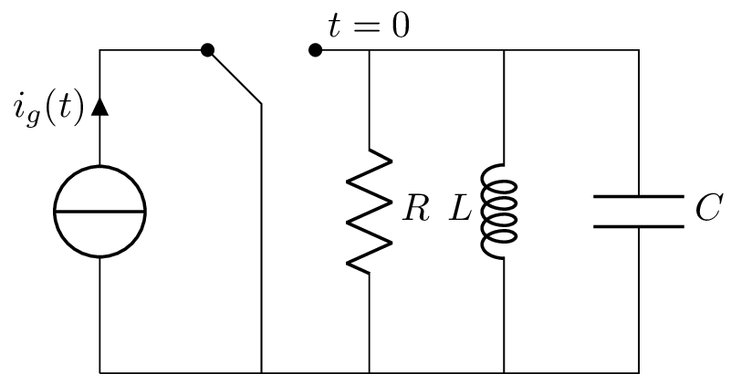 

</figure>

Per la dualità si ottengono delle equazioni delle grandezze duali, applicando il principio di Kirchhoff alle correnti invece che alle tensioni: $$\begin{gathered}
    \begin{cases}
        i_g(t)=Rv(t)+C\displaystyle\frac{\mathrm{d}v(t)}{\mathrm{d}t}+i_L(t)\\
        v=\displaystyle L\frac{\mathrm{d}i_L(t)}{\mathrm{d}t}
    \end{cases}\\
    i_g(t)=Iu_{-1}(t)\\
    Iu_{-1}(t)=RL\displaystyle\frac{\mathrm{d}i_L(t)}{\mathrm{d}t}+LC\frac{\mathrm{d}^2i_L(t)}{\mathrm{d}t^2}+i_L(t)
\end{gathered}$$ Si individuano le soluzioni del polinomio caratteristico: $$\begin{gathered}
    LC\alpha^2+RL\alpha+1=0\\
    \alpha_{1,2}=-\displaystyle\frac{R}{2C}\pm\sqrt{\left(\frac{R}{2C}\right)^2-\frac{1}{LC}}\\
    \Delta=\displaystyle\left(\frac{R}{2C}\right)^2-\frac{1}{LC}\\
    \sigma=\displaystyle-\frac{R}{2C}\\
    \omega=\sqrt{|\Delta|}
\end{gathered}$$ Si individuano, analogamente al circuito RLC in serie quattro possibili casi, sovrasmorzato, sottosmorzato, critico e oscillatorio puro. Si individuano queste quattro possibili funzioni per la corrente e la tensione: $$\begin{aligned}
    &i_L^{(1)}(t)=k_1e^{\alpha_1t}+k_2e^{\alpha_2t}+I    &L\alpha_1k_1e^{\alpha_1t}+L\alpha_2k_2e^{\alpha_2t}=v^{(1)}(t)\\
    &i_L^{(2)}(t)=2|k_1|e^{\sigma t}\cos(\omega t+\gamma)+I    &2L|k_1|\sigma e^{\sigma t}\cos(\omega t+\gamma)-2L|k_1|\omega e^{\sigma t}\sin(\omega t+\gamma)=v^{(2)}(t)\\
    &i_L^{(3)}(t)=k_1te^{\alpha_1t}+k_2e^{\alpha_1t}+I    &Lk_1(e^{\alpha_1t}+\alpha_1te^{\alpha_1t})+Lk_2\alpha_1e^{\alpha_1t}=v^{(3)}(t)\\
    &i_L^{(4)}(t)=2|k_1|\cos(\omega t+\gamma)+I    &-2L|k_1|\omega\sin(\omega t+\gamma)=v^{(4)}(t)
\end{aligned}$$ E queste funzioni per la tensione: Il valore delle costanti $k_{1,2}$, si ottengono applicando le equazioni di vincolo, considerando i valori noti della memoria $i_L(0^-)$ e $v(0^-)$: $$\begin{gathered}
    i_L(0^-)-I=k_1+k_2\\
    v(0^-)=L\displaystyle\frac{\mathrm{d}i_L(t)}{\mathrm{d}t}\bigg|_{t={0^-}}
\end{gathered}$$ Si rappresenta ora l’andamento di queste grandezze, nel caso sovrasmorzato, la curva di colore nero, il caso sottosmorzato la curva di colore rosso ed il caso critico la curva di colore blu:

<figure id="fig:andamento-rlc-parellelo">

  

<figcaption>Andamento delle Grandezze di un Circuito RLC Parallelo nel Tempo</figcaption>
</figure>

## Dominio dei Fasori

Continuare l’analisi nel dominio del tempo può rendere difficile lo studio di equazioni integro-differenziali di ordine elevato, per cui si vuole determinare un domino dove queste equazioni vengono risolte in maniera molto più semplice. Questo domini di calcolo sono il domino dei fasori o domino della frequenza o della pulsazione. Si considera un generatore di tensione sinusoidale inserito in un circuito RLC in serie:

<figure>

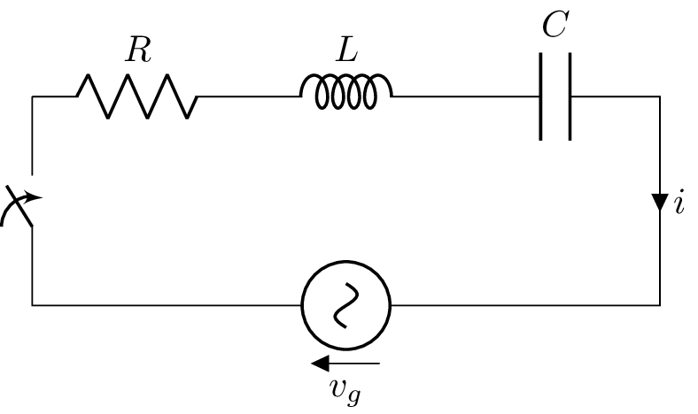 

</figure>

Dove la tensione erogata dal generatore è una funzione sinusoidale: $$\begin{gathered}
    v_g(t)=E_M\sin(\omega t+\gamma)u_{-1}(t)
\end{gathered}$$ Per il principio di Kirchhoff alle tensioni si ottiene la stessa equazione differenziale di un circuito RLC con tensione erogata costante. L’unico componente della soluzione totale della tensione che differisce è l’integrale particolare, poiché deve appartenere alla stessa classe delle funzioni della forzante: $$\begin{gathered}
    \begin{cases}
        v_g(t)=Ri(t)+\displaystyle L\frac{\mathrm{d}i(t)}{\mathrm{d}t}+v_C(t)\\
        i_C(t)=\displaystyle C\frac{\mathrm{d}v_C(t)}{\mathrm{d}t}
    \end{cases}\\
    v_g=RC\displaystyle\frac{\mathrm{d}v_C}{\mathrm{d}t}+LC\frac{\mathrm{d}^2v_C}{\mathrm{d}t^2}+v_C\\
    v_C(t)=v_{Cg}(t)+v_{Cp}(t)\\
    \alpha_{1,2}=\displaystyle-\frac{R}{2L}\pm\sqrt{\Delta}\\
    \Delta=\left(\displaystyle\frac{R}{2L}\right)^2-\frac{1}{LC}\\
    \begin{cases}
        v_C(t)=k_1e^{\alpha_1t}+k_2e^{\alpha_2t}+v_{Cp}(t)\\
        i_C(t)=k_1\alpha_1Ce^{\alpha_1t}+k_2\alpha_2Ce^{\alpha_2t}+C\displaystyle\frac{\mathrm{d}v_{Cp}(t)}{\mathrm{d}t}
    \end{cases}\\
    \begin{bmatrix}
        k_1\\k_2
    \end{bmatrix}=\begin{bmatrix}
        1&1\\\alpha_1C&\alpha_2C
    \end{bmatrix}^{-1}\begin{bmatrix}
        v_{Cg}(0^-)-v_{Cp}(0^-)\\i(0^-)-i_p(0^-)
    \end{bmatrix}
\end{gathered}$$ Per la proprietà di similarità l’integrale particolare è anch’esso una sinusoide: $$\begin{gathered}
    v_{Cp}(t)=V_M\sin(\omega t+\theta)\\
    v_{Cp}(0^-)=V_M\sin(\theta)
\end{gathered}$$ Le costanti incognite di questo integrale particolare sono la tensione massima $V_M$ e la sua fase $\theta$. Il resto dell’analisi sull’andamento dell’integrale generale corrisponde esattamente all’analisi effettuata per una forzante costante. Poiché l’evoluzione libera tende a valori trascurabili, in un sistema asintoticamente stabile, per valori di tempo sufficientemente elevati. Si analizza quindi solo la risposta a regime permanente, ovvero l’integrale particolare, nel dominio dei fasori. Si considera solo la risposta a regime permanente della tensione e della corrente $i_p(t)$: $$\begin{gathered}
    \begin{cases}
        v_g(t)=Ri_p(t)+\displaystyle L\frac{\mathrm{d}i_p(t)}{\mathrm{d}t}+v_{Cp}(t)\\
        i_p(t)=\displaystyle C\frac{\mathrm{d}v_{Cp}(t)}{\mathrm{d}t}
    \end{cases}\\
    i_p(t)=I_M\sin(\omega t+\beta)
\end{gathered}$$ Dove la $I_M$ è la corrente massima, e $\beta$ è la fase della corrente sinusoidale. Rappresenta una sinusoide essendo una derivata della soluzione particolare, anch’essa una sinusoide. Si vuole confermare se sia possibile applicare un approccio algebrico estendendo il teorema di Ohm solo sulla risposta a regime. Si vuole esprimere la tensione rispetto alla corrente a regime $i_p$: $$\begin{gathered}
    v_{Cp}(t)=\displaystyle\frac{1}{C}\int_{0}^{t}i_p(\tau)\mathrm{d}\tau+v_C(0^-)
\end{gathered}$$ Poiché si analizzano un tempo molto distante dello stato transitorio, non si può considerare la memoria $v_C(0^-)$. Per ottenere una sinusoide non bisogna quindi effettuare un integrale definito poiché risulterebbe in una costante, ma per la similarità la risposta forzata deve essere una sinusoide. Si esprimono la corrente a regime e la tensione erogata nel dominio dei fasori. Questa trasformata è biunivoca, e l’unica informazione persa da questo passaggio, che deve essere nota a priori per ritornare in tempo continuo è la pulsazione $\omega$: $$\begin{gathered}
    i_p(t)=\displaystyle\frac{\overline{I}e^{j\omega t}-\overline{I}^*e^{-j\omega t}}{2j}\\
    \overline{I}=I_Me^{j\beta}\tag{\stepcounter{equation}\theequation}\\
    v_{g}(t)=\displaystyle\frac{\overline{V}_ge^{j\omega t}-\overline{V}_g^*e^{-j\omega t}}{2j}\\
    \overline{V}_g=E_me^{j\gamma}\tag{\stepcounter{equation}\theequation}
\end{gathered}$$ Applicando una derivata nel dominio dei fasori corrisponde a moltiplicare per un fattore $j\omega$, mentre integrare corrisponde a dividere per lo stesso fattore: $$\begin{gathered}
    \displaystyle\frac{\mathrm{d}(\cdot)}{\mathrm{d}t}\to j\omega\times(\cdot)\\
    \displaystyle\int (\cdot)\mathrm{d}t\to\displaystyle\frac{1}{j\omega}\times(\cdot)
\end{gathered}$$ Le equazioni differenziali nel dominio dei fasori diventano quindi una combinazione lineare moltiplicata per un fattore esponenziale che rimane invariato, diviso per un fattore costante. Per la proprietà di identità dei polinomi si possono identificare due elementi che non contengono informazioni aggiuntive, uno rispetto all’altro: $$\begin{gathered}
    \displaystyle\frac{e^{j\omega t}}{2j}\left[\overline{V}_g=R\overline{I}+j\omega L\overline{I}+\frac{1}{j\omega C}\overline{I}\right]\\
    \displaystyle\frac{e^{-j\omega t}}{2j}\left[-\overline{V}_g^*=-R\overline{I}^*-j\omega L\overline{I}^*+\frac{1}{j\omega C}\overline{I}^*\right]\\
    \displaystyle\frac{e^{j\omega t}}{2j}\left\{\overline{V}_g=\left[R+j\left(\omega L-\frac{1}{\omega C}\right)\right]\overline{I}\right\}\\
    \displaystyle\frac{e^{-j\omega t}}{2j}\left\{\overline{V}_g^*=\left[R-j\left(\omega L-\frac{1}{\omega C}\right)\right]\overline{I}^*\right\}
\end{gathered}$$ Si definisce l’operatore $z$ complesso come: $$\begin{gathered}
    z=R+j\left(\omega L-\displaystyle\frac{1}{\omega C}\right)
\end{gathered}$$ Si può notare quindi come si ottengono due elementi complessi e coniugati tra di loro, corrispondenti a delle equazioni lineari nel dominio dei fasori: $$\begin{gathered}
    \overline{V}_g=z\overline{I}\\
    \overline{V}_g^*=z^*\overline{I}^*
\end{gathered}$$ Per cui per continuare l’analisi è sufficiente considera una sola di queste due espressioni. Si considera l’espressione senza coniugati e si esprimono i fasori e l’operatore $z$ in forma esponenziale: $$\begin{gathered}
    E_Me^{j\gamma}=|z|e^{j\varphi}I_Me^{j\beta}\\
    I_Me^{j\beta}=\displaystyle\frac{E_M}{|z|}\frac{e^{j\gamma}}{e^{j\varphi}}=\frac{E_M}{|z|}e^{j(\gamma-\varphi)}
\end{gathered}$$ Si ottiene quindi l’integrale particolare in corrente, applicando una sostituzione dal dominio dei fasori al dominio del tempo: $$\begin{gathered}
    i_p(t)=\displaystyle\frac{E_M}{|z|}\sin(\omega t+\gamma-\varphi)
\end{gathered}$$ Dato che tutta l’informazione del regime permanente è contenuta nei fasori, non è necessario antitrasformare l’equazione ottenuta nel dominio del tempo.

## Impedenza

Si definisce quindi la legge di Ohm complessa, o legge di Ohm nel dominio dei fasori: $$\begin{gathered}
    \overline{V}=z\overline{I}
\end{gathered}$$ Il modulo dell’operatore $z$ si ottiene come: $$\begin{gathered}
    |z|=\displaystyle\sqrt{R^2+X^2}\\
    X=\left(\omega L-\displaystyle\frac{1}{\omega C}\right)
\end{gathered}$$ Nell’equazione di Ohm nei reali, le grandezze sono collegate dalla resistenza $R$: $$\begin{gathered}
    v=Ri
\end{gathered}$$ Si definisce l’impedenza $z$, la grandezza che lega la tensione e la corrente nella legge di Ohm complessa, poiché le grandezze fisiche si conservano nei trasferimenti di dominio sempre calcolata in Ohm. Tramite le impedenze si possono descrivere circuiti dinamici tramite relazioni lineari, definite dalle impedenze di ogni elemento del circuito con la legge di Ohm complessa, supponendo si conosca la pulsazione della sinusoide in entrata. Si definisce l’ammettenza, il reciproco dell’impedenza: $$\begin{gathered}
    y=\displaystyle\frac{1}{z}
\end{gathered}$$ In questo modo si può esprimere facilmente una rappresentazione esterna equivalente di un circuito dinamico. L’impedenza non è una grandezza fisica, ma è un operatore che applicato opportunamente ottiene una corrente.

Si esprime l’impedenza $z$ come un numero complesso di parte reale resistenza $R$, e parte complessa reattanza $X$, entrambe misurate in Ohm: $$\begin{gathered}
    z=R+jX
\end{gathered}$$ L’inverso dell’impedenza è l’ammettenza $y$, di parte reale conduttanza $G$ e di parte immaginaria suscettanza $B$: $$\begin{gathered}
    y=G+jB
\end{gathered}$$

Per i bipoli puramente reattivi, condensatori ideali ed il suo duale induttore ideale. Nel caso di di un circuito RLC in serie, di pulsazione $\omega$, l’impedenza del circuito corrisponde a: $$\begin{gathered}
    z=R+j\left(\displaystyle \omega L-\frac{1}{\omega C}\right)
\end{gathered}$$ Per cui l’impedenza dei singoli componenti è l’impedenza resistiva $z_R$, l’impedenza induttiva $z_L$ e l’impedenza conduttiva $z_C$: $$\begin{gathered}
    z_R=R\\
    z_L=j\omega L\\
    z_C=\displaystyle -j\frac{1}{\omega C}
\end{gathered}$$

La parte reale dell’impedenza non è funzione della pulsazione $\omega$ della forzante sinusoidale, nel circuito RLC.

Si considerano due componenti RL e RC in parallelo:

<figure>

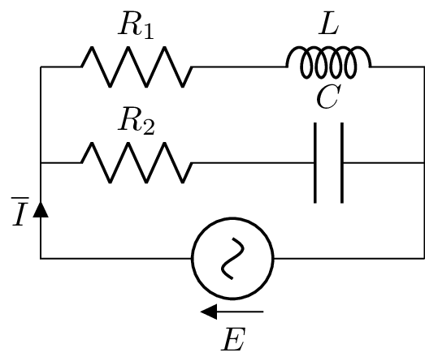 

</figure>

Collegati ad un generatore di tensione che varia tra due pulsazioni $\omega_{1,2}$. Per arrivare al valore di un’impedenza equivalente $R_\mathrm{eq}+jX_\mathrm{eq}$ si considerano due casi estremi: $$\begin{gathered}
    \omega_1=0\\
    \omega_2\to\infty
\end{gathered}$$ Nel caso $\omega_1$, la corrente non può passare per il condensatore $C$, poiché presenta un’impedenza infinita, quindi la corrente ha ampiezza massima: $$\begin{gathered}
    I_{M_1}=\displaystyle\frac{E_M}{R_1}
\end{gathered}$$ Nel caso $\omega_2$, la corrente non può passare per l’induttore $L$, poiché presenta un’impedenza infinita, quindi la corrente ha ampiezza massima: $$\begin{gathered}
    I_{M_2}=\displaystyle\frac{E_M}{R_2}
\end{gathered}$$

Per cui la resistenza equivalente cambia in base alla pulsazione delle sinusoide in entrata. Per cui la resistenza, parte reale dell’impedenza, non è indipendente dalla pulsazione $\omega$.

Si considerano i tre bipoli resistori, condensatori ed induttori. La legge di Ohm complessa per il resistore, nella convenzione degli utilizzatori:

<figure>

 

</figure>

$$\begin{gathered}
    V_Me^{j\gamma}=Re^{j0}I_Me^{j\beta}\\
    \varphi=\gamma-\beta=0\tag{\stepcounter{equation}\theequation}
\end{gathered}$$ Gli angoli relativi tra fasori si chiamano sfasamenti, quando nel lato considerato sono presenti dei generatori, bisogna considerare il loro contributo nel calcolo della fase. La corrente e la tensione si dicono tra di loro in fase, il rapporto di fase indica che ruotano alla stessa velocità.

<figure>

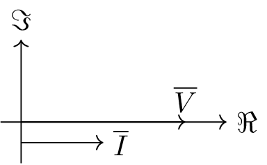 

</figure>

Si considera il bipolo condensatore ideale e la sua legge di Ohm complessa:

<figure>

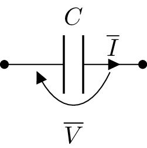 

</figure>

$$\begin{gathered}
    V_M=\displaystyle\frac{j}{\omega C}I_Me^{j\beta}\\
    V_M=\displaystyle\frac{1}{\omega C}e^{-j\pi/2}I_Me^{j\beta}\\
    \beta=\gamma-\varphi\\
    \varphi=\displaystyle-\frac{\pi}{2}\tag{\stepcounter{equation}\theequation}
\end{gathered}$$ Si dice che il fasore della tensione è in quadratura in ritardo rispetto alla corrente, analogamente la corrente è in quadratura in anticipo rispetto alla tensione. Il senso antiorario nel dominio dei fasori è il senso degli anticipi, mentre il senso orario è il senso dei ritardi.

<figure>

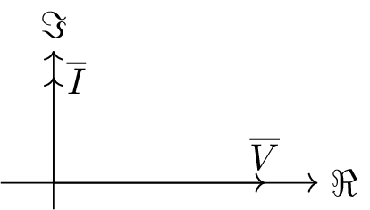 

</figure>

Si considera il bipolo induttore ideale e la sua legge di Ohm complessa:

<figure>

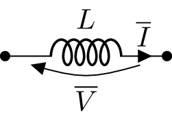 

</figure>

$$\begin{gathered}
    V_Me^{j\gamma}=\omega Le^{j\pi/2}I_Me^{j\beta}\\
    \beta=\gamma-\varphi\\
    \varphi=\displaystyle\frac{\pi}{2}\tag{\stepcounter{equation}\theequation}
\end{gathered}$$ Si dice che il fasore della corrente è in quadratura in ritardo rispetto alla tensione, analogamente la tensione è in quadratura in anticipo rispetto alla corrente.

<figure>

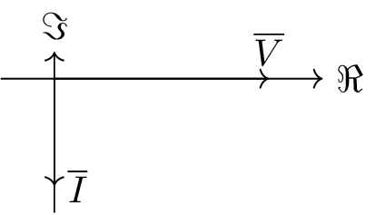 

</figure>

L’oggetto fasore moltiplicato per l’esponenziale complesso corrisponde ad un vettore rotante, poiché la sua fase varia nel tempo: $$\begin{gathered}
    \overline{V}e^{j\omega t}=V_Me^{j(\omega t+\gamma)}\\
    \overline Ie^{j\omega t}=I_Me^{j(\omega t+\beta)}
\end{gathered}$$ Il fasore codifica l’informazione a pulsazione costante, se fossero presenti più di una sorgente con pulsazione $\omega'\neq\omega$, i fasori non manterrebbero il rapporto di fase tra di loro; ruoterebbero con velocità diverse tra di loro. Questo non permetterebbe di sommare tra di loro fasori a pulsazione diversa, se non ad un istante fisso.

I generatori analizzati sono isofrequenziali, proprietà richiesta a tutti i generatori sinusoidali di avere la stessa pulsazione $\omega=2\pi f$. Per un lato passivo RLC si è precedentemente ottenuta la legge di Ohm complessa, legata dall’operatore complesso $z$, identificato come impedenza: $$\begin{gathered}
    \overline V=z\overline I
\end{gathered}$$ Si ottiene quindi che il modulo di questo operatore equivale al rapporto tra i due valori di picco delle due grandezze: $$\begin{gathered}
    |z|=\displaystyle\frac{V_M}{I_M}\,[\Omega]
\end{gathered}$$ Nel caso trattato l’impedenza corrisponde ad una parte reale resistenza $R$ ed una parte immaginaria reattanza $X$: $$\begin{gathered}
    z=R+j\left(\displaystyle\omega L-\frac{1}{\omega C}\right)
\end{gathered}$$

In questo caso la parte reale dell’impedenza è immune alla pulsazione $\omega$, ma è stato notato come in circuiti più complessi la parte reale può essere una funzione della pulsazione. Per cui di regola la parte reale ed immaginaria dell’impedenza dipendono dalla pulsazione: $$\begin{gathered}
    \Re\{z\}=f(\omega)\\
    \Im\{z\}=g(\omega)
\end{gathered}$$

Quando si vuole indicare l’impedenza come une un elemento generico, si ritorna alla rappresentazione di bipolo. In forma Thevenin equivalente di una rete, alternata sinusoidale, l’impedenza equivalente $z_\mathrm{th}$ è l’impedenza misurata dopo aver reso passiva la rete. Per attuare il metodo dell’amperometro, bisogna inserire dall’esterno un fasore noto, sinusoidale e isofrequenziale.

<figure>

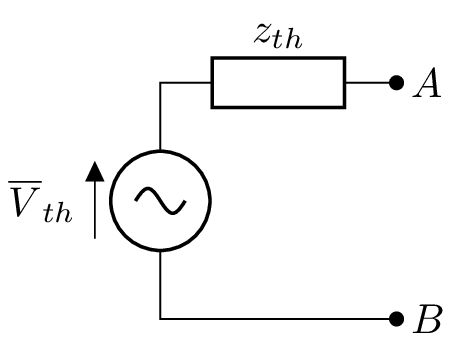 

</figure>

Si è poi definita l’ammettenza, l’inverso dell’impedenza: $$\begin{gathered}
    y=\displaystyle\frac{1}{R+jX}=\frac{R-jX}{R^2+X^2}=G+jB\\
    G=\displaystyle\frac{R}{R^2+X^2}\tag{\stepcounter{equation}\theequation}\\
    B=-j\displaystyle\frac{X}{R^2+X^2}\tag{\stepcounter{equation}\theequation}
\end{gathered}$$ La dimensione dell’ammettenza deriva dalla stessa legge di Ohm complessa, ed il suo modulo corrisponde al rapporto tra i due picchi di grandezze: $$\begin{gathered}
    \overline{I}=y\overline{V}\\
    |y|=\displaystyle\frac{I_M}{V_M}\,[\Omega^{-1}]
\end{gathered}$$

## Risposta Armonica

Si considera un circuito RLC serie, con generatori sempre isofrequenziali, esprimendo l’impedenza in funzione della pulsazione: $$\begin{gathered}
    z(\omega)=R+j\displaystyle\left(\omega L-\frac{1}{\omega C}\right)\\
    |z(\omega)|=\displaystyle\sqrt{R^2+\left(\omega L-\frac{1}{\omega C}\right)^2}\\
    \varphi(\omega)=\arctan\left(\displaystyle\frac{\displaystyle\omega L-\frac{1}{\omega C}}{R}\right)
\end{gathered}$$ Si somma alla fase un fattore $\pi$, in alcuni casi, per mantenere la continuità della funzione. Si esprime la variazione dei valori dell’impedenza, al variare della pulsazione. Si considera l’effetto di ogni componente singolarmente. La parte reale di modulo è sempre costante in questo caso rispetto alla pulsazione, quindi il suo contributo è costante, mentre il suo contributo alla fase rimane nullo, poiché è puramente reale. L’induttore contribuisce linearmente all’aumento del modulo, mentre presenta sempre uno sfasamento di $\pi/2$. Il condensatore presenta un andamento iperbolico nel modulo, mentre presenta una sfasatura costante di $-\pi/2$:

<figure id="fig:andamento-impedenza-rlc-serie">
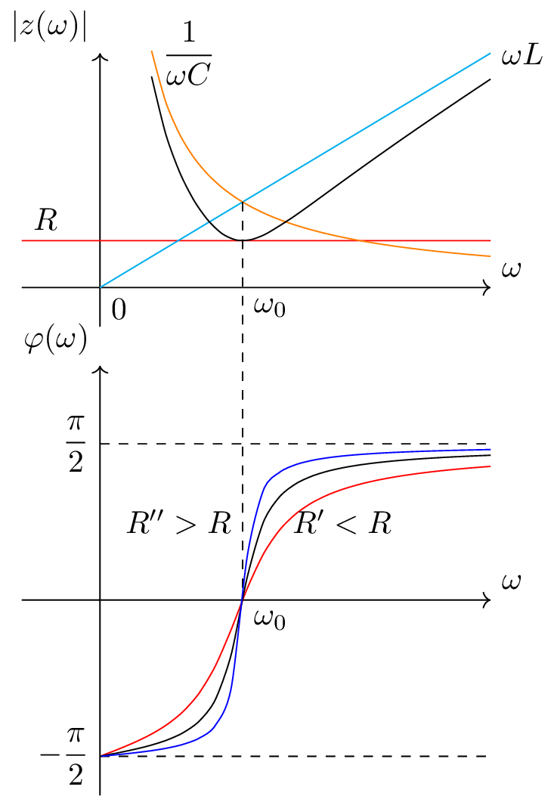
<figcaption>Andamento Modulo e Fase dell’Impedenza</figcaption>
</figure>

Si individua il punto di intersezione delle curve dell’andamento del modulo del solo condensatore e del solo induttore $\omega_0$: $$\begin{gathered}
    \displaystyle\frac{1}{\omega_0C}=\omega_0L\\
    \omega_0=\displaystyle\sqrt{\frac{1}{LC}}
\end{gathered}$$ Si definisce $\omega_0$ pulsazione di risonanza. In generale tutte le pulsazioni che annullano la parte immaginaria dell’impedenza si indicano come pulsazioni di risonanza.

In alcuni casi la frequenza del generatore corrisponde alla frequenza di risonanza, per cui l’impedenza equivalente misurata presenta parte immaginaria nulla, per cui non si può inferire nulla a posteriori sulla dinamicità della rete. Se è possibile, bisognerebbe variare la frequenza, per individuare quali componenti sono presenti nel circuito. In un circuito RLC, prima della pulsazione di risonanza, si misurano impedenze Thevenin che sono di tipo capacitivo, dove la reattanza è negativa, e si può realizzare mediante una singola capacità equivalente. Analogamente misurando il valore dell’impedenza dopo la pulsazione di risonanza si misura una reattanza positiva, per cui si misura un’induttanza equivalente. Nei due casi quindi il circuito si comporta come un RC, comportamento ohmico-capacitivo, per pulsazioni minori e RL, comportamento ohmico-induttivo, per pulsazioni maggiori della pulsazione di risonanza, mentre il valore della resistenza misurato rimane invariato: $$\begin{gathered}
    \begin{cases}
        \omega L-\displaystyle\frac{1}{\omega C}=-\frac{1}{\omega C_\mathrm{eq}}&\omega<\omega_0\\
        \omega L-\displaystyle\frac{1}{\omega C}=\omega L_\mathrm{eq}&\omega>\omega_0
    \end{cases}
\end{gathered}$$ La fase corrispondente alla pulsazione di risonanza è nulla. Per pulsazioni minori, il comportamento è ohmico capacitivo, per cui per la pulsazione tendente a zero, l’unico contributo di fase non nullo è fornito dalla capacità e corrisponde ad una fase di $\pi/2$. Mentre per pulsazioni maggiori di della pulsazione di risonanza, il circuito presenta un comportamento ohmico-induttivo, e per valori di pulsazioni tendenti all’infinito, la fase tende asintoticamente alla fase dell’induttore $\pi/2$. In assenza di una resistenza, ci si trova in una situazione di cortocircuito, corrispondente ad un generatore di corrente nulla, ma non si può montare in serie ad un generatore di tensione, per cui non si potrebbe parlare del caso $\omega=\omega_0$ con una resistenza nulla. Per $R=0$, per pulsazioni minori di $\omega_0$ il circuito si comporta come un condensatore puro, e la fase rimane costante al contributo del condensatore $-\pi/2$. Analogamente per $R=0$ e $\omega>\omega_0$ si avrebbe un comportamento induttivo, in questo caso si avrebbe un valore di induttanza equivalente misurato, e la fase rimane costante al valore della fase dell’induttore $\pi/2$. Il comportamento della fase per $R=0$, corrisponde ad un gradino con una discontinuità nella pulsazione $\omega=\omega_0$, mentre mantenendo i valori di induttanza e capacità costanti e variando la resistenza, all’aumentare di R la curva della fase si allontana dall’andamento a $R=0$, mentre al diminuire di R la curva si avvicina.

Si può attuare un’analisi duale per un circuito RLC parallelo, in questo caso si analizza invece che l’impedenza l’ammettenza $y$, e la sua fase $\alpha$. Valgono le stesse considerazioni ottenute per il circuito RLC serie, ma sono invertiti i comportamenti ohmico induttivi e capacitivi, poiché si inverte il ruolo della capacità e dell’induttanza dal passaggio da circuiti RLC serie a RLC parallelo, e viceversa.

<figure id="fig:andamento-ammettenza-rlc-parallelo">
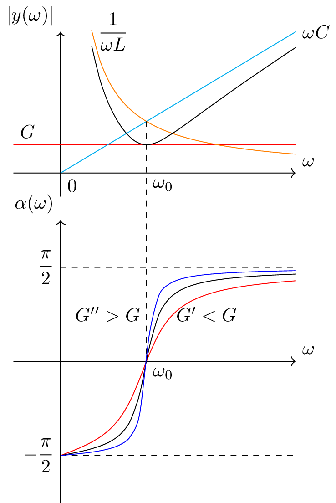
<figcaption>Andamento Modulo e Fase dell’Ammettenza</figcaption>
</figure>

$$\begin{gathered}
    y(\omega)=G+j\displaystyle\left(\omega C-\frac{1}{\omega L}\right)\\
    |y(\omega)|=\displaystyle\sqrt{G^2+\left(\omega C-\frac{1}{\omega L}\right)^2}\\
    \alpha(\omega)=\arctan\left(\displaystyle\frac{\displaystyle\omega C-\frac{1}{\omega L}}{G}\right)
\end{gathered}$$

## Potenza a Regime Sinusoidale

Si vuole calcolare la potenza erogata da un generico lato attraversato da una corrente sinusoidale e connesso ai due poli ad una tensione anch’essa sinusoidale, di pulsazione uguale:

<figure>

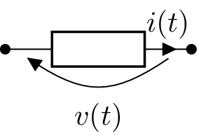 

</figure>

$$\begin{gathered}
    v(t)=V_M\sin(\omega t+\gamma)\\
    i(t)=I_M\sin(\omega t+\gamma)
\end{gathered}$$ Si calcola la potenza istantanea erogata dal lato esprimendo le sinusoidi in forma euleriana: $$\begin{gathered}
    p(t)=v(t)i(t)=\displaystyle\frac{\overline{V}e^{j\omega t}-\overline{V}^*e^{-j\omega t}}{2j}\frac{\overline{I}e^{j\omega t}-\overline{I}^*e^{-j\omega t}}{2j}\\
    \displaystyle-\frac{1}{4}\left(\overline{V}\overline{I}e^{2j\omega t}-\overline{V}\overline{I}^*-\overline{V}^*\overline{I}+\overline{V}^*\overline{I}^*e^{-2j\omega t}\right)
    =-\frac{1}{2}\frac{\overline{V}\overline{I}e^{2j\omega t}-(\overline{V}\overline{I})^*e^{-2j\omega t}}{2}+\frac{1}{2}\frac{\overline{V}\overline{I}^*+\overline{V}^*\overline{I}}{2}
\end{gathered}$$ Si definisce lo sfasamento tra tensione e corrente $\varphi$, equivalente all’argomento dell’impedenza per ogni lato passivo. Quando sono presenti generatori bisogna tenere conto dei loro contributi nell’argomento dell’impedenza. $$\begin{gathered}
    \overline{VI}=V_MI_Me^{j(\gamma+\beta)}\\
     (\overline{VI})^*=V_MI_Me^{-j(\gamma+\beta)}\\
    \overline{V}\overline{I}^*=V_MI_Me^{j(\gamma-\beta)}\\
    \overline{V}^*\overline{I}=V_MI_Me^{-j(\gamma-\beta)}\\
    \gamma-\beta=\varphi\\
    \gamma+\beta=2\gamma-\varphi
\end{gathered}$$ Si applicano queste sostituzioni appena definite, e si esprime in questo modo la potenza istantanea di un generico lato come la somma di due sinusoidi, una funzione nel tempo, mentre l’altra costante: $$\begin{gathered}
    p(t)=\displaystyle-\frac{1}{2}V_MI_M\frac{e^{j(2\gamma t+2\gamma-\varphi)}+e^{-j(2\gamma t+2\gamma-\varphi)}}{2}+\frac{1}{2}V_MI_M\frac{e^{j\varphi}+e^{-j\varphi}}{2}\\
    -\displaystyle\frac{1}{2}V_MI_M\cos(2\omega t+2\gamma-\varphi)+\frac{1}{2}V_MI_M\cos\varphi\\
    p_f(t)=-\displaystyle\frac{1}{2}V_MI_M\cos(2\omega t+2\gamma-\varphi)\\
    P=\displaystyle\frac{1}{2}V_MI_M\cos\varphi\tag{\stepcounter{equation}\theequation}
\end{gathered}$$ Si definisce il primo componente , variante nel tempo, potenza fluttuante $p_f(t)$ di pulsazione doppia rispetto alla pulsazione di corrente e tensione di lato, mentre la seconda componente costante, potenza attiva $P$ del lato. Si definisce il componente $\cos\varphi$ fattore di potenza che indica quale percentuale della potenza apparente, prodotto tra la lettura del voltmetro e dell’amperometro, viene ad essere convertita in potenza attiva. Poiché il lato è passivo, la potenza non potrà mai essere negativa, nella convenzione dei generatori, poiché non può erogare potenza. Per cui la potenza attiva corrisponde ai minimi valori assunti dalla potenza fluttuante, per ottenere una potenza sempre positiva. Si definisce il periodo di un’oscillazione $T=2\pi/\omega$, e data la precedente considerazione si può esprimere la potenza attiva come il valore medio della potenza istantanea. Questa relazione esprime la potenza attiva relativa ad una potenza alternata: $$\begin{gathered}
    P=\displaystyle\frac{1}{T}\int_0^Tp(t)\mathrm{d}t=\cancelto{0}{\frac{1}{T}\int_0^Tp_f(t)\mathrm{d}t}+\frac{1}{T}\int_0^TP\mathrm{d}t=P\cancelto{1}{\frac{1}{T}\int_0^T\mathrm{d}t}
\end{gathered}$$ Si possono rappresentare i prodotti incrociati tra i fasori ed i loro coniugati in forma trigonometrica, mediante le formule di Eulero: $$\begin{gathered}
    \overline{V}\overline{I}^*=V_MI_Me^{j(\gamma-\beta)}=V_MI_M\left(\cos\varphi+j\sin\varphi\right)\\
    \overline{V}^*\overline{I}=V_MI_Me^{-j(\gamma-\beta)}=V_MI_M\left(\cos\varphi-j\sin\varphi\right)\\
    P=\displaystyle\frac{1}{2}\Re\{\overline{V}\overline{I}^*\}\\
    \displaystyle\frac{1}{2}\overline{V}\overline{I}^*=P+jQ\tag{\stepcounter{equation}\theequation}
\end{gathered}$$ Viene definita la potenza Volt Ampere Reattiva (VAR) come la parte immaginaria $Q$ così ottenuta: $$\begin{gathered}
    Q=P\tan\varphi\\
    [P]=\mathrm{W},\,[Q]=\mathrm{V}\cdot \mathrm{A}
\end{gathered}$$ Dato un resistore attraversato da una corrente continua (DC), la potenza assorbita si esprime tramite la relazione: $$\begin{gathered}
    P=RI^2
\end{gathered}$$ Mentre se attraversato da una corrente alternata (AC) la potenza assorbita dal resistore si esprime considerando la legge di Ohm complessa per un resistore, dove l’impedenza coincide alla sua resistenza. Il fattore di potenza è uguale ad $1$, poiché la tensione e la corrente sono in fase, per cui la potenza apparente coincide con la potenza attiva assorbita dal resistore: $$\begin{gathered}
    \overline{V}=R\overline{I}\\
    \displaystyle\frac{1}{2}V_MI_M\cancelto{1}{\cos\varphi}=\frac{1}{2}RI_M^2
\end{gathered}$$ A parità di potenza (attiva) assorbita, si può esprimere la relazione tra la corrente continua ed il picco della corrente a regime sinusoidale: $$\begin{gathered}
    RI_{\mathrm{DC}}^2=\displaystyle\frac{1}{2}RI_M^2\\
    I_{\mathrm{DC}}=\displaystyle\frac{I_M}{\sqrt{2}}
\end{gathered}$$ Questa corrente così ottenuta prende il nome di corrente efficace $I_{\mathrm{eff}}$. Si esprimono i fasori tramite i valori efficaci di tensione e corrente, invece dei valori di picco: $$\begin{gathered}
    \begin{cases}
        \overline{V}=\displaystyle\frac{V_{M}}{\sqrt{2}}e^{j\gamma}=V_{\mathrm{eff}}e^{j\gamma}\implies V=V_{\mathrm{eff}}\\
        \overline{I}=\displaystyle\frac{I_{M}}{\sqrt{2}}e^{j\beta}=I_{\mathrm{eff}}e^{j\beta}\implies I=I_{\mathrm{eff}}
    \end{cases}
\end{gathered}$$ Si considera per semplicità $V$ e $I$ il modulo dei fasori corrispondenti. Si esprime la potenza attiva mediante questi nuovi fasori: $$\begin{gathered}
    P=\displaystyle\frac{1}{2}V_MI_M\cos\varphi=\frac{1}{2}V_{\mathrm{eff}}\sqrt{2}\,I_{\mathrm{eff}}\sqrt{2}\cos\varphi=V_{\mathrm{eff}}I_{\mathrm{eff}}\cos\varphi
\end{gathered}$$ In forma generale, senza sapere a priori il tipo di corrente passante per il resistore, si esprime questa relazione tramite la radice della media quadrata “Root of Mean Square" (RMS). Per cui equivalendo le due potenze attive, in continuo ed in alternata, si ottiene la seguente corrente efficace: $$\begin{gathered}
    RI_{\mathrm{DC}}^2=\displaystyle\frac{1}{T}\int_0^Tp(t)\mathrm{d}t=\frac{1}{T}\int_0^TRi^2(t)\mathrm{d}t\\
    I_{\mathrm{DC}}=\displaystyle\sqrt{\frac{1}{T}\int_0^Ti^2(t)\mathrm{d}t}=I_{\mathrm{eff}}\tag{\stepcounter{equation}\theequation}
\end{gathered}$$

Si è ottenuto precedentemente che il prodotto tra il fasore di tensione ed il coniugato di corrente corrisponde ad numero complesso avente parte reale la potenza attiva, e parte immaginaria la potenza reattiva: $$\begin{gathered}
    VI\cos\varphi=\displaystyle\frac{1}{2}V_MI_M\cos\varphi=P\\
    VI\sin\varphi=\displaystyle\frac{1}{2}V_MI_M\sin\varphi=Q\\
    \overline{V}\overline{I}^*=P+jQ
\end{gathered}$$ Per cui si può esprimere la potenza attiva come la parte reale di questo prodotto: $$\begin{gathered}
    \Re\{\overline{V}\overline{I}^*\}=P=VI\cos\varphi\\
    \varphi=\arccos\left(\displaystyle\frac{\Re\{\overline{V}\overline{I}^*\}}{VI}\right)
\end{gathered}$$ Si definisce questo prodotto tra i due fasori efficaci potenza complessa: $$\begin{gathered}
    \dot P_C=\overline{V}\overline{I}^*
\end{gathered}$$ La potenza reattiva può essere positiva o negativa sulla base della natura capacitiva o induttiva della reattanza. Dove il modulo della potenza complessa corrisponde alla potenza apparente, il prodotto tra i valori efficaci delle due letture del voltmetro e dell’amperometro, ma non forniscono informazioni sulla fase, che indica quanta parte viene trasformata in potenza attiva e quanta in potenza reattiva, che rimane interna al circuito, usata come potenza di calcolo per determinare il valore dello sfasamento tra tensione e corrente $\varphi$: $$\begin{gathered}
    |\dot P_C|=\displaystyle\sqrt{P^2+Q^2}=VI\\
    \left[|\dot P_C|\right]=V\cdot A
\end{gathered}$$

<figure>

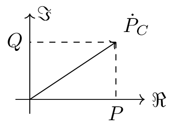 

</figure>

Analogamente si può esprimere la potenza attiva e reattiva tramite la potenza complessa e la sua fase, coincidente per i lati passivi all’argomento dell’impedenza di lato: $$\begin{gathered}
    P=|\dot P_C|\cos\varphi\\
    Q=|\dot P_C|\sin\varphi
\end{gathered}$$

Se la potenza reattiva è positiva, allora corrisponde a potenza assorbita dal lato, se è negativa allora la potenza viene erogata dal lato. Si vuole esprimere la potenza complessa considerando una sola grandezza e l’impedenza, tramite la legge di Ohm complessa, analogamente al caso continuo: $$\begin{gathered}
    \overline{V}=z\overline{I}\\
    \dot P_C=z\overline{I}\overline{I}^*=z|\overline{I}|^2
    z=R+jQ\\
    RI^2=RI^2+jXI^2\\
    P=RI^2\tag{\stepcounter{equation}\theequation}\\
    Q=XI^2\tag{\stepcounter{equation}\theequation}
\end{gathered}$$ In questo modo si può analizzare direttamente se un dato bipolo eroga o assorbe potenza reattiva, sulla base dalla reattanza. In un resistore i fasori sono in fase, per cui la potenza attiva corrisponde alla potenza apparente:

<figure>

</figure>

$$\begin{gathered}
    \varphi=0\\
    P=VI\cos\varphi=VI=|\dot P_C|
    Q=0
\end{gathered}$$

Si considera un condensatore nella convenzione degli utilizzatori:

<figure>

</figure>

La sua impedenza ha un’argomento di $-\pi/2$, poiché la tensione è in quadratura in ritardo rispetto alla corrente: $$\begin{gathered}
    \varphi=\displaystyle-\frac{\pi}{2}
    P=VI\cos\varphi=0\\
    Q=VI\sin\varphi=-|\dot P_C|
\end{gathered}$$ In questo caso la potenza attiva è nulla, e la potenza reattiva è negativa e corrisponde alla potenza apparente. $$\begin{gathered}
    X_C=\displaystyle-\frac{1}{\omega C}\implies Q<0
\end{gathered}$$

Si considera il bipolo induttore, nella convenzione degli utilizzatori, dove per dualità si ottiene la stessa soluzione, ma la potenza reattiva è positiva:

<figure>

</figure>

$$\begin{gathered}
    \varphi=\displaystyle\frac{\pi}{2}\\
    P=VI\cos\varphi=0\\
    Q=VI\sin\varphi=|\dot P_C|\\
    X_L=\omega L\implies Q>0
\end{gathered}$$

Per cui un condensatore eroga potenza reattiva, mentre l’induttore assorbe potenza reattiva, nella convenzione degli utilizzatori, ma non essendoci alcun tipo di convenzione energetica non ha senso analizzare questa potenza come potenza effettiva. Considerando il duale della legge di Ohm complessa si può esprimere la potenza complessa rispetto alla tensione ed all’ammettenza $$\begin{gathered}
    \overline{I}=y\overline{V}\\
    \dot P_C=\overline{V}(y\overline{V})^*=y^*|\overline{V}|^2=y^*V^2
\end{gathered}$$

Si considera un lato ohmico-capacitivo, nella convenzione degli utilizzatori, definito da un’impedenza: $$\begin{gathered}
    z=R-\displaystyle\frac{j}{\omega C}
\end{gathered}$$

<figure>

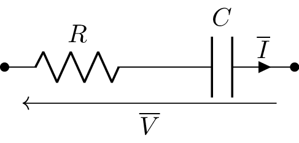 

</figure>

Per cui ha una potenza complessa: $$\begin{gathered}
    \dot P_C=zI^2=RI^2-j\displaystyle\frac{I^2}{\omega C}\\
    P=RI^2\\
    Q=-\displaystyle\frac{I^2}{\omega C}
\end{gathered}$$ Questo lato eroga potenza attiva, e assorbe potenza reattiva.

Per dualità un lato ohmico-induttivo, nella convenzione degli utilizzatori, eroga potenza attiva, ed eroga potenza reattiva:

<figure>

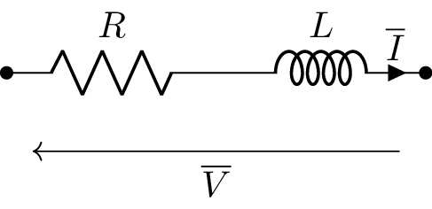 

</figure>

$$\begin{gathered}
    z=R+j\omega L\\
    \dot P_C=RI^2+j\omega LI^2\\
    P=RI^2\\
    Q=\omega LI^2
\end{gathered}$$ Da notare che un circuito RLC serie corrisponde ad una di questi due lati in base alla pulsazione della forzante sinusoidale in entrata, per cui le grandezze di capacità ed induttanza presenti corrispondono a grandezze equivalenti dall’esterno, mentre la resistenza corrisponde alla stessa resistenza del circuito RLC.

In generale in un modello di una macchina elettrica monofase, per trasformare una potenza elettrica in meccanica, bisogna considerare che la potenza trasferita alla macchina presenta una componente oscillante, per cui bisogna analizzarla in ambiente meccanico come una vibrazione, che dissipa una parte dell’energia trasferita, per cui per mantenere le prestazioni desiderate bisognerebbe trasferire una potenza attiva superiore. Per cui anche da lato elettrico è importante realizzare macchine in assenza di vibrazione. Uno di questi motori è un motore alimentato da un sistema trifase simmetrico ed equilibrato è un sistema senza potenza fluttuante. Generalmente vengono realizzati motori bifase, poiché l’alimentazione è monofase, applicando un certo sfasamento alla corrente in ingresso, può essere realizzato applicando un condensatore ad un altro oggetto in parallelo per avere due correnti $I$ e $I'$ in quadratura di fase.

Analogamente al teorema di Tellegen, viene definito il principio di Boucherot per le potenze reattive, che giustifica inoltre l’utilizzo di unità di misura differenti, poiché la potenza attiva e reattiva rappresentano due grandezze completamente indipendenti l’una dall’altra.

### Teorema del Massimo Trasferimento di Potenza per Reti Dinamiche

Nel caso di reti senza memoria si ottiene la massima potenza quando la resistenza di carico equivale alla resistenza equivalente di Thevenin. Si considera ora un generico circuito dinamico, accessibile dall’esterno da due morsetti:

<figure>

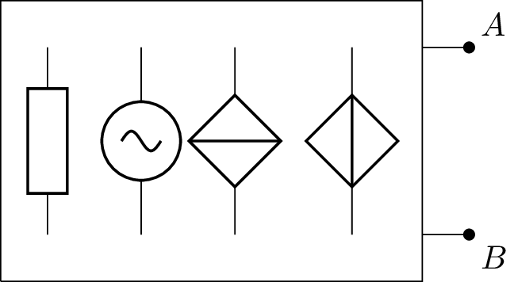 

</figure>

Si vuole determinare la massima potenza attiva estraibile da un qualsiasi circuito dinamico, in funzione dell’impedenza. Tutto ciò che è stato trattato nelle reti adinamiche può essere riportato in una situazione dinamica nel dominio di fasori considerando impedenze e generatori dinamici. Per cui si può esprimere un qualsiasi circuito tramite il teorema di Thevenin a regime sinusoidale, con un generatore di tensione sinusoidale che presenta un fasore di tensione $\overline{E}_th$ equivalente al fasore di tensione misurato a vuoto tra i due morsetti $\overline{V}_{AB0}$, ed un’impedenza equivalente $z_\mathrm{eq}$, misurata rendendo passiva la rete. Si considera quindi un’impedenza di carico $z_C$, in modo da avere la massima potenza attiva:

<figure>

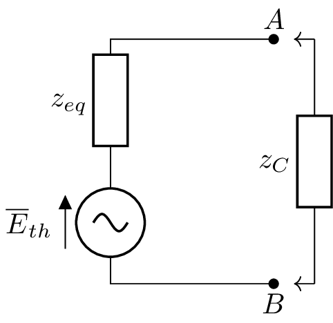 

</figure>

La corrente erogata sul carico corrisponde a: $$\begin{gathered}
    \overline{I}=\displaystyle\frac{\overline{E}_\mathrm{th}}{z_\mathrm{eq}+z_C}
\end{gathered}$$ Si può considerare la parte reale ed immaginaria dell’impedenza Thevenin e di carico: $$\begin{gathered}
    \overline{I}=\displaystyle\frac{\overline{E}_\mathrm{th}}{(R_\mathrm{eq}+R_{C})+j(X_\mathrm{eq}+X_C)}
\end{gathered}$$ La potenza complessa può essere espressa come il prodotto tra l’impedenza ed il quadrato del valore efficace della corrente: $$\begin{gathered}
    \dot P_C=zI^2=RI^2+jXI^2
\end{gathered}$$ Per cui per ottenere la potenza attiva assorbita dall’impedenza di carico si considera: $$\begin{gathered}
    P_C=R_C|\overline I|^2=R_C\displaystyle\frac{E_\mathrm{th}^2}{(R_\mathrm{eq}+R_C)^2+(X_\mathrm{eq}+X_C)^2}
\end{gathered}$$ Se si analizzasse solamente in ambiente matematico, poiché è una funzione a due variabile, trovare i valori per cui si annulla il differenziale totale: $$\begin{gathered}
    \begin{cases}
        \displaystyle\frac{\strut \partial P_C}{\strut \partial R_C}=0\\
        \displaystyle\frac{\strut \partial P_C}{\strut \partial X_C}=0
    \end{cases}
\end{gathered}$$

Invece ci si può avvalere in ambito elettrotecnico dello stesso ragionamento effettuato per determinare il massimo trasferimento di potenza in una rete adinamica. Si considera il massimo della potenza quando si ha massimizzato la corrente, a parità di resistenza. Per tornare a questa situazione analoga, bisogna diminuire il contributo della reattanza $X$. Per cui si considera la reattanza di carico: $$\begin{gathered}
    X_C=-X_\mathrm{eq}\\
    X_\mathrm{tot}=0
\end{gathered}$$ Avendo una reattanza nulla ci si trova in una condizione di risonanza. Per cui si inserisce un’impedenza esterna per risonare il circuito. Questa è quindi la prima condizione per il teorema. In questa situazione dove il circuito si comporta come una rete adinamica, vale il teorema del massimo trasferimento di potenza, dimostrato per le reti adinamiche $R_C=R_\mathrm{eq}$. Per cui per estrarre la massima potenza da una rete dinamica bisogna inserire un’impedenza di carico pari al coniugato dell’impedenza equivalente del circuito: $$\begin{gathered}
    z_C=z_\mathrm{eq}^*
\end{gathered}$$

Da notare che questa potenza massima è ottenuta rispetto ad una pulsazione di risonanza $\omega_0$, mentre al cambiamento della pulsazione la resistenza di carico non corrisponderà più alla potenza massima. Mentre anche il comportamento dell’impedenza equivalente non è ricavabile dalle informazioni sul circuito espresse dalla rappresentazione equivalente di Thevenin, poiché è necessaria la conoscenza del circuito completo per determinare in che modo varia al variare della frequenza.

# Dominio di Laplace

Si considera una generica funzione nel domino del tempo $f(t)$ che rappresenta una grandezza tensione o corrente, variante nel tempo. Si definisce la trasformata di Laplace $F(s)$ della funzione $f(t)$ un funzionale $\mathcal{L}\{f(t)\}=F(s)$ che trasferisce una funzione dal dominio del tempo al domino complesso $s\in\mathbb{C}$ della frequenza. Si considera solamente la trasformata unilatera destra, definita come l’integrale di trasformazione da $0^-$ a $+\infty$: $$\begin{gathered}
    F(s)=\displaystyle\int_{0^-}^{+\infty}f(t)e^{-st}\mathrm{d}t
\end{gathered}$$ Questa funzione restituisce un valore definito se il so argomento tende asintoticamente a $0$, per tempi matematicamente infiniti: $$\begin{gathered}
    |f(t)e^{\sigma t}|\to0
\end{gathered}$$ Dove $\sigma$ è la parte reale della variabile complessa $s$: $$\begin{gathered}
    s=\sigma+j\omega
\end{gathered}$$ Si definiscono ora una serie di trasformate notevoli. Si considera il segnale gradino unitario $u_{-1}(t)$:

<figure>

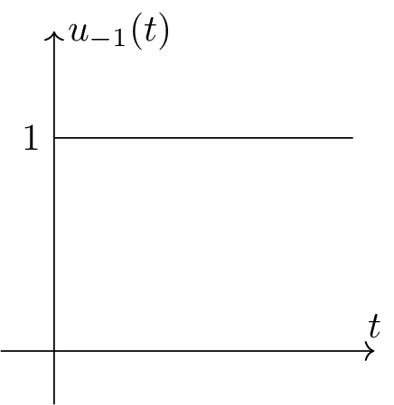 

</figure>

$$\begin{gathered}
    f(t)=u_{-1}(t)=\begin{cases}
        0&t\leq 0^-\\
        1&t\geq 0^+
    \end{cases}
\end{gathered}$$ La sua trasformata di Laplace corrisponde all’integrale di un esponenziale, cambiando i limiti di integrazione: $$\begin{gathered}
    F(s)=\displaystyle\int_{0^-}^{+\infty}u_{-1}(t)e^{-st}\mathrm{d}t=\int_{0^+}^{+\infty}e^{-st}\mathrm{d}t=\left[-\frac{1}{s}e^{-st}\right]_{0^+}^{+\infty}=-\frac{1}{s}\cancelto{0}{e^{-\infty t}}+\frac{1}{s}
\end{gathered}$$

Per cui la trasformata di un gradino nel tempo è un’iperbole in frequenza: $$\mathcal{L}\{u_{-1}(t)\}=\displaystyle\frac{1}{s}$$

Si considera un segnale esponenziale convergente $\alpha\in\mathbb{R}^-$: $$\begin{gathered}
    F(s)=\displaystyle\int_{0^-}^{+\infty}e^{\alpha t}e^{-st}\mathrm{d}t=\int_{0^-}^{+\infty}e^{-(s-\alpha)t}\mathrm{d}t=\left[-\frac{s-\alpha}e^{-(s-\alpha)t}\right]^{+\infty}_{0^-}=\frac{1}{s-\alpha}
\end{gathered}$$ Quindi la sua trasformata è: $$\begin{gathered}
    \mathcal{L}\{e^{-\alpha t}\}=\displaystyle\frac{1}{s-\alpha}
\end{gathered}$$

Data una funzione $f$ e la sua trasformata $F$, si vuole determinare se sia possibile esprimere la trasformata della sua derivata $\dot f(t)$ rispetto alla trasformata $F$: $$\begin{gathered}
    \mathcal{L}\{f(t)\}=F(s)\\
    \mathcal{L}\left\{\displaystyle\frac{\mathrm{d}}{\mathrm{d}t}f(t)\right\}=G(s)\\
    G(s)=\displaystyle\int_{0^-}^{+\infty}\frac{\mathrm{d}}{\mathrm{d}t}f(t)e^{-st}\mathrm{d}t
\end{gathered}$$ Si risolve questo integrale per parti e si ottiene la seguente espressione: $$\begin{gathered}
    \displaystyle\int_{0^-}^{+\infty}\frac{\mathrm{d}}{\mathrm{d}t}f(t)e^{-st}\mathrm{d}t=\left[f(t)e^{-st}\right]^{+\infty}_{0^-}-\int_{0^-}^{+\infty}f(t)(-se^{-st})\mathrm{d}t\\
    \displaystyle-f(0^-)+s\left(\int_{0^-}^{+\infty}f(t)e^{-st}\mathrm{d}t\right)=sF(s)-f(0^-) 
\end{gathered}$$ Per cui nota la trasformata di una funzione $f$, si può calcolare la trasformata della sua derivata come: $$\begin{gathered}
    \mathcal{L}\left\{\displaystyle\frac{\mathrm{d}f(t)}{\mathrm{d}t}\right\}=s\mathcal{L}\{f(t)\}-f(0^-)
\end{gathered}$$ Tramite questa definizione è possibile calcolare ricorsivamente la trasformata di una derivata $n-$esima di una funzione $f$ di trasformata nota: $$\begin{gathered}
    \mathcal{L}\left\{\displaystyle\frac{\mathrm{d}}{\mathrm{d}t}\frac{\mathrm{d}f}{\mathrm{d}t}\right\}=s\left[sF(s)-f(0^-)\right]-\dot f(0^-)=s^2F(s)-sf(0^-)-\dot f(0^-)\\
    \mathcal{L}\left\{\displaystyle\frac{\mathrm{d}^nf}{\mathrm{d}t^n}\right\}=s^nF(s)-\sum_{k=0}^{n-1}s^{n-1-k}\frac{\mathrm{d}^kf}{\mathrm{d}t^k}\Bigg|_{t=0^-}\tag{\stepcounter{equation}\theequation}
\end{gathered}$$

La trasformata di una combinazione lineare è una combinazione lineare delle trasformate: $$\begin{gathered}
    \mathcal{L}\{Af(t)+Bg(t)\}=\displaystyle\int_{0^-}^{+\infty}\left(Af(t)+Bg(t)\right)\mathrm{d}t\\
    A\int_{0^-}^{+\infty}f(t)\mathrm{d}t+B\int_{0^-}^{+\infty}g(t)\mathrm{d}t=AF(s)+BG(s)
\end{gathered}$$ Quindi vale la seguente proprietà: $$\mathcal{L}\{A(f)+Bg(t)\}=A\mathcal{L}\{f(t)\}+B\mathcal{L}\{g(t)\}$$

Si considera la proprietà della derivazione considerando una funzione integrale $f(t)$: $$\begin{gathered}
    f(t)=\displaystyle\int_{0^-}^tg(\tau)\mathrm{d}\tau\\
    \mathcal{L}\{f(t)\}=F(s)=\mathcal{L}\left\{\displaystyle\int_{0^-}^tg(\tau)\mathrm{d}\tau\right\}\\
    \mathcal{L}\left\{\displaystyle\frac{\mathrm{d}f(t)}{\mathrm{d}t}\right\}=sF(s)=G(s)=\mathcal{L}\{g(t)\}
\end{gathered}$$ A memoria nulla quindi $g(0^-)=0$, la trasformata di un integrale si ottiene come: $$\mathcal{L}\left\{\displaystyle\int_{0^-}^tg(\tau)\mathrm{d}\tau\right\}=\frac{\mathcal{L}\{g(t)\}}{s}$$

La trasformata di una funzione $f$ tempo continua per il tempo, corrisponde nel dominio di Laplace all’opposto della derivata della sua funzione di trasferimento $F$: $$\begin{gathered}
    \mathcal{L}\{tf(t)\}=\displaystyle\int_{0^-}^{+\infty}tf(t)e^{-st}\mathrm{d}t\\
    \displaystyle-\frac{\mathrm{d}F(s)}{\mathrm{d}s}=-\frac{\mathrm{d}}{\mathrm{d}s}\int_{0^-}^{+\infty}f(t)e^{-st}\mathrm{d}t=-\int_{0^-}^{+\infty}f(t)\frac{\partial }{\partial s}\left[e^{-st}\right]\mathrm{d}t\\
    -\int_{0^-}^{+\infty}f(t)(-te^{-st})\mathrm{d}t=\int_{0^-}^{+\infty}tf(t)e^{-st}\mathrm{d}t=\mathcal{L}\{tf(t)\}\\
    \mathcal{L}\{tf(t)\}=\displaystyle-\frac{\mathrm{d}F(s)}{\mathrm{d}s}\tag{\stepcounter{equation}\theequation}
\end{gathered}$$

Data una funzione nel tempo $f$ e la sua trasformata $F$, si può esprimere la trasformata della funzione originaria ritardata di un fattore $t_0$ mediante la funzione $F$. $$\begin{gathered}
    y(t)=f(t-t_0)u_{-1}(t-t_0)\\
    \mathcal{L}\{y(t)\}=\displaystyle\int_{0^-}^{+\infty}f(t-t_0)u_{-1}(t-t_0)e^{-st}\mathrm{d}t=\int_{t_0}^{+\infty}f(t-t_0)e^{-st}\mathrm{d}t\\
    \tau=t-t_0\\
    \displaystyle\int_{0}^{+\infty}f(\tau)e^{-s(\tau+t_0)}\mathrm{d}\tau=e^{-st_0}\int_0^{+\infty}f(\tau)e^{-s\tau}\mathrm{d}\tau=e^{-st_0}F(s)
\end{gathered}$$ Per cui la trasformata di una funzione $f$ ritardata nel tempo corrisponde alla trasformata della funzione $f$ moltiplicata per un esponenziale complesso di argomento $t_0$: $$\mathcal{L}\{f(t-t_0)u_{-1}(t-t_0)\}=e^{-st_0}F(s)$$

La trasformata della convoluzione nel dominio del tempo corrisponde al prodotto tra le due trasformate nel dominio di Laplace: $$\begin{gathered}
    \mathcal{L}\{f(t)* g(t)\}=\displaystyle\int_{0^-}^{+\infty}f(t)*g(t)e^{-st}\mathrm{d}t\\
    \displaystyle\int_{0^-}^{+\infty}\left(\int_{0^-}^{+\infty}f(t-\tau)g(\tau)\mathrm{d}\tau\right)e^{-st}\mathrm{d}t=\int_{0^-}^{+\infty}g(\tau)\left(\int_{0^-}^{+\infty}f(t-\tau)e^{-st}\mathrm{d}t\right)\mathrm{d}\tau\\
    \displaystyle\int_{0^-}^{+\infty}g(\tau)F(s)e^{-s\tau}\mathrm{d}\tau=F(s)\int_{0^-}^{+\infty}g(\tau)e^{-s\tau}\mathrm{d}\tau=F(s)G(s)\\
    \mathcal{L}\{f(t)*g(t)\}F(s)\cdot G(s)\tag{\stepcounter{equation}\theequation}
\end{gathered}$$ La trasformata del prodotto nel dominio del tempo corrisponde al prodotto di convoluzione tra le due trasformate, una delle quali ribaltata: $$\begin{gathered}
    \mathcal{L}^{-1}\{F(s)*G(-s)\}=\displaystyle\int_{0^-}^{+\infty}F(s)*G(-s)e^{st}\mathrm{d}s=\int_{0^-}^{+\infty}\left(\int_{0^-}^sG(-s-\xi)F(\xi)\mathrm{d}\xi\right)e^{st}\mathrm{d}s\\
    \displaystyle\int_{0^-}^{s}\left(\int_{0^-}^{+\infty}G(-s-\xi)e^{st}\mathrm{d}s\right)F(\xi)\mathrm{d}\xi=\int_{0^-}^sg(t)e^{\xi t}F(\xi)\mathrm{d}\xi\\
    g(t)\displaystyle\int_{0^-}^{s}F(\xi)e^{\xi t}\mathrm{d}\xi=f(t)\cdot g(t)\\
    \mathcal{L}\{f(t)\cdot g(t)\}=F(s)*G(-s)\tag{\stepcounter{equation}\theequation}
\end{gathered}$$

## RLC Serie in Laplace

Si applicano queste proprietà nell’analisi di un circuito RLC serie:

<figure>

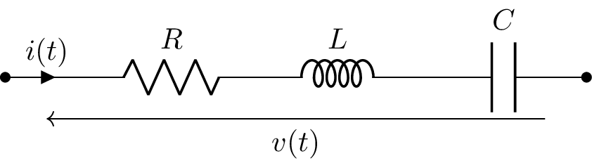 

</figure>

Si applica il secondo principio di Kirchhoff e si ottiene la seguente espressione nel dominio del tempo: $$\begin{gathered}
    v(t)=Ri(t)+L\displaystyle\frac{\mathrm{d}i(t)}{\mathrm{d}t}+\frac{1}{C}\int_{0^-}^ti(\tau)\mathrm{d}\tau+v_C(0^-)
\end{gathered}$$ Si trasforma ora quest’equazione integro-differenziale, portandola nel dominio di Laplace: $$\begin{gathered}
    V(s)=RI(s)+LsI(s)-Li(0^-)+\displaystyle\frac{1}{sC}I(s)+\frac{v_C(0^-)}{s}
\end{gathered}$$ All’interno dell’equazione espressa nel dominio di Laplace è presente la memoria della corrente, oggetto non presente nell’espressione a tempo continuo, per cui non sarà necessario risolvere un problema di Cauchy per determinare le costanti nel dominio di Laplace. Si considera ora un caso a memoria nulla: $$\begin{gathered}
    V(s)=RI(s)+LsI(s)+\displaystyle\frac{1}{sC}I(s)=\left(R+sL+\frac{1}{sC}\right)I(s)
\end{gathered}$$ Si individua quindi l’impedenza nel dominio di Laplace del circuito RLC serie: $$\begin{gathered}
    z(s)=R+sL+\displaystyle\frac{1}{sC}
\end{gathered}$$ Mentre l’ammettenza nel dominio di Laplace: $$\begin{gathered}
    y(s)=\displaystyle\frac{1}{z(s)}
\end{gathered}$$

L’argomento della funzione esponenziale deve essere adimensionale, per cui la variabile complessa $s$ ha una dimensione adeguata: $$\begin{gathered}
=\displaystyle\frac{1}{[t]}=\mathrm{s}^{-1}=\mathrm{Hz}
\end{gathered}$$

Si vuole determinare la dimensione delle grandezze nel dominio di Laplace, per cui si considerano i componenti singolarmente. Dato un solo induttore nella convenzione degli utilizzatori si ottiene la seguente espressione: $$\begin{gathered}
    v(t)=L\displaystyle\frac{\mathrm{d}i(t)}{\mathrm{d}t}\\
    V(s)=sLI(s)-Li(0^-)
\end{gathered}$$ La grandezza $Li$ è stata definita inizialmente come un flusso: $$\begin{gathered}
    Li=[\phi]=[\mathrm{V}\cdot \mathrm{s}]
\end{gathered}$$ Analogamente si considera un singolo condensatore: $$\begin{gathered}
    i(t)=C\displaystyle\frac{\mathrm{d}v(t)}{\mathrm{d}t}\\
    I(s)=sCV(s)-Cv(0^-)
\end{gathered}$$ La grandezza $Cv$ rappresenta una carica, per cui: $$\begin{gathered}
    Cv=[\mathrm{A}\cdot \mathrm{s}]=[\mathrm{Q}]
\end{gathered}$$ Per cui la grandezza dell’impedenza nel dominio di Laplace si ottiene come il rapporto tra la dimensione della tensione e della corrente: $$\begin{gathered}
=\displaystyle\frac{\mathrm{V}\cdot \mathrm{s}}{\mathrm{A}\cdot \mathrm{s}}=\Omega
\end{gathered}$$ Per cui si può considerare il componente $z(s)$ un’impedenza, poiché mantiene la sua grandezza nel trasferimento dal tempo continuo al dominio di Laplace. Mentre la tensione e la corrente cambiano le loro dimensioni nel dominio di Laplace.

Si considera l’espressione ottenuta da un’induttore: $$\begin{gathered}
    V(s)=sLI(s)-Li(0^-)\\
    sLI(s)=V(s)+Li(0^-)\\
    I(s)=\displaystyle\frac{1}{sL}V(s)+\frac{L}{L}\frac{i(0^-)}{s}
\end{gathered}$$ Si considera la forma integrale della legge costitutiva dell’induttore e la sua trasformata: $$\begin{gathered}
    i(t)=\displaystyle\frac{1}{L}\int_{0^+}^tv(\tau)\mathrm{d}\tau+i(0^-)\\
    I(s)=\displaystyle\frac{1}{sL}V(s)+\frac{i(0^-)}{s}
\end{gathered}$$ Si è quindi dimostrata la validità della proprietà integrale di Laplace sui circuiti.

### Resistore in Laplace

Dato un singolo resistore, l’impedenza coincide con il valore della resistenza: $$\begin{gathered}
    z(s)=R
\end{gathered}$$

Tra il dominio del tempo e di Laplace si mantiene lo stesso simbolo nella loro rappresentazione circuitale, anche se è sconsigliato l’usco dello stesso simbolo per domini differenti. Per cui si considera nelle seguenti rappresentazioni un bipolo generico per rappresentare i bipoli in Laplace. Per un resistore la legge costitutiva tra i due domini diventa: $$\begin{gathered}
    v(t)=Ri(t)\to V(s)=RI(s)
\end{gathered}$$

<figure>

   

</figure>

### Induttore in Laplace

Per un induttore: $$\begin{gathered}
    v=\displaystyle L\frac{\mathrm{d}i}{\mathrm{d}t}\to V(s)=sLI(s)-Li(0^-)\\
    i=\displaystyle\frac{1}{L}\int_{0^-}^tv\mathrm{d}\tau+i(0^-)\to I(s)=\frac{1}{sL}V(s)+\frac{i(0^-)}{s}
\end{gathered}$$ Per cui nel dominio di Laplace corrisponde ad un lato Thevenin/Norton:

<figure>

     

</figure>

### Condensatore in Laplace

Per un condensatore: $$\begin{gathered}
    i=\displaystyle C\frac{\mathrm{d}v}{\mathrm{d}t}\to I(s)=sCV(s)-Cv(0^-)\\
    v=\displaystyle\frac{1}{C}\int_{0^-}^ti\mathrm{d}\tau+v(0^-)\to V(s)=\frac{1}{sC}I(s)+\frac{v(0^-)}{s}
\end{gathered}$$ Per cui nel dominio di Laplace corrisponde ad un lato Thevenin/Norton:

<figure>

     

</figure>

### Fasori e Laplace

Si considera ora un’analisi nel dominio dei fasori del circuito RLC, per determinare relazioni tra i due domini: $$\begin{gathered}
    \overline{V}=\left(R+j\omega-\displaystyle\frac{j}{\omega C}\right)\overline{I}
\end{gathered}$$ A memorie nulle nel dominio di Laplace lo stesso circuito si esprime tramite la seguente espressione: $$\begin{gathered}
    V(s)=\left[R+sL+\displaystyle\frac{1}{sC}\right]I(s)
\end{gathered}$$ Fissata una pulsazione $\omega$ ed assegnando alla variable complessa $s$ il valore $s=j\omega$, si ottiene l’impedenza a regime permanente: $$\begin{gathered}
    z(j\omega)=z
\end{gathered}$$ Ma i fasori non possono espressi rispetto alle grandezze in Laplace con $s=j\omega$: $$\begin{gathered}
    \overline{V}\neq V(j\omega)\\
    \overline{I}\neq I(j\omega)
\end{gathered}$$ Ma poiché i valori delle impedenze sono gli stessi, allora i rapporti tra le grandezze rimangono invariati nei due domini: $$\begin{gathered}
    \displaystyle\frac{\overline{V}}{\overline{I}}=\frac{V(j\omega)}{I(j\omega)}
\end{gathered}$$ Per dimostrare questa relazione si considera la trasformata di una grandezza sinusoidale, per semplicità si considera a fase nulla $\gamma=0$: $$\begin{gathered}
    \mathcal{L}\{V_M\sin\omega t\}=\mathcal{L}\left\{\displaystyle\frac{V_M}{2j}\left(e^{j\omega t}-e^{-j\omega t}\right)\right\}\\
    \frac{V_M}{2j}\left[\frac{1}{s-j\omega}-\frac{1}{s+j\omega}\right]=\frac{V_M}{2j}\frac{2j\omega}{s^2+\omega^2}=V_M\frac{\omega}{s^2+\omega^2}\tag{\stepcounter{equation}\theequation}
\end{gathered}$$ Si ottiene una trasformata simile per un coseno: $$\begin{gathered}
    \mathcal{L}\{A\cos(\omega t)\}=A\displaystyle\frac{e^{j\omega t}+e^{-j\omega t}}{2}=\frac{A}{2}\frac{s+j\omega+s-j\omega}{s^2+\omega^2}=\frac{As}{s^2+\omega^2}\tag{\stepcounter{equation}\theequation}
\end{gathered}$$

Si considera ora una sinusoide sfasata di un fattore $\varphi$ e si vuole determinare la sua trasformata: $$\begin{gathered}
    \mathcal{L}\{A\sin(\omega t+\varphi)\}=\mathcal{L}\{A\cos\varphi\sin(\omega t)+A\sin\varphi\cos(\omega t)\}=\displaystyle A\cos\varphi\frac{\omega}{s^2+\omega^2}+A\sin\varphi\frac{s}{s^2+\omega^2}\\
    \mathcal{L}\{A\sin(\omega t+\varphi)\}=\displaystyle\frac{A\cos\varphi \omega+A\sin\varphi s}{s^2+\omega^2}\tag{\stepcounter{equation}\theequation}
\end{gathered}$$

Si considera una funzione esponenziale moltiplicata per un fattore lineare: $$\begin{gathered}
    \mathcal{L}\{Ate^{\alpha t}\}=F(s)\\
    \mathcal{L}\left\{\displaystyle\frac{\mathrm{d}}{\mathrm{d}t}\left(Ate^{\alpha t}\right)\right\}=\mathcal{L}\{Ae^{\alpha t}+A\alpha te^{\alpha t}\}=A\mathcal{L}\{e^{\alpha t}\}+\alpha\mathcal{L}\{Ate^{\alpha t}\}=sF(s)-f(0^-)\\
    \displaystyle\frac{A}{s-\alpha}+\alpha F(s)=sF(s)\\
    \mathcal{L}\{Ate^{\alpha t}\}=\frac{A}{(s-\alpha)^2}\tag{\stepcounter{equation}\theequation}
\end{gathered}$$

Data la trasformata della tensione, anch’essa scarica, si sostituisce $j\omega$: $$\begin{gathered}
    V(j\omega)=V_M\displaystyle\frac{\omega}{(j\omega)^2+\omega^2}=V_M\frac{\omega}{-\omega^2+\omega^2}
\end{gathered}$$ Si ottiene quindi una forma indeterminata. Analogamente per la trasformata della corrente (considerata a fase nulla $\beta=0$): $$\begin{gathered}
    I(s)=\displaystyle I_M\frac{\omega}{s^2+\omega^2}\\
    I(j\omega)=\displaystyle {I_M}\frac{\omega}{-\omega^2+\omega^2}
\end{gathered}$$ I valori che annullano il denominatore di una funzione nel dominio di Laplace si definiscono poli. Mentre considerando il rapporto tra i due, i poli si eliminano a vicenda: $$\begin{gathered}
    \displaystyle\frac{V(j\omega)}{I(j\omega)}=\displaystyle\frac{V_M\displaystyle\frac{\omega}{(j\omega)^2+\omega^2}}{I_M\displaystyle\frac{\omega}{(j\omega)^2+\omega^2}}=\frac{V_M}{I_M}
\end{gathered}$$ Per cui è legittimo definire l’impedenza a regime come rapporto tra queste due grandezze, calcolato al valore dei poli. Questa relazione persiste anche tra due grandezze sfasate di un fattore $\varphi$, in quel caso il rapporto tra le due grandezze restituisce un numero complesso.

Esistono quindi due rappresentazioni nel dominio dei numeri complessi per i circuiti. Il dominio dei fasori, numerico, ad una pulsazione $\omega$ fissata; ed il dominio simbolico di Laplace, dove la pulsazione $\omega$ è variabile. Il passaggio da una grandezza in Laplace ad un nel dominio dei fasori, tramite la sostituzione $s=j\omega$ è possibile solo se $j\omega$ non rappresenta un polo nel dominio di Laplace. Dove un polo $s_p$ è definito come un valore per cui la trasformata tende a valori infiniti: $$\begin{gathered}
    \lim_{s\to s_p}F(s)=\pm\infty
\end{gathered}$$ Nella trasformata di una funzione sinusoidale i poli sono esattamente pari a $\pm j\omega$, per cui non è possibile determinare l’espressione di una grandezza nel domino dei fasori, data la sua trasformata di Laplace, se nel tempo continuo la sua espressione a regime è una sinusoide.

## Risposta di un Circuito RC Serie

Si considera un circuito RC e si trasferisce nel dominio di Laplace. Nel tempo continuo si ha il seguente circuito:

<figure>

 

</figure>

Nel dominio di Laplace si ottiene:

<figure>

 

</figure>

Si risolve mediante il metodo dei nodi, considerando il nodo $B$ di calcolo, il nodo di salto: $$\begin{gathered}
    \left(\displaystyle\frac{1}{R}+sC\right)V_A(s)=\left(\frac{1+sCR}{R}\right)V_A(s)=\displaystyle\frac{E}{sR}+Cv_c(0^-)\\
    V_A(s)=\displaystyle\frac{R}{R}\frac{E}{s(1+sCR)}+\frac{RCv_C(0^-)}{1+sCR}\\
    \mathcal{L}^{-1}\{V_A(s)\}=v_A(t)= v_C(t)
\end{gathered}$$ Si determina ora un algoritmo per antitrasformata le grandezze ottenute senza effettuare l’integrale di antitrasformazione. Nei circuiti le espressioni delle grandezze si presentano sempre come frazioni tra polinomi: $$\begin{gathered}
    F(s)=\displaystyle\frac{N(s)}{D(s)}=\frac{a_ns^n+\cdots a_0}{b_ms^m+\cdots b_0}
\end{gathered}$$ Le frazioni si dicono proprie se il grado del denominatore è maggiore del grado del numeratore $m>n$, altrimenti se il grado del numeratore è maggiore si dicono improprie $n>m$. In caso siano improprie bisogna prima effettuare una divisione tra polinomi, ritornando una frazione propria ed polinomio.

Si definiscono poli al finito di una frazione propria, dei valori di $s=s_p$ tali che la funzione in Laplace tende a valori infiniti: $$\begin{gathered}
    \lim_{s\to s_p}F(s)=\infty
\end{gathered}$$ In una frazioni impropria i valori di $s\to\infty$ si definiscono poli all’infinito: $$\begin{gathered}
    \lim_{s\to\infty}s=\infty
\end{gathered}$$

Per attuare un’antitrasformazione si considera la frazione propria decomposizione in fratti semplici, considerando tutti i poli della funzione. In seguito si possono attuare delle antitrasformate notevoli per ottenere una funzione nel dominio del tempo. Considerando l’espressione ottenuta per la tensione si applica una suddivisione in fratti semplici: $$\begin{gathered}
    V_A(s)=\displaystyle\frac{E}{RC\left(s+\frac{1}{RC}\right)s}+\frac{RCv_C(0^-)}{RC\left(s+\frac{1}{RC}\right)}
\end{gathered}$$ Poiché la trasformata è un’operazione lineare si considerano entrambi i componenti separatamente. Il secondo oggetto corrisponde alla trasformata di un esponenziale di ampiezza $A=v_C(0^-)$ e di costante $\alpha=-\frac{1}{RC}$, per cui la sua antitrasformata corrisponde a: $$\begin{gathered}
    \displaystyle\frac{RC}{RC}\frac{v_C(0^-)}{s+\frac{1}{RC}}=v_C(0^-)e^{-\frac{t}{RC}}
\end{gathered}$$ Si individua un primo polo $s_p=-\frac{1}{RC}$, al finito. Con molteplicità uno. Coincide alla soluzione dell’equazione caratteristica associata all’equazione differenziale omogenea del circuito. Si considera ora il primo oggetto, e si decompone in fratti semplici. Si individuano i fratti semplici di numero pari alla somma tra la molteplicità di tutti i poli della frazione originaria. In questo caso sono presenti due poli, entrambi di molteplicità uno, per cui sono presenti due fratti semplici: $$\begin{gathered}
    \displaystyle\frac{E}{RC\left(s+\frac{1}{RC}\right)s}=\frac{A}{s+\frac{1}{RC}}+\frac{B}{RC}
\end{gathered}$$ Dopo aver trovato i fratti semplici bisogna determinare il valore numerico delle incognite $A$ e $B$. Senza sapere il valore delle incognite è nota la forma che assume quest’espressione nel dominio del tempo: $$\begin{gathered}
    Ae^{-\frac{t}{RC}}+Bu_{-1}(t)
\end{gathered}$$ Si considera la somma tra i due fratti semplici e si applica il principio di identità dei polinomi per trovare i valori di $A$ e $B$: $$\begin{gathered}
    As+Bs+\displaystyle\frac{B}{RC}=\frac{E}{RC}\\
    \begin{cases}
        A+B=0\\
        \displaystyle\frac{B}{RC}=\frac{E}{RC}
    \end{cases}\\
    \begin{cases}
        A=-E\\
        B=E
    \end{cases}\\
    -Ee^{-\frac{t}{RC}}+Eu_{-1}(t)
\end{gathered}$$ Per ottenere la soluzione completa si sommano i due oggetti appena antitrasformati, si considera $t\geq0^+$, per cui si omette il gradino: $$\begin{gathered}
    v_C(t)=v_C(0^-)e^{-\frac{t}{RC}}-Ee^{-\frac{t}{RC}}+E=(v_C(0^-)-E)e^{-\frac{t}{RC}}+E
\end{gathered}$$ Quest’espressione coincide con l’espressione ottenuta dall’analisi nel tempo del circuito RC.

Si considera un circuito RC con un’eccitazione in entrata pari ad un periodo di un’onda quadra:

<figure>

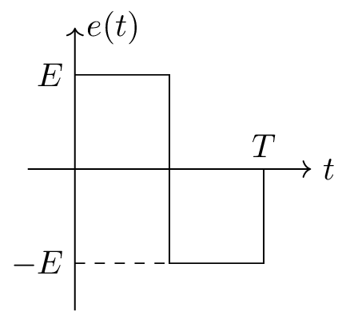 

</figure>

$$\begin{gathered}
    e(t)=e_1(t)+e_2(t)\\
    e_1(t)=E[u_{-1}(t)-u_{-1}(t-t_0)]\\
    e_2(t)=-E[u_{-1}(t-t_0)-u_{-1}(t-T)]
\end{gathered}$$ Si può analizzare la risposta del sistema ad intervalli, per rendere meno dispendiosa l’analisi da effettuare nel dominio di Laplace: $$\begin{gathered}
    \begin{cases}
        \mbox{per }0^+\leq t\leq t_0^-& v_C(t)=E\left(1-e^{-\frac{t}{RC}}\right)\\
        \mbox{per }t_0^+\leq t\leq T^-& v_C(t)=-E\left(1-e^{-\frac{t}{RC}}\right)
    \end{cases}
\end{gathered}$$

Nel caso in cui sia presente una periodicità nell’onda quadra in entrata al circuito, con un periodo $T=T_H+T_L$ dove $T_H$ è la base della finestra che assume valore positivo, mentre $T_L$ è il tempo per cui assume valore nullo, la sua Laplace trasformata può essere espressa come: $$\begin{gathered}
    F(s)=\displaystyle\frac{1}{s}\frac{1-e^{-sT_H}}{1-e^{-sT}}
\end{gathered}$$

Nel caso di un onda quadra simmetrica a valore medio nullo, che alterna tra valori positivi e negativi di stessa base $T/2$, si può esprimere la sua trasformata come: $$\begin{gathered}
    F(s)=\displaystyle\frac{1}{s}\frac{1-e^{-sT/2}}{1+e^{-sT/2}}
\end{gathered}$$

## Stabilità di Una Rete

Le proprietà di una risposta dovute ad un eccitazione consentono di definire gli operatori funzioni di rete. Dipendono dal rapporto tra due trasformate di Laplace, la trasformata della risposta $R$ e dell’eccitazione $E$: $$\begin{gathered}
    F_R(s)=\displaystyle\frac{R(s)}{E(s)}
\end{gathered}$$ Considerando un partitore di tensione, si può esprimere la grandezza in uscita tra i due morsetti $V_\mathrm{out}(s)$ come modulata delle impedenze interne $z_i(s)$, rispetto alla tensione in ingresso $V_\mathrm{in}(s)$: $$\begin{gathered}
    \displaystyle V_\mathrm{out}(s)=\frac{z_\mathrm{out}(s)}{\sum_{i=1}^nz_i(s)}V_\mathrm{in}(s)
\end{gathered}$$ La funzione di rete $F_R(s)$ o di trasferimento $H(s)$ è un operatore, nel caso di questo partitore di tensione definito da un rapporto in tensione: $$\begin{gathered}
    F_R(s)=H(s)=\displaystyle\frac{V_\mathrm{out}(s)}{V_\mathrm{in}(s)}=\frac{z_\mathrm{out}(s)}{\sum_{i=1}^nz_i(s)}
\end{gathered}$$ Anche l’impedenza e l’ammettenza sono due funzioni di rete, essendo il rapporto tra due grandezze, la tensione e la corrente.

Se fossero presenti dei poli instabili, ovvero a parte reale positiva, allora la tensione in uscita crescerebbe indefinitamente, tendendo all’infinito. Il sistema sarebbe quindi instabile. Quando si tratta della stabilità bisogna analizzare la natura dei poli della funzione di rete o di trasferimento della rete associata, in basa ad una data eccitazione. Se i poli hanno parte reale negativa, allora la risposta tende a valori nulli all’infinito, quindi il sistema è asintoticamente stabile.

Se la molteplicità del polo in $0$ è maggiore di uno $\nu>1$, allora sono presenti delle situazioni divergenti, ovvero instabili, nel dominio del tempo. Poiché un singolo polo in zero rappresenta un gradino nel dominio del tempo, se sono presenti più di un polo nell’origine, si possono calcolare integrando $\nu-1$ volte il gradino, per la proprietà dell’integrale della trasformata di Laplace: $$\begin{gathered}
    \displaystyle\frac{1}{s^{\nu-1}}\frac{1}{s}\to\int_{0^-}^t\cdots\int_{0^-}^tu_{-1}(t)\mathrm{d}t^{\nu-1}
\end{gathered}$$ Poiché il gradino assume valore costante, integrandolo si ottengono delle funzioni strettamente crescenti, per cui rappresentano delle dinamiche instabili.

L’antitrasformata può essere interpretata come un funzionale per trasferire una determinata funzione nel dominio del tempo. Altrimenti si può analizzare nell’ambito della funzione di rete, senza antitrasformare l’operatore, tramite interpretazione diretta sulla natura dei poli della funzione di rete, questo fornisce informazioni sulla natura delle grandezze associate nel dominio del tempo, per cui non è strettamente necessario attuare un’antitrasformata per determinare il comportamento di una rete nel tempo.

Per ritornare ad una forma nel tempo, data una serie di fratti semplici si può applicare il metodo dei residui. Il limite all’infinito diventa finito, quando viene moltiplicato per il fattore $s-s_i$. $$\begin{gathered}
    F(s)=\displaystyle\frac{a_ns^n+\cdots+a_0}{b_ms^m+\cdots+b_0}=\frac{\displaystyle\frac{1}{b_m}\left[a_ns^n+\cdots+a_0\right]}{(s-s_m)\cdots(s-s_0)}
\end{gathered}$$ Scomponendo in poli semplici si può esprimere una qualsiasi funzione di rete nella forma: $$\begin{gathered}
    F(s)=\displaystyle\frac{A_m}{s-s_m}+\cdots+\frac{A_1}{s-s_1}
\end{gathered}$$ Se il polo $s_i$ ha molteplicità $1$, allora il residuo $A_i$ associato al suo fratto semplice si calcola come: $$\begin{gathered}
    \lim_{s\to s_i}(s-s_i)F(s)=(s-s_i)\left(\displaystyle\frac{A_m}{s-s_m}+\cdots+\frac{A_i}{s-s_i}+\cdots+\frac{A_1}{s-s_1}\right)\\
    \displaystyle\cancelto{0}{\sum_{j=1}^{i-1}(s-s_i)\frac{A_j}{s-s_j}}+A_i\cancelto{1}{\frac{s-s_i}{s-s_i}}+\cancelto{0}{\sum_{j=i+1}^{m}(s-s_i)\frac{A_j}{s-s_j}}=A_1\\
    A_1=\lim_{s\to s_i}(s-s_i)F(s)=\left[\displaystyle\frac{1}{b_m}\frac{a_ns^n+\cdots+a_0}{(s-s_m)\cdots(s-s_{i-1})(s-s_{i+1})\cdots(s-s_0)}\right]_{s=s_i}\tag{\stepcounter{equation}\theequation}
\end{gathered}$$

Per un polo $s_i$ di molteplicità $\nu_i$, si determina il $k-$esimo residuo tramite la seguente espressione: $$\begin{gathered}
    A_{ik}=\displaystyle\frac{1}{(k-1)!}\left[\frac{\mathrm{d}^{k-1}}{\mathrm{d}s^{k-1}}\left[(s-s_i)^{\nu_i}F(s)\right]\right]_{s=s_i}
\end{gathered}$$

### Esempio Applicativo

Sia data la seguente funzione di rete con un polo di molteplicità due, determinare la sua antitrasformata: $$\begin{gathered}
    F(s)=\displaystyle\frac{10s+3}{(s+2)^2(s+5)}=\frac{A_{11}}{(s+2)^2}+\frac{A_{12}}{s+2}+\frac{B}{s+5}\\
    \left[(s+2)^2F(s)\right]_{s=-2}=A_1+A_2(s+2)+\displaystyle\frac{B(s+2)^2}{s+5}=A_1=\frac{10(-2)+3}{(-2+5)}\\
    G(s)=(s+2)^2F(s)\\
    \displaystyle\left[\frac{\mathrm{d}G(s)}{\mathrm{d}s}\right]_{s=-2}=\left[\frac{10(s+5)-(10s+3)}{(s+5)^2}\right]_{s=-2}=A_2
\end{gathered}$$ Sia data la seguente funzione di rete assegnata con un polo di molteplicità tre: $$\begin{gathered}
    F(s)=\displaystyle\frac{3s+5}{(s+1)^3(s+2)(s+3)}=\frac{A_{13}}{(s+1)^3}+\frac{A_{12}}{(s+1)^2}+\frac{A_{11}}{s+1}+\frac{B}{s+2}+\frac{C}{s+3}\\
    (s+1)^3F(s)\bigg|_{s=-1}=A_{13}=\displaystyle\frac{-3+5}{(-1+2)(-1+3)}\\
    \displaystyle\frac{\mathrm{d}}{\mathrm{d}s}\left[(s+1)^3F(s)\right]_{s=-1}=A_{12}=\frac{\mathrm{d}}{\mathrm{d}s}\left[\frac{(s+1)^3(3s+5)}{(s+2)(s+5)}\right]_{s=-1}\\
    \frac{1}{2}\displaystyle\frac{\mathrm{d}^2}{\mathrm{d}s^2}\left[(s+1)^3F(s)\right]_{s=-1}=A_{11}=\frac{1}{2}\frac{\mathrm{d}^2}{\mathrm{d}s^2}\left[\frac{(s+1)^3(3s+5)}{(s+2)(s+5)}\right]_{s=-1}
\end{gathered}$$

# Due-Porte

Anche chiamati quadripoli o doppi bipoli, sono degli oggetti che presentano quattro correnti in entrata. Queste correnti sono tali da rispettare il primo principio di Kirchhoff:

<figure>

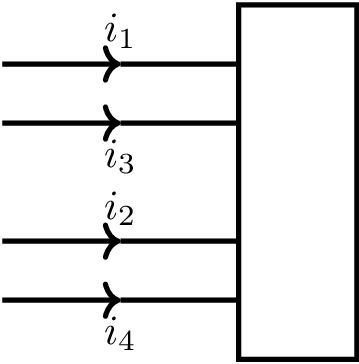 

</figure>

$$\begin{gathered}
    \displaystyle\sum_{k=1}^4i_k=0
\end{gathered}$$

Un quadriporta presente due coppie di correnti, se ogni porta rispetta il primo principio di Kirchhoff, allora si dice due-porte o doppio bipolo: $$\begin{gathered}
    \begin{cases}
        i_3=-i_1\\
        i_4=-i_2
    \end{cases}
\end{gathered}$$ Per cui nella rappresentazione di un due-porte si omette una delle due correnti in una porta, poiché è ridondante.

<figure>

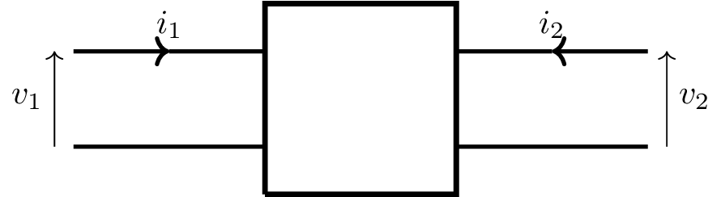 

</figure>

Nel caso di un multiporta si considera uno dei morsetti un riferimento rispetto al quale si calcolano le altre tre tensioni sugli altri tre morsetti. Mentre per un due porte, dove si usa la convenzione degli utilizzatori, sono presenti due tensioni alle due porte del’oggetto. Per determinare se sia un generatore o un utilizzatore si considerano le potenze istantanee generate da entrambe le porte: $$\begin{gathered}
    v_1i_1+v_2i_2=p\\
    \displaystyle\int_{-\infty}^tp \mathrm{d}t:\begin{cases}
        \geq0&\mbox{passivo}\\
        <0&\mbox{attivo}
    \end{cases}
\end{gathered}$$ Poiché è un oggetto a sé, sono necessarie delle leggi costitutive per il due porte: $$\begin{cases}
        f(i_1,i_2,i_3,i_4)=0\\
        f(v_1,v_2,v_3,v_4)=0
    \end{cases}$$ Queste espressioni vengono chiamate leggi costitutive implicite.

Si dice due porte bilanciato se tutte le entrate sono accoppiate ad univocamente, se invece sono presenti solo tre entrate in corrente, si chiama due-porte sbilanciato, un transistor è un tipo di due-porte sbilanciato. Si può ricondurre questo due porte sbilanciato ad un due porte bilanciato, considerando il resto del circuito connesso ad una delle entrate. Ciò che verrà identificato in seguito come una rappresentazione stella.

Per i multiporta vengono fornite sette diverse rappresentazioni esplicite, le leggi costitutive esplicite di un multiporta vengono rappresentate in forma matriciale. Si elencano le rappresentazioni di due-porte, senza le rappresentazioni a parametri indiretti ed a parametri $S$ ("Scattering"), usata nello studio dei campi e per le guide d’onda:

## Rappresentazione a Parametri Z

$$\begin{gathered}
    \begin{bmatrix}
        V_1\\V_2
    \end{bmatrix}=\begin{bmatrix}
        z_{11}&z_{12}\\z_{21}&z_{22}
    \end{bmatrix}\begin{bmatrix}
        I_1\\I_2
    \end{bmatrix}\\
    V_1=z_{11}I_1+z_{12}I_2\\
    V_2=z_{21}I_1+z_{22}I_2
\end{gathered}$$ Le grandezze vengono espresse nel dominio di Laplace o dei fasori, per considerare le relazioni integro-differenziali tramite combinazioni lineari. Viene anche chiamata rappresentazione controllata in corrente.

Una delle rappresentazioni più comuni di un due-porte si ottiene tramite generatori controllati, in una rappresentazione Thevenin, che tengono conto del contributo dell’altra porta:

<figure>

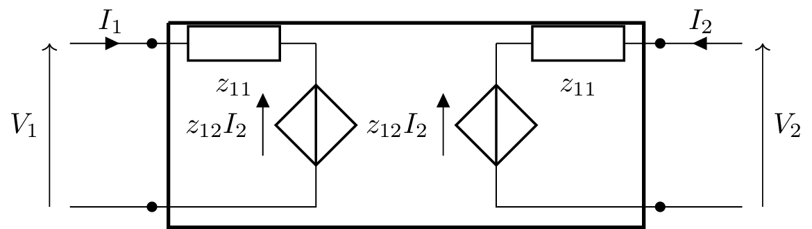 

</figure>

Le due porte sono speculari tra di loro, poiché le grandezze controllate sono omogenee.

## Rappresentazione a Parametri Y

$$\begin{gathered}
    \begin{bmatrix}
        I_1\\I_2
    \end{bmatrix}=\begin{bmatrix}
        y_{11}&y_{12}\\y_{21}&y_{22}
    \end{bmatrix}\begin{bmatrix}
        V_1\\V_2
    \end{bmatrix}\\
    I_1=y_{11}V_1+y_{12}V_2\\
    I_2=y_{21}V_1+y_{22}V_2
\end{gathered}$$

Si indica anche come rappresentazione controllata in tensione.

<figure>

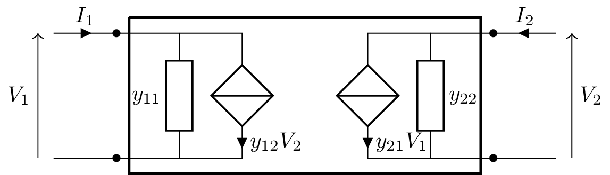 

</figure>

## Rappresentazione a Parametri Ibridi (Diretti) H

Ogni elemento della matrice presenta una sua unità di misura, per cui non può essere costruita a priori. $$\begin{gathered}
    \begin{bmatrix}
        V_1\\I_2
    \end{bmatrix}=\begin{bmatrix}
        h_{11}&h_{12}\\h_{21}&h_{22}
    \end{bmatrix}\begin{bmatrix}
        I_1\\V_2
    \end{bmatrix}\\
    \begin{cases}
        [h_{11}]=\Omega\\
        [h_{12}]=1\\
        [h_{21}]=1\\
        [h_{22}]=\Omega^{-1}
    \end{cases}\\
    V_1=h_{11}I_21+h_{12}V_2\\
    I_2=h_{21}I_1+h_{22}V_2
\end{gathered}$$

<figure>

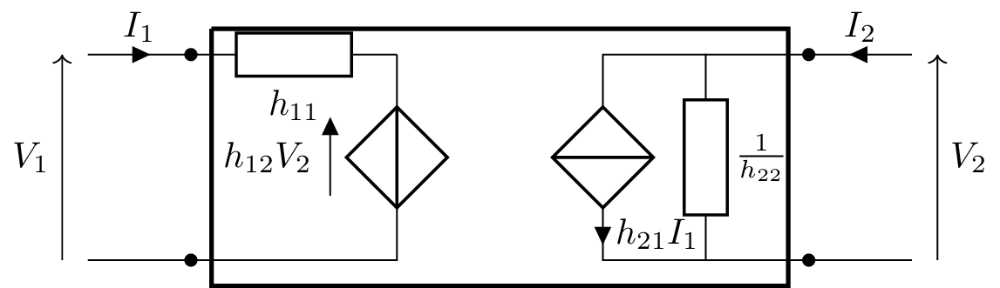 

</figure>

## Rappresentazione a Parametri di Trasmissione Diretta

Si considera una matrice $[T]$, detto parametro di trasmissione: $$\begin{gathered}
    \begin{bmatrix}
        V_1\\I_1
    \end{bmatrix}=\begin{bmatrix}
        A&B\\C&D
    \end{bmatrix}\begin{bmatrix}
        V_2\\-I_2
    \end{bmatrix}
    \begin{cases}
        [A]=1\\
        [B]=\Omega\\
        [C]=\Omega^{-1}\\
        [D]=1
    \end{cases}
\end{gathered}$$

Vengono usate nella rappresentazione di linee lunghe, dove è necessario adoperare parametri distribuiti e non concentrati. Ma, se fissata una lunghezza immutabile di un tratto di linea, è possibile modellarla come una partenza ed un arrivo tramite un due-porte particolare a parametri concentrati da cui entra una corrente $I_1$ ed esce una corrente $I_2$, questo è in conflitto con la convenzione elettrotecnica di considerare tutte le correnti entranti in un multiporta, per cui si usa $-I_2$.

## Proprietà Generali

A prescindere dalla rappresentazione tutti i due-porte godono delle proprietà qui descritte.

<figure>

 

</figure>

Il due-porte si dice reciproco, se singolarmente soddisfa il teorema di Tellegen. Per cui tra i suoi due lati vale la seguente relazione: $$\begin{gathered}
    V_1^aI_1^b+V_2^aI_2^b=V_1^bI_1^a+V_2^bI_2^a
\end{gathered}$$ Per dimostrare questa proprietà si considera la rappresentazione a parametri Z, nei due casi $a$ e $b$: $$\begin{gathered}
    \begin{cases}
        V_1=z_{11}I_1+z_{12}I_2\\
        V_2=z_{21}I_1+z_{22}I_2
    \end{cases}\\
    (z_{11}I_1^a+z_{12}I_2^a)I_1^b+(z_{21}I_1^a+z_{22}I_2^a)I^b=(z_{11}I_1^b+z_{12}I_2^b)I^a+(z_{21}I_1^b+z_{22}I_2^b)I^a\\
    z_{12}I_2^aI_1^b+z_{21}I_1^aI_2^b=z_{12}I_2^bI_1^a+z_{21}I_1^bI_2^a
\end{gathered}$$ Per il principio di identità dei polinomi si ottiene la seguente condizione di reciprocità per i parametri Z: $$\begin{gathered}
    z_{12}=z_{21}
\end{gathered}$$ Si assume che le altre rappresentazioni possano essere tramutate in parametri Z, poiché se non fosse possibile, non il due-porte non sarebbe reciproco.

Il due-porte si dice simmetrico, se invertendo le porte, il resto del circuito non ha conseguenze elettriche, ovvero è presente l’invarianza all’inversione delle porte. Si considerano due casi, dove vengono inseriti due generatori di tensione $E$ e $\mathcal{E}$ al due-porte, con una corrente misurata $I$ e $\mathcal{I}$:

<figure>

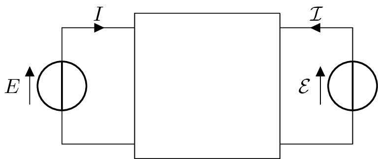 

</figure>

Nella rappresentazione Z si ottiene la seguente espressione in forma matriciale: $$\begin{gathered}
    \begin{bmatrix}
        E\\\mathcal{E}
    \end{bmatrix}\begin{bmatrix}
        z_{11}&z_{12}\\z_{21}&z_{22}
    \end{bmatrix}\begin{bmatrix}
        I\\\mathcal{I}
    \end{bmatrix}\\
    E=z_{11}I+z_{12}\mathcal{I}
\end{gathered}$$ Invertendo le porte si ottiene la seguente espressione:

<figure>

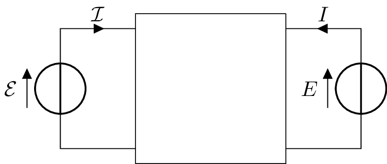 

</figure>

$$\begin{gathered}
    \begin{bmatrix}
        \mathcal{E}\\E
    \end{bmatrix}\begin{bmatrix}
        z_{11}&z_{12}\\z_{21}&z_{22}
    \end{bmatrix}\begin{bmatrix}
        \mathcal{I}\\I
    \end{bmatrix}\\
    E=z_{21}\mathcal{I}+z_{22}I
\end{gathered}$$ Per il principio di identità dei polinomi si ottiene la seguente condizione per la simmetria a parametri Z: $$\begin{gathered}
    z_{11}=z_{22}\\
    z_{12}=z_{21}
\end{gathered}$$ Un due porte è simmetrico, quando è anche reciproco, ma può essere reciproco senza essere simmetrico.

## Rappresentazione Stella e Triangolo

Un due-porte è rappresentabile a bipoli, come modello interno, se è reciproco. Può essere rappresentato come sbilanciato, bilanciato dall’esterno, oppure direttamente bilanciato:

<figure>

 

</figure>

Questa configurazione viene chiamata stella, o struttura a ipsilon $Y$ o $T$. Nella rappresentazione a stella si chiama il punto centrale centro stella $0$.

<figure>

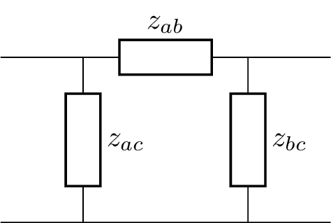 

</figure>

Questa configurazione viene chiamata triangolo, o struttura pi greco $\pi$.

Per passare da una rappresentazione stella ad una a triangolo si considerano due generatori di tensione in entrata alla configurazione stella $V_1$ e $V_2$, misurando correnti $I_1$ e $I_2$:

<figure>

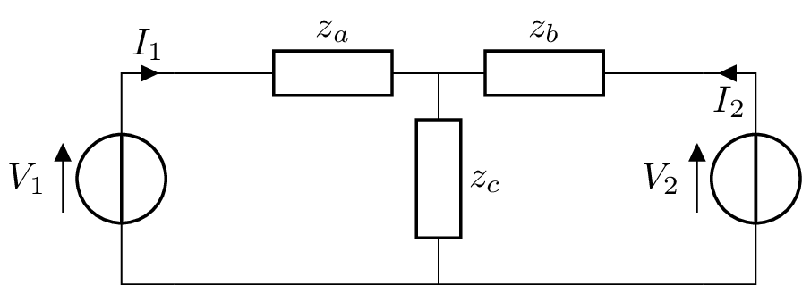 

</figure>

Si applica il metodo delle maglie nella rappresentazione a stella: $$\begin{gathered}
    \begin{bmatrix}
        V_1\\-V_2
    \end{bmatrix}=\begin{bmatrix}
        z_a+z_c&-z_c\\-z_c&z_b+z_c
    \end{bmatrix}\begin{bmatrix}
        I_1\\-I_2
    \end{bmatrix}
\end{gathered}$$

<figure>

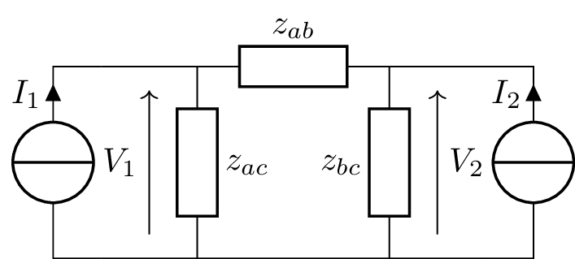 

</figure>

Si applica il metodo dei nodi sulla rappresentazione a triangolo, dopo aver inserito due generatori di tensione $I_1$ e $I_2$, misurando una tensione $V_1$ e $V_2$: $$\begin{gathered}
    \begin{bmatrix}
        I_1\\I_2
    \end{bmatrix}=\begin{bmatrix}
        y_{ac}+y_{ab}&-y_{ab}\\-y_{ab}&y_{bc}+y_{ab}
    \end{bmatrix}\begin{bmatrix}
        V_1\\V_2
    \end{bmatrix}
\end{gathered}$$

Per ottenere lo stesso vettore delle grandezze si cambia il segno di $V_2$ e $I_2$ nell’equazione delle maglie: $$\begin{gathered}
    \begin{bmatrix}
        V_1\\V_2
    \end{bmatrix}=\begin{bmatrix}
        z_a+z_c&z_c\\z_c&z_b+z_c
    \end{bmatrix}\begin{bmatrix}
        I_1\\I_2
    \end{bmatrix}
\end{gathered}$$ Per cui se le matrici sono invertibili, allora si può passare tra le due rappresentazioni tramite la seguente espressione: $$\begin{gathered}
    \begin{bmatrix}
        z_a+z_c&z_c\\z_c&z_b+z_c
    \end{bmatrix}^{-1}=\begin{bmatrix}
        y_{ac}+y_{ab}&-y_{ab}\\-y_{ab}&y_{bc}+y_{ab}
    \end{bmatrix}\\
    \displaystyle\frac{1}{z_az_b+z_bz_c+z_az_c}\begin{bmatrix}
        z_b+z_c&-z_c\\-z_c&z_a+z_b
    \end{bmatrix}=\begin{bmatrix}
        y_{ac}+y_{ab}&-y_{ab}\\-y_{ab}&y_{bc}+y_{ab}
    \end{bmatrix}\\
    \begin{cases}
        y_{ab}=\displaystyle\frac{\strut z_c}{\strut z_az_b+z_bz_c+z_az_c}\\
        y_{ac}=\displaystyle\frac{\strut z_b}{\strut z_az_b+z_bz_c+z_az_c}\\
        y_{bc}=\displaystyle\frac{\strut z_a}{\strut z_az_b+z_bz_c+z_az_c}
    \end{cases}
\end{gathered}$$ Per la trasformazione da triangolo a stella, si usufruisce la seguente espressione: $$\begin{gathered}
    \begin{bmatrix}
        y_{ac}+y_{ab}&-y_{ab}\\-y_{ab}&y_{bc}+y_{ab}
    \end{bmatrix}^{-1}=\begin{bmatrix}
        z_a+z_c&z_c\\z_c&z_b+z_c
    \end{bmatrix}\\
    \displaystyle\frac{1}{y_{ac}y_{ab}+y_{ac}y_{bc}+y_{ab}y_{bc}}\begin{bmatrix}
        y_{bc}+y_{ab}&y_{ab}\\y_{ab}&y_{ac}+y_{ab}
    \end{bmatrix}=\begin{bmatrix}
        z_a+z_c&z_c\\z_c&z_b+z_c
    \end{bmatrix}\\
    \begin{cases}
        z_a=\displaystyle\frac{\strut y_{bc}}{\strut y_{ac}y_{ab}+y_{ac}y_{bc}+y_{ab}y_{bc}}\\
        z_b=\displaystyle\frac{\strut y_{ac}}{\strut y_{ac}y_{ab}+y_{ac}y_{bc}+y_{ab}y_{bc}}\\
        z_c=\displaystyle\frac{\strut y_{ab}}{\strut y_{ac}y_{ab}+y_{ac}y_{bc}+y_{ab}y_{bc}}
    \end{cases}
\end{gathered}$$

Quando sono presenti tre impedenze uguali nella rappresentazione a stella, allora nella rappresentazione a triangolo le ammettenze equivalenti si ottengono tramite: $$\begin{gathered}
    z_a=z_b=z_c=z_{\star}\\
    y_{ab}=y_{bc}=y_{ac}=y_{\Delta}=\displaystyle\frac{1}{3z_{\star}}
\end{gathered}$$ Questo tipo di trasformazioni sono utili per calcolare la resistenza equivalente, se fosse presente una delle due configurazioni, sarebbe possibile trasformarla nell’altra configurazione, rappresentazione identica per l’esterno, in modo da poter facilitare l’analisi.

Data la rappresentazione a stella, si può ritornare ad una rappresentazione Z di un due-porte considerando le seguenti relazioni: $$\begin{gathered}
    z_a+z_c=z_{11}\\
    z_c=z_{12}=z_{21}\\
    z_b+z_c=z_{22}
\end{gathered}$$ Per cui necessariamente il due-porte corrispondente è reciproco. Per una rete simmetrica si ha che $z_a=z_b$, per cui si ottiene una rappresentazione:

<figure id="fig:rappresentazione-rete-simmetrica">

  

<figcaption>Rappresentazione Rete Simmetrica</figcaption>
</figure>

## Passaggio a Rappresentazione Z

Una rappresentazione Y può esistere solo se esiste una rappresentazione Z, se i suoi parametri non sono nulli e la sua matrice è invertibile. Si considera il seguente circuito, analizzato come fosse un due-porte:

<figure>

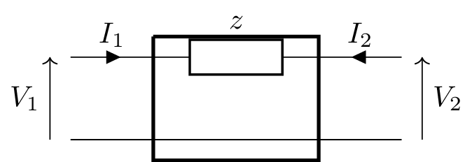 

</figure>

Si applicano i principi di Kirchhoff in senso orario: $$\begin{gathered}
    \begin{cases}
        V_1=V_2+zI_1\\
        I_1=-I_2
    \end{cases}
\end{gathered}$$ In forma matriciale si esprime come: $$\begin{gathered}
    \begin{bmatrix}
        1&-1\\0&0
    \end{bmatrix}\begin{bmatrix}
        V_1\\V_2
    \end{bmatrix}=\begin{bmatrix}
        z&0\\1&1
    \end{bmatrix}\begin{bmatrix}
        I_1\\I_2
    \end{bmatrix}
\end{gathered}$$ Poiché la matrice non è invertibile, non si può ottenere una rappresentazione Z, per cui non presente parametri Z, invece ha parametri Y, poiché la matrice che moltiplica le correnti è invertibile: $$\begin{gathered}
    \begin{bmatrix}
        I_1\\I_2
    \end{bmatrix}=\displaystyle\frac{1}{z}\begin{bmatrix}
        1&0\\-1&z
    \end{bmatrix}\begin{bmatrix}
        1&-1\\0&0
    \end{bmatrix}\begin{bmatrix}
        V_1\\V_2
    \end{bmatrix}\\
    [y]=\begin{bmatrix}
        \displaystyle\frac{\strut 1}{\strut z}&\displaystyle-\frac{\strut 1}{\strut z}\\
        \displaystyle-\frac{\strut 1}{\strut z}&\displaystyle\frac{\strut 1}{\strut z}
    \end{bmatrix}
\end{gathered}$$ La matrice dei parametri Y ottenuti non è invertibile, poiché non esiste una rappresentazione a parametri Z.

Data una rappresentazione H, è possibile trasformarla in una rappresentazione a parametri Z per ottenere le condizioni delle proprietà del due-porte associato:

$$\begin{gathered}
    \begin{bmatrix}
        V_1\\I_2
    \end{bmatrix}=\begin{bmatrix}
        h_{11}&h_{12}\\h_{21}&h_{22}
    \end{bmatrix}\begin{bmatrix}
        I_1\\V_2
    \end{bmatrix}\\
    \begin{bmatrix}
        1&0\\0&0
    \end{bmatrix}\begin{bmatrix}
        V_1\\V_2
    \end{bmatrix}+\begin{bmatrix}
        0&0\\0&1
    \end{bmatrix}\begin{bmatrix}
        I_1\\I_2
    \end{bmatrix}=\begin{bmatrix}
        0&h_{12}\\0&h_{22}
    \end{bmatrix}\begin{bmatrix}
        V_1\\V_2
    \end{bmatrix}+\begin{bmatrix}
        h_{11}&0\\h_{21}&0
    \end{bmatrix}\begin{bmatrix}
        I_1\\I_2
    \end{bmatrix}\\
    \begin{bmatrix}
        1&-h_{12}\\0&-h_{22}
    \end{bmatrix}\begin{bmatrix}
        V_1\\V_2
    \end{bmatrix}=\begin{bmatrix}
        h_{11}&0\\h_{21}&-1
    \end{bmatrix}\begin{bmatrix}
        I_1\\I_2
    \end{bmatrix}\\
\end{gathered}$$ Esiste una rappresentazione Z se la matrice che moltiplica il vettore delle tensioni è reversibile, per cui il determinante deve essere non nullo: $$\begin{gathered}
    h_{22}\neq0\\
    \begin{bmatrix}
        V_1\\V_2
    \end{bmatrix}=\displaystyle-\frac{1}{h_{22}}\begin{bmatrix}
        -h_{22}&h_{12}\\0&1
    \end{bmatrix}\begin{bmatrix}
        h_{11}&0\\h_{21}&-1
    \end{bmatrix}\begin{bmatrix}
        I_1\\I_2
    \end{bmatrix}\\
    \begin{bmatrix}
        V_1\\V_2
    \end{bmatrix}=\displaystyle-\frac{1}{h_{22}}\begin{bmatrix}
        -h_{22}h_{11}+h_{21}h_{12}&-h_{12}\\h_{21}&-1
    \end{bmatrix}\begin{bmatrix}
        I_1\\I_2
    \end{bmatrix}
\end{gathered}$$ Si può notare come l’elemento in $1,1$ corrisponde all’opposto del determinante della matrice H. Per diretto confronto con la matrice Z si ottengono le seguenti espressioni per esprimere una rappresentazione H in parametri Z: $$\begin{gathered}
    z_{11}=\displaystyle\frac{\det[H]}{h_{22}}\\
    z_{12}=\displaystyle\frac{h_{12}}{h_{22}}\\
    z_{21}=\displaystyle-\frac{h_{21}}{h_{22}}\\
    h_{22}=\displaystyle\frac{1}{h_{21}}
\end{gathered}$$ Per cui per una rappresentazione a parametri ibridi la condizione di simmetria viene verificata se i parametri H rispettano le condizioni di reciprocità e di inversione di porta: $$\begin{gathered}
    \mbox{Simmetria: }z_{12}=z_{21}\to h_{12}=-h_{21}\\
    \mbox{Inversione di porta: }z_{11}=z_{22}\to\det[H]=1
\end{gathered}$$

Data una rappresentazione a parametri di trasmissione diretta si converte in una rappresentazione Z: $$\begin{gathered}
    \begin{bmatrix}
        V_1\\I_1
    \end{bmatrix}=\begin{bmatrix}
        A&-B\\C&-D
    \end{bmatrix}\begin{bmatrix}
        V_2\\I_2
    \end{bmatrix}\\
    \begin{bmatrix}
        1&0\\0&0
    \end{bmatrix}\begin{bmatrix}
        V_1\\V_2
    \end{bmatrix}+\begin{bmatrix}
        0&0\\1&0
    \end{bmatrix}\begin{bmatrix}
        I_1\\I_2
    \end{bmatrix}=\begin{bmatrix}
        0&A\\0&C
    \end{bmatrix}\begin{bmatrix}
        V_1\\V_2
    \end{bmatrix}+\begin{bmatrix}
        0&-B\\0&-D
    \end{bmatrix}\begin{bmatrix}
        I_1\\I_2
    \end{bmatrix}\\
    \begin{bmatrix}
        1&-A\\0&-C
    \end{bmatrix}\begin{bmatrix}
        V_1\\V_2
    \end{bmatrix}=\begin{bmatrix}
        0&-B\\-1&-D
    \end{bmatrix}\begin{bmatrix}
        I_1\\I_2
    \end{bmatrix}
\end{gathered}$$ Esiste una rappresentazione Z equivalente se la matrice di destra è invertibile: $$\begin{gathered}
    C\neq0\\
    \displaystyle\begin{bmatrix}
        V_1\\V_2
    \end{bmatrix}=-\frac{1}{C}\begin{bmatrix}
        -A&BC-AD\\-1&-D
    \end{bmatrix}\begin{bmatrix}
        I_1\\I_2
    \end{bmatrix}
\end{gathered}$$ L’elemento in $1,2$ corrisponde all’opposto del determinante della matrice $T$, per cui una rappresentazione Z equivalente si ottiene mediante la seguente espressione: $$\begin{gathered}
    z_{11}=\displaystyle\frac{A}{C}\\
    z_{12}=\displaystyle\frac{\det[T]}{C}\\
    z_{21}=\displaystyle\frac{1}{C}\\
    z_{22}=\displaystyle\frac{D}{C}
\end{gathered}$$ Le condizioni delle proprietà per una rappresentazione a parametri diretti T sono quindi date dalle seguenti espressioni: $$\begin{gathered}
\label{eq:condizioni-parametri-diretti}
    \mbox{Simmetria: }z_{12}=z_{21}\to \det[T]=1\\
    \mbox{Inversione di porta: }z_{11}=z_{22}\to A=D
\end{gathered}$$

Si vuole rappresentare una linea tramite una rappresentazione a stella, per cui si considera il seguente circuito, tramite il metodo delle maglie:

<figure>

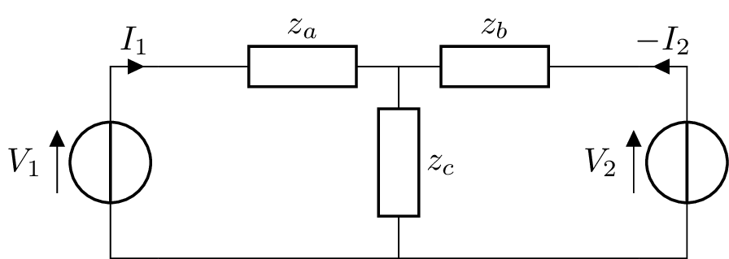 

</figure>

$$\begin{gathered}
    \begin{bmatrix}
        z_a+z_c&-z_c\\-z_c&z_b+z_c
    \end{bmatrix}\begin{bmatrix}
        I_1\\-I_2
    \end{bmatrix}=\begin{bmatrix}
        V_1\\-V_2
    \end{bmatrix}\\
    \begin{bmatrix}
        z_a+z_c&z_c\\z_c&z_b+z_c
    \end{bmatrix}\begin{bmatrix}
        I_1\\I_2
    \end{bmatrix}=\begin{bmatrix}
        V_1\\V_2
    \end{bmatrix}\\
    z_c=z_{12}=z_{21}=\displaystyle\frac{1}{C}\\
    z_a+\displaystyle\frac{1}{C}=\frac{A}{C}
\end{gathered}$$ I parametri di una linea si analizzano tramite un’analisi delle grandezze tra la partenza e all’arrivo della linea, mantenendo costante la distanza, tramite l’equazione dei telegrafisti. Si può esprimere quindi in una rappresentazione stella, e l’associata rappresentazione triangolo, tramite i seguenti parametri:

<figure>

 

</figure>

## Mutua-Induttanza

Un oggetto che presenta più di una bobina, presenta una o più mutue-induttanze. Nel caso dei due-porte, si considera un oggetto contenente solo due bobine e quindi una mutua-induttanza. Questo due-porte servirà a definire l’oggetto chiamato trasformatore ideale.

Si considerano due solenoidi su un nucleo toroidale, un oggetto realizzato ad alta permeabilità magnetica $\mu$, dove sono avvolte due bobine su lati opposti dell’oggetto. La mutua-induttanza effettivamente si trova nei casi lineari, poiché è un processo che utilizza il principio di sovrapposizione degli effetti, ma per alcuni materiali si può non considerare questa condizione, se non vengono mandati in saturazione. Si considera quindi un materiale ad alta permeabilità ed un innesco di non linearità, sensibili soltanto se sono saturi. Alcuni materiali presentano delle zone interne chiamate domini che presentano una magnetizzazione per lo più uniforme e forniscono dall’interno una magnetizzazione $M$ oltre al campo di induzione magnetica esterno $H$: $$\begin{gathered}
    B=\mu_0(H+M)
\end{gathered}$$ Questo contributo interno corrisponde ad una permeabilità più elevata, ma può aumentare fino ad un valore limite. Quando un materiale presenta una magnetizzazione interna $M$ massima, si dice saturo, e l’unico componente in grado di aumentare l’intensità del campo magnetico $B$ è il campo $H$ impresso dall’esterno.

In questo oggetto è possibile quindi approssimare la linearità ed osservare il fenomeno della mutua induttanza. Nella realtà vengono creati delle bobine una dentro l’altra, in modo che il flusso generato da esse possa attraversare completamente l’altra bobina. Inoltre le due bobine vengono ricoperte di un materiale elettricamente isolante per evitare una situazione di cortocircuito.

Data una singola bobina avvolta attorno al toro, l’oggetto si comporta come un induttore, quindi una singola porta:

<figure>

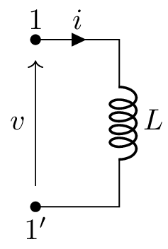 

</figure>

Si suppone il campo $H$ sia uniforme su tutta la circuitazione $L$, ed il campo magnetico $B$ uniforme su tutta la sezione trasversale dove viene effettuato l’integrale di flusso. Si riportano brevemente i passaggi effettuati precedentemente nella sezione per individuare l’espressione della legge costitutiva dell’induttore ideale: $$\begin{gathered}
    H=\displaystyle\frac{Ni}{l}\to B=\mu\displaystyle\frac{Ni}{l}\\
    \phi=\mu\displaystyle\frac{Ni}{l}\\
    v=-e=-\left(-N\displaystyle\frac{\mathrm{d}\phi}{\mathrm{d}t}\right)\\
    v=\displaystyle\mu\frac{N^2S}{l}\frac{\mathrm{d}i}{\mathrm{d}t}
\end{gathered}$$ Si definisce un nuovo parametro chiamato riduttanza $\mathscr{R}$: $$\mathscr{R}=\displaystyle\frac{N^2}{L}$$

Considerando l’oggetto toroidale avvolto da due bobine, bisogna considerare nel calcolo del campo di induzione magnetico, poiché la circuitazione tiene conto anche delle correnti concatenate passanti per la seconda bobina. Il teorema della circuitazione del campo magnetico considera tutte le correnti concatenate alla linea della circuitazione, poiché si considera una circonferenza passante per il toro come la linea di circuitazione, l’espressione per il campo di induzione magnetica risulta essere: $$\begin{gathered}
    H=\displaystyle\frac{N_1i_1+N_2i_2}{l}
\end{gathered}$$ Questa relazione è possibile solamente in un caso di linearità, in cui vale il principio di sovrapposizione degli effetti, e si possono sovrapporre i contributi di entrambi le correnti. Per cui anche il campo magnetico si esprime in questa configurazione due-porte come: $$\begin{gathered}
    B=\mu\displaystyle\frac{N_1i_1+N_2i_2}{l}
\end{gathered}$$ Il flusso si esprime quindi come: $$\begin{gathered}
    \phi=\mu\displaystyle\frac{N_1i_1}{l}S+\mu\frac{N_2i_2}{l}S
\end{gathered}$$ Poiché non è noto a priori da quale morsetto entri la corrente nella seconda bobina, il suo contributo può essere concorde o discorde alla corrente della prima bobina, per cui formalmente bisogna indicare l’espressione generale nella forma: $$\begin{gathered}
    H=\displaystyle\frac{N_1i_1\mp N_2i_2}{l}\\
    B=\mu\displaystyle\frac{N_1i_1\mp N_2i_2}{l}\\
    \phi=\mu\displaystyle\frac{N_1i_1}{l}S\mp\mu\frac{N_2i_2}{l}S
\end{gathered}$$ Effettuano un processo analogo per la seconda bobina, si ottengono le seguenti espressioni per la tensione ai capi dei morsetti: $$\begin{gathered}
    v_1=\displaystyle\mu\frac{N_1^2S}{l}\frac{\mathrm{d}i_1}{\mathrm{d}t}\mp\mu\frac{N_2N_1S}{l}\frac{\mathrm{d}i_2}{\mathrm{d}t}\\
    v_2=\displaystyle\mu\frac{N_2^2S}{l}\frac{\mathrm{d}i_2}{\mathrm{d}t}\mp\mu\frac{N_1N_2S}{l}\frac{\mathrm{d}i_1}{\mathrm{d}t}
\end{gathered}$$ La riduttanza rimane costante per cui si può esprimere l’induttanza di ogni bobina come: $$\begin{gathered}
    L_i=\displaystyle\frac{N_i^2}{\mathscr{R}}
\end{gathered}$$ Mentre si definisce il fattore del contributo dell’altra bobina il modulo del coefficiente di mutua induzione $|M|$: $$|M|=\displaystyle\frac{N_1 N_2}{\mathscr{R}}$$ Si considera il modulo poiché nell’espressione delle tensioni viene esplicitato il segno tramite il simbolo $\pm$. Si definisce quindi un coefficienti di mutua induzione $M$, che presenta le stesse dimensioni di $L$: $$\begin{gathered}
    M_{12}=\mp\displaystyle\frac{N_1 N_2}{\mathscr{R}}\\
    M_{21}=\mp\displaystyle\frac{N_2 N_1}{\mathscr{R}}
\end{gathered}$$ Le mutue induttanze tra la bobina $1$ e la bobina $2$ risultano uguali, per cui si può adoperare un unico simbolo $M$ per definire la mutua induzione tra le due bobine: $$\begin{gathered}
    M_{12}=M_{21}=M
\end{gathered}$$

Si considera ora un oggetto formato da due cicli quadrati uniti tra di loro, chiamato giogo:

<figure>

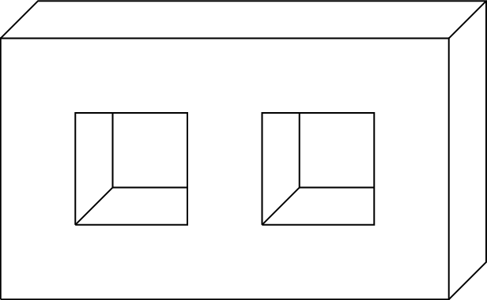 

</figure>

Inserendo degli avvolgimenti attorno ai due lati estremi dell’oggetto si creano due bobine, e non possono effettuare gli stessi calcoli svolti precedentemente poiché si è complicato il percorso della circuitazione. Per cui le mutue induttanze tra le due bobine non necessariamente coincidono tra di loro. Verrà in seguito dimostrato come sia generalmente verificato indipendentemente dal percorso della circuitazione.

In elettronica si ha l’obiettivo di miniaturizzare il più possibile i componenti circuitali. Un oggetto toroidale non è semplice da miniaturizzare, per cui si utilizzano altri oggetti che permettono di mantenere la proprietà di mutua induttanza. Per diminuire le dimensioni di oggetti come un condensatore si utilizza l’elettronica di un componente chiamato giratore, facilmente miniaturizzabile. In questo modo si ottengono degli oggetti che possono essere miniaturizzati. Sono necessarie componenti analogiche nei circuiti, poiché per interagire con l’informazione trasmessa da un circuito sono necessari i sensi, che percepiscono solamente segnali analogici.

Si descrive ora formalmente questo due-porte. Questo oggetto è composto da due bobine adiacenti che presentano un induttanza $L_1$ e $L_2$. Inoltre bisogna indicare il vero della mutua-induttanza dell’oggetto. Si disegna un simbolo sopra l’induttore, per definire il percorso effettuato dalla corrente nella porta. Se il percorso della corrente è lo stesso per entrambe le porte allora il coefficiente di mutua induzione è di segno positivo, altrimenti è negativo:

<figure id="fig:mutua-induttanza">

  

<figcaption>Modello Circuitale Mutua-Induttanza</figcaption>
</figure>

Si considera la legge costitutiva nel tempo del due-porte mutua-induttanza: $$\begin{gathered}
    \begin{cases}
        v_1=L_1\displaystyle\frac{\strut \mathrm{d}i_1}{\strut \mathrm{d}t}+M\frac{\mathrm{d}i_2}{\mathrm{d}t}\\
        v_2=L_2\displaystyle\frac{\strut \mathrm{d}i_2}{\strut \mathrm{d}t}+M\frac{\mathrm{d}i_1}{\mathrm{d}t}
    \end{cases}\\
    \begin{bmatrix}
        v_1\\v_2
    \end{bmatrix}=\begin{bmatrix}
        L_1&M\\M&L_2
    \end{bmatrix}\begin{bmatrix}
        \displaystyle\frac{\strut \mathrm{d}i_1}{\strut \mathrm{d}t}\\ \displaystyle\frac{\strut \mathrm{d}i_2}{\strut \mathrm{d}t}
    \end{bmatrix}
\end{gathered}$$ Si può semplificare l’analisi di questa relazione differenziale esprimendola nel dominio dei fasori oppure nel dominio di Laplace. Si considera quindi una mutua-induttanza a regime permanente sinusoidale: $$\begin{gathered}
    \begin{bmatrix}
        \overline{V}_1\\ \overline{V}_2
    \end{bmatrix}=\begin{bmatrix}
        j\omega L_1&j\omega M\\j\omega M&j\omega L_2
    \end{bmatrix}\begin{bmatrix}
        \overline{I}_1\\ \overline{I}_2
    \end{bmatrix}
\end{gathered}$$ E nel dominio di Laplace: $$\begin{gathered}
    \begin{bmatrix}
        V_1(s)\\ V_2(s)
    \end{bmatrix}=\begin{bmatrix}
        s L_1&s M\\s M&s L_2
    \end{bmatrix}\begin{bmatrix}
        I_1(s)\\ I_2(s)
    \end{bmatrix}
\end{gathered}$$ Bisogna però inserire un vettore che tiene conto delle condizioni iniziali di queste grandezze: $$\begin{gathered}
    -\begin{bmatrix}
        L_1&M\\M&L_2
    \end{bmatrix}\begin{bmatrix}
        i_1(0^-)\\i_2(0^-)
    \end{bmatrix}
\end{gathered}$$ Da un punto di vista concettuale è possibile usare la memoria contenuta da questo due-porte per sviluppare sensori. Si possono realizzare sensori che misurano quando uno dei due circuiti connessi ad una porta presenta un guasto a terra. Questo fenomeno avviene quando il circuito tocca un oggetto metallico in grado di condurre corrente elettrica.

Un impianto che presenta un sensore di guasto a terra è formato da una linea di fase $f$, che trasporta la corrente di fase $I_f$ che alimenta l’impianto, avvolta in una bobina $B_f$ attorno ad un oggetto toroidale, prima di entrare nell’impianto; una linea chiamata neutro $n$ che trasporta la corrente di neutro $I_n$, in condizioni nominali coincide alla corrente di fase $I_n=I_g$; ed una connessione a terra in caso di guasto dove può fluire la corrente di guasto $I_g$. Quando l’impianto non è affetto ad un guasto a terra i due flussi generati dalle correnti passanti nelle due bobine sono uguali ed opposti, per cui non viene generata forza elettro motrice: $\phi=0$. Invece se è presente in entrata oltre alla corrente di fase anche una corrente del guasto a terra $I_f+I_g$, questa corrente percorre un altro circuito chiuso, mentre la corrente che fluisce nel neutro dall’impianto corrisponde solamente alla corrente di fase $I_f$. Questo genera un flusso non nullo, alimentando una terza bobina avvolta attorno al nucleo toroidale. Questa corrente generata viene misurata dal sensore che indica la presenza di un guasto nel sistema, e può attivare un interruttore differenziale per evitare danni all’impianto. Questo oggetto si può modellare come un due-porte nonostante abbia tre bobine, poiché quando è presente un guasto la corrente interessata che genera un flusso attraversa solamente la bobina della fase, e la corrente indotta fluisce attraverso la bobina del misuratore. Per cui in entrambi i casi di funzionamento e di guasto si può modellare come un due-porte, considerando diverse coppie di bobine.

### Trasformatore Ideale

In generale in un ambiente ideale la tensione nelle due spire si può esprimere rispetto al flusso dalla seguente relazione: $$\begin{gathered}
    v_1=\displaystyle N_1\frac{\mathrm{d}\phi}{\mathrm{d}t}\\
    v_2=\displaystyle N_2\frac{\mathrm{d}\phi}{\mathrm{d}t}
\end{gathered}$$ Si definisce quindi il rapporto spire o rapporto di trasformazione, come il rapporto tra le due tensioni ai capi delle due porte: $$\displaystyle\frac{v_1}{v_2}=\frac{N_1}{N_2}=k_n=k_T$$ Si è realizzato così un trasformatore rudimentale, un oggetto in grado di modificare la tensione tra le due porte. Può essere rappresentato in due modi, con un simbolo specifico formato da due cerchi sovrapposti, oppure come due induttori adiacenti, con indicata il rapporto tra le spire:

<figure id="fig:trasformatore-ideale">

  

<figcaption>Modello Circuitale Trasformatore Ideale</figcaption>
</figure>

Si indica con $k$ il rapporto spire ed il rapporto di trasformazione. Se il trasformatore è ideale non assorbe, ne eroga potenza, si dice trasparente alla potenza, effettuando il bilancio delle potenza di porte, si ottiene un risultato nullo. Nel caso ideale mantiene una totale indifferenza alla potenza, variando solamente la tensione ai capi delle due porte: $$\begin{gathered}
    v_1i_1+v_2i_2=0\\
    \displaystyle\frac{1}{v_2}\left(v_1i_1+v_2i_2\right)=\frac{1}{v_2}0\\
    ki_1=-i_2\\
    \displaystyle\frac{i_1}{i_2}=-\frac{1}{k}
\end{gathered}$$ Per cui il rapporto tra le correnti corrisponde all’opposto del reciproco del rapporto di trasformazione.

Questo oggetto può essere realizzato anche in ambito elettronico. Si considera una rete a regime permanente sinusoidale accessibile da due morsetti $A$ e $B$, nella rappresentazione Thevenin di impedenza $z_\mathrm{th}$. Per ottenere il massimo trasferimento di potenza bisogna avere un’impedenza di carico $z_C$ pari al coniugato dell’impedenza equivalente. Se non si dispone di un’impedenza tale $z_C\neq z_\mathrm{th}^*$ si può inserire tra la rete e l’impedenza di carico un trasformatore ideale.

<figure>

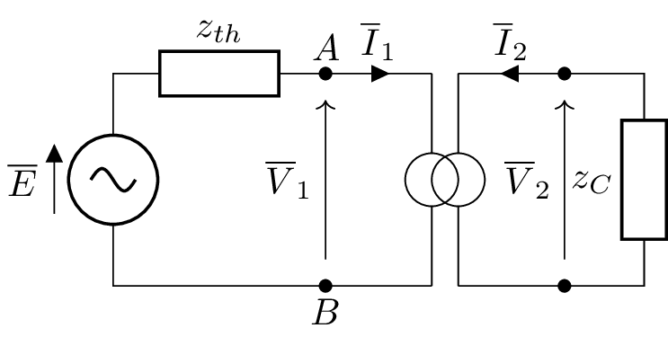 

</figure>

Si applica il metodo delle maglie e si ottengono la seguenti equazioni, nella convenzione dei generatori: $$\begin{gathered}
    \overline{E}-z_\mathrm{th}\overline{I}=\overline{V}_1\\
    \overline{V}_2=-z_C\overline{I}_2
\end{gathered}$$ Per la legge costitutiva del trasformatore ideale: $$\begin{gathered}
    \displaystyle\frac{\overline{V}_1}{\overline{V}_2}=k\\
    \displaystyle\frac{\overline{I}_1}{\overline{I}_2}=-\frac{1}{k}
\end{gathered}$$ Sostituendo queste relazioni nelle equazioni di maglia calcolate si ottiene: $$\begin{gathered}
    \displaystyle\frac{\overline{V}_1}{k}=z_Ck\overline{I}_1\\
    \overline{V}_1=z_Ck^2\overline{I}_1\\
    \overline{E}-z_\mathrm{th}\overline{I}_1=z_Ck^2\overline{I}_1\\
    \overline{E}=(z_\mathrm{th}+k^2z_C)\overline{I}_1
\end{gathered}$$ Per cui tramite il quadrato del rapporto di trasformazione si può variare il valore dell’impedenza di carico per renderla simile al valore del coniugato dell’impedenza equivalente: $$\begin{gathered}
    z_\mathrm{th}^*\approx k^2z_C
\end{gathered}$$

Questo processo permette di ottenere una resistenza equivalente sempre resistiva. Si effettua tramite reti adattatrici, specialmente nei filtri di uscita passiva, come il filtro di Zobbel, adoperato in elettro-acustica. Se l’impedenza equivalente fosse puramente resistiva, allora sarebbe sempre possibile individuare un valore di $k^2$ che verifica la condizione del massimo trasferimento di potenza.

Si possono esprimere i parametri di questo trasformatore ideale in altre rappresentazioni considerando le relazioni ottenute: $$\begin{gathered}
    \overline{V}_1=k\overline{V}_2\\
    \overline{I}_1=-\displaystyle\frac{1}{k}\overline{I}_2
\end{gathered}$$ Questa relazione corrisponde ad una rappresentazione a parametri di trasmissione diretta: $$\begin{gathered}
    \begin{bmatrix}
        \overline V_1\\ \overline I_1
    \end{bmatrix}=\begin{bmatrix}
        k&0\\0& \displaystyle\frac{\strut 1}{\strut k}
    \end{bmatrix}\begin{bmatrix}
        \overline{V}_2\\ -\overline{I}_2
    \end{bmatrix}
\end{gathered}$$

Dalle condizioni delle proprietà di una rappresentazione a parametri di trasmissione diretti: ; si ottiene che il trasformatore ideale è sempre un due-porte reciproco, poiché il determinante è sempre unitario, mentre se $k=1$, allora il trasformatore ideale è anche un due-porte simmetrico.

## Amplificatore Operazionale Ideale

L’operazionale ideale o amplificatore operazionale (Op-Amp.) è un due porte, che sembra sbilanciato data la sua rappresentazione circuitale, ma può funzionare solamente se viene polarizzato da due morsetti che vengono omessi dalla sua normale rappresentazione. Poiché è valido il principio di sovrapposizione degli effetti della polarizzazione e del segnale, è possibile studiare solamente il segnale, senza trattare la polarizzazione dell’amplificatore.

In caso si studi anche la sua polarizzazione, l’amplificatore è collegato a due pile alimentate in continuo, connesse ad un piano comune, chiamato anche massa. Quando si analizza solamente il segnale vengono sostituite ad un cortocircuito. In forma circuitale si rappresenta dal simbolo:

<figure id="fig:op-amp">

  

<figcaption>Modello Circuitale Amplificatore Operazionale</figcaption>
</figure>

Convenzionalmente la tensione e la corrente entranti nella porta $1$ sono entrambe nulle. Affinché le grandezze in uscita dalla porta $2$ siano non nulle, è necessaria un’amplificazione infinita all’interno, per generare una forma indeterminata. Per cui rappresenta una forma ideale dell’amplificatore ideale.

La porta definita dal segno $-$ si indica come porta invertente, mentre quella quella definita dal segno $+$ si dice porta non invertente. La porta di uscita è spesso rappresentata da un unico morsetto.

Questo oggetto presenta come leggi costitutiva, la tensione e la corrente di ingresso nulla: $$\begin{gathered}
    v_1=0\\
    i_1=0
\end{gathered}$$ Mentre non avrebbe senso esprimere la corrente e la tensione di uscita come indeterminate: $$\begin{gathered}
    v_2=?\\
    i_2=?
\end{gathered}$$ Poiché l’operazione reale richiede di altri due morsetti per introdurre un’alimentazione esterna in continuo. Per cui si considera la tensione $v_2$ misurata rispetto alla massa comune, e la corrente $i_2$ è la corrente in grado di circolare sul morsetto connesso a “ground” (GND).

Nelle successive analisi si considera la tensione $v_2$ misurata rispetto a GND, omettendo il morsetto connesso alla massa comune dalla rappresentazione dell’operazionale. Ma quest’oggetto non potrebbe funzionare senza essere collegato ad altri circuiti.

In generale si retro-aziona la porta di uscita con la porta di ingresso, per costruire una serie di strutture fondamentali.

Per bloccare la corrente continua rispetto ad un segnale, in un amplificatore operazionale, oppure in un transistor, si utilizzano dei condensatori per interrompere l’alimentazione della continua in mezzo al segnale. Poiché presenta una legge costitutiva tale che per frequenze molto elevate, la sua impedenza tende ad annullarsi, mentre per frequenze tendenti a zero, ovvero alimentazioni in continuo, la sua impedenza tende all’infinito.

Per grandi segnali si adopera l’operazionale a scatto, per poter mantenere la linearità. Si analizzano quindi solamente applicazioni dove sono presenti piccoli segnali.

### Operazionali in Configurazione Invertente

Si connette un resistore $R_1$ alla porta $-$ e si retro-aziona l’uscita alla porta $-$ con un resistore $R_2$ e si mette a terra la porta $+$, inserendo una tensione in entrata $v_\mathrm{in}$ si vuole determinare l’amplificazione del segnale di uscita $v_o$: $A=vo/v_\mathrm{in}$.

Si inserisce l’eccitazione in tensione $v_\mathrm{in}$ e si applica il metodo dei nodi sul circuito, considerando GND come nodo di riferimento. Quando si analizzano due porte, è sempre consigliato prendere le porte come nodi di riferimento.

<figure>

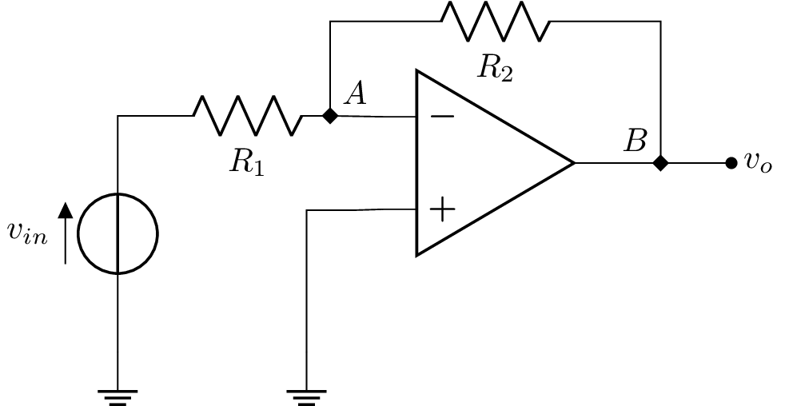 

</figure>

La corrente passante per $B$ è un’incognita, si suppone sia generata da un generatore esterno che si chiude con la massa comune, omessa, uscente dal amplificatore. $$\begin{gathered}
    \begin{bmatrix}
        G_1+G_2&-G_2\\-G_2&G_2
    \end{bmatrix}\begin{bmatrix}
        V_A\\V_B
    \end{bmatrix}\begin{bmatrix}
        G_1V_\mathrm{in}\\
        -I_B
    \end{bmatrix}
\end{gathered}$$ Si risolve come fosse un generatore controllato, inserendo il vincolo che in questo caso è definito dalla legge costitutiva del nodo. $$\begin{gathered}
    v_1=0=V_A-V_{GND}\\
    V_A=V_{{GND}}=0
\end{gathered}$$ L’espressione diventa: $$\begin{gathered}
    \begin{bmatrix}
        -G_2\\G_2
    \end{bmatrix}[V_B]=\begin{bmatrix}
        -G_1V_\mathrm{in}\\-I_B
    \end{bmatrix}
\end{gathered}$$ Si riscrive per tenere conto della corrente incognita $I_B$: $$\begin{gathered}
    \begin{bmatrix}
        0&-G_2\\1&G_2
    \end{bmatrix}\begin{bmatrix}
        I_B\\V_{B}
    \end{bmatrix}=\begin{bmatrix}
        G_1V_\mathrm{in}\\0
    \end{bmatrix}\\
    \begin{bmatrix}
        I_B\\V_B
    \end{bmatrix}=\displaystyle\frac{1}{G_2}\begin{bmatrix}
        G_2&G_2\\-1&0
    \end{bmatrix}\begin{bmatrix}
        G_1V_\mathrm{in}\\0
    \end{bmatrix}
\end{gathered}$$ Il potenziale nodale $V_B$, coincidente con la tensione in uscita, risulta essere: $$\begin{gathered}
    V_B=-\displaystyle\frac{G_1}{G_2}V_\mathrm{in}\equiv v_0
\end{gathered}$$ Per cui l’amplificazione del segnale in ingresso risulta essere: $$\begin{gathered}
    A=\displaystyle\frac{v_o}{v_\mathrm{in}}=-\frac{G_1}{G_2}\frac{v_\mathrm{in}}{v_\mathrm{in}}=-\frac{R_2}{R_1}
\end{gathered}$$

Per cui in base ai valori delle due resistenza si può incrementare o diminuire il valore della tensione in entrata al amplificatore, mentre la polarità si inverte, da cui il nome di questa configurazione. Per $R_1=R_2$, equivale a mettere in opposizione di fase il segnale in ingresso, se il segnale è periodico nel tempo, altrimenti semplicemente si inverte il segnale in entrata al amplificatore.

Se fossero $n$ lati Thevenin connessi in entrata all’amplificatore, si avrebbe allora un circuito sommatore, che effettua una media bilanciata dal valore delle resistenze, tra le diverse tensioni in ingresso. Non cambierebbe il numero dei nodi, per cui l’equazione risolutiva del circuito sarebbe: $$\begin{gathered}
    \begin{bmatrix}
        I_B\\V_B
    \end{bmatrix}=\displaystyle\frac{1}{G_2}\begin{bmatrix}
        G_2&G_2\\-1&0
    \end{bmatrix}\begin{bmatrix}
        \displaystyle\sum_{k=1}^nG_kV_{\mathrm{in},k}\\0
    \end{bmatrix}\\
    V_B=\displaystyle-\frac{G_1V_{\mathrm{in},1}+\cdots+G_nV_{\mathrm{in},n}}{G_2}\equiv v_o
\end{gathered}$$

<figure id="fig:amplificatore-sommatore">
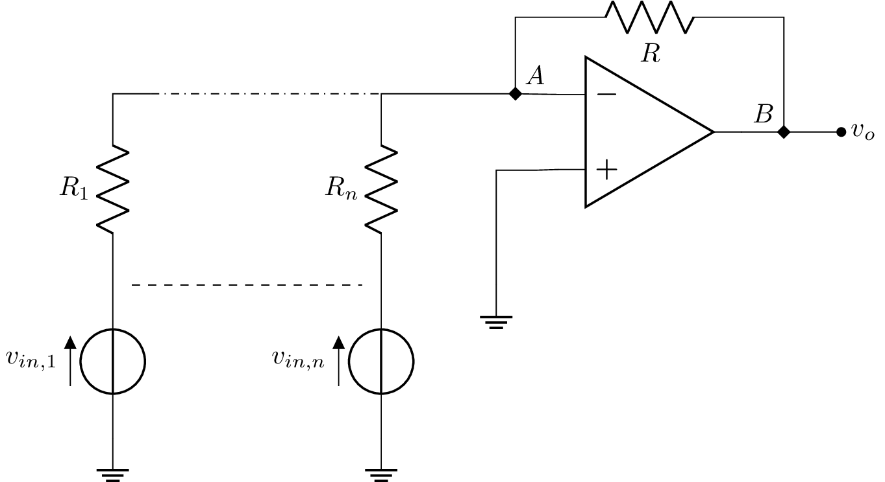
<figcaption>Sommatore</figcaption>
</figure>

Non si parlerebbe più di funzione di trasferimento, poiché si terrebbe in conto il segnale totale in ingresso $V_\mathrm{in}$. Se ogni conduttanza dei segnali in entrata fosse uguale al valore di $G_2$, allora la tensione in uscita sarebbe data dalla somma algebrica dei segnali in ingresso: $$\begin{gathered}
    v_0=\displaystyle\sum_{k=1}^n-\frac{G_2V_{\mathrm{in},k}}{G_2}=-\sum_{k=1}^nV_{\mathrm{in},k}
\end{gathered}$$ Si tratta di una media pesata quando le resistenze $R_k$ non sono uguali tra loro.

Si considera l’amplificazione nel dominio di Laplace:

<figure>

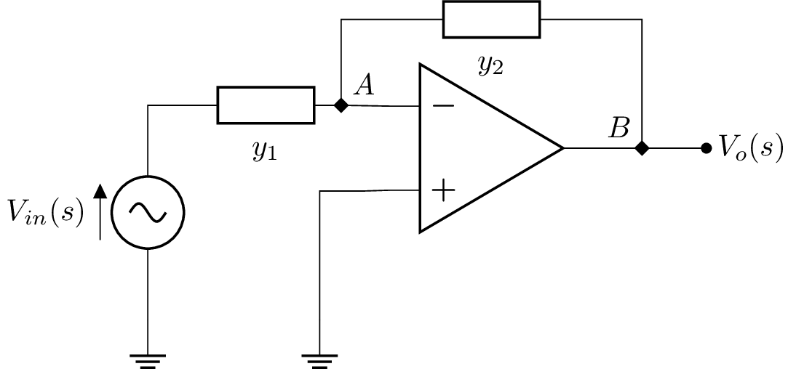 

</figure>

Effettuando un procedimento analogo si ottiene la seguente funzione di trasferimento per l’amplificazione di un segnale $V_\mathrm{in}$ in entrata: $$\begin{gathered}
    \displaystyle-\frac{y_1}{y_2}V_\mathrm{in}(s)=V_o(s)
\end{gathered}$$ Manipolando i valori delle ammettenze $y_1$ e $y_2$ si possono realizzare specifiche funzioni di rete per applicare delle delle trasformazioni all’ingresso per ottenere una determinata uscita.

Si vuole ottenere in uscita, nel dominio del tempo il valore della tensione d’uscita sia l’immagine dell’integrale del segnale in entrata: $$\begin{gathered}
    \displaystyle k\int_{0}^tv_\mathrm{in}(t)\mathrm{d}t=v_o(t)
\end{gathered}$$

Nel dominio di Laplace l’operazione di integrale corrisponde ad una divisione per la variabile complessa $s$, per cui la funzione di rete associata a questa operazione risulta essere: $$\begin{gathered}
    k=-k'\\
    \displaystyle\frac{k}{s}V_\mathrm{in}(s)=V_o(s)\\
    \displaystyle\frac{y_1(s)}{y_2(s)}=\frac{k'}{s}
\end{gathered}$$ Per cui si inserisce un resistore di conduttanza $G_1$ al posto dell’ammettenza $y_1$, ed un condensatore di capacità $C$ invece dell’ammettenza $y_2$: $$\begin{gathered}
    \displaystyle\frac{G_1}{sC}=\frac{k'}{s}\\
    k'=\displaystyle\frac{1}{R_1C}
\end{gathered}$$ Per cui $k$ assume la dimensione di una frequenza.

Ad ogni integrazione bisogna scaricare la memoria del condensatore, per cui è presente una resistenza di scarica $R_S$ inserita in parallelo con un interruttore che scatta dopo ogni operazione, in assenza di ingresso:

<figure id="amplificatore-integratore">
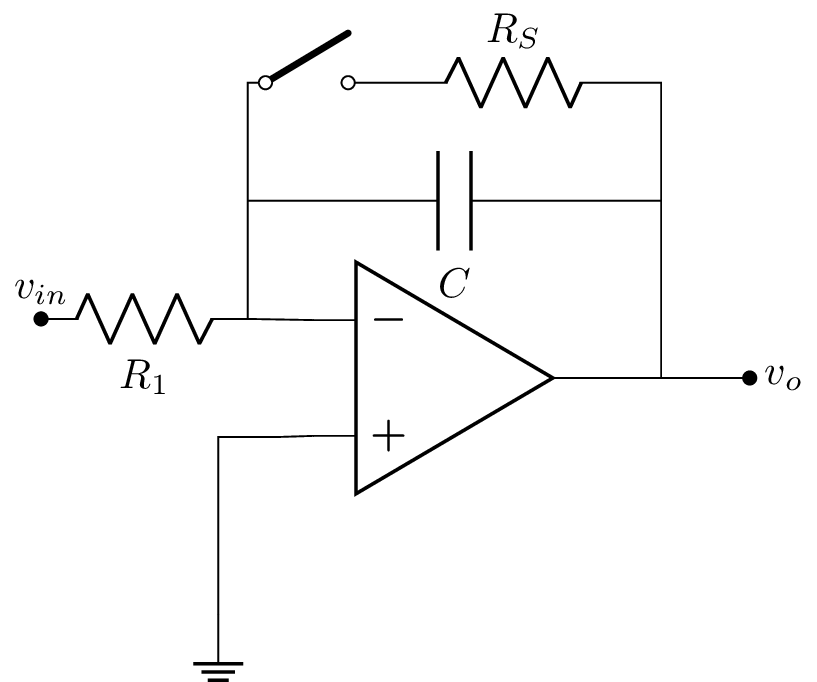
<figcaption>Integratore</figcaption>
</figure>

Si vuole ottenere ora nel tempo, un’uscita pari all’immagine della derivata del segnale in entrata: $$\begin{gathered}
    v_{o}=k\displaystyle\frac{\mathrm{d}v_\mathrm{in}}{\mathrm{d}t}
\end{gathered}$$ Si suppone la memoria sia nulla, per cui la funzione di rete deve soddisfare la seguente relazione: $$\begin{gathered}
    V_o(s)=ksV_\mathrm{in}(s)+0\\
    k=-k'\\
    \displaystyle\frac{y_1}{y_2}=k's
\end{gathered}$$ Per cui si inserisce un condensatore al posto dell’ammettenza $y_1$ ed un resistore al posto dell’ammettenza $y_2$: $$\begin{gathered}
    k's=\displaystyle\frac{sC}{G_2}\\
    k'=R_2C
\end{gathered}$$ Dimensionalmente il valore $k$ è quindi un tempo

<figure id="amplificatore-derivatore">
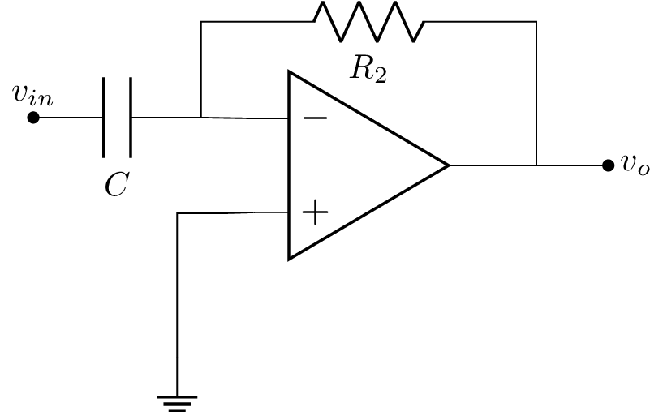
<figcaption>Derivatore</figcaption>
</figure>

### Negative Impedence Converter

Utilizzando un amplificatore è possibile creare un’impedenza negativa. Questo oggetto prende il nome di NIC (Negative Impedence Converter), viene descritto dal seguente circuito:

<figure>

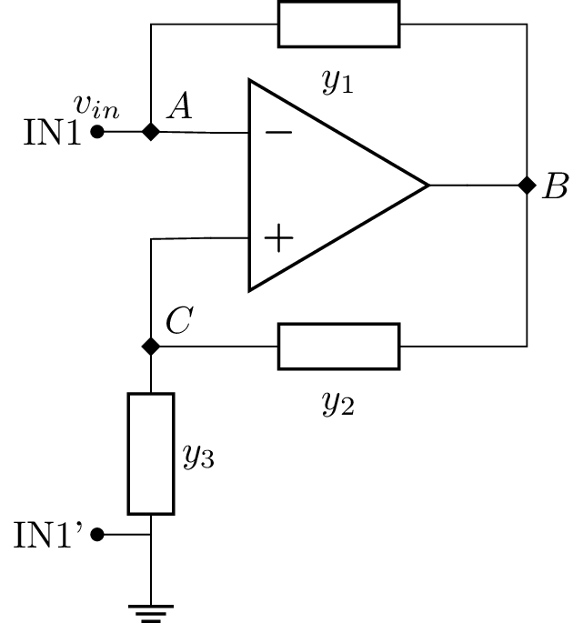 

</figure>

Per determinare il suo comportamento equivalente bisogna identificare i due morsetti in entrata ed uscita dal circuito IN1 e IN1’, inoltre si risolve mediante il metodo dei nodi: $$\begin{gathered}
    \begin{bmatrix}
        y_1&-y_1&0\\-y_1&y_1+y_2&-y_2\\0&-y_2&y_2+y_3
    \end{bmatrix}\begin{bmatrix}
        V_A\\V_B\\V_C
    \end{bmatrix}=\begin{bmatrix}
        I_\mathrm{in}\\-I_B\\0
    \end{bmatrix}
\end{gathered}$$ Si inserisce l’equazione di vincolo: $$\begin{gathered}
    V_A=V_C\\
    \begin{bmatrix}
        y_1&-y_1&0\\-(y_1+y_2)&y_1+y_2&1\\y_2+y_3&-y_2&y_2&0
    \end{bmatrix}\begin{bmatrix}
        V_\mathrm{in}\\V_B\\I_B
    \end{bmatrix}=\begin{bmatrix}
        I_\mathrm{in}\\0\\0
    \end{bmatrix}\\
    V_\mathrm{in}=\displaystyle\frac{1}{y_1y_2-y_1(y_2+y_3)}\begin{vmatrix}
        I_\mathrm{in}-y_1&0\\0&y_1+y_2&1\\0&-y_2&0
    \end{vmatrix}=-\frac{1}{y_1y_3}I_\mathrm{in}y_2=-\frac{y_2}{y_1y_3}I_\mathrm{in}
\end{gathered}$$ Per cui l’impedenza equivalente di questa rete risulta si esprime come: $$\begin{gathered}
    Z_\mathrm{in}=\displaystyle\frac{V_\mathrm{in}}{I_\mathrm{in}}=-\frac{y_2}{y_1y_3}
\end{gathered}$$

Tipicamente l’impedenza che si vuole rendere negativa si inserisce in $y_1$, mentre $y_2$ e $y_3$ vengono sostituiti a due resistori, per non cambiare la fase dell’impedenza: $$\begin{gathered}
    y_1=\displaystyle\frac{1}{z}\\
    y_2=G_2\\
    y_3=G_3
\end{gathered}$$ Si impone $G_2=G_3$, per cui l’impedenza equivalente risulta essere: $$\begin{gathered}
    Z_\mathrm{in}=\displaystyle-\frac{y_2}{y_1y_3}-\frac{G_2}{\displaystyle\frac{1}{z}G_3}=-z
\end{gathered}$$ Per cui un NIC viene realizzato dal seguente circuito:

<figure id="fig:amplificatore-nic-resistori">
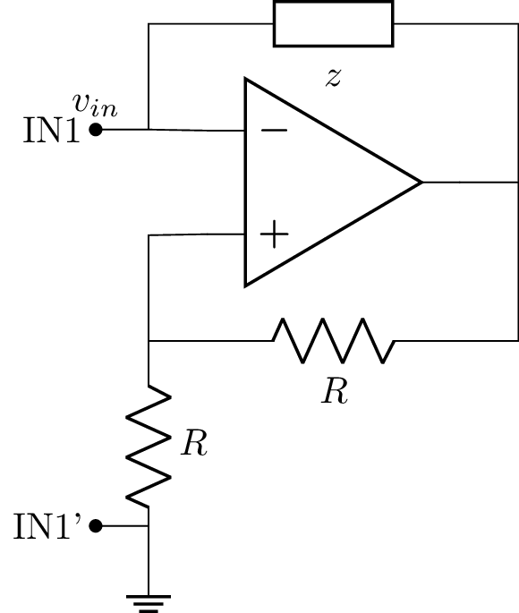
<figcaption>NIC</figcaption>
</figure>

Se non si tenesse in considerazione l’alimentazione esterna, questo oggetto si comporterebbe come un erogatore di potenza, avendo una resistenza negativa, ma l’energia che genera viene fornita dalle alimentazioni esterne. Poiché si considera un’impedenza negativa, una delle due grandezze in ingresso dovrà cambiare di verso, per cui esistono due diverse realizzazioni VNIC e INIC, che mantengono costante il verso della tensione il primo, e della corrente il secondo. Utilizzando questo oggetto è possibile annullare completamente la resistenza in un circuito RLC, per ottenere con un’eccitazione di tensione in continuo un’oscillatore pure alla frequenza di risonanza.

Nel dominio di Laplace, considerando memorie nulle, si ottiene la seguente relazione: $$\begin{gathered}
    \displaystyle\frac{E}{s}=I(s)\left(sL+\frac{1}{sC}\right)\\
    I(s)=\displaystyle\frac{E}{s\left(sL+\displaystyle\frac{1}{sc}\right)}=\frac{EsC}{s\left(s^2LC+1\right)}=\frac{E}{L}\frac{1}{s^2+\displaystyle\frac{1}{LC}}
\end{gathered}$$ I due poli sono immaginari puri e coniugati, e corrispondono alla frequenza di risonanza $\omega_0$: $$\begin{gathered}
    s_{1,2}=\pm j\displaystyle\frac{1}{\sqrt {LC}}
\end{gathered}$$

La corrente ottenuta antitrasformando questo risultato è una sinusoide di frequenza $\omega_0$, nonostante sia stata inserita un’eccitazione in continuo: $$\begin{gathered}
    i(t)=\displaystyle\frac{E}{\omega_0L}\sin(\omega_0t)
\end{gathered}$$

Nella realtà sarà sempre presente un errore di eccesso o di difetto nel valore dell’impedenza inserita nel NIC, per cui in realtà il comportamento ottenuto è quello di un oscillatorio smorzato. Se è sufficiente ottenere una risposta oscillatoria pura per pochi cicli, allora se fosse possibile mantenere il valore del NIC dentro a certi limiti, è legittimo utilizzare questo approccio.

Un’ulteriore applicazione consiste nel convertitore da capacità ad induttanza, per le realizzazioni elettroniche a basso ingombro.

L’obiettivo dell’elettronica è definire opportune funzioni di rete per trattare segnali in opportune uscite.

La necessità di un’elevata induttanza in un componente può richiedere diversi oggetti relativamente ingombranti, se si vuole inserire l’intero oggetto su un unico buffer di silicio. Per cui si vuole realizzare un induttore mediante un condensatore, oggetto che può essere realizzato in piccole dimensioni.

Si può implementare semplicemente usando un NIC, in modo grezzo, inserendo un condensatore di capacità $C$ a regime sinusoidale, ottenendo un’impedenza equivalente associata ad opportuni valori di frequenza ed induttanza equivalente: $$\begin{gathered}
    Z=\displaystyle-j\frac{1}{\omega C}
    Z_\mathrm{in}=\displaystyle j\frac{1}{\omega C}=j\omega_\mathrm{eq}L_\mathrm{eq}
\end{gathered}$$

Partendo da una configurazione NIC, si vuole ottenere un’impedenza equivalente di forma simile ad un’induttore. Per cui si vuole avere uno zero in $0$ al numeratore, ciò si ottiene inserendo un condensatore in $y_2$, mentre si inseriscono due resistori in $y_1$ e $y_3$. Per mantenere il segno costante invece si inverte uno dei due resistori con un altro NIC, ottenendo così: $$\begin{gathered}
    Z_\mathrm{in}=-\displaystyle\frac{y_2}{y_1y_3}=-\frac{sC}{G(-G)}=s\frac{C}{G^2}\\
    L_\mathrm{eq}=\displaystyle\frac{C}{G^2}
\end{gathered}$$ In questo modo è possibile miniaturizzare un induttore, fino a dove è permesso a livello tecnologico, utilizzando la seguente rete:

<figure id="fig:amplificatore-induttore-nic">
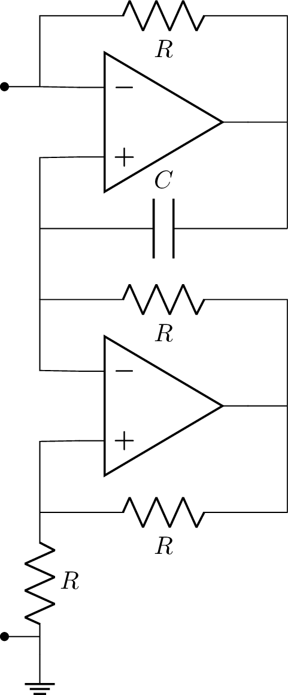
<figcaption>Induttanza Senza Induttore</figcaption>
</figure>

Se invece è necessario un induttore, come generatore di campo magnetico, allora sarà necessario costruire un componente capace di generarlo, invece di utilizzare una rete in grado di comportarsi come un induttore.

# Semiconduttori, Diodi e Transistor

## Cenni di Fisica

Si distinguono materiali conduttori, semiconduttori o isolanti, dalla possibilità di avere elettroni liberi in movimento nella loro struttura cristallina.

Un atomo presenta diverse orbite, di particolari forme e contenuti energetici, su cui “orbitano" gli elettroni. In realtà rappresentano delle distribuzioni di probabilità chiamate orbitali dove possono essere presenti con una certa probabilità gli elettroni. In un singolo orbitale, per il principio di esclusione di Pauli, possono essere presenti al massimo due elettroni, di spin opposto tra di loro. Lo spin di un elettrone può essere analizzato come il momento rotazionale dell’elettrone.

Se un atomo viene isolato, si possono individuare elettroni sui suoi orbitali. I livelli di energia a livello quantistico sono discreti, e non continui come nella fisica macroscopica. Quindi ogni elettroni possiede certo livello energetico, in base all’orbitale in cui si trovano. Considerando un reticolo cristallino uniforme, i livelli energetici di un singolo orbitale si rappresentano mediante una banda energetica, in base al numero di elettroni in quell’orbitale per ogni atomo considerato dal reticolo. Creando una gradinata più fitta all’aumentare del numero di atomi del reticolo.

Si identificano due diverse bande, la banda di valenza che determina il legame tra vari atomi e quindi descrive la struttura cristallina che formano gli atomi tra di loro. Gli elettroni interagiscono tra di loro seguendo la regola dell’ottetto, in generale un atomo per la stabilità chimica tende ad interagire con altri atomi per avere orbitali comuni contenenti otto elettroni.

La banda di conduzione identifica la possibilità che all’interno di un materiale siano presenti elettroni liberi capaci di spostarsi tra i vari atomi componenti il materiale. Si dice che questi elettroni vengono mandati in conduzione quando si rende possibile il loro spostamento liberamente all’interno del materiale.

In un materiale conduttore le due bande sono sovrapposta, per cui la struttura del materiale permette di mandare in conduzione degli elettroni del materiale. Nei materiali isolanti è necessaria un’elevato livello di energia per permettere di liberare gli elettroni, per cui la banda di valenza e la banda di conduzione sono distanti energeticamente tra di loro. Si indica questa distanza come gap di energia o “band gap".

Questi livelli energetici vengono generalmente misurati ad una temperatura vicina allo zero assoluto. A queste temperature la banda di valenza e di conduzione, per un materiale conduttore inglobano il livello di Fermi. Mentre per un isolante questo livello si trova al centro del “band gap"

Un materiale semiconduttore presenta, rispetto ad un isolante, un “band gap" meno esteso, per cui spontaneamente alcuni elettroni del materiale possono andare in conduzione. Le zone del materiale precedentemente occupate da un elettrone vengono identificate come lacune, rappresentano cariche positive, poiché l’assenza di un elettrone negativo la rende positiva.

## Drogaggio dei Semiconduttori

Nell’elettronica si adoperano semiconduttori che si trovano nel quarto gruppo della tavola periodica. Presentano quattro elettroni sulla banda di valenza. I più usati sono il Silicio ed il Germanio, ormai obsoleto. Il materiale semiconduttore viene drogato o con componenti del terzo gruppo o del secondo gruppo, che presentano rispettivamente un elettrone in meno o un elettrone in più. Il comportamento di un semiconduttore si chiama intrinseco se non si agisce dal punto di vista tecnologico, si usufruisce solamente delle proprietà fisiche del materiale. Il comportamento del materiale si dice estrinseco quando è dovuto ad azioni adoperate dal punto di vista tecnologico. Se viene drogato con atomi del terzo gruppo, il materiale diventa carico positivamente, identificato come materiale di tipo P, alternativamente se viene drogato con materiali del quinto gruppo si ottiene un materiale che presenta un elettroni in più, risulta in un materiale di tipo N carico negativamente.

Quando vengono messi a contatto questi due materiali si parla di giunzione PN. Nel momento in cui sono messi a contatto una parte degli elettroni in eccesso nella zona N compensano la carenza nella zona P, questo processo raggiunge un equilibrio dopo aver trasferito delle cariche tra le due zone. Nella zona di giunzione si forma una distribuzione concentrata di cariche molto piccola, dove si forma un campo elettrico:

<figure id="fig:giunzione-pn">
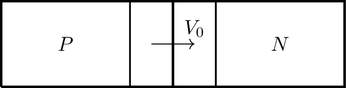
<figcaption>Giunzione PN</figcaption>
</figure>

<figure>

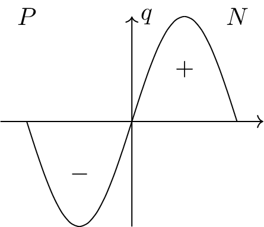 

</figure>

Nella zona N i portatori maggioritari di carica sono le cariche negative, mentre nella zona P sono le cariche positive. Si chiama questa situazione barriera di potenziale, poiché impedisce ulteriori trasferimenti spontanei di carica dalla zona N alla zona P.

<figure>

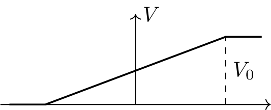 

</figure>

Si può agevolare o diminuire lo spostamento di cariche tramite un potenziale esterno. Se viene inserito il positivo di un’alimentazione esterna, in corrente continua, sulla zona N, si attirano gli elettroni, mentre inserendo il negativo alla zona P, attraggono le cariche positive. Questo alimenta le lacune nella zona N, e gli elettroni nella zona P. Fluisce una debole corrente $I_0$ o $I_s$, che viene chiamata corrente inversa di saturazione. Questo espande la barriera di potenziale:

<figure>

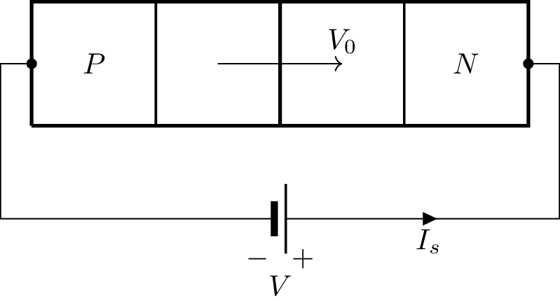 

</figure>

Inserendo un potenziale opposto alla barriera di potenziale si applica una forzante e si riduce la barriera di potenziale, e si misura una corrente chiamata corrente diretta $I_d$, dovuta ai portatori maggioritari di carica.

<figure>

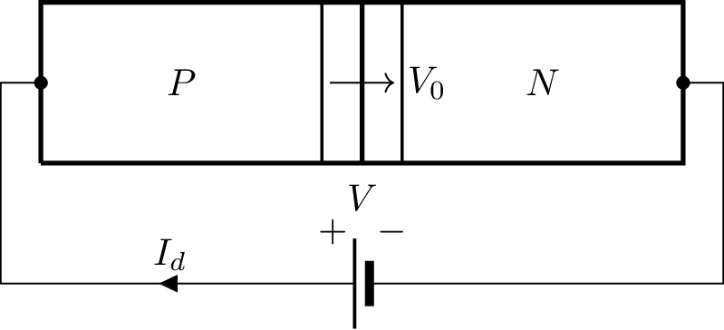 

</figure>

Il verso della corrente si riferisce alla convenzione circuitale, ovvero delle cariche positive. Indica quindi la corrente delle lacune, per cui gli elettroni essendo cariche negative, contribuiscono indirettamente allo spostamento delle lacune tra le due zone.

La corrente in conduzione diretta e la corrente di saturazione inversa sono legate tra di loro dall’equazione di Shockley: $$I_d=\displaystyle I_s\left(e^{\frac{V_d}{nV_T}}-1\right)$$ Si indica con $V_d$ la tensione applicata diretta tra la regione N e P. Il valore $n$ dipende al tipo di materiale, compreso tra $0$ e $1$, dipende da quanto viene drogato il materiale. Generalmente vengono inseriti pochi atomi del terzo o del quinto gruppo per rendere il materiale controllabile dall’esterno, ed il valore $n$ è molto vicino ad $1$, quindi in base ai materiali trascurabile. La tensione $V_T$, misurata sperimentalmente a temperatura ambiente, assume un valore di circa $26\,mV$ e viene definita dalla seguente relazione: $$V_T=\displaystyle k\frac{T}{q}$$ Dove $k$ è la costante di Boltzman, $T$ è la temperatura in Kelvin, e $q$ è la carica. Quando la tensione impressa $V_d$ è molto più grande della tensione $V_T$ la formula può essere ridotta nella forma: $$I_d=I_se^{\frac{V_d}{V_T}}$$

## Diodi

### Diodo a Giunzione

Un diodo a giunzione viene realizzato accostando tra di loro due regioni N e P, mentre verranno analizzati in seguito transistor, oggetti formati da tre regioni.

<figure id="fig:diodo-giunzione">

  

<figcaption>Diodo a Giunzione</figcaption>
</figure>

L’anodo identifica il drogaggio P, mentre il catodo identifica il drogaggio N. Quando la tensione esterna $V_d$ tra catodo ed anodo è sufficientemente elevata rispetto alla tensione $V_T$, si incrementa notevolmente la corrente inversa di saturazione $I_s$ per cui è presenta una conduzione significativa. Invece se è presente una polarizzazione inversa ricade nella corrente inversa di saturazione, fino a quando non viene inserito un campo elettrico abbastanza elevato in grado da mandare in “breakdown” il diodo. Ovvero subisce un campo talmente forte tale che la struttura cristallina del materiale non è più in grado di contenere gli elettroni. La tensione inversa non può quindi superare questa tensione limite di “breakdown”.

Il comportamento del diodo, oggetto non lineare, può essere analizzato applicando una linearizzazione a tratti:

<figure>

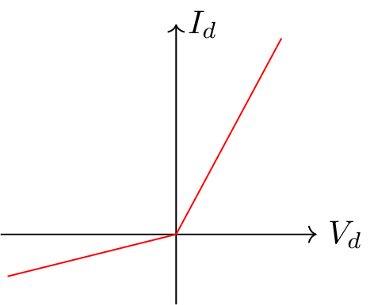 

</figure>

In questo modo si analizza la corrente di conduzione in funzione ai capi del diodo. Per cui nel caso di polarizzazione diretta il diodo si associa al diodo un valore di resistenza bassa, mentre nel caso di polarizzazione inversa, la resistenza associata al diodo è molto elevata. Questo valore di resistenza si riferisce al rapporto tra l’incremento della tensione e della corrente. Questo modello viene perfezionato inserendo una piccola tensione di un valore di tensione di $V_{\gamma}\approx0.6$, prima della quale il diodo non presenta una corrente di conduzione, poiché rappresenta la tensione che rimane ai capi del diodo ed impedisce la conduzione.

L’andamento della corrente di conduzione di un diodo viene quindi descritto dal seguente grafico:

<figure id="fig:andamento-diodo">
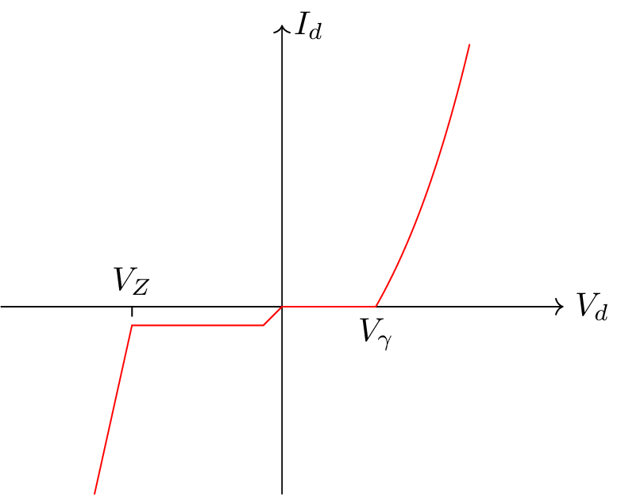
<figcaption>Andamento Volt-Ampere di un Diodo a Giunzione</figcaption>
</figure>

La corrente di conduzione cresce molto rapidamente rispetto a piccoli incrementi di tensione in polarizzazione diretta, mentre in interdizione la corrente rimane costante al valore della corrente inversa di saturazione, fino ad un valore $V_Z$, tensione Zener, valore minimo dopo il quale il diodo vada in “breakdown", ed entra in conduzione in modo non convenzionale, generalmente distruggendo il dispositivo.

Si considera un diodo in serie ad una resistenza di carico $R_L$, con una tensione $V_i$ in entrata, e si vuole determinare il punto di lavoro di questa rete:

<figure>

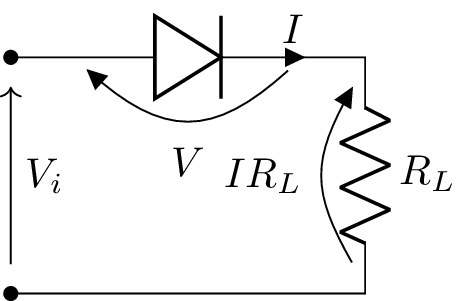 

</figure>

Si cerca il valore che assume la corrente di conduzione $I_d$, rappresentando gli andamenti delle grandezze del diodo e del resistore. Si ottiene la seguente relazione tra le grandezze applicando il secondo principio di Kirchhoff: $$\begin{gathered}
    V_i=V_d+R_LI_\mathrm{d}\\
    I_d=\displaystyle\frac{V_i}{R_L}-\frac{V_d}{R_L}
\end{gathered}$$

<figure>

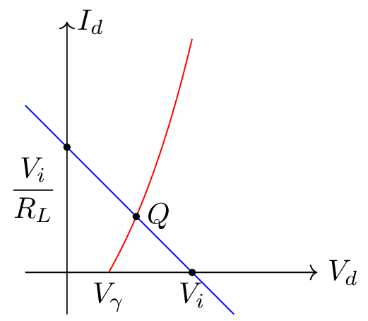 

</figure>

La curva in blu, chiamata retta di carico ottenuta, interseca l’andamento della tensione diretta in un punto $Q$, chiamato punto di lavoro.

Per facilitare l’analisi sono possibili tre diverse rappresentazioni semplificate di un diodo:

<figure id="fig:approssimazioni-diodo">

    

<figcaption>Approssimazioni dell’Andamento di un Diodo</figcaption>
</figure>

L’approssimazione usata dipende dal tipo di applicazione e l’utilizzo per cui si vuole usare il diodo. Nell’ultimo caso la resistenza $R_d$ viene calcolata sulla base dei valori delle grandezze su cui dovrà operare il diodo. Una volta superato il valore $V_{\gamma}$, il diodo si comporta come un lato Thevenin che eroga una tensione $V_{\gamma}$, di resistenza $R_d$. Altrimenti si considera come un dispositivo a scatto, che eroga una tensione $V_{\gamma}$ dopo che la tensione esterna supera il valore $V_{\gamma}$, mentre prima di questo valore il diodo si comporta come un circuito aperto in interdizione. Se la tensione $V_{\gamma}$ è molto minore della tensione che sta polarizzando il diodo, allora si può analizzare come fosse un interruttore.

### Transcaratteristica

Si considera un circuito formato da un diodo, ed una resistenza di carico $R_L$, e si vuole calcolare la tensione ai capi della resistenza di carico:

<figure>

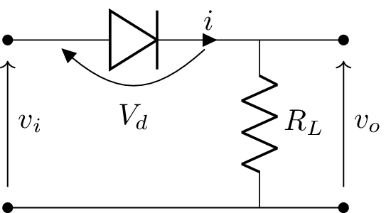 

</figure>

Per ipotesi si considera già in conduzione, quindi si ha che $v_i\geq V_{\gamma}$, altrimenti il circuito è aperto:

<figure id="fig:transcaratteristica-polarizzazione">

  

<figcaption>Comportamento del Diodo nella Rete</figcaption>
</figure>

Si risolve il caso direttamente polarizzato, la corrente passante per il circuito risulta essere: $$\begin{gathered}
    i=\displaystyle\frac{v_i-V_{\gamma}}{R_d+R_L}
\end{gathered}$$

La tensione in uscita $v_o$ si ottiene applicando la formula del partitore di tensione: $$\begin{gathered}
    v_o=iR_L\\
    \left(\displaystyle\frac{v_i-V_{\gamma}}{R_d+R_L}\right)R_L=\frac{R_L}{R_L+R_d}v_i-\frac{R_LV_{\gamma}}{R_L+R_d}
\end{gathered}$$ La tensione in uscita quindi si ottiene mediante la precedente relazione, come fosse una funzione di trasferimento da una tensione $v_i$ in ingresso. Poiché presenta un componente dipendente da $v_i$, ed un componente che rappresenta la tensione residua sul diodo. Si rappresenta quindi l’andamento della retta di carico così ricavata:

<figure>

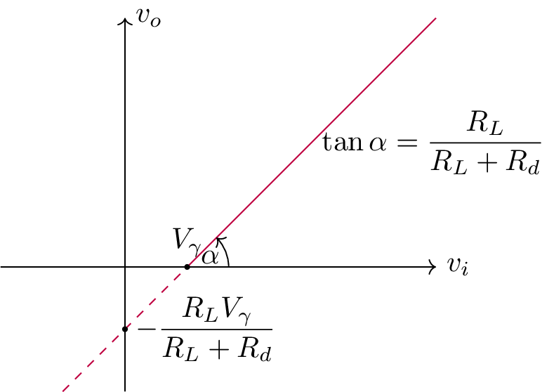 

</figure>

Si considera una tensione sinusoidale in entrata $v_i$. Allora ogni qual volta che la tensione in entrata assume valori maggiori di $V_{\gamma}$, la tensione in uscita $v_o$ assume valore non nullo, ed il diodo presente conduzione, in seguito la tensione di ingresso interdice il diodo, fino a quando non ritorna ad assumere valori maggiori di $V_{\gamma}$. In questo modo la tensione di uscita forma delle colline di tensione dove il diodo conduce, periodiche, di periodo pari al periodo della sinusoide in entrata. Quando il valore massimo della tensione sinusoidale fosse molto maggiore della tensione $V_{\gamma}$, allora i ritardi dell’accensione del diodo sarebbero trascurabili.

<figure>

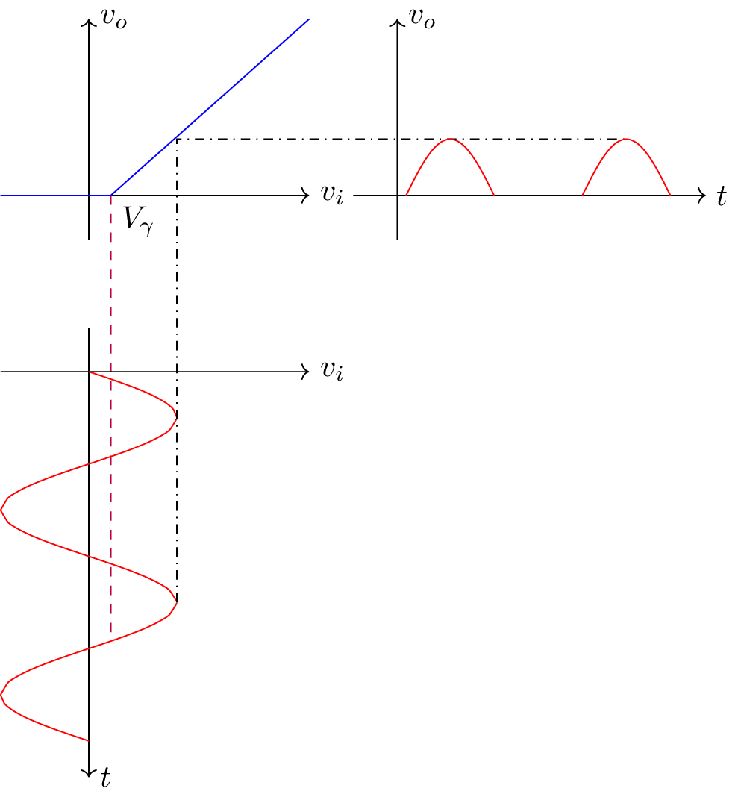 

</figure>

### Diodo Zener

Questo diodo è progettato per reggere una tensione Zener molto elevata, ed è in grado di sostenere valori poco al di sotto della corrente Zener. Si costruisce questo oggetto per mantenere costante un valore della tensione (inversa) a prescindere dal valore della corrente, per cui si comporta come uno stabilizzatore di tensione. La resistenza del diodo viene calcolata come rapporto tra l’incremento della corrente e della tensione, ma ci si trova in un ambiente vicino al “breakdown", per cui piccole variazioni di tensioni provocano un elevata risposta in corrente, che potrebbe portare alla distruzione del componente. Se il diodo va in “breakdown”, questo rapporto tende a $0$. Il valore della tensione Zener del diodo dipende dalla resistività dei materiali della sua congiunzione. In forma circuitale viene identificato dal seguente simbolo:

<figure>

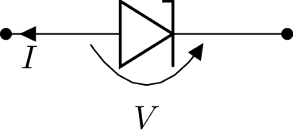 

</figure>

L’andamento Volt-Ampere di un diodo Zener può essere approssimato analogamente ad un diodo a giunzione:

<figure id="fig:andamento-diodo-zener">

  

<figcaption>Andamento Volt-Ampere di un Diodo Zener</figcaption>
</figure>

Si considera un circuito con una tensione in entrata $v_i$ ed un’uscita $v_o$, formato da due resistori:

<figure>

 

</figure>

In questo circuito le grandezze di uscita $I_L$ e $v_o$ dipendono entrambe linearmente dalla tensione in entrata $v_i$, per cui se questa tensione non è stabile, allora non lo sono neanche le grandezze in uscita dalla rete. Per stabilizzare queste grandezze, in caso la tensione in entrata non lo sia si inserisce un diodo Zener in parallelo alla resistenza di carico:

<figure>

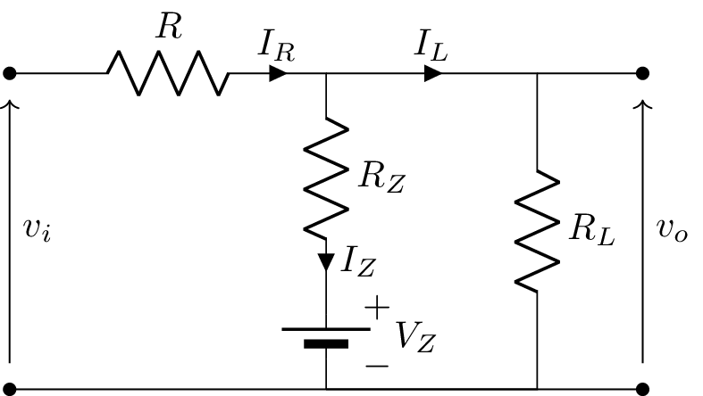 

</figure>

Il diodo Zener immette una tensione tale da stabilizzare la tensione in entrata $v_i$, attenua quindi possibili variazioni di tensioni in ingresso, poiché la tensione sul lato Zener rimane per lo più costante rispetto a piccole oscillazioni di corrente $I_R$ in entrata. Per cui il carico viene sottoposto sempre ad una tensione vicina al valore $V_Z$.

### Alimentatore in Continuo

Un alimentatore fornisce energia ad un carico, in continuo, mentre l’alimentazione in entrata è alternata.

La tensione in alternata è una funzione $v(t)$ che oscilla nel tempo come una sinusoide. Si considera prima un’approccio classico per risolvere il problema. Per mantenere uno stesso livello di tensione si considera un trasformatore ai morsetti della rete alternata, riducendo il valore della tensione in alternata in base al rapporto di trasformazione del trasformatore usato, per ridurre il valore di picco della tensione $v(t)$. Se si inserisce un diodo in uscita dal trasformatore, e si misurano i morsetti in uscita $v_o(t)$, si osserva una tensione strettamente positiva, poiché il diodo va in conduzione, ovvero permette alla corrente di fluire, solamente se la tensione in entrata ad esso è strettamente maggiore della tensione $V_{\gamma}$ positiva:

<figure>

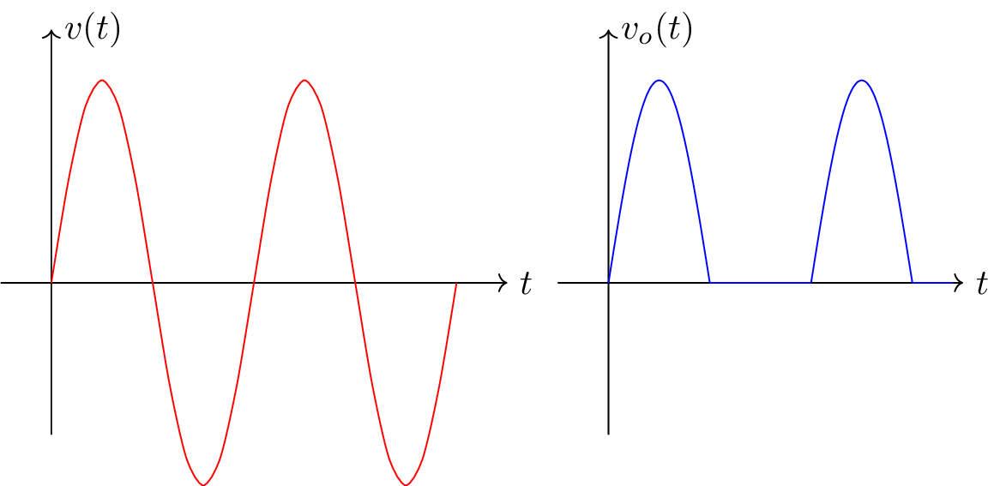 

</figure>

Si inserisce ora una resistenza di carico $R_L$, per determinare la potenza erogata da questo alimentatore:

<figure>

 

</figure>

In realtà la tensione che passa per il diodo è minore poiché bisogna considerare tutte le impedenze nel circuito e che gli elementi del circuito non sono componenti ideali. Trascurando le impedenze invece il comportamento del diodo può essere approssimato come un’interruttore, poiché è un oggetto che conduce o non conduce se la tensione ai morsetti è maggiore oppure inferiore della tensione $V_{\gamma}$.

Se l’impedenza mostrata dall’intero oggetto è trascurabile rispetto ad $R_L$ si può esprimere la potenza istantanea assorbita dal carico come: $$\begin{gathered}
    p(t)=R_Li_D(t)^2
\end{gathered}$$ Dove la tensione in uscita dal diodo $i_D(t)$ segue l’andamento della tensione in entrata, per cui per mezzo periodo assume valore nullo: $$\begin{gathered}
    i_D(t)=\begin{cases}
        \displaystyle\frac{\strut V_D}{\strut R_L} &0\leq t<\displaystyle\frac{\strut T}{\strut 2}\\
        0& \displaystyle\frac{\strut T}{\strut 2}\leq t<T
    \end{cases}
\end{gathered}$$

<figure>

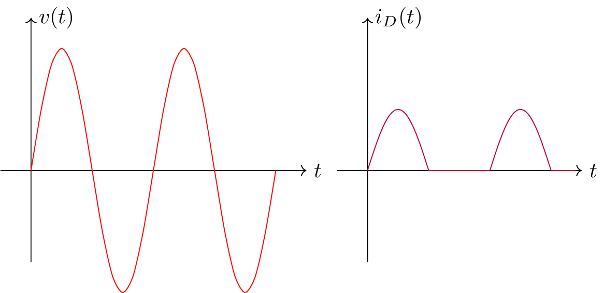 

</figure>

La potenza attiva corrisponde al valor medio della potenza istantanea: $$\begin{gathered}
    P_{R_L}=\displaystyle\frac{1}{T}\int_0^TR_Li_D(t)^2\mathrm{d}t=\frac{1}{T}\int_0^{T/2}\frac{v_o^2}{R_L}\mathrm{d}t+0
\end{gathered}$$ Poiché la corrente è nulla per mezzo periodo, la potenza attiva ottenuta è minore del valore che avrebbe se si fosse considerata l’intera tensione alternata in entrata al carico.

Per ottenere tutta la potenza possibile si possono utilizzare due metodi, chiamati raddrizzatori a doppia semi-onda:

### Trasformatore a Presa Centrale

Si può adoperare un trasformatore con presa centrale. Questo trasformatore presenta una bobina alla porta in entrata uguale al trasformatore usato precedentemente. Presenta due bobine alla seconda uscita che condividono un morsetto. La corrente in entrambi i morsetti corrisponde a $v_o/2$, ed entrambi sono collegati ad un diodo collegato in serie alla stessa resistenza di carico $R_L$:

<figure>

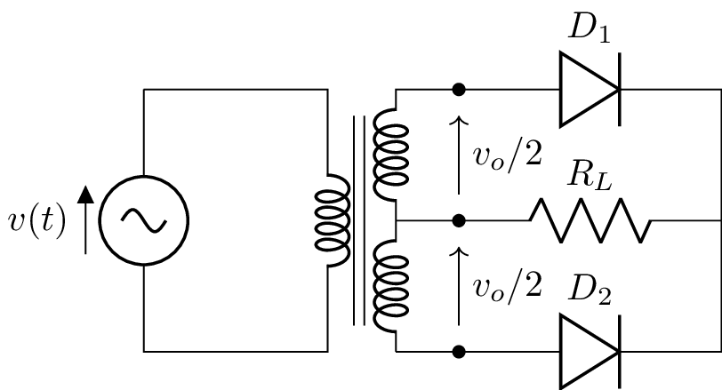 

</figure>

Questo metodo è in grado di estrarre tutta la potenza dell’entrata originaria poiché quando un diodo conduce, l’altro non conduce e viceversa. Per cui è possibile estrarre tutta la tensione sinusoidale in entrata ed ottenere una potenza doppia rispetto al caso precedente. La corrente presenta per un semi-periodo il contributo della corrente di conduzione del primo diodo, mentre per il secondo semi-periodo la corrente di conduzione del secondo diodo:

<figure>

 

</figure>

Questo metodo è molto costoso, poiché richiede la creazione di un trasformatore a presa centrale, mentre un diodo è un oggetto molto economico.

### Ponte di Graetz

Per minimizzare i costi si applica un metodo chiamato Ponte di Graetz che utilizza quattro diodi, molto più economici di un trasformatore a presa centrale, per ottenere lo stesso risultato. I diodi vengono disposti a due a due in parallelo, in modo che per ogni semi-periodo conducono sono i due che presentano la più alta tensione anodica, o la più bassa tensione catodica, in modo da assorbire tutta la tensione in entrata.

<figure>

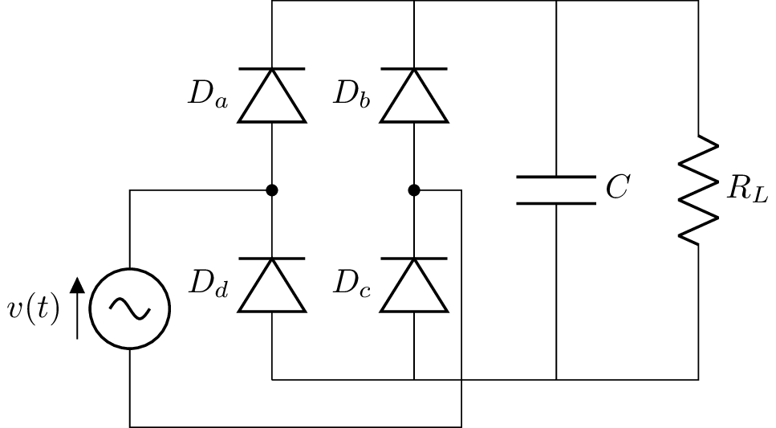 

</figure>

Considerando la prima semi-onda, entra in conduzione il diodo $D_a$, che presenta la tensione di anodo maggiore, ed il diodo $D_b$ che presenta la tensione di catodo minore. Considerando la seconda semi-onda, entra in conduzione il diodo in $D_c$ dove entra la tensione più alta nell’anodo, ed il diodo $D_d$ poiché collegato al morsetto del generatore presentando il potenziale catodico più basso. In questo modo si mantiene il verso della corrente attraverso il carico, quindi anche il verso della tensione $R_Li$, mentre la tensione in entrata è alternata. Si considera l’andamento della tensione trascurando la capacità in parallelo alla resistenza di carico:

<figure>

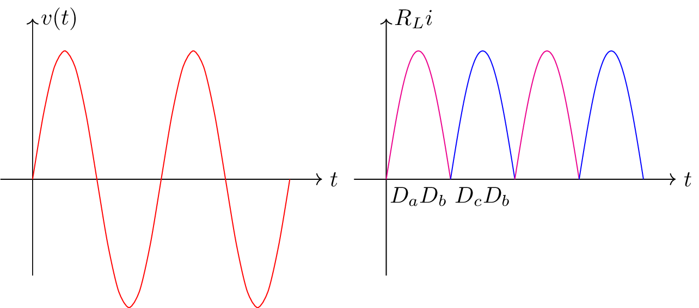 

</figure>

Si inserisce una capacità $C_1$ di spianamento in parallelo al carico $R_L$. Si suppone che i ritardi derivati dalle impedenze del circuito siano trascurabili, o assumono valori accettabili per il funzionamento voluto del condensatore. Il condensatore si carica quando aumenta la tensione di carico, e presenta una tensione massima al picco della prima semi-onda, in seguito quando diminuisce la tensione in entrata, si scarica e riversa la sua memoria mantenendo l’andamento della scarico fino a quando la tensione della seconda semi-onda non raggiunge il livello di tensione del condensatore. Il condensatore allora si ricarica fino al picco della seconda semi-onda. Questo processo è periodico e fornisce intervalli di carica e scarica impedendo che la tensione si annulli al cambiamento del verso della tensione in entrata:

<figure>

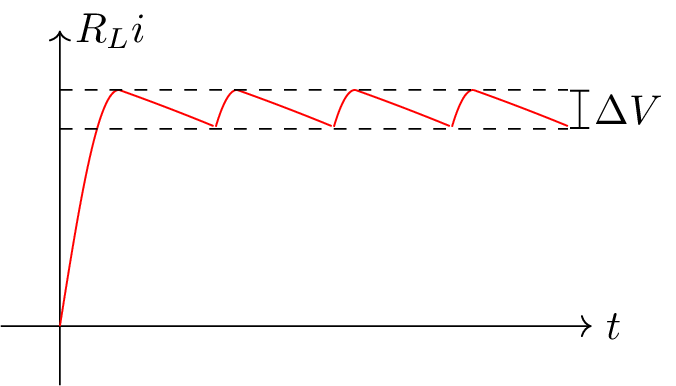 

</figure>

Il valor medio dell’andamento considerando il contributo del condensatore è poco al di sotto del valor medio della tensione, si è quindi spianato il livello della tensione. Si chiama questa differenza di tensione $\Delta V$ “ripple". Per determinare la capacità necessaria per ottenere una determinata diminuzione del “ripple” si considera la legge della scarica di un condensatore, considerando il valore di picco della tensione in entrata: $$\begin{gathered}
    v_C(t)=V_me^{-\frac{t}{R_LC}}
\end{gathered}$$ In seguito si calcola l’intervallo di tempo $\Delta t$ necessario affinché la tensione erogata dal generatore raggiunga il livello determinato dal “ripple” aspettato dal sistema: $$\begin{gathered}
    V_m\sin(\omega t_1)=V_m-\Delta V
\end{gathered}$$ Poiché la scarica comincia quando la prima semi-onda raggiunge il picco $V_m$, si considera il tempo iniziale $T/2$, per cui il tempo di scarica risulta essere: $$\begin{gathered}
    \Delta t= T/2-t_1
\end{gathered}$$ Si inserisce nella legge di scarica precedentemente descritta, e si ottiene la seguente approssimazione per il valore della capacità: $$\begin{gathered}
    v_C(\Delta t)=V_m-\Delta V=V_me^{-\frac{\Delta t}{R_LC}}\\
    C=-\displaystyle\frac{\Delta t}{R_L}\ln\left(\frac{\Delta V}{V_m}\right)
\end{gathered}$$ Questo valore rappresenta solamente un’approssimazione, poiché il valore $V_m$ su cui si basa la scarica del condensatore non è costante nel tempo, poiché rappresenta il valore della tensione alternata in entrata, e varia nel tempo.

Questo calcolo è legittimo, poiché il valore calcolato della capacità è un valore di soglia per garantire un dato spianamento, se viene inserito un condensatore di capacità maggiore, allora sarà presente uno spianamento maggiore. Per cui è consentito effettuare quest’analisi.

### Porte Logiche OR e AND

L’elettronica digitale tratta la trasformazione di segnali digitali, non analogici, usati per operare una certa codifica in base al codice di codifica usato.

Le porte logiche sono dei componenti digitali che prendono un certo numero input e producono un output determinato da leggi note a priori che caratterizzano la porta. Una semplice porta logica può rappresentare operazioni fondamentali della logica binaria. Si considera l’operazione OR, e si vuole implementare questa porta logica tramite diodi, indicano gli ingressi e le uscite come $0$ o $1$ in base alla tensione. Un valore alto rappresenta un $1$ logico, mentre un valore basso rappresenta uno $0$ logico. Tramite questa distinzione si costruisce utilizzando due diodi una rete che descrive la logica OR:

<figure>

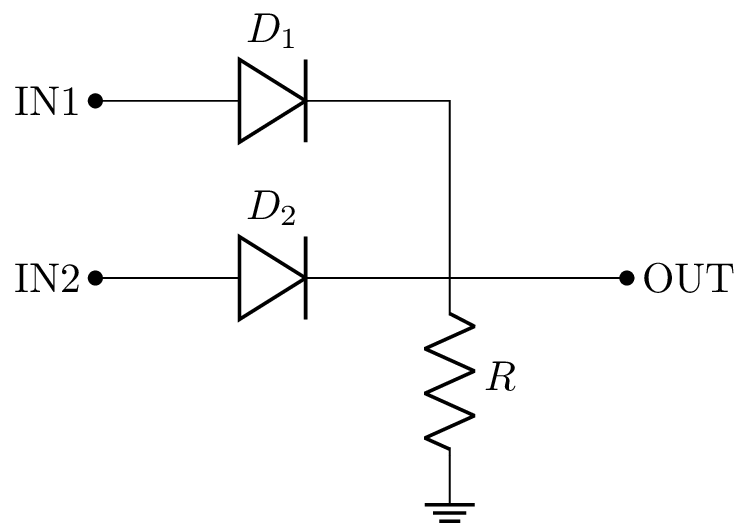 

</figure>

Si considerano due generatori di tensione in input, collegati alla massa comune. Inoltre sono presenti due interruttori per ciascun input che chiudono il circuito con generatore, oppure con un cortocircuito. Se il circuito viene chiuso con un cortocircuito, il diodo relativo a quell’input non è polarizzato e non conduce, per cui rappresenta uno zero logico. Se nessuno dei due diodi conduce, allora anche la tensione in uscita è collegata alla massa comune, per cui risulta uno zero logico in output.

Se il circuito viene chiuso con un generatore di tensione, il diodo associato a quell’input viene polarizzato e conduce, mentre l’altro diodo non essendo polarizzato mantiene il resto del circuito isolato dal corto connesso al suo input associato. Se almeno uno dei due diodi è in conduzione, possono alimentare la resistenza $R$ che aumenta la tensione fino al valore in ingresso alla rete.

Nella rappresentazione simbolica, la massa di indica con GND (“ground”), per rappresentare una logica NOR si aggiunge cerchietto alla porta OR:

<figure id="fig:porte-or-nor">

  

<figcaption>Porte OR e NOR</figcaption>
</figure>

Poiché i diodi vengono idealizzati nella rappresentazione di porte logiche, poiché vengono costruite in cascata l’una all’altra potrebbe presentarsi un problema di caduta di tensione, a causa della $V_{\gamma}$ di ogni diodo.

Si considera ora il seguente circuito per descrivere la logica AND:

<figure>

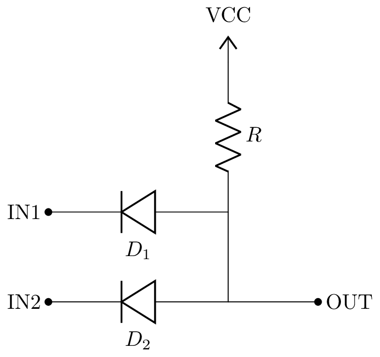 

</figure>

Invece di indicare il generatore di tensione, generalmente si inserisce VCC con un certo valore di tensione, misurata rispetto al comune, per indicare la presenza del generatore di tensione.

Finché i diodi non intervengono l’uscita rimane alla stessa tensione del VCC, per cui è sempre alta. Se viene inserito un segnale di corto ad una delle due entrate, il diodo associato a quell’entrata si trova alla tensione VCC sull’anodo e $0$ sul catodo, quindi conduce, mandando a zero l’uscita. Se vengono inseriti due generatori di tensioni, che erogano tensione pari a VCC, allora mandano i due diodi in interdizione, per cui si ottiene un uno logico in output. Invece per ottenere uno zero logico in uscita, è sufficiente uno solo dei due diodi in conduzione, per cui questo circuito descrive la logica AND.

In forma simbolica si la porta AND e NAND si rappresenta come:

<figure id="fig:porte-and-nand">

   

<figcaption>Porte AND e NAND</figcaption>
</figure>

Per le porte NAND e NOR sono necessari oltre a diodi anche transistor, quindi la loro costruzione circuitale verrà trattata in seguito.

## Transistor

Il transistor o BJT (“Bipolar Junction Transistor”), transistor a doppia giunzione, chiamato anche transistor bipolare, poiché presenta al suo interno la conduzione coinvolge sia cariche positive che negative. Questo lo distingue dalla famiglia dei transistor ad effetto di campo FET (“Field Effect Transistor”), i più classici sono il transistor a giunzione JFET, ed il transistor a metallo ossido MOSFET.

Dal punto di vista circuitale, circuiti costruiti basandosi sui BJT, non differiscono notevolmente da circuiti contenenti transistor FET.

I BJT sono transistor controllati in corrente, mentre i FET sono controllati in tensione.

Un BJT è un due-porte sbilanciato, contenente un morsetto chiamato base B, un morsetto chiamato collettore C, ed uno chiamato emettitore E. I transistori PNP o NPN sono costruiti collegando tre zone complementari in successione, per creare due giunzioni, la giunzione del collettore $J_C$ e la giunzione dell’emettitore $J_E$. La zona in cui agisce la base è dimensionalmente più piccola rispetto alle zone connesse al collettore ed all’emettitore, per cui ha un numero di portatori maggioritari, minore rispetto al numero di portatori che possono contribuire le altre zone. I contatti tra i morsetti e le parti drogate sono metallici, invece in un MOSFET, i contatti non sono metallici, poiché il materiale viene avvolto da un isolante, ed è presente una capacità tra il gate e la parte drogata del semiconduttore.

<figure id="fig:bjt">

  

<figcaption>BJT</figcaption>
</figure>

Non rappresenta propriamente la sovrapposizione di due diodi, poiché la base è dimensionalmente più piccola. Ma esiste un modello chiamato modello di Ebers Moll, per rappresentare un transistor tramite due diodi, sulla base di successive considerazioni di fisica circuitale.

Si considera questa rappresentazione che tiene conto di uno solo degli effetti: Considerando solo un effetto, senza ricorrere alle adeguate approssimazioni è possibile arrivare ad un paradosso.

<figure>

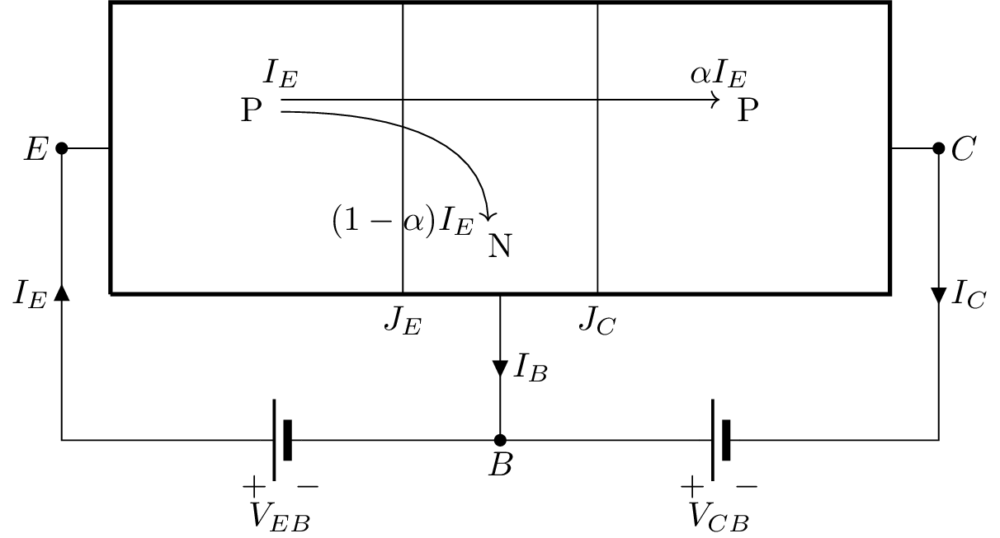 

</figure>

Poiché nella convenzione circuitale si considera la corrente come un flusso di cariche positive, si considerano i flussi delle lacune nelle zone del materiale. Se viene polarizzato positivamente l’emettitore rispetto alla base, le lacune della zona P connessa all’emettitore fluiscono verso zone a potenziale più basso. Se il collettore anch’esso viene polarizzato con un potenziale più basso rispetto alla base allora le lacune potranno fluire o verso la base o verso il collettore, ma poiché la base è dimensionalmente più piccola dell’emettitore, gli elettroni presenti non sono sufficienti a bilanciare le lacune proveniente dall’emettitore, per cui si dirigono in una zona a potenziale ancora più basso, il collettore. Corrispondono a due lati di un circuito, uno a più bassa impedenza, tra l’emettitore ed il collettore, ed uno a più alta impedenza, tra l’emettitore e la base. Il fattore di percentuale $\alpha$ descrive qual è la percentuale di lacune che invece di fluire verso il collettore, raggiungono la base, per cui si possono esprimere le correnti in funzione di $I_E$: $$\begin{gathered}
    I_B=(1-\alpha)I_E\\
    I_C=\alpha I_E
\end{gathered}$$ Per la legge del tri-polo si ottiene la seguente relazione facilmente verificabile: $$\begin{gathered}
    I_E=I_B+I_C
\end{gathered}$$

Si considera ora un circuito con un transistor NPN, il più usato, per studiare il comportamento non lineare del transistor:

<figure>

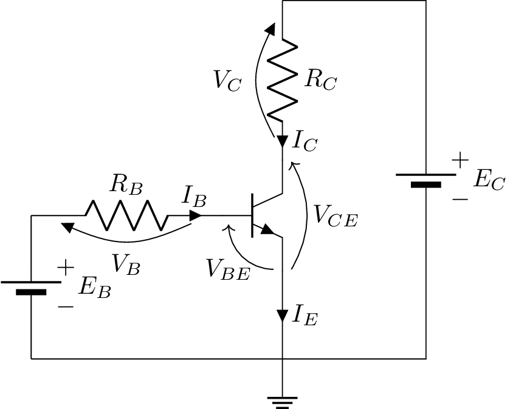 

</figure>

Sono presenti due maglie, la maglia di base emettitore BE e la maglia di collettore emettitore CE. Sono connessi due generatori in continuo per mandare in polarizzazione il transistor. Le grandezze $I_B$ e $V_BE$ sono caratteristiche non lineari, relative alla giunzione base-emettitore, molto simile alla caratteristica di Shockley. In realtà queste grandezze non sono indipendenti da $I_C$. Per cui si rappresenta come una famiglia di curve simili, associate ognuna ad un valore diverso di $V_{CE}$, in base alla pendenza della curva:

<figure>

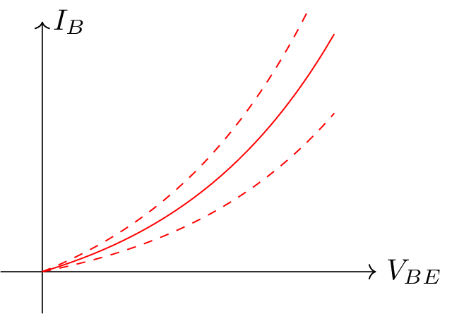 

</figure>

La corrente di collettore $I_C$ e la tensione collettore emettitore $V_{CE}$ sono anch’esse caratteristiche non lineari, si rappresentano mediante una famiglia di curve, associate a valori crescenti di corrente di base $I_B$. All’aumentare della corrente di base, aumenta il valore massimo possibile della corrente di collettore $I_C$:

<figure>

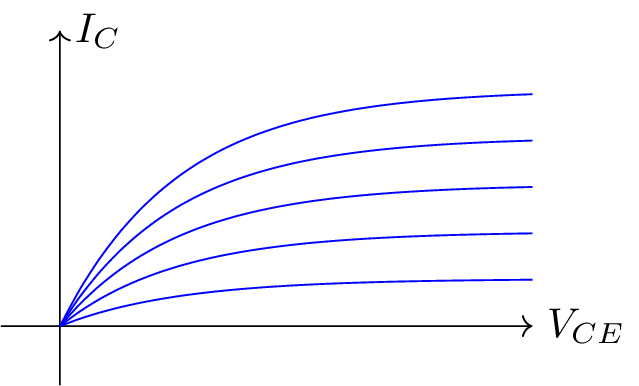 

</figure>

Si applica il principio di Kirchhoff alle tensioni sulla maglia CE: $$\begin{gathered}
    V_{CE}+R_CI_C=E_C\\
    I_C=\displaystyle\frac{E_C}{R_C}-\frac{1}{R_C}V_{CE}
\end{gathered}$$ Questa relazione corrisponde ad una retta sul piano Volt-Ampere, sovrapponendola alle curve descritte precedentemente si ottengono diversi punti di equilibrio, dipendenti dal valore della corrente di base $I_B$. Per determinare questo valore si considera la retta di carico ottenuta applicando il principio di Kirchhoff alle tensioni sulla maglia BE: $$\begin{gathered}
    I_B=\displaystyle\frac{E_B}{R_B}-\frac{1}{R_B}V_{BE}
\end{gathered}$$

<figure id="fig:andamento-volt-ampere-npn">

  

<figcaption>Andamento Volt-Ampere BJT NPN</figcaption>
</figure>

Da questa intersezione si individua il valore della corrente di base $I_B^*$, la cui curva associata nell’andamento Volt-Ampere del collettore identificherà, con l’intersezione della retta di carico, il punto di lavoro $Q$, descritto dalla corrente di collettore $I_{CQ}$ e tensione di collettore $V_{CEQ}$.

Se si aumentasse notevolmente il valore della corrente di base, riducendo il valore della resistenza $R_B$, allora il valore ottenuto dall’intersezione della curva con la retta di carico risulterebbe in un valore di corrente $I_B^*$ tale da ritrovarsi in una situazione dove il collettore si trova in saturazione, per cui si trova in una zona dove non sono più presenti caratteristiche nel suo andamento Volt-Ampere. Alternativamente se si diminuisse il valore della resistenza $R_B$, si potrebbe ottenere un valore di corrente $I_B^*$ minore del minimo valore di $I_B$ necessario per generare caratteristiche nel collettore, chiamata zona di interdizione. La parte compresa tra la zona di saturazione e di interdizione prende il nome di zona attiva.

Quest’oggetto si può comportare come un’interruttore, in maniera più raffinata rispetto ad un diodo, controllando la corrente di base per determinare la conduzione nella maglia CE. Questo può essere effettuato controllando il valore della resistenza $R_B$, controllando in tensione la base. Un interruttore ideale presenta a vuoto corrente nulla, mentre massima corrente in corto. In questo caso diminuendo la corrente di base, si può mandare in saturazione il collettore ed avere una tensione $V_{CEQ}$ prossima allo zero, mandando in conduzione massima la maglia CE. Invece se si diminuisse fino a valori vicini allo zero la resistenza $R_B$, la corrente di base risulterebbe così bassa da mandare in interdizione la maglia CE, risultando in un circuito aperto.

Nella zona attiva invece si può utilizzare come un interruttore per per aggiungere un segnale $v_S(t)$ variabile nel tempo in serie generato da un generatore esterno, tale da aggiungere un suo contributo al valore della corrente di base $I_B$:

<figure>

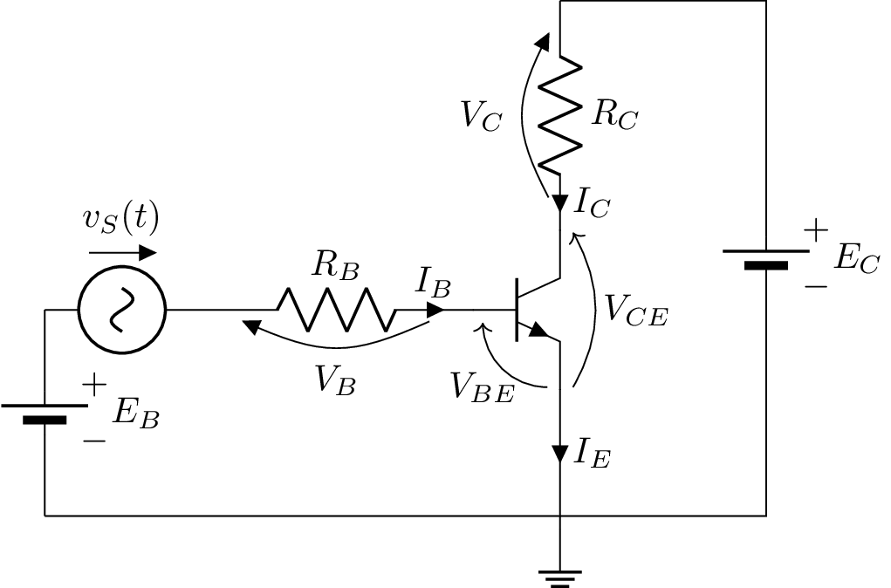 

</figure>

In caso sia inserito un generatore di tensione sinusoidale in serie alla batteria $E_B$, allora la corrente di polarizzazione oscillerebbe in un’intervallo $[I_B^*-\Delta I_B,I_B^*+\Delta I_B]$ Ciò si riflette in una variazione di curva nel piano del collettore, per cui dinamicamente è come se alternasse tra una curva all’altra. Producono delle leggere variazioni in corrente del collettore, ma una notevole variazione di tensione. In questo modo si applica una notevole amplificazione sia della corrente, sia della tensione, amplificando quindi la potenza del segnale trasmesso $v_S(t)$:

<figure id="fig:andamento-bjt-circuito-segnale">
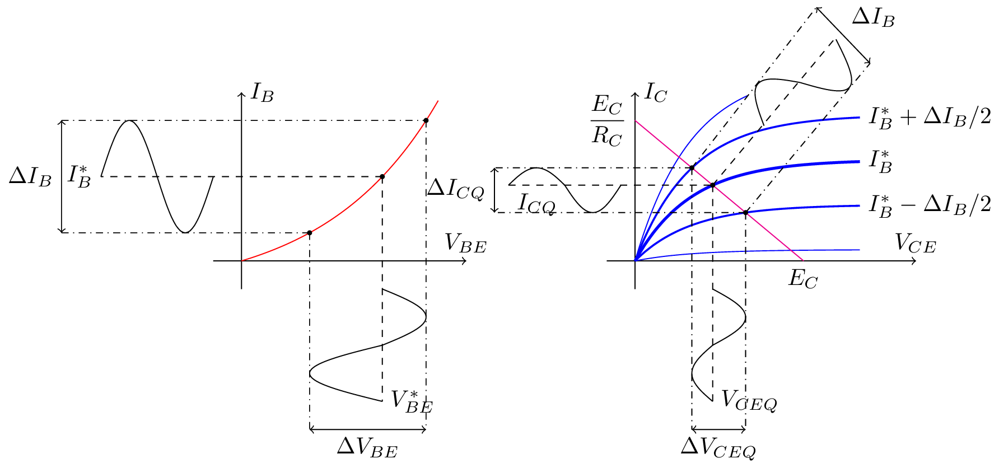
<figcaption>Andamento Volt-Ampere con Forzante Sinusoidale di un BJT</figcaption>
</figure>

Ma questa amplificazione avviene a scapito dell’energia fornita dai generatori $E_B$ e $E_C$, spostando dinamicamente il punto di equilibrio, quindi senza alimentazione non sarebbe possibile amplificare la potenza in entrata. Un transistor può essere utilizzato come amplificatore solamente se opera all’interno della zona attiva, altrimenti si comporterebbe come un limitatore di tensione, tagliando la forma d’onda quando assume valori tali da ricadere nella zona di saturazione o di interdizione. Queste zone sono accoppiate tra di loro, poiché se si usasse il transistor come interruttore bisognerebbe utilizzare le caratteristiche di entrambe queste zone, per cui il funzionamento del transistor è duplice.

### Polarizzazione

Si considera la più usuale modalità di polarizzazione di un transistor, utilizzando un solo generatore, tramite il seguente circuito:

<figure>

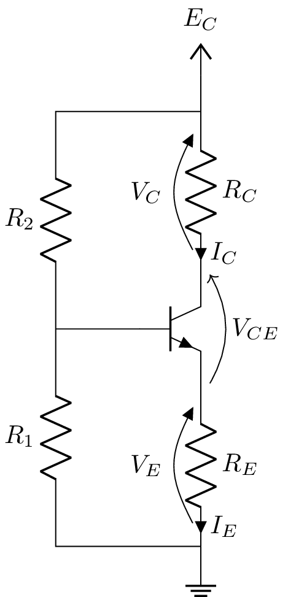 

</figure>

Se la resistenza di emettitore assume valori molto maggiori rispetto ai parametri parassiti del circuito, allora viene stabilizzato il valore della resistenza ad un valore noto a priori. Inserendo due resistori $R_1$ e $R_2$ si omette l’inserimento di una batteria connessa alla base, si può ritornare alla rappresentazione precedente considerando la rappresentazione di Thevenin equivalente tra il morsetto della base e della massa comune. Si può utilizzare il teorema di Thevenin poiché il transistor è un oggetto controllato dalla corrente $I_B$, ed aprendo i due morsetti su cui si applica il teorema di Thevenin non sarebbe più possibile per la corrente fluire dentro al circuito. L’unico elemento che rimane è quindi l’alimentatore $E_C$ ed un partitore, per cui la tensione di Thevenin $E_B$ si ottiene mediante la legge dei partitori di tensione: $$\begin{gathered}
    E_B\equiv V_{BGO}=E_C\displaystyle\frac{R_1}{R_1+R_2}
\end{gathered}$$

<figure>

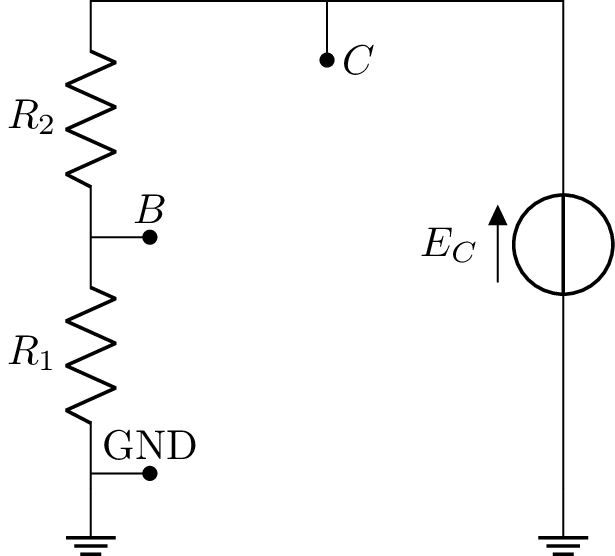 

</figure>

La resistenza di Thevenin equivalente $R_B$ si ottiene inserendo un cortocircuito al posto di $E_C$, risulta in questo caso che le due resistenze $R_1$ e $R_2$ sono connesse entrambe dalla base a GND, per cui sono in parallelo, quindi si ottiene: $$\begin{gathered}
    R_B=\displaystyle\frac{R_1R_2}{R_1+R_2}
\end{gathered}$$

<figure>

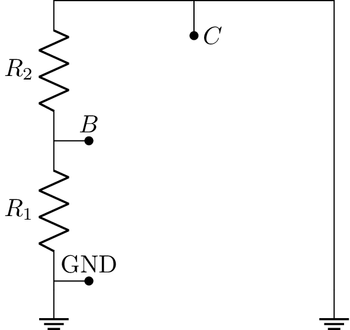 

</figure>

In questo modo si può sviluppare la medesima analisi svolta precedentemente, considerando solamente una resistenza in più connessa all’emettitore:

<figure>

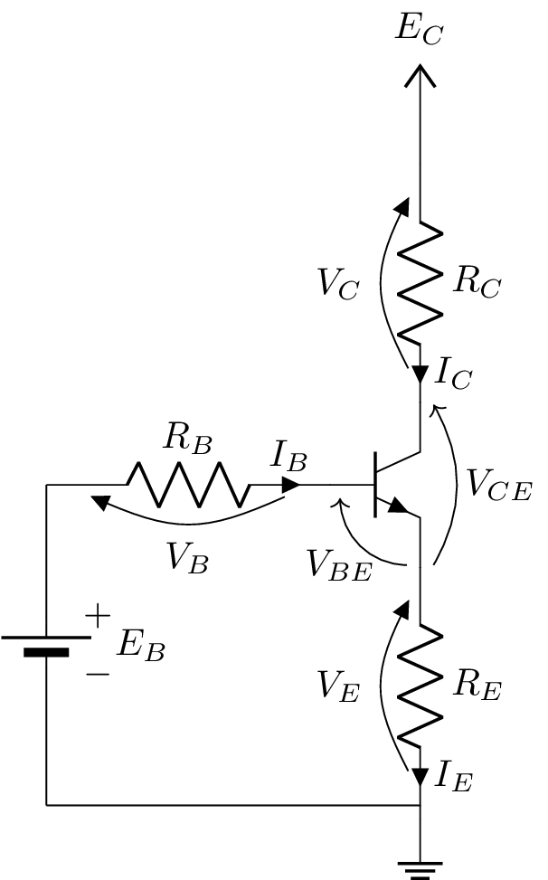 

</figure>

Si studiano le due maglie, ora tenendo conto della resistenza dell’emettitore $R_E$: $$\begin{gathered}
    \mbox{BE: }E_B=R_BI_B+V_{BE}+R_EI_E\\
    \mbox{CE: }E_C=R_CI_C+V_{CE}+R_EI_E
\end{gathered}$$ Si ricorda dalla precedente analisi che la corrente del collettore può essere espressa come una parte percentuale considerevole della corrente dell’emettitore: $I_C=\alpha I_E\approx I_E$, per cui si può approssimare sia esattamente la corrente emessa dall’emettitore. Per cui la corrente di base si ottiene come: $$\begin{gathered}
    I_E=I_C+I_B=\displaystyle\frac{1}{\alpha}I_C\\
    I_B=\displaystyle\frac{1-\alpha}{\alpha}I_C
\end{gathered}$$ Si definisce il fattore $\beta$ per descrivere il legame tra la corrente di base e di collettore: $$\begin{gathered}
    \beta=\displaystyle\frac{\alpha}{1-\alpha}\\
    \beta I_B=I_C
\end{gathered}$$

Generalmente si utilizza un parametro approssimato invece di $\beta$, chiamato guadagno in corrente base-collettore $h_{FE}$: $$\begin{gathered}
    h_{FE}=\displaystyle\frac{I_C}{I_B}\approx\beta
\end{gathered}$$

Ritornando alle equazioni di maglia, si ottiene la seguente espressione: $$\begin{gathered}
    E_C=R_CI_C+V_{CE}+R_EI_E=R_CI_C+V_{CE}+R_EI_C\\
    I_C=\displaystyle\frac{E_{C}}{R_C+R_E}-\frac{1}{R_C+R_E}V_{CE}
\end{gathered}$$ L’unica differenza è quindi la presenza della resistenza dell’emettitore al denominatore, invece della sola resistenza del collettore, ciò non provoca variazioni qualitative rispetto all’analisi effettuata considerando solamente la resistenza del collettore:

<figure>

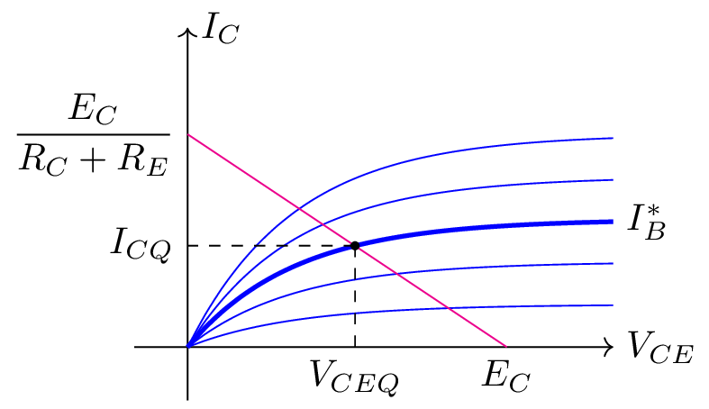 

</figure>

### Porte Logiche NOR e NAND

Tramite questa configurazione ad emettitore comune del transistor BJT, si possono costruire circuiti che rispettano la logica NOR e NAND, l’OR negato e l’AND negato.

Si considerano i seguenti circuiti per la porta NOR e NAND:

<figure id="fig:circuito-nor">
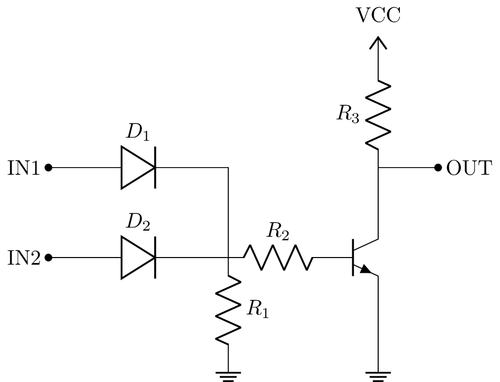
<figcaption>Porta NOR</figcaption>
</figure>

<figure id="fig:circuito-nand">
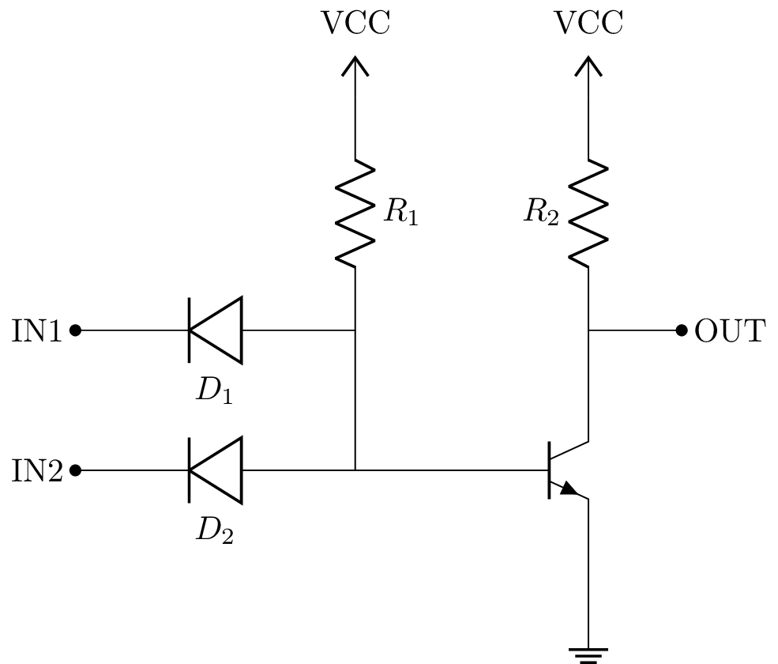
<figcaption>Porta NAND</figcaption>
</figure>

Il segnale in uscita dalla componente OR ed AND comanda un interruttore, formato da un transistor BJT. Se il transistor va in saturazione e conduce, se in entrata è presente un uno logico corrispondente ad un valore alto di tensione, realizza un cortocircuito tra il GND e l’output, producendo uno zero logico in uscita. Se è presente uno zero logico in entrata al transistor, il circuito è aperto, per cui la corrente di collettore non fluisce e ed il potenziale VCC esce in output, producendo un uno logico.

### Modello per Piccoli Segnali di un BJT

Questo modello è valido per piccoli segnali, per non mandare in interdizione il transistor, poiché modella il comportamento del transistor nella regione attiva. In questa regione il transistor opera come un amplificatore del segnale trasmesso in base. Per poter utilizzare il principio di sovrapposizione degli effetti, si suppone che il segnale in entrata sia talmente piccolo da linearizzare l’uscita. In questo modo non è necessario comprendere nell’analisi le eccitazioni in continuo del transistor, usate per identificare il punto di lavoro dell’oggetto. Prima di continuare l’analisi bisogna attuare la verifica termica che i sistemi di raffreddamento siano in grado di contenere tutti i fattori di perdita Joule, ed analizzare il sistema di dissipamento termico, per mantenere il sistema in condizioni operative nominali.

I transistor BJT sono quelli che presentano la perdita Joule maggiore, tra i vari tipi di transistor, per cui i transistor ad effetto di campo sono preferibili in ambiti dove è richiesto una perdita di potenza relativamente piccola.

Si possono individuare tre zone, la zona di amplificazione, il generatore del segnale, ed il carico del circuito:

<figure>

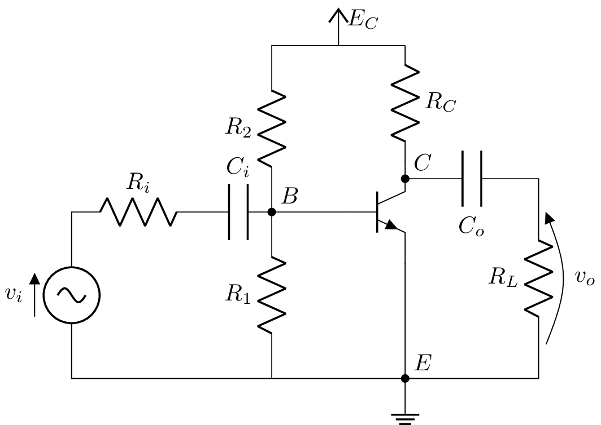 

</figure>

Quando si calcola l’eccitazione $E_C$, si analizza solamente il blocco amplificante, inserendo una resistenza sull’emettitore, per stabilizzare il funzionamento, sia in termini di tensione che di corrente, analizzato in . Sostituendo i generatori in continuo a dei cortocircuiti si può analizzare solamente l’amplificazione del segnale. Si inseriscono dei condensatori di contenimento, per rimuovere eventuali eccitazioni in continuo per polarizzare il transistor, poiché con un’eccitazione in entrata, presentano delle resistenze tendenti all’infinito, avendo una frequenza nulla, senza disturbare l’apparato che veicola il segnale. Ciò rappresenta un filtro per bloccare le frequenze basse. Se le frequenze sono sufficientemente alte, i condensatori possono essere considerati come dei cortocircuiti, poiché la loro impedenza tende a zero, per frequenze tendenti all’infinito.

Per cui analizzando solamente il segnale si ottiene il seguente circuito:

<figure>

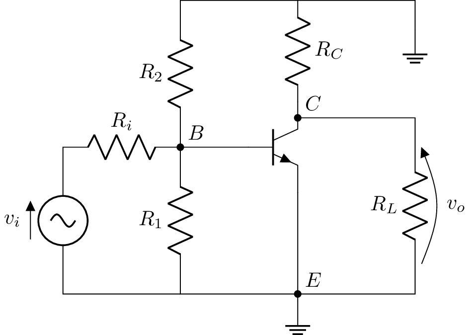 

</figure>

Poiché le resistenze $R_2$ e $R_C$ sono collegate alla massa comune, allora $R_1$ e $R_2$ sono in parallelo, così come $R_L$ e $R_C$. A questo punto bisogna trovare un modello matematico equivalente per poter descrivere il transistor tramite un due-porte sbilanciato:

<figure>

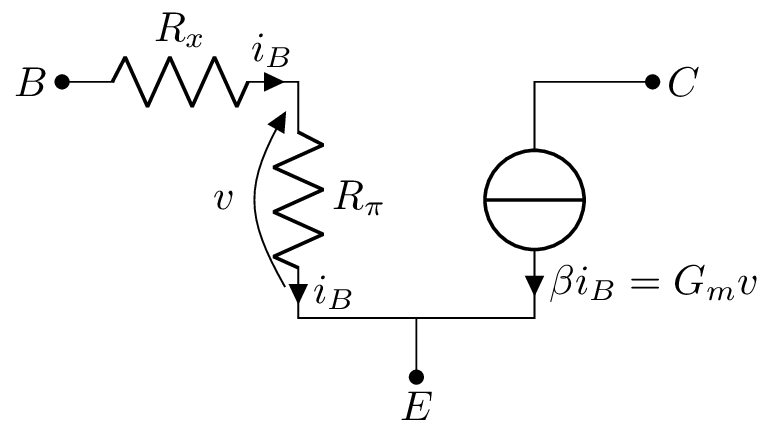 

</figure>

Sono presenti delle resistenze interne al materiale $R_{\pi}$, dipendenti da considerazioni della fisica dello stato solido, quindi indipendente dalla polarizzazione e generalmente fornito dal costruttore. Inoltre è presente una resistenza ai contatti di ingresso della base $R_x$. Il flusso di cariche interno si ottiene moltiplicando la corrente in entrata alla base per un fattore di amplificazione $\beta$: $\beta i_B$, viene modellato come un generatore controllato, dalla tensione interna tra la base e l’emettitore, ed una conduttanza $G_m$, determinata dalla fisica dello stato solido. Il circuito quindi diventa:

<figure>

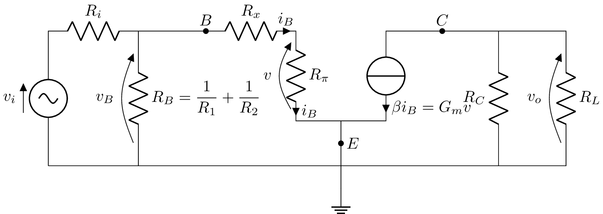 

</figure>

Il parametro di interesse è normalmente il guadagno in tensione, ottenuto dal rapporto tra la tensione in uscita ed in entrata: $$\begin{gathered}
    A=\displaystyle\frac{v_o}{v_i}
\end{gathered}$$ In questi casi si preferisce lavorare con due rapporti separati: $$\begin{gathered}
    A=\displaystyle\frac{v_o}{v_B}\frac{v_B}{v_i}
\end{gathered}$$ Per la legge dei partitori, si ricava dal circuito in entrata $v_B$, rispetto a $v_i$: $$\begin{gathered}
    v_B=\displaystyle\frac{1/R_B+1/(R_x+R_\pi)}{R_i+1/R_B+1/(R_x+R_\pi)}v_i\\
    \displaystyle\frac{v_B}{v_i}=\frac{1/R_B+1/(R_x+R_\pi)}{R_i+1/R_B+1/(R_x+R_\pi)}
\end{gathered}$$ Dal circuito in uscita si calcola $v_o$: $$\begin{gathered}
    v_o=-\beta i_B\displaystyle\frac{R_CR_L}{R_L+R_L}\\
    i_B=\displaystyle\frac{v_B}{R_x+R_\pi}\\
    v_o=-\beta\displaystyle\frac{v_B}{R_x+R_\pi}\frac{R_CR_L}{R_L+R_L}\\
    \displaystyle\frac{v_o}{v_B}=-\beta\displaystyle\frac{1}{R_x+R_\pi}\frac{R_CR_L}{R_L+R_L}
\end{gathered}$$ Per cui il guadagno in tensione equivale a: $$\begin{gathered}
    A=-\beta\displaystyle\frac{1/R_B+1/(R_x+R_\pi)}{R_i+1/R_B+1/(R_x+R_\pi)}\frac{1}{R_x+R_\pi}\frac{R_CR_L}{R_L+R_L}
\end{gathered}$$

### Modello a Parametri H

Nella rappresentazione a due-porte sbilanciato, è presente un unico generatore controllato, per cui la corrente in entrata al collettore non ha modo di controllare le grandezze nella base del transistor.

Per rappresentare questa interazione tra la base ed il collettore si considera un modello a parametri ibridi H. Sono possibili varie configurazioni di questo modello, si analizza solamente la configurazione a emettitore comune:

<figure>

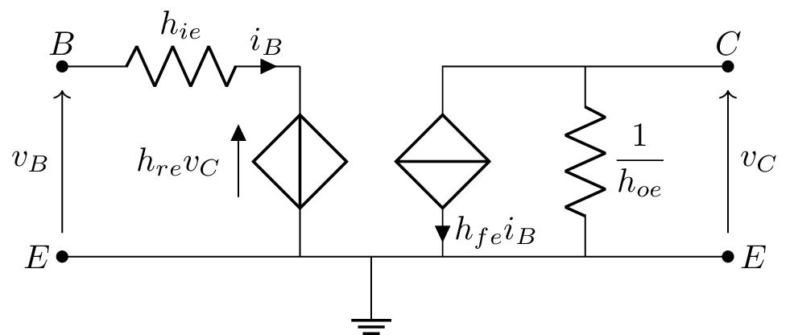 

</figure>

La $i$ al pedice indica input, la $r$ reverse, ed indica che la maglia di uscita controlla in qualche modo la maglia di ingresso. La $f$ sta per forward, ed indica che la maglia in entrata controlla la maglia in uscita. Mentre $o$ indica output. In generale i parametri H vengono forniti dal fabbricante. Per ritornare al caso due-porte sbilanciato si assegnano i seguenti valori ai parametri H: $$\begin{gathered}
    h_{ie}=R_x+R_{\pi}\\
    h_{fe}=\beta\\
    h_{oe}=0\\
    h_{re}=0
\end{gathered}$$ Poiché non è presente un controllo da parte dell’uscita sull’ingresso, o una controreazione.

## Amplificatore Operazionale Reale

Il circuito interno di un amplificatore operazionale reale può essere descritto semplificando da quattro stadi intermedi:

<figure>
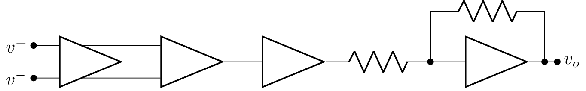
</figure>

I primi due stadi rappresentano amplificatori differenziali, inseriti dopo sono un inseguitore di emettitore ed un traslatore di livello, per ottenere una tensione in uscita $v_o$. Il componente più importante è l’amplificatore differenziale che presenta come uscita la differenza tra le tensioni in ingresso:

<figure>
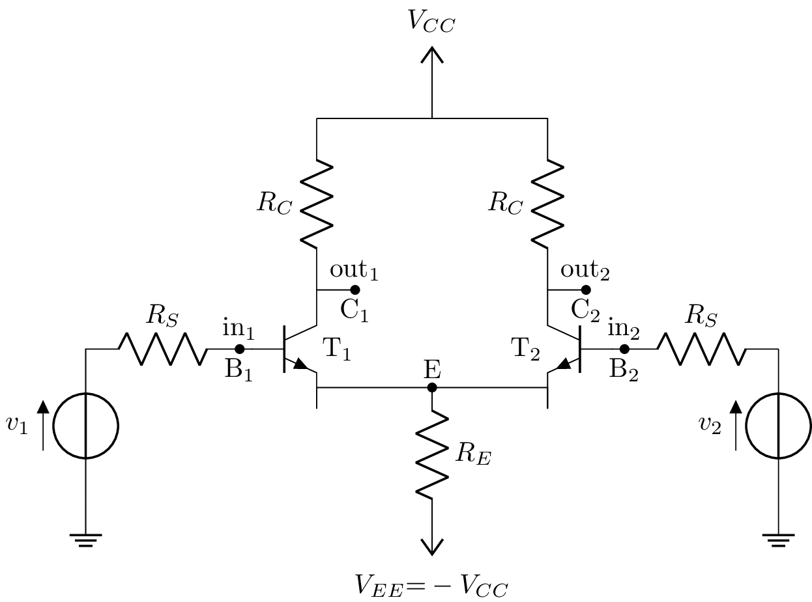
</figure>

Il circuito dell’amplificatore differenziale è composto da due transistor $\mathrm{T_1}$ e $\mathrm{T_2}$, che devono essere il più possibile identici l’uno con l’altro, con due resistenze di collettore, altrettanto identiche, $R_{C,1}=R_{C,2}=R_C$, un’unica resistenza di emettitore $R_E$, ed in entrata alle due basi sono posti due segnali. La tensione alle uscite $v_{o,1}$ e $v_{o,2}$ deve essere rappresentativa della differenza tra i due segnali in ingresso, a meno di un fattore di amplificazione. Le due alimentazioni $V_{CC}$ e $V_{EE}$ vengono utilizzate per polarizzare i transistor al punto di lavoro $Q$, poiché i due transistor e le loro resistenze sono uguali, allora anche il punto di lavoro $Q$ è comune ai due. Vengono inseriti due segnali $v_1$ e $v_2$ in questo circuito, e si applica un’analisi per piccoli segnali di questa rete. Per il principio di sovrapposizione degli effetti al posto delle alimentazioni viene inserita la massa, ed al posto dei transistor si inserisce il circuito equivalente dei transistor, in questo caso si usa il modello a parametri ibridi H. Poiché si analizza solamente il segnale si può omettere il generatore di tensione controllato in tensione nel modello del transistor:

<figure>
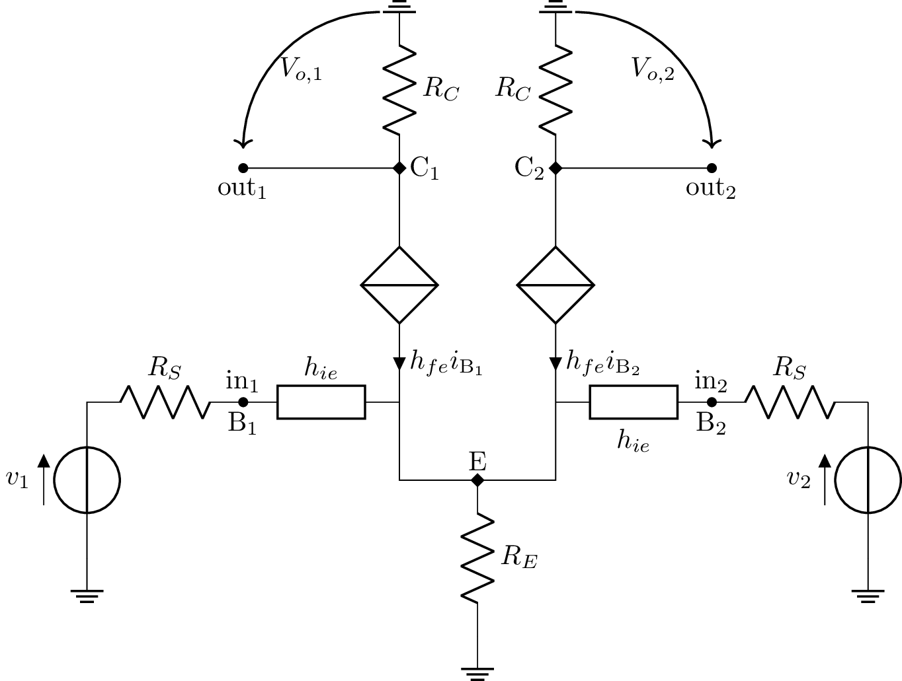
</figure>

Si rappresenta ora questo circuito considerando un unico riferimento all massa comune:

<figure>
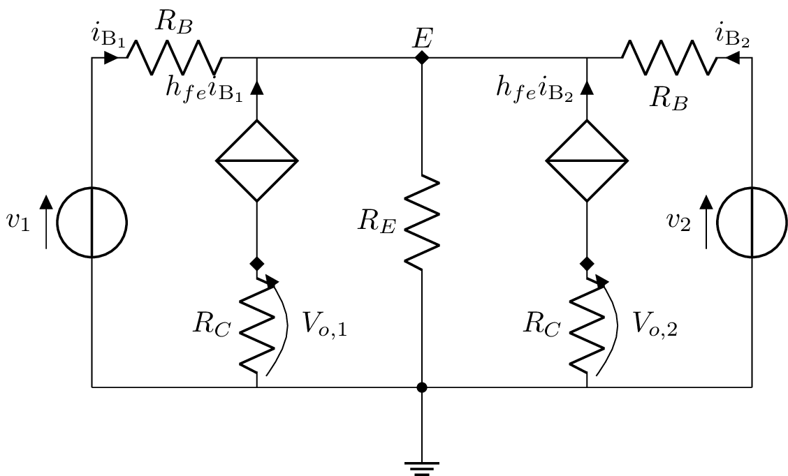
</figure>

In questo modo si sono compattate le grandezze del circuito precedente, tramite le seguenti relazioni: $$\begin{gathered}
    R_B=R_S+h_{ie}\\
    i_{\mathrm{B_1}}=(v_1-V_{E})G_B\\
    i_{\mathrm{B_2}}=(v_2-V_{E})G_B
\end{gathered}$$ Si risolve mediante il metodo dei nodi, poiché le resistenze $R_C$ sono in serie ad un generatore di corrente, non vengono considerate nella matrice delle conduttanze: $$\begin{gathered}
    (2G_B+G_E)V_E=G_B(v_1+v_2)+h_{fe}(i_{\mathrm{B_1}}+i_{\mathrm{B_2}})\\
    (2G_B+G_E)V_E=G_B(v_1+v_2)+h_{fe}G_B(v_1+v_2)-2h_{fe}G_BV_E\\
    (2G_B+G_E+2h_{fe}G_B)V_E=G_B(1+h_{fe})(v_1+v_2)\\
    V_E=\displaystyle\frac{G_B(1+h_{fe})(v_1+v_2)}{G_B(2+2h_{fe}+G_E/G_B)}
\end{gathered}$$ In genere per semplificare l’analisi si considerano valori sufficientemente elevati di $R_E$ tali che sia trascurabile il termine $G_E/G_B$: $$\begin{gathered}
    V_E=\displaystyle\frac{1+h_{fe}}{2(1+h_{fe})}(v_1+v_2)=\frac{v_1+v_2}{2}
\end{gathered}$$ Quindi il potenziale sull’emettitore corrisponde al valor medio tra i due segnali. La corrente alle due basi è quindi: $$\begin{gathered}
    i_{\mathrm{B_1}}=\left(v_1-\displaystyle\frac{v_1+v_2}{2}\right)G_B\\
    i_{\mathrm{B_2}}=\left(v_2-\displaystyle\frac{v_1+v_2}{2}\right)G_B
\end{gathered}$$ La tensione in uscita corrisponde alle tensioni ai capi delle resistenza $R_C$, poiché rispetto alla massa ci si trova in convenzione dei generatori le tensioni $v_{o,1/2}$ si esprimono come: $$\begin{gathered}
    \begin{cases}
        v_{o,1}=-R_Ch_{fe}i_{\mathrm{B_1}}\\
        v_{o,2}=-R_Ch_{fe}i_{\mathrm{B_2}}
    \end{cases}\\
        \begin{cases}
        v_{o,1}=\displaystyle-\frac{\strut R_Ch_{fe}}{\strut 2(R_S+h_{ie})}(v_1-v_2)\\
        v_{o,2}=\displaystyle\frac{\strut R_Ch_{fe}}{\strut 2(R_S+h_{ie})}(v_1-v_2)
    \end{cases}
\end{gathered}$$ Si definisce la quantità amplificazione differenziale $A_d$: $$A_d=\displaystyle\frac{R_Ch_{fe}}{2(R_S+h_{ie})}$$ Per cui le due tensioni in uscita si possono esprimere rispetto a questa grandezza così definita: $$\begin{gathered}
    \begin{cases}
        v_{o,1}=-A_d(v_1-v_2)\\
        v_{o,2}=A_d(v_1-v_2)
    \end{cases}
\end{gathered}$$ Se si indica $v_1-v_2$ come la tensione in ingresso, allora la porta $\mathrm{in_1}$ è la porta invertente, mentre la porta $\mathrm{in_2}$ è la porta non invertente. Poiché i due transistor usati sono componenti fisici e non possono essere identici nelle loro grandezze $h_{fe}$ e $h_{ie}$, bisognerebbe utilizzare due quantità diverse di amplificazione differenziale per ogni porta $A_{1}$ e $A_{2}$. Per stimare la qualità di questo amplificatore operazionale si considera per convenzione $A_d$ come la media tra i due fattori $A_1$ e $A_2$, questa si chiama applicazione in modo differenziale. Se invece viene usato un valore $A_S$: $$\begin{gathered}
    A_S=\displaystyle\frac{A_1-A_2}{2}
\end{gathered}$$ Si può scrivere una relazione per la tensione di uscita: $$\begin{gathered}
    v_o=\displaystyle\frac{A_1+A_2}{2}(v_1-v_2)+\frac{A_1-A_2}{2}(v_1+v_2)
\end{gathered}$$ In elettronica questo si chiama amplificazione in modo comune. Si definisce il fattore CMRR “Common Mode Rejection Ratio” il rapporto tra i fattori di amplificazione dei due modi: $$\mathrm{CMRR}=\displaystyle\frac{A_d}{A_s}$$ Più è elevato questo fattore, più è elevata la qualità dell’amplificatore differenziale. Nel caso in cui non esista il modo comune, questo fattore tende all’infinito. Spesso questo valore di guadagno viene fornito in decibel $\mathrm{d}B$: $$\mathrm{CMRR}_{\mathrm{d}B}=\displaystyle20\log_{10}\left(\frac{A_d}{A_s}\right)$$ In ambito elettronico si moltiplica il logaritmo per $20$ invece che per $10$, per ottenere il valore in decibel poiché spesso si lavora con rapporti elevati al quadrato.

L’inseguitore di emettitore è formato da un singolo transistor NPN, in funzione da amplificatore, e la tensione in uscita dall’oggetto corrisponde al potenziale dell’emettitore $V_E$.

Nello schema circuitale di un amplificatore operazionale si tende a diminuire il numero di resistori utilizzati per rendere il più compatto possibile l’oggetto e facilitarne la miniaturizzazione, simulando le resistenze utilizzando diodi, oggetti che provocano una caduta di tensione nota.

Il comportamento di un transistor rispetto ad un segnale presuppone che l’ingresso sia una grandezza piccola, ma se viene inserita una tensione $v_1$ molto elevata, allora è possibile che possa mandare l’amplificatore in saturazione. L’uscita in questo caso corrisponde a due possibili valori $\pm V_{\mathrm{sat}}$ comandati dal segnale, ma che oltre a questo non sono legati in alcun modo al segnale originale, per cui non viene trattato dall’operazionale. Una volta che l’oggetto viene saturato, per poter ritornare ad un comportamento a piccoli segnali bisogna disalimentare l’oggetto e ricominciare inserendo tensioni minori. Se venisse inserita la tensione nella porta non invertente, è possibile recuperare la risposta per piccoli segnali, diminuendo la grandezza in entrata, fino ad abbassarlo oltre il livello di soglia.

In generale un amplificatore reale presenta un’amplificazione molto elevata nella sua zona attiva, poiché l’intervallo di tensioni associato a questa zona è molto minore della zona di saturazione. Per cui se viene montato ad anello aperto, è possibile che anche per piccoli valori di tensioni, si ricada nella regione di saturazione. Dato che il guadagno ad anello aperto di un amplificatore è nell’ordine di grandezza di $10^6$. Mentre per un amplificatore ideale, il guadagno è infinito, ovvero l’unica tensione accettabile in ingresso è una tensione nulla, questo giustifica la legge costitutiva dell’operazionale ideale. Se invece è montato ad anello chiuso allora presenta delle grandezze in entrata che dipendono dalle uscite dello stesso operazionale, ed in questo modo è possibile controllare i valori di tensione in ingresso per rimanere nella zona attiva.

Fisicamente l’operazionale si presenta come un oggetto munito di otto morsetti. Alcuni di questi morsetti sono usati per controllare resistenze variabili che riportano il comportamento dell’operazionale in zero, poiché è presente un offset di tensione $v_{\mathrm{os}}$ che ricalibra l’offset per centrarlo in valori di tensione nulli. Questi due morsetti possono essere esclusi quando si rappresenta un operazionale ideale, poiché il suo comportamento in tensione viene supposto sempre centrato in zero. L’ottavo morsetto non viene utilizzato, e viene rappresentato solo per simmetria.

# Filtri

Si dividono in filtri digitali ed analogici. Verranno trattati solamente filtri analogici. Per arrivare alla definizione di un filtro si considera il problema che vogliono risolvere, per arrivare a questo si considera un circuito RC nel continuo. Si considera per semplicità la memoria del condensatore nulla $v_C(0^-)=0$.

La funzione di rete $H(s)$ associata a questo circuito si ottiene dal rapporto tra l’espressione dell’eccitazione e della risposta nel dominio di Laplace, possono essere guadagni o amplificazioni quando le due grandezze sono entrambe tensioni o correnti, oppure, se si tratta di tensione e corrente, impedenze o trans-impedenze, quando la tensione si trova su un bipolo diverso da quello che genera la corrente, invece ammettenze quando si tratta di corrente e tensione rispettivamente. Questa funzione di rete non è una trasformata ma un operatore.

## Impulso Unitario

Si considera una funzione $u_0(t)$ tale che la sua trasformata assume valore costante e pari ad uno: $$\begin{gathered}
    \mathcal{L}\{u_0(t)\}=U_0(s)=1
\end{gathered}$$ Si può ricavare questa funzione applicando la proprietà della derivazione al gradino unitario $u_{-1}(t)$: $$\begin{gathered}
    \mathcal{L}\left\{\displaystyle\frac{\mathrm{d}u_{-1}(t)}{\mathrm{d}t}\right\}=sU_{-1}(t)-\cancelto{0}{u_{-1}(0^-)}=1
\end{gathered}$$ Per cui questa funzione può essere definita come la derivata nel tempo del gradino unitario: $$u_0(t)=\displaystyle\frac{\mathrm{d}u_{-1}(t)}{\mathrm{d}t}$$ Questa distribuzione prende il nome di impulso unitario. In generale una funzione del tipo $u_{k}(t)$ può essere ottenuta applicando operazioni di integrazione o derivazione ad altre distribuzioni note, come il gradino unitario o, appunto, l’impulso unitario. L’impulso viene definito unitario, poiché il suo integrale risulta pari ad uno: $$\displaystyle\int_{0^-}^{0^+}u_{0}(t)\mathrm{d}t=1$$

Se l’eccitazione di un circuito fosse esattamente questo impulso unitario, allora sarebbe legittimo antitrasformare la funzione di rete, poiché coinciderebbe con la risposta del sistema.

## Serie di Fourier

Data una funzione $f(t)$ periodica di periodo $T$: $$\begin{gathered}
    f(t)=f(t+T)
\end{gathered}$$

Qualsiasi funzione periodica è descrivibile come una combinazione lineare di funzioni sinusoidali di opportuna ampiezza, fase e pulsazione: $$\begin{gathered}
    f(t)=F_0+\displaystyle\sum_{k=1}^{+\infty}F_k\sin(\omega k+\alpha_k)
\end{gathered}$$ La pulsazione di queste sinusoidi dipende dal periodo della funzione $f(t)$: $$\begin{gathered}
    \omega=\displaystyle\frac{2\pi}{T}=2\pi f
\end{gathered}$$

La frequenza più bassa $\omega$, che definisce il periodo della serie, si chiama frequenza fondamentale, mentre le frequenza che sono multipli interi di un fattore $k$, si chiamano armoniche di ordine $k$: $$\begin{gathered}
    k\omega=\displaystyle\frac{2\pi k}{T}=2k\pi f
\end{gathered}$$

Una proprietà importante di questa armoniche si ottiene calcolano il loro valor medio: $$\begin{gathered}
    \displaystyle\frac{1}{T}\int_0^T\sin^2(k\omega t)\mathrm{d}t=\frac{1}{2}\\
    \displaystyle\frac{1}{T}\int_0^T\cos^2(k\omega t)\mathrm{d}t=\frac{1}{2}
\end{gathered}$$ Invece se si considera un altro parametro $h\neq k$: $$\begin{gathered}
    \displaystyle\frac{1}{T}\int_0^T\sin (k\omega t)\sin (h\omega t)\mathrm{d}t=0\\
    \displaystyle\frac{1}{T}\int_0^T\cos (k\omega t)\cos (h\omega t)\mathrm{d}t=0
\end{gathered}$$ Inoltre gli integrali dei prodotti misti tra le due sinusoidi sono nulli: $$\begin{gathered}
    \displaystyle\frac{1}{T}\int_0^T\sin(k\omega t)\cos(h\omega t)\mathrm{d}t=0
\end{gathered}$$

Il valor medio di una funzione $f(t)$ corrisponde al coefficiente $F_0$, e può assumere sia valore nullo che non nullo: $$\begin{gathered}
    \displaystyle\frac{1}{T}\int_{0}^Tf(t)\mathrm{d}t=F_0\to\begin{cases}
        =0\\
        \neq0
    \end{cases}
\end{gathered}$$ Equivale al coefficiente $F_0$ poiché tutti gli altri contributi sono funzioni sinusoidali, e presentano quindi valor medio nullo. Per identificare gli altri coefficienti $F_k$ e $\alpha_k$ si espande l’espressione: $$\begin{gathered}
    F_k\sin(k\omega t+\alpha_k)=F_k\left[\sin(k\omega t)\cos\alpha_k+\sin\alpha_k\cos(k\omega t)\right]
\end{gathered}$$ Si definiscono quindi due nuovi fattori $a_k$ e $b_k$: $$\begin{gathered}
    a_k=F_k\cos\alpha_k\\
    b_k=F_k\sin\alpha_k
\end{gathered}$$ L’espressione diventa quindi: $$\begin{gathered}
    a_k\sin(k\omega t)+b_k\cos(k\omega t)
\end{gathered}$$ Rappresentano le due componenti ortogonali che descrivono la funzione sinusoidale. Elevando al quadrato entrambi i componenti si ottiene la seguente relazione: $$\begin{gathered}
    a_k^2+b_k^2=F_k^2\cancelto{1}{(\cos^2\alpha_k+\sin^2\alpha_k)}\\
    F_k=\sqrt{a_k^2+b_k^2}
\end{gathered}$$ Inoltre il fattore di fase $\alpha_k$ si può ottenere come: $$\begin{gathered}
    \displaystyle\frac{b_k}{a_k}=\frac{\sin\alpha_k}{\cos\alpha_k}=\tan\alpha_k\\
    \alpha_k=\arctan\displaystyle\frac{b_k}{a_k}
\end{gathered}$$ Poiché rappresenta un arco tangente bisogna aggiungere un fattore di $\pm\pi$ in base al segno dell’argomento per mantenere la continuità della funzione. Questi coefficienti ortogonali possono essere rappresentati come i componenti reali e complessi del numero complesso $F_k$: $$\begin{gathered}
    \dot F_k=a_k+jb_k
\end{gathered}$$

La serie si può quindi decomporre in: $$\begin{gathered}
    f(t)=F_0+\displaystyle\sum_{k=1}^{+\infty}a_k\sin k\omega t+\sum_{k=1}^{+\infty}b_k\cos k\omega t
\end{gathered}$$ Si moltiplicano entrambi i lati per la sinusoide $\sin(h\omega t)$: $$\begin{gathered}
    f(t)\sin(h\omega t)=F_0\sin(h\omega t)+\displaystyle\sum_{k=1}^{+\infty}a_k\sin (k\omega t)\sin(h\omega t)+\sum_{k=1}^{+\infty}b_k\cos (k\omega t)\sin(h\omega t)
\end{gathered}$$ Calcolando ora il valor medio di quest’espressione si ottiene la seguente relazione: $$\begin{gathered}
    \displaystyle\frac{1}{T}\int_0^Tf(t)\sin(h\omega t)\mathrm{d}t=\frac{1}{T}\cancelto{0}{\int_0^TF_0\sin(h\omega t)\mathrm{d}} t\\
    +\frac{1}{T}\int_0^T\sum_{k=1}^{+\infty}a_k\sin (k\omega t)\sin(h\omega t)\mathrm{d}t+\frac{1}{T}\sum_{k=1}^{+\infty}\cancelto{0}{\int_0^Tb_k\cos (k\omega t)\sin(h\omega t)\mathrm{d}t}
\end{gathered}$$

Per tutti i valori $k\neq h$, i valori medi tra i prodotti tra le due sinusoidi sono nulli, l’unico contributo non nullo corrisponde a $h=k$: $$\begin{gathered}
    a_k=\displaystyle\frac{2}{T}\int_0^Tf(t)\sin(h\omega t)\mathrm{d}t
\end{gathered}$$ Analogamente moltiplicando la funzione originale per $\cos(h\omega t)$, e calcolando il valore medio si ottiene il coefficiente $b_k$: $$\begin{gathered}
    b_k=\displaystyle\frac{2}{T}\int_0^Tf(t)\cos(h\omega t)\mathrm{d}t
\end{gathered}$$

### Passaggio per un Filtro

Nel dominio del tempo si considera un filtro come un blocco filtrante dove entra un’eccitazione $v_i(t)$ ed esce una risposta $v_o(t)$, analogamente nel dominio di Laplace entra $V_i(s)$ ed esce $V_o(s)$. Inoltre si studia la risposta in frequenza del filtro sostituendo $s=j\omega$ solamente alla funzione di trasferimento del filtro, poiché rappresenta un polo delle funzioni in entrata ed in uscita: $$\begin{gathered}
    H(s)\to H(j\omega)
\end{gathered}$$ Per cui bisogna utilizzare la rappresentazione dei fasori, ma questi non codificano la pulsazione. Scomponendo il segnale originale nel tempo in una serie di Fourier si ottengono fasori a pulsazioni diverse, quindi non possono essere sommati tra di loro, non vale quindi il principio di sovrapposizione degli effetti. Si ottiene un fasore diverso per ogni $k$-esima armonica: $$\begin{gathered}
    v_i(t)\to v_{i,k}(t)\\
    \forall k:v_{i,k}(t)\to \overline{V}_{i,k}
\end{gathered}$$ Per ogni fasore così ottenuto $\overline{V}_{i,k}$ si ottiene, tramite la risposta in frequenza del filtro $H(j\omega)$, un fasore in uscita $\overline{V}_{o,k}$: $$\begin{gathered}
    \overline{V}_{o,k}=H(jk\omega_0)\overline{V}_{i,k}
\end{gathered}$$ Una volta ottenuti i fasori in uscita si convertono nel dominio del tempo e si sommano tra di loro per ottenere il segnale in uscita $v_o(t)$. Si considera per semplicità $\omega_0$ la pulsazione fondamentale: $$\begin{gathered}
    v_{o,k}(t)=|\overline{V}_{o,k}|\sin(k\omega_0 t)\\
    v_o(t)=\displaystyle\sum_{k=1}^{+\infty}v_{o,k}(t) 
\end{gathered}$$

## Filtri del Primo Ordine

Ritornando al caso del circuito RC, si considera una funzione di rete che data dal rapporto della tensione ai capi del condensatore e della tensione in entrata al circuito. Questa funzione di rete rappresenta un’amplificazione o guadagno in tensione, si può calcolare semplicemente tramite la formula per i partitori di tensione $$\begin{gathered}
    H(f)=\displaystyle\frac{V_C(s)}{V_{i}(s)}=\frac{\displaystyle\frac{1}{sC}}{\frac{1}{sC}+R}\frac{V_{i}(s)}{V_i(s)}=\frac{1}{1+sCR}=\frac{1}{RC\left(s+\displaystyle\frac{1}{RC}\right)}
\end{gathered}$$ Poiché non rappresenta una trasformata di Laplace è consentito sostituire alla variabile complessa $s$ il componente puramente immaginario $j\omega$, simulando la risposta impulsiva della rete data una sinusoide in entrata di pulsazione $\omega$: $$\begin{gathered}
    H(j\omega)=\displaystyle\frac{\displaystyle\frac{1}{RC}}{j\omega+\displaystyle\frac{1}{RC}}
\end{gathered}$$ Di questo numero complesso si può studiare il modulo e la fase: $$\begin{gathered}
    |H(j\omega)|=\displaystyle\frac{\displaystyle\frac{1}{RC}}{\sqrt{\displaystyle\omega^2+\left(\frac{1}{RC}\right)^2}}=H(\omega)\\
    \varphi(\omega)=\arctan\left(-\omega RC\right)
\end{gathered}$$ La funzione $H(j\omega)$ può essere quindi espressa rispetto al suo modulo e fase: $$H(j\omega)=H(\omega)e^{\varphi(\omega)}$$ Si vuole analizzare ora il comportamento della risposta impulsiva in base alle possibili pulsazioni della sinusoide in entrata. La pulsazione può assumere valori compresi nell’intervallo $[0,+\infty]$, per cui si analizzano i comportamenti agli estremi: $$\begin{gathered}
    H(0)=1
\end{gathered}$$ Per pulsazioni nulle, ovvero in continua, tutta la tensione si trova sul condensatore, poiché corrisponde all’andamento della carica di un condensatore. Mentre per pulsazioni tendenti all’infinito si ha: $$\begin{gathered}
    \lim_{\omega\to+\infty}H(\omega)=\lim_{\omega\to+\infty}\displaystyle\frac{\displaystyle\frac{1}{RC}}{\sqrt{\displaystyle\omega^2+\left(\frac{1}{RC}\right)^2}}=0
\end{gathered}$$

Poiché la funzione è continua, la tensione ai capi del condensatore tende a valori di tensione sempre più piccoli dell’ingresso all’aumentare della pulsazione:

Se viene inserito un segnale composto da più frequenze, quando viene ricomposto frequenza per frequenza tramite il principio di sovrapposizione degli effetti, l’andamento del condensatore penalizza l’ampiezza delle frequenze maggiori. Per filtra le frequenze elevate, ma permette il passaggio delle frequenze basse, poiché non le altera allo stesso modo delle frequenze alte. Questo tipo di filtro si chiama passa-basso, in generale un filtro passa basso o low-pass si identifica con il simbolo $H_{\mathrm{LP}}(f)$. Poiché l’andamento è in continuo, si cerca una soglia per cui si può determinare se una data frequenza sia passata oppure no attraverso il filtro. Si definisce quindi una pulsazione di taglio $\omega_t$, ottenuta come la pulsazione per cui il modulo della risposta impulsiva risulta uguale al seguente valore: $$\omega_t:H_{\mathrm{LP}}(\omega_t)=\displaystyle\frac{1}{\sqrt2}$$ Viene anche chiamata pulsazione di mezza potenza. In decibel il modulo corrispondente diventa: $$\begin{gathered}
    20\log_{10}\displaystyle\frac{1}{\sqrt2}=-3_{\mathrm{d}B}
\end{gathered}$$ Spesso quindi si identifica la pulsazione di taglio come la pulsazione a meno tre decibel: $\omega_{-3}$.

Si calcola la pulsazione di taglio di questo sistema: $$\begin{gathered}
    \displaystyle\frac{\displaystyle\frac{1}{RC}}{\sqrt{\omega_t^2+\left(\displaystyle\frac{1}{RC}\right)^2}}=\frac{1}{\sqrt2}\\
    \omega_t^2+\left(\displaystyle\frac{1}{RC}\right)^2=2\left(\frac{1}{RC}\right)^2\\
    \omega_t=\displaystyle\frac{1}{RC}\tag{\stepcounter{equation}\theequation}
\end{gathered}$$ Si considerano solo frequenze positive, si ottiene quindi che la pulsazione di taglio coincide con il reciproco della costante di tempo $\tau$ del circuito. La fase associata alla pulsazione di taglio risulta essere pari a: $$\begin{gathered}
    \varphi(\omega_t)=\arctan\left(-\displaystyle\frac{1}{RC}RC\right)=-\frac{\pi}{4}
\end{gathered}$$ In generale i grafici del modulo e della fase si rappresentano usando uno stesso asse delle frequenze. La fase per frequenze nulle assume valore nullo $\varphi(0)=0$, mentre per frequenze tendenti all’infinito tende asintoticamente al valore di $-\pi/2$. Per cui anche la fase tende a diminuire all’aumentare della frequenza.

<figure>
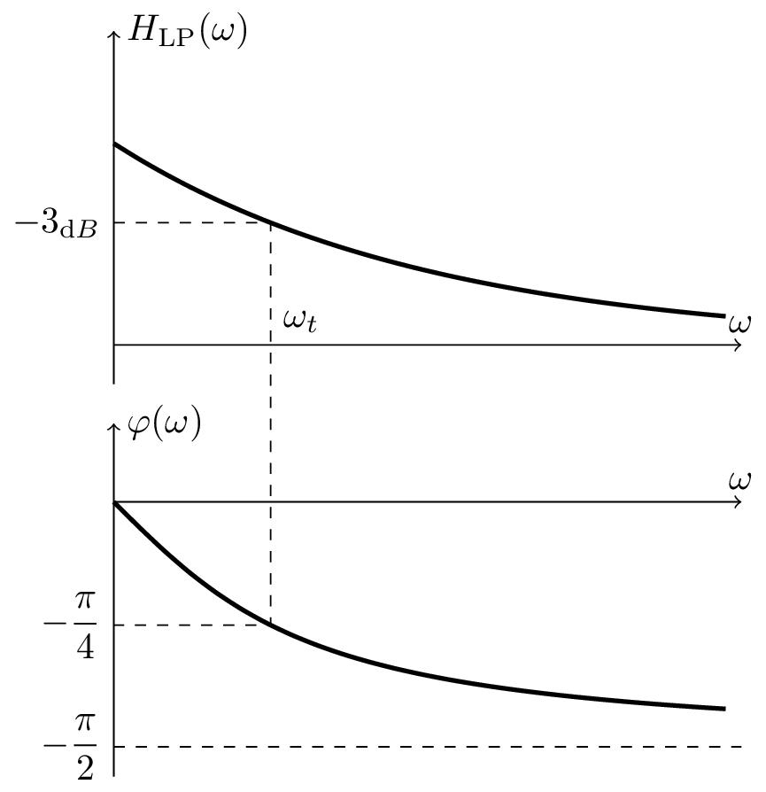
</figure>

Il filtro altera sia il modulo che la fase della funzione sinusoidale in entrata ad una data frequenza in entrata di pulsazione $\omega$.

Considerando la relazione $\omega_t=1/RC$, si può esprimere la funzione di rete del filtro interamente rispetto alla pulsazione di taglio: $$H_{\mathrm{LP}}(f)=A\displaystyle\frac{\omega_t}{s+\omega_t}$$ In questo modo si è generalizzata l’espressione per un filtro passa-basso.

Si considera un amplificatore invertente nel dominio di Laplace per rappresentare il filtro passa basso . Si ottiene la seguente funzione di rete: $$\begin{gathered}
    \displaystyle\frac{V_o(s)}{V_i(s)}=-\frac{y_1(s)}{y_2(s)}=H(s)
\end{gathered}$$ Si considera il segno negativo come un’amplificazione per un fattore $-1$. Per cui si ottiene la seguente relazione: $$\begin{gathered}
    \displaystyle\frac{y_1(s)}{y_2(s)}=\frac{\omega_t}{s+\omega_t}
\end{gathered}$$ La prima ammettenza non deve presentare zeri per cui corrisponde ad una conduttanza $G_1$. Mentre la seconda ammettenza corrisponde ad un parallelo tra una capacità $C_1$ ed una conduttanza $G_2$: $$\begin{gathered}
    y_1(s)=G_1\\
    y_2(s)=sC_1+G_2\\
    H_{\mathrm{LP}}(s)=-\displaystyle\frac{G_1}{sC_1+G_2}=-\frac{G_1}{C_1}\frac{1}{s+\displaystyle\frac{G_2}{C_1}}
\end{gathered}$$

<figure>
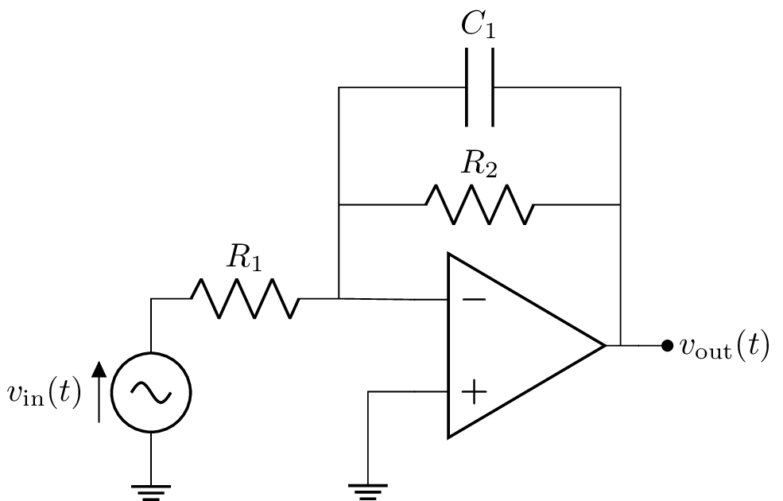
</figure>

La pulsazione di taglio si ottiene dal polo per cui $\omega_t=G_2/C_1$, mentre il fattore $G_1/C_1$ corrisponde ad un fattore di amplificazione. Questo filtro si chiama attivo, poiché l’operazionale deve essere polarizzato per funzionare correttamente.

Quando un segnale viene filtrato da un filtro passivo, bisogna tener conto dell’impedenza di carico del ricettore del segnale. I filtri passivi devono essere sempre analizzati a carico. Mentre un filtro attivo produce, idealmente, la stessa uscita indipendentemente dal carico inserito. L’operazionale reale si comporta come un filtro passa basso, poiché è un filtro attivo bisogna sempre eliminare il contributo dell’alimentazione in continua.

Si considera sempre lo stesso circuito RC, ma si analizza ora la tensione ai capi della resistenza $V_R(s)$, si può esprimere rispetto ai principi di Kirchhoff: $$\begin{gathered}
    V_R(s)=V_i(s)-V_o(s)\\
    H(s)=1-H_{\mathrm{LP}}(s)
\end{gathered}$$ Si analizza il comportamento modulo e fase della risposta impulsiva di questa funzione di rete $H(s)$: $$\begin{gathered}
    H(0)=1-H_{\mathrm{LP}}(0)=1-1=0\\
    \lim_{\omega\to+\infty}H(\omega)=1-\lim_{\omega\to+\infty}H_{\mathrm{LP}}(\omega)=1
\end{gathered}$$ Il comportamento si è quindi invertito e corrisponde ad un filtro passa-alto, e si esprime tramite il pedice $HP$: $$H_{\mathrm{HP}}(s)=1-H_{\mathrm{LP}}(s)=\displaystyle\frac{s}{s+\omega_t}$$

Si esprime ora in modulo e fase: $$\begin{gathered}
    H_{\mathrm{HP}}(j\omega)=\displaystyle\frac{j\omega}{j\omega+\omega_t}=\frac{j\omega(-j\omega+\omega_t)}{\omega^2+\omega_t^2}\\
    H_{\mathrm{HP}}(\omega)=\displaystyle\frac{\omega}{\sqrt{\omega^2+\omega_t^2}}\tag{\stepcounter{equation}\theequation}\\
    \varphi(\omega)=\arctan\left(\displaystyle\frac{\omega}{\omega_t}\right)\tag{\stepcounter{equation}\theequation}
\end{gathered}$$ Si analizza l’andamento della fase al variare della frequenza: $$\begin{gathered}
    \varphi(0)=\displaystyle\frac{\pi}{2}\\
    \varphi(\omega_t)=\displaystyle\frac{\pi}{4}\\
    \lim_{\omega\to+\infty}\varphi(\omega)=0
\end{gathered}$$ L’andamento modulo e fase del filtro passa alto è quindi rappresentato da queste curve:

<figure>
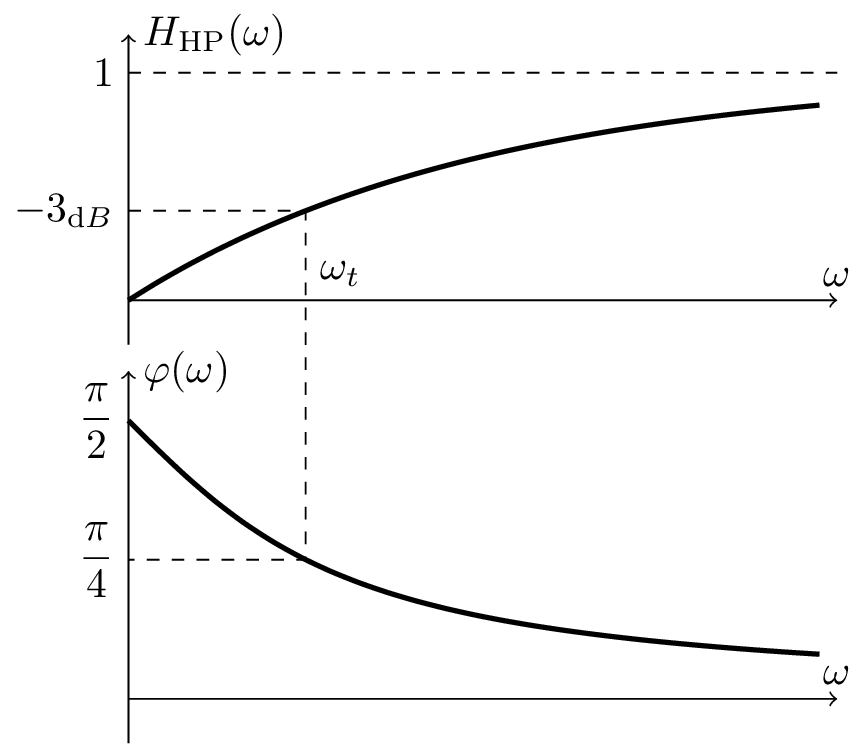
</figure>

Per verificare che si tratta della stessa pulsazione di taglio si considera la legge dei partitori per ricavare la funzione di rete sul resistore: $$\begin{gathered}
    \displaystyle\frac{R}{R+\displaystyle\frac{1}{sC}}=\frac{sCR}{sCR+1}=\frac{s}{s+\displaystyle\frac{1}{RC}}
\end{gathered}$$

Sarebbe stato possibile raggiungere le stesse conclusioni partendo da un circuito RL: $$\begin{gathered}
    \displaystyle\frac{V_L(s)}{V_i(s)}=\frac{sL}{sL+R}=\frac{s}{s+\displaystyle\frac{R}{L}}=H_{\mathrm{HP}}(s)
\end{gathered}$$ Dove il rapporto $R/L$ corrisponde all’inverso del tempo caratteristico $\tau=L/R$ per un circuito RL, per cui la pulsazione di taglio per un circuito RL è: $$\omega_t=\displaystyle\frac{R}{L}$$ Mentre considerando la tensione ai capi della resistenza si ottiene un filtro passa basso, poiché sull’induttore si ottiene un filtro passa alto: $$\begin{gathered}
    \displaystyle\frac{V_R(s)}{V_i(s)}=\frac{R}{sL+R}=\frac{\displaystyle\frac{R}{L}}{s+\displaystyle\frac{R}{L}}=\frac{\omega_t}{s+\omega_t}
\end{gathered}$$ La resistenza ha un comportamento duale rispetto al componente reattivo inserito in serie. Si vuole esprimere il filtro passa alto tramite un amplificatore invertente. Poiché è presente uno zero al numeratore bisogna inserire al posto della prima ammettenza un condensatore: $$\begin{gathered}
    y_1(s)=sC_1\\
    y_2(s)=sC_2+G_1\\
    H_{\mathrm{HP}}(s)=-\displaystyle\frac{C_1}{C_2}\frac{s}{s+\displaystyle\frac{G_1}{C_2}}
\end{gathered}$$

<figure>
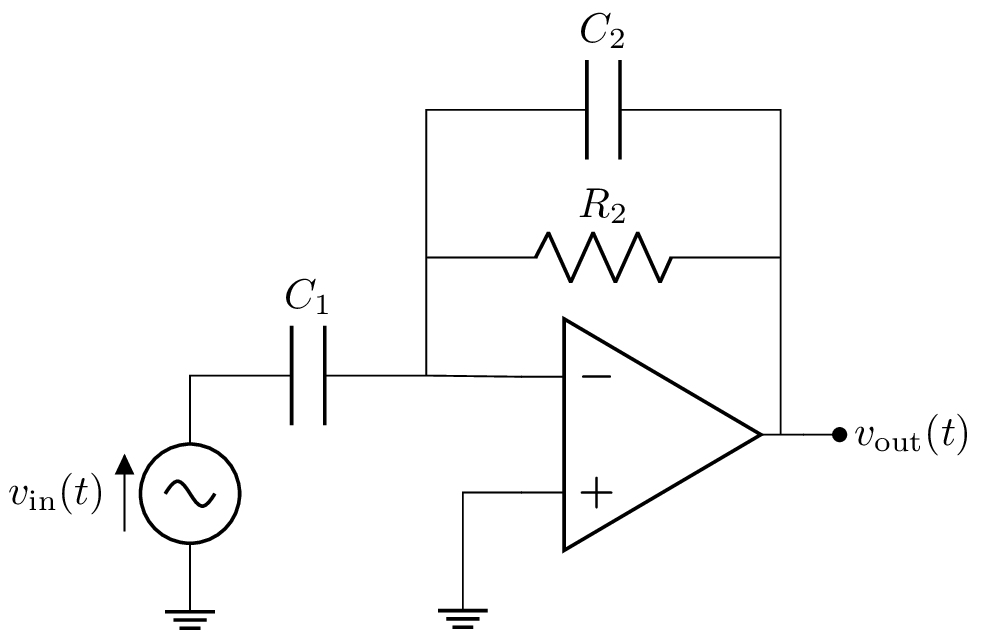
</figure>

Il segno meno si interpreta come un’opposizione di fase di un fattore $\pm\pi$ in caso la fase sia negativa o positiva: $$\begin{gathered}
    H(j\omega)=H(\omega)e^{j\varphi(\omega)}e^{\pm j\pi}
\end{gathered}$$ Ciò vale sia per i filtri passa basso che per i passa alto attivi.

## Filtri del Secondo Ordine

I filtri appena trattati vengono definiti filtri del primo ordine poiché contengono un memoria con memoria, possono rappresentare filtri semplici come i passa basso e passa alto, ma invece trovano difficoltà a filtrare solamente un intervallo di frequenze. Gli intervalli di frequenze che non passano per un filtro vengono chiamati banda oscura o di reiezione. Per ottenere un filtro capace di filtrare una banda bisogna utilizzare più di un componente dotato di memoria nella rete, ovvero circuiti del secondo ordine.

Se il filtro permette il passaggio di un intervallo di frequenze si dice passa banda $H_{\mathrm{BP}}$ altrimenti se impedisce il passaggio di un intervallo di frequenze si dice a reiezione di banda o Notch. Come il passa basso ed il passa alto possono essere realizzati in dualità.

Se vengono montati in serie due filtri del primo ordine per realizzare un filtro del secondo, bisogna considerare che un filtro passiva altera il comportamento di un altro filtro passivo montato in serie. Per cui non si possono considerare separati.

Si considera un circuito RLC e si vuole mostrare come può rappresentare un filtro universale. Questo circuito può presentare, in base alla pulsazione della forzante sinusoidale in entrata, un comportamento ohmico-capacitivo o ohmico-induttivo, come è stato precedentemente analizzato in . La pulsazione per cui cambia il cambiamento è la pulsazione di risonanza $\omega_0$: $$\begin{gathered}
    \omega_0=\displaystyle\frac{1}{\sqrt{LC}}
\end{gathered}$$

Se la pulsazione di ingresso coincide alla pulsazione di risonanza, la tensione sulla resistenza coincide con la tensione in ingresso, ed il loro rapporto sarà uno, mentre per pulsazioni diverse la risposta viene smorzata dalla reattanza, o induttiva o capacitiva. Per cui si comporta come un filtro passa banda, permettendo solo alle frequenze nell’intorno della pulsazione di risonanza di passare. Mentre sull’induttore il segnale corrisponde ad un segnale di un filtro passa alto, e sul condensatore di un filtro passa basso. Se invece si prendesse la risposta complessiva del componente LC, la reattanza si annulla, per cui il segnale non è presente, dato che si trova tutto sulla resistenza. Quindi si comporta come un filtro a reiezione di banda, per frequenze prossime alla pulsazione di risonanza.

### Passa Banda

Si determina la funzione di rete del passa banda, ovvero del resistore del circuito RLC: $$\begin{gathered}
    H_{\mathrm{BP}}(s)=\displaystyle\frac{V_R(s)}{V_i(s)}=\frac{R}{R+\displaystyle\frac{1}{sC}+sL}=\frac{sCR}{sCR+1+s^2LC}=\frac{sCR}{LC\left(\displaystyle s^2+\frac{R}{L}s+\frac{1}{LC}\right)}\\
    H_{\mathrm{BP}}(s)=\displaystyle\frac{\displaystyle\frac{R}{L}s}{\displaystyle s^2+\frac{R}{L}s+\frac{1}{LC}}
\end{gathered}$$ Si sostituisce la pulsazione di risonanza $\omega_0^2=1/LC$ e si definisce il fattore $B=R/L$: $$\begin{gathered}
    H_{\mathrm{BP}}(s)=\displaystyle\frac{Bs}{s^2+Bs+\omega_0^2}
\end{gathered}$$ Questa rappresenta la forma generale di un filtro passa banda.

Si applica ora la sostituzione $s=j\omega$ per studiare il suo comportamento in frequenza: $$\begin{gathered}
    H_{\mathrm{BP}}(j\omega)=\displaystyle\frac{j\omega B}{-\omega^2+j\omega B+\omega_0^2}=\frac{j\omega B}{(\omega_0^2-\omega^2)+j\omega B}\\
    H_{\mathrm{BP}}(\omega)=\displaystyle\frac{\omega B}{\sqrt{(\omega_0^2-\omega^2)^2+(\omega B)^2}}\tag{\stepcounter{equation}\theequation}
\end{gathered}$$ Si studia il modulo per pulsazioni nulle e tendenti all’infinito: $$\begin{gathered}
    H_{\mathrm{BP}}(0)=0\\
    \lim_{\omega\to+\infty}H_{\mathrm{BP}}(\omega)=\lim_{\omega\to+\infty}\displaystyle\frac{\omega B}{\sqrt{(\omega_0^2-\omega^2)^2+(\omega B)^2}}\frac{\frac{1}\omega}{\frac{1}\omega}=\lim_{\omega\to+\infty}\displaystyle\frac{B}{\sqrt{(\omega_0^2/\omega-\omega)^2+B^2}}=0
\end{gathered}$$ Quindi per il teorema di Weierstrass questa funzione deve avere almeno un punto stazionario, questo punto coincide con $\omega=\omega_0$: $$\begin{gathered}
    H_{\mathrm{BP}}(\omega_0)=1
\end{gathered}$$ Corrisponde al valore massimo del modulo in funzione della pulsazione. Per determinare la funzione della fase bisogna razionalizzare il denominatore di $H_{\mathrm{BP}}(j\omega)$: $$\begin{gathered}
    H_{\mathrm{BP}}(j\omega)=\displaystyle\frac{j\omega B}{(\omega_0^2-\omega^2)+j\omega B}\frac{(\omega_0^2-\omega^2)-j\omega B}{(\omega_0^2-\omega^2)-j\omega B}=\frac{\omega^2B^2}{(\omega_0^2-\omega^2)^2+\omega^2B^2}+j\frac{(\omega_0^2-\omega^2)\omega B}{(\omega_0^2-\omega^2)^2+\omega^2B^2}\\
    \varphi(\omega)=\arctan\left(\frac{\omega B(\omega_0^2-\omega^2)}{\omega^2 B^2}\right)=\arctan\left(\frac{\omega_0^2-\omega^2}{\omega B}\right)
\end{gathered}$$ Si analizza il comportamento della fase rispetto alla pulsazione: $$\begin{gathered}
    \varphi(0)=\displaystyle\frac{\pi}{2}\\
    \lim_{\omega\to+\infty}\varphi(\omega)=-\displaystyle\frac{\pi}{2}
\end{gathered}$$ Mentre per la pulsazione di risonanza, chiamata anche pulsazione di centro banda quando si tratta dei filtri: $$\begin{gathered}
    \varphi(\omega_0)=0
\end{gathered}$$ Bisogna ora identificare le due pulsazioni di taglio $\omega_{t,1}$ e $\omega_{t,2}$: $$\begin{gathered}
    H_{\mathrm{BP}}(\omega_t)=\displaystyle\frac{\omega_t B}{\sqrt{(\omega_0^2-\omega_t^2)^2+(\omega_t B)^2}}=\frac{1}{\sqrt2}\\
    \sqrt{(\omega_0^2-\omega_t^2)^2+(\omega_t B)^2}=\sqrt2 \omega_tB\\
    (\omega_0^2-\omega_t^2)=2\omega_t^2B^2-\omega_t^2B^2=\omega_t^2B^2
\end{gathered}$$ Si considerano ora due casi se la pulsazione di taglio è minore o maggiore della pulsazione di risonanza: $$\begin{gathered}
    \begin{cases}
        \omega_0^2-\omega_t^2=\omega_tB&\omega_0>\omega_t\\
        \omega_t^2-\omega_0^2=\omega_tB&\omega_0<\omega_t
    \end{cases}\\
    \begin{cases}
        \omega_t=\displaystyle\frac{\strut -B\pm\sqrt{B^2+4\omega_0^2}}{\strut2}\\
        \omega_t=\displaystyle\frac{\strut B\pm\sqrt{B^2+4\omega_0^2}}{\strut2}
    \end{cases}
\end{gathered}$$ Si considerano solo soluzioni positive, quindi si ottengono due soluzioni accettabili: $$\begin{gathered}
    \omega_{t,1/2}=\displaystyle\frac{\pm B+\sqrt{B^2+4\omega_0^2}}{2}
\end{gathered}$$ L’ampiezza di banda $\Delta\omega_t$ corrisponde quindi al fattore $B$ precedentemente definito: $$\Delta\omega_t=\omega_{t,2}-\omega_{t,1}=B$$ Per un circuito RLC l’ampiezza di banda è quindi data da: $$\begin{gathered}
    \Delta\omega_t=\displaystyle\frac{R}{L}
\end{gathered}$$

<figure>
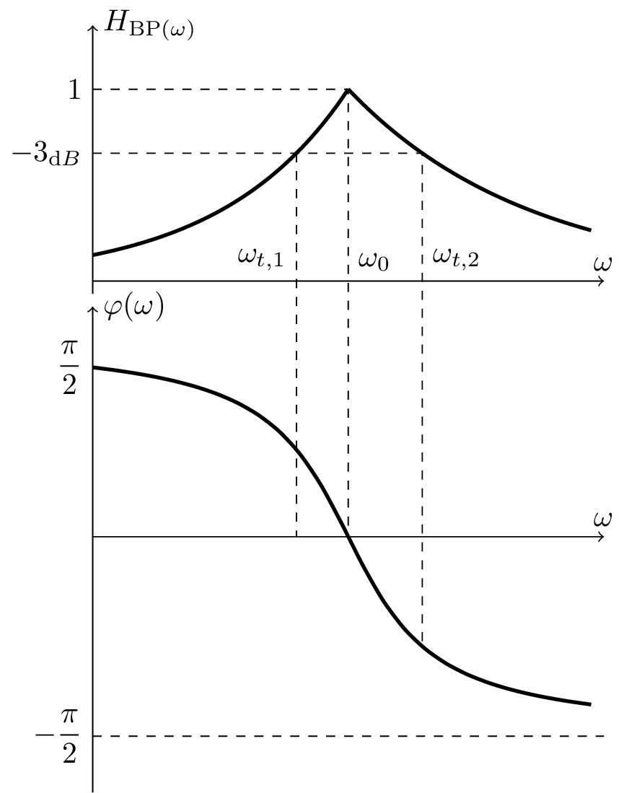
</figure>

Si definisce il fattore di merito $Q$. Considerando i fasori per $\omega_0$, il fasore della tensione sul condensatore $\overline{V}_C$ è in quadratura in ritardo, quello dell’induttore $\overline{V}_L$ è in quadratura in anticipo, mentre quello sul resistore $\overline{V}_R$ coincide per fase con il fasore in entrata $\overline{V}_i$. Poiché $\overline{V}_C$ e $\overline{V}_L$ sono in opposizione di fase, per avere un contributo complessivo nullo devono avere modulo uguale, per cui su un filtro il fattore di merito $Q$ viene definito come il rapporto tra il modulo della tensione su uno di questi componenti reattivi e la tensione di ingresso: $$\begin{gathered}
    Q=\displaystyle\frac{\omega_0LI}{RI}=\frac{I}{\omega_0RCI}\\
    Q=\displaystyle\frac{\omega_0L}{R}=\frac{1}{\omega_0RC}\tag{\stepcounter{equation}\theequation}
\end{gathered}$$ In generale il fattore di merito si ottiene dal rapporto tra la tensione in uscita e la tensione in entrata, quando ad una frequenza pari alla pulsazione di risonanza: $$Q=\displaystyle\frac{\overline V_0(\omega_0)}{\overline V_{i}(\omega_0)}$$ Si deve esprimere rispetto ai fasori poiché le tensioni di entrata ed in uscita hanno espressioni nel dominio di Laplace dove la pulsazione di risonanza rappresenta un polo. Poiché il fattore $R/L$ corrisponde alla banda passante, il fattore di merito $Q$ si può esprimere come: $$Q=\displaystyle\frac{\omega_0}{B}$$ Più il filtro è selettivo più il fattore di merito è elevato. Ciò vuol dire che sono presenti tensioni molto elevati sui componenti reattivi del circuito, per cui a pulsazioni di risonanza si applica molto stress su questi elementi, soprattutto sul condensatore, potrebbero non essere in grado di resistere alle tensioni applicate. Per cui bisogna verificare a pari capacità la tensione di tenuta dell’isolante, per impedire la rottura del condensatore.

### Notch o Reiezione di Banda

Nel filtro Notch, la tensione viene presa ai capi del condensatore ed induttore del circuito RLC. Per il principio di Kirchhoff alle tensione si ottiene la seguente relazione: $$\begin{gathered}
    V_i(s)=V_R(s)+V_C(s)+V_L(s)\\
    1=H_R(s)+H_C(s)+H_L(s)\\
    H_{\mathrm{\mathrm{No}}}=1-H_R(s)=1-H_{\mathrm{BP}}(s)\\
    H_{\mathrm{\mathrm{No}}}=1-\displaystyle\frac{sB}{s^2+sB+\omega_0^2}=\frac{s^2+\omega_0^2}{s^2+sB+\omega_0^2}
\end{gathered}$$

Poiché corrisponde alla somma delle due funzioni di trasferimento sul condensatore e sull’induttore, la funzione di questo filtro deve essere composta dalla somma di queste due: $$\begin{gathered}
    H_{\mathrm{\mathrm{No}}}(s)=\displaystyle\frac{s^2}{s^2+sB+\omega_0^2}+\frac{\omega_0^2}{s^2+sB+\omega_0^2}\\
    H_{\mathrm{\mathrm{No}}}=H_L(s)+H_C(s)
\end{gathered}$$ Il filtro passa alto, presenta un fattore $s$ al numeratore che compensa il contributo del denominatore alle frequenze elevate, e si attribuisce alla all’induttore, avendo un’impedenza dove la variabile $s$ si trova al numeratore: $$\begin{gathered}
    H_L(s)=\displaystyle\frac{s^2}{s^2+sB+\omega_0^2}
\end{gathered}$$ Analogamente il condensatore rappresenta sempre un filtro passa basso, avendo un’impedenza che aggiunge un polo in zero, ha quindi una funzione di trasferimento: $$\begin{gathered}
    H_C(s)=\displaystyle\frac{\omega_0^2}{s^2+sB+\omega_0^2}
\end{gathered}$$ Il segnale sul condensatore è quindi sempre passa basso, mentre sull’induttore sempre passa alto.

Si considera l’espressione del filtro Notch, considerando la formula per i partitori di tensione: $$\begin{gathered}
    H_{LC}(s)=\frac{\displaystyle\frac{1}{sC}+sL}{R+\displaystyle\frac{1}{sC}+sL}=\frac{sCR}{sCR+1+s^2LC}=\frac{LC\left(s^2+\displaystyle\frac{1}{LC}\right)}{LC\left(\displaystyle s^2+\frac{R}{L}s+\frac{1}{LC}\right)}\\
    H_{LC}(s)=\displaystyle\frac{s^2+\omega_0^2}{\displaystyle s^2+\frac{R}{L}s+\frac{1}{LC}}=H_{\mathrm{\mathrm{No}}}(s)
\end{gathered}$$ Si calcola la sua risposta in frequenza, con $s=j\omega$, e quindi il suo modulo e la fase: $$\begin{gathered}
    H_{\mathrm{\mathrm{No}}}(j\omega)=\displaystyle\frac{\omega_0^2-\omega^2}{(\omega_0^2-\omega^2)-j\omega B}=\frac{(\omega_0^2-\omega^2)\left[(\omega_0^2-\omega^2)-j\omega B\right]}{(\omega_0^2-\omega^2)^2+(\omega B)^2}\\
    H_\mathrm{\mathrm{No}}(\omega)=\displaystyle\frac{|\omega_0^2-\omega^2|}{(\omega_0^2-\omega^2)+j\omega B}\\
    \varphi(\omega)=\arctan\left(-\displaystyle\frac{ \omega B}{ \omega_0^2-\omega^2}\right)
\end{gathered}$$

<figure>
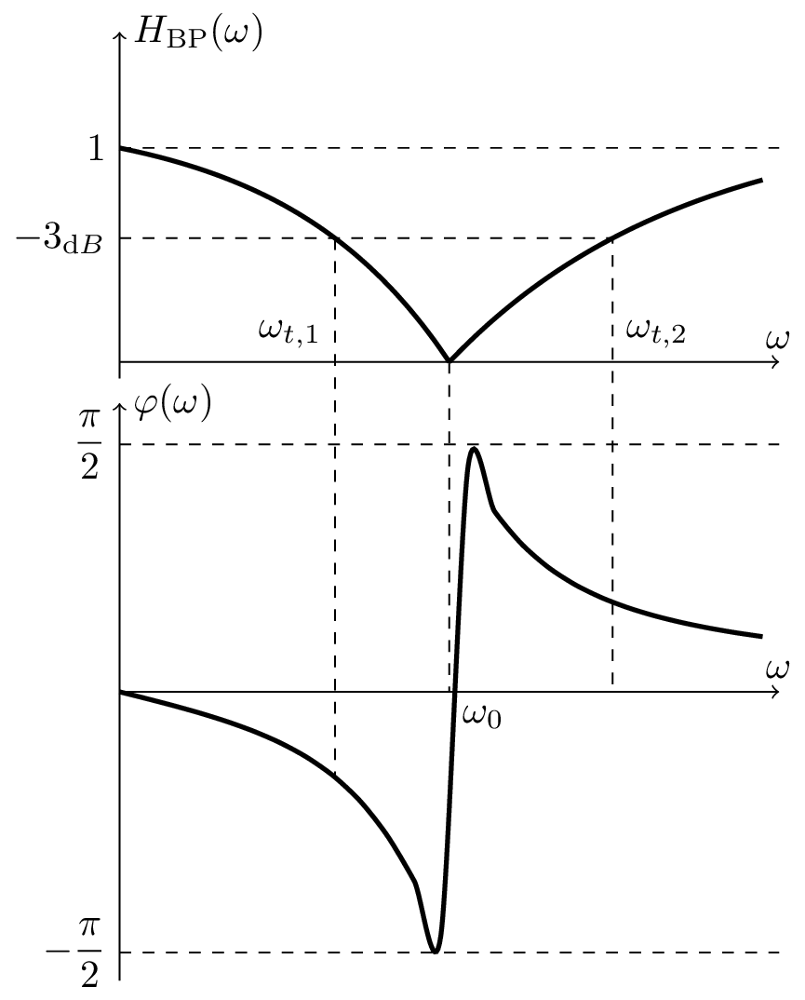
</figure>

Le pulsazioni di taglio coincidono alle pulsazioni di taglio individuate nell’analisi del passa banda, poiché sono due componenti duali.

### Passa Basso

Si può raggiungere la stessa conclusione considerano la formula per il partitore di tensione, poiché presenta al numeratore l’impedenza del componente di cui si vuole determinare la tensione, mentre al denominatore la somma tra le impedenze. Per cui per un condensatore, presentando un’impedenza inversamente proporzionale rispetto alla frequenza, corrisponde ad un passa basso: $$\begin{gathered}
    H_C(s)=\displaystyle\frac{\displaystyle\frac{1}{sC}}{s^2LC+sRC+1}=\frac{1}{LC\left(s^2+\displaystyle s\frac{R}{L}+\frac{1}{LC}\right)}
\end{gathered}$$ Invece della rappresentazione rispetto a $B$ e $\omega_0$, può essere espresso rispetto ad un termine chiamato smorzamento $\zeta$: $Q={1}/{B\zeta}$, quando si analizza la risposta completa del segnale, non soltanto la sua risposta in frequenza: $$\begin{gathered}
    D(s)=s^2+2\zeta\omega_n s+\omega_n^2
\end{gathered}$$ Per semplicità si continua ad usare la rappresentazione propria di un filtro del secondo ordine: $$\begin{gathered}
    H_C(s)=\displaystyle\frac{\omega_0^2}{s^2+sB+\omega_0^2}=H_{\mathrm{LP}}(s)
\end{gathered}$$ Si ottiene la risposta in frequenza del filtro, applicando la sostituzione $s=j\omega$: $$\begin{gathered}
    H_{\mathrm{LP}}(j\omega)=\displaystyle\frac{\omega_0^2[(\omega_0^2-\omega^2)-j\omega B]}{(\omega_0^2-\omega^2)^2+(\omega B)^2}
\end{gathered}$$ Si considera il suo modulo e la sua fase: $$\begin{gathered}
    H_{\mathrm{LP}}(\omega)=\displaystyle\frac{\omega_0^2}{\sqrt{(\omega_0^2-\omega^2)^2+(\omega B)^2}}\\
    \varphi(\omega)=\begin{cases}
        \arctan\left(\displaystyle-\frac{\strut \omega B}{\omega_0^2-\omega^2}\right)&\omega\leq\omega_0\\
        \arctan\left(\displaystyle-\frac{\strut \omega B}{\omega_0^2-\omega^2}\right)-\pi&\omega>\omega_0
    \end{cases}
\end{gathered}$$

Sostituendo i valori estremali del campo di definizione della pulsazione si ottiene: $$\begin{gathered}
    H_{\mathrm{LP}}(0)=1\\
    \lim_{\omega\to\infty}H_{\mathrm{LP}}(\omega)=0
\end{gathered}$$

In basi ai parametri inseriti, può essere presente un’amplificazione, anche molto maggiore di uno, in corrispondenza di un valore di picco. Poiché è variabile si mantiene l’analisi della pulsazione di taglio rispetto al valore di $-3\mathrm{d}B$: $$\begin{gathered}
    \displaystyle\frac{\omega_0^2}{\sqrt{(\omega_0^2-\omega_t^2)^2+(\omega_t B)^2}}=\frac{1}{\sqrt2}\\
    \omega_t=\displaystyle\sqrt{\frac{-(B^2-2\omega_0^2)+\sqrt{(B^2-2\omega_0^2)^2+4\omega_0^2}}{2}}\tag{\stepcounter{equation}\theequation}
\end{gathered}$$ Si analizza ora la frequenza corrispondente al valore di massimo, si cerca questo valore trovando il valore minimo del denominatore: $$\begin{gathered}
    \displaystyle\frac{\mathrm{d}}{\mathrm{d}\omega}\left[{{(\omega_0^2-\omega^2)^2+(\omega B)^2}}\right]=0\\
    2B^2\omega_m-4\omega_m(\omega_0^2-\omega^2)=0\\
    \omega_m=\displaystyle\frac{4\omega_0^2-2B^2}{4}\tag{\stepcounter{equation}\theequation}
\end{gathered}$$

<figure>
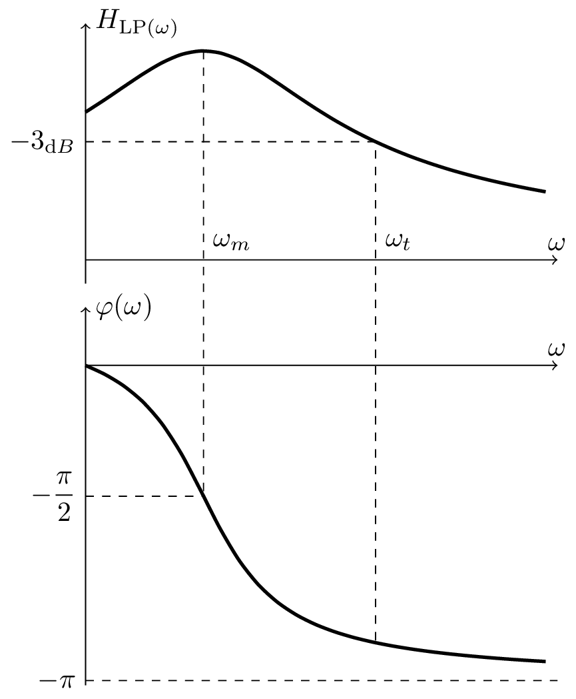
</figure>

Potrebbe essere richiesto a questo filtro di avere un valore di picco del modulo per frequenze nulle, ovvero $\omega_m=0$, simulando quindi il comportamento di un filtro passa basso del primo ordine. Per ottenere questo andamento si ottiene la seguente relazione: $$\begin{gathered}
    \displaystyle\frac{4\omega_0^2-2B^2}{4}=0\\
    B=\omega_0\sqrt{2}
\end{gathered}$$ Considerando il fattore di merito $Q$, sostituendo questa relazione si ottiene: $$\begin{gathered}
    Q=\displaystyle\frac{\omega_0}{B}=\frac{1}{\sqrt2}
\end{gathered}$$ Ciò comporta che la pulsazione di taglio coincide alla pulsazione di risonanza, dall’espressione precedente: $$\begin{gathered}
    \omega_t=\omega_0
\end{gathered}$$ Per cui il valor della resistenza di un circuito RLC dipende dall’induttore secondo la seguente relazione: $$\begin{gathered}
    B=\displaystyle\frac{R}{L}\\
    R^*=LB=\omega_0L\sqrt2\tag{\stepcounter{equation}\theequation}
\end{gathered}$$

In alcune analisi è richiesto che la forma d’onda in uscita dal filtro sia conservata, per cui non deve alterare la fase nell’intorno delle frequenze interessate.

### Passa Alto

Si applica un ragionamento analogo per ottenere un filtro passa alto da un circuito RLC serie, misurando la tensione ai capi dell’induttore: $$\begin{gathered}
    H_{L}(s)=\displaystyle\frac{s^2}{s^2+\displaystyle s\frac{R}{L}+\frac1{LC}}=\frac{s^2}{s^2+sB+\omega_0^2}=H_{\mathrm{HP}}(s)\\
\end{gathered}$$ Si analizza il suo modulo: $$\begin{gathered}
    H_{\mathrm{LP}}(\omega)=\displaystyle\frac{\omega^2}{\sqrt{(\omega_0^2-\omega^2)^2+(\omega B)^2}}\\
\end{gathered}$$ E la sua fase: $$\begin{gathered}
    \varphi(\omega)=\begin{cases}
        \arctan\left(\displaystyle-\frac{\strut \omega B}{\omega_0^2-\omega^2}\right)+\pi&\omega\leq\omega_0\\
        \arctan\left(\displaystyle-\frac{\strut \omega B}{\omega_0^2-\omega^2}\right)&\omega>\omega_0
    \end{cases}
\end{gathered}$$ Si calcola la sua pulsazione di taglio: $$\begin{gathered}
    \omega_t=\displaystyle\sqrt{\frac{(B^2-2\omega_0^2)+\sqrt{(B^2-2\omega_0^2)^2+4\omega_0^2}}{2}}
\end{gathered}$$ E si calcola il suo valore di picco: $$\begin{gathered}
    \displaystyle\frac{\mathrm{d}}{\mathrm{d}\omega}\left[\frac{B^2\omega^2}{\omega^4}+\frac{\omega_0^4}{\omega^4}-2\frac{\omega_0^2\omega^2}{\omega^4}+\frac{\omega^4}{\omega^4}\right]=0\\
    \omega_m=\displaystyle\sqrt{\frac{4\omega_0^4}{4\omega_0^2-2B^2}}\tag{\stepcounter{equation}\theequation}
\end{gathered}$$

<figure>

</figure>

Per ottenere lo stesso comportamento di un filtro del primo ordine si considera: $$\begin{gathered}
    \omega_m\to\infty\\
    B=\omega_0\sqrt{2}
\end{gathered}$$ Si ottiene la stessa relazione ottenuta dal filtro passa basso del secondo ordine. Allo stesso modo si può imporre la stessa relazione sul valore della resistenza: $$\begin{gathered}
    R^*=\omega_0L\sqrt2
\end{gathered}$$

Per diminuire l’effetto sulla fase di un filtro si considerano due filtri passa basso e passa alto, e dalla frequenza di crossover, che rappresenta l’intersezione tra gli andamenti dei due moduli $H_{\mathrm{HP}}$ e $H_{\mathrm{LP}}$. In base alla pulsazione, maggiore o minore di questo valore, vengono inviati a due apparti diversi che li lavorano e permettono di ricombinarli per mantenere la fase originale.

### Filtri Attivi

Si considera il seguente filtro passa banda del secondo ordine:

<figure>
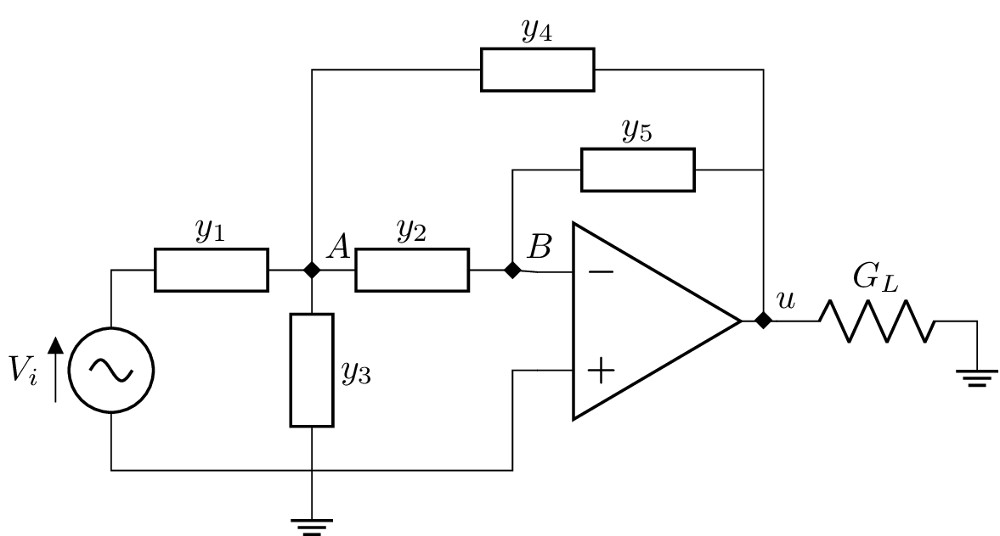
</figure>

Si risolve mediante il metodo dei nodi: $$\begin{gathered}
    \begin{bmatrix}
        y_1+y_2+y_3+y_4&-y_2&-y_4\\
        -y_2&y_2+y_5&-y_5\\
        -y_4&-y_5&y_4+y_5+G_L
    \end{bmatrix}\begin{bmatrix}
        V_A\\V_B\\V_u
    \end{bmatrix}=\begin{bmatrix}
        y_1V_i\\0\\-I_u
    \end{bmatrix}
\end{gathered}$$ Sono presenti due controreazioni per ottenere un’equazione di secondo grado al numeratore, per ottenere un’espressione di uscita della tensione pari alla maschera del filtro voluta.

In questo operazionale la tensione di uscita $V_u(s)$ è totalmente indipendente dal carico $G_L$. Questo è il vantaggio dei filtri attivi, ma nel caso reale il comportamento non corrisponde esattamente a questo.

Quest’analisi rappresenta un progetto di massima, bisogna poi verificare che in commercio esistono i componenti dalle grandezze richieste dai calcoli svolti. Inoltre bisogna controllare il funzionamento con un operazionale reale, e che i sistemi di raffreddamento progettati siano in grado di soddisfare la potenza dissipata. Inoltre bisogna considerare i requisiti di sicurezza. Ad ogni passaggio bisogna eventualmente svolgere nuovamente i calcoli per ricalibrare il filtro. Anche nella costruzione dell’oggetto potrebbe essere necessario considerare la dimensione dei componenti, poiché potrebbe essere comparabile alla lunghezza d’onda del segnale, quindi andrebbe analizzato come fosse una linea.

Si inserisce il vincolo dell’operazionale $V_B=0$, detto anche cortocircuito virtuale, poiché i due elementi sono allo stesso potenziale: $$\begin{gathered}
    \begin{bmatrix}
        y_1+y_2+y_3+y_4&0&-y_4\\
        -y_2&0&-y_5\\
        -y_4&1&y_4+y_5+G_L
    \end{bmatrix}\begin{bmatrix}
        V_A\\I_u\\V_u
    \end{bmatrix}=\begin{bmatrix}
        y_1V_i\\0\\0
    \end{bmatrix}
\end{gathered}$$ Con il metodo di Cramer si ottiene la seguente tensione in uscita: $$\begin{gathered}
    V_u=\displaystyle\frac{-y_1y_2}{(y_1+y_2+y_3+y_4)y_5+y_2y_4}V_i
\end{gathered}$$ Si pone uguale alla maschera del filtro passa banda che si vuole realizzare: $$\begin{gathered}
    \displaystyle\frac{V_u(s)}{V_i(s)}=\frac{-y_1y_2}{(y_1+y_2+y_3+y_4)y_5+y_2y_4}=\frac{sB}{s^2+sB+\omega_0^2}
\end{gathered}$$ Si assegna ad $y_1$ una conduttanza $G_1$, a $y_2$ una capacità $sC_2$. Queste due ammettenze possono essere invertite, poiché non alterano il risultato finale. Inoltre si considerare $y_4$ un condensatore $sC_4$, e le due ammettenze $y_5$ e $y_3$ resistive $G_5$ e $G_3$ rispettivamente. Sostituendo nell’espressione precedente si ottiene: $$\begin{gathered}
    \displaystyle\frac{-sG_1}{C_4\left(\displaystyle\frac{(G_1+G_3)G_5}{C_2C_4}+\frac{(C_2+C_3)G_5}{C_2C_4}s+s^2\right)}=\frac{sB}{s^2+sB+\omega_0^2}\\
    \begin{cases}
        \displaystyle\frac{\strut G_1}{\strut C_4}=B\\
        \displaystyle\frac{\strut (G_1+G_3)G_5}{\strut C_2C_4}=B\\
        \displaystyle\frac{\strut (G_1+G_3)G_5}{\strut C_2C_4}=\omega_0^2
    \end{cases}
\end{gathered}$$

<figure>
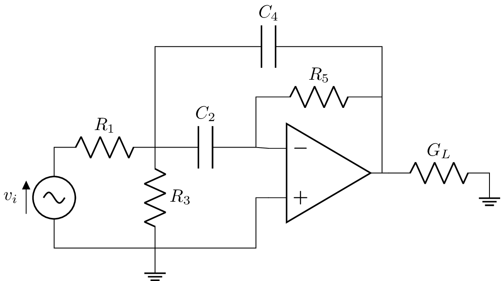
</figure>

In base ai valori di banda di pulsazione di risonanza richiesta dal filtro, quest’ultima relazione rappresenta i vincoli di esistenza dei parametri, sulla base dei cui si scelgono i valori dei componenti per realizzare il filtro.

Inoltre è sempre possibile realizzare, dimensionando opportunamente, un filtro passivo, per esempio un RLC serie in questo caso, capace di avere lo stesso comportamento di un filtro attivo.

Un filtro attivo presenta un limite nelle frequenze che può sopportare, mentre un filtro passivo può inseguire le frequenze che vengono inserite.

Altre categoria molto utilizzate di filtri attivi sono i filtri a reazione multipla, che utilizzano più di una controreazione tra l’uscita e l’ingresso dell’operazionale, oppure VCVS “Voltage Controlled Voltage Source”, poiché l’uscita si comporta come se fosse un generatore di tensione controllato in tensione.
