---
author:
- "*Giacomo Sturm*"
date: |
  *Dipartimento di Ingegneria Civile, Informatica e delle Tecnologie Aeronautiche  
  Università degli Studi “Roma Tre"*
title: |
  **Fisica I**  
  Appunti delle Lezioni di Fisica I  
  *Anno Accademico: 2022/23*
---

\providecommand{\labelText}[2]{#1}

# Introduzione: Sistema Internazionale

Prima di studiare fenomeni fisici, bisogna definire delle unità di misura con le quali misurare le grandezze fisiche trattate. Il Sistema Internazionale di Unità di Misura fornisce un sistema di misura comune, usato nella maggior parte del mondo. Contiene $7$ unità fondamentali, dalle quali vengono ricavate tutte le altre unità di misura derivate.

Poiché esistono fenomeni che hanno effetti di ordini di grandezza molto diversi tra di loro, sono stati definiti dei prefissi che rappresentano multipli e sottomultipli di unità base del Sistema Internazionale corrispondenti a potenze di $10$:

| Prefisso | Simbolo |  Valore   |
|:--------:|:-------:|:---------:|
|   Tera   |    T    | $10^{12}$ |
|   Giga   |    G    | $10^{9}$  |
|   Mega   |    M    |  $10^6$   |
|   Kilo   |    k    |  $10^3$   |
|   Etto   |    h    |  $10^2$   |
|   Deca   |   da    |   $10$    |

| Prefisso | Simbolo |   Valore   |
|:--------:|:-------:|:----------:|
|   Deci   |    d    | $10^{-1}$  |
|  Centi   |    c    | $10^{-2}$  |
|  Milli   |    m    | $10^{-3}$  |
|  Micro   |  $\mu$  | $10^{-6}$  |
|   Nano   |    n    | $10^{-9}$  |
|   Pico   |    p    | $10^{-12}$ |

## Tempo

Nel Sistema Internazionale il tempo viene misurato mediante il secondo (s). Un secondo viene definito come il tempo necessario per un fotone emesso da un atomo di Cesio 133 per compiere $9{,}192631770\times 10^9$ oscillazioni.

Sapendo che l’energia emessa dal fotone è: $E= \lambda h$, la sua lunghezza d’onda $\lambda$ è data dal prodotto della velocità del fotone per la sua frequenza: $\lambda  = cf$. Quindi si può ricavare la frequenza, e di conseguenza il periodo, dal fotone sostituendo nell’equazione per l’energia: $$\begin{gathered}
    E = cfh\\
    f = \displaystyle\frac{E}{ch}\\
    T = \displaystyle\frac{ch}{E}\\
    1\,\mathrm{s} := 9{,}192631770\times 10^9 \times T = 9{,}192631770\times 10^9 \times \displaystyle\frac{ch}{E}
\end{gathered}$$

Dove $h$ è la costante di Planck, $c$ è la velocità della luce nel vuoto, ed $E$ è l’energia emessa dal fotone, misurabile.

## Lunghezza

Nel Sistema Internazionale la lunghezza viene misurata mediante il metro (m). Un metro viene definito come la distanza percorsa dalla luce nel vuoto in $1/\left(2{,}99792458\times 10^8\right)\mathrm{s}$:

$$1\,\mathrm{m} := \displaystyle\frac{c}{2{,}99792458\times 10^8}\mathrm{s}$$

## Massa

Nel Sistema Internazionale la massa viene misurata mediante il chilogrammo ($\mathrm{kg}$). Un chilogrammo viene definito come la massa necessaria per equilibrare in una bilancia di Watt una quantità di corrente proporzionale alla costante di Planck:

$$1\,\mathrm{kg} := \left(\displaystyle\frac{\hbar}{ 6{,}62607015 \times 10^{-34}}\right){\mathrm{s}}\cdot{\mathrm{m}^{-2}}$$

# Nozioni di Base sui Vettori

Un vettore è un oggetto matematico definito da modulo, direzione e verso. Poiché la sua definizione non dipende dal punto di applicazione tutti i vettori aventi gli stessi moduli, direzioni e versi vengono definiti equipollenti:

<figure>
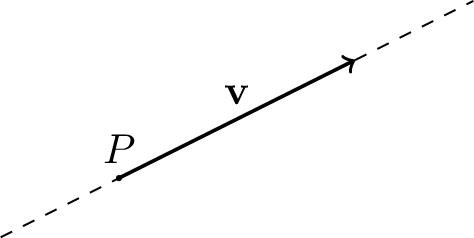
</figure>

Il vettore $\boldsymbol{\mathbf{v}}$ (o $\vec{v}$), applicato sul punto $P$, in figura viene definito del modulo ($|\boldsymbol{\mathbf{v}}| = v$) rappresentato dalla lunghezza del segmento, dalla direzione rappresentata dalla retta su cui poggia, e dal verso rappresentato dalla freccia alla fine del segmento. Si usa la notazione $\boldsymbol{\mathbf{v}}\in\boldsymbol{\mathbf{V}}{\left(P\right)}$ per indicare che il dato vettore appartiene alla classe di vettori applicati su $P$. Poiché il punto di applicazione di un vettore non cambia il comportamento delle operazioni tra vettori per convenzione si considera, se non viene specificato, il punto di applicazione coincidente con l’origine di uno spazio vettoriale di dimensione $n$: $\boldsymbol{\mathbf{V}}^{n}\left(O\right)$.

## Somma tra Vettori

Dati due vettori appartenenti allo stesso spazio vettoriale: $\boldsymbol{\mathbf{v}}, \boldsymbol{\mathbf{w}} \in \boldsymbol{\mathbf{V}}^{n}\left(O\right)$, viene definita l’operazione binaria interna somma ($+$) secondo le seguenti proprietà: $$\begin{aligned}
    \boldsymbol{\mathbf{v}} + \boldsymbol{\mathbf{w}} &\in \boldsymbol{\mathbf{V}}^{n}\left(O\right)\\
    \boldsymbol{\mathbf{v}} + \boldsymbol{\mathbf{w}} &= \boldsymbol{\mathbf{w}} + \boldsymbol{\mathbf{v}}\\
    \boldsymbol{\mathbf{v}} + \left(\boldsymbol{\mathbf{w}} + \boldsymbol{\mathbf{u}}\right) &= \left(\boldsymbol{\mathbf{v}} + \boldsymbol{\mathbf{w}}\right) + \boldsymbol{\mathbf{u}}\\
    \boldsymbol{\mathbf{v}} + \boldsymbol{\mathbf{0}} &= \boldsymbol{\mathbf{v}}\\ 
    \boldsymbol{\mathbf{v}} + (-\boldsymbol{\mathbf{v}}) &= \boldsymbol{\mathbf{0}}
\end{aligned}$$ Graficamente la somma può essere rappresentata mediante il metodo punta-coda o metodo del parallelogramma, è possibile dimostrare graficamente che $-\left(\boldsymbol{\mathbf{v}} + \boldsymbol{\mathbf{w}}\right) = -\boldsymbol{\mathbf{v}} -\boldsymbol{\mathbf{w}}$ e $\boldsymbol{\mathbf{v}} - \boldsymbol{\mathbf{w}} = \boldsymbol{\mathbf{v}} + \left(-\boldsymbol{\mathbf{w}}\right)$:

<figure>
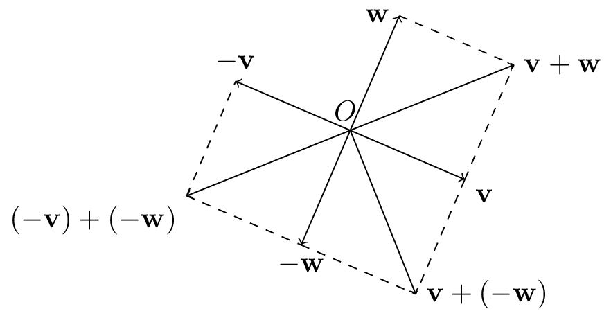
</figure>

## Prodotto tra un Vettore ed un Scalare

Dato un vettore $\boldsymbol{\mathbf{v}}\in\boldsymbol{\mathbf{V}}^{n}{\left(O\right)}$, ed uno scalare $k\in\mathbb{R}$, viene definita l’operazione binaria esterna prodotto per uno scalare ($\cdot$) secondo le seguenti proprietà: $$\begin{aligned}
    k\boldsymbol{\mathbf{v}} &\in\boldsymbol{\mathbf{V}}^{n}{\left(O\right)}\\
    k\left(\boldsymbol{\mathbf{v}} +\boldsymbol{\mathbf{w}}\right)&= k\boldsymbol{\mathbf{v}} + k\boldsymbol{\mathbf{w}}\\
    \left(k + h\right)\boldsymbol{\mathbf{v}} &= k\boldsymbol{\mathbf{v}} + h\boldsymbol{\mathbf{v}}\\
    k\left(h\boldsymbol{\mathbf{v}}\right) &= \left(kh\right)\boldsymbol{\mathbf{v}}\\
    k\boldsymbol{\mathbf{v}} = \boldsymbol{\mathbf{0}} \iff k &= 0 \lor \boldsymbol{\mathbf{v}} = \boldsymbol{\mathbf{0}}
\end{aligned}$$

## Versore di un Vettore

Dato un vettore $\boldsymbol{\mathbf{v}}\in\boldsymbol{\mathbf{V}}^{n}{\left(O\right)}$, il suo versore viene definito come un vettore di modulo unitario, avente la sua stessa direzione e verso: $$\hat{\boldsymbol{\mathbf{v}}} := \frac{\displaystyle\boldsymbol{\mathbf{v}}}{\displaystyle|\boldsymbol{\mathbf{v}}|}$$ Un vettore può quindi essere rappresentato come $\boldsymbol{\mathbf{v}} = v\cdot\hat{\boldsymbol{\mathbf{v}}}$.  
Considerando gli assi di un sistema di riferimento cartesiano, possono essere definiti i versori paralleli e aventi stessa direzione di quegli assi come: $\hat{\boldsymbol{\mathbf{x}}}$ e $\hat{\boldsymbol{\mathbf{y}}}$.

## Prodotto Scalare tra due Vettori

Dati due vettori $\boldsymbol{\mathbf{v}}$, $\boldsymbol{\mathbf{w}}$, viene definito il prodotto scalare ($\cdot$) tra due vettori l’operazione $f(\boldsymbol{\mathbf{v}},\boldsymbol{\mathbf{w}})=\boldsymbol{\mathbf{v}}\cdot\boldsymbol{\mathbf{w}}:\boldsymbol{\mathbf{V}}^{n}(O)\to\mathbb{R}$: $$\boldsymbol{\mathbf{v}}\cdot\boldsymbol{\mathbf{w}} =  |\boldsymbol{\mathbf{v}}|\cdot|\boldsymbol{\mathbf{w}}| \cos\theta\in \mathbb{R}$$ Dove $\theta$ rappresenta l’angolo compreso tra i due vettori, è indifferente se si considera l’angolo interno ($\theta$) o esterno ($\gamma = 2\pi - \theta$) poiché si avrebbe: $$\begin{gathered}
    \cos\gamma = \cos(2\pi - \theta) = \cos(-\theta) = \cos\theta
\end{gathered}$$ Se viene considerato il primo dei due vettori parallelo ad un asse del sistema di riferimento usato, allora si può considerare il prodotto scalare tra i due come la proiezione del secondo sull’asse indicato moltiplicato per il modulo del primo vettore:

<figure>
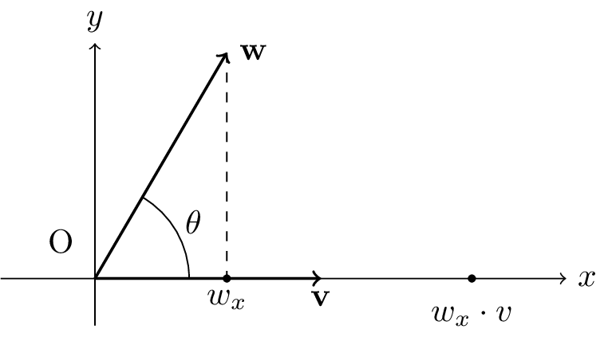
</figure>

Quindi la proiezione rispetto all’asse $x$ del vettore $\boldsymbol{\mathbf{w}}$ è data da: $w_x = \boldsymbol{\mathbf{w}}\cdot\hat{\boldsymbol{\mathbf{x}}}= 
\cos\theta|\boldsymbol{\mathbf{w}}|\cdot1$, in generale la proiezione ortogonale di un vettore rispetto ad un altro vettore è data dal prodotto scalare tra il primo vettore per il versore del secondo: $w_v = \boldsymbol{\mathbf{w}}\cdot\hat{\boldsymbol{\mathbf{v}}}$. Il prodotto scalare è massimo quando i due vettori sono paralleli ovvero quando $\cos\theta = 1$, ed è nullo quando i due vettori sono perpendicolari: $\cos0 = 0$. Perciò: $\hat{\boldsymbol{\mathbf{x}}}\cdot\hat{\boldsymbol{\mathbf{x}}} = 1$, mentre $\hat{\boldsymbol{\mathbf{x}}}\cdot\hat{\boldsymbol{\mathbf{y}}} = 0$. Per il prodotto scalare valgono le proprietà distributiva, associativa e transitiva.

## Componenti di un Vettore

Dato un vettore, vengono definiti componenti del vettore le sue proiezioni ortogonali rispetto agli assi del sistema di riferimento usato:

$$\begin{gathered}
    \boldsymbol{\mathbf{v}}\cdot\hat{\boldsymbol{\mathbf{x}}} = v\cos\theta = v_x\\
    \boldsymbol{\mathbf{v}}\cdot\hat{\boldsymbol{\mathbf{y}}} = v\cos\left(\displaystyle\frac{\pi}{2} - \theta\right) = v\sin\theta = v_y
\end{gathered}$$

È possibile rappresentare un vettore tramite i suoi componenti: $\boldsymbol{\mathbf{v}} = \boldsymbol{\mathbf{v}}_x + \boldsymbol{\mathbf{v}}_y = v_x\hat{\boldsymbol{\mathbf{x}}} + v_y\hat{\boldsymbol{\mathbf{y}}}$, dove $\boldsymbol{\mathbf{v}}_x$ e $\boldsymbol{\mathbf{v}}_y$ sono i vettori componenti di $\boldsymbol{\mathbf{v}}$.

<figure>
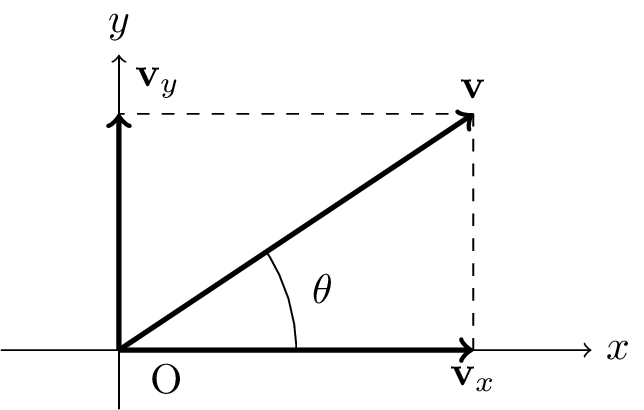
</figure>

A differenza del vettore le sue componenti dipendono dal sistema di riferimento usato per ottenerle.

## Coordinate Polari

In coordinate cartesiane il punto $P$ viene indicato con ($x_P, y_P$); in coordinate polari viene indicato con ($\rho_P, \theta_P$), dove $\rho$ rappresenta la distanza del punto dall’origine e $\theta$ rappresenta l’angolo che forma il segmento $OP$ con il semiasse uscente dall’origine e parallelo a l’asse $x$. Per cambiare sistema di coordinate del punto $P$ si considerano le seguenti espressioni:

$$\begin{gathered}
    x_P = \rho \cos\theta\\
    y_P = \rho \sin\theta\\
    \rho = \displaystyle\sqrt{x_P^{2} + y_P^{2}}\\
    \theta = \arctan\left(\displaystyle\frac{y_P}{x_P}\right)
\end{gathered}$$

<figure>
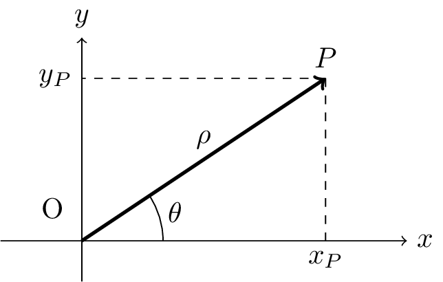
</figure>

Si può rappresentare un vettore in coordinate polari: $\boldsymbol{\mathbf{v}} = v_x\hat{\boldsymbol{\mathbf{x}}} + v_y\hat{\boldsymbol{\mathbf{y}}} = \rho \cos\theta\hat{\boldsymbol{\mathbf{x}}} + \rho \sin\theta\hat{\boldsymbol{\mathbf{y}}}$, dove $\rho$ è la distanza dall’origine e $\theta$ l’angolo che forma con il semiasse $x$. Considerando: $$\displaystyle\frac{v_y}{v_x} = \displaystyle\frac{\rho \sin\theta}{\rho \cos\theta} = \tan\theta$$ Si può ricavare il valore di $\theta$: $$\theta = \arctan\displaystyle\left(\frac{v_y}{v_x}\right)$$ Per ottenere la distanza dall’origine $\rho$ si considera: $$\begin{gathered}
    \boldsymbol{\mathbf{v}}\cdot\boldsymbol{\mathbf{v}} = v^{2}\\
    (v_x\hat{\boldsymbol{\mathbf{x}}} + v_y\hat{\boldsymbol{\mathbf{y}}})\cdot(v_x\hat{\boldsymbol{\mathbf{x}}} + v_y\hat{\boldsymbol{\mathbf{y}}})\\
    v_xv_x \cancelto{1}{\hat{\boldsymbol{\mathbf{x}}}\cdot\hat{\boldsymbol{\mathbf{x}}}} + v_xv_y\cancelto{0}{\hat{\boldsymbol{\mathbf{x}}}\cdot\hat{\boldsymbol{\mathbf{y}}}} + v_yv_x\cancelto{0}{\hat{\boldsymbol{\mathbf{y}}}\cdot\hat{\boldsymbol{\mathbf{x}}}} + v_yv_y\cancelto{1}{\hat{\boldsymbol{\mathbf{y}}}\cdot\hat{\boldsymbol{\mathbf{y}}}}\\
    v_x^{2} + v_y^{2} = \rho^{2}\cos^{2}\theta + \rho^2\sin^{2}\theta\\
    \rho^{2}(\cos^{2}\theta + \sin^{2}\theta) = \rho^{2}\\
    v^2=\rho^2\\
    v=\rho\tag{\stepcounter{equation}\theequation}
\end{gathered}$$

Si è dimostrato che il modulo del vettore $\boldsymbol{\mathbf{v}}$ è uguale alla distanza dall’origine $\rho$.

## Prodotto Vettoriale tra due Vettori

Dati due vettori $\boldsymbol{\mathbf{v}}$ e $\boldsymbol{\mathbf{w}}$, viene definito il vettore prodotto vettoriale l’operazione $f(\boldsymbol{\mathbf{v}},\boldsymbol{\mathbf{w}})=\boldsymbol{\mathbf{v}}\times\boldsymbol{\mathbf{w}}:\boldsymbol{\mathbf{V}}^n(O)\to \boldsymbol{\mathbf{V}}^n(O)$: $$\boldsymbol{\mathbf{v}}\times\boldsymbol{\mathbf{w}} := v\cdot w\sin\theta\:\hat{\boldsymbol{\mathbf{v}}}\times\hat{\boldsymbol{\mathbf{w}}}$$

La direzione del vettore $\hat{\boldsymbol{\mathbf{v}}}\times\hat{w}$ viene ottenuta mediante la regola della mano destra di conseguenza l’ordine dei vettori determina il verso del vettore prodotto vettoriale, e si ha: $\hat{\boldsymbol{\mathbf{v}}}\times\hat{\boldsymbol{\mathbf{w}}} = -\hat{\boldsymbol{\mathbf{w}}}\times\hat{\boldsymbol{\mathbf{v}}}$.

Poiché si considera il seno dell’angolo tra i due vettori, se essi sono paralleli il prodotto vettoriale risultante è nullo, mentre se essi sono perpendicolari il prodotto vettoriale risultante è massimo.

Il modulo del prodotto vettoriale tra due vettori risulta essere l’area del parallelogramma descritto dai vettori applicati su uno stesso punto, come se si stesse applicando il metodo del parallelogramma, per cui il prodotto vettoriale risulta essere l’area con segno descritta dai due vettori. Per il prodotto vettoriale vale la proprietà distributiva $\boldsymbol{\mathbf{v}}\times(\boldsymbol{\mathbf{w}} +\boldsymbol{\mathbf{u}}) = \boldsymbol{\mathbf{v}}\times\boldsymbol{\mathbf{w}} + \boldsymbol{\mathbf{v}}\times\boldsymbol{\mathbf{u}}$, ma essendo dipendente dall’ordine dei vettori, la proprietà associativa non è valida: $\boldsymbol{\mathbf{v}}\times(\boldsymbol{\mathbf{w}}\times\boldsymbol{\mathbf{u}}) \neq (\boldsymbol{\mathbf{v}}\times\boldsymbol{\mathbf{w}})\times\boldsymbol{\mathbf{u}}$: $$\begin{gathered}
    \boldsymbol{\mathbf{v}}\times(\boldsymbol{\mathbf{w}}\times\boldsymbol{\mathbf{u}})=(\boldsymbol{\mathbf{v}}_x+\boldsymbol{\mathbf{v}}_y)\times((\boldsymbol{\mathbf{w}}_x+\boldsymbol{\mathbf{w}}_y)\times(\boldsymbol{\mathbf{u}}_x+\boldsymbol{\mathbf{u}}_y))\\
    (v_x\hat{\boldsymbol{\mathbf{x}}}+v_y\hat{\boldsymbol{\mathbf{y}}})\times(w_xu_x\hat{\boldsymbol{\mathbf{x}}}\times\hat{\boldsymbol{\mathbf{x}}}+w_xu_y\hat{\boldsymbol{\mathbf{x}}}\times\hat{\boldsymbol{\mathbf{y}}}+w_yu_x\hat{\boldsymbol{\mathbf{y}}}\times\hat{\boldsymbol{\mathbf{x}}}+w_yu_y\hat{\boldsymbol{\mathbf{y}}}\times\hat{\boldsymbol{\mathbf{y}}})\\
    (v_x\hat{\boldsymbol{\mathbf{x}}}+v_y\hat{\boldsymbol{\mathbf{y}}})\times(w_xu_y\hat{\boldsymbol{\mathbf{z}}}+w_yu_x(-\hat{\boldsymbol{\mathbf{z}}}))\\
    v_xw_xu_y\hat{\boldsymbol{\mathbf{x}}}\times\hat{\boldsymbol{\mathbf{z}}}+v_xw_yu_x\hat{\boldsymbol{\mathbf{x}}}\times(-\hat{\boldsymbol{\mathbf{z}}})+v_yw_xu_y\hat{\boldsymbol{\mathbf{y}}}\times\hat{\boldsymbol{\mathbf{z}}}+y_yw_yu_x\hat{\boldsymbol{\mathbf{y}}}\times(-\hat{\boldsymbol{\mathbf{z}}})\\
    v_xw_xu_y(-\hat{\boldsymbol{\mathbf{y}}})+v_xw_yu_x\hat{\boldsymbol{\mathbf{y}}}+v_yw_xu_y\hat{\boldsymbol{\mathbf{x}}}+v_yw_yu_x(-\hat{\boldsymbol{\mathbf{x}}})\\
    \boldsymbol{\mathbf{v}}\times(\boldsymbol{\mathbf{w}}\times\boldsymbol{\mathbf{u}})=(v_yw_xu_y-v_yw_yu_x)\hat{\boldsymbol{\mathbf{x}}}+(v_xw_yu_x-v_xw_xu_y)\hat{\boldsymbol{\mathbf{y}}}\tag{\stepcounter{equation}\theequation}\\
    (\boldsymbol{\mathbf{v}}+\boldsymbol{\mathbf{w}})\times\boldsymbol{\mathbf{u}}=((\boldsymbol{\mathbf{v}}_x+\boldsymbol{\mathbf{v}}_y)\times(\boldsymbol{\mathbf{w}}_x+\boldsymbol{\mathbf{w}}_y))\times(\boldsymbol{\mathbf{u}}_x+\boldsymbol{\mathbf{u}}_y)\\
    (v_xw_x\hat{\boldsymbol{\mathbf{x}}}\times\hat{\boldsymbol{\mathbf{x}}}+v_xw_y\hat{\boldsymbol{\mathbf{x}}}\times\hat{\boldsymbol{\mathbf{y}}}+v_yw_x\hat{\boldsymbol{\mathbf{y}}}\times\hat{\boldsymbol{\mathbf{x}}}+v_yw_y\hat{\boldsymbol{\mathbf{y}}}\times\hat{\boldsymbol{\mathbf{y}}})\times(u_x\hat{\boldsymbol{\mathbf{x}}}+u_y\hat{\boldsymbol{\mathbf{y}}})\\
    (v_xw_y\hat{\boldsymbol{\mathbf{z}}}+v_yw_x(-\hat{\boldsymbol{\mathbf{z}}}))\times(u_x\hat{\boldsymbol{\mathbf{x}}}+u_y\hat{\boldsymbol{\mathbf{y}}})\\
    v_xw_yu_x\hat{\boldsymbol{\mathbf{z}}}\times\hat{\boldsymbol{\mathbf{x}}}+v_xw_yu_y\hat{\boldsymbol{\mathbf{z}}}\times\hat{\boldsymbol{\mathbf{y}}}+v_yw_xu_x(-\hat{\boldsymbol{\mathbf{z}}})\times\hat{\boldsymbol{\mathbf{x}}}+v_yw_xu_y(-\hat{\boldsymbol{\mathbf{z}}})\times\hat{\boldsymbol{\mathbf{y}}}\\
    v_xw_yu_x\hat{\boldsymbol{\mathbf{y}}}+v_xw_yu_y(-\hat{\boldsymbol{\mathbf{x}}})+v_yw_xu_x(-\hat{\boldsymbol{\mathbf{y}}})+v_yw_xu_y\hat{\boldsymbol{\mathbf{x}}}\\
    (\boldsymbol{\mathbf{v}}+\boldsymbol{\mathbf{w}})\times\boldsymbol{\mathbf{u}}=(v_yw_xu_y-v_xw_yu_y)\hat{\boldsymbol{\mathbf{x}}}+(v_xw_yu_x-v_yw_xu_x)\hat{\boldsymbol{\mathbf{y}}}\tag{\stepcounter{equation}\theequation}\\
    (v_yw_xu_y-v_yw_yu_x)\hat{\boldsymbol{\mathbf{x}}}+(v_xw_yu_x-v_xw_xu_y)\hat{\boldsymbol{\mathbf{y}}}\neq(v_yw_xu_y-v_xw_yu_y)\hat{\boldsymbol{\mathbf{x}}}+(v_xw_yu_x-v_yw_xu_x)\hat{\boldsymbol{\mathbf{y}}}\\
    \boldsymbol{\mathbf{v}}\times(\boldsymbol{\mathbf{w}}\times\boldsymbol{\mathbf{u}})\neq(\boldsymbol{\mathbf{v}}+\boldsymbol{\mathbf{w}})\times\boldsymbol{\mathbf{u}}\tag{\stepcounter{equation}\theequation}
\end{gathered}$$

<figure>
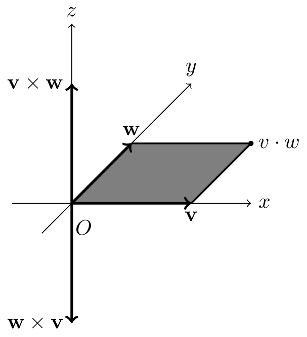
</figure>

## Coordinate Sferiche

Considerando un sistema di riferimento tridimensionale $x, y, z$, si può rappresentare un vettore usando le sue componenti: $\boldsymbol{\mathbf{v}} = v_x\hat{\boldsymbol{\mathbf{x}}} + v_y\hat{\boldsymbol{\mathbf{y}}} + v_z\hat{\boldsymbol{\mathbf{z}}}$, oppure si può rappresentare mediante coordinate sferiche. Si considera la proiezione del vettore rispetto al piano formato da due assi, e scompone quel vettore con coordinate polari, in seguito si considera l’angolo formato dal vettore con il terzo asse perpendicolare al piano $\boldsymbol{\mathbf{v}}$($\rho, \theta, \varphi$): $$\begin{gathered}
    v_x = \rho \cos\varphi\\
    v_y = \rho \sin\varphi\\
    \rho = v_{xy}  = v\sin\theta\\
    v_z = v\cos\theta\\
    \boldsymbol{\mathbf{v}} = v\sin\theta \cos\varphi\:\hat{\boldsymbol{\mathbf{x}}} + v\sin\theta \sin\varphi\:\hat{\boldsymbol{\mathbf{y}}} + v\cos\theta\:\hat{\boldsymbol{\mathbf{z}}}\tag{\stepcounter{equation}\theequation}
\end{gathered}$$

<figure>
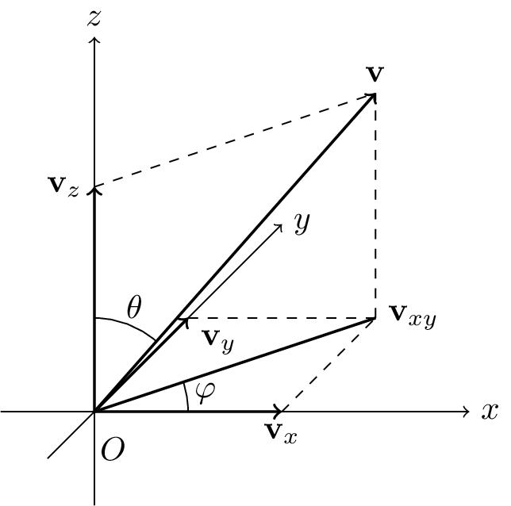
</figure>

# Cinematica del Punto Materiale

La cinematica è la parte della meccanica che analizza l’andamento del moto di un corpo nel tempo.

## Traiettoria

In cinematica una traiettoria $\Gamma$ è l’insieme di tutti i punti $Q$ dove il punto materiale analizzato si può trovare in un intervallo di tempo $\Delta t$:

$$\Gamma := \left\{Q\:\mbox{t.c}\: Q = P(t)\right\}$$

Un punto materiale rappresenta il centro di massa di un corpo, approssimando il suo andamento come se tutta la massa fosse accumulata in unico punto. La traiettoria di un punto materiale è indipendente dal sistema di rifermento usato per analizzarla. Convenzionalmente si usano sistemi di riferimento aventi assi ortogonali e destrorsi, in modo tale che valgono le seguenti relazioni: $$\hat{\boldsymbol{\mathbf{i}}}\times\hat{\boldsymbol{\mathbf{j}}} = \hat{\boldsymbol{\mathbf{k}}},\:\hat{\boldsymbol{\mathbf{j}}}\times\hat{\boldsymbol{\mathbf{k}}} = \hat{\boldsymbol{\mathbf{i}}},\: \hat{\boldsymbol{\mathbf{k}}}\times\hat{\boldsymbol{\mathbf{i}}} = \hat{\boldsymbol{\mathbf{j}}}$$ Per un sistema di riferimento avente tre assi ($i, j, k$).  
Considerando una traiettoria $\Gamma$ in un sistema di riferimento ($i,j,k$), si può definire un vettore posizione $\boldsymbol{\mathbf{r}}(t)$, che rappresenta in funzione del tempo la posizione del punto materiale che segue quella data traiettoria $\Gamma$.

<figure>
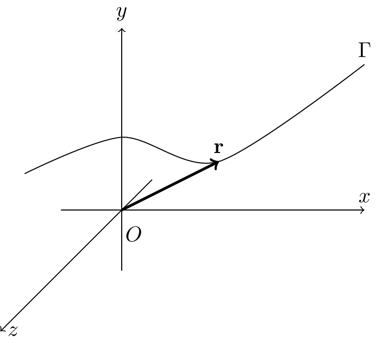
</figure>

Aggiungendo un altro asse ortogonale si può analizzare la posizione del punto nel tempo, definito moto. La posizione in funzione del tempo viene definita legge oraria del punto e descrive come il punto si muove nello spazio rispetto al tempo. Si può analizzare la legge oraria nei suoi componenti: $$\boldsymbol{\mathbf{r}}(t) = r_x(t)\hat{\boldsymbol{\mathbf{x}}} + r_y(t)\hat{\boldsymbol{\mathbf{y}}} + r_z(t)\hat{\boldsymbol{\mathbf{z}}}$$ In questo modo si ottiene la legge oraria del punto nelle tre direzioni dello spazio, ognuna descrive il comportamento del punto in una singola direzione:

<figure>

</figure>

## Moto nello Spazio

Dati due istanti di tempo, è possibile approssimare la quantità di spazio percorsa dal punto tramite: $\Delta\boldsymbol{\mathbf{r}}(t) = \boldsymbol{\mathbf{r}}(t_1) - \boldsymbol{\mathbf{r}}(t_0)$, questa differenza approssima lo spostamento $\boldsymbol{\mathbf{s}}$, definito come la distanza tra due punti di una traiettoria, poiché rappresenta una distanza, è indipendente dal sistema di riferimento utilizzato. Quando la posizione iniziale è nulla, allora si ha $\boldsymbol{\mathbf{s}}(t)=\Delta\boldsymbol{\mathbf{r}}(t)=\boldsymbol{\mathbf{r}}(t)-\boldsymbol{\mathbf{0}}=\boldsymbol{\mathbf{r}}(t)$.

<figure>
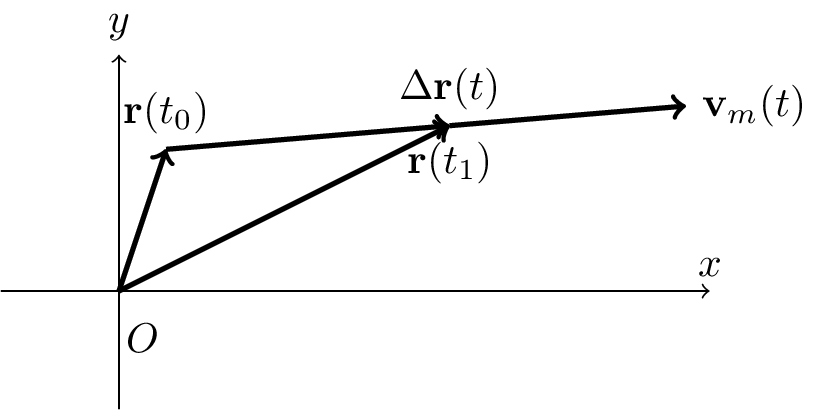
</figure>

Viene definita velocità media di un punto $\boldsymbol{\mathbf{v}}_m(t)$, la grandezza che quantifica la rapidità con cui un punto compie uno spostamento $\Delta \boldsymbol{\mathbf{r}}$ in un intervallo di tempo $\Delta t$:

$$\boldsymbol{\mathbf{v}}_m(t) = \displaystyle\frac{\Delta\boldsymbol{\mathbf{r}}(t)}{\Delta t}\left[\mathrm{m}\cdot\mathrm{s}^{-1}\right]$$

Contiene informazioni sullo spostamento ed il tempo impiegato per compierlo, ma non sulla traiettoria. Per ottenere informazioni sulla traiettoria si definisce la velocità istantanea:

$$\boldsymbol{\mathbf{v}}_i(t) = \lim_{\Delta t \to 0} \displaystyle\frac{\Delta\boldsymbol{\mathbf{r}}(t)}{\Delta t} = \displaystyle\frac{\mathrm{d}\boldsymbol{\mathbf{r}}(t)}{\mathrm{d}t}$$

Per cui è possibile ottenere uno spostamento data la velocità istantanea $\boldsymbol{\mathbf{v}}(t)$, derivata dello spostamento:

$$\Delta\boldsymbol{\mathbf{r}}(t)=\displaystyle\int_{t_0}^{t}\boldsymbol{\mathbf{v}}(\tau)\mathrm{d}\tau$$

Per cui si può esprimere la velocità media rispetto alla velocità istantanea considerando lo spostamento come l’integrale della velocità istantanea oppure considerando il teorema della media, se la velocità istantanea in funzione del tempo è continua: $$\boldsymbol{\mathbf{v}}_m(t)=\displaystyle\frac{1}{t-t_0}\int_{t_0}^{t}\boldsymbol{\mathbf{v}}(\tau)\mathrm{d}\tau$$

Per ottenere la direzione ed il verso della velocità istantanea $\boldsymbol{\mathbf{v}}_x(t)$, si analizza il cambiamento del vettore velocità media al diminuire dell’intervallo di tempo $\Delta t$. Al diminuire di $\Delta\boldsymbol{\mathbf{r}}_x(t)$, l’angolo $\alpha$ tra la tangente alla traiettoria e lo spostamento diminuisce, quindi per $\Delta t \to 0$, $\alpha \to 0$ lo spostamento infinitesimo $\mathrm{d}\boldsymbol{\mathbf{r}}_x(t)$ diventa un vettore parallelo alla traiettoria $\Gamma_x$ nell’istante di tempo $t_0$. La velocità istantanea $\boldsymbol{\mathbf{v}}_x(t)$ di conseguenza, avendo stessa direzione e verso di $\mathrm{d}\boldsymbol{\mathbf{r}}_x(t)$ è anch’essa tangente alla traiettoria lungo $\Gamma_x$ nel punto $r_x(t_0)$.

Per ogni componente di $\boldsymbol{\mathbf{r}}(t)$ si può effettuare lo stesso ragionamento, quindi è possibile definire una velocita istantanea: $$\boldsymbol{\mathbf{v}}(t) =\dot{r}_x(t)\hat{\boldsymbol{\mathbf{x}}} +\dot{r}_y(t)\hat{\boldsymbol{\mathbf{y}}} +\dot{r}_z(t)\hat{\boldsymbol{\mathbf{z}}} = v_x(t)\hat{\boldsymbol{\mathbf{x}}} + v_y(t)\hat{\boldsymbol{\mathbf{y}}} + v_z(t)\hat{\boldsymbol{\mathbf{z}}}$$ Dove ${v}_i(t)$ sono le pendenze dei grafici della legge oraria nella coordinata $i$, all’istante di tempo $t$. Poiché rappresentano delle pendenze contengono informazioni sul modulo e sul verso del vettore velocità.

Si definisce accelerazione istantanea la derivata della velocità istantanea rispetto al tempo:

$$\boldsymbol{\mathbf{a}}_i(t) = \lim_{\Delta t \to 0}\displaystyle\frac{\Delta\boldsymbol{\mathbf{v}}(t)}{\Delta t} = \frac{\mathrm{d}\boldsymbol{\mathbf{v}}_i(t)}{\mathrm{d}t} = \frac{\mathrm{d}^{2}\boldsymbol{\mathbf{r}}(t)}{\mathrm{d}t^{2}}\left[\mathrm{m}\cdot\mathrm{s}^{-2}\right]$$

Avente direzione perpendicolare alla tangente alla traiettoria nell’istante di tempo $t$, e verso, individuato dal segno di $a$, dipendente dalla convessità o concavità della traiettoria nell’intorno dell’istante di tempo $t$, a differenza del segno della velocità $v$, che indica il verso del moto del punto.

L’accelerazione del punto lungo la traiettoria $\Gamma$ in tre dimensioni viene espressa come: $$\boldsymbol{\mathbf{a}}(t) = \ddot{r}_x(t)\hat{\boldsymbol{\mathbf{x}}} +\ddot{r}_y(t)\hat{\boldsymbol{\mathbf{y}}} +\ddot{r}_z(t)\hat{\boldsymbol{\mathbf{z}}} = \dot{v}_x(t)\hat{\boldsymbol{\mathbf{x}}} + \dot{v}_y(t)\hat{\boldsymbol{\mathbf{y}}} + \dot{v}_z(t)\hat{\boldsymbol{\mathbf{z}}} = a_x(t)\hat{\boldsymbol{\mathbf{x}}} +a_y(t)\hat{\boldsymbol{\mathbf{y}}} + a_z(t)\hat{\boldsymbol{\mathbf{z}}}$$

<figure>
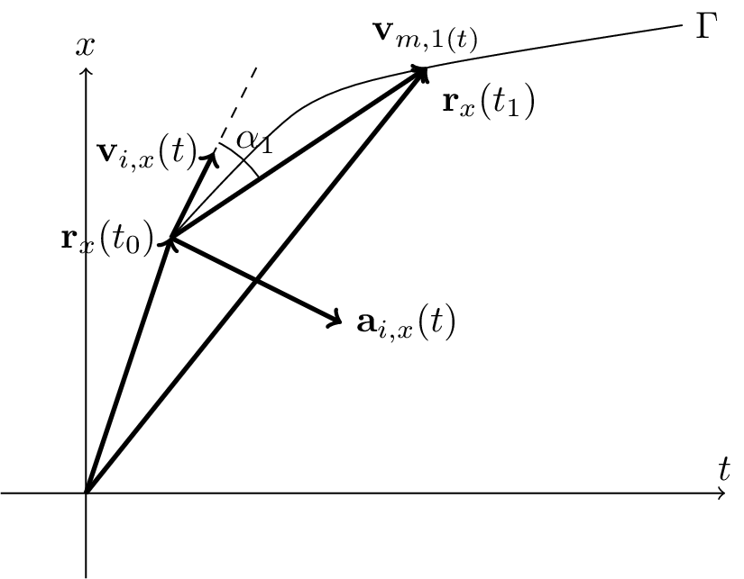
</figure>

Data un’accelerazione costante, la sua legge oraria sarà data da: $\boldsymbol{\mathbf{a}}(t) = \boldsymbol{\mathbf{a}}_0$. Date le leggi orarie della velocità e dell’accelerazione, e le loro condizioni iniziali, è possibile ottenere la legge oraria della posizione integrando su un intervallo $[t_0,t]$ le leggi orarie note.

### Moto Rettilineo Uniforme

Un punto che si muove con un accelerazione nulla $\boldsymbol{\mathbf{a}}=\boldsymbol{\mathbf{0}}$ avrà una velocità costante $\boldsymbol{\mathbf{v}}(t)=\boldsymbol{\mathbf{v}}_0$ e compierà un moto definito rettilineo uniforme. Se è data la posizione nell’istante di tempo $t_0$ $\boldsymbol{\mathbf{r}}(t_0)=\boldsymbol{\mathbf{r}}_0$, è possibile ottenere la legge oraria della posizione: $$\begin{gathered}
    \displaystyle\frac{\mathrm{d}\boldsymbol{\mathbf{r}}(t)}{\mathrm{d}t}=\boldsymbol{\mathbf{v}}(t)=\boldsymbol{\mathbf{v}}(t_0)=\boldsymbol{\mathbf{v}}_0\\
    \displaystyle\int_{t_0}^{t}\mathrm{d}\boldsymbol{\mathbf{r}}(\tau)=\int_{t_0}^{t}\boldsymbol{\mathbf{v}}_0\mathrm{d}\tau\\
    \boldsymbol{\mathbf{r}}(t)-\boldsymbol{\mathbf{r}}(t_0)=\boldsymbol{\mathbf{v}}_0(t-t_0)\\
    \boldsymbol{\mathbf{r}}(t)=\boldsymbol{\mathbf{r}}(t_0)+\boldsymbol{\mathbf{v}}_0(t-t_0)\tag{\stepcounter{equation}\theequation}
\end{gathered}$$ Questa legge oraria descrive un moto rettilineo uniforme, dove lo spostamento cresce linearmente rispetto al tempo.

<figure>
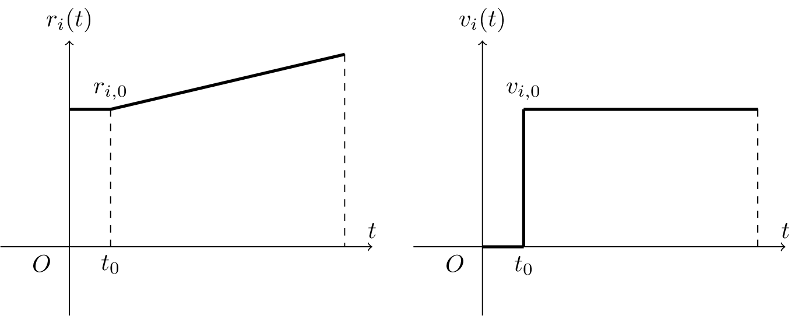
</figure>

### Moto Uniformemente Accellerato

Un punto che si muove con un’accelerazione costante $\boldsymbol{\mathbf{a}}(t)=\boldsymbol{\mathbf{a}}_0$ si muove di moto uniformemente accelerato. Data l’accelerazione $\boldsymbol{\mathbf{a}}_0$ e se è data la posizione e la velocità nell’istante di tempo $t_0$: $\boldsymbol{\mathbf{v}}(t_0)=\boldsymbol{\mathbf{v}}_0{,}\:\boldsymbol{\mathbf{r}}(t_0)=\boldsymbol{\mathbf{r}}_0$, allora è possibile ottenere la legge oraria dello spostamento:

$$\begin{gathered}
    \displaystyle\frac{\mathrm{d}\boldsymbol{\mathbf{v}}(t)}{\mathrm{d}t}=\boldsymbol{\mathbf{a}}_0\\
    \displaystyle\int_{t_0}^t\mathrm{d}\boldsymbol{\mathbf{v}}(\tau)=\int_{t_0}^ta_0\mathrm{d}\tau\\
    \boldsymbol{\mathbf{v}}(t)=\boldsymbol{\mathbf{v}}(t_0)+\boldsymbol{\mathbf{a}}_0(t-t_0)\\
    \displaystyle\frac{\mathrm{d}\boldsymbol{\mathbf{r}}(t)}{\mathrm{d}t}=\boldsymbol{\mathbf{v}}(t)=\boldsymbol{\mathbf{v}}(t_0)+\boldsymbol{\mathbf{a}}_0(t-t_0)\\
    \displaystyle\int_{t_0}^t\mathrm{d}\boldsymbol{\mathbf{r}}(\tau)=\int_{t_0}^{t}\boldsymbol{\mathbf{v}}_0+\boldsymbol{\mathbf{a}}_0(t-t_0)\mathrm{d}\tau\\
    \boldsymbol{\mathbf{r}}(t)-\boldsymbol{\mathbf{r}}_0=\boldsymbol{\mathbf{v}}_0(t-t_0)+\displaystyle\frac{1}{2}\boldsymbol{\mathbf{a}}_0(t-t_0)^2\\
    \boldsymbol{\mathbf{r}}(t)=\boldsymbol{\mathbf{r}}_0+\boldsymbol{\mathbf{v}}_0(t-t_0)+\displaystyle\frac{1}{2}\boldsymbol{\mathbf{a}}_0(t-t_0)^2\tag{\stepcounter{equation}\theequation}
\end{gathered}$$

Questa legge oraria descrive un moto uniformemente accelerato, dove la posizione aumenta quadraticamente rispetto al tempo.

<figure>
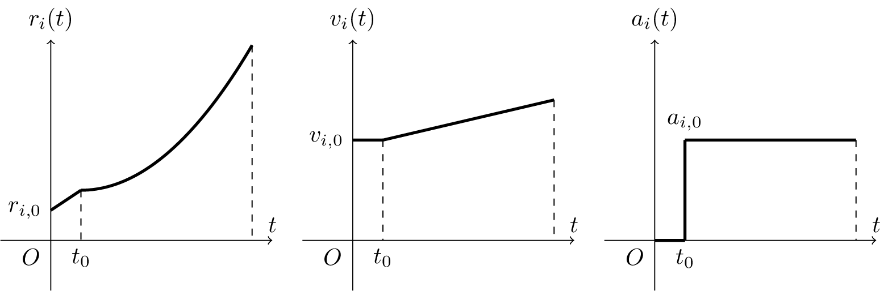
</figure>

### Moto di Caduta

Il moto di caduta di un punto materiale da un’altezza iniziale $y_0$ con un’accelerazione $\boldsymbol{\mathbf{a}}(t) = \boldsymbol{\mathbf{g}}$, è un moto uniformemente accelerato. Si esplicita il verso dell’accelerazione considerando $\boldsymbol{\mathbf{a}}(t)=-g\hat{\boldsymbol{\mathbf{y}}}$. Con una velocità nulla, avrà legge oraria: $\boldsymbol{\mathbf{y}}(t)= y_0\hat{\boldsymbol{\mathbf{y}}} -\displaystyle\frac{1}{2}gt^{2}\hat{\boldsymbol{\mathbf{y}}}$.  
Se il punto viene lanciato, o verso l’alto o verso il basso con una velocità di modulo $v_0$ la legge oraria sarà: $\boldsymbol{\mathbf{y}}(t) = y_0\hat{\boldsymbol{\mathbf{y}}} \pm v_0t\hat{\boldsymbol{\mathbf{y}}}-\displaystyle\frac{1}{2}gt^{2}\hat{\boldsymbol{\mathbf{y}}}$.

<figure>
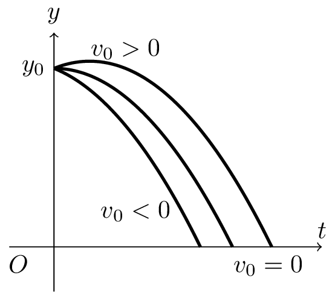
</figure>

Per trovare il punto più alto della traiettoria lungo le $y$, assumendo che il punto sia stato lanciato verso l’alto, bisogna trovare il punto dove la velocità si annulla. La velocità, di modulo positivo, diminuisce linearmente rispetto al tempo $v(t)=v_0-gt$, per cui il punto continua a salire fino a quando la velocità è positiva, nel punto in cui la velocità si annulla il punto smette di salire, e comincia subito dopo a cadere verso il basso.

$$\begin{gathered}
    \boldsymbol{\mathbf{v}}(t) = \boldsymbol{\mathbf{v}}_0  + \boldsymbol{\mathbf{g}}(t-t_0),\:\exists t_{\max} \:\mbox{t.c}\:\boldsymbol{\mathbf{v}}_y(t_{\max}) = \boldsymbol{\mathbf{0}}\\
    \boldsymbol{\mathbf{0}}= v_0\hat{\boldsymbol{\mathbf{y}}} - g(t_{\max}-t_0)\hat{\boldsymbol{\mathbf{y}}}\\
    t_{\max} = \displaystyle\frac{v_0}{g} + t_0,\,t_0=0\\
    y_{\max} = y(t_{\max}) = y_0 + v_0\left(\displaystyle\frac{v_0}{g}\right) -\displaystyle\frac{1}{2}g\left(\displaystyle\frac{v_0}{g}\right)^{2}\\
    y_{\max}=y_0 + \displaystyle\frac{v_0^{2}}{2g}\tag{\stepcounter{equation}\theequation}
\end{gathered}$$

Per trovare il punto dove tocca terra bisogna risolvere la legge oraria rispetto al tempo:

$$\begin{gathered}
    \exists t_\mathrm{terra}\:\mbox{t.c}\: y(t_\mathrm{terra}) = 0\\
    y_0 + v_0(t_\mathrm{terra} - t_0)-\displaystyle\frac{1}{2}g
    (t_\mathrm{terra} - t_0)^{2} = 0\\
    -\displaystyle\frac{1}{2}gt_\mathrm{terra}^{2} + gt_\mathrm{terra}t_0
    -\displaystyle\frac{1}{2}gt_0^{2}+v_0t_\mathrm{terra} - v_0t_0 +y_0 =0\\
    -\displaystyle\frac{1}{2}gt_\mathrm{terra}^{2}+t_\mathrm{terra}
    (gt_0+v_0) + \left(y_0-v_0t_0 
    -\displaystyle\frac{1}{2}gt_0^{2}\right)=0\\
    t_\mathrm{terra} = \displaystyle\frac{gt_0+v_0 \mp\sqrt{(gt_0-v_0)^{2}+2g\left(y_0-v_0t_0-\displaystyle\frac{1}{2}gt_0^{2}\right)}}{g}
\end{gathered}$$

Poiché il punto non può toccare terra in un istante di tempo negativo si considera:

$$t_\mathrm{terra} = \displaystyle\frac{gt_0+v_0 +\sqrt{(gt_0-v_0)^{2}+2g\left(y_0-v_0t_0-\displaystyle\frac{1}{2}gt_0^{2}\right)}}{g}$$

### Moto Armonico o Oscillatorio

Un moto armonico è un tipo di moto in cui il sistema torna alle stesse condizioni dopo un periodo. Il periodo è la quantita di tempo necessaria al sistema per compiere un’oscillazione completa. $T = \Delta t$: $\boldsymbol{\mathbf{f}}(t) = \boldsymbol{\mathbf{f}}(t + T)$.  
Alcuni moti oscillatori comuni sono il moto di una molla e il moto di un pendolo.

Nel moto armonico due stati sono uguali se la posizione, il vettore velocità e accelerazione sono uguali.

Un moto armonico è definito da varie grandezze fisiche:

- Ampiezza ($A$): massima distanza dallo stato iniziale in un oscillazione, misurata in metri \[m\];

- Frequenza ($\nu$): numero di oscillazioni effettuate in un secondo, calcolata in Hertz $[\mathrm{Hz}]=[\mathrm{s}^{-1}]$, è l’inverso del periodo: $\nu =T^{-1}$;

- Pulsazione ($\omega$): velocità in cui viene effettuata un’oscillazione completa ($2\pi$), $\omega = 2\pi\cdot T^{-1} = 2\pi\nu$, misurata in radianti al secondo $\left[\mathrm{rad}\cdot\mathrm{s}^{-1}\right]$.

- Fase Iniziale ($\varphi$): indica il punto dell’oscillazione da dove comincia il moto, misurata in radianti \[rad\].

La legge oraria generale di un moto armonico è definita da una funzione sinusoidale o cosinusoidale: $x(t) = A(t)\cos(\varphi+\omega t)$ oppure $x(t) = A(t)\sin(\varphi+\omega t)$.  
In un moto armonico semplice l’ampiezza massima non diminuisce o aumenta nel tempo quindi la sua legge oraria sarà: $$x(t) = A\cos(\varphi + \omega t) =A\cos(\varphi + 2\pi\nu t) = A\cos\left(\varphi + \displaystyle\frac{2\pi}{T}t\right)$$ All’istante $t_0 = 0$, $x(t_0) = A\cos(\varphi + \omega t_0) = 
A\cos(\varphi)$, se la fase iniziale è nulla, all’istante di tempo iniziale il punto si trovo nella posizione di ampiezza massima: $x(0) = A\cos(0) = A$.

Una funzione sinusoidale rappresenta lo stesso moto di una funzione cosinusoidale, solamente quadrato di fase, ovvero sfasato di $\pi/2$, per cui è possibile usare il seno ed il coseno per analizzare lo stesso moto armonico. Per convenzione si usa il seno per la legge oraria della posizione di un moto armonico: $x(t) = A\sin(\varphi + \omega t)$. Nell’istante di tempo $t_0 = 0$, se la fase è nulla: $x(0) = 0$.

La velocità e l’accelerazione del moto armonico si ottengono derivando la legge oraria dell’accelerazione: $$\begin{gathered}
    v(t) = \dot x(t) = \omega A\cos(\varphi+\omega t)\\
    a(t)= \ddot x(t) = -\omega^{2}A\sin(\varphi+\omega t) = -\omega^{2}x(t)
\end{gathered}$$

La velocità risulta quadrata di fase poiché è sfasata di $\displaystyle\frac{\pi}{2}\,rad$ rispetto alla posizione, mentre la legge oraria dell’accelerazione risulta essere in opposizione di fase rispetto alla posizione poiché è sfasata di $\pi\,rad$.

Se la legge oraria di un punto materiale rispetta l’equazione $\ddot x(t)+\omega x(t)=0$, allora quel punto si muove di moto armonico semplice. Quest’equazione rappresenta la condizione necessaria per un moto armonico semplice.

Poiché la legge oraria dell’accelerazione è: $\ddot x(t) = -\omega x(t)$, si può esprimere rispetto alla sola legge oraria della posizione:

$$\begin{aligned}
    \ddot x(t) =& -\omega x(t) \\
    \mathrm{d}^{2}x(t) =& -\omega x(t)\mathrm{d}t^{2} \\
    \displaystyle\iint \mathrm{d}^{2}x(t)=& -\omega\iint x(t)\mathrm{d}t^{2}\\
    \displaystyle x(t) =& -\omega\iint x(t)\mathrm{d}t^{2}\tag{\stepcounter{equation}\theequation}
\end{aligned}$$

<figure>
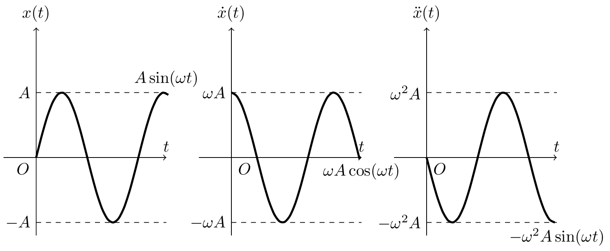
</figure>

### Moto Parabolico

Quando un punto si muove, da una posizione iniziale ($h, 0$) di moto rettilineo uniforme nella componente $x$, e si muove di moto uniformemente accelerato sulla componente $y$; allora si muove di moto parabolico:

<figure>
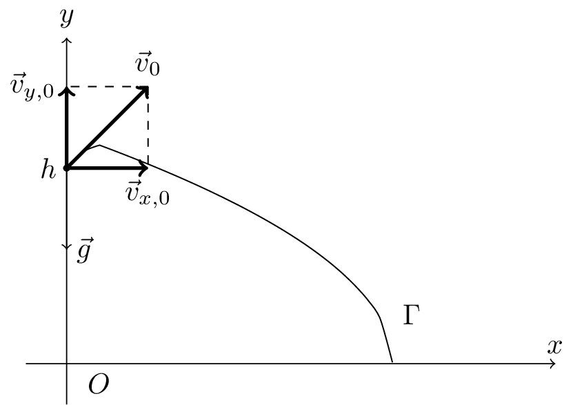
</figure>

Avrà una traiettoria $\Gamma := \left\{Q\:\mbox{t.c.}\:Q=\boldsymbol{\mathbf{r}}(t)\mbox{,}\:\forall t\in \left[0, t_\mathrm{terra}\right] \right\}$, definita dal vettore posizione $\boldsymbol{\mathbf{r}}(t)$. Il moto del punto sarà definito dal vettore posizione $\boldsymbol{\mathbf{r}}(t)$, dalla velocità $\boldsymbol{\mathbf{v}}(t)$ e dall’accelerazione $\boldsymbol{\mathbf{a}}(t)$. Si possono scomporre in componenti:

$$\begin{gathered}
    \begin{cases}
        \boldsymbol{\mathbf{a}}(t) = a_x\hat{\boldsymbol{\mathbf{x}}} +a_y\hat{\boldsymbol{\mathbf{y}}}\\
        \boldsymbol{\mathbf{v}}(t) = v_x(t)\hat{\boldsymbol{\mathbf{x}}} + v_y(t)\hat{\boldsymbol{\mathbf{y}}}\\
        \boldsymbol{\mathbf{r}}(t) = x(t)\hat{\boldsymbol{\mathbf{x}}} + y(t)\hat{\boldsymbol{\mathbf{y}}}
    \end{cases}\tag{\stepcounter{equation}\theequation}\\
    \begin{cases}
        \boldsymbol{\mathbf{a}}_x(t) = \boldsymbol{\mathbf{0}}\\
        \boldsymbol{\mathbf{v}}_x(t) =\displaystyle v_{x,0}\hat{\boldsymbol{\mathbf{x}}}+\int_{t_0}^{t}\boldsymbol{\mathbf{a}}_x(\tau)\mathrm{d}\tau=v_{x,0}\hat{\boldsymbol{\mathbf{x}}}+ \int_{t_0}^{t}\boldsymbol{\mathbf{0}}\mathrm{d}\tau=v_{x,0}\hat{\boldsymbol{\mathbf{x}}}\\
        \boldsymbol{\mathbf{x}}(t) = \displaystyle x_0\hat{\boldsymbol{\mathbf{x}}}+\int_{t_0}^{t}\boldsymbol{\mathbf{v}}_x(\tau)\mathrm{d}\tau = x_0\hat{\boldsymbol{\mathbf{x}}}+\int_{t_0}^{t}v_{x,0}\hat{\boldsymbol{\mathbf{x}}}\mathrm{d}\tau=x_0\hat{\boldsymbol{\mathbf{x}}}+v_{x,0}(t-t_0)\hat{\boldsymbol{\mathbf{x}}}
    \end{cases}\\
    \begin{cases}
        \boldsymbol{\mathbf{a}}_y(t)=-g\hat{\boldsymbol{\mathbf{y}}}\\
        \boldsymbol{\mathbf{v}}_y(t)=\displaystyle v_{y,0}\hat{\boldsymbol{\mathbf{y}}}+\int_{t_0}^{t}\boldsymbol{\mathbf{a}}_y(\tau)\mathrm{d}\tau=v_{y,0}\hat{\boldsymbol{\mathbf{y}}}+\int_{t_0}^{t}-g\hat{\boldsymbol{\mathbf{y}}}\mathrm{d}\tau=v_{y,0}\hat{\boldsymbol{\mathbf{y}}}-g(t-t_0)\hat{\boldsymbol{\mathbf{y}}}\\
        \boldsymbol{\mathbf{y}}(t)=y_0\hat{\boldsymbol{\mathbf{y}}} +\displaystyle\int_{t_0}^{t}\boldsymbol{\mathbf{v}}_y(\tau)\mathrm{d}\tau=y_0\hat{\boldsymbol{\mathbf{y}}}+\int_{t_0}^{t}v_{y,0}\hat{\boldsymbol{\mathbf{y}}}-g(\tau-t_0)\hat{\boldsymbol{\mathbf{y}}}\mathrm{d}\tau=
        y_0\hat{\boldsymbol{\mathbf{y}}}+v_{y,0}(t-t_0)\hat{\boldsymbol{\mathbf{y}}}-\frac{1}{2}g(t-t_0)^{2}\hat{\boldsymbol{\mathbf{y}}}
    \end{cases}
\end{gathered}$$

Per $x_0 = 0$, $y_0 = h$ e $t_0 = 0$, allora la traiettoria $\Gamma$ può essere definita come:

$$\Gamma:=
    \begin{cases}
        \boldsymbol{\mathbf{x}}(t)=v_{x,0}t\hat{\boldsymbol{\mathbf{x}}}\\
        \boldsymbol{\mathbf{y}}(t)=\displaystyle h\hat{\boldsymbol{\mathbf{y}}}+v_{y,0}t\hat{\boldsymbol{\mathbf{y}}}-\frac{1}{2}gt^{2}\hat{\boldsymbol{\mathbf{y}}}
    \end{cases}$$

Per ottenere una singola equazione per la traiettoria complessiva del punto si applica la seguente sostituzione: $$\begin{gathered}
    \Gamma:=
    \begin{cases}
        \displaystyle t = \frac{x}{v_{x,0}}\\
        {y}(t)\hat{\boldsymbol{\mathbf{y}}}=h\hat{\boldsymbol{\mathbf{y}}}+v_{y,0}t\hat{\boldsymbol{\mathbf{y}}}-\displaystyle\frac{1}{2}gt^{2}\hat{\boldsymbol{\mathbf{y}}}
    \end{cases}\\
    \displaystyle y(x)=h+v_{y,0}\frac{x}{v_{x,0}}-\frac{1}{2}g\left(\frac{x}{v_{x,0}}\right)^{2}\\
    \Gamma:y(x)\displaystyle=-\frac{g}{2v_{x,0}^{2}}x^{2}+\frac{v_{y,0}}{v_{x,0}}x+h\tag{\stepcounter{equation}\theequation}
\end{gathered}$$

La legge oraria del moto $y(x)$ corrisponde ad una parabola rivolta verso il basso. Per trovare la gittata, bisogna trovare il punto della traiettoria dove si annulla la componente $y$: $$\begin{gathered}
    x(t_g)=x_g \:\mbox{t.c.}\:y(t_g)=0\\
    \begin{cases}
        x(t_g)\hat{\boldsymbol{\mathbf{x}}}=x_g\hat{\boldsymbol{\mathbf{x}}}=v_{x,0}t_g\hat{\boldsymbol{\mathbf{x}}}\\
        y(t_g)\hat{\boldsymbol{\mathbf{y}}}=\boldsymbol{\mathbf{0}}=\left(h+v_{y,0}t_g-\displaystyle\frac{1}{2}gt_g^{2}\right)\hat{\boldsymbol{\mathbf{y}}}
    \end{cases}\\
    \begin{cases}
        x_g=v_{x,0}t_g\\
        t_g=\displaystyle\frac{y_{y,0}\mp\sqrt{v_{y,0}^{2}+2gh}}{g}{,}\:t_g>0  
    \end{cases}\\
    \begin{cases}
        x_g=\displaystyle\frac{v_{x,0}v_{y,0}\left(1+\sqrt{1+\displaystyle\frac{2gh}{v_{y,0}^2}}\right)}{\strut g}\\
        t_g=\displaystyle\frac{v_{y,0}+\sqrt{v_{y,0}^{2}+2gh}}{g}    
    \end{cases}
\end{gathered}$$

Per trovare la gittata massima in funzione di una velocità iniziale $\boldsymbol{\mathbf{v}}_0 = v_0(\cos\theta\hat{\boldsymbol{\mathbf{x}}}+\sin\theta\hat{\boldsymbol{\mathbf{y}}})$, si considera la gittata $x_g$ come una funzione: $$x_g(v_0,\theta)=\displaystyle\frac{v_0^{2}\sin\theta \cos\theta\left(1+\sqrt{1+\displaystyle\frac{2gh}{v_0^2\sin^2\theta}}\right)}{g}$$

Si considera il caso dove il moto parabolico inizia nell’origine degli assi, allora $h=0$, quindi si ha la funzione della gittata: $$x_g(v_0,\theta)=\displaystyle\frac{2v_0^2}{g}\sin\theta \cos\theta=\frac{v_0^2}{g}\sin2\theta$$ In questo caso la gittata massima dipende interamente dall’angolo $\theta$ tra il vettore velocità e l’orizzontale, poiché è direttamente proporzionale al modulo della velocità iniziale $v_0$. Quindi per trovare la gittata massima si considera la derivata della funzione gittata rispetto all’angolo $\theta$: $$\begin{gathered}
    \displaystyle\frac{\mathrm{d}x_g(\theta)}{\mathrm{d}\theta}=\frac{\mathrm{d}}{\mathrm{d}\theta}\frac{v_0^2}{g}sin2\theta=0\\
    \displaystyle\frac{2v_0^2}{g}\cos2\theta=0\\
    \theta=\displaystyle\frac{\pi}{4}\tag{\stepcounter{equation}\theequation}
\end{gathered}$$ La gittata massima di un punto in moto parabolico, per $h=0$, si ha per un vettore velocità: $$\boldsymbol{\mathbf{v}}_0=\displaystyle\frac{\sqrt{2}}{2}v_0\hat{\boldsymbol{\mathbf{x}}}+\frac{\sqrt{2}}{2}v_0\hat{\boldsymbol{\mathbf{y}}}$$

### Moto Circolare Uniforme

Quando un punto materiale ruota intorno ad un punto si muove di moto circolare. Poiché la traiettoria è una circonferenza avente come centro il punto intorno a cui il punto materiale ruota, il modulo del vettore posizione per qualunque istante di tempo rimane invariato, ciò che cambia nel tempo è la sua direzione e verso: $\boldsymbol{\mathbf{r}}(t)=r\cdot\hat{\boldsymbol{\mathbf{r}}}(t)$. Il versore $\hat{\boldsymbol{\mathbf{r}}}(t)$ può essere scritto in componenti: $$\hat{\boldsymbol{\mathbf{r}}}(t)=1\cdot \cos\theta(t)\hat{\boldsymbol{\mathbf{x}}}+1\cdot \sin\theta(t)\hat{\boldsymbol{\mathbf{y}}}$$

Da questa relazione è possibile ottenere il versore del vettore velocità: $$\begin{gathered}
    \hat{\boldsymbol{\mathbf{v}}}(t)=\displaystyle\frac{\mathrm{d}\hat{\boldsymbol{\mathbf{r}}}(t)}{\mathrm{d}t}\\
    \displaystyle\frac{\mathrm{d}}{\mathrm{d}t}\left(\cos\theta(t)\hat{\boldsymbol{\mathbf{x}}}+\sin\theta(t)\hat{\boldsymbol{\mathbf{y}}}\right)\\
    -\sin(\theta(t))\dot\theta(t)\hat{\boldsymbol{\mathbf{x}}}+\cos(\theta(t))\dot\theta(t)\hat{\boldsymbol{\mathbf{y}}}\\
    \hat{\boldsymbol{\mathbf{v}}}(t)=\left(\cos\theta(t)\hat{\boldsymbol{\mathbf{y}}}-\sin\theta(t)\hat{\boldsymbol{\mathbf{x}}}\right)\dot\theta(t)\tag{\stepcounter{equation}\theequation}
\end{gathered}$$ $\dot\theta(t)$ viene chiamata velocità angolare $\omega(t)$, viene definito un nuovo versore: $$\begin{gathered}
    \hat{\boldsymbol{\mathbf{\tau}}}(t) =\left(\cos\theta(t)\hat{\boldsymbol{\mathbf{y}}}-\sin\theta(t)\hat{\boldsymbol{\mathbf{x}}}\right)\\
    \hat{\boldsymbol{\mathbf{v}}}(t) =\hat{\boldsymbol{\mathbf{\tau}}}(t)\cdot\omega(t)
\end{gathered}$$ Il vettore velocità sarà: $$\boldsymbol{\mathbf{v}}(t)=r\cdot\frac{\mathrm{d}}{\mathrm{d}t}\hat{\boldsymbol{\mathbf{r}}}(t)=r\cdot\hat{\boldsymbol{\mathbf{\tau}}}(t)\omega(t)$$ Considerando le componenti del versore velocità: $\hat{\boldsymbol{\mathbf{v}}}(t)=\cos(\beta(t))\hat{\boldsymbol{\mathbf{x}}}+\sin(\beta(t))\hat{\boldsymbol{\mathbf{y}}}$ e uguagliandole alle componenti del versore $\hat{\boldsymbol{\mathbf{\tau}}}(t)$: $$\begin{gathered}
    \begin{cases}
        \cos\beta(t)\hat{\boldsymbol{\mathbf{x}}}=-\sin\theta(t)\hat{\boldsymbol{\mathbf{x}}}\\
        \sin\beta(t)\hat{\boldsymbol{\mathbf{y}}}=\cos\theta(t)\hat{\boldsymbol{\mathbf{y}}}
    \end{cases}\\
    \beta(t)=\theta(t)+\displaystyle\frac{\pi}{2}\tag{\stepcounter{equation}\theequation}
\end{gathered}$$ Allora è facile notare che il vettore velocità così ottenuto è perpendicolare al vettore posizione nell’istante $t$. Dato che sono equipollenti si può applicare il vettore velocità alla posizione del punto nell’istante $t$ sulla traiettoria. Il vettore velocità sarà sempre tangente alla traiettoria circolare del punto.

<figure>
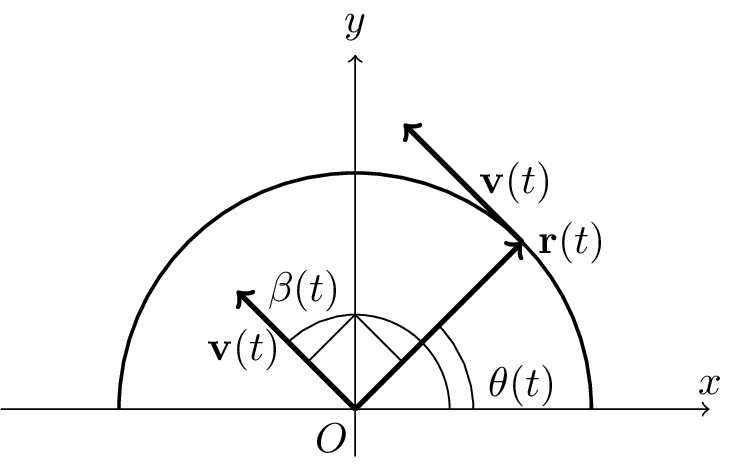
</figure>

Si può dimostrare questa proprietà senza analizzare le componenti dei versori, considerando la differenza infinitesima tra due vettori posizione in due istanti di tempo $t$ e $t+\Delta t$. Il vettore velocità $\boldsymbol{\mathbf{v}}(t)$ è dato dalla derivata: $$r\cdot\displaystyle\frac{\mathrm{d}\hat{\boldsymbol{\mathbf{r}}}(t)}{\mathrm{d}t}=\lim_{\Delta t \to 0}\frac{\hat{\boldsymbol{\mathbf{r}}}(t+\Delta t)-\hat{\boldsymbol{\mathbf{r}}}(t)}{\Delta t}$$ Per $\Delta t \to 0$, l’angolo $\mathrm{d}\theta = \theta(t+\Delta t)-\theta(t)$, tra $\hat{\boldsymbol{\mathbf{r}}}(t)$ e $\hat{\boldsymbol{\mathbf{r}}}(t+\Delta t)$ anch’esso tende a $0$. Si può approssimare la differenza per $\Delta t \to 0$ tra i due vettori posizione come l’arco di circonferenza di ampiezza $\mathrm{d}\theta$ e di raggio unitario, poiché si tratta di un versore: $\mathrm{d}\hat{\boldsymbol{\mathbf{r}}}(t)\approx1\cdot \mathrm{d}\theta\hat{\boldsymbol{\mathbf{\tau}}}(t)$, al diminuire di $\mathrm{d}\theta$ l’approssimazione diventa sempre più precisa. Quindi per $\mathrm{d}\theta\to0\,\mathrm{rad}$ si ha: $$\boldsymbol{\mathbf{v}}(t)=r\cdot\displaystyle\frac{\mathrm{d}\hat{\boldsymbol{\mathbf{r}}}(t)}{\mathrm{d}t}=r\cdot\frac{\mathrm{d}\theta(t)}{\mathrm{d}t}\hat{\boldsymbol{\mathbf{\tau}}}(t)=r\cdot\omega(t)\hat{\boldsymbol{\mathbf{\tau}}}(t)$$

<figure>
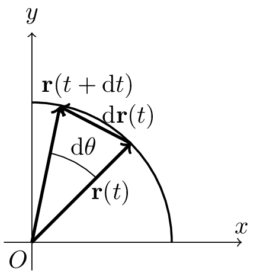
</figure>

Se il punto si muove con velocità angolare costante, e quindi si muove di moto circolare uniforme: $$\boldsymbol{\mathbf{v}}(t)=r\omega\hat{\boldsymbol{\mathbf{\tau}}}(t)$$ Si può trovare l’accelerazione del punto derivando il vettore velocità: $$\begin{gathered}
    \boldsymbol{\mathbf{a}}(t)=\displaystyle\frac{\mathrm{d}\boldsymbol{\mathbf{v}}(t)}{\mathrm{d}t}=
    r\omega\frac{\mathrm{d}\hat{\boldsymbol{\mathbf{\tau}}}(t)}{\mathrm{d}t}\\
    r\omega\frac{\mathrm{d}}{\mathrm{d}t}(\cos\theta(t)\hat{\boldsymbol{\mathbf{y}}}-\sin\theta(t)\hat{\boldsymbol{\mathbf{x}}})\\
    \boldsymbol{\mathbf{a}}(t)=    r\omega^{2}(-\sin\theta(t)\hat{\boldsymbol{\mathbf{y}}}-\cos\theta(t)\hat{\boldsymbol{\mathbf{x}}})\tag{\stepcounter{equation}\theequation}
\end{gathered}$$ Si definisce il versore $\hat{\boldsymbol{\mathbf{\nu}}}(t)=-(\cos\theta(t)\hat{\boldsymbol{\mathbf{x}}}+\sin\theta(t)\hat{\boldsymbol{\mathbf{y}}})=-\hat{\boldsymbol{\mathbf{r}}}(t)$, allora il vettore accelerazione può essere espresso come: $$\boldsymbol{\mathbf{a}}(t)=r\omega^{2}\hat{\boldsymbol{\mathbf{\nu}}}(t)=-\omega^{2}r\cdot\hat{\boldsymbol{\mathbf{r}}}(t)=-\omega^{2}\boldsymbol{\mathbf{r}}(t){,}\:\: a=\omega^{2}r=\displaystyle\frac{v^{2}}{r}$$ Il vettore accelerazione ha la stessa direzione del vettore posizione $\boldsymbol{\mathbf{r}}(t)$, ma verso opposto:

<figure>
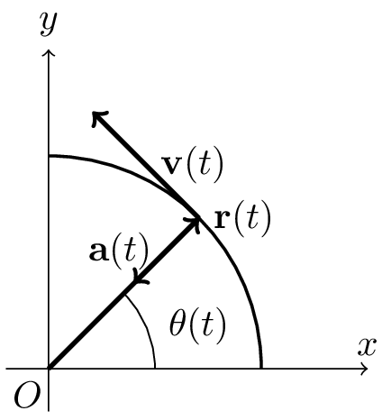
</figure>

Questa proprietà si può dimostrare analizzando la derivata come rapporto incrementale: $$\boldsymbol{\mathbf{a}}(t)=\displaystyle\frac{\mathrm{d}\boldsymbol{\mathbf{v}}(t)}{\mathrm{d}t}=\lim_{\Delta t \to 0}\frac{\boldsymbol{\mathbf{v}}(t+\Delta t)-\boldsymbol{\mathbf{v}}(t)}{\mathrm{d}t}$$ Il vettore differenza $\Delta \boldsymbol{\mathbf{v}}(t) =\boldsymbol{\mathbf{v}}(t+\Delta t)-\boldsymbol{\mathbf{v}}(t)$, al diminuire di $\Delta t$ tende a diventare ortogonale alla velocità:

<figure>
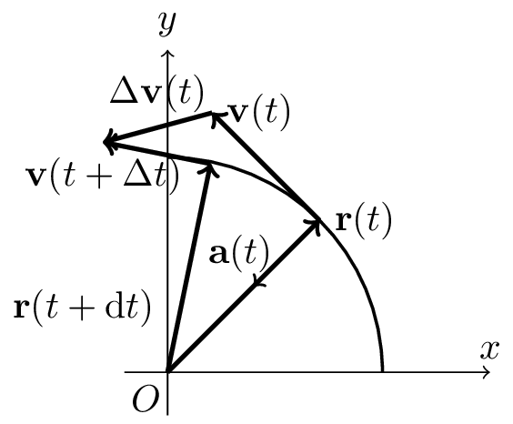
</figure>

Questa accelerazione viene chiamata accelerazione centripeta.

Dato un punto materiale in moto circolare uniforme, se dopo un periodo $T=\Delta t$, ritorna alla posizione iniziale, si definisce moto periodico. Si può ottenere la posizione, integrando la velocità angolare, se è nota la posizione angolare iniziale $\theta(t_0) = 0$: $$\begin{gathered}
    \dot\theta(t) = \omega\\
    \int_{t_0}^{t}\mathrm{d}\theta(\tau)\mathrm{d}\tau=\int_{t_0}^{t}\omega \mathrm{d}\tau\\
    \theta(t)-\theta(t_0)=\omega\Delta t\\
    \theta(t)=\omega\Delta t\tag{\stepcounter{equation}\theequation}
\end{gathered}$$

Sapendo la posizione angolare ad ogni istante è possibile calcolare il periodo di una rotazione:

$$\begin{gathered}
    \begin{cases}
        \boldsymbol{\mathbf{x}}(t)=r\cos\theta(t)\hat{\boldsymbol{\mathbf{x}}}=\boldsymbol{\mathbf{x}}(t+T)\\
        \boldsymbol{\mathbf{y}}(t)=r\sin\theta(t)\hat{\boldsymbol{\mathbf{y}}}=\boldsymbol{\mathbf{y}}(t+T)
    \end{cases}\\
    \begin{cases}
        \cos(\theta(t+T))=\cos(\theta(t))\\
        \sin(\theta(t+T))=\sin(\theta(t))\\
    \end{cases}\\
    \begin{cases}
        \cos(\omega t +\omega T)=\cos(\omega t)\\
        \sin(\omega t + \omega T)=\sin(\omega  t)\\
    \end{cases}\\
    \omega t +\omega T =\omega t + 2k\pi\:\mbox{,}\:k=1\\
    T=\displaystyle\frac{2\pi}{\omega}[\mathrm{s}]\tag{\stepcounter{equation}\theequation}
\end{gathered}$$

### Moto Circolare non Uniforme

Se un punto materiale si muove su una traiettoria circolare con una velocità angolare variabile nel tempo $\omega(t)$, si muove di moto circolare non uniforme. Allora il moto non avrà un periodo di rotazione fisso, sarà descritto dalle leggi orarie:

$$\begin{cases}
        \boldsymbol{\mathbf{r}}(t)=-r\hat{\boldsymbol{\mathbf{\nu}}}(t)\\
        \boldsymbol{\mathbf{v}}(t)=r\omega(t)\hat{\boldsymbol{\mathbf{\tau}}}(t)\\
        \boldsymbol{\mathbf{a}}(t)=\displaystyle\frac{\mathrm{d}\boldsymbol{\mathbf{v}}(t)}{\mathrm{d}t}
        =r\frac{\mathrm{d}}{\mathrm{d}t}(\omega(t)\hat{\boldsymbol{\mathbf{\tau}}}(t))
        =r(\dot\omega(t)\hat{\boldsymbol{\mathbf{\tau}}}(t)+\omega(t)^{2}\hat{\boldsymbol{\mathbf{\nu}}}(t))
    \end{cases}$$

$\dot\omega(t)$ viene definita accelerazione angolare $\alpha(t)$, $r\alpha(t)\hat{\boldsymbol{\mathbf{\tau}}}(t)$ viene definita accelerazione tangenziale $\boldsymbol{\mathbf{a}}_\mathrm{tan}(t)$ mentre $r\omega^{2}(t)\hat{\boldsymbol{\mathbf{\nu}}}(t)$ viene definita accelerazione centripeta $\boldsymbol{\mathbf{a}}_\mathrm{cen}(t)$.  
Il moto del punto viene definito dai versori $\hat{\boldsymbol{\mathbf{\tau}}}(t)$ e $\hat{\boldsymbol{\mathbf{\nu}}}(t)$, perciò si può usare un sistema di riferimento centrato nel punto e con gli assi concordi per direzione e verso ai versori $\hat{\boldsymbol{\mathbf{\tau}}}(t)$ e $\hat{\boldsymbol{\mathbf{\nu}}}(t)$:

<figure>
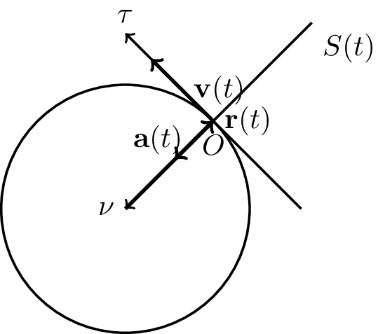
</figure>

L’utilizzo di questo sistema di riferimento locale facilita l’analisi di moti vari, poiché è una rappresentazione sempre valida essendo dipendente dall’istante di tempo in cui ci si trova.

### Moto Curvilineo Vario

Si può aggiungere al sistema di riferimento $S(\tau(t), \nu(t))$, un altro asse, chiamato $\beta$ ortogonale al piano ($\hat{\boldsymbol{\mathbf{\beta}}}=\hat{\boldsymbol{\mathbf{\tau}}}(t)\times\hat{\boldsymbol{\mathbf{\nu}}}(t)$) sulla base di $\tau$ e $\nu$ che rappresenta una rotazione in senso antiorario se è diretto verso l’alto ($\beta$), orario se è diretto verso il basso ($\beta'$):

<figure>
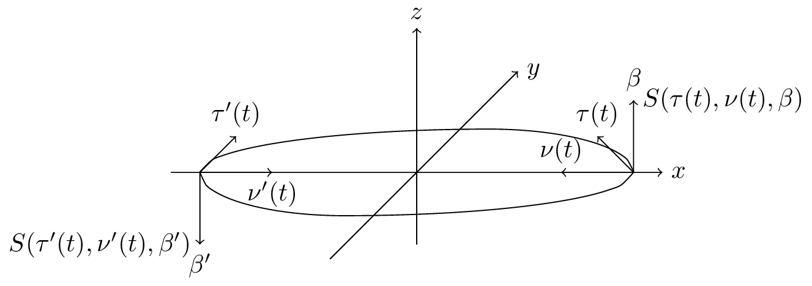
</figure>

Nel sistema di riferimento $S(\tau(t),\nu(t),\beta)$, si può rappresentare la velocità angolare e l’accelerazione angolare come vettori: $$\boldsymbol{\mathbf{\omega}}(t)=\omega(t)\cdot\hat{\boldsymbol{\mathbf{\beta}}}{,}\:\: \boldsymbol{\mathbf{\alpha}}(t)=\alpha(t)\cdot\hat{\boldsymbol{\mathbf{\beta}}}$$ Considerando la velocità tangenziale $\boldsymbol{\mathbf{v}}=r\omega\hat{\boldsymbol{\mathbf{\tau}}}$, si può esprimere come prodotto vettoriale tra il vettore velocità angolare ed il versore raggio: $$\boldsymbol{\mathbf{v}}=r\displaystyle\frac{\mathrm{d}\hat{\boldsymbol{\mathbf{r}}}}{\mathrm{d}t}=r\boldsymbol{\mathbf{\omega}}\times\hat{\boldsymbol{\mathbf{r}}}=\boldsymbol{\mathbf{\omega}}\times\boldsymbol{\mathbf{r}}$$ In generale la derivata di un versore può essere espressa come il prodotto vettoriale tra il vettore velocità angolare della rotazione del versore per il versore stesso: $$\displaystyle\frac{\mathrm{d}\hat{\boldsymbol{\mathbf{x}}}_i}{\mathrm{d}t}=\boldsymbol{\mathbf{\omega}}\times\hat{\boldsymbol{\mathbf{x}}}_i$$ Questa espressione viene chiamata formula di Poisson.

Considerando una qualsiasi traiettoria tridimensionale $\Gamma$, è utile analizzarla rispetto al sistema di riferimento $S(\tau,\nu,\beta)$ intrinseco, centrato nella posizione del punto materiale lungo la traiettoria. Rispetto a questo sistema di riferimento la posizione del punto materiale è sempre nulla, poiché coincide con l’origine del sistema $S$. Si considera l’asse $\tau$ sulla retta tangente alla traiettoria nella posizione del punto materiale, e diretta nel verso del moto. L’asse $\nu$ è perpendicolare a quest’ultimo, ma per determinare il suo verso bisogna analizzare la traiettoria nell’intorno della posizione del punto materiale.

Dati tre è sempre definita una e una sola circonferenza passante per quei tre punti. Dato il punto della traiettoria dove si trova il punto materiale, si possono considerare altri due punti, prima e dopo la posizione del punto materiale, sempre lungo la traiettoria, per definire una circonferenza. Il moto del punto materiale in quell’intorno della traiettoria può quindi essere approssimato ad un moto circolare lungo la circonferenza così ottenuta, ma questa risulta soltanto un’approssimazione. Avvicinando i due punti alla posizione del punto materiale, si ottiene un’approssimazione sempre migliore del moto del punto. La circonferenza tenderà ad un valore limite, per i due punti coincidenti alla posizione del punto materiale, questa circonferenza così ottenuta è tangente alla traiettoria nella posizione del punto materiale, dove sono presenti anche gli altri due punti e viene chiamata circonferenza osculatrice. Il centro di questa circonferenza viene chiamato centro di curvatura, mentre la distanza del centro di curvatura dal punto materiale raggio di curvatura $R$. Minore è il raggio di curvatura, maggiore sarà la curvatura della traiettoria in quell’intorno e viceversa. L’asse $\nu$ quindi si trova sulla retta passante per il punto materiale ed il centro di curvatura, e punta verso il centro di curvatura della traiettoria. L’asse $\beta$ è ortogonale all’asse formato dagli assi $\tau,\,\nu$ e di verso definito dal prodotto vettoriale $\tau\times\nu$. Il verso dell’asse $\beta$ definisce il cambiamento di piano della traiettoria, ovvero la rotazione della circonferenza osculatrice.

In questo sistema di riferimento intrinseco si può esprimere la velocità come un vettore $\boldsymbol{\mathbf{v}}=v\hat{\boldsymbol{\mathbf{\tau}}}$, poiché la velocità è sempre tangente alla traiettoria. Il punto materiale effettua una traiettoria circolare nell’intorno della sua posizione, per cui è soggetto ad un’accelerazione centripeta, o normale, alla sua traiettoria, per effettuare la curvatura individuata dalla traiettoria. Per determinare la componente normale e tangenziale dell’accelerazione si deriva la velocità rispetto al tempo: $$\begin{gathered}
    \boldsymbol{\mathbf{a}}=\displaystyle\frac{\mathrm{d}\boldsymbol{\mathbf{v}}}{\mathrm{d}t}=\frac{\mathrm{d}v\hat{\boldsymbol{\mathbf{\tau}}}}{\mathrm{d}t}\\
    \displaystyle\frac{\mathrm{d}v}{\mathrm{d}t}\hat{\boldsymbol{\mathbf{\tau}}}+v\frac{\mathrm{d}\hat{\boldsymbol{\mathbf{\tau}}}}{\mathrm{d}t}
\end{gathered}$$ Per la formula di Poisson si può esprimere la derivata del versore $\hat{\boldsymbol{\mathbf{\tau}}}$ come $\boldsymbol{\mathbf{\omega}}\times\hat{\boldsymbol{\mathbf{\tau}}}$. Poiché nella rappresentazione intrinseca il punto materiale non effettua una rotazione, la componente velocità angolare si esprimere rispetto alla velocità tangenziale, ovvero la velocità del punto materiale, e del raggio di curvatura $R$: $\omega={v}/{R}$. Per cui esplicitando il modulo si può esprimere l’accelerazione del punto materiale: $$\begin{gathered}
    \boldsymbol{\mathbf{a}}=\displaystyle\frac{\mathrm{d}v}{\mathrm{d}t}\hat{\boldsymbol{\mathbf{\tau}}}+v\frac{v}{R}\hat{\boldsymbol{\mathbf{\beta}}}\times\hat{\boldsymbol{\mathbf{\tau}}}=\frac{\mathrm{d}v}{\mathrm{d}t}\hat{\boldsymbol{\mathbf{\tau}}}+\frac{v^2}{R}\hat{\boldsymbol{\mathbf{\nu}}}
\end{gathered}$$ L’accelerazione del punto materiale presenta una componente tangenziale identificata dal versore $\hat{\boldsymbol{\mathbf{\tau}}}$, e una componente normale o centripeta identificata dal versore $\hat{\boldsymbol{\mathbf{\nu}}}$, poiché diretta sempre verso il centro di curvatura. Se la componente tangenziale è nulla, il moto è curvilineo uniforme, se è nulla la componente centripeta il moto è rettilineo vario, se sono nulle entrambe il moto è rettilineo uniforme, invece se entrambe sono diverse da zero il moto è curvilineo vario.

<figure>
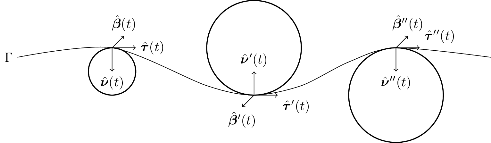
</figure>

## Approssimazione della Legge Oraria

Una funzione $f(t)$ può essere espressa in un intorno $I_{t_0}(\delta)$ di un punto $t_0$ mediante la seria di Taylor: $$f(t)=\sum_{i=0}^{n}\displaystyle f^{(i)}(t_0)\frac{(t-t_0)^{i}}{i!}+O((t-t_0)^{k})$$ Viene definita la funzione $\tilde{f}_k$ che approssima la funzione $f$: $$\tilde{f}_k(t,t_0)=\sum_{i=0}^{k}\displaystyle f^{(i)}(t_0)\frac{(t-t_0)^{i}}{i!}$$ e la funzione errore $R_k$ che determina l’imprecisione della funzione $\tilde{f}$ rispetto alla funzione $f$:

$$R_k=\displaystyle\left|f(t)-\tilde{f}_k(t-t_0)\right|=
    f^{(k+1)}(\xi)\frac{(t-t_0)^{k+1}}{(k+1)!}\:\mbox{per}\:
    \xi \in [t, t_0]$$

La funzione errore $R_k$ è un infinitesimo di ordine $k$: $R_k \leq O((t-t_0)^{k})$. Date l’accelerazione e la velocità nell’istante di tempo $t_0$ è possibile approssimare la legge oraria della posizione $\boldsymbol{\mathbf{r}}(t)$, tramite il suo sviluppo di Taylor:

$$\begin{gathered}
    \boldsymbol{\mathbf{r}}(t)=\sum_{i=0}^{2}\displaystyle\boldsymbol{\mathbf{r}}^{(i)}(t_0)\frac{(t-t_0)^k}{i!}+O((t-t_0)^{3})\\
    \boldsymbol{\mathbf{r}}(t)=\boldsymbol{\mathbf{r}}(t_0) + \boldsymbol{\mathbf{r}}^{(1)}(t_0)(t-t_0)+\boldsymbol{\mathbf{r}}^{(2)}(t_0)\displaystyle\frac{(t-t_0)^{2}}{2}+O((t-t_0)^{3})\\
    {\boldsymbol{\mathbf{r}}}(t)=\boldsymbol{\mathbf{r}}_0+\boldsymbol{\mathbf{v}}_0(t-t_0)+\boldsymbol{\mathbf{a}}_0\displaystyle\frac{(t-t_0)^{2}}{2}+R_2\\
    {\boldsymbol{\mathbf{r}}}(t)\approx\boldsymbol{\mathbf{r}}_0+\boldsymbol{\mathbf{v}}_0(t-t_0)+\boldsymbol{\mathbf{a}}_0\displaystyle\frac{(t-t_0)^{2}}{2}\tag{\stepcounter{equation}\theequation}
\end{gathered}$$

In questo modo dati i valori della posizione, della velocità e dell’accelerazione nell’istante di tempo $t_0$, è possibile approssimare la traiettoria del punto materiale, per un qualsiasi tipo di moto, nell’intorno di $t_0$.

# Dinamica del Punto Materiale

La dinamica è la parte della meccanica che analizza le cause del moto di un corpo, e ne descrive i suoi criteri di equilibrio. I principi della dinamica vennero enunciati da Newton.

## Leggi di Newton

### I Principio

> Un corpo rimane nel suo stato di quiete o di moto rettilineo uniforme se la somma delle forze agenti su di esso è nulla: $$\boldsymbol{\mathbf{v}}:\mathrm{cost.}\iff \sum\boldsymbol{\mathbf{F}}=\boldsymbol{\mathbf{0}}$$

Viene chiamato Principio di Inerzia il caso dove la velocità del corpo sia nulla. L’intuizione per il I principio viene attribuita a Galileo e ai suoi esperimenti sul piano inclinato. Un corpo su un piano inclinato sufficientemente liscio se viene lasciato cadere avrà una certa velocità che, in seguito a evidenze sperimentali, gli permette di raggiungere la quota di partenza se è presente un altro piano inclinato sufficientemente liscio dopo il primo, indipendentemente dalla pendenza del secondo.

Perciò se il piano inclinato di arrivo viene abbassato progressivamente, la distanza complessiva percorsa dal corpo tenderà ad aumentare, fino a diventare infinita per un piano parallelo al vettore velocità, poiché non potrà mai raggiungere la quota iniziale. Per cui un corpo mantiene la sua velocità iniziale in assenza di forze che ne impediscono il moto.

<figure>
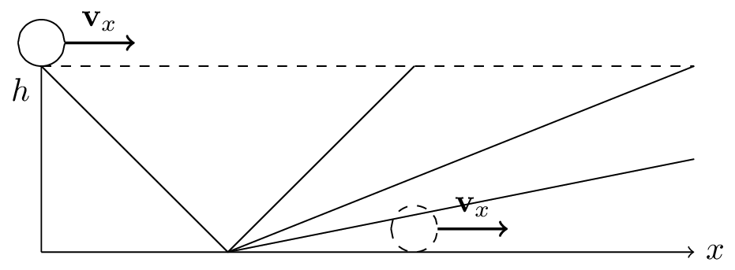
</figure>

Newton in seguito definì la grandezza fisica forza, anch’essa un vettore: $\boldsymbol{\mathbf{F}}\left[\mathrm{kg}\cdot \mathrm{m}\cdot{\mathrm{s}^{-2}}\right]=\left[\mathrm{N}\right]$, grandezza che esprime e quantifica l’interazione tra sistemi fisici. Ne descrisse la sua relazione con il moto nel secondo principio.

### II Principio

> La forza agente su un corpo è data dalla prima derivata rispetto al tempo della quantità di moto. $$\displaystyle\frac{\mathrm{d}\boldsymbol{\mathbf{p}}}{\mathrm{d}t}=\boldsymbol{\mathbf{F}}$$

Viene definita un’altra grandezza fisica, la quantità di moto di un corpo: $\boldsymbol{\mathbf{p}}$, la variazione di quantità di moto viene ricavata dalla seguente equazione:

$$\Delta\boldsymbol{\mathbf{p}}=m\Delta\boldsymbol{\mathbf{v}}$$

In seguito ad evidenze sperimentali Newton scoprì un legame proporzionale tra la variazione della velocità in un istante di tempo ed il modulo della forza agente sul corpo. La costante di proporzionalità scoprì essere la massa del corpo, quindi la forza agente su un corpo è la derivata rispetto al tempo della quantità di moto:

$$\begin{gathered}
    \displaystyle\frac{\mathrm{d}\boldsymbol{\mathbf{v}}(t)}{\mathrm{d}t}\propto\boldsymbol{\mathbf{F}}\\
    \left|\displaystyle\frac{\mathrm{d}\boldsymbol{\mathbf{v}}(t)}{\mathrm{d}t}\right|=c_0\left|\boldsymbol{\mathbf{F}}\right|\\
    \frac{1}{c_0} \left|\displaystyle\frac{\mathrm{d}\boldsymbol{\mathbf{v}}(t)}{\mathrm{d}t}\right|=\left|\boldsymbol{\mathbf{F}}\right|{,}\:\:\frac{1}{c_0}=m\\
    \displaystyle\frac{\mathrm{d}mv}{\mathrm{d}t}=\frac{\mathrm{d}p}{\mathrm{d}t}=ma=F
\end{gathered}$$

La costante di proporzionalità $c_0^{-1}$ viene chiamata massa inerziale $m$ e quantifica quanto un corpo si oppone al moto ovvero l’inerzia del corpo.  
Questo legame tra accelerazione e forza agente sul corpo è valido anche in campo vettoriale: $$m\boldsymbol{\mathbf{a}}=\boldsymbol{\mathbf{F}}$$

Il secondo principio può essere espresso anche in forma integrale considerando: $$\begin{gathered}
    \boldsymbol{\mathbf{F}}=\displaystyle\frac{\mathrm{d}\boldsymbol{\mathbf{p}}}{\mathrm{d}t}\\
    \boldsymbol{\mathbf{F}}\mathrm{d}t=\mathrm{d}\boldsymbol{\mathbf{p}}\\
    \displaystyle\int_{t_0}^{t}\boldsymbol{\mathbf{F}}\mathrm{d}\tau=\int_{p_0}^{p(t)}\mathrm{d}\boldsymbol{\mathbf{p}}\\
    \boldsymbol{\mathbf{J}}=\boldsymbol{\mathbf{F}}\Delta t=\Delta\boldsymbol{\mathbf{p}}\:[\mathrm{N}\cdot \mathrm{s}]\tag{\stepcounter{equation}\theequation}
\end{gathered}$$ Viene definito il vettore impulso $\boldsymbol{\mathbf{J}}$ che quantifica la quantità di forza che agisce su un corpo in un dato intervallo di tempo. Per cui se la forza è nulla, la differenza di quantità di moto deve essere anch’essa nulla; ne deriva il principio della conservazione della quantità di moto:

> In assenza di forze applicate, o in caso la loro risultante sia nulla, la quantità di moto rimane costante, ovvero si conserva.

### III Principio

> Ad ogni azione equivale una reazione uguale e contraria.

Questo principio può essere espresso anche considerando la risultante delle forze interne ad un sistema. Se non sono presenti forze esterne agenti su di esso, le forze rimaste saranno tutte uguali e contrarie tra di loro a coppie, quindi la forza risultante agente sul sistema sarà nulla:

> La risultante delle forze interne agenti su un sistema è nulla.

$$\boldsymbol{\mathbf{F}}_{A\to B}=-\boldsymbol{\mathbf{F}}_{B\to A}$$

### Equilibrio

Se su un corpo agiscono più forze, i contributi delle singole forze sono indipendenti tra di loro, per cui è possibile considerare una sola forza, definita risultante, pari alla somma vettoriale di tutte le forze applicate. Un corpo si dice sia in uno stato di equilibrio se la risultante è nulla.

Applicando il primo principio della dinamica si individuano due tipi di equilibrio:

- Equilibrio Statico: Si applica il principio di inerzia, il corpo si trova in uno stato di quiete;

- Equilibrio Dinamico: Si applica il primo principio, il corpo si muove di moto rettilineo uniforme.

Un corpo in moto circolare uniforme si trova in equilibrio dinamico, avendo una velocita costante. Ma avrà un’accelerazione centripeta costante. La risultante delle forze sarà comunque nulla poiché sul corpo agirà una forza apparente che bilancia la forza centripeta.

## Forze

Esistono 4 forze fondamentali:

- Forza di Gravità;

- Forza Elettromagnetica;

- Forza Nucleare Forte;

- Forza Nucleare Debole.

Da queste forze, derivano tutte le forze studiate dalla dinamica.  
Dalla forza di gravità derivano:

- Forza Peso;

- Reazione Vincolare;

- Forza di Attrito;

- Tensione;

- Forza Elastica.

### Forza Peso

Viene definita la forza peso $\boldsymbol{\mathbf{F}}_P$ o $\boldsymbol{\mathbf{P}}$ la forza di attrazione gravitazionale tra un corpo sulla superficie ed il pianeta dove si trova, approssimato come un punto avente la stessa massa del pianeta nel suo centro:

$$\boldsymbol{\mathbf{F}}_P=G\displaystyle\frac{M_\mathrm{terra}m}{r_\mathrm{terra}^{2}}\hat{\boldsymbol{\mathbf{r}}}=\left(G\frac{M_\mathrm{terra}}{r_\mathrm{terra}^{2}}\hat{\boldsymbol{\mathbf{r}}}\right)m=m\boldsymbol{\mathbf{g}}$$

Viene definito il vettore di accelerazione gravitazionale $\boldsymbol{\mathbf{g}}$: $$\boldsymbol{\mathbf{g}}=G\displaystyle\frac{M}{r^{2}}\hat{\boldsymbol{\mathbf{r}}}$$ Poiché la massa inerziale è diversa dalla massa gravitazionale l’accelerazione di un corpo in caduta libera è indipendente dalla massa inerziale del corpo. Su un corpo in caduta libera agirà solamente la forza peso, dipendente dalla massa gravitazionale, per il secondo principio, la somma delle forze è uguale alla massa inerziale del corpo moltiplicata alla sua accelerazione, quindi si ottiene: $$\sum\boldsymbol{\mathbf{F}}=\boldsymbol{\mathbf{F}}_P=m_i\boldsymbol{\mathbf{a}}$$

Per cui si avrà che la forza peso di un corpo sia coincidente alla forza agente su un corpo in caduta libera ad un’accelerazione $\boldsymbol{\mathbf{a}}$, per cui le masse saranno tra di loro direttamente proporzionali rispetto ad una costante di proporzionalità $c_0$:

$$m_g\boldsymbol{\mathbf{g}}=m_i\boldsymbol{\mathbf{a}}\Rightarrow m_g=c_0m_i$$

Sulla base di evidenze sperimentali si è scoperto che la costante di proporzionalità vale $1$, per cui un corpo allo stato di quiete su cui agisce solamente la forza peso, sarà soggetto alla stessa accelerazione di un corpo in caduta libera $\boldsymbol{\mathbf{a}}=\boldsymbol{\mathbf{g}}$. Perciò la massa gravitazionale è esattamente uguale alla massa inerziale, nonostante rappresentino due fenomeni distinti: la resistenza di un corpo ad uno spostamento e l’attrazione gravitazionale tra due corpi.

### Reazione Vincolare

Se un corpo soggetto all’azione di una forza si trova in stato di quiete rispetto all’ambiente, allora sul corpo deve essere applicata un’altra forza tale da bilanciarla, questa forza viene chiamata reazione vincolare $\boldsymbol{\mathbf{R}}$.

Nel caso di un corpo poggiato su un piano, corrisponde ad una forza normale ad esso $\boldsymbol{\mathbf{N}}$.

$$\displaystyle\sum\boldsymbol{\mathbf{F}}=\boldsymbol{\mathbf{0}}\Rightarrow\boldsymbol{\mathbf{F}}_P+\boldsymbol{\mathbf{N}}=\boldsymbol{\mathbf{0}}\Rightarrow\boldsymbol{\mathbf{N}}=-\boldsymbol{\mathbf{F}}_P$$

<figure>
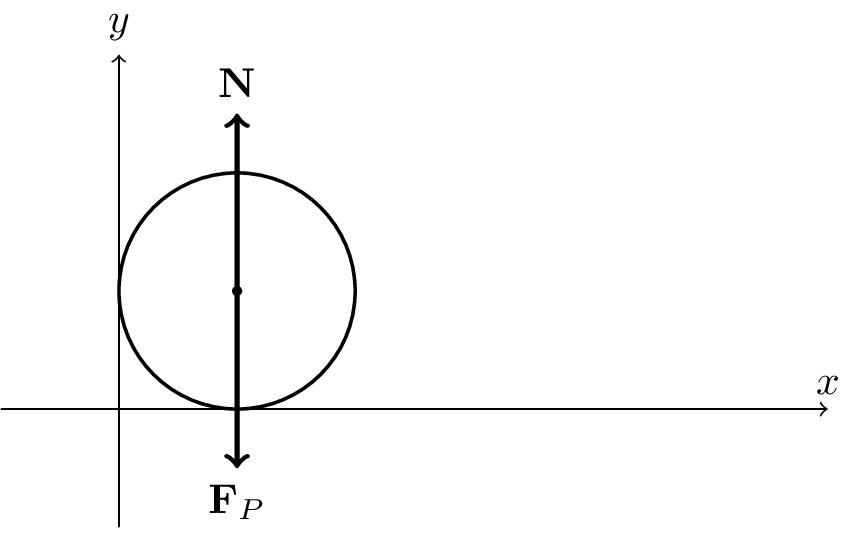
</figure>

Il tipo di reazione vincolare dipende dal tipo di vincolo imposto al corpo, non è determinabile a priori poiché dipende dalle forze agenti in quel caso specifico sul corpo. Se il corpo è poggiato ad un piano, il vincolo rimuove un solo grado di libertà dal corpo per cui la reazione vincolare $\boldsymbol{\mathbf{R}}$ sarà solamente la normale al piano, $\boldsymbol{\mathbf{R}}=\boldsymbol{\mathbf{N}}$.

Se il corpo è vincolato tramite una cerniera allora il vincolo rimuove due gradi di libertà al corpo, impedendogli di traslare, per cui la reazione vincolare sarà data dalla somma vettoriale della normale $\boldsymbol{\mathbf{N}}=\boldsymbol{\mathbf{R}}_y$ al piano e la forza opposta alla traslazione del corpo $\boldsymbol{\mathbf{R}}_x$, $\boldsymbol{\mathbf{R}}=\boldsymbol{\mathbf{R}}_x+\boldsymbol{\mathbf{R}}_y$.

Esistono vincoli che rimuovono tre gradi di libertà, ovvero impediscono al corpo di ruotare sull’asse del vincolo, per cui la sua reazione vincolare avrà anche una componente torcente.

### Forza di Attrito Radente

In base al tipo di vincolo o ambiente dove si trova un corpo, è possibile che sia soggetto a delle forze di attrito. Queste forze, dovute alle forze di coesione tra due materiali, si oppongono al moto e sono sempre presenti. Si può analizzare il caso limite dove non sono presenti, considerando una superficie di appoggio liscia, nel resto dei casi si considera una superficie scabra.

La forza di attrito statico, o secco, o radente, è una forza che agisce su un corpo in quiete, cercando di mantenerlo in quiete, quindi si oppone alla forza esterna agente su di esso, ed ha direzione uguale alla direzione del moto, ma verso opposto. Il suo modulo aumenta fino al raggiungimento di un valore massimo, dopo il quale non riesce più a impedire il moto.  
È direttamente proporzionale all’inerzia del corpo: $F_\mathrm{atr}\propto F_P$, è uguale all’inerzia del corpo per una certa costante di proporzionalità. Per un valore massimo $F_{\max}$ la costante di proporzionalità corrisponde alla costante di attrito statico $\mu_s$.

$$\begin{gathered}
    \boldsymbol{\mathbf{F}}_{\max}\:\mbox{t.c.}\:\sum\boldsymbol{\mathbf{F}}=\boldsymbol{\mathbf{0}}\\
    F_{\max}\hat{\boldsymbol{\mathbf{x}}}+F(-\hat{\boldsymbol{\mathbf{x}}})=\boldsymbol{\mathbf{0}}\\
    F_{\max}=\mu_sN=\mu_smg\tag{\stepcounter{equation}\theequation}
\end{gathered}$$

La forza massima che l’attrito statico può resistere è di modulo: $F_{\mathrm{atr},\max}=\mu_smg$.

### Forza di Attrito Dinamico

La forza di attrito dinamico si oppone in verso al moto di un corpo in movimento, è di modulo costante pari a: $F_d=\mu_dN$. La costatante di attrito dinamico è generalmente minore della costante di attrito statico: è necessaria più forza per mettere in moto un corpo che per mantenerlo in movimento:

<figure>
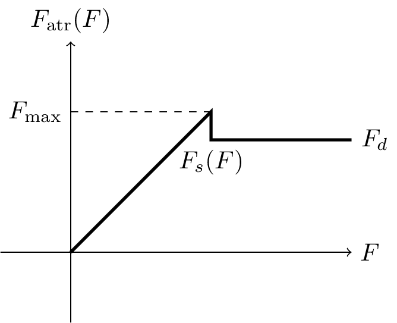
</figure>

### Piano Inclinato

Un sistema molto comune che coinvolge la forza di attrito è un piano inclinato. Dove un corpo, su cui agisce una forzante $\boldsymbol{\mathbf{F}}$, viene posto su un piano inclinato di un angolo $\theta$ e una costante di attrito $\mu_s$ e $\mu_d$. Su questo piano il corpo può essere in uno stato di equilibrio statico o dinamico: $\sum\boldsymbol{\mathbf{F}}_i=\boldsymbol{\mathbf{0}}$.  
Per analizzare questo sistema viene convenzionalmente scelto un sistema di riferimento con un asse parallelo $i$ al piano, un altro asse $j$ perpendicolare ad esso ed il centro $O$ nella posizione attuale del corpo. Il sistema sarà descritto dalle seguenti equazioni:

$$\begin{gathered}
    \sum\boldsymbol{\mathbf{F}}_i=\boldsymbol{\mathbf{0}}\\
    \begin{cases}
        \sum\boldsymbol{\mathbf{F}}_{i,x}=\boldsymbol{\mathbf{F}}_{P,x}+\boldsymbol{\mathbf{F}}_{s/d}+\boldsymbol{\mathbf{F}}_x=\boldsymbol{\mathbf{0}}\\
        \sum\boldsymbol{\mathbf{F}}_{i,y}=\boldsymbol{\mathbf{F}}_{P,y}+\boldsymbol{\mathbf{N}}+\boldsymbol{\mathbf{F}}_y=\boldsymbol{\mathbf{0}}
    \end{cases}\\
    \begin{cases}
        F_P\sin\theta-\mu_{s/d}N+\left|\boldsymbol{\mathbf{F}}_x\right|=0\\
        -F_P\cos\theta+N+\left|\boldsymbol{\mathbf{F}}_y\right|=0
    \end{cases}
\end{gathered}$$

Per una forzante $\boldsymbol{\mathbf{F}}=\boldsymbol{\mathbf{0}}$, allora la condizione per l’equilibrio statico di un corpo poggiato su un piano scabro inclinato è descritta dalla seguente espressione: $$\mu_s\geq\tan\theta$$

<figure>

</figure>

Considerando una curva inclinata, sarà possibile ruotare intorno alla curva solamente utilizzando la forza di attrito statico tra il singolo punto delle ruota in contatto con il suolo in ogni istante, si considera la ruota incomprimibile. Se la curva non fosse inclinata, sarebbe possibile attraversarla solo con l’attrito se esso bilancia la forza derivante dall’accelerazione centripeta $a_c={v^2/}{r}$ della ruota: $$\begin{gathered}
    \sum\boldsymbol{\mathbf{F}}_x=\boldsymbol{\mathbf{0}}=\boldsymbol{\mathbf{F}}_s+\boldsymbol{\mathbf{F}}\\
    -\mu_smg+m\displaystyle\frac{v^2}{r}=0\\
    v=\sqrt{\mu_sgr}\tag{\stepcounter{equation}\theequation}
\end{gathered}$$

Considerando una curva inclinata ad una certa angolazione $\alpha$, la ruota attraverserà la curva se vale il primo principio della dinamica: $$\begin{gathered}
    \begin{cases}
        \sum\boldsymbol{\mathbf{F}}_x=\boldsymbol{\mathbf{0}}=\boldsymbol{\mathbf{F}}_{P,x}+\boldsymbol{\mathbf{F}}_s\\
        \sum\boldsymbol{\mathbf{F}}_y=\boldsymbol{\mathbf{0}}=\boldsymbol{\mathbf{F}}_{P,y}+\boldsymbol{\mathbf{N}}
    \end{cases}\\
    \begin{cases}
        mg\sin\alpha-\mu_smg\cos\alpha=0\\
        N=mg\cos\alpha
    \end{cases}\\
    \mu_s=\tan(\alpha)\\
    \alpha=\arctan(\mu_s)\tag{\stepcounter{equation}\theequation}
\end{gathered}$$ La curva dovrà quindi avere un’angolazione $\alpha=\arctan(\mu_s)$.  
Se invece fosse applicata una forzante $\boldsymbol{\mathbf{F}}_y$ sulla ruota durante la rotazione sulla curva si avrà: $$\begin{gathered}
    \begin{cases}
        \sum\boldsymbol{\mathbf{F}}_x=\boldsymbol{\mathbf{0}}=\boldsymbol{\mathbf{F}}_{P,x}+\boldsymbol{\mathbf{F}}_s\\
        \sum\boldsymbol{\mathbf{F}}_y=\boldsymbol{\mathbf{0}}=\boldsymbol{\mathbf{F}}_{P,y}+\boldsymbol{\mathbf{N}}+\boldsymbol{\mathbf{F}}_y
    \end{cases}\\
    \begin{cases}
        mg\sin\alpha-\mu_s(mg\cos\alpha+\boldsymbol{\mathbf{F}}\cdot\hat{\boldsymbol{\mathbf{y}}})=0\\
        N=mg\cos\alpha+\boldsymbol{\mathbf{F}}\cdot\hat{\boldsymbol{\mathbf{y}}}
    \end{cases}\\
    F_y=mg\left(\displaystyle\frac{\sin\alpha}{\mu_s}-\cos\alpha\right)=F\tag{\stepcounter{equation}\theequation}
\end{gathered}$$

Una macchina potrà attraversare una curva inclinata di un angolo $\alpha$, e di costante di attrito statico $\mu_s$, se applicasse ad ognuna delle sue ruote una forza di modulo $F$, dove $m$ è la massa della ruota.

### Tensione

Considerando un filo non estensibile, di massa trascurabile che lega un corpo ad un vincolo. Se il corpo lega una massa ad un vincolo, e si trova in stato di quiete, allora la risultante delle forze applicate al filo deve essere necessariamente nulla. Se il filo non si estende allora le stesse forze dovranno essere applicate su qualsiasi punto del filo. Considerando l’estremo dove è collegata la massa, la sua forza peso $\boldsymbol{\mathbf{F}}_P$ viene bilanciata da una forza definita tensione $\boldsymbol{\mathbf{T}}$ di verso opposto. Considerando l’altro estremo collegato al vincolo, poiché le forze devono agire su ogni punto del filo, la tensione sarà applicata anche sul vincolo, per essere in quiete è necessaria l’azione di una reazione vincolare normale al piano dove è legato il filo $\boldsymbol{\mathbf{N}}$. Poiché le tensioni interne al filo si bilanciano tra di loro, la forza peso della massa si bilancia con la reazione vincolare del filo, per cui il filo si comporta come se trasferisse l’azione di una forza da un’estremo all’altro.

<figure>
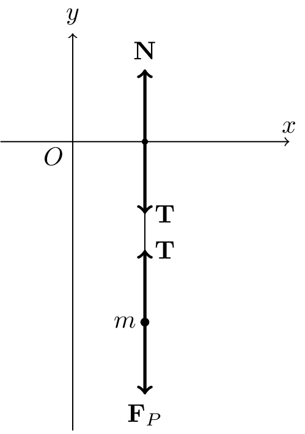
</figure>

Per dimostrare la proprietà di trasmissione di forze di una fune, si può approssimare come molti blocchetti in serie, di masse anch’essi trascurabile. Partendo dalla massa all’estremo inferiore, essa è legata ad un blocchetto che sarà soggetto alla forza peso della massa e alla sua reazione vincolare. Ora considerando la massa ed il primo blocchetto come un sistema unico, essendo collegato al blocchetto successivo su di esso agiranno la forza peso del sistema massa-blocchetto, uguale alla forza peso della massa, e una reazione vincolare derivante dalla forza peso. Continuando questo processo, poiché i blocchetti hanno massa trascurabile e non sono deformabili, si arriverà all’estremo superiore collegato al vincolo, dove agiranno la forza peso del sistema massa-blocchetti, uguale alla forza peso della massa, e la sua relativa reazione vincolare.

### Pendolo Semplice

Un pendolo semplice è un sistema formato da una massa collegata ad un filo di lunghezza $l$, che oscilla senza smorzamento da una posizione iniziale, inclinata di un angolo $\theta$. Sulla massa agiscono due accelerazioni: una centripeta ed una tangenziale al moto: $\boldsymbol{\mathbf{a}}_\mathrm{tan},\:\boldsymbol{\mathbf{a}}_\mathrm{cen}$. Il sistema, rispetto al sistema di riferimento $S(\tau,\nu)$ verrà quindi descritto dall’equazione:

$$\begin{gathered}
    \sum\boldsymbol{\mathbf{F}}=m\boldsymbol{\mathbf{a}}_\mathrm{cen}+m\boldsymbol{\mathbf{a}}_\mathrm{tan}\\
    \begin{cases}
        \sum\boldsymbol{\mathbf{F}}_{\nu}=\boldsymbol{\mathbf{T}}+\boldsymbol{\mathbf{F}}_{P,\nu}=m\boldsymbol{\mathbf{a}}_\mathrm{cen}\\
        \sum\boldsymbol{\mathbf{F}}_{\tau}=\boldsymbol{\mathbf{F}}_{P,\tau}=m\boldsymbol{\mathbf{a}}_\mathrm{tan}\\
    \end{cases}\\
    \begin{cases}
        ma_\mathrm{cen}\hat{\boldsymbol{\mathbf{\nu}}}=T\hat{\boldsymbol{\mathbf{\nu}}}+F_P\cos(\theta(t))(-\hat{\boldsymbol{\mathbf{\nu}}})\\
        ma_\mathrm{tan}\hat{\boldsymbol{\mathbf{\tau}}}=F_P\sin(\theta(t))(-\hat{\boldsymbol{\mathbf{\tau}}})\\
    \end{cases}\\
    \begin{cases}
        a_\mathrm{cen}=\omega^{2}(t)l=\dot\theta^{2}(t)l\\
        a_\mathrm{tan}=\alpha(t)l=\ddot\theta(t)l\\
    \end{cases}\\
    \begin{cases}
        m\dot\theta(t)^{2}l=T-mg\cos(\theta(t))\\
        m\ddot\theta(t)l=-mg\sin(\theta(t))\\
    \end{cases}
\end{gathered}$$

Considerando l’equazione sull’asse $\tau$: $$\ddot\theta(t)=-\displaystyle\frac{g}{l}\sin\theta(t)$$ Si definisce $\omega_p^{2}=g/l$ la pulsazione del pendolo.  
Considerando l’intorno $[0\,\mathrm{rad},\theta(t_0)]$, con $\theta(t_0) << 1\,\mathrm{rad}$, si può approssimare $\sin\theta(t)$ mediante la sua serie di Taylor: $\sin\theta(t) = \theta(t)+O(\theta^{3}(t))\Rightarrow\ddot\theta(t)\approx-\theta(t)\omega_p^{2}$, quindi si può approssimare il moto del pendolo ad un moto armonico: $$\begin{cases}
        \theta(t)=A\sin(\varphi+\omega_pt)\\
        \dot\theta(t)=A\omega_p\cos(\varphi+\omega_pt)\\
        \ddot\theta(t)=-A\omega_p^{2}\sin(\varphi+\omega_pt)
    \end{cases}$$ e avrà un periodo: $$T_p =2\pi\omega_p=2\pi\displaystyle\sqrt[]{\frac{g}{l}}$$ Si considera $\theta_0$ la posizione iniziale del pendolo: $$\theta_0=\theta(0)=A\sin\varphi$$ Si considera il pendolo in uno stato di quiete nell’istante $t=0$, quindi: $$\begin{gathered}
    \dot\theta(t=0)=0=\omega_pA\cos\varphi\\
    \varphi=\displaystyle\frac{\pi}{2}\\
    \theta_0=A\sin\frac{\pi}{2}=A\tag{\stepcounter{equation}\theequation}
\end{gathered}$$ Date queste condizioni le equazioni del moto del pendolo diventano: $$\begin{cases}
        \displaystyle\theta(t)=\theta_0\sin\left(\frac{\pi}{2}+\omega_pt\right)=\theta_0\cos(\omega_pt)\\
        \displaystyle\dot\theta(t)=\theta_0\omega_p\cos\left(\frac{\pi}{2}+\omega_pt\right)=-\theta_0\omega_p\sin(\omega_pt)\\
        \displaystyle\ddot\theta(t)=-\theta_0\omega_p^{2}\sin\left(\frac{\pi}{2}+\omega_pt\right)=-\theta_0\omega_p^{2}\cos(\omega_pt)
    \end{cases}$$

La tensione esercitata sul filo in funzione del tempo sarà per piccole oscillazioni: $$T(t)=mg\cos(\theta_0\cos(\omega_pt))+ml\theta_0^2\omega_p^2\sin^2(\omega_pt)$$ La tensione è massima nella posizione verticale per $\theta(t)=\theta_0\cos(\omega_pt)=0$ e minima per $\theta(t)=\theta_0\cos(\omega_pt)=\theta_0$.

<figure>

</figure>

### Forza Elastica

Un oggetto che, se deformato, tende a ritornare alla sua posizione di riposo risente di una forza elastica $\boldsymbol{\mathbf{F}}_{\mathrm{el}}$. Un oggetto comune che ha questa caratteristica è la molla. Una molla ha una posizione di riposo $\boldsymbol{\mathbf{r}}_0$, quando la molla si sposta di $\Delta\boldsymbol{\mathbf{r}}$, risenta di una forza di verso opposto allo spostamento e di modulo proporzionale ad esso: $\boldsymbol{\mathbf{F}}_{\mathrm{el}}\propto\Delta\boldsymbol{\mathbf{r}}$.

<figure>
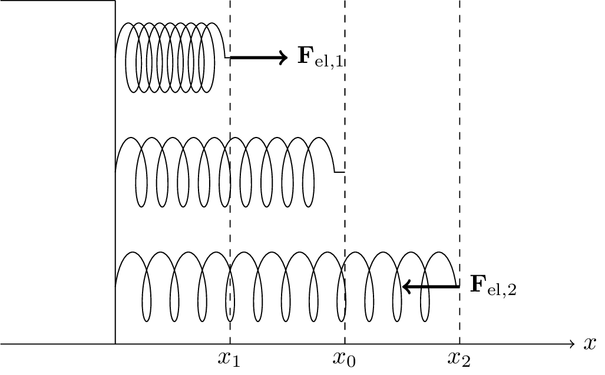
</figure>

Per cui esplicitando la costante di proporzionalità $k$, la forza elastica viene espressa tramite la seguente equazione, per molle ideali di massa trascurabile: $$\boldsymbol{\mathbf{F}}_{\mathrm{el}}=-k\Delta\boldsymbol{\mathbf{r}}$$ La costante di proporzionalità $k$ viene chiamata costante elastica, si misura in Newton per metro $\left[\mathrm{N}\cdot\mathrm{m}^{-1}\right]$. Si può usare una molla, con una costante elastica $k$ nota, per misurare la forza applicata applicata sulla molla, in base alla sua deformazione, questo strumento di misura viene chiamato dinamometro. Nel caso sia presente una massa all’estremo della molla:

<figure>
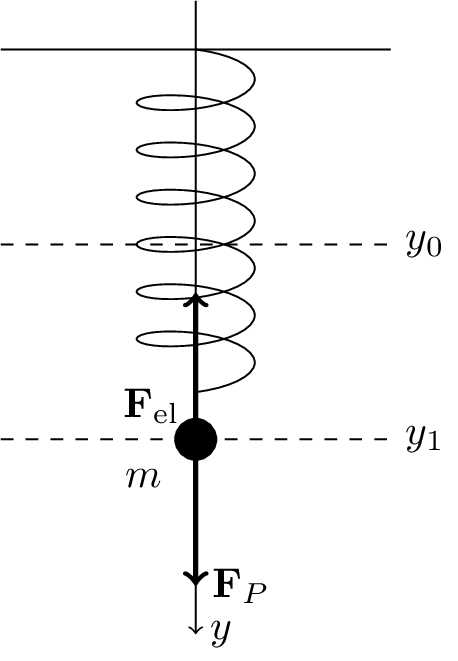
</figure>

Se la molla si trova in equilibrio stabile nel punto $y=y_1$: $\sum\boldsymbol{\mathbf{F}}_y=0\hat{\boldsymbol{\mathbf{y}}}$, allora: $$\begin{gathered}
    \sum\boldsymbol{\mathbf{F}}_y=\boldsymbol{\mathbf{F}}_P+\boldsymbol{\mathbf{F}}_{\mathrm{el}}=\boldsymbol{\mathbf{0}}\\
     F_P(-\hat{\boldsymbol{\mathbf{y}}})+F_{\mathrm{el}}\hat{\boldsymbol{\mathbf{y}}}=0\hat{\boldsymbol{\mathbf{y}}}\\
    m=\displaystyle-\frac{k\Delta y}{g}\tag{\stepcounter{equation}\theequation}
\end{gathered}$$

Considerando una molla su cui è applicata una forza $\boldsymbol{\mathbf{F}}$ nell’istante di tempo $t=0$, in uno stato di equilibrio stabile: $\boldsymbol{\mathbf{F}}+\boldsymbol{\mathbf{F}}_{\mathrm{el}}=\boldsymbol{\mathbf{0}}\Rightarrow F=k\Delta x$. Nell’istante subito successivo viene rimossa la forza $\boldsymbol{\mathbf{F}}$, la molla risente della sola forza elastica, e quindi di un’accelerazione risultante, indirizzata verso la posizione di riposo della molla:

<figure>
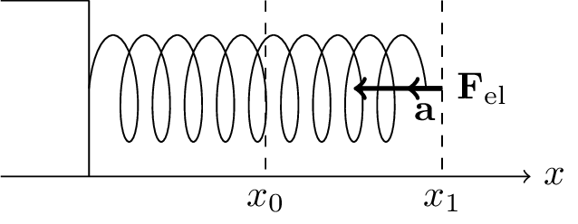
</figure>

Ne risulterà per il secondo principio della dinamica: $$\begin{gathered}
    \boldsymbol{\mathbf{F}}_{\mathrm{el}}=m\boldsymbol{\mathbf{a}}\\
    F_{\mathrm{el}}\hat{\boldsymbol{\mathbf{x}}}=ma\hat{\boldsymbol{\mathbf{x}}}=-k\Delta  \boldsymbol{\mathbf{x}}(t)\hat{\boldsymbol{\mathbf{x}}}\\
    k(x_0-x(t))=m\ddot x(t)\\
    \ddot x(t)=-\displaystyle\frac{k}{m}x(t)+\frac{k}{m}x_0\tag{\stepcounter{equation}\theequation}
\end{gathered}$$

Viene definita la pulsazione della molla $\omega_M^{2}=k/m$, si considera l’origine del sistema di riferimento nel punto $x_0$, per cui $x_0=0$: $$\ddot x(t)=-\omega_M(x(t)-\cancelto{0}{x_0})=-\omega_Mx(t)$$

Quindi il moto di una molla è un moto armonico: $$x(t)=A\sin(\varphi + \omega_Mt)$$ Si considera $x_in$ l’ampiezza della molla nell’istante $t=0$: $x_\mathrm{in}=x'(0)=A\sin\varphi$ Essendo in uno stato di equilibrio nell’istante $t=0$, allora: $$\dot x(0)=\omega_MA\cos\varphi=0\Rightarrow\varphi=\displaystyle\frac{\pi}{2}\Rightarrow x_\mathrm{in}=A$$ L’equazione del moto della molla è quindi: $$x(t)=x_\mathrm{in}\sin\left(\displaystyle\frac{\pi}{2}+\omega_Mt\right)=x_\mathrm{in}\cos(\omega_Mt)$$

La molla oscilla con periodo $T=2\pi/\omega_M$, se l’oscillazione non si smorza nel tempo, continuerà ad oscillare tra $-x_\mathrm{in}$ e $x_\mathrm{in}$:

<figure>
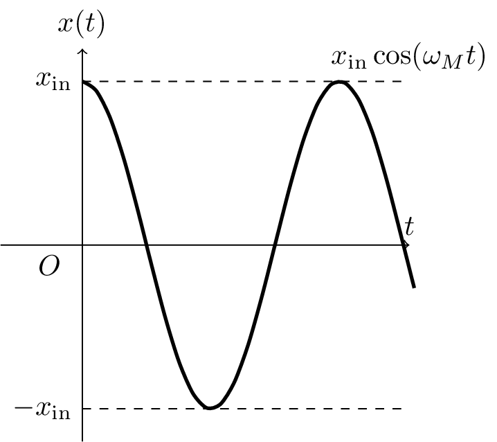
</figure>

### Forza di Attrito Viscoso

Quando un corpo si muove con una velocità $v(t)$ attraverso un fluido, esso risente di una forza di attrito viscoso proporzionale alla velocità del corpo che si oppone al suo spostamento: $\boldsymbol{\mathbf{F}}_\mathrm{vis}=-b\boldsymbol{\mathbf{v}}(t)$. $b$ viene chiamata costante di attrito viscoso, si misura in Newton al secondo per metro $\left[(\mathrm{N}\cdot \mathrm{s})\cdot{\mathrm{m}}^{-1}\right]$.  
Considerando un corpo che si muove dentro un liquido con una velocità iniziale $\boldsymbol{\mathbf{v}}_0=v_{0}\hat{\boldsymbol{\mathbf{y}}}$, per cui il corpo risenti di una forza di attrito viscoso $\boldsymbol{\mathbf{F}}_\mathrm{vis}=-b\boldsymbol{\mathbf{v}}=-bv\hat{\boldsymbol{\mathbf{y}}}$. Se si muovesse anche in un’altra direzione $x$, il corpo sarebbe soggetto ad un attrito viscoso $\boldsymbol{\mathbf{F}}_\mathrm{vis}=-b\boldsymbol{\mathbf{v}}=-bv_x\hat{\boldsymbol{\mathbf{x}}} -bv_y\hat{\boldsymbol{\mathbf{y}}}$.

<figure>
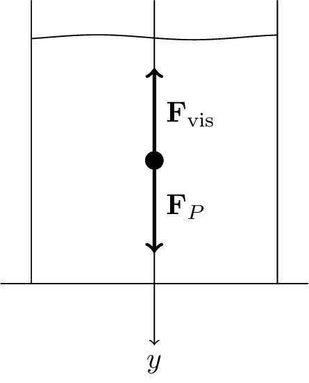
</figure>

$$\begin{gathered}
    \sum\boldsymbol{\mathbf{F}}_y=F_P\hat{\boldsymbol{\mathbf{y}}}+\left|F_\mathrm{vis}\right|(-\hat{\boldsymbol{\mathbf{y}}})=m\dot v(t)\hat{\boldsymbol{\mathbf{y}}}=m\boldsymbol{\mathbf{a}}_y\\
    mg-bv(t)=m\dot v(t)\\
    \mathrm{d}v(t)=\left(g-\displaystyle\frac{b}{m}v(t)\right)\mathrm{d}t\\
    \displaystyle\int_{v_0}^{v(t)}\frac{\mathrm{d}v(\tau)}{g-\displaystyle\frac{b}{m}v(\tau)}=\int_{0}^{t}\mathrm{d}\tau\\
    \displaystyle\frac{b}{m}\left(\ln\left|g-\displaystyle\frac{b}{m} v_0\right|-\ln\left|g-\displaystyle\frac{b}{m} v(t)\right|\right)=t\\
    \displaystyle \ln\left|g-\displaystyle\frac{b}{m}v(t)\right|=\ln\left|g-\displaystyle\frac{b}{m} v_0\right|-t\frac{m}{b}\\
    \left(g-\displaystyle\frac{b}{m} v(t)\right)=\left(g-\frac{b}{m}v_0\right)e^{ -t\frac{m}{b}}\\
    -bv(t)=mge^{ -t\frac{b}{m}}-mg-bv_0e^{ -t\frac{b}{m}}\\
    v(t)=\left(1-e^{\ -t\frac{b}{m}}\right)\displaystyle\frac{m}{b}g+v_0e^{ -t\frac{b}{m}},\:\frac{m}{b}=\tau\\
    v(t)=\tau g\left(1-e^{ -\frac{t}{\tau}}\left(1-\displaystyle\frac{v_0}{\tau g}\right)\right)\tag{\stepcounter{equation}\theequation}
\end{gathered}$$

$\tau$ viene chiamato tempo caratteristico (o costante di tempo) quantifica quanto il corpo accelera lentamente dentro al liquido.

Nell’istante di tempo $t=0$, la velocità del corpo sarà: $$v(0)=\tau g\left(1-e^{ -\frac{0}{\tau}}\left(1-\displaystyle\frac{v_0}{\tau g}\right)\right)=v_0$$ Mentre avrà un valore limite $v_{\lim}$ tale che: $$\begin{gathered}
    \sum\boldsymbol{\mathbf{F}}_y=\boldsymbol{\mathbf{0}}\\
     mg\hat{\boldsymbol{\mathbf{y}}}-b(v_{\lim}-v_0)\hat{\boldsymbol{\mathbf{y}}}=0\hat{\boldsymbol{\mathbf{y}}}\\
    v_{\lim}=\tau g +v_0\tag{\stepcounter{equation}\theequation}
\end{gathered}$$

<figure>

</figure>

## Oscillatore Armonico

Un oscillatore armonico è un oggetto composto da una molla e da una massa ad essa collegata. La massa si muove di moto oscillatorio semplice: $$x(t)=x_\mathrm{in}\sin\left(\omega_Mt+\displaystyle\frac{\pi}{2}\right)$$ Oscilla con una frequenza $\nu_M=\omega_M/2\pi$. Si scegli un sistema di riferimento dove la posizione di riposo della molla coincide con l’origine degli assi.

<figure>

</figure>

### Moto Oscillatorio con Attrito Viscoso

Se la massa attaccata al corpo è soggetta ad un attrito viscoso allora: $$\begin{gathered}
    \sum\boldsymbol{\mathbf{F}}_x=m\boldsymbol{\mathbf{a}}_x\\
    \boldsymbol{\mathbf{F}}_{\mathrm{el}}+\boldsymbol{\mathbf{F}}_\mathrm{vis}=m\boldsymbol{\mathbf{a}}_x\\
    -kx(t)-b\dot x(t)=m\ddot x(t)\\
    \ddot x(t) +\displaystyle\frac{b}{m}\dot x(t) +\frac{k}{m}x(t)=0\tag{\stepcounter{equation}\theequation}
\end{gathered}$$ L’equazione del moto del corpo è un’equazione differenziale di secondo ordine e primo grado, la soluzione di questo tipo di equazione si trova considerando: $$\begin{gathered}
    \ddot y + a \dot y+y=0\\
    \lambda^{2}+a\lambda+b=0\\
    \begin{cases}
        \displaystyle y(t)=Ae^{\lambda_1t}+Be^{\lambda_2t}&A,B\in\mathbb{R}\:\:\:\Delta > 0\\
        \displaystyle y(t)=Ae^{\lambda t}+Bte^{\lambda t}&A,B\in\mathbb{R}\:\:\:\Delta = 0\\
        \displaystyle y(t)=Ce^{(\Re(\lambda_1)+i\Im(\lambda_1))t} + De^{(\Re(\lambda_2)+i\Im(\lambda_2))t}&C,D\in\mathbb{C}\:\:\:\Delta < 0
    \end{cases}
\end{gathered}$$

$b/2m$ viene chiamato tempo caratteristico $\gamma$ e ${k}/{m}$ la pulsazione della molla $\omega_M^{2}$: $$\ddot x(t)+2\gamma\dot x(t)+\omega_M^{2}x(t)=0$$ Se il polinomio caratteristico ha due soluzioni complesse, la massa tende al punto di riposo, oscillando. Se ha due soluzioni reali, la massa tende alla posizione di riposo senza oscillare.  
Se è rispettata la seguente espressione: $$\Delta=1-\displaystyle\frac{\omega_M^{2}}{\gamma^{2}} <0\Rightarrow \gamma^{2} < \omega_M^{2}$$ Allora la massa oscilla fino alla posizione di riposo, le due soluzioni del polinomio caratteristico sono: $$\begin{gathered}
    \lambda_{1,2}=-\gamma\pm\gamma\sqrt{1-\displaystyle\frac{\omega_M^{2}}{\gamma^{2}}}=-\gamma\pm i\Omega
\end{gathered}$$ La soluzione dell’equazione differenziale è quindi: $$\begin{gathered}
    \displaystyle x(t)=C_1e^{\left(-\gamma+ i\Omega\right)t}+C_2e^{\left(-\gamma- i\Omega\right)t}\\
    x(t)=e^{-\gamma t}\left(C_1e^{i\Omega t}+C_2e^{-i\Omega t}\right)
\end{gathered}$$ Poiché $C_1,C_2\in\mathbb{C}$, mentre la posizione $x(t)$ è una funzione $x:\mathbb{R}^+\to\mathbb{R}$: $$\begin{gathered}
    x(t)\in\mathbb{R}\Rightarrow \Im(x(t))=0\\
    \Im\left(e^{-\gamma t}(C_1\cos(\Omega t)+iC_1\sin(\Omega t)+C_2\cos(\Omega t)-iC_2\sin(\Omega t))\right)=0\\
    \begin{cases}
        \Im((C_1+C_2)\cos(\Omega t))=0\\
        \Re(i(C_1-C_2)\sin(\Omega t))=0
    \end{cases}\\ 
    \begin{cases}
        \Im(C_1+C_2)=0\Rightarrow \Im(C_1)=-\Im(C_2)\\
        \Re(C_1-C_2)=0\Rightarrow \Re(C_1)=\Re(C_2)
    \end{cases}\\ 
    C_1=C_2^{*}=Ae^{i\varphi}
\end{gathered}$$ Allora l’equazione del moto è: $$\begin{gathered}
    x(t)=e^{-\gamma t}(C_1e^{i\Omega t}+C_1^*e^{-i\Omega t})\\
    x(t)=2Ae^{-\gamma t}\left(\displaystyle\frac{e^{i(\Omega t+\varphi)}+e^{-i(\Omega t+\varphi)}}{2}\right)\\
    x(t)=2Ae^{-\gamma t}\cos\left(\Omega t +\varphi\right)\tag{\stepcounter{equation}\theequation}
\end{gathered}$$ Se consideriamo la massa in uno stato di quiete nell’istante di tempo $t=0$ allora: $$\begin{gathered}
    x(0)=x_\mathrm{in}=2A\cos(\varphi)\\
    \dot x(0)=-2A\Omega \sin(\varphi)=0\\
    \varphi=0\\
    x_\mathrm{in}=2A\cos(0)=2A\\
    A=\displaystyle\frac{x_\mathrm{in}}{2}
\end{gathered}$$ La legge oraria del moto, con un’oscillazione di semiperiodo $T={2\pi}/{\Omega}$, è: $$x(t)=x_\mathrm{in}e^{-\gamma t}\cos(\Omega t)$$

<figure>
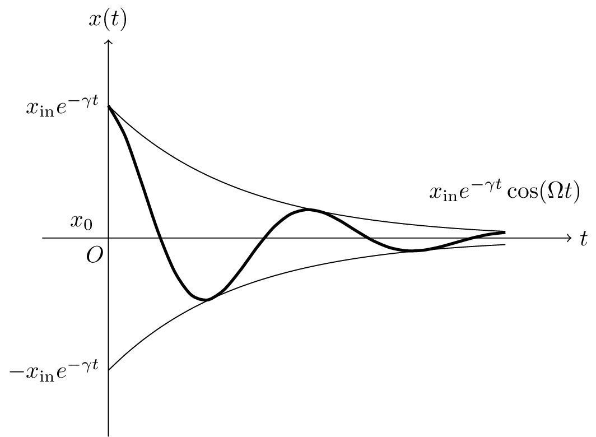
</figure>

Se $\gamma^{2}<\omega_M^{2}$, allora l’oscillazione è fortemente smorzata e la legge oraria della posizione è: $$x(t)=Ae^{\lambda_1t}+Be^{\lambda_2t}$$ Considerando la massa in quiete nell’istante di tempo $t=0$: $$\begin{gathered}
    x_\mathrm{in}=x(0)=A+B\\
    \dot x(0)=A\lambda_1+B\lambda_2=0=-\gamma(A+B)+\sqrt{\Delta}(A-B)\\
    \displaystyle\frac{\gamma}{\sqrt{\Delta}}x_\mathrm{in}+B=A\\
    B=\displaystyle\frac{1}{2}x_\mathrm{in}\left(1-\displaystyle\frac{\gamma}{\sqrt{\Delta}}\right)\\
    A=\displaystyle\frac{1}{2}x_\mathrm{in}\left(1+\displaystyle\frac{\gamma}{\sqrt{\Delta}}\right)
\end{gathered}$$ La legge oraria è quindi: $$x(t)=\displaystyle\frac{1}{2}x_\mathrm{in}\left(1+\displaystyle\frac{\gamma}{\sqrt{\Delta}}\right)e^{\lambda_1t}+\displaystyle\frac{1}{2}x_\mathrm{in}\left(1-\displaystyle\frac{\gamma}{\sqrt{\Delta}}\right)e^{\lambda_2t}$$

<figure>
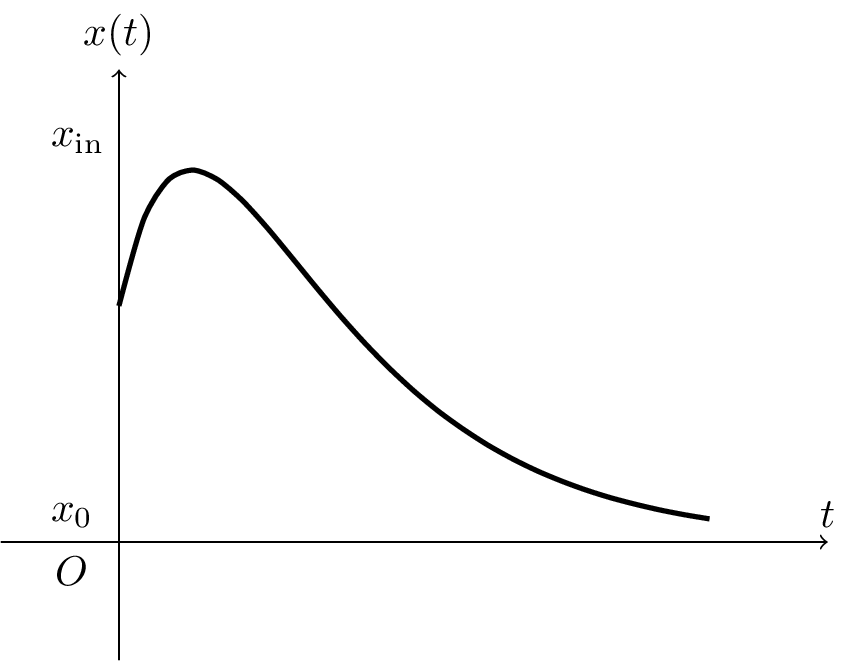
</figure>

### Moto Oscillatorio con Attrito Viscoso ed una Forzante

Se viene applicata una forzante $F(t)=\displaystyle\frac{F_0}{m}\sin(\omega_f t)$ al corpo, il moto è descritto da: $$\ddot x(t)+2\gamma\dot x(t)+\omega_M^{2}x(t)=\displaystyle\frac{F_0}{m}\sin(\omega_f t)$$ La soluzione particolare $x_p(t)$ dell’equazione si ottiene considerando: $$\begin{gathered}
    \begin{cases}
        x_p(t)=A\sin(\omega_f t+\varphi)\\
        \dot x_p(t)=A\omega_f\cos(\omega_f t+\varphi)\\
        \ddot x_p(t)=-A\omega_f^{2}\sin(\omega_f t+\varphi)
    \end{cases}\\
    -A\omega_f^{2}\sin(\omega_f t+\varphi)+
    2A\omega_f\gamma \cos(\omega_f t+\varphi)+
    A\omega_M^{2}\sin(\omega_f t+\varphi)=\displaystyle\frac{F_0}{m}\sin(\omega_f t)
\end{gathered}$$ Espandendo la somma dei coseni e seni si ottiene: $$\begin{gathered}
    -A\omega_f^{2}(\sin(\omega_f t)\cos\varphi+\sin\varphi \cos(\omega_f t))+
    2A\omega_f\gamma(\cos(\omega t)\cos\varphi-\sin(\omega t)\sin\varphi)+\\
    A\omega_M^{2}(\sin(\omega_f t)\cos\varphi+\sin\varphi \cos(\omega_f t))=\displaystyle\frac{F_0}{m}\sin(\omega_f t)\\
    \begin{cases}
        \sin(\omega_f t)((\omega_M^{2}-\omega_f^{2})A\cos\varphi-2A\omega_f\gamma \sin\varphi)=\displaystyle\frac{F_0}{m}\sin(\omega_f t)\\
        \cos(\omega_f t)((\omega_M^{2}-\omega_f^{2})A\sin\varphi+2A\omega_f\gamma \cos\varphi)=0
    \end{cases}\\
    \begin{cases}
        (\omega_M^{2}-\omega_f^{2})A\cos\varphi-2A\omega_f\gamma \sin\varphi=\displaystyle\frac{F_0}{m}\\
        (\omega_M^{2}-\omega_f^{2})A\sin\varphi+2A\omega_f\gamma \cos\varphi=0\Rightarrow\displaystyle \tan\varphi=-\frac{2\omega_f\gamma}{(\omega_M^{2}-\omega_f^{2})}
    \end{cases}\\
    \begin{cases}
        \displaystyle A\frac{\omega_M^{2}-\omega_f^{2}}{\sqrt{1+\left(-\frac{2\omega_f\gamma}{(\omega_M^{2}-\omega_f^{2})}\right)^{2}}}-2A\omega_f\gamma\sqrt{1-\left(\displaystyle\frac{1}{\sqrt{1+\left(-\frac{2\omega_f\gamma}{(\omega_M^{2}-\omega_f^{2})}\right)^{2}}}\right)^{2}}=\frac{F_0}{m}\\
        \displaystyle\frac{1}{\sqrt{1+\left(-\frac{2\omega_f\gamma}{(\omega_M^{2}-\omega_f^{2})}\right)^{2}}}=\cos\varphi
    \end{cases}\\
    \begin{cases}
        A\left(\displaystyle\frac{(\omega_M^{2}-\omega_f^{2})^{2}+4\omega_f^{2}\gamma^{2}}{\sqrt{(\omega_M^{2}-\omega_f^{2})^{2}+4\omega_f^{2}\gamma^{2}}}\right)=A\sqrt{(\omega_M^{2}-\omega_f^{2})^{2}+4\omega_f^{2}\gamma^{2}}=\displaystyle\frac{F_0}{m} \\
        \tan\varphi=-\displaystyle\frac{2\omega_f\gamma}{(\omega_M^{2}-\omega_f^{2})}
    \end{cases}\\
    A(\omega_f)=\frac{F_0}{m}\frac{1}{\sqrt{(\omega_M^{2}-\omega_f^{2})^{2}+4\omega_f^{2}\gamma^{2}}}\tag{\stepcounter{equation}\theequation}
\end{gathered}$$ L’ampiezza della soluzione particolare $x_p(t)$ dipenderà dalla pulsazione della forzante, della molla e dal tempo caratteristico: $x_p(t)=A(\omega_f)\sin(\omega_f t+\varphi)$.  
Se i valori della costante di tempo $\gamma\approx0$ allora l’ampiezza in funzione della pulsazione della forzante diventa: $$A(\omega_f)\approx\displaystyle\frac{F_0}{m}\frac{1}{\omega_M^{2}-\omega_f^{2}}$$ Quando la forza agente sul corpo ha una pulsazione $\omega_f\in I_{\omega_M}(\delta)$ allora l’ampiezza tende ad aumentare all’infinito: si verifica il fenomeno della risonanza. Per valori di $\gamma$ vicini allo zero, è presente il fenomeno di risonanza, ma con ampiezza minore:

<figure>

</figure>

## Moti Relativi e Forze Apparenti

Le leggi fisiche non dipendono dal sistema di riferimento, mentre le espressioni matematiche dipendono dal sistema di coordinate scelto per l’analisi. Considerando un altro sistema di riferimento, cambierà l’espressione in coordinate del comportamento di un corpo interno al sistema.

<figure>
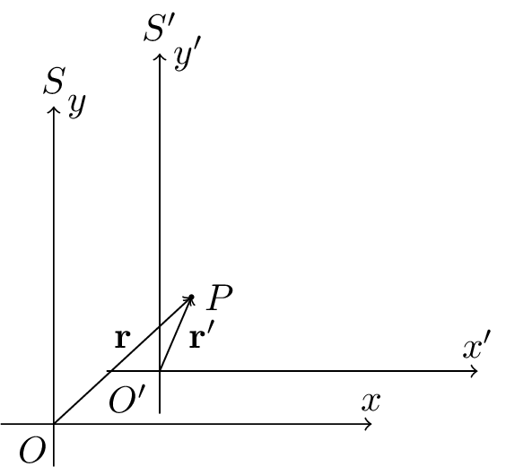
</figure>

### Sistemi Inerziali

Per il primo principio della dinamica è impossibile poter determinare sperimentalmente se il sistema di riferimento dove avviene la misura sia in quiete o in moto rettilineo uniforme rispetto ad un osservatore esterno.

Questo tipo di sistema di riferimento viene definito inerziale, per cui ogni altro sistema di riferimento in moto rettilineo uniforme rispetto ad un sistema inerziale, è anch’esso un sistema di riferimento inerziale. In un sistema di riferimento inerziale vale rigorosamente la legge d’inerzia, ovvero un punto materiale, non soggetto a forze, rimane in moto rettilineo uniforme, oppure, se è in quiete, rimane in quiete.

Per attuare un cambiamento di coordinate da un sistema ad un altro si considera la distanza tra le due origini $\boldsymbol{\mathbf{R}}=\left|\overline{OO'}\right|\hat{\boldsymbol{\mathbf{R}}}$, e la velocità del sistema $S'$ rispetto ad $S$ $\boldsymbol{\mathbf{V}}$: $$\begin{cases}
        \boldsymbol{\mathbf{r}}=\boldsymbol{\mathbf{r}}'+\boldsymbol{\mathbf{R}}\\
        \boldsymbol{\mathbf{v}}=\displaystyle\frac{\mathrm{d}\boldsymbol{\mathbf{r}}\strut }{\mathrm{d}t\strut }=\frac{\mathrm{d}\boldsymbol{\mathbf{r}}\strut }{\mathrm{d}t\strut }+\frac{\mathrm{d}\boldsymbol{\mathbf{R}}\strut }{\mathrm{d}t\strut }=\boldsymbol{\mathbf{v}}'+\boldsymbol{\mathbf{V}}\\
        \boldsymbol{\mathbf{a}}=\displaystyle\frac{\mathrm{d}\boldsymbol{\mathbf{v}}\strut }{\mathrm{d}t\strut }=\frac{\mathrm{d}\boldsymbol{\mathbf{v}}'\strut }{\mathrm{d}t\strut }+\frac{\mathrm{d}\boldsymbol{\mathbf{V}}\strut }{\mathrm{d}t\strut }=\boldsymbol{\mathbf{a}}'+\boldsymbol{\mathbf{0}}=\boldsymbol{\mathbf{a}}'
    \end{cases}$$ Questo tipo di trasformazioni, tra sistemi di riferimento inerziali, vengono definite trasformazioni galileiane.

Anche i versori delle componenti vettoriali potrebbero variare nel tempo a causa del moto del sistema $S'$ rispetto a $S$. In quel caso sarà presente un’accelerazione $A$ del sistema $S'$ a causa del cambio di direzione della velocità, causato dal cambio di direzione dei vettori componenti.

Considerando il sistema inerziale $S'$, non avendo un’accelerazione relativa a $S$ allora anche la forza risultante agente su un corpo, descritta in entrambi i sistemi di riferimento sarà uguale. Per cui per ogni sistema di riferimento inerziale, agiranno le stesse forze, espressioni delle stesse interazioni fisiche. Essendo presenti le stesse forze in ogni sistema di riferimento inerziale non è possibile determinare se un sistema inerziale si muova di moto rettilineo uniforme o si trovi in uno stato di quiete. Questo concetto viene descritto con il termine relatività galileiana. $$\boldsymbol{\mathbf{F}}_\mathrm{tot}=\boldsymbol{\mathbf{F}}'_\mathrm{tot}$$

<figure>
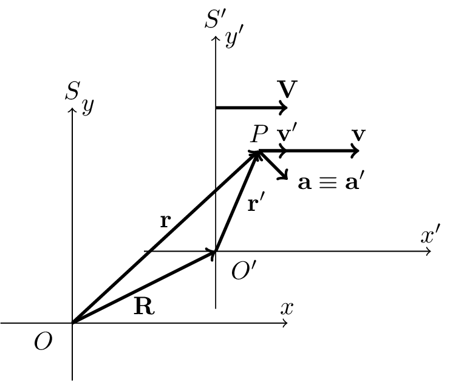
</figure>

### Sistemi non Inerziali

Se un sistema si muove di moto rettilineo non uniforme, rispetto ad un altro, allora i due sistemi non sono inerziali tra di loro. $S'$ avrà un’accelerazione $\boldsymbol{\mathbf{A}}$ relativa al sistema $S$, le espressioni per il cambio di coordinate saranno: $$\begin{gathered}
    \begin{cases}
        \boldsymbol{\mathbf{r}}=\boldsymbol{\mathbf{r}}'+\boldsymbol{\mathbf{R}}\\
        \boldsymbol{\mathbf{v}}=\boldsymbol{\mathbf{v}}'+\boldsymbol{\mathbf{V}}\\
        \boldsymbol{\mathbf{a}}=\boldsymbol{\mathbf{a}}'+\boldsymbol{\mathbf{A}}
    \end{cases}
\end{gathered}$$ Poiché cambia l’accelerazione del corpo, cambierà anche la sua forza risultante. Le forze misurate nei sistemi di riferimento inerziali vengono chiamate forze vere, poiché possono essere calcolate sulla base delle interazioni fondamentali. In un sistema di riferimento non inerziale il valore della forza misurato differisce dal valore calcolato sulla base delle interazioni fondamentali, per cui si devono considerare altre forze per ritornare alla rappresentazione del secondo principio. Queste forze apparenti sono interamente dovute alla scelta del sistema di riferimento, possono essere calcolate esprimendo l’accelerazione, misurata nel sistema inerziale, nel sistema non inerziale: $$\begin{gathered}
    m\boldsymbol{\mathbf{a}}=m(\boldsymbol{\mathbf{a}}+\boldsymbol{\mathbf{A}})\\
    m\boldsymbol{\mathbf{a}}'=m\boldsymbol{\mathbf{a}}-m\boldsymbol{\mathbf{A}}\\
    \boldsymbol{\mathbf{F}}'_\mathrm{tot}=\boldsymbol{\mathbf{F}}_\mathrm{tot}-m\boldsymbol{\mathbf{A}}\tag{\stepcounter{equation}\theequation}
\end{gathered}$$ $m\boldsymbol{\mathbf{A}}$ rappresenta questa forza apparente. Queste forze presenti solo nei sistemi di riferimento non inerziali vengono definite forze di inerzia, non dipendono da interazioni fondamentali.

### Sistemi non Inerziali con Rotazione e Trascinamento

Se il sistema $S'$ non inerziale ruota intorno intorno al centro del sistema $S$ con velocità angolare $\boldsymbol{\mathbf{\omega}}$, allora anche i versori cambieranno rispetto al tempo:

$$\begin{gathered}
    \boldsymbol{\mathbf{r}}=\boldsymbol{\mathbf{r}}'+\boldsymbol{\mathbf{R}}=r'\hat{\boldsymbol{\mathbf{r}}}'+\boldsymbol{\mathbf{R}}\tag{\stepcounter{equation}\theequation}\\
    \boldsymbol{\mathbf{v}}=\displaystyle\frac{dr'}{\mathrm{d}t}\hat{\boldsymbol{\mathbf{r}}}'+r'\frac{\mathrm{d}\hat{\boldsymbol{\mathbf{r}}}'}{\mathrm{d}t}+\frac{\mathrm{d}\boldsymbol{\mathbf{R}}}{\mathrm{d}t}\\
    v'\hat{\boldsymbol{\mathbf{r}}}'+r'\boldsymbol{\mathbf{\omega}}\times\hat{\boldsymbol{\mathbf{r}}}+\boldsymbol{\mathbf{V}}
\end{gathered}$$ Per la formula di Poisson si calcola la derivata temporale del versore $\hat{\boldsymbol{\mathbf{r}}}$. Come in un moto circolare presenta una velocità tangenziale $\boldsymbol{\mathbf{\omega}}\times\boldsymbol{\mathbf{r}}'$, ma a differenza di un moto circolare dove il raggio è costante, presenta anche una velocità perpendicolare $v\hat{\boldsymbol{\mathbf{r}}}'$ dovuta all’avvicinamento o allontanamento tra i due sistema di riferimento. $$\begin{gathered}
    \boldsymbol{\mathbf{v}}'+\boldsymbol{\mathbf{\omega}}\times\boldsymbol{\mathbf{r}}'+\boldsymbol{\mathbf{V}}\tag{\stepcounter{equation}\theequation}\\
    \boldsymbol{\mathbf{a}}=\displaystyle\frac{\mathrm{d}\boldsymbol{\mathbf{v}}}{\mathrm{d}t}=\frac{\mathrm{d}\boldsymbol{\mathbf{v}}'}{\mathrm{d}t}+\frac{\mathrm{d}(\boldsymbol{\mathbf{\omega}}\times\boldsymbol{\mathbf{r}}')}{\mathrm{d}t}+\frac{\mathrm{d}\boldsymbol{\mathbf{V}}}{\mathrm{d}t}\\
    \boldsymbol{\mathbf{a}}'+\boldsymbol{\mathbf{\omega}}\times\boldsymbol{\mathbf{v}}'+\displaystyle\frac{\mathrm{d}\boldsymbol{\mathbf{\omega}}}{\mathrm{d}t}\times\boldsymbol{\mathbf{r}}'+\boldsymbol{\mathbf{\omega}}\times\frac{\mathrm{d}\boldsymbol{\mathbf{r}}'}{\mathrm{d}t}+\boldsymbol{\mathbf{A}}\\
    \boldsymbol{\mathbf{a}}'+\boldsymbol{\mathbf{\omega}}\times\boldsymbol{\mathbf{v}}'+\boldsymbol{\mathbf{\alpha}}\times\boldsymbol{\mathbf{r}}'+\boldsymbol{\mathbf{\omega}}\times(\boldsymbol{\mathbf{v}}'+\boldsymbol{\mathbf{\omega}}\times\boldsymbol{\mathbf{v}}')+\boldsymbol{\mathbf{A}}\\
    \boldsymbol{\mathbf{a}}'+2\boldsymbol{\mathbf{\omega}}\times\boldsymbol{\mathbf{v}}'+\boldsymbol{\mathbf{\alpha}}\times\boldsymbol{\mathbf{r}}'+\boldsymbol{\mathbf{\omega}}\times(\boldsymbol{\mathbf{\omega}}\times\boldsymbol{\mathbf{r}}')+\boldsymbol{\mathbf{A}}\tag{\stepcounter{equation}\theequation}
\end{gathered}$$

Viene definita l’accelerazione di trascinamento dovuta al moto circolare e di traslazione di $S'$ intorno al centro $O$ e ad alla posizione del corpo nel sistema $S'$:

$$\boldsymbol{\mathbf{a}}_\mathrm{tr}=\boldsymbol{\mathbf{A}}+\boldsymbol{\mathbf{\alpha}}\times\boldsymbol{\mathbf{r}}'+\boldsymbol{\mathbf{\omega}}\times(\boldsymbol{\mathbf{\omega}}\times\boldsymbol{\mathbf{r}}')$$

Dove $\boldsymbol{\mathbf{\omega}}\times(\boldsymbol{\mathbf{\omega}}\times\boldsymbol{\mathbf{r}}')$ viene definita accelerazione centrifuga. Viene definita accelerazione di Coriolis dovuta al moto del corpo nel sistema $S'$, e alla rotazione del sistema $S'$ rispetto a $S$:

$$\boldsymbol{\mathbf{a}}_C=2\boldsymbol{\mathbf{\omega}}\times\boldsymbol{\mathbf{v}}'$$

In generale il moto di un corpo in $S'$ analizzato rispetto al sistema di riferimento $S$ sarà dato da:

$$\begin{cases}
        \boldsymbol{\mathbf{r}}=\boldsymbol{\mathbf{r}}'+\boldsymbol{\mathbf{R}}\\
        \boldsymbol{\mathbf{v}}=\boldsymbol{\mathbf{v}}'+\boldsymbol{\mathbf{\omega}}\times\boldsymbol{\mathbf{r}}'+\boldsymbol{\mathbf{V}}\\
        \boldsymbol{\mathbf{a}}=\boldsymbol{\mathbf{a}}'+\boldsymbol{\mathbf{a}}_\mathrm{tr}+\boldsymbol{\mathbf{a}}_C
    \end{cases}$$

Se il corpo è soggetto ad una forza $\boldsymbol{\mathbf{F}}_\mathrm{tot}$ nel sistema $S$, allora in $S'$ sarà soggetto ad una forza:

$$\boldsymbol{\mathbf{F}}'_\mathrm{tot}=m(\boldsymbol{\mathbf{a}}-\boldsymbol{\mathbf{a}}_\mathrm{tr}-\boldsymbol{\mathbf{a}}_C)=\boldsymbol{\mathbf{F}}_\mathrm{tot}-\boldsymbol{\mathbf{F}}_\mathrm{tr}-\boldsymbol{\mathbf{F}}_C$$

Se il sistema $S'$ si muove di solo moto rotatorio attorno al sistema inerziale $S$: $$\begin{cases}
        \boldsymbol{\mathbf{r}}=\boldsymbol{\mathbf{r}}'+\boldsymbol{\mathbf{R}}\\
        \boldsymbol{\mathbf{v}}=\boldsymbol{\mathbf{v}}'+\boldsymbol{\mathbf{\omega}}\times\boldsymbol{\mathbf{r}}'\\
        \boldsymbol{\mathbf{a}}=\boldsymbol{\mathbf{\alpha}}\times\boldsymbol{\mathbf{r}}'+\boldsymbol{\mathbf{\omega}}\times(\boldsymbol{\mathbf{\omega}}\times\boldsymbol{\mathbf{r}}')+2\boldsymbol{\mathbf{\omega}}\times\boldsymbol{\mathbf{v}}'
    \end{cases}$$ Se ruota con una velocità angolare $\boldsymbol{\mathbf{\omega}}$ costante, allora la componente $\boldsymbol{\mathbf{\alpha}}\times\boldsymbol{\mathbf{r}}'$ sarà nulla. Il sistema $S'$ si può muovere di moto di trascinamento o rotatorio o rototraslatorio rispetto al sistema $S$. È inerziale solo se si muove di moto trascinamento rettilineo uniforme, in tutti gli altri casi il sistema $S'$ non è inerziale.

## Energia

### Lavoro

Il lavoro è una grandezza fisica, misurata in Joule $\left[\mathrm{J}\right]$, che quantifica la forza $\boldsymbol{\mathbf{F}}$ necessaria per compiere un certo spostamento $\Delta s$:

$$W=\boldsymbol{\mathbf{F}}\cdot\Delta\boldsymbol{\mathbf{s}}=F\Delta s\cos\theta\:\left[\mathrm{N}\cdot \mathrm{s}\right]=\left[\mathrm{J}\right]$$

Il lavoro lega diversi stati in cui si puoi trovare il corpo, indipendentemente dal tempo. Il lavoro dipende dalla solo componente della forza parallela allo spostamento. Se la forza è concorde allo spostamento $\theta<{\pi}/{2}$, il punto materiale su cui è applicata la forza accelera, il lavoro generato risulta positivo e viene chiamato lavoro motore. Se la forza applicata è discorde allo spostamento $\theta>{\pi}/{2}$, il punto decelera, il lavoro generato risulta negativo e viene chiamato lavoro resistente. Se la forza applicata è perpendicolare allo spostamento, la velocità del punto rimane costante, genera un’accelerazione centripeta ed il lavoro risulta nullo.

Se lo spostamento è una traiettoria curva, si considera la traiettoria divisa in segmenti $\Delta s$, su cui si applica la forza $\boldsymbol{\mathbf{F}}$. Il lavoro totale sarà allora dato dalla somma di tutti i lavori su ogni segmento della traiettoria. Se il numero di segmenti tende all’infinito $n\to\infty$ allora i segmenti diventeranno di lunghezza infinitesima, e la sommatoria diventa un integrale lungo la traiettoria $\Gamma$:

$$\begin{gathered}
    \displaystyle W_{A\to B}\approx\sum_{i=0}^{n}\boldsymbol{\mathbf{F}}\cdot\Delta\boldsymbol{\mathbf{s}}_i\\
    W_{A\to B}=\lim_{n\to\infty}\sum_{i=0}^{n}\boldsymbol{\mathbf{F}}\cdot\hat{\boldsymbol{\mathbf{s}}}_i{\Delta s_i}=\int_{A}^{B}\boldsymbol{\mathbf{F}}\cdot\hat{\boldsymbol{\mathbf{s}}}\mathrm{d}s=\int_{A}^{B}F_s\mathrm{d}s\tag{\stepcounter{equation}\theequation}
\end{gathered}$$

Dove $F_s$ è il modulo della componente della forza parallela all’asse curvilineo $s$, coincidente alla traiettoria $\Gamma$ del corpo nello spostamento dal punto $A$ al punto $B$. Considerando lo spostamento come variazione di posizione del corpo lungo l’intera traiettoria:

$$\displaystyle W_{\Gamma}=\int_{\Gamma}\boldsymbol{\mathbf{F}}\cdot \mathrm{d}\boldsymbol{\mathbf{r}}$$

<figure>
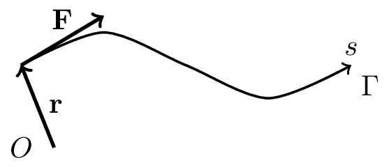
</figure>

Il lavoro totale può compensarsi lungo l’intera traiettoria:

<figure>
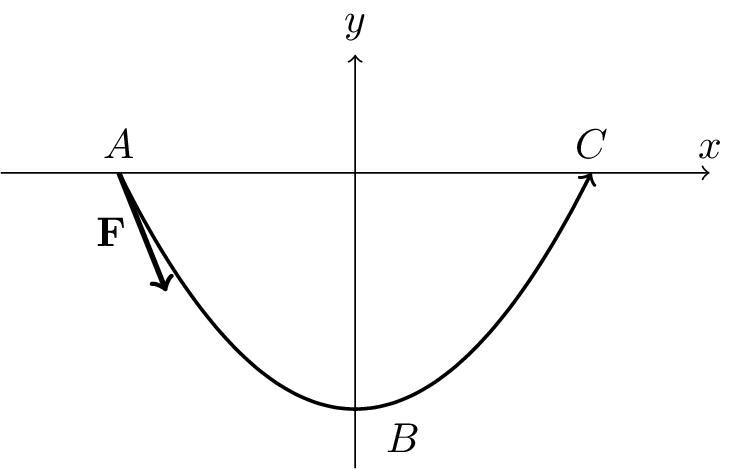
</figure>

Il lavora complessivo sarà dato dalla somma dei lavori sulle due traiettorie $A\to B$ e $B\to C$: $W_{A\to C}=W_{A\to B}+W_{B\to C}$.

Se la forza $\boldsymbol{\mathbf{F}}$ agente sul corpo è conservativa, allora il lavoro da $A$ a $B$ sarà uguale e contrario del lavoro da $B$ a $C$, quindi il lavoro complessivo sarà nullo.  
Se agiscono più forze sul corpo, il lavoro sarà dato dal lavoro della risultante, quindi dalla risultante dei lavori: $$W_{\Gamma}=\displaystyle\int_{\Gamma}\boldsymbol{\mathbf{F}}_\mathrm{tot}\mathrm{d}\boldsymbol{\mathbf{r}}=\sum_{i=1}^{n}\int_{\Gamma}\boldsymbol{\mathbf{F}}_i\mathrm{d}\boldsymbol{\mathbf{r}}=\sum_{i=1}^{n}W_i$$

Dato un sistema di riferimento $\mathrm{d}\boldsymbol{\mathbf{r}}=\hat{\boldsymbol{\mathbf{s}}}\mathrm{d}s$, si potrà scomporre la forza agente sul corpo come: $\boldsymbol{\mathbf{F}}=F_{\parallel}\hat{\boldsymbol{\mathbf{s}}}+F_{\perp}\hat{\boldsymbol{\mathbf{s}}}_{\perp}$ il lavoro risultante sarà quindi: $$W=\int_{s_A}^{s_B}\boldsymbol{\mathbf{F}}\mathrm{d}\boldsymbol{\mathbf{r}}=\int_{s_A}^{s_B}F_{\parallel}\hat{\boldsymbol{\mathbf{s}}}\cdot\hat{\boldsymbol{\mathbf{s}}}+F_{\perp}\cancelto{0}{\hat{\boldsymbol{\mathbf{s}}}_{\perp}\cdot\hat{\boldsymbol{\mathbf{s}}}}\mathrm{d}s=\int_{s_A}^{s_B}F_{\parallel}\mathrm{d}s$$

### Forze Conservative

Considerando un corpo di massa $m$ che cade, esso sarà soggetto ad una forza peso $\boldsymbol{\mathbf{F}}_P=mg(-\hat{\boldsymbol{\mathbf{z}}})$, che causa uno spostamento lungo l’asse $z$, il suo lavoro sarà: $$\begin{gathered}
    W_{A\to B}=\displaystyle\int_{\boldsymbol{\mathbf{r}}_A}^{\boldsymbol{\mathbf{z}}_B}\boldsymbol{\mathbf{F}}_P\cdot \mathrm{d}\boldsymbol{\mathbf{r}}\\
    \displaystyle\int_{z_A}^{z_B}mg(-\hat{\boldsymbol{\mathbf{z}}})(\mathrm{d}x\hat{\boldsymbol{\mathbf{x}}}+\mathrm{d}y\hat{\boldsymbol{\mathbf{y}}}+\mathrm{d}z\hat{\boldsymbol{\mathbf{z}}})\\
    \displaystyle-\int_{z_A}^{z_B}mg \mathrm{d}z=-mg\Delta z\\
    W_{A\to B}=-mg\Delta z\tag{\stepcounter{equation}\theequation}
\end{gathered}$$

Se la variazione di quota è negativa, allora il corpo scende e la forza peso avrà un lavoro positivo, mentre se la variazione di quota è positiva il corpo sale e avrà lavoro negativo.

<figure>
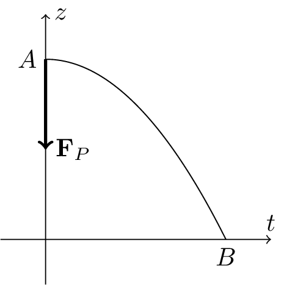
</figure>

Considerando un oscillatore armonico armonico senza attrito, la massa sarà soggetta ad una forza elastica $\boldsymbol{\mathbf{F}}_{\mathrm{el}}$ che causerà uno spostamento lungo l’asse $x$, con un certo lavoro.

<figure>
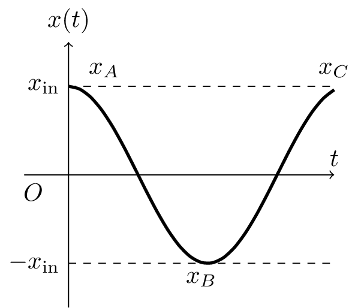
</figure>

Il lavoro dello spostamento $x_A\to x_C$ è nullo, poiché la molla ritorna alla stessa posizione iniziale. Il lavoro $W_{A\to B}$ sarà: $$W_{A\to B}=\displaystyle\int_{x_A}^{x_B}\boldsymbol{\mathbf{F}}_{\mathrm{el}}\cdot\hat{\boldsymbol{\mathbf{x}}}\mathrm{d}x=\int_{x_A}^{x_B}-kx \mathrm{d}x=-k\frac{\Delta( x^{2})}{2}$$

La forza peso e la forza elastica sono due forze conservative, in generale una forza conservativa è una forza, che produce un lavoro indipendente dal percorso effettuato, dipende solo dalla differenza degli stati iniziali e finali del corpo. Per cui si può esprimere il lavoro come la differenza di una funzione di stato $-U(\boldsymbol{\mathbf{r}})$, primitiva della funzione $\boldsymbol{\mathbf{F}}(\boldsymbol{\mathbf{r}})$, chiamata energia potenziale. Il lavoro generato da una qualsiasi forza conservativa lungo la traiettoria $\Gamma$ dal punto $A$ al punto $B$ sarà quindi dato da: $$W_{A\to B}=\displaystyle\int_{\Gamma_{AB}}\boldsymbol{\mathbf{F}}\cdot \mathrm{d}\boldsymbol{\mathbf{r}}=-\left(U_B-U_A\right)=-\Delta U_{AB}$$

Se una forza è conservativa il lavoro sarà dato da una differenza di due stati, per cui la componente $\boldsymbol{\mathbf{F}}\cdot \mathrm{d}\boldsymbol{\mathbf{r}}$ rappresenterà un differenziale esatto $\mathrm{d}W$, per cui si avrà: $$W_{A\to B}=\displaystyle\int_{\Gamma_{AB}}\boldsymbol{\mathbf{F}}\cdot  \mathrm{d}\boldsymbol{\mathbf{r}}=\int_{\Gamma_{AB}}\mathrm{d}W=-\Delta U_{AB}$$

Se la forza non è conservativa allora il componente $\boldsymbol{\mathbf{F}}\cdot \mathrm{d}\boldsymbol{\mathbf{r}}$ rappresenterà un differenziale inesatto $\delta W$, poiché l’integrale dipenderà dal percorso e non dalla differenza di due stati.  
Una forza è conservativa se il lavoro compiuto non dipende dal percorso compiuto dallo spostamento, se indipendentemente dal percorso il lavoro complessivo per compiere uno spostamento complessivo nullo $A\to B\to A$ è nullo, se il lavoro può essere espresso come una differenza di energia potenziale oppure se il differenziale $\delta W$ rappresenta un differenziale esatto. Una forza è conservativa se: $$\begin{aligned}
    (i)\:& W_{AB} \mbox{ non dipende da }\Gamma_{AB};\\
    (ii)\:&W_{ABA}=0;\\
    (iii)\:& W_{AB}=-\Delta U_{AB};\\
    (iv)\:& \delta W =-\mathrm{d}U.
\end{aligned}$$ Se la forza è conservativa allora: $$\begin{gathered}
    (i),(iii)\:W_{AB}=\displaystyle\int_{\Gamma_{AB}}\boldsymbol{\mathbf{F}}\cdot \mathrm{d}\boldsymbol{\mathbf{r}}\\
    \mathrm{d}\boldsymbol{\mathbf{r}}=\hat{\boldsymbol{\mathbf{s}}}\mathrm{d}s\\
    W_{AB}=\int_{s_A}^{s_B}\boldsymbol{\mathbf{F}}\cdot\hat{\boldsymbol{\mathbf{s}}}\mathrm{d}s=\int_{s_A}^{s_B}F \mathrm{d}s=-\Delta U_{AB} \\
    (ii)\:W_{\Gamma_{AB}}=\displaystyle\int_{\Gamma_{AB}}\boldsymbol{\mathbf{F}}\cdot \mathrm{d}\boldsymbol{\mathbf{r}}=\int_{s_A}^{s_B}\boldsymbol{\mathbf{F}}\cdot\hat{\boldsymbol{\mathbf{s}}}\mathrm{d}s=-\int_{s_B}^{s_A}\boldsymbol{\mathbf{F}}\cdot\hat{\boldsymbol{\mathbf{s}}}\mathrm{d}s=-W_{\Gamma_{BA}}\\
    W_{\Gamma_{ABA}}=W_{\Gamma_{AB}}+W_{\Gamma_{BA}}=-W_{\Gamma_{BA}}+W_{\Gamma_{BA}}=0
\end{gathered}$$

In generale il lavoro generato da una qualsiasi forza conservativa lungo un qualsiasi percorso $\Gamma: A\to A$ chiuso è nullo: $$\oint_{\Gamma}\boldsymbol{\mathbf{F}}\cdot \mathrm{d}\boldsymbol{\mathbf{r}}=0$$

### Forze non Conservative

La forza di attrito è una forza non conservativa, poiché dipende dal percorso del punto, il suo lavoro generato sarà: $$W_{A\to B}=\displaystyle\int_{\Gamma_{AB}}\boldsymbol{\mathbf{F}}_\mathrm{att}\mathrm{d}\boldsymbol{\mathbf{r}}=\int_{s_A}^{s_B}-\mu mg \mathrm{d}s=-\mu g\int_{s_A}^{s_B}\mathrm{d}s=-\mu g\mathscr{L}(\Gamma_{AB})$$ Dove $\mathscr{L}$ rappresenta la lunghezza dello spostamento effettuato dal punto lungo la traiettoria effettiva. In generale una forza non conservativa dipenderà dalla distanza percorsa dal corpo su cui agisce la forza.

### Potenza

Il lavoro non considera l’intervallo di tempo in cui viene effettuato lo spostamento, per cui viene definita la grandezza fisica potenza media che quantifica la quantità di lavoro scambiata in un intervallo di tempo $\Delta t$, viene misurata in Watt $[\mathrm{W}]$ corrispondenti a Joule per secondi: $$\mathscr{P}_{m}=\displaystyle\frac{\Delta W}{\Delta t}\:\:\left[\mathrm{J}\cdot\mathrm{s}^{-1}\right]=[\mathrm{W}]$$ Se viene considerato un intervallo di tempo infinitesimo $\mathrm{d}t$, allora si considera la potenza istantanea: $$\mathscr{P}=\displaystyle\frac{\delta W}{\mathrm{d}t}=\frac{\boldsymbol{\mathbf{F}}\cdot \mathrm{d}\boldsymbol{\mathbf{r}}}{\mathrm{d}t}=\boldsymbol{\mathbf{F}}\cdot\boldsymbol{\mathbf{v}}$$ Esprime la rapidità in cui viene svolto il lavoro. A parità di lavoro, ha maggiore potenza ciò che lo eroga in minor tempo.

L’energia può essere espressa anche come kiloWatt-ora kWh. Un kWh rappresenta l’energia necessaria per fornire una potenza di un kiloWatt per un ora. Può essere convertita in Joule considerando: $$1\,\mathrm{kWh}=10^3\mathrm{W}\cdot3,6\times10^3\mathrm{s}=3,6\times10^6\mathrm{J}=3,6\mathrm{MJ}$$

Per cui corrisponde a $3,6$ megaJoule di energia.

### Energia Cinetica

Considerando $\delta W=\boldsymbol{\mathbf{F}}\cdot \mathrm{d}\boldsymbol{\mathbf{r}}$ e $\boldsymbol{\mathbf{F}}=m\dot{\boldsymbol{\mathbf{v}}}$, si può esprimere il differenziale del lavoro rispetto alla velocità: $$\delta W=m\dot{\boldsymbol{\mathbf{v}}}\cdot \mathrm{d}\boldsymbol{\mathbf{r}}=m\displaystyle\frac{\mathrm{d}\boldsymbol{\mathbf{v}}\cdot \mathrm{d}\boldsymbol{\mathbf{r}}}{\mathrm{d}t}=m\boldsymbol{\mathbf{v}}\cdot \mathrm{d}\boldsymbol{\mathbf{v}}$$ Il lavoro calcolato rispetto alla velocità del corpo sarà: $$W=\int_{\Gamma_{AB}}m\boldsymbol{\mathbf{v}}\cdot \mathrm{d}\boldsymbol{\mathbf{v}}=m\int_{v_A}^{v_B}v\mathrm{d}v=\displaystyle\frac{1}{2}mv_B^2-\frac{1}{2}mv_A^2$$ Viene definita energia cinetica $K$ la funzione di stato, in funzione della velocità, corrispondente all’energia necessaria per compiere questo lavoro, indipendente dal tipo di forza agente sul corpo. Se si considera $v_A=0$, allora l’energia cinetica in $B$ sarà uguale al lavoro necessario per spostare un corpo dallo stato $0$ allo stato $v_B$: $$W_{0\to B}=\displaystyle\frac{1}{2}mv_B^{2}=\frac{1}{2}\frac{p^2_B}{m}=K_B$$

Il teorema delle forze vive o dell’energia cinetica descrive la relazione tra il lavoro e l’energia cinetica:

> Indipendentemente dal tipo di forza agente durante lo spostamento di un punto materiale, il lavoro prodotto da esse sarà dato dalla sola variazione di energia cinetica: $$W=\Delta K$$

Tramite la variazione di energia cinetica si può esplicitare il cambiamento della velocità in seguito all’azione di una forza. Se il lavoro della forza è positivo, l’energia cinetica finale è maggiore dell’energia cinetica iniziale, quindi la velocità aumenta. Se il lavoro è negativo l’energia cinetica iniziale è maggiore dell’energia cinetica finale, per cui la velocità del corpo diminuisce. Se la variazione di energia cinetica è nulla, allora la velocità si conserva.

### Energia Potenziale

Considerando un corpo in due sistemi di riferimento diversi, distanti $\overline{OO'}=\boldsymbol{\mathbf{R}}$ tra di loro, il lavoro compiuto da una forza conservativa nel sistema $S$ e nel sistema $S'$ sarà: $$\begin{gathered}
    W_{AB}=U(\boldsymbol{\mathbf{r}}_B)-U(\boldsymbol{\mathbf{r}}_A)\\
    W'_{AB}=U(\boldsymbol{\mathbf{r}}'_B)-U(\boldsymbol{\mathbf{r}}'_A)\\
    U(\boldsymbol{\mathbf{r}}_B-\boldsymbol{\mathbf{R}})-U(\boldsymbol{\mathbf{r}}_A-\boldsymbol{\mathbf{R}})\\
    U(\boldsymbol{\mathbf{r}}_B)-U(\boldsymbol{\mathbf{r}}_A)+U(\boldsymbol{\mathbf{R}})-U(\boldsymbol{\mathbf{R}})=W_{AB}
\end{gathered}$$

La distanza tra i due punti $A$ e $B$ non dipende dal sistema di riferimento. Il lavoro quindi non dipenderà dal sistema di riferimento usato per analizzare il comportamento del corpo. Se invece fosse stata una forza non conservativa, allora il lavoro sarebbe dipendente dalla lunghezza del percorso $\mathscr{L} (\Gamma_{AB})$, indipendente anch’essa dal sistema di riferimento scelto. Lo stesso vale per l’energia cinetica, dipendente dalla velocità del corpo nei punti $A$ e $B$.

Viene definita energia potenziale in un punto, il lavoro necessario per spostare un corpo da uno stato di riferimento allo stato in un punto $P$. Essendo l’energia potenziale definita come una variazione sarà sempre definita a meno di una costante $c=U(O)$, dove $O$ è il centro del sistema di riferimento usato per calcolare l’energia potenziale, convenzionalmente si considera l’energia nello stato di riferimento $U(O)=0$. Considerando l’energia potenziale nulla in O, l’energia potenziale può essere espressa come: $$\Delta U_{OP}=U(P)-\cancelto{0}{U(O)}=-W_{O\to P}$$

### Teorema della Conservazione dell’Energia

> Se in un sistema agiscono solo forze conservative, la variazione di energia cinetica corrisponde all’opposto della variazione di energia potenziale.

$$\begin{gathered}
    \begin{cases}
       W_{AB}=\Delta K_{AB}>0\\
      -W_{AB}=\Delta U_{AB}<0
    \end{cases}\\
    \begin{cases}
        K_B>K_A\\
        U_B<U_A
    \end{cases}
\end{gathered}$$ L’energia cinetica diminuisce, mentre l’energia potenziale aumenta. Poiché la variazione di energia cinetica corrisponde alla variazione di energia potenziale, l’energia potenziale allo stato iniziale viene in parte convertita in energia cinetica nello stato finale: $$\Delta K_{AB}=-\Delta U_{AB}$$

Se l’energia potenziale è nulla allo stato $B$, e l’energia cinetica è nulla allo stato $A$, allora: $$U_B=K_A$$ l’energia potenziale in $B$ verrà convertita in energia cinetica in $A$. Se $\Gamma$ è sempre alla stessa quota rispetto ad un sistema di riferimento allora $\Delta U=0$, e l’energia cinetica è costante $\Delta K = \mathrm{cost.}$, se non ci sono altre forze anche l’energia cinetica è nulla.

### Energia Meccanica

Viene definita la grandezza energia meccanica, somma tra l’energia potenziale e cinetica nello stesso stato $P$: $$E=K+U$$ Se su un corpo agiscono solo forze conservative allora l’energia si conserva: $$\begin{gathered}
    W=-\Delta U = \Delta K\\    
    K_B+U_B=K_A+U_A\\
    E_B=E_A\\
    E_B-E_A=0\\
    \Delta E=0\tag{\stepcounter{equation}\theequation}
\end{gathered}$$ Quindi in un sistema dove agiscono solo forze conservative la variazione di energia meccanica è nulla, ovvero l’energia si trasforma solamente da potenziale a cinetica e viceversa.

Se su un corpo agiscono sia forze conservative che non conservative, il suo lavoro totale sarà dato dalla somma dei lavori dovuti alla forza conservativa ed alla forza non conservativa: $$\begin{gathered}
    W=W^{\mathrm{n.c.}}+W^{\mathrm{c.}}=\Delta K\\
    W^{\mathrm{c.}}=-\Delta U\\
    W^{\mathrm{n.c.}}=\Delta K +\Delta U\\
    W^{\mathrm{n.c.}}=\Delta E\tag{\stepcounter{equation}\theequation}
\end{gathered}$$ Quindi in un sistema dove agiscono forze non conservative, il lavoro derivato da esse sarà uguale alla variazione di energia meccanica del sistema. Analogamente se in un sistema la variazione di energia meccanica è diversa da zero, allora agiscono anche forze non conservative.

### Potenziale

Se su un corpo agiscono solo forze conservative allora: $$\begin{gathered}
    W=\int_{\Gamma}\boldsymbol{\mathbf{F}}\cdot \mathrm{d}\boldsymbol{\mathbf{r}}=\int_{\Gamma}-\mathrm{d}U\\
    \boldsymbol{\mathbf{F}}=-\displaystyle\frac{\mathrm{d}U}{\mathrm{d}\boldsymbol{\mathbf{r}}}=-\boldsymbol{\mathbf{\nabla}}\cdot U=-\left(\displaystyle\frac{\partial U}{\partial x}\hat{\boldsymbol{\mathbf{x}}}+\frac{\partial U}{\partial y}\hat{\boldsymbol{\mathbf{y}}}+\frac{\partial U}{\partial z}\hat{\boldsymbol{\mathbf{z}}}\right)
\end{gathered}$$ Il componente $-\boldsymbol{\mathbf{\nabla}}U$ rappresenta l’opposto del gradiente della superficie $U(x,y,z)$, quindi rappresenta un vettore che punta verso i punti di minimo dell’energia potenziale. Il componente $\boldsymbol{\mathbf{\nabla}}$ rappresenta l’operatore differenziale vettoriale avente come componenti per ogni direzione $\hat{\boldsymbol{\mathbf{x}}}_i$ la derivata parziale rispetto a quella coordinata: $$\begin{gathered}
    \boldsymbol{\mathbf{\nabla}}:=\displaystyle\frac{\partial}{\partial x_1}\hat{\boldsymbol{\mathbf{x}}}_1+\cdots+\frac{\partial}{\partial x_n}\hat{\boldsymbol{\mathbf{x}}}_n
\end{gathered}$$ Per l’energia potenziale presenta tre componenti per le tre direzioni spaziali $(x,y,z)$.

Viene definita la funzione di stato potenziale $V(x)$. In una dimensione corrisponde ad una qualsiasi primitiva della forza conservativa $\boldsymbol{\mathbf{F}}$: $$\displaystyle\int_{x_A}^{x_B}\boldsymbol{\mathbf{F}}\cdot \mathrm{d}\boldsymbol{\mathbf{r}}=V(x_B)-V(x_A)$$

In $2$ dimensioni il potenziale dipenderà da due variabili $V(x,y)$ quindi sarà una superficie. Si può analizzare considerando una variabile costante, in questo modo si considera una “fetta" della superficie bidimensionale.  
Si può considerare il suo andamento rispetto ad una singola variabile tramite la derivata parziale: $$\displaystyle\frac{\partial V}{\partial x}$$ Questa analisi equivale all’analisi a “fette" poiché considera il cambiamento del potenziale rispetto ad una sola variabile, se invece si deriva questa derivata appena ottenuta rispetto all’altra variabile si ottiene una derivata mista della funzione $V$, che tiene conto del cambiamento della funzione sulle $x$ rispetto alla variazione delle $y$: $$\displaystyle\frac{\partial^{2} V}{\partial y\partial x}$$

Non necessariamente queste derivate miste sono uguali: $$\displaystyle\frac{\partial^{2} V}{\partial y\partial x}\stackrel{?}{=}\displaystyle\frac{\partial^{2} V}{\partial x\partial y}$$ Per il Teorema di Schwarz è possibile risolvere questo problema:

> Se le derivate prime di una funzione $F(x,y)$ sono continue, allora le sue derivate miste saranno uguali.

Si definisce differenziale totale o esatto del potenziale $V$: $$\mathrm{d}V(x,y)=\displaystyle\frac{\partial V}{\partial x}\mathrm{d}x+\frac{\partial V}{\partial y}\mathrm{d}y$$ Si definisce differenziale parziale di una funzione $F(x,y)$: $$\delta F=F_1(x,y)\mathrm{d}x+F_2(x,y)\mathrm{d}y$$ Se queste due funzioni $F_1$ e $F_2$ possono essere espresse come: $$\begin{gathered}
    F_1(x,y) = \displaystyle\frac{\partial V}{\partial x}\\ 
    F_2(x,y) = \displaystyle\frac{\partial V}{\partial y}
\end{gathered}$$ Allora il differenziale parziale $\delta F$ sarà uguale al differenziale esatto ed il suo integrale sarà dato da: $$\displaystyle\int\delta F=\int \mathrm{d}V=V+c$$ Affinché il differenziale parziale ed il differenziale esatto siano uguali, deve valere il teorema di Schwarz per la superficie $V$: $$\displaystyle\frac{\partial ^{2}V}{\partial x\partial y}=\frac{\partial ^{2}V}{\partial y\partial x}\iff \frac{\partial}{\partial x}F_2=\frac{\partial}{\partial y}F_1$$ Questa condizione è verificata se il potenziale $V$ è una superficie sufficientemente connessa.

Analogamente si può considerare una funzione in $3$ dimensioni, come il lavoro, che ha un differenziale parziale: $$\delta W=\boldsymbol{\mathbf{F}}\cdot \mathrm{d}\boldsymbol{\mathbf{r}}=f_1(x,y,z)\mathrm{d}x+f_2(x,y,z)\mathrm{d}y+f_3(x,y,z)\mathrm{d}z$$ Se questo differenziale è uguale al differenziale esatto del potenziale $\delta W =\mathrm{d}V$, allora la forza è conservativa. Questa condizione come per il potenziale bidimensionale è verificata se la superficie $V(x,y,z)$ è sufficientemente connessa. $$\int_{\Gamma_{AB}}\delta W = \int_{\Gamma_{AB}}\mathrm{d}V=V(B)-V(A)$$ Dove il potenziale $V$ corrisponde all’opposto dell’energia potenziale $U=-V$. Per cui una forza è conservativa se e solo se il differenziale del lavoro esercitato da quella forza corrisponde all’opposto del differenziale esatto dell’energia potenziale: $$F:\:\mbox{conservativa}\iff\delta W=-\mathrm{d}U$$

### Equilibrio e Stabilità

Un sistema dinamico, può essere in equilibrio statico o dinamico, in entrambi i casi la risultante delle forze agenti sul sistema deve essere nulla, allora: $$\boldsymbol{\mathbf{F}}(\boldsymbol{\mathbf{r}})=-\boldsymbol{\mathbf{\nabla}}U(\boldsymbol{\mathbf{r}})=\boldsymbol{\mathbf{0}}$$ Questa funzione avrà punti di minimo corrispondenti a punti di equilibrio stabile del sistema e punti di massimo corrispondenti a punti di equilibrio instabile del sistema.

Per trovare questi punti si deriva nuovamente la funzione ottenendo: $$-\nabla^{2}U(\boldsymbol{\mathbf{r}})=\boldsymbol{\mathbf{\nabla }}F(\boldsymbol{\mathbf{r}})$$ Se il sistema si trova in una posizione $\boldsymbol{\mathbf{r}}$ corrispondente ad un punto di massimo della forza $\boldsymbol{\mathbf{\nabla }}F(\boldsymbol{\mathbf{r}})<0$, il sistema si trova in uno stato di equilibrio stabile, se corrisponde ad un punto di minimo $\boldsymbol{\mathbf{\nabla }}F(\boldsymbol{\mathbf{r}})>0$ il sistema si trova in uno stato di equilibrio instabile.

Viene definito l’operatore Jacobiano $\boldsymbol{\mathbf{J}}$, una matrice contenente tutte le possibili derivate miste. Se le derivate miste sono uguali, allora il Jacobiano è una matrice simmetrica. Tramite lo Jacobiano dell’energia potenziale $\boldsymbol{\mathbf{J}}U(\boldsymbol{\mathbf{r}})$ si può analizzare l’andamento dell’energia potenziale per trovare eventuali punti di equilibrio.  
Hopfield dimostrò che nell’intorno di un punto di stabilità il sistema tende all’equilibrio, ovvero resiste agli errori. In $1$ dimensione il comportamento di un sistema attorno ad un punto di equilibrio $x_0$ sarà definito da: $$F(x_0)=-\displaystyle\frac{\mathrm{d}U}{\mathrm{d}x}(x_0)=0$$ Si considerano valori in un intorno di raggio $\varepsilon$ del punto di equilibrio $x_0$ $x\in I_{x_0}(\varepsilon)$, allora la forza può essere approssimata mediante la sua serie di Taylor: $$\begin{gathered}
    F(x)\approx F(x_0)+\displaystyle\frac{\mathrm{d}F}{\mathrm{d}x}(x_0)(x-x_0)\\
    F(x)\approx 0-\displaystyle\frac{\mathrm{d}}{\mathrm{d}x}\left(\frac{\mathrm{d}U}{\mathrm{d}x}\right)(x_0)(x-x_0)\\
    F(x)\approx -\displaystyle\frac{\mathrm{d}^{2}U}{\mathrm{d}x}(x_0)(x-x_0)
\end{gathered}$$ Se $x_0$ è un punto di equilibrio instabile allora $\displaystyle\frac{\mathrm{d}^{2}U}{\mathrm{d}x}(x_0)$ sarà minore di zero, quindi la forza sarà concorde allo spostamento, allontanando il sistema dal punto di equilibrio. Se il punto $x_0$ è un punto di equilibrio stabile, la forza è discorde allo spostamento, quindi il corpo tenderà al punto di equilibrio. Questo andamento è simile al comportamento di una molla: $$F(x)\approx -\left(\displaystyle\frac{\mathrm{d}^{2}U}{\mathrm{d}x}(x_0)\right)(x-x_0)=-k(x-x_0)$$ Il sistema si comporta come se fosse attaccato ad una molla avente posizione di riposo in $x_0$ e sarà soggetto ad una forza di richiamo indirizzata verso tale punto in presenza di uno spostamento.  
Considerando un pendolo semplice, si può approssimare il suo comportamento intorno al punto di equilibrio stabile, considerando $U(0)=0$: $$U(\theta) = mgl(1-\cos\theta)\approx mgl\left(1-\left(1-\displaystyle\frac{\theta^{2}}{2}\right)\right)=mgl\frac{\theta^2}{2}$$ l’energia potenziale del pendolo avrà un comportamento parabolico nell’intorno del punto di equilibrio $\theta_0=0$.

<figure>
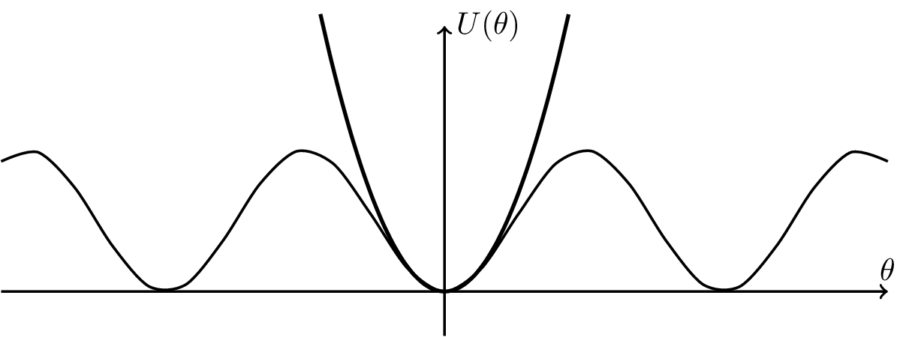
</figure>

## Teoria della Gravitazione Universale

All’inizio del ’500 Copernico descrisse il sistema solare come una sistema di pianeti in orbita intorno al Sole come centro. In seguito Brahe studiò il moto dei pianeti e ottenne i dati sperimentali necessari per l’analisi dei loro moti. In seguito Keplero studiando i dati ottenuti da Brahe enunciò le sue $3$ leggi sul moto dei pianeti:

> $i\left.\right)$ I pianeti compiono delle orbite piane ellittiche, di cui il sole occupa uno dei due fuochi.

Un’ellisse è una conica, ovvero un insieme di punti ottenuto sezionando un cono infinito tridimensionale con un piano. Un’ellisse viene definita come il luogo geometrico dei punti del piano la cui somma delle distanze tra i due fuochi è invariante. Viene definita l’eccentricità di un ellisse $\varepsilon$, una misura che quantifica quanto l’ellisse è schiacciata, ovvero di quanto l’asse maggiore $a$ è più lungo dell’asse minore $b$ dell’ellisse, il valore sarà $0$ per un cerchio mentre tenderà asintoticamente ad $1$ per un’ellisse avente un’asse $a$ di lunghezza infinita, o un asse minore $b$ di lunghezza nulla.

$$\varepsilon=\sqrt{1-\displaystyle\frac{b^2}{a^2}}\in[0,1)$$

> $ii\left.\right)$ La velocità areolare del pianeta lungo l’orbita è costante.

Viene definita velocità areolare, la variazione di area descritta da uno spostamento del pianeta lungo l’orbita in un dato intervallo di tempo: $$\displaystyle\frac{\mathrm{d}A(t)}{\mathrm{d}t}=\mathrm{cost.}$$

<figure>
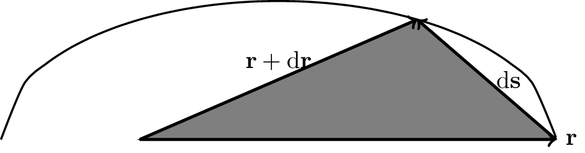
</figure>

L’area descritta in uno stesso intervallo di tempo rimane invariata, per cui dovrà cambiare la velocità dell’orbita del pianeta, per mantenere l’area costante, per cui quando i pianeti si trovano vicini al sole, si muovono più velocemente poiché descriveranno un’area maggiore, mentre quando si trovano lontani dal Sole si muovono più lentamente.  
La terza legge di Keplero descrive la relazione tra il periodo dell’orbita e la lunghezza dell’asse maggiore dell’ellisse, tramite una costante $k$, che varia per ogni pianeta in base all’eccentricità della loro orbita:

> $iii\left.\right)$ Il quadrato del periodo dell’orbita di un pianeta è proporzionale al cubo dell’asse maggiore della sua orbita ellittica. $$T^2=ka^3$$

Newton fornì una dimostrazione dinamica delle leggi di Keplero nel $1666$, approssimando le orbite ellittiche a delle circonferenze, poiché tutti, eccetto per Mercurio che percorre un’orbita di eccentricità $\varepsilon_M=0.02$, i pianeti descrivono orbite con eccentricità $\varepsilon<<1$.

<figure>
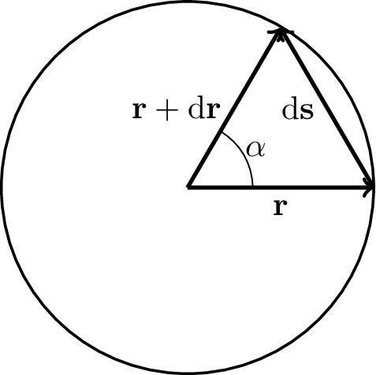
</figure>

Per ottenere l’area descritta dall’orbita si considera il modulo del prodotto vettoriale tra uno spostamento infinitesimo $\mathrm{d}\boldsymbol{\mathbf{s}}$ e la sua posizione nell’orbita $\boldsymbol{\mathbf{r}}$, che rappresenta l’area del parallelogramma di lati $\mathrm{d}\boldsymbol{\mathbf{s}}$ e $\boldsymbol{\mathbf{r}}$. Si può quindi esprimere l’area infinitesima descritta da uno spostamento infinitesimo di un pianta lungo la sua orbita circolare secondo la seguente espressione: $$\mathrm{d}A=\displaystyle\frac{|\boldsymbol{\mathbf{r}}\times \mathrm{d}\boldsymbol{\mathbf{s}}|}{2}=\frac{r\mathrm{d}s\sin\alpha}{2}$$

La variazione di area nel tempo sarà data da: $$\displaystyle\frac{\mathrm{d}A}{\mathrm{d}t}=\frac{r}{2}\sin\alpha\frac{\mathrm{d}{s}}{\mathrm{d}t}=\frac{r^2\omega}{2}\sin\alpha$$

Affinché la velocità areolare rimanga costante allora la velocità angolare deve essere costante, inoltre è inversamente proporzionale al quadrato della distanza tra il pianeta ed il Sole. La sua orbita genera un’accelerazione centripeta $\boldsymbol{\mathbf{a}}_c=r\omega^2\hat{\boldsymbol{\mathbf{\nu}}}$. Per cui esisterà una forza diretta verso il Sole dal pianeta $\boldsymbol{\mathbf{F}}=m_p\boldsymbol{\mathbf{a}}_c=m_pr\omega^2\hat{\boldsymbol{\mathbf{\nu}}}$. Per la terza legge di Keplero si può esprimere la relazione tra il braccio maggiore dell’ellisse con il periodo, per cui si può ottenere la velocità angolare: $$\omega=\displaystyle\frac{2\pi}{T}=\frac{2\pi}{\sqrt{ka^3}}$$ La forza agente sul pianeta avrà modulo: $$\begin{gathered}
    F=m_pr\displaystyle\frac{4\pi^2}{ka^3}\\
    \varepsilon=0\Rightarrow a=b=r\\
    F=m_p\displaystyle\frac{4\pi^2}{kr^2}
\end{gathered}$$ Anche la forza agente sul pianeta sarà allora inversamente proporzionale al quadrato della distanza tra il pianeta ed il Sole. Per il terzo principio della dinamica il pianeta eserciterà sul Sole una forza uguale e contraria: $\boldsymbol{\mathbf{F}}_{s\to p}=-\boldsymbol{\mathbf{F}}_{p\to s}$. $$\begin{gathered}
    \left|\boldsymbol{\mathbf{F}}_{s\to p}\right|=m_p\displaystyle\frac{4\pi^2}{k_pr^2}=m_s\displaystyle\frac{4\pi^2}{k_sr^2}=\left|\boldsymbol{\mathbf{F}}_{p\to s}\right|\\
    m_sk_p=m_pk_s
\end{gathered}$$ Si suppone esista una costante $k_s\neq k_p$ anche per il sole.  
Viene definita la costante di gravitazione universale, indipendente dalla coppia di pianeti considerati: $$G:=\displaystyle\frac{4\pi^2}{m_ik_j}=\frac{4\pi^2}{m_jk_i}=\mathrm{cost.}$$

Per cui la forza agente si può esprimere rispetto a questa nuova costante: $$F=m_p\displaystyle\frac{4\pi^2}{k_pr^2}\cdot\frac{m_s}{m_s}=G\frac{m_sm_p}{r^2}$$

Questa forza viene espressa in generale senza sapere a priori il valore delle masse gravitazionali, poiché è possibile calcolare la costante di gravitazione universale $G$ rispetto a due corpi qualsiasi che si attraggono.

A fine settecento Cavendish misurò con estrema precisione il valore della costante $G$, usando una bilancia di torsione, formata da un filo avvolto su sé stesso connesso ad un’asta in grado di ruotare sull’asse del filo, con due masse alle estremità. Le due masse agli estremi vengono esposte a dei corpi aventi una massa molto elevata, provocando una forza gravitazionale sulle due masse sull’asta, generando un momento torcente. L’asta ruoterà fino ad una nuova posizione di equilibrio del sistema, dovuta a questo momento torcente. Sapendo le masse dei corpi connessi all’asta, dei corpi esterni generatori della forza gravitazionale e la distanza tra questi è possibile, misurando la rotazione effettuata, calcolare il momento torcente ed in seguito la costante di gravitazione universale $G$.  
Si vuole determinare se la forza gravitazionale è una forza conservativa o meno. Data $\boldsymbol{\mathbf{F}}=F(r)(-\hat{\boldsymbol{\mathbf{r}}})$, si considera l’integrale del lavoro $W$, analizzando la traiettoria compiuta dal pianeta è possibile notare come il prodotto scalare $\hat{\boldsymbol{\mathbf{r}}}\cdot \mathrm{d}\boldsymbol{\mathbf{s}}$, corrisponda al modulo della variazione infinitesima del vettore posizione nella traiettoria, per cui: $$\hat{\boldsymbol{\mathbf{r}}}\cdot \mathrm{d}\boldsymbol{\mathbf{s}}=1\cdot \mathrm{d}s\cos\theta=dr$$

<figure>
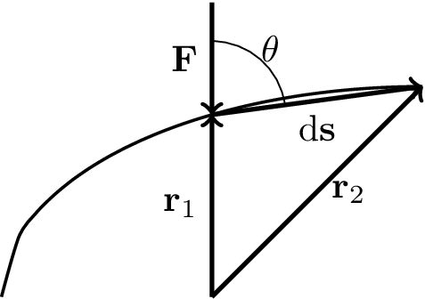
</figure>

Essendo $F(r)$ una funzione di stato avrà sempre una primitiva, quindi è una forza conservativa ed il suo lavoro risultante sarà: $$W=\displaystyle\int_{r_1}^{r_2}-F(r)\mathrm{d}r=f(r_2)-f(r_1)$$ Date due masse $m$ e $M$ di distanza $r$, il modulo della forza gravitazionale tra i due sarà dato da: $$F(r)=GmM\displaystyle\frac{1}{r^2}$$ Essendo una forza conservativa si può ricavare l’energia potenziale integrando la forza gravitazionale: $$U(r)=-W(r)=\displaystyle\int F(r)\mathrm{d}r=\displaystyle\int GmM\frac{1}{r^2}dr=-\frac{GmM}{r}+c$$ Si può esprimere il lavoro della forza gravitazionale come differenza di energia potenziale: $$W=-\Delta U=GmM\Delta\left(\displaystyle\frac{1}{r}\right)$$

Data l’energia potenziale è possibile calcolarsi, se non agiscono altre forze non conservative, la velocità necessaria per un corpo di massa $m$ per uscire dall’orbita terrestre. Ovvero si considera raggiunga asintoticamente una distanza infinita dalla terra, per cui la sua energia potenziale in quel punto sarà nulla: $$\begin{gathered}
    U(r_0)+K(v_0)=\cancelto{0}{U(r_f)}+K(v_f)\\
    -\displaystyle\frac{GmM}{r_0}+\frac{1}{2}mv_0^2=\frac{1}{2}mv_f^2\\
    v_0=\displaystyle\sqrt{\displaystyle\frac{2GM}{r_0}+v_f^2}
\end{gathered}$$ Se si considera la velocità finale nulla, ovvero il corpo si trova in uno stato di quiete a distanza infinita dalla terra, dovrà avere una velocità iniziale: $$v=\displaystyle\sqrt{\frac{2GM}{r}}$$ Questa velocità viene definita velocità di fuga dalla terra.

In caso si consideri un sistema di riferimento avente centro nel Sole, sul corpo agiranno delle forze d’inerzia, poiché le analisi precedenti sono state effettuate rispetto al sistema di riferimento intrinseco del corpo, in moto rotazionale rispetto al Sole. Sul corpo agirà una forza centripeta, calcolata precedentemente $m\omega^2r$, per cui la risultante delle forze agenti sul pianeta sarà: $$F=\displaystyle\frac{GmM}{r^2}-m\omega^2r$$ Il corpo avrà un certo momento angolare $L=|\boldsymbol{\mathbf{r}}\times m\boldsymbol{\mathbf{v}}|=m\omega r^2$, poiché si tratta di un’orbita ellittica il vettore direzione sarà perpendicolare al vettore velocità. Si potrà quindi esprimere la forza risultante rispetto al modulo del momento angolare: $$F=\displaystyle\frac{GmM}{r^2}-\frac{L^2}{mr^3}$$ Poiché il momento angolare dipende solamente dalla distanza, essendo la velocità angolare costante, la forza risultante sarà conservativa, e si potrà calcolare l’energia potenziale. Si definisce energia potenziale efficace l’energia potenziale calcolata in questo sistema di riferimento: $$U^\mathrm{eff}(r)=-W=\displaystyle\int F(r)\mathrm{d}r=-\displaystyle\frac{GmM}{r}+\frac{L^2}{2mr^2}$$

<figure>
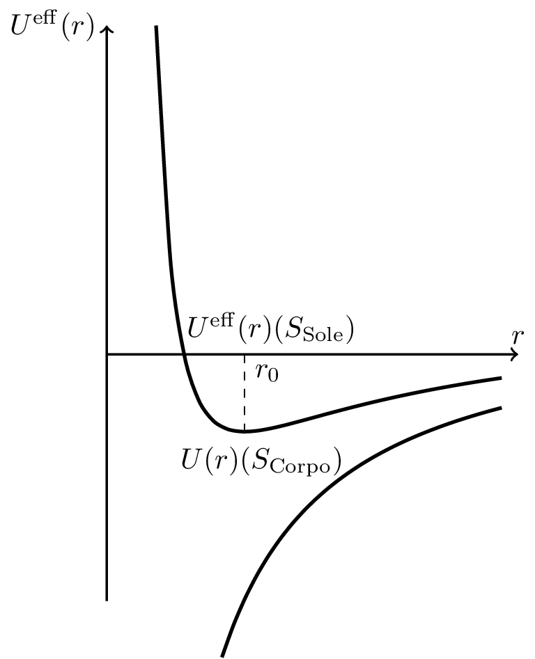
</figure>

Per cui per dei corpi vicini al Sole, prevale la componente ${L^2}/{2mr^2}$, e l’energia potenziale efficace sarà positiva, quindi il corpo si muoverà verso il sole. Diminuirà all’aumentare della distanza $r$ fino al raggiungimento di un punto di equilibrio stabile, corrispondente ad un punto di minimo per l’energia potenziale, per un valore $r_0$, dopo il quale l’energia potenziale tenderà asintoticamente a $0^-$. Un corpo ad una distanza $r_0$ dal sole quindi sarà in un orbita attorno al punto di energia minima $U(r_0)$, compiendo piccole oscillazioni, per cui la funzione potenziale potrà essere approssimata con una parabola in tutto il semipiano negativo. Per $U(r)\geq0$, il potenziale continuerà a crescere fino ad infinito, potrà quindi essere approssimato come un’iperbole.

Se si considera il Sole in movimento, allora i due corpi si muoveranno l’uno rispetto all’altro di moto rototraslatorio. Si considera la conservazione della quantità di moto e del momento angolare: $$\begin{gathered}
    \boldsymbol{\mathbf{p}}_\mathrm{tot}=\mathrm{cost.}=m\boldsymbol{\mathbf{v_p}}+M\boldsymbol{\mathbf{v_s}}\\
    \boldsymbol{\mathbf{L}}_\mathrm{tot}=\mathrm{cost.}
\end{gathered}$$ Il corpo con massa maggiore avrà quindi una velocità relativamente minore. Poiché l’energia cinetica del sistema è costante, per una quantità di moto costante, se l’energia potenziale efficace è costante, l’energia meccanica del sistema si conserverà. Il moto viene analizzato rispetto alla distanza del centro di massa dal Sole $\boldsymbol{\mathbf{R}}_{(\mathrm{c.d.m.})}$ e la distanza relativa tra i due corpi $\boldsymbol{\mathbf{r}}=\boldsymbol{\mathbf{r}}_s-\boldsymbol{\mathbf{r}}_p$.

# Dinamica dei Sistemi di Punti Materiali

Un sistema di punti materiali è un insieme di punti definiti in un sistema di riferimento, aventi ognuno un suo comportamento nello spazio: $$\mathscr{S}:=\left\{P_i,\:\forall i\in[1,\:N]\cap\mathbb{N}\right\}$$

<figure>
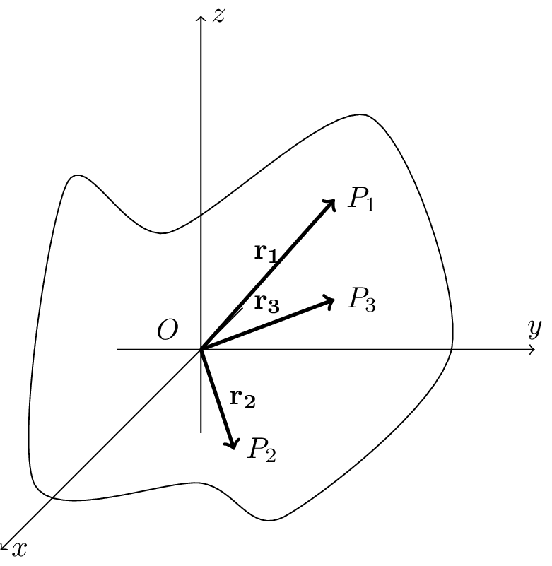
</figure>

Per ogni punto $P_i$ è possibile descrivere le sue interazioni dinamiche ed il suo comportamento cinematico. Per trovare la forza totale agente su un unico punto $P_i$, si considerano tutte le interazioni tra quel punto e i restanti punti appartenenti al sistema $\mathscr{S}$: $$\boldsymbol{\mathbf{F}}^\mathrm{tot}_i=\displaystyle\sum_{j=1}^{i-1}\boldsymbol{\mathbf{F}}_{j\to i}+\sum_{k=i+1}^{N}\boldsymbol{\mathbf{F}}_{k\to i}$$ Vengono definite forze interne al sistema, tutte le forze dovute ad interazioni tra elementi appartenenti ad esso. Mentre vengono definite forze esterne al sistema, tutte le forze dovute all’interazione tra punti appartenenti al sistema con elementi non appartenenti ad esso.

Per il terzo principio della dinamica la somma di tutte le forze interne al sistema è nulla. Per ogni forza $\boldsymbol{\mathbf{F}}_{i\to j}$ generata da un punto $i$ verso un punto $j$ esiste una forza uguale e contraria $-\boldsymbol{\mathbf{F}}_{i\to j}=\boldsymbol{\mathbf{F}}_{j\to i}$ dal punto $j$ verso il punto $i$. Per cui la somma di tutte le coppie di forze tra loro opposte è uguale alla somma di tutte le forze interne, ed è quindi nulla: $$\boldsymbol{\mathbf{F}}_\mathrm{tot}^\mathrm{int}=\displaystyle\sum_{j=1}^{N}\boldsymbol{\mathbf{F}}_i^\mathrm{int}=\sum_{i=1}^{N}\left(\sum_{j=1}^{N}\boldsymbol{\mathbf{F}}_{i\to j}\right)=\sum_{(i,j)=(1,1)}^{(N,N)}\boldsymbol{\mathbf{F}}_{i\to j}+\boldsymbol{\mathbf{F}}_{j\to i}=\boldsymbol{\mathbf{0}}$$ Considerando nulla la forza che agisci sullo stesso punto $\boldsymbol{\mathbf{F}}_{i\to i}=\boldsymbol{\mathbf{0}}$. Quindi la forza totale agente un sistema di punti materiali $\mathscr{S}$ è data da: $$\boldsymbol{\mathbf{F}}_\mathrm{tot}=\boldsymbol{\mathbf{F}}^\mathrm{est}_\mathrm{tot}+\cancelto{\boldsymbol{\mathbf{0}}}{\boldsymbol{\mathbf{F}}^\mathrm{int}_\mathrm{tot}}=\boldsymbol{\mathbf{F}}^\mathrm{est}_\mathrm{tot}$$

Se la somma delle forze esterne applicate sul sistema è nulla allora la forza totale agente sul sistema è nulla $\boldsymbol{\mathbf{F}}_\mathrm{tot}=\boldsymbol{\mathbf{0}}$, quindi il sistema si trova in uno stato di quiete o di moto rettilineo uniforme.

## Centro di Massa

Il centro di massa di un sistema $\mathscr{S}$ è definito come un punto, non necessariamente reale, che può essere usato per approssimare il comportamento del sistema. Il centro di massa si trova in una posizione $\boldsymbol{\mathbf{r}}_c$ rispetto ad un sistema di riferimento $S$ definita come la media ponderata, rispetto alle masse, delle posizioni di ogni punto materiale del sistema: $$\boldsymbol{\mathbf{r}}_{\mathrm{c.d.m.}}=\displaystyle\frac{\sum_{i=1}^{N}m_i\boldsymbol{\mathbf{r}}_i}{\sum_{i=1}^{N}m_i}$$ Può essere calcolato iterativamente: $$\boldsymbol{\mathbf{r}}_{\mathrm{c.d.m.}}=\displaystyle\frac{\sum_{i=1}^Nm_i\boldsymbol{\mathbf{r}}'_{\mathrm{c.d.m.}}+m_{N+1}\boldsymbol{\mathbf{r}}_{N+1}}{\sum_{i=1}^Nm_i+m_{N+1}}=\frac{\sum_{i=1}^{N+1}m_i\boldsymbol{\mathbf{r}}_i}{\sum_{i=1}^{N+1}m_i}$$ Se il sistema è traslato di $\boldsymbol{\mathbf{R}}$, la posizione del centro di massa è anch’essa traslata della stessa quantità: $$\boldsymbol{\mathbf{r}}'_{\mathrm{c.d.m.}}=\displaystyle\frac{\sum_{i=1}^{N}m_i\boldsymbol{\mathbf{r}}'_i}{\sum_{i=1}^{N}m_i}=\displaystyle\frac{\sum_{i=1}^{N}m_i(\boldsymbol{\mathbf{r}}_i+\boldsymbol{\mathbf{R}})}{\sum_{i=1}^{N}m_i}=\displaystyle\frac{\sum_{i=1}^{N}m_i\boldsymbol{\mathbf{R}}}{\sum_{i=1}^{N}m_i}+\displaystyle\frac{\sum_{i=1}^{N}m_i\boldsymbol{\mathbf{r}}_i}{\sum_{i=1}^{N}m_i}=\boldsymbol{\mathbf{R}}+\displaystyle\frac{\sum_{i=1}^{N}m_i\boldsymbol{\mathbf{r}}_i}{\sum_{i=1}^{N}m_i}=\boldsymbol{\mathbf{R}}+\boldsymbol{\mathbf{r}}_{\mathrm{c.d.m.}}$$

La posizione del centro di massa di un sistema di punti rispetto ai punti materiali è indipendente dal sistema di riferimento, invece la sua espressione in coordinate dipende dal sistema di riferimento adottato.

Se le masse sono costanti, ed i punti sono mobili nel tempo, allora il centro di massa ha una certa velocità $\boldsymbol{\mathbf{v}}_{\mathrm{c.d.m.}}$: $$\boldsymbol{\mathbf{v}}_{\mathrm{c.d.m.}}=\frac{\mathrm{d}}{\mathrm{d}t}\left(\displaystyle\frac{\sum_{i=1}^{N}m_i\boldsymbol{\mathbf{r}}_i}{\sum_{i=1}^{N}m_i}\right)=\displaystyle\frac{\sum_{i=1}^{N}m_i\dot{\boldsymbol{\mathbf{r}}}_i}{\sum_{i=1}^{N}m_i}=\displaystyle\frac{\sum_{i=1}^{N}m_i\boldsymbol{\mathbf{v}}_i}{\sum_{i=1}^{N}m_i}=\displaystyle\frac{\sum_{i=1}^{N}\boldsymbol{\mathbf{p}}_i}{\sum_{i=1}^{N}m_i}$$ Analogamente si può ottenere l’accelerazione del centro di massa: $$\boldsymbol{\mathbf{a}}_{\mathrm{c.d.m.}}=\displaystyle\frac{\sum_{i=1}^{N}m_i\boldsymbol{\mathbf{a}}_i}{\sum_{i=1}^{N}m_i}$$ La quantità di moto del sistema coincide con la quantità di moto del centro di massa: $$\boldsymbol{\mathbf{v}}_{\mathrm{c.d.m.}}=\displaystyle\frac{\sum_{i=1}^{N}\boldsymbol{\mathbf{p}}_i}{M}=\displaystyle\frac{p^\mathrm{tot}}{M}\\
    M\boldsymbol{\mathbf{v}}_{\mathrm{c.d.m.}}=\boldsymbol{\mathbf{p}}_{\mathrm{c.d.m.}}=\boldsymbol{\mathbf{p}}^\mathrm{tot}\tag{\stepcounter{equation}\theequation}$$ Con $M=\sum_{i=1}^{N}m_i$. Si considera per ogni punto $P_i$ l’espressione del suo moto rispetto alla forza agente su di esso: $$\begin{gathered}
    m_i\boldsymbol{\mathbf{a}}_i=\boldsymbol{\mathbf{F}}_i^\mathrm{tot}\\
    \displaystyle\sum_{i=1}^{N}m_i\boldsymbol{\mathbf{a}}_i=\sum_{i=1}^{N}\boldsymbol{\mathbf{F}}_i^\mathrm{tot}\\
    M\boldsymbol{\mathbf{a}}_{\mathrm{c.d.m.}}=\boldsymbol{\mathbf{F}}^\mathrm{tot}\tag{\stepcounter{equation}\theequation}
\end{gathered}$$

Poiché la somma totale delle forze interne è nulla, la somma delle forze esterni agenti sul sistema è uguale alla forza necessaria per muovere un corpo di massa $M$ di un’accelerazione $\boldsymbol{\mathbf{a}}_{\mathrm{c.d.m.}}$. Viene quindi definita prima equazione cardinale la relazione tra le forze esterne agenti su un sistema e l’accelerazione del centro di massa del sistema: $$(i)\:M\boldsymbol{\mathbf{a}}_{\mathrm{c.d.m.}}=\boldsymbol{\mathbf{F}}^\mathrm{est}$$ Il centro di massa di un sistema di punti materiali si muove come un punto materiale dove è concentrata tutta la massa del sistema su cui è applicata la risultante delle forze esterne del sistema. L’azione delle forze interne non può modificare il moto del centro di massa, ma può modificare il comportamento di un singolo punto del sistema.

## Sistema Isolato

Viene definito sistema isolato un sistema di punti materiali dove la risultante delle forze esterni agenti su di esso è nulla $\boldsymbol{\mathbf{F}}^\mathrm{est}=\boldsymbol{\mathbf{0}}$. Per la prima equazione cardinale $M\boldsymbol{\mathbf{a}}_{\mathrm{c.d.m.}}=\boldsymbol{\mathbf{0}}$, allora il centro di massa, quindi il sistema, si muove di moto rettilineo uniforme o è in stato di quiete. La quantità di moto interna del sistema $\boldsymbol{\mathbf{p}}^\mathrm{int}$ è conservata, poiché $\dot{\boldsymbol{\mathbf{p}}}_{\mathrm{c.d.m.}}=\boldsymbol{\mathbf{0}}$.  
Se la quantità di moto totale del sistema è nulla $\boldsymbol{\mathbf{p}}^\mathrm{tot}=\boldsymbol{\mathbf{0}}$, allora i punti appartenenti al sistema o divergono con quantità di moto tali da bilanciarsi, oppure convergono nel centro di massa. In quest’ultimo caso la posizione dei punti converge ad una posizione $\boldsymbol{\mathbf{r}}$, coincidente alla posizione del centro di massa: $$\boldsymbol{\mathbf{r}}_{\mathrm{c.d.m.}}=\displaystyle\frac{\sum_{i_1}^{N}m_i\boldsymbol{\mathbf{r}}_i}{M}=\boldsymbol{\mathbf{r}}\frac{\sum_{i_1}^{N}m_i}{M}=\boldsymbol{\mathbf{r}}$$

## Sistema di Riferimento del Centro di Massa

Nella maggior parte dei casi, è più comodo analizzare un sistema di punti materiali rispetto ad un sistema di riferimento solidale al centro di massa del sistema. Se il centro di massa si muove di sola traslazione, allora il sistema di riferimento $S_{\mathrm{c.d.m.}}$, con origine nel centro di massa, si muove di sola traslazione con un’accelerazione $\boldsymbol{\mathbf{A}}=\boldsymbol{\mathbf{a}}_{\mathrm{c.d.m.}}={\boldsymbol{\mathbf{F}}^\mathrm{est}}/{M}$. La velocità del centro di massa relativa al sistema di punti espresso rispetto a $S_{\mathrm{c.d.m.}}$ è nulla, quindi il centro di massa e il sistema di punti hanno una quantità di moto totale nulla. Quindi in un sistema $\mathscr{S}$ espresso rispetto al sistema di riferimento del centro di massa $S_{\mathrm{c.d.m.}}$ gli elementi si muovono con una quantità di moto tale da bilanciarsi a vicenda.

Se la risultante delle forze esterne è diversa da zero, il sistema di riferimento del centro di massa è un sistema non inerziale rispetto al sistema di riferimento $S$ dove è stato definito il sistema di punti. Per passare al sistema di riferimento del centro di massa $S\to S_{\mathrm{c.d.m.}}$, si considerano le seguenti espressioni: $$\begin{cases}
        \boldsymbol{\mathbf{r}}(S)=\boldsymbol{\mathbf{r}}(S_{\mathrm{c.d.m.}})+\boldsymbol{\mathbf{r}}_{\mathrm{c.d.m.}}(S)\\ 
        \boldsymbol{\mathbf{v}}(S)=\boldsymbol{\mathbf{v}}(S_{\mathrm{c.d.m.}})+\boldsymbol{\mathbf{v}}_{\mathrm{c.d.m.}}(S)\\
        \boldsymbol{\mathbf{a}}(S)=\boldsymbol{\mathbf{a}}(S_{\mathrm{c.d.m.}})+\boldsymbol{\mathbf{a}}_{\mathrm{c.d.m.}}(S)
    \end{cases}$$

<figure>
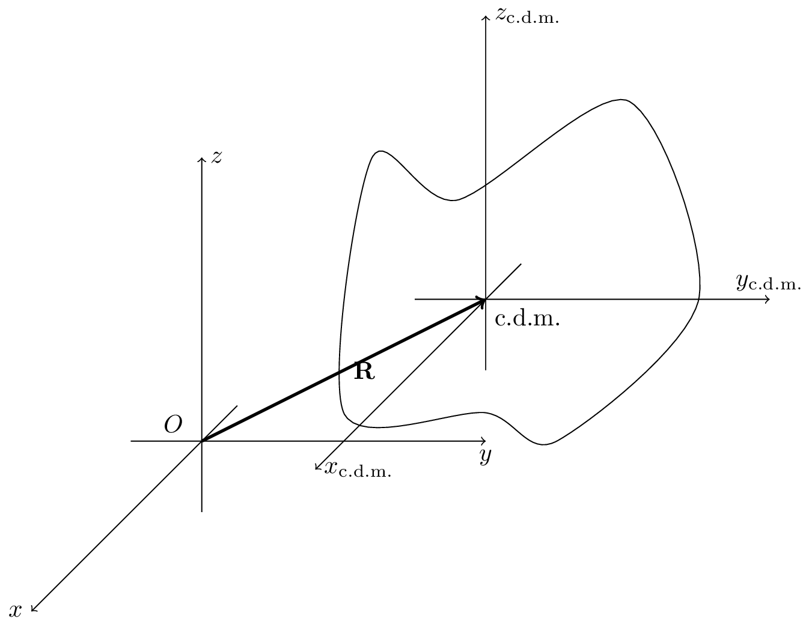
</figure>

## I Teorema di Köning

> Il momento angolare di un insieme di punti materiali in un sistema di riferimento generico è dato dalla somma tra il momento angolare nel sistema di riferimento del centro di massa con il momento angolare del centro di massa. $$\boldsymbol{\mathbf{L}}(S)=\boldsymbol{\mathbf{L}}(S_{\mathrm{c.d.m.}})+\boldsymbol{\mathbf{L}}_{\mathrm{c.d.m.}}(S)$$

Si considerano i punti nel sistema di riferimento $S$ espressi rispetto al sistema di riferimento del centro di massa $S_{\mathrm{c.d.m.}}$: $\boldsymbol{\mathbf{r}}_i(S)=\boldsymbol{\mathbf{r}}_i(S_{\mathrm{c.d.m.}})+\boldsymbol{\mathbf{r}}_{\mathrm{c.d.m.}}(S)$, $\boldsymbol{\mathbf{r}}_i(S)=\boldsymbol{\mathbf{r}}_i(S_{\mathrm{c.d.m.}})+\boldsymbol{\mathbf{v}}_{\mathrm{c.d.m.}}(S)$. Il momento angolare nel sistema $S$ è dato da $\boldsymbol{\mathbf{L}}(S)=\sum_{i=1}^{N}(\boldsymbol{\mathbf{r}}_i(S)\times\boldsymbol{\mathbf{p}}_i(S))$, considerando le espressioni del cambiamento di coordinate $S\to S_{\mathrm{c.d.m.}}$ si esprime il momento angolare rispetto al sistema di riferimento del centro di massa: $$\begin{gathered}
    \boldsymbol{\mathbf{L}}(S)=\displaystyle\sum_{i=1}^{N}(\boldsymbol{\mathbf{r}}_i(S_{\mathrm{c.d.m.}})+\boldsymbol{\mathbf{r}}_{\mathrm{c.d.m.}}(S))\times m_i(\boldsymbol{\mathbf{v}}_i(S_{\mathrm{c.d.m.}})+\boldsymbol{\mathbf{v}}_{\mathrm{c.d.m.}}(S))\\
    \displaystyle\sum_{i=1}^{N}(\boldsymbol{\mathbf{r}}_i(S_{\mathrm{c.d.m.}})\times m_i\boldsymbol{\mathbf{v}}_i(S_{\mathrm{c.d.m.}})+\boldsymbol{\mathbf{r}}_i(S_{\mathrm{c.d.m.}})\times m_i\boldsymbol{\mathbf{v}}_{\mathrm{c.d.m.}}(S)\\
    +\boldsymbol{\mathbf{r}}_{\mathrm{c.d.m.}}(S)\times m_i\boldsymbol{\mathbf{v}}_i(S_{\mathrm{c.d.m.}})+\boldsymbol{\mathbf{r}}_{\mathrm{c.d.m.}}(S)\times m_i\boldsymbol{\mathbf{v}}_{\mathrm{c.d.m.}}(S))\\
    \displaystyle\sum_{i=1}^{N}(\boldsymbol{\mathbf{r}}_i(S_{\mathrm{c.d.m.}})\times m_i\boldsymbol{\mathbf{v}}_i(S_{\mathrm{c.d.m.}}))+\cancelto{\boldsymbol{\mathbf{0}}}{\sum_{i=1}^{N}(\boldsymbol{\mathbf{r}}_i(S_{\mathrm{c.d.m.}})m_i)\times \boldsymbol{\mathbf{v}}_{\mathrm{c.d.m.}}(S)}\\
    +\cancelto{\boldsymbol{\mathbf{0}}}{\boldsymbol{\mathbf{r}}_{\mathrm{c.d.m.}}(S)\times\sum_{i=1}^{N}(m_i\boldsymbol{\mathbf{v}}_i(S_{\mathrm{c.d.m.}}))}+\boldsymbol{\mathbf{r}}_{\mathrm{c.d.m.}}(S)\times\sum_{i=1}^{N}(m_i)\boldsymbol{\mathbf{v}}_{\mathrm{c.d.m.}}(S)\\
    \boldsymbol{\mathbf{L}}(S_{\mathrm{c.d.m.}})+\boldsymbol{\mathbf{L}}_{\mathrm{c.d.m.}}(S)
\end{gathered}$$ Poiché la posizione del centro di massa nel sistema di riferimento solidale al centro di massa è nulla $\boldsymbol{\mathbf{r}}_{\mathrm{c.d.m.}}(S_{\mathrm{c.d.m.}})=\boldsymbol{\mathbf{0}}$, si ha che $\boldsymbol{\mathbf{r}}_{\mathrm{c.d.m.}}(S_{\mathrm{c.d.m.}})=\left({\sum_{i=1}^{N}m_i\boldsymbol{\mathbf{r}}_i(S_{\mathrm{c.d.m.}})}\right)/{M}=\boldsymbol{\mathbf{0}}$ quindi la componente $\sum_{i=1}^{N}m_i\boldsymbol{\mathbf{r}}_i(S_{\mathrm{c.d.m.}})$ è nulla, analogamente si dimostra che la componente $\sum_{i=1}^{N}m_i\boldsymbol{\mathbf{v}}_i(S_{\mathrm{c.d.m.}})$ è nulla, sapendo che la velocità del centro di massa nel sistema di riferimento del centro di massa è nulla.

## II Teorema di Köning

> L’energia cinetica di un sistema di punti materiali in un sistema di riferimento inerziale è data dalla somma tra l’energia cinetica del sistema di punti in un sistema di riferimento concorde al centro di massa, sommata all’energia cinetica del centro di massa: $$K(S)=K(S_{\mathrm{c.d.m.}})+K_{\mathrm{c.d.m.}}(S)$$

Si considera l’energia cinetica del sistema di punti nel sistema inerziale $S(S)$: $$K(S)=\displaystyle\frac{1}{2}\sum_{i=1}^{N}m_iv_i^{2}(S)$$ Si considera l’espressione del cambiamento di coordinate $S\to S_{\mathrm{c.d.m.}}$ della velocità $v_i(S)=v_i(S_{\mathrm{c.d.m.}})+v_{\mathrm{c.d.m.}}(S)$. Si esprime l’energia cinetica rispetto al sistema di riferimento solidale al centro di massa tramite quest’espressione $S\to S_{\mathrm{c.d.m.}}$: $$\begin{gathered}
    K(S)=\displaystyle\frac{1}{2}\sum_{i=1}^{N}m_i(v_i(S_{\mathrm{c.d.m.}})+v_{\mathrm{c.d.m.}}(S))^2\\
    \displaystyle\frac{1}{2}\sum_{i=1}^{N}m_i(v^{2}_i(S_{\mathrm{c.d.m.}})+2v_i(S_{\mathrm{c.d.m.}}){v}_{\mathrm{c.d.m.}}(S)+v_{\mathrm{c.d.m.}}^{2}(S))\\
    \displaystyle\frac{1}{2}\displaystyle\sum_{i=1}^{N}m_iv^{2}(S_{\mathrm{c.d.m.}})_i+\cancelto{0}{\displaystyle\sum_{i=1}^{N}\left(m_i{v}_i(S_{\mathrm{c.d.m.}})\right)}{v}_{\mathrm{c.d.m.}}(S)+\frac{1}{2}\displaystyle\sum_{i=1}^{N}m_iv_{\mathrm{c.d.m.}}^{2}(S)\\
    K(S_{\mathrm{c.d.m.}})+K_{\mathrm{c.d.m.}}(S)
\end{gathered}$$ Il componente $\sum_{i=1}^{N}m_i{v}_i(S_{\mathrm{c.d.m.}})$ corrisponde alla quantità di moto del centro di massa nel sistema di riferimento del centro di massa $\boldsymbol{\mathbf{p}}_{\mathrm{c.d.m.}}(S_{\mathrm{c.d.m.}})$, ma la quantità di moto del centro di massa è nulla nel sistema di riferimento del centro di massa, per cui quella componente ha un contributo nullo.

Segue per i due teoremi di Köning che le grandezze principali di un sistema di punti materiali $\mathscr{S}$ espresse rispetto ad un sistema di riferimento inerziale $S$, possono essere sempre espresse rispetto ad un sistema di riferimento $S_{\mathrm{c.d.m.}}$ solidale al centro di massa del sistema. Non è necessaria una formulazione di un terzo teorema di Köning poiché è stato precedentemente dimostrato che per qualsiasi sistema di riferimento inerziale, la quantità di moto totale del sistema di punti materiali $\mathscr{S}$ coincide alla quantità di moto del centro di massa del sistema nello stesso sistema di riferimento. Poiché è più semplice analizzare il comportamento di un singolo punto materiale, centro di massa, invece di un sistema di punti, è consigliabile, se le grandezze sono ottenute in un sistema di riferimento inerziale, analizzare il sistema di punti nel sistema di riferimento solidale al centro di massa: $$\begin{matrix}
        \strut 
        \\
        \left.i\right) 
        \\
        \left.ii\right) 
    \end{matrix}
    \begin{cases}
        \boldsymbol{\mathbf{p}}^\mathrm{tot}(S)=\cancelto{0}{\boldsymbol{\mathbf{p}}^\mathrm{tot}(S_{\mathrm{c.d.m.}})}+\boldsymbol{\mathbf{p}}_{\mathrm{c.d.m.}}(S)\\
        \boldsymbol{\mathbf{L}}^\mathrm{tot}(S)=\boldsymbol{\mathbf{L}}^\mathrm{tot}(S_{\mathrm{c.d.m.}})+\boldsymbol{\mathbf{L}}_{\mathrm{c.d.m.}}(S)\\
        K^\mathrm{tot}(S)=K^\mathrm{tot}(S_{\mathrm{c.d.m.}})+K_{\mathrm{c.d.m.}}(S)
    \end{cases}$$

## Urti

Quando due corpi si scontrano con due velocità iniziali $\boldsymbol{\mathbf{v}}_i$, si verifica un fenomeno chiamato urto in un intervallo di tempo $\Delta t$, dopo lo scontro i corpi avranno velocità finali non necessariamente uguali alle velocità iniziali $\boldsymbol{\mathbf{v}}_f$. Nell’intervallo di tempo $[0,\varepsilon]$ i due corpi sono a contatto e il sistema si trova in uno stato di equilibrio instabile, poiché i corpi si separeranno dopo l’urto. Il sistema è isolato e quindi la quantità di moto totale del sistema rimarrà costante nell’intervallo di tempo $[0,\varepsilon]$.

### Forze Impulsive

Nell’intervallo di tempo dell’urto sui due corpi agisce una forza impulsiva, proporzionale all’inverso dell’intervallo di tempo in cui avviene l’urto $F(t)\propto \displaystyle\frac{1}{\varepsilon}$. Poiché la forza è una grandezza che non dipende esplicitamente all’intervallo di tempo in cui è stata applicata si usa l’impulso, grandezza definita nella rappresentazione integrale del secondo principio della dinamica, per quantificare l’intensità dell’impulso: $$\begin{gathered}
    \displaystyle\frac{\mathrm{d}\boldsymbol{\mathbf{p}}}{\mathrm{d}t}=\boldsymbol{\mathbf{F}}\\
    \displaystyle\int_{0}^{\varepsilon}\mathrm{d}\boldsymbol{\mathbf{p}}=\int_{0}^{\varepsilon}\boldsymbol{\mathbf{F}}\mathrm{d}t\\
    \Delta\boldsymbol{\mathbf{p}}=\displaystyle\int_{0}^{\varepsilon}\boldsymbol{\mathbf{F}}\mathrm{d}t=\boldsymbol{\mathbf{J}}
\end{gathered}$$

Poiché la quantità di moto totale del sistema viene conservata durante l’urto, viene scambiata una quantità di moto $\Delta\boldsymbol{\mathbf{p}}$ tra i due corpi durante l’intervallo di tempo $[0,\varepsilon]$.

Per una forza impulsiva $F$ al diminuire dell’intervallo di tempo, la sua intensità aumenterà. Per un urto in un tempo infinitesimo, l’impulso ha un valore non nullo per un intervallo di tempo infinitesimo: $$\lim_{\varepsilon\to 0}\displaystyle\int_{0}^{\varepsilon}\boldsymbol{\mathbf{F}}\mathrm{d}t\approx\boldsymbol{\mathbf{F}}\cdot\varepsilon=\boldsymbol{\mathbf{J}}\neq\boldsymbol{\mathbf{0}}$$ Per una forza non impulsiva, nello stesso intervallo di tempo l’impulso generato è nullo $\boldsymbol{\mathbf{F}}\cdot\varepsilon=\boldsymbol{\mathbf{0}}$.

<figure>
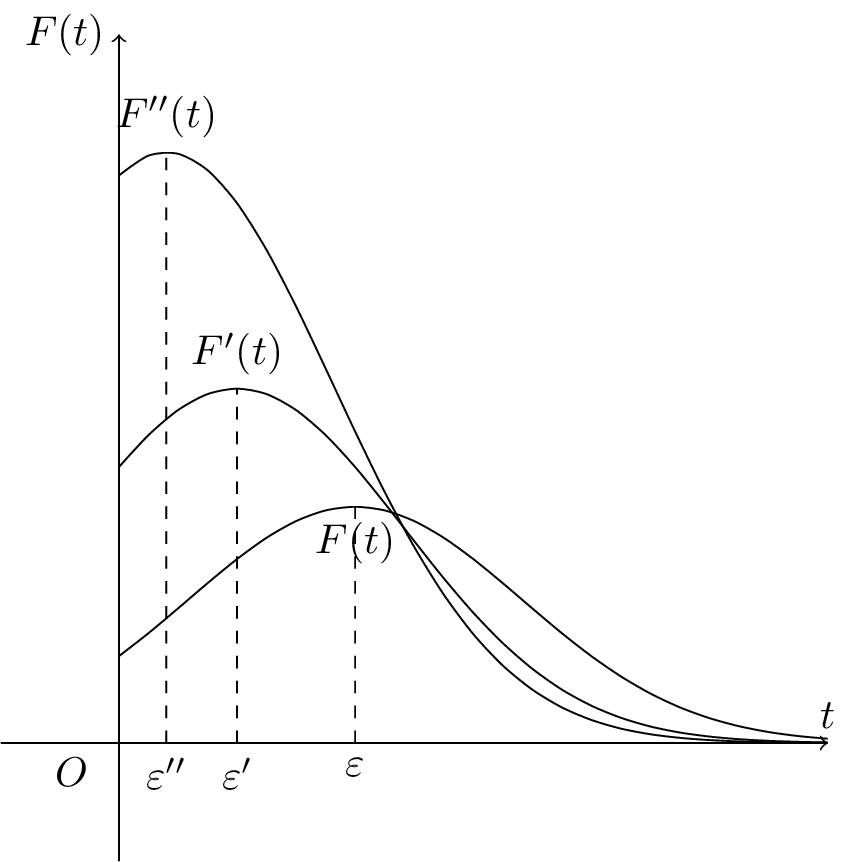
</figure>

### Elastici

Gli urti possono essere rappresentati come uno scambio di quantità di moto tra due corpi. Se il sistema composto dai cue corpi è isolato allora la quantità di moto viene conservata durante l’urto. Invece se sul sistema di punti agiscono forze esterne, se l’intervallo di tempo è sufficientemente ristretto e le forze esterne applicate non sono impulsive allora si conserva la quantità di moto. Le forze impulsive che generano l’urto non sono necessariamente conservative, per cui si considerando due tipi di urti:

- Urti Elastici: dove l’energia meccanica del sistema si conserva;

- Urti Anelastici: dove l’energia meccanica del sistema non si conserva, ma una parte viene dissipata nell’ambiente esterno.

In un urto elastico i due corpi subiscono delle deformazioni elastiche, riprendendo la configurazione iniziale subito dopo l’urto. Nel sistema di riferimento del centro di massa dei due corpi i due punti materiali convergono verso il centro di massa con quantità di moto di modulo uguale e verso opposto, e dopo l’urto ripartono con quantità di moto uguali in modulo e verso opposto. La quantità di moto totale del sistema è nulla durante l’urto, e si conserva l’energia meccanica del sistema, poiché si tratta di un urto elastico. $$\begin{gathered}
    \begin{cases}
        \boldsymbol{\mathbf{p}}^\mathrm{tot}_i=\boldsymbol{\mathbf{p}}^\mathrm{tot}_f=\boldsymbol{\mathbf{0}}\Rightarrow \boldsymbol{\mathbf{p}}_{1,i}=-\boldsymbol{\mathbf{p}}_{2,i}\land\boldsymbol{\mathbf{p}}_{1,f}=-\boldsymbol{\mathbf{p}}_{2,f}\\
        K_i=K_f
    \end{cases}\\
    \begin{cases}
        m_1v_{1,i}=-m_2v_{2,i}\land m_1v_{1,f}=-m_2v_{2,f}\\
        \displaystyle\frac{1}{2m_1}(m_1v_{1,i})^2+\frac{1}{2m_2}(m_2v_{2,i})^2=\frac{1}{2m_1}(m_1v_{1,f})^2+\frac{1}{2m_2}(m_2v_{2,f})^2
    \end{cases}\\
    \begin{cases}
        \displaystyle m_1v_{1,i}^2+\frac{m_1^2}{m_2}v_{1,i}^2=m_1v_{1,f}^2+\frac{m_1^2}{m_2}v_{1,f}^2\\
        \displaystyle m_2v_{2,i}^2+\frac{m_2^2}{m_1}v_{2,i}^2=m_2v_{2,f}^2+\frac{m_2^2}{m_1}v_{2,f}^2
    \end{cases}\\
    \begin{cases}
        \displaystyle v_{1,i}^2\left(\displaystyle\frac{m_1}{m_2}+1\right)=v_{1,f}^2\left(\displaystyle\frac{m_1}{m_2}+1\right)\\
        \displaystyle v_{1,i}^2\left(\displaystyle\frac{m_2}{m_1}+1\right)=v_{2,f}^2\left(\displaystyle\frac{m_2}{m_1}+1\right)
    \end{cases}\\
    \begin{cases}
        v_{1,i}=\pm v_{1,f}\\
        v_{2,i}=\pm v_{2,f}
    \end{cases}     
\end{gathered}$$ Poiché i corpi convergono prima dell’urto e divergono subito dopo, le loro velocità cambiano verso dopo l’urto, quindi l’unica soluzione possibile è: $$\begin{cases}
        v_{1,i}=-v_{1,f}\\
        v_{2,i}=-v_{2,f}
    \end{cases}$$

Queste velocità sono calcolate nel sistema di riferimento $S_{\mathrm{c.d.m.}}$. Per esprimere le velocità finali rispetto ad un qualsiasi sistema di riferimento inerziale $S$ si considera: $$\begin{gathered}
    v(S)=v(S_{\mathrm{c.d.m.}})+v_{\mathrm{c.d.m.}}\\
    v_{\mathrm{c.d.m.}}=\displaystyle\frac{m_1v_1+m_2v_2}{m_1+m_2}\\
    \begin{cases}
        v_{1,f}(S)=v_{1,f}(S_{\mathrm{c.d.m.}})+v_{\mathrm{c.d.m.}}(S)=-v_{1,i}(S_{\mathrm{c.d.m.}})+v_{\mathrm{c.d.m.}}(S)=2v_{\mathrm{c.d.m.}}(S)-v_{1,i}(S)\\
        v_{2,f}(S)=v_{2,f}(S_{\mathrm{c.d.m.}})+v_{\mathrm{c.d.m.}}(S)=-v_{2,i}(S_{\mathrm{c.d.m.}})+v_{\mathrm{c.d.m.}}(S)=2v_{\mathrm{c.d.m.}}(S)-v_{2,i}(S)
    \end{cases}\\
    \begin{cases}
        v_{1,f}=\displaystyle\frac{\strut2(m_1v_{1,i}+m_2v_{2,i})-(m_1+m_2)v_{1,i}}{\strut m_1+m_2}\\
        v_{2,f}=\displaystyle\frac{\strut2(m_1v_{1,i}+m_2v_{2,i})-(m_1+m_2)v_{2,i}}{\strut m_1+m_2}
    \end{cases}\\
    \begin{cases}
        v_{1,f}=\displaystyle\frac{\strut (m_1-m_2)v_{1,i}+2m_2v_{2,i}}{\strut m_1+m_2}\\
        v_{2,f}=\displaystyle\frac{(\strut m_2-m_1)v_{2,i}+2m_1v_{1,i}}{\strut m_1+m_2}
    \end{cases}\tag{\stepcounter{equation}\theequation}
\end{gathered}$$

Se le velocità iniziali hanno la stessa direzione, il corpo colpito deve essere raggiunto dal primo $v_{1,i}>v_{2,i}$, le velocità risultante del corpo colpito non può cambiare di verso, poiché entrambe le velocità hanno lo stesso verso. Mentre la velocità finale del primo corpo può rimanere concorde a quella iniziale o può essere di verso opposto. $$\begin{gathered}
    \displaystyle v_{1,f}=\frac{(m_1-m_2)v_{1,i}+2m_2v_{2,i}}{m_1+m_2}\qquad
    \begin{cases}
        <0\qquad\displaystyle\frac{\strut m_1-m_2}{\strut 2m_2}<\frac{\strut v_{2,i}}{\strut v_{1,i}}<1\\
        >0\qquad\displaystyle\frac{\strut m_1-m_2}{\strut 2m_2}>\frac{\strut v_{2,i}}{\strut v_{1,i}}
    \end{cases}\\
    \displaystyle v_{2,f}=\frac{(m_2-m_1)v_{2,i}+2m_1v_{1,i}}{m_1+m_2}>0 \qquad m_2v_{2,i}+m_1((2v_{1,i}-v_{2,i}))>0\:\forall m_1,m_2\in\mathbb{R}^+
\end{gathered}$$

Se i due corpi convergono con velocità iniziali aventi versi opposti, le velocità finali possono avere versi opposti, oppure concordi ad una delle due velocità iniziali. $$\begin{gathered}
    \displaystyle v_{1,f}=\frac{(m_1-m_2)v_{1,i}+2m_2v_{2,i}}{m_1+m_2}\qquad
    \begin{cases}
        <0 \qquad\displaystyle\frac{\strut m_1-m_2}{\strut 2m_2}<\frac{\strut v_{2,i}}{\strut v_{1,i}}\\
        >0 \qquad\displaystyle\frac{\strut m_1-m_2}{\strut 2m_2}>\frac{\strut v_{2,i}}{\strut v_{1,i}}
    \end{cases}\\
    \displaystyle v_{2,f}=\frac{(m_2-m_1)v_{2,i}+2m_1v_{1,i}}{m_1+m_2}\qquad
    \begin{cases}
        <0 \qquad\displaystyle\frac{\strut m_2-m_1}{\strut 2m_1}<\frac{\strut v_{1,i}}{\strut v_{2,i}}\\
        >0 \qquad\displaystyle\frac{\strut m_2-m_1}{\strut 2m_1}>\frac{\strut v_{1,i}}{\strut v_{2,i}}
    \end{cases}
\end{gathered}$$

<figure>
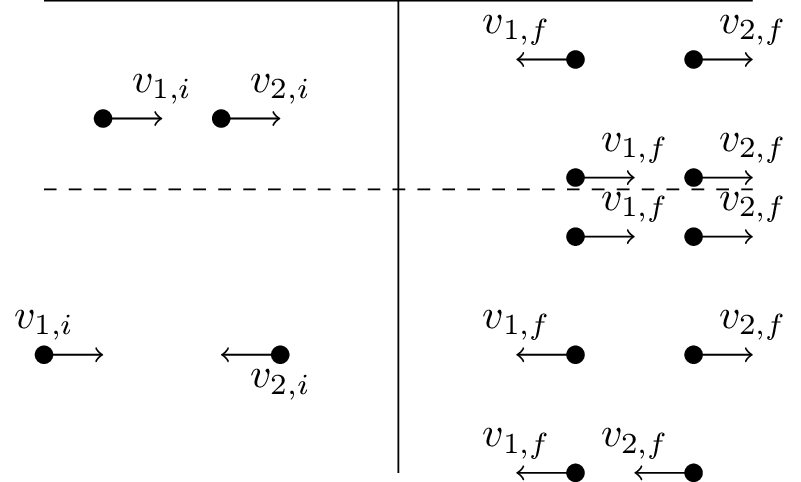
</figure>

Se un corpo si scontra contro un oggetto immobile all’urto, allora si può analizzare come se avesse una massa inerziale tendente all’infinito, poiché si oppone al moto dell’oggetto. In questo caso il corpo che si scontra rimbalza contro l’oggetto con una velocità: $$v_{1,f}=\displaystyle\lim_{m_2\to\infty}\frac{(m_1-m_2)v_{1,i}}{m_1+m_2}=\lim_{m_2\to\infty}\frac{\left(\frac{m_1}{m_2}-1\right)v_{1,i}}{\frac{m_1}{m_2}+1}=\frac{-1\cdot v_{1,i}}{1}=-v_{1,i}$$

### Anelastici

Un urto anelastico è un urto dove non viene conservata l’energia: $K_f<K_i$, si disperde nell’ambiente una porzione dell’energia cinetica iniziale sotto forma di calore. Di conseguenza, le velocità finali saranno minori dei loro valori in un urto elastico.  
Un urto viene definito perfettamente anelastico se i due corpi dopo la collisione rimangono a contatto. L’energia cinetica non viene conservata, mentre la quantità di moto viene conservata. Dato che rimangono a contatto hanno la stessa velocità finale.

Dati due corpi che si urtano di urto perfettamente anelastico, per la conservazione della quantità di moto prima e dopo l’urto si può determinare la velocità finale del sistema: $$\begin{gathered}
    \boldsymbol{\mathbf{p}}_{1,i}+\boldsymbol{\mathbf{p}}_{2,i}=\boldsymbol{\mathbf{p}}_{1,f}+\boldsymbol{\mathbf{p}}_{2,f}\\
    m_1\boldsymbol{\mathbf{v}}_{1,i}+m_2\boldsymbol{\mathbf{v}}_{2,i}=(m_1+m_2)\boldsymbol{\mathbf{v}}_f\\
    \boldsymbol{\mathbf{v}}_f=\displaystyle\frac{m_1\boldsymbol{\mathbf{v}}_{1,i}+m_2\boldsymbol{\mathbf{v}}_{2,i}}{m_1+m_2}\tag{\stepcounter{equation}\theequation}
\end{gathered}$$ Per cui la velocità dei due corpi corrisponde alla velocità del centro di massa del sistema.

Dato che una porzione dell’energia viene dissipata durante l’urto, le forze interne impulsive, non sono conservative. Poiché i corpi rimangono uniti dopo l’urto, si deformano, e l’energia dissipata corrisponde al lavoro necessario per deformare irreversibilmente i due corpi. Poiché la velocità dei corpi coincide alla velocità del centro di massa, l’energia cinetica del sistema sarà nulla nel sistema di riferimento concorde al centro di massa $K(S_{\mathrm{c.d.m.}})=0$, mentre sarà uguale all’energia cinetica del centro di massa in un qualsiasi sistema di riferimento inerziale $S$ ad esso $K(S)=K_{\mathrm{c.d.m.}}(S)$. Per cui l’energia dissipata durante l’urto può essere calcolata come la differenza tra l’energia cinetica prima dell’urto e l’energia cinetica del centro di massa, nello stesso sistema di riferimento inerziale. Per il secondo teorema di Köning, questa differenza è esattamente l’energia cinetica dei due punti materiali prima dell’urto nel sistema di riferimento del centro di massa: $$E_\mathrm{dis.}=K_i(S)-K_{\mathrm{c.d.m.}}(S)=K_i(S_{\mathrm{c.d.m.}})$$

## Momento di un Punto Materiale

Lo stato di un punto può essere descritto mediante variabili lineari, ma per analizzare lo stato di un sistema di punti sono necessarie anche componenti rotazionali. Sono già state introdotte $\theta,\:\boldsymbol{\mathbf{\omega}},\:\boldsymbol{\mathbf{\alpha}}$, corrispettivi delle variabili lineari $\boldsymbol{\mathbf{r}},\:\boldsymbol{\mathbf{v}},\:\boldsymbol{\mathbf{a}}$, ma mancano i corrispettivi rotazionali della forza $\boldsymbol{\mathbf{F}}$ e del lavoro $W_{\Gamma}$.  
Viene definito il momento $\boldsymbol{\mathbf{M}}$ di un vettore $\boldsymbol{\mathbf{v}}$, applicato ad un punto $Q$ rispetto ad un polo $P$ il prodotto vettoriale tra la distanza dal punto $P$ al punto $Q$ dove è applicato il vettore per il vettore $\boldsymbol{\mathbf{v}}$ stesso: $$\boldsymbol{\mathbf{M}}_P=\boldsymbol{\mathbf{r}}_{PQ}\times\boldsymbol{\mathbf{v}}=r_{PQ}v\sin\theta\:\hat{\boldsymbol{\mathbf{r}}}_{PQ}\times\hat{\boldsymbol{\mathbf{v}}}$$ In caso si volesse ottenere il momento rispetto ad un altro polo $P'$, dato il vettore distanza tra i due poli $\boldsymbol{\mathbf{R}}$: $\boldsymbol{\mathbf{r}}_{P'Q}=\boldsymbol{\mathbf{r}}_{PQ}-\boldsymbol{\mathbf{R}}$. Il momento sarà: $$\boldsymbol{\mathbf{M}}_{P'}=\boldsymbol{\mathbf{r}}_{P'Q}\times\boldsymbol{\mathbf{v}}=(\boldsymbol{\mathbf{r}}_{PQ}-\boldsymbol{\mathbf{R}})\times\boldsymbol{\mathbf{v}}=\boldsymbol{\mathbf{M}}_P-\boldsymbol{\mathbf{R}}\times\boldsymbol{\mathbf{v}}$$

<figure>
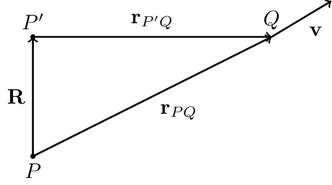
</figure>

Viene definito il momento angolare $\boldsymbol{\mathbf{L}}$, il momento della quantità di moto applicato in un polo $P$: $$\boldsymbol{\mathbf{L}}_P=\boldsymbol{\mathbf{r}}_P\times\boldsymbol{\mathbf{p}}\left[\mathrm{m}^2\cdot \mathrm{kg}\cdot\mathrm{s}^{-1}\right]$$ Viene definito il momento torcente $\boldsymbol{\mathbf{\tau}}_P$ o $(\boldsymbol{\mathbf{M}}_P)$, il momento della forza applicato ad un polo $P$: $$\boldsymbol{\mathbf{\tau}}_P=\boldsymbol{\mathbf{r}}_P\times\boldsymbol{\mathbf{F}}\left[\mathrm{m}\cdot \mathrm{N}\right]=[\mathrm{J}]$$

Quando sono applicate più forze in un punto, il momento risultante è uguale al momento della risultante. Derivando il momento angolare applicato su un polo $P$ rispetto al tempo, si ottiene:

$$\displaystyle\frac{\mathrm{d}\boldsymbol{\mathbf{L}}_P}{\mathrm{d}t}=\frac{\mathrm{d}\boldsymbol{\mathbf{r}}_P}{\mathrm{d}t}\times\boldsymbol{\mathbf{p}}+\boldsymbol{\mathbf{r}}_P\times\frac{\mathrm{d}\boldsymbol{\mathbf{p}}}{\mathrm{d}t}=\boldsymbol{\mathbf{v}}_P\times\boldsymbol{\mathbf{p}}+\boldsymbol{\mathbf{r}}_P\times\boldsymbol{\mathbf{F}}=\cancelto{0}{\boldsymbol{\mathbf{v}}_P\times(m\boldsymbol{\mathbf{v}})}+\boldsymbol{\mathbf{\tau}}_P=\boldsymbol{\mathbf{\tau}}_P$$

Si considera per semplicità il caso dove la velocità del polo $P$ sia solidale alla velocità del punto materiale.

Un qualsiasi moto può essere approssimato localmente come un moto circolare. Considerando il lavoro svolto in un moto circolare $W$, lo spostamento infinitesimo può essere espresso in termini polari $\mathrm{d}s=r\mathrm{d}\theta$. Il lavoro si può quindi esprimere rispetto al modulo del momento torcente: $$W=\displaystyle\int_{s_A}^{s_B}{F}_s \mathrm{d}s=\int_{\theta_A}^{\theta_B}F_sr\mathrm{d}\theta=\int_{\theta_A}^{\theta_B}\tau \mathrm{d}\theta$$

Feynman dimostrò quest’ultima relazione nel seguente modo. Si considera un punto che si muove su un traiettoria circolare su cui agisce una forza $\boldsymbol{\mathbf{F}}$, e la variazione del vettore posizione del punto $\mathrm{d}\boldsymbol{\mathbf{r}}$. Per variazioni infinitesime dell’angolo $\mathrm{d}\theta$, si può approssimare la variazione della posizione come $\mathrm{d}\boldsymbol{\mathbf{r}}\approx r\sin \mathrm{d}\theta\hat{\boldsymbol{\mathbf{\tau}}}$. Per $\mathrm{d}\theta\to 0\Rightarrow \sin \mathrm{d}\theta\approx \mathrm{d}\theta$, allora si può approssimare la variazione di posizione come $\mathrm{d}\boldsymbol{\mathbf{r}}=r\mathrm{d}\theta\hat{\boldsymbol{\mathbf{\tau}}}$.

Il differenziale del lavoro è allora $\delta W =\boldsymbol{\mathbf{F}}\cdot \mathrm{d}\boldsymbol{\mathbf{r}}=\boldsymbol{\mathbf{F}}\cdot\hat{\boldsymbol{\mathbf{\tau}}}r\mathrm{d}\theta$, si scompone $\boldsymbol{\mathbf{F}}$ nei suoi componenti $\delta W=(F_x\hat{\boldsymbol{\mathbf{x}}}+F_y\hat{\boldsymbol{\mathbf{y}}})\cdot\hat{\boldsymbol{\mathbf{\tau}}}r\mathrm{d}\theta$. Si considera l’angolo $\varphi$ tra il versore $\hat{\boldsymbol{\mathbf{\tau}}}$ e l’asse verticale $y$, allora:

$$\begin{gathered}
    \begin{cases}
        \displaystyle\hat{\boldsymbol{\mathbf{x}}}\cdot\hat{\boldsymbol{\mathbf{\tau}}}=\cos\left(\varphi+\displaystyle\frac{\pi}{2}\right)=-\sin\varphi\\
        \displaystyle\hat{\boldsymbol{\mathbf{y}}}\cdot\hat{\boldsymbol{\mathbf{\tau}}}=\cos\varphi
    \end{cases}\\
    \delta W =(F_x\hat{\boldsymbol{\mathbf{x}}}\cdot\hat{\boldsymbol{\mathbf{\tau}}}+F_y\hat{\boldsymbol{\mathbf{y}}}\cdot\hat{\boldsymbol{\mathbf{\tau}}})r\mathrm{d}\theta\\
    (-F_xr\sin\varphi+F_yr\cos\varphi)\mathrm{d}\theta\\
    (-F_xr_y+F_yr_x)\hat{\boldsymbol{\mathbf{z}}}\cdot\hat{\boldsymbol{\mathbf{z}}}\mathrm{d}\theta\\
    (r_xF_y\cdot\hat{\boldsymbol{\mathbf{z}}}-r_yF_x\cdot\hat{\boldsymbol{\mathbf{z}}}+0+0)\cdot\hat{\boldsymbol{\mathbf{z}}}\mathrm{d}\theta\\
    (r_xF_x\hat{\boldsymbol{\mathbf{x}}}\times\hat{\boldsymbol{\mathbf{x}}}+r_xF_y\hat{\boldsymbol{\mathbf{x}}}\times\hat{\boldsymbol{\mathbf{y}}}+r_yF_x\hat{\boldsymbol{\mathbf{y}}}\times\hat{\boldsymbol{\mathbf{x}}}+r_yF_y\hat{\boldsymbol{\mathbf{y}}}\times\hat{\boldsymbol{\mathbf{y}}})\cdot\hat{\boldsymbol{\mathbf{z}}}\mathrm{d}\theta\\
    (\boldsymbol{\mathbf{r}}\times\boldsymbol{\mathbf{F}})\cdot\hat{\boldsymbol{\mathbf{z}}}\mathrm{d}\theta\\
    W=\displaystyle\int_{\theta_A}^{\theta_B}(\boldsymbol{\mathbf{r}}\times\boldsymbol{\mathbf{F}})\cdot\hat{\boldsymbol{\mathbf{z}}}\mathrm{d}\theta=\int_{\theta_A}^{\theta_B}\boldsymbol{\mathbf{\tau}}_P\cdot\hat{\boldsymbol{\mathbf{z}}}\mathrm{d}\theta=\int_{\theta_A}^{\theta_B}{\tau}_{P,z}\mathrm{d}\theta\tag{\stepcounter{equation}\theequation}
\end{gathered}$$

<figure>
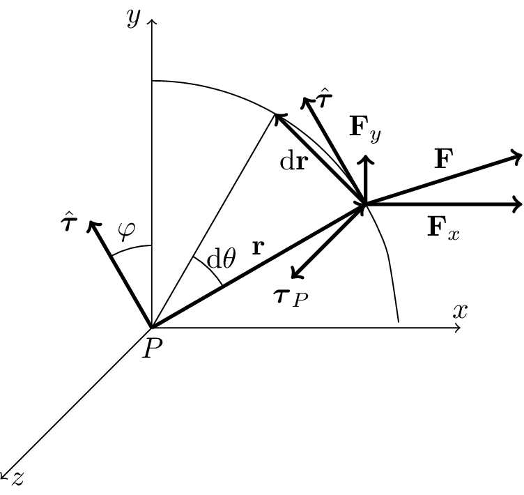
</figure>

## Momento di un Sistema di Punti Materiali

In un insieme di punti, si calcolano i momenti rispetto al sistema di riferimento inerziale solidale al centro di massa del sistema $S_{\mathrm{c.d.m.}}$. La somma di tutti i momenti angolari del sistema è: $\boldsymbol{\mathbf{L}}=\sum_{i=1}^{N}\boldsymbol{\mathbf{r}}_i\times\boldsymbol{\mathbf{p}}_i$, derivandola si ottiene la somma dei momenti torcenti del sistema: $$\displaystyle\frac{\mathrm{d}\boldsymbol{\mathbf{L}}}{\mathrm{d}t}=\sum_{i=1}^{N}\left(\frac{\mathrm{d}\boldsymbol{\mathbf{r}}_i}{\mathrm{d}t}\times\boldsymbol{\mathbf{p}}_i+\boldsymbol{\mathbf{r}}_i\times\frac{\mathrm{d}\boldsymbol{\mathbf{p}}_i}{\mathrm{d}t}\right)=\sum_{i=1}^{N}(\cancelto{0}{\boldsymbol{\mathbf{v_i}}\times\boldsymbol{\mathbf{p}}_i}+\boldsymbol{\mathbf{r}}_i\times\boldsymbol{\mathbf{F}}_i)=\boldsymbol{\mathbf{\tau}}^\mathrm{tot}$$ Il momento torcente totale non è uguale al momento torcente della forza totale del sistema: $$\boldsymbol{\mathbf{\tau}}^\mathrm{tot}\neq\boldsymbol{\mathbf{r}}\times\boldsymbol{\mathbf{F}}^\mathrm{tot}$$ Poiché la posizione descritta dal vettore $\boldsymbol{\mathbf{r}}$ non corrisponde ad alcun punto noto del sistema di punti, né al suo centro di massa, per cui il suo valore non è definito. Poiché la somma delle forze interne al sistema è nulla, è nulla anche la risultante dei loro momenti torcenti. Date due forze interne opposte $\boldsymbol{\mathbf{F}}_{i\to j}=-\boldsymbol{\mathbf{F}}_{j\to i}$, applicate su due punti $\boldsymbol{\mathbf{r}}_i$ e $\boldsymbol{\mathbf{r}}_j$, la somma dei momenti delle due forze è: $\boldsymbol{\mathbf{r}}_j\times\boldsymbol{\mathbf{F}}_{i\to j}+\boldsymbol{\mathbf{r}}_i\times\boldsymbol{\mathbf{F}}_{j\to i}=(\boldsymbol{\mathbf{r}}_i-\boldsymbol{\mathbf{r}}_j)\times\boldsymbol{\mathbf{F}}_{j\to i}$, il vettore distanza $\boldsymbol{\mathbf{\mathrm{d}}}=\boldsymbol{\mathbf{r}}_i-\boldsymbol{\mathbf{r}}_j$ è parallelo alla direzione su cui agiscono le forze per cui il prodotto vettoriale $\boldsymbol{\mathbf{\mathrm{d}}}\times\boldsymbol{\mathbf{F}}_{j\to i}$ è nullo. Il momento torcente totale allora è dato dalla sole forze esterne al sistema: $$\boldsymbol{\mathbf{\tau}}_P=\displaystyle\sum_{i=1}^{N}(\boldsymbol{\mathbf{r}}_i\times\boldsymbol{\mathbf{F}}^\mathrm{est}_i+\cancelto{0}{\boldsymbol{\mathbf{r}}_i\times\boldsymbol{\mathbf{F}}^\mathrm{int}_i})=\sum_{i=1}^{N}\boldsymbol{\mathbf{r}}_i\times\boldsymbol{\mathbf{F}}^\mathrm{est}_i$$

<figure>
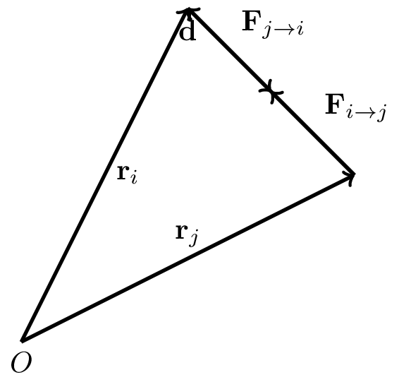
</figure>

Dato un insieme di punti $\mathscr{S}$, ogni punto ha un suo momento angolare, la risultante di questi momenti corrisponde al momento angolare dell’intero sistema. Per ogni punto $P_i$ si considera la distanza del punto dal polo $P$ $\boldsymbol{\mathbf{\mathrm{d}}}_{iP}$ per calcolarne il momento angolare $\boldsymbol{\mathbf{L}}=\boldsymbol{\mathbf{\mathrm{d}}}_{iP}\times\boldsymbol{\mathbf{p}}_i$. La distanza $\boldsymbol{\mathbf{\mathrm{d}}}_{iP}$ corrisponde alla differenza delle posizioni del punto $P_i$ e del polo $P$: $\boldsymbol{\mathbf{\mathrm{d}}}_{iP}=\boldsymbol{\mathbf{r}}_i-\boldsymbol{\mathbf{R}}_P$, per cui si può esprimere il momento angolare rispetto alle posizioni del polo $\boldsymbol{\mathbf{r}}_P$ e del punto $\boldsymbol{\mathbf{r}}_i$: $$\begin{gathered}
    \boldsymbol{\mathbf{L}}_P=\displaystyle\sum_{i=1}^{N}\boldsymbol{\mathbf{\mathrm{d}}}_{iP}\times\boldsymbol{\mathbf{p}}_i\\
    \boldsymbol{\mathbf{L}}_P=\displaystyle\sum_{i=1}^N(\boldsymbol{\mathbf{r}}_i-\boldsymbol{\mathbf{r}}_P)\times\boldsymbol{\mathbf{p}}_i
\end{gathered}$$ Derivando il momento angolare ottenuto nel sistema di riferimento inerziale $S$: $$\begin{gathered}
    \displaystyle\frac{\mathrm{d}\boldsymbol{\mathbf{L}}_P}{\mathrm{d}t}=\sum_{i=1}^N\frac{\mathrm{d}(\boldsymbol{\mathbf{r}}_i-\boldsymbol{\mathbf{r}}_P)}{\mathrm{d}t}\times\boldsymbol{\mathbf{p}}_i+\sum_{i=1}^N(\boldsymbol{\mathbf{r}}_i-\boldsymbol{\mathbf{r}}_P)\times\frac{\mathrm{d}\boldsymbol{\mathbf{p}}_i}{\mathrm{d}t}\\
    \displaystyle\frac{\mathrm{d}\boldsymbol{\mathbf{L}}_P}{\mathrm{d}t}=\sum_{i=1}^N\frac{\mathrm{d}\boldsymbol{\mathbf{r}}_i}{\mathrm{d}t}\times\boldsymbol{\mathbf{p}}_i-\sum_{i=1}^N\frac{\mathrm{d}\boldsymbol{\mathbf{r}}_P}{\mathrm{d}t}\times\boldsymbol{\mathbf{p}}_i+\sum_{i=1}^N(\boldsymbol{\mathbf{r}}_i-\boldsymbol{\mathbf{r}}_P)\times\boldsymbol{\mathbf{F}}_i\\
    \displaystyle\frac{\mathrm{d}\boldsymbol{\mathbf{L}}_P}{\mathrm{d}t}=\sum_{i=1}^N\cancelto{0}{\boldsymbol{\mathbf{v}}_i\times\boldsymbol{\mathbf{p}}_i}-\boldsymbol{\mathbf{v}}_P\times\sum_{i=1}^N\boldsymbol{\mathbf{p}}_i+\boldsymbol{\mathbf{\tau}}_P\\
    \displaystyle\frac{\mathrm{d}\boldsymbol{\mathbf{L}}_P}{\mathrm{d}t}=\boldsymbol{\mathbf{\tau}}_P-\boldsymbol{\mathbf{v}}_P\times\boldsymbol{\mathbf{p}}^\mathrm{tot}\tag{\stepcounter{equation}\theequation}
\end{gathered}$$ Se una delle seguenti condizioni è verificata: il polo è fermo, la quantità di moto totale del sistema è nulla, la velocità del polo e la quantità di moto totale del sistema sono paralleli, oppure il polo coincide con il centro di massa del sistema; allora l’evoluzione del momento angolare rispetto al polo $P$ dipende interamente dal momento delle forze applicate al polo $P$. Viene definita quest’espressione seconda equazione cardinale: $$ii)\;\displaystyle\frac{\mathrm{d}\boldsymbol{\mathbf{L}}_P}{\mathrm{d}t}=\boldsymbol{\mathbf{\tau}}_P$$ Se su un sistema di punti materiali è isolato, ed una delle condizioni della seconda equazione cardinale è verificata, il momento angolare si conserva per qualsiasi polo e la quantità di moto si conserva. Se non è isolato e il momento torcente risultante è nullo per un determinato polo, il momento angolare si conserva solo per quel determinato polo.

## Coppie di Forze

Dato un sistema composto da due punti materiali, perfettamente isolato: $\boldsymbol{\mathbf{F}}^\mathrm{est}=\boldsymbol{\mathbf{0}}$, descritto rispetto al sistema di riferimento del centro di massa $S_{\mathrm{c.d.m.}}$ dove la posizione del centro di massa rimane costante $\boldsymbol{\mathbf{p}}_{\mathrm{c.d.m.}}=\boldsymbol{\mathbf{p}}^\mathrm{tot}=\boldsymbol{\mathbf{0}}$. Il sistema ruota intorno al centro di massa con una certa velocità angolare $\boldsymbol{\mathbf{\omega}}$. Il momento angolare del sistema è dato dalla somma dei momenti angolari dei due punti: $$\boldsymbol{\mathbf{L}}=\boldsymbol{\mathbf{L}}_1+\boldsymbol{\mathbf{L}}_2=\boldsymbol{\mathbf{r}}_1\times m_1\boldsymbol{\mathbf{v}}_1+\boldsymbol{\mathbf{r}}_2\times m_2\boldsymbol{\mathbf{v}}_2=(r_1m_1v_1+r_2m_2v_2)\hat{\boldsymbol{\mathbf{z}}}$$ Se i due punti hanno masse uguali, la loro distanza dal centro di massa è uguale, e hanno una velocità uguale poiché hanno la stessa velocità angolare e distanza dal centro $\boldsymbol{\mathbf{v}}=\boldsymbol{\mathbf{\omega}}\times\boldsymbol{\mathbf{r}},\:\boldsymbol{\mathbf{\omega}}\perp\boldsymbol{\mathbf{r}}\rightarrow v=\omega r$, il momento angolare del sistema risulta essere $\boldsymbol{\mathbf{L}}=2mrv\hat{\boldsymbol{\mathbf{z}}}=2mr^2\omega\hat{\boldsymbol{\mathbf{z}}}=2mr^2\boldsymbol{\mathbf{\omega}}$. Si considera $b$ la distanza tra le due masse $d_{m_1,m_2}$, il momento angolare può essere espresso come: $$\boldsymbol{\mathbf{L}}=\displaystyle 2m\left(\frac{b}{2}\right)^2\boldsymbol{\mathbf{\omega}}=\frac{mb^2}{2}\boldsymbol{\mathbf{\omega}}=I\boldsymbol{\mathbf{\omega}}$$

### Momento d’Inerzia

Dove viene definito il momento d’inerzia $I$: $$I=\displaystyle\frac{mb^2}{2}\;\left[\mathrm{kg}\cdot \mathrm{m}^2\right]$$ Rappresenta la resistenza del sistema ad una rotazione, analogamente a come la massa inerziale rappresenta quanto un corpo resiste ad uno spostamento. Il momento d’inerzia varia a seconda della disposizione dei punti nel sistema, come per il centro di massa, ma cambia a seconda dell’asse $z$ su cui ruota, per cui uno stessi sistema può avere momenti d’inerzia differenti in base alla posizione dell’asse di rotazione.

<figure>
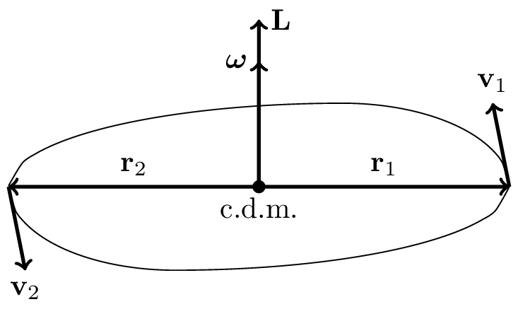
</figure>

È possibile, in certi casi, rappresentare il momento angolare di un sistema di punti materiali come il prodotto tra il momento di inerzia $I$ del sistema e la velocità angolare $\boldsymbol{\mathbf{\omega}}$ del sistema.

## Densità

Dato un corpo esteso, di massa totale $M$ e volume $V$. Se esso è continuo è possibile dividerlo in volumetti di piccolo volume $\mathrm{d}V$, distanti $\boldsymbol{\mathbf{r}}_i$ dal centro del sistema di riferimento, ciascuno avente una massa $\mathrm{d}m$. La suddivisione del corpo è $\mathrm{d}V=\mathrm{d}x\mathrm{d}y\mathrm{d}z$ in $3$ dimensioni, $\mathrm{d}S=\mathrm{d}x\mathrm{d}y$ in $2$ dimensioni, $\mathrm{d}L=\mathrm{d}x$ in $1$ dimensione.

Data una suddivisione sempre più piccola del corpo, i suoi elementi tendono a diventare di volume infinitesimo $\mathrm{d}V\to 0$ e la massa tende anch’essa ad un valore infinitesimo $\mathrm{d}m\to 0$.

Si definisce la densità (di massa) $\rho$ di uno di questi volumetti il rapporto tra la loro massa infinitesima e la grandezza della loro suddivisione. In base alla dimensione del corpo si ha densità volumica: $$\displaystyle\frac{\mathrm{d}m}{\mathrm{d}V}\;\left[\mathrm{kg}\cdot\mathrm{m}^{-3}\right]$$ Densità superficiale: $$\displaystyle\frac{\mathrm{d}m}{\mathrm{d}S}\;\left[\mathrm{kg}\cdot\mathrm{m}^{-2}\right]$$ Densità lineare: $$\displaystyle\frac{\mathrm{d}m}{\mathrm{d}L}\;\left[\mathrm{kg}\cdot\mathrm{m}^{-1}\right]$$  
Un corpo viene definito omogeneo se la densità di ogni suddivisione del corpo è uguale $\rho_i=\rho_j$, ovvero se ogni suddivisione infinitesima contiene la stessa massa $\mathrm{d}m$. La densità di un corpo omogeneo può essere calcolata dal rapporto tra la massa totale e la sua dimensione $\rho={M}/{V}$. Per un corpo non omogeneo la densità è una funzione della posizione $\rho(\boldsymbol{\mathbf{r}})$, si può calcolare la massa integrandola su tutto il corpo: $$M=\displaystyle\int_M \mathrm{d}m=\int_V \rho(x,y,z) \mathrm{d}V$$

Il centro di massa di un corpo esteso può essere calcolato considerando tutte le sue suddivisioni infinitesime: $$\boldsymbol{\mathbf{r}}_{\mathrm{c.d.m.}}=\lim_{N\to\infty}\displaystyle\frac{\sum_{i=1}^{N}m_i\boldsymbol{\mathbf{r}}_i}{\sum_{i=1}^{N}m_i}=\displaystyle\frac{1}{M}\int_M\boldsymbol{\mathbf{r}}\mathrm{d}m=\displaystyle\frac{1}{M}\int_V\boldsymbol{\mathbf{r}}\rho \mathrm{d}V$$ Sia il vettore posizione che la densità sono funzioni a $3$ variabili $\boldsymbol{\mathbf{r}}(x,y,z)$, $\rho(x,y,z)$ e il differenziale del volume può essere espresso come $\mathrm{d}V=\mathrm{d}x\mathrm{d}y\mathrm{d}z$, per cui questo integrale corrisponde ad un integrale triplo sulle tre direzioni $x$, $y$ e $z$ su cui è definito il corpo.

Per cui la posizione del centro di massa di un corpo omogeneo non dipende dalla massa contenuta dal corpo, ma dalla sua forma. Se il corpo è simmetrico rispetto ad un punto, un asse o un piano, il centro di massa appartiene a quel’asse o quel piano oppure coincide con quel punto. Se sono presenti più di un asse o piano di simmetria, il centro di massa si trova sulla loro intersezione.

## Corpo Rigido

Viene definito corpo rigido un insieme di punti materiali la cui distanza relativa non varia nel tempo $|\boldsymbol{\mathbf{r}}_i-\boldsymbol{\mathbf{r}}_j|=\mathrm{cost.}$ Questo rappresenta un modello ideale di un corpo indeformabile. La distanza di ogni punto del corpo con il centro di massa rimane costante $|\boldsymbol{\mathbf{r}}_i-\boldsymbol{\mathbf{r}}_{\mathrm{c.d.m.}}|=\mathrm{cost.}\:\forall i\in[1,N]$, quindi è possibile ottenere la posizione del centro di massa, dati due punti del corpo rigido. Per cui un corpo rigido ha sei gradi di libertà corrispondenti alla posizione di due punti in un sistema di riferimento inerziale. Viene definito corpo esteso un corpo rigido formato da un’ infinità di punti materiali.  
Considerando un corpo rigido, su cui agisce una forza peso $\boldsymbol{\mathbf{F}}_{{P,i}}$, su ogni punto del corpo, il momento torcente causato dalla forza peso del corpo è dato da: $$\boldsymbol{\mathbf{\tau}}=\displaystyle\sum_{i=1}^{N}\boldsymbol{\mathbf{r}}_i\times\boldsymbol{\mathbf{F}}_{P,i}=
    \displaystyle\sum_{i=1}^{N}m_i\boldsymbol{\mathbf{r}}_i\times\boldsymbol{\mathbf{g}}\frac{M}{M}=
    M\displaystyle\frac{\sum_{i=1}^{N}m_i\boldsymbol{\mathbf{r}}_i}{M}\times\boldsymbol{\mathbf{g}}=
    \boldsymbol{\mathbf{r}}_{\mathrm{c.d.m.}}\times M\boldsymbol{\mathbf{g}}=
    \boldsymbol{\mathbf{r}}_{\mathrm{c.d.m.}}\times \boldsymbol{\mathbf{F}}_P^\mathrm{tot}$$ In questo caso la somma dei momenti torcenti è uguale al momento totale agente sul centro di massa. In generale questa relazione è valida solo la forza è costante nel tempo e le forze agenti sui vari punti del sistema sono parallele tra di loro: $$\boldsymbol{\mathbf{\tau}}=\displaystyle\frac{\sum_{i=1}^{N}F_i\boldsymbol{\mathbf{r}}_i}{\sum_{i=1}^{N}F_i}\times\sum_{i=1}^{N}\boldsymbol{\mathbf{F}}_I$$ Dove si definisce il centro delle forze: $$\displaystyle\frac{\sum_{i=1}^{N}F_i\boldsymbol{\mathbf{r}}_i}{\sum_{i=1}^{N}F_i}$$  
Data un’asta rigida di lunghezza $L$ e di densità lineare omogenea $\rho={M}/{L}$ , il suo centro di massa è dato da: $$x_{\mathrm{c.d.m.}}=\displaystyle\frac{1}{M}\int_{0}^{L}x\rho \mathrm{d}x=\frac{1}{L}\int_{0}^{L}x\mathrm{d}x=\frac{x^2}{L}\Bigg|_0^L=\frac{L}{2}$$  
Dato un corpo rigido che ruota, in un sistema di riferimento inerziale, intorno ad un asse $z$ fisso con una velocità angolare $\boldsymbol{\mathbf{\omega}}=\omega\hat{\boldsymbol{\mathbf{z}}}=vR\hat{\boldsymbol{\mathbf{z}}}$. Dove $R$ è il raggio della rotazione che compie un punto del corpo, ovvero la distanza del punto su un piano $x,y$ dall’asse $z$ di rotazione. Si esprime una variazione infinitesima di momento angolare: $$\begin{gathered}
    \mathrm{d}\boldsymbol{\mathbf{L}}=\boldsymbol{\mathbf{r}}\times \mathrm{d}\boldsymbol{\mathbf{p}}=\boldsymbol{\mathbf{r}}\times\boldsymbol{\mathbf{v}}\:\mathrm{d}m\\
    \mathrm{d}L=r\cdot v\sin\displaystyle\frac{\pi}{2}\:\mathrm{d}m=\omega Rr\:\mathrm{d}m
\end{gathered}$$ Questo momento angolare è ortogonale al piano individuato dai vettori $\boldsymbol{\mathbf{r}}$ e $\boldsymbol{\mathbf{v}}$, per cui si trova ad un angolo $\alpha={\pi}/{2}-\theta$ dall’asse di rotazione $z$. In generale il momento angolare $\boldsymbol{\mathbf{L}}$ non è parallelo all’asse di rotazione, per cui in generale non esiste una relazione di proporzionalità tra la velocità angolare lungo l’asse $z$ e il momento angolare. Considerando solo la componente assiale del momento angolare sull’asse $z$ si ottiene: $$\begin{gathered}
    \mathrm{d}L_z=\mathrm{d}L\cos\left(\displaystyle\frac{\pi}{2}-\theta\right)=\omega Rr\sin\theta\:\mathrm{d}m=\omega R^2\mathrm{d}m\\
    L_z=\displaystyle\int_M\omega R^2\mathrm{d}m=\omega\int_M R^2\mathrm{d}m=\omega I_z
\end{gathered}$$

<figure>
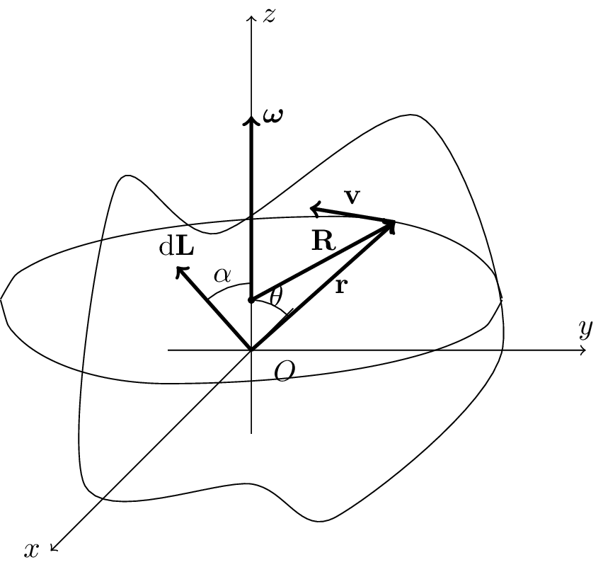
</figure>

### Momento d’Inerzia di un Corpo Rigido

Viene definito momento d’inerzia $I_z$, rispetto all’asse fisso $z$, di un corpo rigido, l’integrale sull’intero corpo della distanza quadrata sul piano $(x,y)$ dall’asse $z$, $R^2=x^2+y^2$: $$I_z=\displaystyle\int_M R^2\mathrm{d}m=\int_V R^2\rho \mathrm{d}V$$ Il momento d’inerzia dipende dalle masse e dalla loro posizione rispetto all’asse di rotazione, non dipende solo dalla struttura del corpo come il centro di massa, poiché bisogna conoscere anche la posizione del corpo rispetto all’asse di rotazione. Il momento d’inerzia rispetto ad un asse fisso non considera la componente parallela della posizione, solo la sua proiezione sul piano ortogonale all’asse $z$.

Se il corpo è formato da un numero discreto di punti allora il momento di inerzia è dato dalla somma dei momenti di inerzia dei punti per lo stesso asse di rotazione: $I_z=\sum_{i=1}^{N}R_i^2m_i$. Se dovesse cambiare la forma del corpo, cambierebbe il momento di inerzia, quindi si studia il momento d’inerzia rispetto corpi fissi.  
La componente ortogonale all’asse di rotazione del momento angolare non dipende dal momento d’inerzia $I_z$: $$L_{xy}=\omega\int_V Rr\cos\theta \rho \mathrm{d}V$$

Se corpo ruota su un asse di simmetria del corpo, il momento angolare totale ha una componente ortogonale all’asse di rotazione nulla. I contributi per ogni coppia di punti simmetrici tra di loro hanno componenti ortogonali simmetriche tra di loro, quindi si bilanciano a vicenda, e la risultante dei momenti angolari ortogonali è nulla. Più in generale se il corpo ruota su un asse di inerzia il momento angolare è parallelo all’asse di rotazione. $$\boldsymbol{\mathbf{L}}_{x,y}=\boldsymbol{\mathbf{0}}\iff\boldsymbol{\mathbf{L}}=\boldsymbol{\mathbf{L}}_z=I_z\boldsymbol{\mathbf{\omega}}$$ Se il momento angolare presenta componenti nelle tre direzioni $(x,y,z)$, ognuna avente un suo momento di inerzia diverso, si può rappresentare il momento di inerzia complessivo come un tensore $I$ tale che: $$\boldsymbol{\mathbf{L}}=I\boldsymbol{\mathbf{\omega}}\Rightarrow
    \begin{pmatrix}
        L_x\\
        L_y\\
        L_z
    \end{pmatrix}=
    \begin{pmatrix}
        I_{xx} & I_{xy} & I_{xz}\\
        I_{yx} & I_{yy} & I_{yz}\\
        I_{zx} & I_{zy} & I_{zz}
    \end{pmatrix}\cdot
    \begin{pmatrix}
        \omega_x\\
        \omega_y\\
        \omega_z
    \end{pmatrix}$$

Dato un corpo rigido è sempre possibile esprimere il suo momento di inerzia rispetto ad un asse di rotazione $z$ in funzione del raggio d’inerzia o raggio di girazione $k$. Viene definito come la distanza necessaria dall’asse $z$ ad un polo contenente tutta la massa del corpo rigido affinché il momento d’inerzia rimanga invariato. $$I_z=mk^2$$

### Cinematica del Corpo Rigido

Se un corpo rigido si muove di un generico moto di traslazione a velocità costante $\boldsymbol{\mathbf{V}}$, il centro di massa ha velocità: $$\boldsymbol{\mathbf{v}}_{\mathrm{c.d.m.}}=\displaystyle\frac{\int_M\boldsymbol{\mathbf{V}}\mathrm{d}m}{\int_M \mathrm{d}m}=\boldsymbol{\mathbf{V}}$$ La quantità di moto del corpo rigido è quindi: $$\boldsymbol{\mathbf{p}}^\mathrm{tot}=\boldsymbol{\mathbf{p}}_{\mathrm{c.d.m.}}=M\boldsymbol{\mathbf{V}}$$ Essendo la velocità costante, per la prima equazione cardinale si ha: $$\displaystyle\frac{\mathrm{d}\boldsymbol{\mathbf{p}}_{\mathrm{c.d.m.}}}{\mathrm{d}t}=\boldsymbol{\mathbf{F}}^\mathrm{tot}=\boldsymbol{\mathbf{0}}$$ Se la velocità varia nel tempo: $$\displaystyle\frac{\mathrm{d}\boldsymbol{\mathbf{p}}_{\mathrm{c.d.m.}}}{\mathrm{d}t}=\boldsymbol{\mathbf{F}}^\mathrm{tot}$$ La dinamica è quella di un punto materiale, non c’è rotazione rispetto al centro di massa, per cui il momento angolare dipende solamente dalla posizione del centro di massa e dalla sua quantità di moto: $$\boldsymbol{\mathbf{L}}=\boldsymbol{\mathbf{r}}_{\mathrm{c.d.m.}}\times\boldsymbol{\mathbf{p}}_{\mathrm{c.d.m.}}$$ La seconda equazione cardinale non aggiunge quindi alcuna informazione: $$\displaystyle\frac{\mathrm{d}\boldsymbol{\mathbf{L}}}{\mathrm{d}t}=\boldsymbol{\mathbf{r}}_{\mathrm{c.d.m.}}\times\boldsymbol{\mathbf{F}}^\mathrm{tot}$$

Se un corpo rigido si muove di moto rotazionale con una velocità angolare $\boldsymbol{\mathbf{\omega}}$ su asse di inerzia, ogni punto ha la stessa velocità angolare, ma una velocità tangenziale diversa a seconda della distanza dall’asse di rotazione. Si analizza mediante la seconda equazione cardinale: $$\displaystyle\frac{\mathrm{d}\boldsymbol{\mathbf{L}}}{\mathrm{d}t}=I_z\frac{\mathrm{d}\boldsymbol{\mathbf{\omega}}}{\mathrm{d}t}=I_z\boldsymbol{\mathbf{\alpha}}=\boldsymbol{\mathbf{\tau}}$$ In generale la legge oraria del moto rotazionale viene ricavata dalla componente parallela all’asse di rotazione del momento torcente totale $\boldsymbol{\mathbf{\tau}}$. $$\displaystyle\frac{\mathrm{d}\boldsymbol{\mathbf{L}}}{\mathrm{d}t}=\frac{\mathrm{d}(\boldsymbol{\mathbf{L}}_z+\boldsymbol{\mathbf{L}}_{x,y})}{\mathrm{d}t}=\boldsymbol{\mathbf{\tau}}_z+\boldsymbol{\mathbf{\tau}}_{x,y}$$ Per ottenere una rotazione di velocità angolare costante, è necessario che la risultante dei momenti delle forze sia nulla.

In generale il moto di un corpo rigido può essere sempre considerato come la somma di una traslazione e di una rotazione. Ogni punto del corpo rigido viene traslato allo stesso modo del centro di massa, e può ruotare indipendentemente su un asse $z$ traslato allo stesso modo. La velocità di traslazione $\boldsymbol{\mathbf{V}}$ dipende dalla descrizione del moto, mentre la velocità angolare $\boldsymbol{\mathbf{\omega}}$ è indipendente dalla descrizione del moto. In generale i componenti $\boldsymbol{\mathbf{V}}$ e $\boldsymbol{\mathbf{\omega}}$ sono quindi indipendenti tra di loro, il moto del corpo rigido è simile al moto di un sistema di riferimento non inerziale, poiché anch’esso contiene un termine di traslazione ed uno di rotazione.

Se il corpo si muove di moto di rototraslazione il moto è descritto da: $$\begin{cases}
        \boldsymbol{\mathbf{a}}_{\mathrm{c.d.m.}}=\displaystyle\frac{\strut 1}{\strut M}\frac{\strut \mathrm{d}\boldsymbol{\mathbf{p}}}{\strut \mathrm{d}t}=\frac{\strut \boldsymbol{\mathbf{F}}^\mathrm{tot}}{\strut M}\\
        \boldsymbol{\mathbf{\alpha}}=\displaystyle\frac{\strut 1}{\strut I_z}\frac{\strut \mathrm{d}\boldsymbol{\mathbf{L}}_z}{\strut \mathrm{d}t}=\frac{\strut \boldsymbol{\mathbf{\tau}}_z-\boldsymbol{\mathbf{v}}_P\times\boldsymbol{\mathbf{p}}}{\strut I_z}
    \end{cases}$$ Quindi un corpo rigido si trova in uno stato di quiete, o di moto rettilineo uniforme, se $\boldsymbol{\mathbf{F}}^\mathrm{tot}=\boldsymbol{\mathbf{0}}$ e $\boldsymbol{\mathbf{\tau}}_z=\boldsymbol{\mathbf{0}}$.

L’energia cinetica del corpo in rotazione è data dalla somma delle energie cinetiche dei singoli punti, considerando un corpo esteso il numero di punti tende all’infinito: $$K=\displaystyle\lim_{N\to\infty}\sum_{i=1}^{N}\frac{m_iv_i^2}{2}=\int_M\frac{v^2}{2}\mathrm{d}m=\int_M\frac{\omega^2R^2}{2}\mathrm{d}m=\frac{\omega^2}{2}\int_M R^2\mathrm{d}m=\frac{1}{2}I_z\omega^2$$ Viene così definita l’energia cinetica rotazionale di un corpo rigido.

## Teorema di Huygens-Steiner

> Il momento d’inerzia di un corpo rispetto a un asse di rotazione qualsiasi è uguale alla somma del momento d’inerzia rispetto all’asse parallelo a quello dato e passante per il centro di massa, e del prodotto della massa per il quadrato della distanza tra i due assi: $$I_z(S_O)=I_z(S_{\mathrm{c.d.m.}})+M\cdot R^2_{O(\mathrm{c.d.m.})}$$

Si considera un asse $z$ di un sistema di riferimento $S$, e un asse $z_{\mathrm{c.d.m.}}$ parallelo di un sistema di riferimento $S_{\mathrm{c.d.m.}}$. I centri dei due sistemi $O$ e $\mathrm{c.d.m.}$ sono distanti $\boldsymbol{\mathbf{R}}_{O(\mathrm{c.d.m.})}$, la distanza dall’asse $z$ di un punto del corpo in $S$ espresso rispetto al sistema $S_{\mathrm{c.d.m.}}$ è: $\boldsymbol{\mathbf{r}}(S_O)=\boldsymbol{\mathbf{r}}(S_{\mathrm{c.d.m.}})+\boldsymbol{\mathbf{R}}_{O(\mathrm{c.d.m.})}$, dove $\boldsymbol{\mathbf{r}}(S_{\mathrm{c.d.m.}})$ è la stessa distanza nel sistema $S_{\mathrm{c.d.m.}}$. Considerando il momento di inerzia nel sistema $S_O$: $$\begin{gathered}
    I_z=\displaystyle\int_M {r}^2(S_O)\mathrm{d}m\\
    \int_M({r}(S_{\mathrm{c.d.m.}})+{R}_{O(\mathrm{c.d.m.})})^2\mathrm{d}m\\
    \int_M r^2(S_{\mathrm{c.d.m.}})+R_{O(\mathrm{c.d.m.})}^2+2r(S_{\mathrm{c.d.m.}})R_{O(\mathrm{c.d.m.})}\mathrm{d}m\\
    \int_M r^2(S_{\mathrm{c.d.m.}})\mathrm{d}m+R_{O(\mathrm{c.d.m.})}^2\int_M \mathrm{d}m+2R_{O(\mathrm{c.d.m.})}\cancelto{0}{\int_Mr(S_{\mathrm{c.d.m.}})\mathrm{d}m}\\
    I_z(S_{\mathrm{c.d.m.}})+R_{O(\mathrm{c.d.m.})}^2M
\end{gathered}$$ Il componente: $$\displaystyle\int_M r(S_{\mathrm{c.d.m.}})\mathrm{d}m=r_{\mathrm{c.d.m.}}(S_{\mathrm{c.d.m.}})M$$ Corrisponde alla posizione del centro di massa nel sistema di riferimento del centro di massa, per cui è nulla.

## Pendolo Fisico

Quando un corpo rigido è vincolato ad un asse, soggetto alla sua forza peso tende a ruotare attorno ad esso. Poiché la forza peso agisce su un’unica direzione, il momento torcente generato è solamente sull’asse $z$, per cui $\boldsymbol{\mathbf{\tau}}_{x,y}=\boldsymbol{\mathbf{0}}$, la somma delle forze agenti sul sistema è nulla, poiché la forza peso viene bilanciata dalla reazione vincolare sul vincolo intorno a cui ruota: $$\boldsymbol{\mathbf{N}}+\boldsymbol{\mathbf{F}}_P=\boldsymbol{\mathbf{0}}=\displaystyle\frac{\mathrm{d}\boldsymbol{\mathbf{p}}}{\mathrm{d}t}$$ Allora il sistema non trasla, è soggetto alla sola rotazione. Per determinare il moto del corpo si applica la seconda equazione cardinale. Poiché l’unica forza applicata sul sistema è la forza peso si può usare la relazione $\boldsymbol{\mathbf{\tau}}=\sum\boldsymbol{\mathbf{\tau}}_i$, rispetto al centro delle forze, di posizione coincidente al centro di massa del sistema $\boldsymbol{\mathbf{r}}=\boldsymbol{\mathbf{r}}_{\mathrm{c.d.m.}}$: $$\begin{gathered}
    \displaystyle\frac{\mathrm{d}\boldsymbol{\mathbf{L}}}{\mathrm{d}t}=\frac{\mathrm{d}\boldsymbol{\mathbf{L}}_z}{\mathrm{d}t}=\boldsymbol{\mathbf{\tau}}_z\\
    I_z\displaystyle\frac{\mathrm{d}\boldsymbol{\mathbf{\omega}}}{\mathrm{d}t}=\boldsymbol{\mathbf{r}}\times\boldsymbol{\mathbf{F}}_P\\
    I_z\ddot\theta\hat{\boldsymbol{\mathbf{z}}}=-rMg\sin\theta\hat{\boldsymbol{\mathbf{z}}}\\
    \mbox{per }\theta<<1\;\mathrm{rad}\rightarrow \sin\theta\approx\theta\Rightarrow\\
    I_z\ddot\theta=-rMg\theta
\end{gathered}$$ Il moto del corpo per piccole oscillazione si può approssimare come un moto armonico: $$\omega=\displaystyle\sqrt{\displaystyle\frac{rMg}{I_z}}$$ Ha un periodo di oscillazione $$T=2\pi\displaystyle\sqrt{\frac{I_z(S_O)}{rMg}}$$ Per il teorema di Huygens-Steiner: $$T=2\pi\sqrt{\frac{I_z(S_{\mathrm{c.d.m.}})+Mr^2}{rMg}}=2\pi\sqrt{\frac{I_z(S_{\mathrm{c.d.m.}})}{rMg}+\frac{r}{g}}$$

L’energia cinetica di un corpo rigido si ottiene considerando il momento d’inerzia per l’asse di rotazione $z$, si può esprimere rispetto al sistema di riferimento del centro di massa considerando il teorema di Huygens-Steiner: $$K=\displaystyle\frac{1}{2}I_z(S_O)\omega^2=\frac{1}{2}(I_z(S_{\mathrm{c.d.m.}})+Mr^2)\omega^2=\frac{1}{2}I_z(S_{\mathrm{c.d.m.}})\omega^2+\frac{1}{2}Mv_{\mathrm{c.d.m.}}^2=K_{\omega,\:\mathrm{c.d.m.}}+K_{v,\:\mathrm{c.d.m.}}$$ Per cui l’energia cinetica di un corpo rigido è data dalla somma dell’energia cinetica rotazionale e di traslazione del centro di massa.

<figure>
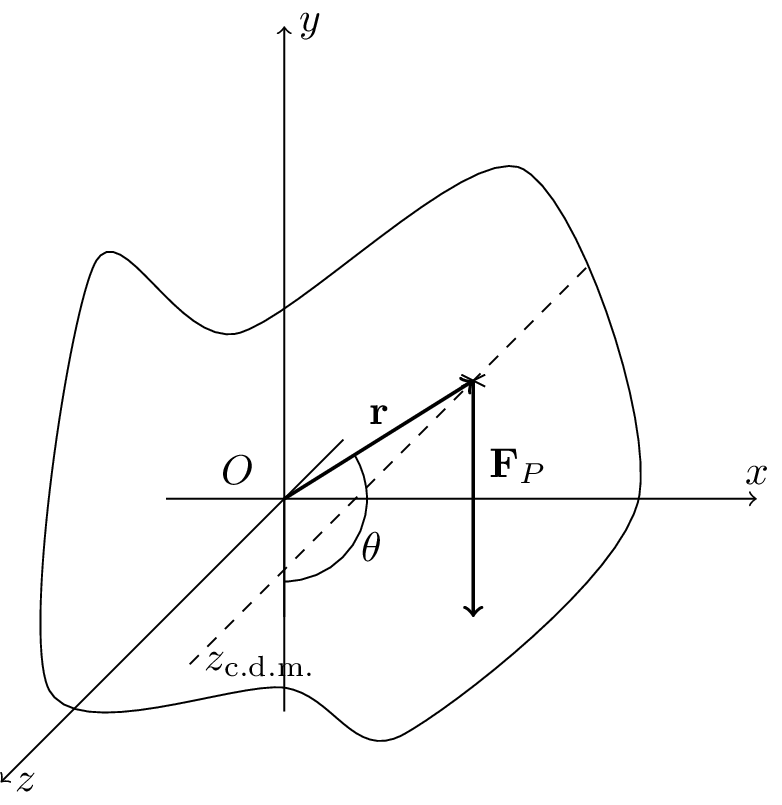
</figure>

# Termodinamica

## Termometria

Viene definita la grandezza fisica temperatura $T$. Nella meccanica statistica quantifica a livello microscopico l’agitazione delle molecole di un sistema. In termodinamica rappresenta uno stato di un sistema rispetto ad una temperatura di riferimento. La temperatura si misura in gradi Celsius $\left[^{\circ}\mathrm{C}\right]$ o Fahrenheit $\left[^{\circ}\mathrm{F}\right]$, oppure in Kelvin $\left[\mathrm{K}\right]$.

Per misurare la temperatura di un sistema si usa un termometro, strumento che usufruisce della proprietà di alcuni materiali di espandersi o contrarsi a causa di un cambiamento di temperatura. Un termometro è formato da un materiale di questo tipo e da una scala graduata che misura la sua espansione rispetto all’aumento di temperatura. Viene definita una temperatura di riferimento arbitrariamente, corrispondente ad un’altezza base $h_0$, detta punto fisso.

Si definisce un grado $1^\circ$ della scala in base alla distanza $h$ che compie l’espansione del materiale nel termometro ad un’altra temperatura scelta arbitrariamente. $$1\mbox{°}\propto h-h_0\Rightarrow T=a(h-h_0)$$ Il punto fisso per i gradi Celsius viene definita alla temperatura di fusione del ghiaccio, mentre si definisce l’altezza relativa all’ebollizione dell’acqua ad una distanza di $100^\circ$ rispetto all’altezza di riferimento.

I gradi Kelvin vengono definiti in base all’agitazione termica delle molecole di un sistema. Viene definito lo zero assoluto la temperatura dove a livello microscopico è assente agitazione termica. Per definire un grado della scala si considera il punto triplo dell’acqua, dove coesistono in equilibrio i tre stati dell’acqua, ad una temperatura di $273.16\mathrm{K}$, corrispondente ad una temperatura di $0^\circ\mathrm{C}$.

<figure>
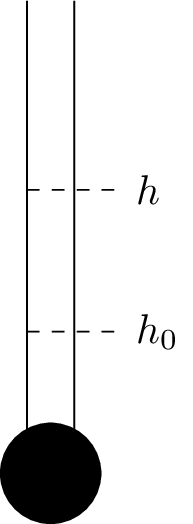
</figure>

## Principio Zero e Stato Termodinamico

Viene definito principio zero della termodinamica un postulato descritto successivamente ai primi tre, poiché considerato non necessario. Il postulato zero descrive l’equilibrio termico, definito come uno stato raggiunto da due corpi dove non avviene nessun cambiamento di temperatura tra i due.

I due corpi si possono scambiare calore per conduzione, quando si trovano a contatto, convezione, quando un gas trasferisce il calore fra i due, o per irraggiamento, grazie ad onde elettromagnetiche. Se non viene raggiunto mai l’equilibrio termico tra due corpi, allora essi sono separati da una parete adiabatica, a differenza di una parete diaterma, non permette lo scambio di calore. Un sistema è detto adiabatico se è circondato da pareti adiabatiche, quindi non è in grado di scambiare calore con l’ambiente. Un sistema adiabatico rappresenta un caso limite, realizzabile per tempi brevi, mai in assoluto.

Lo stato di equilibrio termico è transitivo, se due corpi sono in equilibrio termico con un terzo, allora quei due corpi sono in equilibrio termico tra di loro.  
Lo stato termodinamico di un sistema dipende dalla temperatura, dal volume e dalla pressione applicata al sistema. Dove la pressione è definita come la forza esercitata su una data superficie: $$p=\displaystyle\frac{F}{S}\left[\mathrm{N}\cdot\mathrm{m}^{-2}\right]$$

Viene rappresentato lo stato termodinamico di un sistema in un sistema di riferimento $S(p,V,T)$, dove la pressione $p$, il volume $V$ e la temperatura $T$ vengono chiamate variabili di stato. Uno stato di equilibrio di un sistema termodinamico si esprime sotto forma di equazione di stato $f(p,V,T)=0$, nella sua forma implicita, oppure in una delle sue forme esplicite $p=p(v,T)$, $V=V(p,T)$ o $T=T(p,V)$. Verrà trattata in seguito l’equazione di stato di un gas ideale, usata per approssimare il comportamento di un qualsiasi gas con una certa precisione, in base alle sue condizioni.

Una trasformazione termodinamica rappresenta un cambiamento di stato di un sistema, dati due stati in equilibrio termodinamico, viene rappresentata come una linea che collega due punti nel sistema $S(p,V,T)$. Se la trasformazione è reversibile, allora viene rappresentata come una curva continua, poiché il corpo durante la trasformazione ha uno stato definito, ovvero è in uno stato di equilibrio, per ogni punto della trasformazione tra gli stati iniziali e finali.

Se una trasformazione è irreversibile viene rappresentata come una curva ondulata, poiché il sistema non presenta uno stato definito in ogni punto della trasformazione, quindi non può essere misurato il suo stato in un punto intermedio della trasformazione.  
Se un sistema ha due stati definiti e può presentare stati definiti in ogni punto intermedio tra i due stati, allora è possibile trasformare il sistema da uno stato all’altro. Se non presente stati definiti intermedi, il suo stato sarà descritto da fenomeni microscopici, non reversibili. Si analizza il sistema dividendolo in vari domini ognuno di uno stato approssimativamente definito.

<figure>
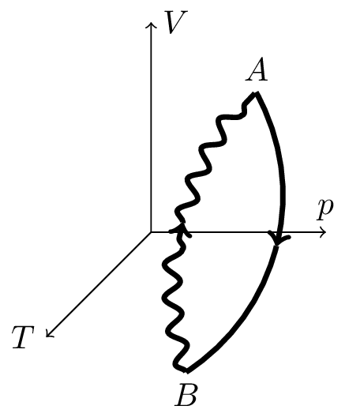
</figure>

## Sistema Termodinamico

Viene definito sistema termodinamico una porzione del mondo, costituita da una o più parti.

Viene definito ambiente l’insieme di elementi esterni al sistema termodinamico che interagiscono con esso. Viene definito universo termodinamico complessivamente il sistema e l’ambiente.

Un sistema viene definito chiuso rispetto all’ambiente se non possono avvenire scambi di materia tra i due, altrimenti si chiama aperto. Viene definito isolato quando non possono avvenire scambi di energia e di materia tra i due.

<figure>
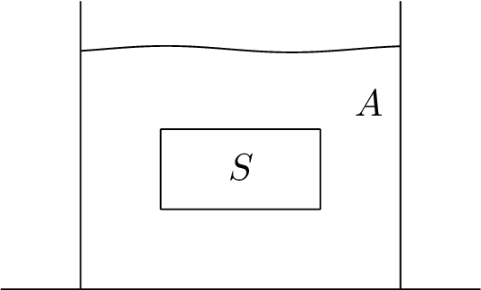
</figure>

Viene definita sorgente un oggetto che può scambiare calore, mentre la sua temperatura rimane costante.

Si definisce la grandezza fisica calore misurata in calorie $[\mathrm{cal}]$, rappresenta una forma di energia scambiata durante le trasformazioni termodinamiche.

Affinché un sistema passi da una temperatura ad un’altra bisogna applicare calore al sistema, questo calore può essere applicato in un intervallo di tempo arbitrariamente lungo, poiché la trasformazione termodinamica non dipende dall’intervallo di tempo impiegato.

Sperimentalmente si è dimostrato che il differenziale parziale del calore è proporzionale alla differenza di temperatura tra i due stati del sistema $\delta Q \propto\Delta T$. Sempre sperimentalmente si è definita la costante di proporzionalità $C$ la capacità termica di un sistema, data dal prodotto tra il calore specifico $c$ di un materiale per la sua massa $C=c\cdot m$.

Poiché la variazione di calore non è un differenziale esatto, il calore scambiato tra due corpi $A$ e $B$ sarà dipendente dal cammino $\Gamma_{AB}$ percorso dalla trasformazione nel sistema $S(p,V,T)$: $$\displaystyle\int_{\Gamma_{AB}}\delta Q =\int_{\Gamma_{AB}}C\:\mathrm{d}T$$ Se la capacità termica è costante durante la trasformazione allora il calore scambiato non dipenderà dalla trasformazione effettuata: $$\begin{gathered}
    C=\mathrm{cost.}\\
    \displaystyle\int_{\Gamma_{AB}}\delta Q =\int_{\Gamma_{AB}}C\:\mathrm{d}T=C\int_{\Gamma_{AB}}\mathrm{d}T=C\Delta T_{AB}\\
    Q=C\Delta T\tag{\stepcounter{equation}\theequation}
\end{gathered}$$

Dati due corpi a temperature diverse $T_A$ e $T_B$ in grado di poter scambiare calore tra di loro allora se il sistema è isolato il calore totale scambiato durante la trasformazione è nullo. Corrisponde alla somma dei calori scambiati tra i due corpi fino al raggiungimento dell’equilibrio termico alla temperatura $T_g$: $$\begin{gathered}
    Q_\mathrm{tot}=Q_A+Q_B=0\\
    C_A(T_A-T_g)+C_B(T_B-T_g)=0\\
    C_B(T_B-T_g)=C_A(T_g-T_A)\\
    T_g=\displaystyle\frac{C_AT_A+C_BT_B}{C_A+C_B}\tag{\stepcounter{equation}\theequation}
\end{gathered}$$ Nel caso di una sorgente la sua temperatura sarà costante quindi si avrà $T_g=T_A$, ciò è possibile solo se avesse un capacità termica tendente all’infinito: Per cui si definisce una sorgente un oggetto che presente una capacità termica $C_A\to\infty$.  
Se la temperatura del sistema aumenta $\mathrm{d}T>0$ allora la quantità di calore scambiata con l’ambiente è positiva, quindi l’ambiente fornisce calore al sistema. Se invece la temperatura diminuisse, l’ambiente assorbirebbe calore dal sistema. $$\begin{gathered}
    \delta Q\propto \mathrm{d}T\\
    \begin{cases}
        \mathrm{d}T>0\Rightarrow\delta Q_{A\to S}>0\\
        \mathrm{d}T<0\Rightarrow\delta Q_{A\to S}<0
    \end{cases}\tag{\stepcounter{equation}\theequation}
\end{gathered}$$

## Primo Principio ed Energia Interna

Un gas che si espande in un pistone idraulico eserciterà una pressione $p$, e di conseguenza una forza $F$ che sposta il pistone di un’altezza $\mathrm{d}h$, per cui produrrà un lavoro $\delta W$. Il lavoro prodotto dal gas sarà allora: $$\delta W=F\mathrm{d}h=pS\mathrm{d}h=p\mathrm{d}V$$

Di conseguenza un sistema termodinamico eserciterà un lavoro positivo sull’ambiente circostante se si espande, mentre subirà un lavoro negativo dall’ambiente esterno se si contrae. Il lavoro dipenderà dal tipo di trasformazione che ha provocato il cambiamento di pressione, quindi dipenderà dal percorso compiuto dalla trasformazione $\Gamma_{AB}$: $$W=\int_{\Gamma_{AB}}\delta W=\int_{\Gamma_{AB}}p(V,T)\mathrm{d}V$$

Tramite una serie di esperimenti riuscì a scoprire la relazione tra lavoro, calore ed energia interna di un sistema termodinamico. Considerò due modi per poter cambiare la temperatura di un sistema, esercitando lavoro in un sistema isolato e fornendo calore ad un sistema senza esercitare lavoro. Uno di questi esperimenti consiste nel generare lavoro facendo cadere dei gravi legati ad una corda per far ruotare delle palette in un contenitore di acqua, in modo che l’attrito aumenti la temperatura dell’acqua.

Tramite questo e altri esperimenti Joule scoprì che indipendentemente dal tipo di trasformazione impiegata tutte generano un cambiamento di temperatura, proporzionale all’energia fornita al sistema.

Per una trasformazione adiabatica, ovvero con uno scambio di calore nullo, Joule scoprì che l’aumento della temperatura viene causato dal solo lavoro esercitato sul sistema. Inoltre scoprì che il lavoro necessario per alterare la temperatura del sistema è indipendente dal cammino intrapreso dalla trasformazione e costante.

Per una trasformazione con scambio di lavoro nullo, l’aumento della temperatura viene causato dal calore assorbito dal sistema, ed è indipendente dal cammino intrapreso dalla trasformazione e costante.

Per una trasformazione con scambi di calore e lavoro non nulli, queste grandezze non saranno costanti, mentre la loro differenza è e proporzionale alla differenza di temperatura.

Sulla base di queste ed altre evidenze sperimentali, Joule descrisse una funzione di stato del sistema $U$ che rappresenta l’energia interna del sistema. Nel caso di una trasformazione adiabatica il calore scambiato sarà nullo ed il lavoro esercitato sarà dato da: $$W=-\Delta U_{AB}$$ Joule scoprì che allo stesso modo anche il calore scambiato può essere espresso rispetto alla funzione di stato, in caso il lavoro esercitato è nullo: $$Q=\Delta U_{AB}$$ Analizzando una trasformazione generale Joule scoprì che la differenza tra il calore scambiato ed il lavoro esercitato è costante ed è uguale alla variazione di energia interna, da cui postulò il primo principio delle termodinamica:

> In una trasformazione termodinamica generale la variazione di energia interna del sistema è uguale alla differenza tra il calore scambiato tra il sistema e l’ambiente e il lavoro esercitato dal sistema sull’ambiente: $$(i)\:   Q-W=\Delta U$$

Per cui fornendo energia ad un sistema, essa viene immagazzinata sotto forma di energia interna, e successivamente riutilizzata.

Il lavoro esercitato dal sistema sull’ambiente si può esprimere come il lavoro esercitato dall’ambiente sul sistema ad una pressione $p_0$ a causa della variazione di volume del sistema: $$W_S=-W_A=p_0\Delta V$$ Segue dal primo principio che la variazione della funzione di stato $U(p,V,T)$ di un sistema in uno stato di equilibrio dipende solamente dalle condizioni iniziali e finali del sistema.

## Trasformazioni Termodinamiche

Per il primo principio data una qualsiasi trasformazione, indipendentemente dal fatto sia reversibile o meno, è possibile trovare la variazione di energia interna del sistema poiché dipende solamente dallo stato iniziale e finale del sistema. $$Q_1-W_1=Q_2-W_2=\Delta U_{AB}$$ Dal punto di vista meccanico l’energia interna di un sistema termodinamico agisce come l’energia potenziale, immagazzinando lavoro. Applicata una trasformazione infinitesima, si avrà: $$\delta Q-\delta W=\mathrm{d}U$$

Per delle trasformazioni isobare, il differenziale del lavoro $\delta W$ corrisponde ad un differenziale esatto $\delta W=p\mathrm{d}V$. Allora si potrà descrivere il calore in termini dell’energia interna e del lavoro: $$\delta Q=\delta W+\mathrm{d}U=p\mathrm{d}V+\mathrm{d}U$$ Il calore infinitesimo può essere espresso come: $\delta Q=cm\mathrm{d}T$, si può quindi esprimere il calore specifico come: $$c=\displaystyle\frac{1}{m}\frac{\delta Q}{\mathrm{d}T}$$ Per i gas, è più conveniente esprimere il calore specifico rispetto al numero di moli $n$. Una mole è definita come un numero di Avogadro $N_A\approx 6\times10^{23}$ di molecole: $$n\:[\mathrm{mol}]:=\displaystyle\frac{N}{N_A}=\frac{n\cdot N_A}{N_A}$$ Dove $N$ è il numero di molecole totali nel gas. Il calore specifico molare verrà quindi espresso come: $$c=\displaystyle\frac{1}{n}\frac{\delta Q}{\mathrm{d}T}$$

Un gas è un fluido senza forma e volume proprio, occupa tutto il volume a sua disposizione ed è facilmente comprimibile. Per approssimare il suo comportamento viene definito un gas ideale, una rappresentazione di un gas molto rarefatto in un grande volume, a pressioni relativamente piccole e temperature relativamente alte. Poiché è molto rarefatto le molecole urtano solamente con le pareti, quindi il calore trasmesso da un gas ideale dipendo dall’energia cinetica delle molecole.

Sulla base della legge isoterma di Boyle, sulle leggi isobare e isocore di Volta-Gay Lussac e sulla legge di Avogadro è stato possibile determinare un’equazione di stato generale per un qualsiasi gas ideale. Per cui un qualsiasi gas in uno stato di equilibrio che rispetta questa equazione viene considerato un gas ideale: $$pV=nRT$$ Dove $n$ è il numero di moli, $T$ è la temperatura in Kelvin, $R$ è la costante dei gas ideali. Se il gas viene espresso rispetto rispetto al numero di molecole, si usa la costante di Boltzman $k_{\mathrm{B}}$: $$\begin{gathered}
    k_\mathrm{B}=\displaystyle\frac{R}{N_A}\\
    pV=nRT=\displaystyle\frac{N}{N_A}RT=Nk_\mathrm{B}T
\end{gathered}$$ Dato l’equazione di stato di un qualsiasi gas reale, questa tenderà asintoticamente all’equazione di stato di un gas ideale al diminuire della pressione del gas.

L’equazione di stato dei gas ideali è un’equazione a $3$ variabili, se il numero di moli non è costante sono $4$ variabili. Il generale il numero minimo di variabili necessarie per descrivere un sistema termodinamico non è fissato a priori, dipende dalla caratteristiche fisico-chimiche del sistema. In un sistema chiuso il numero di moli rimane costante $n=\mathrm{cost.}$. Viene considerata una delle $3$ variabili costante, nella rappresentazione di Clayperyon viene scelta la temperatura. Le trasformazioni vengono quindi rappresentate nel piano di Clayperyon $(p,V)$ come delle curve.

Vengono descritte le seguenti trasformazioni notevoli:

### Isocora

Una trasformazione isocora è una trasformazione termodinamica a volume costante, nel piano di Clayperyon viene rappresentata come una verticale, di verso verso l’alto se la temperatura aumenta, verso il basso se la temperatura diminuisce. $$V=\mathrm{cost.}\Rightarrow
    \displaystyle\frac{p}{T}=\mathrm{cost.}\Rightarrow
    \Delta p \propto\Delta T$$

<figure>
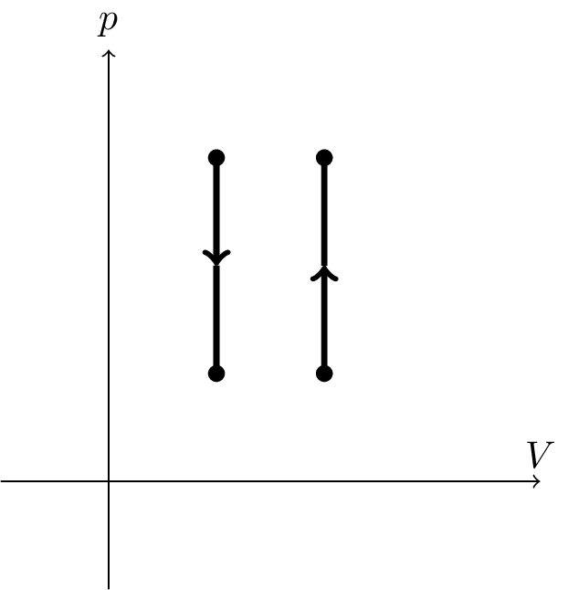
</figure>

### Isobora

Una trasformazione isobora è una trasformazione termodinamica a pressione costante, per cui il volume è direttamente proporzionale alla variazione di temperatura. Viene rappresentata sul piano di Clayperyon come una curva orizzontale, diretta verso sinistra se la temperatura diminuisce, oppure verso destra se la temperatura aumenta. $$p=\mathrm{cost.}\Rightarrow \Delta V\propto\Delta T$$

<figure>

</figure>

### Isoterma

Una trasformazione isoterma è una trasformazione termodinamica a temperatura costante: $$T=\mathrm{cost.}\Rightarrow pV=\mathrm{cost.}\Rightarrow\Delta p\propto\displaystyle\frac{1}{\Delta V}$$

<figure>
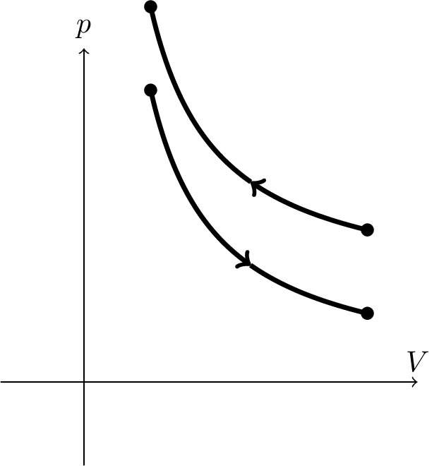
</figure>

### Adiabatica

Una trasformazione adiabatica è una trasformazione termodinamica dove il calore scambiato tra il sistema e l’ambiente è nullo, per cui il lavoro esercitato è uguale all’opposto della variazione dell’energia interna. $$\begin{gathered}
    Q=0\Rightarrow W\propto\Delta V\Rightarrow W=\int p\:\mathrm{d}V
\end{gathered}$$ Nel piano di Clayperyon una trasformazione adiabatica è simile ad una trasformazione isoterma, ma l’adiabatica presente una pendenza sempre maggiore.

<figure>
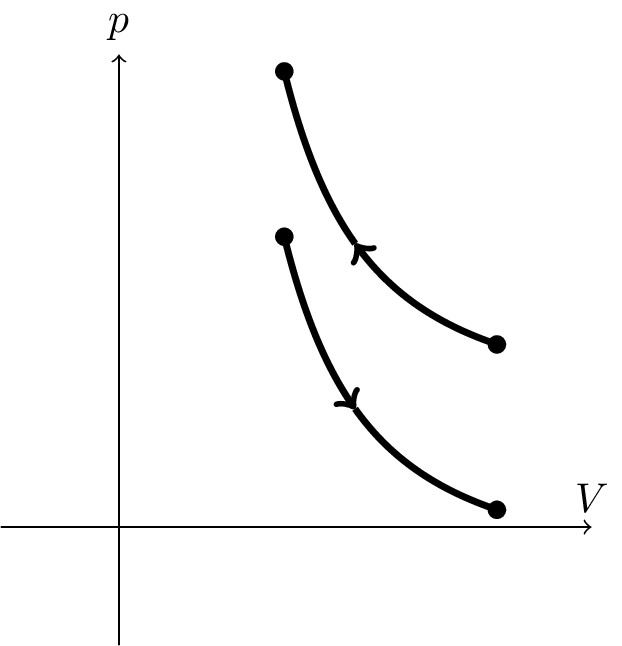
</figure>

### Ciclo Termodinamico

Viene chiamato un ciclo termodinamico, una qualsiasi trasformazione termodinamica il cui stato iniziale e finale coincidono. Avrà quindi una variazione di energia interna nulla $\Delta U=0$, ed il lavoro risultante coincidente al calore scambiato sarà dato dall’area racchiusa dal ciclo nel piano di Clayperyon.

<figure>
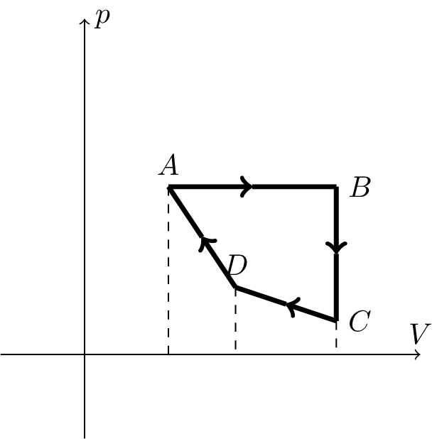
</figure>

Verrà effettuata una trasformazione isobara per passare dallo stato $A$ allo stato $B$, una trasformazione isocora per passare da $B$ a $C$, mentre due trasformazioni o isoterme o adiabatiche per passare da $C$ a $D$ e da $D$ a $A$. Si può notare come le prime due trasformazioni esercitino lavoro sull’ambiente e assorbano calore da esso, mentre le ultime due trasformazioni cedano calore dall’ambiente e subiscano lavoro dall’ambiente, poiché si ha $W\propto \Delta V$ e si ha una compressione del sistema che subisce la trasformazione da $C$ a $A$. Non necessariamente se il lavoro esercitato totale è congruente al calore totale assorbito, si avrà che il calore assorbito coincida con il lavoro esercitato o che il calore ceduto sia uguale al lavoro subito. Poiché il lavoro esercitato è un integrale si può dedurre come il lavoro totale sia coincidente all’area socchiusa dal ciclo, ovvero: $$\begin{gathered}
    W^S=\displaystyle\int_{V_A}^{V_B}p\:\mathrm{d}V+\cancelto{0}{\int_{V_B}^{V_C=V_B}p_0(V)\:\mathrm{d}V}+\int_{V_C}^{V_D}p_1(V)\:\mathrm{d}V+\int_{V_D}^{V_A}p_2(V)\:\mathrm{d}V\\
    p\Delta V_{AB}-\int_{V_A}^{V_D}p_1(V)\mathrm{d}V-\int_{V_D}^{V_C}p_2(V)\:\mathrm{d}V
\end{gathered}$$ Vengono definite:

- Macchina Termica:= ciclo che ruota in senso orario, assorbendo calore e fornendo lavoro all’ambiente;

- Macchina Frigorifera:= ciclo che ruota in senso antiorario, cedendo calore e subendo lavoro dall’ambiente.

Lo stesso ciclo termodinamico può essere sia frigorifero che termico, in base al verso in cui le trasformazioni vengono effettuate. Per misurare quanto un ciclo termico “spreca" energia, ovvero di quanto diminuisce l’energia interna del sistema dopo un ciclo completo, si definisce l’efficienza di un ciclo termodinamico. Per un ciclo termico si considera l’efficienza termica $\eta$, definita come il rapporto tra il lavoro totale e ed il calore assorbito dall’ambiente necessario per attivare la macchina termica: $$\begin{gathered}
    \eta:=\displaystyle\frac{W^\mathrm{tot}}{Q_\mathrm{ass}}\\
    W^\mathrm{tot}=Q_\mathrm{ass}+Q_\mathrm{ced}=Q_\mathrm{ass}-\left|Q_\mathrm{ced}\right|\\
    \eta=\displaystyle\frac{Q_\mathrm{ass}-\left|Q_\mathrm{ced}\right|}{Q_\mathrm{ass}}=1-\frac{\left|Q_\mathrm{ced}\right|}{Q_\mathrm{ass}}\tag{\stepcounter{equation}\theequation}
\end{gathered}$$ Poiché il lavoro è positivo si ha che il calore ceduto è minore del calore assorbito dall’ambiente, quindi il loro rapporto è compreso tra $0$ e $1$: $$0<\left|\displaystyle\frac{Q_\mathrm{ced}}{Q_\mathrm{ass}}\right|\leq1$$ L’efficienza $\eta$ è compresa anch’essa tra $1$, per un’efficienza massima, e $0$, per un efficienza minima dove il lavoro prodotto dalla macchina è nullo.  
Per un ciclo frigorifero si considera l’efficienza frigorifera $\varepsilon$, data dal rapporto tra il calore assorbito $Q_\mathrm{ass}$ ed il lavoro $\left|W\right|$ complessivo subito dalla macchina, in questo caso negativo. Considerando il lavoro come somma tra calore assorbito e calore ceduto $W=Q_\mathrm{ass}+Q_\mathrm{ced}<0$, il calore ceduto sarà maggiore in modulo $\left|Q_\mathrm{ass}\right|<\left|Q_\mathrm{ced}\right|$, l’efficienza sarà quindi: $$\varepsilon:=\displaystyle\frac{Q_\mathrm{ass}}{\left|W\right|}=\displaystyle\frac{Q_\mathrm{ass}}{Q_\mathrm{ass}-\left|Q_\mathrm{ced}\right|}=\frac{1}{\displaystyle\frac{|Q_\mathrm{ced}|}{Q_\mathrm{ass}}-1}$$ L’efficienza di un ciclo frigorifero è massima per un valore $0$, poiché il calore ceduto sarà tendente all’infinito. É minima per un valore tendente all’infinito, quando il calore assorbito dal sistema coincide con il calore ceduto.

## Calorimetria

Durante i suoi esperimenti sul calore Joule lo descrisse come un fluido calorico. A livello microscopico i fenomeni analizzati da Joule hanno le loro origini dall’agitazione delle molecole che, urtandone altre, trasmettono la loro velocità. Per cui il processo di trasferimento di calore richiede tempo, prima che si propaghi per tutto il corpo.

La grandezza fisica calore è difficile da definire poiché quantifica qualcosa che dipende dal modello usato per descrivere la temperatura. Viene definita la caloria come unità di misura della grandezza calore come l’energia necessaria per aumentare di un grado centigrado la temperatura di un grammo di acqua, contemporaneamente viene assegnato al calore specifico dell’acqua il valore $1\:[\mathrm{cal}\cdot\mathrm{g}^{-1}\cdot\mathrm{^\circ C}^{-1}]$: $$1\:[\mathrm{cal}]=1\left[\mathrm{cal}\cdot\mathrm{g}^{-1}\cdot\mathrm{^\circ C}^{-1}\right]\cdot 1\left[\mathrm{g}\right]\cdot1\:\left[\mathrm{^\circ C}\right]$$

Joule eseguì alcuni esperimenti sull’espansione libera del gas ideale. Usò contenitore adiabatico, diviso in due parti uguali, contenenti la prima una certa mole di gas, la seconda in una condizione di vuoto. Se il gas viene lasciato fluire liberamente nel contenitore, allora provocherà una trasformazione adiabatica e senza lavoro, poiché il gas non esercita una pressione contro l’ambiente per espandersi, entrando all’interno di un volume già presente. Questa trasformazione viene chiamata espansione libera.

In base alle condizioni dell’esperimento, Joule scoprì che la temperatura rimane invariata. Inoltre lo stato dell’ambiente rimane invariato, quindi la variazione di energia interna dell’ambiente è nulla $\Delta U^A=0$. Per il primo principio: $$\begin{gathered}
    \Delta U^S=Q-W=0\\
    \Delta U^{(S+A)}=\cancelto{0}{\Delta U^A}+\cancelto{0}{\Delta U^S}=0
\end{gathered}$$ Allora per un gas ideale la variazione di energia interna dipende dalla sola temperatura: $U=U(T)$. Questo risultato è vero solo per dei gas ideali.

Considerando una trasformazione qualsiasi $A\to B$, essa può essere effettuata come una trasformazione isocora ed una isobara, o una isobara. Applicando all’intera trasformazione il primo principio si avrà nella trasformazione isocora: $$\Delta U_{AC}=Q_{AC}=\int_{T_A}^{T_B}c_V(T)n\:\mathrm{d}T\approx c_Vn\int_{T_A}^{T_B}\mathrm{d}T=c_Vn\Delta T_{AB}$$ In un intorno abbastanza ristretto di temperature il calore specifico rimane costante e non dipende dalla temperatura. In una trasformazione isocora l’energia interna dipende dal solo calore scambiato, per cui dipende dalla sola temperatura e dal calore specifico molare a volume costante $c_V$.

Poiché la seconda trasformazione è isoterma $\Delta T_{AB}=\Delta T_{AC}+\Delta T_{CB}=\Delta T_{AC}$.

In una trasformazione isoterma l’energia interna del sistema si conserva, poiché non avviene un cambiamento di temperatura: $$\Delta U_{CB}^S=0$$ Joule verificò sperimentalmente la seguente relazione: $$\Delta U^S_{AB}=\Delta U^S_{AC}+\cancelto{0}{\Delta U^S_{CB}}=c_Vn\Delta T_{AB}$$

<figure>
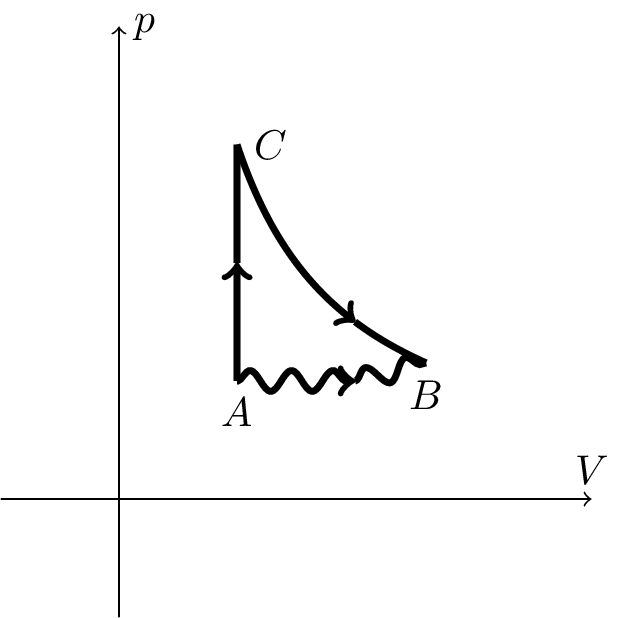
</figure>

### Relazione di Mayer

Data una qualsiasi trasformazione reversibile di un gas ideale essa può essere sempre rappresenta come una trasformazione isobara ed una isoterma. Per cui uno scambio infinitesimo di calore $\delta Q$ corrisponde alla somma tra la variazione infinitesime di energia interna $\mathrm{d}U$ durante la trasformazione isobara ed il lavoro esercitato dal gas $\delta W$ durante la trasformazione isoterma: $$\begin{gathered}
    \delta Q=\delta W+\mathrm{d}U=p\:\mathrm{d}V+c_Vn\:\mathrm{d}T\\
    \delta Q :=c_gn\:\mathrm{d}T\\
    c_gn\:\mathrm{d}T=p\:\mathrm{d}V+c_Vn\:\mathrm{d}T\\
    c_g=\displaystyle\frac{p}{n}\frac{\mathrm{d}V}{\mathrm{d}T}+c_V
\end{gathered}$$ In una trasformazione qualsiasi, il calore specifico molare sarà sempre maggiore o uguale al calore specifico molare a volume costante. In una trasformazione isobara si considera il calore specifico molare a pressione costante $c_p=c_g$: $$\begin{gathered}
    c_p=\displaystyle\frac{p}{n}\frac{\mathrm{d}}{\mathrm{d}T}\left(\frac{nRT}{p}\right)+c_V\\
    c_p=R+c_V\tag{\stepcounter{equation}\theequation}
\end{gathered}$$ Questa viene definita relazione di Mayer, tra il calore specifico molare a pressione costante e a volume costante. Viene definito il fattore $\gamma$: $$\gamma=\displaystyle\frac{c_p}{c_V}$$ Se la pressione non è costante, il calore specifico del gas ideale della trasformazione sarà dato da: $$c_g=\displaystyle\frac{p}{n}\frac{\mathrm{d}}{\mathrm{d}T}\left(\frac{nRT}{p(T)}\right)+c_V$$

Per cui a parità di scambio di calore e temperature iniziali, la temperatura finale massima si ottiene in una trasformazione isocora, poiché in ogni altra trasformazione il gas compie anche lavoro. Il calore necessario per aumentare la temperatura di $n$ moli di gas ideale di $k$ gradi Kelvin sarà minima in una trasformazione isocora.

Sperimentalmente si è determinato il calore specifico dei gas monoatomici a volume costante: $$c_V=\displaystyle\frac{3}{2}R$$ Mentre per i gas biatomici: $$c_V=\displaystyle\frac{5}{2}R$$ Quindi il fattore $\gamma$ per i gas monoatomici corrisponde a: $$\gamma=\displaystyle\frac{R+\frac{3}{2}R}{\frac{3}{2}R}=\frac{5}{3}$$ Per i gas biatomici: $$\gamma=\displaystyle\frac{R+\frac{5}{2}R}{\frac{5}{2}R}=\frac{7}{5}$$

## Trasformazioni di Gas Ideali

Si analizza il comportamento delle varie trasformazioni termodinamiche elementari rispetto al calore specifico.

In una trasformazione iscocora reversibile valgono le leggi osservate in precedenza per cui il calore scambiato è dato da: $$Q=W+\Delta  U=p\cdot 0+c_Vn\Delta T_{AB}$$ Fisicamente ciò viene approssimato ponendo il gas in un contenitore diatermico, e mettendolo a contatto con una numero elevato di sorgenti, a temperatura ognuna superiore, o inferiore, di poco della precedente. In caso ci sia solo una sorgente la trasformazione sarebbe irreversibile poiché il sistema e l’ambiente non sono in equilibrio termico tra di loro.

In una trasformazione isobara reversibile, il lavoro generato sarà: $$W=\displaystyle\int_{V_A}^{V_B}p\:\mathrm{d}V=p\Delta V_{AB}$$ Poiché la pressione a cui si trova il gas durante tutta la trasformazione corrisponde alla pressione del sistema e dell’ambiente $p=p_{S}=p_\mathrm{amb}$. Mentre il calore scambiato tra il sistema e l’ambiente sarà dato da: $$\begin{gathered}
    Q=W+\Delta U=p\Delta V_{AB}+c_Vn\Delta T_{AB}\\
    pV=nRT\Rightarrow p=\displaystyle\frac{nRT}{V}\\
    Q=\displaystyle\frac{nR\Delta T_{AB}}{\Delta V_{AB}}\Delta V_{AB}+c_Vn\Delta T_{AB}\\
    (R+c_V)n\Delta T_{AB}{,}\:c_p=R+c_V\\
    Q=c_pn\Delta T_{AB}\tag{\stepcounter{equation}\theequation}
\end{gathered}$$ Se la trasformazione è irreversibile, se la pressione esterna è costante, ovvero se il processo avviene sotto la pressione atmosferica, il lavoro è comunque calcolabile considerando la pressione esterna $p_\mathrm{amb}$: $$W=p_\mathrm{amb}\Delta V_{AB}$$

In una trasformazione isoterma reversibile la temperatura rimane costante. Poiché la funzione di stato di un gas ideale dipende solo dalla temperatura essa sarà costante per tutta la reazione, e la sua variazione sarà nulla. Per cui per il principio il calore scambiato è uguale al lavoro esercitato: $$\begin{gathered}
    Q=W+0=\int_{V_A}^{V_B}p\:\mathrm{d}V=nRT\int_{V_A}^{V_B}\displaystyle\frac{\mathrm{d}V}{V}=nRT\ln\left(\displaystyle\frac{V_B}{V_A}\right)
\end{gathered}$$ Questa trasformazione permette di trasformare interamente il lavoro esercitato sul sistema in calore e viceversa.

In una trasformazione adiabatica reversibile il lavoro complessivo sarà dato dall’opposto della variazione di energia interna del sistema. Considerando una variazione infinitesime si avrà: $$\begin{gathered}
    \delta W=-\mathrm{d}U\\
    p\:\mathrm{d}V=-c_Vn\:\mathrm{d}T\\
    \displaystyle\frac{nR\:T}{V}\mathrm{d}V=-c_Vn\:\mathrm{d}T\\
    \displaystyle R\frac{\mathrm{d}V}{V}=-c_V\frac{\mathrm{d}T}{T}\\
    \displaystyle R\int_{V_A}^{V_B}\frac{\mathrm{d}V}{V}=-c_V\int_{T_A}^{T_B}\frac{\mathrm{d}T}{T}\\
    \displaystyle\frac{R}{c_V}\ln\left(\frac{V_B}{V_A}\right)=\ln\left(\frac{T_B}{T_A}\right)\\
    \displaystyle\left(\frac{V_B}{V_A}\right)^{\frac{R}{c_V}}=\frac{T_B}{T_A},\:\gamma=\frac{c_p}{c_V}=\frac{R+c_V}{c_V}=\frac{R}{c_V}+1\Rightarrow\frac{R}{c_V}=\gamma-1\\
    \displaystyle\left(\frac{V_B}{V_A}\right)^{\gamma-1}=\frac{T_B}{T_A}\\
    T_BV_B^{\gamma-1}=T_AV_A^{\gamma-1}\tag{\stepcounter{equation}\theequation}
\end{gathered}$$ Considerando l’equazione di stato dei gas ideale $pV=nRT$, si può esprimere rispetto alle altre variabili termodinamiche. Queste tre equazioni vengono chiamate equazioni di una trasformazione adiabatica reversibile di un gas ideale. $$\begin{gathered}
    T_B^{\gamma}p_B^{1-\gamma}=T_A^{\gamma}p_A^{1-\gamma}\\
    p_BV_B^{\gamma}=p_AV_A^{\gamma}
\end{gathered}$$ Da quest’ultima è possibile notare come il comportamento di una trasformazione adiabatica sia simile ad una trasformazione isoterma, avendo nel piano di Clayperyon una pendenza maggiore, dovuto all’esponente $\gamma>1$.

Una trasformazione adiabatica reversibile rappresenta un caso limite, poiché come già discusso in precedenza un processo completamente adiabatico in natura potrà resistere per poco tempo. Per essere reversibile e mantenere l’adiabaticità bisogna svolgere la trasformazione molto lentamente, ma una trasformazione adiabatica in natura comporta una variazione rapida di volume affinché non ci sia uno scambio di calore. Una trasformazione adiabatica reversibile rappresenta quindi in natura un caso limite. L’espansione libera di Joule rappresenta una trasformazione sia adiabatica che isoterma, ciò è possibile poiché si tratta di una trasformazione irreversibile, ciò sarebbe impossibile per una trasformazione reversibile.

Se la trasformazione adiabatica è irreversibile tra due stati $A$ e $B$, allora si possono ottenere informazioni solo sulla variazione di energia interna, non sulle relazioni tra le coordinate termodinamiche: $$W_{AB}=-\Delta U_{AB}=-nc_V(T_B-T_A)=\displaystyle n\frac{1}{\gamma-1}(p_AV_A-p_BV_B)$$ Si avrà un’espansione adiabatica se la temperatura diminuisce, mentre si avrà una compressione adiabatica se la temperatura aumenta.

Poiché il calore specifico di un gas ideale in una reazione isobara è sempre maggiore del calore specifico in una reazione isocora.

Segue che una reazione adiabatica riduce la pressione in maniere maggiore rispetto ad una trasformazione isoterma per uno stesso cambiamento di volume.

Il lavoro compiuto da un gas in una qualsiasi trasformazione ciclica reversibile corrisponde all’area racchiusa dal ciclo stesso nel piano di Clayperyon. Il lavoro è positivo se si tratta di una macchina termica, negativo per una macchina frigorifera.

## Teoria Cinetica

Le proprietà elastiche dei gas e l’esistenza della pressione sulle pareti del contenitore di un gas, avevano suggerito che i gas fossero composti da particelle in moto continuo. Joule fornì una spiegazione microscopica dei fenomeni macroscopici della termodinamica, analizzando un caso molto semplificato di un gas ideale, avente le seguenti caratteristiche:

- Le singole particelle sono approssimata a delle sferette rigide;

- Le particelle si scontrano con l’ambiente di urti elastici;

- Il sistema analizzato è isolato, non sono presenti forze esterne nel sistema, e tutte le forze interne sono impulsive;

- Le traiettorie vengono approssimate come fossero dei moti rettilinei uniformi, a causa dell’  
  elevata velocità delle particelle;

- Le particelle sono distribuite spazialmente uniformemente;

- Hanno velocità isotrope, ovvero la probabilità che il vettore posizione sia in una qualsiasi direzione è uniforme.

Il gas si trova in un contenitore cubico di lato $a$, si analizza il comportamento di una singola particella.

Il contenitore non si muove dopo l’urto, quindi la particella del gas avrà una velocità finale $\boldsymbol{\mathbf{v}}_f=-\boldsymbol{\mathbf{v}}_i$. Una singola particelle sarà soggetta ad una forza impulsiva $\boldsymbol{\mathbf{F}}_{p\to g}$, per essersi scontrata con la parete. Si misura la forza in un intervallo di tempo $\Delta t$, integrando su questo intervallo la forza misurata si ottiene la variazione di quantità di moto in quel dato intervallo di tempo: $$\int_{t_0}^{t_1}\boldsymbol{\mathbf{F}}_{p\to g}\:\mathrm{d}\tau=\Delta\boldsymbol{\mathbf{p}}$$ Si suppone l’urto avvenga lungo un’unica direzione $$\int_{t_0}^{t_1}F_{p\to g, x}\:\mathrm{d}\tau=\Delta p_x=m(v_{f,x}-v_{i,x})=-2mv_{i,x}$$ Questa forza eserciterà un lavoro sull’ambiente $\delta W=p\mathrm{d}V$. Supponendo che le particelle non si urtino tra di loro, se l’urto avviene su una sola direzione, il percorso che compiono per ritornare ad urtare la stessa parete equivale a due volte la lunghezza di una parete: $\Delta x=2a$. L’intervallo di tempo tra due urti equivale al tempo con cui una particella percorre questa distanza: $$\Delta t_\mathrm{urto}=\displaystyle\frac{\Delta x}{v_x}=\frac{2a}{v_x}$$ Nell’intervallo di tempo che stiamo misurando una singola particella effettuerà un numero $h$ di urti su una delle pareti del contenitore, calcolato come il rapporto tra il tempo di misurazione ed il “periodo" di un urto: $$h=\displaystyle\frac{\Delta t}{\Delta t_\mathrm{urto}}=\frac{v_x\Delta t}{2a}$$ Si suppone che la forza impulsiva sia costante nell’intervallo di tempo misurazione, allora per ognuno degli $h$ urti verrà scambiata una quantità di moto: $$\begin{gathered}
    \int_{t_0}^{t_1}F_{p\to g,x}\mathrm{d}\tau=F_{p\to g,x}\Delta t=-2mv_{i,x}
\end{gathered}$$ La variazione totale di quantità di moto, per una singolar particella corrisponderà alla variazione di quantità di moto di un singolo urto moltiplicata per il numero $h$ di urti: $$\Delta p_x=-2hmv_{i,x}$$ Per il terzo principio, poiché il gas esercita una certa forza sulla parete, anche la parete eserciterà una forza di verso opposto e stesso modulo sul gas: $F_{g\to p}=-F_{p\to g}$. La variazione di quantità di moto complessiva di una singola particella $\Delta p_x$ può essere quindi espressa rispetto alla forza esercitata dal gas sulla parete: $$F_{g\to p}\Delta t=2hmv_{i,x}$$ La forza esercitata dal gas sull’ambiente in un singolo urto sarà data da: $$F_{g\to p}=\displaystyle h\frac{2mv_{i,x}}{\Delta t}=\frac{v_{i,x}\Delta t}{2a}\frac{2mv_{i,x}}{\Delta t}=\frac{mv_{i,x}^2}{a}$$ Una singola particella eserciterà sull’ambiente una pressione: $$p_i=\displaystyle\frac{F_{g\to p}}{a^2}=\frac{mv_{i,x}^2}{a^3}$$ La pressione totale sarà data dalla somma di tutte le pressioni esercitate dalle particelle del gas: $$p^\mathrm{tot}=\sum_{i=1}^{N}p_i=\displaystyle\frac{m}{V}\frac{\sum_{i=0}^Nv_x^2}{N}N=\frac{mN\overline{v_x^2}}{V}$$ Dove $\overline{v_x^2}$ o $\braket{v_x^2}$ è la velocità quadratica media, si usa al posto di una media normale, poiché essendo le velocità costanti e isotrope, la loro media è nulla.

Le particelle hanno tutte la stessa massa, quindi si può considerare la massa del gas come: $M=m\cdot N$, dove $m$ è la massa di una singola particella. La pressione totale può quindi essere espressa come: $$p=\displaystyle\frac{mN\overline{v_x^2}}{V}=\frac{M}{V}\overline{v_x^2}=\rho\overline{v_x^2}$$ Dove $\rho$ è la densità del gas. La velocità media quadratica totale è data dalla somma dalla velocità media quadratica su ogni direzione, ma essendo isotrope le velocità medie quadratiche sono uguali, per cui si può esprimere la velocità media quadratica come: $$\overline{v^2}=\overline{ v_x^2}+\overline{ v_y^2}+\overline{ v_z^2}=\overline{v_x^2}$$ Quindi la pressione totale sarà: $$p=\displaystyle\frac{\rho\overline{ v^2}}{3}$$ Questa pressione rappresenta un effetto macroscopico, espresso rispetto alle caratteristiche delle sue componenti microscopiche. Maggiore è il modulo delle velocità delle particelle, maggiore è la pressione totale esercitata dal gas sull’ambiente $p\propto v$. Considerando l’equazione di stato di un gas ideale $pV=nRT$, si può esprimere la temperatura rispetto alle caratteristiche microscopiche del gas: $$\begin{gathered}
    \displaystyle\frac{\rho\overline{ v^2}}{3}=\frac{nRT}{V}
\end{gathered}$$ $$\begin{gathered}
    T=\displaystyle\frac{\rho\bar v^2 V}{3nR}=\frac{M\overline{ v^2}}{3nR}
\end{gathered}$$ Analogamente alla pressione la temperatura risulta direttamente proporzionale alla velocità delle particelle $T\propto v$.

Considerando l’energia cinetica di una singola particella che si muove di velocità quadratica media $\overline{v_x^2}$, potrà essere espressa rispetto alle caratteristiche macroscopiche del gas: $$\begin{gathered}
    K_g=\displaystyle\frac{1}{2}M\overline {v^2}=\frac{3}{2}nRT=\frac{3}{2}\frac{N}{N_A}RT=\frac{3}{2}\frac{R}{N_A}NT
\end{gathered}$$ Viene definita la costante di Boltzman: $$k_\mathrm{B}=\displaystyle\frac{R}{N_A}$$ Con la quale si può esprimere l’energia cinetica di un gas ideale rispetto alla temperatura del gas: $$K^\mathrm{tot}=\displaystyle\frac{3}{2}NkT=NK_{(i)}$$ Si assume l’energia potenziale trascurabile, per cui l’energia totale del sistema è data da: $$E^S=NK_i=\displaystyle\frac{3}{2}NkT$$ L’energia totale è quindi direttamente proporzionale alla temperatura del sistema in Kelvin, equivale all’energia cinetica totale del gas: $$\begin{gathered}
    E^S= U=\displaystyle\frac{3}{2}NkT=\frac{3}{2}\frac{R}{N_A}NT=\frac{3}{2}nRT\\
    \Delta U=c_Vn\Delta T\\
    c_V=\displaystyle\frac{3}{2}R
\end{gathered}$$ Tramite la teoria cinetica viene dimostrato che il calore specifico molare a volume costante di un gas ideale monoatomico risulta essere: $$c_V=\displaystyle\frac{3}{2}R$$

### Teoria dell’Equipartizione dell’Energia

Considerando l’energia totale di un gas monoatomico: $$\begin{gathered}
    E=E_x+E_y+E_z=\displaystyle\frac{3}{2}NkT\\
    E_x=E_y=E_z=\displaystyle\frac{1}{2}NkT
\end{gathered}$$ L’energia corrispondente ad ogni grado di libertà della particella $(x,y,z)$ equivale a $NkT/2$, per cui l’energia totale di una singola particella di un gas può essere espressa rispetto al numero dei suoi gradi di libertà $l$. $$E=l\times\frac{1}{2}NkT$$ È già stato dimostrato precedentemente come un gas monoatomico necessiti di tre gradi di libertà per descrivere la sua energia $(v_x,v_y,v_z)$.

Per un gas biatomico, le sue molecole vengono approssimate come un corpo rigido, quindi potranno ruotare con una certa velocità angolare, quindi saranno necessari $5$ gradi di libertà per poter descrivere l’energia: le velocità del centro di massa e le velocità angolare sull’asse $z$, e sul piano ortogonale ad esso $xy$: $(v_x,v_y,v_z,\omega_{xy},\omega_z)$, l’energia del gas sarà quindi: $E=5NkT/2$.

Se il gas biatomico si trova ad alte temperature, comincerà a vibrare, per cui sarà necessario considerare altri due gradi di libertà per descrivere le vibrazioni di entrambe le particelle: $E=5NkT/2$.

Se un gas biatomico viene riscaldato ad una temperatura molto alta, comincerà a vibrare, rendendo necessario usare altri due gradi di libertà per descrivere questa vibrazione, l’energia sarà quindi: $K={7}NkT/2$.

Se le molecole sono posizionate in un reticolo cristallino, i legami tra la singola molecola e i suoi $6$ primi vicini, cominceranno a vibrare di un moto, simile ad un moto armonico, per cui servirà un altro grado di libertà per descrivere la velocità della vibrazione, e altre $6$ per descrivere l’energia potenziale elastica che questa vibrazione genera, l’energia totale sarà allora: $E=12NkT/2=6NkT$.

L’aumento da un livello energetico ad un altro non è continuo, poiché l’energia viene trasmessa discretamente in pacchetti di energia. Nell’intorno dove aumenta il livello energetico, l’energia aumenta rapidamente, per poi rimanere costante per tutto il livello successivo.

<figure>
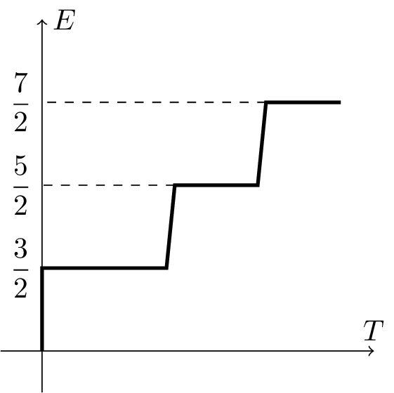
</figure>

## Secondo Principio della Termodinamica

Il primo principio presenta delle limitazioni nella sua descrizione dei fenomeni termodinamici.

Dato un sistema conservativo, per il lavoro ed il calore nulli, la variazione di energia interna è la variazione di energia meccanica.

Se su un sistema agisce un lavoro meccanico dall’ambiente esterno, ed il sistema è isolato, la variazione di energia interna dipenderà anche dal lavoro esercitato sul sistema $S$.

In caso non possa essere supposto nulla sul sistema $S$, si applica il primo principio per determinare la variazione di energia interna del sistema.

Tutte le trasformazioni compatibili con il primo principio possono essere così descritte.  
Se si volesse trasformare tutto il lavoro in calore, allora si avrebbe una variazione nulla di energia interna del sistema, avrà quindi temperatura costante e sarà quindi una trasformazione isoterma di un gas ideale. Una trasformazione inversa invece, descrivibile tramite il primo principio, non potrà essere fisicamente possibile, poiché richiederebbe l’esistenza di una trasformazione che trasforma tutto il calore ceduto dal sistema in lavoro esercitato sull’ambiente.  
Considerando due corpi a temperature diverse, spontaneamente avviene un trasferimento di calore tra il corpo più caldo al corpo più freddo fino ad uno stato di equilibrio termico. Questa trasformazione non comprende uno scambio di lavoro, si avrà una variazione di energia interna nulla durante la trasformazione.  
Dato un ciclo termodinamico reversibile, è sempre possibile invertire le trasformazioni per percorrere il ciclo in senso opposto. Percorrendo il ciclo in senso inverso gli scambi energetici tra il sistema e l’ambiente sono eguali e opposti, ritornando allo stato di partenza. Una trasformazione reversibile non comporta alterazioni permanenti al sistema, è sempre possibile ritornare agli stati iniziali del sistema e dell’ambiente.

Se il ciclo è irreversibile, anche invertendo gli scambi energetici tra il sistema e l’ambiente, è impossibile ritornare allo stato iniziale, poiché le trasformazioni irreversibili producono meno energia di una trasformazione reversibile, per cui ad ogni ciclo l’universo perde energia utilizzabile. Sarà possibile ritornare allo stato iniziale del sistema, ma l’ambiente sarà modificato in maniera irreversibile o viceversa.

Spesso le trasformazioni reversibili rappresentano delle idealizzazioni di fenomeni reali, essendo tutti i fenomeni reali irreversibili. Per cui le trasformazioni reversibili rappresentano dei limiti superiori delle grandezze analizzate.  
Quindi il calore ceduto dal primo corpo corrisponde interamente al calore assorbito dal secondo. Solamente rispettando il primo principio è possibile descrivere una trasformazione inversa, mantenendo le stesse relazioni, ovvero da due corpi in equilibrio termico, uno dei due spontaneamente cede all’altro una data quantità di calore. Ma ciò non è realizzabile in natura.  
Questo dimostra i limiti della descrizione fisica del primo principio della termodinamica. Venne quindi descritto in due forme equivalenti da Kelvin e da Clausius il secondo principio della termodinamica.

### Enunciato di Kelvin-Planck

Kelvin sulla base delle limitazioni del primo principio descrisse il secondo principio della termodinamica:

> Non esiste una trasformazione termodinamica, il cui unico risultato è assorbire calore e trasformarlo interamente in lavoro.

<figure>
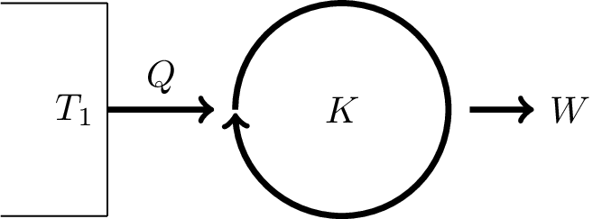
</figure>

Un sistema che trasforma tutto il calore assorbito in lavoro cambierà il suo stato, non potrà quindi ripetere la stessa trasformazione. Sarà necessaria un’altra fonte di energia per permettere al sistema di ritornare allo stato iniziale. Vengono quindi considerati solamente cicli termodinamici, la macchina descritta da Kelvin coincide con un ciclo monotermo, utilizzando una sola sorgente, quindi non può essere realizzabile fisicamente.

Questo è uno dei motivi per cui non può esistere un moto perpetuo, poiché la quantità di energia utilizzabile in un sistema isolato diminuisce nel tempo, per cui non sarà in grado di alimentare indefinitamente il moto.  
Per trasformare il calore interamente in lavoro è necessaria una trasformazione isoterma. Per ritornare allo stato iniziale si possono considerare due trasformazioni isocore, ed un’altra isoterma, ad una temperatura $T_1$ minore della prima. Questo mostra come sia necessario utilizzare un’altra sorgente per descrivere la macchina di Kelvin.

<figure>
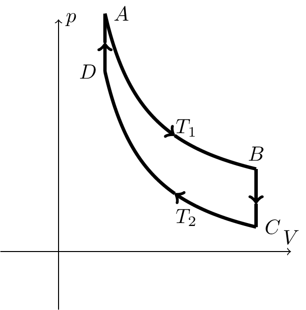
</figure>

Il sistema cederà calore per le trasformazioni da $B$ a $D$ e assorbirà calore durante le trasformazioni da $D$ a $B$. Per chiudere il ciclo sarà necessario dissipare una parte del calore totale.

Se al posto di trasformazioni isoterme vengono usate trasformazioni adiabatiche, si avrà una variazione di energia interna del sistema nulla, come il lavoro totale. Quindi il lavoro esercitato sull’ambiente è uguale al lavoro esercitato sul sistema.

Per riportare il sistema alla temperatura iniziale $T_1$ sarà necessario usare una seconda sorgente ad una temperatura $T_2<T_1$.

### Enunciato di Clausius

Clausius descrisse il secondo principio:

> Non esiste un ciclo frigorifero che scambia calore da un corpo di temperatura minore ad un corpo di temperatura maggiore.

<figure>
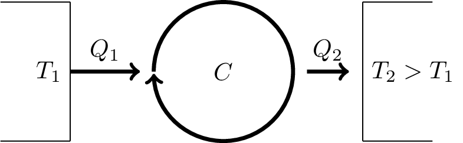
</figure>

Per dimostrare che sono due forme equivalenti si suppone possa esistere uno di questi due cicli descritti da Kelvin e Clausius, e si dimostra come si possa esprimere l’altro rispetto a questo.  
Si suppone possa esistere il ciclo descritto da Kelvin, allora il lavoro generato da esso da una sorgente a temperatura $T_1$, potrà essere usato per fornire energia ad un ciclo frigorifero che trasferisce calore dalla sorgente $T_1$, ad un’altra sorgente $T_2>T_1$.

Sarà possibile creare una macchina descritta da Clausius, se questa non dovesse esistere, allora necessariamente non dovrebbe neanche esistere una macchina di Kelvin.

<figure>
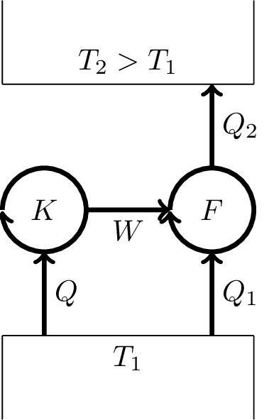
</figure>

Analogamente, se esistesse una macchina di Clausius sarebbe possibile fornire calore da una sorgente $T_1$ ad un’altra $T_2>T_1$, questo calore potrà essere trasferito ad una macchina termica, che ne trasformerà una parte in lavoro $W$, cedendo l’energia restante come calore alla sorgente $T_1$. Per cui la sorgente a temperatura $T_2$ riceverà e cederà la stessa quantità di calore, per può essere ignorata. Allora il sistema complessivo si comporterà come una macchina di Kelvin che assorbe calore da una sorgente a temperatura $T_1$ e lo trasforma interamente in lavoro. Quindi se non può esistere una macchina di Kelvin, non potrà neanche esistere la macchina di Clausius.

<figure>
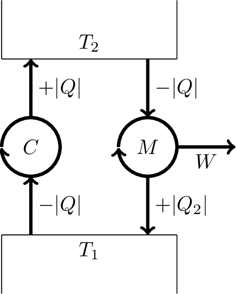
</figure>

Si è dimostrato come i due enunciati di Kelvin e Clausius sono due forme equivalenti del secondo principio della termodinamica.

## Ciclo di Carnot

Un ciclo di Carnot è formato da due trasformazioni isoterme e due trasformazioni adiabatiche.

<figure>

</figure>

Si vuole calcolare l’efficienza della data macchina termica. Il lavoro della trasformazione $AB$ e della trasformazione $CD$, entrambe isoterme a temperatura $T_1$ e $T_2>T_1$, sarà dato da: $$\begin{gathered}
    W_{AB}=\int_{V_A}^{V_B}p\:\mathrm{d}V=nRT_2\ln\displaystyle\frac{V_B}{V_A}>0\\
    W_{CD}=\int_{V_C}^{V_D}p\:\mathrm{d}V=nRT_1\ln\displaystyle\frac{V_D}{V_C}<0
\end{gathered}$$ Il lavoro dato dalle due trasformazioni adiabatiche $BC$ e $DA$ corrisponde a: $$\begin{gathered}
    W_{BC}=-\Delta U_{BC}=-c_Vn\Delta T_{BC}=c_Vn(T_2-T_1)>0\\
    W_{DA}=-\Delta U_{DA}=-c_Vn\Delta T_{DA}=c_Vn(T_1-T_2)<0\\
    W_{BC}=-W_{DA}
\end{gathered}$$ Verrà trasferito calore solamente durante le trasformazioni isoterme, per cui $Q_{AB}$ è il calore assorbito dal sistema, mentre $Q_{CD}$ è il calore ceduto dal sistema. Il lavoro totale $W$ corrisponde al calore totale $Q$: $$\begin{gathered}
    Q=W\\
    Q_{AB}+Q_{CD}=W_{AB}-W_{DA}+W_{CD}+W_{DA}=W_{AB}+W_{CD}\\
    Q_{AB}=W_{AB}>0\\
    Q_{CD}=W_{CD}<0
\end{gathered}$$  
L’efficienza della macchina termica sarà data da: $$\eta_C=1-\displaystyle\frac{|Q_{CD}|}{Q_{AB}}=1-\frac{|W_{CD}|}{W_{AB}}=1-\frac{T_1\ln\displaystyle\frac{V_C}{V_D}}{T_2\ln\displaystyle\frac{V_B}{V_A}}$$ Poiché $BC$ e $DA$ sono isoterme: $$\begin{gathered}
    T_2=V_B^{\gamma-1}=T_1V_A^{\gamma-1}\\
    T_1=V_D^{\gamma-1}=T_2V_C^{\gamma-1}\\
    \displaystyle\frac{T_1}{T_2}=\left(\frac{V_B}{V_A}\right)^{\cancelto{1}{\gamma-1}}=\left(\frac{V_C}{V_D}\right)^{\cancelto{1}{\gamma-1}}
\end{gathered}$$ L’efficienza del ciclo di Carnot di un gas ideale dipenderà solamente dalle temperature iniziali e finali del gas: $$\eta_C=1-\displaystyle\frac{T_1}{T_2}$$ La macchina termica avrà quindi efficienza massima per $T_2\to\infty$, in generale sarà molto efficiente per $T_2$ molto maggiore di $T_1$.  
Se il ciclo viene attraversato in senso antiorario allora, sarà un ciclo frigorifero, la sua efficienza potrà quindi essere calcolata analogamente all’efficienza $\eta_C$: $$\varepsilon_C=\displaystyle\frac{1}{\displaystyle\frac{T_2}{T_1}-1}$$ Un ciclo frigorifero sarà più efficiente per temperature simili tra di loro, ed avrà efficienza massima per temperature uguali, rendendo il frigorifero inutile.

### Teorema di Carnot

Il teorema di Carnot rappresenta una prima espressione matematica del secondo principio della termodinamica:

> Tutte le macchine termiche, che operano su solo due sorgenti, hanno un’efficienza minore dell’efficienza di una macchina di Carnot che opera sulle stesse sorgenti, se irreversibile; mentre hanno un’efficienza uguale alla macchina di Carnot se sono reversibile. $$\eta\leq\eta_C$$

Se un ciclo è reversibile, la sua efficienza sarà uguale all’efficienza di una corrispondente macchina di Carnot, se il ciclo è irreversibile, la sua efficienza sarà inferiore.

Il teorema di Carnot rappresenta un’altra forma equivalente del secondo principio della termodinamica. Si dimostra per assurdo, assumendo esista una macchina termica $X$ reversibile o irreversibile, avente un’efficienza $\eta_X>\eta_C$, che produce un lavoro $W_X$ trasferendo una quantità di calore $Q_2$ da una sorgente a temperatura $T_2>T_1$ ad una sorgente a temperatura $T_1$. Il lavoro prodotto da questa macchina sarà dato da: $$\eta_X=\displaystyle\frac{W_X}{Q_2}\Rightarrow W_X=\eta_XQ_2$$ Considerando una macchina reversibile $R$, questa avrà un’efficienza $\eta_R$ e produrrà un lavoro $W_R$ trasferendo la stessa quantità di calore $Q_2$: $$\eta_R=\displaystyle\frac{W_R}{Q_2}\Rightarrow W_R=\eta_RQ_2$$

<figure>
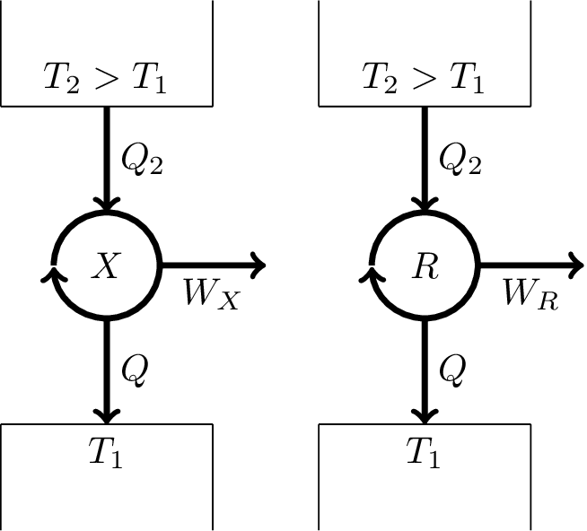
</figure>

Poiché è reversibile, si può considerare una macchina inversa $\tilde{R}$, che produce un lavoro $W_{\tilde{R}}=-W_R$, scambiando una quantità di calore $\tilde{Q}_2=-Q_2$ con la sorgente $T_2$. Se si uniscono questa macchina $\tilde R$ e $X$, si può bilanciare il calore assorbito e ceduto alla sorgente $T_2$, producendo un lavoro totale $W_{X+\tilde{R}}=W_X+W_{\tilde{R}}=W_X-W_R=(\eta_X-\eta_R)Q_2>0$, poiché l’efficienza della macchina $X$ è superiore all’efficienza della macchina di Carnot. Questa macchina $\tilde{R}+X$ rappresenta una macchina di Kelvin, poiché produce un lavoro $W_{X+\tilde{R}}$, assorbendo un calore $Q=Q_1-|Q_1'|>0$ da una sorgente $T_1$.

<figure>

</figure>

Poiché non può esistere una macchina di Kelvin, non potrà neanche esistere la macchina $X$. Quindi per ogni macchina $R$, la sua efficienza sarà: $$\eta_R\leq1-\displaystyle\frac{T_1}{T_2}$$ Si può dimostrare analogamente che l’efficienza di una macchina frigorifera qualsiasi $R$ è: $$\varepsilon_R\leq\varepsilon_C=\displaystyle\frac{1}{\displaystyle\frac{T_2}{T_1}-1}$$

A parità di calore assorbito $Q_A$, la macchina reversibile è quella che fornisce il lavoro massimo $W_{\max}$, ovvero a parità di lavoro fornito $W_B$ la macchina reversibile è quella che assorbe il calore minimo $Q_{\min}$. $$\begin{gathered}
    W_{\max}=Q_A\eta_{\max}=Q_A\eta_C\\
    Q_{\min}=\displaystyle\frac{W_B}{\eta_{\max}}=\frac{W_B}{\eta_C}
\end{gathered}$$  
Per un ciclo reversibile $R$ tra due temperature $T_1$ e $T_2$, si avrà: $$\begin{gathered}
    \eta_R=1-\displaystyle\frac{T_1}{T_2}=1-\displaystyle\frac{|Q_1|}{Q_2}\\
    \displaystyle\frac{|Q_1|}{Q_2}=\frac{T_1}{T_2}\\
    T_2=T_1\displaystyle\frac{|Q_1|}{Q_2}
\end{gathered}$$ La temperatura $T_2$ viene misurata su una scala assoluta, poiché dipende solamente dalla variazione di calore. Sarà quindi impossibile raggiungere una temperatura assoluta nulla, poiché sarebbe necessario che: $$\displaystyle\frac{|Q_1|}{Q_2}\to 0$$ La temperatura assoluta potrà solamente arrivare asintoticamente al valore di $0K$. Per il terzo principio della termodinamica una temperatura assoluta di $0K$, viene definita un punto ideale irraggiungibile.

## Teorema di Clausius ed Entropia

Le considerazioni di Carnot sui cicli termodinamici possono essere estese e generalizzate anche su macchine operanti tra più di due sorgenti. Sezionando un qualsiasi ciclo termodinamico in una serie di cicli di Carnot contigui, che operano su una data coppia di temperature, è possibile approssimare il ciclo originario. Poiché le trasformazioni adiabatiche interne al ciclo vengono attraversate in versi opposti, i loro contributi si compensano a vicenda. Se questi cicli sono reversibili si avrà per ognuno dei cicli: $$\begin{gathered}
    \displaystyle\frac{Q_i}{|Q_j|}=\frac{T_i}{T_j}\\
    \displaystyle\frac{Q_i}{T_i}-\frac{|Q_j|}{T_j}=0
\end{gathered}$$ Se uno dei cicli di Carnot è irreversibile, avrà un’efficienza $\eta_C$ minore dell’efficienza del ciclo reversibile $\eta$, si avrà per questo ciclo: $$\begin{gathered}
    \eta_C<\eta\\
    1-\displaystyle\frac{|Q_i|}{Q_j}<1-\frac{T_i}{T_j}\\
    \displaystyle\frac{|Q_i|}{Q_j}>\frac{T_i}{T_j}\\
    \displaystyle\frac{Q_j}{T_j}-\frac{|Q_i|}{T_i}<0
\end{gathered}$$ Sulla base di queste osservazioni Clausius descrisse il seguente teorema:

> Per ogni sorgente di un ciclo termodinamico può essere definita una quantità ${Q_i}/{T_i}$, dove $Q_i$ è il calore scambiato dalla sorgente, mentre $T_i$ è la temperatura in Kelvin della stessa. La somma tra ogni sorgente di questa quantità sarà minore di zero, se si tratta di un ciclo irreversibile mentre sarà nulla se si tratta di un ciclo reversibile.

Per un numero di suddivisioni tendenti all’infinito, si potrà considerare un integrale sulla curva definita dal ciclo termodinamico nel piano di Clayperyon: $$\lim_{N\to\infty}\displaystyle\frac{\sum_{i=0}^NQ_i}{T_i}=\oint_{\Gamma}\frac{\delta Q}{T}\leq0$$ Se la trasformazione $\Gamma$ è reversibile, allora si avrà: $$\displaystyle\oint_{\Gamma}\frac{\delta Q}{T}=0$$ Allora l’integrale sarà conservativo, e il differenziale $\delta Q$ sarà uguale al differenziale esatto di una funzione di stato $S$ chiamata entropia: $$\Gamma:\mbox{rev. }\iff\displaystyle\frac{\delta Q}{T} =\mathrm{d}S$$ L’entropia sarà quindi una funzione di stato, dipendente dal calore e dalla temperatura. Quindi viene sempre definita come variazione e, come l’energia potenziale, il suo valore in un dato stato sarà definito a meno di una costante. L’entropia è una quantità additiva, aumenta in proporzione all’aumento della massa di un sistema. Ha le caratteristiche di una grandezza estensiva. Rappresenta la distribuzione dell’energia in un dato universo analizzato, minore è l’entropia, minore la porzione dell’universo considerato che contiene l’energia.

Considerando una trasformazione reversibile $\tau_\mathrm{rev}$ tra due stati $A$ e $B$, si potrà applicare l’integrale di Clausius tra i due stati del sistema: $$\int_{\tau_{AB}}\displaystyle\frac{\delta Q}{T}=\int_{S_A}^{S_B}\mathrm{d}S=\Delta S_{AB}$$ Trattandosi di una quantità conservativa, la variazione di entropia tra due stati di un sistema sarà uguale per ogni trasformazioni reversibile tra quei due stati. Per calcolare la variazione di entropia tra due stati di un sistema legati da una trasformazione irreversibile si sceglie una qualsiasi trasformazione reversibile per quei due stati. Per questo alcune trasformazioni vengono rappresentate in un piano $(T,S)$. Dato un ciclo termodinamico tra due stati $A$ e $B$, composto da una trasformazione reversibile ed una irreversibile:

<figure>
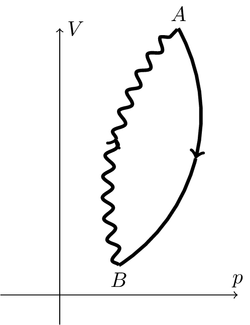
</figure>

Poiché comprende una trasformazione irreversibile la sua efficienza sarà minore dell’efficienza di una macchina di Carnot, per cui l’integrale di Clausius su tutta la trasformazione sarà minore di $0$:

$$\begin{gathered}
    \eta<\eta_C\\
    \oint_{\Gamma}\displaystyle\frac{\delta Q}{T}<0\\
    \int_{\Gamma_{\mathrm{rev}}}\displaystyle\frac{\delta Q}{T}+\int_{\Gamma_{\mathrm{irr}}}\frac{\delta Q}{T}<0\\
    \Delta S_{BA}+\displaystyle\int_{\Gamma_{\mathrm{irr}}}\frac{\delta Q}{T}<0\\
    \displaystyle\int_{\Gamma_{\mathrm{irr}}}\frac{\delta Q}{T}<-\Delta S_{BA}=\Delta S_{AB}
\end{gathered}$$ Per cui in una qualsiasi trasformazione $\Gamma$ tra due stati $A$ e $B$: $$\displaystyle\int_{\Gamma_{AB}}\frac{\delta Q}{T}\leq\Delta S_{AB}$$ Se si considera una trasformazione adiabatica qualsiasi, allora l’entropia del sistema dovrà o aumentare o rimanere costante: $$\begin{gathered}
    \displaystyle\int_{\Gamma_{AB}}\frac{\cancelto{0}{\delta Q}}{T}=0\leq\Delta S_{AB}\\
    S_B\geq S_A
\end{gathered}$$ L’entropia di un sistema termicamente isolato non può diminuire, aumenta se la trasformazione è irreversibile, mentre resta costante se è reversibile. Viene così definito il principio dell’aumento dell’entropia per un sistema isolato: $$\mathrm{d}S\geq0$$ Questa rappresenta la formulazione matematica del secondo principio della termodinamica.

Se l’entropia del sistema diminuisce, allora dovrà essere compensata dall’aumento dell’entropia dell’ambiente e viceversa: $$\begin{gathered}
    \Delta S^U=\Delta  S^A+\Delta S^S\geq0
\end{gathered}$$ Ogni processo naturale si svolge necessariamente nel verso che determina un aumento dell’entropia complessiva del sistema e del suo ambiente.

Se si espande il sistema analizzato, fino all’intero universo, questo sarà un sistema termicamente isolato. Poiché alcune trasformazioni saranno necessariamente irreversibili, l’entropia dell’universo tenderà ad aumentare spontaneamente nel tempo: $$\Delta S>0$$ Lo stato di un sistema tenderà quindi al disordine, ovvero ad uno stato di maggiore entropia, solo se il sistema è isolato rispetto all’ambiente esterno.

In una trasformazione isoterma si avrà: $$\begin{gathered}
    \Gamma_{\mathrm{rev}}:\Delta S_{AB}=\displaystyle\int_{\Gamma_{AB}}\frac{\delta Q}{T}=\frac{1}{T}\int_{Q_A}^{Q_B}\delta Q=\frac{\Delta Q_{AB}}{T}\Rightarrow T\Delta S_{AB}=\Delta Q_{AB}\\
    \Gamma_{\mathrm{irr}}:\Delta S_{AB}>\frac{\Delta Q_{AB}}{T}
\end{gathered}$$ Per cui il calore generato da una reazione isoterma reversibile è maggiore del calore generato da una reazione irreversibile.

In una trasformazione adiabatica o isoentropica, l’entropia rimarrà costante: $$\Delta S_{AB}=\displaystyle\int_{\Gamma_{AB}}\frac{\cancelto{0}{\delta Q}}{T}=0$$ Date due sorgenti a contatto, aventi temperature $T_1$ e $T_2>T_1$ che si scambiano una quantità di calore $Q$, la variazione di entropia del sistema si ottiene tramite la seguente espressione: $$\begin{gathered}
    \Delta S_1=\displaystyle\int_{A}^B\frac{\mathrm{d}Q}{T_1}=\frac{Q}{T_1}\\
    \Delta S_2=\displaystyle\int_{A}^B\frac{\mathrm{d}Q}{T_2}=-\frac{Q}{T_2}\\
    |\Delta S_2|<\Delta S_1\Rightarrow\Delta S=Q\left(\displaystyle\frac{1}{T_1}-\frac{1}{T_2}\right)>0
\end{gathered}$$

Per un gas ideale dato il differenziale dell’entropia $\mathrm{d}S$, si può esprimere rispetto al lavoro ed all’energia interna del sistema: $$\begin{gathered}
    \mathrm{d}S=\displaystyle\frac{\delta Q}{T}=\frac{\mathrm{d}U+\delta W}{T}\\
    \delta  W=p\:\mathrm{d}V=\displaystyle\frac{nRT}{V}\mathrm{d}V,\:\mathrm{d}U=c_Vn\:\mathrm{d}T\\
    \mathrm{d}S=\displaystyle\frac{c_Vn\:\mathrm{d}T}{T}+\frac{nR\:\mathrm{d}V}{V}\\
    \Delta S_{AB}=\int_{T_A}^{T_B}\displaystyle\frac{c_Vn\:\mathrm{d}T}{T}+\int_{V_A}^{V_B}\frac{nR\:\mathrm{d}V}{V}
\end{gathered}$$ $$\Delta S_{AB}=nc_V\ln\left(\displaystyle\frac{T_B}{T_A}\right)+nR\ln\left(\frac{V_B}{V_A}\right)$$ Questa relazione per la variazione di entropia varrà per ogni trasformazione di un gas ideale poiché l’entropia è una funzione di stato. Potrà essere espressa alternativamente, tramite l’equazione di stato dei gas ideali: $$\begin{gathered}
    \Delta S_{AB}=nc_p\ln\left(\displaystyle\frac{T_B}{T_A}\right)-nR\ln\left(\displaystyle\frac{p_B}{p_A}\right)\\
    \Delta S_{AB}=nc_p\ln\left(\displaystyle\frac{V_B}{V_A}\right)+nc_V\ln\left(\frac{p_B}{p_A}\right)
\end{gathered}$$
