---
author:
- "*Giacomo Sturm*"
date: |
  *Dipartimento di Ingegneria Civile, Informatica e delle Tecnologie Aeronautiche  
  Università degli Studi “Roma Tre"*
title: |
  **Fondamenti di Telecomunicazioni**  
  Appunti delle Lezioni di Fondamenti di Telecomunicazioni  
  *Anno Accademico: 2023/24*
---

\providecommand{\labelText}[2]{#1}

# Introduzione

Un segnale è definito come una qualsiasi grandezza fisica che varia nel tempo in maniera deterministica o aleatoria. Può essere un’onda di pressione come la voce, o un onda elettromagnetica come segnali wireless e bluetooth. Un segnale è in grado di contenere informazioni come una sequenza di bit. Generalmente un segnale analogico viene convertito in digitale come un segnale elettrico tramite un trasduttore, per facilitare il processamento, per poi essere riconvertito in analogico; alcuni segnali sono creati direttamente in digitale. Un segnale è definito dalla sua banda, o spettro di banda, che ne determina la capacità di trasmettere informazione. L’ occupazione in frequenza di un segnale è analoga al numero di bit di un dato digitale.

Un segnale comune è il segnale voce, definito da un’onda di pressione, per cui è sempre strettamente positivo. Questo segnale è analogico, quindi continuo, ed il suo valore è noto in ogni istante di tempo $t$, e si identifica come $x(t)$.

<figure>

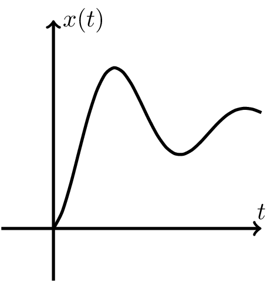 

</figure>

Campionando un segnale analogico si crea un segnale digitale, considerando prima alcune condizioni definite dal teorema del campionamento. Per campionare un segnale si estraggono valori, o campioni, dal segnale analogico ogni intervallo $T$. Il segnale così ottenuto è un segnale discreto $x_n$ o $x[n]$, che presenta un valore ogni multiplo del tempo di campionamento $T$ scelto. $$x[n]:=\{x(n\cdot T)\,\forall n\in\mathbb{N}\}$$

<figure>

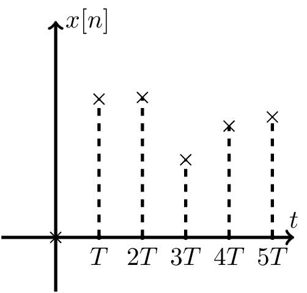 

</figure>

Questi valori vengono poi convertiti in digitale assegnando un certo numero di bit per rappresentare l’intervallo massimo di valori descritti dal segnale. Questo processo viene chiamato quantizzazione, si divide l’intervallo dei valori in piccoli intervalli ognuno con un univoco valore in bit, in modo da convertire tutti i valori in quell’intervallo in una sequenza di bit. Aumentando il numero di bit, quindi il numero di suddivisioni dell’intervallo di partenza, aumenta la precisione, ma aumenta anche il costo per processare lo stesso segnale. Dopo aver convertito tutti i valori in una sequenza di bit, questo segnale in bit viene tramesso, ed in seguito decodificato in analogico. Spesso i segnali vengono creati in digitale, per cui non è necessario campionare un segnale analogico.

Campionando un segnale si perdono le informazioni contenute tra i campioni, ma è possibile applicare filtri e trasformazioni in digitale utili da giustificare questa perdita di informazioni, per cui la maggior parte dei segnali vengono trasmessi in digitale.

I segnali possono essere classificati in certi (deterministici) o aleatori (non deterministici). I segnali certi sono segnali di cui è noto tutto l’andamento, come file salvati su un supporto, per cui non è necessario trasmetterli. Mentre i segnali aleatori non sono noti a priori e vengono studiati dal punto di vista della statistica.

In generale un sistema di trasmissione di segnali è formato da un trasmettitore che processa e codifica il segnale, un canale che lo trasmette, ed un ricevitore che lo decodifica:

<figure>

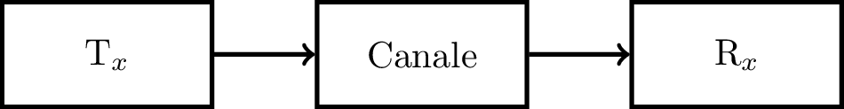 

</figure>

# Rappresentazione di Segnali Canonici

## Segnali a Tempo Continuo

Vengono definiti in questa sezione una serie di segnali canonici, e le operazioni attuabili su questo tipo di segnali:

### Seno Cardinale

$$x(t)=\mathrm{sinc}(t):=\displaystyle\frac{\sin(\pi t)}{\pi t}$$ Questo segnale si attenua asintoticamente come $1/t$: $$\displaystyle-\frac{1}{t}\leq\mathrm{sinc}(t)\leq\frac{1}{t}$$ Viene incluso il fattore $\pi$ nell’argomento in modo che la funzione si annulli per ogni valore intero: $$\mathrm{sinc}(t)=0\,\forall t\in\mathbb{Z}$$

<figure>
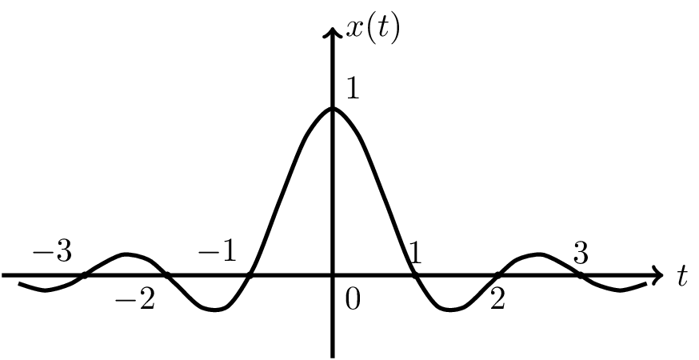
</figure>

### Coseno

$$x(t)=\cos\left(\displaystyle\frac{2\pi t}{T}\right)$$

Il parametro $T$ rappresenta il periodo della funzione, per cui il valore della funzione ad un certo valore $t$ corrisponde al valore in $t-T$: $$f(t)=f(t+T)$$ Invece del periodo si può usare la frequenza $f_0$, inverso del periodo.

<figure>
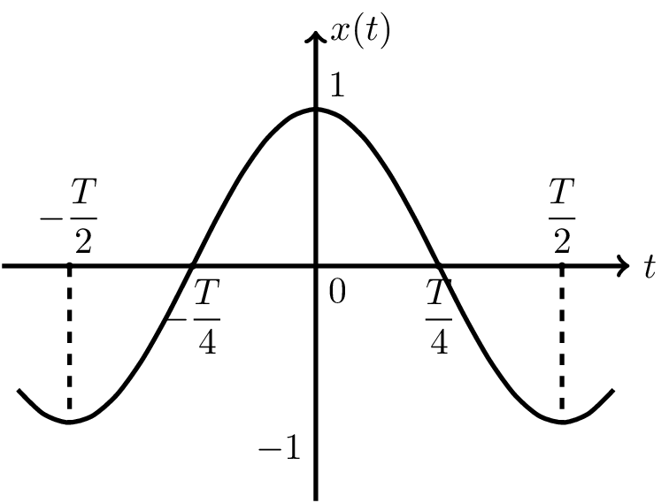
</figure>

### Gradino Periodico o Onda Quadra

<figure>
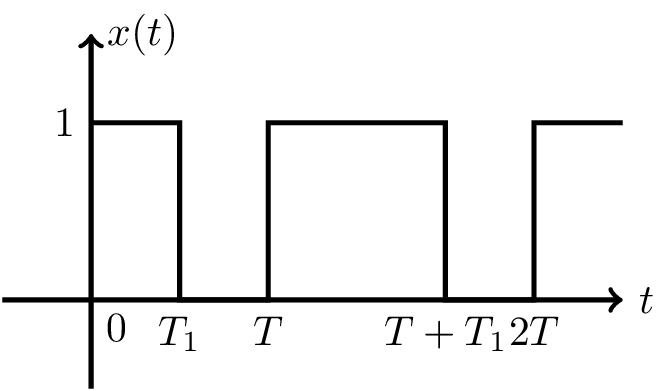
</figure>

### Esponenziale Complesso

$$x(t)=\displaystyle e^{i\frac{2\pi t}{T}}=\cos\left(\frac{2\pi t}{T}\right)+i\sin\left(\frac{2\pi t}{T}\right)$$

Un segnale complesso può essere analizzato mediante la sua fase ed il suo modulo in funzione del tempo: $$x(t)=|x(t)|\exp\left({\phase{x(t)}}\right)$$

Dato che la fase è periodica si può rappresentare come una serie di rampe.

<figure>

  

</figure>

### Esponenziale

$$x(t)=e^{-\alpha t},\,\alpha\in\mathbb{R}$$

<figure>

  

</figure>

### Finestra

$$x(t)=\mathrm{rect}\left(\displaystyle\frac{t}{T}\right):=\begin{cases}
        1 & \displaystyle-\frac{\strut T}{\strut 2}\leq t <\frac{\strut T}{\strut 2}\\
        0 & \displaystyle t<-\frac{\strut T}{\strut 2} \land t\geq\frac{\strut T}{\strut 2}
    \end{cases}$$

$T$ viene chiamata base della finestra. Questo segnale presenta una discontinuità di salto per $t=\pm T/2$. La funzione finestra viene usata quando si vuole analizzare solo una parte di un segnale, poiché il restante sarà pari a $0$. La trasformata di questa funzione rappresenta un filtro in frequenza.

<figure>
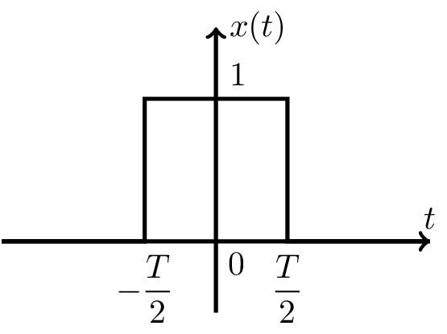
</figure>

### Triangolo

$$x(t)=\mathrm{tri}\left(\displaystyle\frac{t}{T}\right):=\begin{cases}
        1-|t| & -T\leq t < T\\
        0 & t<-T \land t\geq T
    \end{cases}$$

<figure>
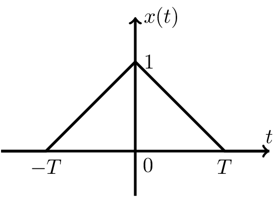
</figure>

### Gradino

$$x(t)=u(t):=\begin{cases}
        1 & t\geq0\\
        0 & t<0
    \end{cases}$$

<figure>
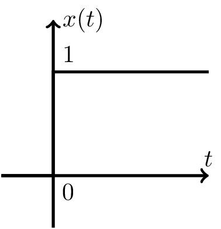
</figure>

### Gaussiana

$$x(t)=e^{-\alpha t^2}\,\,\alpha\in\mathbb{R}^+$$

La larghezza della campana centrale dipende dal fattore $\alpha$. Nello studio delle probabilità, si usa la sua forma normalizzata: $$x(t)=\displaystyle\frac{1}{\sqrt{2\pi}\sigma}e^{-\frac{t^2}{2\sigma^2}}$$ Il valore $\sigma$ rappresenta la deviazione standard, mentre il suo quadrato $\sigma^2$ descrive la varianza.

<figure>
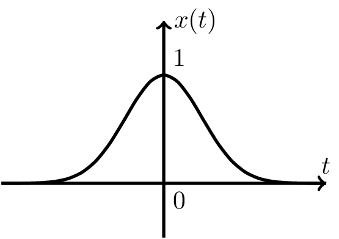
</figure>

### Esponenziale Unilatero

$$x(t)=e^{-\alpha t}\cdot u(t)\,\,\alpha\in\mathbb{R}^+$$

<figure>
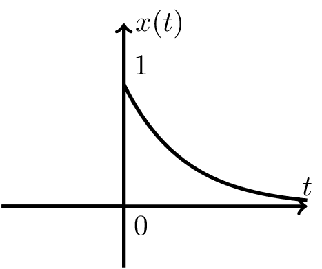
</figure>

### Costante

$$x(t)=a$$

<figure>
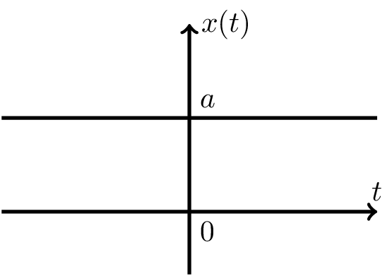
</figure>

### Segno

$$x(t)=\mbox{sign}(t):=\begin{cases}
        1&t>0\\
        -1&t<0
    \end{cases}$$

<figure>
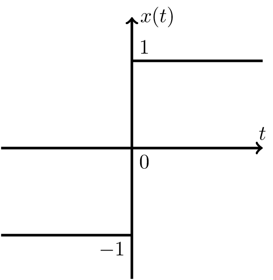
</figure>

### Operazioni sui Segnali

Le operazioni sui segnali vengono computate istante per istante. L’operazione di somma produce un segnale $z(t)$, tale che ogni valore che assume equivale alla somma di altri due segnali $x(t)$ e $y(t)$ nello stesso istante: $$z(t)=x(t)+y(t)$$

Analogamente si considera l’operazione prodotto, come un prodotto istante per istante tra i due segnali: $$z(t)=x(t)\cdot y(t)$$

L’operazione di ribaltamento corrisponde ad una riflessione della funzione lungo l’asse delle ascisse di un segnale $x(t)$ tramite una sostituzione di variabile $t\to-t$: $$z(t)=x(-t)$$ Quest’operazione non produce risultati per segnali pari, poiché presentano la proprietà $x(t)=x(-t)$. Tramite l’operazione di ribaltamento si può esprimere il segnale segno come la differenza di due gradini: $$\mbox{sign}(t)=u(t)-u(-t)$$

L’operazione di traslazione, sposta un segnale $x(t)$ lungo l’asse delle ascisse di un fattore $\tau$: $$z(t)=x(t-\tau)$$

L’operazione di cambio di scala corrisponde ad un rimpicciolimento o allargamento di un segnale $x(t)$ di un fattore $a\in\mathbb{R}$: $$z(t)=x(at)$$

### Energia e Potenza

L’energia e la potenza di un segnale rappresentano caratteristiche utili nella loro analisi e processamento.

Viene definita energia $E_x$ di un segnale $x(t)$, come il limite per $\Delta t\to\infty$ dell’integrale del modulo quadro del segnale: $$E_x:=\lim_{\Delta t\to\infty}\displaystyle\int_{-\frac{\Delta t}{2}}^{\frac{\Delta t}{2}}|x(t)|^2\mathrm{d}t=\int_{-\infty}^{\infty}|x(t)|^2\mathrm{d}t$$ L’energia di un segnale è sempre strettamente positiva, poiché si considera tutta l’area sottesa dal quadrato del modulo del segnale, necessariamente positivo; mentre è nulla solo se lo è anche il segnale analizzato. Teoricamente non esiste un limite per l’energia contenuta in un segnale, ma sono fisicamente realizzabili solo segnali con energia finita.

Se l’energia di un segnale è finita $E_x\neq\infty$ e diversa da zero $E_x\neq0$, il segnale $x(t)$ si chiama segnale di energia.

Viene definita la potenza $P_x$ di un segnale $x(t)$ in maniera simile alla sua energia: $$P_x:=\lim_{\Delta t\to\infty}\displaystyle\left(\frac{1}{\Delta t}\int_{-\frac{\Delta t}{2}}^{\frac{\Delta t}{2}}|x(t)|^2\mathrm{d}t\right)$$ Anche la potenza di un segnale è strettamente positiva $P_x\geq0$, se la potenza assume valori diversi da zero e finiti, il segnale $x(t)$ si chiama segnale di potenza.

Vengono così create due classi di segnali, di potenza e di energia. Per la definizione, queste due grandezze sono antisimmetriche poiché se un segnale è di potenza non può essere di energia, e viceversa: $$\begin{gathered}
    x\in E\implies x\notin P\\
    x\in P\implies x\notin E
\end{gathered}$$

Calcolando parametri come l’energia e la potenza di un segnale ci si può imbattere in un integrale, noto anche come integrale di Gauss, la cui risoluzione non è necessaria per il corso, di cui viene fornito il suo risultato: $$\displaystyle\int_{-\infty}^{+\infty}e^{-t^2}\mathrm{d}t=\sqrt{\pi}$$

Moltiplicando un segnale $x(t)$ per un gradino e calcolandone l’integrale su tutti i reali $\mathbb{R}$, equivale a calcolare l’integrale del segnale originario sui soli reali positivi $\mathbb{R}^+$, poiché il segnale assume valori nulli da $-\infty$ a $0$: $$\displaystyle\int_{-\infty}^{+\infty}x(t)\cdot u(t)\mathrm{d}t=\displaystyle\int_{0}^{+\infty}x(t)\mathrm{d}t$$

I segnali periodici non possono essere di energia poiché l’integrale assume sempre valori non finiti, per cui un segnale periodico senza attenuazione non è fisicamente realizzabile. Possono essere solo di potenza, si determina la potenza di un segnale periodico: $$P_x=\lim_{\Delta t\to\infty}\displaystyle\left(\frac{1}{\Delta t}\int_{-\frac{\Delta t}{2}}^{\frac{\Delta t}{2}}|x(t)|^2\mathrm{d}t\right)$$ In un segnale periodico si può esprimere l’intervallo di tempo $\Delta t$ come $n$ volte il periodo $T$: $$P_x=\lim_{n\to\infty}\displaystyle\left(\frac{1}{n T}\int_{-\frac{nT}{2}}^{\frac{nT}{2}}|x(t)|^2\mathrm{d}t\right)$$ L’integrale di un segnale perfettamente periodico, ovvero senza smorzamenti, su $n$ periodi equivale ad $n$ volte l’integrale su un singolo periodo $T$: $$P_x=\lim_{n\to\infty}\displaystyle\left(\frac{1}{n T}n\int_{-\frac{n}{2}}^{\frac{T}{2}}|x(t)|^2\mathrm{d}t\right)=\lim_{n\to\infty}\displaystyle\left(\frac{1}{T}\int_{-\frac{T}{2}}^{\frac{T}{2}}|x(t)|^2\mathrm{d}t\right)$$ Questo integrale è indipendente dalla variabile $n$, per cui si può trascurare il limite, la potenza risulta quindi essere: $$P_x=\displaystyle\frac{1}{T}\int_{-\frac{T}{2}}^{\frac{T}{2}}|x(t)|^2\mathrm{d}t$$ Quest’ultimo integrale può essere espresso in termini della frequenza naturale: $f_0={1}/{T}$.

## Segnali a Tempo Discreto

Poiché la maggior parte dei segnali vengono trasmessi o generati in tempo discreto, è necessario essere a conoscenza del comportamento dei segnali continui campionati a tempo discreto.

### Gradino

$$x[n]=u[n]:=\begin{cases}
        1&n\geq0\\
        0&n<0
    \end{cases}$$

<figure>
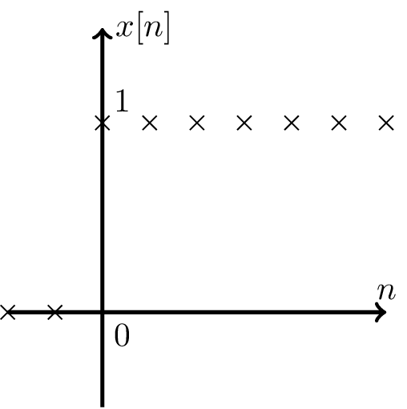
</figure>

Non avendo un segnale finestra a tempo discreto, essa può essere descritta come la differenza di due gradini discreti. Una finestra di base $2l$ nel discreto si esprime come: $$u[n+l]-u[n-(l+1)]$$

<figure>
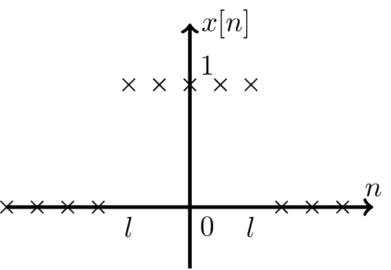
</figure>

### Esponenziale Unilatero

$$x[n]=a^nu[n]$$

<figure>
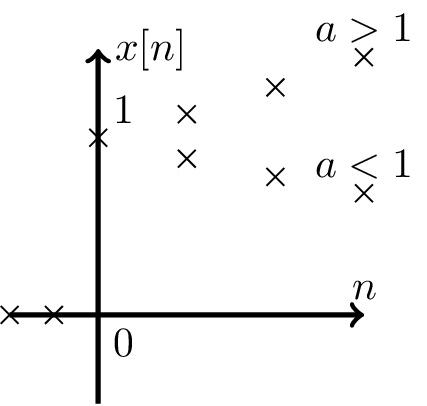
</figure>

### Coseno

$$x[n]=\cos(2\pi f_0n)$$

Il segnale è periodico nel discreto, solo se la frequenza è un numero intero $f_0\in\mathbb{Z}$.

<figure>
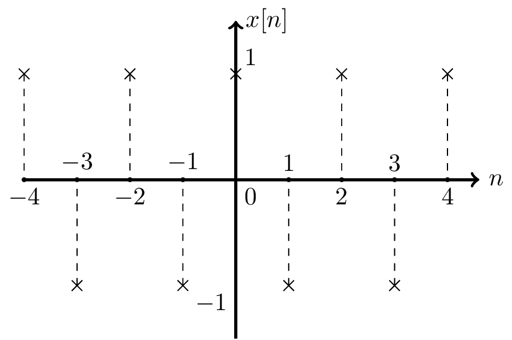
</figure>

### Impulso Matematico Tempo Discreto

L’impulso matematico o delta di Dirac, nel discreto assume solo un valore di $1$ per $n=0$. $$\delta[n]:=\begin{cases}
        1&n=0\\
        0&n\neq0
    \end{cases}$$

L’area della delta è unitaria, poiché presenta un unico campione per $n=0$ di valore $1$: $$\displaystyle\sum_{n=-\infty}^{+\infty}\delta[n]=1$$

Il prodotto di un qualsiasi segnale $x[n]$ per la delta equivale al valore del segnale in $0$ per la delta. Poiché l’unico valore della delta diverso da zero si trova in $n=0$ e vale $1$, per cui estrae dal segnale $x$ il campione in posizione $n=0$. Questo campione viene moltiplicato per la delta, poiché non è un segnale continuo, ma si presenta solo in quell’istante. Questa caratteristica viene chiamata proprietà di campionamento della delta di Dirac: $$x[n]\cdot\delta[n]=x[0]\cdot\delta[n]$$ Questo campione può essere estratto ad un arbitraria posizione $m$: $$x[n]\cdot\delta[n-m]=x[m]\cdot\delta[n-m]$$

L’area del prodotto di un qualsiasi segnale $x[n]$ per la delta risulta nel valore del segnale in $0$, ciò si dimostra tramite la proprietà di campionamento della delta: $$\displaystyle\sum_{n=-\infty}^{+\infty} x[n]\cdot\delta[n]=\sum_{n=-\infty}^{+\infty} x[0]\cdot\delta[n]=x[0]\cancelto{1}{\sum_{n=-\infty}^{+\infty}\delta[n]}=x[0]$$

Invertendo la proprietà di campionamento, ovvero partendo da tutti i campioni di un segnale $x[n]$ e sommandoli tra di loro, è possibile ottenere il segnale originario: $$\cdots+x[-N]\delta[n+N]+\cdots+x[0]\delta[n]+\cdots+x[N]\delta[n-N]+\cdots=\displaystyle\sum_{k=-\infty}^{+\infty} x[k]\delta[n-k]=x[n]$$

La convoluzione di un qualsiasi segnale $x[n]$ per la delta risulta nel segnale $x$ stesso: $$x[n]*\delta[n]=\displaystyle\sum_{k=-\infty}^{+\infty}x[k]\delta[n-k]=\sum_{k=-\infty}^{+\infty}x[n]\delta[n-k]=x[n]\cancelto{1}{\sum_{k=-\infty}^{+\infty}\delta[n-k]}$$

La delta può essere rappresentata come la differenza tra due gradini, considerando un unico campione in posizione $m$: $$\delta[n-m]=u[n-m]-u[n-(m+1)]$$

Analogamente un gradino può essere espresso come una somma di impulsi traslati ognuno di un diverso fattore. Questa relazione viene espressa in forma canonica come: $$u[n-m]=\displaystyle\sum_{n=-\infty}^{-m}\delta[n+1]$$

### Energia e Potenza

L’energia di un segnale tempo discreto si calcola come: $$E_x:=\displaystyle\lim_{N\to\infty}\sum_{n=-N}^N|x[n]|^2$$ La potenza di un segnale tempo discreto è definita come: $$P_x:=\displaystyle\lim_{N\to\infty}\left(\frac{1}{2N+1}\sum_{n=-N}^N|x[n]|^2\right)$$ La potenza per segnali periodici tempo discreti si ottiene mediante: $$P_x:=\displaystyle\frac{1}{M}\sum_{n=0}^{M-1}|x[n]|^2$$ Dove $M$ è il periodo del segnale.

# Convoluzione e Correlazione

Prima di analizzare queste due importanti operazioni tra segnali tempo continuo e discreto, bisogna fornire una definizione adeguata per l’impulso matematico tempo continuo, segnale utile nello studio, e nel calcolo di queste operazioni.

## Impulso Matematico Tempo Continuo

Per definire l’impulso o delta di Dirac nel tempo continuo, si parte da un segnale finestra con una base $\Delta t$ e ampiezza inverso della base: $$x(t)=\displaystyle\frac{1}{\Delta t}\mathrm{rect}\left(\frac{t}{\Delta t}\right)$$

<figure>
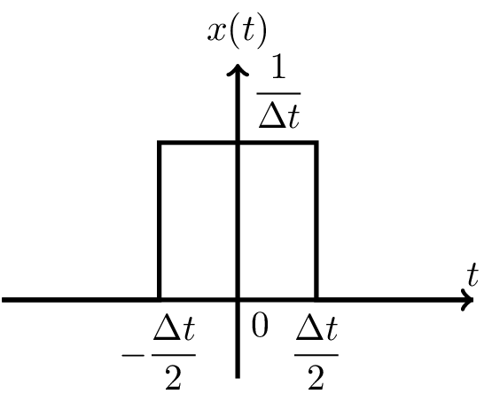
</figure>

Al diminuire di $\Delta t$, la base si restringe, mentre l’ampiezza del segnale aumenta, ma complessivamente l’area del segnale rimane costante: $$\displaystyle\int_{-\infty}^{+\infty}x(t)\mathrm{d}t=\frac{1}{\Delta t}\int_{-\frac{\Delta t}{2}}^{\frac{\Delta t}{2}}\mathrm{d}t=\frac{1}{\Delta t}\left(\frac{\Delta t}{2}+\frac{\Delta t}{2}\right)=1$$

Viene definito l’impulso o delta di Dirac come il limite di questa finestra per $\Delta t$ che tende ad un valore nullo: $$\delta(t):=\lim_{\Delta t\to0}\displaystyle\frac{1}{\Delta t}\mathrm{rect}\left(\frac{t}{\Delta t}\right)$$

Viene rappresentata graficamente come una freccia di altezza unitaria, poiché non è una funzione ma un funzionale; si trascurerà questa differenza nelle successive analisi.

<figure>

</figure>

Possiede delle proprietà analoghe alla delta nel tempo discreto. L’integrale sui reali della delta è unitario in base alla sua definizione: $$\displaystyle\int_{-\infty}^{+\infty}\delta(t)\mathrm{d}t=1$$

Il prodotto di un qualsiasi segnale per la delta equivale al valore del segnale in $0$ moltiplicato per l’impulso, poiché per tutti gli altri valori nel tempo questo prodotto è nullo. Proprietà analoga a quella del campionamento, per il continuo: $$x(t)\cdot\delta(t)=x(0)\cdot\delta(t)$$ Questa proprietà può essere estesa considerando un impulso traslato di un fattore $\tau$: $$x(t)\cdot\delta(t-\tau)=x(\tau)\cdot\delta(t-\tau)$$

Segue da quest’ultima che l’integrale del prodotto di un segnale qualunque $x(t)$ per l’impulso equivale al valore del segnale $x$ in $0$: $$\displaystyle\int_{-\infty}^{+\infty}x(t)\cdot\delta(t)\mathrm{d}t=\int_{-\infty}^{+\infty}x(0)\cdot\delta(t)\mathrm{d}t=x(0)\cancelto{1}{\int_{-\infty}^{+\infty}\delta(t)\mathrm{d}t}=x(0)$$

La convoluzione di un qualsiasi segnale $x(t)$ con l’impulso risulta nel segnale originario $x(t)$, per l’inverso della proprietà precedente: $$x(t)*\delta(t)=\displaystyle\int_{-\infty}^{+\infty}x(\tau)\cdot\delta(t-\tau)\mathrm{d}\tau=x(t)\cancelto{1}{\int_{-\infty}^{+\infty}\delta(t-\tau)\mathrm{d}\tau}=x(t)$$

Poiché il segnale finestra può essere espresso come la differenza tra due gradini, allora anche la definizione dell’impulso può essere espressa come tale: $$\delta(t):=\lim_{\Delta t\to\infty}\frac{1}{\Delta t}\left(u\left(t+\frac{\Delta t}{2}\right)-u\left(t-\frac{\Delta t}{2}\right)\right)$$

L’impulso corrisponde alla derivata rispetto al tempo del gradino. Analogamente il gradino corrisponde alla funzione integrale dell’impulso: $$\begin{gathered}
    \delta(t)=\displaystyle\frac{\mathrm{d}u(t)}{\mathrm{d}t}\\
    u(t)=\displaystyle\int_{-\infty}^t\delta(\tau)\mathrm{d}\tau
\end{gathered}$$

L’impulso è una funzione pari: $$\delta(t)=\delta(-t)$$

L’impulso scalato di un fattore $a$ corrisponde al rapporto tra l’impulso non scalato ed il modulo del fattore $a$, se negativo. Questa proprietà di scala si dimostra considerando la definizione dell’impulso: $$\begin{gathered}
    \delta(at)=\displaystyle\lim_{\Delta t\to0}\frac{1}{\Delta t}\mathrm{rect}\left(\frac{at}{\Delta t}\right)\\
    \Delta\tau=\displaystyle\frac{\Delta t}{a}\\
    \displaystyle\lim_{\Delta\tau\to0}\frac{1}{a\Delta\tau}\mathrm{rect}\left(\frac{t}{\Delta\tau}\right)=\frac{1}{a}\lim_{\Delta\tau\to0}\frac{1}{\Delta\tau}\mathrm{rect}\left(\frac{t}{\Delta\tau}\right)
\end{gathered}$$ $$\delta(at)=\displaystyle\frac{\delta(t)}{a}$$

L’impulso è un segnale né di energia né di potenza. I funzionali, come l’impulso, vengono descritti in base agli effetti che provocano sulle funzioni

## Convoluzione

La convoluzione rappresenta un’operazione tra due segnali, generandone uno nuovo. L’operazione si indica con il simbolo $*$: $$x(t)*y(t)=z(t)$$

La convoluzione tra due segnali tempo continui produce sempre un segnale continuo: $$z(t)=x(t)*y(t):=\displaystyle\int_{-\infty}^{+\infty}x(\tau)\cdot y(t-\tau)\mathrm{d}\tau$$

Il segnale convoluzione è una funzione nella stessa variabile dei segnali convoluti, questa variabile di uscita compare all’interno dell’integrale. Il segnale convoluzione rappresenta l’area sottesa dal prodotto tra il segnale $x$ ed il segnale $y$, ribaltato e traslato di un fattore $t$, per ogni istante di tempo $t$. La convoluzione è un’operazione commutativa, per cui è arbitraria la scelta di quale dei due segnali debba traslare.

Si rappresenta il segnale $x$ originario rispetto alla variabile $\tau$, al di sotto si grafica il segnale $y$ ribaltato e traslato di un fattore $t$, per individuare gli intervalli dove il prodotto tra i due segnali è nullo. La maggior parte dei segnali reali si attenuano nel tempo, per cui avranno un valore diverso da zero solo per un intervallo finito di valori, ed in questi intervalli la convoluzione restituisce un valore non nullo. Anche i segnali puramente matematici spesso presentano valori finiti non nulli solo per certi intervalli di tempo. Si considerano tutti i possibili casi di sovrapposizione, quindi di prodotto non nullo, tra i due segnali, per ottenere il segnale convoluzione in forma analitica. Da notare che la convoluzione è un segnale continuo per cui non possono essere presenti discontinuità nella sua espressione in forma analitica.

### Proprietà

La convoluzione è un’operazione commutativa: $$\begin{gathered}
    x(t)*y(t)=y(t)*x(t)\tag{\stepcounter{equation}\theequation}\\
    x(t)*y(t)=\displaystyle\int_{-\infty}^{+\infty}x(\tau)y(t-\tau)\mathrm{d}\tau\\
    {T=t-\tau}\\
    \int_{-\infty}^{+\infty}y(T)x(t-T)\mathrm{d}T=y(t)*x(t)
\end{gathered}$$ Vale la proprietà distributiva: $$\begin{gathered}
    (x_1(t)+x_2(t))*y(t)=x_1(t)*y(t)+x_2(t)*y(t)\tag{\stepcounter{equation}\theequation}\\
    (x_1(t)+x_2(t))*y(t)=\displaystyle\int_{-\infty}^{+\infty}(x_1(\tau)+x_2(\tau))y(t-\tau)\mathrm{d}\tau\\
    \int_{-\infty}^{+\infty}x_1(\tau)y(t-\tau)\mathrm{d}\tau+\int_{-\infty}^{+\infty}x_2(\tau)y(t-\tau)\mathrm{d}\tau=x_1(t)*y(t)+x_2(t)*y(t)
\end{gathered}$$

Se uno dei due segnali convoluti, o entrambi, sono traslati allora il segnale convoluzione risultante è traslato della traslazione complessiva dei due segnali originali: $$\begin{gathered}
    x(t-t_{x0})*y(t-t_{y0})=z(t-t_{x0}-t_{y0})\tag{\stepcounter{equation}\theequation}\\
    x(t-t_{x0})*y(t-t_{y0})=\displaystyle\int_{-\infty}^{+\infty}x(\tau-t_{x0})y[t-(\tau+t_{y0})]\mathrm{d}\tau\\
    {T=\tau-t_{x0}}\\\
    \int_{-\infty}^{+\infty}x(T)y[(t-t_{x0}-t_{y0})+T]\mathrm{d}T=z(t-t_{x0}-t_{y0})
\end{gathered}$$

### Convoluzione Tempo Discreto

$$x[n]*y[n]:=\displaystyle\sum_{k=-\infty}^{+\infty}x[k]y[n-k]$$

Nel discreto, quando si applica la convoluzione, il numero di campioni totali della convoluzione è uguale alla somma dei campioni dei due segnali meno uno. Per le convoluzioni a tempo continuo si usa la continuità, per quelle a tempo discreto il numero dei campioni, per identificare se sono convoluzioni valide. Per le convoluzioni a tempo discreto valgono le proprietà commutativa e distributiva. I singoli campioni di un segnale nel discreto possono essere rappresentati come una costante che moltiplica un impulso traslato di un certo fattore: $$x[n]=\displaystyle\sum_{k=1}^Nx_k\delta[n-k]$$ Ciò è possibile per ogni segnale discreto, per cui la convoluzione di due segnali discreti si può esprimere come: $$x[n]*y[n]=\displaystyle\sum_{k=-\infty}^{+\infty}x[k]y[n-k]=\sum_{k=-\infty}^{+\infty}\left[\sum_{i=1}^Nx_i\delta[k-i]\sum_{j=1}^Ny_j\delta[n-k-j]\right]$$ Una convoluzione quindi rappresenta una media tra una serie di campioni, può essere estesa a segnali multidimensionali come delle immagini, dove la convoluzione viene usata negli algoritmi di compressione per diminuire il costo della trasmissione del segnale, diminuendo l’informazione necessaria.

## Correlazione

La correlazione è un’operazione simile alla convoluzione, calcolabile come una convoluzione. Le convoluzioni vengono usate per modellare l’effetto del passaggio di un segnale attraverso un sistema, ciò corrisponde al processamento di un segnale. Alcuni di questi sistemi corrispondono nel dominio della frequenza in filtri.

Una correlazione si applica quando due segnali sono simili tra loro, viene definita come un segnale continuo nel dominio del tempo: $$R_{xy}(t)=x(t)\otimes y(t)=\int_{-\infty}^{+\infty}x(t+\tau)y^*(\tau)\mathrm{d}\tau$$ Viene definito $R_{xy}$ il fattore di correlazione tra i due segnali $x$ e $y$. La correlazione al contrario della convoluzione non commuta: $$\begin{gathered}
    R_{xy}(t)=R_{yx}^*(-t)\tag{\stepcounter{equation}\theequation}\\
    \displaystyle R_{xy}(t)=\int_{-\infty}^{+\infty}x(t+\tau)y^*(\tau)\mathrm{d}\tau\\
    T=t+\tau\\
    \displaystyle\int_{-\infty}^{+\infty}x(T)y^*(-t+T)\mathrm{d}T=\left[\int_{-\infty}^{+\infty}x^*(T)y(-t+T)\mathrm{d}T\right]^*=R_{yx}^*(-t)
\end{gathered}$$ Il fattore di convoluzione $R_{xy}(t)$ tra due segnali $x$ e $y$ corrisponde al complesso coniugato del fattore di convoluzione ribaltato dei segnali $y$ e $x$ $R_{yx}^*(-t)$, quindi la correlazione è un’operazione anticommutativa. La correlazione tra due segnali $x$ e $y$ equivale alla convoluzione dei segnali $y^*$ e $x$ $$\begin{gathered}
    x(t)\otimes y(t)=\displaystyle\int_{-\infty}^{+\infty}x(t+\tau)y^*(\tau)\mathrm{d}\tau\\
    x(t)*y^*(-t)=\displaystyle\int_{-\infty}^{+\infty}x(\tau)y^*(-(t-\tau))\mathrm{d}\tau\\
    T=\tau-t\\
    -\int_{+\infty}^{-\infty}x(t+T)y^*(T)\mathrm{d}T=\int_{-\infty}^{+\infty}x(t+T)y^*(T)\mathrm{d}T=R_{xy}(t)\\
    x(t)\otimes y(t)=x(t)*y^*(-t)\tag{\stepcounter{equation}\theequation}
\end{gathered}$$ Quando si analizza la correlazione tra due segnali $x$ e $y$, uno dei quali pari $y(t)=y(-t)$ e reale $y\in\mathbb{R}$, la correlazione tra di loro è uguale alla convoluzione tra di loro: $$x(t)\otimes y(t)=x(t)*y^*(-t)=x(t)*y(-t)=x(t)*y(t)$$

L’autocorrelazione di un segnale $x$ nell’istante di tempo $t=0$, corrisponde all’energia del segnale: $$R_{xx}(0)=\displaystyle\int_{-\infty}^{+\infty}x(\tau)x^*(\tau)\mathrm{d}\tau=\int_{-\infty}^{+\infty}|x(\tau)|^2\mathrm{d}\tau=E_x$$

## Sistema Ingresso-Uscita

Un sistema di ingresso-uscita applica determinate trasformazioni al segnale $x$ in entrata, per ottenere un altro segnale $y$ in uscita, questo segnale è un funzionale del segnale di ingresso $y(t)=\mathcal{F}\{x(t)\}$. Questa trasformazione si basa su dei parametri interni $\sum$ al sistema per cui passa l’ingresso.

<figure>
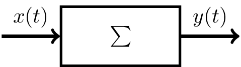
</figure>

Un sistema ingresso-uscita si definisce lineare, se ad una combinazione lineare degli ingressi, corrisponde una combinazione lineare delle uscite: $$\begin{gathered}
    x_1(t)\to y_1(t)\\
    \vdots\\
    x_n(t)\to y_n(t)
\end{gathered}$$ $$x(t)=\displaystyle\sum_{k=1}^{n}a_kx_k(t)\to y(t)=\sum_{k=1}^{n}a_ky_k(t)$$

Un amplificatore rappresenta un sistema lineare, poiché moltiplica di un fattore $A$ un segnale in entrata: $$\begin{gathered}
    x_1(t)\to y_1(t)=Ax_1(t)\\
    x_2(t)\to y_2(t)=Ax_2(t)\\
    ax_1(t)+bx_2(t)\to ay_1(t)+by_2(t)=A(ax_1(t)+bx_2(t))
\end{gathered}$$

<figure>
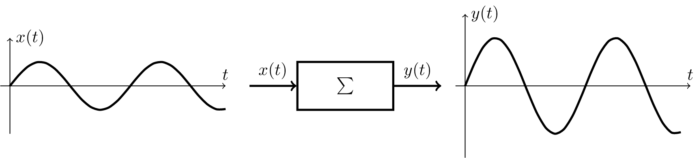
</figure>

Un sistema lineare non distorce gli ingressi. Un sistema che restituisce il segnale originario sommato per una costante $A$ non è lineare: $$\begin{gathered}
    x(t)\to y(t)=x(t)+A\\
    x_1(t)+x_2(t)\to y(t)=x_1(t)+x_2(t)+A\neq y_1(t)+y_2(t)
\end{gathered}$$

Un sistema tempo invariante o permanente, non dipende da quando viene inserito il segnale in entrata: $$\begin{gathered}
    x(t)\to y(t)\\
    x(t-\tau)\to y(t-\tau)
\end{gathered}$$ La linearità e la permanenza sono due proprietà indipendenti tra di loro. Un sistema può essere lineare e non permanente e viceversa, oppure nessuno delle due. L’operazione di modulazione di un segnale, il prodotto tra l’entrata ed una funzione sinusoidale, è un sistema lineare e non permanente: $$\begin{gathered}
    x(t)\to y(t)=x(t)\cos\displaystyle\left(\frac{2\pi t}{T}\right)\\
    x(t-\tau)\to y(t-\tau)=x(t-\tau)\displaystyle\cos\left(\frac{2\pi t}{T}\right)\neq x(t-\tau)\cos\left(\frac{2\pi (t-\tau)}{T}\right)
\end{gathered}$$ Per cui dipende dall’istante di tempo quando viene inserito il segnale.

Un sistema può presentare un’altra proprietà chiamata causalità, che presenta un senso fisico. Un sistema si definisce causale se per ogni uscita all’istante $t_0$, dipende da valori entrati al massimo fino al tempo $t_0$: $$y(t_0)\propto x(t),\,\,t\leq t_0$$ L’uscita non può dipendere da entrate future se il sistema è causale. Data un’uscita $y$ dipendente dall’entrata $x$ traslata di un fattore $\tau$: $y(t)=x(t+\tau)$, se questo fattore di traslazione $\tau$ è negativo, l’uscita dipende da entrate ritardate per cui dipende da entrate passate, mentre se il fattore $\tau$ è positivo l’uscita dipende da entrate anticipate, quindi per un certo istante $t$ l’uscita dipende da entrate future.

La linearità e la permanenza sono due proprietà fondamentali per cui un sistema si identifica come filtro, o SLI, Sistema Lineare Invariante. L’uscita di un filtro dipende solo da una funzione $h(t)$, chiamata risposta impulsiva, e si ottiene mediante la convoluzione tra l’entrata e quest’ultima: $$x(t)\to y(t)=x(t)*h(t)$$ Si chiama risposta impulsiva, poiché se è presente un impulso in entrata, l’uscita è la funzione $h(t)$ stessa, per la proprietà della convoluzione di un impulso: $$\delta(t)\to y(t)=\delta(t)*h(t)=h(t)$$

Per dimostrare l’uscita di un filtro, si considera il segnale $x$ come la somma integrale di impulsi moltiplicati per il valore della funzione in $x(\tau)$, ovvero la sua convoluzione: $$\begin{gathered}
    x(t)=x(t)*\delta(t)=\displaystyle\int_{-\infty}^{+\infty}x(\tau)\delta(t-\tau)\mathrm{d}\tau=\int_{-\infty}^{+\infty}\mathrm{d}x(t)
\end{gathered}$$ Poiché il filtro è lineare si può considerare l’uscita $y$ come la somma integrale di tutte le uscite $\mathrm{d}y$ per ogni entrata $\mathrm{d}x=x(\tau)\delta(t-\tau)\mathrm{d}\tau$. Poiché il fattore $x(\tau)$ non dipende dal tempo si considera una costante, per cui l’uscita $\mathrm{d}y$ uguale al prodotto tra la costante $x(\tau)$ per la convoluzione tra l’impulso e la risposta impulsiva: $$\begin{gathered}
    \mathrm{d}x(t)=x(\tau)\delta(t-\tau)\mathrm{d}\tau\\
    \mathrm{d}y(t)=x(\tau)(\delta(t-\tau)*h(t))\mathrm{d}\tau=x(\tau)h(t-\tau)\mathrm{d}\tau
\end{gathered}$$ L’uscita totale si ottiene integrando su tutti i reali l’uscita infinitesima $\mathrm{d}y(t)$: $$y(t)=\displaystyle\int_{-\infty}^{+\infty}\mathrm{d}y(t)=\int_{-\infty}^{+\infty}x(\tau)h(t-\tau)\mathrm{d}\tau=x(t)*h(t)$$ Per cui l’uscita di un filtro corrisponde alla convoluzione tra l’entrata e la sua risposta impulsiva.

Per determinare la risoluzione di uno schermo, dispositivo che opera come un filtro, si inserisce in entrata un impulso bidimensionale, rappresentato come un singolo punto su una superficie. L’uscita di questa entrata risulta in una macchia formata da vari pixel; più questa macchia è piccola maggiore è la risoluzione del dato schermo.

Nel tempo discreto un sistema può essere caratterizzato dalle stesse proprietà. Linearità: $$\begin{gathered}
    x_1[n]\to y_1[n]\\
    \vdots\\
    x_m[n]\to y_m[n]
\end{gathered}$$ $$x(t)=\displaystyle\sum_{k=1}^{m}a_kx_k[n]\to y(t)=\displaystyle\sum_{k=1}^{+\infty}a_ky_k[n]$$ Tempo invarianza: $$\begin{gathered}
    x[n+N]\to y[n+N]
\end{gathered}$$ Causalità: $$y[n_0]\propto x[n],\,\, n\leq n_0$$ Si può esprimere formalmente questa condizione di causalità considerando un filtro con una risposta impulsiva $h[n]$: $$y[n]=\displaystyle\sum_{k=-\infty}^{+\infty}x[k]h[n-k]$$ Se questo filtro fosse causale allora la variabile $k$ non potrebbe superare il valore $n$, poiché ciò implicherebbe che l’uscita dipenda da entrate future: $$y[n]=\displaystyle\sum_{k=-\infty}^nx[k]h[n-k]$$ Inoltre la risposta impulsiva deve essere nulla se il valore di $k$ è maggiore di $n$: $$h[n-k]=0,\,\, k>n\to{n-k=N}\to h[N],\,\, N<0$$ Si può attuare lo stesso ragionamento per la causalità a tempo continuo. Un filtro è causale solo se: $$\begin{gathered}
    y(t)=\displaystyle\int_{-\infty}^{+\infty}x(\tau)h(t-\tau)\mathrm{d}\tau\to \int_{-\infty}^{t}x(\tau)h(t-\tau)\mathrm{d}\tau\\
    h(t-\tau)=0,\,\, \tau>t\to{t-\tau=T}\to h(T)=0,\,\, T<0
\end{gathered}$$ Per cui si definisce un filtro di uscita $y$ causale se e solo se: $$y(t):\mbox{ causale}\iff \begin{cases}
        h[n]=0& n<0\\
        h(t)=0& t<0
    \end{cases}$$

Un filtro operante nel tempo discreto viene definito, come nel continuo, da un’unica funzione risposta impulsiva $h[n]$: $$\delta[n]*h[n]=h[n]$$ Si esprime per la proprietà di campionamento dell’impulso, un qualsiasi segnale $x$ come: $$x[n]=\displaystyle\sum_{k=-\infty}^{+\infty}x[k]\delta[n-k]$$ Poiché il filtro è un sistema lineare, si possono considera le singole entrate della sommatoria e poi sommare le loro uscite corrispondenti per ottenere l’uscita complessiva. Si considera l’uscita per un qualsiasi $k$, pari alla convoluzione tra l’impulso $\delta[n-k]$ e la risposta impulsiva $h[n]$, si considera il parametro $x[k]$ costante poiché non dipende dalla variabile $n$: $$y_k[n]=x[k](\delta[n-k]*h[n])=x[k]h[n-k]$$ La somma su tutti gli interi di questo valore $y_k$ corrisponde all’uscita totale $y$ del sistema per l’entrata $x$: $$y[n]=\displaystyle\sum_{k=-\infty}^{+\infty}y_k[n]=\sum_{k=-\infty}^{+\infty}x[k]h[n-k]=x[n]*h[n]$$ Questa uscita $y$ corrisponde alla convoluzione tra l’entrata $x$ e la risposta impulsiva $h$.

Data la struttura del sistema è possibile individuare l’uscita in forma analitica rispetto ad una generica entrata. Dopo aver determinato la risposta impulsiva inserendo al posto di una generica entrata $x$ l’impulso $\delta$, è possibile sostituire l’intero modello strutturale del sistema con un singolo blocco funzionale, un’oggetto che applica all’entrata la convoluzione per i parametri contenuti, contenente la risposta impulsiva.

## Convoluzioni Notevoli

### Convoluzione tra Due Gaussiane

Date due gaussiane definite dai parametri $\alpha_1$ e $\alpha_2$, con $\alpha_1,\alpha_2\in\mathbb{R}^+$, si vuole determinare la convoluzione tra questi due segnali: $$\begin{gathered}
    z(t)=e^{-\alpha_1t^2}*e^{-\alpha_2t^2}=\displaystyle\int_{-\infty}^{+\infty}e^{-\alpha_1\tau^2}e^{-\alpha_2(t-\tau)^2}\mathrm{d}\tau=\int_{-\infty}^{+\infty}e^{-\alpha_1\tau^2}e^{-\alpha_2(t^2-2t\tau+\tau^2)}\mathrm{d}\tau\\
    \displaystyle e^{-\alpha_2 t^2}\int_{-\infty}^{+\infty}e^{-(\alpha_1+\alpha_2)\tau^2}e^{2\alpha_2t\tau^2}\mathrm{d}\tau=e^{-\alpha_2 t^2}\int_{-\infty}^{+\infty}e^{-(\alpha_1+\alpha_2)\left[\tau^2-2\alpha_2\frac{t\tau}{\alpha_1+\alpha_2}\right]}\mathrm{d}\tau
\end{gathered}$$

Si somma e si sottrae il fattore $\displaystyle\left(\frac{\alpha_2t}{\alpha_1+\alpha_2}\right)^2$ nell’esponenziale all’interno dell’integrale: $$\begin{gathered}
    \displaystyle e^{-\alpha_2 t^2}\int_{-\infty}^{+\infty}e^{-(\alpha_1+\alpha_2)\left[\tau^2-2\alpha_2\frac{t\tau}{\alpha_1+\alpha_2}+\left(\frac{\alpha_2t}{\alpha_1+\alpha_2}\right)^2-\left(\frac{\alpha_2t}{\alpha_1+\alpha_2}\right)^2\right]}\mathrm{d}\tau\\
    \displaystyle e^{-\alpha_2 t^2}\int_{-\infty}^{+\infty}e^{-(\alpha_1+\alpha_2)\left[\left(\tau-\frac{\alpha_2t}{\alpha_1+\alpha_2}\right)^2-\left(\frac{\alpha_2t}{\alpha_1+\alpha_2}\right)^2\right]}\mathrm{d}\tau\\
    \displaystyle e^{-\left(\alpha_2-\frac{\alpha_2^2}{\alpha_1+\alpha_2}\right)t^2}\int_{-\infty}^{+\infty}e^{-(\alpha_1+\alpha_2)\left[\tau-\frac{\alpha_2t}{\alpha_1+\alpha_2}\right]^2}\mathrm{d}\tau
\end{gathered}$$ Si applica la sostituzione $T=\displaystyle\sqrt{\alpha_1+\alpha_2}\left(\tau+\frac{\alpha_2t}{\alpha_1+\alpha_2}\right)$: $$\displaystyle e^{-\left(\frac{\alpha_1\alpha_2}{\alpha_1+\alpha_2}\right)t^2}\int_{-\infty}^{+\infty}\frac{e^{-T^2}}{\sqrt{\alpha_1+\alpha_2}}\mathrm{d}T=\frac{e^{-\left(\frac{\alpha_1\alpha_2}{\alpha_1+\alpha_2}\right)t^2}}{\sqrt{\alpha_1+\alpha_2}}\int_{-\infty}^{+\infty}{e^{-T^2}}\mathrm{d}T$$ Il fattore integrale corrisponde all’integrale di Gauss, precedentemente discusso, che risulta su tutti i reali in un area di $\sqrt\pi$: $$e^{-\alpha_1t^2}*e^{-\alpha_2t^2}=\displaystyle\sqrt{\frac{\pi}{\alpha_1+\alpha_2}}e^{-\frac{\alpha_1\alpha_2}{\alpha_1+\alpha_2}t^2}$$ Esprimendo le due gaussiane in forma normalizzata, risulta che la varianza della convoluzione equivale alla somma delle varianze delle due gaussiane $\sigma^2=\sigma_1^2+\sigma_2^2$: $$\displaystyle\frac{1}{\sqrt{2\pi}\sigma_1}e^{-\frac{t^2}{2\sigma_1}}*\frac{1}{\sqrt{2\pi}\sigma_2}e^{-\frac{t^2}{2\sigma_2}}=\frac{1}{\sqrt{2\pi(\sigma_1^2+\sigma_2^2)}}e^{-\frac{t^2}{2(\sigma_1^2+\sigma_2^2)}}$$

### Convoluzione a Media Mobile

Calcolare la convoluzione tra una finestra ed un segnale periodico $y$, per semplificare i calcoli si considera il segnale coseno, ma le proprietà ottenute da quest’operazione valgono per ogni funzione periodica, non attenuata nel tempo.

$$z(t)=\mathrm{rect}\displaystyle\left(\frac{t}{T_1}\right)*\cos\left(\frac{2\pi t}{T_2}\right)=\int_{-\infty}^{+\infty}\cos\left(\frac{2\pi \tau}{T_2}\right)\mathrm{rect}\displaystyle\left(\frac{t-\tau}{T_1}\right)\mathrm{d}\tau$$ La funzione è periodica per cui non è necessario valutare quando la convoluzione è nulla. Il prodotto tra i due segnali è non nullo per valori di $\tau$ compresi tra $T_1/2-t$ e $-T_1/2-t$: $$\begin{gathered}
    z(t)=\displaystyle\int_{-\frac{T_1}{2}-t}^{\frac{T_1}{2}-t}\cos\left(\frac{2\pi\tau}{T_2}\right)\mathrm{d}\tau=\frac{T_2}{2\pi}\sin\left(\frac{2\pi\tau}{T_2}\right)\Bigg|_{-\frac{T_1}{2}-t}^{\frac{T_1}{2}-t}\\
    \displaystyle\frac{T_2}{2\pi}\left[\sin\left(\frac{2\pi(t+\frac{T_1}{2})}{T_2}\right)-\sin\left(\frac{2\pi(t-\frac{T_1}{2})}{T_2}\right)\right]
\end{gathered}$$ Per la seconda formula di prostaferesi si ottiene: $$\begin{gathered}
    z(t)=\displaystyle\frac{T_2}{\pi}\cos\left(\frac{2\pi}{T_2}t\right)\sin\left(\frac{2\pi}{T_2}\frac{T_1}{2}\right)=\left[\frac{T_2}{\pi}\sin\left(\pi\frac{T_1}{T_2}\right)\right]\cos\left(\frac{2\pi t}{T_2}\right)
\end{gathered}$$ Se il periodo del coseno è uguale alla base della finestra, il seno è sempre nullo, quindi anche la convoluzione è nulla per ogni valore di $t$. I fattori invarianti nel tempo si possono esprimere come una costante $A$, ampiezza del segnale ottenuto: $$\mathrm{rect}\left(\displaystyle\frac{t}{T_1}\right)*\cos\left(\frac{2\pi t}{T_2}\right)=A\cos\left(\frac{2\pi t}{T_2}\right)$$ Il risultato della convoluzione è il segnale periodico originario moltiplicato per un fattore costante, che dipende dal periodo $T_2$ e dalla base del segnale finestra $T_1$. Il segnale di convoluzione quindi oscilla come la funzione periodica di partenza. In generale il risultato della convoluzione di una finestra con una funzione periodica è un fattore $A$ moltiplicato per il segnale originario: $$\mathrm{rect}\left(\frac{t}{T_1}\right)*y(t)=A(T_1,T_2)y(t)$$

Questa proprietà si indica come un’operazione a media mobile, che amplifica o riduce l’ampiezza di un segnale periodico, oppure lo rende nullo.

# Serie di Fourier

Dati due segnali di frequenza doppia come il La$4$ a $\approx 440Hz$ ed il La$5$ a $\approx 880Hz$, non si nota la differenza poiché sono esattamente una il doppio dell’altra. In generale segnali musicali affinché suonino bene devono avere frequenze tra di loro o multipli oppure relati da frazioni semplici, non possono essere scelte arbitrariamente. Queste frequenze sono associate a varie note, inserendo una serie di queste note è possibile scrivere un segnale musicale. Viene attuato un processo analogo tramite la serie di Fourier. Questo tipo di analisi venne introdotta da Fourier nella sua teoria analitica del calore, dove oltre all’omonima serie e trasformata, introdusse molti concetti matematici importanti.

La serie di Fourier è uno strumento per esprimere solo i segnali periodici, se il segnale non è periodico si usa la trasformata di Fourier, se rispetta le condizioni di Dirichlet, ma per i nostri fini si considerano sempre verificate. I segnali si esprimono rispetto alle sue armoniche. Dato un segnale $x(t)$ di periodo $T$, può essere rappresentato come una serie, ovvero una sommatoria, di alcuni coefficienti di Fourier per un fattore esponenziale, chiamato armonica, di frequenza multiplo della frequenza del segnale originario: $$x(t)=\displaystyle\sum_{k=-\infty}^{+\infty}c_ke^{i\frac{2\pi  k t}{T}}$$

<figure>

    

</figure>

Il fattore $c_k$ indica se una data frequenza è presente nel segnale analizzato. Le armoniche sono note a priori, dal punto di vista fisico non esistono armoniche di frequenze negative, ma in ambito matematico sono necessarie per esprimere il segnale. Considerando la rappresentazione di Eulero si può esprimere la serie di Fourier come: $$x(t)=\displaystyle\sum_{k=-\infty}^{+\infty}c_k\left[\cos\left(\frac{2\pi k t}{T}\right)+i\sin\left(\frac{2\pi k t}{T}\right)\right]$$ Poiché le armoniche sono le stesse, l’unica differenza tra varie rappresentazioni di Fourier è il valore dei coefficienti $c_k$ assegnati. Lo spazio dei segnali periodici, aventi lo stesso periodo $T$, può essere scritto come uno spazio vettoriale dotato di prodotto scalare, dove ogni segnale è espresso come un vettore. Questo spazio può essere espresso data una base ortonormale.

## Spazio Vettoriale

Si considera uno spazio euclideo $\mathbb{R}^3$ descritto da tre vettori ortonormali $\hat{\boldsymbol{\mathbf{x}}}=(1,0,0)$, $\hat{\boldsymbol{\mathbf{y}}}=(0,1,0)$ e $\hat{\boldsymbol{\mathbf{z}}}=(0,0,1)$, chiamati base canonica dello spazio vettoriale. Dei vettori di uno spazio vettoriale si dicono base, se sono ortonormali tra di loro, quindi il prodotto scalare tra di loro è nullo ovvero sono linearmente indipendenti, mentre si dicono basi canoniche se il quadrato di un vettore, il prodotto scalare per sé stesso, equivale ad uno. Il prodotto scalare è un’operazione binaria interna ad uno spazio vettoriale $\boldsymbol{\mathbf{V}}$ che restituisce uno scalare: $$\langle \cdot \; , \; \cdot \rangle : \boldsymbol{\mathbf{V}} \times \boldsymbol{\mathbf{V}}  \rightarrow \mathbb{R}$$ Si definisce come il prodotto matriciale tra il primo vettore per la trasposta del secondo: $$\langle\boldsymbol{\mathbf{v}},\,\boldsymbol{\mathbf{w}}\rangle=\boldsymbol{\mathbf{v}}\cdot \boldsymbol{\mathbf{w}}^T=\begin{pmatrix}
        v_x &v_y&v_z
    \end{pmatrix}\cdot\begin{pmatrix}
        w_x\\ w_y \\ w_z
    \end{pmatrix}$$ Per ottenere una certa componente di un generico vettore $\boldsymbol{\mathbf{v}}$ si considera il prodotto tra quel vettore e la base della componente desiderata: $$\langle\boldsymbol{\mathbf{v}},\,\hat{\boldsymbol{\mathbf{x}}}\rangle=\boldsymbol{\mathbf{v}}\cdot \hat{\boldsymbol{\mathbf{x}}}^T=\begin{pmatrix}
        v_x &v_y&v_z
    \end{pmatrix}\cdot\begin{pmatrix}
        1\\ 0 \\0
    \end{pmatrix}=v_x$$

Il segnale periodico $x(t)$ può essere scritto come una somma di coefficienti moltiplicati per una base ortonormale dello spazio vettoriale dei segnali periodici di periodo $T$. In questo spazio sono presenti infiniti vettori ortonormali tra di loro, a differenza dello spazio euclideo $\mathbb{R}^3$, dove sono presenti tre vettori base. Questo spazio è quindi uno spazio euclideo di dimensione numerabile, ma infinita, poiché le basi ortonormali corrispondono alle infinite armoniche di periodo $T$. Il prodotto scalare tra due segnali $x$ e $y$ viene definito come: $$\langle x(t),\,y(t)\rangle=x(t)\cdot y(t)=\displaystyle\int_{-\infty}^{+\infty}x(t)\cdot y^*(t)\mathrm{d}t$$ Il prodotto scalare tra due segnali periodici viene definito come: $$\langle x(t),\,y(t)\rangle=x(t)\cdot y(t)=\displaystyle\frac{1}{T}\int_{-\frac{T}{2}}^{\frac{T}{2}}x(t)\cdot y^*(t)\mathrm{d}t$$ Per cui per ottenere i coefficienti di Fourier $c_k$ rispetto ad una determinata armonica $k$ di un segnale $x$ si considera il prodotto scalare tra quel segnale per l’ armonica $k$. Si calcola quindi il coefficiente del segnale $x$ corrispondente a quella base: $$c_k=\langle x(t),\,e^{i\frac{2\pi  k t}{T}}\rangle=\displaystyle\frac{1}{T}\int_{-\frac{T}{2}}^{\frac{T}{2}}x(t)\cdot e^{-i\frac{2\pi  k t}{T}}\mathrm{d}t$$

Il prodotto tra due basi è nullo, tranne nel caso dove sono la stessa base, in quel caso il risultato è $1$. Per dimostrare che le armoniche rappresentano una base dello spazio vettoriale si considera il prodotto scalare tra un’armonica $k$ ed una $l$: $$\begin{gathered}
    \langle e^{i\frac{2\pi kt}{T}},e^{i\frac{2\pi lt}{T}}\rangle=\displaystyle\frac{1}{T}\int_{-\frac{T}{2}}^{\frac{T}{2}}e^{i\frac{2\pi kt}{T}}e^{-i\frac{2\pi lt}{T}}\mathrm{d}t=
    \frac{1}{T}\left[e^{i\frac{2\pi(k-l)t}{T}}\frac{T}{2i\pi (k-l)}\right]^{\frac{T}{2}}_{-\frac{T}{2}}\\
    \displaystyle\frac{e^{i\pi(l-k)}-e^{-i\pi(l-k)}}{2i}\frac{1}{\pi (k-l)}=\frac{\sin(\pi(k-l))}{\pi (k-l)}
\end{gathered}$$ Questa funzione risulta essere una sinc, e per definizione è un segnale che si annulla per ogni valore intero, e poiché $k$ e $l$ sono due interi la loro differenza lo è poiché l’insieme degli interi è chiuso rispetto alla somma: $k-l\in\mathbb{Z}$. Quindi il prodotto scalare tra due armoniche $k$ e $l$, non triviale: $k\neq l$, è di valore nullo: $$\forall k\neq l\in\mathbb{Z}\implies \langle e^{i\frac{2\pi kt}{T}},e^{i\frac{2\pi lt}{T}}\rangle=0$$ É stato dimostrato che le armoniche sono una base dello spazio vettoriale dei segnali periodici di periodo $T$. Per $k=0$ l’armonica corrispondente è un segnale costante. In generale un’armonica di ordine $k$ si può esprimere mediante la rappresentazione di Eulero: $$\displaystyle e^{i\frac{2\pi kt}{T}}=\cos\left(\frac{2\pi kt}{T}\right)+i\sin\left(\frac{2\pi kt}{T}\right)$$ Per cui la parte reale di un’armonica oscilla come un segnale coseno di frequenza dell’armonica.

## Proprietà della Serie

Generalmente si differenziano i casi dove l’esponenziale assume valore unitario, per $k=0$, dai casi dove è presente un’armonica generica $c_k$, nel calcolo dei coefficienti di un segnale $x(t)$.

### Linearità

Poiché segnali $x(t)$ e $y(t)$, periodici di periodo $T$, possono essere espressi come espansione di Fourier rispetto alle stesse armoniche, la loro combinazione lineare può essere espressa come una combinazione lineare dei coefficienti delle due serie di Fourier: $$\begin{gathered}
    x(t)=\displaystyle\sum_{k=-\infty}^{+\infty}c_ke^{i\frac{2\pi  k t}{T}}\\    
    y(t)=\displaystyle\sum_{k=-\infty}^{+\infty}d_ke^{i\frac{2\pi  k t}{T}}\\
    ax(t)+by(t)=\displaystyle\sum_{k=-\infty}^{+\infty}(ac_k+bd_k)e^{i\frac{2\pi  k t}{T}}\tag{\stepcounter{equation}\theequation}\\
    \displaystyle\frac{1}{T}\int_{-\frac{T}{2}}^{\frac{T}{2}}(ax(t)+by(t))\mathrm{d}t=\frac{a}{T}\int_{-\frac{T}{2}}^{\frac{T}{2}}x(t)e^{-i\frac{2\pi  k t}{T}}\mathrm{d}t
    +\frac{b}{T}\int_{-\frac{T}{2}}^{\frac{T}{2}}y(t)e^{-i\frac{2\pi  k t}{T}}\mathrm{d}t=ac_k+bd_k
\end{gathered}$$

### Traslazione nel Tempo

Si considera un segnale ritardato nel tempo di un fattore $t_0$: $x(t-t_0)$, dati i coefficienti del segnale non traslato $c_k$. Per confronto diretto si ottiene: $$\begin{gathered}
    x(t)=\displaystyle\sum_{k=-\infty}^{+\infty}c_ke^{i\frac{2\pi kt}{T}}\\
    x(t-t_0)=\displaystyle\sum_{k=-\infty}^{+\infty}c_ke^{i\frac{2\pi k(t-t_0)}{T}}=\sum_{k=-\infty}^{+\infty}\left(c_ke^{-i\frac{2\pi kt_0}{T}}\right)e^{i\frac{2\pi kt}{T}}\\
    x(t-t_0)=\displaystyle\sum_{k=-\infty}^{+\infty}d_ke^{i\frac{2\pi kt}{T}}
\end{gathered}$$ Per cui tutti i coefficienti equivalgono ai coefficienti non traslati $c_k$ moltiplicati per un fattore esponenziale, che dipende dalla traslazione $t_0$: $$\displaystyle d_k=c_ke^{-i\frac{2\pi kt_0}{T}}$$

Altrimenti si possono determinare i coefficienti tramite la definizione, attuando una sostituzione $t-t_0\to\tau$: $$\begin{gathered}
    d_k=\displaystyle\frac{1}{T}\int_{-\frac{T}{2}}^{\frac{T}{2}}x(t-t_0)e^{-i\frac{2\pi kt}{T}}\mathrm{d}T\to\int_{-\frac{T}{2}-t_0}^{\frac{T}{2}-t_0}x(\tau)e^{-i\frac{2\pi kt_0}{T}}e^{-i\frac{2\pi k\tau}{T}}\mathrm{d}\tau\\
    d_k=\displaystyle\frac{1}{T}e^{-i\frac{2\pi kt_0}{T}}\int_{-\frac{T}{2}-t_0}^{\frac{T}{2}-t_0}x(\tau)e^{-i\frac{2\pi k\tau}{T}}\mathrm{d}\tau=e^{-i\frac{2\pi kt_0}{T}}c_k
\end{gathered}$$ Dove $c_k$ sono i coefficienti del segnale non traslato.

### Traslazione in Frequenza

Si considera un segnale $x$ moltiplicato per un’armonica di ordine $n$: $$y(t)=x(t)\cdot e^{i\frac{2\pi nt}{T}}=\displaystyle\sum_{k=-\infty}^{+\infty}c_ke^{i\frac{2\pi kt}{T}}e^{i\frac{2\pi nt}{T}}=\sum_{k=-\infty}^{+\infty}c_ke^{i\frac{2\pi (k+n)t}{T}}$$ Si considera la sostituzione $l=n+k$: $$y(t)=\displaystyle\sum_{l=-\infty}^{+\infty}c_{l-n}e^{i\frac{2\pi lt}{T}}$$

Per cui i coefficienti dell’espansione di Fourier di $y$, corrispondo agli stessi coefficienti del segnale originario $x$, ma ad un generico coefficiente $c_k$ viene associata l’armonica di ordine $k+n$. Tramite la definizione integrale dei coefficienti di Fourier, si arriva allo stesso risultato: $$\begin{gathered}
    \langle y(t),\;e^{i\frac{2\pi kt}{T}}\rangle=\displaystyle\frac{1}{T}\int_{-\frac{T}{2}}^{\frac{T}{2}}\left(x(t)\cdot e^{i\frac{2\pi nt}{T}}\right)e^{-i\frac{2\pi kt}{T}}\mathrm{d}t=\frac{1}{T}\int_{-\frac{T}{2}}^{\frac{T}{2}}x(t)\left(e^{i\frac{2\pi nt}{T}}e^{-i\frac{2\pi kt}{T}}\right)\mathrm{d}t\\
    \displaystyle\frac{1}{T}\int_{-\frac{T}{2}}^{\frac{T}{2}}x(t)e^{i\frac{2\pi (n-k)t}{T}}\mathrm{d}t=d_k=c_{k-n}
\end{gathered}$$ Si ottiene lo stesso risultato, i coefficienti associati alle armoniche vengono traslati di un fattore $n$, fattore del ritardo in frequenza del segnale.

### Teorema della Modulazione

Quando un segnale viene moltiplicato per un coseno ad una determinata frequenza si indica quest’operazione come modulazione. $$\begin{gathered}
    y(t)=x(t)\cos\displaystyle\left(\frac{2\pi t}{T}\right)=x(t)\left[\frac{e^{i\frac{2\pi t}{T}}+e^{-i\frac{2\pi t}{T}}}{2}\right]=\sum_{k=-\infty}^{+\infty}c_ke^{i\frac{2\pi kt}{T}}\frac{e^{i\frac{2\pi t}{T}}+e^{-i\frac{2\pi t}{T}}}{2}\\
    y(t)=\displaystyle\frac{1}{2}\sum_{k=-\infty}^{+\infty}c_ke^{i\frac{2\pi (k+1)t}{T}}+\frac{1}{2}\sum_{k=-\infty}^{+\infty}c_ke^{i\frac{2\pi (k-1)t}{T}}=\frac{1}{2}\left(\sum_{m=-\infty}^{+\infty}c_{m-1}e^{i\frac{2\pi mt}{T}}+\sum_{m=-\infty}^{+\infty}c_{m+1}e^{i\frac{2\pi mt}{T}}\right)\\
    d_k=\displaystyle\frac{1}{2}c_{k-1}+\frac{1}{2}c_{k+1}\tag{\stepcounter{equation}\theequation}
\end{gathered}$$

### Teroema della Derivazione

Espansione di Fourier della derivata di un segnale $x(t)$: $$\begin{gathered}
    y(t)=\displaystyle\frac{\mathrm{d}}{\mathrm{d}t}x(t)=\frac{\mathrm{d}}{\mathrm{d}t}\left(\displaystyle\sum_{k=-\infty}^{+\infty}c_ke^{i\frac{2\pi kt}{T}}\right)=\sum_{k=-\infty}^{+\infty}c_k\frac{2i\pi k}{T}e^{i\frac{2\pi kt}{T}}\\
    d_k=c_k\displaystyle\frac{2i\pi k}{T}\tag{\stepcounter{equation}\theequation}
\end{gathered}$$ Tramite la definizione, si risolve tramite integrazione per parti: $$\begin{gathered}
    d_k=\displaystyle\frac{1}{T}\int_{-\frac{T}{2}}^{\frac{T}{2}}\frac{\mathrm{d}}{\mathrm{d}t}x(t)e^{-i\frac{2\pi kt}{T}}\mathrm{d}t=
    \left[\frac{1}{T}x(t)e^{-i\frac{2\pi kt}{T}}\right]_{-\frac{T}{2}}^{\frac{T}{2}}+\frac{1}{T}\int_{-\frac{T}{2}}^{\frac{T}{2}}x(t)\frac{2i\pi k}{T}e^{-i\frac{2\pi kt}{T}}\mathrm{d}t\\
    \displaystyle-\frac{1}{T}x(t)\left(e^{i\pi k}-e^{-i\pi k}\right)+c_k\frac{2i\pi k}{T}\\
    \displaystyle-\frac{2i}{T}\cancelto{0}{\sin(\pi k)}+c_k\frac{2i\pi k}{T}\\
    d_k=c_k\displaystyle\frac{2i\pi k}{T}
\end{gathered}$$

### Teorema di Parseval

Questo teorema permette di calcolare velocemente la potenza di un segnale periodico, la potenza di un segnale periodico è definita come: $$\begin{gathered}
    P_x=\displaystyle\frac{1}{T}\int_{-\frac{T}{2}}^{\frac{T}{2}}x(t)x^*(t)\mathrm{d}t=
    \frac{1}{T}\int_{-\frac{T}{2}}^{\frac{T}{2}}\left(\sum_{k=-\infty}^{+\infty}c_ke^{i\frac{2\pi kt}{T}}\right)\cdot\left(
    \sum_{n=-\infty}^{+\infty}c_n^*e^{-i\frac{2\pi nt}{T}}\right)\mathrm{d}t\\
    P_x=\displaystyle\sum_{k=-\infty}^{+\infty}\sum_{n=-\infty}^{\infty}\frac{1}{T}c_kc^*_n\int_{-\frac{T}{2}}^{\frac{T}{2}}e^{i\frac{2\pi (k-n)t}{T}}\mathrm{d}t
\end{gathered}$$ L’integrale corrisponde all’impulso discreto di argomento $k-n$: $$P_x=\displaystyle\sum_{k=-\infty}^{+\infty}\sum_{n=-\infty}^{\infty}\frac{1}{T}c_kc_n^*\delta[k-n]=\frac{1}{T}\sum_{k=-\infty}^{+\infty}c_kc_k^*=\frac{1}{T}\sum_{k=-\infty}^{+\infty}|c_k|^2$$ Si possono raggruppare le sommatorie, poiché l’impulso assume valori non nulli solo quando i coefficienti sono uguali.

## Serie Notevoli

Si considera un segnale costante $x(t)=A$. Per determinare i coefficienti della sua serie di Fourier si considera il prodotto scalare tra il segnale ed una generica armonica $k$: $$\begin{gathered}
    c_k=\langle x(t),e^{i\frac{2\pi kt}{T}}\rangle=\displaystyle\frac{1}{T}\int_{-\frac{T}{2}}^{\frac{T}{2}}Ae^{-i\frac{2\pi kt}{T}}\mathrm{d}t=\left[A\frac{e^{-i\frac{2\pi kt}{T}}}{-2i\pi k}\right]_{-\frac{T}{2}}^{\frac{T}{2}}\\
    \displaystyle\frac{A(e^{-i\pi k}-e^{i\pi k})}{-2i\pi k}=A\frac{-\sin(\pi k)}{-\pi k}=A\,\mathrm{sinc}[k]
\end{gathered}$$ L’unico valore per cui il seno cardinale discreto in funzione di $k$ assume un valore non nullo è per $k=0$: $$c_0=A\,\cancelto{1}{\mathrm{sinc}[0]}\to x(t)=c_0e^{\cancelto{0}{i\frac{2\pi kt}{T}}}$$

Si considera un coseno di periodo $T$: $$x(t)=A\cos\left(\displaystyle\frac{2\pi t}{T}\right)$$ Si vuole determinare la sua espansione di Fourier, per cui si considera il suo prodotto scalare con una generica armonica $k$. Si esprime il coseno tramite le formule di Eulero, in questo modo assume la stessa forma di una differenze di due armoniche: $$\begin{gathered}
    c_k=\displaystyle\frac{1}{T}\int_{-\frac{T}{2}}^{\frac{T}{2}}A\cos\left(\frac{2\pi t}{T}\right)e^{-i\frac{2\pi kt}{T}}\mathrm{d}t=
    \frac{A}{2T}\left(\int_{-\frac{T}{2}}^{\frac{T}{2}}e^{i\frac{2\pi t}{T}}e^{-i\frac{2\pi kt}{T}}\mathrm{d}t+\int_{-\frac{T}{2}}^{\frac{T}{2}}e^{-i\frac{2\pi t}{T}}e^{-i\frac{2\pi kt}{T}}\mathrm{d}t\right)
\end{gathered}$$ Il prodotto scalare tra due armoniche è stato precedentemente individuato come un seno cardinale: $$\displaystyle c_k=\frac{A\,\mathrm{sinc}[1-k]+A\,\mathrm{sinc}[-(1+k)]}{2}$$ Il seno cardinale nel discreto assume gli stessi valori dell’impulso discreto. Quindi il coefficiente è nullo per ogni $k\neq1\lor-1$, gli unici coefficienti non nulli della sua serie di Fourier sono $c_{-1}$ e $c_1$: $$\begin{gathered}
    \displaystyle c_1=c_{-1}=\frac{A}{2}\\
    \displaystyle x(t)=c_{-1}e^{-i\frac{2\pi t}{T}}+c_1e^{i\frac{2\pi t}{T}}
\end{gathered}$$

Si applica un processo analogo per determinare l’espansione di Fourier di un segnale sinusoidale: $$\begin{gathered}
    x(t)=\sin\left(\displaystyle\frac{2\pi t}{T}\right)\\
    c_k=\displaystyle\frac{1}{T}\int_{-\frac{T}{2}}^{\frac{T}{2}}A\sin\left(\frac{2\pi t}{T}\right)e^{-i\frac{2\pi kt}{T}}\mathrm{d}t=
    \frac{A}{2iT}\left(\int_{-\frac{T}{2}}^{\frac{T}{2}}e^{i\frac{2\pi t}{T}}e^{-i\frac{2\pi kt}{T}}\mathrm{d}t-\int_{-\frac{T}{2}}^{\frac{T}{2}}e^{-i\frac{2\pi t}{T}}e^{-i\frac{2\pi kt}{T}}\mathrm{d}t\right)\\
    \displaystyle c_k=\frac{A\,\mathrm{sinc}[1-k]-A\,\mathrm{sinc}[-(1+k)]}{2i}\\
    c_1=-c_{-1}=\frac{A}{2i}\\
    x(t)=c_{-1}e^{-i\frac{2\pi t}{T}}+c_1e^{i\frac{2\pi t}{T}}
\end{gathered}$$ Altrimenti è possibile calcolare i coefficienti tramite confronto diretto dalla rappresentazione di Eulero delle funzioni trigonometriche, in questo modo si individuano le due armoniche che producono il segnale sinusoidale, di ordine $1$ e $-1$.

Si considera ora un segnale coseno quadro: $$x(t)=A\cos^2\left(\frac{2\pi t}{T}\right)$$ Per le formule di duplicazione del coseno si può riscrivere come: $$A\cos^2\left(\frac{2\pi t}{T}\right)=\frac{A}{2}\left(\cos\left(\frac{4\pi t}{T}\right)+1\right)$$ Si calcola il valore di un coefficiente generico $k$: $$\begin{gathered}
    c_k=\displaystyle\frac{1}{T}\int_{-\frac{T}{2}}^{\frac{T}{2}}A\cos^2\left(\frac{2\pi t}{T}\right)e^{-i\frac{2\pi kt}{T}}\mathrm{d}t=
    \frac{A}{2T}\int_{-\frac{T}{2}}^{\frac{T}{2}}\left(\cos\left(\frac{4\pi t}{T}\right)+1\right)e^{-i\frac{2\pi kt}{T}}\mathrm{d}t\\
    \displaystyle\frac{A}{2T}\left(\int_{-\frac{T}{2}}^{\frac{T}{2}}e^{i\frac{4\pi t}{T}}e^{-i\frac{2\pi kt}{T}}\mathrm{d}t+\int_{-\frac{T}{2}}^{\frac{T}{2}}e^{-i\frac{4\pi t}{T}}e^{-i\frac{2\pi kt}{T}}\mathrm{d}t+\int_{-\frac{T}{2}}^{\frac{T}{2}}e^{-i\frac{2\pi kt}{T}}\mathrm{d}t\right)\\
    \displaystyle\frac{A}{2}\left(2\,\mathrm{sinc}[2-k]-2\,\mathrm{sinc}[-(2+k)]+\mathrm{sinc}[k]\right)
\end{gathered}$$ I coefficienti non si annullano per valori di $k$ pari a $\pm2$ e $0$: $$x(t)=c_{-2}e^{-i\frac{4\pi t}{T}}+c_0+c_2e^{i\frac{4\pi t}{T}}$$

Si considera un segnale onda quadra di periodo $T$ e di base $\tau$: $$x(t)=\displaystyle\sum_{n=-\infty}^{+\infty}\mathrm{rect}\left(\frac{t-nT}{\tau}\right)$$ Si determina il valore di un coefficiente generico $k$: $$\begin{gathered}
    c_k=\displaystyle\frac{1}{T}\int_{-\frac{T}{2}}^{\frac{T}{2}}\sum_{n=-\infty}^{+\infty}\mathrm{rect}\left(\frac{t-nT}{\tau}\right)e^{-i\frac{2\pi k t}{T}}\mathrm{d}t
\end{gathered}$$ Nell’intervallo $[-T/2,T/2]$ cade una sola finestra di base $\tau$, per $n=0$, per cui si può riscrivere come: $$\begin{gathered}
    c_k=\displaystyle\frac{1}{T}\int_{-\frac{T}{2}}^{\frac{T}{2}}\mathrm{rect}\left(\frac{t}{\tau}\right)e^{-i\frac{2\pi k t}{T}}\mathrm{d}t=\frac{1}{T}\int_{-\frac{\tau}{2}}^{\frac{\tau}{2}}e^{-i\frac{2\pi k t}{T}}=
    \left[\frac{e^{-i\frac{2\pi kt}{T}}}{-2i\pi k}\right]_{-\frac{\tau}{2}}^{\frac{\tau}{2}}\\
    \displaystyle\frac{e^{-i\pi k\frac{\tau}{T}}-e^{i\pi k\frac{\tau}{T}}}{-2i}\frac{1}{\pi k}=\frac{\tau}{T}\frac{\sin\left(\frac{\pi k \tau}{T}\right)}{\frac{\pi k \tau}{T}}=\frac{\tau}{T}\mathrm{sinc}\left(\frac{k \tau}{T}\right)
\end{gathered}$$

Il seno cardinale non è discreto, poiché l’argomento non necessariamente assume valore intero. $$x(t)=\displaystyle\sum_{n=-\infty}^{+\infty}\mathrm{rect}\left(\frac{t-nT}{\tau}\right)=\sum_{k=-\infty}^{+\infty}\frac{\tau}{T}\mathrm{sinc}\left(\frac{k \tau}{T}\right)e^{i\frac{2\pi kt}{T}}$$ All’aumentare di $k$ e quindi della frequenza delle armoniche, il valore dei coefficienti diminuisce, quindi diminuiscono anche i contributi delle armoniche a frequenza maggiore per la ricostruzione del segnale originale. I coefficienti rappresentano il peso di quanto le armoniche contribuiscono al segnale originario. La precisione aumenta sempre di meno per ogni nuova armonica aggiunta, fino a ricostruire completamente il segnale originale se $k$ tende asintoticamente ad infinito. Da notare che se $T=2\tau$, per $k$ pari i coefficienti della serie di Fourier dell’onda quadra che ha periodo esattamente il doppio della base sono nulli. In generale se $T=n\tau$, dove $n\in\mathbb{N}$, i contributi delle armoniche con frequenza multipla di $n/T$ sono nulli, ovvero i coefficienti con $k$ multiplo di $n$ sono nulli: $$\begin{gathered}
    c_k=\frac{1}{n}\mathrm{sinc}\left(\frac{k}{n}\right)=0\;\forall k=\alpha\cdot n,\;\alpha\in\mathbb{Z}
\end{gathered}$$ In generale se $T/\tau\notin\mathbb{Z}$ e $\tau/T\notin\mathbb{Z}$, i coefficienti dell’espansione di Fourier non sono mai nulli, poiché non comprendono mai zeri triviali della funzione seno cardinale.

In generale il contenuto informativo del segnale è descritto interamente dai coefficienti della serie di Fourier $c_k$. A volte viene richiesto di individuare il periodo del segnale trattato per poi individuare i coefficienti della sua serie di Fourier.

Data un’onda quadra: $$\begin{gathered}
    x(t)=\displaystyle\sum_{k=-\infty}^{+\infty}\mathrm{rect}{\left(\frac{t-kT}{\tau}\right)},\;\; T>\tau
\end{gathered}$$

<figure>
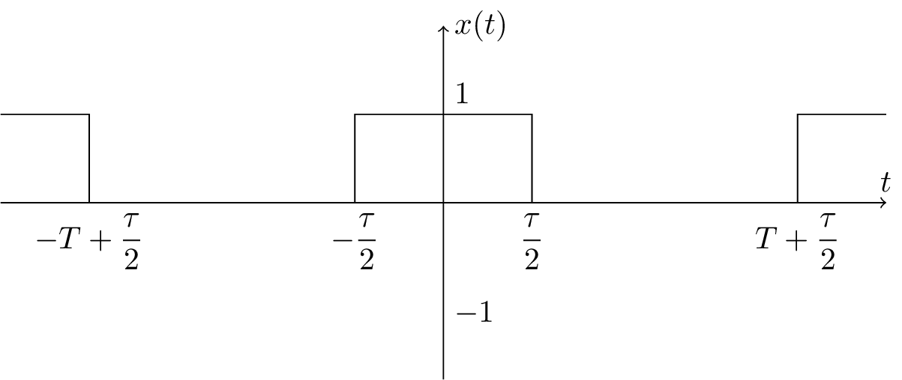
</figure>

Si vuole descrivere l’espansione di Fourier della derivata di questo segnale. Si esprime come la differenza tra due gradini: $$\begin{gathered}
    x(t)=\displaystyle\sum_{k=-\infty}^{+\infty}u\left(t-kT+\frac{\tau}{2}\right)-u\left(t-kT-\frac{\tau}{2}\right)\\
    \displaystyle\frac{\mathrm{d}x(t)}{\mathrm{d}t}=\sum_{k=-\infty}^{+\infty}\delta\left(t-kT+\frac{\tau}{2}\right)-\delta\left(t-kT-\frac{\tau}{2}\right)
\end{gathered}$$ Poiché per definizione la derivata di un gradino è l’impulso di Dirac. La derivata corrisponde ad una serie di impulsi nei punti dove l’onda quadra presenta delle discontinuità.

<figure>
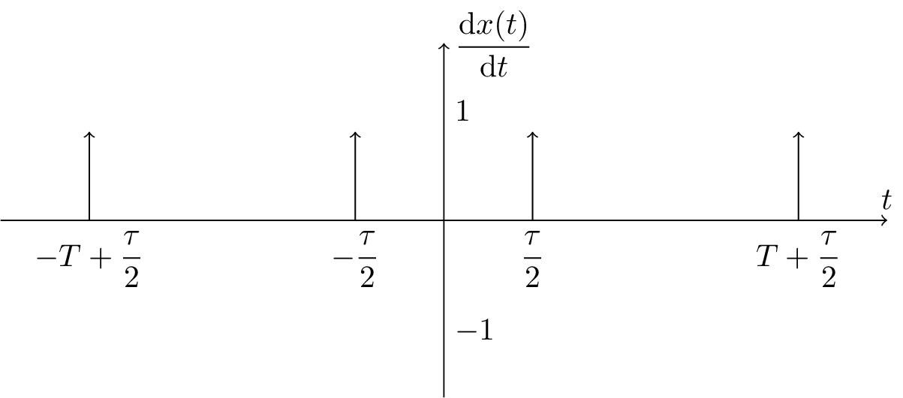
</figure>

I coefficienti di Fourier corrispondenti alla derivata di $x$ risultano essere: $$\begin{gathered}
    d_k=c_k\displaystyle\frac{2i\pi k}{T}=\frac{\tau}{T}\frac{2i\pi k}{T}\mathrm{sinc}\left({\frac{k\tau}{T}}\right)=\frac{\tau}{T}\frac{2i\pi k}{T}\frac{\sin(k\pi \tau/T)}{k\pi \tau/T}\\
    d_k=\displaystyle\frac{2i}{T}\sin\left(\frac{k\pi\tau}{T}\right)
\end{gathered}$$

Per un’onda quadra avente periodo $T$ pari al doppio della base delle finestre $\tau$: $T=2\tau$, i suoi coefficienti di Fourier risultano essere: $$d_k=\displaystyle\frac{i}{\tau}\sin\left(\frac{k\pi}{2}\right)$$ Poiché $k\in\mathbb{Z}$, il valore dei coefficienti è o $\pm1$ o assume un valore nullo.

Si calcolano tramite la definizione: $$\begin{gathered}
    d_k=\displaystyle\int_{-\frac{T}{2}}^{\frac{T}{2}}\delta\left(t-kT+\frac{\tau}{2}\right)-\delta\left(t-kT-\frac{\tau}{2}\right)\mathrm{d}t=
    \int_{-\frac{T}{2}}^{\frac{T}{2}}\delta\left(t+\frac{\tau}{2}\right)-\delta\left(t-\frac{\tau}{2}\right)\mathrm{d}t\\
\end{gathered}$$ Poiché all’interno dell’intervallo di integrazione cade un singolo impulso

Si considera una sequenza di impulsi, ripetuti periodicamente con periodo $T$. Questo segnale si indica come pettine, rastrelliera o treno campionatore: $$x(t)=\pi(t)=\displaystyle\sum_{k=-\infty}^{+\infty}\delta(t-kT)$$ Permette di passare da un segnale analogico ad un segnale digitale, estraendo campioni ad intervalli regolari dal segnale in tempo continuo.

<figure>
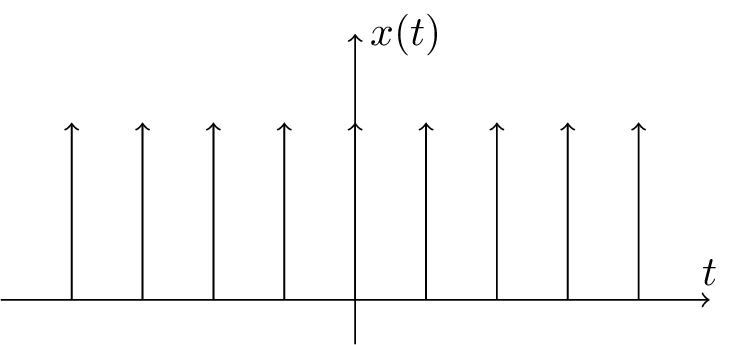
</figure>

Si calcolano i coefficienti dell’espansione di Fourier del segnale pettine. Si considera l’unico impulso che cade all’interno dell’intervallo di integrazione, centrato in $t=0$, per la proprietà di campionamento della delta e per l’area della delta si ottiene: $$\begin{gathered}
    c_k=\displaystyle\frac{1}{T}\int_{-\frac{T}{2}}^{\frac{T}{2}}\delta(t)e^{-i\frac{2\pi kt}{T}}\mathrm{d}t=\frac{1}{T}\cancelto{1}{e^{-i{\frac{2\pi k0}{T}}}}\cancelto{1}{\int_{-\frac{T}{2}}^{\frac{T}{2}}\delta(t)\mathrm{d}t}\\
    c_k=\displaystyle\frac{1}{T}
\end{gathered}$$

Tutti i coefficienti della serie di Fourier della rastrelliera assumono lo stesso valore costante $1/T$.

## Segnali Reali

Se un segnale è reale, i suoi coefficienti possono essere espressi in un altro modo. Considerando la forma integrale dei coefficienti, e la formula di Eulero per gli esponenziali $$\begin{gathered}
    c_k=\displaystyle\frac{1}{T}\int_{-\frac{T}{2}}^{\frac{T}{2}}x(t)\left[\cos\left(\frac{2\pi kt}{T}\right)-i\sin\left(\frac{2\pi kt}{T}\right)\right]\mathrm{d}t\\
    c_k=\displaystyle\frac{1}{T}\int_{-\frac{T}{2}}^{\frac{T}{2}}x(t)\cos\left(\frac{2\pi kt}{T}\right)\mathrm{d}t-\frac{i}{T}\int_{-\frac{T}{2}}^{\frac{T}{2}}x(t)\sin\left(\frac{2\pi kt}{T}\right)\mathrm{d}t
\end{gathered}$$ Si definiscono due coefficienti $a_k$ e $b_k$ pari alla parte reale ed immaginaria del coefficienti $c_k$: $$\begin{gathered}
    c_k=a_k+ib_k\\
    a_k=\displaystyle\frac{1}{T}\int_{-\frac{T}{2}}^{\frac{T}{2}}x(t)\cos\left(\frac{2\pi kt}{T}\right)\mathrm{d}t\\
    b_k=\displaystyle-\frac{1}{T}\int_{-\frac{T}{2}}^{\frac{T}{2}}x(t)\sin\left(\frac{2\pi kt}{T}\right)\mathrm{d}t
\end{gathered}$$ I coefficienti $a_k$ sono pari, mentre i coefficienti $b_k$ sono dispari: $$\begin{gathered}
    a_k=a_{-k}\\
    b_k=-b_{-k}\\
    c_{-k}=a_{-k}+ib_{-k}=a_{k}-ib_k=c_k^*
\end{gathered}$$ In forma polare si può esprimere come: $$\begin{gathered}
    c_k=\rho_k e^{i\phi_k}\\
    c_{-k}=\rho_{-k}e^{i\phi{-k}}=\rho_k e^{-i\phi}=c_k^*
\end{gathered}$$

Un qualsiasi segnale reale può essere espresso come: $$\begin{gathered}
    x(t)=\displaystyle\sum_{k=-\infty}^{-1}c_ke^{i\frac{2\pi kt}{T}}+c_0+\sum_{k=1}^{+\infty}c_ke^{i\frac{2\pi kt}{T}}=\sum_{k=1}^{+\infty}c_{-k}e^{-i\frac{2\pi kt}{T}}+c_0+\sum_{k=1}^{+\infty}c_ke^{i\frac{2\pi kt}{T}}\\
    \displaystyle\left(\sum_{k=1}^{+\infty}c_k^*e^{-i\frac{2\pi kt}{T}}+c_ke^{i\frac{2\pi kt}{T}}\right)+c_0=\left(\sum_{k=1}^{+\infty}\rho_k e^{-i\phi}e^{-i\frac{2\pi kt}{T}}+\rho_ke^{i\phi}e^{i\frac{2\pi kt}{T}}\right)+c_0\\
    x(t)=\displaystyle\sum_{k=1}^{+\infty}\rho_k \left(e^{i\left(\frac{2\pi kt}{T}+\phi_k\right)}+e^{-i\left(\frac{2\pi kt}{T}+\phi_k\right)}\right)+c_0=\displaystyle c_0+\sum_{k=1}^{+\infty}2\rho_k\cos\left(\frac{2\pi kt}{T}+\phi_k\right)
\end{gathered}$$ Questo rappresentazione è possibile solo per segnali $x$ reali. Considerando le formule del coseno della somma si può esprimere come: $$\begin{gathered}
    \displaystyle c_0+\sum_{k=1}^{+\infty}2\rho_k\cos\left(\frac{2\pi kt}{T}+\phi_k\right)=
    c_0+\sum_{k=1}^{+\infty}2\rho_k\cos(\phi_k)\cos\left(\frac{2\pi kt}{T}\right)-2\rho_k\sin(\phi_k)\sin\left(\frac{2\pi kt}{T}\right)\\
    x(t)=\displaystyle c_0+2\sum_{k=1}^{+\infty}a_k\cos\left(\frac{2\pi kt}{T}\right)-b_k\sin\left(\frac{2\pi kt}{T}\right)\\
    a_k=\rho_k\cos(\phi_k)\\
    b_k=\rho_k\sin(\phi_k)
\end{gathered}$$ Se il segnale $x$ è reale e pari, allora i coefficienti $b_k$ sono nulli, se il segnale è immaginario e dispari, i coefficienti $a_k$ sono nulli. Per cui i coefficienti $c_k$ di Fourier di un segnale reale e pari sono pari e reali, i coefficienti $c_k$ di Fourier di un segnale immaginario e dispari sono immaginari e dispari.

# Trasformata di Fourier

Quando si trattano segnali non periodici, non si possono esprimere mediante una serie di Fourier, quindi si analizzano mediante la trasformata di Fourier. La trasformata di Fourier si può applicare solamente a segnali impulsivi. Segnali impulsivi sono definiti dalla seguente espressione: $$\displaystyle\int_{-\infty}^{+\infty}|x(t)|\mathrm{d}t\neq\infty$$ Come la serie di Fourier la trasformata di Fourier è uno strumento per analizzare i segnali. Questi segnali possono essere nel dominio del tempo $x(t)$ o dominio della frequenza $X(f)$. La trasformata è quindi un funzionale che dipende dalla variabile della frequenza, non più dalla variabile del tempo del segnale originale $x(t)$. La trasformata $X(f)$ è univoca per ogni segnale $x(t)$ nel tempo. Questa trasformata associa univocamente un segnale nel dominio del tempo ad un segnale nel dominio della frequenza: $$\mathscr{F}\{x(t)\}=X(f)$$

Ricordando la serie di un segnale periodico $x$ di periodo $T$: $$\begin{gathered}
    x(t)=\displaystyle\sum_{k=-\infty}^{+\infty}c_ke^{i\frac{2\pi kt}{T}}
\end{gathered}$$ Nello spazio vettoriale dei segnali periodico è stato definito il prodotto scalare: $$\langle x_1(t),\;x_2(t)\rangle=\displaystyle\frac{1}{T}\int_{-\frac{T}{2}}^{\frac{T}{2}}x_1(t)x_2^*(t)\mathrm{d}t$$ Nello spazio vettoriale di Fourier, la base ortonormale è formata da tutte le armoniche: $$\begin{gathered}
    \langle e^{i\frac{2\pi kt}{T}},\;e^{i\frac{2\pi nt}{T}}\rangle=\begin{cases}
        0&\forall k\neq n\\
        1&\forall k=n
    \end{cases}
\end{gathered}$$ Da queste armoniche si può ricavare il coefficiente di ordine $k$ di un qualsiasi segnale periodico di periodo $T$: $$c_k=\displaystyle\frac{1}{T}\int_{-\frac{T}{2}}^{\frac{T}{2}}x(t)e^{-i\frac{2\pi kt}{T}}\mathrm{d}t$$

Si considerano per semplicità tutti i segnali trattati come impulsivi. Per cui non sarà necessario dimostrare l’esistenza della trasformata di un certo segnale $x(t)$ non necessariamente periodico. Si vuole rappresentare questo segnale in modo equivalente alla serie di Fourier. Per rappresentare questo segnale sono necessarie un numero infinito non numerabile di armoniche, per cui si considera un integrale, dove il coefficiente dipende dalla variabile dell’integrale. E l’armonica non dipende dal parametro $k$, ma dalla stessa variabile dell’integrale: $$x(t)=\displaystyle\int_{-\infty}^{+\infty}X(f)e^{2i\pi tf}\mathrm{d}f$$ Il segnale si esprime quindi tramite un insieme infinito non numerabile di armoniche, sempre uguali per ogni segnale. Per cui la differenza tra due segnali, come per l’espansione di Fourier, è il peso di ogni armonica $X(f)$. Bisogna comunque dimostrare che queste armoniche siano una base ortonormale in questo spazio di Fourier. Si introduce il prodotto scalare nello spazio dei segnali impulsivi: $$\langle x_1(t),\;x_2(t)\rangle=\displaystyle\int_{-\infty}^{+\infty}x_1(t)x_2^*(t)\mathrm{d}t$$ Questo prodotto scalare corrisponde alla correlazione tra due segnali a ritardo nullo.

Per determinare se due armoniche di frequenze diverse $f_1$ e $f_2$ sono una base si considera il loro prodotto scalare: $$\begin{gathered}
    \langle e^{2i\pi f_1t},\;e^{2i\pi f_2t}\rangle=\displaystyle\lim_{\Delta t\to\infty}\int_{-\frac{\Delta t}{2}}^{+\frac{\Delta t}{2}}e^{2i\pi f_1t}e^{-2i\pi f_2t}\mathrm{d}t\\
    \displaystyle\lim_{\Delta t\to\infty}\left[\frac{e^{2i\pi(f_1-f_2)t}}{2i\pi(f_1-f_2)}\right]^{\frac{\Delta t}{2}}_{-\frac{\Delta t}{2}}=\lim_{\Delta t\to\infty}
    \Delta t\frac{\sin(\pi(f_1-f_2)\Delta t)}{\pi(f_1-f_2)\Delta t}\\
    \displaystyle\lim_{\Delta t\to\infty}\Delta t\,\mathrm{sinc}(\Delta t(f_1-f_2))
\end{gathered}$$ Per $\Delta t\to\infty$, la sinc diventa un impulso tempo continuo: $$\langle e^{2i\pi f_1t},\;e^{2i\pi f_2t}\rangle=\delta(f_1-f_2)$$ Per cui tutte le armoniche di frequenza diversa hanno prodotto scalare nullo, e solo due armoniche di frequenza uguale hanno prodotto scalare di valore unitario. I coefficienti trasformata di Fourier $X(f)$ si ottengono quindi analogamente ai coefficienti $c_k$: $$\begin{gathered}
    X(f)=\langle x(t),\;e^{2i\pi ft}\rangle=\displaystyle\int_{-\infty}^{+\infty}x(t)e^{-2i\pi ft}\mathrm{d}t
\end{gathered}$$ Nello spazio di Fourier si può poi analizzare la banda di un segnale, ovvero il contenuto informativo rispetto alla frequenza. Quest’informazione è necessaria per poter trasmettere un determinato segnale. I due domini del tempo e della frequenza sono due domini separati. Il nucleo o kernel della trasformata di Fourier corrisponde all’armonica, ovvero il componente esponenziale complesso nell’integrale.

## Proprietà della Trasformata

### Proprietà di Linearità

La trasformata di Fourier è un operatore lineare. Dati due segnali $x(t)$ e $y(t)$: $$\begin{gathered}
    x(t)\to X(f)\\
    y(t)\to Y(f)\\
    ax(t)+by(t)=\displaystyle\int_{-\infty}^{+\infty}(ax(t)+by(t))e^{-2i\pi ft}\mathrm{d}t\\
    a\int_{-\infty}^{+\infty}x(t)e^{-2i\pi ft}\mathrm{d}t+b\int_{-\infty}^{+\infty}y(t)e^{-2i\pi ft}\mathrm{d}t= 
    aX(f)+bY(f)\\
    ax(t)+by(t)\to aX(f)+bY(f)\tag{\stepcounter{equation}\theequation}
\end{gathered}$$

### Proprietà di Dualità

La trasformata di Fourier accoppia due segnali nei due domini. Se la trasformata di un segnale $x$ nel tempo è una funzione $y$ nella frequenza, la trasformata di un segnale $y$ nel tempo è un segnale $x$ nella frequenza, di variabile opposta $-f$.

Per dimostrare questa proprietà si considerano la formula di trasformazione: $$X(f)=\displaystyle\int_{-\infty}^{+\infty}x(t)e^{-2i\pi ft}\mathrm{d}t$$ E la formula di antitrasformazione: $$x(t)=\displaystyle\int_{-\infty}^{+\infty}X(f)e^{2i\pi ft}\mathrm{d}f$$

Data la trasformata di un segnale $x(t)$ $X(f)$, per riportarla nel dominio del tempo, si considera l’integrale di trasformazione di $X(t)$: $$\begin{gathered}
    \displaystyle\int_{-\infty}^{+\infty}X(t)e^{-2i\pi ft}\mathrm{d}t
\end{gathered}$$ Si considera la sostituzione $f=t'$ e $t=f'$, l’integrale diventa l’integrale di antitrasformazione: $$\displaystyle\int_{-\infty}^{+\infty}X(f')e^{-2i\pi f't'}\mathrm{d}f'=x(-t')$$ Allora: $$\begin{gathered}
    \mathscr{F}\{x(t)\}= X(f)\\
    \mathscr{F}\{X(t)\}=x(-f)
\end{gathered}$$

### Proprietà di Scala

Si considera la trasformata di un segnale: $$\begin{gathered}
    x(at)\to\displaystyle\int_{-\infty}^{+\infty}x(at)e^{-2i\pi ft}\mathrm{d}t\\
    t'=at\\
    \displaystyle\frac{1}{a}\int_{-\infty}^{+\infty}x(t')e^{-2i\pi \frac{f}{a}t'}\mathrm{d}t'=\frac{1}{a}X\left(\frac{f}{a}\right)
\end{gathered}$$ Se $a=-1$, la trasformata corrisponde a: $$\begin{gathered}
    \displaystyle\int_{-\infty}^{+\infty}x(-t)e^{-2i\pi ft}\mathrm{d}t\\
    t'=-t\\
    \displaystyle\int_{-\infty}^{+\infty}x(t')e^{-2i\pi(- f)t'}\mathrm{d}t'=X(-f)
\end{gathered}$$ Per cui quando $a<0$: $$\begin{gathered}
    x(at)\to\displaystyle\int_{-\infty}^{+\infty}x(t)e^{-2i\pi ft}\mathrm{d}t\\
    t'=at\\
    \displaystyle\frac{1}{|a|}\int_{-\infty}^{+\infty}x(t')e^{-2i\pi \left(-\frac{f}{a}\right)t'}\mathrm{d}t'=\frac{1}{|a|}X\left(-\frac{f}{a}\right)
\end{gathered}$$ Per cui in generale dato un segnale scalato di un fattore $a$, la sua trasformata è: $$\begin{gathered}
    \mathscr{F}\{x(at)\}=\displaystyle\frac{1}{|a|}X\left(\frac{f}{a}\right)
\end{gathered}$$

### Traslazione nel Tempo

Data la trasformata di Fourier di un segnale tempo continuo, è nota anche la trasformata del segnale ritardato o anticipato: $$\begin{gathered}
    \mathscr{F}\{x(t)\}=X(f)\\
    \mathscr{F}\{x(t-t_0)\}=\displaystyle\int_{-\infty}^{+\infty}x(t-t_0)e^{-2i\pi ft}\mathrm{d}t\\
    \tau=t-t_0\\
    \displaystyle\int_{-\infty}^{+\infty}x(\tau)e^{-2i\pi f(\tau+t_0)}\mathrm{d}\tau=e^{-2i\pi ft_0}\int_{-\infty}^{+\infty}x(\tau)e^{-2i\pi f\tau}\mathrm{d}\tau=e^{-2i\pi ft_0}X(f)\\
    \mathscr{F}\{x(t-t_0)\}=X(f)e^{-2i\pi ft_0}\tag{\stepcounter{equation}\theequation}
\end{gathered}$$

### Traslazione in Frequenza

Questa proprietà si indica anche come proprietà di modulazione. Si considera un segnale moltiplicato per un armonica di frequenza costante $f_0$: $$\begin{gathered}
    \mathscr{F}\left\{e^{2i\pi f_0t}x(t)\right\}=\displaystyle\int_{-\infty}^{+\infty}x(t)e^{-2i\pi(f-f_0)t}\mathrm{d}t=X(f-f_0)
\end{gathered}$$

### Proprietà della Modulazione

Si considera una finestra di base $T$ moltiplicata per un coseno di frequenza costante $f_0$, ovvero modulata di una frequenza $f_0$: $$\begin{gathered}
    x(t)=\mathrm{rect}\displaystyle\left(\frac{t}{T}\right)\cos(2\pi f_0t)\\
    \mathscr{F}\{x(t)\}=\frac{T}{2}\mathrm{sinc}((f-f_0)T)+\frac{T}{2}\mathrm{sinc}\left((f+f_0)T\right)
\end{gathered}$$ La sua trasformata corrisponde a due seni cardinali centrati in $\pm f_0$. Quest’operazione si chiama modulazione di ampiezza (AM), utilizzata nella codifica in banda passante . Il segnale trasmesso corrisponde ad un coseno di ampiezza pari al segnale originario in quell’istante. $$\begin{gathered}
    \mathscr{F}\{x(t)\cos(2\pi f_0t)\}=\displaystyle\frac{1}{2}\int_{-\infty}^{+\infty}x(t)\left[e^{2i\pi f_0t}+e^{-2i\pi f_0t}\right]e^{-2i\pi ft}\mathrm{d}t\\
    \frac{1}{2}\displaystyle\int_{-\infty}^{+\infty}x(t)e^{-2i\pi(f-f_0)t}\mathrm{d}t+\frac{1}{2}\int_{-\infty}^{+\infty}x(t)e^{-2i\pi (f+f_0)t}\mathrm{d}t=\frac{X(f-f_0)}{2}+\frac{X(f+f_0)}{2}
\end{gathered}$$

### Teorema della Convoluzione

Data la convoluzione tra due segnali $x$ e $y$: $$\begin{gathered}
    x(t)*y(t)=\displaystyle\int_{-\infty}^{+\infty}x(t-\tau)y(\tau)\mathrm{d}\tau
\end{gathered}$$ Si esprime il segnale $y$ antitrasformata: $$\begin{gathered}
    y(\tau)=\displaystyle\int_{-\infty}^{+\infty}Y(f)e^{2i\pi f\tau}\mathrm{d}f\\
    x(t)*y(t)=\displaystyle\int_{-\infty}^{+\infty}x(t-\tau)\left(\int_{-\infty}^{+\infty}Y(f)e^{2i\pi f\tau}\mathrm{d}f\right)\mathrm{d}\tau
\end{gathered}$$ Si inverte l’ordine di integrazione, possibile poiché i due integrali sono indipendenti tra di loro, e si applica la sostituzione $t'=t-\tau$: $$\begin{gathered}
    x(t)*y(t)=\displaystyle\int_{-\infty}^{+\infty}Y(f)\left(\int_{-\infty}^{+\infty}x(t-\tau)e^{2i\pi f\tau}\mathrm{d}\tau\right)\mathrm{d}f\\
    t'=t-\tau\\
    \int_{-\infty}^{+\infty}Y(f)e^{2i\pi ft}\left(\int_{-\infty}^{+\infty}x(t')e^{-2i\pi ft'}\mathrm{d}t'\right)\mathrm{d}f\\
    x(t)*y(t)=\displaystyle\int_{-\infty}^{+\infty}Y(f)X(f)e^{2i\pi ft}\mathrm{d}f\\
    \mathscr{F}\{x(t)*y(t)\}=X(f)\cdot Y(f)\tag{\stepcounter{equation}\theequation}
\end{gathered}$$

### Teorema di Parseval

Si considera una convoluzione $z$, ed il suo valore nell’origine: $$\begin{gathered}
    z(t)=x(t)*y(t)=\displaystyle\int_{-\infty}^{+\infty}x(t-\tau)y(\tau)\mathrm{d}\tau=\int_{-\infty}^{+\infty}X(f)Y(f)e^{2i\pi ft}\mathrm{d}f\\
    z(t)=\displaystyle\int_{-\infty}^{+\infty}x(-\tau)y(\tau)\mathrm{d}\tau=\int_{-\infty}^{+\infty}X(f)Y(f)\mathrm{d}f 
\end{gathered}$$ Si considera ora la convoluzione tra $x(t)$ e $y^*(-t)$, sempre calcolata nell’origine $$\begin{gathered}
    z(t)=\displaystyle\int_{-\infty}^{+\infty}x(\tau)y^*(-(t-\tau))\mathrm{d}\tau=\int_{-\infty}^{+\infty}X(f)Y^*(f)e^{2i\pi ft}\mathrm{d}f\\
    z(0)=\displaystyle\int_{-\infty}^{+\infty}x(\tau)y^*(\tau)\mathrm{d}\tau=\int_{-\infty}^{+\infty}X(f)Y^*(f)\mathrm{d}f
\end{gathered}$$ Se si considera $y=x$, allora la convoluzione diventa un’auto-convoluzione. Calcolata nell’origine corrisponde all’energia di un segnale: $$\begin{gathered}
    z(0)=\displaystyle\int_{-\infty}^{+\infty}x(\tau)x^*(\tau)\mathrm{d}\tau=\int_{-\infty}^{+\infty}X(f)X^*(f)\mathrm{d}f\\
    E_x=\displaystyle\int_{-\infty}^{+\infty}|x(\tau)|^2\mathrm{d}\tau=\int_{-\infty}^{+\infty}|X(f)|^2\mathrm{d}f
\end{gathered}$$ Per cui l’energia di un segnale si calcola esattamente allo stesso modo sia nel dominio del tempo che nel dominio della frequenza.

### Proprietà della Derivazione

La trasformata, nel trasportare una funzione da un dominio all’altro, può offrire una serie di semplificazioni ad operazioni come integrali e derivate nei due domini. Si vuole determinare la trasformata della derivata di un noto segnale $x$, di trasformata $X$.

Si considera il segnale derivata $x_1$: $$\begin{gathered}
    x_1(t)=\displaystyle\frac{\mathrm{d}x(t)}{\mathrm{d}t}\\
    X_1(f)=\displaystyle\int_{-\infty}^{+\infty}\frac{\mathrm{d}x(t)}{\mathrm{d}t}e^{-2i\pi ft}\mathrm{d}t
\end{gathered}$$ Si considera l’antitrasformata del segnale originale $x$ e si derivano entrambi i lati rispetto al tempo:

$$\begin{gathered}
    x(t)=\displaystyle\int_{-\infty}^{+\infty}X(f)e^{2i\pi ft}\mathrm{d}f\\
    \displaystyle\frac{\mathrm{d}x(t)}{\mathrm{d}t}=\int_{-\infty}^{+\infty}2i\pi fX(f)e^{2i\pi ft}\mathrm{d}f=x_1(t)
\end{gathered}$$ Quest’integrale rappresenta l’antitrasformata del segnale derivata $x_1$, per cui la sua trasformata può essere espressa come: $$\begin{gathered}
    \displaystyle\frac{\mathrm{d}x(t)}{\mathrm{d}t}\to2i\pi fX(f)
\end{gathered}$$

### Proprietà Duale della Derivazione

Dato un segnale $x(t)$ e la sua trasformata $X(f)$, si dimostra che vale la proprietà duale della derivazione: $$\begin{gathered}
    x_1(t)=2i\pi tx(t)\\
    X_1(f)=\displaystyle\int_{-\infty}^{+\infty}2i\pi tx(t)e^{-2i\pi ft}\mathrm{d}t\\
    X(f)=\displaystyle\int_{-\infty}^{+\infty}x(t)e^{-2i\pi ft}\mathrm{d}t\\
    \displaystyle\frac{\mathrm{d}X(f)}{\mathrm{d}f}=\int_{-\infty}^{+\infty}-2i\pi t x(t)e^{2i\pi ft}\mathrm{d}t=-\int_{-\infty}^{+\infty}x_1(t)e^{2i\pi ft}\mathrm{d}t=-X_1(f)\\
    -2i\pi tx(t)\to\displaystyle\frac{\mathrm{d}X(f)}{\mathrm{d}f}\tag{\stepcounter{equation}\theequation}
\end{gathered}$$

### Proprietà dell’Integrazione

Dato un segnale $x$ di trasformata $X$, si considera il suo integrale fino ad un valore $t$, ciò equivale ad attuare una convoluzione con il gradino $u(t)$: $$\begin{gathered}
    x_1(t)=\displaystyle\int_{-\infty}^{t}x(\tau)\mathrm{d}\tau=\int_{-\infty}^{*\infty}u(t-\tau)x(\tau)\mathrm{d}\tau=x(t)*u(t)
\end{gathered}$$ Nel domino della frequenza la trasformata del segnale $x_1$ è quindi il prodotto tra la trasformata di $x$ e del segnale gradino: $$\begin{gathered}
    X_1(f)=X(f)\left[\displaystyle\frac{1}{2}\delta(f)+\frac{1}{2i\pi f}\right]=\frac{1}{2}X(0)\delta(f)+\frac{X(f)}{2i\pi f}\\
    \displaystyle\int_{-\infty}^tx(\tau)d\tau\to\frac{1}{2}X(0)\delta(f)+\frac{X(f)}{2i\pi gf}\tag{\stepcounter{equation}\theequation}
\end{gathered}$$

### Proprietà del Coniugato

Dato un segnale $x$ di trasformata $X$, si considera il suo coniugato $x*$, e si vuole calcolare la sua trasformata: $$\begin{gathered}
    x_1(t)=x^*(t)\\
    X_1(f)=\displaystyle\int_{-\infty}^{+\infty}x^*(t)e^{2i\pi ft}\mathrm{d}t=\left(\int_{-\infty}^{+\infty}x(t)e^{-2i\pi ft}\mathrm{d}t\right)^*=X^*(-f)
\end{gathered}$$ La coniugazione ha quindi una simmetria hermitiana, nella trasformata di Fourier: $$x^*(t)\to X^*(-f)$$

### Proprietà della Correlazione

Dato una una correlazione $z$ tra due segnali $x$ e $y$, si può esprimere come una convoluzione. Tramite il teorema della convoluzione e del coniugato, la sua trasformata può essere espressa come il prodotto tra due trasformate: $$\begin{gathered}
    z(t)=x(t)\otimes y(t)=\displaystyle\int_{-\infty}^{+\infty}x(t+\tau)y^*(\tau)\mathrm{d}\tau=x(t)*y^*(-t)
\end{gathered}$$ $$Z(f)=X(f)\cdot Y^*(f)$$

## Trasformate Notevoli

Dato un segnale finestra: $$\begin{gathered}
    x(t)=\mathrm{rect}\displaystyle\left(\frac{t}{\tau}\right)\\
    X(f)=\displaystyle\int_{-\infty}^{+\infty}\mathrm{rect}\left(\frac{t}{\tau}\right)e^{-2i\pi ft}\mathrm{d}t=\left[\frac{e^{-2i\pi ft}}{2i\pi ft}\right]^{+\frac{\tau}{2}}_{-\frac{\tau}{2}}\\
    \displaystyle\frac{e^{-i\pi f\tau}-e^{-i\pi f\tau}}{-2i\pi f}=\frac{\sin(\pi f\tau)}{\pi f}=\tau\,\mathrm{sinc}(f\tau)
\end{gathered}$$ Quindi la trasformata di un segnale finestra di base $\tau$ è un seno cardinale moltiplicato per la base, di argomento moltiplicato per la base: $$\begin{gathered}
    x(t)=\mathrm{rect}\displaystyle\left(\frac{t}{\tau}\right)\rightarrow X(f)=\tau\,\mathrm{sinc}(f\tau)
\end{gathered}$$ La trasformata in $f=0$, corrisponde al valore medio del segnale finestra: $$X(0)=\displaystyle\int_{-\frac{\tau}{2}}^{\frac{\tau}{2}}\mathrm{d}t=\tau$$ Questa proprietà si chiama teorema del valor medio. Ovvero per ogni segnale $x$, la trasformata per la frequenza nulla $f=0$ corrisponde al valore medio del segnale.

Dato un segnale impulso di Dirac: $$\begin{gathered}
    x(t)=\delta(t)\\
    X(f)=\displaystyle\int_{-\infty}^{+\infty}\delta(t)e^{-2i\pi ft}\mathrm{d}t=1
\end{gathered}$$ Per la proprietà di campionamento dell’impulso e per l’area dell’impulso, si ottiene che la trasformata di Fourier dell’impulso è sempre costante è unitario per ogni frequenza. $$\delta(t)\to1$$

Tanto più è limitato nel tempo, tanto più è largo il contenuto spettrale o la banda del segnale. Dove lo spettro di un segnale indica la sua trasformata di Fourier $\mathscr{F}$.

Dato un segnale costante: $$\begin{gathered}
    x(t)=1\\
    X(f)=\displaystyle\int_{-\infty}^{+\infty}e^{-2i\pi ft}\mathrm{d}t=\delta (f)
\end{gathered}$$ Analogamente al prodotto scalare tra due armoniche. $$1\to\delta(f)$$ Tanto più è esteso un segnale nel dominio del tempo, tanto più è limitato nel domino della frequenza.

Dato il segnale impulso traslato si calcola la sua trasformata: $$\begin{gathered}
    x(t)=\delta (t-t_0)\\
    X(f)=\displaystyle\int_{-\infty}^{+\infty}\delta(t-t_0)e^{-2i\pi ft}\mathrm{d}t=e^{-2i\pi ft_0}
\end{gathered}$$ Dato il segnale armonica di frequenza $f_0$ si calcola la sua trasformata: $$\begin{gathered}
    x(t)=e^{2i\pi f_0t}\\
    X(f)=\displaystyle\int_{-\infty}^{+\infty}e^{2i\pi(f_0-f)t}\mathrm{d}t=\delta(f_0-f)
\end{gathered}$$ Analogamente al prodotto scalare tra due armoniche di frequenza diversa.

Dato il segnale treno campionatore, o segnale rastrelliera, si calcola la sua trasformata: $$\begin{gathered}
    \pi(t)=\displaystyle\sum_{k=-\infty}^{+\infty}\delta(t-kT)\\
    c_k=\displaystyle\frac{1}{k}\\
    \pi(t)=\displaystyle\sum_{k=-\infty}^{+\infty}\frac{1}{T}e^{2i\pi kt/T}\\
    \Pi(f)=\displaystyle\sum_{k=-\infty}^{+\infty}\frac{1}{T}\delta\left(f-\frac{k}{T}\right)\tag{\stepcounter{equation}\theequation}
\end{gathered}$$ Questo è uno dei pochi segnali oltre alla gaussiana che si auto-trasforma.

Dato il segnale coseno: $$\begin{gathered}
    x(t)=\cos(2\pi f_0t)\\
    X(f)=\displaystyle\frac{1}{2}\int_{-\infty}^{+\infty}\left(e^{2i\pi f_0t}+e^{-2i\pi f_0t}\right)e^{-2i\pi ft}\mathrm{d}t=\frac{\delta(f-f_0)+\delta(f+f_0)}{2}\\
    \cos(2\pi f_0t)\rightarrow X(f)=\displaystyle\frac{\delta(f-f_0)+\delta(f+f_0)}{2}\tag{\stepcounter{equation}\theequation}
\end{gathered}$$ Nella notazione di Fourier un coseno viene rappresentato come due frequenze $\pm f_0$. Analogamente per il seno: $$\begin{gathered}
    \sin(2\pi f_0t)\to\displaystyle\int_{-\infty}^{+\infty}\frac{1}{2i}(e^{2i\pi f_0t}-e^{-2i\pi f_0t})e^{-2i\pi ft}\mathrm{d}t=\frac{\delta (f-f_0)-\delta(f+f_0)}{2i}
\end{gathered}$$ Dato un coseno di ampiezza $A$ con un anticipo di fase $\phi$: $$\begin{gathered}
    x(t)=A\cos(2\pi f_0t+\phi)\\
    X(f)=\displaystyle\frac{A}{2}\int_{-\infty}^{+\infty}\left(e^{2i\pi f_0t}e^{i\phi}+e^{-2i\pi f_0t}e^{-i\phi}\right)e^{-2i\pi ft}\mathrm{d}t\\
    A\cos(2\pi f_0t+\phi)\to X(f)=\frac{A\delta(f-f_0)e^{i\phi}+A\delta(f+f_0)e^{-i\phi}}{2}\tag{\stepcounter{equation}\theequation}
\end{gathered}$$

Si considera la trasformata del segnale gaussiano: $$\begin{gathered}
    x(t)=e^{-\alpha t^2}\\
    X(f)=\displaystyle\int_{-\infty}^{+\infty}e^{-\alpha t^2}e^{-2i\pi ft}\mathrm{d}t=\int_{-\infty}^{+\infty}e^{-\alpha\left(\frac{2i\pi ft}{\alpha} + t^2\right)}\mathrm{d}t\\
    \displaystyle\int_{-\infty}^{+\infty}e^{-\alpha\left[t^2+\frac{2i\pi ft}{\alpha}+\left(\frac{i\pi f}{\alpha}\right)^2-+\left(\frac{i\pi f}{\alpha}\right)^2\right]}\mathrm{d}t\\
    e^{-\frac{\pi^2f^2}{\alpha}}\displaystyle\int_{-\infty}^{+\infty}e^{-\alpha\left(t+\frac{i\pi f}{\alpha}\right)^2}\mathrm{d}t
\end{gathered}$$ Si applica la sostituzione $\tau=\sqrt{\alpha}(t+i\pi f/\alpha)$, l’integrale diventa allora: $$\begin{gathered}
    e^{-\frac{\pi^2f^2}{\alpha}}\displaystyle\int_{-\infty}^{+\infty}e^{-\tau^2}\frac{\mathrm{d}\tau}{\sqrt{\alpha}}=e^{-\frac{\pi^2f^2}{\alpha}}\sqrt{\frac{\pi}{\alpha}}\\
    e^{-\alpha t^2}\to \sqrt{\frac{\pi}{\alpha}}e^{-\frac{\pi^2f^2}{\alpha}}\tag{\stepcounter{equation}\theequation}
\end{gathered}$$

In forma normalizzata la gaussiana si esprime direttamente rispetto alla deviazione standard $\sigma$ e alla sua varianza $\sigma^2$: $$\begin{gathered}
    x(t)=e^{-\frac{t^2}{2\sigma^2}}\\
    X(f)=\sqrt{2\pi}\sigma e^{-2\pi^2\sigma^2f^2}
\end{gathered}$$ L’area sottesa dalla gaussiana risulta essere il valor medio, esprimibile tramite il valore della trasformata per $f=0$: $$X(0)=\sqrt{2\pi}\sigma$$ La gaussiana è una delle pochissime funzioni che si auto-trasforma.

Si determina la trasformata dell’esponenziale unilatero: $$\begin{gathered}
    x(t)=e^{-\alpha t}u(t)\\
    X(f)=\displaystyle\int_{-\infty}^{+\infty}e^{-\alpha t}u(t)e^{-2i\pi ft}\mathrm{d}t=\int_0^{+\infty}e^{-(2i\pi f+\alpha)t}\mathrm{d}t\\
    \left[\displaystyle\frac{e^{-(2i\pi f+\alpha)t}}{-(\alpha+2i\pi f)}\right]^{+\infty}_0=0+\frac{1}{\alpha+2i\pi f}\\
    e^{-\alpha t}u(t)\to\frac{1}{\alpha+ 2i\pi f}\tag{\stepcounter{equation}\theequation}
\end{gathered}$$ Il modulo quadro del segnale corrisponde ad una Lorentziana, una funzione simile ad una gaussiana: $$\left|X(f)\right|^2=\frac{1}{\alpha^2+4\pi^2f^2}$$

<figure>
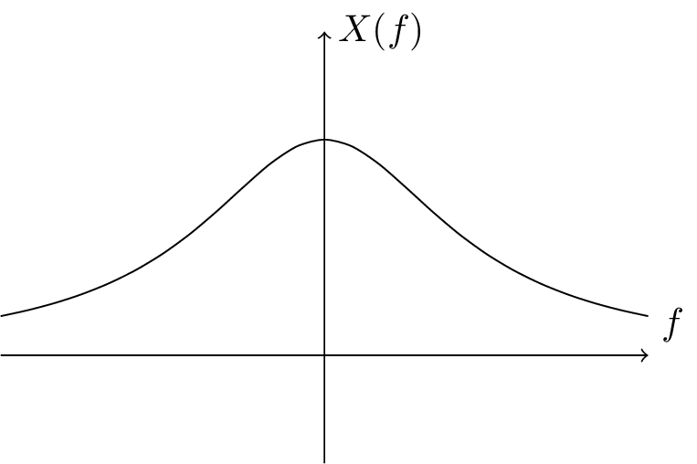
</figure>

Dato il segnale esponenziale del modulo. Si può esprimere il segnale come due esponenziali unilateri:

<figure>
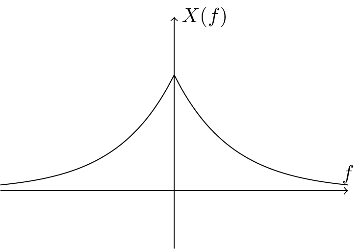
</figure>

$$\begin{gathered}
    x(t)=e^{-\alpha|t|}\\
    x_1(t)=e^{-\alpha t}\\
    x(t)=x_1(t)+x_1(-t)\\
    X(f)=X_1(f)+X_1(-f)=\displaystyle\frac{1}{\alpha+2i\pi f}+\frac{1}{\alpha-2i\pi ft}\\
    e^{-\alpha|t|}\to\frac{2\alpha}{\alpha^2+4\pi^2f^2}\tag{\stepcounter{equation}\theequation}
\end{gathered}$$ Per cui la sua trasformata corrisponde alla Lorentziana.

Dato il segnale Lorentziana, si può calcolare la sua trasformata tramite la proprietà di dualità della trasformata: $$\begin{gathered}
    x(t)=\displaystyle\frac{1}{\alpha+2i\pi t}\\
    x_1(t)=e^{-\alpha t}u(t)\\
    X(f)=x(-f)=e^{\alpha f}u(-f)\\
    \displaystyle\frac{1}{\alpha+2i\pi t}\to e^{\alpha f}u(-f)\tag{\stepcounter{equation}\theequation}
\end{gathered}$$

Dato il segnale gradino, si può esprimere come il limite di un esponenziale unilatero: $$u(t)=\lim_{\alpha\to0}e^{-\alpha t}{u(t)}$$ Poiché non è un segnale impulsivo, questo risultato non rappresenta la trasformata su tutte le frequenze. $$\begin{gathered}
    U(f)=\displaystyle\lim_{\alpha\to0}\frac{1}{\alpha+2i\pi f}=\frac{1}{2i\pi f}
\end{gathered}$$ Razionalizzando l’argomento del limite si osserva come il risultato ottenuto per frequenze nulle perda informazioni sulla trasformata: $$\begin{gathered}
    \displaystyle\lim_{\alpha\to0}\frac{1}{\alpha+2i\pi f}=\lim_{\alpha\to0}\left(\frac{\alpha}{\alpha^2+4\pi^2f^2}-\frac{2i\pi f}{\alpha^2+4\pi^2f^2}\right)
\end{gathered}$$

Per cui si esprime la trasformata di un gradino come il limite ottenuto sommato ad una costante $A$ moltiplicata per l’impulso, per considerare il valore della trasformata per frequenze nulle: $$\begin{gathered}
    U(f)=\displaystyle\lim_{\alpha\to0}\frac{1}{\alpha+2i\pi f}=\frac{1}{2i\pi f}+\delta(f)A
\end{gathered}$$ Il fattore $A$ si ottiene integrando il fattore che si annulla nel limite: $$\begin{gathered}
    A=\displaystyle\int_{-\infty}^{+\infty}\frac{\alpha}{\alpha^2+4\pi^2f^2}\mathrm{d}f=\int_{-\infty}^{+\infty}\frac{1}{\alpha\left(1+\frac{4\pi^2f^2}{\alpha^2}\right)}\mathrm{d}f\\
    f'=\displaystyle\frac{2\pi f}{\alpha}\\
    \displaystyle\frac{1}{\alpha}\frac{\alpha}{2\pi}\int_{-\infty}^{+\infty}\frac{1}{1+f'^2}\mathrm{d}f'=\left[\frac{1}{2\pi}\arctan f'\right]^{+\infty}_{-\infty}=\frac{1}{2\pi}\left[\frac{\pi}{2}-\left(-\frac{\pi}{2}\right)\right]=\frac{1}{2}
\end{gathered}$$ Per cui la trasformata di un gradino, segnale non impulsivo, risulta essere: $$U(f)=\displaystyle\frac{1}{2}\delta(f)+\frac{1}{2i\pi f}$$

Si considera il segnale segno, e si vuole determinare la sua trasformata: $$\begin{gathered}
    x(t)=\mathrm{sign}(t)=u(t)-u(-t)\\
    X(f)=U(f)-U(-f)=\displaystyle\frac{1}{2}\delta(f)+\frac{1}{2i\pi f}-\frac{1}{2}\delta(f)+\frac{1}{2i\pi f}=\frac{1}{i\pi f}\\
    \mathrm{sign}(t)\to\displaystyle\frac{1}{i\pi f}
\end{gathered}$$

Dato un segnale finestra e la sua trasformata: $$\begin{gathered}
    x(t)=\mathrm{rect}\displaystyle\left(\frac{t}{T}\right)\\
    X(f)=T\mathrm{sinc}\displaystyle\left(Tf\right)
\end{gathered}$$ Si considera ora la derivata del segnale finestra. Questo segnale è costante per tutti valori eccetto per le discontinuità in $\pm T/2$, dove presenta una variazione istantanea. Esprimendola come due gradini, questa variazione viene espressa nella derivata come la differenza tra due impulsi, nota la derivata di un gradino: $$\begin{gathered}
    x(t)=u(t-T/2)-u(t+T/2)\\
    \displaystyle\frac{\mathrm{d}}{\mathrm{d}t}x(t)=\delta(t-T/2)-\delta(t+T/2)
\end{gathered}$$ La trasformata della derivata risulta essere: $$\begin{gathered}
    X(f)=2i\pi fT\,\mathrm{sinc}(Tf)=\displaystyle2i\pi fT\frac{\sin(\pi Tf)}{\pi Tf}\\
    2i\sin(\pi Tf)=2i\frac{e^{i\pi Tf}-e^{-i\pi Tf}}{2i}\\
    X(f)=e^{i\pi Tf}-e^{-i\pi Tf}
\end{gathered}$$

Si considera ora un segnale triangolo di base $T$, e si attua un processo analogo. La sua derivata è quindi la differenza tra due finestre, poiché aumenta costantemente da $-T$ a $0$ e decresce costantemente da $0$ a $T$. $$\begin{gathered}
    x(t)=\mathrm{tri}\displaystyle\left(\frac{t}{T}\right)\\
    \displaystyle\frac{\mathrm{d}}{\mathrm{d}t}x(t)=\frac{1}{T}\mathrm{rect}\left(\frac{t+T/2}{T}\right)-\frac{1}{T}\mathrm{rect}\left(\frac{t-T/2}{T}\right)\\
    X'(f)=2i\pi f\displaystyle\left(\frac{1}{T}T\mathrm{sinc}(Tf)e^{i\pi Tf}-\frac{1}{T}T\mathrm{sinc}(Tf)e^{-i\pi Tf}\right)\\
    2i\,\mathrm{sinc}(Tf)\sin(Tf)=\displaystyle2i\frac{\sin^2(Tf)}{\pi Tf}
\end{gathered}$$

Per ottenere la trasformata del segnale triangolo, si considera la trasformata della sua derivata: $$\begin{gathered}
    X'(f)=2i\pi fX(f)\\
    X(f)=\displaystyle2i\frac{\sin^2(Tf)}{\pi fT}\frac{1}{2i\pi f}=T\,\mathrm{sinc}^2(Tf)
\end{gathered}$$ La derivata nel dominio del tempo corrisponde a moltiplicare nel dominio della frequenza per il fattore $2i\pi f$.

## Funzione di Trasferimento

Per determinare la risposta impulsiva di un filtro si considera in entrata un impulso, ma inviare un segnale infinitesimo in un sistema reale non è semplice. Per cui generalmente si inserisce in ingresso un armonica a frequenza costante $f_0$: $$\begin{gathered}
    y(t)=\displaystyle\int_{-\infty}^{+\infty}h(t)e^{2i\pi f_0(t-\tau)}\mathrm{d}\tau\\
    e^{2i\pi f_0t}\displaystyle\int_{-\infty}^{+\infty}h(t)e^{-2i\pi f_0\tau}\mathrm{d}\tau=e^{2i\pi f_0t}H(f_0)
\end{gathered}$$ Si definisce la risposta impulsiva nel dominio della frequenza la funzione di trasferimento del sistema. I filtri sono sistemi che filtrano nel dominio delle frequenze.

Per cui un filtro è caratterizzato dalla risposta impulsiva o dalla sua funzione di trasferimento, che indica quale frequenze vengono eliminate dal filtro.

Una Lorentziana è un segnale dove la maggior parte del contenuto informativo è all’interno di un’intervallo finito. Si definiscono quindi dei segnali passa basso, ovvero dei segnali il cui contenuto informativo è presente nell’intorno dell’origine. Se un filtro ha funzione di trasferimento passa basso, allora si definisce segnale passa basso. La banda del segnale è legata alla frequenza massima $f_{\max}$, non è necessario sia una finestra in frequenza, una qualsiasi funzione che assume valori nulli per frequenze maggiori della frequenza massima è una funzione passa basso valida per essere funzione di trasferimento di un filtro.

Tutti i segnali inviati per cavi presentano una banda base, ovvero sono segnali passa basso.

Esistono altri segnali chiamati passa banda, o modulati. Il segnale è centrato in una frequenza $\pm f_0$, chiamata portante. Si usano per la trasmissioni di segnali che vengono inviati nell’etere, tutti questi segnali devono essere modulati.

## Filtri

I filtri sono sistemi ingresso-uscita caratterizzati da un’unica funzione chiamata risposta impulsiva $h(t)$, che permette di calcolare l’uscita come la convoluzione tra l’ entrata e la risposta impulsiva. Per cui, considerando il teorema della convoluzione, l’uscita si può rappresentare nel domino della frequenza più semplicemente come un prodotto: $$\begin{gathered}
    y(t)=x(t)*h(t)=\displaystyle\int_{-\infty}^{+\infty}X(f)H(f)e^{2i\pi ft}\mathrm{d}f\\
    Y(f)=X(f)\cdot H(f)
\end{gathered}$$ Per cui si può rappresentare molto più semplicemente l’uscita di un sistema nel dominio della frequenza, ovvero analizzando lo spettro dell’uscita.

Dato un sistema definito dall’espressione: $$\begin{gathered}
    \displaystyle\frac{\mathrm{d}}{\mathrm{d}t}y(t)+\alpha y(t)=x(t)
\end{gathered}$$ Si può semplificare l’analisi passando per il domino della frequenza: $$\begin{gathered}
    2i\pi fY(f)+\alpha Y(f)=X(f)\\
    Y(f)=\displaystyle\frac{1}{\alpha+2i\pi f}X(f)
\end{gathered}$$ Quindi la funzione di trasferimento del sistema risulta essere: $$\begin{gathered}
    H(f)=\displaystyle\frac{1}{\alpha+2i\pi f}
\end{gathered}$$ E la sua antitrasformata è la risposta impulsiva del sistema, in questo caso un esponenziale unilatero: $$\begin{gathered}
    h(t)=e^{-\alpha t}u(t)
\end{gathered}$$

## Trasformata di Segnali Reali

Se un segnale $x(t)$ è reale, la sua trasformata di Fourier, gode delle seguenti proprietà: $$\begin{gathered}
    x(t)\in\mathbb{R}\\
    X(f)=\displaystyle\int_{-\infty}^{+\infty}x(t)e^{-2i\pi ft}\mathrm{d}t=\int_{-\infty}^{+\infty}x(t)\left[\cos(2\pi ft)-i\sin(2\pi ft)\right]\mathrm{d}t\\
    \displaystyle\int_{-\infty}^{+\infty}x(t)\cos(2\pi ft)\mathrm{d}t-i\int_{-\infty}^{+\infty}x(t)\sin(2\pi ft)\mathrm{d}t\\
    \Re\left\{X(f)\right\}=\displaystyle\int_{-\infty}^{+\infty}x(t)\cos(2\pi ft)\mathrm{d}t\\
    \Im\left\{X(f)\right\}=\displaystyle-\int_{-\infty}^{+\infty}x(t)\sin(2\pi ft)\mathrm{d}t
\end{gathered}$$ La parte reale della trasformata di un segnale reale è pari, mentre la sua parte immaginaria è dispari: $$\begin{gathered}
    \Re\left\{X(-f)\right\}=\Re\left\{X(f)\right\}\\
    \Im\left\{X(-f)\right\}=-\Im\left\{X(f)\right\}
\end{gathered}$$ Per cui la trasformata di un segnale reale ha simmetria hermitiana: $$\begin{gathered}
    X(-f)=\Re\{X(-f)\}+i\Im\{X(-f)\}=\Re\{X(f)\}-i\Im\{X(f)\}=X^*(f)
\end{gathered}$$ Se il segnale $x$ è reale e pari, allora la sua trasformata è anch’essa reale e pari, poiché $\Im\left\{X(f)\right\}=0$. Analogamente se $x$ è reale e dispari, allora la sua trasformata è puramente immaginaria e dispari, poiché $\Re\{X(f)\}=0$.

## Trasformata di Segnali Periodici

Data l’espansione di Fourier di un segnale periodico $x(t)$ di periodo $T$: $$\begin{gathered}
    x(t)=\displaystyle\sum_{k=-\infty}^{+\infty}c_ke^{2i\pi kt/T}
\end{gathered}$$ La sua trasformata di Fourier corrisponde ad un treno di impulsi, centrati nei multipli della frequenza naturale $f_0=1/T$, di ampiezza pari al valore del coefficiente $k-$esimo della serie di Fourier del segnale tempo continuo: $$\begin{gathered}
    X(f)=\displaystyle\sum_{k=-\infty}^{+\infty}c_k\delta\left(f-\frac{k}{T}\right)
\end{gathered}$$ La trasformata di un segnale periodico è sempre un treno di impulsi, moltiplicati ciascuno per un coefficiente $c_k$.

Si considera la formula del coefficiente di Fourier: $$\begin{gathered}
    c_k=\frac{1}{T}\displaystyle\int_{-T/2}^{T/2}x(t)e^{-2i\pi kt/T}\mathrm{d}t
\end{gathered}$$ Poiché considera una singola ripetizione del segnale nell’intervallo, si può ottenere lo stesso coefficiente, considerando il segnale $\overline x(t)$, replica del segnale $x(t)$ nel solo periodo centrato in $t=0$, e nullo fuori dal periodo: $$\begin{gathered}
    c_k=\frac{1}{T}\displaystyle\int_{-T/2}^{T/2}\overline x(t)e^{-2i\pi kt/T}\mathrm{d}t=\frac{1}{T}\overline X\left(\frac{k}{T}\right)
\end{gathered}$$ Il coefficiente della serie del segnale di $x(t)$ assume il valore della trasformata del segnale $\overline x$, alla frequenza $f_k=k/T$. La trasformata di un segnale periodico si può esprimere rispetto ad una singola replica del segnale $x$: $$x(t)\to\displaystyle\frac{1}{T}\sum_{k=-\infty}^{+\infty}{\overline{X}}\left(f-\frac{k}{T}\right)\delta\left(f-\frac{k}{T}\right)$$

Si dimostra in questo modo che il treno campionatore è uno dei pochi segnali che si auto-trasforma, insieme con la gaussiana.

# Trasformata di Fourier Tempo Discreto

Si considera un filtro descritto da una risposta impulsiva $h(t)$. Se viene inserita un’armonica nel sistema di frequenza $f_0$ nel sistema, si ottiene un’uscita corrispondente alla funzione di trasferimento del filtro in $f_0$ per la stessa armonica: $$\begin{gathered}
    x(t)=e^{2i\pi f_0t}\\
    y(t)=h(t)*x(t)=\displaystyle\int_{-\infty}^{+\infty}h(\tau)e^{2i\pi f_0(t-\tau)}\mathrm{d}\tau=e^{2i\pi f_0t}\int_{-\infty}^{+\infty}h(\tau)e^{2i\pi f_0\tau}\mathrm{d}\tau\\
    H(f)=\displaystyle\int_{-\infty}^{+\infty}h(\tau)e^{2i\pi f_0\tau}\mathrm{d}\tau\\
    y(t)=e^{2i\pi f_0t}H(f_0)
\end{gathered}$$

Si considera ora un filtro tempo discreto, descritto da una risposta impulsiva $h[n]$, definita come nel continuo dall’uscita del sistema ad un impulso in entrata. L’uscita $y[n]$ di un sistema tempo discreta si ottiene come la convoluzione tra l’entrata $x[n]$ e la risposta impulsiva: $$\begin{gathered}
    y[n]=x[n]*h[n]
\end{gathered}$$ Continuando le analogie con il tempo continuo, sarà quindi possibile riportare questa relazione in frequenza, considerando un’armonica tempo discreta in entrata: $$\begin{gathered}
    x[n]=e^{2i\pi f_0nT}
\end{gathered}$$ Spesso un segnale tempo discreto corrisponde ad un segnale tempo continuo $x(t)$ campionato ad intervalli regolari $T$, creando così una sequenza di valori equamente distribuiti rispetto al tempo $x[n]$. Per cui questo segnale viene definito rispetto al tempo di campionamento, periodico, $T$. Si considera ora l’uscita del sistema data quest’entrata: $$\begin{gathered}
    y[n]=e^{2i\pi f_0nT}*h[n]=\displaystyle\sum_{k=-\infty}^{+\infty}h[k]e^{2i\pi f_0(n-k)T}=e^{2i\pi f_0nT}\displaystyle\sum_{k=-\infty}^{+\infty}h[k]e^{-2i\pi f_0k}
\end{gathered}$$ Si definisce quindi la trasformata di Fourier discreta come la sommatoria così ottenuta, equivalente alla funzione di trasferimento tempo discreto della risposta impulsiva $h[n]$: $$\begin{gathered}
    H(f_0)=\displaystyle\sum_{k=-\infty}^{+\infty}h[k]e^{-2i\pi f_0kT}\\
    y[n]=e^{2i\pi f_0nT}H(f_0)
\end{gathered}$$ Analogamente al tempo continuo, il sistema filtra l’armonica in entrata rispetto alla funzione di trasferimento del sistema. La prima informazione ricavabile da questo processo è che la trasformata di Fourier di una sequenza di valori, il segnale in discreto, è una funzione continua, nella variabile $f_0$. Per cui dato un generico segnale $x[n]$, la sua trasformata si ottiene come: $$\begin{gathered}
    \mathscr{F}\{x[n]\}=\displaystyle\sum_{k=-\infty}^{+\infty}x[k]e^{-2i\pi fkT}=X(f)
\end{gathered}$$ Questo segnale risultante è periodico e di periodo $1/T$, si dimostra considerando la trasformata ritardata di un fattore $1/T$: $$\begin{gathered}
    X\left(\displaystyle f-\frac{1}{T}\right)=\displaystyle\sum_{k=-\infty}^{+\infty}x[k]e^{2i\pi (f-1/T)T}=\displaystyle\sum_{k=-\infty}^{+\infty}x[k]e^{-2\pi fkT}\cancelto{1}{e^{2i\pi k}}=X(f)
\end{gathered}$$ Per analizzare un segnale periodico in frequenza, si considera la frequenza normalizzata $\Phi$, definita come il prodotto tra la frequenza ed il periodo: $$\begin{gathered}
    \Phi=Tf
\end{gathered}$$ La trasformata può, quindi, essere espressa come: $$\begin{gathered}
    X(\Phi)=\displaystyle\sum_{k=-\infty}^{+\infty}x[k]e^{-2i\pi k\Phi}
\end{gathered}$$ La funzione misurata rispetto alla frequenza normalizzata ha periodo unitario. Se la trasformata tempo discreta è un segnale periodico rispetto alla frequenza, allora per confronto diretto è la sua stessa rappresentazione di Fourier, nel dominio della frequenza di periodo $1/T$: $$\begin{gathered}
    X(f)=\displaystyle\sum_{k=-\infty}^{+\infty}x[k]e^{-2i\pi kfT}=\sum_{k=-\infty}^{+\infty}c_ke^{-2i\pi kfT}\\
    c_k=x[k]
\end{gathered}$$ La sequenza stessa coincide esattamente con i coefficienti della serie di Fourier del segnale trasformata. Si considera ora la definizione di un coefficiente di Fourier, per ottenere la relazione inversa, ovvero l’antitrasformata dal dominio della frequenza al dominio tempo discreto: $$\begin{gathered}
    c_k=\displaystyle T\int_{-1/2T}^{1/2T}X(f)e^{2i\pi kfT}\mathrm{d}f=x[k]
\end{gathered}$$

## Proprietà della Trasformata Discreta

### Proprietà del Valor Medio

Il valor della trasformata di Fourier calcolata in $f=0$ corrisponde al valor medio della sequenza di campioni: $$\begin{gathered}
    X(0)=\displaystyle\sum_{k=-\infty}^{+\infty}x[k]
\end{gathered}$$ Analogamente vale la proprietà duale; il valore del campione in $k=0$, corrisponde al valore medio della trasformata: $$\begin{gathered}
    x[0]=\displaystyle\int_{-1/2T}^{1/2T}X(f)\mathrm{d}f
\end{gathered}$$

### Traslazione nel Tempo ed in Frequenza

Dato un segnale tempo discreto $x[n]$ e la sua trasformata $X(f)$, si considera un ritardo di $n_0$ campioni e si calcola la sua trasformata rispetto alla trasformata del segnale non traslato: $$\begin{gathered}
    \mathscr{F}\{x[n-n_0]\}=\displaystyle\sum_{n=-\infty}^{+\infty}x[n-n_0]e^{-2i\pi fnT}\\
    m=n-n_0\\
    e^{-2i\pi fn_0T}\sum_{m=-\infty}^{+\infty}x[m]e^{-2i\pi mfT}=X(f)e^{-2i\pi fn_0T}\\
    \mathscr{F}\{x[n-n_0]\}=X(f)e^{-2i\pi fn_0T}\tag{\stepcounter{equation}\theequation}
\end{gathered}$$ Si considera la proprietà duale della traslazione in frequenza, nota una sequenza di campioni $x[n]$ e la sua trasformata di Fourier $X(f)$: $$\begin{gathered}
    \mathscr{F}\left\{x[n]e^{2i\pi f_0nT}\right\}=\displaystyle\sum_{k=-\infty}^{+\infty}x[k]e^{2i\pi f_0kT}e^{-2i\pi fkT}=\sum_{k=-\infty}^{+\infty}x[k]e^{-2i\pi (f-f_0)kT}=X(f-f_0)
\end{gathered}$$

### Teorema della Convoluzione

Data un segnale $y$ convoluzione tra due segnali tempo discreti $x$ e $h$: $$\begin{gathered}
    y[n]=x[n]*h[n]=\displaystyle\sum_{k=-\infty}^{+\infty}x[k]h[n-k]
\end{gathered}$$ Applicando la definizione si calcola la sua trasformata: $$\begin{gathered}
    Y(f)=\displaystyle\sum_{n=-\infty}^{+\infty}y[n]e^{-2i\pi nfT}=\displaystyle\sum_{n=-\infty}^{+\infty}\left(\sum_{k=-\infty}^{+\infty}x[k]h[n-k]\right)e^{-2i\pi nfT}
\end{gathered}$$ Si applica la sostituzione $m=n-k$: $$\begin{gathered}
    Y(f)=\displaystyle\sum_{k=-\infty}^{+\infty}\sum_{m=-\infty}^{+\infty}x[k]h[m]e^{-2i\pi kfT}e^{-2i\pi mfT}=\sum_{k=-\infty}^{+\infty}x[k]\left(\sum_{m=-\infty}^{+\infty}h[m]e^{-2i\pi mfT}\right)e^{-2i\pi kfT}\\
    Y(f)=\displaystyle\left(\sum_{k=-\infty}^{+\infty}x[k]e^{-2i\pi kfT}\right)H(f)=X(f)H(f)
\end{gathered}$$ Per cui la trasformata della convoluzione tra due segnali discreti corrisponde al prodotto tra le loro due trasformate in frequenza: $$\mathscr{F}\{x[n]*h[n]\}=X(f)\cdot H(f)$$

Dato un segnale $y$ prodotto tra due segnali tempo discreti $x$ e $h$: $$\begin{gathered}
    y[n]=x[n]\cdot h[n]
\end{gathered}$$ Si vuole calcolare la trasformata di Fourier $Y$ nota $X$ e $H$. Si esprime $Y$ tramite la definizione: $$\begin{gathered}
    Y(f)=\displaystyle\sum_{n=-\infty}^{+\infty}x[n]h[n]e^{-2i\pi nfT}
\end{gathered}$$ Si esprime il segnale $x$ come l’antitrasformata del suo spettro in frequenza: $$\begin{gathered}
    Y(f)=\displaystyle\sum_{n=-\infty}^{+\infty}\left(T\int_{-1/2T}^{1/2T}X(\theta)e^{2i\pi n\theta T}\mathrm{d}\theta\right)h[n]e^{-2i\pi nfT}
\end{gathered}$$ Si inverte l’ordine di integrazione: $$\begin{gathered}
    T\int_{-1/2T}^{1/2T}X(\theta)\left(\sum_{n=-\infty}^{+\infty}h[n]e^{-2i\pi n(f-\theta)T}\right)\mathrm{d}\theta\\
    Y(f)=\displaystyle T\int_{-1/2T}^{1/2T}X(\theta)H(f-\theta)\mathrm{d}\theta
\end{gathered}$$

### Convoluzione Circolare

Questa operazione non corrisponde ad una convoluzione tra due segnali periodici $X$ e $H$, poiché la loro convoluzione è data dalla convoluzione tra i due segnali $\overline{X}$ e $\overline{H}$: $$\begin{gathered}
    {X}(f)*{H}(f)=\displaystyle\int_{-\infty}^{+\infty}\overline{X}(\theta)\overline{H}(f-\theta)\mathrm{d}\theta
\end{gathered}$$ Questi segnali rappresentano il contenuto informativo in un singolo periodo $1/T$, sono le basi o repliche che vengono riprodotte ad ogni periodo: $$\begin{gathered}
    X(f)=\displaystyle\sum_{n=-\infty}^{+\infty}\overline{X}\left(f-\frac{n}{T}\right)\\
    H(f)=\displaystyle\sum_{k=-\infty}^{+\infty}\overline{H}\left(f-\frac{k}{T}\right)
\end{gathered}$$ L’operazione ottenuta precedentemente si indica come convoluzione circolare, tra due segnali periodici di periodo uguale $1/T$. Si ottiene come l’integrale di convoluzione tra i due segnali su un unico periodo, moltiplicato per l’inverso del periodo: $$\begin{gathered}
    X(f) \circledast H(f)=\displaystyle T\int_{-1/2T}^{1/2T}X(\theta)H(f-\theta)\mathrm{d}\theta
\end{gathered}$$

Si dimostra ora che la convoluzione tra due segnali periodici $X$ e $H$, corrisponde esattamente alla convoluzione circolare tra i due, periodicizzata di periodo pari al periodo dei due segnali originali.

Si considera la convoluzione $\overline{Y}$ tra queste repliche si ottiene come: $$\begin{gathered}
    \overline{X}(f)*\overline{H}(f)=\displaystyle\int_{-\infty}^{+\infty}\overline{X}(\theta)\overline{H}(f-\theta)\mathrm{d}\theta=\overline{Y}(f)
\end{gathered}$$ Si considera la convoluzione circolare $Y$ tra i due segnali $X$ e $H$, esprimendoli come treni di repliche: $$\begin{gathered}
    Y(f)=\displaystyle T\int_{-1/2T}^{1/2T}X(\theta)H(f-\theta)\mathrm{d}\theta=T\sum_{n=-\infty}^{+\infty}\sum_{k=-\infty}^{+\infty}\int_{-1/2T}^{1/2T}\overline{X}\left(\theta-\frac{n}{T}\right)\overline{H}\left(f-\theta-\frac{k}{T}\right)\mathrm{d}\theta
\end{gathered}$$ Si applica la sostituzione $\theta'=\theta-n/T$: $$\begin{gathered}
    Y(f)=T\displaystyle\sum_{n=-\infty}^{+\infty}\sum_{k=-\infty}^{+\infty}\int_{-1/2T-n/T}^{1/2T-n/T}\overline{X}(\theta')\overline{H}\left(f-\theta'-\frac{k+n}{T}\right)\mathrm{d}\theta'
\end{gathered}$$ Il segnale $\overline{X}(\theta')$ assume valori non nulli solo nel periodo centrato in $f=0$, per cui la sommatoria su $n$ fornisce contributi nulli per tutti i valori di $n$ eccetto $n=0$ $$\begin{gathered}
    Y(f)=T\displaystyle\sum_{k=-\infty}^{+\infty}\int_{-1/2T}^{1/2T}\overline{X}(\theta')\overline{H}\left(f-\theta'-\frac{k}{T}\right)\mathrm{d}\theta'
\end{gathered}$$ Le repliche $\overline{X}$ e $\overline{H}$ sono non nulle solo all’interno del periodo base, per cui si possono espandere gli intervalli di integrazione della convoluzione circolare arbitrariamente ottenendo: $$\begin{gathered}
    Y(f)=T\displaystyle\sum_{k=-\infty}^{+\infty}\int_{-\infty}^{+\infty}\overline{X}(\theta')\overline{H}\left(f-\theta'-\frac{k}{T}\right)\mathrm{d}\theta'
\end{gathered}$$ Questa modifica può essere attuata a scopo di calcolo, e non influisce sul risultato finale. Si è quindi ottenuta la convoluzione circolare tra i due segnali $X$ e $H$, traslata di un fattore $k/T$: $$\begin{gathered}
    Y(f)=T\displaystyle\sum_{k=-\infty}^{+\infty}\overline{Y}\left(f-\frac{k}{T}\right)
\end{gathered}$$ Si è dimostrato che la convoluzione tra due segnali periodici, di periodo uguale, può essere espressa come la loro convoluzione circolare periodicizzata con lo stesso periodo dei due segnali, e moltiplicata per l’inverso del periodo: $$X(f)*H(f)=\displaystyle T\sum_{k=-\infty}^{+\infty} X(f) 
    \circledast 
    H(f-k/T)$$

Per cui il prodotto tra due segnali nel tempo discreto corrisponde alla convoluzione circolare tra le loro trasformate in frequenza: $$\mathscr{F}\{x[h]\cdot y[n]\}=X(f)\circledast H(f)$$

### Teorema di Parseval

Prima di dimostrare il teorema di Parseval, si determina la trasformata del coniugato di un segnale noto $y$: $$\begin{gathered}
    y[n]\to Y(f)
\end{gathered}$$ Si esprime tramite la definizione: $$\begin{gathered}
    \displaystyle\sum_{n=-\infty}^{+\infty}y^*[n]e^{-2i\pi nfT}=\left[\sum_{n=-\infty}^{+\infty}y[n]e^{2i\pi nfT}\right]^*=Y^*(-f)
\end{gathered}$$

Si considera il duale del teorema della convoluzione: $$\begin{gathered}
    \displaystyle\sum_{n=-\infty}^{+\infty}y[n]x[n]e^{-2i\pi nfT}=T\displaystyle\int_{-1/2T}^{1/2T}Y(\theta)X(f-\theta)\mathrm{d}\theta
\end{gathered}$$ Si pone $f=0$: $$\begin{gathered}
    \displaystyle\sum_{n=-\infty}^{+\infty}y[n]x[n]=T\displaystyle\int_{-1/2T}^{1/2T}Y(\theta)X(-\theta)\mathrm{d}\theta
\end{gathered}$$ Si considera ora $y=y^*$: $$\begin{gathered}
    \displaystyle\sum_{n=-\infty}^{+\infty}y^*[n]x[n]=T\displaystyle\int_{-1/2T}^{1/2T}Y^*(-\theta)X(-\theta)\mathrm{d}\theta
\end{gathered}$$ Si sostituisce ora $x=y$: $$\begin{gathered}
    \displaystyle\sum_{n=-\infty}^{+\infty}x^*[n]x[n]=T\displaystyle\int_{-1/2T}^{1/2T}X^*(-\theta)X(-\theta)\mathrm{d}\theta\\
    \displaystyle\sum_{n=-\infty}^{+\infty}|x[n]|^2=T\int_{-1/2T}^{1/2T}|X(\theta)|^2\mathrm{d}\theta
\end{gathered}$$ Per cui l’energia di un segnale $x$ si può calcolare sia nel tempo discreto che nel dominio della frequenza: $$\begin{gathered}
    E_x=\displaystyle\sum_{n=-\infty}^{+\infty}|x[n]|^2=T\int_{-1/2T}^{1/2T}|X(f)|^2\mathrm{d}f
\end{gathered}$$

### Teorema della Correlazione

Si considera la correlazione tra due segnali tempo discreti $x$ e $y$, e si esprime rispetto alla convoluzione: $$\begin{gathered}
    R_{xy}[n]=x[n]\otimes y[n]=\displaystyle\sum_{k=-\infty}^{+\infty}x[n+k]y^*[k]
\end{gathered}$$ Si vuole calcolare la trasformata del segnale correlazione, tramite la definizione: $$\begin{gathered}
    \displaystyle\sum_{n=-\infty}^{+\infty}\sum_{k=-\infty}^{+\infty}x[n+k]y^*[k]e^{-2i\pi nfT}
\end{gathered}$$ Si applica la sostituzione $m=n+k$: $$\begin{gathered}
    \displaystyle\sum_{k=-\infty}^{+\infty}y^*[k]\left(\sum_{m=-\infty}^{+\infty}x[m]e^{-2i\pi mfT}\right)e^{2i\pi kfT}= X(f)\sum_{k=-\infty}^{+\infty}y^*[k]e^{2i\pi kfT}=X(f)Y^*(f)
\end{gathered}$$ Nel caso in cui $y=x$, allora l’autocorrelazione ha una trasformata di Fourier pari al modulo al quadrato della sua trasformata: $$\begin{gathered}
    R_{xx}[n]\to X(f)X^*(f)=|X(f)|^2
\end{gathered}$$

## Trasformate Notevoli

Si considera un impulso discreto $\delta[n]$, e si vuole calcolare la sua trasformata di Fourier tramite la definizione: $$\begin{gathered}
    X(f)=\displaystyle\sum_{k=-\infty}^{+\infty}\delta[k]e^{2i\pi fkT}=\delta[0]e^{-2i\pi 0fT}=1
\end{gathered}$$ Poiché l’unico campione non nullo dell’impulso si trova in $k=0$, e l’armonica assume valore unitario. Quindi la trasformata assume valore unitario e costante.

Data una sequenza di valore costante: $$\begin{gathered}
    x[n]=1
\end{gathered}$$ Si determina la sua trasformata tramite la definizione: $$\begin{gathered}
    X_c(f)=\displaystyle\sum_{n=-\infty}^{+\infty}e^{-2i\pi nfT}
\end{gathered}$$ Altrimenti si considera il segnale da cui si è campionata la sequenza: $$\begin{gathered}
    x(t)=1\\
    X(f)=\delta(f)
\end{gathered}$$ Per cui la trasformata del segnale campionato si può esprimere come un treno di delta: $$\begin{gathered}
    X_c(f)=\displaystyle\frac{1}{T}\sum_{n=-\infty}^{+\infty}\delta\left(f-\frac{n}{T}\right)
\end{gathered}$$ Poiché la sequenza considerata coincide con il treno campionatore $x[n]=\pi(t)$.

Si considera un segnale discreto analogo ad una finestra traslata, che presenta campioni di valore unitario da $k=0$ fino a $k=N-1$. La sua trasformata è quindi: $$\begin{gathered}
    X(f)=\displaystyle\sum_{k=0}^{N-1}1\cdot e^{-2i\pi kfT}
\end{gathered}$$ Corrisponde ad una somma di potenze di base $q=e^{-2i\pi fT}$, per cui converge ad un valore: $$\begin{gathered}
    X(f)=\displaystyle\sum_{k=0}^{N-1}q^k=\frac{1-q^N}{1-q}=\frac{1-e^{-2i\pi NfT}}{1-e^{-2i\pi fT}}\\
    \frac{e^{-i\pi NfT}}{e^{-i\pi fT}}\frac{e^{i\pi NfT}-e^{-i\pi NfT}}{e^{i\pi fT}-e^{-i\pi fT}}=e^{-i\pi(N-1)fT}\frac{\sin(\pi fNT)}{\sin(\pi fT)}
\end{gathered}$$ Il modulo della trasformata corrisponde ad un rapporto tra due seni: $$\begin{gathered}
    |X(f)|=\displaystyle\frac{\sin(\pi fNT)}{\sin(\pi fT)}
\end{gathered}$$ Il segnale si annulla ogni multiplo del fattore $1/NT$, un valore massimo $N$ per $f=0$, ed ha un periodo di $1/T$:

<figure>

</figure>

Si considerano due campioni in $k=0,1$. La trasformata corrispondente si ottiene come: $$\begin{gathered}
    x[n]=\delta[n]+\delta[n-1]\\
    X(f)=\displaystyle\sum_{k=0}^1e^{-2i\pi kfT}=1+e^{-2i\pi fT}=e^{-i\pi fT}\left(e^{i\pi fT}+e^{-i\pi fT}\right)=2e^{-i\pi fT}\cos(\pi fT)\\
    |X(f)|=2\cos(\pi fT)
\end{gathered}$$

<figure>
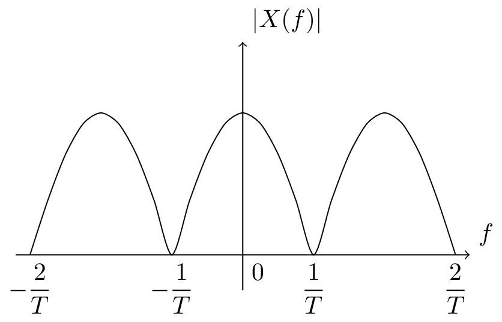
</figure>

Questa trasformata corrisponde ad un filtro passa basso, ovvero filtra le alte frequenze, e permette alle basse frequenze di passare. Si considera invece la differenza tra due impulsi, la sua trasformata corrisponde ad un filtro passa alto: $$\begin{gathered}
    x[n]=\delta[n]-\delta[n-1]\\
    X(f)=\displaystyle\sum_{k=0}^1e^{-2i\pi kfT}=1-e^{-2i\pi fT}=e^{-i\pi fT}\left(e^{i\pi fT}-e^{-i\pi fT}\right)=2ie^{-i\pi fT}\sin(\pi fT)\\
    |X(f)|=2\sin(\pi fT)
\end{gathered}$$

<figure>
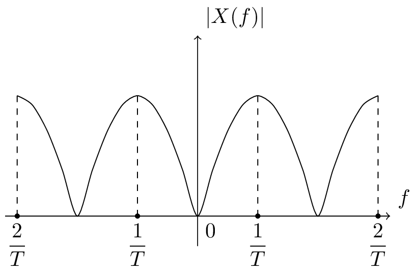
</figure>

Data una trasformata di Fourier $X$: $$\begin{gathered}
    X(f)=\mathrm{rect}\displaystyle\left(\frac{f}{2f_c}\right)
\end{gathered}$$ Non può essere la trasformata di una sequenza, poiché deve essere necessariamente periodica. Per cui deve essere espressa come un treno di finestre: $$\begin{gathered}
    X(f)=\displaystyle\sum_{k=-\infty}^{\infty}\mathrm{rect}\left(\frac{f-k/T}{2f_c}\right)
\end{gathered}$$ Per determinare la sequenza associata a questa trasformata si applica l’integrale di antitrasformazione: $$\begin{gathered}
    x[n]=T\displaystyle\int_{-1/2T}^{1/2T}\mathrm{rect}\left(\frac{f}{2f_0}\right)e^{2i\pi n fT}\mathrm{d}f=T\int_{-f_c}^{f_c}e^{2i\pi nfT}\mathrm{d}f\\
    \displaystyle\left[T\frac{e^{2i\pi nfT}}{2i\pi fT}\right]^{f_c}_{-f_c}=\frac{2f_cT}{2f_cT}\frac{\sin(2\pi nf_cT)}{\pi n}=2f_cT\mathrm{sinc}(2nf_cT)
\end{gathered}$$

## Campionamento

Un segnale introdotto precedentemente necessario per il campionamento di un segnale è il treno di delta, esprimibile tramite serie di Fourier, poiché periodico: $$\begin{gathered}
    \pi(t)=\displaystyle\sum_{n=-\infty}^{+\infty}\delta\left(t-nT\right)=\sum_{k=-\infty}^{+\infty}c_ke^{2i\pi nt/T}
\end{gathered}$$ I suoi coefficienti si esprimono come: $$\begin{gathered}
    c_k=\displaystyle\frac{1}{T}\int_{-T/2}^{T/2}\pi(t)e^{-2i\pi nt/T}\mathrm{d}t=\frac{1}{T}\int_{-T/2}^{T/2}\delta(t)e^{-2i\pi nt/T}\mathrm{d}t=\frac{1}{T}\cancelto{1}{e^{-2i\pi n0/T}}
\end{gathered}$$ Un treno di delta rappresenta una serie armonica, di ragione $e^{2i\pi t/T}$. La sua trasformata si ottiene come: $$\begin{gathered}
    \Pi(f)=\displaystyle\sum_{n=-\infty}^{+\infty}e^{-2i\pi nfT}=\sum_{k=-\infty}^{+\infty}\frac{1}{T}\delta\left(f-\frac{k}{T}\right)
\end{gathered}$$ La sua trasformata è quindi anch’essa un treno campionatore, con ogni impulso distanziato di un fattore $1/T$ in frequenza.

Per campionare un segnale si considera un ADC, “Analog to Digital Converter", un circuito composto da un interruttore che si chiude ad intervalli regolari per misurare il valore in entrata:

<figure>
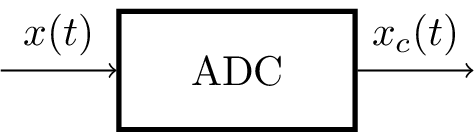
</figure>

Si indica il segnale campionato con $x_c(t)$, mentre il segnale originario con $x(t)$: $$\begin{gathered}
    x_c(t)=x(t)\pi(t)=\displaystyle\sum_{n=-\infty}^{+\infty}x(t)\delta\left(t-nT\right)=\sum_{n=-\infty}^{+\infty}x(nT)\delta\left(t-nT\right)
\end{gathered}$$ Il segnale campionato è un segnale tempo continuo, ma si comporta a tutti gli effetti come fosse una sequenza di valori $x[n]$ tempo discreto.

Si considera ora un campionatore nel dominio della frequenza:

<figure>
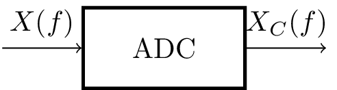
</figure>

Nel dominio della frequenza il segnale campionato si ottiene come: $$\begin{gathered}
    x_c(t)=x(t)\pi(t)=\displaystyle\sum_{n=-\infty}^{+\infty}x(nT)\delta\left(t-nT\right)\\
    X_c(f)=X(f)*\Pi(f)=\displaystyle\sum_{n=-\infty}^{+\infty}x(nT)e^{-2i\pi nfT}\\
    X(f)*\Pi(f)=\displaystyle X(f)*\frac{1}{T}\sum_{n=-\infty}^{+\infty}\delta\left(f-\frac{n}{T}\right)=\frac{1}{T}\sum_{n=-\infty}^{+\infty}X\left(f-\frac{n}{T}\right)
\end{gathered}$$ Per cui la trasformata del segnale campionato è un segnale periodico nella frequenza, di periodo $1/T$. La trasformata di Fourier di una sequenza coincide con la trasformata di Fourier di un segnale campionato. Quando le repliche del segnale si sovrappongono, avviene un fenomeno noto come “aliasing", dove a frequenze alte si perdono delle informazioni, poiché si sovrappone con le repliche a basse frequenze dei periodi successivi.

Si considera una sequenza $x[n]$ e la sua trasformata: $$\begin{gathered}
    x[n]\to X_c(f)=\displaystyle\sum_{n=-\infty}^{+\infty}x[n]e^{-2i\pi nfT}
\end{gathered}$$ Si può rappresentare la sequenza come un segnale tempo continuo $x$ ad intervalli regolari $T$, chiamato tempo di campionamento: $$\begin{gathered}
    x[n]=x(nT)\\
    t=nT\\
    x(t)
\end{gathered}$$ Per evitare di calcolare la sommatoria si considera la trasformata di questo segnale da cui si è estratta la sequenza: $$\begin{gathered}
    x(t)\to X(f)
\end{gathered}$$ Per esprimere la trasformata della sequenza si replica questa trasformata ad intervalli $1/T$ in frequenza: $$\begin{gathered}
    X_c(f)=\displaystyle\frac{1}{T}\sum_{n=-\infty}^{+\infty}X\left(f-\frac{n}{T}\right)
\end{gathered}$$

## Densità Spettrale di Energia

Per gli integrali tempo continui l’energia di un segnale è definita come: $$\begin{gathered}
    E_x=\displaystyle\int_{-\infty}^{+\infty}|x(t)|^2\mathrm{d}x=\int_{-\infty}^{+\infty}|X(f)|^2\mathrm{d}f
\end{gathered}$$ Mentre per i segnali discreti l’energia viene definita come: $$\begin{gathered}
    E_x=\displaystyle\sum_{n=-\infty}^{+\infty}|x[n]|^2
\end{gathered}$$

La trasformata di Fourier dell’autocorrelazione di un segnale $x$ è pari alla sua energia: $$\begin{gathered}
    R_{xx}[n]=\displaystyle\sum_{k=-\infty}^{+\infty}x[n+k]x^*[k]\to X(f)X^*(f)=|X(f)|^2
\end{gathered}$$ Per cui si può esprimere tramite la sua antitrasformata: $$\begin{gathered}
    R_{xx}[n]=T\displaystyle\int_{-1/2T}^{1/2T}|X(f)|^2e^{2i\pi nfT}\mathrm{d}f
\end{gathered}$$ Per un ritardo nullo $n=0$, l’autocorrelazione corrisponde all’energia di un segnale $x$: $$\begin{gathered}
    R_{xx}[0]=T\displaystyle\int_{-1/2T}^{1/2T}|X(f)|^2\mathrm{d}f=E_x
\end{gathered}$$ Per cui si definisce la densità spettrale di energia l’argomento dell’integrale $|X(f)|^2$, poiché rappresenta la densità dell’energia di un segnale ad ogni sua frequenza.

## Teorema del Campionamento

Si considera un sistema di campionamento ADC che prende in ingresso un segnale $x(t)$ tempo continuo, ed ha in uscita un segnale $x_c(t)$, pari ad una sommatoria di impulsi estratti dal segnale tempo continuo, ad intervalli regolari del periodo di campionamento $T_c$: $$\begin{gathered}
    x_c(t)=x(t)\pi(t)=x(t)\displaystyle\sum_{n=-\infty}^{+\infty}\delta(t-nT_c)=\sum_{n=-\infty}^{+\infty}x(nT_c)\delta(t-nT_c)=\sum_{n=-\infty}^{+\infty}x[n]\delta(t-nT_c)
\end{gathered}$$

<figure>
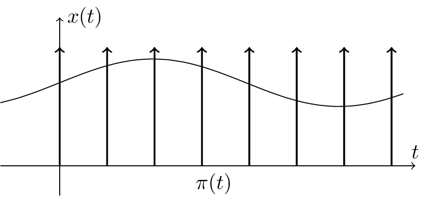
</figure>

Nel dominio della frequenza lo spettro del segnale si periodicizza, ovvero corrisponde ad una serie di repliche di periodo $1/T_c$: $$\begin{gathered}
    X_c(f)=X(f)*\Pi(f)=\displaystyle X(f)*\sum_{n=-\infty}^{+\infty}\frac{1}{T_c}\delta\left(f-\frac{n}{T_c}\right)=\frac{1}{T_c}\sum_{n=-\infty}^{+\infty}X\left(f-\frac{n}{T_c}\right)=\sum_{n=-\infty}^{+\infty}x[n]e^{-2i\pi nfT_c}
\end{gathered}$$

Nel dominio della frequenza si ottiene lo spettro periodicizzato con passo il reciproco del tempo di campionamento:

<figure>
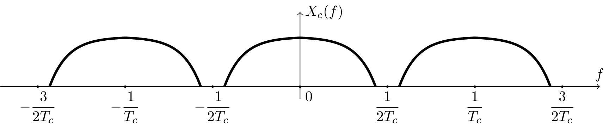
</figure>

Il teorema del campionamento fornisce una legge per ricostruire una sequenza di campioni in un segnale tempo continuo, con la minima perdita di informazione dal segnale originario campionato. Il teorema del campionamento o teorema di Shannon afferma che si può ricostruire perfettamente il segnale originario, soddisfatte una serie di condizioni, considerando solamente un’insieme finito di campioni, e non l’intera sequenza.

Per ricostruire una sequenza di valori si utilizza un filtro DAC “Digital to Analog Converter". Nel dominio della frequenza, poiché lo spettro del segnale campionato è una ripetizione del segnale originario, è sufficiente considerare una singola ripetizione. Per cui la funzione di trasferimento del filtro è una finestra: $$\begin{gathered}
    H(f)=T\,\mathrm{rect}(Tf)
\end{gathered}$$

<figure>
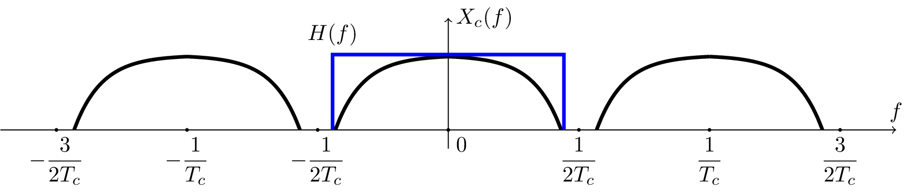
</figure>

In questo modo l’uscita del filtro corrisponde alla trasformata del segnale originario non campionato.

<figure>
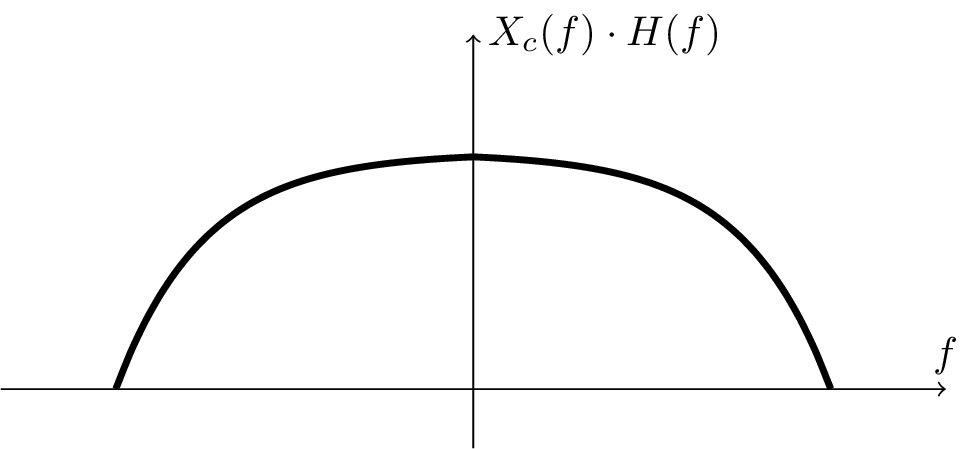
</figure>

Questo filtro è un passa basso ideale. Nel dominio del tempo questo filtro viene descritto da una risposta impulsiva seno cardinale: $$\begin{gathered}
    h(t)=\mathrm{sinc}\left(\displaystyle\frac{t}{T}\right)
\end{gathered}$$ L’uscita nel dominio del tempo è quindi la convoluzione tra la sequenza e la risposta impulsiva del filtro: $$\begin{gathered}
    y(t)=\displaystyle\sum_{n=-\infty}^{+\infty}\left[x[n]\delta(t-nT)\right]*\mathrm{sinc}\left(\frac{t}{T}\right)=\sum_{n=-\infty}^{+\infty}x[n]\mathrm{sinc}\left(\frac{t-nT}{T}\right)
\end{gathered}$$ Per ricostruire un segnale campionato quindi si considerano le somme tra infiniti seni cardinali di ampiezza pari al valore del campione e traslati di un fattore corrispondente.

<figure>
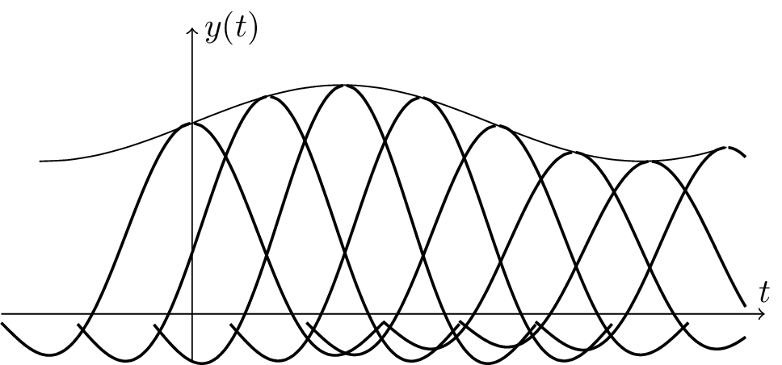
</figure>

Per $t=0$ solo la sinc non traslata da un contributo non nullo, poiché tutte le altre si annullano per valori interi. Ciò è valido per ogni altro valore intero di tempo, dove l’unico contributo non nullo coincide con il valore del campione estratto in quel tempo. In questo modo si può ricostruire il segnale originario mantenendo lo stesso contenuto informativo, mantenendo solamente una sequenza di valori, campionati dal segnale originario.

Per ricostruire il segnale bisogna avere un filtro di base abbastanza elevata per contenere il segnale ripetuto. Inoltre è necessario che i segnali ripetuti in frequenza non siano sovrapposti tra di loro, altrimenti si verifica il fenomeno noto come aliasing. Tutti i segnali reali presentano uno spettro di banda infinito, ma per poter applicare il teorema del campionamento bisogna avere necessariamente un segnale limitato in banda, per cui lo spettro di un segnale reale si considera nullo dopo una certa frequenza, chiamata frequenza massima. Per cui prima di digitalizzare il segnale si filtra per limitare la banda del segnale. Analogamente bisogna utilizzare un tempo di campionamento abbastanza ridotto per non sovrapporre le repliche del segnale in frequenza.

La minore frequenza di campionamento possibile affinché non sia presente aliasing corrisponde a due volte la frequenza massima dello spettro del segnale. Questa condizione si chiama criterio di Nyquist: $$\begin{gathered}
    f_c\geq 2f_{\max}\to T_c\leq \displaystyle\frac{1}{2f_{\max}}
\end{gathered}$$ La frequenza massima dipende dal segnale, mentre il tempo di campionamento viene scelto arbitrariamente per soddisfare il criterio di Nyquist. Quando la frequenza di campionamento coincide con la frequenza di Nyquist le due repliche si sovrappongono solamente al valore $f=f_{\max}$.

Nel processamento di segnali audio si considera una banda di $4$kHz, per cui nella tecnica PCM “Pulse Code Modulation" si campiona ad una frequenza di $8$kHz. Ad ogni valore della sequenza vengono assegnati $8$ bit, per cui per un segnale audio vengono trasmessi $64$k bit al secondo. Quando non bisogna campionare in tempo reale, si usa una frequenza di campionamento che copra la frequenza massima udibile dall’orecchio umano, pari a $20$kHz, per cui i CD Rom adoperano una frequenza di campionamento pari a $44,1$kHz, mentre i DVD campionano fino ad un massimo di $96$kHz. La frequenza di Nyquist quindi dipende dal tipo di segnale che si vuole processare, si studieranno in seguito più approfonditamente metodi di processamento di segnali.

# Fenomeni Aleatori

## Teoria della Probabilità

I processi aleatori sono processi il cui valore non è noto a priori. Sono note invece le procedure dell’avvenimento di quell’evento e quindi la probabilità per cui assuma un determinato stato.

I risultati di un fenomeno aleatorio sono univocamente definiti e devono essere completi, si definiscono questo tipo di eventi: eventi elementari. L’insieme di tutti i possibili eventi si chiama spazio degli eventi, contiene sia eventi semplici che eventi non semplici. Si definisce prova l’esecuzione delle procedure definite dall’evento aleatorio, si dice ripetizione una prova ripetuta più volte. Il risultato di una prova può essere favorevole o non favorevole.

Si definisce l’insieme dei possibili risultati di un evento con il simbolo $\mathscr{E}$: $$\begin{gathered}
    \mathscr{E}:=\{\}
\end{gathered}$$ In uno spazio $\mathbb{R}^n$ si crea una corrispondenza tra un evento ed un elemento appartenente all’insieme $\mathbb{R}^n$, definito da un vettore di dimensione $n$: $\underline{x}=(x_1,\cdots,x_n)\in\mathbb{R}^n$. Si definisce la variabile $X$, che può assumere valori nello spazio $\mathbb{R}^n$. Questa variabile può essere discreta o continua, vettoriale o scalare, sulla base del risultato associato, e le procedure attuate per arrivare a quel risultato.

Si definisce $\Omega$ l’insieme di tutti i possibili risultati di un evento, chiamato spazio degli eventi semplici.

Si definisce la funzione probabilità con un approccio frequentistico. Data una serie di ripetizioni si considera rapporto tra il numero dei risultati favorevoli delle singole prove $N_E$, ed il numero di tutte le ripetizioni $N$ effettuate. Per valori abbastanza grandi di ripetizioni questo valore tende alla frequenza dell’evento $E$: $$\begin{gathered}
    f_E=\lim_{N\to\infty}\displaystyle\frac{N_E}{N}
\end{gathered}$$ Questa definizioni frequentistica si basa sulla legge dei grandi numeri della statistica. Questo valore tende al valore della probabilità dell’evento $E$. Questo rapporto per definizione è minore o uguale ad uno, per cui la probabilità che un evento si verifichi deve essere anch’essa minore uguale ad uno: $$\begin{gathered}
    \Pr\{\mathscr{E}\}\leq1
\end{gathered}$$ Si dice un evento certo quando la sua probabilità corrisponde ad uno, per cui l’evento $\mathscr{E}$ o coincide con l’insieme degli eventi semplici $\Omega$, oppure lo include. Si dice un evento impossibile quando la sua probabilità coincide a zero, ovvero nessuna ripetizione soddisfa questo caso. Quindi la probabilità di un qualsiasi evento è compresa nell’intervallo $[0,1]$: $\Pr\{\mathscr{E}\}\in[0,1]$.

Si considera un insieme di eventi disgiunti, se gli eventi sono semplici allora sono necessariamente disgiunti. Nota la probabilità dei singoli eventi, la probabilità che avvengano tutti gli eventi corrisponde alla somma delle probabilità dei singoli eventi: $$\begin{gathered}
    \Pr\{\mathscr{E}\}=\displaystyle\sum_{n=1}^{\dim\mathscr{E}}\Pr\{{e}_i\}
\end{gathered}$$ Ovvero eventi disgiunti possono essere analizzati indipendentemente dagli altri. Se gli eventi non fossero disgiunti, allora la probabilità che avvenga un evento dipenderebbe dagli eventi che sono accaduti precedentemente.

Si definisce ora la probabilità sulla base di un approccio assiomatico, introdotto da Andrey Kolmogorov definendo quattro assiomi:

- La probabilità di un evento deve essere maggiore o uguale di zero: $P(A)\geq0$;

- La probabilità di un evento certo deve essere uguale ad uno: $P(\Omega)=1$;

- La probabilità dell’unione di eventi disgiunti corrisponde alla somma delle probabilità dei singoli eventi: $P\left(\displaystyle\bigcup_{i=1}^kA_i\right)=\displaystyle\sum_{i=1}^kP(A_i)$;

Si associa ad ogni evento un insieme, e si trattano come fossero degli insieme interni allo spazio degli eventi $\Omega$. Dati due eventi $A$ e $B$, si definiscono disgiunti se la loro sovrapposizione produce un insieme vuoto: $$\begin{gathered}
    A\cap B=\emptyset
\end{gathered}$$

Da questi teoremi derivano una serie di teoremi qui descritti. Si definisce la probabilità che avvenga un evento di insieme nullo, come impossibile: $$\begin{gathered}
    P(\emptyset)=0
\end{gathered}$$ Si definisce l’evento complementare di $A$: $\overline{A}$, all’interno dello spazio degli eventi $\Omega$, come la probabilità che l’evento $A$ non avvenga, e si ottiene come: $$\begin{gathered}
    P(\overline{A})=P(\Omega)-P(A)=1-P(A)
\end{gathered}$$ Se due eventi non sono disgiunti la probabilità che si verifichi uno dei due corrisponde alla somma delle due probabilità dei due eventi, tolta la probabilità della loro intersezione, ovvero la probabilità che avvengano entrambi all’accadere di uno solo dei due: $$\begin{gathered}
    P(A\cup B)=P(A)+P(B)-P(A\cap B)
\end{gathered}$$

Si definisce la probabilità condizionata come la probabilità che accada un evento $A$ quando è accaduto precedentemente un evento $B$: $$\begin{gathered}
    P(A|B)=\displaystyle\frac{P(A\cap B)}{P(B)}
\end{gathered}$$

Il teorema delle probabilità totali afferma che se una serie di eventi $B_i$ (disgiunti) completa lo spazio degli eventi $\Omega$, allora la probabilità che avvenga un evento $A$ si ottiene tramite la seguente espressione: $$\begin{gathered}
    P(A)=\displaystyle\sum_{i=1}^NP(A|B_i)P(B_i)=\sum_{i=1}^N\frac{P(A\cap B_i)}{P(B_i)}P(B_i)=\sum_{i=1}^NP(A\cap B_i)=P(A\cap \Omega)=P(A)
\end{gathered}$$

Il teorema di Bayes afferma che la probabilità ch avvenga $A$ dato $B$ e la probabilità che avvenga $B$ dato $A$ sono legate tra di loro dalla seguente espressione: $$\begin{gathered}
    P(A|B)P(B)=P(B|A)P(A)
\end{gathered}$$

Con questo teorema si può risolvere il problema di Monty Hall. Si considera la scelta di una delle tre porte $A_1$, $A_2$ e $A_3$, mentre la scelta a posteriori di una delle due porte rimanenti $B$. Si considera come prima scelta la porta $A_1$, e si mostra che il premio non si trovi dietro la porta $A_3$. Si calcola la probabilità che il premio si trovi dietro la porta $A_1$: $$\begin{gathered}
    P(A_1)=\displaystyle\frac{1}{3}=P(A_2)=P(A_3)\\
    P(A_1|B)=\displaystyle\frac{P(B|A_1)P(A_1)}{P(B)}=\frac{\displaystyle\frac{1}{2}\cdot{\frac{1}{3}}}{P(B)}
\end{gathered}$$ Sapendo che non può scegliere la porta che contiene il premio, si esprime la probabilità $P(B)$ tramite il teorema delle probabilità totali: $$\begin{gathered}
    P(B)=P(B|A_1)P(A_1)+P(B|A_2)P(A_2)+P(B|A_3)P(A_3)=\displaystyle\frac{1}{2}\cdot\frac{1}{3}+1\cdot\frac{1}{3}+0\cdot\frac{1}{3}=\frac{1}{2}\\
    P(A_1|B)=\frac{\displaystyle\frac{1}{2}\cdot{\frac{1}{3}}}{\displaystyle\frac{1}{2}}=\frac{1}{3}
\end{gathered}$$ Invece la probabilità si trovi dietro alla porta $A_2$: $$\begin{gathered}
    P(A_2|B)=\displaystyle\frac{1\cdot\displaystyle\frac{1}{3}}{\displaystyle\frac{1}{2}}=\frac{2}{3}
\end{gathered}$$ Mentre la probabilità si trovi dietro alla porta $A_3$ è nulla, poiché è stato mostrato non si trovi là: $$\begin{gathered}
    P(A_3|B)=0
\end{gathered}$$

## Variabili Aleatorie

Si definisce la variabile aleatoria $X$ una rappresentazione matematica di un problema espresso tramite il linguaggio, mentre si considera una determinazione $x$ di una variabile aleatoria un possibile valore assunto dalla variabile aleatoria $X$. Si vuole quindi calcolare la probabilità che la variabile aleatoria assuma un certo valore $x$: $$\begin{gathered}
    \Pr(X=x)
\end{gathered}$$ Lo spazio di valori che può assumere la variabile aleatoria può essere discreto o continuo, in base alla descrizione dell’evento. Dato uno spazio degli eventi $\Omega$ ed un suo sottoinsieme evento $E$, la probabilità che avvenga l’evento appartiene al codominio $[0,1]$, mentre l’insieme delle determinazioni della variabile aleatoria associata appartiene all’insieme $\mathbb{R}^n$: $$\begin{gathered}
    P: E\to[0,1]\\
    X:E\to\mathbb{R}^n
\end{gathered}$$

Si definisce la funzione di distribuzione cumulativa di una variabile aleatoria la funzione $D_X(x)$ che assume il valore della probabilità che la variabile aleatoria $X$ sia minore o uguale del valore della determinazione $x$ inserita nella funzione $D_X(x)$: $$D_X(x)=\Pr(X\leq x)$$

La funzione di distribuzione cumulativa deve essere monotona crescente, può essere formata da gradini in caso la variabile $X$ sia discreta, ma deve essere sempre crescente. In generale per una variabile aleatoria $X$, all’aumentare della variabile $x$, le probabilità si sommano, per cui il valore tende asintoticamente ad $1$, mentre tende ad un valore nullo per $x\to-\infty$: $$\begin{gathered}
    \lim_{x\to-\infty}D_X(x)=0\\
    \lim_{x\to+\infty}D_X(x)=1
\end{gathered}$$ Per una variabile aleatoria discreta si può esprimere la distribuzione cumulativa come la somma delle probabilità che la variabile assuma il valore della realizzazione $x_i$, moltiplicate per un gradino centrato in $x_i$: $$\begin{gathered}
    D_X(x)=\displaystyle\sum_{i=-\infty}^{+\infty}P_iu(x-x_i)
\end{gathered}$$ Dove: $$\begin{gathered}
    x\in\{x_1,\cdots,x_n\}\\
    P_i=\Pr(X=x_i)
\end{gathered}$$

Si considera la variabile aleatoria tempo di attesa $t$, uniformemente distribuita nell’intervallo $[0;T]$, rappresenta il tempo di attesa prima che avvenga un evento. La sua funzione di distribuzione di probabilità assuma la forma:

<figure>
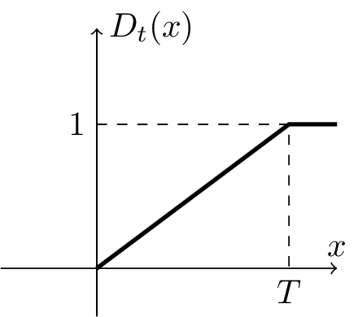
</figure>

La pendenza della curva si ottiene tramite $1/T$.

Si definisce la funzione densità di probabilità $P_X$, della variabile aleatoria $X$, calcolata in $x$, come la derivata della funzione di distribuzione di probabilità: $$P_X(x)=\displaystyle\frac{\mathrm{d}D_X(x)}{\mathrm{d}x}$$ La funzione di distribuzione cumulativa è quindi una primitiva della funzione densità di probabilità: $$D_X(x)=\displaystyle\int_{-\infty}^{x}P_X(\overline x)\mathrm{d}\overline x$$ Per una variabile aleatoria discreta, la funzione densità di probabilità rappresenta una serie di impulsi, centrati nel valore $x_i$, di ampiezza pari alla probabilità $P_i$: $$P_X(x)=\displaystyle\sum_{i=-\infty}^{+\infty}P_i\delta(x-x_i)$$

La funzione densità di probabilità della variabile aleatoria tempo di attesa rappresenta una finestra di ampiezza $1/T$ di base $T$ e centrata in $T/2$:

<figure>
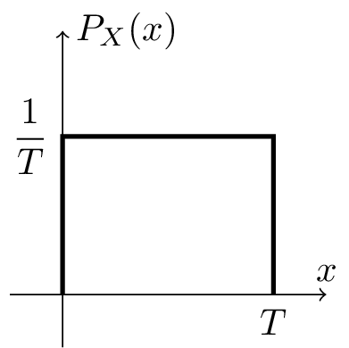
</figure>

Si può calcolare la probabilità che una variabile aleatoria assumi un valore compreso in un intervallo $[a,b]$, esprimendola come una differenza di distribuzioni di probabilità, oppure come l’integrale della densità di probabilità sull’intervallo considerato: $$\Pr(a\leq x\leq b)=D_X(b)-D_X(a)$$ $$\begin{gathered}
    D_X(b)-D_X(a)=\displaystyle\int_{-\infty}^bP_X(x)\mathrm{d}x-\int_{-\infty}^aP_X(x)\mathrm{d}x\\
    \int_{-\infty}^bP_X(x)\mathrm{d}x+\int^{-\infty}_aP_X(x)\mathrm{d}x=\int_a^bP_X(x)\mathrm{d}x
\end{gathered}$$ $$\Pr(a\leq x\leq b)=\displaystyle\int_a^bP_X(x)\mathrm{d}x$$ Per la variabile aleatoria tempo di attesa, la probabilità assuma un valore nell’intervallo $[a,b]$ si ottiene come: $$\begin{gathered}
    \Pr(a\leq t\leq b)=\displaystyle\int_a^b\frac{1}{T}\mathrm{d}t=\frac{b-a}{T}
\end{gathered}$$ La densità di probabilità deve essere normalizzata, per cui il suo integrale sull’intervallo dove è definita la variabile aleatoria deve tendere al valore $1$: $$\displaystyle\int_{\mathbb{R}^n}P_X(x)\mathrm{d}x=1$$

## Statistiche Notevoli

Una variabile aleatoria $X$ si dice uniformemente distribuita su un intervallo $[a,b]$ se la probabilità assuma una qualsiasi realizzazione contenuta in quell’intervallo $x\in[a,b]$ è costante: $$\Pr(X=x\in[a,b])=\mathrm{cost.}$$ La sua densità di probabilità rappresenta una finestra di base $b-a$, e centrata in $a+b/2$. Per normalizzare la distribuzione si considera la finestra di ampiezza il reciproco della base $1/b-a$: $$P_X(x)=\displaystyle\frac{1}{b-a}\mathrm{rect}\left(\frac{x-(a+b)/2}{b-a}\right)$$

<figure>
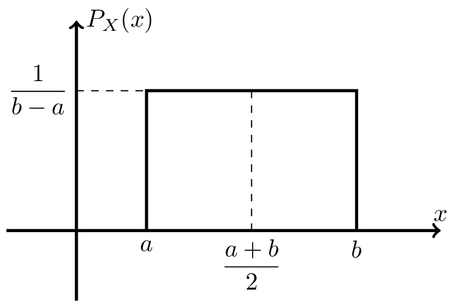
</figure>

Si verifica la condizione di chiusura: $$\begin{gathered}
    \displaystyle\int_{-\infty}^{+\infty}P_X(x)\mathrm{d}x=\displaystyle\int_{-\infty}^{+\infty}\frac{1}{b-a}\mathrm{rect}\left(\frac{x-(a+b)/2}{b-a}\right)\mathrm{d}x=\frac{1}{b-a}\int_a^b\mathrm{d}x=\frac{1}{b-a}x\Bigg|^b_a=\frac{b-a}{b-a}=1
\end{gathered}$$ La sua funzione di distribuzione cumulativa rappresenta una rampa: $$\begin{gathered}
    D_X(x)=\displaystyle\int_{-\infty}^xP_X(\overline{x})\mathrm{d}\overline{x}=
    \begin{cases}
        0 &x<a\\
        \displaystyle\frac{\strut1}{\strut b-a}\int_{a}^x\mathrm{d}x=\frac{\strut x-a}{\strut b-a} &a\leq x<b\\
        1 &x\geq b
    \end{cases}
\end{gathered}$$

La statistica più nota è quella gaussiana, in questa statistica, la funzione densità di probabilità della variabile aleatoria $X$ assume la seguente forma: $$P_X(x)=\displaystyle e^{-\left(\frac{x-\mu_x}{\sqrt{2}\sigma_x}\right)^2}\frac{1}{\sqrt{2\pi}\sigma_x}$$

<figure>
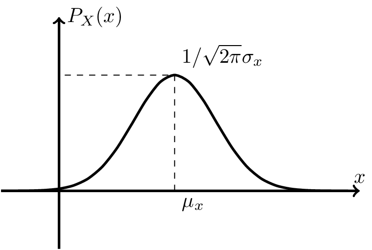
</figure>

Si chiama $\sigma_x$ deviazione standard, mentre il suo quadrato $\sigma_x^2$ si definisce varianza. Il valore dove è centrata la gaussiana $\mu_x$ si chiama valor medio. Questa funzione deve rispettare la condizione di chiusura. L’integrale su tutti le possibili determinazioni della densità di probabilità di $x$ corrisponde all’integrale di Gauss: $$\begin{gathered}
    \displaystyle\int_{-\infty}^{+\infty}P_x(x)\mathrm{d}x=\int_{-\infty}^{+\infty}e^{-\frac{(x-\mu_x)^2}{2\sigma_x^2}}\frac{1}{\sqrt{2\pi}\sigma_x}\mathrm{d}x\\
    t=\displaystyle\frac{x-\mu_x}{\sqrt{2}\sigma_x}\\
    \displaystyle\int_{_\infty}^{+\infty}e^{-t^2}\frac{\sqrt{2}{\sigma_x}}{\sqrt{2}\sigma_x}\frac{1}{\sqrt{\pi}}{\mathrm{d}x}=\frac{\sqrt{\pi}}{\sqrt{\pi}}=1
\end{gathered}$$ La sua distribuzione di probabilità si ottiene come: $$\begin{gathered}
    D_X(x)=\displaystyle\int_{-\infty}^xP_X(\overline{x})\mathrm{d}\overline{x}
\end{gathered}$$ Un altra funzione molto utilizzata è la Laplaciana, chiamata anche statistica esponenziale. La probabilità della variabile aleatoria $x$ è quindi della forma: $$P_X(x)=\lambda e^{-\lambda x}u(x)$$

<figure>
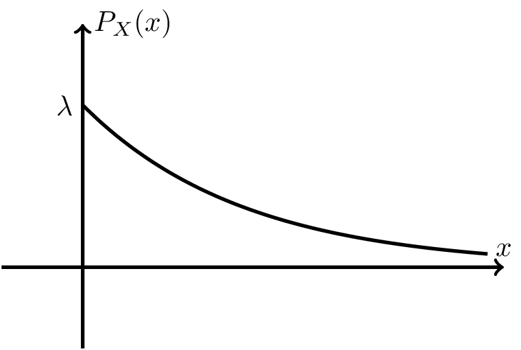
</figure>

Si verifica la condizione di normalizzazione: $$\begin{gathered}
    \displaystyle\int_{-\infty}^{+\infty}P_X(x)\mathrm{d}x=\int_{-\infty}^{+\infty}\lambda e^{-\lambda x}u(x)\mathrm{d}x=\int_0^{+\infty}xe^{-\lambda x}\mathrm{d}x=-e^{-\lambda x}\Bigg|_0^{+\infty}=1
\end{gathered}$$ La sua distribuzione di probabilità si ottiene come: $$\begin{gathered}
    D_X(x)=\displaystyle\int_{-\infty}^xP_X(\overline{x})\mathrm{d}\overline{x}=u(x)\int_0^x\lambda e^{-\lambda\overline{x}}\mathrm{d}\overline{x}=-e^{-\lambda\overline{x}}\Bigg|_0^xu(x)=\left(1-e^{-\lambda x}\right)u(x)
\end{gathered}$$

<figure>
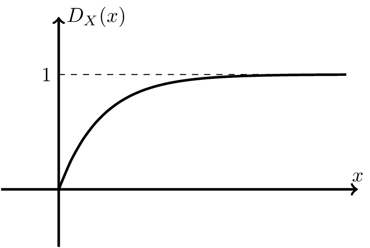
</figure>

## Variabili Aleatorie Dipendenti

Sia data una variabile aleatoria di cui sia nota la statistica $X$, e una variabile aleatoria $Y$, di cui non si conosce la statistica, espressa rispetto ad $X$ tramite la seguente espressione: $$\begin{gathered}
    Y=aX+b
\end{gathered}$$

Si calcola la funzione di distribuzione cumulativa di $Y$: $$\begin{gathered}
    D_Y(y)=\Pr(Y\leq y)
\end{gathered}$$ Poiché è una relazione lineare, questa relazione si può esprimere rispetto alla variabile $X$: $$\begin{gathered}
    y=f(x)=ax+b\\
    x=g(y)=\displaystyle\frac{y-b}{a}\\
    \Pr(Y\leq y)=\Pr\left(X\leq\displaystyle\frac{y-b}{a}\right)\\
    D_Y(y)=D_X\left(\displaystyle\frac{y-b}{a}\right)=D_X(g(y))\\
    D_Y(y)=D_X(g(y))\tag{\stepcounter{equation}\theequation}
\end{gathered}$$

La densità di probabilità si ottiene derivando la distribuzione cumulativa: $$\begin{gathered}
    P_Y(y)=\displaystyle\frac{\mathrm{d}}{\mathrm{d}y}D_Y(y)\\
    \frac{\mathrm{d}}{\mathrm{d}y}D_X(g(y))=\frac{\mathrm{d}}{\mathrm{d}x}D_X(g(y))\frac{\mathrm{d}x}{\mathrm{d}y}\\ % chain-rule
    P_X(g(y))\frac{\mathrm{d}}{\mathrm{d}y}g(y)
\end{gathered}$$ Per cui si può esprimere la densità di probabilità della variabile $Y$ rispetto alla densità nota della variabile $X$: $$P_Y(y)=P_X(g(y))g'(y)$$

Se la curva che lega le due variabili è decrescente allora la distribuzione della variabile $Y$ può essere espressa rispetto alla probabilità che la variabile $X$ sia maggiore del valore per cui la determinazione di $Y$ è minore del valore $y$: $$\begin{gathered}
    D_Y(y)=\Pr(Y\leq y)=\Pr\left(\displaystyle X>\frac{y-b}{a}\right)\\
    1-\Pr\left(X\leq\frac{y-b}{a}\right)=1-D_X\left(\frac{y-b}{a}\right)
\end{gathered}$$ Derivando questa relazione si ottiene: $$\begin{gathered}
    P_Y(y)=\displaystyle\frac{\mathrm{d}}{\mathrm{d}y}D_Y(y)\\
    -\displaystyle\frac{\mathrm{d}}{\mathrm{d}x}D_X\left(\frac{y-b}{a}\right)=-P_X(g(y))g'(y)
\end{gathered}$$ Per cui bisogna tenere conto della crescenza o decrescenza della curva che lega le due variabili aleatorie: $$P_Y(y)=P_X(g(y))\left|g'(y)\right|$$

In caso la relazione $y=f(x)$ tra le due variabili non sia invertibile, si divide il dominio in $N$ intervalli dove la funzione che lega le due variabile è monotona crescente o decrescente in modo da poter esprimere la loro relazione inversa $x=g_i(y)$. In questo modo si può applicare la formula dimostrata precedentemente su ogni sotto-insieme del dominio per ottenere la densità di probabilità della variabile $Y$: $$\begin{gathered}
    P_Y(y)=\displaystyle\sum_{i=1}^NP_{Y,i}(y)=\sum_{i=1}^NP_X(g_i(y))|g_i'(y)|
\end{gathered}$$

## Parametri Statistici

I parametri statistici di una variabile aleatoria $X$ sono dei valori associati alla variabile, non sono funzioni, ma possono essere parametrici.

Data una variabile aleatoria discreta $X$, capace di assumere $N$ realizzazioni: $x\in\left\{x_1,\cdots,x_N\right\}$

Se vengono effettuate $M$ ripetizioni, viene definito il valore medio $\mu_x$ come il numero di volte $n_i$ che si verifica una delle realizzazioni $x_i$ moltiplicata per il valore della realizzazione, per ognuna delle $N$ realizzazioni, diviso per il numero totale di ripetizioni: $$\mu_x=\displaystyle\frac{\displaystyle\sum_{i=1}^Nn_ix_i}{M}=\sum_{i=1}^Nx_iP_i$$

Per una variabile aleatoria continua il valore medio si ottiene tramite un integrale: $$\mu_x=\displaystyle\int_{-\infty}^{+\infty}xP_X(x)\mathrm{d}x$$ Questo integrale può essere espresso rispetto alla funzione valore atteso o “expectation”: $$\begin{gathered}
    E[f(x)]:=\displaystyle\int_{-\infty}^{+\infty}f(x)P_X(x)\mathrm{d}x\\
    \mu_x=E[x]
\end{gathered}$$

Inserendo nell’integrale per una variabile aleatoria continua la densità di probabilità di una variabile discreta, si ottiene la definizione per una variabile aleatoria discreta: $$\begin{gathered}
    P_X(x)=\displaystyle\sum_{i=1}^NP_i\delta(x-x_i)\\
    \mu_x=\displaystyle\int_{-\infty}^{+\infty}x\sum_{i=1}^NP_i\delta(x-x_i)\mathrm{d}x=\sum_{i=1}^NP_i\int_{-\infty}^{+\infty}x\delta(x-x_i)\mathrm{d}x=\sum_{i=1}^Nx_iP_i
\end{gathered}$$

Il valore atteso di una variabile aleatoria uniforme, distribuita sull’intervallo $[a,b]$, si ottiene come: $$\begin{gathered}
    \mu_x=\displaystyle\int_{-\infty}^{+\infty}xP_X(x)\mathrm{d}x=\int_{a}^b\frac{1}{b-a}\mathrm{d}x=\frac{b^2-a^2}{2(b-a)}=\frac{b+a}{2}
\end{gathered}$$

Si calcolare ora il valore medio di una variabile aleatoria di statistica gaussiana: $$\begin{gathered}
    P_X(x)=\displaystyle\frac{1}{\sqrt{2\pi}\sigma_x}e^{-\frac{(x-\mu_x)^2}{\sigma_x^2}}\\
    \mu_x=\displaystyle\int_{-\infty}^{+\infty}xP_X(x)\mathrm{d}x=\int_{-\infty}^{+\infty}\frac{x}{\sqrt{2\pi}\sigma_x}e^{-\frac{(x-\mu_x)^2}{\sigma_x^2}}\mathrm{d}x
\end{gathered}$$ Si applica un cambio di variabile $t=(x-\mu_x)/(\sqrt{2}\sigma_x)$: $$\begin{gathered}
    \mu_x=\displaystyle\int_{-\infty}^{+\infty}\frac{\sqrt{2}\sigma_xt+\mu_x}{\sqrt{2\pi}\sigma_x}e^{-t^2}\sqrt{2}\sigma_x\mathrm{d}t=\cancelto{0}{\int_{-\infty}^{+\infty}\sqrt{2}\sigma_xte^{-t^2}}\mathrm{d}t+\frac{\mu_x}{\sqrt{\pi}}\int_{-\infty}^{+\infty}e^{-t^2}\mathrm{d}t=\mu_x\cancelto{1}{\frac{\sqrt{\pi}}{\sqrt{\pi}}}
\end{gathered}$$ Si è dimostrato che il fattore di traslazione di una gaussiana $\mu_x$ corrisponde al suo valore medio.

Si calcola il valore medio di una statistica esponenziale: $$\begin{gathered}
    P_X(x)=\lambda e^{-\lambda x}u(x)\\
    \mu_x=\displaystyle\int_{-\infty}^{+\infty}xP(x)\mathrm{d}x=\lambda\int_{0}^{+\infty}xe^{-\lambda x}\mathrm{d}x=\cancelto{0}{\left[xe^{-\lambda x}\right]_0^{+\infty}}+\int_0^{+\infty}e^{-\lambda x}\mathrm{d}x\\
    \displaystyle\cancelto{0}{\left[-xe^{-\lambda x}\right]_0^{+\infty}}+\left[-\frac{e^{-\lambda x}}{\lambda}\right]_0^{+\infty}=\frac{1}{\lambda}\\
    \mu_x=\displaystyle\frac{1}{\lambda}\tag{\stepcounter{equation}\theequation}
\end{gathered}$$

Si definisce il valore atteso quadratico o il momento del secondo ordine $\mu_x^{(2)}$ come: $$\mu_x^{(2)}=\displaystyle\int_{-\infty}^{+\infty}x^2P_X(x)\mathrm{d}x=E[x^2]$$

Si definisce il momento centrato del secondo ordine $\sigma_x^2$ o varianza come: $$\sigma_x^2=\displaystyle\int_{-\infty}^{+\infty}(x-\mu_x)^2P_X(x)\mathrm{d}x=E[(x-\mu_x)^2]$$ La varianza fornisce informazioni sull’estensione della distribuzione intorno al valore medio.

Si definisce la deviazione standard $\sigma_x$ come: $$\sigma_x=\displaystyle\int_{-\infty}^{+\infty}(x-\mu_x)P_X(x)\mathrm{d}x=E[x-\mu_x]$$

Si calcola il momento centrato del secondo ordine tramite la definizione: $$\begin{gathered}
    E\left[(x-\mu_x)^2\right]=\displaystyle\int_{-\infty}^{+\infty}(x-\mu_x)^2P_X(x)\mathrm{d}x=\sigma_x^2\\
    \int_{-\infty}^{+\infty}x^2P_X(x)\mathrm{d}x-\int_{-\infty}^{+\infty}x\mu_xP_X(x)\mathrm{d}x+\mu_x^2\int_{-\infty}^{+\infty}P_X(x)\mathrm{d}x\\
    \mu_x^{(2)}+\mu_x^2\int_{-\infty}^{+\infty}P_X(x)\mathrm{d}x-2\mu_x\int_{-\infty}^{+\infty}xP_X(x)\mathrm{d}x
\end{gathered}$$ Il primo integrale corrisponde al momento del secondo ordine, il secondo integrale vale uno poiché la densità di probabilità è normalizzata e l’ultimo integrale corrisponde al valore medio: $$\begin{gathered}
    \sigma_x^2=\mu_x^{(2)}+\mu_x^2-2\mu_x\mu_x=\mu_x^{(2)}-\mu_x^2
\end{gathered}$$

Data una statistica esponenziale, si calcola il valore quadratico medio, tramite la sua definizione: $$\begin{gathered}
    \mu_x^{(2)}=\displaystyle\int_{-\infty}^{+\infty}x^2\lambda e^{-\lambda x}u(x)\mathrm{d}x=\cancelto{0}{\left[-x^2e^{-\lambda x}\right]_0^{+\infty}}+2\int_{0}^{+\infty}xe^{-\lambda x}\mathrm{d}x\\
    \cancelto{0}{\left[-2\displaystyle\frac{e^{-\lambda x}}{\lambda}\right]_0^{+\infty}}+2\int_{0}^{+\infty}\frac{e^{-\lambda x}}{\lambda}\mathrm{d}x=\left[-\frac{2e^{-\lambda x}}{\lambda^2}\right]^{+\infty}_0=\frac{2}{\lambda^2}\\
    \mu_x^{(2)}=\displaystyle\frac{2}{\lambda^2}\tag{\stepcounter{equation}\theequation}
\end{gathered}$$ Mentre la sua varianza è: $$\begin{gathered}
    \sigma_x^2=\mu_x^{(2)}-\mu_x^2=\displaystyle\frac{2}{\lambda^2}-\frac{1}{\lambda^2}=\frac{1}{\lambda^2}
\end{gathered}$$

Data una statistica gaussiana, si calcola la sua varianza tramite la definizione: $$\begin{gathered}
    E[(x-\mu_x)^2]=\displaystyle\int_{-\infty}^{+\infty}(x-\mu_x)^2e^{-\frac{(x-\mu_x)^2}{2\sigma_x^2}}\frac{\mathrm{d}x}{\sqrt{2\pi}\sigma_x}\\
    t=\displaystyle\frac{x-\mu_x}{\sqrt{2}\sigma_x}\\
    \displaystyle\int_{-\infty}^{+\infty}t^22\sigma_x^2e^{-t^2}\frac{\mathrm{d}t}{\sqrt{\pi}}=\cancelto{0}{\left[\frac{1}{\sqrt{\pi}}2\sigma_x^2\left(\frac{-te^{-t^2}}{2}\right)\right]}+\frac{2\sigma_x^2}{\sqrt{\pi}}\int_{-\infty}^{+\infty}\frac{e^{-t^2}}{2}\mathrm{d}t=\sigma_x^2
\end{gathered}$$

Data una statistica uniforme, si calcola il momento del secondo ordine: $$\begin{gathered}
    \mu_x^{(2)}=\displaystyle\int_{-\infty}^{+\infty}x^2P_X(x)\mathrm{d}x=\int_a^bx^2\frac{\mathrm{d}x}{b-a}=\frac{1}{3}\frac{b^3-a^3}{b-a}=\frac{b^2+ab+a^2}{3}
\end{gathered}$$ Si calcola ora la sua varianza: $$\begin{gathered}
    \sigma_x^2=\mu_x^{(2)}-\mu_x^2=\displaystyle\frac{b^2+ab+a^2}{3}-\frac{(b+a)^2}{4}=\frac{(b-a)^2}{12}
\end{gathered}$$

Si definisce la funzione caratteristica di una variabile aleatoria come: $$E\left[e^{-2i\pi fx}\right]=\displaystyle\int_{-\infty}^{+\infty}e^{-2i\pi fx}P_X(x)\mathrm{d}x=\mathbf{P}_x(f)$$ Corrisponde alla trasformata di Fourier della densità di probabilità.

Si può calcolare il valore medio di una variabile aleatoria $X$, data la sua funzione caratteristica: $$\begin{gathered}
    \displaystyle\frac{\mathrm{d}\mathbf{P}_x(f)}{\mathrm{d}f}=-2i\pi\int_{-\infty}^{+\infty}xP_X(x)e^{-2i\pi fx}\mathrm{d}x\\
    \displaystyle-\frac{1}{2i\pi}\frac{\mathrm{d}\mathbf{P}_x(f)}{\mathrm{d}f}\bigg|_{f=0}=\int_{-\infty}^{+\infty}xP_X(x)\mathrm{d}x=\mu_x
\end{gathered}$$

Si calcola la funzione caratteristica di una statistica uniforme, gaussiana ed esponenziale: $$\begin{gathered}
    P_X(x)=\displaystyle\frac{1}{b-a}\mathrm{rect}\left(\frac{x-(a+b)/2}{b-a}\right)\\
    \mathbf{P}_x(f)=\displaystyle\mathrm{sinc}\left[(b-a)f\right]e^{-i\pi f(a+b)}
\end{gathered}$$ La trasformata di una gaussiana è una gaussiana, come è stato precedentemente calcolato: $$\begin{gathered}
    P_X(x)=\frac{1}{\sqrt{2\pi}\sigma_x}e^{-\frac{(x-\mu_x)^2}{2\sigma_x^2}}\\
    \mathbf{P}_x(f)=e^{-\pi^2\sigma_x^2f^2}e^{-2i\pi f\mu_x}
\end{gathered}$$ Analogamente è stata già calcolata la trasformata di una funzione esponenziale: $$\begin{gathered}
    P_X(x)=\lambda e^{-\lambda x}u(x)\\
    \mathbf{P}_x(f)=\displaystyle\frac{\lambda}{\lambda+2i\pi f}
\end{gathered}$$

Si considerano i parametri precedentemente definiti: $$\begin{gathered}
    E[x]=\mu_x\\
    E[x^2]=\mu_x^{(2)}\\
    E[(x-\mu_x)^2]=\sigma_x^2\\
    E\left[e^{-2i\pi fx}\right]=\mathbf{P}_x(f)
\end{gathered}$$ Tramite la funzione valore atteso, e questi altri parametri appena definiti, è possibile esprimere le variabili aleatorie senza calcolare la loro distribuzione di probabilità. Date due variabili aleatorie legate dalla relazione $f(x)=y$, si può calcolare il valore atteso della variabile $y$ rispetto alla variabile aleatoria $x$: $$\begin{gathered}
    E[y]=\displaystyle\int_{-\infty}^{+\infty}yP_Y(y)\mathrm{d}y=\int_{-\infty}^{+\infty}f(x)P_Y(f(x))f'(x)\mathrm{d}x\\
    P_Y(f(x))f'(x)=P_X(x)\\
    \int_{-\infty}^{+\infty}f(x)P_X(x)\mathrm{d}x=E[f(x)]\\
    E[y]=E[f(x]]\tag{\stepcounter{equation}\theequation}
\end{gathered}$$

La funzione valore atteso gode della della proprietà di linearità: $$\begin{gathered}
    E[af(x)+bg(x)]=\displaystyle\int_{-\infty}^{+\infty}(af(x)+bg(x))P_X(x)\mathrm{d}x\\
    a\int_{-\infty}^{+\infty}f(x)P_X(x)\mathrm{d}x+b\int_{-\infty}^{+\infty}g(x)P_X(x)\mathrm{d}x=aE[f(x)]+bE[g(x)]
\end{gathered}$$

## Variabili Aleatorie Bidimensionali

Si considera una variabile aleatoria definita da due variabili $X$ e $Y$. Si calcola la sua distribuzione di probabilità: $$\begin{gathered}
    D_{X,Y}(x,y)=\Pr(X\leq x,Y\leq y)
\end{gathered}$$ Si definisce la densità di probabilità congiunta, la derivata seconda di questa distribuzione di probabilità: $$\begin{gathered}
    \displaystyle\frac{\mathrm{d}^2}{\mathrm{d}x\mathrm{d}y}D_{X,Y}(x,y)=P_{X,Y}(x,y)
\end{gathered}$$ Se la variabile aleatoria è discreta si esprime questa densità congiunta come una doppia sommatoria: $$\begin{gathered}
    P_{X,Y}(x,y)=\displaystyle\sum_{i=1}^N\sum_{j=1}^MP_{i,j}\delta(x-x_i)\delta(y-y_j)
\end{gathered}$$ Deve soddisfare la condizione di normalizzazione sull’intero piano: $$\begin{gathered}
    \iint_{\mathbb{R}^2}P_{X,Y}(x,y)\mathrm{d}x\mathrm{d}y=1
\end{gathered}$$ Integrando la probabilità congiunta rispetto ad una sola variabile si rimuove la dipendenza della funzione dalla variabile di integrazione, ottenendo così una densità di probabilità marginale. Si dice che si “satura" una delle due variabili aleatorie, poiché non si considera più la sua statistica. Per una variabile bidimensionale si hanno quindi due densità probabilità marginali: $$\begin{gathered}
    \displaystyle\int_{-\infty}^{+\infty}P_{X,Y}(x,y)\mathrm{d}y=P_X(x)\\
    \displaystyle\int_{-\infty}^{+\infty}P_{X,Y}(x,y)\mathrm{d}x=P_Y(y)
\end{gathered}$$ Se e solo se le dua variabili sono indipendenti tra di loro, allora la probabilità congiunta fattorizza e rappresenta il prodotto tra le due densità di probabilità marginali: $$\begin{gathered}
    P_{X,Y}(x,y)=P_X(x)P_Y(y)
\end{gathered}$$

La funzione valore atteso per una variabile bidimensionale dipende anch’essa da due variabili $x$ e $y$: $$\begin{gathered}
    E[f(x,y)]=\displaystyle\iint_{\mathbb{R}^2}f(x,y)P_{X,Y}(x,y)\mathrm{d}x\mathrm{d}y
\end{gathered}$$ Quindi si estendono tutti gli integrali calcolati precedentemente sull’intero piano, per calcolare i parametri statistici di una variabile aleatoria bidimensionale.

Si definisce il momento misto di ordine $1,1$ o correlazione tra le due variabili aleatorie $X$ e $Y$: $$\begin{gathered}
    E[xy]=\displaystyle\iint_{\mathbb{R}^2}xyP_{X,Y}(x,y)\mathrm{d}x\mathrm{d}y=\mu_{x,y}^{1,1}
\end{gathered}$$ Questo parametro quantifica se i due segnali aleatori sono correlati tra di loro. Se i due segnali sono indipendenti tra di loro, allora il momento misto di ordine $1,1$ si può calcolare fattorizzando la densità di probabilità congiunta: $$\begin{gathered}
    E[xy]=\displaystyle\iint_{\mathbb{R}^2}xyP_{X,Y}(x,y)\mathrm{d}x\mathrm{d}y=\iint_{\mathbb{R}^2}(xP_X(x))(yP_Y(y))\mathrm{d}x\mathrm{d}y
\end{gathered}$$ Poiché le variabili di integrazione sono indipendenti è possibile separare gli integrali: $$\begin{gathered}
    \displaystyle\int_{-\infty}^{+\infty}xP_X(x)\mathrm{d}x\cdot\int_{-\infty}^{+\infty}yP_Y(y)\mathrm{d}y=\mu_x\mu_y
\end{gathered}$$ La correlazione di due variabili aleatorie indipendenti è quindi data dal prodotto dei loro valori medi: $$\mu_{x,y}^{(1,1)}=\mu_x\mu_y$$

Si definisce la covarianza $\sigma_{x,y}$ di una variabile aleatoria bidimensionale come: $$\begin{gathered}
    \sigma_{x,y}=E[(x-\mu_x)\cdot(y-\mu_y)]
\end{gathered}$$ Se le due variabili aleatorie coincidono $X\equiv Y$, ovvero se le due variabili aleatorie sono la stessa variabile, allora la covarianza coincide alla varianza $\sigma_x^2$. Si esprime la covarianza tra due variabili aleatorie, diverse, tramite la funzione valore atteso: $$\begin{gathered}
    \sigma_{x,y}=\iint_{\mathbb{R}^2}(x-\mu_x)(y-\mu_y)P_{X,Y}(x,x)\mathrm{d}x\mathrm{d}y\\
    \displaystyle\iint_{\mathbb{R}^2}xyP_{X,Y}(x,y)\mathrm{d}x\mathrm{d}y-\mu_x\int_{-\infty}^{+\infty}y\left(\int_{-\infty}^{+\infty}P_{X,Y}(x,y)\mathrm{d}x\right)\mathrm{d}y\\
    -\displaystyle\mu_y\int_{-\infty}^{+\infty}x\left(\int_{-\infty}^{+\infty}P_{X,Y}(x,y)\mathrm{d}y\right)\mathrm{d}x+\mu_x\mu_y\cancelto{1}{\iint_{\mathbb{R}^2}P_{X,Y}(x,y)\mathrm{d}x\mathrm{d}y}\\
    \displaystyle\iint_{\mathbb{R}^2}xyP_{X,Y}(x,y)\mathrm{d}x\mathrm{d}y-\mu_x\int_{-\infty}^{+\infty}yP_Y(y)\mathrm{d}y-\mu_y\int_{-\infty}^{+\infty}xP_X(x)\mathrm{d}x+\mu_x\mu_y\\
    \mu_{x,y}^{1,1}-\mu_x\mu_y-\mu_x\mu_y+\mu_x\mu_y\\
    \sigma_{x,y}=\mu_{x,y}^{1,1}-\mu_x\mu_y\tag{\stepcounter{equation}\theequation}
\end{gathered}$$

Tramite la covarianza si studia il grado di correlazione tra due variabili aleatorie per identificare se sono legate tra di loro. Si quantifica dall’indice di correlazione $\rho_{x,y}$, definito come il rapporto tra la covarianza e la radice quadrata del prodotto tra le varianze delle due variabili: $$\rho_{x,y}=\displaystyle\frac{\sigma_{x,y}}{\sqrt{\sigma_x^2\sigma_y^2}}=\frac{\sigma_{x,y}}{\sigma_x\sigma_y}$$ Questo valore è compreso nell’intervallo $[0,1]$, se la covarianza è uguale a $0$ le due variabili sono in-correlate, mentre se è pari ad $1$, le due variabili sono correlate e probabilmente dipendenti dallo stesso fenomeno. Il fattore di correlazione di $X$ con sé stessa è pari ad uno.

Si considera una variabile aleatoria $Z$ definita come la combinazione lineare di due variabili aleatorie $X$ e $Y$ indipendenti. $$\begin{gathered}
    Z=X+Y
\end{gathered}$$ Si vuole determinare la sua densità di probabilità. Poiché sono indipendenti si può esprimere la densità di probabilità congiunta rispetto alle densità di probabilità marginali: $$\begin{gathered}
    P_{X,Y}(x,y)=P_X(x)P_Y(y)
\end{gathered}$$

Si determina la funzione caratteristica di $Z$: $$\begin{gathered}
    \mathbf{P}_z(f)=E[e^{-2i\pi fz}]=E[e^{-2i\pi f(x+y)}]\\
    E[e^{-2i\pi f(x+y)}]\displaystyle=\iint_{\mathbb{R}^2}e^{-2i\pi f(x+y)}P_{X,Y}(x,y)\mathrm{d}x\mathrm{d}y\\
    \displaystyle\int_{-\infty}^{+\infty}e^{-2i\pi fx}P_X(x)\mathrm{d}x\int_{-\infty}^{+\infty}e^{-2i\pi fy}P_Y(y)\mathrm{d}y=\mathbf{P}_x(f)\mathbf{P}_y(f)\\
    \mathbf{P}_z(f)=\mathbf{P}_x(f)\cdot\mathbf{P}_y(f)\tag{\stepcounter{equation}\theequation}
\end{gathered}$$

Poiché rappresentano la trasformata della densità di probabilità, ritornando nel dominio della variabile aleatoria, l’operazione rappresenta una convoluzione tra le due densità di probabilità $P_X$ e $P_Y$: $$P_Z(z)=P_X(x)*P_Y(y)$$

Si calcola il valore atteso di $Z$, utilizzando la proprietà di linearità della funzione valore atteso: $$\begin{gathered}
    \mu_z=E[z]=E[x+y]=E[x]+E[y]=\mu_x+\mu_y\\
    \mu_z=\mu_x+\mu_y\tag{\stepcounter{equation}\theequation}
\end{gathered}$$

Si calcola il momento del secondo ordine di $Z$: $$\begin{gathered}
    \mu_z^{(2)}=E[z^2]=E[(x+y)^2]=E[x^2]+2E[xy]+E[y^2]=\mu_x^{(2)}+2\mu_{x,y}^{(1,1)}+\mu_y^{(2)}
\end{gathered}$$ Poiché le due variabili sono indipendenti si può esprimere come: $$\begin{gathered}
    \mu_z^{(2)}=\mu_x^{(2)}+2\mu_x\mu_y+\mu_y^{(2)}
\end{gathered}$$

Si calcola la varianza della variabile aleatoria $Z$: $$\begin{gathered}
    \sigma_z^2=\mu_z^{(2)}-\mu_z^2=\mu_x^{(2)}+2\mu_x\mu_y+\mu_y^{(2)}-(\mu_x+\mu_y)^2=\mu_x^{(2)}-\mu_x^2+\mu_y^{(2)}-\mu_y^2=\sigma_x^2+\sigma_y^2\\
    \sigma_z^2=\sigma_x^2+\sigma_y^2\tag{\stepcounter{equation}\theequation}
\end{gathered}$$

## Processi Aleatori

Dato un sistema composto da $N$ o infinite sorgenti della stessa tipologia, indipendenti tra di loro, ognuna associata univocamente ad un segnale nel tempo. L’insieme di questi segnali viene chiamato processo aleatorio, poiché il segnale che varia nel tempo dipende casualmente da una delle sorgenti.

Si vogliono introdurre delle variabili e caratteristiche per individuare il processo e studiarne i parametri stocastici per analizzare i segnali. Si sceglie un istante di tempo $t_1$ e si misura per ogni sorgente il segnale prodotto in quell’istante $x_i(t_1)$. Questo rappresenta l’insieme di tutte le possibili realizzazioni della variabile aleatoria discreta o continua $X_1$: $$\begin{gathered}
    X_1:=\left\{x_1(t_1),\cdots,x_N(t_1)\right\}
\end{gathered}$$

Questa variabile aleatoria puù essere analizzata per produrre i valori dei suoi parametri statistici, come è stato analizzato precedente . Introducendo una nuova variabile $X_2$ misurando il valore in un istante di tempo diverso $t_2$, si possono analizzare le proprietà ed i parametri bidimensionali delle due variabili.

In generale dato un istante di tempo $t_j$ ed un processo aleatorio si definisce una gerarchia del primo ordine, la variabile aleatoria, discreta o continua, che può assumere come possibili realizzazioni tutti i possibili valori dei segnali del processo aleatorio nell’istante di tempo $t_j$: $$X_j=\left\{x_1(t_j),x_2(t_j),\cdots\right\}$$ Quindi dato un processo aleatorio e fissati gli istanti di tempo possono essere estratte, possono essere estratte un numero corrispondente di variabili aleatorie. In caso si studi la funzione di correlazione o la covarianza tra due di gerarchie del primo ordine, si tratta di gerarchie del secondo ordine.

Sia dato un processo aleatorio definito dal segnale $x(t)=A\cos(2\pi t/T)$, dove l’ampiezza del segnale è uniformemente distribuita sull’intervallo $[0,1]$. Se viene scelto come istante di tempo $t_1$ pari al periodo, per estrarre i valori del processo, si ottiene una variabile aleatoria con una distribuzione pari alla densità di probabilità dell’ampiezza: $$\begin{gathered}
    P_A(A)=\mathrm{rect}\displaystyle\left(A-\frac{1}{2}\right)\\
    x(t_1)=A\cos(2\pi)=A\\
    X_1=A\\
    P_{X_1}(x_1)=\displaystyle\mathrm{rect}\left(x_1-\frac{1}{2}\right)
\end{gathered}$$ Invece scegliendo un tempo $t_2=T/2$: $$\begin{gathered}
    x(t_2)=-A\\
    X_2=-A=-X_1\\
    P_{X_2}(x_2)=\displaystyle\mathrm{rect}\left(-x_2-\frac{1}{2}\right)=P_{X_1}(-x_2)
\end{gathered}$$ Per $t_3=T/4$ si ha: $$\begin{gathered}
    x(t_3)=0\\
    P_{X_3}(x_3)=\delta(x_3)
\end{gathered}$$

Si vuole calcolare il valore medio di questo processo aleatorio, definito dalla variabile aleatoria $X=x(t)$: $$\begin{gathered}
    E[x(t)]=\displaystyle\int_{-\infty}^{+\infty}x(t)P_x(x)\mathrm{d}x
\end{gathered}$$ Poiché l’ampiezza rende il processo stocastico, si integra rispetto a quest’ultima variabile: $$\begin{gathered}
    \displaystyle\int_{-\infty}^{+\infty}A\cos\left(\frac{2\pi t}{T}\right)P_A(A)\mathrm{d}A=\cos\left(\frac{2\pi t}{T}\right)\int_0^1A\mathrm{d}A=\frac{1}{2}\cos\left(\frac{2\pi t}{T}\right)
\end{gathered}$$ Si calcola ora il valore quadratico medio: $$\begin{gathered}
    \mu_x^{(2)}=E[x^2(t)]\displaystyle\int_{-\infty}^{+\infty}A^2\cos^2\left(\frac{2\pi t}{T}\right)P_A(A)\mathrm{d}A=\cos^2\left(\frac{2\pi t}{T}\right)\int_0^1A^2\mathrm{d}A=\frac{1}{3}\cos^2\left(\frac{2\pi t}{T}\right)
\end{gathered}$$

Noto il valore medio ed il valore quadratico medio, si può calcolare la varianza del processo aleatorio: $$\begin{gathered}
    \sigma_x^2=E[(x(t)-\mu_x)^2]=\mu_x^{(2)}-\mu_x^2=\displaystyle\frac{1}{3}\cos^2\left(\frac{2\pi t}{T}\right)-\frac{1}{4}\cos^2\left(\frac{2\pi t}{T}\right)=\frac{1}{12}\cos^2\left(\frac{2\pi t}{T}\right)
\end{gathered}$$

Si calcolano le gerarchie del secondo ordine tra due variabile aleatorie estratte negli istanti di tempo $t_1$ e $t_2$. Partendo dalla correlazione si ottiene: $$\begin{gathered}
    E[x(t_1),x(t_2)]=\displaystyle\iint_{\mathbb{R}^2}x(t_1)x(t_2)P_{X_1,X_2}(x_1,t_1,x_2,t_2)\mathrm{d}x_1\mathrm{d}x_2\\    
    \displaystyle\int_{-\infty}^{+\infty}A\cos\left(\frac{2\pi t_1}{T}\right)A\cos\left(\frac{2\pi t_2}{T}\right)\mathrm{rect}\displaystyle\left(A-\frac{1}{2}\right)\mathrm{d}A=\cos\left(\frac{2\pi t_1}{T}\right)\cos\left(\frac{2\pi t_2}{T}\right)\int_0^1A^2\mathrm{d}A\\
    R_{x}(t_1,t_2)=\displaystyle\frac{1}{3}\cos\left(\frac{2\pi t_1}{T}\right)\cos\left(\frac{2\pi t_2}{T}\right)
\end{gathered}$$ Per questo processo la correlazione dipende sia da $t_1$ che $t_2$ separatamente.

### Processo Armonico

Il processo aleatorio precedentemente descritto rappresenta un oscillatore, ma nella realtà quando si crea un oscillatore la frequenza è accurata, ma la fase iniziale rappresenta un fattore casuale, per cui rappresenta una variabile aleatoria: $$x(t)=\displaystyle\cos\left(\frac{2\pi t}{T}+\varphi\right)$$ Questo processo prende il nome di processo armonico. Si considera la fase $\varphi$ uniformemente distribuita tra $0$ e $2\pi$: $$\begin{gathered}
    P_{\varphi}(\varphi)=\displaystyle\frac{1}{2\pi}\mathrm{rect}\left(\frac{\varphi-\pi}{2\pi}\right)
\end{gathered}$$

In generale è difficile effettuare un aggancio in fase, dato che la fase iniziale dipende da parametri che spesso non vengono controllati. Si calcolano le statistiche di questo processo aleatorio: $$\begin{gathered}
    \mu_{x}=E[x(t)]=\displaystyle\int_{-\infty}^{+\infty}\cos\left(\frac{2\pi t}{T}+\varphi\right)\frac{1}{2\pi}\mathrm{rect}\left(\frac{\varphi-\pi}{2\pi}\right)\mathrm{d}\varphi=\frac{1}{2\pi}\int_0^{2\pi}\cos\left(\frac{2\pi t}{T}+\varphi\right)\mathrm{d}\varphi\\
    \frac{1}{2\pi}\sin\left(\frac{2\pi t}{T}+2\pi\right)-\frac{1}{2\pi}\sin\left(\frac{2\pi t}{T}\right)=0
\end{gathered}$$ Si calcola il valore quadratico medio, utilizzando le formula di duplicazione del coseno inversa, per esprimere il coseno quadro: $$\begin{gathered}
    \mu_{x}^{(2)}=E[x^2(t)]=\displaystyle\int_{-\infty}^{+\infty}\cos^2\left(\frac{2\pi t}{T}+\varphi\right)\frac{1}{2\pi}\mathrm{rect}\left(\frac{\varphi-\pi}{2\pi}\right)\mathrm{d}\varphi\\
    \frac{1}{2\pi}\int_0^{2\pi}\left[\frac{1}{2}+\frac{1}{2}\cos\left(\frac{4\pi t}{T}+2\varphi\right)\right]\mathrm{d}\varphi\\
    \frac{1}{4\pi}\int_0^{2\pi}\mathrm{d}\varphi+\frac{1}{4\pi}\cancelto{0}{\int_0^{2\pi}\cos\left(\frac{4\pi t}{T}+2\varphi\right)\mathrm{d}\varphi}=\frac{2\pi}{4\pi}-0=\frac{1}{2}
\end{gathered}$$ La sua varianza è quindi: $$\begin{gathered}
    \sigma_x^2=\mu_x^{(2)}-\mu_x^2=\displaystyle\frac{1}{2}-0=\frac{1}{2}
\end{gathered}$$

Le statistiche, appena calcolate, del primo ordine non dipendono dal tempo.

Si calcolano ora le gerarchie del secondo ordine tra due variabili aleatorie estratte in tempi $t_1$ e $t_2$: $$\begin{gathered}
    X_1:x(t_1)=\displaystyle\cos\left(\frac{2\pi t_1}{T}+\varphi\right)\\
    X_2:x(t_2)=\displaystyle\cos\left(\frac{2\pi t_2}{T}+\varphi\right)\\
    E[x_1x_2]=\displaystyle\iint_{\mathbb{R}^2}x_1x_2P_{X_1,X_2}(x_1,t_1,x_2,t_2)\mathrm{d}x_1\mathrm{d}x_2\\
    \displaystyle\iint_{\mathbb{R}^2}\cos\left(\frac{2\pi t_1}{T}+\varphi\right)\cos\left(\frac{2\pi t_2}{T}+\varphi\right)\frac{1}{2\pi}\mathrm{rect}\left(\frac{\varphi-\pi}{2\pi}\right)\mathrm{d}\varphi\\
    \displaystyle\frac{1}{4\pi}\cancelto{0}{\int_{0}^{2\pi}\cos\left[\frac{2\pi(t_1+t_2)}{T}+2\varphi\right]\mathrm{d}\varphi}+\frac{1}{4\pi}\int_{0}^{2\pi}\cos\left[\frac{2\pi(t_1-t_2)}{T}\right]\mathrm{d}\varphi\\
    \mu_{x_1,x_2}^{(1,1)}=\displaystyle\frac{1}{2}\cos\left[\frac{2\pi(t_1-t_2)}{T}\right]\cancelto{1}{\int_0^{2\pi}\frac{\mathrm{d}\varphi}{2\pi}}
\end{gathered}$$ Questa correlazione tra due variabili aleatorie estratte dallo stesso processo, prende il nome di autocorrelazione $R_{x}(t_1,t_2)$.

La covarianza tra due variabili aleatorie estratte dallo stesso processo si ottiene come: $$\begin{gathered}
    C_x(t_1,t_2)=R_x(t_1,t_2)-\mu_{x_1}(t_1)\mu_{x_2}(t_2)
\end{gathered}$$ Per un processo armonico, il valore medio è sempre nullo per ogni variabile aleatoria estratta, per cui la covarianza è uguale alla correlazione tra le due variabili estratte in $t_1$ e $t_2$: $$\begin{gathered}
    C_x(t_1,t_2)=R_x(t_1,t_2)=\displaystyle\frac{1}{2}\cos\left[\frac{2\pi(t_1-t_2)}{T}\right]
\end{gathered}$$

Inoltre si esprime l’indice di correlazione $\rho_{x}(t_1,t_2)$ come: $$\begin{gathered}
    \rho_x(t_1,t_2)=\displaystyle\frac{C_x(t_1,t_2)}{\sqrt{\sigma_x^2(t_1)\sigma_x^2(t_2)}}
\end{gathered}$$

### Processi Stazionari

Un processo stazionario per definizione presenta gerarchie del primo ordine indipendenti dal tempo, e gerarchie del secondo ordine dipendenti solo dalla differenza tra due istanti di tempo, si rappresenta questa differenza dal fattore $\tau=t_1-t_2$. Quindi il processo armonico, analizzato nella sezione precedente, soddisfa i requisiti per essere definito un processo stazionario.

Per questioni di semplicità si analizzano solamente processi reali $x(t)=x^*(t)$, per cui nell’integrale di correlazione non sarà necessario considerare l’operazione di coniugato: $$\begin{gathered}
    R_x(\tau)=E[x(t+\tau)x^*(t)]=E[x(t+\tau)x(t)]=x(t)\otimes x(t)
\end{gathered}$$ Valgono le proprietà trattate precedentemente sull’operazione di correlazione , senza considerare il coniugato: $$\begin{gathered}
    R_x(\tau)=R_x(-\tau)
\end{gathered}$$ La correlazione è massima per $\tau=0$, dove coincide con il valore della potenza del segnale: $$\begin{gathered}
    R_x(0)=E[x(t+0)x(t)]=E[x^2(t)]=\displaystyle\int_{-\infty}^{+\infty}x^2(t)P_X(x)\mathrm{d}x=P_x
\end{gathered}$$

Le stesse proprietà che valgono per le variabili aleatorie generiche, valgono per variabili aleatorie estratte da due processi aleatori stazionari e indipendenti: $$\begin{gathered}
    z(t)=x(t)+y(t)\\
    \mu_z=E[z(t)]=E[x(t)+y(t)]=\mu_x+\mu_y
\end{gathered}$$ Si calcola la funzione di autocorrelazione di $Z$: $$\begin{gathered}
    R_z(\tau)=E[z(t+\tau)z(t)]=\displaystyle\int_{-\infty}^{+\infty}zP_Z(z)\mathrm{d}z\\
    E[z(t+\tau)z(t)]=E[(x(t+\tau)+y(t+\tau))(x(t)+y(t))]\\
    E[x(t+\tau)x(t)]+E[x(t+\tau)y(t)]+E[y(t+\tau)x(t)]+E[y(t+\tau)y(t)]\\
    R_x(\tau)+E[x(t+\tau)]E[y(t)]+E[x(t)]E[y(t+\tau)]+R_y(\tau)
\end{gathered}$$ $$R_Z(\tau)=R_X(\tau)+R_Y(\tau)+2\mu_x\mu_y$$ Si definisce la densità spettrale di potenza di un processo aleatorio la trasformata di Fourier della sua funzione di autocorrelazione: $$G_x(f)=\displaystyle\int_{-\infty}^{+\infty}R_x(\tau)e^{-2i\pi f\tau}\mathrm{d}\tau$$ Si indica come densità spettrale, poiché integrando su tutte le frequenza si ottiene la potenza del segnale: $$\begin{gathered}
    R_x(\tau)=\displaystyle\int_{-\infty}^{+\infty}G_x(f)e^{2i\pi f\tau}\mathrm{d}f\\
    \tau=0\\
    R_x(\tau)=\displaystyle\int_{-\infty}^{+\infty}G_x(f)\mathrm{d}f=P_x\\
    \displaystyle\int_{-\infty}^{+\infty}G_x(f)\mathrm{d}f=P_x\tag{\stepcounter{equation}\theequation}
\end{gathered}$$ Per la variabile aleatoria $Z$ la sua densità spettrale di energia si calcola come: $$\begin{gathered}
    G_z(f)=\int_{-\infty}^{+\infty}\left(R_x(\tau)+R_y(\tau)+2\mu_x\mu_y\right)e^{-2i\pi f\tau}\mathrm{d}\tau=G_x(f)+G_y(f)+2\mu_x\mu_y\delta(f)
\end{gathered}$$

### Processo Ergodico

Questa caratteristica è indipendente dalla stazionarietà, ma viene trattata come se fosse associata ad essa. Questi processi vengono descritti da un unica realizzazione. Ovvero le caratteristiche del processo dipendono dalla stessa realizzazione,traslata nel tempo.

Per questi processi le medie temporali coincidono con le medie di insieme. Ovvero le statistiche calcolate tramite la funzione valore atteso, possono essere calcolate sull’integrale rispetto al tempo del segnale: $$\begin{gathered}
    E[x(t)]=\displaystyle\int_{-\infty}^{+\infty}x(t)P_X(x)\mathrm{d}x=\int_{-\infty}^{+\infty}x(t)\mathrm{d}t\\
    \widetilde{x(t)}=\overline{x(t)}^t
\end{gathered}$$ Formalmente l’integrale rispetto al tempo si esprime tramite un limite, come per il calcolo della potenza di un segnale: $$\begin{gathered}
    E[x(t)]=\lim_{\Delta T\to+\infty}\displaystyle\frac{1}{\Delta T}\int_{-\Delta T/2}^{\Delta T/2}x(t)\mathrm{d}t=\mu_x\\
    E[x^2(t)]=\lim_{\Delta T\to+\infty}\displaystyle\frac{1}{\Delta T}\int_{-\Delta T/2}^{\Delta T/2}x^2(t)\mathrm{d}t=P_x
\end{gathered}$$

Un processo armonico è un processo stazionario ed ergodico, per cui si calcola il suo valore medio rispetto al tempo: $$\begin{gathered}
    \mu_x=\overline{x(t)}^t=\lim_{\Delta T\to+\infty}\displaystyle\frac{1}{\Delta T}\int_{-\Delta T/2}^{\Delta T/2}\cos\left(\frac{2\pi t}{T}+\varphi\right)\mathrm{d}t=0
\end{gathered}$$ Poiché il coseno è una funzione limitata nell’intervallo $[0,1]$, questo limite tende a zero.

Per un processo armonico, il suo spettro densità di potenza si ottiene come: $$\begin{gathered}
    R_x(\tau)=\displaystyle\frac{1}{2}\cos\left(\frac{2\pi t}{T}\right)\to G_x(f)=\displaystyle\frac{1}{4}\delta\left(f-\frac{1}{T}\right)+\frac{1}{4}\delta\left(f+\frac{1}{T}\right)
\end{gathered}$$

### Rumore

Il rumore viene classificato come un processo aleatorio, dipendente dal tempo, e nella maggior parte dei casi si indica come rumore additivo gaussiano bianco “Additive White Gaussian Noise” (AWGN) $n(t)$. Si dice additivo, poiché quando si analizza un segnale, si somma il rumore se è presente nel sistema: $$\begin{gathered}
    x(t)+n(t)
\end{gathered}$$

Questo rumore ha una statistica gaussiana. Il rumore ha valor medio nullo $\mu_n=0$. Per calcolare la varianza si sfrutta la densità spettrale di potenza, poiché questo processo è bianco, la densità spettrale di potenza è costante. Si dice bianco, poiché la luce bianca ha uno spettro di frequenze costante, si mantiene il termine per ogni tipo di segnale avente una densità spettrale di potenza costante.

Se fosse veramente costante, allora la potenza di questo processo sarebbe infinita: $$\begin{gathered}
    G_n(f)=K\\
    P_n=\displaystyle\int_{-\infty}^{+\infty}K\mathrm{d}f=+\infty
\end{gathered}$$

Per cui analizzando segnali reali, si dice che il rumore è costante in banda, ovvero nell’intervallo di frequenze $[-W,W]$ dove si sta lavorando: $$\begin{gathered}
    G_n(f)=\displaystyle\frac{K}{2W}\mathrm{rect}\left(\frac{f}{2W}\right)
\end{gathered}$$ La potenza del rumore limitato in banda è quindi: $$\begin{gathered}
    P_n=\displaystyle\int_{-\infty}^{+\infty}G_n(f)\mathrm{d}f=\frac{1}{2W}\int_{-W}^{+W}K\mathrm{d}f=K
\end{gathered}$$

La sua funzione di autocorrelazione è un impulso, per cui due campioni di ritardo $\tau$ estratti da questo processo non sono mai correlati, eccetto quando coincidono $t_1=t_2\to \tau=0$: $$\begin{gathered}
    \mathscr{F}^{-1}\{G_n(f)\}=K\delta(\tau)=R_n(\tau)
\end{gathered}$$ Se la densità spettrale è in banda, allora la funzione di autocorrelazione è un seno cardinale: $$\begin{gathered}
    G_n(f)=\displaystyle\frac{K}{2W}\mathrm{rect}\left(\frac{f}{2W}\right)\\
    R_n(\tau)=K\mathrm{sinc}(2W\tau)
\end{gathered}$$

Il rumore più studiato è il rumore termico, o di Johnson-Nyquist. Questo rumore dipende dalla temperatura, e la sua varianza vale: $$\begin{gathered}
    \sigma_n^2=\displaystyle\frac{2\pi^2k_\mathrm{B}T^2R_\mathrm{eq}}{3\hbar}
\end{gathered}$$

Quando viene misurata la tensione di un circuito, si misura questo rumore che aumenta la sua varianza intorno al valor medio all’aumento della temperatura. Poiché il valore medio è nullo, la varianza coincide con il momento del secondo ordine, e quindi, al valore della potenza del rumore: $$\begin{gathered}
    \sigma_n^2=\mu_n^{(2)}-\mu_n^2=\mu_n^{(2)}=E[n^2(t)]=P_n
\end{gathered}$$

Quando vengono trasmessi segnali in canali dove sono presenti rumori, bisogna analizzare il rapporto potenza segnale-rumore SNR, ovvero il rapporto tra la potenza utile e la potenza del rumore, per verificare se il rumore è tale da causare una perdita di informazioni del segnale, oscurando o modificando il segnale quando viene sommato ad esso.

### Sistema Con e Senza Memoria

Nell’ambito dei processi aleatori i sistemi possono essere definiti con memoria o senza memoria. Un sistema si dice senza memoria, se la sua uscita per ogni istante di tempo $t$ dipende interamente dall’entrata in quell’istante di tempo, mentre si dice con memoria, se l’uscita dipende anche dallo stato interno del sistema.

I filtri sono sistemi con memoria, poiché l’uscita corrisponde alla convoluzione tra l’ingresso e la risposta impulsi del sistema.

Dato un sistema senza memoria $y(t)=ax(t)+b$, e la statistica dell’entrata $X$, si determinano la statistiche dell’uscita $Y$. Valore medio: $$\begin{gathered}
    \mu_y=E[y(t)]=E[ax(t)+b]=a[x(t)]+b=a\mu_x+b\
\end{gathered}$$ Valore quadratico medio e potenza: $$\begin{gathered}
    \mu_y^{(2)}=E[y^2(t)]=a^2E[x^2(t)]+2abE[x(t)]+b^2=a^2\mu_x^{(2)}+2ab\mu_x+b^2\\
    P_y=a^2P_x+2ab\mu_x+b
\end{gathered}$$ Varianza: $$\begin{gathered}
    \sigma_y^2=\mu_y^{(2)}-\mu_y^2=a^2\mu_x^{(2)}+2ab\mu_x+b^2-(a\mu_x+b)^2=a^2\mu_x^{(2)}-a^2\mu_x^2=a^2\sigma_x^2
\end{gathered}$$ Funzione di autocorrelazione: $$\begin{gathered}
    R_y(\tau)=E[y(t+\tau)y(\tau)]=E[(ax(t+\tau)+b)(ax(t)+b)]\\
    a^2E[x(t+\tau)x(t)]+abE[x(t+\tau)]+abE[x(t)]+b^2=a^2R_x(\tau)+2ab\mu_x+b^2\\
    R_y(\tau)=a^2R_x(\tau)+2ab\mu_x+b^2\tag{\stepcounter{equation}\theequation}\\
    P_y=a^2P_z+2ab\mu_x+b^2\tag{\stepcounter{equation}\theequation}
\end{gathered}$$ Funzione di covarianza: $$\begin{gathered}
    C_y(\tau)=R_y(\tau)-\mu_y^2=a^2R_x(\tau)+2ab\mu_x+b^2-a^2\mu_x^2-2ab\mu_x-b^2\\
    a^2(R_x(\tau)-\mu_x^2)=a^2C_x(\tau)\\
    C_y(\tau)=a^2C_x(\tau)\tag{\stepcounter{equation}\theequation}
\end{gathered}$$ Indice di correlazione: $$\begin{gathered}
    \rho_y(\tau)=\displaystyle\frac{C_y(\tau)}{\sqrt{\sigma_y^2}}=\frac{a^2C_x(\tau)}{\sqrt{a^2\sigma_x^2}}=a\frac{C_x(\tau)}{\sqrt{\sigma_x^2}}=a\rho_y(\tau)
\end{gathered}$$

Dato un filtro avente risposta impulsiva $h(t)$, si vogliono determinare le statistiche della variabile $Y$ rispetto alla statistica dell’entrata $X$ nota: $$\begin{gathered}
    \mu_y=E[y(t)]=E[x(t)*h(t)]=E[x(t)]*h(t)=\displaystyle\mu_x\int_{-\infty}^{+\infty}h(t')\mathrm{d}t'=\mu_xH(0)
\end{gathered}$$ Dato che la risposta impulsiva integrata su tutti i reali coincide con la funzione di trasferimento del filtro, a frequenze nulle: $$\begin{gathered}
    \displaystyle\int_{-\infty}^{+\infty}h(t)e^{-2i\pi ft}\mathrm{d}t=H(f)\\
    H(0)=\displaystyle\int_{-\infty}^{+\infty}h(t)\mathrm{d}t
\end{gathered}$$ Prima di calcolare la funzione di autocorrelazione del processo $y(t)$, bisogna determinare la correlazione tra i processi $x(t)$ e $y(t)$: $$\begin{gathered}
    R_{yx}(\tau)=E[y(t+\tau)x^*(t)]=E[y(t+\tau)x(t)]=E\left[\displaystyle\int_{-\infty}^{+\infty}h(t')x(t+\tau-t')\mathrm{d}t'x(t)\right]\\
    \displaystyle\int_{-\infty}^{+\infty}h(t')E[x(t+\tau-t')x(t)]\mathrm{d}t'=\displaystyle\int_{-\infty}^{+\infty}h(t')R_x(\tau-t')\mathrm{d}t'=h(\tau)*R_X(\tau)
\end{gathered}$$ La funzione di autocorrelazione di $y(t)$ è quindi: $$\begin{gathered}
    R_y(\tau)=E[y(t+\tau)y(t)]=E\left[y(t+\tau)\displaystyle\int_{-\infty}^{+\infty}h(t')x(t-t')\mathrm{d}t'\right]=\int_{-\infty}^{+\infty}h(t')E[y(t+\tau)x(t-t')]\mathrm{d}t'\\
    \displaystyle\int_{-\infty}^{+\infty}h(t)R_{yx}(\tau+t')\mathrm{d}t'=h(\tau)\otimes R_{yx}(\tau)=h(-\tau)*R_{yx}(\tau)=h(-\tau)*h(t)*R_x(\tau)\\
    R_y(\tau)=h(-\tau)*h(\tau)*R_x(\tau)\tag{\stepcounter{equation}\theequation}
\end{gathered}$$ La densità spettrale dell’uscita si ottiene trasformando quest’ultima relazione: $$\begin{gathered}
    G_y(f)=H^*(f)H(f)G_x(f)=|H(f)|^2G_x(f)
\end{gathered}$$

# Sistemi di Telecomunicazione

Un sistema di telecomunicazioni in generale è formato da una sorgente, un canale ed un destinatario.

Per inviare un segnale bisogna codificarlo all’origine. Poiché la maggior parte dei segnali trattati sono digitali bisogna convertire il segnale originale, se è analogico, in un segnale di tipo digitale, tramite un filtro ADC, con un dato passo di campionamento. Per il teorema del campionamento se il segnale è limitato in banda, e la frequenza di campionamento è almeno il doppio della banda del segnale, allora non è presente aliasing nel segnale campionato, ed è possibile ricostruire esattamente il segnale originale al destinatario.

## Processo di Quantizzazione

La sequenza di campioni ottenuti dal segnale analogico deve essere convertita in una serie di bit, tramite un processo chiamato quantizzazione. Questo segnale viene inserito in un filtro a gradinata, che assegna ad ogni campione una sequenza di bit. Poiché il numero di gradini è discreto, due campioni vicini possono essere convertiti nella stessa sequenza di bit.

<figure>
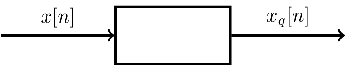
</figure>

Si suppone esistano $M$ livelli distinti, o gradini, allora sono necessari un numero $k=\log_{2}M$ di bit per ogni campione per poter codificare tutti i possibili livelli univocamente. Il numero di bit viene scelto arbitrariamente, e dipende dalle necessità del sistema; nell’ambito della telefonia, si considera $k=8$, mentre per tutti i sistemi audio si considera $k=16$. Il segnale di ingresso, generalmente un segnale in tensione, compreso in un intervallo $[-V,V]$, transita in questo dispositivo chiamato quantizzatore, trasformando la sequenza di valori in una sequenza di bit.

<figure>
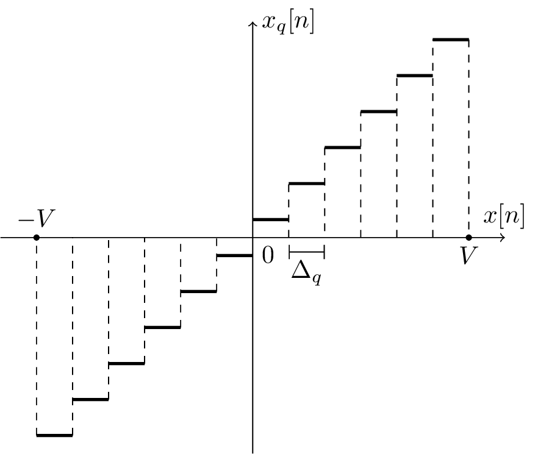
</figure>

Il primo parametro da analizzare è l’errore di quantizzazione, basato sulla precisione, quindi sul numero di livelli disponibili in cui codificare i valori della sequenza. Il campione quantizzato può assumere un numero discreto di valori, mentre il campione originale è una grandezza continua nell’intervallo di valori che può assumere. Per ogni campione l’errore della quantizzazione $e_q[n]$ si ottiene sottraendo dal valore campione originale $x[n]$ il valore del campione quantizzato $x_q[n]$: $$e_q[n]=x[n]-x_q[n]$$ Se i campioni sono uniformemente distribuiti sull’intervallo $[-V,V]$, allora l’errore di quantizzazione è una variabile aleatoria ed assume come valore massimo il valore del passo di quantizzazione $\Delta_q$: $$\Delta_q=\displaystyle\frac{2V}{M}$$ Per cui l’errore di quantizzazione ha una densità di probabilità anch’essa uniformemente distribuita su un intervallo di larghezza $\Delta_q$: $${P}_E(e)=\displaystyle\frac{1}{\Delta_q}\mathrm{rect}\left(\frac{e}{\Delta_q}\right)$$

La potenza della variabile aleatoria errore $E_q$ si calcola come: $$\begin{gathered}
    {P}_e=\displaystyle\frac{1}{\Delta_q}\int_{-\Delta_q /2}^{\Delta_q/2}e^2\mathrm{d}e=\frac{e^3}{3\Delta_q}\Bigg|_{-\Delta_q/2}^{\Delta_q/2}=\frac{\Delta_q^2}{12}
\end{gathered}$$ Poiché è uniformemente distribuita su un intervallo centrato nell’origine, ha valore medio nullo $\mu_e=0$, per cui la potenza coincide con la varianza del segnale. $$P_e=\displaystyle\frac{\Delta_q^2}{12}=\frac{V^2}{3M^2}=\sigma_e^2$$ Spesso invece di lavorare in una scala lineare, si lavora in scala logaritmica $\log_{10}$ o decibel $\mathrm{d}B$: $$\begin{gathered}
    \left(P_e\right)_{\mathrm{d}B}=10\log_{10}P_e=10\log_{10}\displaystyle\frac{V^2}{3}-10\log_{10}M^2=10\log_{10}\displaystyle\frac{V^2}{3}-10\log_{10}2^{2k}\\
    (P_e)_{\mathrm{d}B}=10\log_{10}\displaystyle\frac{V^2}{3}-2k\cancelto{3}{10\log_{10}2}=10\log_{10}\displaystyle\frac{V^2}{3}-6k
\end{gathered}$$ Per cui aumentando il numero di bit, ad ogni bit l’errore diminuisce di $6\,\mathrm{d}B$. Così come l’errore, anche il segnale originario si è supposto essere uniformemente distribuito sull’intervallo $[-V,V]$. Si calcola la sua potenza: $$\begin{gathered}
    P_X(x)=\displaystyle\frac{1}{2V}\mathrm{rect}\left(\frac{x}{2V}\right)\\
    P_x=\displaystyle\frac{1}{2V}\int_{-V}^{V}x^2\mathrm{d}x=\frac{x^3}{6V}\Bigg|_{-V}^V=\frac{V^2}{3}
\end{gathered}$$ Per cui la potenza dell’errore si esprime in decibel come: $$(P_e)_{\mathrm{d}B}=(P_x)_{\mathrm{d}B}-6k$$

In caso i livelli del quantizzatore non siano distribuiti uniformemente, ovvero ogni intervallo $\Delta_{qi}$ presenta una probabilità diversa $P_i$, la potenza si ottiene come il valore medio della potenza su tutti gli intervalli: $$\begin{gathered}
    P_e=\displaystyle\sum_{i=1}^N\frac{\Delta_{qi}^2}{12}P_i
\end{gathered}$$ In questa situazione si può utilizzare una codifica alla sorgente per diminuire il bitrate necessario per trasmettere il canale.

## Codifica di Sorgente

Il segnale telefonico si assume abbia una frequenza massima di $3.4\,\mathrm{kHz}$, ma per evitare problemi di aliasing si assume una banda di $4\,\mathrm{kHz}$, per cui la frequenza di campionamento è $f_c=8\,\mathrm{kHz}$, ed il tempo di campionamento è $T_c=125\,\mathrm{\mu s}$. Per tutti i segnali audio, telefonici, si considerano $8$ bit: $k=8$.

Quindi per trasmettere un unico canale telefonico, bisogna trasmettere un simbolo ogni $T_c$, composto da $k$ bit: $$k\cdot f_c=64\,\mathrm{kb/s}$$

In questo modo si forma il canale base, su cui su impostano le gerarchie numeriche, quando si inviano più canali insieme su una stessa linea. Tipicamente si effettua una codifica di sorgente, poiché se venisse permesso a più utenti di trasmettere simultaneamente sulla la stessa banda, si saturerebbe immediatamente.

Una codifica naturale associa ad ogni valore possibile di ingresso al quantizzatore una sequenza di $k$ bit, ma alcuni simboli non vengono trasmessi con la stessa frequenza, per cui la densità di probabilità dei valori dei campioni in entrata al quantizzatore non è uniformemente distribuita. Se è nota a priori è possibile creare una codifica alla sorgente associando i simboli più probabili a meno bit ed i simboli meno probabili a più bit. Per cui ad ogni simbolo viene associato un numero diverso di bit.

Quindi le parole di codice hanno un numero di bit massimo pari a $k$, e minimo definito dalla codifica a sorgente, in questo modo si diminuisce il bitrate richiesto da un singolo canale.

### Codifica di Huffman

Una delle codifiche più famose è la codifica di Huffman, e riduce il bitrate dato un insieme di $M$ simboli, ognuno associato ad una probabilità $P_i$, nota a priori. Per effettuare questa riduzione si genera un albero, partendo dai simboli a probabilità minore, posizionandoli come foglie dell’albero. L’organizzazione dell’albero è arbitraria, come la scelta delle foglie, e la scelta se due probabilità sono simili tra di loro. Una volta scelte le foglie, si accoppiano e si sommano le loro probabilità per creare il nodo genitore, avente quella probabilità. In seguito si inserisce alla stessa profondità di questi genitori i simboli aventi una probabilità simile. Si effettua lo stesso processo su questo livello, sommando le probabilità di due nodi per creare il loro genitore, inserendo ad ogni nuovo livello creato in questo modo i simboli che presentano una probabilità simile, fino ad arrivare alla radice dell’albero, avente probabilità $1$.

Si differenziano i nodi generati dall’inserimento di simboli, ed i nodi generati dalla somma di due probabilità. Scorrendo l’albero dalla radice, si assegna un $1$ andando verso sinistra, ed uno $0$ andando verso destra. Ogni volta che si raggiunge un nodo associato ad un simbolo, la sua sequenza di bit si ottiene dal cammino effettuato per raggiungerlo dalla radice dell’albero. Tutti i nodi associati a simboli sono delle foglie, per come è stato costruito l’albero, posti a diversi livelli di profondità in base alla loro probabilità.

In questo modo i simboli più probabili, essendo posizionati ad una profondità minore, sono associati ad una sequenza di bit di lunghezza minore. Si crea lo stesso albero in ricezione per associare univocamente una sequenza di bit ad un dato simbolo, poiché avendo lunghezza diversa possono essere confusi come preambolo di un’altra sequenza.

Per ottenere il bitrate di questa codifica bisogna moltiplicare la frequenza in cui vengono trasmessi i simboli $f_c$ per il numero medio di bit: $$\begin{gathered}
    f_c\cdot\displaystyle\sum_{i=1}^MP_ik_i
\end{gathered}$$ In questo tipo di codifica non vengono perse informazioni e viene diminuita la banda necessaria per trasmettere un unico segnale.

Un altro algoritmo senza perdita di informazioni è l’algoritmo PKZip, che rimuove da un file le correlazioni, ovvero corrispondenze o ridondanze, mantenendo tutto il contenuto informativo originale.

Invece codifiche che comportano una perdita di informazioni sono tutte le codifiche JPG, MPG, GIF, MP3. Nei sistemi audio si assume che si campiona ad una frequenza di $44.1\,$kHz, con due canali, e $16$ bit, per cui si trasmette con un bitrate di: $$\begin{gathered}
    1.4\mathrm{Mb/s}
\end{gathered}$$ Invece se viene codificato nel formato MP3, il bitrate, approssimativamente, viene diviso per $11$ poiché la codifica rimuove le frequenze più alte.

### Primo Teorema di Shannon

Questi algoritmi cercano di rimuovere il maggior numero di bit superflui da un dato segnale, ma è presente un limite inferiore, oltre al quale si perdono informazioni relative al segnale. Per il primo teorema di Shannon il numero minimo di bit necessari affinché non vengano perse informazioni contenute in un segnale, corrisponde all’entropia della sorgente $H$, così definita: $$\begin{gathered}
    H=\displaystyle\sum_{i=1}^MP_i\log_2\frac{1}{P_i}
\end{gathered}$$ Dove $P_i$ sono le probabilità dei singoli simboli. Rappresenta il numero minimo di bit per codificare una sorgente. Si definisce informazione o auto-informazione $I_i$ di un simbolo $i$: $$I_i=\log_2\displaystyle\frac{1}{P_i}$$ Quindi minore è la probabilità, maggiore è la sua informazione. Se un simbolo ha una probabilità certa, allora la sua informazione è nulla, poiché la sua misurazione non fornisce informazioni aggiuntive sulla natura del simbolo. Se due simboli sono indipendenti tra di loro, allora la loro informazione si somma: $$\begin{gathered}
    I_{ij}=\log_2\displaystyle\frac{1}{P_iP_j}=\log_2\displaystyle\frac{1}{P_i}+\log_2\displaystyle\frac{1}{P_j}=I_i+I_j
\end{gathered}$$ Quindi l’entropia può essere espressa come la somma della probabilità di un simbolo moltiplicata per la sua informazione: $$H=\displaystyle\sum_{i=1}^MP_iI_i$$ Se sono presenti solo due simboli, allora l’entropia del segnale si ottiene come: $$\begin{gathered}
    H=P\log_2\displaystyle\frac{1}{P}+(1-P)\log_2\frac{1}{1-P}
\end{gathered}$$ Questa descrizione dell’informazione è dovuta a John Tukey, inventore della “Fast Fourier Transform”, ha inventato la parola bit, acronimo di “Binary Digit”, mentre il concetto di entropia è legato a Claude Shannon, padre della teoria dell’informazione.

## Codifica di Linea in Banda Base

Un sistema di trasmissione è composto da una sorgente di informazione, e generalmente il sistema è in grado di trasmettere qualsiasi tipo di segnale, per cui si costruisce indipendentemente dal tipo di sorgente del sistema. Se il segnale generato dalla sorgente è analogico, allora comprende un ADC per convertire il segnale in una sequenza di campioni, poi quantizzati da un quantizzatore montato in serie. Questa codifica viene effettuata alla sorgente ovvero a monte del sistema. In seguito si introduce una codifica di canale, che applica una procedura opposta rispetto alla codifica di sorgente, poiché introduce nuovi bit nel segnale trasmesso, per cercare di minimizzare l’errore di trasmissione. Questa codifica si chiama il “Forward Error Correction” o FEC, una delle più famose è il Reed-Solomon. Questi bit ridondanti permettono di correggere il segnale in caso sia corrotto da rumori presenti nel canale di trasmissione.

Per mandare fisicamente il segnale in trasmissione si applica una codifica di linea chiamata anche modulazione. Il segnale fisico trasmesso è analogico, per cui è presente un supporto fisico su cui viene trasmessa la sequenza di bit, tramite un trasmettitore fisico, che opera come un trasduttore, trasformando il segnale corrente in entrata in un segnale fisico e viceversa. Il canale di trasmissione può essere l’aria in caso di sistemi wireless, la fibra ottica nei sistemi in fibra, cavi ethernet per sistemi LAN, etc. In generale il canale viene definito da due oggetti, la sua funzione di trasferimento $H(f)$ e la sua banda $B$, poiché quasi tutti i canali attenuano le alte frequenza, ovvero presentano una limitazione in banda, questo valore $B$ rappresenta la frequenza massima gestibile dal canale. Questo sistema si chiama banda base:

<figure>
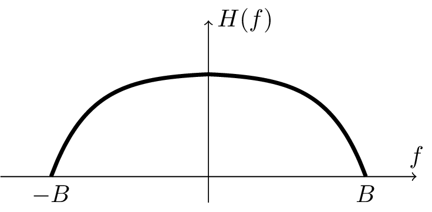
</figure>

Questa funzione di trasferimento è simmetrica, e generalmente si considera sia un filtro passa basso ideale, ovvero una finestra, anche se non rappresenta pienamente il suo comportamento reale: $$H(f)=\displaystyle\mathrm{rect}\left(\frac{f}{2B}\right)$$ Su questo canale si aggiunge il rumore AWGN $n(t)$.

Questo segnale raggiunge poi il ricevitore che deve demodulare il segnale ricevuto. Prima di attuare quest’operazione filtra il segnale sulla stessa banda del canale per eliminare i contributi fuori banda del rumore. La potenza del rumore, e quindi la sua varianza, si calcola sulla banda del canale: $$\begin{gathered}
    P_n=\sigma_n^2=\displaystyle\int_{-\infty}^{+\infty}G(f)\cdot H(f)\mathrm{d}f=\int_{-B}^B\frac{N_0}{2}\mathrm{d}f=BN_0
\end{gathered}$$ Per cui maggiore è la banda del canale, maggiore è la varianza del rumore.

Dopo che viene filtrato si applica una demodulazione del segnale, per ottenere una sequenza di bit. Questo viene ottenuto campionando il segnale ricevuto utilizzando come frequenza di campionamento il bitrate del sistema, noto. In seguito i campioni vengono confrontati con una soglia, per verificare se rappresentano uno zero o un uno logico. Dopo aver ottenuto una sequenza di bit, si rimuovono i bit aggiungi nella codifica di canale. Infine si applica una decodifica di sorgente ed il segnale così ricavato viene inviato al destinatario.

Tutti i sistemi di trasmissione vengono rappresentati dalla figura ad occhio, ottenuta sovrapponendo sullo stesso intervallo bit trasmessi a frequenze diverse sullo stesso canale. In questo modo si può verificare se il canale provoca una perdita di informazione, quando l’“occhio” comincia a chiudersi. Questa attenuazione può provocare errori nel caso porti il segnale ad assumere valori minori della soglia, cambiando il valore del bit associato. Nella codifica return to zero, ogni volta che viene trasmesso un uno, il valore del segnale ritorna basso, indipendentemente se viene seguito da un altro uno. Altrimenti il segnale può rimanere alto in caso siano presenti più uni di fila. Questo dipende da sistema a sistema, ed in entrambi i casi si possono verificare dal diagramma ad occhio le stesse caratteristiche del sistema. Poiché se l’occhio si chiude il segnale non viene trasmesso correttamente attraverso il canale:

<figure>
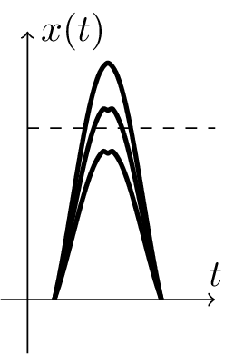
</figure>

Quando vengono trasmessi segnali su sistemi in fibra ottica, è più efficiente inviare impulsi di luce accesa o spenta, chiamata codifica unipolare, ma in caso si parli di impulsi di corrente, bisogna diminuire la potenza media utilizzata dal trasmettitore. Ciò viene effettuato utilizzando come zero logico, invece di un segnale nullo, un impulso di corrente nel verso opposto, in modo che il valor medio sia vicino allo zero, consumando meno corrente. Questo tipo di codifica viene chiamata bipolare:

<figure>

  

<figcaption>Codifica di Bit</figcaption>
</figure>

Un segnale associato a zero ed uno rappresenta il modello più semplice per trasmettere un segnale, ma questo non è efficiente, poiché è anche il metodo più lento per trasmettere informazione. Quindi i bit vengono raggruppati in codici formati da un certo numero di bit consecutivi, chiamati simboli. Si genera così un alfabeto con un certo numero di simboli possibili. In questo modo è possibile aumentare notevolmente la capacità di trasmissione del sistema, mantenendo invariata la velocità di trasmissione di un singolo simbolo. Per trasmettere questo tipo di alfabeto sorgente sono necessari lo stesso numero di livelli possibili per il segnale trasmesso sul canale, inoltre bisogna poterli distinguere in ricezione, quindi all’aumentare del numero di simboli nell’alfabeto in sorgente, si aumenta la probabilità di errore in ricezione. Per poter distinguere $M$ simboli diversi sono necessari $M-1$ valori di soglia. Costruendo il diagramma ad occhio si osservano vari livelli, che rappresentano i diversi simboli trasmessi sul canale. Questo tipo di codifica si chiama “Pulse Amplitude Modulation” PAM, poiché modifica solamente l’ampiezza dell’impulso associato ad un simbolo. Se il numero di simboli $M$ corrisponde al numero di intervalli $\Delta_q$ allora si parla di una codifica PCM “Pulse Code Modulation”, dove i valori dell’alfabeto rappresentano i valori quantizzati e confrontati con una soglia dei campioni del segnale originale $x(t)$, a differenza della PAM dove il numero dei simboli viene scelto arbitrariamente.

### Codifica PAM

Invece di effettuare una codifica binaria, si applica una codifica M-aria, utilizzando $M$ simboli diversi per aumentare la banda del canale.

Si suppone si disponga di un alfabeto di $M$ simboli $c_m$: $$\begin{gathered}
    c_m:=\biggl\{c_1,\cdots,c_M\biggr\}
\end{gathered}$$ Inoltre sia dato il tempo di simbolo $T_s$, il tempo necessario per trasmettere un singolo simbolo, il suo inverso si indica con $R_s$ e si chiama frequenza di simbolo o baud. Se $M=2$, il baud è il bitrate $R_b$. Altrimenti il bitrate si calcola moltiplicando il baud per il numero di bit associati ad ogni simbolo: $$\begin{gathered}
    R_b=R_s\log_{2}M
\end{gathered}$$

Il modulatore data una sequenza di questi simboli, deve poterla trasformare in un segnale $x(t)$ in grado di essere trasmesso dal sistema. Questo segnale può essere espresso come: $$\begin{gathered}
    x(t)=\displaystyle\sum_{n=-\infty}^{+\infty}s[n]g(t-nT_s)
\end{gathered}$$ Dove $s[n]$ è uno dei possibili simboli, mentre $g(t)$ è una funzione chiamata forma d’onda. Nella codifica return to zero, la funzione $g(t)$ è un impulso base, ed in generale deve avere una durata inferiore al tempo di simbolo, altrimenti sarebbe presente un’interferenza intersimbolica. Assume valore $1$ per $t=0$, mentre per tutti i tempi multipli del tempo di simbolo assume valori nulli: $$g(t)=\begin{cases}
        1&t=0\\
        0&t=kT_s
    \end{cases}$$ Deve essere massimo nel tempo in cui viene campionato, mentre deve valere zero per non sovrapporsi su ogni altro campione. Date queste restrizioni è possibili utilizzare diverse funzioni come impulso base, anche un finestra di base $T_s$ soddisferebbe queste condizioni. Ma la trasformata di una finestra è un seno cardinale, segnale non limitato in frequenza per cui è un sistema troppo costoso in banda.

Quindi come impulso base si usa un seno cardinale: $$\begin{gathered}
    g(t)=\mathrm{sinc}\displaystyle\left(\frac{t}{T_s}\right)
\end{gathered}$$ Poiché quando viene trasformato si ottiene una finestra, occupando la minor banda possibile: $$\begin{gathered}
    G(f)=T_s\mathrm{rect}(T_sf)
\end{gathered}$$ Data la banda del canale $B$, per non perdere informazioni sul segnale originario bisogna imporre semplicemente $B=1/2T_s$. Fissata la banda del canale si può calcolare la massima velocità di trasmissione di simbolo, il baud $R_s$: $1/2T_s\leq B\implies R_s\leq2B$.

<figure>

</figure>

Esistono una serie di funzioni standardizzate chiamate impulsi di Nyquist, a coseno rialzato, per non dover generare un segnale sull’intero intervallo $[-\infty,+\infty]$ come per il seno cardinale. Diminuendo l’intervallo nel tempo viene aumentata però la banda. Questo tipo di funzioni trovano un compromesso tra l’intervallo richiesto per essere generati nel tempo, e la dimensione della banda in frequenza. Il seno cardinale può essere chiamato anche impulso di Nyquist a roll off zero. L’impulso di Nyquist in frequenza segue una finestra, ma invece di cambiare istantaneamente da uno a zero, diminuisce gradualmente, smussando gli angoli. In questo modo si aumenta la banda in frequenza, ma nel tempo il segnale associato si attenua più velocemente, rispetto ad un seno cardinale. Fino ad un impulso di Nyquist a roll off uno, dove la banda in frequenza è di $1/T_s$.

<figure>
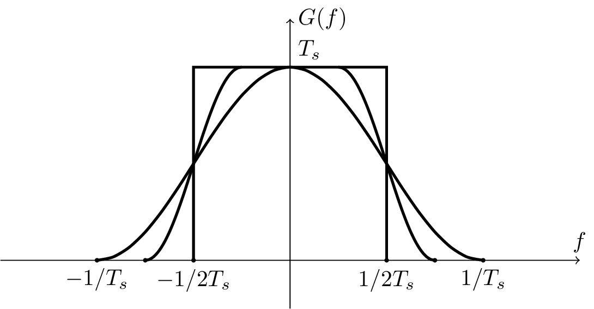
</figure>

Questo parametro roll off determina l’occupazione in banda e la durata dell’impulso nel tempo. Vengono usate solo funzioni di Nyquist come impulsi base in telecomunicazioni.

### Effetto del Rumore sul Canale

Si vuole determinare l’effetto del rumore sul segnale trasmesso, per semplicità si analizza un caso di un alfabeto binario, composto quindi da due soli simboli: $$\begin{gathered}
    c_m:=\biggl\{c_1,c_2\biggr\}
\end{gathered}$$

<figure>
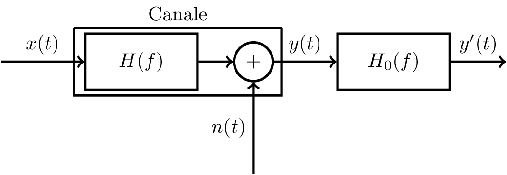
</figure>

Si considera un segnale $x(t)$ in entrata al canale, e si misura in uscita un segnale $y(t)$, dopo essere stato filtrato dalla funzione di trasferimento del canale $H(f)$ e dopo essere stato aggiunto il rumore $n(t)$: $$\begin{gathered}
    x(t)=\displaystyle\sum_{n=-\infty}^{+\infty}s[n]g(t-nT_s)\\
    y(t)=x(t)*h(t)+n(t)
\end{gathered}$$ Si suppone per semplicità $x(t)*h(t)=x(t)$: $$\begin{gathered}
    y(t)=x(t)+n(t)
\end{gathered}$$ Poiché il rumore agisce su tutte le frequenze, mentre il segnale è limitato in banda, si inserisce un altro filtro a valle, di funzione di trasferimento $H_0(f)$, per eliminare i contributi fuori banda del rumore, prima di ricevere il segnale $y(t)$. In questo modo è presente solo nella banda $[-B,B]$ ed ha una varianza $BN_0$. Si vuole calcolare ora la probabilità di errore di trasmissione dovuto al rumore $n(t)$. Da questo processo si estrae la variabile aleatoria $Y$, dato un istante di tempo $t_0$: $$\begin{gathered}
    y(t_0)=x(t_0)+n(t_0)\\
    y=x+n=\begin{cases}
        c_1+n\\
        c_2+n
    \end{cases}
\end{gathered}$$ Poiché sono presenti solo due simboli nell’alfabeto. Il rumore ha statistica gaussiana, di densità di probabilità: $$\begin{gathered}
    P_N(n)=\displaystyle\frac{1}{\sqrt{2\pi}\sigma_n}e^{-\frac{n^2}{2\sigma_n^2}}
\end{gathered}$$ Per cui la densità della variabile aleatoria $Y$, legata linearmente al rumore $N$ si ottiene come: $$\begin{gathered}
    P_Y(y)=\displaystyle\frac{1}{\sqrt{2\pi}\sigma_n}e^{-\frac{(y-c_{i})^2}{2\sigma_n^2}}    
\end{gathered}$$ Il valor medio della variabile $Y$ assume il valore del simbolo campionato $c_1$ o $c_2$. Sia dato un valore di soglia $\overline{c}$, allora la probabilità di errore nei due casi è data dall’area sottesa dalla curva della densità di probabilità di $y$ che supera il valore $\overline{y}=\overline{c}+n$. Si associa a $c_2$ il livello alto, mentre a $c_1$ il livello basso:

<figure>
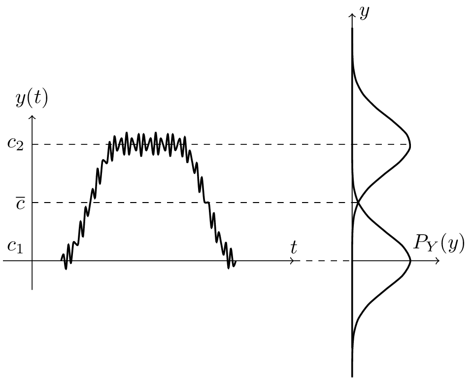
</figure>

Si calcola quindi la probabilità che il rumore sia tale da rendere il segnale alto $c_2$ sotto soglia: $$\begin{gathered}
    \Pr(y<\overline{c}|c_2)=\displaystyle\int_{-\infty}^{\overline{c}}P_Y(y)\mathrm{d}y=\int_{-\infty}^{\overline{c}}\frac{1}{\sqrt{2\pi}\sigma_n}e^{-\frac{(y-c_{2})^2}{2\sigma_n^2}}\mathrm{d}y
\end{gathered}$$ Si applica la sostituzione $t=\displaystyle\frac{c_2-y}{\sqrt{2}\sigma_n}$, l’integrale diventa quindi: $$\begin{gathered}
    \displaystyle\int_{+\infty}^{\frac{c_2-\overline{c}}{\sqrt2\sigma_n}}\frac{-\sqrt2\sigma_n}{\sqrt{2\pi}\sigma_n}e^{-t^2}\mathrm{d}t=\int_{\frac{c_2-\overline{c}}{\sqrt2\sigma_n}}^{+\infty}\frac{e^{-t^2}}{\sqrt\pi}\mathrm{d}t
\end{gathered}$$ Questo integrale si può esprimere rispetto alla funzione di errore complementare $\mathrm{erfc}(x)$, oppure rispetto alla funzione $Q(x)$: $$\begin{gathered}
    \mathrm{erfc}(x)=\displaystyle\int_{x}^{+\infty}\frac{2}{\sqrt\pi}e^{-t^2}{\mathrm{d}t}\tag{\stepcounter{equation}\theequation}\\
    Q(x)=\displaystyle\frac{1}{2}\mathrm{erfc}\left(\frac{x}{\sqrt2}\right)\tag{\stepcounter{equation}\theequation}\\
    \Pr(y<\overline{c}|c_2)=\displaystyle\frac{1}{2}\mathrm{erfc}\left(\frac{c_2-\overline{c}}{\sqrt{2}\sigma_n}\right)=Q\left(\frac{c_2-\overline{c}}{\sigma_n}\right)
\end{gathered}$$ Attuando un processo analogo si ottiene la probabilità di misurare un valore sopra la soglia, avendo trasmesso $c_1$: $$\begin{gathered}
    P_e(y>\overline{c}|c_1)=\int_{\overline{c}}^{+\infty}\frac{1}{\sqrt{2\pi}\sigma_n}e^{-\frac{(y-c_1)^2}{2\sigma_n^2}}\mathrm{d}y=\frac{1}{2}\mathrm{erfc}\left(\frac{\overline{c}-c_1}{\sqrt{2}\sigma_n}\right)=Q\left(\frac{\overline{c}-c_1}{\sigma_n}\right)
\end{gathered}$$

In telecomunicazioni si misura il BER “Bit Error Rate”, quantifica quanto spesso vengono scambiati dei bit durante una trasmissione. Se la probabilità di entrambi i simboli $c_1$ e $c_2$ è uguale, il BER corrisponde alla media tra le due percentuali di errore: $$\mathrm{BER}=\displaystyle\frac{1}{2}Q\left(\frac{c_2-\overline{c}}{\sigma_n}\right)+\frac{1}{2}Q\left(\frac{\overline{c}-c_1}{\sigma_n}\right)$$ In generale il BER si calcola come la somma tra gli errori di trasmissione $P_E(c_i)$ di un simbolo $c_i$ moltiplicato per la sua probabilità di errore $P_i$: $$\mathrm{BER}=\displaystyle\sum_{i=1}^MP_{i}P_E(c_i)$$

Quando gli argomenti di entrambe le $\mathrm{erfc}(x)$ sono uguali allora il BER è minimo, per cui la soglia corrisponde al valore intermedio tra i due valori $c_1$ e $c_2$: $$\overline{c}=\displaystyle\frac{c_1+c_2}{2}$$ Nella realtà la statistica del rumore è diversa per i due valori, e generalmente il rumore è più presente sul valore alto, per cui nella realtà il valore di soglia è più vicino al valore basso $c_1$. Si indica con $d$ la distanza tra i due livelli, per cui sostituendo la precedentemente relazione, il BER si ottiene come: $$\mathrm{BER}=Q\left(\frac{c_2-c_1}{2\sigma_n}\right)=Q\left(\frac{d}{2\sqrt{BN_0}}\right)$$ Generalmente con un BER nell’ordine di grandezza di $10^{-9}$ si considera un errore nullo, ciò viene ottenuto quando l’argomento della funzione $Q$ corrisponde a $6$. La probabilità di errore diminuisce maggiore è la distanza tra i due valori, ed è inversamente proporzionale alla banda del canale.

### Filtro Adattato

Invece di utilizzare un filtro $H_0(f)$ passa basso ideale per rimuovere il contributo fuori banda del rumore, è possibile utilizzare un filtro adattato per migliorare le prestazioni. Per determinare la sua funzione di trasferimento si considera la sua risposta impulsiva $h_0(t)$ con il segnale ricevuto: $$y'(t)=y(t)*h_0(t)=\displaystyle\left[\sum_{n=-\infty}^{+\infty}c_ng(t-nt_s)+n(t)\right]*h_0(t)$$ Si suppone di trasmettere un unico simbolo, poiché la statistica ottenuta da questo è costante per ogni altro simbolo: $$y'(t)=c_ng(t)*h_0(t)+n(t)*h_0(t)$$ Si chiama il primo termine il segnale utile, mentre il secondo termine corrisponde al rumore filtrato in frequenza. Si calcola il segnale utile nel dominio della frequenza: $$\begin{gathered}
    Y(f)=c_nG(f)H_0(f)\\
    y'(t)=c_n\displaystyle\int_{-\infty}^{+\infty}G(f)H_0(f)e^{2i\pi ft}\mathrm{d}f
\end{gathered}$$ Campionando l’uscita in $t=0$, il campione risulta essere: $$\begin{gathered}
    y'(0)=c_n\displaystyle\int_{-\infty}^{+\infty}G(f)H_0(f)\mathrm{d}f
\end{gathered}$$ La densità spettrale di potenza del rumore, poiché è un segnale aleatorio si calcola mediante: $$\begin{gathered}
    G_n(f)=\displaystyle\frac{N_0}{2}|H_0(f)|^2
\end{gathered}$$ La sua potenza si ottiene integrando su tutte le frequenza la sua densità spettrale: $$\begin{gathered}
    P_n=\displaystyle\int_{-\infty}^{+\infty}\frac{N_0}{2}|H_0(f)|^2\mathrm{d}f
\end{gathered}$$ Il rapporto potenza segnale rumore è definito come il rapporto tra la potenza utile del segnale, identificata dalla potenza ricevuta $P_R$, e la potenza del rumore: $$\begin{gathered}
    P_R=|y'(0)|^2\\
    \mathrm{SNR}=\displaystyle\frac{P_R}{P_n}=\frac{c_n^2\left|\displaystyle\int_{-\infty}^{+\infty}G(f)H_0(f)\mathrm{d}f\right|^2}{\displaystyle\int_{-\infty}^{+\infty}\frac{N_0}{2}|H_0(f)|^2\mathrm{d}f}
\end{gathered}$$ Si applica la disuguaglianza di Schwarz, e si ottiene la seguente relazione: $$\begin{gathered}
    \displaystyle\left|\int f(x)g(x)\mathrm{d}x\right|^2\leq \int |f(x)|^2\mathrm{d}x\int|g(x)|^2\mathrm{d}x\\
    \displaystyle\frac{c_n^2\left|\displaystyle\int_{-\infty}^{+\infty}G(f)H_0(f)\mathrm{d}f\right|^2}{\displaystyle\int_{-\infty}^{+\infty}\frac{N_0}{2}|H_0(f)|^2\mathrm{d}f}\leq \frac{c_n^2\displaystyle\int_{-\infty}^{+\infty}|G(f)|^2\mathrm{d}f\displaystyle\int_{-\infty}^{+\infty}|H_0(f)|^2\mathrm{d}f}{\displaystyle\frac{N_0}{2}\displaystyle\int_{-\infty}^{+\infty}|H_0(f)|^2\mathrm{d}f}
\end{gathered}$$ I due termini sono uguali quando $H_0(f)=G^*(f)$. Per cui per avere un rapporto segnale rumore il più alto possibile, il filtro adattato deve essere la trasformata di Fourier dell’impulso in banda base. Per cui ha una risposta impulsiva: $h_0(t)=g^*(-t)$, poiché l’impulso in banda base è sempre reale, si ottiene la seguente espressione per la risposta impulsiva del filtro adattato: $$h_0(t)=g(-t)$$ Il rapporto segnale rumore corrisponde quindi a: $$\mathrm{SNR}=\displaystyle\frac{c_n^2\displaystyle\int_{-\infty}^{+\infty}|G(f)|^2\mathrm{d}f\displaystyle\int_{-\infty}^{+\infty}|G^*(f)|^2\mathrm{d}f}{\displaystyle\frac{N_0}{2}\displaystyle\int_{-\infty}^{+\infty}|G^*(f)|^2\mathrm{d}f}=\frac{2c_n^2\displaystyle\int_{-\infty}^{+\infty}|G(f)|^2\mathrm{d}f}{N_0}$$ Si può riscrivere rispetto all’energia dell’impulso in banda base: $$\begin{gathered}
    E_g=\displaystyle\int_{-\infty}^{+\infty}|G(f)|^2\mathrm{d}f=\displaystyle\int_{-\infty}^{+\infty}|g(t)|^2\mathrm{d}t\\
    \mathrm{SNR}=\displaystyle\frac{2c_n^2E_g}{N_0}\tag{\stepcounter{equation}\theequation}
\end{gathered}$$

Si calcola ora il BER nel caso di un filtro adattato, inserendo il rapporto segnale-rumore nell’argomento della funzione di errore $Q$: $$\mathrm{BER}=Q\left(\displaystyle\frac{\sqrt{\mathrm{SNR}_2}-\sqrt{\mathrm{SNR}_1}}{2}\right)=Q\left(\frac{c_2-c_1}{2}\sqrt\frac{2E_g}{N_0}\right)=Q\left((c_2-c_1)\sqrt\frac{E_g}{2N_0}\right)$$

Nel caso unipolare si ha che il valore basso coincide con $0$: $c_1=0$, per cui il BER diventa: $$\mathrm{BER}=Q\left(\displaystyle c_2\sqrt{\frac{E_g}{2N_0}}\right)$$ Mentre nel caso binario bipolare, dove $c_1=-c_2$, si ha un BER inferiore: $$\mathrm{BER}=Q\left(\displaystyle 2c_2\sqrt{\frac{E_g}{2N_0}}\right)$$ Generalmente poiché questa relazione dipende dall’energia dell’impulso, si considera l’energia di un singolo bit, la media tra l’energia dei due bit uno e zero logico. Nel caso unipolare l’energia del bit $E_b$ è quindi: $$E_b=\displaystyle\frac{c_2^2E_g+0}{2}$$ Ed il suo BER si ottiene come: $$\mathrm{BER}=Q\left(\displaystyle\sqrt{\frac{E_b}{N_0}}\right)$$ Mentre nel caso binario bipolare si ha un’energia di bit ed un BER: $$\begin{gathered}
    E_b=\displaystyle\frac{c_2^2E_g+c_1^2E_g}{2}\\
    \mathrm{BER}=Q\left(\displaystyle\sqrt{\frac{2E_b}{N_0}}\right)
\end{gathered}$$ Per rappresentare le prestazioni di un sistema di telecomunicazioni si indica l’andamento del BER rispetto alla potenza media dei bit:

<figure>

 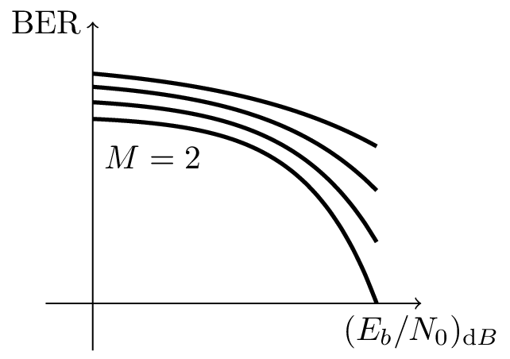

</figure>

All’aumentare dei simboli $M$ da trasmettere le curve salgono, per cui viene rappresentata una famiglia di curve dello stesso sistema, rispetto ad alfabeti di simboli diversi. Generalmente l’energia si esprime in decibel $\mathrm{d}B$: $$x_{\mathrm{d}B}=10\log_{10}x$$

La potenza media misurata dal ricevitore dipende anch’essa dalle potenza di bit: $$\begin{gathered}
    P_R=\displaystyle\frac{E_s}{T_s}=\frac{E_b\log_2M}{T_b\log_2M}=\frac{E_b}{T_b}=\left(\frac{E_b}{N_0}\right)_{\mathrm{d}B}\frac{N_0}{T_b}
\end{gathered}$$ Per trasferire questa potenza è necessario considerare il fattore di perdita $L\geq 1$, per cui bisogna inviare una potenza maggiore della potenza ricevuta: $$\begin{gathered}
    P_T=LP_R
\end{gathered}$$ In generale in telecomunicazioni si aumenta la potenza, e le grandezze richieste in generale, per allontanarsi dal valore di soglia, considerando un certo margine di tolleranza, e quindi mantenere le specifiche richieste.

## Codifica di Linea in Banda Passante

Tutti i sistemi wireless utilizzano una portante $f_0$.Il segnale viene modulato da un coseno nel tempo, quindi in frequenza viene traslato di un fattore $\pm f_0$, la sua funzione di trasferimento è quindi formata da due filtri passa bassi centrati in $\pm f_0$, di larghezza $B$:

<figure>
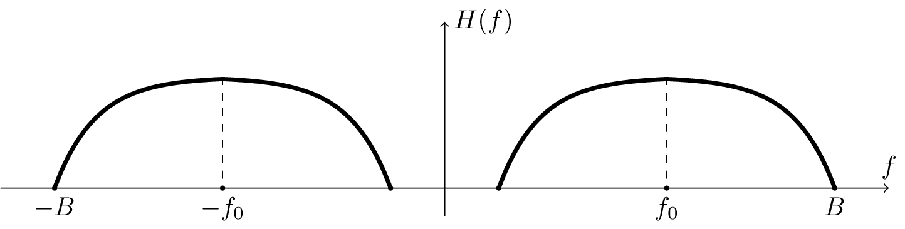
</figure>

Mentre i sistemi di telecomunicazione a fibra ottica possono essere considerati a banda base, i sistemi wireless vengono modulati, e lavorano sulle frequenze ISM “Industrial Scientific and Medical” le bande non licenziate da nessun ente statale o privato, oppure in caso di telefonia mobile si lavora su bande licenziate che variano da paese a paese.

### Modulazione ASK

Il segnale $x(t)$ viene modulato da un oscillatore locale, montato a monte del canale: $$\begin{gathered}
    z(t)=x(t)\cdot\cos(2\pi f_0t)
\end{gathered}$$

Per studiarne le caratteristiche si considera un unico simbolo, dall’alfabeto sorgente in entrata: $$\begin{gathered}
    x(t)=c_ng(t)\\
    z(t)=c_ng(t)\cos(2\pi f_0t)\\
    Z(f)=\displaystyle\frac{c_n}{2}\left(G(f-f_0)+G(f+f_0)\right)
\end{gathered}$$ In frequenza sono presenti due copie dello spettro dell’impulso base, di ampiezza dimezzata. Questa tecnica varia l’impulso del segnale e risulta in una risposta in funzione del tempo simile:

<figure>
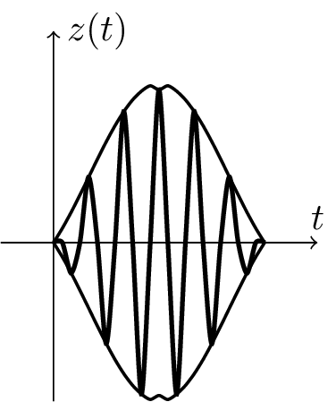
</figure>

Si chiama ASK “Amplitude Shift Keying”, dove l’oscillazione dell’ampiezza dipende dalla frequenza del coseno $f_0$. Poiché le due repliche in frequenza non sono centrate nell’origine, bisogna verificare che il segnale modulato rientri all’interno della banda. Viene sprecata banda poiché lo stesso segnale viene ripetuto sulla stessa banda, effettivamente dimezzando la banda utile del sistema, dato che la frequenza massima deve essere minore di metà della banda. Per cui il baud risulta essere: $$\begin{gathered}
    f_{\max}=\displaystyle\frac{1}{2T_s}=\frac{R_s}{2}\leq\frac{B}{2}\\
    R_s\leq B\tag{\stepcounter{equation}\theequation}
\end{gathered}$$

In ricezione bisogna poi togliere questa modulazione, per ora si trascura il rumore nel canale. Per ritornare ad un segnale in banda base si moltiplica l’uscita del canale $y(t)$ per un altro coseno alla stessa frequenza $f_0$: $$\begin{gathered}
    y(t)=z(t)\cdot2\cos(2\pi f_0t)=x(t)\cdot2\cos^2(2\pi f_0t)=x(t)\left[1+\cos(4\pi f_0t)\right]\\
    x(t)+x(t)\cdot\cos(4\pi f_0t)\\
    Y(f)=X(f)+\displaystyle\frac{1}{2}X(f-2f_0)+\frac{1}{2}X(f+2f_0)
\end{gathered}$$ In seguito viene filtrato da un filtro passa basso $H_{\mathrm{LP}}(f)$, per eliminare le frequenze centrate in $\pm2f_0$:

<figure>

</figure>

Moltiplicando per un coseno alla stessa frequenza si applica una demodulazione omodina, invece se fosse a frequenza diversa sarebbe una demodulazione eterodina, quest’ultima restituisce un segnale ad una frequenza poco minore.

Il problema di questa modulazione consiste nello spreco di banda effettuato, poiché lo stesso segnale viene copiato due volte sulla stessa banda, risultando in un baud dimezzato rispetto ad una modulazione in banda base. La codifica ASK quindi non è ottimale.

### Modulazione QAM

Questo problema si risolve comunemente applicando una modulazione in fase in quadratura QAM “Quadrature Amplitude Modulation”. Si considerano due segnali in uscita dal modulatore $x_1(t)$ e $x_2(t)$. Il primo viene moltiplicato per un coseno, mentre il secondo per un seno, poi vengono sommati per generare il segnale $z(t)$: $$\begin{gathered}
    z(t)=x_1(t)\cdot\cos(2\pi f_0t)+x_2(t)\cdot\sin(2\pi f_0t)\\
    %Z(f)=\displaystyle\frac{1}{2}\left(X_1(f-f_0)+X_2(f-f_0)\right)+\frac{1}{2}\left(X_1(f+f_0)-X_2(f+f_0)\right)\\
    %X_1(f)=X(f)=X_2(f)\\
    %Z(f)=\displaystyle\frac{X(f-f_0)+X(f-f_0)}{2}
\end{gathered}$$ Per demodulare il segnale si moltiplica divide un due parti e si moltiplica uno per un coseno, e l’altro per un seno alla stessa frequenza $f_0$: $$\begin{gathered}
    y_1(t)=z(t)\cdot2\cos(2\pi f_0t)\\
    2x_1(t)\cos^2(2\pi f_0t)+2x_2(t)\sin(2\pi f_0t)\cos(2\pi f_0t)\\
    x_1(t)+x_1(t)\cos(4\pi f_0t)+x_2(t)\sin(4\pi f_0t)
\end{gathered}$$ Passando attraverso un filtro passa basso, si rimuovono le frequenze centrate in $\pm 2f_0$, e si ottiene il segnale $x_1(t)$ in uscita. Analogamente per il seno, si ottiene: $$\begin{gathered}
    y_2(t)=z(t)\cdot2\sin(2\pi f_0t)\\
    2x_1(t)\cos(2\pi f_0t)\sin(2\pi f_0t)+2x_2(t)\sin^2(2\pi f_0t)\\
    x_1(t)\sin(4\pi f_0t)+x_2(t)+x_2(t)\cos(4\pi f_0t)
\end{gathered}$$ Se viene inserito in un filtro passa basso, restituisce il segnale $x_2(t)$.

Data l’espressione del baud: $$\begin{gathered}
    R_b=R_s\log_2M\leq B\log_2M
\end{gathered}$$ Poiché uno stesso segnale viene diviso in due parti $x_1(t)$ e $x_2(t)$, è possibile raddoppiare la velocità di trasmissione di uno stesso simbolo, inviando due bit contemporaneamente. In questo modo è possibile trasmettere un segnale senza aver perso capacità di canale, poiché trasmette come trasmetterebbe in banda base. Il segnale $x_1(t)$ in uscita è un fase, mentre il segnale $x_2(t)$ si dice in quadratura di fase. Per cui rappresentano due funzioni ortogonali tra di loro, e quindi non interferiscono l’una dall’altra. Dal contenuto informativo di questi due segnali è possibile identificare univocamente un unico simbolo $c_n$. Poiché nella codifica QAM viene identificato in un piano dalle coordinate $(a_n,b_n)$, codificate la prima nel segnale in fase $x_1(t)$ e la seconda nel segnale in quadratura $x_2(t)$.

Per osservare in che modo funziona, si considera il piano complesso, con un alfabeto di quattro simboli $M=4$. I numeri possono assumere parte reale ed immaginaria pari a $\pm1$. In questo modo si hanno quattro possibili combinazioni che individuano i quattro possibili simboli dell’alfabeto $c_m$. Dalla rappresentazione polare di un numero complesso si ottiene: $$\begin{gathered}
    I=\Re\left\{e^{2i\pi f_0t}\right\}=\cos(2\pi f_0t)\\
    Q=\Im\left\{e^{2i\pi f_0t}\right\}=\sin(2\pi f_0t)\\
\end{gathered}$$ La parte reale di questo numero complesso rappresenta il segnale in fase, mentre la parte immaginaria corrisponde al segnale in quadratura. Per cui i due segnali rappresentano due sistemi di coordinate ortogonali tra di loro.

Sul piano complesso si costruisce una “costellazione” 4 QAM:

<figure>

 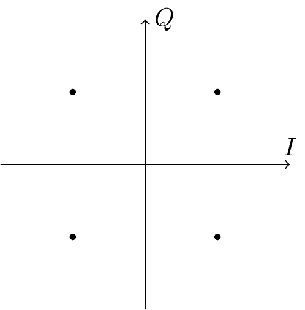

</figure>

Nella realtà la sequenza di bit $x(t)$ viene divisa in due sequenza $x_1(t)$ e $x_2(t)$: $$\begin{gathered}
    x_1(t)=\displaystyle\sum_{n=-\infty}^{+\infty}a_ng(t-nT_s)\\
    x_2(t)=\displaystyle\sum_{n=-\infty}^{+\infty}b_ng(t-nT_s)
\end{gathered}$$ Dove $a_n$ e $b_n$ assumono valori $\pm1$. Per capire quale a quale simbolo corrisponde è necessario conoscere simultaneamente il valore di $a_n$ e $b_n$, per individuare il suo punto nella costellazione. Da questo punto si identifica il simbolo associato: $(a_n,b_n)\to c_n$.

Per mantenere invariata la distanza minima tra due simboli è possibile scalare i valori di un fattore $1/\sqrt2$. In questo modo assumono valore compreso nell’intervallo $\pm1/\sqrt2$. In generale il segnale ricevuto non coincide esattamente con il punto nella costellazione, ma si trova nello stesso quadrante. In caso il rumore sia eccessivo, può essere spostato negli altri quadranti della costellazione, generando un errore in ricezione. Non si misura il BER poiché si ha una base binaria, e poiché è necessario considerare l’errore su entrambi i valori simultaneamente. Quando sono presenti più bit, si crea un quadrato di lato pari al numero di bit, contenente $M$ punti sul piano associati ad altrettanti simboli. In questo caso si considera un intorno del numero complesso per determinare se il segnale corrisponde a quel simbolo, questo intorno diminuisce all’aumentare dei simboli dell’alfabeto. Per cui una grandezza importante da considerare è la distanza minima tra due simboli nella costellazione, per diminuire l’errore di ricadere in una zona associata ad un altro simbolo.

La frequenza dei due oscillatori locali dovrebbe essere identica, ma nella realtà non è facilmente realizzabile, per cui generalmente il secondo oscillatore ricava la frequenza dal segnale $y(t)$ in entrata. Mentre è più complesso adoperare un aggancio in fase del segnale, poiché quando viene inserito nel sistema non è nota a priori la sua fase. Conoscere la fase del segnale è un passaggio cruciale, poiché se il segnale non è né in fase né in quadratura di fase, si perde tutto il contenuto informativo della sinusoide. Il segnale $x_1(t)$ corrisponde al segnale in fase, mentre $x_2(t)$ in quadratura di fase:

<figure>
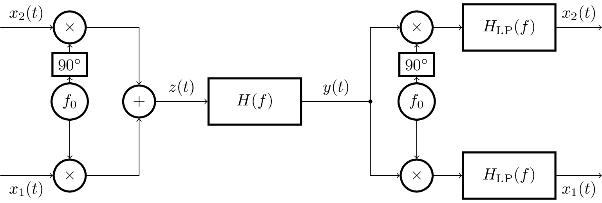
</figure>

Per determinare l’energia di simbolo si considera un solo campione: $$\begin{gathered}
    z(t)=a_ng(t)\cos(2\pi f_0)+b_ng(t)\sin(2\pi f_0t)
\end{gathered}$$ Si ottiene il segnale in frequenza, e per il teorema di Parseval si calcola la sua energia: $$\begin{gathered}
    Z(f)=\displaystyle\frac{a_n}{2}\left[G(f-f_0)+G(f-f_0)\right]+\frac{b_n}{2i}\left[G(f-f_0)-G(f+f_0)\right]\\
    Z(f)=\displaystyle\frac{1}{2}(a_n-ib_n)G(f-f_0)+\frac{1}{2}(a_n+ib_n)G(f+f_0)
\end{gathered}$$ Si suppone che $G(f)$ non si sovrapponga quando è centrata in $\pm f_0$, per cui il loro prodotto è nullo: $$\begin{gathered}
    |Z(f)|^2=\displaystyle\frac{1}{4}(a_n^2+b_n^2)|G(f-f_0)|^2+\frac{1}{4}(a_n^2+b_n^2)|G(f+f_0)|^2+\frac{1}{2}(a_n^2+b_n^2)\cancelto{0}{|G(f-f_0)|\cdot|G(f+f_0)|}
\end{gathered}$$ L’energia di simbolo è quindi: $$\begin{gathered}
    E_s=\displaystyle\int_{-\infty}^{+\infty}|Z(f)|^2\mathrm{d}f=\frac{1}{4}(a_n^2+b_n^2)\displaystyle\int_{-\infty}^{+\infty}|G(f-f_0)|^2\mathrm{d}f+\frac{1}{4}(a_n^2+b_n^2)\displaystyle\int_{-\infty}^{+\infty}|G(f+f_0)|^2\mathrm{d}f\\
    E_s=\displaystyle\frac{a_n^2+b_n^2}{2}E_g\tag{\stepcounter{equation}\theequation}
\end{gathered}$$ Corrisponde esattamente alla metà dell’energia di simbolo della codifica PAM.

In caso si considerasse anche il rumore sul canale, la statistica del rumore diventerebbe bidimensionale, poiché dipende dai campioni di $x_1$ e $x_2$. Rappresentano due processi aleatori indipendenti di densità di probabilità gaussiana, e sono centrati intorno al simbolo su cui si sta lavorando. L’informazione sui due campioni è simultanea per cui necessariamente devono essere analizzati assieme. Il rumore sporca la costellazione, alterando il valore di entrambi i campioni, rispetto al caso separato, è più complesso identificare a quale simbolo sono associati i campioni di $x_1$ e $x_2$ misurati.

### Modulazione PSK

In alternativa alla QAM, può essere utilizzata la modulazione PSK, utilizzata nel bluetooth. Nella modulazione PSK “Phase Shift Keying”, la costellazione è costruita da un cerchio, ed i simbolo sono disposti, equidistanti, sulla circonferenza:

<figure>
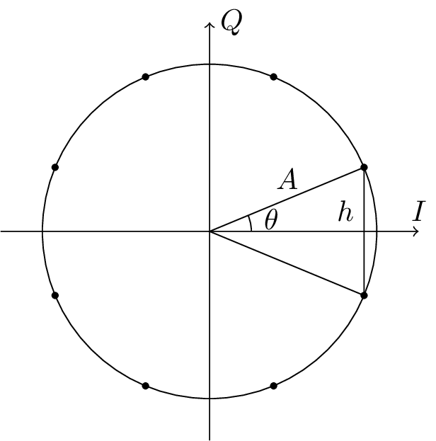
</figure>

Se la circonferenza ha raggio $A$, l’altezza del simbolo più vicino all’asse è: $$\begin{gathered}
    h_i=A\sin(\theta)
\end{gathered}$$ Poiché sono equidistanti, l’angolo tra due simboli può essere espresso rispetto al numero di simboli: $$\begin{gathered}
    2\theta=\displaystyle\frac{2\pi}{M}
\end{gathered}$$ La distanza minima tra due simboli è quindi il doppio dell’altezza del simbolo $i$: $$\begin{gathered}
    d_{\min}=2h_i=2A\sin\left(\displaystyle\frac{\pi}{M}\right)
\end{gathered}$$ Si chiama modulazione in fase, poiché i simbolo sono posizionati sulla fase del coseno: $$\begin{gathered}
    z(t)=A\cos(2\pi f_0 t+\varphi_m)=A\cos(\varphi_m)\cos(2\pi f_0t)-A\sin(\varphi_m)\sin(2\pi f_0t)\\
    a_m=A\cos(\varphi_m)\\
    b_m=A\sin(\varphi_m)
\end{gathered}$$ In questo modo si può ritornare ad una QAM, associando il simbolo $c_m$ alla coppia di valori $(a_m,b_m)$. Nella rappresentazione PSK i simboli $c_m$ vengono individuati unicamente dalla fase $\\varphi_m$ del coseno. $$\begin{gathered}
    \varphi_m=\displaystyle\frac{(2m+1)\pi}{M}\to c_m
\end{gathered}$$ Ogni simbolo si trova ad una diversa fase del coseno, e quindi ad una diversa posizione sulla circonferenza.

## Secondo Teorema di Shannon

Il secondo teorema di Shannon fornisce un limite massimo del bitrate in trasmissione, in funzione del rapporto segnale rumore. Sia dato un canale limitato in banda $B$, corrotto da un rumore AWGN, il teorema afferma che esiste un codice tramite cui è possibile, se usato, trasmettere con una probabilità di errore sufficientemente piccola.

Si dimostra che la capacità di canale, corrispondente al bitrate massimo, è data dalla seguente formula: $$C=B\log_2\left(\displaystyle1+\frac{P_R}{P_n}\right)=B\log_2(1+\mathrm{SNR})$$

La codifica di canale derivata dal teorema, aggiunge dei bit al segnale in modo che venga ricevuto senza errori, o almeno, in grado di essere corretto, senza perdita di informazione. Il numero di bit ridondanti da aggiungere dipende anch’esso dal rapporto segnale rumore SNR.

Per un canale in banda base, il baud rispetta la seguente relazione: $$R_s\leq 2B$$ Per cui il bitrate si esprime come: $$R_b\leq 2B\log_2M$$ Se si lavora con un bitrate massimo, e si confronta questa relazione con la capacità di canale di Shannon si ottiene: $$\begin{gathered}
    2B\log_2M=B\log_2(1+\mathrm{SNR})\\
    \log_2M^2=\log_2(1+\mathrm{SNR})
\end{gathered}$$ Il numero massimo di codici dell’alfabeto soddisfa quindi la seguente equazione: $$M=\sqrt{1+\mathrm{SNR}}$$ Se venisse usato un alfabeto contenente più simboli, allora sarebbero presenti errori nella trasmissione, se venisse usato un alfabeto contenente un numero minore di simboli, sarebbe possibile trovare un algoritmo di codifica ottimale per ottenere una probabilità di errore abbastanza bassa.

Se il rapporto segnale rumore è uguale ad uno, ovvero rappresenta il caso peggiore, la capacità di canale risulta essere: $$\begin{gathered}
    C=B\cancelto{1}{\log_2(2)}
\end{gathered}$$

Per determinare l’efficienza di un canale, si rappresentano le curve associate agli andamenti della sua capacità massima. Si esprime la potenza media del segnale rispetto all’energia di bit: $$\begin{gathered}
    P_R=\displaystyle\frac{E_b}{T_b}=E_bC\\
    C=B\log_2\left(\displaystyle 1+\frac{E_bC}{N_0B}\right)\\
    \displaystyle\frac{C}{B}=\log_2\left(1+\frac{E_b}{N_0}\frac{C}{B}\right)\\
    2^{\frac{C}{B}}=1+\displaystyle\frac{E_b}{N_0}\frac{C}{B}\\
    \displaystyle\frac{E_b}{N_0}=\frac{2^{\frac{C}{B}}-1}{\displaystyle\frac{C}{B}}\tag{\stepcounter{equation}\theequation}
\end{gathered}$$

Generalmente l’energia del bit si misura in decibel, e le curve vengono rappresentate in funzione di questo rapporto $E_b/N_0$:

<figure>
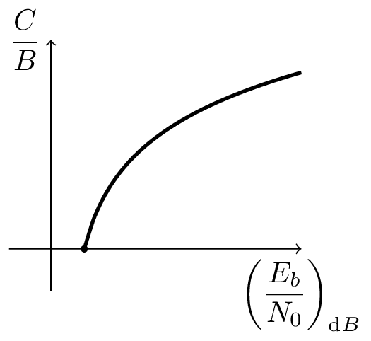
</figure>

Su questa curva è possibile confrontare l’efficienza delle codifiche trattate, QAM, PAM, PSK, etc, rispetto alla capacità massima fornita dal teorema di Shannon. Si calcola l’energia del bit corrispondente ad una capacità $C=0$: $$\begin{gathered}
    C=B\log_2\left(\displaystyle 1+\frac{E_b}{N_0}\frac{C}{B}\right)\\
    \displaystyle\frac{N_0}{E_b}=\frac{N_0B}{E_bC}\log_2\left(1+\frac{E_b}{N_0}\frac{C}{B}\right)\\
    \lambda=\displaystyle\frac{N_0}{E_b}\frac{C}{B}\\
    \displaystyle\frac{N_0}{E_b}=\frac{1}{\lambda}\log_2\left(1+\lambda\right)=\frac{1}{\lambda}\frac{\ln(1+\lambda)}{\ln2}\\
    \lim_{\lambda\to0}\displaystyle\frac{N_0}{E_b}=\frac{1}{\ln2}\cancelto{1}{\lim_{\lambda\to0}\frac{\ln(1+\lambda)}{\lambda}}\\
    \displaystyle\frac{E_b}{N_0}=\ln2\tag{\stepcounter{equation}\theequation}
\end{gathered}$$ Questo rappresenta il limite inferiore per l’energia di bit, oltre il quale non è possibile trasmettere segnali, poiché la capacità massima di canale si annulla.

Considerando la potenza ricevuta $P_R$ una costante si può rappresentare l’andamento della capacità massima in funzione della banda del canale: $$C=\log_2\left(\displaystyle1+\frac{P_R}{N_0B}\right)$$

<figure>
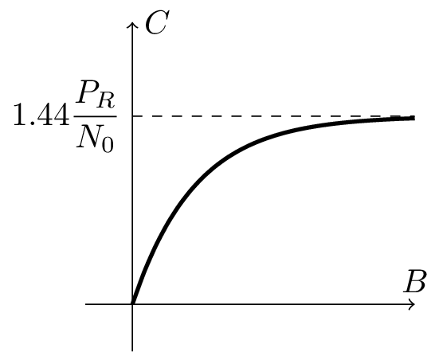
</figure>

La capacità cresce all’aumentare della banda fino ad un valore massimo asintotico, calcolato con lo stesso procedimento precedente per il calcolo dell’energia minima di bit: $$\begin{gathered}
    \displaystyle C=\frac{N_0B}{P_R}\frac{P_R}{N_0}\log_2\left(1+\frac{P_R}{N_0B}\right)\\
    \lambda=\displaystyle\frac{P_R}{N_0B}\\
    \displaystyle C=\frac{P_R}{N_0}\frac{1}{\lambda}\frac{\ln(1+\lambda)}{\ln2}\\
    C=\displaystyle\frac{P_R}{\ln2 N_0}\cancelto{1}{\lim_{\lambda\to0}\frac{\ln(1+\lambda)}{\lambda}}\\
    C\approx\displaystyle1.44\frac{P_R}{N_0}=1.44 B(\mathrm{SNR})\tag{\stepcounter{equation}\theequation}
\end{gathered}$$ Questo valore si chiama limite di banda illimitata, o di potenza limitata.

Se il rapporto segnale rumore, è molto maggiore di uno, allora si può esprimere la capacità massima come: $$\begin{gathered}
    \displaystyle\frac{P_R}{N_0B}>>1\\
    C=B\log_2(1+\mathrm{SNR})\approx B\log_2\displaystyle\frac{P_R}{N_0B}=B\displaystyle\frac{10\log_{10}(\mathrm{SNR})}{10\log_{10}2}= B\frac{(\mathrm{SNR})_{\mathrm{d}B}}{3}\\
    C\approx B(\mathrm{SNR})_{\mathrm{d}B}\cdot0.33\tag{\stepcounter{equation}\theequation}
\end{gathered}$$

### Codifica di Hamming

Dato un alfabeto di $M$ simboli, espressi in $k$ bit, per poter correggere l’errore bisogna aggiungere un certo numero di bit per arrivare a sequenze di $l$ bit, aggiungendo $l-k$ bit di ridondanza. Questi bit permettono di individuare se è presente un errore, ed eventualmente correggerlo. Poiché vengono aggiunti bit che non forniscono informazioni aggiuntive, bisogna aumentare la velocità in cui vengono trasmessi i codici, per mantenere invariata l’informazione ricevuta rispetto al tempo: $$R_c=\displaystyle\frac{R_bl}{k}$$

Se si volesse trasmettere un alfabeto di codice formato da $M$ parole di $k$ bit, si considerano tutte le possibili parole di codice formate da $k+1$ bit, e se ne scelgono $M$ in modo che la distanza tra le parole di codice sia di due bit. Per cui per modificare il simbolo sarebbe necessario modificare il valore di due bit. Questa distanza si chiama distanza di Hamming minima $d_{\min}$. Con una distanza minima di due bit è possibile solamente verificare la presenza di un errore nei dati, ma non di correggerlo. In caso uno dei bit di una parole di codice venga corrotto durante la trasmissione, è possibile identificare che si è verificato un errore di trasmissione. Poiché il codice ricevuto non corrisponde a nessuno degli $M$ codici di $k+1$ bit scelti. Ma non è possibile correggere l’errore, poiché più di una parola di codice è distante di un singolo bit dalla sequenza di ricevuta. In alcuni sistemi, quando si identifica un errore, il ricevitore richiede nuovamente i dati al trasmettitore.

In generale la distanza di Hamming minima dipende dal numero di bit errati in grado di rivelare $g$: $$d_{\min}\geq g+1$$ In caso si vogliano correggere $t$ errori, bisogna avere una distanza di Hamming minima: $$d_{\min}\geq 2t+1$$

Questo tipo di codifica si chiama codici a blocchi. Viene usata sia nella trasmissione sia nella memorizzazione dei dati. Un esempio sono i codici QR. I codici di correzione più famosi sono i Reed-Solomon, utilizzati per il FEC. Tutti questi codici tentano di aumentare l’efficienza della trasmissione, inserendo il minor numero di bit aggiuntivi, per correggere eventuali errori di trasmissione.
