---
author:
- "*Giacomo Sturm*"
date: |
  *Dipartimento di Ingegneria Civile, Informatica e delle Tecnologie Aeronautiche  
  Università degli Studi “Roma Tre"*
title: |
  **Fondamenti di Automatica**  
  Appunti delle Lezioni di Fondamenti di Automatica  
  *Anno Accademico: 2022/23*
---

\providecommand{\labelText}[2]{#1}

# Introduzione

L’automatica è la scienza che si occupa dell’analisi del controllo di sistemi dinamici in quattro passaggi:

- Modellazione: Rappresentazione matematica basata sulla fisica del sistema;

- Studio delle Soluzioni: Le soluzioni possono essere ottenute analiticamente, in forma chiusa, o tramite simulazioni del dato sistema;

- Esplorazione: Ricerca di relazioni tra struttura e comportamento del sistema ed approfondimento di quest’ultimo;

- Modifica e Controllo: Ricerca dei metodi per cambiare il comportamento del sistema.

Un sistema (dal greco sýn + histánai) viene definito come un insieme di oggetti connessi, indipendenti, che operano insieme. La decomposizione funzionale di un sistema, è un tipo di scomposizione che esprime le relazioni causa-effetto necessarie per comprendere il funzionamento del sistema e per poter intervenire su di esso. Questa scomposizione è formata da vari blocchi funzionali, vengono rappresentati come degli oggetti aventi due ingressi e due uscite, e dei parametri interni che ne descrivono il legame, un singolo blocco funzionale può quindi essere analizzato come un sistema a sé. In un blocco funzionale possono entrare degli ingressi scelti arbitrariamente $u(t)$, di cui è possibile controllare li comportamento, e disturbi $z(t)$, ovvero errori che agiscono indipendentemente sul blocco, non controllabili. Da un blocco funzionale escono l’uscita $y(t)$, funzione rispetto alle entrate scelte, ed una catena di misura, usata per analizzare uno o tutti i parametri di $y(t)$. Il comportamento di un singolo blocco viene rappresentato come dei parametri $\sum$ costanti, che rappresentano il comportamento fisico del blocco, e ne descrivono le sue uscite rispetto all’entrate date.

<figure>
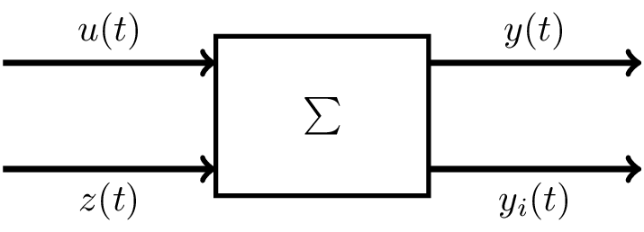
</figure>

Viene definito sistema isolato, un sistema in cui le uscite dipendono solo dagli ingressi attuali $\sum:y=f(u)$.

<figure>
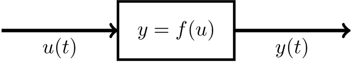
</figure>

Viene definito sistema dinamico, un sistema le cui uscite dipendono dagli ingressi attuali e dagli ingressi passati del sistema $\sum:g(y^{(0)},...,y^{(n)},u^{(0)},...,u^{(m)})=0$.

<figure>

</figure>

Viene definito stato del sistema $\mathbf{x}(t)$, un vettore di $n$ variabili dipendenti dal tempo, tale che la conoscenza del suo valore allo stato $\mathbf{x}(t=0)$, e l’andamento dell’ingresso da $t=0$ in poi è sufficiente a determinare univocamente da $t=0$ in poi l’andamento di tutte le variabili dipendenti. In generale dato lo stato completo di un sistema in un istante di tempo $\mathbf{x}(t_0)$, è possibile determinarne l’evoluzione futura, ovvero $\mathbf{x}(t>t_0)$.

# Equazioni Differenziali

## Introduzione alle Equazioni Differenziali

Un sistema fisico può essere analizzato mediante la dinamica o la cinematica:

- Dinamica: Studia le relazioni matematiche che descrivono l’evoluzione del sistema;

- Cinematica: Studia le relazioni di moto tra le componenti del sistema.

Viene definita equazione differenziale una funzione che contiene elementi derivati della variabile dipendente. Un equazione differenziale può essere usata per descrivere l’andamento di sistemi dinamici varianti nel tempo.

Lo studio delle equazioni differenziali cominciò nel $1671$, anno in cui Isaac Newton pubblicò il “Methodus fluxiorium et servierum infinitorum" in cui descrisse tre tipologie di equazioni differenziali di primo grado e le loro soluzioni: $$\begin{gathered}
    \displaystyle\frac{\mathrm{d}y}{\mathrm{d}x}=f(x)\\
    \displaystyle\frac{\mathrm{d}y}{\mathrm{d}x}=f(x,y)\\
    x_1\displaystyle\frac{\partial y}{\partial x_1}+x_2\frac{\partial y}{\partial x_2}=y
\end{gathered}$$

Nel 1695 i fratelli Jacob e Johan Bernoulli descrissero l’omonima equazione differenziale: $$\dot y+P(x)y=Q(x)y^n$$

Nel 1750 venne descritta l’evoluzione dell’equazione di Eulero-Lagrange, equazione che può essere usata per analizzare il moto di un qualsiasi corpo nel tempo data la lagrangiana $\mathcal{L}(t,q,\dot q)$, funzione dipendente dal tempo, la quantità di moto e la prima derivata della quantità di moto agente sul corpo: $$\displaystyle\frac{\partial \mathcal{L}}{\partial q}-\frac{\mathrm{d}}{\mathrm{d}t}\frac{\partial \mathcal{L}}{\partial\dot q}=0$$

## Equazioni Differenziali Ordinarie

Viene definita equazione differenziale ordinaria un’equazione la cua incognita è una funzione ad una singola variabile $f(x):A\to\mathbb{R}$, derivabile $n$ volte $f\in C^{(n)}(A)$ e i cui termini sono le derivate della funzione stessa di grado massimo $n$: $$F(t,f(t),\cdots,f^{(n)}(t))=0$$ Dove $F:I\subseteq\mathbb{R}^{n+2}\to\mathbb{R}$, e $I$ è un insieme aperto.

Può essere espressa esplicitando il termine di grado massimo: $$y^{(n)}(t)=g(t,y(t),\cdots,y^{(n-1)}(t))$$

Viene definita equazione differenziale ordinaria lineare, un’equazione del tipo: $$y^{(n)}(t)=\displaystyle\sum_{i=0}^{n-1}a_i(t)y^{(i)}(t)+a_{n+1}(t)$$ Dove il termine $a_{n+1}:I\subseteq\mathbb{R}\to\mathbb{R}$ rappresenta il termine noto, i termini $a_i:I\subseteq\mathbb{R}\to\mathbb{R}$ rappresentano i coefficienti dell’equazione variabili nel tempo. Per un’equazione a coefficienti costanti si avrà per ogni coefficiente $a_i(t)=a_i$.

Una funzione è lineare se e solo se soddisfa il principio di sovrapposizione degli effetti: $$F(t_0)+F(t)=F(t_0+t)$$

Data un’equazione differenziale ordinaria lineare a coefficienti costanti, viene definita soluzione locale la funzione $y$ soluzione nell’intervallo $J\subseteq I\subseteq\mathbb{R}$, dove $I$ rappresenta l’insieme dov’è definita l’equazione differenziale.

Data un’equazione differenziale ordinaria lineare a coefficienti costanti, viene definita soluzione massimale $y$ una funzione $y:I\subseteq\mathbb{R}\to\mathbb{R}$ per cui non esistono prolungamenti propri di $y$. Un prolungamento è definito come una soluzione locale $y'$ dell’equazione differenziale, definita su un intervallo $J\subseteq\mathbb{R}$, contenente $I$: $I\subseteq J$, per cui vale la seguente relazione $\forall t\in I: y'(t)=y(t)$.

Data un’equazione differenziale ordinaria lineare a coefficienti costanti, viene definita soluzione globale $y$, una soluzione locale sull’intero intervallo $J\subseteq\mathbb{R}$ dov’è definita l’equazione differenziale.

## Problema di Cauchy

Date un’equazione differenziale di una funzione $y(x)$, si definiscono condizioni iniziali o condizioni al contorno i valori delle derivate $n-1$-esime in uno stesso punto $x_0$. Dato il vettore condizioni iniziali $Y(x_0)$ esiste un’unica funzione $y(x)$ che risolve l’equazione differenziale. Un sistema definito da un’equazione differenziale ordinaria a coefficienti costanti di ordine $n$ e $n$ condizioni iniziali viene definito problema di Cauchy: $$\begin{cases}
        \strut y^{(n)}(x)=f(x,y^{(0)}(x),\cdots,y^{(n-1)}(x))\\
        Y(x_0)=\begin{pmatrix}
            x_0\\
            y^{(0)}(x_0)\\
            \vdots\\
            y^{(n-1)}(x_0)
        \end{pmatrix}
    \end{cases}$$

Sia data un’equazione differenziale $F:A\subseteq\mathbb{R}^{(n+2)}\to\mathbb{R}$, e una funzione $y=y(x,c_1,\cdots,c_n)$. Se per ogni valore diverso dell’insieme di parametri variabili $(c_1,\cdots,c_n)$, esiste un intervallo $I\subseteq\mathbb{R}^{(n+1)}$ tale che la funzione $y=y(x,c_1,\cdots,c_n)$ è una soluzione dell’equazione differenziale, per ogni valore delle condizioni iniziali $(x_0,y_0,\cdots,y_{n-1})\in A\subseteq\mathbb{R}^{(n+1)}$, allora esiste un’unica funzione $y=y(x,c_1,\cdots,c_n)$, soluzione del problema di Cauchy: $$\begin{cases}
        y^{(n)}(x)=f(x,y^{(0)}(x),\cdots,y^{(n-1)}(x))\\
        Y(x_0)=\begin{pmatrix}
            x_0\\
            y^{(0)}(x_0)\\
            \vdots\\
            y^{(n-1)}(x_0)
        \end{pmatrix}
    \end{cases}$$ Allora la funzione $y$ è una soluzione generale dell’equazione differenziale.

Una soluzione particolare dell’equazione differenziale è una soluzione per un valore particolare delle variabili $c_i$.

Un’equazione differenziale a variabili separabili è un’equazione del tipo: $$\displaystyle\frac{\mathrm{d}y}{\mathrm{d}x}=f(x)g(y)$$ Dove $f(x):I\subseteq\mathbb{R}\to\mathbb{R}$ e $g(y):J\subseteq\mathbb{R}\to\mathbb{R}$. Le soluzione dell’equazione sono date implicitamente da: $$\displaystyle\int\frac{\mathrm{d}y}{g(y)}=\int f(x)\mathrm{d}x$$

La soluzione di un problema di Cauchy di un’equazione differenziale a variabili separabili esiste ed è unica localmente se date due funzioni $f(x):I\subseteq\mathbb{R}\to\mathbb{R}$ e $g(y):J\subseteq\mathbb{R}\to\mathbb{R}$, e due valori $x_0\in I$ e $y_0\in J$. Si suppone $f\in C^{(0)}(I)$ e $g\in C^{(1)}(J)$. Allora il problema di Cauchy ammette una ed una sola soluzione massimale definita su $I'\subseteq I,\:\{x_0\}\subset I'$. $$\begin{cases}
        \displaystyle\displaystyle\frac{\strut{\mathrm{d}y}}{\strut{\mathrm{d}x}}=f(x)g(y)\\
        y(x_0)=y_0
    \end{cases}$$

## Equazione Lineare di Primo Ordine

Un’equazione differenziale lineare di primo ordine è un’equazione del tipo: $$\displaystyle\frac{\mathrm{d}y}{\mathrm{d}x}=a(x)y+b(x)$$ Dove $a,b:I\subseteq\mathbb{R}\to\mathbb{R}$, se $b(x)=0$ allora l’equazione diventa omogenea.

Per risolvere l’equazione omogenea si considera: $$\begin{gathered}
    \displaystyle\frac{\mathrm{d}y}{\mathrm{d}x}=a(x)y\\
    \displaystyle\int\frac{\mathrm{d}y}{y}=\int a(x)\mathrm{d}x\\
    \displaystyle \ln(y)=\left(\int a(x)\mathrm{d}x+c_0\right)=\int a(x)\mathrm{d}x\\
    y=\displaystyle e^{\int a(x)\mathrm{d}x}\tag{\stepcounter{equation}\theequation}
\end{gathered}$$

Per risolvere l’equazione non omogenea si considera la soluzione essere una funzione $k(x)$ ignota che moltiplica la soluzione dell’omogenea: $$\begin{gathered}
    y(x)=k(x)e^{\int a(x)\mathrm{d}x}\\
    \displaystyle\frac{\mathrm{d}y}{\mathrm{d}x}=a(x)y+b(x)\\
    \displaystyle\frac{\mathrm{d}k}{\mathrm{d}x}e^{\int a(x)\mathrm{d}x}+k(x) a(x)e^{\int a(x)\mathrm{d}x}=a(x)k(x)e^{\int a(x)\mathrm{d}x}+b(x)\\
    \displaystyle\frac{\mathrm{d}k}{\mathrm{d}x}e^{\int a(x)\mathrm{d}x}=b(x)\\
    \displaystyle\int \mathrm{d}(k(x))=k(x)=\int b(x)e^{-\int a(x)\mathrm{d}x}\mathrm{d}x\\
    k(x)=\displaystyle\int b(x)e^{-\int a(x)\mathrm{d}x}\mathrm{d}x\\
    y(x)=\displaystyle e^{\int a(x)\mathrm{d}x}\int b(x)e^{-\int a(x)\mathrm{d}x}\mathrm{d}x\tag{\stepcounter{equation}\theequation}
\end{gathered}$$

Si considera un sistema dinamico descritto da un’equazione differenziale ordinaria lineare di primo ordine, si definisce il fattore $A(t)$ come: $$\begin{gathered}
    A(t)=\displaystyle\int_{t_0}^{t}a(\tau)\mathrm{d}\tau
\end{gathered}$$ La sua evoluzione è quindi descritta dalla seguente funzione: $$y(t)=e^{A(t)}\left(\int_{t_0}^{t} b(\tau)e^{-A(\tau)}\mathrm{d}\tau+y_0\right)=e^{A(t)}y_0+\int_{t_0}^{t} b(\tau)e^{A(t)-A(\tau)}\mathrm{d}\tau$$ Esplicitando la condizione iniziale $y_0$, se la funzione $a(t)$ è costante: $a(t)=a$, allora si ha: $$\displaystyle A(t)=\int_{t_0}^{t}a \mathrm{d}\tau=a(t-t_0)$$ E l’evoluzione del sistema viene descritta da: $$y(t)=e^{a(t-t_0)}y_0+\displaystyle\int_{t_0}^{t} e^{a(t-\tau)}b(\tau)\mathrm{d}\tau$$ Il primo termine corrisponde all’evoluzione libera del sistema, poiché corrisponde all’evoluzione delle condizioni iniziali del sistema nel tempo. Il secondo termine corrisponde alla convoluzione tra il fattore esponenziale ed il coefficiente $b(t)$: $$\displaystyle\int_{t_0}^{t} e^{a(t-\tau)}b(\tau)\mathrm{d}\tau=e^{at}*b(t)$$ Ovvero corrisponde alla risposta forzata del sistema, su cui è stata applicata un’entrata $b(t)$. La risposta del sistema ad un’entrata $b(t)$ è data quindi dalla somma della risposta libera e della risposta forzata: $$y(t)=e^{a(t-t_0)}y_0+e^{at}*b(t)$$

Il sistema può quindi essere rappresentato dal blocco funzionale $e^{at}$, poiché un blocco funzionale non mantiene le condizioni iniziali. Equivale quindi al problema di Cauchy: $$\begin{cases}
        \dot y(t)=ay(t)+b(t)\\
        y(0)=0
    \end{cases}$$

<figure>
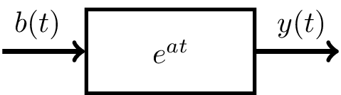
</figure>

Il sistema ha una risposta impulsiva $y(t)=e^{at}$. La risposta impulsiva di un sistema corrisponde alla sua risposta per un entrata $u(t)=\delta_0(t)$. $\delta_0(t)$ viene chiamato impulso o delta di Dirac, viene definito come il limite di una distribuzione lineare: $$\delta_0(t):=\displaystyle\lim_{\epsilon\to0}\int_{\mathbb{R}}\delta_{\epsilon}(\tau)\mathrm{d}\tau$$

<figure>
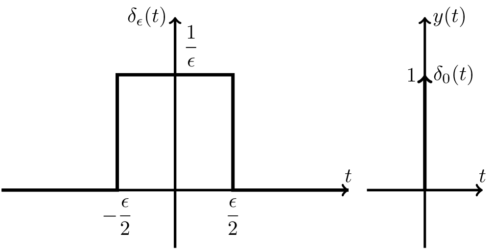
</figure>

La risposta impulsiva di una funzione $f(t)$ viene definita come: $$f(t)*\delta_0(t)=\int_{\mathbb{R}}f(t)\delta_0(t)\mathrm{d}t=f(t)$$

## Equazione di Grado Superiore al Primo

Un sistema dinamico può essere definito dal processo $P$: $$P:\displaystyle\sum_{i=0}^{n-1}a_ix^{(i)}=\sum_{j=0}^{m-1}b_ju^{(j)}$$ Si può esprimere come un sistema $S$ di equazioni differenziali: $$S:
    \begin{cases}
        \dot x_1=a_{11}x_1+\cdots+a_{1n}x_n+b_{11}u_1+\cdots+b_{1m}u_m\\
        \:\vdots \qquad\qquad\qquad\qquad\qquad\qquad\qquad\qquad\qquad \vdots\\
        \dot x_n=a_{n1}x_1+\cdots+a_{nn}x_n+b_{n1}u_1+\cdots+b_{nm}u_m
    \end{cases}$$ Considerando le matrici colonna: $$x:=
    \begin{pmatrix}
        x_1=x^{(0)}\\
        \vdots\\
        x_n=x^{(n-1)}
    \end{pmatrix}
    ,\:
    u:=
    \begin{pmatrix}
        u_1=u^{(0)}\\
        \vdots\\
        u_m=u^{(m-1)}
    \end{pmatrix}$$ Viene definita la matrice stato del sistema $A$: $$A:=
    \begin{pmatrix}
        a_{11}& \cdots &a_{1n}\\
        \vdots & \ddots & \vdots\\
        a_{n1} & \cdots&a_{nn}
    \end{pmatrix}$$ Viene definita la matrice di proiezione degli ingressi $B$: $$B:=
    \begin{pmatrix}
        b_{11}& \cdots &b_{1m}\\
        \vdots & \ddots & \vdots\\
        b_{n1} & \cdots&b_{nm}
    \end{pmatrix}$$

Lo stato del processo può quindi essere espresso in forma compagna: $$\dot x=Ax+Bu$$

Viene definita una matrice colonna delle uscite $y$ e una matrice di uscita $C$: $$y:
    \begin{pmatrix}
        y_1\\
        \vdots\\
        y_n
    \end{pmatrix}
    ,\:
    C:=
    \begin{pmatrix}
        c_1 \cdots c_n
    \end{pmatrix}$$ Per misurare una determinata uscita $y_i$ del sistema si considera un coefficiente $c_i$ non nullo.

In generale può essere espresso lo stato ingresso-uscita del sistema come: $$\begin{cases}
        \dot x=Ax+Bu\\
        y=Cx
    \end{cases}$$

Se la matrice di stato del sistema è diagonale $A\in D(n)$ allora ogni componente dello stato del sistema $x_i$ può essere espresso come: $$\dot x_i=a_{ii}x_i+\displaystyle\sum_{k=0}^{m}b_{ik}u_k$$ Una matrice $A$ è diagonalizzabile se e solo se si ha: $$\det(A-\lambda I)=0,\:\forall\lambda_i\Rightarrow m(\lambda_i)=|E(\lambda_i)|$$ Dove $\lambda_i$ rappresenta un autovalore della matrice $A$, soluzione del polinomio caratteristico $P(\lambda_i)=\det(A-\lambda_iI)$, e $E(\lambda_i):=\mathrm{Sol}(A-\lambda_iI=0)$. Se è diagonalizzabile è possibile esprimere la matrice come una matrice diagonale: $$\tilde A=
    \begin{pmatrix}
        \lambda_1 &\cdots& 0\\
        \vdots& \ddots &\vdots\\
        0&\cdots&\lambda_n
    \end{pmatrix}$$

Per passare dalla matrice $A$ alla matrice diagonalizzata $\tilde A$, si considera una matrice di passaggio $T:=(t_{ij})$ dove il componente $t_{ij}$ viene ottenuto esprimendo una base $\langle\mathbf{e}_1,\cdots,\mathbf{e}_n\rangle$ della matrice $A$ rispetto ad una base $\langle\mathbf{v}_1,\cdots,\mathbf{v}_n\rangle$ della matrice $\tilde A$: $$\mathbf{v_j}=\displaystyle\sum_{i=0}^{n}t_{ji}\mathbf{e}_j$$

Per passare tra le due matrici si considera: $$\tilde A=T^{-1}AT$$ Per ottenere una matrice diagonale nella rappresentazione ingresso-uscita del sistema si applica la sostituzione $x=Tz$: $$\begin{gathered}
    \begin{cases}
        T\dot z=ATz+Bu\\
        y=CTz
    \end{cases}\\
    \begin{cases}
        \dot z=T^{-1}ATz+T^{-1}Bu\\
        y=CTz
    \end{cases}\\
    \begin{cases}
        \dot z=\tilde Az+T^{-1}Bu\\
        y=CTz
    \end{cases}
\end{gathered}$$ Si considera $\tilde B=T^{-1}B$ e $\tilde C=CT$, per cui la rappresentazione ingresso uscita considerando una matrice di stato diagonale sarà: $$\begin{cases}
        \dot z=\tilde Az+\tilde Bu\\
        y=\tilde Cz
    \end{cases}$$

Data l’equazione differenziale $y^{(n)}+\displaystyle\sum_{i=0}^{n}a_{n-i}y^{(n-i)}=u$, considerando $c_i=1$ si ha: $$\begin{cases}
        x_1=y\\
        \vdots\\
        x_n=y^{(n-1)}
    \end{cases}$$ Si può esprimere tramite la rappresentazione ingresso-uscita $\dot x=Ax+Bu$: $$\dot x=y^{(n)}=u-\displaystyle\sum_{i=0}^{n}a_{n-i}y^{(n-i)}=u-\sum_{i=0}^{n}a_{n-i}x_{n+1-i}$$ Per cui la matrice di stato è: $$A=
    \begin{pmatrix}
        0 & 1 & \cdots & 0 & 0\\
        0 & 0 & 1 & \cdots & 0\\
        \vdots & & \ddots & & \vdots\\
        0 & \cdots & \cdots & \cdots & 1\\
        -a_0 & \cdots & \cdots & -a_{n-1} & 0
    \end{pmatrix}$$ Si ha un polinomio caratteristico: $$\begin{gathered}
    P(\lambda)=\det(A-\lambda I)=
    \left|\begin{matrix}
        -\lambda & 1 & \cdots & 0 & 0\\
        0 & -\lambda & 1 & \cdots & 0\\
        \vdots & & \ddots & & \vdots\\
        0 & \cdots & \cdots & -\lambda & 1\\
        -a_0 & \cdots & \cdots & -a_{n-1} & -\lambda
    \end{matrix}\right|=
    -a_0-a_1\lambda-a_2\lambda^2-\cdots-a_{n-1}\lambda^{n-1}-\lambda^n\\
    P(\lambda)=\lambda^n+a_{n-1}\lambda^{n-1}+\cdots+a_1\lambda+a_0
\end{gathered}$$ Il polinomio caratteristico corrisponde all’equazione associata all’equazione differenziale: $$y^{(n)}+a_{n-1}y^{(n-1)}+\cdots+a_1y^{(1)}+a_0y$$ La funzione $y=c_ie^{\lambda_it}$ rappresenta una soluzione dell’equazione differenziale se e solo se $P(\lambda_i)=0$: $$\begin{gathered}
    y^{(n)}+a_{n-1}y^{(n-1)}+\cdots+a_1y^{(1)}+a_0y=0\\
    c_i\lambda_i^ne^{\lambda_it}+\cdots+c_i\lambda_ie^{\lambda_it}+c_ie^{\lambda_it}=0\\
    c_ie^{\lambda_it}(\lambda^n+a_{n-1}\lambda^{n-1}+\cdots+a_1\lambda+a_0)=0\\
    c_ie^{\lambda_it}P(\lambda_i)=0
\end{gathered}$$ Per $c_ie^{\lambda_it}\neq0$, per cui $c_i\neq0$.

Di conseguenza per trovare una soluzione di un’equazione differenziale omogenea si può risolvere il polinomio caratteristico della matrice di stato del sistema, e ogni autovalore $\lambda_i\mbox{ t.c. }P(\lambda_i)=0$ corrisponderà ad una soluzione $c_ie^{\lambda_it},\:c_i\in\mathbb{R}-\{0\}$ all’equazione differenziale.

Data l’equazione differenziale definita dal sistema: $$\begin{cases}
        \dot x_1=\displaystyle\sum_{i=0}^na_{i1}x_i+\sum_{j=0}^mb_{j1}u_j\\
        \vdots\\
        \dot x_n=\displaystyle\sum_{i=0}^na_\mathrm{in}x_i+\sum_{j=0}^mb_\mathrm{in}u_j
    \end{cases}$$

Si considera la rappresentazione ingresso-uscita $\dot x=Ax+Bu$, allora si può, dato il vettore condizioni iniziali $x_0=x(0)$, analizzarla come fosse un’equazione lineare di primo ordine con $a(t)=A$. Per cui ha una soluzione: $$x(t)=e^{At}x_0+\displaystyle\int_{0}^te^{A(t-\tau)}Bu(\tau)\mathrm{d}\tau$$ La componente $e^{At}$ rappresenta un’esponenziale elevato ad una matrice, si definisce tramite la sua espansione di Taylor: $$e^{At}=\displaystyle\sum_{i=0}^{+\infty}\frac{A^it^i}{i!}=1+At+\frac{A^2t^2}{2}+\cdots$$

La soluzione $y(t)$ dell’equazione differenziale è data da: $$y(t)=Cx(t)=Ce^{At}x_0+\displaystyle\int_{0}^tCe^{A(t-\tau)}Bu(\tau)\mathrm{d}\tau=Ce^{At}x_0+Ce^{At}B*u(t)$$ Il sistema è descritto da un blocco funzionale $Ce^{At}B$:

<figure>
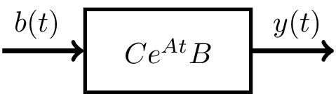
</figure>

Per rappresentare la componente esponenziale si considera la matrice diagonalizzata $\tilde A=T^{-1}AT$: $$\begin{gathered}
    \displaystyle e^{T\tilde A T^{-1}t}=\sum_{i=0}^n\frac{(T\tilde AT^{-1})^it^i}{i!}\\
    (T\tilde{A}T^{-1})^n=T\tilde{A}\cancel{T^{-1}T}\tilde{A}\cancel{T^{-1}T}\cdots\cancel{T^{-1}T}\tilde{A}T^{-1}=TA^nT^{-1}\\
    \displaystyle e^{T\tilde A T^{-1}t}=T\sum_{i=0}^n\frac{\tilde A^it^i}{i!}T^{-1}=T 
    \begin{bmatrix}
        e^{\lambda_1t} & & \\
        & \ddots & \\
        & & e^{\lambda_nt}
    \end{bmatrix}T^{-1}
\end{gathered}$$ La risposta del sistema può quindi essere espressa come: $$y(t)=CTe^{\tilde{A}t}T^{-1}x_0+CTe^{\tilde{A}t}T^{-1}B*u(t)$$

Il sistema viene definito stabile se la risposta converge, per cui si considera: $$\begin{gathered}
    \lim_{t\to+\infty}CTe^{\tilde{A}t}T^{-1}x_0+CTe^{\tilde{A}t}T^{-1}B*u(t)=0
\end{gathered}$$ Per un entrata $u(t)$ non nulla a regime permanente e matrici non nulle, la risposta del sistema converge a $0$ se la componente esponenziale converge: $$\begin{gathered}
    \lim_{t\to+\infty}e^{\tilde{A}t}=\lim_{t\to+\infty}\begin{bmatrix}
        e^{\lambda_1t} & & \\
        & \ddots & \\
        & & e^{\lambda_nt}  
    \end{bmatrix}=0\\
    \forall i,\:\lim_{t\to+\infty}e^{\lambda_it}=0\iff \lambda_i<0
\end{gathered}$$

Un sistema dinamico descritto da un’equazione differenziale lineare è stabile se e solo se ogni autovalore della matrice di stato del sistema è negativo.

Tramite il criterio di Routh è possibile determinare il numero di radici a parte reale negativa in base ai coefficienti di un polinomio, per cui è possibile determinare la stabilità di un sistema dinamico analizzando il suo polinomio caratteristico.

La soluzione di un’equazione differenziale omogenea è data dalla somma di ogni soluzione associata ad un autovalore della matrice di stato del sistema: $$y_0(t)=\displaystyle\sum_{i=0}^nc_ie^{\lambda_it}$$ Per trovare i coefficienti $c_i$ sono necessarie $n$-condizioni iniziali, definite condizioni al contorno.

Se un autovalore ha una molteplicità maggiore di $1$, allora la sua soluzione associata è data da: $$y_{\lambda_i,0}(t)=\left(\displaystyle\sum_{k=1}^{m(\lambda_i)}c_kt^{k}\right)e^{\lambda_it}$$

Se due autovalori sono complessi e coniugati $\lambda_1=\lambda_2^{*}$ si ha: $$\begin{gathered}
    \lambda_1=\sigma+j\omega\\
    \lambda_2=\sigma-j\omega\\
    y_{\lambda_{1,2},0}(t)=c_1e^{\lambda_1t}+c_2e^{\lambda_2t}=c_1e^{\sigma t +j\omega t}+c_2e^{\sigma t-j\omega t}=e^{\sigma t}((c_1+c_2)\cos(\omega t)+j(c_1-c_2)\sin(\omega t))
\end{gathered}$$ Per ipotesi la soluzione deve essere una funzione reale: $$\begin{gathered}
    y(t):I\subseteq\mathbb{R}\to\mathbb{R}\\
    e^{\sigma t}((c_1+c_2)\cos(\omega t)+j(c_1-c_2)\sin(\omega t))\in\mathbb{R}\\
    \begin{cases}
        (c_1+c_2)\cos(\omega t)\in\mathbb{R}\\
        (c_1-c_2)\sin(\omega t)\in\mathbb{R}
    \end{cases}\\
    \begin{cases}
        c_1+c_2\in\mathbb{R}\Rightarrow \Im(c_1)=-\Im(c_2)\\
        (c_1-c_2)j\in\mathbb{R}\Rightarrow \Re(c_1)=\Re(c_2)
    \end{cases}\\
    c_1=c_2^*=\rho e^{j\theta}\\
    y_{\lambda_{1,2},0}(t)=\rho e^{j\theta}e^{\sigma t +j\omega t}+\rho e^{-j\theta}e^{\sigma t-j\omega t}=\rho e^{\sigma t}\left(e^{j(\omega t+\theta)}+e^{-j(\omega t+\theta)}\right)\displaystyle\frac{2}{2}\\
    2e^{\sigma t}\left(\displaystyle\frac{e^{j(\omega+\theta)}+e^{-j(\omega+\theta)}}{2}\right)=2e^{\sigma t}\cos(\omega t+\theta)
\end{gathered}$$

Per cui si può espandere il criterio di stabilità anche per poli complessi. Un sistema dinamico è stabile se e solo se le sue dinamiche sono descritte da autovalori a parte reale negativa.

Per ottenere la soluzione non omogenea $y_p(t)$ si somma alla soluzione omogenea $y_0(t)$ una qualsiasi soluzione particolare della non omogenea, appartiene alla stessa classe di funzioni del forzamento $g(t)$ applicato all’equazione differenziale. La soluzione generale dell’equazione differenziale è data da: $$y(t)=y_0(t)+y_p(t)$$

# Trasformata di Laplace

La trasformata di Laplace è un funzionale che trasporta una funzione dal dominio del tempo al dominio di Laplace. Si considerano solo oggetti causali, ovvero definiti e non nulli per tempo $t>0$: $$f(t):=
    \begin{cases}
        f(t) &t>\\
        0 &t\leq0
    \end{cases}$$ La trasformata di Laplace unilatera destra $\mathcal{L}_-\{f(t)\}$ viene definita come l’integrale: $$\mathcal{L}_-\{f(t)\}:=\displaystyle\int_{0^-}^{+\infty}f(t)e^{-st}\mathrm{d}t$$ Dove $s$ è la variabile indipendente complessa nel dominio di Laplace, per cui una funzione nel tempo $f(t)$ ha una trasformata di Laplace $F(s)$. Questa variabile può essere espressa come $s=\sigma+j\omega$, l’integrale di Laplace viene definito solo se la funzione interna è sommabile, ovvero se converge per $t\to\infty$. Dato un esponente negativo dovrebbe sempre convergere, ma essendo una variabile complessa per ottenere la convergenza del termine $e^{-st}$ si considera la parte reale $\sigma$ di $s$, maggiore di un certo valore $\sigma*$, che garantisce la convergenza dell’esponenziale. Questo valore viene chiamato ascissa di convergenza e divide il piano di Gauss in due zone, quella a sinistra del valore $\sigma*$ dove non è integrabile, e quella a destra, integrabile. Ciò permette sempre l’esistenza di una zona di convergenza assoluta dove l’integrale di Laplace può essere calcolato, prende alternativamente il valore di $0^-$ o $-\infty$.

<figure>
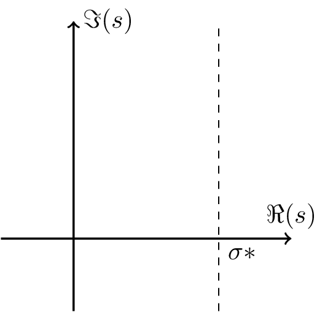
</figure>

## Proprietà della Trasformata e Trasformate Notevoli

Data una trasformata $F(s)$, il valore della trasformata per il coniugato di $s$ è uguale al coniugato della trasformata in $s$: $$F(s^*)=F^*(s)$$ La trasformata di una funzione per una costante è uguale al prodotto di quella costante per la trasformata: $$\mathcal{L}_-\{a\cdot f(t)\}=a\cdot F(s)$$

Date due funzioni nel tempo $f(t)$ e $g(t)$, supponendo esistano le trasformate di Laplace delle due funzioni $F(s)$ e $G(s)$, si considera la trasformata di Laplace della combinazione lineare delle due: $$\begin{gathered}
    \mathcal{L}_-\{f(t)+g(t)\}=\displaystyle\int_{0^-}^{+\infty}\left(f(t)+g(t)\right)e^{-st}\mathrm{d}t=\int_{0^-}^{+\infty}f(t)e^{-st}+g(t)e^{-st}\mathrm{d}t\\
    \displaystyle\int_{0^-}^{+\infty}f(t)e^{-st}\mathrm{d}t+\int_{0^-}^{+\infty}g(t)e^{-st}\mathrm{d}t=F(s)+G(s)\\
    \mathcal{L}_-\{f(t)+h(t)\}=F(s)+G(s)\tag{\stepcounter{equation}\theequation}
\end{gathered}$$

Data una funzione $f(t)$ ed una trasformata $F(s)$, se si trasla la funzione nel tempo di un fattore $a$, la sua trasformata diventerà: $$\begin{gathered}
    \mathcal{L}_-\{f(t-a)\}=\displaystyle\int_{0^-}^{+\infty}f(t-a)e^{-st}\mathrm{d}t\\
    t-a=\tau\\
    \displaystyle\int_{-a^-}^{+\infty}f(\tau)e^{-s(\tau+a)}\mathrm{d}\tau=e^{-sa}\int_{-a^-}^{+\infty}f(\tau)e^{-s\tau}\mathrm{d}\tau=F(s)e^{-sa}\\
    \mathcal{L}_-\{f(t-a)\}=F(s)e^{-sa}\tag{\stepcounter{equation}\theequation}
\end{gathered}$$

Si considera una dinamica esponenziale $f(t)=e^{pt}$, la sua trasformata di Laplace sarà data da: $$\begin{gathered}
    \mathcal{L}_-\{e^{pt}\}=\displaystyle\int_{0^-}^{+\infty}e^{pt}e^{-st}\mathrm{d}t=\int_{0^-}^{+\infty}e^{(p-s)t}\mathrm{d}t=\left[\frac{e^{(p-s)t}}{p-s}\right]^{+\infty}_{0^-}\\
    \displaystyle\frac{e^{(p-s)\cdot\infty}}{p-s}-\frac{e^{(p-s)\cdot0}}{p-s},\:\sigma*=\Re(p),\Rightarrow \Re(s)>\Re(p),\:\Re(p-s)<0\\
    \displaystyle\frac{\cancelto{0}{e^{-(s-p)\cdot\infty}}}{-(s-p)}+\frac{\cancelto{1}{e^{-(s-p)\cdot0}}}{s-p}\\
    \mathcal{L}_-\{e^{pt}\}=\displaystyle\frac{1}{s-p}\tag{\stepcounter{equation}\theequation}
\end{gathered}$$

Per traslare una funzione $f(t)$ nel dominio di Laplace di un fattore $a$, si considera $f(t)e^{at}$: $$\begin{gathered}
    \mathcal{L}_-\{f(t)e^{at}\}=\displaystyle\int_{0^-}^{+\infty}f(t)e^{at}e^{-st}\mathrm{d}t=\int_{0^-}^{+\infty}f(t)e^{-(s-a)t}\mathrm{d}t=F(s-a)
\end{gathered}$$

Date due funzioni $f(t)$ e $g(t)$, aventi trasformate rispettivamente $F(s)$ e $G(s)$, si considera la trasformata della loro convoluzione $f(t)*g(t)$: $$\begin{gathered}
    \mathcal{L}_-\{f(t)*g(t)\}=\displaystyle\int_{0^-}^{+\infty}f(t)*g(t)^{-st}\mathrm{d}t=\int_{0^-}^{+\infty}\left(\int_{0^-}^{t}f(t-\tau)g(\tau)\mathrm{d}\tau\right)e^{-st} \mathrm{d}t\\
    \displaystyle\int_{0^-}^{t}\left(\int_{0^-}^{+\infty}f(t-\tau)e^{-st}\mathrm{d}t\right)g(\tau)\mathrm{d}\tau=\int_{0^-}^{t}F(t)e^{-s\tau}g(\tau)\mathrm{d}\tau=F(s)\int_{0^-}^{t}g(\tau)e^{-s\tau}\mathrm{d}\tau\\
    \mathcal{L}_-\{f(t)*g(t)\}=F(s)\cdot G(s)\tag{\stepcounter{equation}\theequation}
\end{gathered}$$

Data una funzione $f(t)$ derivabile $n$ volte, e avente trasformata $F(s)$, si considera la trasformata della sua derivata: $$\begin{gathered}
    \mathcal{L}_-\{\dot f(t)\}=\displaystyle\int_{0^-}^{+\infty}\dot f(t)e^{-st}\mathrm{d}t\\
    \displaystyle\frac{\mathrm{d}}{\mathrm{d}t}(f(t)e^{-st})=\dot f(t)e^{-st}-sf(t)e^{-st}\Rightarrow\dot f(t)e^{-st}=\frac{\mathrm{d}}{\mathrm{d}t}(f(t)e^{-st})+sf(t)e^{-st}\\
    \displaystyle\int_{0^-}^{+\infty}\dot f(t)e^{-st}\mathrm{d}t=\int_{0^-}^{+\infty}\frac{\mathrm{d}}{\mathrm{d}t}(f(t)e^{-st})+sf(t)e^{-st}\mathrm{d}t\\
    \displaystyle\int_{0^-}^{+\infty}\frac{\mathrm{d}}{\mathrm{d}t}(f(t)e^{-st})\mathrm{d}t+s\int_{0^-}^{+\infty}f(t)e^{-st}\mathrm{d}t=\left[f(t)e^{-st}\right]^{+\infty}_{0^-}+sF(s)\\
    \mathcal{L}_-\{\dot f(t)\}=sF(s)-f(0^-)\tag{\stepcounter{equation}\theequation}
\end{gathered}$$ Per una derivata $n$-esima della funzione $f(t)$, si ha una trasformata: $$\begin{gathered}
    \mathcal{L}_-\left\{\displaystyle\frac{\mathrm{d}^n}{\mathrm{d}t^n}f(t)\right\}=s^nF(s)-\sum_{i=0}^{n-1}s^{n-(i+1)}\frac{\mathrm{d}^i}{\mathrm{d}t^i}f(0^-)
\end{gathered}$$

Data una funzione $f(t)$, integrabile, e data la funzione integrale: $$\displaystyle\int_{0}^{t}f(\tau)\mathrm{d}\tau$$ Si considera la sua trasformata: $$\begin{gathered}
    \mathcal{L}_-\left\{\displaystyle\int_{0}^{t}f(\tau)\mathrm{d}\tau\right\}=\int_{0^-}^{+\infty}\left(\int_{0}^{t}f(\tau)\mathrm{d}\tau\right)e^{-st}\mathrm{d}t\\
    f(t)*\delta_{-1}(t)=\displaystyle\int_{0}^{t}f(\tau)\mathrm{d}\tau,\:\mathcal{L}_-\left\{\displaystyle\int_{0}^{t}f(\tau)\mathrm{d}\tau\right\}=\mathcal{L}_-\{f(t)*g(t)\}\\
    \mathcal{L}_-\left\{\displaystyle\int_{0}^{t}f(\tau)\mathrm{d}\tau\right\}=\frac{F(s)}{s}\tag{\stepcounter{equation}\theequation}
\end{gathered}$$

Si definiscono i teoremi del valore iniziale e del valor finale, rispettivamente: $$\begin{gathered}
    \lim_{t\to0^+}f(t)=\lim_{s\to+\infty}sF(s)\\
    \lim_{t\to+\infty}f(t)=\lim_{s\to0^-}sF(s)
\end{gathered}$$

Dato una funzione polinomiale di tipo $k$: $$\delta_{-(k+1)}(t):=
    \begin{cases}
        \displaystyle\displaystyle\frac{\strut{t^{k}}}{\strut{k!}}&t\geq0\\
        0&t<0
    \end{cases}$$ É possibile ricavare una funzione del tipo $k$, integrando $\delta_{-(k+1)}(t)$. Per cui data la trasformata di Laplace del gradino: $$\begin{gathered}
    \delta_{-1}(t):=
    \begin{cases}
        1 &t>0\\
        0 &t\leq0
    \end{cases}\\
    \mathcal{L}_-\{\delta_{-1}(t)\}:=\displaystyle\int_{0^-}^{+\infty}1\cdot e^{-st}\mathrm{d}t=\frac{1}{s}\tag{\stepcounter{equation}\theequation}
\end{gathered}$$ Sapendo che la trasformata di una funzione integrale è la trasformata del’argomento dell’integrale diviso $s$, si può esprimere la trasformata di una qualsiasi funzione del tipo $k+1$: $$\mathcal{L}_-\{\delta_{-(k+1)}(t)\}:=\displaystyle\frac{1}{s^{k+1}}$$ Inoltre è possibile derivare la funzione del gradino per ottenere la trasformata dell’impulso $\delta_0(t)$: $$\mathcal{L}_-\left\{\displaystyle\frac{\mathrm{d}}{\mathrm{d}t}\delta_1(t)\right\}=s\cdot\frac{1}{s}=1=\mathcal{L}_-\{\delta_0(t)\}$$

Data una funzione sinusoidale o cosinusoidale, è possibile esprimerla in forma esponenziale per determinarne la trasformata di Laplace: $$\begin{gathered}
    \mathcal{L}_-\{\sin(\omega t)\}=\mathcal{L}_-\left\{\displaystyle\frac{e^{j\omega t}-e^{-j\omega t}}{2j}\right\}=\frac{1}{2j}\left(\frac{1}{s-j\omega}-\frac{1}{s+j\omega}\right)\\
    \displaystyle\frac{1}{2j}\frac{s+j\omega-s+j\omega}{s^2+\omega^2}=\frac{\omega}{s^2+\omega^2}\\
    \mathcal{L}_-\{\sin(\omega t)\}=\displaystyle\frac{\omega}{s^2+\omega^2}\tag{\stepcounter{equation}\theequation}\\
    \mathcal{L}_-\{\cos(\omega t)\}=\mathcal{L}_-\left\{\displaystyle\frac{e^{j\omega t}+e^{-j\omega t}}{2}\right\}=\frac{1}{2}\left(\frac{1}{s-j\omega}+\frac{1}{s+j\omega}\right)\\
    \displaystyle\frac{1}{2}\frac{s+j\omega+s-j\omega}{s^2+\omega^2}=\frac{s}{s^2+\omega^2}\\
    \mathcal{L}_-\{\sin(\omega t)\}=\displaystyle\frac{s}{s^2+\omega^2}\tag{\stepcounter{equation}\theequation}
\end{gathered}$$

Alcune delle funzioni più comunemente incontrate nello studio di sistemi dinamici sono funzioni polinomiali di tipo $k$ traslate nel dominio di Laplace: $$\mathcal{L}_-\left\{\displaystyle\frac{t^{(k-1)}e^{pt}}{(k-1)!}\right\}=\frac{1}{(s-p)^k}$$

## Trasformata di un’Equazione Differenziale

Dato un sistema definito da un’equazione differenziale $a_ny^{(n)}+\cdots a_0y^{(0)}=b_mu^{(m)}+\cdots+b_0u^{(0)}$, è possibile e più conveniente lavorare nel dominio di Laplace. Il sistema è causale per $m<n$, non è causale per $m>n$, mentre è al limite di stabilità per $m=n$. Per analizzare il sistema si considera la trasformata di Laplace dell’equazione differenziale: $$\begin{gathered}
    \mathcal{L}_-\left\{\displaystyle\sum_{k=0}^{n}a_ky^{(k)}\right\}=\mathcal{L}_-\left\{\sum_{i=0}^{m}b_iu^{(i)}\right\}\\
    \displaystyle\sum_{k=0}^{n}\left(a_ks^kY(s)+CI_y^{k-1}(s)\right)=\sum_{i=0}^{m}b_is^iU(s)
\end{gathered}$$ Poiché un’entrata $u(t)$, viene definita nulla per tempi $t\leq0$, il polinomio delle condizioni iniziali dell’entrata $CI_u^{m-1}$ è nullo. Si considera la sommatoria di tutti i polinomi delle condizioni iniziali dell’uscita: $$\displaystyle\sum_{k=0}^{n}CI-y^{k-1}(s)=\overline{CI}_y^{n-1}(s)$$

Per cui si ha: $$\begin{gathered}
    Y(s)\displaystyle\sum_{k=0}^{n}a_ks^k+\overline{CI}_y^{n-1}(s)=U(s)\sum_{i=0}^{m}b_is^i\\
    Y(s)=\displaystyle\frac{\sum_{i=0}^{m}b_is^i}{\sum_{k=0}^{n}a_ks^k}U(s)-\frac{\overline{CI}_y^{n-1}(s)}{\sum_{k=0}^{n}a_ks^k}\tag{\stepcounter{equation}\theequation}
\end{gathered}$$

Si considerano le somiglianze con le soluzioni dell’equazione differenziale ottenute mediante il metodo geometrico: $$\begin{gathered}
    \begin{cases}
        \dot x=Ax+Bu\\
        y=Cx
    \end{cases}\Rightarrow
    y(t)=Ce^{At}x_0+Ce^{At}B*u(t)
\end{gathered}$$

La risposta libera rappresenta la risposta di un sistema considerando solamente le condizioni iniziali trascurando l’ingresso, in Laplace corrisponde a: $$\displaystyle\frac{\overline{CI}_y^{n-1}(s)}{\sum_{k=0}^{n}a_ks^k}$$ Mentre nel tempo corrisponde a $Ce^{At}x_0$.

La risposta forzata rappresenta la risposta ottenuta considerando solamente l’entrata del sistema ed ignorando lo stato iniziale e la sua evoluzione in Laplace corrisponde a: $$\displaystyle\frac{\sum_{i=0}^{m}b_is^i}{\sum_{k=0}^{n}a_ks^k}U(s)$$ Mentre nel tempo corrisponde a $Ce^{At}B*u(t)$.

La risposta complessiva del sistema è data dalla differenza tra la risposta forzata e la risposta libera: $$Y(s)=Y_f(s)-Y_l(s)$$

Essendo $Ce^{At}B$ la funzione che descrive il processo $H$ analizzato, calcolando la trasformata della risposta forzata si ottiene: $$Y_f(s)=\mathcal{L}_-\{h(t)*u(t)\}=H(s)\cdot U(s)$$ Avendo calcolato precedentemente la risposta forzata in Laplace, si può ricavare la trasformata del processo del sistema: $$\begin{gathered}
    H(s)\cdot U(s)=\displaystyle\frac{\sum_{i=0}^{m}b_is^i}{\sum_{k=0}^{n}a_ks^k}U(s)\\
    H(s)=\displaystyle\frac{b_ms^m+\cdots+b_0}{a_ns^n+\cdots+a_0}\tag{\stepcounter{equation}\theequation}
\end{gathered}$$ Per cui la risposta complessiva del sistema è data da: $$Y(s)=H(s)U(s)-Y_l(s)$$ Questa trasformata viene definita funzione di trasferimento del processo, poiché lega l’entrata e l’uscita del processo: $$\displaystyle\frac{Y(s)}{U(s)}=H(s)$$ Può essere rappresentato come un diagramma a blocchi in Laplace:

<figure>
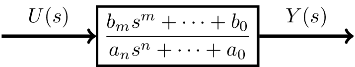
</figure>

Questa funzione di trasferimento può essere scomposta in fratti semplici del tipo: $$\displaystyle\frac{R_i}{s-p_i}$$ Dove $p_i$ è un polo della funzione $H(s)$. I residui $R_i$ possono essere calcolati mediante la formula: $$R_i=\lim_{s\to p_i}(s-p_i)H(s)$$ Se i poli hanno molteplicità $m(p_i)$ maggiore di $1$, allora per ogni ripetizione $j$ del polo si ottiene un residuo $R_i^j$: $$\forall j\in[1,m(p_i)],\:R_i^j=\lim_{s\to p_i}\displaystyle\frac{1}{(m(p_i)-j)!}\frac{\mathrm{d}^{(m(p_i)-j)}}{\mathrm{d}s^{(m(p_i)-j)}}\left[(s-p_i)^{m(p_i)}H(s)\right]$$

Per cui data una qualsiasi funzione di trasferimento $H(s)$ avente $k$ poli, può essere espressa come: $$H(s)=\displaystyle\sum_{i=1}^{k}\sum_{j=1}^{m(p_i)}\frac{R_i^j}{(s-p_i)^{m(p_i)-j+1}}$$

A regime permanente le condizioni iniziali non influiscono sull’andamento della funzione, per il teorema del valore finale: $$\displaystyle\lim_{t\to+\infty}y(t)=\lim_{s\to0^-}sY(s)=\lim_{s\to0}s\left(H(s)\cdot U(s)-\frac{\cancelto{0}{\overline{CI}_y^{n-1}(s)}}{a_ns^n+\cdots+a_0}\right)$$ Per cui l’evoluzione permanente dipende internamente dalla risposta forzata, mentre il transitorio dipende maggiormente dalla risposta libera e quindi dalle condizioni iniziali, rappresentando un processo relativamente veloce. Vengono così identificati due casi di studio di un sistema:

- L’analisi dinamica studia il comportamento nello stato transitorio;

- L’analisi statica studia il comportamento a regime permanente.

Dato che le condizioni iniziali non influiscono sul regime permanente vengono omesse nell’analisi statica.

Per ottenere la funzione nel dominio del tempo si usano diverse antitrasformate notevoli: $$\begin{gathered}
    \mathcal{L}_-^{-1}\left\{F(s+p)\right\}=f(t)e^{-pt}\\
    \mathcal{L}_-^{-1}\left\{\displaystyle\frac{R_i^j}{(s+p_i)^k}\right\}=\delta_k(t)R_i^je^{-p_it}\\
    \mathcal{L}_-^{-1}\left\{\displaystyle\frac{R_i}{s+p_i}\right\}=R_ie^{-p_it}
\end{gathered}$$

Per cui le dinamiche della funzione di trasferimento sono funzioni di tipo $k$ moltiplicate per esponenziali, oppure esponenziali puri.

## Evoluzione di un Sistema

Il denominatore della funzione di trasferimento di un processo coincide con il suo polinomio caratteristico, quindi un sistema è stabile se la sua funzione di trasferimento presente solo poli a parte reale negativa.

Dato un singolo polo a parte reale negativa, associato ad un residuo ${R_i}/{s+p_i}$, nel dominio del tempo si ha una dinamica esponenziale $R_ie^{-p_it}$. La retta tangente alla funzione nell’istante $t=0$ interseca l’ascissa del tempo in un punto $\tau$ definito tempo caratteristico o costante di tempo, equivalente all’inverso del polo: $\tau_i:={p_i}^{-1}$. Dopo un intervallo di tempo di $3\tau$ si svolge il $95\%$ dell’evoluzione del sistema, per cui l’analisi del transitorio avviene in questo intervallo di tempo. Si può estendere fino a $6\tau$ dove un’altro $95\%$ del rimanente $5\%$ dell’evoluzione si svolge.

<figure>
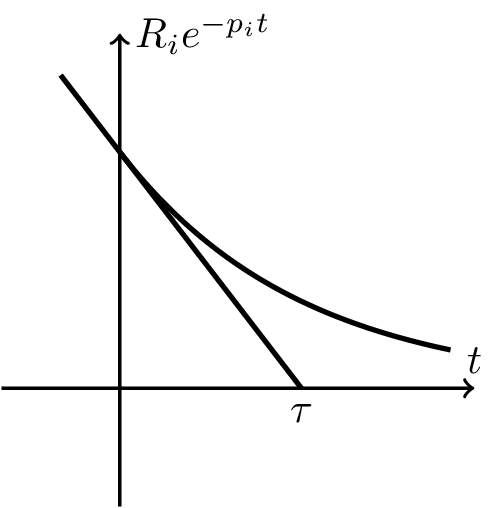
</figure>

In caso il polo sia a parte reale positiva, presenta una dinamica esponenziale divergente.

Dati due poli complessi e coniugati si hanno due residui: $$\displaystyle\frac{R_1}{s-\sigma-j\omega}+\frac{R_2}{s-\sigma+j\omega}$$ Tramite le antitrasformate notevoli si ottiene una dinamica nel tempo $R_1e^{(\sigma+j\omega)t}+R_2e^{(\sigma-j\omega)t}$. Poiché rappresenta un oggetto fisico deve essere reale, è necessario che $R_1=R^*_2$. Considerando $R_1=Me^{j\varphi}$, si ha: $$\begin{gathered}
    \mathcal{L}_-^{-1}\left\{\displaystyle\frac{R_1}{s-\sigma-j\omega}+\frac{R_2}{s-\sigma+j\omega}\right\}=Me^{(\sigma+j\omega)t+j\varphi}+Me^{(\sigma-j\omega)t-j\varphi}\\
    Me^{\sigma t}\left(e^{j(\omega t+\varphi)}+e^{-j(\omega t+\varphi)}\right)=2Me^{\sigma t}\cos(\omega t+\varphi)\\
    \mathcal{L}_-^{-1}\left\{\displaystyle\frac{R_1}{s-\sigma-j\omega}+\frac{R_2}{s-\sigma+j\omega}\right\}=2Me^{\sigma t}\cos(\omega t+\varphi)\tag{\stepcounter{equation}\theequation}
\end{gathered}$$ Per cui due poli complessi e coniugati hanno un andamento pseudo-periodico nel tempo, convergente se $\sigma<0$ e divergente per $\sigma>0$:

<figure>
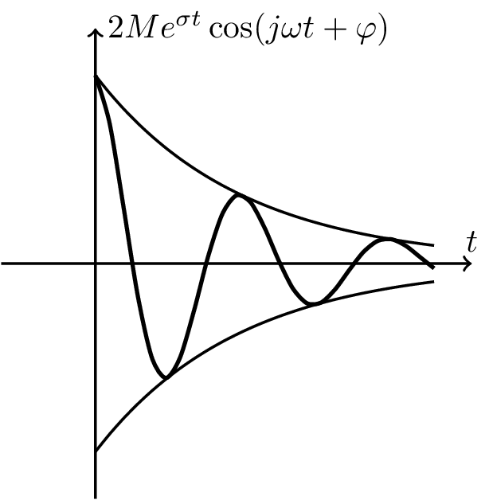
</figure>

In caso i due poli complessi e coniugati siano puramente immaginari, allora l’oscillazione non si smorza nel tempo, quindi presentano un andamento puramente periodico, rappresentano delle dinamiche al limite di stabilità:

<figure>
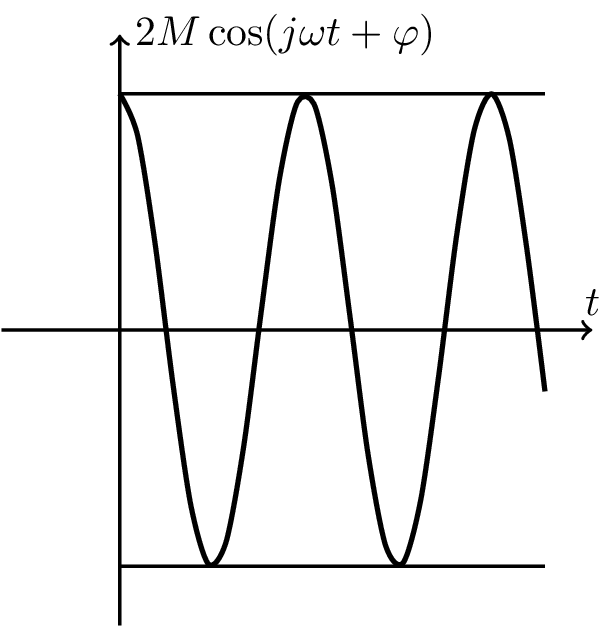
</figure>

Un polo nell’origine nel piano di Laplace corrisponde ad un gradino nel dominio del tempo. Un polo nell’origine rappresenta una dinamica al limite di stabilità, il sistema è stabile solo se è presente un unico polo nell’origine.

In base alla posizione dei poli nel piano di Gauss il sistema ha modi propri di evoluzione differenti. L’andamento del sistema è la combinazione degli andamenti dei singoli poli. Basta una singola dinamica divergente per rendere il sistema instabile. Questi modi propri possono essere costanti, in caso del polo nell’origine, esponenziale in caso di poli puramente reali, oppure oscillatori in caso di poli complessi. Questi modi possono essere convergenti se il polo ha parte reale negativa, stazionari se ha parte reale nulla e divergenti se ha parte reale positiva.

Un sistema è asintoticamente stabile se tutti i poli rappresentano dinamiche convergenti. Se presenta almeno una dinamica al limite di stabilità viene definito semplicemente stabile. Più i poli sono piccoli più velocemente il sistema converge.

Il guadagno di una funzione di trasferimento è definito come il valore che assume a regime permanente, se è stabile. In caso sia presente un polo nell’origine, non si può calcolare il guadagno statico della funzione. $$K_F=\lim_{t\to+\infty}f(t)=\lim_{s\to0}sF(s)$$

I contributi dei poli asintoticamente stabili rappresentano la risposta libera del sistema, poiché tende a zero nel tempo, mentre i contributi dei poli semplicemente stabili o instabili rappresentano la risposta permanente, poiché non diminuisce nel tempo.

## Funzioni di Trasferimento

Una funzione di trasferimento rappresenta un blocco funzionale del tipo ingresso-uscita, per cui perde ogni informazione sullo stato del sistema. Se due funzioni di trasferimento si trovano in serie, allora si possono sostituire da un’altra funzione di trasferimento data dal prodotto dalle due, in generale per un numero $n$ di funzioni di trasferimento in serie si può descrivere una funzione equivalente: $$G(s)=\displaystyle\prod_{i=1}^nG_i(s)$$

<figure>

  

</figure>

Date due funzioni di trasferimento in parallelo, possono essere sostituite da un’altra funzione equivalente alla somma tra le due, in generale per $k$ funzioni di trasferimento in parallelo, possono essere sostituite da un’altra funzione equivalente: $$G(s)=\displaystyle\sum_{i=1}^kG_i(s)$$

<figure>

  

</figure>

La funzione di trasferimento complessiva di un sistema presenta tutte le dinamiche di quel sistema, ovvero non viene persa l’informazione sulle dinamiche manipolando le funzioni di trasferimento. Per spostare una funzione di trasferimento sulla catena bisogna opportunamente dividere e moltiplicare per tale funzione su tutte le altre ramificazioni per mantenere invariata l’entrata $U(s)$ su quella catena:

<figure>

  

</figure>

Viene definito processo di un sistema l’insieme coordinato di trasformazioni, trasmissione di energia, materiali e informazioni finalizzato ad un obiettivo, viene indicato con la funzione $P(s)$.

Viene definito sistema a controreazione o retroreazione o feedback un sistema in cui l’uscita passata agisce sull’entrata futura. In un sistema a controreazione si indica la sequenza ininterrotta di blocchi funzionali dall’entrata all’uscita catena diretta. Mentre si indica anello o ciclo chiuso la sequenza di blocchi funzionali che attraversano la retroreazione e la catena diretta. Si vuole calcolare una funzione di trasferimento equivalente: $$Y(s)=U(s)\cdot W(s)\Rightarrow W(s)=\displaystyle\frac{Y(s)}{U(s)}$$ Per trovarla si analizzano le varie entrate ed uscite del sistema. Quando si analizza una certa entrate o uscita, tutte le altre vengono considerate nulle: $$\begin{gathered}
    \begin{cases}
        Y=eG\\
        e=U-HY
    \end{cases}\\
    \displaystyle\frac{Y}{G}=U-HY\\
    Y(1+GH)=UG\\
    \displaystyle\frac{Y}{U}=\frac{G}{1+GH}=W
\end{gathered}$$ Viene definita la funzione del ciclo aperto, uguale al prodotto di ogni funzione di trasferimento lungo il l’anello: $$F(s)=\prod_{i=1}^nG_i(s)$$ Per cui la funzione di trasferimento del sistema a controreazione o funzione a ciclo chiuso può essere espressa come il rapporto tra la funzione di trasferimento a catena diretta, ovvero la funzione di trasferimento equivalente a tutte le funzioni di trasferimento tra l’ingresso $U$ all’uscita $Y$ senza passare per l’anello, e la somma tra $1$ e la funzione a ciclo aperto, con segno negativo se è presente un numero pari di cambi di segno, altrimenti positivo. $$W(s)=\displaystyle\frac{G(s)}{1\pm F(s)}$$

<figure>
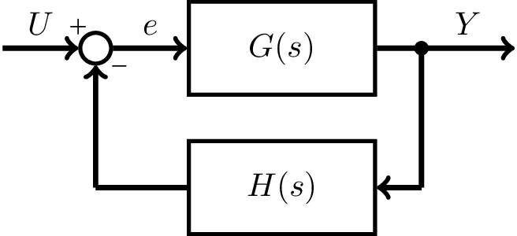
</figure>

Se fosse presente un errore sulla catena diretta, allora per trovare la funzione a ciclo chiuso del disturbo, si considera:

$$\begin{gathered}
    \begin{cases}
        e=-HY\\
        Y=eG+z
    \end{cases}\\
    Y=-GHY+z\\
    W_z=\displaystyle\frac{1}{1+GH}=\frac{1}{1+F}\tag{\stepcounter{equation}\theequation}
\end{gathered}$$

<figure>
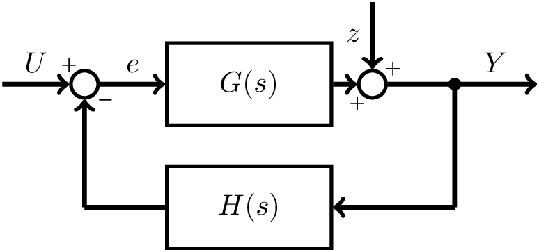
</figure>

Ogni errore sulla catena di misura genera un’errore in uscita.

In generale la funzione a ciclo chiuso di una qualsiasi entrata di un qualsiasi sistema a controreazione ha un denominatore $\mathrm{Dem}(s)=1\pm F(s)$, dove $F(s)$ è la funzione a ciclo aperto del sistema considerato. Avendo tutte le stesso denominatore, se una funzione a ciclo chiuso per una generica coppia di entrata-uscita del sistema è stabile, allora tutte le funzioni a ciclo chiuso del sistema sono stabili, e tutti gli oggetti in entrata vengono stabilizzati.

# Modellistica

Per controllare un processo $P(s)$ viene usato un controllore $C(s)$, anch’esso è un oggetto nel dominio di Laplace, usato per ottenere un comportamento specifico dal processo elaborando un valore corrispondente dell’entrata.

Il sistema più semplice di controllo viene chiamato a catena diretta, consiste in un controllore a monte del processo, senza considerare la differenza tra l’uscita aspettata e l’uscita effettiva del sistema. Questo tipo di controllo è certamente semplice, ma non essendo in grado di modificare opportunamente il controllore in caso di disturbi o rumori esterni non è efficiente, ma viene usato per la sua semplicità ed il suo basso costo:

<figure>
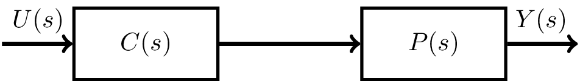
</figure>

Un sistema di controllo più complesso, e notevolmente migliore, considera una catena aggiuntiva, definita catena di misura, che collega l’uscita del sistema all’entrata mediante un opportuno trasduttore $H(s)$, che trasforma l’uscita in un segnale compatibile con il controllore. Questo sistema viene chiamato a controreazione o a feedback.

In questo modo è possibile tenere conto di eventuali errori o disturbi che variano l’uscita, confrontandola ad un riferimento, e quindi compensando le entrate future per correggere l’errore:

<figure>
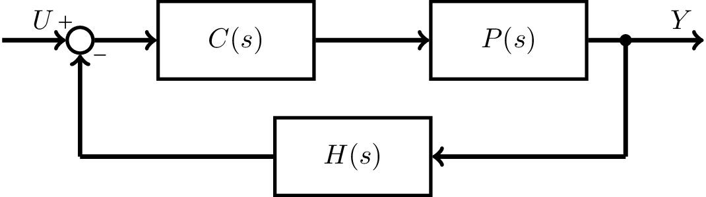
</figure>

Questa tipologia di controllo è in grado di svolgere attività di regolazione o asservimento, se il riferimento è rispettivamente costante o dipendente dal tempo.

Un sistema di controllo ancora più complesso può essere costruito aggiungendo una catena a feedforward ed un altra funzione di trasferimento $G(s)$, per controllare questo confronto:

<figure>
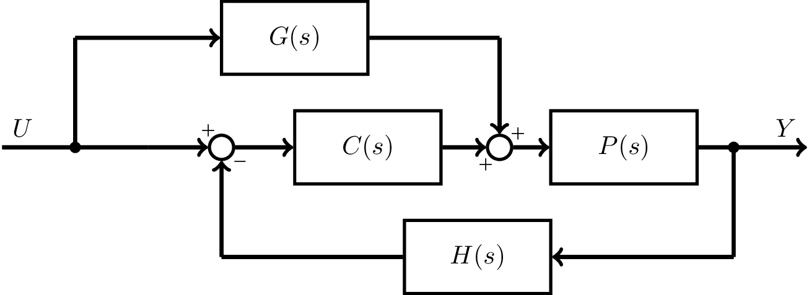
</figure>

Un sistema di controllo a controreazione o a feedforward è in grado di svolgere attività di regolazione o asservimento, contrastando gli effetti dei disturbi e delle variazioni parametriche.

In un sistema di regolazione, l’uscita viene confrontata con delle grandezze di riferimento costanti, ad esempio un gradino unitario $\delta_{-1}(t)$ per cui il controllore tenta di mantenere l’uscita in un intorno di questo riferimento:

<figure>
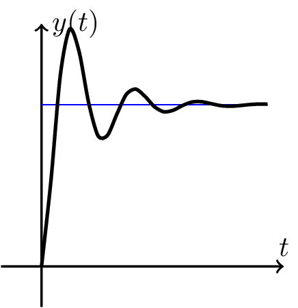
</figure>

Le specifiche di un sistema nel tempo vengono definite sulla base della risposta ad un gradino unitario. Questa risposta viene chiamata risposta indiciale. Il tempo che impiega il sistema per salire dal $10\%$ al $90\%$ del suo valore a regime viene chiamato tempo di salita $t_s$.

Viene definita sovraelongazione $s$ la differenza percentuale tra il picco raggiunto dalla risposta nel tempo e il valore a regime permanente. Una sovraelongazione troppo elevata può causare danni strutturali al sistema.

Viene definito tempo di assestamento $t_a$ il tempo necessario al sistema per raggiungere un valore intorno al $3\%$ del valore a regime.  
In un sistema di asservimento l’uscita viene confrontata con dei riferimenti varianti nel tempo, per cui il controllore deve forzare l’uscita ad assumere dei comportamenti proporzionali alla grandezza di ingresso, all’interno di certi margini di tolleranza:

<figure>
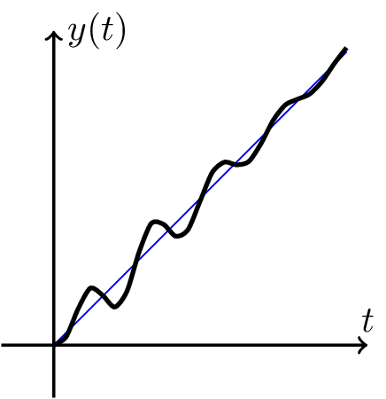
</figure>

## Esempio di un Motore a Corrente Continua

Si vuole creare un modello per un motore elettrico, analizzando il suo funzionamento.  
Se una corrente attraversa una spira, crea un campo magnetico, se sono presenti dei magneti permanenti ai lati della spira, viene generata una forza magnetica che spinge sulla spira. Se la spira è in grado di ruotare su sé stessa, allora genera un momento torcente. Per ottenere una rotazione continua bisogna invertire la corrente passante per la spira ogni mezzo giro, usando una corrente continua per ottenere ciò vengono usati dei contatti struscianti. In questo modo è possibile generare da una corrente continua e dei magneti permanenti un momento torcente continuo. Per aumentare l’efficienza si ruota il magnete all’interno di un cilindro contenete varie spire. Ogni volta che il magnete interno ruota di un certo angolo, si cambia la coppia di spire che crea il campo magnetico, nonostante questo crei delle oscillazioni per il cambiamento di spire, la sua efficienza è notevolmente superiore ad un motore che usa contatti struscianti.  
Si può rappresentare il circuito del rotore semplificato, formato da un’unica spira. In questo circuito semplificato è presente un generatore di tensione $V_a$, un resistore $R_a$, un induttore $L_a$, rappresentazione della spira, ed una forza contro elettro-motrice $\mathrm{f.c.e.m.}$, che rappresenta il magnete che ruota:

<figure>
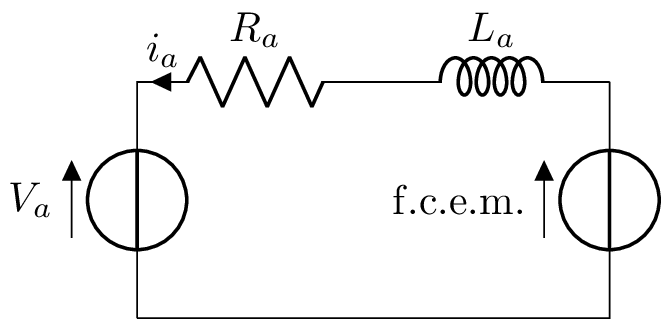
</figure>

Per la seconda legge di Kirchhoff si ottiene la seguente equazione della tensione di armatura: $$V_a=R_ai_a+L_a\dot i_a+\mathrm{f.c.e.m.}$$ La forza contro elettro-motrice generata dal magnete in rotazione è data da: $$\mathrm{f.c.e.m.}=\Phi_eK_a\omega\:,\:\Phi_eK_a=\mathrm{cost.}\Rightarrow K_m=\Phi_eK_a$$ Si ha quindi un’equazione differenziale per la corrente, e si calcola la sua funzione di trasferimento: $$\begin{gathered}
    V_a=R_ai_a+L_a\dot i_a+K_m\omega\\
    V_a(s)=R_aI_a(s)+sL_aI_a(s)+K_m\Omega(s)\\
    I_a(s)=\displaystyle\frac{V_a-K_m\Omega(s)}{sL_a+R_a}
\end{gathered}$$ Ha un tempo caratteristico: $$\tau=\displaystyle\frac{1}{\displaystyle\left|\frac{R_a}{L_a}\right|}=\left|\frac{L_a}{R_a}\right|$$ Questa corrente genererà una coppia $\tau_m(s)=K_mI_a(s)$. Per ottenere la rotazione del rotore bisogna esprimerla rispetto al momento torcente prodotto. Considerando $J$ il momento di inerzia del carico, e $D$ la costante di attrito viscoso del rotore, si ha: $$\begin{gathered}
    \tau_m(t)=J\dot\omega(t)+D\omega(t)\\
    \tau_m(s)=sJ\Omega(s)+D\Omega(s)\\
    \Omega(s)=\displaystyle\frac{\tau_m(s)}{sJ+D}
\end{gathered}$$ Si può allora esprimere come un ciclo a controreazione:

<figure>
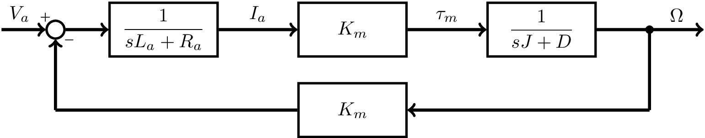
</figure>

Per ottenere l’angolo al posto della velocità angolare del rotore, si può inserire un integratore $s^{-1}$ sull’uscita $\Omega$. Per ottenere una velocità maggiore bisogna aumentare il guadagno della funzione di trasferimento a ciclo chiuso $W(s)$.

## Controllori

Un controllore è un oggetto fisico usato per manipolare la stabilità di un sistema, il suo comportamento nel transitorio e a pieno regime. Esistono vari tipi di controllori, il più semplice è un controllore proporzionale che consiste di una costante $K_c$ che moltiplica l’ingresso, in modo che il processo lavori su un’entrata $K_c\cdot U$, se il controllore proporzionale vale $1$, ha guadagno unitario. Per calcolare il guadagno della catena diretta, si moltiplica il guadagno del controllore per il guadagno del processo: $K=K_c\cdot K_P$. Considerando un processo: $$P(s)=\displaystyle\frac{N(s)}{D(s)}$$ Si ha una funzione a ciclo chiuso, per un controllore proporzionale: $$W(s)=\displaystyle\frac{Kc\displaystyle\frac{N(s)}{D(s)}}{1+Kc\displaystyle\frac{N(s)}{D(s)}}=\frac{K_cN(s)}{D(s)+K_cN(s)}$$

<figure>
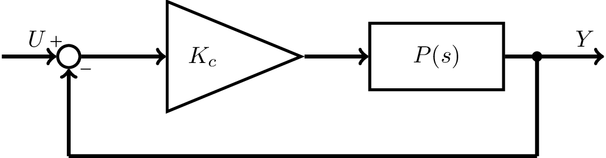
</figure>

### Luogo delle Radici

Il teorema sulla continuità delle radici di un polinomio descrive il comportamento delle soluzioni di un polinomio, alterando leggermente i valori dei coefficienti del polinomio:

> Considerando un polinomio $P^n(x)=a_nx^n+...a_1x=0$, è sempre possibile trovare una soluzione $x_0'$ nell’intorno $I_{\varepsilon}(x_0)$, dove $x_0$ è una soluzione di $P(x)$, al polinomio $P'(x)=(a_n+\varepsilon)x^n+...(a_1+\varepsilon)x=0$, per ogni $\varepsilon>0$ scelto arbitrariamente.

Per cui se esiste almeno una soluzione di $D(s)+K_cN(s)$, allora è sempre possibile trovare una sua soluzione per ogni valore di $K_c$ scelto. Per valori di $K_c\approx0$, si può approssimare il denominatore a: $D(s)+K_cN(s)\approx D(s)$, quindi il valore dei poli dipende dalla sola funzione $D(s)$, al contrario per valori del guadagno del controllore molto elevati $K_c>>0$, si ha $D(s)+K_cN(s)\approx N(s)$, quindi il valore dei poli dipende dalla sola funzione $N(s)$.

Per controllare l’andamento dei poli della funzione a ciclo chiuso rispetto ai valori del guadagno del controllore, si usa il luogo delle radici, una rappresentazione che che mostra lo spostamento dei poli rispetto all’aumento del guadagno, i poli partono dai valori dei poli del processo, fino a tendere al valore degli zeri del processo. Se il processo presenta un numero minore di zeri, allora alcuni dei poli divergono all’infinito. Il luogo della radici viene rappresentato su un piano di Gauss.

Se due poli sono complessi e coniugati, allora il loro comportamento rispetto all’aumentare del guadagno è simmetrico. Si può esprimere questo trinomio rispetto ad un’altra parametrizzazione: $$a_2s^2+a_1s+a_0=(s+p_1)(s+p_1^*)=s^2+2\sigma s+\omega^2+\sigma^2=s^2+2\zeta\omega_ns+\omega_n^2$$

Dove $\zeta$ rappresenta lo smorzamento del polo: $$\zeta=\displaystyle\frac{a_1}{2\omega_n}=\cos\varphi$$ Questo parametro quantifica quanto persiste l’oscillazione del sistema in seguito ad un dato ingresso; $\varphi$ rappresenta l’angolo con l’orizzontale formato dal segmento distanza tra l’origine ed il polo. Viene definita pulsazione di risonanza o pulsazione caratteristica: $$\omega_n=\displaystyle\sqrt{a_0}=\sqrt{\omega^2+\sigma^2}$$ Rappresenta graficamente la distanza del polo dall’origine del piano di Gauss. Quando si ha una entrata con una pulsazione simile alla pulsazione caratteristica $\omega\approx\omega_n$, si verifica il fenomeno della risonanza. Questo fenomeno verrà analizzato ampiamente nell’analisi di entrate di tipo sinusoidale.

In caso avesse smorzamento $\zeta=0$, il polo avrebbe parte reale nulla $\sigma=0\Rightarrow s^2+\omega_n^2=0\Rightarrow s=\pm j\omega_n$, per cui oscillerebbe senza mai fermarsi con una pulsazione di risonanza $\omega_n$ coincidente alla pulsazione naturale $\omega$.

In caso avesse $\zeta=1$, allora avrebbe solo poli reali $s=\sigma$ per cui non oscillerebbe. In caso avesse $0<\zeta<1$, allora avrebbe poli complessi e coniugati che rappresentano delle dinamiche oscillatorie. Queste dinamiche descritte dallo smorzamento sono convergenti per $\sigma<0$ o divergenti per $\sigma>0$. Un polo con uno smorzamento maggiore tende a diminuire l’oscillazione più velocemente e ha un tempo caratteristico minore.

Convenzionalmente si analizza una funzione di trasferimento esprimendo i poli e gli zeri a guadagno unitario, ovvero si esprimono i binomi come $(s\tau_i+1)$ e i trinomi come: $$\displaystyle\frac{s^2}{\omega_n^2}+2\frac{\zeta}{\omega_n}s+1$$ In questo modo viene esplicitato il guadagno statico della funzione:

$$P(s)=K_p\displaystyle\frac{(s\tau_m+1)\cdots(s\tau_i+1)}{(s\tau_n+1)\cdots(s\tau_j+1)}$$

La funzione di trasferimento è stabile se il luogo delle radici è interamente nel semipiano di parte reale negativa, altrimenti è stabile soltanto in un certo intervallo di $K_c$. Nel luogo delle radici le linee radiali uscenti dall’origine rappresentano le linee di smorzamento. I punti segnati con una croce rappresentano i poli, mentre i punti individuati da un cerchio rappresentano gli zeri della funzione.

Aumentando il guadagno, aumenta l’ampiezza di un’oscillazione e diminuisce l’errore che ne deriva. La robustezza di un sistema misura quanto un sistema mantiene nel sue dinamiche nel tempo, rispetto ad errori.

<figure>

  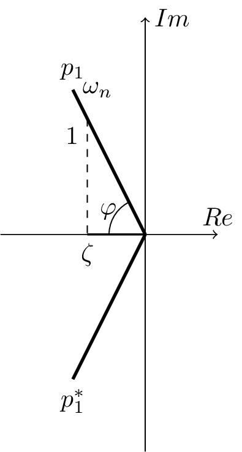

</figure>

### Controllore Proporzionale con un integratore

Per controllare l’effetto di un controllore proporzionale sul guadagno di un sistema, si considera un’entrata a gradino: $$U(s)=\displaystyle\frac{1}{s}$$ Si calcola con il teorema del valore finale il valore dell’uscita a regime permanente: $$\begin{gathered}
    W(s)=\displaystyle\frac{Y(s)}{U(s)}=\frac{K_cN(s)}{D(s)+K_cN(s)}\\
    Y(s)=\displaystyle\frac{K_c N(s)}{D(s)+K_c N(s)}\frac{1}{s}\\
    K_Y=\lim_{s\to0}s\cdot Y(s)=\lim_{s\to0}s\displaystyle\frac{K_c N(s)}{D(s)+K_c N(s)}\frac{1}{s}\\
    K_Y=\displaystyle\frac{K_c}{\displaystyle\frac{1}{K_P}+K_c}<1
\end{gathered}$$ Dove $K_P$ è il guadagno del processo $P(s)$. Per valori piccoli di $K_c$, si ha un errore $e_Y=1-K_Y$ elevato, solo all’aumentare di $K_c$ l’errore diminuisce fino a tendere a $1$ per $K_c\to\infty$: $$e_Y=1-\lim_{K_c\to\infty}\displaystyle\frac{K_c}{\displaystyle\frac{1}{K_P}+K_c}=1-1=0$$ Si vuole ottenere un’errore nullo senza aumentare il guadagno $K_c$, poiché cambierebbe l’andamento del processo nel transitorio. Inserendo un integratore insieme ad un controllore proporzionale: $$C(s)=\displaystyle\frac{K_c}{s}$$ Si ha una funzione a ciclo chiuso: $$W(s)=\displaystyle\frac{K_cN(s)}{sD(s)+K_cN(s)}$$ Il guadagno dell’uscita per un’entrata a gradino è in questo caso: $$K_Y=\lim_{s\to0}s\displaystyle\frac{K_c N(s)}{sD(s)+K_c N(s)}\frac{1}{s}=\frac{K_c}{0\cdot\displaystyle\frac{1}{K_P}+K_c}=1$$ Si può quindi ottenere un’errore nullo a regime permanente, indipendentemente dal valore del controllore proporzionale. Da notare come per ottenere un errore nullo è stato necessario inserire un integratore, per un’entrata a gradino. Per il principio del modello interno, per ottenere un’uscita di un certo tipo è necessaria una dinamica simile all’interno del sistema. Quindi per un sistema asintoticamente stabile, l’uscita segue l’entrata, ovvero entrambe rappresentano andamenti dello stesso tipo.

<figure>
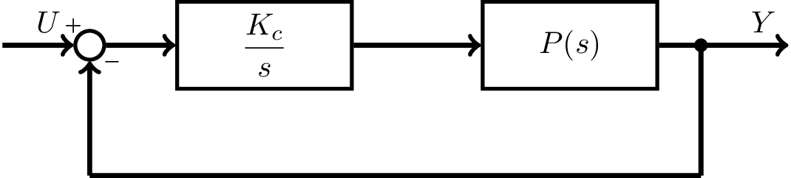
</figure>

### Entrata di Tipo k

Poiché l’uscita tende a seguire l’entrata, si considera un modello di riferimento ideale, dove l’uscita $Y_d$ è proporzionale all’entrata di un fattore $K_d$: $$Y_d=K_d\cdot U\Rightarrow W_\mathrm{d}(s)=K_d$$ Ma non può esistere un sistema fisico tale da avere una funzione a ciclo chiuso uguale ad una costante. Per cui si vuole calcolare l’errore di un sistema rispetto a questo riferimento ideale, per ottenerlo si considera:

<figure>
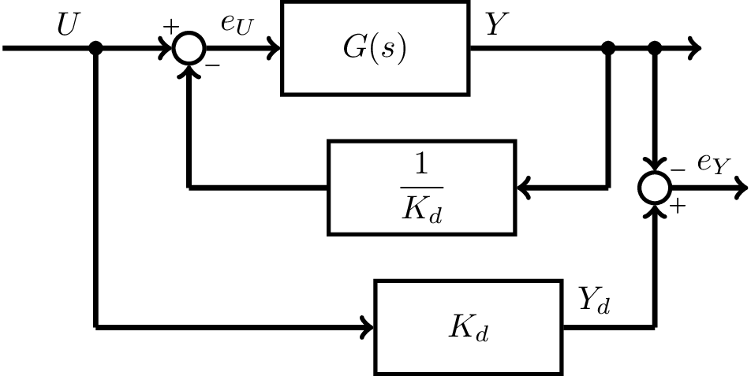
</figure>

Si ha quindi un errore in entrata $e_U$ dovuto alla differenza tra la funzione a ciclo chiuso ed il modello ideale: $$e_U=U-\displaystyle\frac{Y}{K_d}$$ Questo errore è nullo per valori di uscita uguali al riferimento ideale: $Y=Y_d=K_dU$.

Si ha un errore in uscita: $$\begin{gathered}
    e_Y:E(s)=Y_d-Y=K_dU(s)-W(s)U(s)\\
    K_dU(s)-\displaystyle\frac{K_dG(s)}{K_d+G(s)}U(s)\\
    \left(\displaystyle\frac{K_\mathrm{d}^2+K_dG(s)-K_dG(s)}{K_d+G(s)}\right)U(s)\\
    E(s)=\displaystyle\frac{K_\mathrm{d}^2}{K_d+G(s)}U(s)\tag{\stepcounter{equation}\theequation}
\end{gathered}$$ Per cui è necessario conoscere l’ingresso del sistema per poter determinare l’errore in uscita. Si analizza il caso di entrate del tipo $k$ polinomiale: $$u(t)=\displaystyle\frac{t^k}{k!}=\delta_{-(k+1)}(t)\Rightarrow U(s)=\displaystyle\frac{1}{s^{k+1}}$$ Si considera il processo $G(s)$ contente un numero $h$ di integratori: $$G(s)=\displaystyle\frac{G'(s)}{s^h}$$

Allora si ha un errore in uscita: $$E(s)=\displaystyle\frac{K_\mathrm{d}^2}{K_d+\displaystyle\frac{G'(s)}{s^h}}\frac{1}{s^{(k+1)}}$$ Si vuole determinare per quali valore di $h$ si ha un errore nullo a regime permanente, per cui si analizza: $$\lim_{s\to0}s\cdot E(s)=\lim_{s\to0}s\cdot\displaystyle\frac{K_\mathrm{d}^2}{K_d+\displaystyle\frac{G'(s)}{s^h}}\frac{1}{s^{(k+1)}}=\frac{K_\mathrm{d}^2}{G'(0)}\lim_{s\to0}\frac{1}{s^{k-h}}$$ Si definisce guadagno generalizzato $K_G$ di una funzione $G(s)={G'(s)}\cdot{s^{-h}}$, il suo valore per $s=0$ senza considerare gli integratori: $$K_G=G'(0)$$ Per cui l’errore in uscita e pieno regime dipende dal numero di integratori nel processo $G$: $$\displaystyle\frac{K_\mathrm{d}^2}{K_G}\lim_{s\to0}\frac{1}{s^{k-h}}=
    \begin{cases}
        +\infty &k>h\\
        \displaystyle\displaystyle\frac{\strut{K_\mathrm{d}^2}}{\strut{K_G}} &k=h\\
        0 &k<h
    \end{cases}$$ Quindi per rigettare un errore di tipo $k$, serviranno $k$ integratori nella catena diretta. Anche se inserire un numero maggiore di integratori annulla l’errore, non è consigliato inserire un numero maggiore dell’indispensabile di integratori nella catena diretta, poiché più aumenta il numero di poli nell’origine più il sistema tende all’ instabilità. Viene definito sistema di controllo di tipo $k$, un controllore tale da rendere l’errore a regime permanente costante per un’entrata di tipo $k$. Da notare che per un entrata di tipo $0$, non sono necessari integratori e l’errore a regime permanente è dato da: $$E_Y=\displaystyle\frac{K_\mathrm{d}^2}{K_d+K_G}$$ É possibile quindi creare una tabella che mostri l’andamento dell’errore rispetto ad entrate di tipo $k$ e un numero $h$ di integratori in catena diretta:

| $h,\:k$  |                      $0$                      |                    $1$                    |                    $2$                    | $\ldots$ |
|:--------:|:---------------------------------------------:|:-----------------------------------------:|:-----------------------------------------:|:--------:|
|   $0$    | $\displaystyle\frac{K_\mathrm{d}^2}{K_d+K_G}$ |                 $\infty$                  |                 $\infty$                  |          |
|   $1$    |                      $0$                      | $\displaystyle\frac{K_\mathrm{d}^2}{K_G}$ |                 $\infty$                  |          |
|   $2$    |                      $0$                      |                    $0$                    | $\displaystyle\frac{K_\mathrm{d}^2}{K_G}$ |          |
| $\vdots$ |                                               |                                           |                                           | $\ddots$ |

<figure>
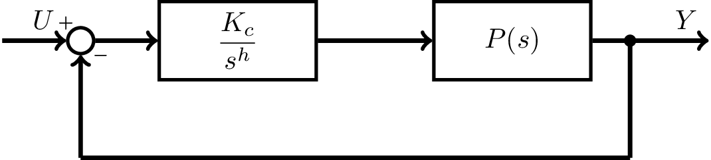
</figure>

### Disturbo di Tipo k

Nel caso sia presente un disturbo di tipo $k$ sulla catena diretta $z(t)=\delta_{-(k+1)}(t)$, per rigettarlo a regime permanente bisogna ottenere un’errore nullo in uscita considerando il disturbo come unica entrata del sistema.

<figure>
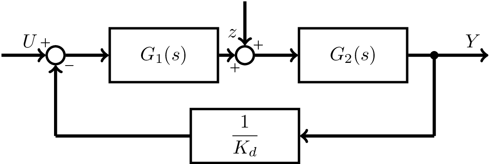
</figure>

Allora si ha una funzione a ciclo chiuso del disturbo: $$W_z(s)=\displaystyle\frac{G_2(s)}{1+G_1(s)G_2(s)}$$ Ed un’uscita a regime permanente $Y_z$: $$Y_z=\lim_{s\to0}s\cdot\displaystyle\frac{G_2(s)}{1+G_1(s)G_2(s)}\frac{1}{s^{k+1}}$$ Si considerano $h$ integratori in catena diretta a monte del disturbo per cui si ha: $$\begin{gathered}
    Y_z=\lim_{s\to0}s\cdot\displaystyle\frac{G_2(s)}{1+\displaystyle\frac{G_1'(s)}{s^k}G_2(s)\frac{1}{K_d}}\frac{1}{s^{k+1}}=\frac{K_d}{K_{G_1}}\lim_{s\to0}s^{h-k}\\
    Y_z=
    \begin{cases}
        0 &h>k\\
        \displaystyle\displaystyle\frac{\strut{K_d}}{\strut{K_{G_1}}} &h=k\\
        +\infty &h<k
    \end{cases}\tag{\stepcounter{equation}\theequation}
\end{gathered}$$

Dove $K_{G_1}$ è il guadagno generalizzato della funzione dove sono presenti gli integratori. Per cui per inseguire o rigettare un polinomio di tipo $k$ in entrata, servono $k$ integratori in catena diretta, a monte del disturbo. Per eliminare completamente il disturbo sono necessari $k+1$ integratori in catena diretta a monte del disturbo, questo comportamento viene chiamato astatismo, ovvero la capacità di un sistema di controllo di poter rigettare completamente un errore costante. Ma l’inserimento di poli nell’origine destabilizza il sistema, quindi è necessario inserire un altro elemento per recuperare la stabilità.

Se il disturbo fosse presente in catena di controreazione, il sistema non sarebbe in grado di rigettarlo.

Considerando il motore a corrente diretta, un possibile disturbo potrebbe essere il peso del carico che sta spostando, producendo un momento torcente costante nel tempo, per cui corrisponde ad un disturbo di tipo $0$ e necessita di un controllore di tipo $0$ a monte del disturbo per essere rigettato. Nel caso di un motore, si considera un riferimento ideale legato da una costante unitaria $Y_d=U$, ovvero per una qualsiasi entrata, l’uscita la deve seguire esattamente. Per cui l’errore risulta essere: $$\begin{gathered}
    e=\displaystyle\frac{1}{1+K_cK_{\mathrm{DC}}}
\end{gathered}$$ Dove $K_c$ è il guadagno del controllore di tipo $0$.

Se il motore opera su dei sistemi precisi, richiede un’errore nullo indipendentemente dal valore del guadagno del controllore quindi si considera un controllore di tpo $1$, ma ciò rende il transitorio molto lungo, poiché un integratore prima di diventare utile deve caricarsi per un certo intervallo di tempo. Ciò altera i punti di equilibrio del rotore, inserire un altro integratore per rigettare l’errore renderebbe il sistema instabile, per cui si può alterare manualmente il riferimento iniziale su cui opera il sistema.

<figure>
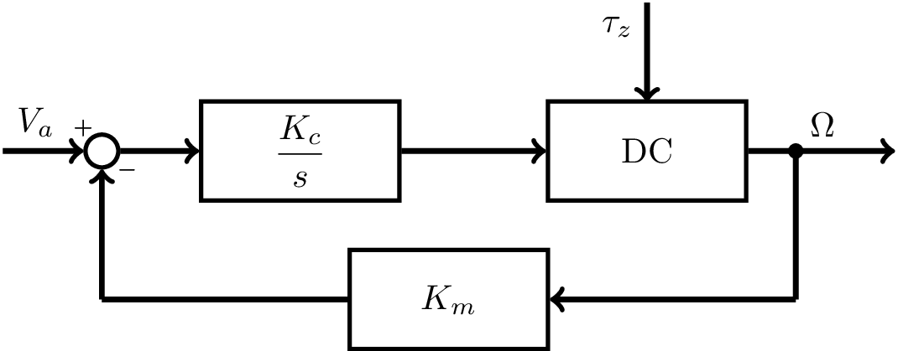
</figure>

### Controllore Proporzionale, Integrativo e Derivativo (PID)

Inserendo un derivativo è possibile prevedere l’andamento dell’errore, migliorando i margini di stabilità, aumenta il margine di fase di $+90^{\circ}$ e riduce la sovraelongazione ed i transitori. Un derivatore da solo azzererebbe il guadagno della funzione per $\omega\to0$ ed enfatizzerebbe le alte frequenza, dove sono spesso presenti errori. Poiché è un oggetto non causale deve essere approssimato. Un derivatore ha una funzione di trasferimento $W(s)=s$, per cui nel tempo agisce come una forma di attrito, poiché dipende dalla velocità dell’entrata.

Questo procedimento però non funziona per ogni sistema, è possibile che un sistema abbia troppo attrito, quindi un derivatore non porterebbe effetti desiderati.

Un controllore che contiene un parametro proporzionale integrativo e derivativo viene chiamato controllore PID. L’oggetto fisico può escludere il cavo di riferimento, poiché può essere computato. Un controllore PID rappresenta un controllore standard, poiché sono controllori di semplice implementazione e molto diffusi in ambito industriale.

<figure>
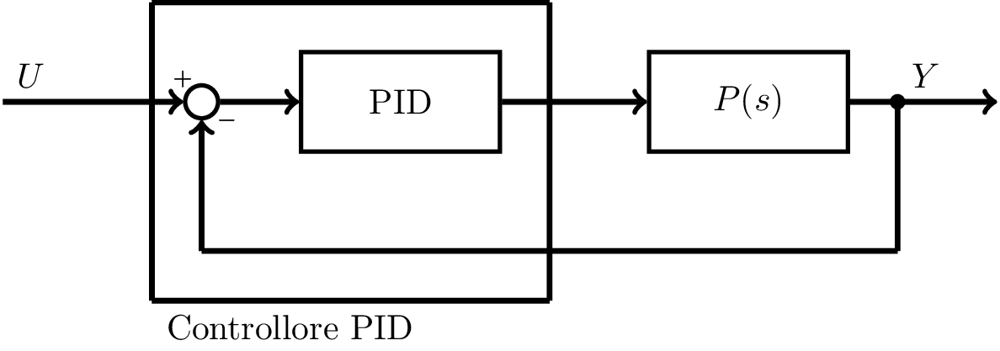
</figure>

Un controllore PID è quindi un oggetto avente funzione di trasferimento: $$C_{PID}(s)=K_c+K_i\displaystyle\frac{1}{s}+K_d s$$ Poiché un derivatore è un oggetto non causale, dipendendo da entrate future, si inserisce un polo lontano in un valore ${1}/{\varepsilon}$, per $\varepsilon$ arbitrariamente piccolo, in modo che risenta del polo solo per valori molto alti. Per cui la parte derivativa risulta essere: $$\displaystyle\frac{K_d s}{s\varepsilon+1}\to \displaystyle\frac{K_d s}{s\varepsilon+1}\frac{\displaystyle\frac{1}{s\varepsilon}}{\displaystyle\frac{1}{s\varepsilon}}=\frac{K_dN}{1+\displaystyle\frac{N}{s}}$$ Dove $N$ rappresenta un valore arbitrariamente grande. Un controllore PID può essere espresso, esplicitando il suo guadano come: $$C_\mathrm{PID}(s)=K_p\left(1+K_i\displaystyle\frac{1}{s}+K_d\frac{N}{1+\displaystyle\frac{N}{s}}\right)$$ Questa rappresenta una forma ideale, poiché un controllore PID fisico viene costruito usando tre componenti paralleli, per cui presentano guadagni differenti: $$C_\mathrm{PID}(s)=K_p+K_i\displaystyle\frac{1}{s}+K_d\frac{N}{1+\displaystyle\frac{N}{s}}$$

<figure>
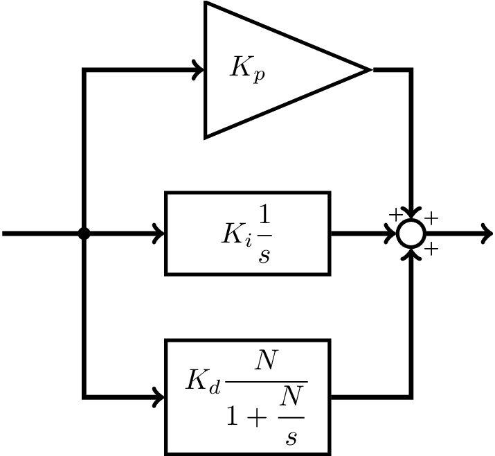
</figure>

Per costruire un derivatore si considera:

<figure>
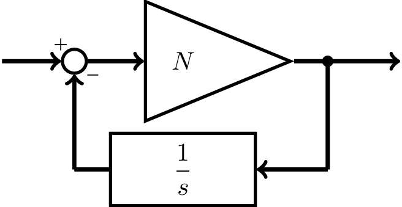
</figure>

Quest’oggetto fisicamente realizzabile ha una funzione a ciclo chiuso: $$W(s)=\displaystyle\frac{N}{1+\displaystyle\frac{N}{s}}$$ Per un guadagno sulla catena diretta tendente all’infinito $N\to\infty$, si comporta come un derivatore puro.

# Risposta Armonica

Per degli ingressi del tipo $u(t)=\sin(\omega t)$, si ipotizza che un processo $G(s)$ sia asintoticamente stabile, e quindi abbia un’uscita a regime permanente della stessa classe dell’ingresso, ovvero $y_p(t)=A\sin(\Omega t)$, nel dominio di Laplace: $$Y_p(s)=G(s)\cdot\displaystyle\frac{\omega}{s^2+\omega^2}$$ Si può scomporre in poli residui: $$Y_p(s)=\displaystyle\frac{R}{s-j\omega}+\frac{R^*}{s+j\omega}$$ I residui possono essere calcolati come: $$\begin{gathered}
    R=\lim_{s\to j\omega}(s-j\omega)Y_p(s)=\lim_{s\to j\omega}(s-j\omega)G(s)\cdot\displaystyle\frac{\omega}{s^2+\omega^2}\\
    \lim_{s\to j\omega}\cancel{(s-j\omega)}G(s)\displaystyle\frac{\omega}{\cancel{(s-j\omega)}(s+j\omega)}\\
    R=\displaystyle\frac{G(j\omega)\omega}{2j\omega}=\frac{G(j\omega)}{2j}\tag{\stepcounter{equation}\theequation}\\
    R^*=-\frac{G^*(j\omega)}{2j}\tag{\stepcounter{equation}\theequation}
\end{gathered}$$ La funzione $G(j\omega)$, può essere espressa in termini polari come: $$\begin{gathered}
    G(j\omega)=|G(j\omega)|\exp{{j\phase{G(j\omega)}}}\\
    G^*(j\omega)=|G(j\omega)|\exp({-j\phase{G(j\omega)}})
\end{gathered}$$ L’uscita si può quindi esprimere come: $$\begin{gathered}
    Y_p(s)=\displaystyle\frac{1}{2j}\left(\frac{G(j\omega)}{s-j\omega}-\frac{G^*(j\omega)}{s+j\omega}\right)\\
    y_p(t)=\displaystyle\frac{1}{2j}(G(j\omega)e^{j\omega t}-G^*(j\omega)e^{-j\omega t})\\
    \displaystyle\frac{1}{2j}\left(|G(j\omega)|\exp({j\phase{G(j\omega)}})e^{j\omega t}-|G(j\omega)|\exp({-j\phase{G(j\omega)}})e^{-j\omega t}\right)\\
    |G(j\omega)|\left(\displaystyle\frac{\exp({j\left(\omega t+\phase{G(j\omega)}\right)})-\exp({-j\left(\omega t+\phase{G(j\omega)}\right)})}{2j}\right)\\
    y_p(t)=|G(j\omega)|\sin\left(\omega t+\phase{G(j\omega)}\right)\tag{\stepcounter{equation}\theequation}
\end{gathered}$$

La risposta è proporzionale al modulo $|G(j\omega)|$. Data una certa pulsazione la risposta si annulla, per poi diventare negativa, per cui non si può amplificare una frequenza arbitrariamente:

<figure>
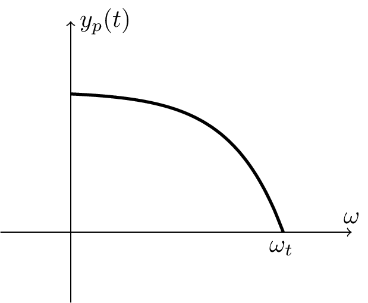
</figure>

Per cui si analizza il comportamento di una funzione $G(s)$ nel dominio di Laplace, considerando solamente la parte immaginaria della variable complessa $s=j\omega$. Quest’analisi corrisponde ad una trasformata di Fourier: $$\mathcal{L}_-\{y_p(t)\}\bigg|_{s=j\omega}=\displaystyle\int_{0^-}^{+\infty}g(t)e^{-j\omega t}\mathrm{d}t=\mathscr{F}_-\{g(t)\}$$ Per analizzare il comportamento della risposta del sistema, bisogna analizzare gli andamenti del modulo e della fase del processo rispetto ad una pulsazione $\omega$.

## Diagrammi di Bode

Si analizza il modulo e la fase di una funzione $G(j\omega)$, con un guadagno normalizzato: $$G(j\omega)=K_g\displaystyle\frac{(j\omega\tau_i+1)\cdots(j\omega\tau_n+1)}{(j\omega\tau_k+1)\cdots(j\omega\tau_m+1)}$$ Per facilitare l’analisi rispetto ad ogni polo della funzione si considera una scala logaritmica in decibel: $$\begin{gathered}
    \big|x\big|_{\mathrm{d}B}=20\log_{10}|x|\\
    |G(j\omega)|_{\mathrm{d}B}=|K_g|_{\mathrm{d}B}+|j\omega\tau_i+1|_{\mathrm{d}B}+\cdots+|j\omega\tau_n+1|_{\mathrm{d}B}-|j\omega\tau_k+1|_{\mathrm{d}B}-\cdots-|j\omega\tau_m+1|_{\mathrm{d}B}\tag{\stepcounter{equation}\theequation}
\end{gathered}$$ Il modulo in decibel del guadagno della funzione $K_g$, risulta una costante additiva: $$\big|K_g\big|_{\mathrm{d}B}=20\log_{10}|K_g|$$ Per un guadagno unitario $K_g=1$, si ha modulo nullo in decibel  
Essendo il guadagno $K_g$, un numero reale, la sua fase dipende solamente dal suo segno per cui: $$\phase{K_g}=
    \begin{cases}
        0^\circ&K_g>0\\
        -180^\circ&K_g<0
    \end{cases}$$ Per i diagrammi di Bode vengono usati i gradi invece dei radianti per misurare la fase.

Si analizza un termine generico $(s\tau_i+1)$. Il suo modulo è: $$\begin{gathered}
    |j\omega\tau+1|=\sqrt{\omega^2\tau^2+1}
\end{gathered}$$ Viene espresso in decibel: $$20\log_{10}\left(\sqrt{\omega^2\tau^2+1}\right)=10\log_{10}(\omega^2\tau^2+1)$$ Si approssima l’andamento del modulo quando la frequenza in entrata al sistema è molto maggiore o minore del valore del polo, ricordando la relazione tra il polo ed il tempo caratteristico $\tau=p^{-1}$: $$\begin{gathered}
    10\log_{10}(\omega^2\tau^2+1)\approx
    \begin{cases}
        20\log_{10}1&\omega<<p\\
        20\log_{10}(\omega\tau)&\omega >>p
    \end{cases}\\
    \begin{cases}
        0&\omega<<p\\
        20\log_{10}\omega+20\log_{10}\tau\approx20\log_{10}\omega&\omega>>p
    \end{cases}\\
    |j\omega\tau+1|_{\mathrm{d}B}\approx\begin{cases}
        0&\omega<<p\\
        20\log_{10}\omega&\omega>>p
    \end{cases}
\end{gathered}$$

Viene definito il fattore $\lambda=\log_{10}\omega$, per cui: $$|j\omega\tau+1|_{\mathrm{d}B}\approx
    \begin{cases}
        0&\omega<<p\\
        20\lambda&\omega>>p
    \end{cases}$$

<figure>
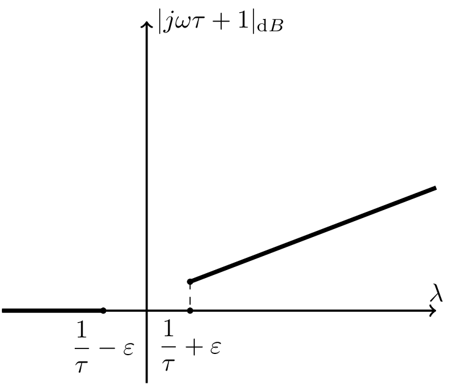
</figure>

Questa approssimazione non è definita nell’intorno del polo $\tau^{-1}$, per cui si considera l’andamento del modulo nell’intervallo su due intervalli separati: $$|j\omega\tau+1|_{\mathrm{d}B}\approx
    \begin{cases}
        0&\omega<\displaystyle\frac{\strut{1}}{\strut{\tau}}-\varepsilon\\
        20\lambda&\omega>\displaystyle\frac{\strut{1}}{\strut{\tau}}+\varepsilon
    \end{cases}$$ Estendendo questa approssimazione sull’intorno dello zero o del polo, chiamato punto di rottura, si ha un errore di $6\pm\,\mathrm{d}B$, trascurabile poiché si vuole rappresentare un andamento qualitativo e non quantitativo: $$|j\omega\tau+1|=\begin{cases}
        0&\omega<p\\
        20\lambda&\omega>p
    \end{cases}$$

<figure>
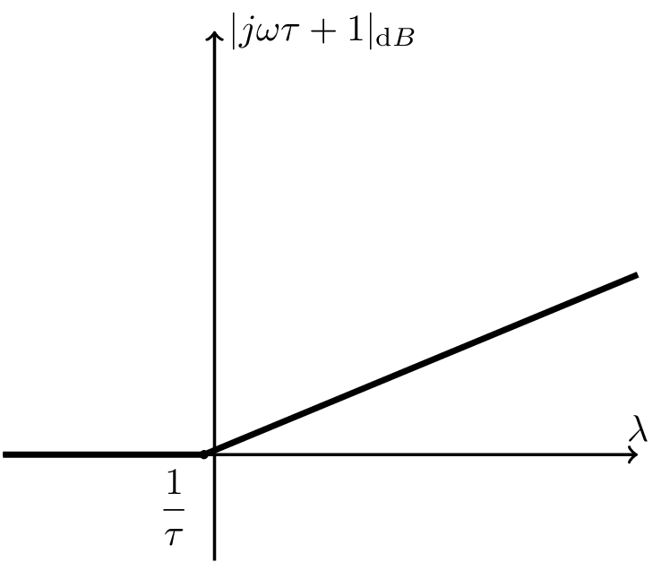
</figure>

Il modulo aumenta linearmente all’aumentare di $\lambda$. Si vuole rappresentare rispetto alla pulsazione per cui si considera $\omega=10^{\lambda}$, il modulo quindi aumenta linearmente rispetto a incrementi esponenziali della pulsazione $\omega$. I diagrammi di Bode sono quindi rappresentati su una carta semi logaritimica, divisa in decadi, dove il modulo cresce di $20\,\mathrm{d}B$ ogni decade in caso di uno zero, mentre scende di $20\,\mathrm{d}B$ in caso di un polo.

La fase gode delle stesse proprietà del logaritmo: $$\begin{gathered}
    \phase{a\cdot b}=\phase{a}+\phase{b}\\
    \phase{a\cdot b^{-1}}=\phase{a}-\phase{b}
\end{gathered}$$ Per cui si può esprimere la fase della funzione $G(j\omega)$ come: $$\phase{G(\omega)}=\phase{K_g}+\phase{j\omega\tau_i+1}+\cdots+\phase{j\omega\tau_n+1}-\phase{j\omega\tau_k+1}-\cdots-\phase{j\omega\tau_m+1}$$

La fase di un termine generico $\phase{j\omega\tau+1}$ aumenta da un valore iniziale di $0^{\circ}$, per $\omega=0$, fino a raggiungere asintoticamente un valore massimo di $90^{\circ}$. $$\begin{gathered}
    \phase{j\omega\tau+1}=\begin{cases}
        \phase{1}=0^{\circ}&\omega=0\\
        \phase{j\omega}=+90^{\circ}&\omega\to\infty
    \end{cases}
\end{gathered}$$

Per cui la fase di uno zero è inclusa nell’intervallo $\phase{j\omega\tau+1}\in[0^{\circ},90^{\circ}]$, mentre per un polo si ha: $$\phase{\displaystyle\frac{1}{j\omega\tau+1}}=\phase{1}-\phase{j\omega\tau+1}\in(-90^{\circ},0^{\circ}]$$ Si approssima il cambiamento di fase come se fosse lineare nell’intorno centrato del polo $[0.1p,10 p]$.

<figure>
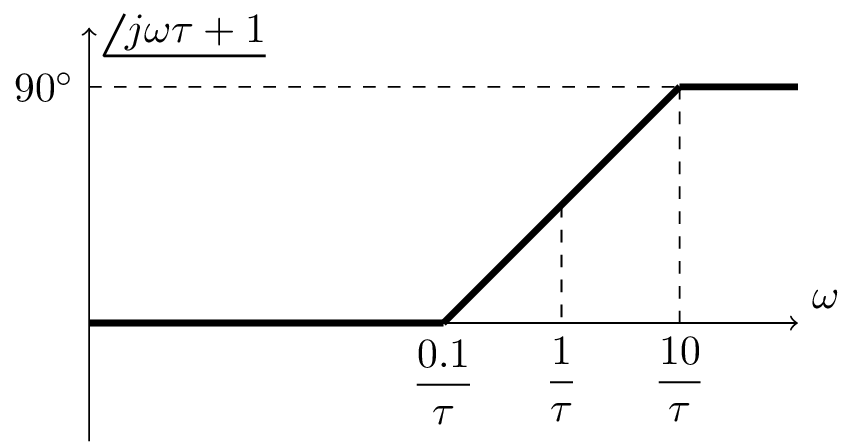
</figure>

Quest’approssimazione presenta un’errore di $\pm6^{\circ}$. Per uno zero in $0$, il modulo aumenta di $20\,\mathrm{d}B$ su tutto l’intervallo di $\omega$, partendo da $-\infty\, \mathrm{d}B$, tagliando il diagramma di Bode per $\omega=1$. Ha una fase costante pari a $90^{\circ}$.  
Per un polo in $0$, il modulo diminuisce di $20\,\mathrm{d}B$ ogni decade partendo da $+\infty\,\mathrm{d}B$, ed ha una fase costante di $-90^{\circ}$. Poiché un polo nell’origine è un oggetto al limite di stabilità, queste caratteristiche in modulo e fase individuano oggetti ai limiti di stabilità.

<figure>

</figure>

Si considera un trinomio generico: $$\displaystyle\frac{s^2}{\omega_n^2}+\frac{2\zeta s}{\omega_n}+1\to_{s=j\omega}1-\frac{\omega^2}{\omega_n^2}+\frac{2\zeta\omega}{\omega_n}j$$ Per $\omega>>\omega_n$ il modulo è: $$\begin{gathered}
    \left|1-\frac{\omega^2}{\omega_n^2}+\frac{2\zeta\omega}{\omega_n}j\right|=20\log_{10}\left(\sqrt{\left(1-\displaystyle\frac{\omega^2}{\omega_n}^2\right)^2+\frac{4\zeta^2\omega^2}{\omega_n^2}}\right)\\
    10\log_{10}=\left(4\zeta^2\displaystyle\frac{\omega^2}{\omega_n^2}+\frac{\omega^4}{\omega_n^4}\right)\approx40\log_{10}\left(\displaystyle\frac{\omega}{\omega_n}\right)
\end{gathered}$$ Per $\omega<<\omega_n$ il modulo è nullo, poiché: $$20\log_{10}\left(\sqrt{\left(1-\displaystyle\frac{\omega^2}{\omega_n}^2\right)^2+\frac{4\zeta^2\omega^2}{\omega_n^2}}\right)\approx20\log_{10}1=0$$ Per $\omega=\omega_n$, il modulo dipende dallo smorzamento dei poli: $$\begin{gathered}
    20\log_{10}\left(\sqrt{\left(1-\displaystyle\frac{\omega^2}{\omega_n}^2\right)^2+\frac{4\zeta^2\omega^2}{\omega_n^2}}\right)=20\log_{10}2\zeta,\:\zeta\in[0,1]\\
    20\log_{10}2\zeta\in(-\infty,20\log_{10}2]
\end{gathered}$$ Esprimendo il modulo rispetto al fattore $\lambda$ si ha: $$\left|1\displaystyle-\frac{\omega^2}{\omega_n^2}+\frac{2\zeta\omega}{\omega_n}j\right|_{\mathrm{d}B}=\begin{cases}
        0&\omega<\omega_n-\varepsilon\\
        20\log_{10}2\zeta&\omega=\omega_n\\
        40\lambda&\omega>\omega_n+\varepsilon
    \end{cases}$$ Per uno smorzamento nullo è presenta un asintoto verticale ad una pulsazione $\omega=\omega_n$, se non fosse uguale, allora il diagramma di Bode del modulo presenterebbe un affossamento nell’intorno di $\omega_n$, la cui profondità aumenta all’aumentare dello smorzamento. Questo affossamento è ciò che causa per i poli il fenomeno della risonanza, dove per una certa pulsazione si ha un guadagno maggiore del guadagno statico del sistema. Per gli zeri si verifica il fenomeno dell’antirisonanza, dove una certa pulsazione risulta estremamente attenuata. La sovraelongazione è un altro effetto dello smorzamento, aumenta fino ad un valore massimo per uno smorzamento massimo.  
Viene definito modulo alla risonanza $M_r$ la distanza tra il picco di risonanza ed il guadagno statico del sistema.

<figure>
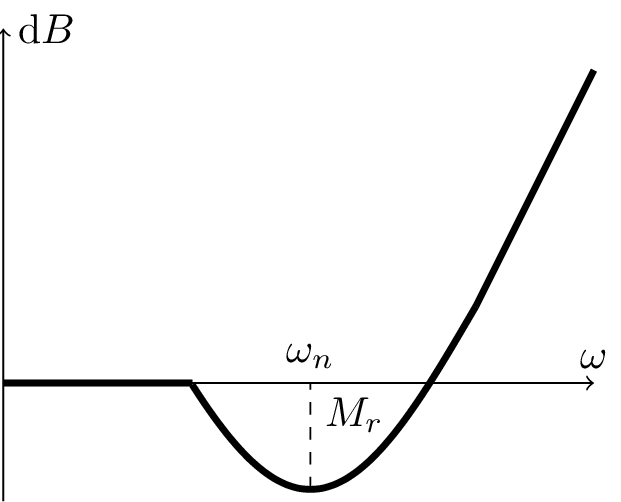
</figure>

Per $\omega=0$, la fase del trinomio è nulla: $\phase{1}=0^{\circ}$.

Mentre per $\omega\to\infty$, si ha una fase: $$\displaystyle\lim_{\omega\to\infty}\phase{1-\displaystyle\frac{\omega^2}{\omega_n^2}+2\zeta\frac{\omega}{\omega_n}j}=\phase{-\displaystyle\frac{\omega^2}{\omega_n^2}}=180^{\circ}$$

Mentre per $\omega=\omega_n$, la fase è: $\phase{2\zeta j}=90^{\circ}$.

Quindi la fase di un trinomio generico si può approssimare l’andamento della fase come: $$\phase{1-\displaystyle\frac{\omega^2}{\omega_n^2}+2\zeta\frac{\omega}{\omega_n}j}=\begin{cases}
        0&\omega<0.1\omega_n\\
        90^{\circ}&\omega=\omega_n\\
        180^{\circ}&\omega>10\omega_n
    \end{cases}$$ Quindi si verifica un cambiamento di fase nell’intorno di $\omega_n$ da $0^{\circ}$ a $-180^{\circ}$, la pendenza di questa variazione aumenta al diminuire dello smorzamento, “schiacciando” la curva nel diagramma di Bode, fino a presentare una discontinuità per smorzamenti nulli. Nei sistemi causali sono presenti sempre più poli che zeri, per cui i loro diagrammi di Bode tendono sempre a scendere:

<figure>

</figure>

## Diagramma di Nyquist

Data una funzione di trasferimento $M(s)=\displaystyle\frac{s-a}{s-b}$, e data una qualsiasi curva chiusa $\mathbf{G}$ sul piano, e un punto $s$ che la percorre in senso orario. Allora lo spostamento della variabile complessa $s$ lungo la curva $\mathbf{G}$, sotto certe condizioni, risulta in uno spostamento della funzione $M(s)$ lungo un’altra curva chiusa attorno all’origine:

<figure>
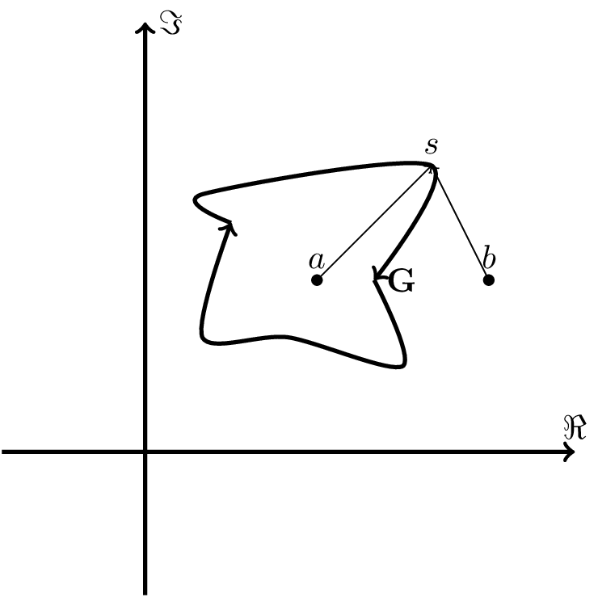
</figure>

Per determinare se lo spostamento effettuato da $M(s)$ nel piano di Gauss a seguito di una variazione di $s$ formi una curva chiusa, si analizza il cambiamento di fase $\phase{M(s)}$. Se il cambiamento di fase della funzione rispetto ad $s$ è nullo allora la curva non ruota attorno all’origine, se è un multiplo di $2\pi$: $2k\pi$ allora la curva ha ruotato $k$ volte attorno all’origine. Per determinare il cambiamento di fase:

$$\phase{M(s)}=\phase{s-a}-\phase{s-b}\\$$

Poiché $s$ ruota attorno allo zero $a$, mentre non ruota attorno al polo $b$, il cambiamento di fase $\phase{s-a}$ risulta essere uguale ad una rotazione completa, ovvero $2\pi$, mentre $\phase{s-b}=0$ poiché la curva non ruota attorno a $b$. In base alla fase di $\vec{as}$ e $\vec{bs}$ si può ottenere il cambiamento di fase della funzione di trasferimento iniziale. Se un punto $s$ ruota intorno ad uno zero oppure un polo, la fase del vettore distanza $\vec{\alpha s}$ aumenta fino a $k$-volte le rotazioni attorno a quello zero o polo. In questo caso si ha:

$$\phase{M(s)}=2\pi+0$$

Quindi la funzione $M(s)$ ruota attorno all’origine.

<figure>

</figure>

Gli unici termini che contribuiscono al cambiamento di fase di $M(s)$ sono gli elementi interni alla curva. Poiché il cambiamento di fase è sempre un numero intero di rotazioni complete intorno all’origine del piano di Gauss. Si definisce l’indicatore logaritmico $R_{M,0}$, che rappresenta il numero di queste rotazioni, come la differenza tra il numero degli zeri interni alla curva $\mathbb{G}$ ed il numero dei poli interni alla curva $\mathbb{G}$: $$R_{M,0}=\#\mathrm{zeri}_{\in \mathbf{G}}[M(s)]-\#\mathrm{poli}_{\in \mathbf{G}}[M(s)]$$

Tramite questo indicatore è possibile determinare graficamente la differenza poli-zeri di una qualsiasi funzione di trasferimento in $s$.

Si considera un sistema controreazionato, avente una funzione a ciclo aperto $F(s)$, ed una funzione a ciclo chiuso $W(s)$: $$\begin{gathered}
    W(s)=\displaystyle\frac{F(s)}{1+F(s)}=1+\frac{N(s)}{D(s)}=\frac{D(s)+N(s)}{D(s)}
\end{gathered}$$

<figure>
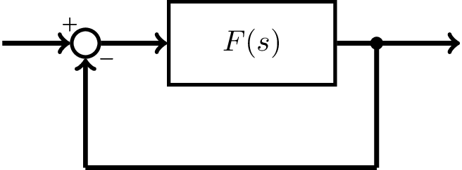
</figure>

I poli della funzione a ciclo chiuso corrispondo ai poli di $F$. Si traccia il percorso di Nyquist, una curva chiusa che contiene tutti gli oggetti aventi parte reale positiva. La curva si trova interamente sull’asse immaginario, la chiusura avviene all’infinito, per cui la risposta armonica corrisponde al percorso di Nyquist:

<figure>
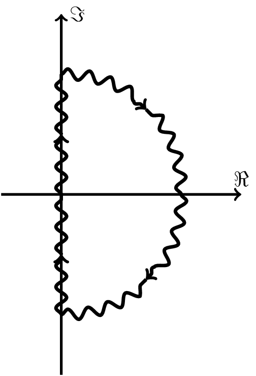
</figure>

Applicando il teorema dell’indicatore logaritmico su $1+F(s)$ su questa curva si ottiene: $$R_{1+F,0}=\#\mathrm{zeri}_\mathrm{Nyq}[1+F(s)]-\#\mathrm{poli}_\mathrm{Nyq}[1+F(s)]$$

Si considera la funzione $1+F(s)$ e la funzione a ciclo chiuso: $$\begin{gathered}
    1+F(s)=\displaystyle\frac{N(s)+D(s)}{D(s)}\\
    W(s)=\displaystyle\frac{N(s)}{D(s)+N(s)}
\end{gathered}$$ Gli zeri della funzione $1+F(s)$ corrispondo ai poli della funzione a ciclo chiuso, e i poli della funzione $1+F(s)$ equivalgono agli zeri della funzione a ciclo aperto $F(s)$, per cui la differenza poli zeri è data da:

$$R_{1+F,0}=\#\mathrm{poli}_\mathrm{Nyq}[W(s)]-\#\mathrm{poli}_\mathrm{Nyq}[F(s)]$$

Un sistema è stabile se tutti i poli della sua funzione di trasferimento hanno parte reale positiva, per cui se il sistema è stabile il numero di poli a parte reale positiva è nullo: $\#\mathrm{poli}_\mathrm{Nyq}[W(s)]=0$, allora il numero di rotazioni di $W(s)$ attorno al punto zero è dato dal solo numero dei poli di $1+F(s)$. Questa relazione è reciproca per cui si ha che:

$$\#\mathrm{poli}_\mathrm{Nyq}[W(s)]=0:\mbox{ sistema stabile}\iff R_{1+F(s),0}=-\#\mathrm{poli}_\mathrm{Nyq}[1+F(s)]$$

Traslando la curva di Nyquist di $-1$, si ottiene la risposta armonica della funzione a ciclo aperto $F(s)$. L’indicatore logaritmico di $1+F(s)$ attorno a $0$, quindi corrisponde all’indicatore logaritmico di $F(s)$ attorno a $-1$:

$$R_{F(s),-1}=R_{1+F(s),0}=-\#\mathrm{poli}_\mathrm{Nyq}[F(s)]$$

Tramite questa relazione è possibile analizzare il sistema molto più facilmente, poiché la funzione a ciclo aperto è più facilmente alterabile. Se la funzione a ciclo aperto è asintoticamente stabile, allora affinché la funzione a ciclo chiuso sia anch’essa stabile, è necessario e sufficiente che il grafico di $F(s)$ non ruoti intorno a $-1$. Questo grafico corrisponde alla risposta armonica della funzione $F(s)$, e viene definito diagramma di Nyquist. A partire dai dati sulla risposta armonica forniti dal diagramma di Bode è possibile realizzare il diagramma polare di Nyquist della funzione $F(s)$.

Poiché su un diagramma di Bode vengono rappresentati solo incrementi positivi di $\omega$, si ottiene solo una metà del diagramma di Nyquist. Considerando frequenze negative il modulo rimane invariato, mentre la fase sarà opposta. Per cui per il diagramma di Nyquist è simmetrico rispetto all’asse delle ascisse.

Se la fase di una funzione di trasferimento non scende al di sotto dei $-180^{\circ}$ non può ruotare attorno a $-1$. Poiché il modulo tende sempre a $0$ per ogni funzione di trasferimento stabile, per $\omega\to\infty$ il diagramma tende asintoticamente verso l’origine. Il sistema è quindi stabile per ogni controllore proporzionale maggiore di zero, se invece si sceglie un $K_c$ minore di zero, il sistema è stabile fino a quando il diagramma di Nyquist non include il punto $-1$. Aumentando il guadagno il diagramma si espande o si comprime, mentre la fase rimane costante, per cui esiste un intervallo di guadagni negativi dove il diagramma non contiene il punto $-1$, di conseguenza il sistema è stabile in quell’intervallo:

<figure>

  

</figure>

In caso la curva di Nyquist passi sopra un ad un polo, allora si considera un percorso uncinato in modo che $s$ gira intorno al polo $p$, questa rotazione attorno al polo causa una variazione di fase aggiuntiva di $+180^{\circ}$, il raggio di questa semicirconferenza è arbitrariamente piccolo, poiché deve escludere solo il punto coincidente con il polo. Può succedere per ogni polo immaginario puro, o per un polo nell’origine:

<figure>
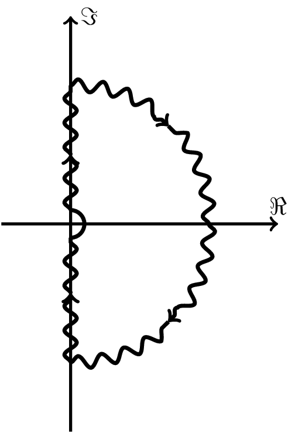
</figure>

In caso la fase cominci da $-90^{\circ}$ e raggiunga $-180^{\circ}$, il diagramma di Nyquist non completa una curva chiusa, poiché diventa parallelo all’asse immaginario per $\omega\to\infty$. Si considera quindi una chiusura all’infinito in senso orario da $+90^{\circ}$ a $-90^{\circ}$, aggiungendo una variazione di fase di $-180^{\circ}$. Per cui è sempre stabile per controllori proporzionali maggiori di zero, mentre è instabile per valori di $K_c$ minori di zero, poiché la chiusura all’infinito considera tutti gli elementi con parte reale maggiore di zero, per valori negativi di $K_c$ comprende sicuramente il punto $-1$:

<figure>

</figure>

Se la fase parte da $-90^{\circ}$ e finisce a $-270^{\circ}$, il diagramma interseca l’asse delle ascisse in un punto negativo $\alpha$, potrebbe essere necessario comprimere il grafico con $K_c\in[0,K_{\max}]$, per allontanare il punto di intersezione da $-1$:

<figure>

</figure>

## Margini di Stabilità

Viene definito questo guadagno massimo $K_{\max}$ margine di guadagno $m_g$, il valore massimo per cui il modulo valga $-1$.

$$m_g\cdot\alpha\geq|-1|\Rightarrow m_g=\displaystyle\frac{1}{\alpha}$$

Dove $\alpha$ è il punto di intersezione del grafico con l’asse dei reali. Per un guadagno uguale al margine di guadagno, il sistema oscilla sul limite di stabilità, per valori di guadagno maggiore del margine di guadagno il sistema ha dinamiche oscillatorie marcate.

Viene definito margine di fase $m_{\varphi}$, il massimo angolo di cui si può ruotare il diagramma di Nyquist prima di intersecare il punto $-1$. Ovvero la distanza nel diagramma di Bode tra la fase e $-180^{\circ}$, per $\omega=\omega_t$. $\omega_t$ viene definita pulsazione di taglio per cui il modulo in decibel per quella frequenza è nullo. Rappresenta di quando si può sfasare il ciclo aperto: $$m_{\varphi}=180^{\circ}-\big|\phase{F(j\omega_t)}\big|$$

<figure>
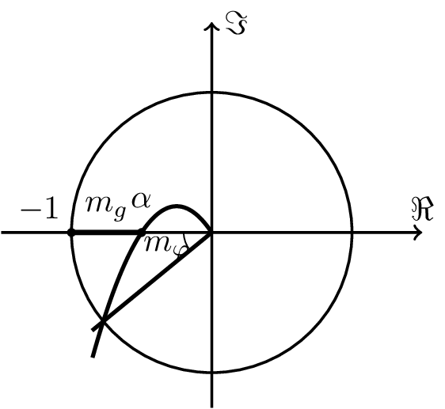
</figure>

Se la curva della funzione a ciclo aperto $F(s)$ passa a destra del punto $-1$ allora il sistema è stabile. Se passa per il punto $-1$ si trova ai limiti di stabilità, ed ha modulo $|F(j\omega)|=1$ e fase $\phase{F(j\omega)}=-180^{\circ}$, per cui l’entrata $u(t)=\sin(\omega t)$, esce dal sistema ribaltata di $-180^{\circ}$: $y(t)=-\sin(\omega t)$ e ritorna ad essere positiva grazie alla catena di controreazione.

Se il diagramma di Nyquist del sistema passa a sinistra del punto $-1$ allora è instabile, se non ha zeri a parte reale positiva, altrimenti bisogna calcolare il margine di fase per ruotare abbastanza volte intorno al punto $-1$.

Tracciando il modulo della funzione a ciclo chiuso rispetto alla frequenza, si individuano il modulo alla risonanza $M_r$ definito come la distanza tra il guadagno statico ed il picco del modulo, se il modulo rispetto alla frequenza è strettamente decrescente, il modulo alla risonanza è nullo.

Si definisce banda passante $\omega_{-3}$, la frequenza per cui il modulo della funzione a ciclo chiuso scende al di sotto di $-3\,\mathrm{d}B$. Analogamente al tempo caratteristico, rappresenta la massima pulsazione trattata dal sistema prima che l’effetto diminuisce considerevolmente.

La sovraelongazione $s$ è direttamente proporzionale al modulo alla risonanza $s\propto Mr$, entrambi sono legati allo smorzamento del termine trinomio $\zeta$ poiché per uno smorzamento piccolo si avrà una risonanza elevata.

Il tempo di salita $t_s$ e la banda passante sono circa inversamente proporzionali $t_s\cdot\omega_{-3}\approx \mathrm{cost.}$ poiché più un sistema risponde velocemente, $t_s<<1$, più è in grado di oscillare velocemente, quindi più la frequenza massima supportata $\omega_{-3}$ è elevata. Per un aumento del guadagno, aumentano sia la banda passante che la pulsazione di taglio, per cui le due frequenze sono direttamente proporzionali, mentre diminuisce il tempo di salita, per cui: $$\omega_t\propto\omega_{-3}\cdot t_s$$

Il margine di fase corrisponde alla distanza nel diagramma di Bode della fase tra il grafico della funzione a ciclo aperto nel punto $\omega_t$ e $-180^{\circ}$. Mentre il margine di guadagno corrisponde alla distanza nel diagramma di Bode del modulo tra il grafico della funzione a ciclo aperto nel punto dove la fase corrisponde a $-180^{\circ}$ e i $0\,\mathrm{d}B$:

<figure>

</figure>

Aumentando il guadagno, si diminuiscono gli errori a regime permanente e il tempo di salita, ma si diminuiscono i margini di stabilità poiché il grafico della frequenza viene traslato verso l’alto aumentando sia la banda passante $\omega_{-3}$ che la pulsazione di taglio $\omega_t$. Mentre il tempo di salita $t_s$ ed il margine di fase $m_{\varphi}$ diminuiscono.

Viene definita robustezza di un sistema la sua capacità di resistere ad errori. Viene definita resilienza la capacità di un sistema di ritornare autonomamente allo stato di funzionamento in seguito a destabilizzazioni, è necessaria una “coscienza" del sistema per determinare se si trova in uno stato di funzionamento nominale.

## Sistemi a Ritardo Finito

Per alcuni sistemi fisici è presente un ritardo finito nella misurazione dello stato del sistema, indotto da fenomeni intrinsechi al sistema o esterni ad esso. L’uscita $f(t)$ è quindi traslata nel tempo di un fattore $\tau$ nel dominio della frequenza questo ritardo viene rappresentato come: $$\mathcal{L}_-(f(t-\tau))=F(s)e^{-s\tau}$$ Il ritardo può essere causato dalla dislocazione spaziale del controllore. Come in un laminatoio, un macchinario composto da due rulli di raggio uguale che variano l’altezza di una lastra di metallo e quindi anche la sua velocità di uscita, questa velocità può essere misurata ad una distanza minima pari al raggio del rullo, causando un ritardo.

Un altro sistema con ritardo è una doccia, dove l’effetto del cambiamento di temperatura appare con un certo di ritardo dopo aver ruotato la manopola.

Questo ritardo nella misurazione viene rappresentato come un esponenziale sulla catena di misura che precede il trasduttore.

<figure>
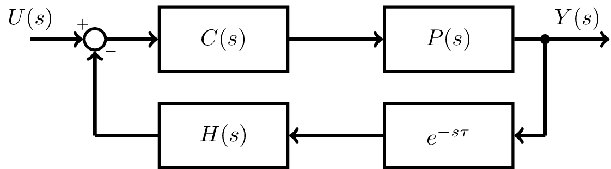
</figure>

Il modulo del ritardo per una sinusoide in entrata è: $$|e^{-\tau j\omega}|_{\mathrm{d}B}=20\log_{10}1=0$$ Il ritardo non altera quindi il modulo della funzione a ciclo aperto. Invece ha una fase: $$\phase{e^{-\tau j\omega}}=-\tau\omega$$ Poiché il diagramma di Bode esprime la frequenza su una scala logaritmica, questo andamento lineare rispetto alla frequenza corrisponde ad un andamento decrescente esponenzialmente.

Se questo andamento esponenziale compare dopo la pulsazione di taglio $\omega_t$, non influisce sul margine di fase del sistema e quindi sulla sua stabilità.

Invece se è presente prima della pulsazione di taglio del sistema il margine di fase diminuisce esponenzialmente all’aumentare della distanza con $\omega_t$, rischiando di abbassare la fase al di sotto dei $-180^{\circ}$, rendendo il sistema instabile. Per cui anche per un ritardo $\tau$ relativamente piccolo si potrebbe portare il sistema all’instabilità. Si potrebbe aumentare la pulsazione di taglio $\omega_t$, diminuendo il guadagno del sistema, per diminuire l’effetto del ritardo. Ma diminuire il guadagno di un sistema compromette la sua abilità di rigettare errori e di riprodurre entrate di tipo $k$.

Per cui per evitare l’instabilità di un sistema con ritardo è necessario che le entrate applicate al sistema siano molto lente avendo delle frequenze molto basse.

<figure>

</figure>

## Sistemi a Fase Non Minima

Un sistema dove sono presenti almeno un polo e o uno zero a parte reale positiva a ciclo aperto, viene chiamato sistema di controllo a fase non minima. I sistemi che presentano solo zeri a parte reale positiva possono essere stabilizzati. In questo caso si ha una fase che tende a scendere al di sotto dei $-180^{\circ}$, per cui per guadagni elevati il sistema tende all’instabilità. Considerando la funzione a ciclo chiuso: $$W(s)=\displaystyle\frac{N(s)}{K_cN(s)+D(s)}$$ All’aumentare del guadagno il denominatore della funzione a ciclo chiuso tende al numeratore, quindi tende all’instabilità, avendo la funzione a ciclo aperto con uno zero a parte reale positiva.

Se il sistema presenta almeno uno zero a parte reale positiva, scomponendo l’uscita in fratti semplici rispetto ad un’entrata a gradino $\delta_{-1}(t)$ si ottiene, per un numero dispari di zeri a parte reale positiva, il residuo del gradino minore di zero. Quindi si ha una risposta nel transitorio opposta all’andamento del sistema a regime permanente, per cui si può notare dalla risposta come un guadagno elevato possa influenzare la convergenza degli andamenti del sistema e quindi la sua stabilità. $$\begin{gathered}
    Y(s)=\displaystyle\frac{R_0}{s}+\cdots+\frac{R_i}{s\tau_i+1}+\cdots+\frac{R_n}{s\tau_n+1},\:R_i<0\\
    y(t)=R_0\delta_{-1}(t)+\cdots-|R_i|e^{-\tau_it}+\cdots+R_ne^{-\tau_nt}
\end{gathered}$$ Si misura quindi una risposta inizialmente opposta rispetto alla forzante inserita sul sistema, ciò può portare ad un’instabilità in caso questa risposta opposta non sia limitata.

<figure>

</figure>

## Sintesi Diretta

Dato un sistema avente una funzione a ciclo chiuso: $$W(s)=\displaystyle\frac{C(s)P(s)}{1+C(s)P(s)}$$ Se si vuole ottenere una specifica funzione di trasferimento, si può calcolare direttamente un controllore $C(s)$ per ottenerla: $$\begin{gathered}
    W(s)(1+C(s)P(s))=C(s)P(s)\\
    C(s)=\displaystyle\frac{1}{P(s)}\cdot\frac{W(s)}{1-W(s)}
\end{gathered}$$

Se il processo $P(s)$ è causale, allora il suo inverso: $$\displaystyle\frac{1}{P(s)}$$ Necessariamente non può essere causale, poiché presenterà più zeri che poli. Allora il controllore $C(s)$ rappresenta un oggetto stabile solo se l’eccesso poli-zeri del reciproco del processo $P(s)$ viene bilanciato da $1-W(s)=D(s)-N(s)$:

$$C(s)=\displaystyle\frac{1}{P(s)}\frac{N(s)}{D(s)-N(s)}\tag{\stepcounter{equation}\theequation}$$

Se si sceglie una funzione $W(s)$ asintoticamente stabile, allora il controllore cancella il processo, contenendo il suo inverso. Se il processo contiene zeri a parte reale positiva, allora il controllore contiene poli a parte reale positiva, analiticamente si cancellano, ma non si possono cancellare le dinamiche di un sistema. Un sistema deve quindi essere stabile internamente per costruire un controllore tramite sintesi diretta.

## Sistemi a Guadagno Elevato

Il guadagno ad anello oltre a diminuire l’errore di riproduzione di segnali di tipo $k$ e rigettare disturbi di tipo $k$ , diminuisce la sensibilità diretta del sistema, ottenendo prestazioni più costanti.

### Sensibilità

Viene definita la funzione sensibilità di una funzione $Q(\alpha)$, il rapporto tra le variazioni percentuali della funzione e della variabile indipendente:

$$S_{\alpha}^Q:=\displaystyle\frac{\displaystyle\frac{\mathrm{d}Q}{Q}}{\displaystyle\frac{\mathrm{d}\alpha}{\alpha}}=\frac{\alpha}{Q}\frac{\mathrm{d}Q}{\mathrm{d}\alpha}$$

Per un sistema a controreazione avente una funzione $G(s)$ in catena diretta ed una funzione $H(s)$ in catena di misura, si può considerare la sensibilità del sistema sia rispetto a $G(s)$ che rispetto a $H(s)$:

$$\begin{gathered}
    S_H^W(s)=\displaystyle\frac{H}{W}\frac{\mathrm{d}W}{\mathrm{d}H}=-\frac{G(s)H(s)}{1+G(s)H(s)}\\
    S_G^W(s)=\displaystyle\frac{G}{W}\frac{\mathrm{d}W}{\mathrm{d}G}=\frac{1}{1+G(s)H(s)}
\end{gathered}$$

La sensibilità del sistema rispetto alla funzione a $H(s)$ è complementare alla sensibilità diretta del sistema rispetto a $G(s)$:

$$S^W_G(s)-S^W_H(s)=1$$

Se si considera una funzione $G(s,p)$ la sensibilità del sistema rispetto ad una delle variabili indipendenti di $G$ è data da:

$$\begin{gathered}
    S^W_p(s)=\displaystyle\frac{p}{W}\frac{\mathrm{d}W}{\mathrm{d}p}=\frac{p}{W}\frac{\mathrm{d}W}{\mathrm{d}G}\frac{\mathrm{d}G}{\mathrm{d}p}\left(\frac{G}{G}\right)\\
    \left(\frac{p}{G}\frac{\mathrm{d}G}{\mathrm{d}p}\right)\left(\frac{W}{G}\frac{\mathrm{d}W}{\mathrm{d}G}\right)\\
    S^W_p(s)=S^G_p(s)S^W_G(s)\tag{\stepcounter{equation}\theequation}
\end{gathered}$$

Considerando un sistema con un errore in catena diretta, si può calcolare l’effetto dell’errore sul sistema tramite la sensibilità diretta. Si considera l’uscita di un errore $z_1$: $$Y_{z1}(s)=\displaystyle\frac{G_2(s)}{1+G_1(s)G_2(s)H(s)}Z_1(s)=S^W_{G_1}(s)G_2(s)Z_1(s)$$ L’effetto dell’errore è direttamente proporzionale alla sensibilità diretta, per cui all’aumentare del guadagno ad anello l’effetto dell’errore diminuisce. Invece un errore $z_2$ in catena di misura dipende dalla sensibilita complementare: $$Y_{z2}(s)=\displaystyle\frac{G_1(s)G_2(s)H(s)}{1+G_1(s)G_2(s)H(s)}Z_2(s)=-S^W_H(s)Z_2(s)$$ Ma questa non può diminuire al di sotto di $1$, quindi non è possibile rigettare completamente l’errore. Per questo si investe di più sulla robustezza della catena di misura, rispetto alla catena diretta:

<figure>
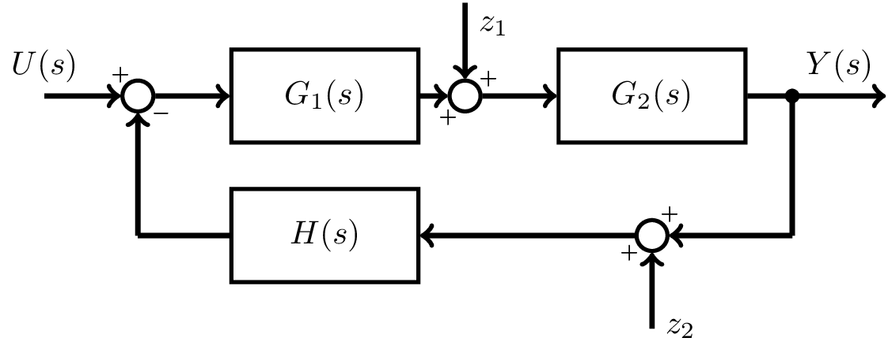
</figure>

### Amplificatori Operazionali

Data una funzione di trasferimento a ciclo chiuso $W(s)$, si considera $H(s)=h$. Per il modulo della funzione a catena diretta molto alto:

$$|G(j\omega)|>>0\Rightarrow|W(j\omega)|=\displaystyle\frac{|G(j\omega)|}{|1+G(j\omega)h|}=\frac{1}{h}$$

Quindi per guadagno ad anello molto elevato e basse frequenze la funzione a ciclo chiuso corrisponde all’inverso della funzione sulla catena di misura.

Un integratore è un operazionale descritto dal seguente circuito, in configurazione invertente:

<figure>

</figure>

Si definisce impedenza di un circuito il rapporto tra la tensione applicata ai capi del circuito e la corrente che vi ci scorre, nel dominio di Laplace, misura la facilità con cui una corrente alternata attraversa un circuito. Le impedenze derivano dalle tensioni generate dai vari oggetti di un circuito come un resistore, un capacitore ed un induttore:

$$\begin{gathered}
    z_R=R\\
    z_C=\displaystyle\frac{1}{sC}\\
    z_L=sL
\end{gathered}$$

Si definisce amplificatore operazionale un oggetto avente un guadagno elevato $K_A\approx10^5$ ed un’impedenza elevatissima in entrata proporzionale al suo guadagno, perciò idealmente si considera l’entrata sia nulla. Si può quindi rappresentare in un sistema a blocchi il circuito di un integratore operazionale:

<figure>
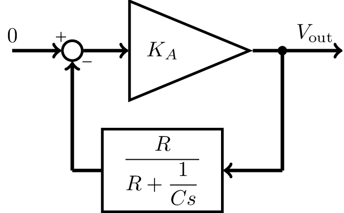
</figure>

Poiché il guadagno $K_A$ è molto elevato, si può approssimare la funzione a ciclo chiuso come:

$$W(s)=\displaystyle\frac{R+\displaystyle\frac{1}{Cs}}{R}=\frac{RCs+1}{RCs}$$

Rappresenta un integratore con uno zero in $-\displaystyle\frac{1}{RC}$, per un intervallo di frequenze può essere approssimato come un integratore puro.

Per ottenere un derivatore si scambiano i due componenti condensatore e resistore:

<figure>
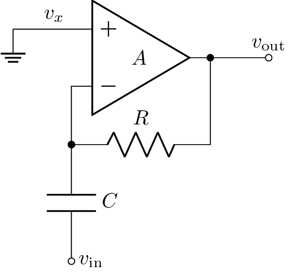
</figure>

L’amplificatore presenta un comportamento non lineare, ma in controreazione ha un comportamento lineare. La sua risposta in frequenza può essere misurata sperimentalmente usando un generatore di funzioni in entrata ed un oscilloscopio in uscita. In ciclo aperto presenta una banda passante piccola, se si inserisce un fattore $K_d>1$ in controreazione aumenta la banda passante, ma diminuisce il guadagno del sistema. Poiché un amplificatore è un oggetto a guadagno molto elevato, è possibile aumentare la banda passante considerevolmente senza disturbare di troppo le funzioni dell’amplificatore:

<figure>

</figure>

### Linearizzazione

Un qualsiasi sistema non lineare definito da una funzione $f$, se messo in controreazione con un guadagno $k$, è soggetto ad un azione compensatrice automatica. Qualsiasi variazione del segnale d’uscita provoca un errore e quindi un azione correttiva. All’aumento del guadagno quest’azione correttiva p sempre più evidente e l’andamento del sistema diventa approssimativamente lineare.

$$\begin{gathered}
    \begin{cases}
        v=f(y)\\
        v=k(u-y)
    \end{cases}\\
    k(u-y)=f(y)\\
    k\to+\infty,\:u-y=\cancelto{0}{\displaystyle\frac{f(y)}{k}}\\
    u=y
\end{gathered}$$

Dove $f(y)$ è una funzione non lineare, considerando un guadagno molto elevato $k>>0$, allora $y\propto u$, solo se il sistema mantiene la sua stabilità

Un transistor è un oggetto non lineare, ma ha un guadagno molto elevato, per cui viene costruito in controreazione per avere comportamenti lineari.

## Errore e Disturbi di Tipo Sinusoidale

Si vuole analizzare l’effetto di errori di riproduzione di una sinusoide o rumori aleatori, agenti su un sistema in un certo intervallo di frequenza. Per evitare questi errori si controlla il modulo massimo di questo errore e l’intervallo di frequenze su cui è presente. Data una frequenza massima su cui è percepibile l’errore $\omega_{\max}$, si determina il modulo dell’errore rispetto ad un riferimento sinusoidale $\tilde{u}(t)=\sin({\omega}t)$: $\tilde{e}(t)=\tilde{y}_d-\tilde{y}(t)$. L’uscita di questo sistema segue l’entrata per cui si ha: $\tilde{y}(t)=M\sin({\omega}t+{\varphi}({\omega}))$.

$$W_e(s)=|K_d-W(j\omega)|=\left|\displaystyle\frac{K_\mathrm{d}^2}{K_d+G(j\omega)}\right|=\left|\frac{K_d}{1+F(j\omega)}\right|\approx\left|\frac{K_d}{F(j\omega)}\right|$$

Per valori abbastanza elevati di modulo.

Si considera l’errore massimo percepibile alla frequenza $\omega_{\max}$ come un limite di stabilità. Per evitare questo errore si dovrà avere una funzione a ciclo aperto di modulo: $$W_e(j\omega_{\max})=\tilde{e}_{\max}=\displaystyle\left|\frac{K_d}{F(j\omega_{\max})}\right|\Rightarrow \omega\leq\omega_{\max},\:|F(j\omega)|\geq\frac{K_d}{\tilde{e}_{\max}}$$

In caso l’errore sia negativo bisogna avere un comportamento inverso, per passare al di sotto della finestra che individua l’errore: $$\omega\geq\omega_{\min},\:F(j\omega)\leq\displaystyle\frac{K_d}{\tilde{e}_{\max}}$$

Viene così definita nel diagramma di Bode del modulo una finestra di altezza: $$\displaystyle\frac{K_d}{\tilde{e}_{\max}}$$ In un intervallo $[\omega_{\min},\omega_{\max}]$. Il sistema è soggetto ad un errore in caso il diagramma del modulo della funzione a ciclo aperto attraversa questa finestra di errore.

Per contrastare dei disturbi agenti sul sistema si usufruisce della funzione sensibilità, dato che l’effetto di un disturbo su un sistema è proporzionale alla sensibilità: $$S^W_G(s)=\displaystyle\frac{1}{1+F(s)}$$

Al diminuire della sensibilità diminuisce anche l’effetto del disturbo sul sistema. Data una sensibilità massima ottenuta per una certa frequenza $\omega_{\max}$, $S(j\omega_{\max})=S_{\max}$, il sistema è libero dal disturbo se: $$\omega\leq\omega_{\max},\:\displaystyle\left|\frac{1}{1+F(j\omega)}\right|\approx\frac{1}{|F(j\omega)|}\leq S_{\max}$$ Viene definita come per gli errori di riproduzione di una sinusoide una finestra di altezza $S_{\max}$, su tutto l’intervallo di frequenza su cui agisce il disturbo. Il sistema è quindi in grado di rigettare il disturbo se il diagramma di Bode della funzione a ciclo aperto non incontra questa finestra.

## Carta di Nichols

La carta di Nichols è un diagramma che rappresenta l’andamento della fase e del modulo di una funzione di trasferimento. Viene usato un sistema di coordinate rettilineo usato per la funzione a ciclo aperto, equivale a trasporre il diagramma di Bode in questo sistema di riferimento. Mentre per la funzione a ciclo chiuso si usa un sistema di coordinate curvilineo, formato dal luogo delle curve a modulo costante, fino a $-3\,\mathrm{d}B$, ed a fase costante. Ovvero si considera o la fase o il modulo costante e si traccia l’andamento della funzione a ciclo chiuso $W=|W|\exp({\phase{W}})$ rispetto all’altra variabile. Ha l’origine nel punto $(0\,\mathrm{d}B,-180^{\circ})$ corrispondente a $-1$.

Data la relazione: $$W=\displaystyle\frac{F}{1+F}$$ Si può ricavare la funzione a ciclo aperto come: $$F=\displaystyle\frac{W}{1-W}$$ Dall’intersezione delle curve con la funzione a ciclo aperto è possibile determinare il comportamento della funzione a ciclo chiuso. Per $|W|_{\mathrm{d}B}=-20\,\mathrm{d}B$, le curve a modulo costante sono quasi rettilinee nella carta di Nichols, per cui il comportamento della funzione a ciclo chiuso è molto simile alla funzione a ciclo aperto: $$W=\displaystyle\frac{F}{1+F\approx0}\approx F$$

Dall’intersezione di $F$ con la curva di modulo $-3\,\mathrm{d}B$ si può determinare il valore della banda passante $\omega_{-3}$, dalla fase e o modulo corrispondente all’intersezione. La distanza sull’asse di $0\,\mathrm{d}B$ tra curva $F$ e l’origine rappresenta il margine di fase $m_{\varphi}$, mentre la distanza sull’asse di $-180^{\circ}$ tra curva e l’origine rappresenta il margine di guadagno $m_g$. Per questo curve che passano l’asse a $0\,\mathrm{d}B$ da destra hanno una funzione a ciclo chiuso stabile. Il modulo alla risonanza $M_r$ è la curva a modulo costante maggiore che interseca la funzione a ciclo aperto, per $K_d=1$. Per un modulo alla risonanza maggiore, la funzione $F$ si avvicina all’origine della carta di Nichols, diminuendo il margine di fase, per cui vale la seguente relazione: $$M_r\propto\displaystyle\frac{1}{m_{\varphi}}$$ Il fenomeno della risonanza è presente per margini di fase abbastanza piccoli: $m_{\varphi}<<1$.

Dalle relazioni ottenute precedentemente si ottiene: $$\begin{cases}
        s\propto Mr\propto\displaystyle\frac{1}{m_{\varphi}}\\
        t_s\cdot\omega_{-3}\propto\omega_t
    \end{cases}$$

<figure>

</figure>

## Reti Correttrici

Per modificare in maniere selettiva l’andamento di un sistema si agisce direttamente sui poli e gli zeri del sistema. Un metodo per eliminare una dinamica sfavorevole per introdurne un’altra favorevole consiste nell’inserire una funzione in catena diretta contente una coppia polo-zero a guadagno unitario. In questo modo si mantiene il guadagno statico del sistema e si agisce direttamente sull’andamento di Bode del processo. Questo metodo non si può utilizzare per eliminare elementi instabili da un processo, poiché le dinamiche di un sistema anche se vengono cancellate analiticamente rimangono fisicamente in esso. Per questo motivo anche il controllore deve avere una coppia poli-zeri stabile.

Un controllore di questo tipo viene chiamato rete correttrice $R(s)$, può presentare il polo prima dello zero, in questo caso si chiama rete attenuatrice, oppure il polo dopo lo zero, chiamata rete anticipatrice. Le reti correttrici vengono definite da un parametro $m$, che rappresenta la distanza tra il polo e lo zero nel tempo, e di conseguenza l’intensità del cambiamento che provoca la rete, più i poli sono vicini, più l’effetto della rete viene diminuito. Poiché più sono vicini, meno tempo ha l’altra dinamica per bilanciare la prima. Queste reti vengono costruite fisicamente come dei circuiti RC serie o parallelo, più la coppia polo-zero è distante più precisione viene richiesta per le resistenze, per cui si tende a scegliere tra reti a parità di effetto, quella con un parametro $m$ minore per diminuire il costo di produzione del componente fisico.

<figure>

  

</figure>

Le reti correttrici sono definite da un altro parametro $\tau$, utilizzato per traslare globalmente la coppia polo-zero, per un aumento o diminuzione dell’effetto causato della rete. Questo effetto viene indicato su un diagramma di Bode rispetto ad una frequenza $\omega$, pari alla frequenza dove si vuole applicare la rete tenendo conto della traslazione della coppia polo-zero $\tau$. Poiché si vuole agire sulla pulsazione di taglio si ha una frequenza $\omega=\omega_t\cdot\tau$.

Le reti hanno funzione di trasferimento:

$$\begin{gathered}
    R(s)_\mathrm{ant.}=\displaystyle\frac{1+\tau s}{1+\displaystyle\frac{\tau}{m}s}\\
    R(s)_\mathrm{att.}=\displaystyle\frac{1+\displaystyle\frac{\tau}{m}s}{1+\tau s}
\end{gathered}$$

In una rete anticipatrice, presentando uno zero prima del polo, i moduli crescono per poi rimanere costanti dopo il polo, mentre le fasi aumentano e poi diminuiscono. Essendo una attenuatrice l’esatto opposto, i moduli decrescono prima di arrestarsi e le fasi diminuiscono e poi aumentano. É possibile che una rete correttrice si trovi al limite di stabilità.

Il diagramma usato per calcolare una rete si chiama carta delle reti compensatrici:

<figure>

</figure>

Poiché per una rete attenuatrice, l’effetto causato è esattamente l’opposto di una anticipatrice, si usa sempre la stessa carta per entrambe le reti, solamente considerando l’effetto negativo quando si tratta di una attenuatrice.

In un sistema generico, la rete correttrice viene aggiunta in catene diretta in serie al controllore $C(s)$, che presenta un numero $h$ di integratori ed un guadagno $K_c$, per cui il controllore del sistema diventa:

$$C(s)=\displaystyle\frac{K_c}{s^h}\cdot R(s)$$

Si può dividere l’effetto di una rete, per qualsiasi $m$, in due zone. In una prima zona, il modulo varia di poco, mentre cambia notevolmente la fase, questo può essere usato in sistemi al limite di stabilità per recuperare margine di fase, senza cambiare il modulo del sistema. In una seconda zona si può variare di molto il modulo del sistema senza intaccare di troppo la fase. Per stabilizzare un sistema è necessario un margine di fase abbastanza grande per resistere ad errori, per cui si scelgono sempre reti che a parità di modulo diminuiscano il meno possibile la fase.

Si possono combinare più reti per sistemi, dove ogni rete agisce in un punto diverso nel tempo, in questo caso si usano parametri $\tau$ e $m$ diversi per ogni singola rete nel controllore.

## Teoria di Lyapunov

Lyapunov alle fine dell’$800$ descrisse i sistemi non lineari ed un criterio sulla loro stabilità.

Un sistema lineare autonomo $\dot x=f(x)$, si può considerare come un sistema a controreazione con un controllore che ne calcola l’entrata per cui non ha bisogno di un entrata esterna. Il sistema è in uno stato di equilibrio per $\dot x=0\Rightarrow f(x)=0$, può presentare un numero infinito di punti di equilibrio. Se per un valore di $\varepsilon$ arbitrariamente piccolo, raggio di un intorno circolare di un punto di equilibrio del sistema, esiste un intorno circolare di raggio $\delta_{\varepsilon}$ che contiene l’effetto del sistema, il sistema ha un’evoluzione limitata. Un sistema si dice quindi semplicemente stabile se:

$$\exists\varepsilon>0\mbox{ t.c. }||x-x_\mathrm{eq}||<\varepsilon\Rightarrow||x(t)-x_\mathrm{eq}||<\delta_{\varepsilon}$$

Per ogni intorno $\delta_{\varepsilon}$ del punto di equilibrio $x_{\mathrm{eq}}$ deve esistere un punto tale che la sua evoluzione rimane contenuta in quel intorno circolare. Se $\lim_{t\to+\infty}x(t)=x_\mathrm{eq}$ il sistema si dice asintoticamente stabile.

Poiché i sistemi lineari convergono esponenzialmente, se un sistema non lineare converge più velocemente di un qualsiasi esponenziale, si dice esponenzialmente stabile. Un sistema non lineare è stabile se esiste un intorno di stabilità, dove ogni evoluzione del sistema è almeno semplicemente stabile. Se esiste un unico punto di equilibrio del sistema è possibile che l’intorno sia infinito.

Sia $V(x)$ la funzione di stato del sistema, positiva per ogni valore di $x$, questa funzione ha un valore vicino allo zero solo nell’intorno del punto di equilibrio, minimo della funzione. Si rappresenta con delle curve di livello, curve dove il valore di $V(x)$ è costante fino al valore $V(x_\mathrm{eq})$, se il sistema è stabile nel punto $x_\mathrm{eq}$ allora le curve di livello tendono a restringersi intorno a quel punto.

Se la derivata della funzione di stato, in ogni punto del sistema, è definita e negativa, allora il sistema è asintoticamente stabile, per ogni stato del sistema $V$ la sua evoluzione necessariamente diminuisce: $$\dot V(x)=\displaystyle\frac{\mathrm{d}V}{\mathrm{d}x}\frac{\mathrm{d}x}{\mathrm{d}t}=\frac{\mathrm{d}V}{\mathrm{d}x}f(x)<0,\:\forall x$$

Questa funzione di stato viene chiamata funzione di Lyapunov, dopo aver determinato la funzione di Lyapunov di un sistema non lineare si può controllare la sua stabilità. Il teorema di LaSalle afferma che lo stato di un sistema non lineare tende asintoticamente al valore del suo invariante massimo, dove l’invariante massimo $M$ è un sottoinsieme dell’insieme $E$ dei punti per cui la derivata della funzione di Lyapunov si annulla: $$M\subset E:=\{x\in I_{\delta_{\varepsilon}}(x_\mathrm{eq})\mbox{ t.c. }\dot V(x)=0\}$$

Un sistema non lineare si può linearizzare intorno ad un suo punto di equilibrio, con $\Delta x=x-x_\mathrm{eq}$, considerando l’espansione di Taylor della funzione $f(x)$ che definisce il sistema:

$$\begin{gathered}
    f(x)=\cancelto{0}{f(x_\mathrm{eq})}+\displaystyle\frac{f'(x_\mathrm{eq})}{1!}{(x-x_e)}+\cdots\\
    f(x)\approx f'(x_\mathrm{eq})\Delta x\\
    \begin{cases}
        \dot x=f(x)\\
        f(x_\mathrm{eq})=0
    \end{cases}\\
    \begin{cases}
        \Delta\dot x=f(x)\\
        f(x_\mathrm{eq})=f'(x_\mathrm{eq})\Delta x
    \end{cases}\\
    \Delta\dot x=f'(x_\mathrm{eq})\Delta x
\end{gathered}$$

Considerando un sistema non lineare con un entrata $u(t)$, definito da $\dot x=f(x,u)$, si può linearizzare considerando:

$$\Delta\dot x=\displaystyle\frac{\partial f}{\partial x}\bigg|_{x_\mathrm{eq}}\Delta x+\frac{\partial f}{\partial u}\bigg|_{u_\mathrm{eq}}\Delta u=\left(\mathbf{J}f\bigg|_{(x_\mathrm{eq},u_\mathrm{eq})}\cdot
    \begin{bmatrix}
        \Delta x\\
        \Delta u
    \end{bmatrix}
    \right)$$ Dove $\mathbf{J}f$ è il Jacobiano della funzione $f$.

<figure>
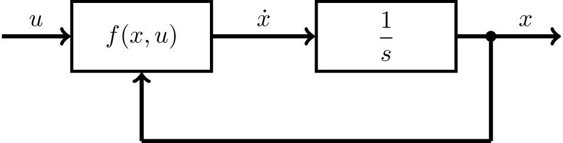
</figure>

Se il sistema $\sum_L$ linearizzato è asintoticamente stabile allora anche il sistema non lineare $\sum_{NL}$ è asintoticamente stabile, se $\sum_L$ è instabile lo è anche $\sum_{NL}$, se $\sum_L$ è al limite di stabilità, non si può stabilire il comportamento di $\sum_{NL}$. Per cui il sistema $\sum_{NL}$ si può stabilizzare localmente, agendo sul sistema linearizzato $\sum_L$. Per controllare l’intorno di stabilità, si simula l’evoluzione del sistema.

# Sistemi a Segnali Campionati

All’inizio del ’900 venivano usati sistemi di controllo analogici, nel tempo questi componenti analogici sono stati sostituiti da componenti digitali. Per cui sistemi elettronici come gli amplificatori sono stati sostituiti da oggetti informatici, ovvero microprocessori insieme ad altri elementi. Usando componenti digitali è possibile programmare controllori schedulati, in grado di avere più di un algoritmo di controllo adatti per diversi stati del processo.

## Microcontrollore

Un microcontrollore è un oggetto fisico input-output capace di dialogare con l’ambiente esterno, all’interno di un chip, anche molto economico. Sono oggetti che presentano all’interno un microprocessore, quindi sono in grado di risolvere piccoli problemi di automazione. Dei PLC sono invece dei controllori più sofisticati che permettono di avere frequenze di aggiornamento molto elevate e trasmissione di dati costante.

Un microcontrollore è composto da un microprocessore $\mu\mathrm{P}$, convertitori da digitale ad analogico DAC, per poter dialogare con un certo processo $P$ da controllare, convertendo i dati del processo in livelli di tensione. Poiché il microprocessore digitale lavora in bit, mentre il processo analogico da controllare è continuo, è necessario convertire questi dati. La tensione in uscita dal DAC è di bassa potenza, per cui è presenta a cascata un amplificatore $A$ alimentato da un generatore di tensione esterno $V_{cc}$, per avere in uscita livelli di tensione adeguati.

Per pulire i segnali misurati si usa in catena di misura un filtro-antialiasing, il segnale viene poi passato ad un convertitore ADC che lo trasforma in discreto. Il microprocessore informa il convertitore ADC con un segnale SOC per iniziare la conversione, il quale invia un segnale EOC al microprocessore per segnalare la fine della conversione del dato. A quel punto il microprocessore legge sul bus il dato convertito. Si può inserire un circuito di adattamento $a$ tra il filtro antialiasing ed il convertitore ADC, per adattare l’uscita in tensione del processo all’ingresso in tensione dei convertitori. Poiché i convertitori hanno un certo intervallo di ingresso accettabile in Volt, il dato ottenuto operando su quello grezzo del sensore viene chiamato dato ingegnerizzato.

Il valore di riferimento $r$ del microcontrollore può essere computato o inserito da un segnale esterno. Il microcontrollore $\mu C$ comprende il microprocessore, ed i convertitori DAC e ADC, anche su un singolo chip. I collegamenti tra i convertitori ed il microprocessore sono dei BUS a $n$ bit, mentre il resto dei collegamenti sono segnali continui.

<figure>
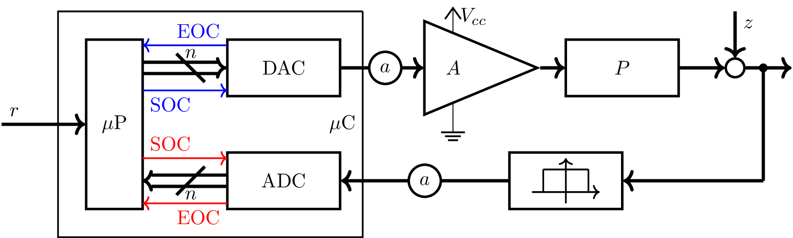
</figure>

### Quantizzazione

Un dato digitale viene rappresentato da un certo numero $n$ di bit, per cui può rappresentare valori nell’intervallo $[0,2^n-1]$. Un convertitore DAC suddivide l’intervallo di tensione in entrata in $2^n$ intervalli uguali e ogni valore che un bit può rappresentare corrisponde quindi ad un intervallo di tensione. Non è possibile determinare in questo modo la tensione esatta, questo effetto viene chiamato quantizzazione, ed è quantificabile dal passo di quantizzazione, ovvero la grandezza di un singolo intervallo di tensione, o gradino:

$$q=\displaystyle\frac{\Delta V}{2^n}$$

<figure>
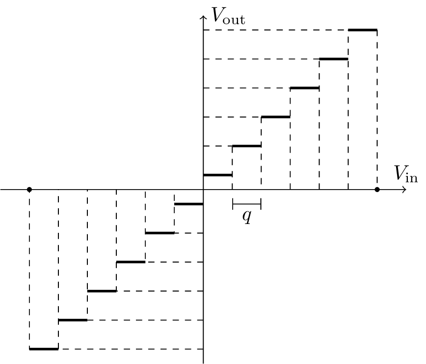
</figure>

Per cui è impossibile determinare a meno del passo di quantizzazione una certa uscita, e quindi il controllore ha un errore minimo uguale al passo di quantizzazione, poiché non può agire su ciò che non può misurare. È necessario decidere a priori il passo di quantizzazione necessario per l’applicazione del controllore. Poiché la quantizzazione è un processo non lineare, si considera sempre nelle successive analisi come se si fosse scelto il numero di bit sufficiente per le applicazioni considerate. Verrà considerato alla fine un rumore di quantizzazione dovuto alla differenza tra la suddivisione in gradini e l’andamento lineare.

Per scegliere il numero di bit adatto, si analizza l’oscillazione del segnale e si misura la varianza rispetto al valor medio e si calcola il valore di rumore in percentuale $z[\%]$, e si sceglie un numero di bit abbastanza piccolo da non campionare il rumore: $$n\mbox{ t.c. }\displaystyle\frac{1}{n}>\frac{z}{100}$$ Poiché essendo casuale il controllore non potrà agire su di esso.

Se si scelgono troppi pochi bit, il segnale potrebbe variare senza una variazione nella sua rappresentazione.

In genere i convertitori ADC possono convertire valori di tensioni di queste tipologie: $[0,5]$, $[0,10]$, $[-5,+5]$, $[-10,+10]$, $[0,20]$. Alcuni convertitori, convertito correnti invece di tensioni. Per adeguare le tensioni delle varie componenti del sistema, vengono usati circuiti di adattamento tra i convertitori in entrata ed in uscita del microcontrollore che applicano le opportune traslazioni e amplificazioni del segnale.

Poiché un processore non può convertire costantemente il segnale, sono necessari dei segnali di controllo per iniziare e terminare la conversione. Questi segnali sono SOC e EOC, “Start Of Conversion" e “End Of Conversion", sia per ADC che per il DAC. Quindi solo grazie a questi segnali è possibile portare il dato dentro e fuori il microcontrollore in sicurezza, realizzati tramite degli “interrupt”.

### Tempo di Campionamento

Il microprocessore invia il segnale SOC al convertitore ADC. Il convertitore effettua un “hold” del segnale in entrata e comincia a campionarlo, alla fine del campionamento invia i dati nel BUS ed invia il segnale EOC al microprocessore. A questo punto il processore legge i dati dal BUS e li elabora, “signal processing” in un tempo relativamente più o meno lungo, al termine dell’operazione il dato calcolato su un registro interno del processore viene inviato al convertitore DAC con un segnale SOC. Il DAC converte il segnale in continuo ed al termine della conversione invia un segnale EOC al microprocessore.

<figure>
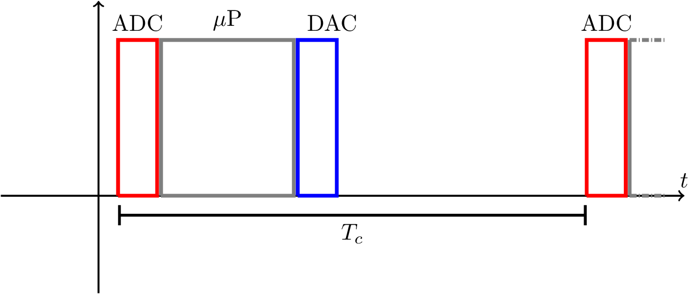
</figure>

Il microprocessore dopo questo tempo potrebbe effettuare operazioni di housekeeping, operazioni interne non relative alla conversione, e ricomincia a convertire i dati dopo un intervallo di tempo. Questo intervallo di tempo viene chiamato tempo di campionamento $T_c$, comprende il tempo necessario per il microcontrollore di convertire ed elaborare i dati, ed il tempo delle operazioni di housekeeping. Questo tempo di campionamento è intrinseco al microcontrollore e non è variabile, per cui alcuni microcontrollori sono poco utili per un tempo di campionamento troppo grande. Può essere presente jitter che cambia l’andamento del processo collegato al controllore. La scelta di un microcontrollore dipende quindi dal tempo di campionamento necessario per controllare un dato processo.

Per comunicare al microprocessore l’inizio e la fine della conversione vengono usati degli interrupt, segnali che avvertono il processore che è successo qualcosa. Ogni volta che è necessario compiere delle azioni periodiche, bisogna associare dei segnali di interrupt a segnali esterni, dei clock, oppure da un programma interno. Il programma di controllo definito viene gestito dal sistema operativo. Esistono vari tipi di interrupt mascherabili e non, alcuni si possono disabilitare.

In caso un programma sia in idle da molto tempo viene spostato dalla RAM per liberare spazio agli interrupt che arrivano al microprocessore in quel tempo. Il sistema operativo standard ha un tempo di campionamento di $1\,\mathrm{s}$ ed un jitter di circa $1\,\mathrm{ms}$, per cui è difficile avere un tempo di campionamento minore di un ms su un sistema operativo general purpose. Per questo delle task time critical necessitano di sistemi operativi dedicati ai controllori, dato che alcuni sistemi operativi preemptive hanno delle routine programmate per essere interrotte da alcune operazioni del kernel.

Di conseguenza alcune operazioni che sembrano real-time avvengono in intervalli precisi per sembrare real-time. Si definisce allora una routine soft real time, per processi che si aggiornano solo ogni $n\,\mathrm{ms}$ con un margine di errore elevato, mentre si definisce una routine hard real time se il mancato rispetto di una task diviene risulta in danni cospicui per l’infrastruttura su cui opera.

Per analizzare questo processo bisogna definire un sistema per descrivere oggetti continui nel discreto, tempi multipli del tempo di campionamento, tramite il teorema del campionamento. Viene inoltre definita la trasformata $z$ per studiare elementi totalmente discreti, trasformata omologa a quella di Laplace.

## Rappresentazione Segnali Campionati

Dato lo stato nel tempo di un sistema $x(t)$, se si implementa un controllore digitale, si avrà accesso solo ad una sequenza di stati $\{x_k\}$ dove ogni stato è dato dallo stato del sistema in un tempo multiplo del tempo di campionamento $x_k=x(kT_c)$. In questo modo si ha una sequenza di valori, campionati dal convertitore ADC ogni $T_c$. Se consideriamo una serie di impulsi ogni tempo di campionamento di ampiezza il valore campionato in quel’istante, si può approssimare la funzione continua sulla base dei valori discreti. Per ottenere la funzione originaria servirebbe un tempo di campionamento tendente a zero. Il segnale campionato è dato dalla sommatoria di impulsi traslati di un multiplo del tempo di campionamento:

$$x_c(t)=\sum_{k=0}^{+\infty}x_k\delta_0(t-kT_c)$$

<figure>
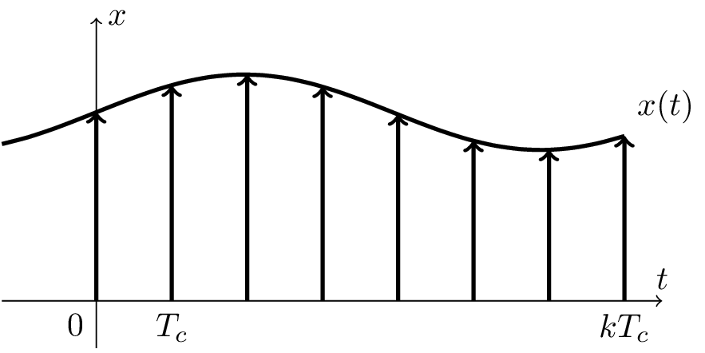
</figure>

La sequenza di impulsi ha esattamente il contenuto informativo della sequenza di valori misurati $\{x_k\}$, poiché l’impulso ha un’area infinitesima. Per cui è possibile usarlo per lavorare sul tempo discreto. Da un qualsiasi segnale campionato è quindi possibile ottenere la sua trasformata di Laplace:

$$X_c(s)=\sum_{k=0}^{+\infty}\displaystyle{x_k}e^{-skT_c}$$

Per cui ha una sua risposta in frequenza, e probabilmente un suo diagramma di Bode. Considerando $s=\sigma +j\omega$, si può riscrivere come:

$$X_c(s)=\sum_{k=0}^{\infty}x_ke^{-\sigma kT_c}e^{-j\omega kT_c}$$

Data una pulsazione di campionamento: $$\omega_c=2\pi\nu_c=\displaystyle\frac{2\pi}{T_c}$$ Si può riscrivere la parte complessa dell’esponenziale come: $$e^{-j\omega kT_c}=e^{-2j\pi k\frac{\omega}{\omega_c}}$$

Questo oggetto è periodico nell’intervallo: $$\left[\displaystyle-j\frac{\omega_c}{2},j\frac{\omega_c}{2}\right]$$ Poiché per $\omega'=\omega_c+\omega$ si ha: $$\begin{gathered}
    -2j\pi k\displaystyle\frac{\omega'}{\omega_c}=-2j\pi k\left(1+\frac{\omega}{\omega_c}\right)=-2j\pi k-2j\pi k\frac{\omega}{\omega_c}
\end{gathered}$$ Quindi l’esponenziale è: $$\begin{gathered}
    e^{-2j\pi k\frac{\omega'}{\omega_c}}=\cancelto{1}{e^{-2j\pi k}}\cdot e^{-2j\pi k\frac{\omega}{\omega_c}}
\end{gathered}$$ Dipendendo dalla sola componente immaginaria, è periodico per ogni valore complesso avente parte immaginaria compresa in quell’intervallo. Il piano di Gauss è quindi diviso in strisce uguali di ampiezza $\omega_c$. Per cui la trasformata di Laplace di un segnale reale periodico sarà anch’essa periodica, si studierà quindi un’unica di queste strisce.

<figure>
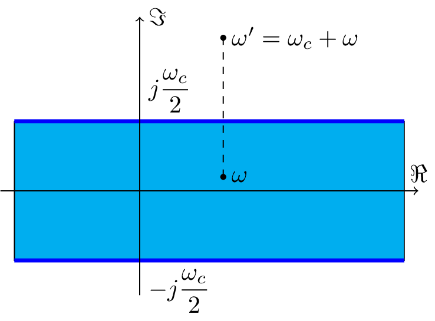
</figure>

### Teorema del Campionamento

Il teorema del campionamento afferma che:

> Dato un segnale a banda limitata, nella sua conversione analogico-digitale, la minima frequenza necessaria per evitare aliasing e perdita di informazione nella ricostruzione del segnale analogico deve essere maggiore del doppio della sua frequenza massima: $$\omega_c>2\omega_M$$

Si definisce un nuovo segnale $\delta_R(t)$, formato da una rastrelliera di impulsi unitari ogni $T_c$: $$\delta_R(t)=\sum_{k=0}^{\infty}\delta_0(t-kT_c)$$

<figure>
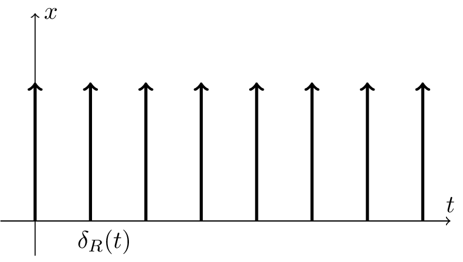
</figure>

Moltiplicando la rastrelliera con il segnale da campionare $x(t)$, si ottiene il segnale campionato. Da tenere conto del fatto che una rastrelliera non è una funzione, essendo discreta, mentre il segnale da campionare essendo nel continuo è una funzione. $$x_c(t)=x(t)\cdot\delta_R(t)$$

<figure>
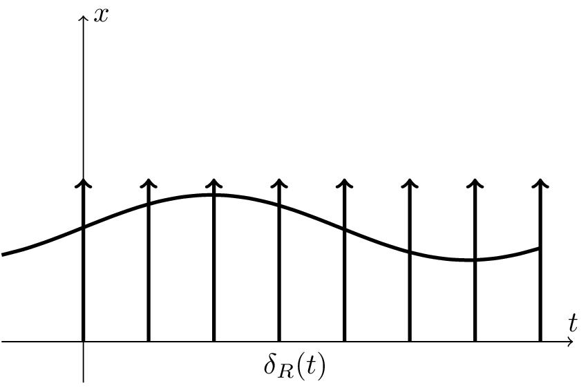
</figure>

Nei punti di intersezione tra gli impulsi della rastrelliera ed il segnale $x(t)$ viene campionata l’ampiezza di quest’ultimo.

La funzione rastrelliera è periodica, dall’analisi di Fourier, ogni funzione periodica può essere scritta come una sommatoria di funzioni sinusoidali, per cui si considera la funzione rastrelliera come: $$\delta_R(t)=c_0+\sum_{k=1}^{\infty}\left(a_k\sin(k\omega_ct)+b_k\cos(k\omega_ct)\right)$$ Può essere espressa tramite la rappresentazione di Eulero in forma esponenziale: $$\delta_R(t)=\sum_{k=-\infty}^{\infty}c_ke^{jk\omega_ct}$$ Dati un seno ed un coseno aventi coefficienti $a_k$ e $b_k$, la loro somma è data da un seno ed un coseno moltiplicati da uno stesso coefficiente ed un certo sfasamento. Per ottenere questo coefficiente bisogna ottenere le componenti della serie di Fourier rispetto ad un sistema di coordinate ortogonali. La trasformata di Fourier è un elemento basilare per analizzare i segnali, trasportandoli dal dominio del tempo nel dominio della frequenza.

Per ottenere la proiezione di un vettore $\mathbf{v}=v_k\hat{\mathbf{k}}+v_j\hat{\mathbf{j}}$ rispetto ad una coordinata $k$, si considera il prodotto scalare tra il vettore ed il versore della coordinata, per cui si ha $v_k=\mathbf{v}\cdot\hat{\mathbf{k}}$.

Analogamente ad un prodotto scalare in uno spazio vettoriale, l’operazione di integrale soddisfa i requisiti di prodotto interno tra due funzioni, ovvero rappresenta un operazione di proiezione. Per cui per trovare le componenti della rastrelliera rispetto alla forma esponenziale del seno e coseno si considera l’integrale della rastrelliera con il coniugato della funzione esponenziale $e^{-jk\omega_ct}$. Poiché è una funzione periodica si considera l’integrale lungo l’intervallo $\left[-T_c/2,T_c/2\right]$ per ogni valore di $k$. Il coefficiente è dato dal valore medio lungo questo intervallo: $$c_k=\displaystyle\frac{1}{T_c}\int_{-\frac{T_c}{2}}^{\frac{T_c}{2}}\delta_R(t)e^{-jk\omega_ct}\mathrm{d}t$$

L’unico impulso della rastrelliera che cade in quell’intervallo è nell’istante $t=0$. L’integrale di un prodotto tra una funzione e l’impulso, equivale a calcolare il valore della funzione in quel punto, per cui si ha: $$c_k=\displaystyle\frac{1}{T_c}e^{-jk\omega_c \cdot0}=\frac{1}{T_c}$$

Per cui si può scrivere la rastrelliera come: $$\delta_R(t)=\displaystyle\frac{1}{T_c}\sum_{k=-\infty}^{+\infty}e^{jk\omega_ct}$$ Il segnale campionato si esprime quindi come: $$\begin{gathered}
    x_c(t)=x(t)\delta_R(t)=\displaystyle\frac{1}{T_c}\sum_{k=-\infty}^{+\infty}x(t)e^{jk\omega_ct}\\
    X_c(s)=\mathcal{L}_-\{x_c(t)\}=\displaystyle\frac{1}{T_c}\sum_{k=-\infty}^{+\infty}\mathcal{L}_-\left\{x(t)e^{jk\omega_ct}\right\}=\frac{1}{T_c}\sum_{k=-\infty}^{\infty}X(s-jk\omega_c)
\end{gathered}$$ La trasformata di Laplace del segnale campionato risulta essere costituita da infinite repliche del segnale originario traslato di multipli della pulsazione di campionamento in positivo o negativo $\omega_ck,\:k\in(-\infty,+\infty)$. Se si considera solamente la risposta armonica si ottiene la stessa funzione descritta dal teorema di Shannon.

### Ricostruzione

Per ottenere la risposta armonica della funzione si considera $s=j\omega$: $$X_c(j\omega)=\displaystyle\frac{1}{T_c}\sum_{k=-\infty}^{+\infty}X(j(\omega-k\omega_c))$$

Rappresentando il diagramma di Bode del segnale originario in frequenza, è presente una singola curva, chiamata lobo, simmetrica rispetto all’asse delle ordinate, con un picco in $\omega=0$.

<figure>
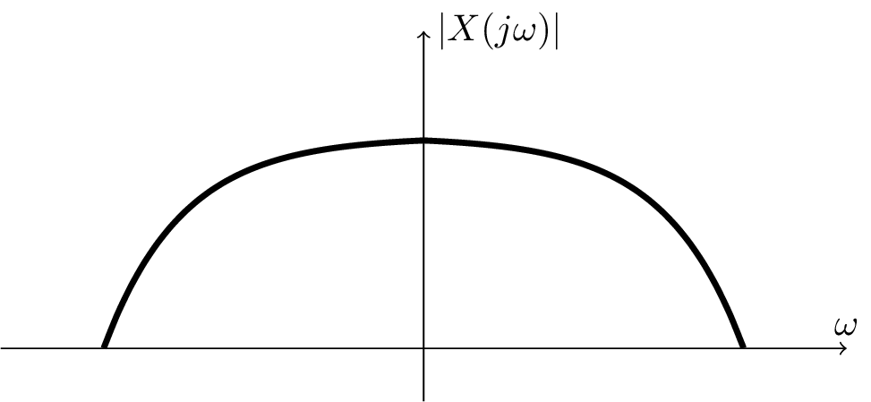
</figure>

Poiché il segnale campionato in frequenza è una sommatoria delle trasformate di Laplace del segnale originale, traslate di $\omega_ck$, e ridotte di un fattore ${1}/{T_c}$, il suo diagramma di Bode è formato da una serie di lobi uguali ripetuti. Per cui il campionamento di un segnale replica lo stesso segnale ma a frequenze più elevate.

<figure>
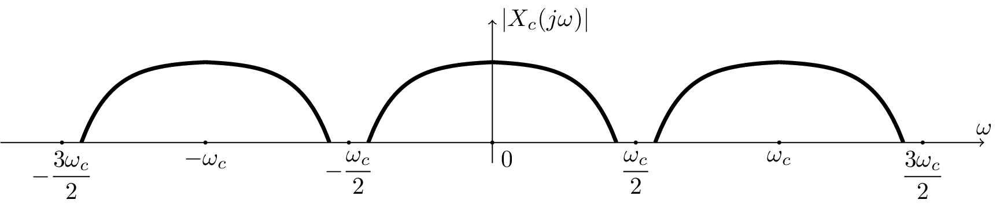
</figure>

In caso la metà della pulsazione di campionamento è maggiore della frequenza massima del segnale, allora i lobi sono separati. Il segnale campionato viene ripetuto in frequenza di repliche uguale al segnale non campionato. Per cui si può usare un filtro passa basso fino ad una pulsazione ${\omega_c}/{2}$, per isolare solamente il lobo centrale e amplificarlo di $T_c$ ottenendo il segnale originario. Questo segnale viene chiamato segnale ricostruito, è possibile in alcuni casi quindi ricostruire esattamente il segnale originario dati dei punti campionati.

<figure>
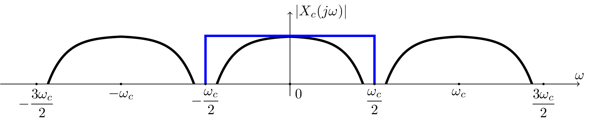
</figure>

Shannon dimostrò che inserendo il segnale in un filtro passa basso ideale si può ricostruire esattamente il segnale originario dal suo omologo campionato. Nel dominio del tempo il passaggio di un segnale per un filtro viene rappresentato da una convoluzione. Per cui il segnale ricostruito $x'(t)$ è dato dalla convoluzione: $$x'(t)=\displaystyle\int_0^{+\infty}h(t-\tau)x_c(\tau)\:\mathrm{d}\tau$$

<figure>

</figure>

Si può osservare che il filtro in frequenza è una finestra: $$\mathrm{rect}\left(\displaystyle\frac{2\omega}{\omega_c}\right)$$ Per cui riportandolo nel dominio del tempo con un’antitrasformata di Fourier si ottiene un seno cardinale nel tempo: $$h(t)=\displaystyle\frac{\sin\left(\displaystyle\frac{\omega_c}{2}t\right)}{\displaystyle\frac{\omega_c}{2}t}$$

<figure>
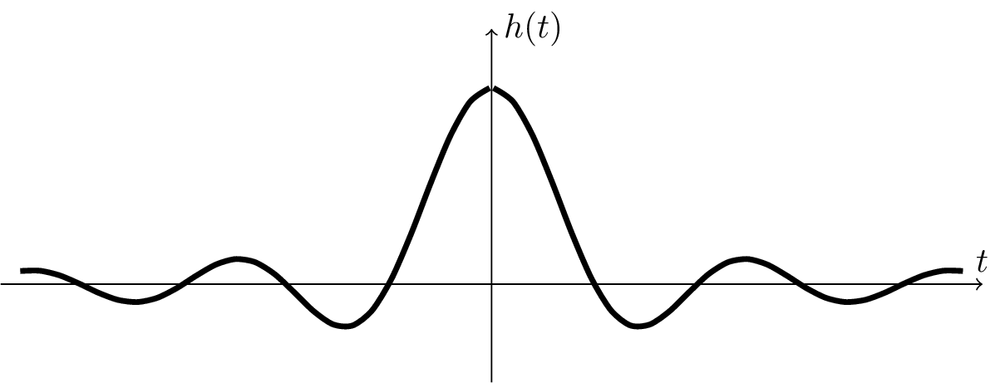
</figure>

Questa risposta impulsiva è diversa da zero anche per tempi negativi, per cui comincia ad oscillare prima di un entrata, di conseguenza non è causale. Inoltre se viene computata una convoluzione si osserveranno segnali futuri. Per cui non si può lavorare con questo filtro ideale, usato da Shannon nella sua teoria.

Se sono già noti tutti i campioni è possibile ricostruire il segnale, poiché si conoscono tutte le entrate future. L’uscita è quindi data da risposte impulsive, ottenute interpolando le varie sinc con il valore del campione, sommandole punto per punto. Quest’uscita è quindi uguale al segnale originario prima del campionamento.

<figure>
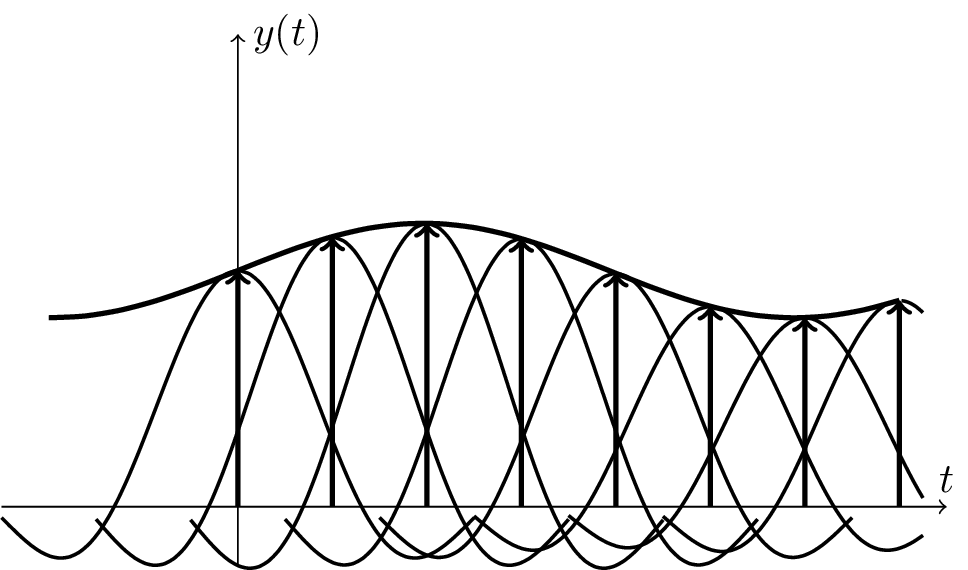
</figure>

Per eseguire questa operazione su un processore, si considera una frequenza di campionamento maggiore, quindi si inseriscono altri impulsi tra i campioni noti, ricavati dalle sinc. Alternativamente, poiché l’effetto della sinc diminuisce nella distanza dal campione, per cui il processore calcola un certo numero di sinc in avanti e le somma a quelle passate per ottenere il valore in quel punto. Il numero di sinc che precalcola il processore dipende interamente dalla sua velocità nel calcolarle, poiché deve elaborare il segnale in uscita in un tempo minore del tempo di campionamento, altrimenti non sarebbe possibile riprodurre il segnale. Più sinc in avanti si calcola il processore, più aumenta la qualità dell’audio correggendo il valore del campione in quel punto.

Nel caso di controllori automatici, invece non sono noti campioni futuri, per cui anche un piccolo ritardo può generare un’elevata perdita di fase per il controllore, non permettendo il controllo adeguato del sistema.

Il teorema di Shannon prevede un ricostruttore ideale ovvero dove la pulsazione di campionamento è maggiore del doppio della pulsazione massima del segnale $\omega_c>2\omega_M$, in caso contrario $\omega_c<2\omega_M$ si campiona una parte minore del lobo centrale e la parte rimanente crea delle distorsioni nel campione di partenza.

Questi disturbi sono delle informazioni che non esistevano, sono degli alias creati a causa della frequenza di campionamento troppo piccola, per cui questo fenomeno viene chiamato aliasing. Ad alte frequenze vengono misurati valori corrispondenti a basse frequenze del lobo successivo, ed a basse frequenze vengono misurati contributi del lobo precedente ad alte frequenze.

<figure>
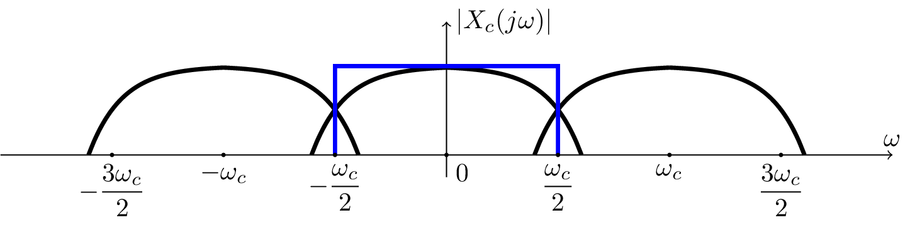
</figure>

Il fenomeno dell’aliasing può verificarsi anche per la riproduzione delle immagini, è quindi un problema informatico e dipende dalla discretizzazione delle informazioni, ed ogni volta che devono rappresentare oggetti nel continuo si verifica un fenomeno di aliasing.

Per evitare l’aliasing si può aumentare il tempo di campionamento oppure si ignorano queste frequenze usando un filtro antialiasing a monte del campionatore. Questo filtro, proprio perché l’aliasing è un fenomeno comune ad ogni fenomeno digitale, è sempre presente. Alle volte viene realizzato digitalmente, può essere implementato un sistema che campiona ad una frequenza maggiore per pulire il segnale e poi lo inserisce al campionatore.

Un algoritmo di controllo per aumentare la frequenza costa molto, mentre è più economico aumentare la frequenza del campionatore. Altrimenti si può inserire un circuito formato da condensatori e resistenze, per realizzare un filtro antialiasing elettronico.

## Organo di Tenuta

Data una sequenza di campioni da ricostruire nella DAC non si possono sommare tutte le sinc, poiché comprendono una parte non causale, e richiederebbe troppo tempo. Poiché non è possibile usare il ricostruttore ideale di Shannon in questa situazione, si considerano ricostruttori semplificati, più veloci e meno precisi.

Se si usa un ricostruttore semplificato, diverso da quello di Shannon, diminuirà il tempo necessario per elaborare i dati, ma diminuirà la precisione del segnale in uscita. Il più semplice ricostruttore possibile è composto da una gradinata che assume tensione costante per ogni intervallo di campionamento, definito ricostruttore di ordine zero o tenuta di ordine zero: $$\displaystyle\sum_{k=0}^{+\infty}\delta_{-1}(t-kT_c)-\delta_{-1}(t-(k+1)T_c)$$

<figure>
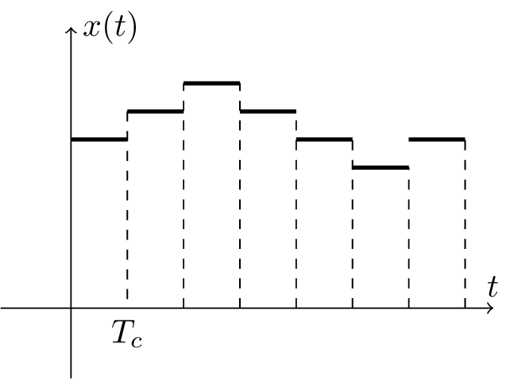
</figure>

Una tenuta di orine uno invece è composta da rampe ogni tempo di campionamento che congiungono due campioni diversi. In queste analisi non si considereranno tenute di ordine superiore, per cui si utilizza un ZOH, “Zero Order Holder".

Per calcolare l’errore dovuto ad una tenuta di ordine $0$ si analizza la sua funzione di trasferimento. Il segnale ricostruito con questo ricostruttore è: $$x'(t)=\sum_{k=0}^{+\infty}x_k(\delta_{-1}(t-kT_c)-\delta_{-1}(t-(k+1)T_c))$$

<figure>
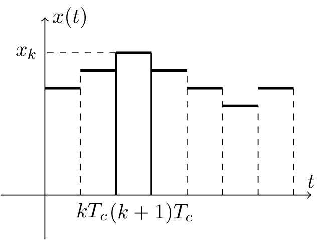
</figure>

Ha una funzione di trasferimento: $$X^*(s)=\sum_{k=0}^{+\infty}x_k\left(\displaystyle\frac{1}{s}e^{-kT_cs}-\frac{1}{s}e^{-(k+1)T_cs}\right)=\sum_{k=0}^{+\infty}x_ke^{-kT_cs}\left(\frac{1-e^{-T_cs}}{s}\right)$$

Il primo termine corrisponde alla funzione di trasferimento del segnale campionato: $$\begin{gathered}
    X_c(s)=\sum_{k=0}^{+\infty}x_ke^{-kT_cs}\\
    X'(s)=X_c(s)\left(\displaystyle\frac{1-e^{-T_cs}}{s}\right)
\end{gathered}$$ L’organo di tenuta di ordine zero ha quindi una funzione di trasferimento: $$T_0(s)=\displaystyle\frac{1-e^{-T_cs}}{s}$$ Questo organo di tenuta può essere rappresentato come un blocco funzionale in cui entra il segnale campionato come sequenza di impulsi ed esce il segnale ricostruito a gradino. Questa funzione sembra avere un integratore, ma non è un rapporto tra polinomi. Per controllore quale dinamica prevale si considera un’approssimazione dell’esponenziale a basse frequenze: $$\begin{gathered}
    e^{-T_cs}=\displaystyle\frac{1}{e^{T_cs}}\approx\frac{1}{1+T_cs}\\
    T(s)\approx\displaystyle\frac{1-\displaystyle\frac{1}{1+T_cs}}{s}=\frac{1}{s}\frac{1+T_cs-1}{1+T_cs}=\frac{T_c}{1+T_cs}
\end{gathered}$$ Per cui ha un guadagno $T_c$, ed è una funzione di trasferimento del primo ordine e presenta il seguente andamento:

<figure>
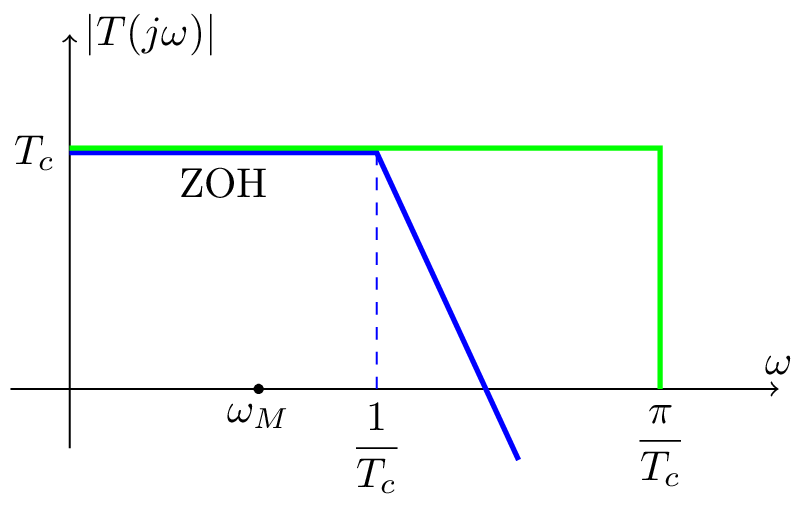
</figure>

La banda passante di questo sistema coincide al polo $1/T_c$. Per il ricostruttore di Shannon, la banda passante è esattamente ${\omega_c}/{2}={\pi}/{T_c}$. Nel caso reale il modulo scende di $20\,\mathrm{d}B$ ogni decade, per quello ideale di Shannon il modulo decresce in maniera secca.

Per cui la frequenza massima da campionare $\omega_M$ deve essere necessariamente minore di $1/T_c$. Per un ricostruttore ideale ipotizzato da Shannon è sufficiente che la pulsazione di campionamento sia il doppio della pulsazione massima da campionare $\omega_c>2\omega_M$. Con un organo di tenuta di ordine zero la pulsazione di campionamento deve essere: $$\displaystyle \omega_M<\frac{1}{T_c}\Rightarrow \omega_c>2\pi\omega_M\approx6\omega_M$$

In una sistema reale affetto da errori e disturbi la pulsazione di campionamento deve essere minimo $10$ o $20$ volte la pulsazione massima da campionare, può essere necessario sia maggiore di $100\omega_M$, anche se scegliere una pulsazione di campionamento troppo elevata può presentare altri tipi di problemi a causa del tempo di campionamento molto piccolo. Per cui una pulsazione di campionamento doppia rispetto a $\omega_M$ ricade solo nel domino ideale.

Il tempo di campionamento va scelto in base alle tipologie di frequenza che si vogliono campionare. Per alcuni sistemi il tempo di campionamento deve essere variabile, mentre per altri deve rimanere costante.

Il sistema potrebbe essere misurato da sensori analogici o digitali, in questo caso si ha una misura discretizzata. Questi encoder possono essere realizzati da un disco forato in rotazione, dei fototransistor possono percepire la luce che passa attraverso i fori del disco in un intervallo di tempo generando un’onda quadra in uscita con frequenza proporzionale alla velocità di rotazione del disco. La luce fornisce una piccola differenza di potenziale per attivare il transistor, composto da una coppia foto diodo, generando l’onda.

Con il fronte di salita si può incrementare un clock oppure si può creare un segnale periodico per controllare il processo. Può presentare un’altra corona più interna con un’altra coppia fotodiodo e fototransistor per ottenere il doppio degli impulsi da usare, possono essere usati in un semplice circuito per determinare il verso di rotazione del disco, agendo come uno XOR.

Ponendo i fototransistor uno prima dell’altro, se il circuito ruota un senso il fronte di salita di uno dei due viene prima del secondo e viceversa, in questo modo sapendo la posizione dei fototransistor è possibile determinare il verso di rotazione. Questi encoder sono utilizzati quando si accende un sistema, senza sapere la posizione in cui si trova. Può anche essere presente un foro centrale in grado di resettare la misura.

## Equazione alle Differenze

Un’equazione differenziale che implementa un controllore $C(s)$ non può essere rappresentata in un dominio discreto, poiché il controllore lavora con una sequenza di valori $\{u_k\}$ in entrata, legati ognuno ad un tempo $kT_c$. Esiste un altro modello di equazione che descrivono, come le equazioni differenziali, sistemi con memoria, sono chiamate equazioni alle differenze. In un equazione alle differenze un uscita $y_{k+1}$ dipende da tutti i valori precedenti di entrata e uscita, per cui rappresenta un sistema con memoria: $$y_{k+1}=g\left(\{y_k\},\{u_k\}\right)$$ É possibile rappresentare un sistema dinamico con un’equazione alle differenze. Il grado $n$ di un’equazione alle differenze è determinato dalla distanza dall’elemento calcolato dalla sequenza fornita, ovvero è determinato dal massimo numero sommato al pedice $y_{k+n}$.

I valori iniziali di un’equazione alle differenze sono corrispondenti alle condizioni iniziali di un’equazione differenziale. In questo caso si considera un’equazione di grado $1$ poiché si sintetizza lo stato del sistema da $k=0$, data la sequenza di campioni $\{u_k\}$ è necessario inizializzare il sistema fornendo il valore $y_0$. Si ha: $$\begin{gathered}
    y_1=g(y_0,\{u_k\})\\
    y_2=g(y_1,y_0,\{u_k\})\\
    \vdots\\
    y_{k+1}=g(\{y_k\},\{u_k\})
\end{gathered}$$

Tramite quest’equazione si osservano valori in entrata ed in uscita solo in istanti discreti. Per cui questo oggetto genera una sequenza $\{y_k\}$, da un entrata $\{u_k\}$, prodotta da un’equazione con memoria, ovvero dipende dalla storia del sistema, descrivendo un sistema dinamico.

<figure>
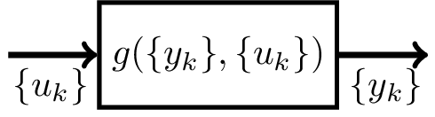
</figure>

Questa equazione può essere implementata facilmente su un computer poiché è un’operazione ricorsiva. Un microprocessore può simulare un’equazione alle differenze in base ai dati in entrata e così calcolarsi il controllore per ogni tempo di campionamento, inviando il segnale calcolato al convertitore DAC. Dopo aver inviato i dati in uscita, il microcontrollore aspetta la fine del tempo di campionamento prima di eseguire nuovamente il calcolo del controllore.

## Trasformata Z

Supponiamo di avere una successione di valori $y[k]$, si definisce la trasformata $Z$ per questa sequenza di valori: $$\begin{gathered}
    Z\{y[k]\}=y[0]+y[1]z^{-1}+y[2]z^{-2}+\cdots+y[k]z^{-k}\\
    Y(z)=\sum_{k=0}^{+\infty}y[k]z^{-k}\tag{\stepcounter{equation}\theequation}
\end{gathered}$$ Per determinarne la convergenze si manipola per farla assomigliare ad una serie geometrica.

Si considera un segnale in entrata $e^{pt}$ con $p<0$, campionandolo si ottiene una sequenza di valori $\{e^{pkT_c}\}$, si applica quindi la trasformata $Z$ ai campioni ottenuti dall’esponenziale: $$Z\{e^{pkT_c}\}=\sum_{k=0}^{+\infty}e^{pkT_c}z^{-k}=\sum_{k=0}^{+\infty}\left(e^{pT_c}z^{-1}\right)^k$$ Una serie geometrica del tipo $\sum x^k$ converge a ${1}/{1-x}$ se $|x|<1$ ovvero considerando $x\in\mathbb{C}$ il valore $x$ deve rimanere all’interno di una circonferenza unitaria avente centro nell’origine del piano di Gauss. Per cui la trasformata $Z$ si può esprimere come: $$|e^{pT_c}z^{-1}|<1\Rightarrow Z\{e^{pkT_c}\}=\displaystyle\frac{1}{1-e^{pT_c}z^{-1}}=\frac{z}{z-e^{pT_c}}$$ Il componente $e^{pT_c}z^{-1}$ corrisponde all’integrale discreto di $e^{pT_c}$, equivalente ad una sommatoria. Considerando una circonferenza centrata nell’origine del piano di Gauss di raggio $|e^{pT_c}|$, quando $|z|>|e^{pT_c}|$ si ha $|e^{pT_c}z^{-1}|<1$, per cui converge per ogni valore $z$ all’esterno di questa frontiera. Analogamente alla trasformata di Laplace, che converge a destra di un’ascissa di Laplace $s=s_0$, coincidente con il polo.

Lo stesso elemento $e^{pt}$ in Laplace diventa si esprime come: $$\displaystyle\frac{1}{s+p}$$ Mentre in $Z$ diventa: $$\displaystyle\frac{z}{z-e^{pT_c}}$$ Con $p<0$. Il polo in Laplace viene rappresentato come $p$, mentre in $Z$ come $e^{pT_c}$. Per $p=0$, si ha un gradino e la sua trasformata $Z$ corrisponde a: $$Z\{\delta_{-1}[t]\}=\displaystyle\frac{z}{z-1}$$

Dato un segnale $\{y_k\}$, la sua trasformata $Z$ è data da una somma di segnali ritardati. Moltiplicando per un fattore $z^{-1}$ l’intera sequenza è come se si analizzasse un segnale il cui primo elemento campionato sia nullo, per cui si ritarda il segnale: $$\begin{gathered}
    Z\{y_k\}=y_0+y_1z^{-1}+y_2z^{-2}+\cdots\\
    0+y_0z^{-1}+y_1z^{-2}+y_2z^{-3}+\cdots=Z\{y_k\}\cdot z^{-1}=Z\{y'_k\}
\end{gathered}$$ Questo tipo di ritardo viene chiamato ritardo elementare, non è un ritardo nel dominio del tempo, ma un ritardo nella sequenza di campioni.

Data una trasformata $Z$: $$Y(z)=\displaystyle\sum_{k=0}^{+\infty}(e^{pT_c}z^{-1})^k$$ Per ottenere il valore finale si considera: $$\lim_{z\to1}\displaystyle\frac{z-1}{z}Y(z)$$ Per ottenere $1$ per $z^{-1}$ bisogna porre $p=0$, per cui si calcola il valore finale nel piano $Z$ per $z\to1$. Nel continuo il polo è in $0$, mentre nel discreto è in $e^{0\cdot T_c}=1$.

Data un’equazione alle differenze: $$y_{k+1}=ay_k+bu_k$$ Si considerano le sequenze $\{y_k\}$ e $\{u_k\}$ come se fossero ritardate di un campione per cui $\{y_{k+1}\}=\{y_k\}$, tenendo conto del ritardo che si ha si riscrive come: $$\begin{gathered}
    \{y_k\}=a\{y_k\}'+b\{u_k\}'\\
    Y(z)=aY(z)z^{-1}+bU(z)z^{-1}\\
    Y(z)z=aY(z)+bU(z)\Rightarrow \displaystyle\frac{Y(z)}{U(z)}=W(z)=\displaystyle\frac{b}{z-a}\tag{\stepcounter{equation}\theequation}
\end{gathered}$$ Per cui questa funzione descrive il sistema dinamico descritto da quella equazione alle differenze.

Si potrebbe quindi implementare un controllore per un’equazione alle differenze se fosse possibile trasportarlo dal dominio di Laplace al dominio $Z$.

## Mapping dal Piano S a Z

Dato un segnale $x(t)$ campionato, può essere applicata sia una trasformata di Laplace che una trasformata $Z$, per cui si ha: $$\begin{gathered}
    X_c(s)=\sum_{k=0}^{+\infty}x_ke^{-skT_c}\\
    X_c(z)=\sum_{k=0}^{+\infty}x_kz^{-k}
\end{gathered}$$ Si può sostituire $z\to e^{sT_c}$ per ottenere la trasformata di Laplace partendo dalla trasformata $Z$, ma non rappresenta una relazione di eguaglianza tra le due. Questa relazione viene utilizzata per analizzare, al variare della pulsazione naturale di $s$, l’effetto percepito nel piano $Z$.

Si considera un’unica striscia nell’intervallo $\left[-j{\omega_c}/{2},j{\omega_c}/{2}\right]$, poiché la trasformata è periodica. Si considera il solo semipiano negativo, poiché si vuole analizzare il comportamento di sistemi stabili.

Considerando la risposta armonica in Laplace, si ha $s=j\omega$, per cui si ha una relazione: $$z=e^{j\omega T_c}=e^{2\pi j\frac{\omega}{\omega_c}}$$

L’aumento della pulsazione naturale, in positivo o in negativo, provoca una rotazione nel dominio $z$ fino ad un valore: $$2\pi j\displaystyle\frac{\left(\frac{\pm\omega_c}{2}\right)}{\omega_c}=\pm j\pi$$ Per cui si ha una rotazione di $180^{\circ}$ in senso orario per pulsazioni naturali negative, e in senso antiorario per pulsazioni naturali positive. Queste rotazioni formano una circonferenza unitaria.

L’origine del piano di Laplace coincide con il punto $z=e^{j0T_c}=1$, per $s$ puramente reale, è puramente reale anche il corrispettivo in $z$, per cui il semiasse negativo dell’asse dei reali coincide con il segmento dal punto $1$ all’origine degli assi in $z$.

Per $s=\sigma+j\omega$, deve avere necessariamente parte reale negativa per rappresentare un sistema stabile, per cui si ha $\sigma\in(-\infty,0]$, quindi si può esprimere l’esponenziale come: $$z=e^{2\pi\frac{(\sigma+j\omega)}{\omega_c}}=e^{2\pi\sigma}e^{2\pi j\frac{\omega}{\omega_c}}$$ Poiché $\sigma$ è necessariamente negativo ciò risulta in rotazioni intorno all’origine dell’asse $z$, con raggio $e^{2\pi\sigma}<1$. Per cui corrisponde a delle circonferenze concentriche di raggio decrescente al diminuire di $\sigma$.

Si può definire una nuova condizione di stabilità per il dominio $z$ poiché tutti i poli avente parte reale negativa sono contenuti nella circonferenza unitaria centrata nell’origine degli assi. Tutti i poli contenuti in questa circonferenza danno origine a delle dinamiche stabili, mentre i poli sulla circonferenza unitaria sono al limite di stabilità, invece tutti i poli esterni rappresentano delle dinamiche instabili.

<figure>

  

</figure>

Più il raggio della circonferenza dove si trovano i poli è piccolo, maggiore è lo smorzamento dei poli. Due poli complessi e coniugati vengono rappresentati simmetricamente anche nel piano $z$. Dato un polo su una circonferenza se la percorre in senso antiorario nel semipiano immaginario positivo, oppure in senso orario nel semipiano immaginario negativo, allora il suo smorzamento diminuisce ed aumenta la sua pulsazione naturale. Se un polo su una circonferenza si sposta radialmente su un’altra di raggio maggiore allora il suo smorzamento aumenta e la sua pulsazione naturale rimane invariata.

Si considera una funzione di trasferimento in $z$ avente un polo $p$ nel segmento $a/b$ su $z$: $$W(z)=\displaystyle\frac{1}{z+p}$$ Questa funzione non può esistere nel dominio di Laplace poiché quel punto corrisponde a due punti complessi e coniugati in $s$, per cui nel mondo del discreto si possono descrivere oggetti che non possono esistere nel continuo. Si può rappresentare come un’equazione alle differenze $y_{k+1}=-|p|y_k+u_k$, per un’entrata $u_0=0$ e $y_0=1$, rappresenta una successione alternante che converge a zero. Questa successione non deriva da nessun campionamento di un sistema lineare, quindi è un oggetto esclusivo al discreto.

Poiché la trasformata $Z$ è una serie, bisogna determinare la sua convergenza. Si considera il criterio di convergenza in assoluto:

> Sia data una serie: $$\displaystyle\sum_{k=0}^{+\infty}a_k$$ Questa converge in assoluto, ovvero converge la serie: $$\displaystyle\sum_{k=0}^{+\infty}|a_k|$$ Se il rapporto tra un termine della serie ed il precedente è definitivamente di modulo strettamente minore di uno dopo un valore $k_0$: $$\displaystyle\left|\frac{a_{k+1}}{a_k}\right|<1,\:k\geq k_0$$

Per cui se il modulo degli elementi della serie diminuiscono strettamente allora la serie non può che convergere.

Data una trasformata $Z$: $$X(z)=\displaystyle\sum_{k=0}^{+\infty}x_kz^{-k}$$ Converge in assoluto se: $$\begin{gathered}
    \left|\displaystyle\frac{x_{k+1}}{x_k}\right|<1\\
    x_{k+1}=\alpha x_k+u_k\\
    \left|\displaystyle\frac{x_{k+1}}{x_k}\right|=|\alpha|<1,\mbox{ per }u_k=0
\end{gathered}$$ Per cui il sistema converge in assoluto se il polo è interno alla circonferenza unitaria, la sua trasformata $Z$ può essere espressa come: $$W(z)=\displaystyle\frac{1}{z-\alpha}$$

## Trasformazioni da S a Z

Poiché è possibile trasportare uno stesso segnale dal dominio del tempo al dominio di Laplace ed al dominio $Z$ separatamente. Si vuole trovare un modo per passare direttamente dal dominio di Laplace al dominio $Z$ senza ritornare al segnale originale nel tempo. Discretizzando un sistema bisogna scegliere il tempo di campionamento adeguato. Ritardare un segnale discreto di poco può causare una destabilizzazione del sistema a ciclo chiuso, per cui il tempo di campionamento è necessario che sia molto preciso

Si considera un sistema a controreazione autonomo:

<figure>
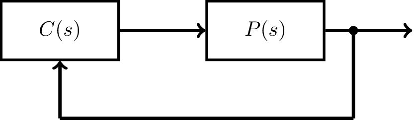
</figure>

Il processo $P(s)$ può essere espresso nel discreto, ma il controllore $C(s)$ creato nel continuo deve essere espresso nel discreto. Una volta ottenuta la funzione $C(z)$ si può implementare l’equazione alle differenze utilizzando cicli tramite interrupt in modo che il sistema operativo non blocchi l’esecuzione del controllore senza che questo blocchi l’esecuzione del sistema operativo.

### Trasformazione Esatta e Guadagno

Passando per il domino del tempo è sempre possibile trasformare una funzione continua in una discreta. Scomponendo il controllore in poli e residui, trasportando ogni residuo nel discreto separatamente: $$\begin{gathered}
    C(s)=\displaystyle\sum_{i=0}^{n}\frac{R_i}{s+p_i}\\
    C(z)=\displaystyle\sum_{i=0}^{n}\frac{zR_i}{z+e^{p_iT_c}}
\end{gathered}$$ Questa trasformazione viene chiamata trasformazione esatta, ed il polo si sposta da $p_i$ a $e^{p_iT_c}$. I guadagni per una risposta indiciale si ottengono con i rispettivi teoremi del valore iniziale: $$\begin{gathered}
    K_{(s)}:=\lim_{s\to0}s\cdot\displaystyle\frac{R_i}{s+p_i}\frac{1}{s}=\frac{R_i}{p_i}\\
    K_{(z)}:=\lim_{z\to1}(1-z^{-1})\cdot\displaystyle\frac{zR_i}{z+e^{p_iT_c}}\frac{1}{1-z^{-1}}=\frac{R_i}{1-e^{p_i}T_c}
\end{gathered}$$ Sorge un problema poiché hanno la stessa risposta impulsiva, ma hanno una risposta al gradino diversa, su cui si calcola il guadagno. Il guadagno così ottenuto dipende anche dal tempo di campionamento scelto, e non rappresenta il guadagno ottenuto nel dominio di Laplace. Per cui non viene mai usata una trasformazione esatta.

Per avere la stessa risposta al gradino si potrebbe moltiplicare la trasformata $Z$ di ogni residuo per un fattore: $$\displaystyle\frac{1-e^{p_iT_c}}{p_i}$$ In modo da avere la stessa risposta al gradino. Questa trasformazione viene chiamata trasformazione al guadagno: $$C(z)=\displaystyle\sum_{i=0}^{n}\frac{1-e^{p_iT_c}}{p_i}\frac{zR_i}{z+e^{p_iT_c}}$$ In questo modo si può forzare il sistema discreto ad avere la stessa risposta del sistema nel continuo, ma campionando un segnale l’unica informazione che rimane del segnale originario è la sua risposta impulsiva, per cui si ha solo una risposta impulsiva uguale. Il sistema campionato non può descrivere il comportamento ad un gradino, o in generale qualsiasi entrata diversa da un impulso. Anche se presenta una stessa risposta al gradino, utilizzando una trasformazione al guadagno non è possibile ricostruire l’informazione persa durante il campionamento, quindi non può descrivere la risposta nel tempo ad un entrata diversa.

Non esiste una trasformazione “giusta" esistono sono delle approssimazioni, ed alcune sono più soddisfacenti delle altre in determinate situazioni.

### Trasformazione ZOH

Invece di discretizzare la funzione direttamente, si moltiplica per l’organo di tenuta e in seguito si applica la trasformata $Z$, allora si ha: $$\begin{gathered}
    Z\left[C(s)T(s)\right]=Z\left[C(s)\displaystyle\frac{1-e^{sT_c}}{s}\right]\\
    Z\left[\displaystyle\frac{C(s)}{s}\right]-Z\left[\displaystyle\frac{C(s)}{s}e^{-sT_c}\right]\\
    Z\left[\displaystyle\frac{C(s)}{s}\right](1-z^{-1})\tag{\stepcounter{equation}\theequation}
\end{gathered}$$ Per cui il segnale risulta ritardato di un campione poiché $e^{-sT_c}$ rappresenta un ritardo nel discreto di un campione.

### Trasformazione di Tustin

Per determinare la discretizzazione migliore per una data situazione bisogna analizzare il diagramma di Bode e controllare quale discretizzazione ha una risposta più simile al controllore continuo, oppure si controlla quale controllore ha una risposta al gradino più simile, oppure si usano metodi diversi in base alle specifiche richieste.

Data una curva, e noto il valore dell’integrale $y_k$ della curva fino ad un punto $kT_c$, si può approssimare il valore dell’integrale $y_{k+1}$ ad un punto successivo $(k+1)T_c$, come un’equazione alle differenze dato il campione nel punto $kT_c$ oppure nel punto successivo $(k+1)T_c$: $$\begin{aligned}
    i\left.\right)\,&y_{k+1}=y_k+T_cu_k\\
    ii\left.\right)\,&y_{k+1}=y_k+T_cu_{k+1}
\end{aligned}$$ Dove il $u_k$ è il valore del campione nell’intervallo di campionamento $kT_c$, per cui si approssima la curva come una serie di rettangoli, in questo modo in base a quale campione si sceglie per approssimare il rettangolo si ha un’approssimazione maggiore o minore del valore reale dell’integrale. Un’approssimazione di questo tipo però non è molto precisa, per cui invece di un rettangolo si considera un trapezio di basi $u_k$ e $u_{k+1}$ e altezza $T_c$ di area: $$(u_k+u_{k+1})\displaystyle\frac{T_c}{2}$$ Questa approssimazione viene chiamata approssimazione di Tustin, ed avrà un’equazione alle differenze: $$iii\left.\right)\:y_{k+1}=y_k+(u_k+u_{k+1})\displaystyle\frac{T_c}{2}$$

<figure>

    

</figure>

Si può ottenere l’approssimazione di un integratore $s^{-1}$ tramite la funzione di trasferimento discreta delle equazioni alle differenze: $$\begin{gathered}
    i\left.\right)\:y_{k+1}=y_k+T_cu_k\\
    Y(z)=Y(z)z^{-1}+T_cU(z)z^{-1}\\
    W(z)=\displaystyle\frac{T_cz_{-1}}{1-z^{-1}}\approx\frac{1}{s}\\
    s\approx\displaystyle\frac{1}{T_c}\frac{1-z^{-1}}{z^{-1}}\tag{\stepcounter{equation}\theequation}\\
    ii\left.\right)\:y_{k+1}=y_k+T_cu_{k+1}\\
    Y(z)=Y(z)z^{-1}+T_cU(z)\\
    W(z)=\displaystyle\frac{T_c}{1-z^{-1}}\approx\frac{1}{s}\\
    s\approx\displaystyle\frac{1-z^{-1}}{T_c}\tag{\stepcounter{equation}\theequation}\\
    iii\left.\right)\:y_{k+1}=y_k+(u_k+u_{k+1})\displaystyle\frac{T_c}{2}\\
    Y(z)=Y(z)z^{-1}+\displaystyle\frac{T_c}{2}U(z)(1+z^{-1})\\
    W(z)=\displaystyle\frac{T_c}{2}\frac{1+z^{-1}}{1-z^{-1}}\approx\frac{1}{s}\\
    s\approx\displaystyle\frac{2}{T_c}\frac{1-z^{-1}}{1+z^{-1}}\tag{\stepcounter{equation}\theequation}
\end{gathered}$$ Quest’ultima approssimazione viene anche chiamata approssimazione bilineare. Poiché $s$ corrisponde ad un derivatore, in questo modo si approssima il derivatore in $z$, ma l’accuratezza di questo derivatore cambia radicalmente in base a quale approssimazione si usa. Non si può usare la relazione $z=e^{sT_c}$, poiché l’esponenziale non è una relazione lineare, non si può mai usare questa trasformazione esatta. Considerando l’approssimazione più semplice, ovvero la $\left.ii\right)$, si controlla in che modo mappa il piano $s$ su $z$, rispetto alla trasformazione esatta:

<figure>
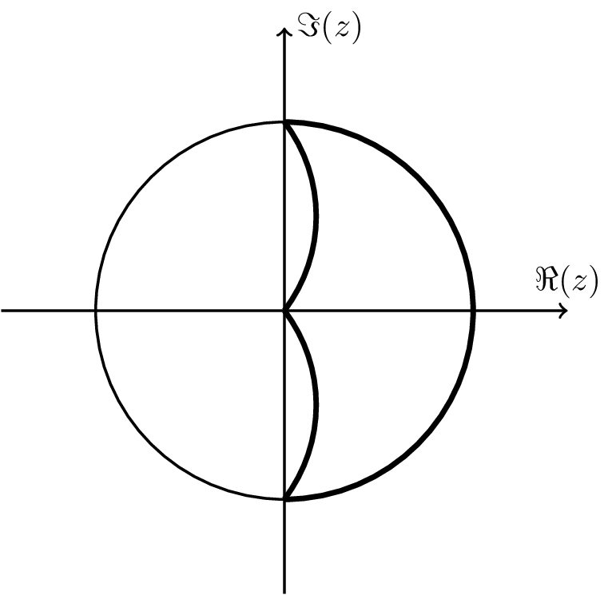
</figure>

Per cui rispetto ad una trasformata esatta, il piano viene compresso, la zona meno compressa corrisponde all’intorno del punto $1$. Per cui se si ha una funzione di trasferimento con dei poli nell’intorno di $1$ in $z$ allora può essere usata, me per altri poli quest’approssimazione non è precisa. L’intorno di $1$ è una zona fissa della trasformazione che non viene deformata. Al diminuire del tempo di campionamento i poli tendono a spostarsi verso l’intorno di $1$, per cui questa trasformazione è più utile minore il tempo di campionamento, ma la sua precisione diminuisce molto rapidamente all’aumentare di quest’ultimo. In caso di tempi di campionamento piccoli, una trasformazione più semplice può risultare migliore poiché richiede un tempo di calcolo minore.

Invece per l’approssimazione di Tustin si ha una mappatura molto più accurata rispetto alla mappatura esatta:

<figure>
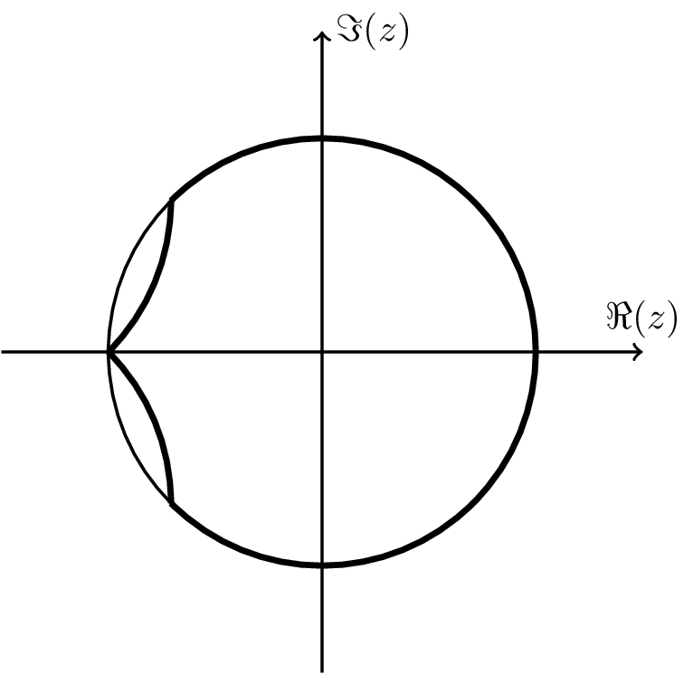
</figure>

Risulta essere una delle migliori approssimazioni, mantenendo per gran parte le proprietà del continuo. Questa trasformazione è molto utile quando non si può ridurre il tempo di campionamento. Conserva le proprietà dei poli nella zona sinistra del piano, a differenza delle altre approssimazioni. Inoltre è possibile espandere una zona intorno ad uno o più poli tramite un’altra trasformazione bilineare prima della trasformazione di Tustin per renderla più simile alla trasformazione esatta. Ma questa espansione funziona solo nell’intorno dei poli scelti, poiché il piano non è compresso dello stesso fattore. Questo tipo di espansione si applica nei casi dove si vuole mantenere la pulsazione di alcuni poli.

Per controllare in che modo una data approssimazione cambia il comportamento di un controllore si possono confrontare i diagrammi di Bode di $C(s)$ e $C(z)$.

## Sintesi di un Controllore Discreto

Si è visto come dato un processo continuo si può sintetizzare un controllore nel continuo e trasportarlo nel discreto tramite una delle trasformazioni, in questo modo si può realizzare un sistema ibrido con un controllore discreto ed un processo continuo. Bisogna introdurre in catena di controreazione un quantizzatore per trasformare i dati continui in discreti affinché il controllore digitale possa elaborarli, di conseguenza non è necessario un organo di tenuta. É necessario invece un altro convertitore tra il controllore discreto ed il processo continuo. A valle del quantizzatore in controreazione si può inserire un filtro antialiasing, se necessario:

<figure>
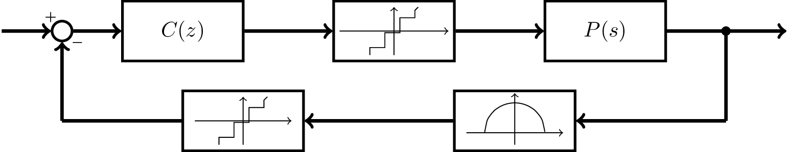
</figure>

Per un entrata a gradino questo sistema ha una risposta nel tempo:

<figure>

</figure>

Se si descrive il processo in tempo discreto, allora si può avere un sistema completamente nel discreto, senza l’utilizzo di convertitori:

<figure>
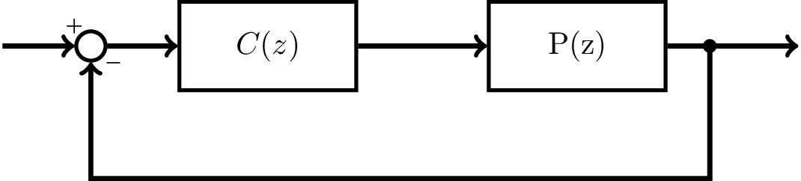
</figure>

In questo caso si ha una funzione di trasferimento a ciclo chiuso discreta ed è lecito cercare di sintetizzare direttamente un controllore: $$\begin{gathered}
    W(z)=\displaystyle\frac{C(z)P(z)}{1+C(z)P(z)}
\end{gathered}$$ Per un entrata a gradino unitario si vuole ottenere potenzialmente una successione di valori costanti, ma richiedendo prestazioni troppo elevate al sistema, potrebbe produrre un oggetto non causale. Per cui si considera una funzione di trasferimento che invece di essere una costante, come un riferimento ideale $K_d$, è un ritardo di $n$ campioni: $$W(z)=z^{-n}$$ Per un entrata a gradino, esce dal sistema un gradino dopo $n$ campioni, con errore nullo. Per cui si ha una risposta precisa dopo un certo periodo di tempo.

<figure>

  

</figure>

Come per la sintesi diretta in $s$ è necessario che tutte le dinamiche del sistema siano asintoticamente stabili. Il controllore ricavato risulta essere: $$\begin{gathered}
    C(z)P(z)=z^{-n}(1+C(z)P(z))\\
    C(z)=\displaystyle\frac{1}{P(z)}\frac{z^{-n}}{1-z^{-n}}=\frac{1}{P(z)}\frac{1}{z^n-1}\tag{\stepcounter{equation}\theequation}
\end{gathered}$$ Può cancellare il processo $P(z)$ solo se le dinamiche sono asintoticamente stabili, quindi il processo deve avere tutti i suoi poli e zeri entro il cerchio unitario in $z$. $n$ rappresenta l’eccesso poli-zeri del processo, ed indica il minimo numero di poli da aggiungere nel controllore per rendere il componente ${1}/{P(z)}$ stabile. Nel discreto rappresentano il minimo numero di passi di ritardo prima che il sistema possa avere un’uscita costante. Questo processo potrebbe non essere la discretizzazione di nessun processo continuo, alcuni processi sono definiti solo nel discreto.

In caso sia derivato da una discretizzazione di un processo continuo, un controllore nel mondo discreto realizza una risposta piatta dopo un certo numero di campioni, mentre nel continuo arriva asintoticamente ad una risposta piatta oscillando o meno, come una curva esponenziale. Per cui una risposta piatta nel discreto potrebbe corrispondere a valori costanti di un’oscillazione nel continuo, il segnale continuo potrebbe oscillare tra i valori discreti:

<figure>
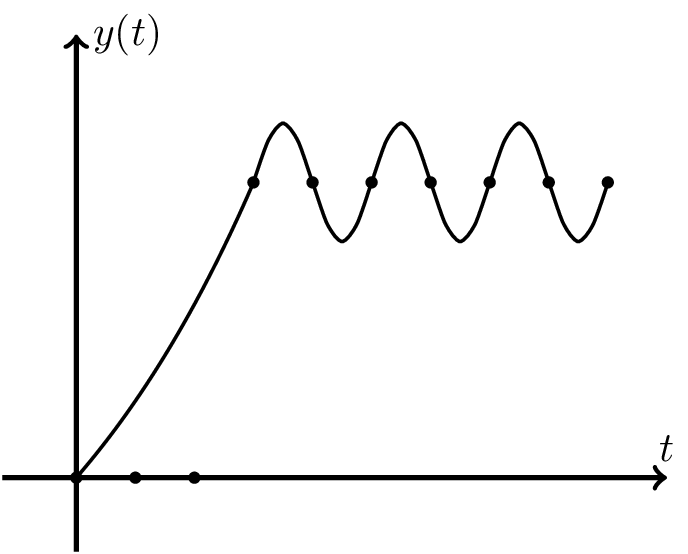
</figure>

Lavorando sulla funzione a ciclo chiuso, e soddisfacendo certe condizioni, è possibile sintetizzare un controllore $C(z)$ che recupera delle caratteristiche del continuo, per cui si ha un errore minimo anche nella risposta nel continuo:

<figure>
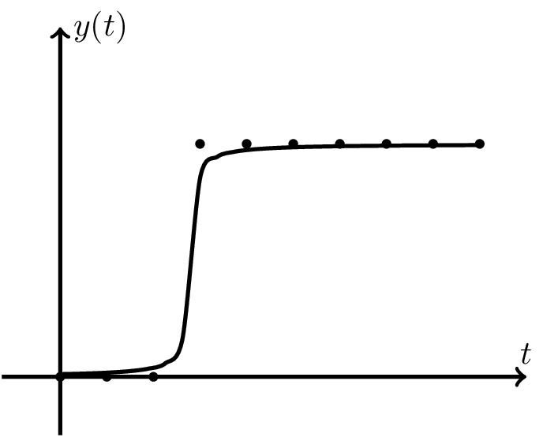
</figure>
