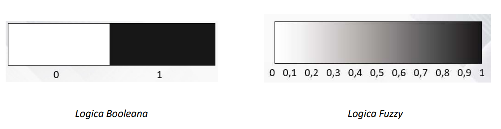

# Fuzzy Logic

check: Yes

La `logica fuzzy` è un ramo del soft-computing che impiega il ragionamento approssimato per lo sviluppo di motori di inferenza fuzzy. E’ nota anche come logica sfumata o sfocata e rappresenta un tentativo di riprodurre in modo artificiale i processi di ragionamento tipici della mente umana.

Quindi quello che fa è modellare l’incertezza del linguaggio naturale trattando il concetto di parziale verità definendo i valori compresi tra il completamente vero e il completamente falso.

La `funzione caratteristica` di $A$, indicata con $F_A(x)$ associa ad ogni elemento $x$ dell’universo del discorso $X$ un valore appartenente all’insieme $\{ 0,1 \}$ secondo la regola:

$$
F_A(x): X \to \{ 0,1 \}
$$

Questa funzione vale 1 se $x\in A$ mentre vale $0$ se $x\notin A$, rispettivamente appartiene o non appartiene.

Questo insieme mappa l’universo del discorso $X$ ad un insieme di 2 elementi (questo insieme è definito “`Crisp`”)

## Vagueness

La `vagueness` è solitamente associata al `boundary-region` approach. Rappresentano l’esistenza di oggetti che non possono essere classificati in modo univoco rispetto a un insieme o al suo completamento.

## Insiemi Fuzzy

L’uso di un insieme `crisp` è limitativo per rappresentare un concetto `sfumato`: l’elaborazione del linguaggio umano, come altri approcci richiedono modelli di ragionamento che tengano conto delle intrinseche imprecisioni degli oggetti di indagine.

E’ necessario quindi riformulare la nozione di insieme in modo più realistico, introducendo il concetto di `insieme-fuzzy`. Si vuole quindi giungere a una descrizione più precisa degli insiemi che si incontrano nella vita reale. Questo viene ottenuto utilizzado la relazione che prevede un grado di `appartenenza` di ciascun oggetto.

La funzione di appartenenza rappresenta il grado e viene definito con $\mu_A(x)$ e se vale 1 allora $x$ appartiene completamente all’insieme, se vale $0$ allora non appartiene all’insieme e se è compreso tra $0$ e $1$ allora si ha una appartenenza parziale.

La funzione $\mu(x)$ può essere di vari tipi, per esempio trinagolare, trapezoidale oppure a campana. Se l’universo del discorso è l’insieme dei numeri reali, il fuzzy set si chiama fuzzy number.