# Imprenditorialità

<!-- Page 21 -->

Introduction
A Tale of Two Entrepreneurs
I’m going to start by telling you a story about two entrepreneurs. Let’s call
them Steve and Larry. Both of them studied at the same university and got
good grades, and after graduation, both worked at a high-tech startup where
they quickly grew into key roles.
After a few years, they both got hit with an idea for a startup and decided
to quit their jobs and venture out on their own. Even though I’ve given them
names to make them more personable, I want to emphasize that what makes
them similar isn’t their age, gender, or geography, but that they both were
struck by a “big idea” and decided to act upon it.
Now, what differentiates them is how they look a year later (Figure I-1).
Figure I-1. Steve and Larry look quite different a year later

<!-- Page 22 -->

A year later, Steve is still building his product. He has no product revenue and
relies on part-time freelancing work to fund his product development. And he
works alone. Larry, on the other hand, has a growing customer base, growing
revenue, and a growing team. How did they end up in such different places?
To answer that question, let’s travel back in time.
One Year Ago…
Steve is at his desk, lost in thought. Earlier that day, his manager told him
that their parent company (following on from a recent acquisition) would be
shutting down their offices in a couple of months. And Steve was given the
choice to either relocate to headquarters or take a severance package.
Steve reads this as a sign.
He had always planned on starting his own company when the timing was
right. After graduating from university, he made a conscious decision to join a
promising startup, in order to gain some firsthand experience before venturing
out on his own. Even though this startup had a few bad product starts, they
did eventually manage to get acquired. Steve felt really proud to have been part
of the core team.
“This may be as good a time as any,” he thinks to himself. He decides to take
the evening to think things over.
Steve estimates that if he keeps his expenses in check, the severance package
and his savings will provide him with a year of runway to get something off
the ground. He does have this one augmented reality/virtual reality (AR/VR)
idea that he’s been noodling around in his head for a few months already…
The next day, he decides to take the plunge and accepts the severance package.
Off to the Races
Steve wastes no time getting to work. He anticipates that if he stays focused
and works full time without distractions, he should be able to launch the first
version of his product in three months (Figure I-2).
Figure I-2. Steve in the metaphorical garage

<!-- Page 23 -->

He wants to go about things the “right way,” so like a craftsman, he meticu-
lously begins designing and building his product.
But little things start taking longer than expected, and the delays add up—
weeks quickly turn into months.
Six Months Later
Steve is starting to get nervous. The product isn’t up to his standards, and his
revised estimates put the launch date out at least another three months, or
maybe even six.
He’ll be out of money by then.
He realizes he needs help.
Steve hits up some of his close friends and tries to recruit them, offering up
generous equity in exchange. But they don’t see what he sees and find it hard
to justify leaving their secure, well-paying jobs (Figure I-3).
Figure I-3. Nobody sees what Steve sees
Steve attributes this setback to a “lack of vision” on his friends’ part, and is
even more determined to find a way to finish his product.
He decides to hit the pitching circuit and raise money.
He starts by contacting his previous startup’s founder, Susan, who readily
agrees to meet with Steve. Susan likes the idea and offers to introduce Steve to
a number of investors.
She leaves him with this advice: “Make sure you put together a bulletproof
business plan first.”
Steve has never written a business plan before. So he downloads a few tem-
plates and picks one he likes. As he starts writing, he finds that he doesn’t
know the answers to many of the questions being asked, but he does his best
anyway to complete the plan.
He’s especially encouraged by the financial forecast spreadsheet. The more he
plays with the numbers, the more he’s convinced that he’s on to something

<!-- Page 24 -->

really big. He decides to tweak a few numbers downward, though, to down-
play the fantastic model he has created—it’s so good, people might not believe
him!
He knows a lot is at stake, so he spends many more days developing his
elevator pitch, outlining his product roadmap, and polishing his 10-page slide
deck.
He reaches out to Susan a few weeks later, who helps him set up a half-dozen
meetings with investors. Steve is a nervous wreck during the first few meetings,
but thinks they go okay. He starts to get more comfortable with practice and
feels a lot better about his later meetings.
He doesn’t get an instant “yes.” But at least he doesn’t get an outright rejection
either. He debriefs Susan later, who reluctantly bursts his bubble: ”Sorry, Steve,
but ‘you’re too early for us’ and ‘let’s touch base in six months’ are code for
‘we’re not interested, but we’re too polite to say no!’” (Figure I-4).
Figure I-4. Investors have mastered the art of the polite “no”
Catch-22
Steve is in a classic catch-22. He can’t make people see his vision until he
completes his product, but investors won’t give him the resources to complete
his product (Figure I-5).
What is he to do?
Steve still believes in his product and is determined to build it.
He retreats back into his metaphorical garage and decides to self-fund his idea
with part-time freelancing.

<!-- Page 25 -->

Figure I-5. Steve is in a catch-22
Progress is slow, but at least he’s still working on his product nights and
weekends, moving his idea forward.
Now, let’s turn to Larry. He too was hit by an awesome idea a year ago,
but unlike Steve, he doesn’t start with a build-first or investor-first approach.
That’s because a build-first or investor-first approach is backward.
A Traction-First Approach Is the New Way Forward
Larry recognizes that a build- or investor-first approach used to work at a
time when building products was really hard and expensive, but the world has
changed.
Investors used to value intellectual property and funded teams that demon-
strated they could build stuff. But this is no longer the case.
Also, because building products often used to be prohibitively expensive, teams
that managed to raise funding used to have a significant unfair advantage over
others, because they could get to market faster and learn faster than their com-
petitors. Even if they got the product completely wrong the first time around,
they could still manage to course-correct and get back on track because there
were very few competitors nipping at their heels.
But the world is quite different today… (Figure I-6)
We are living through a global entrepreneurial renaissance. Today, it is cheaper
and easier than ever to build a product, which means that there are many more
people “starting up” all over the world. While this explosion in startup activity
represents an incredible opportunity for all of us, it comes with a dark cloud:
more products translates to more choices for both investors and customers,
making it harder to stand out.

<!-- Page 26 -->

Figure I-6. We are living in a new world
Investors today don’t value intellectual property, but traction. Traction isn’t
about being first to market, but first to market adoption.
Traction is evidence that people other than yourself, your team, and your mom
care about your idea—aka customers. More importantly, traction is evidence
of a working business model.
TIP
Investors today don’t fund solutions that work; they fund business models that
work.
But how do you demonstrate traction without a working product? Aren’t we
back to the catch-22? Not really, because Larry knows that customers today
are constantly bombarded with a multitude of product choices. When custom-
ers encounter a half-baked product, they don’t turn into beta testers and give
you feedback; they leave.
Without customer feedback it’s too easy to fall prey to the “build trap,” where
a breakthrough always seems one killer feature away but remains ever elusive.
You end up spending needless time, money, and effort building something
nobody wants, until you run out of resources.
Larry has experienced this build trap one too many times before with his
startup’s past products, and he decides to level up his game and start with a
better foundation for his product. A fundamental mindset shift for doing that
is starting with problems before solutions.
NOTE
Customers don’t care about your solution; they care about their problems.

<!-- Page 27 -->

He understands that if his product doesn’t solve a big enough problem for
his customers, no amount of technology, patents, or giveaways can save his
business model.
This leads to a number of epiphanies for Larry:
MINDSET #1
The business model is the product.
MINDSET #2
Love the problem, not your solution.
MINDSET #3
Traction is the goal.
Larry spends half an afternoon sketching out a business model design for his
idea using a 1-page template (Lean Canvas) that was recommended to him by
one of his trusted mentors.
He then tests the viability of his business model using a quick back-of-the-
envelope calculation, and from there builds out a traction roadmap that high-
lights his key milestones. This helps him map out a bottom-up go-to-market
validation strategy (Figure I-7).
Figure I-7. Larry does some quick business modeling of his idea
A key difference of his validation strategy from Steve’s is that he prioritizes
testing what’s riskiest versus what’s easiest in his business model.

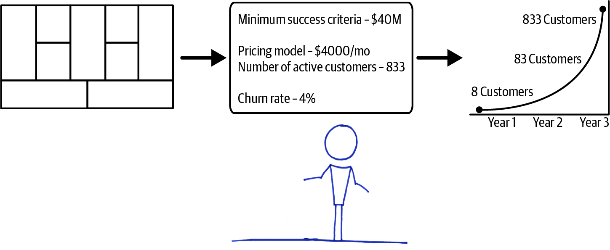

<!-- Page 28 -->

Larry correctly recognizes that in the new world what’s riskiest for most prod-
ucts has shifted, with customer and market risks outweighing technical risks.
The challenge question today isn’t “Can we build it?” but “Should we build
it?”
This is why he decides to take a traction-first approach versus a build-first or
investor-first approach.
MINDSET #4
Right action, right time.
And here’s the really counterintuitive bit: you don’t need a working product
to uncover problems worth solving, or even to land your first batch of paying
customers.
Unlike Steve, who is still perfecting and polishing his product a year down the
road, Larry manages to define his minimum viable product (MVP) in less than
eight weeks, with a growing customer pipeline.
NOTE
A minimum viable product (MVP) is the smallest solution that creates, delivers,
and captures customer value.
Following this approach, Larry avoids spending needless time, money, and
effort building a product he hopes customers will buy and instead builds a
product he knows customers will buy.
NOTE
Steve is following a Build-Demo-Sell playbook, while Larry is following a Demo-
Sell-Build playbook.
This puts Larry’s idea on solid footing, and he spends the next four weeks
building out a first version of his solution which is aimed not at everyone, but
at his ideal early adopters. Once his MVP is ready, he doesn’t do a big-bang
marketing launch, but rather soft-launches his product to just 10 early adopt-
ers and starts charging them from day one.
His logic for starting small and making a bold promise is putting his money
where his mouth is. He thinks to himself: “If I can’t deliver value to my first

<!-- Page 29 -->

10 handpicked customers, what makes me think I’ll be able to do that with
thousands of customers trying the product on their own?”
MINDSET #5
Tackle your riskiest assumptions in stages.
A nice side effect of starting small is that Larry can afford to provide a
high-touch customer experience. This lets him sidestep a few shortcomings
of his MVP and still overdeliver on value, while maximizing learning from his
customers.
His first batch of customers is blown away by Larry’s attention to detail and
responsiveness to their needs. He manages to convert all of them into true fans
while continually refining his MVP.
MINDSET #6
Constraints are a gift.
Even though Larry is a jack-of-all-trades, he recognizes that he can’t scale his
business on his own. So he invests a third of his time in pitching his vision
to potential cofounders. He doesn’t look for people just like him, but rather
searches for people with complementary skill sets to his. He knows that:
• Good ideas are rare and hard to find.
•
• Good ideas can come from anywhere.
•
• Finding good ideas requires lots of ideas.
•
The fact that Larry already has happy paying customers (early traction) and a
growing customer pipeline enables him to attract and recruit his dream team.
Too many teams take a divide-and-conquer approach to testing their busi-
ness model, where they split their focus based on individual team member
strengths. For example, hacker types typically focus on products, and hustler
types typically focus on customers. This spreads the team thinly across many
different priorities and is suboptimal.
Larry instead harnesses the full potential of his team by getting them to col-
lectively focus on what’s riskiest rather than what’s easiest in the business
model. As the risks in a business model are constantly shifting, he establishes a

<!-- Page 30 -->

regular 90-day cycle in order to maintain a sense of urgency and keep his team
externally accountable.
MINDSET #7
Hold yourself externally accountable.
Each 90-day cycle is broken into 3 key activities:
Modeling
Larry’s team kicks off each 90-day cycle by updating and reviewing the
business models (using a Lean Canvas and traction roadmap). This helps
the team constantly realign around a common set of goals, assumptions,
and constraints.
Prioritizing
The team then collectively prioritizes the riskiest assumptions and propo-
ses a number of possible validation strategies (campaigns) for overcoming
these risks.
Testing
As it’s hard to know which campaigns will work at the outset, instead of
making a few large bets, the team makes many small bets on the most
promising campaigns using fast iterative experiments. The learning from
these experiments helps Larry’s team identify and double down on the best
campaigns (Figure I-8).
Figure I-8. The Model-Prioritize-Test cycle
MINDSET #8
Place many small bets.
MINDSET #9
Make evidence-based decisions.

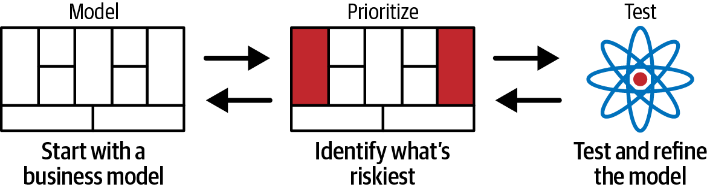

<!-- Page 31 -->

Each 90-day cycle ends with a cycle review meeting where the team reviews
what they did and what they learned, and plans for what’s next.
This Model-Prioritize-Test flywheel allows the team to systematically search
for a repeatable and scalable business model. The journey isn’t a straight
shot to success. There are twists and turns, dead ends, and backtracking. But
because Larry’s team is moving fast and constantly learning, it’s able to avoid
huge big-bang failures by making many small course corrections along the
way.
MINDSET #10
Breakthrough requires unexpected outcomes.
By the end of the year, Larry’s customer base is growing, his revenue is grow-
ing, and so is his team. His business model is on track to achieve product/mar-
ket fit.
What Determines Success Isn’t Differing Skill Sets But
Differing Mindsets
The difference between Steve and Larry is not differing skill sets but differing
mindsets.
Steve is operating like an Artist and is primarily driven by his love for his
product (solution).
You can easily substitute Artist with Software Developer, Designer, Creative,
Maker, Writer, Author, Hacker, Inventor…
He takes a build-first approach, which in today’s world is highly risky.
Larry, on the other hand, is operating like an Innovator.
NOTE
Innovators turn inventions into working business models.
He recognizes that we are living in a new world where the rules have changed.
Today, it is no longer enough to simply build what customers say they want
because, by the time you build that, you’ll have learned that what they really
wanted was something quite different.

<!-- Page 32 -->

TIP
In this new world, the only way to ensure you build what customers want is to
engage them continuously.
The Stakes Are Much Higher This Time
The old way of building products used to work at a time when there were huge
barriers to entry and few competitors. Even if you got the product completely
wrong, you had time to course-correct and get back on track.
But fast-forward to today, and it has become cheaper and faster than ever to
introduce new products, which means there is a lot more competition than
before—both from incumbents and from new companies starting up all over
the world.
In the old world, failing to deliver what customers wanted led to failed
projects. But in the new world, continually failing to deliver what customers
want leads to total business model failure.
This is because customers today have a lot more choices than they did before.
If they don’t get what they want from your product, they simply switch to
something else.
At the other end of the spectrum, the most successful companies today realize
that good ideas are rare and hard to find, and that the best way to find the
next big idea is to quickly test lots of ideas.
While the early adopters of this new way of working were high-tech startups
like Airbnb and Dropbox, over the years continuous innovation has been
increasingly applied in many different domains, and it works even at mas-
sive scale. Some of the most valuable companies in the United States, like
Google, Netflix, Amazon, and Facebook, all practice a culture of Continuous
Innovation.
Speed of Learning Is the New Unfair Advantage
Companies that continuously learn fast outlearn their competition and get to
build what customers really want.
This is the essence of Continuous Innovation, and it’s the approach that Larry
takes. When you’re going really fast under conditions of extreme uncertainty,
you can’t afford to spend long cycles analyzing, planning, and executing your
idea. You need a more iterative approach that involves continuous modeling,
prioritizing, and testing.

<!-- Page 33 -->

Succeeding in the New World Requires New Mindsets
Too many people fail at Continuous Innovation because they start in the
wrong place, cherry-picking tactics without first internalizing the underlying
mindset behind them.
NOTE
Mindsets define how we perceive the world around us.
If you believe that we are indeed living in a new world, then it should naturally
follow that a new world requires new mindsets. Here are the 10 mindsets that
power each of the 3 activities in the Continuous Innovation Framework:
1. Model
1.
• Mindset #1: Your business model is the product.
•
• Mindset #2: Love the problem, not your solution.
•
• Mindset #3: Traction is the goal.
•
2. Prioritize
2.
• Mindset #4: Right action, right time.
•
• Mindset #5: Tackle your riskiest assumptions in stages.
•
• Mindset #6: Constraints are a gift.
•
• Mindset #7: Hold yourself externally accountable.
•
3. Test
3.
• Mindset #8: Place many small bets.
•
• Mindset #9: Make evidence-based decisions.
•
• Mindset #10: Breakthrough requires unexpected outcomes.
•
We’ll touch on each of these mindsets as we move through the book.
You Can’t Afford to Wait for an Idea Whose Time Has
Come
It’s been a little over 18 months since Steve quit his day job and ventured out
on his own. Even though his savings ran out six months ago, he has hit a com-
fortable groove using freelance consulting to keep his product development
going.

<!-- Page 34 -->

He’s come to terms with the fact that bringing his vision to life is going to take
time, but he’s not in a hurry. Rome, after all, wasn’t built in a day.
It’s a Tuesday morning, and Steve is in line waiting to order his coffee before
heading to a client site for a meeting. He gets a text message from an old
buddy of his: “Have you seen what Virtuoso X just launched? It’s your idea,
Steve!!!”
Steve clicks the link, scans the page, then goes white.
Virtuoso X’s product does look very similar to what he has been working
on for the last year and a half. They just got covered by TechCrunch and
announced a big fundraise.
He starts feeling sick to his stomach and leaves the coffee shop. He reschedules
his client meeting from his car and heads back to his home office instead.
There, he spends the rest of the day poring through Virtuoso X’s site, trying
out their app, and searching online for anything he can find on them. After
several hours, he concludes that while the idea is indeed similar, Virtuoso X’s
implementation of the product is quite different from his.
Steve feels a bit relieved because he believes he still has the more elegant
solution. But that relief is short-lived, as new anxiety sweeps over him: “What
good is a better solution if I launch too late or never get to launch it?”
He needs to kick things back into high gear.
Maybe now he can get the support of his developer friends who failed to see
his vision earlier? Or maybe now he’ll have an easier time raising funds from
investors?
A million ideas start racing through his head. Where should he start?
He decides to reach out to Mary for advice.
Steve used to report to her in his previous startup. Like him, she too had taken
the severance package after their startup got acquired and then shut down.
He had run into her at an event a few months back and learned that she
had also started a new company with a few other former coworkers. And by
all accounts, they seemed to be doing quite well. They already had over 30
employees, paying customers, and venture funding.
He shoots her an email, briefly outlining his situation, and asks to meet for
lunch.
He gets a near-instant reply: “Let’s meet for tacos tomorrow at noon — usual
spot.”

<!-- Page 35 -->

Steve Learns About Minimum Viable Products
Steve gets to the restaurant a few minutes before noon and grabs a quiet table
in the back. As he settles in, he notices a text message: “Sorry, running 10
minutes late— deployment day. Please order me the usual, and I’ll get the next
one.”
He takes the extra time to organize his thoughts and doodles out a high-level
plan in his journal:
1. Secure seed funding.
1.
2. Hire three developers.
2.
3. Finish and launch the platform in three months!
3.
Just then, Mary walks in.
“Sorry for being late, Steve. We have a big rollout this week and we’ve been
fighting several production issues all morning. I would normally have resched-
uled, but your email sounded urgent. What’s up?”
Steve pulls out his phone, hovers it over the table for a few seconds, and then
asks Mary to take a look. A bewildered expression flashes across Mary’s face
and she stretches out her hand as if to grab something on the table, but her
fingers just wave through the air. She bursts out laughing.
“This is the most realistic AR app I’ve ever seen. This Coke can and glass of
ice sitting next to it are so inviting. It’s making me thirsty.”
“I’m glad you think so. I’ve developed a way to render any real-world object
as a 3D model inside an AR or VR application without having to write any
code or use complex modeling software. All you need to do is take a few
pictures of the object using the phone’s camera, and the rendering engine
builds the 3D model in a couple of minutes. I generated these models while I
was waiting for you.”
“Neat. What’s the name of your project?”
“Altverse—as my ultimate vision is creating an alternate virtual universe as
rich as the one we currently inhabit.”
Mary nudges Steve to go on.
Steve takes the next five minutes to summarize what he’s been up to over the
last year, describing the Virtuoso X launch and his high-level plan for moving
forward.
Mary listens patiently and then asks him a simple question. “Would you rather
spend the next six months pitching to investors or pitching to customers?”

<!-- Page 36 -->

Seeing the puzzled look on Steve’s face, she goes on to explain that even in
the best-case scenario, raising money without traction is typically a six-month
process and a full-time job. “And during that time you’re not going to make
much progress on your product. So given your estimates, you’re probably
looking at nine months to a launch.”
“I can’t afford to wait nine months!” blurts out Steve. “Virtuoso X has the
first-mover advantage. By then, they’ll have cornered the entire market!”
Mary adds, “I know this will sound like a cliché, but competition is a good
thing. Competition helps validate a market, and most first movers really have
a disadvantage, not an advantage. Facebook, Apple, Microsoft, Toyota—I can
keep going—weren’t first movers. They were all fast followers.”
Steve isn’t convinced, but nods his head anyway.
“Okay…but I still need to launch something in less than nine months.”
“That, I definitely agree with. Yes, you do.”
“But for that, I need more developers. And I can’t hire more developers
without money—”
Mary cuts him off. “You need to get to an MVP that customers want.”
“An MVP?”
“A minimum viable product.”
“Is that like a beta?”
“Sort of…but not really. A minimum viable product is the smallest solution
you can build that delivers monetizable value to your customers. I know you
have a big platform vision in mind, but customers don’t care about platforms.
At least, not at the beginning. They care about solutions that solve their imme-
diate problems. You need to find the smallest solution that solves a big enough
customer problem and deliver that. To do that, you have to really narrow
down on your ideal early adopters first and not go too broad. When you’re
trying to market to everyone, you reach no one.”
Just then Mary’s phone pings, and she glances at the screen. “Sorry, I’m needed
back at the office. My best advice for the moment is to read everything you can
find on MVPs. Investors today don’t fund ideas, or product development, but
traction. And you need customers to demonstrate traction.”
Steve interjects, “How much traction is enough?”
“If you can demonstrate any traction at all, it sets you apart from the
pack. That’s what we did before we spoke to any investors. Having just five
paying customers gave us leverage and completely changed the dynamics of

<!-- Page 37 -->

fundraising for us. Today, we have 10 times that number of customers, but
without those first 5 our pitch would have just been a bunch of promises. Let’s
meet again once you’ve defined your MVP.”
Steve thanks Mary for her time as she takes one last bite of her lunch and then
sweeps out of the restaurant.
Don’t Start with an MVP
It’s been three weeks to the day since Steve’s meeting with Mary. He’s meeting
with her again to give her an update.
“I followed your advice. I read up on MVPs, and since I had already built out
quite a bit of the product, I was able to launch my MVP within a week…but I
don’t think it’s working.”
He pauses for a second, then goes on. “I’ve got lots of users signing up every
day, which is great, but no one has upgraded yet, and retention is quite low —
most users never come back after the first day. I’ve been running all kinds of
A/B tests and even pivoted a few times. I’ve concluded that my MVP isn’t good
enough. The product is still missing several core features. Though I think I’ve
finally figured out the killer feature, and I’m planning on building that next—”
Mary cuts him off. “Let’s back up a bit. Who are these users? And where are
they coming from?”
“I announced my product launch in a few online communities, like Product
Hunt and Hacker News. That announcement generated some buzz. Some of
the traffic is still coming from there. The rest are coming from online ads. I set
up a small budget of $25/day.”
“Okay. And who are these users? Have you talked to them?”
Steve looks a bit surprised. “Talked to them? No. But I’ve been measuring
everything they do using analytics. That’s how I know retention is really low.”
“I see. We made a similar mistake after our MVP launch. We stopped talking
to our customers and relied solely on metrics to guide us. The problem with
metrics is that they can only tell you what’s going wrong, not why. We kept
guessing at what the problem was, but nothing we did worked. It was only
when we started talking to our customers again that we were able to truly
understand why things weren’t working, and turn things around. You have to
keep talking to your users, Steve.”
Steve clears his throat. “Keep talking to my users? I’ve never talked to any of
them.”

<!-- Page 38 -->

It’s now Mary’s turn to look confused. “Huh? Then, how did you define your
MVP?”
“Well, I had built up so much of the platform already that I was able to
quickly launch a small reference application that showcased its power. You
said I needed to ship something. Isn’t the premise of the MVP to rush to ship
a first release, which kicks off the learning cycle…then use fast experiments to
iterate and refine the product?”
Mary sighs. “Sorry, Steve, I should have warned you that MVP is quite a
loaded term with many different definitions and approaches out there. Yes,
a lot of people subscribe to that approach. And to be fair, it’s still a better
approach than spending a year building out a more complete product, only to
find out that you’ve overbuilt—or worse, built something nobody wants.”
Mary notices that Steve blushes a bit at her last comment. She chooses to
ignore it and goes on. “But simply throwing your best guess at a solution, no
matter how small, over the fence, and calling that an MVP, doesn’t guarantee
any better results.”
“Doesn’t the Lean Startup Build-Measure-Learn loop help you iterate and
refine the MVP?” Steve asks.
“In theory, yes, but a lot of teams just get stuck. Think of the Build-Measure-
Learn loop as a fast idea validator. If you put a reasonably good idea in and
manage to attract early adopters, it is possible to iterate and refine your MVP
as you describe. But if you start with a bad idea, all you learn is that your idea
sucks. And then you’re stuck.”
“Why is that?” Steve asks.
“Because customers today have lots of choices. If your MVP fails to resonate
with them, they don’t turn into testers and patiently deliver you feedback
on how to improve your product. They simply leave — a lot like your low-
retention users. You’re then left guessing why things aren’t working, which
kicks off the search for the mythical killer feature — the one that always feels
like it’s just around the corner. Sometimes you get a lucky break, but more
often than not you find yourself going around in circles, trying out one idea
after another, and are never able to break through. The build trap ensues.”
Steve’s eyes widen, as Mary has just succinctly summarized his situation.
He then asks her the obvious question. “If success is predicated on the quality
of the starting idea, how does one start with a reasonably good idea?”
“That is the right question, Steve. You do that by focusing on problems before
solutions. The challenge today isn’t building more features, but uncovering
what to build.”

<!-- Page 39 -->

A puzzled look comes over Steve’s face, so Mary adds, “Think of it this way…
starting with a solution is like building a key without a door. Sure, you can
build a great-looking key quickly, but then you spend a whole load of time
searching for the right door to open. You might get lucky or brute-force your
way in, but where you end up is usually not where you expected to be.”
She waits for a nod from Steve, then goes on. “If you simply flip this around
and start with doors, or problems worth solving, key-building becomes a lot
easier. You start building keys to doors that actually take you places.”
“And there is a process for doing this?” Steve inquires.
“Yes. That was what I was hoping you’d find in your research on MVPs.
We didn’t start with building an MVP in our startup, but an offer. We first
sketched out several variants of our idea on a Lean Canvas, which is a rapid
idea modeling tool. That helped us identify and home in on several promising
customer-problem-solution possibilities. We then set up some two dozen cus-
tomer interviews to validate our customer and problem assumptions. Once we
did that, defining the solution was a piece of cake. But even then, we didn’t
rush to build out an MVP. We built a demo instead and assembled an offer
that we delivered to prospects over many more interviews. Only when we got
enough customers to buy into our offer did we start building out the MVP.
What we eventually built looked very different from what we thought we’d
build.”
Mary pulls out her phone and looks up an illustration of the concept of
problem/solution fit, which she shows to Steve (Figure I-9).
Figure I-9. The problem/solution fit process
“Ah, so that’s what you meant the last time by ‘defining’ an MVP?”
“Exactly. You raise your odds of success significantly by spending the requisite
time first defining the MVP, then validating it using an offer, before building
it. Think of it as Demo-Sell-Build versus the more traditional Build-Demo-Sell
approach.”

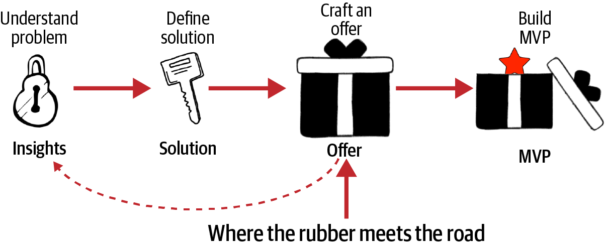

<!-- Page 40 -->

“And how long did all of this take you? It seems like a lot of steps.”
“It took us about 90 days to go from just a napkin sketch to problem/solution
fit, where we secured our first 5 paying customers. And yes, there are more
steps than simply rushing to build an MVP, but if you follow the process and
stay disciplined, you end up with a mafia offer.”
“A mafia offer?”
“Yes—an offer your customers cannot refuse. You know, from the movie The
Godfather. Unlike in the movie, you don’t strong-arm your customers, but
instead show them something so compelling they just can’t turn it down. At
the end of the eight weeks, we ended up with five paying customers who were
pushing us to deliver them the MVP quickly, versus the other way around.”
“Hmm…this is a very different approach to product development than I’m
used to, but I’m starting to see the logic of it. But I’ve already launched my
product and have users. Can I still apply this process to my product, or do I
have to start all over from scratch?”
“You can definitely apply this process to an existing product, provided you’re
willing and open to trying a new way. As you just pointed out, this approach
is different, and different often feels uncomfortable. The biggest obstacle for
us was unlearning old product development habits and instilling new mindsets
across the entire team. The good news is that the learning and results come
quickly, so you don’t have to run on faith alone.”
“I still have a hundred tactical questions on how to actually do any of this.
How do you get users to talk to you? How many people do you talk to? What
do you say to them? You’ve been very generous with your time, but can you
guide me a little further?”
“Definitely, Steve. This process, like any, has its fair share of sand traps and
pitfalls. The biggest one is our own bias or love for our solution—our Innova-
tor’s Bias. We selectively, and even unconsciously, choose to only pay attention
to what justifies building the solution we’ve already envisioned. Shifting to a
problem-first mindset sounds simple, but it isn’t easy.”
“Are there any tools or resources you can point me to?” Steve asks.
Mary smiles. “Oh yes. I’ll send you a list of resources, tools, and actual
customer interview scripts we used and continue to use to train our team.
Uncovering problems worth solving isn’t limited to just the MVP phase…it’s
key for everything that comes next also. I’ll warn you again that this will feel a
bit weird and even uncomfortable at first. The key is to be patient and follow
the process, and the results will come.”

<!-- Page 41 -->

“At this point, I’ve spent 18 months doing things my way and it hasn’t
worked. I’m open to trying—no, testing—anything.”
Mary smiles again. “Great! Let’s plan on talking again soon.”
There Is a Systematic Approach to Entrepreneurship
On his drive back to the office, Steve can’t help but replay his last conversation
with Mary in his mind.
Is it really possible to build what customers want (what Mary described as a
mafia offer) just by interviewing customers?
When he gets back to his office, he finds an email from Mary waiting in his
inbox. As promised, she has sent him an extensive list of resources and a
high-level roadmap (Figure I-10).
Steve quickly recognizes product/market fit on the roadmap, but a lot of the
other terms are foreign to him.
Figure I-10. The Continuous Innovation roadmap

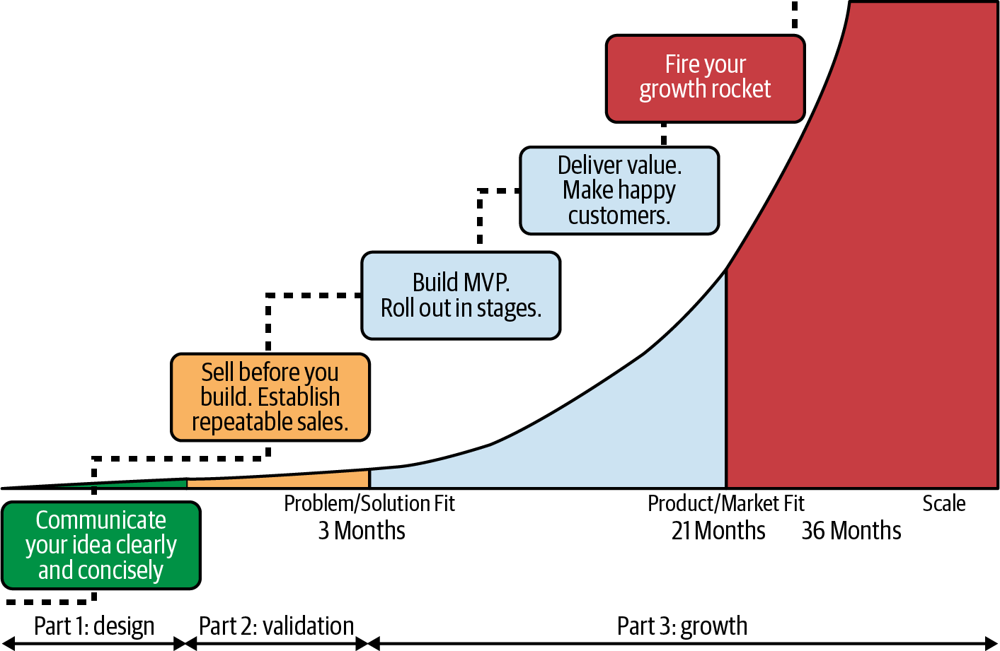

<!-- Page 42 -->

He then reads Mary’s email:
Hi Steve,
As promised, here are the links to the Continuous Innovation Framework
and the step-by-step playbooks we use.
There are lots of dots to connect, so be patient.
The Continuous Innovation Framework uses 90-day Model-Prioritize-Test
cycles, so be sure to start at the beginning, with the modeling work. Then
work your way through the other stages.
Lastly, remember that learning anything new often requires unlearning old
habits. Apply and test the framework rigorously.
If you get stuck, you know where to find me.
Mary
Steve gets to work, and over the course of several weeks, he learns:
• How to deconstruct his idea into a business model
•
• How to test whether his idea is worth pursuing
•
• How to identify and prioritize the riskiest assumptions in a business model
•
• How to stress test his riskiest assumptions using small and fast
•
experiments
• How to use customer interviews to learn from customers
•
• How to achieve traction without a product
•
• How to pitch to customers so they buy
•
• How to operate and make decisions under conditions of extreme
•
uncertainty
Over the next several months, Steve manages to bring his product back on
track with paying customers, growing revenue, and a growing team.
This book shows you how.
About Me
Hi, my name is Ash Maurya and I’m the founder of LEANSTACK and the
creator of the popular business modeling tool Lean Canvas. I too used to be a
Steve. I too was hit by an awesome idea. An idea so good I never told anyone
but close friends sworn to secrecy.
I spent a year building out my “big idea” in stealth. And, like Steve, I too
struggled to get other people to see what I saw.

<!-- Page 43 -->

It took me roughly seven years to transition from Steve to Larry, and there’s
been no looking back ever since. This is my personal mantra: “Life’s too short
to build something nobody wants.”
I attribute all the success and attention I’ve received over the years with my
books and tools to this new way of thinking about and approaching products.
LEANSTACK was founded to help the next generation of entrepreneurs avoid
these same mistakes.
From here on out, this isn’t a story of two entrepreneurs, but just one entrepre-
neur: Steve.
Steve, not Larry, is the hero of our story.
How This Book Is Organized
One of the most significant milestones for a startup is getting to product/mar-
ket fit (aka the inflection point in the hockey-stick curve when a product’s
traction starts rapidly growing). The reality, of course, is that 80% of products
never get there.
Operating under conditions of extreme uncertainty is the reason often cited for
this low rate of success, and also why the journey prior to product/market fit is
often described as aimless wandering (Figure I-11).
Figure I-11. Aimless wandering
But it doesn’t have to be this way. Yes, the early stages of a product are
riddled with extreme uncertainty, but they don’t have to be messy. With the
right mindsets and thinking processes, the early stages can be systematically
traversed much like you would a labyrinth (Figure I-12).

<!-- Page 44 -->

Figure I-12. The idea labyrinth
The objective is to get out of the maze with a business model that works before
running out of resources. Yes, there will be twists and turns, dead ends, and
backtracking, but this process is systematic, unlike the tangled mess of aimless
wandering.
This book outlines just such a step-by-step systematic process for taking an
idea from an initial spark to product/market fit, breaking the journey into
three parts.
Part I: Design
A key mindset for putting the ideas in this book into practice is viewing your
business model, not your solution, as the true product of your startup. As with
any product, the first step is design.
Part I walks through the process of deconstructing your initial vision (or Plan
A) into a business model. I’ll then show you how to stress test your business
model design to avoid the most common pitfalls that trip up early-stage prod-
ucts. Finally, you’ll learn how to communicate your idea clearly and concisely
to others and get them to see what you see.
Part II: Validation
While a starting business model blueprint is key for driving clarity and focus,
it’s important to recognize that all models are abstractions of reality, not reality

<!-- Page 45 -->

themselves. In other words, they must be validated with evidence, not taken on
faith.
Part II shows you how to iteratively test your business model in stages using
90-day cycles, starting with the first validation stage: problem/solution fit.
You’ll learn how to use the Demo-Sell-Build process to test demand for your
product and secure paying customers without having to first build out your
product.
Part III: Growth
Achieving problem/solution fit sets you up for building a product you know
customers will buy, rather than just hope they will buy. The next step is
launching your product (MVP) and iterating your way toward product/market
fit.
Part III shows you how to maximize your product launch for speed and
learning while constantly focusing on what’s riskiest. Rather than launch your
product to everyone, you’ll learn how to use a stage-based launch to first test
your business model at a small scale and establish repeatability before pursuing
growth.
Is This Book for You?
The principles covered in this book can be applied to launching a new product
either at a startup or a large company. While tactics may vary, the principles
are universal.
Throughout this book, I’ll use the term “entrepreneur” to refer to anyone
charged with bringing a bold new product to life.
Running Lean is for:
• Aspiring and serial entrepreneurs
•
• Corporate innovators and intrapreneurs
•
• Product managers
•
• Makers and visionaries who want to level up and build the next generation
•
of products that matter
Does It Work for Services and Physical Products?
In this book, a product refers to anything that delivers value to customers.
This can be a digital product, a physical product, or a service. So yes, all the
concepts in this book can be readily applied to any type of product.

<!-- Page 46 -->

Practice Trumps Theory
Everything in this book is based on firsthand experiential learning and experi-
mentation on my own products, and across thousands of other products built
by teams I have advised and coached over the last 10 years.
I encourage you to rigorously test and adapt these principles for yourself.
No framework can guarantee success. But a good framework can provide
a feedback loop for making better evidence-based decisions in the face of
extreme uncertainty.
That is the promise of this book.
Let’s begin.

<!-- Page 47 -->

PART I
DESIGN
We live in an age of unparalleled opportunity for innovation. With the advent
of the internet, cloud computing, and open source software, the cost of build-
ing products is at an all-time low. Yet, the odds of building successful startups
haven’t improved much: most new products still fail.
The more interesting fact is that of those startups that succeed, two-thirds
report having drastically changed their plans along the way. So, what separates
successful startups is not necessarily starting with a better initial plan (or Plan
A), but finding a plan that works before running out of resources.
Up until now, finding this better Plan B or C or Z has been based largely
on gut, intuition, and luck. There has been no systematic process for rigor-
ously stress testing a Plan A. That is what Running Lean is about. This book
presents a systematic process for iterating from Plan A to a plan that works
before running out of resources.

<!-- Page 48 -->

There Is an “I” in Vision
All men dream: but not equally. Those that dream by night in the dusty
recesses of their minds awake to find that all was in vanity: but the dream-
ers of day are dangerous men, for they may act their dreams with open eyes,
to make it possible.
—T.E. Lawrence, Lawrence of Arabia
The media loves to celebrate stories of visionaries who saw the future and
charted a course to intersect it with a “groundbreaking” new product offering.
In a visionary product launch there is no place for being too early or too late.
While these make for great stories, behind every visionary story usually lie
years of hard work, experimentation, and learning. Even the iPad, described by
Steve Jobs at its unveiling as a “revolutionary device,” was several years in the
making, built on at least three generations of software and five generations of
hardware.
The way these stories actually play out is never quite as simple as we’re led
to believe. First, there is never a single customer adoption curve, but a whole
family of them, with each customer segment adopting solutions at different
rates. You launch based on your best understanding of who you think the
customers are and what they want (or will want). Odds are you won’t find
yourself on the curve you were targeting. From here, you iterate until you
intersect with the best curve (aka achieve product/market fit), which likely will
not be your original one (aka the pivot).
Unlike the visionary launch, which aims to perfectly hit the mark, it is possible
to start either to the left (too early) or the right (too late) of the customer
adoption curve, as long as you can learn where the curve is heading and
eventually intersect it before running out of iterations (cash).
It All Starts with an Idea Spark
Everyone gets hit by ideas when they least expect them (in the shower, while
driving, etc.). Most people ignore them—entrepreneurs choose to act on them.
One of the major challenges with ideas is that at the outset, all ideas seem
amazing. Having acted on some of my own ideas in the past and experienced
all of being too early, too late, and totally off mark, I believe that what’s more
important than acting on an idea is having a process to quickly separate good
ideas from bad ideas.

<!-- Page 49 -->

While passion and determination are essential attributes needed to drive a
vision to its full potential, left unchecked they can also turn the journey into a
faith-based one driven by dogma.
NOTE
Reasonably smart people can rationalize anything, but entrepreneurs are espe-
cially gifted at this.
Most entrepreneurs start with a strong initial vision and a Plan A for realizing
that vision. Unfortunately, most Plan As don’t work.
While a strong vision is required to create a mantra and make meaning, you
should strive to uphold a strong vision with facts, not faith. It is important
to accept that your initial vision is built largely on untested hypotheses (or
guesses).
Don’t Write a Business Plan; Use a Lean
Canvas Instead
The first step to driving clarity around your idea is deconstructing your big
idea into a set of clearly articulated assumptions. Traditionally, we have used
business plans for this purpose.
Have you ever written a business plan? Did you enjoy the process? I have
posed these two questions to thousands of makers, entrepreneurs, and innova-
tors around the world, and here’s what I found: only 30% of them had ever
written a business plan, and less than 2% enjoyed the process.
I posed a different question to the investors (and stakeholders) in the room:
“Do you read the entire business plan?” Again, less than 2% admitted to
doing so , citing a preference for the 1-page executive summary, 10-page slide-
deck, or 30-second elevator pitch.
Why then are we still forcing people to spend weeks writing a 40-page docu-
ment that no one reads and that is seldom kept up-to-date?
The problems with traditional business plans are:
They take too long to write
In order to get your idea green lit, you are often asked to write a 30-page
business plan and create a 5-year financial forecast and an 18-month prod-
uct roadmap. This can easily take up weeks, if not months, of your time.

<!-- Page 50 -->

They are best guesses at best
The reason entrepreneurs and innovators choose to forgo the heavyweight
business plan isn’t because they are lazy. Rather, it’s because at the earliest
stages of any new project, many assumptions are simply unknowable.
NOTE
At the earliest stages of a product, you don’t know what you don’t know.
When you’re working really fast and under conditions of extreme uncertainty,
as is required for Continuous Innovation, you can’t afford to rely on static
plans—you need dynamic models. The Lean Canvas (Figure I-1) is one such
dynamic model.
Figure I-1. The Lean Canvas
The Lean Canvas is my adaptation of Alex Osterwalder’s Business Model Can-
vas, and it’s the first model we use in the Continuous Innovation Framework.
A Lean Canvas replaces a long and boring business plan with a 1-page busi-
ness model that takes 20 minutes to create and that actually gets read.

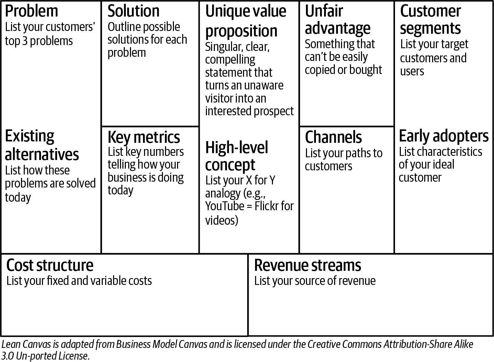

<!-- Page 51 -->

If you have ever written a business plan or created a slide deck for investors,
you’ll immediately recognize most of the building blocks on the canvas. We’ll
cover these blocks in more detail in Chapter 1. A key point I’d like to drive
home, though, is the first Continuous Innovation mindset.
MINDSET #1
Your business model is the product.
I purposely made the Solution box take up less than one-ninth of the entire
canvas. This is because, as entrepreneurs, we are most passionate about the
solution and what we are naturally good at—but, as we saw in the book’s
introduction:
• Your solution, while important, typically isn’t what’s riskiest, and you
•
should focus on what’s riskiest first.
• Investors don’t care about your solution; they care about traction (cus-
•
tomer engagement).
• Customers don’t care about your solutions; they care about their
•
problems.
Your job, then, isn’t just building the best possible solution, but owning the
entire business model and making all the pieces fit.
Recognizing your business model as a product is empowering. Not only does it
let you own your business model, but it also allows you to apply well-known
techniques from product development to building your company.
The Business Model Design Playbook
The first step to building out a product is starting with a design blueprint or
sketch. Similarly, the first step to building out a business is starting with busi-
ness model design. A business model design blueprint helps you deconstruct
your idea into a set of key assumptions (captured on a 1-page Lean Canvas).
You then prioritize your riskiest assumptions and formulate a stage-based
validation strategy for bringing your idea to life (see Figure I-2).

<!-- Page 52 -->

Figure I-2. The business model design playbook
In Part I of this book, you’ll learn how to:
• Deconstruct your idea on a Lean Canvas (Chapter 1)
•
• Stress test your idea for desirability (Chapter 2)
•
• Stress test your idea for viability (Chapter 3)
•
• Stress test your idea for feasibility (Chapter 4)
•
• Communicate your idea clearly and concisely (Chapter 5)
•

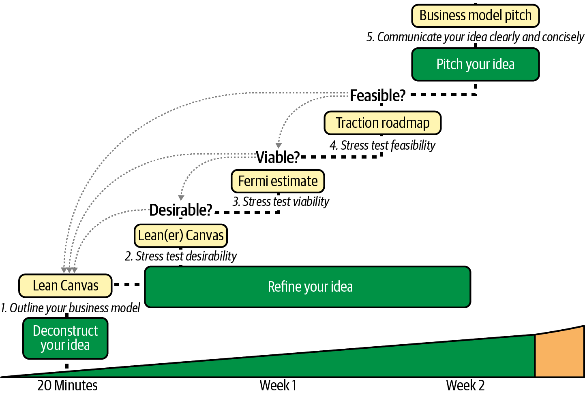

<!-- Page 53 -->

C H A P T E R 1
Deconstruct Your Idea
on a Lean Canvas
When taking on a complex project, like say building a house, you wouldn’t
start by putting up walls. You’d start with some kind of an architectural plan
or blueprint—even if it’s just a sketch.
Building and launching an idea is no different.
In this chapter, you’ll learn how to deconstruct your idea into a set of key
assumptions using a 1-page Lean Canvas (Figure 1-1).
A Lean Canvas can be used to describe a business model, a product release,
or even a single feature, making it a highly popular business planning and
product management tool that’s used by millions of people around the world.

<!-- Page 54 -->

Figure 1-1. Deconstructing your idea on a 1-page Lean Canvas
Sketching Your First Lean Canvas
A business model describes how you create, deliver, and capture value (get
paid) from customers.
—Saul Kaplan
In this section, I’ll outline the process of sketching a Lean Canvas for your
idea. The result will be a description of how you plan to create, deliver, and
capture value from your customers. Here are some guidelines to keep in mind:
Sketch the canvas in one sitting
While it’s tempting to iterate endlessly on the whiteboard, your initial
canvas should be sketched quickly—ideally in less than 20 minutes. Unlike
a business plan, the goal with a Lean Canvas isn’t to achieve perfection,
but to take a snapshot.

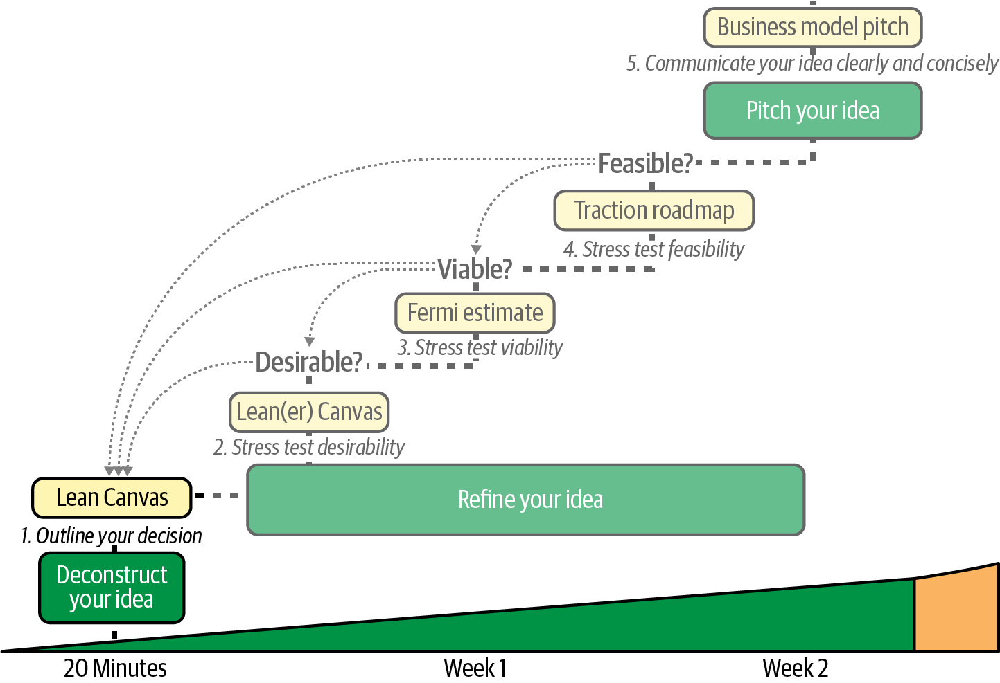

<!-- Page 55 -->

Avoid groupthink
If you’re part of a team, avoid creating a Lean Canvas as a group exercise.
Instead, have each team member create their own snapshot first. Then get
together as a group and reconcile your canvases into a single Lean Canvas.
Not only will this encourage more independent perspectives and avoid
groupthink, but it will also save you time.
Know that it’s okay to leave boxes blank
If you’re unsure about a particular box, it’s okay to leave it blank. We’ll
cover the boxes on the canvas in more detail in subsequent sections.
Embrace a 1-page constraint
If you can’t describe your idea on a single page, it’s probably still too
complex to explain. Describing your idea on a single page is not about
using smaller fonts, but fewer words. It’s a lot easier to describe something
in a paragraph than in a single sentence. Respecting the space constraints
of the 1-page canvas is a great way to distill your business model down to
its essence.
Think in the present
Business plans try too hard to predict the future, which is impossible.
Instead, write your canvas with a “getting things done” attitude. Based on
your current stage and what you know right now, what are the next sets of
hypotheses you need to test to move your product forward?
Remember there is no right order for sketching a Lean Canvas
Sketching a Lean Canvas is like putting together a jigsaw puzzle. There is
no right place to start or specific order to follow, so start with whatever
box you think you understand the best and build out the rest of the canvas
from there. If you still aren’t sure how to proceed, use the sample ordering
in Figure 1-2 to get going.
Next, we’ll look at each of the boxes in Figure 1-2 in detail.

<!-- Page 56 -->

Figure 1-2. Sample fill order for a Lean Canvas
Customer Segments
As the Continuous Innovation Framework is heavily customer driven, the Cus-
tomer Segments box of the Lean Canvas is typically a natural starting point.
Distinguish between customers and users
If you have multiple actors in your business model, aim to first identify your
customers.
TIP
A customer is someone who pays for your product. A user does not.
Then identify any other actors (users, influencers, etc.) that will interact with
these customers.

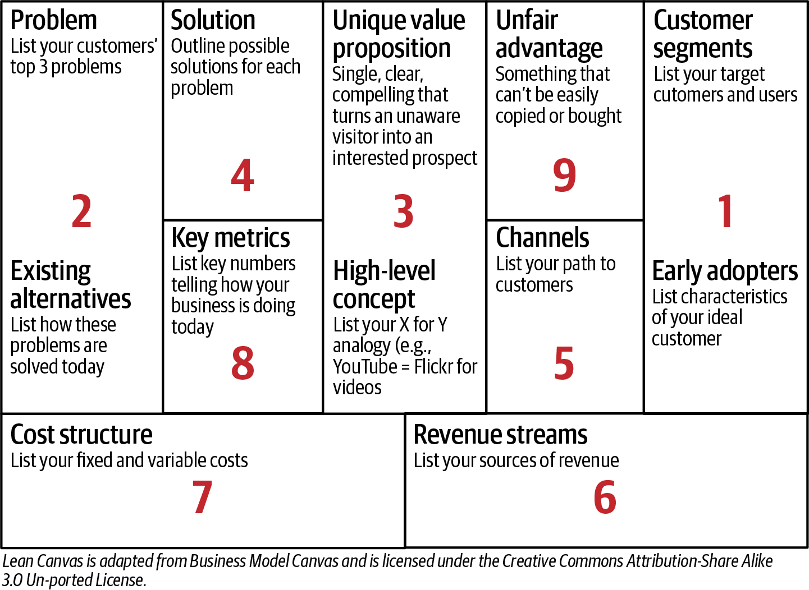

<!-- Page 57 -->

Examples:
• In a blogging platform, the customer is the blog author, while the user is a
•
reader.
• In a search engine, the customer is the advertiser, while users are people
•
running searches.
Model multiple perspectives
It helps to view your idea from the perspective of each actor in your business
model. Each will likely have different problems, channels to reach them, and
value propositions. For example, an advertiser working with a search engine
may be struggling with driving awareness to their product, while the people
running searches are really looking for answers to specific questions. I recom-
mend keeping these perspectives on the same canvas and using a different color
or hashtag to identify each actor’s perspective.
Home in on early adopters
As an entrepreneur, you need to simultaneously communicate a big market
opportunity while staying razor-focused on your early adopters.
TIP
Your objective is to define an early adopter, not a mainstream customer.
Your list of customer segments should represent the total addressable market
(TAM) for your idea, while your early adopters represent a specific subset of
your TAM. This is your ideal starting customer segment (also called your ideal
customer profile).
Problem
Problems, not solutions, create spaces for innovation. The Problem box is
where you list the specific problem or problems you are going to tackle with
your product.
List the top one to three problems
While it’s tempting to brainstorm and list many possible problems, priori-
tize the top one to three issues that you believe are most pressing for your
customers.

<!-- Page 58 -->

List existing alternatives
Document how you think your early adopters currently address these prob-
lems. Unless you are solving a brand new problem (unlikely), solutions proba-
bly already exist. These solutions may not be from an obvious competitor.
Steve tackles the Customer Segment/Problem quadrant
Before Steve takes on sketching his first Lean Canvas, he digs up the original
vision statement he wrote down a year ago:
To create an alternate virtual world (a metaverse) as vast and rich as the
real world and make it universally accessible and useful.
He is tempted to put down “everybody” under Customer Segments, but he
remembers Mary’s advice against defining too broad a customer segment:
“When you’re trying to market to everyone, you reach no one.”
He instead turns his focus to who he considers his ideal early adopters and
writes down “software developers.” While he envisions that his platform will
eventually allow anyone to create rich immersive AR/VR applications, it will
be easiest to start with software developers that already build or want to build
these kinds of applications.
Under this segment, he lists various industries that are likely to adopt AR/VR
technologies over the next several years. Next, he turns his attention to listing
out the top problems he plans to address and captures the top existing alterna-
tives on the Lean Canvas.
Figure 1-3 shows what his Customer Segments and Problem boxes look like
after just a few minutes of pondering.

<!-- Page 59 -->

Figure 1-3. Steve’s problem and customer segments
Unique Value Proposition
Dead center in the Lean Canvas is a box for your unique value proposition
(UVP). This is one of the most important boxes on the canvas and also the
hardest to get right.
NOTE
Defining a UVP forces you to answer the question: why is your product different
and worth paying attention to?
Before paying for your product with money, customers pay you with attention.
Your UVP is hard to get right because you have to distill the essence of your
product in a few words that can fit in the headline of your landing page.
Additionally, your UVP needs to be different in order to stand out from the
competition, and that difference needs to matter to your customers.
The good news is that you don’t have to get this perfect right away. Like
everything on the canvas, you start with a best guess and iterate from there.

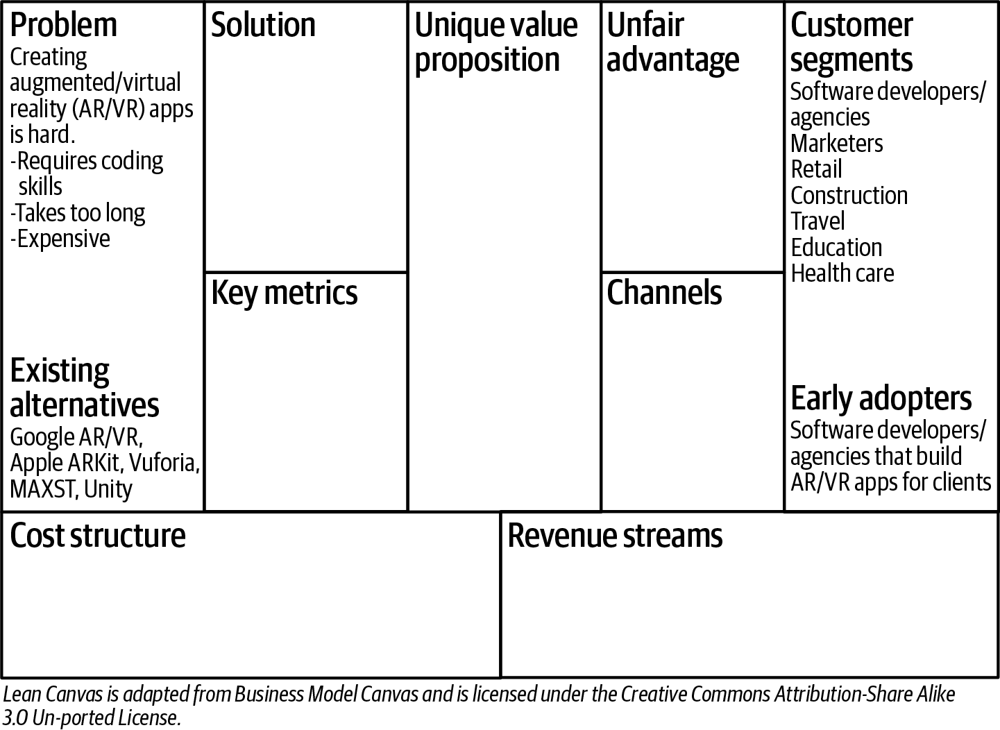

<!-- Page 60 -->

Connect to your customer’s number one problem
The key to crafting an effective UVP is connecting it to the number one
problem you are solving for your customers. If that problem is indeed worth
solving for them, you’re more than halfway there already.
Target early adopters
Too many marketers try to target the “middle” of their customer segments,
in the hopes of reaching mainstream customers, and in the process they water
down their message. Your product is not ready for mainstream customers yet.
Your sole job should be to find and target early adopters, which requires bold,
clear, and specific messaging.
Focus on outcomes
You’ve probably heard about the importance of highlighting benefits over
features. But benefits still require your customers to translate them to their
worldview. A good UVP gets inside customers’ heads and focuses on the bene-
fits they will derive from using your product—that is, the desired outcomes.
So, for instance, if you are creating a résumé-building service:
• A feature might be “professionally designed templates.”
•
• The benefit would be “an eye-catching résumé that stands out.”
•
• And the desired outcome would be “landing your dream job.”
•
Keep it short
Most advertising platforms limit the number of characters in the primary
headline field to 120. Pick your words carefully, and avoid empty fillers.
Answer what, who, and why
A good UVP needs to clearly describe what your product is for and who it’s
for. The “why” is often hard to fit into the same statement, so a sub-headline is
often used for this.
Here’s an example:
• Product: Lean Canvas
•
• Headline: Communicate Your Idea Clearly and Concisely to Key
•
Stakeholders.
• Sub-headline: A Lean Canvas replaces a long and boring business plan
•
with a 1-page business model that takes 20 minutes to create and gets
read.

<!-- Page 61 -->

Create a high-concept pitch
Another useful exercise when crafting a UVP is creating a high-concept pitch,
popularized as an effective pitching tool by Venture Hacks in the ebook Pitch-
ing Hacks. High-concept pitches are also used heavily by Hollywood produc-
ers to distill the general plot of a movie into a memorable sound bite.
Examples might include:
• YouTube: “Flickr for video”
•
• Aliens (movie): “Jaws in space”
•
• Dogster: “Friendster for dogs”
•
The high-concept pitch should not be confused with a UVP and is not intended
to be used on your landing page. There is a danger that the concept the pitch
is based on might be unfamiliar to your audience. For this reason, the high-
concept pitch is more effectively used in scenarios where you want to quickly
get your idea across and make it easy to spread, such as after a customer
interview. We’ll cover a specific use of the high-concept pitch in Chapter 8.
Steve crafts his UVP
Given that all the existing alternatives require technical know-how and coding
knowledge, Steve decides to use “no-code” as the keyword to position his UVP
around (see Figure 1-4).

<!-- Page 62 -->

Figure 1-4. Steve’s UVP
Solution
You are now ready to tackle your solution.
Know that it is fairly common for your customer problems to get reprioritized
or completely replaced with new ones after just a few customer conversations.
For this reason, I recommend not getting carried away with fully defining
your solution just yet. Rather, simply sketch out the simplest thing you could
possibly build to address each problem listed on your Lean Canvas.
TIP
Bind a solution to your problem as late as possible.
Steve defines a solution
Based on his list of problems, Steve creates a shortlist of top features that
address each problem (see Figure 1-5).

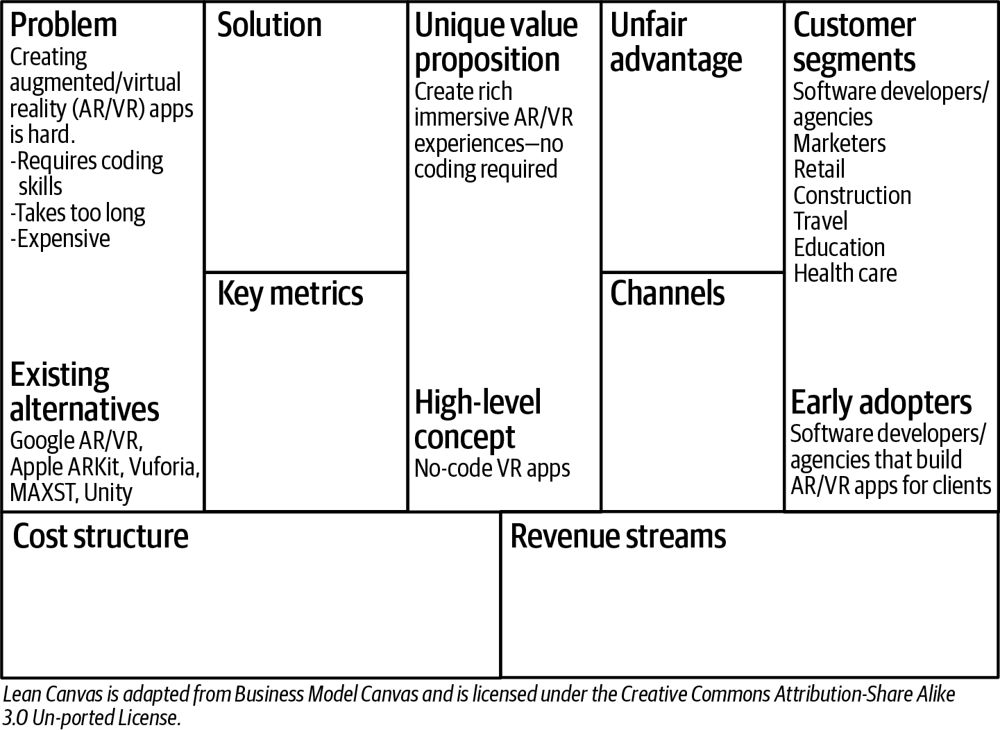

<!-- Page 63 -->

Figure 1-5. Steve’s solution
Channels
If a product is launched in a forest, does it make a sound? Failing to build a
clear path to customers is among the top reasons why startups fail.
The initial goal of a startup is to learn, not to scale. So, at first, it’s OK to rely
on any channels that get you in front of potential customers.
The good news is that following a “customer discovery/interview” process
(which we’ll discuss in Chapter 7) forces you to build a path to “enough”
customers early. However, if your business model relies on acquiring large
numbers of customers to work, that path may not scale beyond the initial
stages, and it’s quite possible you’ll get stuck later.
For this reason, it’s equally important to think about your scalable channels
from day one so that you can start building and testing them early.
While there are a plethora of channel options available, some channels may be
outright inapplicable to your startup, while others may be more viable during
the later stages of the startup.

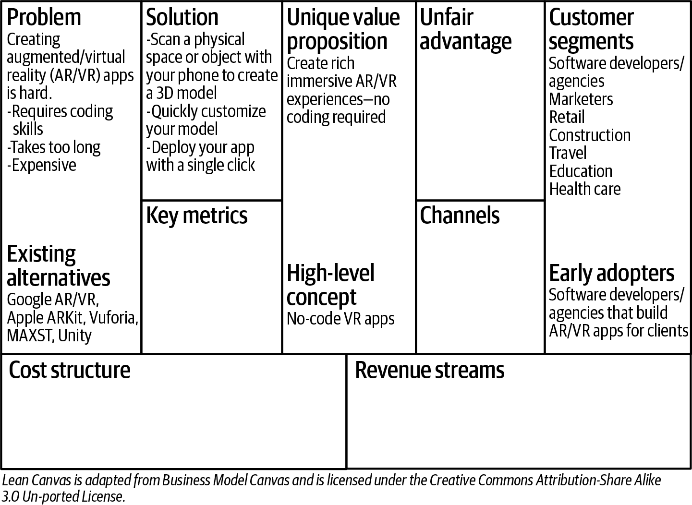

<!-- Page 64 -->

Steve outlines some possible paths to customers
Since Steve plans on targeting software developers and agencies as early adopt-
ers, he plans to start with warm referrals, direct sales, conferences, and trade
shows as initial channels, and possibly scaling later using advertising (see
Figure 1-6).
Figure 1-6. Steve’s channels
Revenue Streams and Cost Structure
The bottom two boxes, labeled Revenue Streams and Cost Structure, are used
to model the viability of the business.
Revenue streams
A lot of startups choose to defer the “pricing question” to a later stage, but
this is a mistake. Here’s why:
Price is part of the product
Suppose I place two bottles of water in front of you and tell you that
one costs $0.50 and the other costs $2. Despite the fact that you wouldn’t
be able to tell them apart in a blind taste test (the products are similar
enough), you might be inclined to believe (or at least wonder whether) the

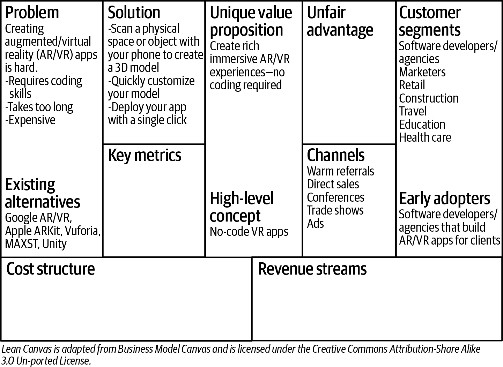

<!-- Page 65 -->

more expensive water is of higher quality. Here, price has the power to
change your perception of the product.
Price defines your customers
More interesting is the fact that the bottled water you pick determines
your customer segment. From the existing market for bottled water, we
know there is a viable business for bottled water at both price points.
What you charge signals your positioning on which customers you want to
attract.
Getting paid is the first form of validation
Getting a customer to give you money is one of the hardest challenges, and
is an early form of product validation.
NOTE
Revenue is the difference between a hobby and a business.
Cost structure
How do you determine the cost structure of your idea/product? That is, how
much will it cost to make your product and keep your business running?
Rather than thinking in terms of three- or five-year forecasts, it’s better to
take a more stage-based approach. Focus on your most immediate short-term
milestones for three to six months from now. First, model the runway you will
need to define, build, and launch your MVP. Then revise after you get there.
Questions to consider include:
• What will it cost you to define, build, and launch your MVP?
•
• What will your ongoing burn rate look like (salaries, office rent, etc.)?
•
Steve thinks through his cost structure and revenue streams
While Steve had found a comfortable groove of self-funding his project
through consulting revenue, the competitor launch (Virtuoso X) was his wake-
up call to speed things up. Steve sets a goal to get his MVP launched within the
next six months and outlines his costs, which are mostly his time.
Steve had not given any serious thought to his pricing model up until now,
but decides to heed the advice of not deferring this until later. He figures he
should anchor his pricing against other software development tools, and finds
that they vary from free to several hundred dollars a month. He decides to
go down the middle and picks the most popular entry-level pricing model of
$50/mo with a free 30-day trial.

<!-- Page 66 -->

For his cost structure, Steve estimates his runway needs for the next six to
nine months. He anticipates working alone and continuing to bootstrap his
product until he can attract enough customers or investors. Figure 1-7 shows
what Steve’s Lean Canvas looks like with these boxes filled in.
Figure 1-7. Steve’s cost structure and revenue streams
Key Metrics
Every business has a few key numbers that can be used to measure how well
the business is performing. These numbers are important for both measuring
progress and identifying hot spots in the business model. I’ll give you a few
examples here.
List three to five key metrics
Don’t go overboard on metrics. Instead, list the top three to five metrics that
you’ll use to measure whether your business model is working.
Prefer outcome metrics versus output metrics
Instead of measuring how much stuff you’re building (outputs), focus on meas-
uring how many people are using your product and how (outcomes). The right
outcome metrics tend to be customer-centric versus product-centric.

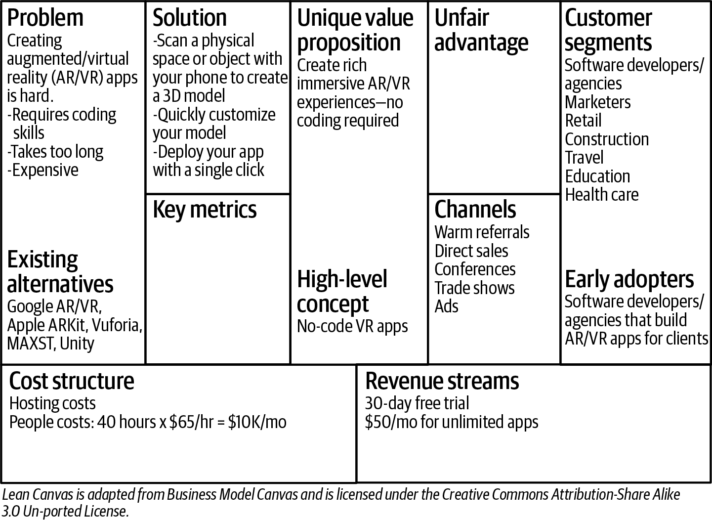

<!-- Page 67 -->

Examples of outcome metrics include:
• Number of new customers
•
• Monthly recurring revenue (MRR)
•
• Customer lifetime value (LTV)
•
Prioritize leading indicator metrics versus trailing indicator metrics
Find the key number that tells you how your business is doing in real-time
before you get the sales report.
—Norm Brodsky and Bo Burlingham, The Knack
While you’ll need to measure and report on metrics like revenue and profit,
understand that these are trailing indicators, not leading indicators of progress.
Here are some examples of leading indicator metrics:
• Number of qualified leads in your pipeline
•
• Number of trials/pilots
•
• Customer attrition rate (churn)
•
Study analogs
Research what metrics other companies in your product space/industry use to
measure and communicate progress to their stakeholders.
Here are some examples:
• Typical SaaS metrics:
•
— Lifetime value (LTV)
—
— Cost to acquire customers (CAC)
—
— Monthly recurring revenue (MRR) or annual recurring revenue (ARR)
—
• Typical ad-based metrics:
•
— Daily active users (DAU) and monthly active users (MAU)
—
— Click-through rate (CTR)
—
— Cost per impression (CPM) and cost per click (CPC)
—
• Typical marketplace metrics:
•
— Buyer to seller ratio
—
— Average transaction size
—
— Take rate
—

<!-- Page 68 -->

Steve identifies a few key metrics
In the Key Metrics box, Steve decides to use the starting list of metrics for a
SaaS product identified in the previous section (see Figure 1-8).
Figure 1-8. Steve’s key metrics
Unfair Advantage
This is usually the hardest section in the canvas to fill in, which is why I
leave it for last. Most founders list things as competitive advantages that really
aren’t, such as passion, lines of code, or features.
Another frequently cited advantage in business models is the “first-mover”
advantage. However, it doesn’t take much to see that being first can actually
be a disadvantage, as most of the hard work of paving new ground (risk miti-
gation) falls on your shoulders—only to be capitalized on by fast followers,
who may overtake you unless you’re able to constantly outpace them with a
real unfair advantage. Think of Ford, Toyota, Google, Microsoft, Apple, and
Facebook: again, none of these companies were first movers.
An interesting perspective to keep in mind is that anything worth copying will
be copied, especially once you start to demonstrate a viable business model.

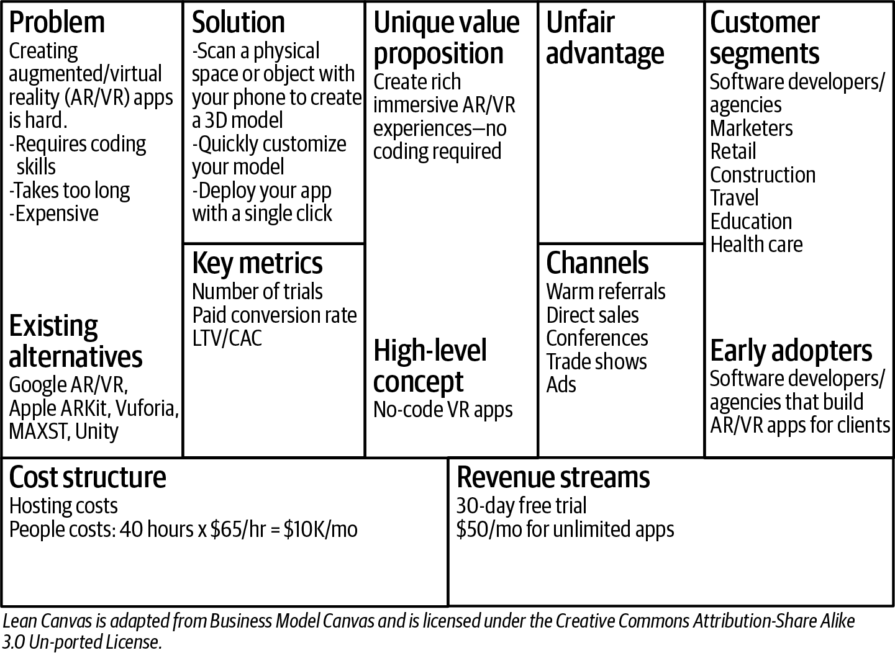

<!-- Page 69 -->

Imagine a scenario where your cofounder steals your source code, sets up shop
in Costa Rica, and slashes prices. Do you still have a business? How about if
Google or Apple launches a competitive product and drops the price to $0?
You have to be able to build a successful business in spite of that—an obser-
vation that led Jason Cohen to offer the following definition: “A real unfair
advantage is something that cannot be easily copied or bought.”
Here are some examples of real unfair advantages that fit this definition:
• Insider information
•
• The right “expert” endorsements
•
• A dream team
•
• Personal authority
•
• Network effect
•
• Platform effect
•
• Community
•
• Existing customers
•
• SEO ranking
•
A great illustration of the difference between a real unfair advantage and a
fake unfair advantage is the difference between organic SEO ranking versus
paid keywords for search engine marketing. Keywords can be easily copied
and bought by your competitors, while organic ranking has to be earned.
Some unfair advantages can also start out as values that become differentiators
over time. For example, Zappos CEO Tony Hsieh believed strongly in creating
happiness for his customers and employees. This manifested itself in many
company policies that, on the surface, didn’t make much business sense, such
as allowing customer service representatives to spend as much time as was
needed to make a customer happy and offering a 365-day return policy with
two-way paid shipping. But these policies served to differentiate the Zappos
brand and helped build the large, passionate, and vocal customer base that
played a large role in the company’s eventual $1.2 billion acquisition by Ama-
zon in 2009.
What do you do if you don’t have an unfair advantage on day one?
Most entrepreneurs don’t have an unfair advantage at the outset of their idea.
Consider Mark Zuckerberg. He wasn’t the first to build a social network, and
a number of his competitors already had a huge head start with millions of
users and millions of dollars in funding. That didn’t prevent him from building
the largest social network on the planet.

<!-- Page 70 -->

Start with an unfair advantage story
While Mark didn’t have an unfair advantage on day one, he had an unfair
advantage story. He knew his unfair advantage needed to come from large
network effects. This clarity of focus helped Facebook develop a systematic
launch and growth strategy that helped the company eventually realize this
advantage.
Leave the unfair advantage blank
If an unfair advantage story isn’t readily apparent, it is always better to leave
the Unfair Advantage box blank rather than stuffing it with a weak unfair
advantage.
Embrace obscurity
As mentioned previously, the good news with unfair advantages is that you
don’t need one from the outset. When you are just starting out, embrace
obscurity to build something valuable without calling out competitor atten-
tion, and keep searching for your true unfair advantage.
Steve ponders his unfair advantage story
Steve normally would have put down software IP (intellectual property) as his
unfair advantage, but after learning about real and fake unfair advantages, he
decides instead to rely upon an unfair advantage story built on the “platform
effect” (Figure 1-9). If he can get enough software developers and agencies to
build enough killer apps, that will accelerate his vision of creating a massive
reusable library of 3D objects, creating a flywheel that will make it easier
for everyone to build more apps faster and establishing his platform as the
platform of choice for AR/VR applications.

<!-- Page 71 -->

Figure 1-9. Steve’s unfair advantage
Refining Your Lean Canvas
Sketching out a Lean Canvas quickly is a great first step for taking stock of
your big idea and visualizing your business model as a set of assumptions.
That said, most entrepreneurs either go too broad or too narrow with their
first canvases. This is a Goldilocks problem.
If you struggled to fit your idea on a single page, chances are you went too
broad. When you go too broad, your canvas becomes watered down and
undifferentiated. I’ve worked with several startups that felt the problems they
were solving were so universal, they applied to everyone.
TIP
When you try to market to everyone, you reach no one.
While you might be aiming to build a mainstream product, you need to start
with a specific customer in mind. Even Facebook, with its now 500 million+
users, was originally oriented toward a very specific user group: Harvard Uni-
versity students. At the other extreme, when you go too narrow, you face the

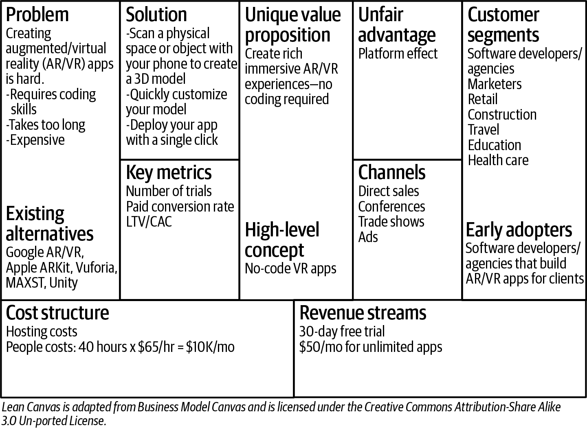

<!-- Page 72 -->

danger of falling into a local maximum trap and not finding the best possible
market for your idea.
This is illustrated in Figure 1-10 as the hill-climbing problem.
Figure 1-10. The hill-climbing problem
Imagine you are blindfolded and given the task of finding the highest point in
this landscape. You might be able to fumble your way to the top of the small
hill and declare it the highest point—only to find out, once your blindfold is
off, that there is a neighboring mountain right next to you that you missed.
So, How Do You Avoid the Goldilocks Problem?
You need a strategy that allows you to simultaneously go broad and narrow.
The way you do this is by splitting your first Lean Canvas (your “big idea
canvas”) into additional canvases (Figure 1-11).

<!-- Page 73 -->

Figure 1-11. Splitting your big idea canvas into one or more variants
Each of your additional canvases needs to be narrow and specific, but you
can and should go broad across these canvases by sketching out multiple
possible variants of the same idea. For example, a photo-sharing service could
be targeted at consumers or businesses. Within businesses, there could be many
possible business models to consider. Each of these variants can and should be
explored on a different canvas.
While there’s no guarantee that you’ll uncover a mountain with this approach,
you can probably appreciate that by casting a wider net and staying open to
all possibilities early you can avoid getting tunnel-visioned around a single
implementation of your idea. After you’ve short-listed your best variants, you
can systematically prioritize and test your ideas over time. Remember, building
a business model requires a search mindset, not an execution mindset.
How Do You Know When to Split Your Lean Canvas?
The reason most Lean Canvases become too broad is that they try to capture
too many business model stories on a single canvas. Your objective should be
to describe a single business model story per Lean Canvas.

<!-- Page 74 -->

There are three basic business model archetypes: direct, multisided, and mar-
ketplace. If you find yourself mixing multiple types of models on one Lean
Canvas, split them into separate canvases. Let’s take a look at each.
Direct
Direct business models are the most basic and widespread type. They are
one-actor models where your users become your customers. Starbucks is an
example of a company with a direct business model; an example Lean Canvas
for this company is shown in Figure 1-12.
Figure 1-12. Starbucks Lean Canvas
With a direct business model, your Lean Canvas should capture your total
addressable customer segment as a single entry under Customer Segments, and
your ideal starting subsegment under Early Adopters.
Multisided
In a multisided business model, the goal is still to create, deliver, and capture
value from users, but that value is monetized through different customers.
These are two-actor models made up of users and customers.

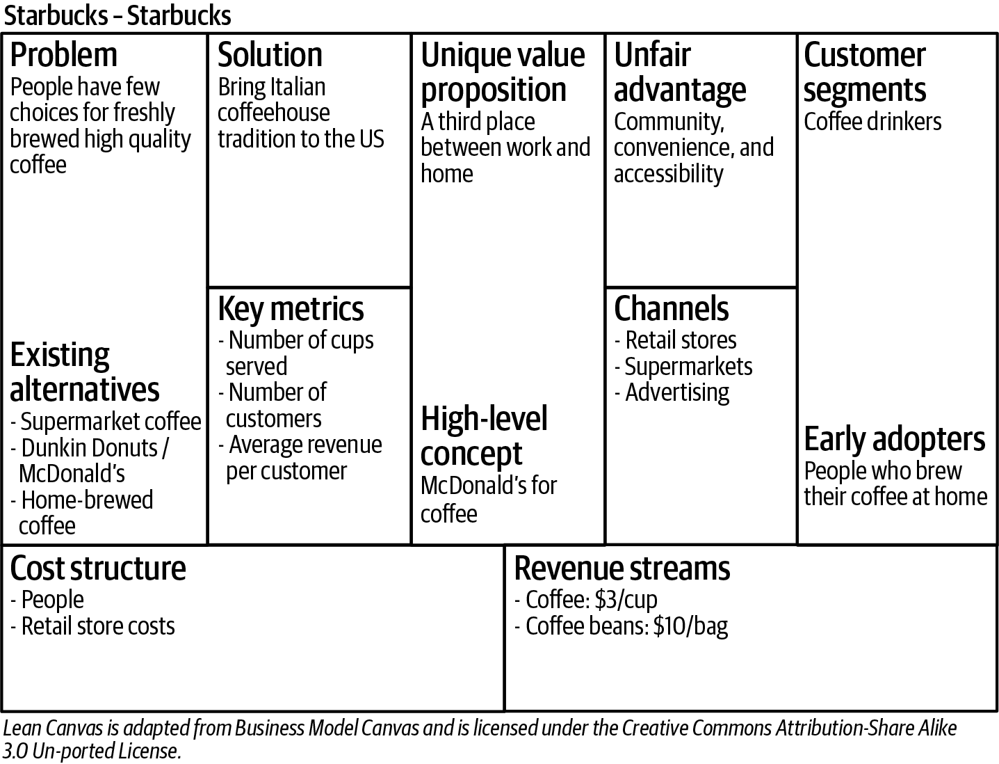

<!-- Page 75 -->

Users typically don’t pay for usage of your product with a monetary currency,
but rather with a derivative currency. This derivative currency, when aggrega-
ted across enough users, represents a derivative asset that your customers pay
to acquire. Facebook is an example of a company with a multisided model; at
the time of launch in 2004, the users were college students and the customers
were advertisers.
An example Lean Canvas for Facebook is shown in Figure 1-13.
Figure 1-13. Facebook Lean Canvas—user perspectives (college students) are tagged #user,
and customer perspectives (advertisers) are tagged #customer
29
CHAPTER 1: DECONSTRUCT YOUR IDEA ON A LEAN CANVAS

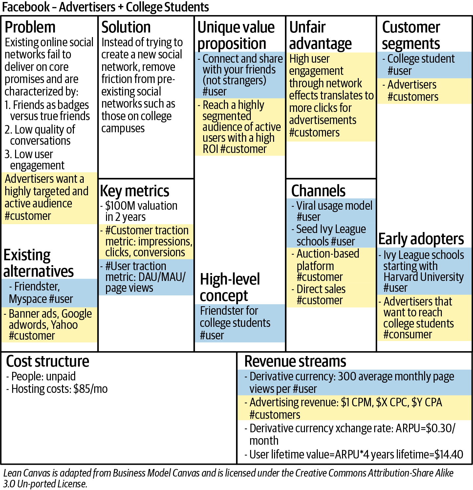

<!-- Page 76 -->

With a multisided business model, your Lean Canvas should model your idea
from the perspective of both your users and your customers. For example,
from the user’s perspective, an alternative to Facebook would be Friendster.
Marketplace
Marketplace business models are a more complex variant of the multisided
model that warrants its own category. Like multisided models, these are mul-
tiactor models made up of two different segments: in this case, buyers and
sellers. Airbnb is an example of a company with a marketplace model; a Lean
Canvas for this company is shown in Figure 1-14.
Figure 1-14. Airbnb Lean Canvas—buyer perspectives are tagged #buyer, and seller perspec-
tives are tagged #seller
Here too, you should model your idea from both the perspective of the buyer
and the seller. For example, from the buyer’s perspective, alternatives to Airbnb
are hotel rooms, couch surfing, etc.
Strive for simplicity, not complexity. Simple is hard enough.

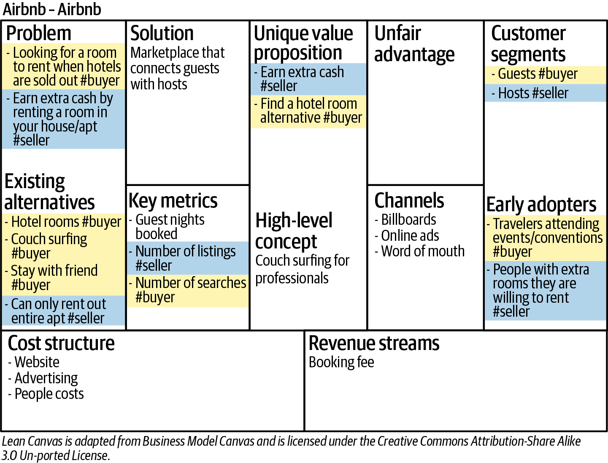

<!-- Page 77 -->

NOTE
It is possible to find more complex models in practice that layer these basic
archetypes. The thing to keep in mind is that even these more complex models
started with a basic model at the outset. Gall’s law states that a complex system
that works is invariably found to have evolved from a simple system that worked.
Steve Splits His Big Idea Canvas into Specific Variants
Steve revisits his Lean Canvas and immediately recognizes that he has identi-
fied too many customer segments (Figure 1-15).
Figure 1-15. Too many customer segments
“Do they all belong to the same business model?” Stever wonders.
After a few minutes of staring at his Lean Canvas and using his newly acquired
knowledge of business model archetypes, he starts to recognize distinct busi-
ness models intertwined on his Lean Canvas.
He gets to work splitting them into separate canvases and decides to focus on
what he considers his top three variants (Figures 1-16 through 1-18).

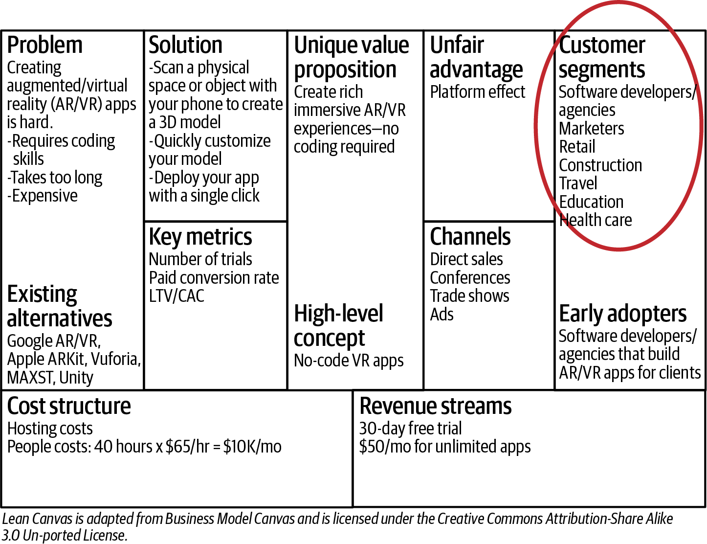

<!-- Page 78 -->

Figure 1-16. Software Developers Lean Canvas

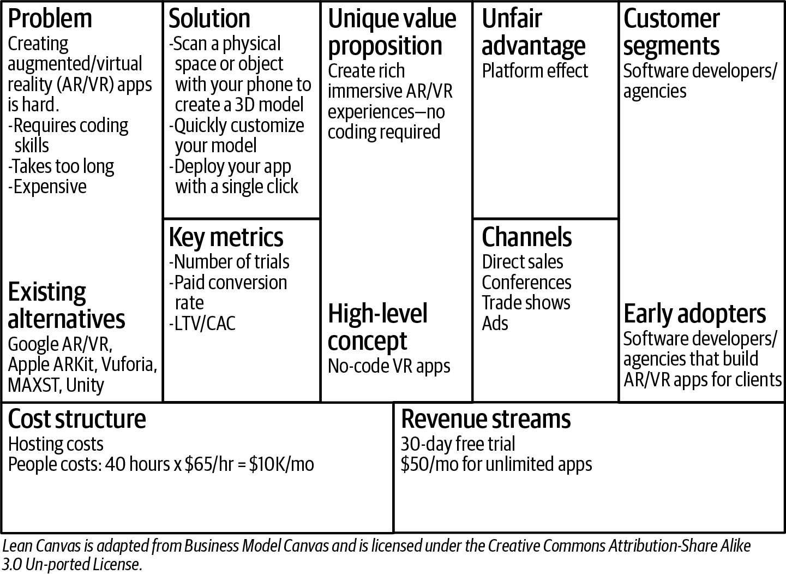

<!-- Page 79 -->

Figure 1-17. Home Construction Lean Canvas

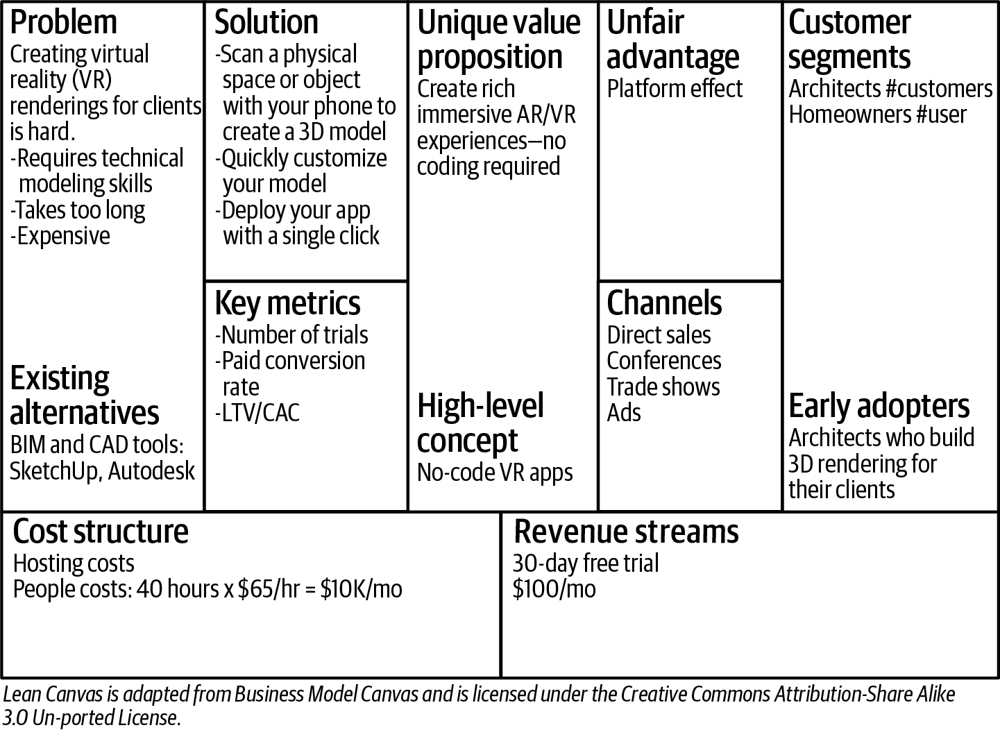

<!-- Page 80 -->

Figure 1-18. Retail Furniture Lean Canvas
Steve can immediately see that these variants are clearer than his original big
idea canvas.
Now It’s Your Turn
Documenting your Plan A is a prerequisite for moving on. As I stated at the start of the
chapter, too many founders carry their hypotheses in their heads alone, which makes it
hard to systematically build and test a business.
How you create your Lean Canvas is up to you. Visit the LEANSTACK website to:
• Download a blank Lean Canvas template
•
• Create your Lean Canvas online
•

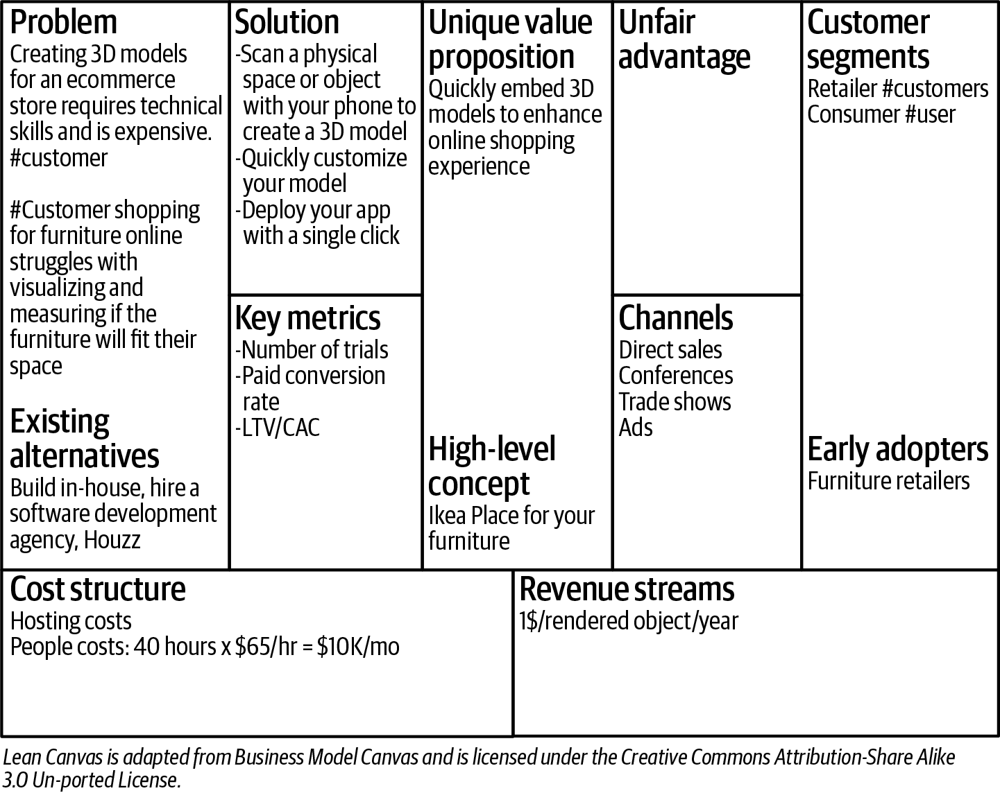

<!-- Page 81 -->

What’s Next?
It’s tempting to “rush out of the building” after completing your first Lean
Canvas sketch and immediately start testing out your business model on cus-
tomers. It’s even possible to rapidly find clusters of problems, pitch an offer,
build a quick MVP, and charge your customers from day one—which sounds
exactly like what we should do.
So what’s wrong with this approach?
The danger is getting stuck with a suboptimal business model six or nine
months down the line that either doesn’t match your ambition or doesn’t scale.
For an idea to be successful, it must constantly balance three types of risks:
customer, market, and technical. These risks can be more easily visualized
through what IDEO has popularized as the Innovation Trinity: desirability,
viability, and feasibility (Figure 1-19).
Figure 1-19. The Innovation Trinity
Before engaging in several weeks or months of customer validation, it’s pru-
dent to spend a few more hours (inside the building) stress testing your busi-
ness model and tightening up any obvious cracks or flaws in your thinking.
You do this by subjecting your business model to three stress tests that check
for:
1. Desirability (Do your customers want this?)
1.
2. Viability (Can you monetize this?)
2.
3. Feasibility (Can you build this?)
3.

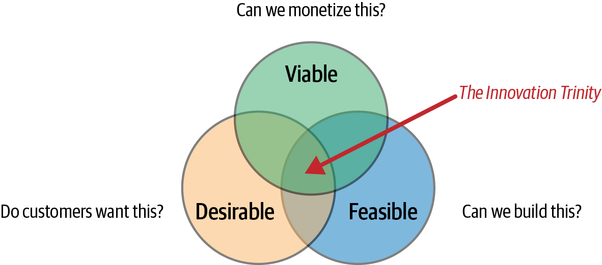

<!-- Page 82 -->

<!-- Page 83 -->

C H A P T E R 2
Stress Test Your Idea for Desirability
Desirability: Do customers want this?
Place yourself somewhere on the product timeline in Figure 2-1, and think
back to what caused you to switch from that solution to the next one.
Figure 2-1. A music timeline
These were massive changes, where we completely replaced one way of listen-
ing to music with another. While it’s tempting to declare that we switched for
better sound quality, that wasn’t it. Sound quality went up when we moved
from cassettes to CDs, but it went down on subsequent evolutions. So, there
was something else at play.
As entrepreneurs, we are charged with building better products, but what does
better even mean? That’s the key question to address when stress testing your
idea for desirability.
Defining Better
Defining better starts with recognizing that customers don’t care about solu-
tions, but about achieving desired outcomes.

<!-- Page 84 -->

The best way, then, to get a customer’s attention is not by leading with your
solution, but leading with your unique value proposition.
A compelling unique value proposition either promises a better desired out-
come, a better way of achieving the desired outcome, or both.
The way you craft a compelling unique value proposition is by first getting
razor focused on who you are targeting and then understanding the obstacles
(or problems) that stand in the way of them achieving their desired outcomes.
MINDSET #2
Love the problem, not your solution.
On the Lean Canvas, these observations are captured in the Customer Seg-
ments, Problem, and Unique Value Proposition boxes. If you get these assump-
tions wrong, it’s easy to see how everything else in your business model falls
apart. You end up describing a solution that no one wants (not desirable).
Even if you manage to build this solution (feasible), no one buys it (not viable).
Your business model is doomed.
This is why desirability is one of the first stress tests to subject your idea to
immediately after sketching your initial Lean Canvas, and it’s what we’ll cover
in this chapter (Figure 2-2).
NOTE
I created a variant of the Lean Canvas called the Lean(er) Canvas with just these
three boxes (Customer Segments, Problem, and Unique Value Proposition). While
I still recommend that startup founders attempt filling out the entire Lean Canvas,
a Lean(er) Canvas can be a more appropriate starting canvas for product teams
operating in highly specialized environments where the team is removed from
sales and marketing activities.

<!-- Page 85 -->

Figure 2-2. Stress testing desirability
Our Innovator’s Bias Gets in the Way
While the concept of starting with problems before solutions is simple, it isn’t
easy. When pressed to think in terms of problems, entrepreneurs often uncon-
sciously invent (or even fake) problems in order to justify the solution they
already have in their mind. Instead of asking “What problem do my customers
have?” they ask “What problem could my solution solve?”
TIP
When you’ve already decided to build a hammer, everything starts looking like a
nail.
This is our Innovator’s Bias in action (Figure 2-3). Don’t worry, it happens to
everybody.

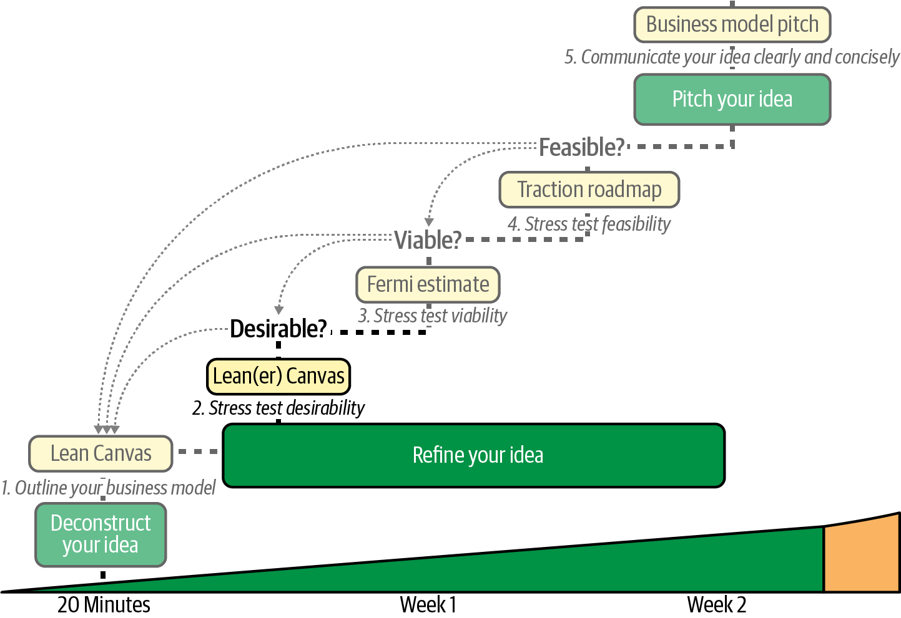

<!-- Page 86 -->

Figure 2-3. The Innovator’s Bias, represented on a Lean Canvas
In the next section, I’m going to show you the perfect antidote to the Innova-
tor’s Bias—something I call the Innovator’s Gift.
Meet the Innovator’s Gift
The basic premise of the Innovator’s Gift is simple: new problems come from
old solutions.
When searching for an innovative idea, while you need an innovative solution,
you don’t want an innovative problem—one that no one understands or cares
about. The secret is framing problems in terms of the existing obstacles with
old solutions that prevent customers from achieving their desired outcomes.
The Innovator’s Gift is realizing that there is no such thing as a perfect
solution. Problems and solutions are two sides of the same coin. And new
problems worth solving come from old solutions.
Sounds too simple? Let’s go back to the question I asked you at the beginning
of this chapter: what caused you to switch from one way of listening to music
to another?

<!-- Page 87 -->

The main reason most people switched from cassettes to CDs wasn’t because
of better sound quality, but the ability to instantly play a song. Cassette
tapes were just fine until CDs came along and broke the format by making
a problem that was always there—rewinding and fast-forwarding to find your
favorite song—a problem worth solving.
The main reason we then switched from CDs to MP3s wasn’t better sound
quality either, but the ability to buy just the songs we wanted, and not the
entire CD.
The reason we switched from MP3 players to the cloud was because “a thou-
sand songs in our pockets” was no longer enough. We now want access to 40
million songs in the cloud that we don’t even have to own, but rather rent on
demand (Figure 2-4).
Figure 2-4. Why we switched
Can you see the common thread here?
All of these are massive switching stories, and sure, there are new solutions
and technologies at play. However, what caused the switch in each case wasn’t
solving new problems, but solving old problems that were always there. We
tolerate and even work around these problems for a while, until one day we
encounter a switching trigger that breaks our current solution and causes us to
switch to a new solution.
This is the story of what all successful innovation looks like:
Once upon a time, there was a [customer]. Whenever they needed to
get a certain [job] done, they would pick [existing alternative]. One day,
that existing alternative broke because of [switching trigger]. Because of
that, the [customer] realized that the [existing alternative] wasn’t the best
choice for the [job] because of these [problems]. This realization pushed the

<!-- Page 88 -->

[customer] to search for a better solution and consider other alternatives.
Until finally they found a [new solution] that helped them get the [job] done
better.
We can visualize this story on a customer journey diagram, as shown in
Figure 2-5.
Figure 2-5. Innovation as a switch
Extending the music product timeline into the future, I can guarantee with
high certainty that how we listen to music will change again. To what, I don’t
know. But whatever comes next will be “better” than music streaming services.
This is what makes the concept of the Innovator’s Gift a gift. It offers a
systematic way of uncovering problems worth solving while sidestepping our
own disproportionate bias for our solution—the Innovator’s Bias.
Here are the key takeaways:
1. New problems worth solving come from old solutions. There is always an
1.
old way.
2. Innovation is fundamentally about causing a switch from the old way to a
2.
new way.

<!-- Page 89 -->

3. The best way to cause this switch is by anchoring new solutions against
3.
problems caused by old solutions—i.e., breaking the old way.
Unpacking the Innovator’s Gift
The first step to applying the Innovator’s Gift to your product is understanding
the theory of jobs-to-be-done (JTBD). You may have come across this before:
the basic premise is that we hire products to get a specific job done. I came
across JTBD several years ago when I first read about the Milkshake Study,
popularized by author and Harvard Business School professor Clayton Chris-
tensen, where a team of researchers inadvertently uncovered some unexpected
insights for improving milkshake sales at a fast-food company.
Prior to hiring the research team, the company had conducted its own market
research using more traditional approaches like surveys and focus groups.
While this research had generated lots of promising customer-generated
ideas for improvements, none of these ideas actually increased sales when
implemented.
Rather than follow a similar line of inquiry—i.e., asking customers what they
wanted—the team they hired chose a different path. One of the researchers on
the team, Bob Moesta, wondered what job arises in people’s lives that causes
them to come to this restaurant to hire a milkshake? Framing the question this
way allowed the team to uncover why people bought a milkshake, which led
to very different insights than when you simply ask customers how to improve
a milkshake.
After reading this case study, I wondered if a similar approach could be applied
not just to improve an existing product, but to identify opportunities for new
products. I had more questions than answers, so I read up on JTBD and even
worked alongside several JTBD thought leaders and practitioners, including
Bob Moesta, Chris Spiek, Tony Ulwick, Alan Klement, and Des Traynor. A lot
of their work influenced my own thinking on the Innovator’s Gift.
But even after all this research, two things continued to bother me. First, I
found the commonly cited definitions of a JTBD to be circular, polymorphic,
or vague. Second, a lot of the case studies I encountered felt like neat magic
tricks — obvious in hindsight, but hard to re-create from scratch with a new
product. I attempt to address both of these issues in this book.
Let’s start with my definition of a job-to-be-done, an example of which is
illustrated in Figure 2-6: a job-to-be-done is the instantiation of an unmet need
or want in response to a trigger.

<!-- Page 90 -->

Figure 2-6. A job-to-be-done
Let’s unpack this a little further.
All jobs start with a trigger
We all encounter multiple triggering events throughout the day, which means
we encounter multiple jobs to be done throughout the day too.
Some examples:
• It’s 10:36 p.m. and I’m tired. I need to sleep.
•
• It’s 12:36 p.m. and my stomach is grumbling. I need to eat.
•
• It’s 7:36 p.m. and my stomach is grumbling and it’s my wife’s birthday. I
•
want to take her to a fancy restaurant.
Triggers are what define the context that shapes the job-to-be-done.
Habits define what we do most of the time…
Having to find new solutions every time we encountered a triggering event
would generate too much cognitive load, so once we find a good enough
solution for a specific job-to-be-done, we tend to remember it for the next time
and hire it again.

<!-- Page 91 -->

NOTE
Hiring a solution is not the same thing as buying a solution. We buy lots of
products, with the best intentions of using them, but they end up collecting dust
instead. Hiring a solution is selecting and using a solution (whether previously
purchased or not) in response to a job we find ourselves needing/wanting to do.
It takes a few successive hires of the same solution to turn it into our preferred
way of getting the job done (i.e., for it to become ingrained in habit).
…Until we encounter a switching trigger
A switching trigger is a special type of trigger that comes with an expectation
violation. That’s when we realize that our existing alternative is no longer
good enough to get the job done. That’s also when we begin to seek out a
new and different solution. I label this motivation for change as PUSH in the
Customer Forces Model shown in Figure 2-7 because it pushes us toward a
better way of getting the job done.
Figure 2-7. The Customer Forces Model
NOTE
The Customer Forces Model is a behavioral model that describes the causal forces
(PUSH, PULL, INERTIA, and FRICTION) that shape how people select and use (hire)
a solution for a specific job-to-be-done.

<!-- Page 92 -->

For example, if you had a regular routine of visiting a specific restaurant for
lunch, what might cause you to seek out a new restaurant? There are generally
three types of switching triggers:
1. A bad experience (e.g., food poisoning from the usual lunch spot)
1.
2. A change in circumstance (e.g., a special occasion like a birthday)
2.
3. An awareness event (e.g., hearing about a new popular restaurant that just
3.
opened)
Therein lies the opportunity
Triggering events instantiate jobs-to-be-done that favor familiar solutions
(existing alternatives). Switching triggers, on the other hand, create expectation
violations that open spaces for new solutions. Entrepreneurs need to chase
switching triggers.
Causing a switch starts with a promise of better
If a new solution is only incrementally better, the old way always wins. It wins
because it’s already ingrained in habit. I label this resistance to change from the
status quo as INERTIA in Figure 2-7.
You additionally have to contend with the anxiety one feels whenever they
embark on a new way of doing things that challenges their familiar old way. I
label this resistance to adopting the new way as FRICTION in Figure 2-7.
NOTE
Better the devil you know than the devil you don’t.
Causing a switch requires overcoming these resisting forces. It starts with
promising a significantly better way of getting the job done. I label this
promise of something better as the PULL of the new solution in Figure 2-7.
A switch is set in motion when the attractor forces are greater than the detrac-
tor forces; i.e., PUSH + PULL > INERTIA + FRICTION.
How much better does a new way need to be than the old way to cause a
switch? Think 3 to 10 times better.
Emotionally better versus functionally better
Is coffee from a specialty coffee shop three times better than coffee from a
large coffee chain? Can the coffee drinker tell them apart in a blind taste test?
You don’t have to deliver significantly better solely by being functionally better.
Emotion helps.

<!-- Page 93 -->

NOTE
“Functionally better” is where needs live. “Emotionally better” is where wants live.
Being functionally better is about addressing unmet needs. Positioning your
product this way can be enough to cause a switch if these unmet needs are
well understood by your customers as obstacles standing in the way of them
achieving their desired outcomes (what they want). But if the unmet needs are
not well understood by your customers, it’s far more powerful to switch your
positioning to address their wants or desired outcomes.
For example:
• “We help you create a business plan faster” is positioning around being
•
functionally better.
• “We help you create a business plan that gets read” is positioning around
•
being emotionally better.
Emotionally better lives in the bigger context
Every product lives in two contexts: the solution context and the bigger
context. The solution context is where your product’s features and benefits
live. The bigger context is where your customer’s desired outcomes live
(Figure 2-8).
Figure 2-8. The bigger context
A great way to direct your thinking toward being emotionally better is focus-
ing on the bigger context.
Getting hired is only the first battle
When prompted to switch, we often evaluate and trial multiple products in
search of the one that gets the job done best. Getting your product hired, while
an important step, is only the first step. Unless you can quickly deliver value

<!-- Page 94 -->

and then establish yourself as the new status quo for the job, you could easily
find your product on the firing block.
In Part II of this book, we’ll cover how to use carefully scripted interviews to
uncover your product’s job-to-be-done. For now, though, let’s see how to use
the Innovator’s Gift to stress test your idea for desirability.
Steve Challenges the Innovator’s Gift
“I can see how the Innovator’s Gift applies to the music example, but what if
the product is so disruptive that there is no competition?” Steve asks.
Mary smiles. “Doesn’t disruption, by definition, imply an old way (the estab-
lishment or status quo) being radically challenged by a new way?”
Steve blushes a little. “Hmm…maybe disruptive isn’t the word I was looking
for, but a new category or new market. What if a product is a new category
product defining a new market?”
“Can you name one?” Mary challenges Steve.
“How about the internet?” Steve responds.
“When you apply the Innovator’s Gift, you have to go beyond the solution
context to the bigger context. The way to find the bigger context is asking
what’s it for? In other words, what’s the use case, or more specifically, job-to-
be-done? While the internet today is used for many things, going back to the
dot-com era, some of the primary early uses of the internet were access to
information using web directories and search engines. Accessing information
is the JTBD. So how did we get access to information before the internet?
Through the yellow pages, encyclopedias, libraries, books, etc. Those were the
old ways that the internet was displacing.”
“I see…” But Steve isn’t fully convinced yet.
“How about vaccines?” he fires back.
“Again, widespread use of vaccines is a relatively new solution for providing
immunity to a long history of infectious diseases. What did people do before
vaccines? They isolated the sick, and during the Middle Ages, even used
remedies involving leeches to bleed out patients, which didn’t help but made
matters a lot worse. Those were some of the old ways.”
While Steve is trying to come up with another example, Mary throws one
out. “How about fire? Fire is a technology that changed the course of human
history. If you were an entrepreneur selling fire to other humans, how would
you pitch it? What’s the competition to fire?”

<!-- Page 95 -->

“Let’s see. If we ask what fire was used for…it could be used for staying warm.
So the old way would have been using animal hides for warmth?” Steve muses.
“Yup, that’s the right train of thought. However, is that the most viable use
case?” Mary asks.
Steve thinks for a while and then replies, “I guess fire was also used for
protection to ward off predators, and of course, cooking.”
“Bingo. Using fire to keep caves warm is a seasonal and geographical use
case, so the market size is somewhat limited. But using fire to unlock new
food sources, like meat and certain grains that humans could otherwise not
consume, has global appeal. If you were sketching Lean Canvases on your cave
wall, you’d see that of the three use case—heating, protection, cooking—that
last one would be the most viable.”
Steve laughs. “I get it now. I guess I was still stuck in the solution world. The
key is seeing the bigger context of how the solution is used. So this begs my
next question: are there any new jobs-to-be-done?”
“I don’t believe so. Early humans certainly had to figure out various jobs-to-
be-done for the first time, but by now, most if not all of our basic needs
and wants have been identified. You’ve probably seen models like Maslow’s
hierarchy that model these needs as a pyramid, starting with physiological
needs like food and clothing, then safety, love and belonging, esteem, and
finally self-actualization.”
“Yes, I have, and that’s exactly why I asked the question,” Steve responds.
“But while we may have figured out all the jobs we need done, remember that
there is no such thing as a perfect solution. Every job requires work, but the
human condition strives to achieve the best possible desired outcome with the
least amount of effort. That’s the utopian ideal of a perfect solution, which if
you want to get philosophical is perpetually unattainable.”
Steve muses, “Yeah, I wonder what we’ll all do when we automate everything
in our lives? We’ll probably end up like the humans in that Pixar movie
Wall-E.”
“Yeah, probably, but remember that they still craved something more,” Mary
adds.
“You’re right…but back to Earth. I’m starting to see problems and solutions
through a totally different lens. Even when we describe products as entering
new markets, that’s a relative category description. The market itself always
had another way of getting the job done.”
“You got it. However, you’ll find many examples of jobs not being done well
at all, like some of the pre-vaccine remedies we talked about. The key in all

<!-- Page 96 -->

these stories is finding enough pockets of people triggered by some event that
motivated them to start marching up the hill toward a desired outcome.”
“Okay, I’m convinced. Time to apply the desirability stress test to my idea.”
Using the Innovator’s Gift to Stress Test Your Idea for
Desirability
When stress testing your idea for desirability, it helps to imagine putting
together pieces in a jigsaw puzzle. It’s time to take another pass at your Cus-
tomer Segments/Problem/UVP boxes (the Lean(er) Canvas). This time I want
you to go through these boxes in a very specific order, as shown in Figure 2-9.
Start with Customer Segments. Review your early adopters, then move on to
the Problem box and consider the existing alternatives. This will help you
arrive at your UVP.
Figure 2-9. The Innovator’s Gift test
Customer Segments: Keep It Simple
At this stage of your idea, keep your customer segments simple. Remember
that you’re aiming to capture your total addressable market, so use simple
labels like entrepreneur, homeowner, coffee drinker to describe your overall
customer segment. The early adopters section is where you need to get specific
(without going overboard).

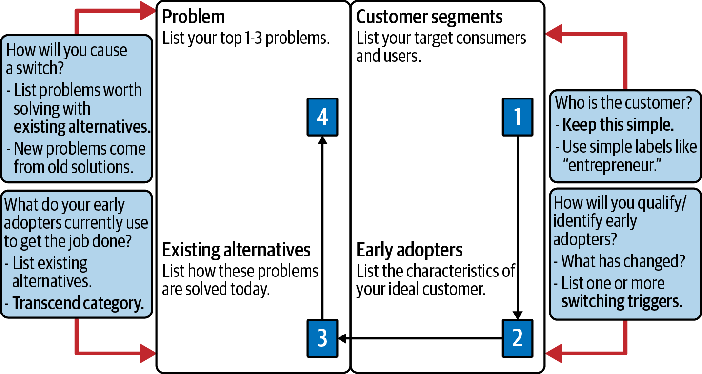

<!-- Page 97 -->

Early Adopters: Forget Personas
While it’s tempting to list a bunch of demographic and psychographic
attributes in the early adopters section, be wary that these are still guesses.
The danger here is going too narrow, actually finding customers, and ending
up on a small hill—remember the local maximum trap.
For example, let’s assume I define a startup founder using the “two guys
in a garage in Silicon Valley” stereotype. If I go looking, I’ll actually find
entrepreneurs that meet this criterion, and if I don’t bother looking any further,
I’ll miss the much larger global market of entrepreneurs. The art of customer
segmentation isn’t chasing after the most number of distinguishing traits, but
the least number of distinguishing traits that cause people to buy from you.
There is one distinguishing trait that all early adopters have. Can you guess
what that is? A switching trigger. Remember that innovation is about causing
a switch, and all switching stories start with a switching trigger. An early
adopter is someone who has experienced a switching trigger and decided to do
something about it—i.e., start the journey up the progress hill. Make sure you
list one or more switching triggers in your early adopter criteria.
Existing Alternatives: Transcend Category
Many startup founders manage to convince themselves that they have no
competition. But this is often because they aren’t looking broadly enough,
and instead are defining their competition solely in terms of their solution or
product category.
If you are building cutting-edge collaboration software, for instance, your
immediate competitor might not be the shiny startup down the street, but
email. Email is free and ubiquitous and the de facto collaboration platform.
Sure, you may think you have superior technology, but your job is getting
people to stop using email and start using your product instead. That is your
true competition.
NOTE
Email and spreadsheets have killed more startups than other startups.
This is why you won’t find a “competition” section on the Lean Canvas, but
the more general “existing alternatives.” Every successful product ever built
had competition in the form of an existing alternative. Make sure you’re in
full alignment with this fundamental tenet, because it’s key to applying the
Innovator’s Gift.

<!-- Page 98 -->

Problems: What’s Broken with the Old Way?
Finally, you need to be able to make the case for the problems listed in your
Lean(er) Canvas without relying on your solution. How do you do that?
By describing problems with respect to your customer’s existing alternatives
instead. In other words, don’t focus on problems you can solve with your
solution. Rather, focus on problems your customers encounter when using
existing alternatives.
UVP: How Will You Cause a Switch?
Anchoring your unique value proposition against the problems with existing
alternatives is the secret to crafting an effective UVP that grabs attention and
causes a switch—because it’s specific, familiar, and compelling. This subtle
change in perspective is often the difference between inventing problems to
justify your solution, and uncovering real problems worth solving.
Steve Realizes He Has a Hammer Problem
As Steve takes another look at his Lean Canvas variants, it dawns on him that
they’re all centered around his solution-specific category: AR/VR.
For example, in his Software Developers Lean Canvas:
• His early adopters are software developers who build AR/VR apps for
•
their clients.
• The existing alternatives are other AR/VR platforms.
•
• His UVP is built on the functional benefit of making it easier and faster for
•
software developers to build AR/VR apps.
But is AR/VR really what his customers want? He now sees that building an
AR/VR app is a functional outcome that might be enough to cause a switch
if building these apps were in high demand. But that isn’t the case, or at least
not yet. AR/VR technology is a promising but emerging and largely unproven
technology. An AR/VR app isn’t what end customers really want. They want
what comes after the app, like:
• Selling more billable project work (software developers)
•
• Selling more furniture online (retailers)
•
• Helping clients visualize their dream home (architects)
•
Steve realizes that he has been stuck in the solution context all this time, and
needs to instead focus on the bigger context of end customer wants and desired
outcomes.

<!-- Page 99 -->

C H A P T E R 3
Stress Test Your Idea for Viability
Viability: Can you monetize this?
While a Lean Canvas is a great way to deconstruct your early-stage idea
into a more coherent business model story, your stakeholders (investors or
budget gatekeepers) probably still struggle to see what you see. A business
model story—even with early customer validation—just doesn’t cut it for them
(Figure 3-1).
Figure 3-1. A Lean Canvas is not enough

<!-- Page 100 -->

Why is that? Because investors are in the business of getting a return on their
investment, they need to see the numbers side of the business model story.
Before you discount this as just an investor-only perspective, you too need to
learn how to see your idea through the lens of an investor.
Why? Because you are Investor #1 in your idea. While you may not be invest-
ing with lots of money, you invest with your time—which is more valuable
than money.
NOTE
Time is your scarcest resource.
The amount of money you have can go up and down, but the amount of time
you have moves only in one direction—down. All ideas, especially good ones,
consume years of your life. Do you really want to spend the next three years
on an idea with a “Let’s see what happens” approach?
NOTE
If you don’t have a “big enough” problem worth solving (one that’s not even
plausible on paper), then why expend any effort on it?
For this reason, you need to be even tougher on your idea than a professional
investor. Ultimately, both you and your investors want the same thing: to help
turn the idea into a “big enough” business to make it worthwhile.
So how do you determine whether your idea has the potential to become “big
enough”? How can you tell if it’s viable? In this chapter, I’ll show you how
(Figure 3-2).

<!-- Page 101 -->

Figure 3-2. Stress testing viability
Don’t Create a Financial Forecast; Use a Fermi Estimate
Instead
In order to get more clarity on the numbers side of your business model story,
investors often push you toward building a financial forecast spreadsheet.
The problem with these spreadsheets is that they have too many numbers in
them that quietly mask your riskiest assumptions in layers of compounding
lies. More importantly, if you do end up getting funded based on one of these
spreadsheets, you end up back in the old world: executing a plan. Your invest-
ors start measuring the performance of your startup against your forecasts,
which often results in a rude awakening.
Your investors care about growth, but at the earliest stages, you need to focus
on product and learning. This creates a dichotomy of progress stories. The
story we tell our stakeholders is not the same as the story we tell ourselves.
They both start out the same, but they diverge significantly over time because
each uses a different definition of progress.
You can’t learn and move fast if you’re stuck executing and defending a fic-
tional plan—especially as your input assumptions start getting challenged over
time, which they will. So there is a problem: unless you can completely break

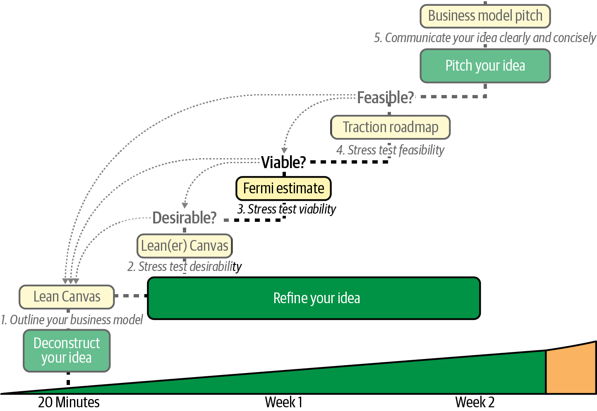

<!-- Page 102 -->

away from the waterfall business planning process, you’ll be hard-pressed to
effectively practice Continuous Innovation.
To solve this drowning-in-fictional-numbers problem, I devised a simple back-
of-the-envelope business model test that takes less than five minutes to do. It’s
based on a Fermi estimate, which is widely used in physics for doing quick
order-of-magnitude calculations.
If you’ve ever tried to guess the number of jelly beans in a jar, that’s a great
Fermi estimate problem. Fermi estimates work by making justified guesses
about a problem’s input assumptions that are accurate to within an order of
magnitude (nearest power of 10). This is often the best we can do with little
data, but the resulting estimates are surprisingly useful.
The mistake we make with financial projections in the business model planning
phase is that we spend a disproportionate amount of time focusing on the
output of our models when it’s the inputs that really matter.
The traditional top-down approach for justifying an idea is attaching your
business model to a “large enough” customer segment. Then the logic goes
that if you can capture “just 1%” of this large market, you’ll be all set. After
all, 1% of a billion-dollar market is still a lot of zeros.
The problems with this approach are that:
• It gives you a false sense of comfort.
•
• It doesn’t address how to get to this 1% market share with your specific
•
product.
• A 1% market share might not even be the right success criterion for you.
•
A Fermi estimate, on the other hand, takes a bottom-up approach, where you
start with a set of inputs, roughly estimate them to your best ability, and then
test the viability of your idea using these input assumptions. As long as your
input assumptions aren’t off by an order of magnitude, the resulting estimate
will be accurate enough to make a go or no-go decision.
To test the viability of an idea, we’re not going to use dozens of numbers but
just five to seven key metrics. What are these key metrics? To answer that
question, we need to first cover the one metric to rule them all: traction.
MINDSET #3
Traction is the goal.

<!-- Page 103 -->

What Is Traction?
While traction is a popular concept, it’s poorly understood and often misused
to mean any convenient metric that happens to be going up and to the right.
For instance, a plot of the cumulative number of users over time has nowhere
to go but up and to the right. A more sophisticated investor will see right
through this facade of vanity metrics.
While a lot of stakeholders ask for financial metrics like revenue and profit,
these aren’t the right traction metrics either. Why? Because revenue and profit
often start out near zero and even track in negative numbers in the product’s
early stages (Figure 3-3).
Figure 3-3. The product J-curve
More importantly, revenue and profit are trailing indicators of progress. Good
traction metrics, on the other hand, are leading indicators of progress—i.e.,
they help you predict future business model growth.
What do such metrics look like? The first clue comes from realizing that
traction is nothing other than a measure of a working business model. All
business models have customers, and so it follows that traction metrics need to
be customer-centric.
The next clue comes from revisiting our earlier definition of a business model
as a description of how you create, deliver, and capture value from customers.
As capturing value from customers is key to building a working business
model, we can define traction as the rate at which a business model captures
monetizable value from its customers.

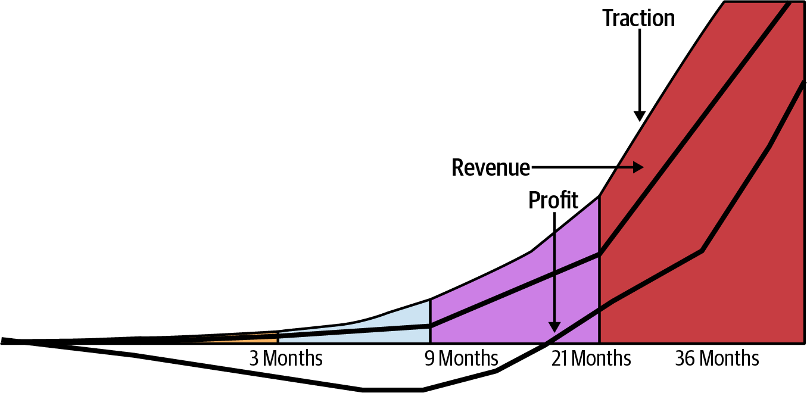

<!-- Page 104 -->

NOTE
It’s important to emphasize that monetizable value is not the same thing as
revenue. Rather, monetizable value is a future indicator of revenue. It’s easy to see
this distinction in a multisided business model like Facebook, where monetizable
value comes from the users on the social network (more specifically, their atten-
tion and data). Facebook converts this monetizable value into revenue through its
customers (advertisers) placing ads on the platform.
As all businesses share a universal goal of turning users into customers, we can
make this definition of traction even more tangible by visualizing the output of
a working business model using a customer factory metaphor.
Welcome to the Customer Factory
In this metaphor, a customer factory represents everything inside your busi-
ness: marketing, sales, customer service, and product. The job of your cus-
tomer factory is to make customers. It does this by taking in unaware visitors
as input (raw material) and turning them into happy customers (finished prod-
uct). In this metaphor, traction is the throughput of your customer factory,
which is equivalent to the rate at which you make customers.
This process of making customers can be further broken down into five macro
steps that can be universally found in all types of business models: acquisition,
activation, retention, revenue, and referral (Figure 3-4). The customer factory
is the second model we use in the Continuous Innovation Framework.
Figure 3-4. The customer factory blueprint

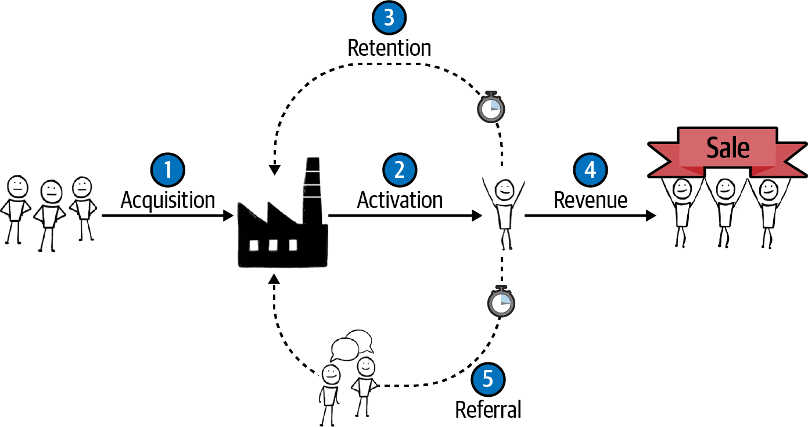

<!-- Page 105 -->

These five macro steps represent the leading key metrics that can be used to
measure traction in any kind of business. Let’s walk through each step using a
flower shop and a software product as examples.
Step 1. Acquisition
Acquisition describes the point when you turn an unaware visitor into an
interested prospect.
In the case of the flower shop, getting someone walking by your window to
stop and come into your shop is an acquisition event.
On a product website, getting someone to do anything other than leave (aban-
don) the site is a measure of acquisition. I specifically recommend measuring
acquisition at the point when you can uniquely identify a visitor and start a
conversation with them (e.g., getting their email address).
Step 2. Activation
Activation describes the point when the interested customer has their first
gratifying user experience. This is also often described as the aha moment. In
the case of the flower shop, if the prospect found the shop in disarray once
they came inside, that would be a disconnect with the promise made at the
front of the store, and they’d probably leave and never return. You want them
to come in and find arrangements so magnificent that it’s impossible to resist
buying one.
On a product website, once the prospect signs up, you have to quickly get
them to a point where they can connect the promise you made on your landing
page (your UVP) with your product.
Step 3. Retention
Retention measures repeated use and/or engagement with your product. In the
case of the flower shop, the action of coming back to the store—and in the
case of the product website, the act of logging back in to use the product
again—would count as retention.
Step 4. Revenue
Revenue measures the events that get you paid. These could be buying flowers
or buying a subscription for your product. These events may or may not occur
on the first visit, and even if they do, most products offer a trial period where a
customer may return the product for a refund. This is why revenue is drawn as
step 4 in Figure 3-4.
Step 5. Referral
Referral is a type of acquisition channel that uses a feedback loop from your
happy customers to drive new prospects into your customer factory. In the case

<!-- Page 106 -->

of the flower shop, this could be as simple as telling a friend about the store.
For the software product, this could range from implicit social sharing features
(like a Share button) to explicit affiliate referral programs.
NOTE
You might have recognized the steps in the customer factory blueprint from Dave
McClure’s Pirate Metrics model. If you don’t know what that is and are wondering
why it’s called Pirate Metrics, the first letter of each of the macro steps together
spell out the word “AARRR,” which is something pirates like to say.
The difference between the Pirate Metrics model and the customer factory is
that the former visualizes a business model as a linear funnel while the latter
visualizes the business model as a system (with feedback loops). We’ll cover the
ramifications of modeling your business model as a system (rather than a funnel)
in later chapters.
Testing the Viability of Your Idea Using a Fermi Estimate
Now that you understand how to visualize traction as the output of a
customer factory, you are ready to stress test the viability of your idea
(Figure 3-5).
The first step is defining a target throughput goal for your customer factory.
Next, you estimate reasonable values for the macro steps in order to test the
viability of your customer factory. If your customer factory cannot deliver on
your target throughput, you need to either adjust your target throughput goal
or your customer factory steps (or both).
Figure 3-5. Stress testing for viability using a Fermi estimate
Let’s walk through these steps in more detail.

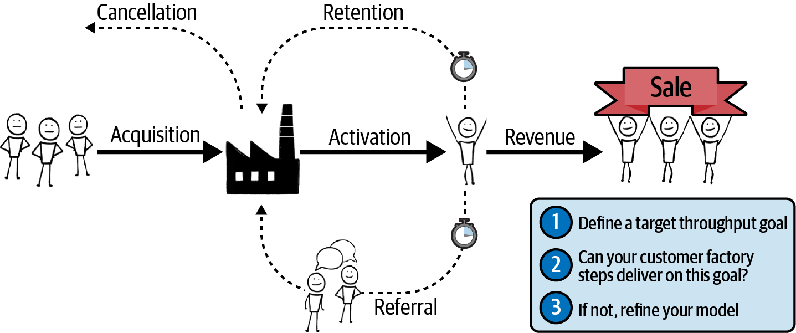

<!-- Page 107 -->

Define a Target Throughput Goal
If you don’t know where you are going, any road will take you there.
—Adapted from Alice in Wonderland, by Lewis Carroll
The quote above captures the reason we need a goal. However, while we are
told to set goals, we generally aren’t taught how to set good goals. The reason
a lot of forecast models result in fictional plans is that they attempt to estimate
the maximum upside potential of an idea too far into the future. This is very
hard (if not impossible) to do in the early stages of an idea, which are riddled
with extreme uncertainty.
It’s much more practical to set your target goal based on a shorter horizon
rather than a longer horizon—think minimum success criteria (MSC) versus
maximum upside potential. If, for instance, you had asked the founders of
Airbnb, Google, or Facebook when they were first starting out whether they
thought they would go on to build billion-dollar companies, they would prob-
ably have laughed at you. As Mark Zuckerberg famously said:
We built it and we didn’t expect it to be a company, we were just building
this because we thought it was awesome.
While Zuckerberg had no idea Facebook would turn into a billion-dollar
company less than 10 years after its founding, within the first 2 years he turned
down a $50 million acquisition offer from Myspace because he thought they
were lowballing. He countered with $75 million, which was his MSC at the
time, and Myspace turned him down.
NOTE
Your MSC is the smallest outcome that would make you deem your project a
success three years from now.
When asked to set the MSC for an idea, a lot of entrepreneurs aim for break-
even. This, however, is too short-sighted as it doesn’t guarantee you’ll be able
to build a repeatable and scalable business model as you grow beyond your
initial founding team (typically a team of one).
The right balance is setting your target goalpost a little beyond your prod-
uct/market fit point (Figure 3-6). That is when your business model is largely
de-risked and your focus shifts toward scaling growth. That is also when you
can see further and make more accurate five- to seven-year financial forecasts.
Most products average about two years to achieve product/market fit, which
is why I recommend setting the time horizon for reaching your MSC at three
years.

<!-- Page 108 -->

Figure 3-6. Timeline for achieving your MSC
Following are some additional guidelines for defining your MSC.
Set your minimum success criteria independently from your idea
Many entrepreneurs consider pursuing multiple ideas at the same time (rightly
so), but how do you pick among them? Why would you ever want to work on
an idea that has no chance of hitting your MSC?
Once you define your MSC, use this to filter out your most promising idea(s).
In other words, don’t start with an idea and ask how big it could get; start
with your MSC, and ask if your idea can deliver on your goal.
Frame your goal in terms of annual recurring revenue (ARR)
I recommend using revenue rather than profit or company valuation to frame
your goal because revenue has fewer inputs (number of customers, price, and
frequency of purchases), which keeps the model simple. Profit and valuation
are derivatives of revenue anyway, so as long as you buffer accordingly, you
cover your bases.
For example:
• If you are building a SaaS business, most are expected to run at >80%
•
profit margins by product/market fit. If you want to generate profits of
$10m/yr, set your target throughput goal to $12.5m ARR.
• If you are building a hardware business with typical margins of 40%, for
•
profits of $10m/yr, set your target throughput goal to $25m ARR.
• If you are building a marketplace business with typical take rates of 10%,
•
for profits of $10m/yr, set your target throughput goal to $100m ARR.

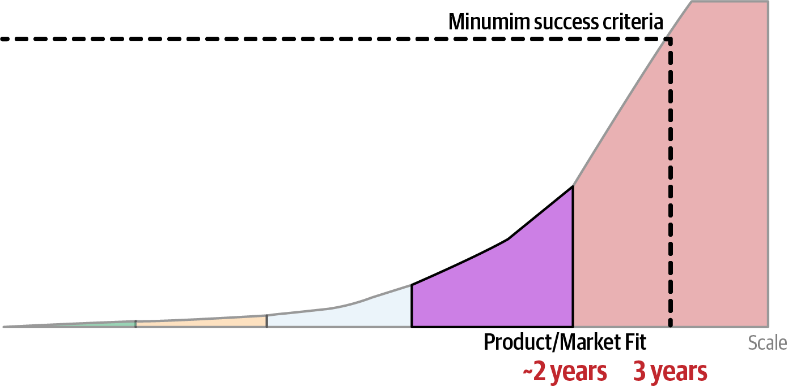

<!-- Page 109 -->

Even impact-driven businesses should use revenue to frame their goal. Start by
estimating the impact you’d like to deliver (e.g., plant one million trees per
year). Then ask how much money you’d need to fund that impact.
NOTE
Revenue is like oxygen. We don’t live for oxygen, but we need oxygen to live.
Next, I emphasize recurring revenue versus just revenue, because you need to
think in terms of systems, not goals.
Focus on systems, not goals
While there’s a place for goals, simply setting a goal is never enough. It’s way
more actionable to focus on building systems that move you toward a goal.
NOTE
Goals focus on outputs. Systems focus on inputs.
For example:
• Goal: Losing 10 pounds
•
• System: Learning to eat right
•
The problem with goals is that they don’t tell you how to achieve them or
what to do when you achieve them. In the preceding example, people may be
able to brute-force losing 10 pounds once through sheer willpower. But once
that wears off, the weight goes back on.
Systems, on the other hand—like learning to eat right—help you focus on key
activities or routines that move you toward the goal. Once these key activities
turn into habits, you not only achieve your goal but shoot past it.
The best approach, then, is to use goals for ballparking your desired outcome,
and systems for formulating key steps to achieving the goal.
You still need to size up your goal, because the effort that goes into losing 10
pounds is quite different from that for losing 100 pounds. But once a ballpark
goal is set, like losing 10 pounds, does it really matter if you lose 9 pounds or
11 pounds?
Focus your energy instead on building systems to help you achieve the goal.

<!-- Page 110 -->

Your minimum success criteria are determined by your operating environment
If you are a startup founder, ask yourself whether you intend to raise money
from investors. If the answer is yes, your MSC will be set by them, not you.
Study how your target investors value companies at product/market fit; that
will give you some specific benchmarks to use in your modeling.
If you don’t intend to raise money from investors and instead want to boot-
strap your company all the way, ask yourself:
• How big a company would I like to build?
•
• How many employees will my company have?
•
The answers to these questions can help you ballpark your ARR target. For
example, a company with 30 employees needs roughly $5m ARR just to cover
payroll.
If you work at a big company, ask your stakeholders now (not three years
from now) how they define a successful product. If they aren’t sure, suggest
that they revisit their past product launch archives to determine what the
first-three-year trajectory looked like. Then set your MSC based on the top
five products your company has launched. If you can promise to outperform
their three-year revenue trajectories by a factor of two or three (because you’re
using a better innovation process), you should be able to get your stakeholders
on board.
Don’t chase three-digit precision
The purpose of this exercise is to ballpark a rough three-year ARR estimate.
Don’t overthink this. When in doubt, think in powers of 10:
• $100k ARR: Roughly enough to quit your day job
•
• $1m ARR: Enough for a small company (two or three employees)
•
• $10m ARR: Enough for a VC-backed business
•
Adjust accordingly from here.
Don’t go outside the building without minimum success criteria
In their exuberance for action, a lot of entrepreneurs rush outside the building
too soon and start building and testing their product—only to find out months
later that they were chasing too small an idea. Taking the requisite time to
deliberate and define your MSC is a critical first step. I wouldn’t advise skip-
ping it.

<!-- Page 111 -->

TIP
There is no right or wrong number for your MSC, but you should have a number.
Steve sets his minimum success criteria
Every major publication that covers AR/VR technologies predicts that this
technology is going to change entire industries, and the market for AR/VR is
valued in the billions of dollars. There are already major players, like Micro-
soft, Apple, Google, Facebook, and Amazon, deploying this technology.
As Steve has his sights set on building a key enabler platform for AR/VR
technology, he recognizes that while he can get started on his own, he will
eventually require venture capital in order to scale his vision and establish his
platform’s unfair advantage.
Steve decides to set his ballpark MSC goal to $10m ARR (annual recurring
revenue) in three years.
Test Whether Your Idea Can Deliver Your Target Throughput Goal
With your MSC set, you can now start testing the viability of your idea by
inputting your best-guess estimates for your customer factory metrics.
I recommend doing this in the following order (shown in Figure 3-7):
1. Revenue (review assumptions to estimate active customers)
1.
2. Retention
2.
3. Acquisition
3.
4. Activation
4.
5. Referral
5.
If you aren’t interested in the thinking process behind the math, feel free to
skip to the end of this section, where you’ll find a link to an online tool that
does all the calculations for you.

<!-- Page 112 -->

Figure 3-7. Recommended order for testing viability
Estimate the required number of active customers
If you don’t have any specific pricing assumptions on your Lean Canvas,
go back to “Revenue Streams and Cost Structure” on page 18 to learn how
to set ballpark pricing for your product. Then use the following formula to
determine the number of active customers you’ll need to reach your MSC goal:
Number of active customers =
Yearly revenue target
Yearly customer revenue
The number of active customers is already a more telling number than your
revenue goal. It helps to test whether your overall customer and early adopter
segments are big enough. As shown in Figure 3-8, your early adopter segment
should ideally be roughly 16% of your overall customer segment (your total
addressable market).
This number comes from the diffusion of innovations theory, popularized by
Everett Rogers in his book of the same title (Free Press). Diffusion of innova-
tions explains how and why new ideas spread starting with innovators and
early adopters (which I group together) to the early majority, the late majority,
and finally the laggards.

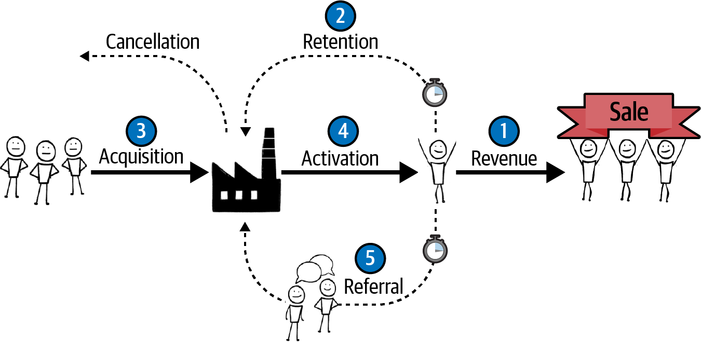

<!-- Page 113 -->

Figure 3-8. The ideal early adopter segment size
The way you position your product changes with each group of adopters
(visualized as breaks or gaps in the figure). According to Geoffrey Moore, the
biggest gap is the one between early adopters and the early majority, which
he identified as a chasm big enough to derail a startup in his groundbreaking
book Crossing the Chasm (HarperBusiness). Why is that? Because early adopt-
ers (and visionaries) have above-average motivation to be first with the new
technology if it promises to get them closer to their desired outcomes. The
marketing strategies that win over this group, however, won’t work so well for
the next group—the early majority—because they tend to be pragmatists and
are risk averse. This is why you should ideally aim to get as close as possible to
your MSC using your early adopter segment alone.
Steve estimates how many active customers he’ll need
Steve decides to stress test his Software Developers business model first. Given
that his MSC is hitting an annual recurring revenue of $10m/yr using a sub-
scription model (SaaS) with a fee of $50/mo, Steve determines that he’ll need
16,667 active customers ($10m/yr / ($100/mo x 12 months)) by year 3.
He’s a little surprised by that number and does a quick online search for “top
AR/VR app companies,” which returns 2,286 firms. That makes him nervous,
because that only accounts for 14% of his required number of customers. As
this number only represents his early adopter segment, he wonders whether
demand for AR/VR will grow rapidly enough to provide the missing 86% in
this time frame.
While he’s hopeful that his no-code platform will turn non-software developers
into customers, there is a lot of ground to cover, which makes him uneasy.
Estimate the required minimum customer acquisition rate
It would be great if all we had to do was work really hard for the first
three years, hit our ARR goal, and then collect an annuity for life. We could

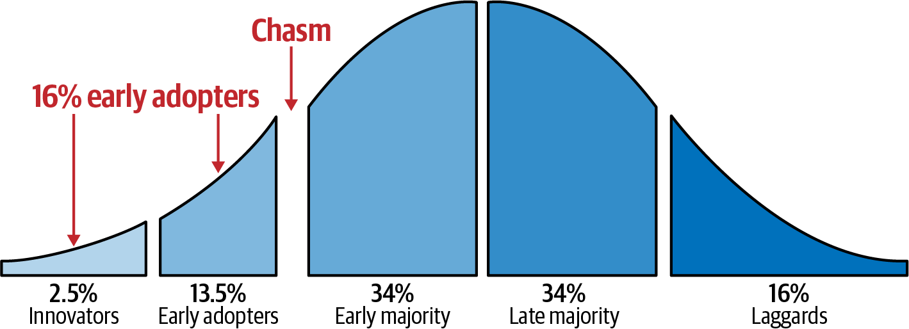

<!-- Page 114 -->

retire on a beach! But unfortunately, it doesn’t work out that way because of
customer attrition, or churn.
All businesses have churn. This means that at some point customers will start
leaving, and you’ll need to replace them—not to grow your business, just to
sustain it. This represents your minimum customer acquisition rate.
If you want to grow your business beyond your MSC, your new customer
acquisition rate will need to be greater than your minimum customer acquisi-
tion rate. For example, if you have 10,000 active customers and 5% monthly
churn, every month you will lose 500 customers on average. You’ll need to
acquire at least 500 new customers a month (6,000 new customers a year) just
to maintain your business model, and more than that to grow.
While most people understand the concept of churn, they struggle with esti-
mating it. A more practical approach is using the inverse of churn: customer
lifetime, or retention. Your customer lifetime is how long on average (in
months or years) you expect to keep your customers.
How do you estimate your average customer lifetime? Here are some ideas:
• Study other businesses in your industry to determine average attrition or
•
churn rates.
• Estimate the utility of your product. Every job has a finite lifetime. For
•
example, it typically takes two weeks to paint a house.
• If you find yourself going above five years on your average customer
•
lifetime estimate, be prepared to justify your reasoning with additional
evidence.
Once you estimate your average customer lifetime, you can use Table 3-1 to
determine your monthly churn rate.
Table 3-1. Customer lifetime to churn rate conversion
Lifetime in years Monthly churn rate
1
8.33%
2
4.17%
3
2.78%
4
2.08%
5
1.67%
6
1.39%
7
1.19%
8
1.04%
9
0.93%
10
0.83%

<!-- Page 115 -->

Churn rate =
1
Customer lifetime in months
Then calculate your minimum customer acquisition rate using the following
formula:
Minimum customer acquisition rate monthly = Number of active customers
x Monthly churn rate
Steve estimates his minimum customer acquisition rate
Steve does a quick lookup on the average customer lifetime for SaaS companies
and finds that four years is considered a good target. Based on Table 3-1, that
represents a 2.08% monthly churn rate.
If in year 3 he has 16,667 active customers, this means he’ll be losing 347
customers/mo. That means he’ll have to acquire at least 347 customers/mo
(roughly 4,000 new customers/yr) just to maintain his business model.
He draws a quick sketch to visualize these numbers (Figure 3-9).
Figure 3-9. Steve’s minimum customer acquisition rate after year 3
Estimate the required number of leads
No customer acquisition funnel converts at 100%, which means you’ll need a
lot more users than customers.
The customer factory breaks the conversion from users to customers into three
steps:

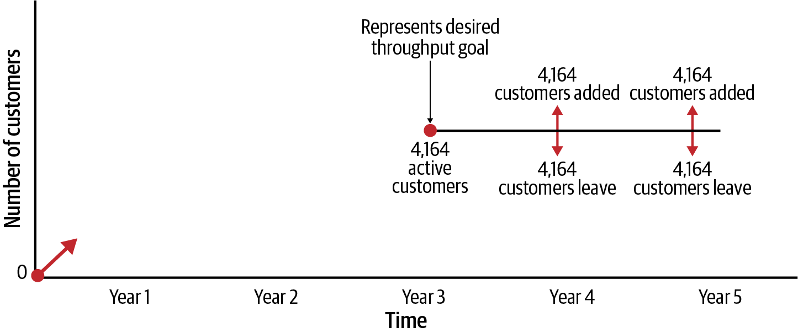

<!-- Page 116 -->

1 See Lean Analytics by Alistair Croll and Benjamin Yoslovitz (O’Reilly).
• Acquisition (user acquisition rate)
•
• Activation (trials or pilot conversion rate)
•
• Revenue (customer conversion rate)
•
With a little research, it’s fairly easy to find typical conversion rates for your
type of product. If you’re struggling to find accurate numbers, remember that
you only need to be within an order of magnitude to create a useful estimate.
Most products, irrespective of product type, start with a customer conversion
rate somewhere between 0.5–3%. When in doubt, it’s safe to assume a 1%
customer conversion rate. Here are a few guidelines:
• For B2B sales, according to Salesforce, an average conversion rate for
•
MQL (marketing qualified lead) to SQL (sales qualified lead) is 13%.
From there, only 6% of SQLs convert to deals. That’s a 0.78% customer
conversion rate.
• For SaaS products, according to various industry benchmarks,1 2–10%
•
sign up, 15–50% become subscribers, and 20–40% churn on the first pay
period. That’s a 0.6–1.2% customer conversion rate.
• For ecommerce sites that have just started out, most report a 1–3% cus-
•
tomer conversion rate.
Steve estimates the number of leads he’ll need to attract
Steve uses the ballpark 1% paid conversion rate for SaaS to realize that in
order to acquire 347 new customers per month, he will need to attract 34,700
leads/mo (Figure 3-10). And this is just to maintain his annual recurring reve-
nue, not to grow it.
As VCs expect a 10x return in the subsequent 2 to 4 years after product/mar-
ket fit, that means he’ll need to find a way to eventually attract 347,000
leads/mo (or 4m+ leads/yr). That leaves a knot in his stomach.
Steve’s business model has fallen apart. What now? Don’t despair. There’s still
one more metric: referral.

<!-- Page 117 -->

Figure 3-10. Steve’s customer factory at the start of year 4
Use your referral assumptions to lessen the burden of customer acquisition
The referral loop in the customer factory utilizes existing customers to grow
your business model, thereby lessening the burden of customer acquisition.
Start by estimating a reasonable customer referral rate for your type of
product.
Viral growth requires the referral rate to be above 100%, and unless your
product has inherently viral behavior (sharing with others) built in as a
byproduct of usage (e.g., Facebook), this is incredibly rare. From my experi-
ence, a sustainable referral rate of 15–25% is good, 40% is great, and around
70% is excellent.
Steve tries to save his business model
Steve does not expect his product to go viral and decides to use a more modest
20% as a reasonable referral rate. At first, he’s a bit relieved to see that instead
of having to acquire all 34,700 leads by himself, he might be able to rely on his
existing customers to help attract 20% of that traffic (6,940 leads). But while
that helps, it isn’t enough.
He quickly realizes that unless he can drive really high referral rates (>80%) or
get his product to go viral (>100%), while referrals will serve as an amplifier,

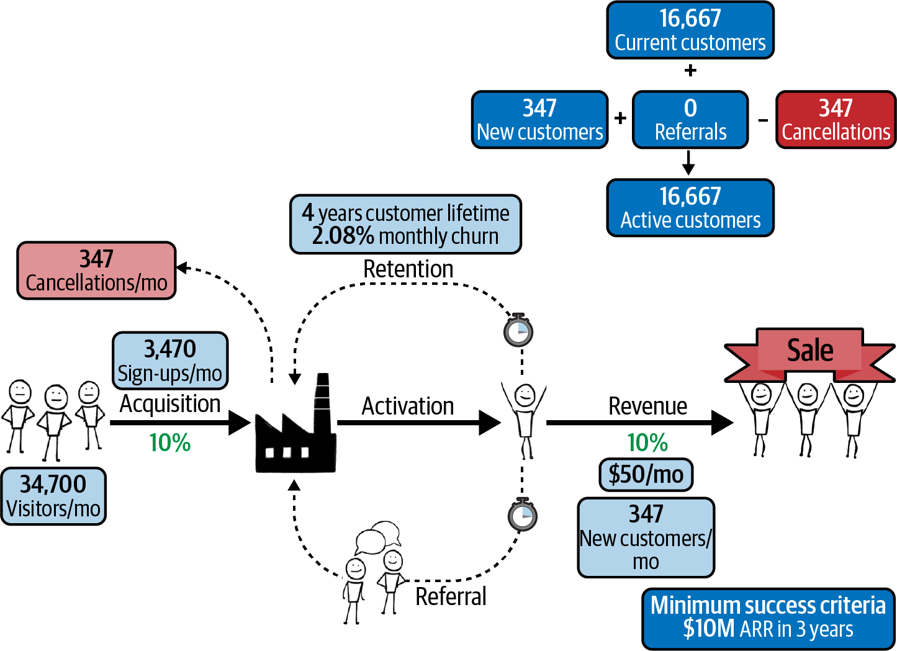

<!-- Page 118 -->

they aren’t enough to save his business model. Is it really doomed? Read on to
learn how he finds a fix.
Revise Your Goal or Fix Your Business Model
Even though what we’re creating is a rough estimate, any estimate is better
than none. If your model doesn’t have a chance of working on paper, it’s not
going to work in the real world either.
TIP
It’s much better to invalidate your model in five minutes than to spend five
months pursuing a flawed model.
Unlike a spreadsheet, where you can hide behind (or get lost with) lots of
numbers, there’s nowhere to hide with a Fermi estimate. When confronted
with a business model that fails your viability test, there are only two possible
solutions: review your goal or fix your business model. Since no one enjoys
revising their goal downward, we’ll leave that as a last resort. Let’s first con-
sider possible ways to fix your business model.
Fixing your business model
Because a Fermi estimate uses a handful of input assumptions, it makes it a lot
easier to understand why a model fails—and better yet, what levers to pull in
order to fix your model. Before we get into specific levers, it helps to realize
that for a given MSC goal, there are only a finite number of viable ways to hit
that goal, as shown in Figure 3-11.
This chart was inspired by a blog post by Christoph Janz, a VC at Point Nine
Capital, titled “Five Ways to Build a $100 Million SaaS Business.”

<!-- Page 119 -->

Figure 3-11. There are a finite number of viable ways to build a business
Here’s how to use the chart. Let’s assume you have an MSC goal of achieving
$10m ARR in three years. Find that line on the chart, and you’ll see that in
order to achieve that goal you’ll need to acquire one of the following:
• 1 million customers paying you $10/yr
•
• 100,000 customers paying you $100/yr
•
• 10,000 customers paying you $1,000/yr
•
• 1,000 customers paying you $10,000/yr
•
• 100 customers paying you $100,000/yr
•
• 10 customers paying you $1,000,000/yr
•
There are trade-offs at both extremes; for example, the only way to acquire a
million customers in 3 years is through a viral engine of growth, and getting
10 people to pay you a million dollars per year requires a very high-value
unique value proposition and a complex sales process. Both of these paths,
while not impossible, are extremely difficult to pull off—leaving you with four

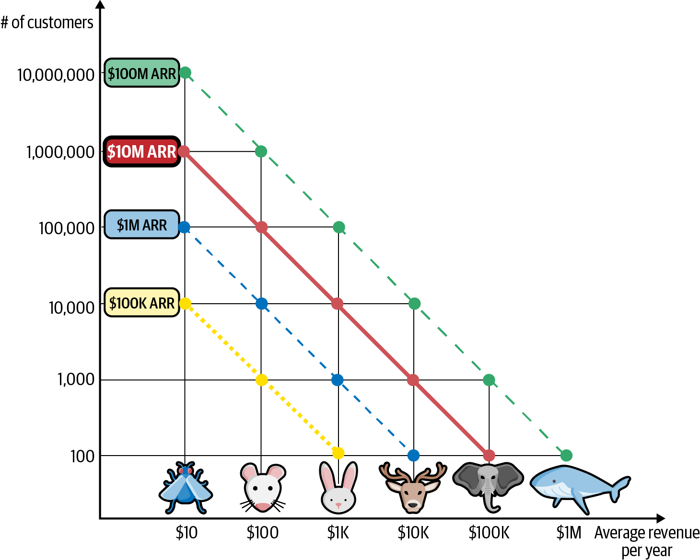

<!-- Page 120 -->

more practical ways for achieving your goal. Pick one or two and explore from
there.
The power of this kind of thinking is that it lets you take a step back from
your specific idea and view multiple business models through the lens of viabil-
ity. Once you select a particular way of achieving your goal, such as acquiring
10,000 customers paying you $1,000/yr, the question changes from “How big
could my idea get?” to:
• Can I realistically acquire 10,000 customers within 3 years?
•
• Do I have a $1,000/yr problem worth solving?
•
If the answer to either question is shaky, you’ll need to adjust your model.
Given that we aren’t considering downsizing your MSC at this point, the only
other avenue for fixing your model is increasing the average revenue per user
(ARPU) per year that you capture from your customers. Small incremental
adjustments seldom fix a Fermi estimate. You’re looking for either one big 10x
lever or, more realistically, a few levers that add up to 10x.
Here are some ways of finding such levers.
Revisit your pricing. Raising the price of your product is one of the most
underutilized levers. If you double your pricing, you’ll only need half the num-
ber of customers. A lot of entrepreneurs hesitate to raise pricing because they
are scared they’ll lose customers. Here’s how to think about this: if you double
your pricing and don’t lose more than half your customers, you still come out
ahead. You come out ahead because while your revenue stays the same, your
operating expenses to serve fewer higher-paying customers go down—so your
net revenue or profit goes up.
Many entrepreneurs make a mistake when setting the price for their products
using cost-based pricing. They start by estimating the cost of building their
product. They then slap on a “reasonable” margin to determine the price
of the product. This more often than not leads to suboptimal pricing—i.e.,
leaving money on the table. It’s also a backward way of setting pricing. Here’s
why: your customers don’t care about your cost structure or your margins.
They care about achieving their desired outcomes (value) at a fair price. How
do you set fair pricing? By applying the Innovator’s Gift.
We used the Innovator’s Gift in Chapter 2 to stress test the desirability of your
UVP—i.e., do you have a big enough problem to cause a switch? Here, we are
going to apply the Innovator’s Gift to stress test the viability of your revenue
streams—i.e., do you have a big enough problem worth solving?
Remember that innovation is about causing a switch from an old way to your
better new way. When customers consider a switch, they compare the new way

<!-- Page 121 -->

against the old way. That’s how you too should think about your product’s
pricing.
Your optimal price sits somewhere between two anchors. The first anchor
comes from the monetary value your customers place on your unique value
proposition. A customer will only use your product if they stand to realize
more value for themselves than they pay you. This anchor typically sets the
ceiling for your pricing.
The second anchor comes from the cost of the existing alternatives. In other
words, how much time, money, and effort are customers currently spending on
getting the job done? If your UVP is indeed better, you can stand to charge
a premium, but be wary that customers will always compare your product
against the existing alternatives. This anchor typically sets the floor for your
pricing.
The optimal price for your product then is somewhere between the cost of
existing alternatives and the monetary value customers place on your UVP.
Don’t aim to nail your optimal price at this stage. Getting to optimal pricing
is more science than art and takes lots of testing. We’ll cover some techniques
for price optimization later in the book, but for now your goal is simply
ballparking a rough fair price for your product.
How far are you able to push your pricing? Can you double it? Can you raise
it by a factor of 10? If applying the Innovator’s Gift doesn’t fix your business
model, there are still a few additional levers to consider.
Revisit your problems. Consider taking on a bigger problem to solve, or a
problem that occurs more frequently, or both. Chasing a bigger problem
allows you to raise the pricing of your product. Increasing the frequency of
usage of your product (utility) potentially allows you to increase your cus-
tomer lifetime, thereby allowing you to recapture more value.
Consider a different customer segment. You can find every product from bot-
tled water to cars offered on a wide spectrum of prices. The type of customer
who buys a $25,000 car is very different from one who buys a $250,000 car.
Pricing is not only a part of your product, it defines your customer segment. If
you need to increase your pricing by 10x, you could try to change your UVP,
or you could simply change your target customer segment. Revisit your other
idea variants and reprioritize them through the lens of viability.
Revising your goal
While no one enjoys revising their goal downward, this exercise hopefully
surfaces a healthy appreciation for just how hard it can be to grow a business.
If your idea cannot hit your MSC but you want to pursue it anyway for other
reasons, recalibrate your goal and move forward.

<!-- Page 122 -->

It may also be possible to break your journey to product/market fit across
multiple business models. The most common approach is targeting an initial
customer segment at a lower price point and then moving upstream across a
second and maybe even a third customer segment at subsequently higher price
points. For example, you might start with a self-serve SaaS product and then
move into the enterprise software space.
While this may sound like a highly appealing strategy because it dispels your
immediate business model viability woes, a word of caution is in order. Taking
on multiple business models in a three-year period is not easy: you’ll have to
switch across multiple channels, craft new value propositions, build different
features, etc.
The ideal is getting to your MSC goal with a single business model, whenever
possible.
Steve fixes his business model
Steve goes over his back-of-the-envelope calculations and lists out the input
assumptions he used. He finds that his model fell apart with just four key
metrics:
• MSC: $10m ARR in 3 years
•
• Pricing (revenue): $50/mo
•
• Customer lifetime (retention): 4 years
•
• Paid conversion rate (paid acquisition): 1%
•
Next, he goes over each one and tries to find a 3x–10x lever.
He recognizes that his MSC is set by his ambition and is nonnegotiable, so
he skips that. He feels the same about his customer lifetime assumption. Sure,
he might be able to keep good customers for an additional 1 to 2 years, but
there’s no way he can guarantee they’ll stay 3 to 10 times longer!
All of a sudden, it dawns on him that the most actionable lever in his control is
pricing. The reason he picked $50/mo was to make his product highly appeal-
ing to software developers in order to drive adoption. But could a software
developer justify paying 10x that?
Most of the existing alternatives on his Lean Canvas are free to use, but they
require the software developer to then spend hundreds of hours coding to
build an app. A typical app takes 200 hours to build, and at a billing rate of
$50–75/hr, that represents $10–15k.
Steve believes that his platform could easily shave 10x off the app development
time, so it would take 20 hours/app versus 200 hours/app. Using that anchor,

<!-- Page 123 -->

he would surely be able to justify charging at least 5x the price ($250/mo).
Could he charge 10x the price ($500/mo)? Maybe. He realizes that:
• With 5x the price, he would need 1/5 the number of customers.
•
• With 10x the price, he would need 1/10 the number of customers
•
(Figure 3-12).
Figure 3-12. Pricing is a highly underutilized lever
Isn’t this just funny math?
Not really, because this exercise exposes the input assumptions that make your
business model work (or that cause it to fail). When Steve started this exercise,
all he had was a business model story with a set of qualitative assumptions,
which seemed like a promising start for an early-stage product.
However, after running the Fermi estimate exercise, he found that even in a
best-case scenario his Software Developers business model would not hit his
MSC goal of $10m ARR. In order to have a chance of hitting the goal he
needed to raise his pricing by at least 5x ($250/mo), and his model would be
even better at 10x ($500/mo).
Steve’s pricing model just became his riskiest assumption—one that he can and
should test sooner rather than later.

<!-- Page 124 -->

Next, he turns his attention to the other canvases. He wonders:
• How much would a retailer value a solution that helped them sell 3x–10x
•
more stuff online?
• How much does an architect bill a client for a 3D rendering?
•
These are the right questions to be asking in order to determine value-based
pricing. Remember, customers don’t care about your solution, they care about
their problems. They definitely don’t care about what your solution costs to
build. The best way, then, to set pricing for your product is not by anchoring it
against the cost of building your solution, but by anchoring against:
• The cost of how your customers are solving these problems today
•
• The value you promise to deliver (your unique value proposition)
•
Running a Fermi Estimate on Your Idea
While we all need a ballpark destination to justify the journey, it’s not the
destination itself but the starting assumptions and milestones along the way
that inform whether we are on the right path or need a course correction.
Ballpark your business model using the three-step process outlined here:
1. Define your minimum success criteria.
1.
Remember, this can be a deep “why” question, but it’s critical to use your
MSC to constrain your idea, not the other way around.
2. Test whether your idea can deliver on your goal.
2.
Use your pricing model, customer lifetime, and conversion rate assump-
tions to estimate how many customers you’ll need to hit and sustain your
goal.
3. Revise your goal or adjust your business model (if needed).
3.
If your idea falls short of your MSC goal, identify the key levers that broke
your model and see if they can be dialed in to fix it. These key levers are
typically also the first set of assumptions you should test.
The deliverable from this Fermi estimation exercise is a business model that
works on paper. Don’t forget to add these input assumptions to your Lean

<!-- Page 125 -->

Canvas. If you have a multisided or marketplace model, the steps are the same
but you need to consider both sides of the model.
Now It’s Your Turn
How you create your Fermi estimate is up to you. You can:
• Do the math on paper.
•
• Visit the LEANSTACK website to learn how to create a Fermi estimate online.
•
Steve Reviews His Business Models with Mary
“Mind blown,” Steve says. “This Fermi estimation exercise was a crash course
in startup growth metrics. Up until now, I was solely focused on building a
great product. Now I understand that you can’t just expect growth to happen.
You have to plan for it.”
Mary nods her head. “Yup, it’s the best five-minute investment you can make
at the outset of any idea. The real power of this tool is that it helps you find
what constitutes a problem worth solving, which informs your solution, rather
than the other way around.”
Steve takes a moment to process Mary’s point and comments, “Hmmm, I think
I see what you mean. I guess I figured out that I need to find at least a $500/mo
problem to make my business model work, irrespective of who the customers
are and what problems I had initially on my Lean Canvases. For my Software
Developers Lean Canvas especially, this was a significant jump from my initial
$50/mo price point that I simply pulled out of thin air without much thought.”
“That’s exactly right,” says Mary. “Price is such an underutilized lever, and
lots of entrepreneurs fall into the cost-based pricing trap instead of thinking in
terms of value-based pricing or anchoring against existing alternatives.”
She goes on, “The other big idea that hopefully you took away from the
exercise is that it’s generally better to focus on building any business model
around fewer high lifetime value customers than lots of low lifetime value
customers—”
“Because of churn?” Steve interrupts.
“Yes.” Mary smiles.

<!-- Page 126 -->

Next, Steve walks Mary through his latest Lean Canvases to outline how he:
• Set his MSC goal
•
• Found the right levers to pull
•
• Prioritized his top three canvases
•
“I see you’re still leaning toward the Software Developers canvas. All in all,
this is pretty thorough, Steve…and a great starting point for your models.”
“I think so too, but I still have this nagging feeling that…”
Mary nudges Steve to go on.
He shifts uncomfortably in his chair, then continues. “While these models
have helped me focus my product’s unique value proposition around desired
customer outcomes versus product features and think hard about pricing, they
have also increased the scope of what I thought I initially needed to build.
I’ve been outlining my 18-month product roadmap, and if I stick with just the
Software Developers canvas, I’m at least 6 months away from a working first
release, and more like 9 months away. Frankly, I’m worried about the ramp to
my minimum success criteria.” Steve pulls out his notebook and shows Mary
the sketch he made (Figure 3-13).
Figure 3-13. Steve wonders about his initial ramp
“I know that three years seems like a long time and maybe I shouldn’t worry
about it…but getting to roughly 1,600 paying customers by then translates
to over 500 customers per year! I’ve already been working on this project
for over a year and I feel I’m just not going fast enough. If only I had more

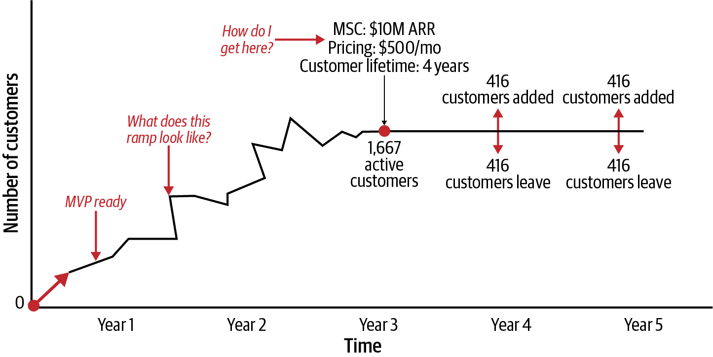

<!-- Page 127 -->

resources—another developer or two would greatly speed things up, and some-
one to handle marketing and sales…”
Mary glances at her watch and says, “I’ve got to be in a meeting in 10 minutes,
so I’ll send you some information on traction roadmaps over email.”
“A traction roadmap? Is that like a product roadmap?” Steve asks.
“Not quite. A traction roadmap helps break your three-year goal into more
intermediate milestones with specific traction goals at each stage, and a time-
line. It addresses one of your questions on how you model the ramp. Once you
see these milestones, you’ll be able to more clearly formulate a rollout plan.”
Mary notices Steve wants to jump in, but she keeps talking. “The first step
in the Continuous Innovation Framework is sketching out a business model
that can possibly work. Since most products initially fumble on customer and
market risks, you need to start there by stress testing your business model for
desirability and viability, which you’ve done. You’re now wondering how to
pull off your business model. This is exactly what the next feasibility stress test
is all about and where traction roadmaps and rollout planning come in. Once
you’ve charted a traction roadmap, shoot me a note.”
Mary glances at her watch again and says, “Shoot, I’m going to be late again!”

<!-- Page 128 -->

<!-- Page 129 -->

C H A P T E R 4
Stress Test Your Idea for Feasibility
Feasibility: Can you build this?
Product roadmaps have traditionally been used for feasibility testing and roll-
out planning. But product roadmaps assume you know what you’ll be building
for the next 18–24 months, which you don’t. This is where traction roadmaps
come in.
TIP
Don’t create a product roadmap. Use a traction roadmap instead.
Unlike a product roadmap, a traction roadmap isn’t output oriented, but out-
come oriented. You already learned about an outcome-oriented metric in the
previous chapter, which fits the bill perfectly: traction. You also know how to
measure it three years into the future with your minimum success criteria.
But while three years is the right time frame for sizing the viability of your
idea, for the reasons covered in the last chapter, it’s still too far out into the
future for determining your idea’s feasibility—i.e., how you’ll pull it off.
You need a way to break your MSC goal into shorter-term milestones. These
intermediate milestones will help you visualize your journey as more managea-
ble stages and chart a stage-based rollout plan. That’s what we’ll cover in this
chapter, which focuses on stress testing feasibility (Figure 4-1).

<!-- Page 130 -->

Figure 4-1. Stress testing feasibility
Charting a Traction Ramp
In the last chapter we saw Steve struggling to figure out how he’d meet
his goal of having roughly 1,600 customers by year 3. How would you sug-
gest he model the first three-year ramp for his product: linearly, nonlinearly,
exponentially?
The ramp can’t be linear because the shortest distance between two points is
a straight line. Growing a product linearly would require already having the
perfect plan to execute. A perfect plan in the world of startups is a myth.
The diffusion of innovations theory discussed in “Estimate the required num-
ber of active customers” in Chapter 3 posits that market share for a new idea
follows an S-curve. The first half of this S-curve is the familiar hockey-stick
trajectory and the right answer to how you should model the first three years
of your product rollout ramp (Figure 4-2). Remember that with your MSC,
your objective is getting a little beyond product/market fit (the inflection point
in the hockey-stick curve).

<!-- Page 131 -->

Figure 4-2. The S-curve and adoption life cycle
NOTE
A hockey-stick trajectory isn’t only for startups. All new product adoptions,
whether at a startup or a large company, follow a similar trajectory, starting with
a flat portion that gets increasingly steeper over time, until it eventually reaches
market saturation or gets disrupted by something else.
Since your MSC goal pegs the number of customers you’ll need at the three-
year mark, you need just one more input assumption in order to model the
ramp to your goal: growth rate.
What’s a good growth rate to use for an early-stage product: 3x/yr, 5x/yr,
10x/yr, or something even higher? When asked to pick a growth rate for their
traction roadmap, a lot of entrepreneurs steer toward a smaller number, but
this isn’t necessarily the best strategy.
Take a look at Figure 4-3, where I chart traction roadmaps using three differ-
ent growth rates.
You may have been surprised to see that using a smaller growth rate actually
requires a higher customer acquisition rate at the beginning than using a larger
growth rate. A 10x model requires half the number of customers at year 2 and
a quarter the number of customers at year 1 than a 5x model!

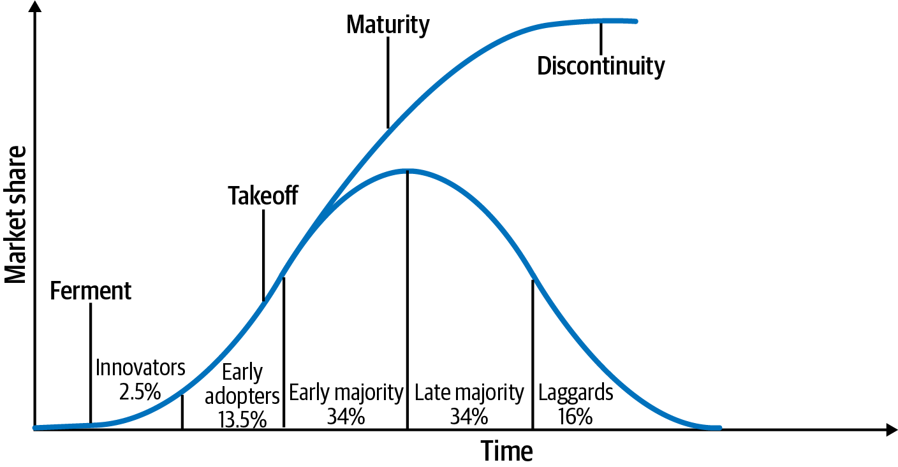

<!-- Page 132 -->

Figure 4-3. Three ways to hit your goal
This is because your three-year endpoint is fixed by your MSC goal and cannot
change. All you are changing with your growth rate assumption is the slope
of your hockey-stick curve. When confronted with this counterintuitive way
of thinking about growth rates, many teams I coach change course and veer
toward using a higher growth rate.
You want to be careful not to go too far the other way, either. I find that
the right starting growth rate should strike a balance between learning and
scalability, and I recommend that you set your starting growth rate to 10x/yr
for the first 3 years.
While using a 10x/yr growth rate may only seem appropriate for hyper-growth
startups, that isn’t true. Remember that every company in the world starts
at the same place—with a single customer. If you plan on growing from 1
customer to at least 100 customers in the first 3 years, you can use a 10x
model:
• Year 1: 1 customer
•
• Year 2: 10 customers
•
• Year 3: 100 customers
•

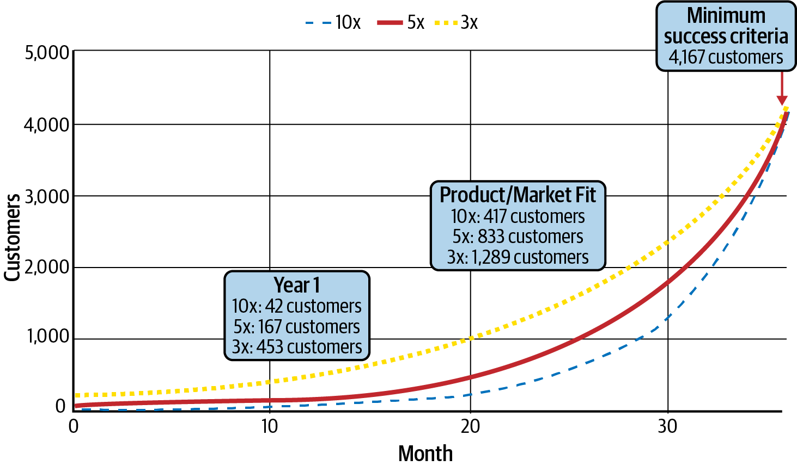

<!-- Page 133 -->

Steve Charts His Traction Roadmap
Steve decides to use the recommended 10x growth rate for his traction road-
map, which results in the chart in Figure 4-4.
Figure 4-4. Steve’s traction roadmap
He’s greatly relieved to see that with a 10x model, he only needs to acquire 17
customers in year 1 versus 500+ customers with his original linear model. But
that relief is short-lived. As he turns his attention to the righthand portion of
the hockey-stick curve, a new worry comes over him.
He pulls out his phone and texts Mary a screenshot of his traction roadmap
with a note below it: “How am I going to acquire 1,500 new customers in year
3? That’s three times the customer acquisition rate I was originally worried
about!”
He gets the following reply from Mary: “You have to walk before you can run.
Focus on the lefthand side of the curve before the right, and use the numbers
on your traction roadmap to formulate a now-next-later rollout plan.”
Steve: “Hmm…okay, but even the year 1 goal, while smaller than what I was
originally thinking, is still a stretch. I’m not sure how I’ll acquire 17 customers
when my product won’t be ready for another 9 months. That’s just 3 months
to get 17 customers.”
Mary: “You’ll just have to find a way to get those customers sooner :)”
Steve: “I don’t know how to do that :(”

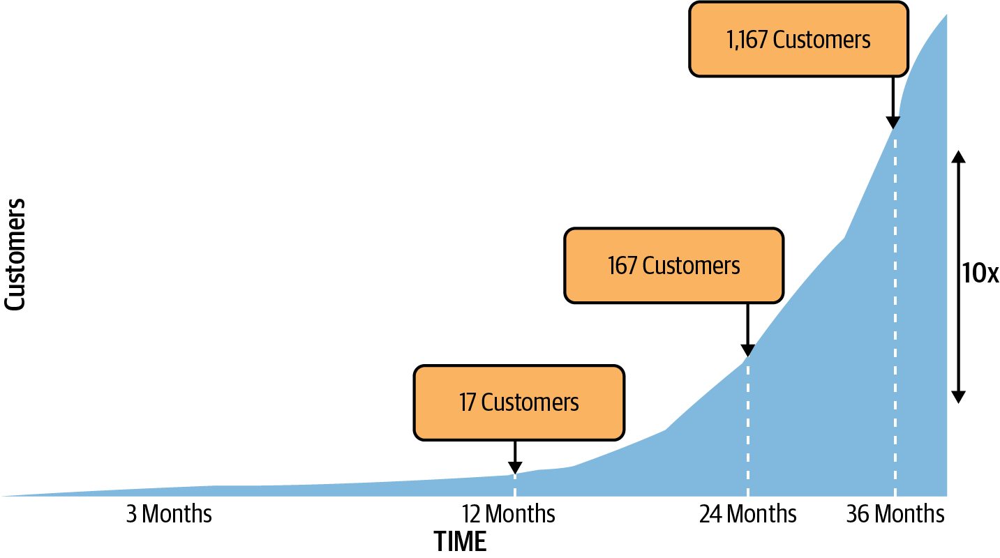

<!-- Page 134 -->

Mary: “Let’s meet for lunch tomorrow to discuss.”
Steve: “I can’t wait.”
Mary: “In the meantime, here’s a thought exercise to work through. Imagine
that you are an aspiring first-time restaurateur looking to open a new restau-
rant. It goes without saying that the food business is risky—most new restau-
rants don’t survive their first year. Also, most restaurateurs, like entrepreneurs,
typically have their solutions figured out. They have the perfect menu, the
silverware and napkins all picked out…all they need is an investor to write
them a big fat check and they’ll be in business. The problem, of course, is that
no one wants to take a chance on a first-time restaurateur because of all the
risks associated with starting a new restaurant. Sound familiar?”
Steve: “lol…very funny.”
Mary: “The key to breaking this catch-22 is prioritizing your starting risks ver-
sus your scaling risks. Your homework is to come up with what’s immediately
riskiest for this restaurateur and to formulate a now-next-later rollout plan.”
Steve: “Okay, I’ll give it a go…”
Mary: “Since we’ll be talking food, maybe we could meet at the new taco place
that just opened around the corner for lunch tomorrow. I heard it’s pretty
amazing.”
Steve: “I love that place…but we’ll need to get there early to beat the lines.
Otherwise, it could easily be a one-hour wait.”
Mary: “11:30 works for me…see you then.”
Formulating a Now-Next-Later Rollout Plan
Many entrepreneurs are understandably in a rush to get to the righthand side
of the hockey-stick curve. They do this by trying to go fast on everything. But
going fast on everything doesn’t necessarily make you go faster. Rather, it’s a
recipe for getting lost faster, because it’s easy to lose focus and fall prey to the
premature optimization trap.
Some examples of premature optimization include:
• Trying to optimize a product for thousands of users at the outset before
•
you have any users
• Hiring a VP of sales before you have any customers
•
• Raising funding before you have traction
•

<!-- Page 135 -->

Premature optimization is one of the top killers of startups because it prioriti-
zes the wrong risks at the wrong time, which depletes your already limited
resources for achieving product/market fit. The way to avoid the premature
optimization trap is by embracing a Continuous Innovation mindset.
MINDSET #4
Right action, right time.
At any given point, there are only a few key actions that stand to have the
biggest impact on your business model. Your job is to focus on those key
actions and ignore the rest. This is the essence of the right action, right time
mindset.
Isn’t there a danger of being too short-sighted? As an entrepreneur, you need
to be able to simultaneously plan for the long term while acting for the short
term. But as the startup journey is inherently shrouded in a fog of uncertainty,
we can often only see what’s immediately in front of us and struggle to make
clear plans too far into the future. That’s okay—this is where the now-next-
later rollout plan comes in.
The idea behind the now-next-later plan is viewing your traction roadmap
using three time horizons that roughly align with the three distinct segments
of the hockey-stick curve: a flat section, followed by an increasingly steeper
section that continues until you hit a noticeable inflection point, where the
curve shoots up. Each of these segments represents a specific stage in the
product life cycle, visualized in Figure 4-5:
1. Problem/solution fit
1.
2. Product/market fit
2.
3. Scale
3.
You use your traction roadmap to determine the traction goal you need to
meet at the end of each of these time horizons. You then attempt to formulate
a plan for each time horizon. As can be expected, your now plan should be the
most concrete, your next plan less so, and your later plan the fuzziest.

<!-- Page 136 -->

Figure 4-5. The three stages in the product life cycle
If you use a 10x growth rate, each stage is roughly one order of magnitude
larger than the previous stage. What’s not obvious is recognizing that these
stages also drive what’s riskiest in your business model. This is a key insight
for formulating a stage-based now-next-later rollout plan—one that prioritizes
your riskiest assumptions systematically.
MINDSET #5
Tackle your riskiest assumptions in stages.
Let’s walk through these three stages, discussing at a high level the objectives,
typical timeline, deliverables, and strategies for navigating each of them.
Stage 1: Now—Problem/Solution Fit
While no one enjoys the flat section of the hockey-stick curve, with the right
mindset you learn to see it as a gift. The first step to practicing the right
action, right time mindset is realizing that you can’t get to the right side of the
hockey-stick curve without first going through the flat section.
TIP
In a product’s earliest stages, you need to decelerate, not accelerate.

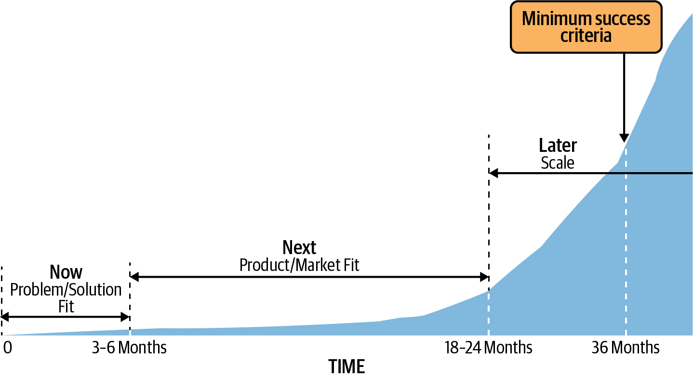

<!-- Page 137 -->

The flat section of the hockey-stick curve is where you uncover the key insights
or secrets that allow you to build something unique and valuable. You do this
by taking the requisite time to deeply understand your customers, uncover real
problems worth solving, and test possible solutions using a Demo-Sell-Build
process.
The counterintuitive insight here is that you don’t need a working product to
acquire paying customers.
The end deliverable of this stage is an evidence-based go or no-go decision to
move forward to the build stage of your idea (stage 2).
By the end of this first stage, you specifically need to:
• Have a clear understanding of your customers’ needs (and wants)
•
• Know the smallest thing you need to build to deliver value to your custom-
•
ers (your MVP)
• Have secured sufficient tangible commitments (e.g., advance payments,
•
letters of intent) from customers
Achieving problem/solution fit typically takes three to six months for most
products. We’ll cover the detailed steps for achieving problem/solution fit in
Chapters 7 through 11.
Stage 2: Next—Product/Market Fit
By the end of stage 1, you should have a clear definition of a product you
know customers will want, rather than just hope they want. You then spend
the next several weeks or months building out the first iteration of your prod-
uct (your MVP) and getting ready for launch. The initial objective is racing
toward demonstrating value delivery—i.e., determining whether you’ve built
something that customers want. You do this by continuously improving your
product using continuous feedback loops with your customers.
The counterintuitive insight here is that you don’t need lots of users to hit
repeatability in your business model.
Driving repeatability in your business model is the key deliverable of this stage.
This is also where you cross the inflection point of the hockey-stick curve
and start setting your sights on accelerating growth, which prepares you for
entering stage 3.
Achieving product/market fit typically takes 18 to 24 months for most prod-
ucts. We’ll cover the detailed steps for achieving product/market fit in Chapters
12 through 14.

<!-- Page 138 -->

Stage 3: Later—Scale
Some level of success is guaranteed after hitting product/market fit. The ques-
tion is how much. In the Scale stage, there is a marked shift in strategy where
your focus changes from getting the product right to pursuing growth. During
this stage, you use several optimization experiments to test many possible
growth strategies and campaigns.
The counterintuitive insight here is that even at this stage, going fast at every-
thing is a recipe for getting lost faster—you need to focus on one engine of
growth at a time.
The goal of this book is to help you navigate the journey from concept to just
beyond product/market fit. I’ll share some high-level guidelines on pursuing
growth and life beyond product/market fit in Chapter 14.
Steve Gets a Lesson on Right Action, Right Time
Mary grabs the last available table at the taco restaurant and signals Steve
over. As he pulls up a chair and sets down his lunch, he lets out a sigh and
comments, “Wow, look at that line. It’s already out the door and snaking
around the corner. And it’s only 11:45. We got here just in time.”
“Yup. Ever since this place got written up and featured on a few lists, it’s been
like that every single day.”
Mary waits for Steve to settle in and then asks, “So how did you do with
the challenge question from yesterday? What do you think are the riskiest
assumptions facing a first-time restaurateur?”
“Well, look at this place,” Steve replies. “Surely, a good product and a good
location are the ticket. As they say in real estate, it’s all about location, loca-
tion, location.”
“Are you sure starting with a good location is a smart idea for a first-time
restaurateur?” asks Mary.
She adds, “Good locations come at premium prices, which means the runway
for making the restaurant a success is a lot shorter and the stakes a lot higher.”
Mary waits for a nod from Steve, then goes on, “Furthermore, a good location
alone doesn’t guarantee success. Surely you’ve been to bad restaurants in great
locations, and vice versa.”
“Are you saying the location isn’t important?”
“Not at all. A good location helps with growth—but that’s a scaling risk, not
a starting risk. At this point in our story, our restaurateur has an unproven

<!-- Page 139 -->

product. So their starting risks should center around value delivery, not growth
acceleration.”
Mary lets that sink in and then continues, “The reason I picked this place,
apart from the amazing tacos, of course, is that while they are growing like
crazy and have a number of prime locations today, that’s not how they started.
Do you know their origin story?”
Steve shakes his head.
“The founder, Jack, started with a food truck on the east side of town, which
as you know is not exactly prime real estate.”
Steve jumps in. “I remember reading about that now. I’m guessing that because
starting with a food truck is a lot cheaper and faster than opening a brick-and-
mortar restaurant, it allowed him to more quickly test his food concept. Was
the food truck the MVP for the restaurant?”
Mary nods her head. “Exactly. The trap too many entrepreneurs fall into is
premature optimization. They imagine their finished product being used by
hundreds or thousands of customers and try to bring that to life. This prioriti-
zes the wrong risks and leads them to work on the wrong actions at the wrong
times. At the earliest stages of an idea, you don’t need lots of users, just a few
good customers—your early adopters.”
“So what would you say was his riskiest assumption when he was starting?
The food?”
“In a manner of speaking, yes, but there’s more to it than just cooking up
a bunch of food and driving around town trying to sell it. The first battle
with any product is getting the attention of customers. You remember the
Innovator’s Gift? Innovation is fundamentally about causing a switch. Come
lunchtime, in this town there are over a hundred lunch options within a three-
mile radius. Why would anyone choose to go to the food truck?”
“Word of mouth?” Steve thinks aloud.
“Word of mouth comes later. You have to first grab the attention of your
first batch of customers (your early adopters) with a unique value proposition.
Once you have their attention, you need to deliver something different and
remarkable. If you manage to do that, then word of mouth kicks in.”
“Sure, that makes sense. But how do you actually get customers to the food
truck? Did the founder invest in a huge branding campaign or already have a
huge social media following?”
“Nope. Let me show you.” Mary takes out her phone, pulls up an early photo
of the food truck, and shows it to Steve.

<!-- Page 140 -->

“Tell me the first thing you notice.”
Steve looks at the photo and sees a huge banner that spans the top half of the
food truck.
“Korean BBQ Tacos?” he answers.
“That’s exactly right. But that isn’t the name or logo or even tagline of the
restaurant—the things we product people love to obsess over. What is it?”
“Their unique value proposition?”
“Bingo. Here in Texas, if you offer great BBQ or great tacos you’ll grab the
attention of foodies—the early adopters, in this case. If you do both well, that’s
even better, but there are already a number of good places doing just that.
But if you add a new twist—Korean BBQ tacos—that’s unique and attention-
grabbing. That’s the kind of different that foodies and influencers want to be
the first to sample, then tell others if it’s good enough.”
Mary pauses to take a sip, then goes on. “So let’s put all the pieces together
here. The biggest risk for a first-time restaurateur starts with attention. It starts
by asking, what’s the unique value proposition of your product? What’s it for
and who’s it for? In this case, the founder decided to target foodies and chose a
food truck because it’s a much cheaper and faster vehicle (literally) for reaching
this audience and testing his concept. That was his now plan, which he put
into action in days, not weeks or months.”
“Did he also come up with a next and a later plan at the same time?”
“Yes, he did. But they were pretty high-level. He had always envisioned open-
ing up multiple restaurants around town as his next plan, and had ambitions
for moving into other cities and building a nationwide brand as part of his
later plan.”
“How long did the founder run the food truck?” Steve asks.
“In his case, not very long. Not unsurprisingly, his original concept wasn’t
the one that took off, but he discovered his winning concept through dozens
of small iterations in the early days of the food truck. He hit on some great
recipes and then word of mouth kicked in. Within four weeks of opening, long
lines started forming even before the food truck opened for lunch service.”
“That quickly?” Steve asks.
“Yup, and it went bonkers after that. He started selling out every single day,
which caught the attention of a few food critics. Once they covered and fea-
tured the food truck, the lines got even longer. He had to figure out a way to
handle all this demand, which led him to put his later plan into effect.”
“Opening another food truck!” Steve jumps in.

<!-- Page 141 -->

“Yup. He opened another food truck very close to the location we’re in. A
food truck was still a cheaper way to get into this market. As you know, rents
here aren’t cheap. That food truck started selling out too, which made for a
killer early traction story that he used to raise money from investors. Within
nine months of starting his original food truck, he had converted both of them
into two brick-and-mortar locations. And I think he has three more locations
coming. The rest, as they say, is history—”
Steve cuts in. “Weren’t his investors worried that Jack wouldn’t be able to scale
the business? After all, running a food truck is quite different from running
multiple brick-and-mortar locations, much less building a nationwide brand.”
“I’m sure they were, but those are exactly the kind of risks that investors
love to get involved with—scaling risks versus starting risks. The initial chal-
lenge for any product is solving for demand. Once you can generate sufficient
demand, the supply side is usually solvable too.”
“By supply side, you mean building a product?”
“Yes, exactly. Another way of putting this is that demand-side risks have to do
with the customer (desirability) and market (viability) risks, while supply-side
risks are typically product (feasibility) risks.”
“Sure, that makes sense,” Steve acknowledges.
“I’m sure Jack had all kinds of scaling risks as he grew his business from two
food trucks to a dozen restaurants, from staffing to training to branding. But
once you have a good core validated product, these are less risky and often
solvable obstacles. Think back to the early days of Facebook, YouTube, and
Twitter. In their journeys from thousands of raving early adopters to hundreds
of millions of users, they all had massive scaling risks that they too managed to
overcome. Remember Twitter’s fail whale?”
Mary notices Steve’s eyes widen.
“Avoid premature optimization,” he says. “This has all been very enlighten-
ing…but I’m still trying to process how to apply this to my product.”
“Whenever you encounter a case study like this one, it’s important to separate
principles from tactics,” Mary explains. “While growing a food business can
be tactically quite different from, say, growing a software business, the under-
lying principles behind the tactics are universal. They can be applied to any
kind of product.”
“Are these principles truly universal, though? I can see how they worked for a
restaurant, but the MVP for food is a few hours of cooking. What do you do
when you’re building products that take months or years to build?”

<!-- Page 142 -->

Mary smiles. “You were always the hardest one on the team to convince. But
you’re right. So let’s take it up a notch and consider a product that does take
years to build—an electric car.”
Mary takes another sip of her drink, then continues. “Tesla. If you were Elon
Musk with a vision of building the first affordable electric car in 2006, how
would you formulate a now-next-later rollout plan?”
Just then Mary’s phone goes off.
“Lunch break is officially over. Take a stab at applying these principles to the
Tesla launch and let’s meet for coffee tomorrow.”
And with that, Mary is out the door.
Steve Learns About Wizard-of-Oz MVPs
“So, how did you do with the Tesla rollout plan?” Mary asks Steve the next
day at their usual coffee hangout.
“I already knew some of the Tesla launch story and was able to put a few
pieces together, I think,” Steve responds.
“Let’s hear it.”
“Okay, here goes. First, I’ll admit that if you had asked me this question
before our conversation yesterday, I would have probably listed technology,
design, manufacturing, charging infrastructure, and branding as the riskiest
assumptions for an upstart car company—especially one led by a founder with
no prior car-building experience. After yesterday’s conversation, however, I
was able to identify all of these risks as supply-side risks, not demand-side
risks. So then I applied the Innovator’s Gift and instead asked: why would
anyone want to switch to an electric car?”
Mary nudges Steve to keep going.
“I’m guessing for some it might have been cheaper energy costs, and for others
it was reducing their carbon footprint.”
“That’s very good, Steve. What Elon Musk certainly had going for him in
2006 were two switching triggers: increasing awareness of climate change and
rising gas prices. These switching triggers had already led to some switching
behavior, from traditional combustion-powered cars to hybrids within certain
subsegments of the car-buying population—his potential early adopters. The
problem with hybrids though is that they still rely, at least partially, on fossil
fuels. Complete independence from fossil fuels, or achieving zero emissions,
was the promise of an affordable electric car.”

<!-- Page 143 -->

“Yeah, I like how you position that as part of a much bigger vision,” says
Steve. “So the first order of business for Tesla was then testing its unique value
proposition, which I’m guessing Elon Musk did by sharing his zero-emissions
vision with enough people to get them excited and make them pay attention.”
“That’s right, but they took it even further. They got people to preorder their
first electric car before it was even built, using a Demo-Sell-Build process,”
adds Mary.
“That’s the part I don’t get. I understand how you can apply Demo-Sell-Build
to a food concept, but a car, especially an electric car that’s relying on tech-
nology yet to be invented, takes years to build. How do you iterate and test
quickly?”
“Ah…But did they build an entire car out of the gate?”
A puzzled look comes over Steve’s face. “Do you mean the roadster?”
“Yes. The first car that Tesla launched, the Tesla Roadster, wasn’t even a car
that they built—at least not entirely. While the Tesla Roadster had the Tesla
emblem on it, the design and chassis were licensed from another car company:
Lotus Motors. Now, why would they do that?”
“To get the car to market sooner?” Steve muses.
“Exactly. Compared to most car companies that take 10 years to launch a new
car from concept to market, Tesla pulled this off in just 2 1/2 years. That’s
moving at light speed in the car industry. What I love about this case study
is that it emphasizes that while speed of learning is key, it’s also relative. You
only need to outlearn your competition to win.”
“I love that,” Steve interjects.
“But speed to market was only part of the story here. Not having to design,
build, and manufacture an entire car allowed them to prioritize testing their
next riskiest assumption and ignore the rest. Can you guess what that was?”
“The electric battery?” Steve asks.
“Yup. Designing, building, and manufacturing a car from scratch, while a lot
of work, wasn’t an insurmountable risk. Lots of car companies already know
how to build production-ready cars. None of them, at the time, knew how
to build production-ready electric cars. That’s what was different and worth
prioritizing.”
Steve jumps in. “So by licensing an existing car and retrofitting their battery
into it, they avoided the bulk of the known work and prioritized the unknown
work. They didn’t need to hire automotive engineers or build a large factory.

<!-- Page 144 -->

They could just focus on building an electric battery, stick that into an existing
car, and sell that. I know I’m simplifying, but that’s genius.”
“Yup—and that was their now plan. By the way, this approach of cobbling
together existing solutions in an MVP is a commonly used validation recipe in
the Continuous Innovation Framework called a ‘Wizard-of-Oz MVP.’ It was
first popularized and codified into a pattern during the early days of the Lean
Startup movement.”
“Wizard-of-Oz? I’m guessing it’s named after the movie?”
“Yes. The essence of this validation pattern is to fake it until you’re ready to
make it. In other words, reduce the scope of your initial MVP by cobbling
together existing solutions, instead of building everything from scratch.”
“How do you ensure defensibility if you’re cobbling together existing solu-
tions?” Steve asks.
Mary responds, “Remember that the goal is still delivering on a unique value
proposition. That unique value may come from a novel approach to assem-
bling existing solutions where the whole is greater than the sum of its parts,
or it may come from a novel component to the assembled solution that you
provide. In the case of Tesla, it was the latter. They electrified an existing
car with their unique battery technology, thereby delivering a new UVP that
customers wanted.”
Mary notices Steve staring into space, and stops talking to get his attention.
“Sorry. My mind is racing. I think I might be able to apply the Wizard-of-Oz
MVP pattern to speed up my product launch. I’ll have to think more about
that…I’m still not clear on how Tesla managed to balance customer demand
against its technical risks, though. I mean, they were taking preorders for
a car that was going to be relying on technology that was still being inven-
ted. Wasn’t there a huge risk that they would get overwhelmed by customer
demand and make promises that they couldn’t deliver on?”
“Yes, there certainly was that risk, which they managed using a stage-based
now-next-later rollout plan.”
Mary sees a confused look come over Steve’s face, so she elaborates further.
“Elon Musk promised the world an affordable electric car in 2006, but the
first car Tesla launched, the Roadster, was the opposite of that, with a starting
price of over a hundred thousand dollars. Theoretically, they could have retro-
fitted their battery into any car. Why did they pick a really expensive sports
car and not something more affordable like a Kia, a Volkswagen, or a Ford
Mustang?”

<!-- Page 145 -->

“Hmmm…I want to say they were going for premium branding or profits
maybe, but I’m guessing there’s more to it than that?”
Mary smiles. “There sure is…this was all part of a carefully orchestrated
three-stage rollout plan that played out over three different car models—all
designed to prioritize tackling the right risks at the right time. Elon Musk
vaguely described this rollout plan as his ‘secret master plan’ in a blog post
in 2006. He further explained his master plan during the keynote launch of
the Model 3. You can still find a replay of this keynote online. If I remember
correctly, he covers the rollout plan around the three-minute mark.”
Steve makes a note to catch the replay while Mary presses on.
“Yes, the biggest risk for the first car was electrification. And licensing an
existing car rather than building a new car was the first key component to their
stage 1 or now plan,” she explains. “The next key component of the plan was
picking the right car. Why the two-seater Lotus Elise roadster, and not some
other car? What happens to a product’s demand when you set the starting
price three times higher?”
“It goes down?” Steve answers.
“Exactly. By launching their first car using a premium sports car brand, they
were creating a highly desirable car that everyone could see and want, but only
a few could afford and get.”
“So they were never aiming to enter the mainstream market with the first car?”
Steve asks.
“Nope. Remember the diffusion of innovations bell curve. They were solely
focused on targeting the early adopter market, and in this case they used
premium pricing very effectively to play the hockey stick. The roadster was a
high-price, low-volume car. They only sold 500 cars a year for a few years and
then stopped production.”
“So this was a learning MVP then?” Steve asks.
“That’s right, Steve. Stage 1 was all about testing their MVP—in this case,
their battery in a shell of a sports car.”
“I see it now. Chances are high that someone who can afford to place an order
for a seven-figure car already has multiple cars in their garage and wouldn’t be
relying on this car as their primary vehicle. They’d be willing to wait up to two
years for delivery and would drive the car very differently than a mainstream
customer.”
“That’s exactly right. Having fewer customers also meant they didn’t need
to be distracted by building scalable infrastructure—dealerships, charging sta-
tions, or service centers. They ‘concierged’ those aspects of value delivery.”

<!-- Page 146 -->

“And I’m guessing that once they de-risked the battery sufficiently, they leveled
up to stage 2 and took on the luxury sedan market with their Model S?”
“Yes. This was a less high-priced, mid-volume car that they still rolled out
incrementally with preorders. While they were rolling out the Model S, they
took new sets of risks like manufacturing their own cars, and building charg-
ing stations, retail stores, and other infrastructure.”
“And I’m guessing the Model 3 was their stage 3—the affordable electric car
for the mainstream market,” Steve adds.
“You got it. By the time they announced the Model 3, a lot of the infrastruc-
ture to handle the mainstream market was in place. More importantly, they’d
sufficiently de-risked the idea of electric cars for the mainstream to literally buy
in. The Model 3 car launch was the biggest product launch, securing 250,000
preorders within a span of 2 weeks.”
“Yeah, I remember reading about that launch. So by intentionally going slower
at the beginning, they were able to cross the chasm and go much faster later.
Now I get what you meant by playing the hockey stick. Did these stages follow
a 10x traction model as well?”
“Yes. Elon Musk is known to be an exponential or 10x thinker, and these
rollouts were textbook 10x. You can probably still find a few charts float-
ing around online that depict Tesla’s traction roadmap forecasts for selling
500,000 vehicles across this 3-car rollout over 10 years.”
“10 years? That’s a much longer time horizon than the three years I’ve been
using.”
“Sure. When building cars or rocket ships to Mars, one does need to adjust
timelines. There’s nothing wrong with having a big vision that could take 10
years to realize. Your metaverse vision is no different. But remember that in
order to make your vision actionable, you need to break the journey into
smaller time horizons. Don’t forget that Tesla was still able to take preorders
for their car just weeks after announcing it. No matter the type of product,
you should aim to achieve problem/solution fit within the recommended three-
month time box because you’re not yet building out the product at this stage.”
“Got it. And even during the build stage, Tesla took a huge shortcut with their
Wizard-of-Oz approach,” Steve adds.
“That’s right, with discipline and a little creativity you can almost always
reduce the scope on your initial MVP. I’m sure we’ll have lots more to discuss
there when the time comes.”
“That makes sense. Though, I’m still unclear about how you extrapolate
the traction roadmap for problem/solution fit from year 1 to three months—

<!-- Page 147 -->

especially if you aren’t going to be ready with a product to sell by then. Do you
always have to take preorders?”
“That’s a great question, Steve. The goal is getting as close to making a
customer as possible, and taking advance payment with a preorder is about
as close as you’re going to get at the problem/solution fit stage. That said,
not all products and customer relationships are conducive to preordering. In
those cases, it’s perfectly okay to use an earlier ‘customer making’ step in your
customer factory, like starting pilots or trials ,or collecting leads.”
“Of course, the customer factory…that makes total sense. I’m guessing that I
would use my customer conversion rate estimates from my Fermi estimate to
determine those?” Steve asks.
Mary nods. “You got it.”
“Neat. I know our time’s up. This was a pretty inspiring case study and my
head’s still spinning a little. I’m going to work on my now-next-later plan this
afternoon at the office.”
Mary smiles. “My pleasure, Steve. Keep me posted.”
Steve Formulates His Now-Next-Later Rollout Plan
Back at the office, Steve is ready to think through his now-next-later plan.
His first order of business is extrapolating his year 1 throughput goal of 17
customers down to 3 months in order to determine his problem/solution fit
success criteria.
He pulls out his original Fermi estimate inputs and gets to work:
• Minimum success criteria: $10m ARR in 3 years
•
• Pricing model: $500/mo
•
• Customer lifetime: 4 years
•
• Customer acquisition conversion rate: 1%
•
— User acquisition conversion rate (trials): 10%
—
— Trial to paid conversion rate (upgrades): 10%
—
• Referrals: 20%
•
To keep the math simple, he assumes that the year 1 ramp, being largely flat, is
okay to model linearly. He then uses the conversion rate assumptions from his
estimate to translate those into the graph in Figure 4-6.

<!-- Page 148 -->

Figure 4-6. Steve’s problem/solution fit success criteria
He thinks through his options. By the three-month point, he will need to be
either:
• Closing two paying customers per month (rounding up)
•
• Starting 20 trials per month
•
• Collecting 200 leads per month
•
Since he was already leaning toward using a subscription model for his prod-
uct with a 30-day trial, he decides to use the trials metric as his problem/solu-
tion fit criterion. This means he will need to get 20 software companies to start
a 30-day trial for his product with $500/mo pricing and continue to sign up 20
new software companies every month thereafter for the first year in order to
hit his year 1 goal.
To pull this off he’ll need to really scope down his MVP, but he’s optimistic
after learning about the Wizard-of-Oz MVP pattern. Steve believes he can
go a lot faster and build something unique and valuable by starting with a
plug-in solution to an already popular platform used by thousands of software
companies, instead of trying to build an entire platform by himself. This will
be his stage 1 (now) plan.
Like Tesla, he’ll eventually expand on his UVP and lead people to his own
platform (stage 2). His big metaverse vision will play out in stage 3. He catches
himself daydreaming about stage 3 and stops himself.

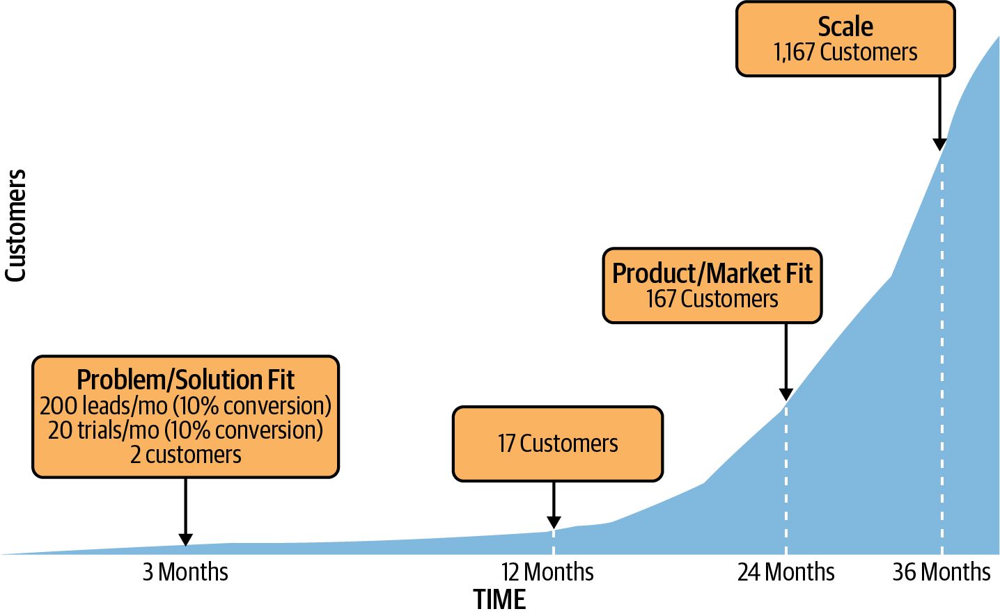

<!-- Page 149 -->

He outlines his now-next-later plan in an email and fires it off to Mary. A
couple of hours later, he gets a text message from her.
Mary: “Nice work on the traction roadmap and now-next-later plan. I suggest
sharing your business model design with a few advisors and friendly investors
for feedback.”
Steve: “Isn’t it too early?”
Mary: “No, it isn’t. Notice I said for feedback, and not to raise funds. The
challenge most early-stage founders face is communicating their idea clearly
and concisely to others. Framing your initial conversation around feedback is a
great way to practice, form relationships, and evolve toward a killer pitch.”
Steve: “My last round of pitching didn’t go too well. We just went around in
circles. I got defensive a few times and it felt like a waste of time for everyone.”
Mary: “Don’t beat yourself up. A lot of founders struggle with getting others
to see what they see at the outset. You have a much clearer story now, and the
best way to refine your model even further is to start sharing it with others.”
Steve: “Do you have some tips for how to structure these early conversations?”
Mary: “Yes I do :) Look for an email on communicating your idea clearly and
concisely.”

<!-- Page 150 -->

<!-- Page 151 -->

C H A P T E R 5
Communicate Your Idea
Clearly and Concisely
The number one reason why startups fail is that they build something nobody
wants. The number two reason why products fail is not getting the right buy-in
from key stakeholders.
NOTE
Your key stakeholders include your founding team members, early customers,
advisors, and investors.
If you’re incubating your idea in a large company, you’re probably going to
be asked to write a 60-page business plan with a 5-year financial forecast and
an 18-month product roadmap. For new, innovative ideas, these things are
simply unknowable at the outset. As a result, these ideas seldom get past the
gatekeepers.
If you’re a startup (or part of an innovation team with a mandate to innovate),
getting started is a bit easier. You may sketch your Lean Canvas, formulate
your MSC, identify the problem and customer segments…but then you get
stuck shortly thereafter when trying to secure additional resources to grow
your product and team. You need to pitch your idea in order to get others to
see what you see, to buy into your worldview, join your mission, and invest
their time, money, and/or effort.
We saw how Steve struggled to get others to see what he saw with his idea.
He wasn’t able to convince others (investors or cofounders) to get behind
his vision, which led to a classic catch-22. Even if you’re bootstrapping your

<!-- Page 152 -->

project and not seeking investors, you’ll eventually need additional resources
like cofounders, equipment, etc. to grow an idea.
Pitching is a key skill all entrepreneurs need to learn. You don’t just pitch for
investment. You pitch to acquire customers, cofounders, and advisors. In this
chapter you’ll learn how to communicate your idea clearly and concisely to
others to obtain feedback and buy-in (Figure 5-1).
Figure 5-1. The business model pitch
What’s Your Elevator Pitch?
An elevator pitch is meant to be a quick overview of your idea that you can
present in the event that you find yourself in an elevator with a potential
investor or customer and have just 30 seconds to pitch them. It’s often the first
type of pitch most entrepreneurs create, and it’s what we’ll start with as well.
The problem, however, with most elevator pitches is that they sound like this:
We build a blockchain-driven logistics engine that is powered by machine
learning and artificial intelligence that helps shippers maximize their
bottom-line revenue.
They are often a barrage of buzzwords that leave you flummoxed as to what
the company really does. At the other end of the spectrum are pitches that
sound like this:

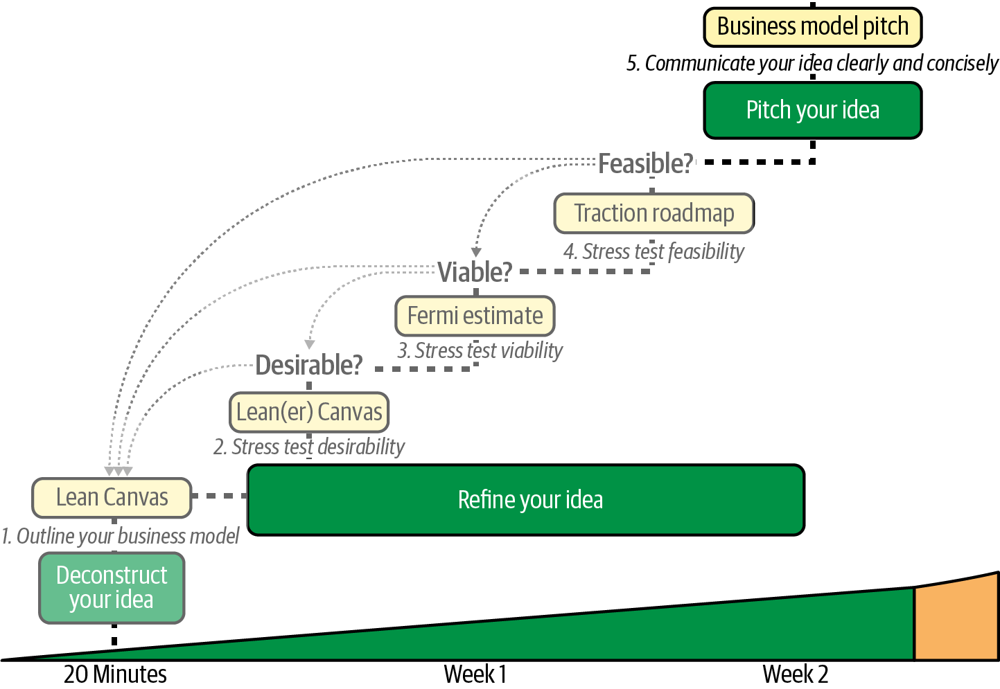

<!-- Page 153 -->

We build lightsabers.
We train Jedis.
We help Jedis fight the evil empire.
While these elevator pitches don’t drown you in buzzword bingo, they still
typically fall flat. Why? Because they assume too much and are too solution-
centric. The mistake many entrepreneurs make is trying to explain their solu-
tion by cramming it into a 30-second pitch. That’s not the job of an elevator
pitch. The job of an elevator pitch is to pique interest—and, if you’re success-
ful, to prompt the other person to ask for more (rather than making an excuse
to leave).
The way you pique interest isn’t by leading with your solution, but your
desirability story (from Chapter 2), which shows why your product needs to
exist.
In the next section, I’ll share a template for crafting an elevator pitch based on
that story.
Outlining Your Elevator Pitch
Use the following template to outline your elevator pitch as a story about your
customers:
When [customers] encounter a [triggering event],
they need to do [job-to-be-done] in order to achieve [desired outcome].
They would normally use [existing alternatives],
but because of [switching trigger] these [existing alternatives] no longer
work because of [these problems]. If these problems are left unaddressed,
then [what’s at stake].
So we built a solution that helps [customers]
achieve [desired outcome] by helping them [unique value proposition].
Here’s an example of an elevator pitch from one of my own products:
When entrepreneurs get hit with a killer idea,
they often need to raise money in order to get their idea off the ground.
They would normally write a 40-page business plan,
but because of the recent explosion in the number of startups all over the
world (global entrepreneurial renaissance), no one reads business plans any-
more. We are living at a time where there are far too many ideas competing
for attention. Investors today don’t fund or read business plans and instead
look for startups with traction. If a startup fails to grab the attention of

<!-- Page 154 -->

investors, they don’t get the necessary resources to grow their idea, and it
withers away.
So we built a solution that helps entrepreneurs
communicate their idea clearly and concisely in under 20 minutes and get
buy-in from key stakeholders—so they can spend more time building versus
planning their business.
Notice that nowhere in this pitch do I name the product: the Lean Canvas.
Elevator pitches, when delivered well, set the stage for a longer pitch to follow.
What you say next largely depends on the worldview of your audience.
The Different Worldviews of an Idea
In his groundbreaking book All Marketers Tell Stories (Portfolio), author Seth
Godin defines a worldview as the set of rules, values, beliefs, and biases people
bring to a situation. Good marketing is not about changing a person’s world-
view, but rather framing your story in terms of their preexisting worldview.
The same is true in entrepreneurship: all entrepreneurs tell business model
stories, and good pitching is not about brute-forcing your solution onto others,
but rather framing your business model/product story in terms of your audien-
ce’s preexisting worldview. Your audience, in this case, comprises investors,
customers, and advisors.
The first step to developing an effective pitch is understanding your audiences’
respective worldviews.
The Investor Worldview
Investors don’t care about your solution, but they do care about a business
model story that promises them a return on their investment within a set time
frame. Investors looking to invest their bags of money typically have many
existing alternatives (other startups, the stock market, cryptocurrencies, etc.).
Why should they pick your business model?
This is what they really want to know:
• How big is the market opportunity? They don’t care who your customers
•
are, but how many there are—your market size.
• How will you make money? They want to understand the intersection
•
of your cost structure and revenue streams — your profitability or growth
potential.

<!-- Page 155 -->

• How will you deter competition? They want to know how you will defend
•
against copycats and competition who will inevitably enter the market if
you are successful — your unfair advantage.
But what gets an investor’s attention above everything else, as we’ve discussed
in earlier chapters, is traction. If you walk into an investor’s office with the
beginnings of a hockey-stick curve, you’ll trigger a Pavlovian response — they’ll
sit you down and try to understand the rest of your business model story.
These are the parts of your Lean Canvas that you will want to focus on when
pitching to someone with the investor worldview (Figure 5-2).
Figure 5-2. The investor worldview

<!-- Page 156 -->

In lieu of actual traction, a traction roadmap with a now-next-later plan is
your next best proxy for defining, measuring, and communicating a business
model story to an investor.
The Customer Worldview
Customers don’t care about your solution either; as we’ve seen, what interests
them are the problems (or obstacles) that keep them from achieving a desired
outcome or getting a job done. Like an investor, when a customer wants to get
a specific job done, they typically have many existing alternatives. Why should
they pick your product?
As we discussed in Chapter 3, getting a customer’s attention is the first battle.
That’s the job of your unique value proposition. If the promise of your UVP
connects with a customer, then you have permission to tell that customer more
about your solution — typically through a demo.
A demo is a carefully scripted narrative that helps the customer visualize
how they will go from point A (riddled with problems) to point B (problems
removed by your solution). If you deliver a compelling demo, the only thing
left to address is what you want in return — the currency exchange captured
under Revenue Streams. In a direct business model this may be a direct money
exchange, but in multisided models it could instead be a derivative currency
(like attention) that is then converted to money through a secondary transac-
tion (with advertisers).
Figure 5-3 shows the parts of the canvas to focus on when crafting a pitch to
customers.

<!-- Page 157 -->

Figure 5-3. The customer worldview
The Advisor Worldview
We all need people other than ourselves to guide us, call out our BS, and hold
us externally accountable — aka advisors.
Advisors, too, bring a unique worldview to the conversation, but in their case
it’s driven by their unique past experiences and interests. That is why it is
important to surround yourself with complementary advisors, and to be as
open and honest with them as possible.
When you simply practice “success theater” with your advisors (where you
only share good news), you may get a pat on the back, but you miss out
on a huge opportunity for learning. Communicating effectively with advisors
requires using a learning frame, not a pitching frame.
So where do you start? You’ll eventually need two types of pitches:
• One to address the investor worldview
•
• Another to address the customer worldview
•
Since investors care about traction above everything else and traction comes
from customers, it follows that you should prioritize your customer pitch

<!-- Page 158 -->

before your investor pitch. But neither of these pitches is where you should
start. The best place to start is with a path catering to the advisor worldview.
Initially using a learning frame rather than a pitching frame will enable you
to approach anyone (potential investors, early adopters, and actual advisors),
share your business model with them, and get feedback. A learning frame
disarms the other person and lowers the stakes, which allows you to learn,
gauge interest, build trust, and iteratively evolve your pitch.
Delivering Your Business Model Pitch
Pitching, like any skill, improves with practice. In this section, I’ll share some
guidelines for delivering your initial business model story pitches using a learn-
ing, not pitching frame:
Choose your targets
Target anyone that fits the loose definition of an “advisor.” These could be
potential cofounders, peer entrepreneurs, friendly domain experts, poten-
tial early-stage investors, and startup coaches/mentors. Notice I didn’t
include customers in this list. Customers don’t care about your entire
business model; they only care about the subset that pertains to them. I’ll
provide a separate script for pitching to customers in Chapter 10.
Ask for sufficient time
I would suggest asking for 30 minutes to walk through your pitch and
feedback.
Use a combination of slides and handouts
Your Lean Canvas and traction roadmap make for perfect handouts to
avoid interruption while leading your audience through a 10-page slide
deck. A template for the slide deck is provided in the next section.
Use a 20/80 rule
Spend 20% of the time (5 minutes) delivering your pitch, and the remain-
ing time soliciting feedback.
Walk your audience through your business model pitch in five minutes.
The goal of the pitch isn’t to dive deep, but to provide a clear and concise
description of your business model.
Then listen. After your five-minute overview is done, ask for feedback and
listen. See if the audience was able to understand your business model.
If they got confused by any points and ask for clarification, address their
questions and make notes to improve those parts of your pitch.

<!-- Page 159 -->

Be wary of the Advisor Paradox
Ask 10 people for advice, and you could get 10 very different prescriptions
that are in conflict with each other. I see this all the time at accelerators.
Your job isn’t to follow all the advice you’re given, but rather to internal-
ize, synthesize, and apply it.
NOTE
Give anyone a soapbox, and they become a critic.
If you do find someone giving you overly prescriptive solutions, try to
determine the underlying chain of beliefs behind the advice. Is it based on
a leap of faith, anecdotal evidence, or deep learning?
Recruit good advisors
A good coach/mentor should be focused on asking the right questions,
rather than trying to give you the right solutions. If you find one, try to
keep them. Entrepreneurship is a journey best taken with others.
The 10-Slide Business Model Pitch Deck
The slide deck template I provide here follows the same order used when stress
testing your models: you want to focus on your idea’s desirability, viability,
and feasibility, in that order. The following sections discuss what to address on
each slide.
Desirability
The opening slides should address the following topics:
Slide 1: Why now (switching trigger)
What has changed in the world that makes this the right time for your
idea? This is often a well-known macro shift or global trend, such as
climate change, the invention of the internet, or a sweeping pandemic that
disrupts and potentially breaks old ways of getting the job done.
Slide 2: What’s at stake (market opportunity)
If things are left the way they are (doing nothing), what’s at stake? An
opportunity can be framed in terms of either a pain (crisis/loss) or a gain
(aspiration/win).
Slide 3: What’s broken (the problem)
This is where you introduce the existing alternatives and outline why they
aren’t fit to adapt to this triggering event. Your job here is to break the
existing alternatives as viable solutions.

<!-- Page 160 -->

Slide 4: The fix (your solution)
You now introduce your innovative idea and describe how you address the
problem differently (your solution) and help your customers achieve their
desired outcomes (your UVP).
Viability
The next set of slides should provide information on:
Slide 5: Your moat (unfair advantage)
Once investors are able to contextualize your solution and understand
your unique value proposition, they’ll want to know how you’ll defend
against copycats and competition. This is where you:
• State your unfair advantage if you already have one.
•
• State your unfair advantage story if you are working toward one.
•
• Come clean and declare that you don’t have an unfair advantage but
•
are searching for one.
Slide 6: How you make money (revenue stream)
Next, explain how your business model works. You do this by describing
who your customers are (if you have multiple actors in your business
model) and how monetizable value is captured (revenue streams).
Slide 7: Your key milestones (key metrics)
This is where you demonstrate how you’ll gain traction. Use your traction
roadmap to identify your three-year MSC goal and highlight your key
milestones along the way.
Feasibility
The topics to address in the final set of slides are:
Slide 8: Your current progress (rollout plan)
Position your current progress on your traction roadmap and walk
through your now-next-later rollout plan. If you’re just starting out, you’re
at the starting line of your traction roadmap.
Slide 9: How you’re going to pull it off (the team)
This is a good place to share your origin story and introduce your found-
ing team, if you have assembled one. If you don’t yet have a team, iden-
tify the key skill sets you’ll need in your founding team to pull off your
product.

<!-- Page 161 -->

Slide 10: Your call-to-action (the ask)
What you put here is largely dependent on who you’re pitching and your
goal. If you’re seeking advice, ask for feedback. If you’re seeking buy-in,
be clear on what you need next.
Steve Shares His Business Model Pitch with Others
“It was like night and day.” Steve is updating Mary on how his round of
business model story pitches went.
“I reached out to several of the same people I spoke to last year about either
joining me in my startup or investing. I did what you suggested and framed the
conversation around using a learning versus pitching frame. I also included my
rough elevator pitch in the email.”
“And?” Mary asks.
“Well, I got quick responses from everyone and got to speak with all of them.
Unlike the last time, my pitch was met with nodding heads instead of blank
looks. I believe there were two things that made all the difference. The first
was sending them my elevator pitch in advance. The last time I was pitching
a technology platform and I think people struggled to see who it was for.
We went around in circles brainstorming possible customer segments and use
cases. This time they came to the meeting already clear on context and were
eager to dive in.“
“That’s great to hear. And what was the second thing?” Mary asks.
“The second thing was the combination of the traction roadmap and the
now-next-later plan. The last time I was pitching the big vision (or my stage
3) without a clear roadmap for how I’d get there. I can see how people were
unable to connect the dots. Frankly, I’ve never been this clear on the dots
myself!” Steve laughs.
“Awesome. So where did you leave things at the end of these conversations?”
“That’s the best part. Two of the people I spoke with were angel investors
who passed on investing last year and asked me to reach out when I was
further along. This time they both promised to invest provided I reach my
problem/solution fit success criteria.”
“Wow, that’s great news Steve. I’m not surprised. Angel investors love stage-
based investing, and the traction roadmap is the perfect tool for quantifying
these stages. We can talk about how to evolve a business model story pitch
into an investor pitch down the road.”
“Cool. The other thing that happened is Lisa and Josh from our last startup
are both interested in joining the team as cofounders.”

<!-- Page 162 -->

“That’s awesome. The last I heard was that Josh was taking some time off
after the acquisition, and I think Lisa took a senior marketing position at a
large company.”
“Yeah, I tried recruiting them as cofounders last year, but they weren’t interes-
ted. This time I think I got through. Josh, as you know, is an amazing UX
designer, and he already shared some ideas in our meeting that I can’t wait
to implement. And Lisa was always a natural at sales and marketing. Both
of these areas are my Achilles’ heel. They both want to discuss a part-time
arrangement to start, and make the jump at the appropriate time.”
“These are all great developments, Steve. I’m particularly excited about Lisa
and Josh potentially joining your founding team. They are both A players and
will complement your skill set perfectly. This is also perfect timing as you’re
ready to transition from business model design to business model validation.”
“I’m excited too. While I’ve gotten used to working as a solo founder, I can’t
wait to step things up into higher gear. We’ve already started discussing all the
areas that need attention, and with three people on the team, we can split up
the work and get a lot more done.”
“Hmmm…all that sounds good in theory, but the reality is that you’ll actually
get more done if you work on fewer things as a team versus more things
separately.”
A confused look comes over Steve’s face. “I’m not sure I understand what you
mean.”
“In an early-stage startup especially, a divide-and-conquer approach spreads
an already resource-constrained team even thinner,” Mary explains. “Instead
of chasing three separate problems individually, you’ll be much more effective
prioritizing your #1 problem and tackling it as a team.”
“That makes sense. But aren’t there hundreds of problems to tackle in a
startup? How do we identify our #1 problem?” Steve asks.
“By applying systems thinking,” Mary explains. “Your business model is a
system. And in any system, there is always a single constraint or weakest
link holding back throughput. Trying to optimize all the steps is wasteful, as
overall throughput will always be held back by the slowest step. If you want to
increase throughput, you only need to fix the slowest step, and then search for
the next-slowest step.”
“Hey, isn’t that Goldratt’s Theory of Constraints?” wonders Steve.
“Yes, it is. And it’s just as applicable to the customer factory. At any given
point in time, increasing throughput (or traction) is the goal. Your job is to
find the limiting step, or constraint, in the customer factory and fix that. While

<!-- Page 163 -->

it’s often easy to spot the constraint with metrics, knowing how to break it
isn’t. This is where leveraging the full potential of your team comes in. There
will, of course, be other things to tend to, but strive to allocate 80% of your
resources to tackling your limiting constraint at all times.”
“If I remember my systems theory, don’t these constraints move around over
time?” asks Steve.
Mary laughs. “Yes, unpredictably so. Once you get enough people signing up
for your product, it’s impossible to predict where the next constraint will pop
up without metrics and analytics. Imagine trying to find the slowest step on a
factory floor without any data.”
“Sure, that’s what I thought you were going to say. How often should we
reevaluate our constraints?” Steve asks.
“Since every system has delays, you should ideally monitor your metrics
weekly—but allow sufficient time for your customer factory to settle before
making any big business model decisions. The Continuous Innovation Frame-
work suggests using 90-day cycles for making these kinds of big business
model decisions—90 days is long enough to achieve a significant enough trac-
tion goal but still short enough to course-correct along the way.”
“I’ve been working on this project for 18 months already and it feels like a
blink of an eye. I’m sure three months goes by fast.”
“It certainly does, especially since you further break down each 90-day cycle
into six 2-week sprints.”
“Sprints? Like Scrum/Agile?” Steve asks.
“Yes, but more like Agile++,” replies Mary. “Remember that in the Continuous
Innovation Framework, the business model is the product. So each sprint
doesn’t use build velocity as the measure of progress, but traction velocity.”
“Interesting…You know what I’m about to ask next, don’t you?”
Mary smiles. “Yes, I think I do. You’ll get an email from me later today with
all the details on running 90-day cycles.”
“Thank you, Mary!”

<!-- Page 164 -->

<!-- Page 165 -->

PART II
VALIDATION
It was a cold January morning in 2012, almost four months after we’d
launched Lean Canvas as an online tool. I was reviewing our weekly product
metrics, coffee in hand, as I always do on Monday mornings.
There it was again.
I had been tracking a disturbing trend for the four weeks in a row—our
activation rate had been progressively dropping.
We define activation as a user completing their initial Lean Canvas. This is a
critical milestone metric because it serves as a leading indicator for ongoing
engagement. Users that complete their Lean Canvas during their first week
usually come back and explore more of the product. Those that don’t almost
never come back.
Today, our activation rate was hovering at just under 35%—down from a
peak of 80% right after launch. That meant for every 100 people that signed
up, 65 of them would likely never come back!
What was even more concerning was that we had been aware of this issue for
weeks, and we hadn’t been sitting idle. During the last four weeks, I had asked
my designer to implement several usability enhancements addressing steps in
the activation flow where we saw the biggest drop-offs.

<!-- Page 166 -->

But none of them seemed to be making a difference. And things were still
getting worse. No matter what we did, we seemed unable to pierce a certain
ceiling of achievement (Figure II-1).
Figure II-1. The typical life cycle of an experiment
It felt like a scene from the movie Groundhog Day, where the protagonist,
played by Bill Murray, is forced to relive the same day until he makes a
breakthrough revelation about himself.
The rest of the team was busy growing other aspects of the product. We had
decided to each focus on a specific area:
• I was primarily focused on driving new user sign-ups through content and
•
workshops.
• The other developers were building out a few other tools to complement
•
Lean Canvas.
• Our designer had lots of other stuff on his plate supporting both of these
•
initiatives.
At that moment, I realized that this divide-and-conquer approach wasn’t work-
ing. It was certainly keeping us busy, but we were spread too thin and not all
focused on the right thing—fixing activation.
It was time to take a completely different approach.
Focus on Your Weakest Link
I called a team meeting and made a case for the entire team to focus on the
activation issue, because it was the bottleneck (key constraint) in the business
model (Figure II-2). Focusing too much attention on other areas was not
productive, because:

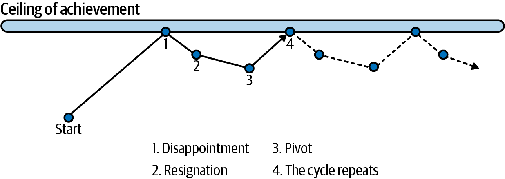

<!-- Page 167 -->

• Even if we managed to sign up more users, we would end up losing 65%
•
of them after the first week.
• Even if we built more tools, 65% of our users would never get to them.
•
We needed to address activation first.
Figure II-2. Addressing your weakest link is the only thing that matters
The team saw the logic of my argument, but asked how to prioritize other
initiatives. We couldn’t drop the ball on everything else, so we agreed to
implement a new policy: we would focus 80% of our attention on breaking the
key constraint(s) and 20% on all other work.
Avoid the Curse of Specialization
The discussion then turned to possible solutions, and a surprising thing
happened:
• My developers started proposing build solutions.
•
• My designer started proposing more design solutions.
•
• The marketer on the team wanted to do more marketing.
•
This is the curse of specialization—a variant of our old enemy, the Innovator’s
Bias.
NOTE
When you’re good at using a hammer, everything looks like a nail.
We were going around in circles. So I called the meeting short and suggested
that instead of group brainstorming, we should all go away for a few days and
each independently formulate a proposal for breaking this constraint.

<!-- Page 168 -->

Identify Problems
Before everyone left, I emphasized that we were a small team and could only
pick one or two campaigns to focus on at a time. I proposed that we would
vote to select the most promising proposals.
In order for a campaign to get selected, it wouldn’t just have to pass the
solution feasibility test; more importantly, it would have to make a strong
evidence-based case for the problem(s) the proposed solution would address.
We agreed to reconvene at the end of the week.
Generate a Diverse Set of Possible Solutions
Up until now, I had been the only one generating possible solutions for this
issue and they clearly hadn’t worked. I knew we needed to come up with
a broader range of ideas, which is why I’d called the meeting—but group
brainstorming wasn’t the answer. Group brainstorming quickly devolves into
groupthink or gets hijacked by HiPPOs.
NOTE
HiPPO: Highest paid person’s opinion.
I was the HiPPO in the room, and while I had several more ideas of my own, I
decided to keep them to myself and put them to the vote like everyone else.
The way to flip specialization from being a curse to being a blessing is by
fostering a diversity of ideas by using a converge-diverge process (Figure II-3).
In this technique, meetings are used only for alignment and decisions—not
free-form discussion or group brainstorming.
So everyone went away to research and sketch out some possible proposals.

<!-- Page 169 -->

Figure II-3. The converge-diverge process
Make Bets on Your Most Promising Proposals
We met again at the end of the week, by which time the team had generated a
dozen proposals.
Unlike before, instead of just pitching their solution, everyone was required
to first provide supporting evidence for the problem they had uncovered, and
then demonstrate how their solution fit.
The review process was efficient, swift, and unanimous: we all picked the
“Blank Canvas Proposal” submitted by our designer.
He had spent the last few days conducting quick usability tests with new users,
and after just seven tests, he noticed that almost everyone hesitated when
filling out the Lean Canvas boxes. Most of them asked if there was some kind
of guide or example canvas they could reference.
Sure, more testing would be needed, but this was a key insight that allowed us
to postulate the following theory:
The reason our activation rate had been much higher immediately after
launch was that those users were early adopters. They were already familiar
with the Lean Canvas, through my blog, workshops, and/or book (Running
Lean). They didn’t need additional help to fill out a Lean Canvas. But over
time, our user base had been broadening, and this new segment of users
didn’t have this prior knowledge. They were staring at a blank canvas with
writer’s block.

<!-- Page 170 -->

Once we had a problem thesis, the solution was obvious and simple: we
needed a way to guide new users through their first Lean Canvas using help
content.
Test, Test, Test
With the campaign selected, we then discussed ideas for the fastest way to test
it. Should we, for instance, use tooltips, allow users to download an excerpt of
my book, or use videos?
We settled on creating a single helper video using slides and content from my
workshops to guide new users through their first canvas.
We set a two-week time box and got to work.
Within a couple of days the video was ready, and we pushed it as a split test
visible only to a segment of new users—this meant that only half the users who
signed up saw the helper video, and the other half didn’t. That way we could
easily isolate and measure the effectiveness of the solution.
Decide on Next Actions
At the end of the two weeks, we got together to review the results.
There was a measurable improvement in activation, along with lots of good
engagement from new users who’d seen the video.
The experiment had succeeded in moving the needle, and early signals were
strong to support doubling down on this campaign.
As a next action, we decided to turn it into a longer 90-day campaign and
rolled out the helper video to all users. We continued to measure metrics in
order to verify the results at a larger scale.
The video continued to prove effective: it got shared and linked by our users,
and ratcheted hundreds of thousands of views over this time. As this validated
the effectiveness of the video campaign, we ended up doubling down further,
producing more video content and even creating some full courses.
The Continuous Innovation Framework (CIF) was starting to take shape.

<!-- Page 171 -->

Part II of this book lays out the practical steps needed to put the CIF into
practice using 90-day cycles and shows you how to get started on achieving
your first significant validation milestone: problem/solution fit. The chapters in
this section will teach you how to:
• Validate your idea using 90-day cycles (Chapter 6)
•
• Kick off your first 90-day cycle (Chapter 7)
•
• Understand your customers better than they do (Chapter 8)
•
• Design your solution to cause a switch (Chapter 9)
•
• Deliver a mafia offer your customers cannot refuse (Chapter 10)
•
• Run a 90-day cycle review (Chapter 11)
•

<!-- Page 172 -->

<!-- Page 173 -->

C H A P T E R 6
Validate Your Idea Using 90-Day Cycles
While deconstructing your idea into a business model helps lay a solid founda-
tion for it, it’s important to recognize that no matter how compelling your
business model story pitch is, it’s still built on a set of untested assumptions.
The way you turn your designed business model (Plan A) into a working
business model is through business model validation.
It can be tempting to take a divide-and-conquer approach to business model
validation, where you split your team’s focus based on individual team mem-
bers’ strengths. But as the example given in Part II shows, focusing on many
different priorities spreads your resources too thin and thus is suboptimal. The
best way to harness your team’s full potential is by getting them to collectively
focus on what’s riskiest at any given point in time in your business model (i.e.,
your limiting constraint or weakest link).
How do you correctly identify what’s riskiest? Too many entrepreneurs simply
guess at their constraints by making a list of their riskiest assumptions and
using their intuition, or seeking the advice of other “experts”—but such an
approach is highly subjective, and prone to biases (your own and those of your
team and advisors).
NOTE
Incorrect prioritization of risk is one of the top contributors to waste.
So, is there a better way? The answer is yes. It requires using a systems-based
approach—specifically, applying the Theory of Constraints (TOC). TOC is
a constraints-driven approach to system optimization pioneered by Eliyahu

<!-- Page 174 -->

Goldratt and described in his groundbreaking book The Goal (North River
Press).
The basic premise of TOC is that at any given time, a system is always limited
by a single constraint or weakest link. Imagine being tasked with improving
the throughput of a factory. You could interview the line workers or managers
for input, but doing that would most likely result in a list of problems and a
list of possible solutions. Which would you investigate?
A better approach would be to start by baselining the factory’s throughput
as a series of steps. Your objective is to identify the slowest machine on the
line. The slowest machine represents the current limiting constraint in the
system. There is always one, and this is where your riskiest assumptions live.
Attempting to improve any other steps will not improve the factory’s through-
put because the slowest machine is what’s limiting the system’s throughput.
Trying to work on other steps is a premature optimization trap.
When people identify a limiting constraint, the common tendency is to want
to overcome the constraint by acquiring more resources—for instance, hiring
more factory workers or buying more machines. While these fixes would cer-
tainly break the constraint, they can also be needlessly wasteful. What if you
could break the constraint instead by upskilling your current workers through
training, or servicing the slowest machine?
MINDSET #6
Constraints are a gift.
From a systems perspective, constraints are gifts and are the key to practicing
“right action, right time”:
• Baselining the system as a series of steps helps you identify the limiting
•
constraint.
• Correctly identifying the limiting constraint drives focus.
•
• Getting to the root cause(s) behind the limiting constraint unlocks possible
•
ways of breaking the constraint and increasing system throughput.
This same constraints-driven approach can be used to uncover the riskiest
assumptions in your business model.
Taking this a step further, once you successfully break the limiting constraint
in a system, the constraint shifts (often unpredictably) to a different part of
the system. If you don’t stay vigilant and notice the shift, it’s all too easy to

<!-- Page 175 -->

fall into the overoptimization trap, which results in diminishing returns to your
optimization efforts.
Your business model will also inevitably change over time, and so will what’s
riskiest in your business model. The way to systematically optimize and grow
it is by establishing a regular cadence for continuously reviewing your business
model goals, assumptions, and constraints with your team.
MINDSET #7
Hold yourself externally accountable.
This is where 90-day cycles come in.
The 90-Day Cycle
90 days is about the right cadence for holding yourself, your team, and your
business model externally accountable. It’s long enough to take on meaningful
work and make measurable progress (achieve traction), while still being short
enough to drive a sense of urgency.
Using a 90-day cadence breaks the 3-year journey to achieve your MSC goal
into just twelve 90-day cycles (Figure 6-1). Each 90-day cycle is framed with
a traction goal, captured as your objectives and key results (OKR), that is
extrapolated from your traction roadmap. Having a clear goal coupled with
your models and metrics aligns your team around a common mission while
keeping them open to exploring multiple ways of achieving the goal, which
they capture as one or more campaigns.
Figure 6-1. Goals, cycles, and sprints

<!-- Page 176 -->

NOTE
A campaign is a proposal for how to achieve or get closer to your 90-day cycle
OKR (traction goal) within 90 days.
A single campaign may not be enough to get you to your goal, which is
why you often need to run multiple campaigns in parallel or stack one after
another during a 90-day cycle. Each campaign is further broken into a series
of two-week sprints. Sprints not only afford more structure but also provide
shorter feedback loops for iteratively testing your campaigns using small and
fast experiments. To recap:
• Goals define the mission.
•
• Campaigns define the strategies for achieving your goals.
•
• Sprints test these strategies.
•
A Typical 90-Day Cycle
A typical 90-day cycle is organized into three phases: modeling, prioritizing,
and testing (Figure 6-2). The first 2 weeks of the 90-day cycle are set aside for
modeling and prioritizing. This is where you align your team around a com-
mon 90-day OKR and short-list your most promising campaigns. The remain-
ing 10 weeks of the 90-day cycle are where you test out your campaigns.
Figure 6-2. A typical 90-day cycle

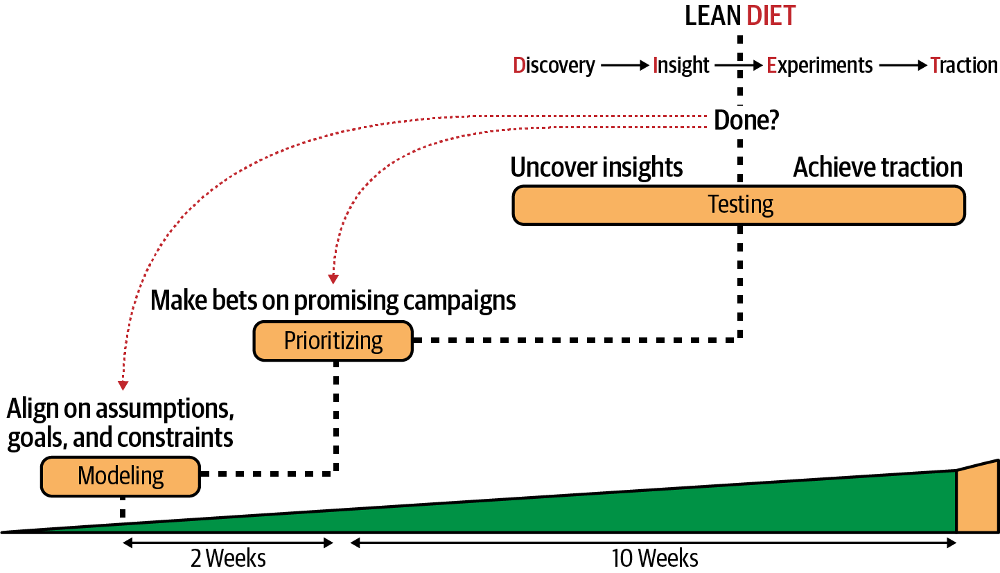

<!-- Page 177 -->

The 90-day cycle ends with a 90-day cycle review where you look back at the
cycle, review what you did and what you learned, and decide on what’s next,
which starts the next 90-day cycle.
Let’s walk through these three phases in more detail.
Modeling
The modeling phase is where you align your team around key goals, assump-
tions, and constraints. At the start of each new cycle, you call a 90-Day Cycle
Kickoff Meeting to shape this cycle’s OKR. This is the converge step in the
converge-diverse process.
You start with the models you created during the business model design phase.
Moving forward, it’s critical to keep these models regularly updated across
cycles, as they’ll evolve over time. Unlike heavyweight plans, like business
cases, forecast spreadsheets, and product roadmaps, these models were inten-
tionally designed to be lightweight enough that keeping them up-to-date is
relatively quick and easy.
In addition to keeping your models updated, you’re also going to need to start
benchmarking your business model using metrics. When starting out on a new
idea, all your initial metrics start at zero. Your first objective is getting your
customer factory running. Your constraints will follow a somewhat predictable
order, matching the typical customer life cycle steps:
1. Acquisition
1.
2. Activation
2.
3. Retention
3.
4. Revenue
4.
5. Referral
5.
However, once your customer factory is up and running—i.e., you start inter-
acting with customers—your constraints will start moving rather unpredicta-
bly. The only way to reliably uncover your constraints (and riskiest assump-
tions) is through systematic analysis of your current metrics. Remember that
guessing at your riskiest assumptions is subject to biases, and a wrong diagno-
sis is a recipe for waste. I’ll share some guidelines on how to measure these
metrics later in this chapter.
Prioritizing
The next phase is prioritizing, where you place bets on your most promising
campaigns. After the 90-day cycle kickoff, the team breaks to independently
analyze the constraint and formulate campaign proposals for achieving the
cycle’s objectives.

<!-- Page 178 -->

Everyone then reconvenes for a 90-Day Cycle Planning Meeting, where they
pitch their campaign proposals.
A campaign pitch:
• Identifies possible causes for the constraint
•
• Summarizes the underlying problem with supporting evidence
•
• Proposes a possible solution
•
• Declares some expected outcomes
•
It’s usually not possible to work on all the campaigns that are proposed, so the
team votes on the most promising campaigns to take on during each 90-day
cycle.
MINDSET #8
Place many small bets.
For the reasons discussed earlier, it’s far better to pick fewer campaigns than
too many. A good starting rule of thumb to determine how many campaigns to
select for a given 90-day cycle is dividing the number of team members by two.
For example, a team of five should aim to take on up to two, and no more
than three, campaigns per cycle.
Unlike traditional product planning, the goal here isn’t striving for fully baked
plans that you execute, but rather identifying the most promising campaigns,
which you then evaluate in parallel.
The rest of the 90-day cycle (10 weeks) is broken into five 2-week sprints and
used to further test and refine these campaign bets.
MINDSET #9
Make evidence-based decisions.
Testing
Once your campaigns are selected, you move into the testing phase. Campaign
authors design experiments, form subteams, and assign tasks. Then you offi-
cially kick off the first sprint.

<!-- Page 179 -->

When people think of testing, they usually only think about running evaluative
experiments. These are experiments where we test a set of input assumptions
(or hypotheses) against an expected outcome, like, “If I do X, I expect to get
Y.” For example:
1. If I launch my product, I will get 100 new paying customers.
1.
2. If I run this ad, it will drive 1,000 sign-ups.
2.
3. If I build this feature, it will reduce churn by 40%.
3.
Evaluative experiments are traction experiments that tie expected outcomes
to one of the five customer factory steps (AARRR; see Chapter 3). However,
rushing to run evaluative experiments is usually not the optimal approach.
Why? The utility of the results you achieve from these experiments is directly
proportional to the quality of your input hypotheses. In other words, if you
put garbage in, you’ll get garbage out. This begs the question, how do you
start with better assumptions or hypotheses?
This is where generative experiments come in. Generative experiments are
discovery experiments that help you uncover new insights or secrets. These
insights are often nonobvious at the outset, and they’re the key ingredient for
achieving breakthrough and driving traction.
MINDSET #10
Breakthrough requires unexpected outcomes.
Generative or discovery experiments uncover key insights that help you formu-
late better hypotheses, which you then verify through evaluative or traction
experiments.
I’ve devised a simple mnemonic aid to help drive home this point of discovery
before traction: the D-ARRRR-T (The Art) of Testing.
Good validation campaigns should start with problems before solutions, or
discovery (D) before traction (T). And since increasing traction (T) is the ulti-
mate goal of every campaign, it shouldn’t come as a surprise that all campaigns
should tie back results to one or more customer factory metrics (AARRR).
When designing any campaign, it helps to consider these seven questions:
1. Discovery: Is there an underlying problem worth solving?
1.
2. Acquisition: Are enough people interested/impacted?
2.
3. Activation: Does it deliver value?
3.

<!-- Page 180 -->

4. Retention: Do people come back?
4.
5. Revenue: What’s the impact (on revenue or some other meaningful
5.
metric)?
6. Referral: Do people tell others?
6.
7. Traction: Did traction go up?
7.
It’s usually not possible to answer all these questions within a single two-week
sprint, which is why campaigns are typically tested over a series of sprints.
As you’ll see in the next chapter, D-AARRR-T provides a helpful template for
designing what you test in each sprint of a campaign.
Getting Ready for Your First 90-Day Cycle
Now that you understand how 90-day cycles work, let’s cover some prerequi-
sites for running effective cycles.
Assemble the Right Team
While it is possible to start building a product by yourself, it’s important to
recognize that there usually comes a point where your progress will be limited
by your available time (we all get only 24 hours in a day), skill set (the curse of
specialization), or worldview (other biases).
For the reasons I’ve already discussed, it’s critical to prioritize building a team
with cross-functional skill sets and multidisciplinary worldviews. It even helps
to have one other person who can, at a minimum, help to enforce periodic
reality checks. Ideally this is a cofounder, but advisors, investors, and even an
ad hoc board made up of other startup founders can fill this role.
NOTE
The early stage is won with good teams, not good ideas.
Good teams quickly recognize and kill off bad ideas, and eventually find good
ideas. Bad teams can’t tell a good idea from a bad idea, and they either stick
with bad ideas for too long or hopelessly fumble good ideas.
As putting together a good team always takes longer than expected, it helps
to start as early as possible by sharing your business model story pitch with
potential candidates, like Steve did.
The following are some additional guidelines to consider when building out
your team.

<!-- Page 181 -->

Forget traditional departments
In an early-stage startup, traditional department labels like “Engineering,”
“QA,” “Marketing,” and so forth can get in the way and create needless
friction. Also, when deliverables are created in silos and driven by different
sets of internal key performance indicators (KPIs), you potentially run into
issues where your overall throughput may be compromised at the expense of
these local metrics. For example, a sales team incentivized by commissions is
typically driven by close rates, not learning and discovery.
You’re best served by having a single founding team organized around a com-
mon mission of hitting your traction goals.
Start with a minimum viable team
Metcalfe’s law, that “the value of a communication system grows at approxi-
mately the square of the number of users of the system,” has a corollary when
it comes to project teams:
The efficiency of a team is approximately the inverse of the square of the
number of members in the team.
—Marc Hedlund, chief product officer, Wesabe
As a team grows in size, communication breaks down and devolves into
groupthink. There are many arguments for building your minimum viable
product with the smallest team possible, including:
• Communication is easier.
•
• You build less.
•
• You keep costs low.
•
A good rule of thumb on team size is instituting a two-pizza team rule:
Any team should be small enough that it could be fed with two pizzas.
—Jeff Bezos, founder of Amazon
In practice, most new projects typically start with a founding minimum viable
team of two to three people and often grow to a core team of five to seven
people. Once you grow past these numbers, it’s helpful to split people into
additional small complete teams still organized around a common mission of
achieving traction.
Good teams are complete
More important than the number of members is ensuring that you have the
right diversity of skill sets and worldviews within the team to iterate quickly. If

<!-- Page 182 -->

you have to rely on shared external resources to get work done, your speed of
learning will be affected.
I like to visualize a complete team as one that is a mix of these roles: hacker,
designer, and hustler. If you don’t like those labels, consider these alternatives:
• Hacker, hipster, hustler
•
• Developer, designer, dealmaker
•
• Builder, designer, marketer
•
• Make your own
•
You don’t always need three people to form a minimum viable team. Some-
times you can fill these roles with two people, and other times all you need is
one person.
Here’s how I define them:
Hacker
If you are building a product, you need someone with strong product
development skills on your team. Having prior experience building stuff is
key, along with expertise in the specific technology you are using.
Designer
Design is about both aesthetics and usability. In newer markets, function
can take precedence over form, but we live in an increasingly “design-
aware” world where form cannot be ignored. Also, a product is not just
a collection of features, but rather a collection of user flows. You need
someone on your team who can deliver an experience that matches your
customers’ worldview.
Hustler
Everything else is marketing (and sales). Marketing drives the external
perception of your product, and you need someone who can put themself
in the shoes of your customers. Good copywriting and communication
skills are key here, along with an understanding of metrics, pricing, and
positioning.
Good teams overlap on superpowers
A complete team needs a good overlapping mix of the hacker, hustler, and
designer skill sets (Figure 6-3).
Here’s how to map the overlap. Ask each team member to name their #1
and #2 superpowers. For instance, my #1 superpower is hustler and my #2
superpower is hacker, which can be written as hustler-hacker. If I were looking

<!-- Page 183 -->

to add a cofounder, I’d complete my team by bringing on a hacker-designer or
designer-hacker.
Figure 6-3. The core team
Be wary of outsourcing your key skill sets
I constantly run across teams that try to outsource one or more of these three
areas, which is usually a bad idea. While you might be able to outsource an
early prototype or demo, be wary of putting yourself at the mercy of someone
else’s schedule, as that can limit your ability to both iterate quickly and learn.
TIP
The one thing you should never outsource is learning.
Good teams hold themselves externally accountable
Your core team needs to be empowered to do whatever is needed to achieve
the goal. If they have to constantly get permission to test ideas, that will affect
their speed. But the other extreme—granting a team full autonomy, where they
answer to no one—is also dangerous. This is the traditional skunk works or
R&D model where the team is given a large budget and charged to “innovate.”
One thing is certain: all the money will get spent.
Such teams often move offsite into more creative spaces to give themselves
room to think differently from the legacy business. While it’s sound in princi-
ple, when this kind of autonomy is left unchecked, individual passion (or bias)
also finds a way to rear its ugly head.

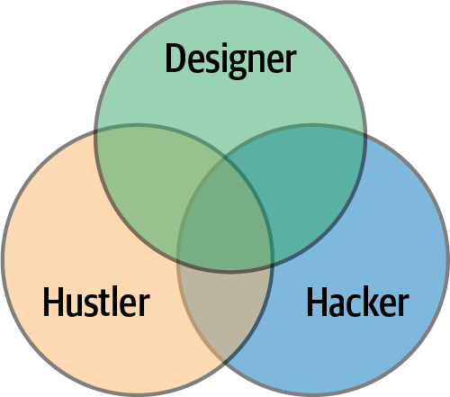

<!-- Page 184 -->

1 Bill Campbell, a former football player and coach. Known as the Trillion Dollar Coach, Camp-
bell helped to build some of Silicon Valley’s greatest companies, including Google, Apple, and
Intuit.
The Deep Space Intrapreneurship Analogy
Think of intrapreneurship as launching an exploratory probe into space. If you shoot
out too far, you will get lost, eventually run out of resources, and die a quiet death.
Even if you do manage to return, you will probably bring back something so alien to
the core business that you will be killed off by some vice president.
The key to success is not aiming for deep space, but aiming to orbit a specific target
(albeit fuzzy) and maintaining regular communication with an executive sponsor on
the home planet.
The target establishes a goal worth pursuing. Regular communication and external
accountability manage expectations and safeguard your return.
Adapted from a conversation with Manish Mehta, who was an early
intrapreneur at Dell
The right balance is semi-autonomy—i.e., establishing an external accountabil-
ity system that provides the team with autonomy to explore solutions while
staying grounded to certain core business model constraints and goals.
Involvement of your internal and external stakeholders while implementing
the Continuous Innovation Framework (CIF) is key. If you are in a startup,
these stakeholders can be external advisors and/or investors. In a corporate
environment, they can be subject matter experts or executive project sponsors.
Even if you are a bootstrapped entrepreneur, I highly recommend creating
some sort of ad hoc advisory board for this purpose.
Good teams utilize good coaches
In addition to stakeholders, most teams new to the CIF will additionally ben-
efit from an external coach/facilitator that is neither part of the core team
nor a key stakeholder. Unlike stakeholders and domain experts (advisors), a
coach focuses on asking the right questions, not giving the right answers.
This is key for keeping biases in check and objectively identifying the right
constraints to tackle. Even Steve Jobs, Larry Page, and Eric Schmidt had a
coach.1 Every mainstream methodology today—including Scrum, Agile, and
Lean Six Sigma—spread and evolved through the work of countless coaches.
The CIF is no different.

<!-- Page 185 -->

Assembling the right team is the first step. Establishing a regular reporting
cadence is the next.
Establish a Regular Reporting Cadence
While the Lean Canvas and the traction roadmap are the perfect lightweight
models for defining, measuring, and communicating progress in your business
model and holding yourself externally accountable, they only work if you’re
motivated to revisit your models regularly.
Therein lies a problem. Motivation alone is seldom enough. Once you get fully
immersed in your product, it’s fairly common to go into a flow state where
you lose the sense of time. Weeks quickly become months and years, as we saw
with Steve.
You need a forcing function that does not rely on motivation alone and instead
prompts you to revisit your models. This is where establishing a regular report-
ing cadence comes in—implemented as a set of ceremonies that you run during
the 90-day cycle.
The concept of ceremonies isn’t new. They are also widely used in Agile,
Scrum, and Design Thinking methodologies to foster team communication and
drive accountability. If you already follow one of these methodologies, it’s easy
to adapt your existing ceremonies to include the artifacts used during 90-day
cycles. If you don’t already run any ceremonies in your team, now is the time
to establish this structure.
In a 90-day cycle, there are six ceremonies (Figure 6-4):
90-Day Cycle Kickoff Meeting
Used to align your team around key goals, assumptions, and constraints
90-Day Cycle Planning Meeting
Used to place bets on your most promising campaigns
Sprint Planning Meeting
Used to define experiments and assign tasks for the upcoming sprint
Daily Standup Meeting
Used as a quick check-in to update team members on daily tasks and raise
any roadblocks that need attention
Sprint Review Meeting
Used to share key learnings from the sprint
90-Day Cycle Review Meeting
Used to provide a progress report from the 90-day cycle and decide on the
next action: pivot, persevere, or pause

<!-- Page 186 -->

Figure 6-4. 90-day reporting cadence
Seven Habits for Highly Effective Experiments
During the business model design phase, you relied on thought experiments to
shape your idea. As you get ready to move into the business model validation
phase, you’ll rely on actual experiments you run with customers to shape your
idea.
What follows are my ground rules for designing and running good experi-
ments. But before we get started, I’d like to contrast the difference between
running scientific experiments versus entrepreneurial experiments.
First, the goals are different. Scientists seek perpetual truths in order to
uncover the mysteries of the universe, while entrepreneurs seek temporal truths
in order to uncover the secrets (insights) that make a business model work.
Second, the timelines are different. Entrepreneurs don’t have unlimited time,
but rather need to prioritize the speed of learning above everything else.
For these reasons, conducting entrepreneurial inquiry at the same level of rigor
as scientific inquiry can be overkill in many instances. Entrepreneurship isn’t
knowledge acquisition for learning’s sake, but for driving results (aka traction).
Our goal is to quickly latch on to the right signal in the noise and then double
down on the signal.
Testing a few gut-based shortcuts (or hunches) along the way is sometimes the
fastest way to find these signals in the noise. How do you balance this trade-off
between speed and learning? By adopting a condensed set of seven habits for
running highly effective entrepreneurial experiments.

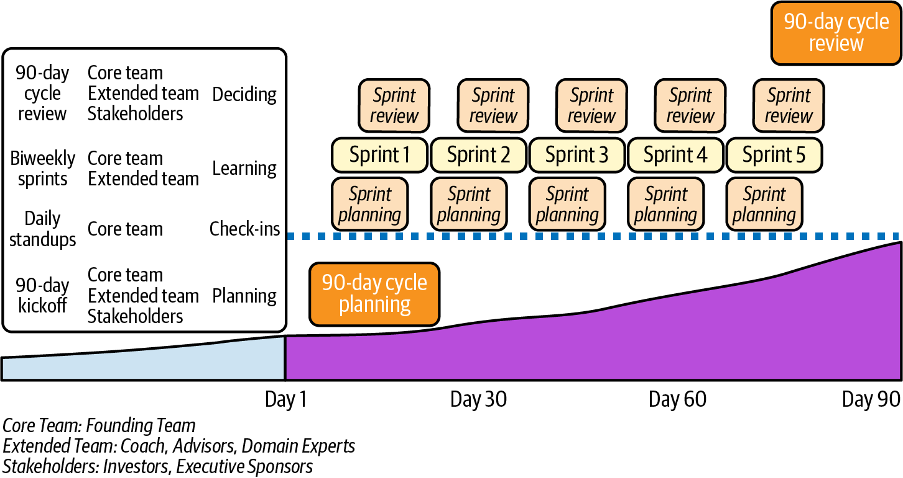

<!-- Page 187 -->

1. Declare Your Expected Outcomes Upfront
If you simply plan on seeing what happens you will always succeed at
seeing what happens because something is guaranteed to happen.
—Eric Ries, The Lean Startup
Much as a scientist doesn’t simply go into the lab and start mixing a bunch of
compounds to “see what happens,” you can’t go into an experiment without
having an idea of what you’re looking for.
Here’s how this bias creeps up on us: say you launch a product in the summer
months and it doesn’t sell—it’s obviously because everyone is on vacation. If
your product still doesn’t sell in the fall, it’s probably because everyone just
came back from vacation, and they’re not yet ready to buy. Then, here in the
United States at least, we have Halloween, Thanksgiving, and Christmas, all of
which conspire to drive down your sales. By this logic, it’s never a good time to
sell anything.
NOTE
Reasonably smart people can rationalize anything, but entrepreneurs are espe-
cially gifted at this.
To avoid falling into this kind of rationalization trap, you need to take a
more empirical approach. Instead of simply waiting to see what happens, you
need to declare your expected outcomes upfront—and factor in things like
seasonality. This is more easily said than done. There are usually two deeper
reasons for not wanting to declare outcomes upfront:
• We hate to be proven wrong.
•
• It’s hard to make educated guesses about the unknown.
•
The next two habits will help you overcome these.
2. Make Declaring Outcomes a Team Sport
If you are the founder or CEO of a company, you might shy away from
making bold public declarations of expected outcomes because you want to
appear knowledgeable and in control. You don’t even have to be the CEO to
exhibit this behavior: if you are a designer proposing a new design, it’s much
safer to be vague on results than to declare a specific lift in conversion rates
and risk being proven wrong.

<!-- Page 188 -->

The underlying reason most people shy away from up-front declarations is
that we attach our egos to our work. While egos are good for reinforcing
ownership, they are bad for empirical learning.
I know it’s not easy to consciously detach your ego from your product. After
all, you probably spend most of your waking hours working on your product.
But at some point you will reach a point where it becomes more important to
build the right product than to always be right. This mind shift is essential to
building a healthy culture of experimentation.
You might show your fear of declaring outcomes in another way: by making
only safe declarations. You won’t achieve breakthroughs by taking the safe
route. You need to develop a culture that allows people to have strong opin-
ions, strange hunches, and weird instincts that they can then rigorously test.
Here’s how I propose you get started. Don’t place the burden of declaring
expected outcomes on a single person. Instead, make it a team effort, but with
a twist.
Seeking team consensus too early can lead to groupthink. Expected outcome
declarations are particularly vulnerable to being influenced by the HiPPOs in
the room.
It’s much better instead to have team members declare outcomes individually
first and then compare notes.
So in the case of a designer proposing a new landing page, for instance, the
designer would first walk the team through their proposal, then everyone
on the team would independently estimate the potential throughput lift in
conversion rate. They would then compare their estimates and discuss how
they arrived at those numbers.
I recommend doing a similar team-wide poll after running an experiment, then
comparing those estimates to the actual results once they’ve come in. If you
want to have a little fun, you can turn this exercise into a game where you
award a small token prize to the person with the closest estimate. The point
isn’t about being right or wrong, but about getting your team comfortable
with declaring expected outcomes. This exercise alone can dramatically help
improve your team’s judgment over time.
If you are a solo founder, it’s even more important to write down your
expected outcomes before running experiments.
3. Emphasize Estimation, Not Precision
The other reason people shy away from declaring expected outcomes upfront
is that they feel they don’t have enough information to make meaningful

<!-- Page 189 -->

predictions. If you’ve never launched an iPhone app before, how can you
possibly predict an expected download rate?
You need to accept the fact that you will never have perfect information—and
that you need to make these kinds of predictions anyway.
Here are three ways to do this.
Search for analogs
In an ideal world, we would be able to look up the expected conversion rates
on any metric. Most companies, however, choose to keep the internal workings
of their customer factories secret, for competitive reasons.
Some of these numbers can be pieced together with a little research, as we did
in the Fermi estimation exercise in Chapter 3. However, the most accurate esti-
mates will come through investing in improving your own judgment over time.
You have to become an expert on your own customers’ behavior patterns. The
only way to do this is to declare outcomes upfront and incrementally learn
from each outcome.
When you first start declaring these outcomes, be prepared for your numbers
to be way off. For instance, you might expect to get 100 downloads per
day from your iPhone app launch, but find that you get only 10. Your first
guess may have been overly optimistic, but when you are consistently off by
a magnitude of 10, you naturally start adjusting your expectations to match
reality.
Use your traction roadmap and customer factory model
It’s important to keep in mind that you don’t simply pick numbers, like 100
downloads per day, out of thin air. These numbers should come from your
traction roadmap and customer factory model. The point of building a model
in the first place is that you can use it to predict how your customers need to
behave to make your business work (i.e., compute consequences); you can then
validate or invalidate those predictions through experiments.
Start with ranges instead of absolute predictions
Another reason people shy away from making predictions is because they feel
the need to be exact.
TIP
Any estimation is better than no estimation.
Let’s take a look at another estimation technique, proposed by Douglas Hub-
bard. It builds on research that shows that assessing uncertainty is a general

<!-- Page 190 -->

skill that can be taught with measurable improvement. Hubbard’s technique is
built on making predictions in ranges rather than in absolutes. He illustrates
this technique with an estimation exercise that I have used quite effectively in
my workshops, presented in the following sidebar.
Exercise: What Is the Wingspan of a Boeing 747 Airplane?
Unless you are in aviation, you probably throw your hands up in the air when faced
with a question like this one. Instead of attempting a single answer, you can break the
problem into two by first tackling the upper bound to a 90% confidence interval and
then doing the same with the lower bound. Let’s give it a try.
Can the wingspan be less than 20 feet (6 meters)?
No, that would obviously be too short.
We are 100% certain of this.
How about 30 feet (9 meters)?
Keep increasing this number until you are no longer comfortable going any higher. You
should be aiming for 90% certainty.
Write this number down. Then repeat for the upper bound.
Can the wingspan be greater than 500 feet (152 meters)?
No, that would obviously be too long.
We are also 100% certain of this.
How about 300 feet (91 meters)? That’s the length of a football field.
Keep decreasing this number until you are no longer comfortable going any lower.
Again, aim for 90% certainty and write this number down.
How did you do?
The correct answer is 211 feet (64 meters).
When I’ve run this exercise in my workshops, students have regularly gone
from declaring they have no idea to hitting a range within 5 to 20 feet
of the right answer. You can apply this same technique to your throughput
experiments. The lower and upper bounds of conversion rates already have set
floors and ceilings. Let’s take the acquisition or sign-up rate as an example. We
know it can’t be 100%—no one gets that. And it can’t be 0%—there would
be no point to the experiment. Through progressive adjusting of your lower
and upper bounds, you might create a 90% confidence interval of a 20–40%
sign-up rate.

<!-- Page 191 -->

That’s progress. Over time, your confidence will go up and your ranges will
shrink.
4. Measure Actions, Not Words
All evaluative experiments need to define expected outcomes in terms of one or
more customer factory actions (AARRR). Discovery experiments, however, can
be a bit more challenging because qualitative learning can be subjective. Ask
any entrepreneur how a customer call went, and it’s usually all positive. This is
confirmation bias at work, where we tend to selectively retain only that which
agrees with our preexisting worldview and ignore the rest. Rather than trying
to qualitatively gauge what users say, measure what they do (or did).
5. Turn Your Assumptions into Falsifiable Hypotheses
It’s not enough to simply declare outcomes upfront. You have to make them
falsifiable, or capable of being proven wrong. I touched on this earlier when
discussing the scientific method. It is extremely difficult to invalidate a vague
theory. Falsifiability is required to avoid falling into the inductivist trap, where
we gather just enough information to convince ourselves that we are right.
You might already be familiar with this trap from the famous “white swans”
example. If all the swans you’ve ever seen are white, it’s easy to declare that all
swans are white. But it takes only one black swan to disprove this theory.
Let’s see how this problem surfaces with a business model assumption stated
as: “I believe that my being considered an expert will drive early adopters
to my product.” To test this statement, you might mention your product in
talks, tweet a link, or write a blog post. All of these things may start driving
sign-ups. But when do you declare this statement as validated? Is it when you
get 10 sign-ups, 100 sign-ups, or 1,000 sign-ups? The expected outcome is
vague.
The other problem with this approach is that it is hard to draw lines between
activities and causality when you mix a bunch of activities together. Can your
sign-ups really be attributed to all these activities equally, or is there one
driving most of the sign-ups?
The preceding statement is a good first pass at a “leap of faith,” but it isn’t yet
a falsifiable hypothesis. It needs to be refined further so that it’s more specific
and testable. Here’s a much better version:
• Writing a blog post will drive >100 sign-ups.
•
Now you have a way of running this experiment and clearly measuring
whether it passes or fails. Remember that this 100 sign-ups number isn’t sim-
ply pulled out of thin air—it needs to be derived from your traction roadmap

<!-- Page 192 -->

and customer factory model. The key takeaway here is realizing that assump-
tions on your canvas generally don’t start out as falsifiable hypotheses, but as
leaps of faith. In order to turn leaps of faith into falsifiable hypotheses, you
rewrite them as:
• [Specific testable action] will drive [expected measurable outcome].
•
So far we have covered two habits you should cultivate in order to craft
effective experiments: declaring outcomes upfront and making them falsifiable.
But that’s not enough—there’s still something missing in the expected outcome
statement. Can you figure out what it is?
6. Time-Box Your Experiments
Say you run the experiment and decide to check on the results in a week. After
a week, you have 20 sign-ups. You might decide it’s a good start and leave
the experiment running for another week. Now you have 50 sign-ups, which is
right at the halfway point of your desired goal of 100 sign-ups. What should
you do?
Entrepreneurs, being overly optimistic, commonly fall into the trap of running
the experiment “just a little while longer” in the hopes of getting better results.
The problem here is that when an experiment is left to run unchecked, those
weeks easily turn into months.
Just as the inductivist trap allows us to declare success prematurely, lacking
a time box allows us to indefinitely extend our experiments. Remember that
time—not money or people—is the scarcest resource we have. The solution is
time-boxing your experiment. We can then rewrite the expected outcome as:
• Writing a blog post will drive >100 sign-ups in 2 weeks.
•
Establishing a time box like this sets up a nonnegotiable tripwire for a future
discussion with your team, irrespective of the results—provided, of course, that
the world doesn’t come to an end.
I recommend going even one step further with time-boxing: rather than trying
to estimate how long it will take to run a particular type of experiment, con-
strain all your experiments to fit within the same time-box interval. In other
words, define a time box in which all your experiments need to fit, irrespective
of type. It’s perfectly okay to revise the goal downward to fit your time box.
For instance, in our example, if you don’t think you can hit 100 sign-ups in 2
weeks, but you think you can do it in 4 weeks, split it into 2 experiments:
• Experiment 1: Writing a blog post will drive >50 sign-ups in the first 2
•
weeks.

<!-- Page 193 -->

• Experiment 2: The blog post will drive >50 sign-ups in the next 2 weeks.
•
If after the first 2-week experiment you have only 10 sign-ups, you’ll know
that there’s a low likelihood of making up the difference in the next 2 weeks
unless you take some corrective action. Think of time-boxing as a way to force
smaller batch sizes in your experiments. The smaller the batch, the faster the
feedback loop from the experiment.
I’ve applied this time constraint technique in both small and large teams with
equal efficacy. Before a time-box constraint was imposed, the teams were scop-
ing their experiments from a couple of weeks for small experiments to several
months for large experiments. For the longer experiments, the only visibility
on progress was the team’s build velocity, which, as we established earlier, is an
unreliable progress indicator.
We instituted a two-week time box and prescheduled progress update meetings
with project overseers. This meant that the teams had to find a way to build,
measure, learn, and be prepared to communicate business results every two
weeks. Like magic, they stepped up, finding creative ways of breaking up their
“big” experiments into smaller experiments. Through these faster feedback
loops, the teams were able to invalidate several large initiatives early and
generate more confidence in others. Both these outcomes are progress.
7. Always Use a Control Group
Progress is relative. In order to tell if an experiment is working, you need to be
able to benchmark it against a previous state. The equivalent in science would
be establishing a control group.
I’ll outline the steps for benchmarking your customer factory as weekly
batches (or cohorts) later in the book. These weekly batches are a reasonable
starting point for establishing a control baseline: they create a benchmark that
you should aim to beat in your experiments. This is a kind of serial split
testing, and it’s usually acceptable when you either don’t yet have a lot of users
or aren’t running simultaneous overlapping experiments.
That said, the gold standard for creating a control group is through parallel
split testing. In parallel split testing, you expose only a select subgroup of your
user population to an experiment, then you compare group A with the rest of
the population (the control group) to determine progress (or not). This is also
called an A/B test.
Finally, if you have enough traffic to test with and more than one possible
conflicting solution to test, you can run an A/B/C (or more) test, where you pit
multiple ideas against one another.

<!-- Page 194 -->

Steve Establishes an External Accountability Structure
Steve succeeds in getting both Josh and Lisa to commit to working 20 hours a
week on the startup. He relays the news to Mary.
“Great job, Steve. I’m really looking forward to seeing Josh and Lisa again,”
says Mary.
“So it would be okay to invite them to our sessions?” Steve asks.
“Yes, it would. I would even go so far as to say that would be a requirement
for me to continue advising you,” Mary adds.
She pauses for a second. “A founding team needs to be 100% aligned, espe-
cially on mindsets. You’ve made a lot of progress changing your mindset from
a build-first approach to a traction-first approach in just the last couple of
weeks. The last thing you want is for your team members to cause you to slide
back into the old world.”
“Yeah, I’ve been wondering about how I’m going to get them caught up on
everything you’ve taught me,” Steve replies.
“The power of these models is that they are simple to understand. Putting
them into regular practice is the hard part. The best way to get your team
caught up is through example—by doing. I’d suggest officially kicking off a
90-day cycle, blocking out calendars for the ceremonies, and following the
structured process. Both Josh and Lisa are really sharp. They’ll soak up this
way of working in no time.”
“You’re right about the models being simple. Neither of them interrupted me
when I delivered my business model story pitch to them. They got it right
away, and Josh even asked me to send him a copy of my Lean Canvas and
traction roadmap just this morning.”
“There you go. Be sure, however, to block off calendars now. Too many entre-
preneurs only get together to discuss the good stuff, but the bad stuff is usually
where you find the biggest breakthroughs. Brace yourself, Steve, as things are
about to get interesting…”
After their meeting, Steve coordinates with the others and sets up dates and
times for all the ceremony events on the calendar.

<!-- Page 195 -->

C H A P T E R 7
Kick Off Your First 90-Day Cycle
As you learned in the last chapter, the first 2 weeks of a 90-day cycle are set
aside for modeling and prioritizing. You kick off the cycle by first getting your
models in order, and then calling a 90-Day Cycle Kickoff Meeting where you
align your team on goals, assumptions, and constraints (Figure 7-1).
Figure 7-1. 90-day cycle kickoff

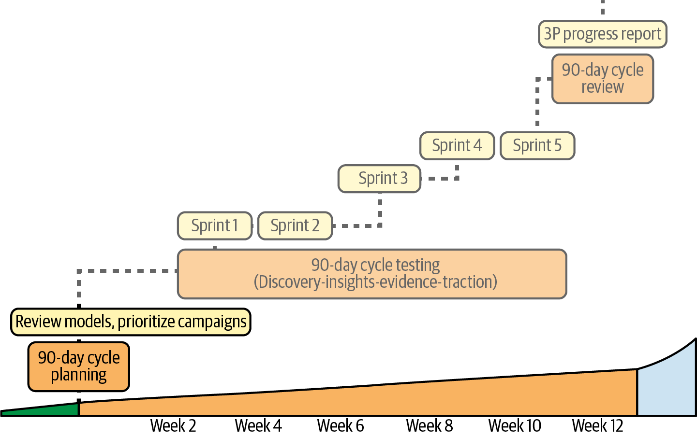

<!-- Page 196 -->

Steve Calls a 90-Day Cycle Kickoff Meeting
As Steve has already been working on his models, it doesn’t take him very
long to get them updated. He calls a 90-Day Cycle Kickoff Meeting, where he
spends a few minutes quickly walking Josh, Lisa, and Mary through his upda-
ted Lean Canvases and traction roadmaps for his top two customer segments:
Software Developers and Architects.
“We’ve mostly discussed the Software Developers model before and nothing’s
changed there, but I noticed that you seem much more excited now about the
Architects model. Can you elaborate?” Mary asks.
“Well,” says Steve, “I kept the Software Developers model mostly because I
understand that space the best and have some companies in mind that we can
approach. But once I started applying the Innovator’s Gift to set fair pricing
for the Architects model, it dawned on me that we could anchor against the
cost of current 3D rendering solutions and potentially charge a lot more.”
Lisa asks, “Is that because you’re price anchoring against an architect’s hourly
rate?”
“Yes,” Steve replies. “I figured that our early adopters would be custom
home architects who typically bill $250/hr and have clients who expect to
see 3D renderings. Creating a single rendering takes at least 12 hours, which
is $3,000. If they do more than one of these a month, which I think they do,
we could charge them $3–5k/mo—especially since we can get them to a much
better outcome (AR/VR) in a fraction of the time.”
Josh jumps in. “I’m not sure architects use those models beyond the design
phase, which is typically three months. And we don’t really know how many
renderings they usually create per client. That may affect your lifetime value
assumptions.”
“Hmmm…you’re right,” says Steve. “If we assume they’ll each have six clients
a year and will create renderings for all of them, if we can charge them $1k per
rendering, that’s $6k/yr, or $500/mo. Funnily enough, that’s the same number
as for the software companies.”
Mary comments, “I’d recommend sticking with the same $500/mo target pric-
ing for both segments for now. It’s the minimum pricing to make your traction
roadmap work, and if you find you can go higher, you can always adjust the
roadmap then.”
Steve turns back to the agenda for the meeting. “Sounds good. So, with these
Lean Canvases, we should all be clear on our starting business assumptions.
For our 90-day OKR, the key objective is completing stage 1—problem/solu-
tion fit—and given that we’re targeting the same pricing for both variants,

<!-- Page 197 -->

we would need to secure two trials (rounding up) at $500/mo by the end of
stage 1.”
“That’s good and clear,” says Mary. “How about constraints? What do you
guys think?”
The others exchange glances for a few seconds, then turn back to Mary.
“You guys tell me,” she responds with a smile.
Steve takes a shot. “Well, in one of our meetings you said that it would be easy
to spot with metrics. I assumed we would need to first collect some metrics
before we can make that determination— which would be after we launch our
MVP?”
“You don’t need to launch your product to start collecting metrics,” says
Mary. “Remember Demo-Sell-Build. What’s the first step?”
“Right. Since our customer factory isn’t running yet, the first step is getting
leads into the factory. So would acquisition be the limiting constraint?”
“That’s correct, Steve,” says Mary. “Acquisition or demand generation is your
current limiting constraint. And until you can get leads, or better yet, sales
flowing, there’s no point in optimizing any of the other steps. Remember that
you need to be able to create enough customers first without having to build a
product.”
“How do you create customers without a product?” Josh asks with a confused
look on his face.
Steve and Mary look at each other, and Mary gestures to Steve to explain.
Steve then spends the next 15 minutes sharing the logic behind using a Demo-
Sell-Build process rather than a Build-Demo-Sell process. He even leads the
rest of the team through the food truck and Tesla case studies he’d previously
discussed with Mary.
“Demo-Sell-Build. I like the simplicity of that. If you can’t sell the demo, why
build the product?” Lisa adds with a laugh.
Josh jumps in. “I guess the next order of business then is building a demo and
setting up some calls.”
Steve adds, “Maybe we could also build a landing page, and drive some traffic
to it with ads—”
Mary cuts in again. “Remember guys, this is only an alignment meeting, not
a brainstorming or solution design meeting. If you’re all aligned on the con-
straint, it’s best for us to end the meeting here. You all need to go away for
a few days and independently formulate some campaign proposals for hitting
your 90-day OKRs. Let’s plan on meeting again at the end of the week to

<!-- Page 198 -->

review what you come up with and place our bets on the most promising cam-
paigns. I’ll forward you some additional information on the problem/solution
fit process, which should get you started.”
And with that, the meeting comes to an end.
The Problem/Solution Fit Playbook
The first stage in the product life cycle (the “now” in the now-next-later roll-
out plan discussed in Chapter 4) is achieving problem/solution fit. This stage is
about demonstrating sufficient demand for your product before you build it.
How do you get paying customers without first building the product? This is
the key propelling question, whose answer can shave months off your product
timeline. More importantly, by the end of this stage, you’ll have a product that
you know customers want and don’t just hope they’ll want.
Customers Don’t Buy Products, They Buy a Promise of Something
Better
Think back to a big new product launch, like the iPhone. Buying the first
iPhone required a leap of faith because there was nothing remotely like it. If
you were one of the early adopters, like me, who stood in line to buy the first
iPhone, you didn’t get to test-drive it first. You probably saw Steve Jobs demo
the product on stage, fell in love with the promise of the product, and decided
to buy the product.
It follows then that what customers buy isn’t really a product, but a promise
of something better. You don’t need a working product to promise something
better, you need an offer.
An offer is made up of three things:
• A unique value proposition
•
• A demo
•
• A call-to-action (CTA)
•
As we’ve discussed previously, getting your customer’s attention is the first
battle. This is the job of your UVP, where you make an assertion about how
you are better than the existing alternatives.
Once you have their attention, the next step is convincing your customer that
you can indeed deliver on your promised UVP—and here’s the counterintuitive
bit. This is not the job of a working product either, but a demo. The art of the
demo is showing the least amount possible to convince your customers you can
deliver on your UVP and secure their commitment.

<!-- Page 199 -->

Once a customer buys into your demo, the last step is a specific CTA that
you want your customers to take. The goal here is to get as close to a paying
customer as possible.
Customers don’t really buy working products, but an offer. This insight is
key to acquiring customers without a product. It opens the door to using a
Demo-Sell-Build strategy.
Not convinced yet?
• If you’ve ever backed a crowdfunding campaign, you bought an offer, not
•
a finished product.
• Selling an offer versus a finished product isn’t just for smaller purchases,
•
like a phone. Tesla sold its initial cars using an offer that required a $5,000
down payment and a $45,000 wire transfer within 10 days to reserve the
product.
• Selling an offer isn’t just for B2C products, either. As much as you’d like
•
to close a big B2B deal immediately, the more complex the sale, the more
complex the sales process. You have to first sell the UVP, then the demo to
multiple parties, and finally have a pricing discussion with the right buyer.
This can take several weeks to several months. If you don’t manage to sell
the offer, your product never makes it to the pilot stage.
Contrary to popular belief, you never need a finished product to close a sale
with an early adopter. Depending on your product’s level of technical risk
(feasibility), you may sometimes need a working prototype for your demo, but
don’t assume this unless your customers specifically ask for it.
How to Make a Promise of Better
There are a number of different ways you can assemble and test offers. Here
are some of the most commonly used offer campaign recipes:
Smoke test
Use a teaser page to collect email addresses.
Landing page
Use an offer page to drive a specific call-to-action (e.g., sign-ups).
Webinar
Use an educational webinar to drive awareness.
Preorder
Use a preorder campaign to drive advance sales.

<!-- Page 200 -->

Crowdfunding
Use a crowdfunding platform, like Kickstarter, to fund a project.
Direct sales
Use a Prospect-Demo-Close sales process to drive sales.
Mafia offer
Use carefully scripted customer interviews to uncover problems, design a
solution, and build an offer your customers cannot refuse.
Based on my experience, I’ve mapped the effectiveness of each campaign,
plotting scalability/reach versus conversion rate (see Figure 7-2).
Figure 7-2. The effectiveness of the different offer campaign recipes
Based on your 90-day OKR, you can either pick a single campaign or try
multiple campaigns.
When Are You Done with Problem/Solution Fit?
By the end of stage 1, you should be able to make an evidence-based go or
no-go decision on whether to move forward with your business model to stage
2 (product/market fit).
Specifically, you should have built a customer factory that can:
• Repeatedly attract, activate, and cause a switch with your early adopters
•
(Desirability).
• Secure sufficient tangible commitments (e.g., advance payments, letters
•
of intent) from early adopters, as defined by your traction roadmap
(Viability).

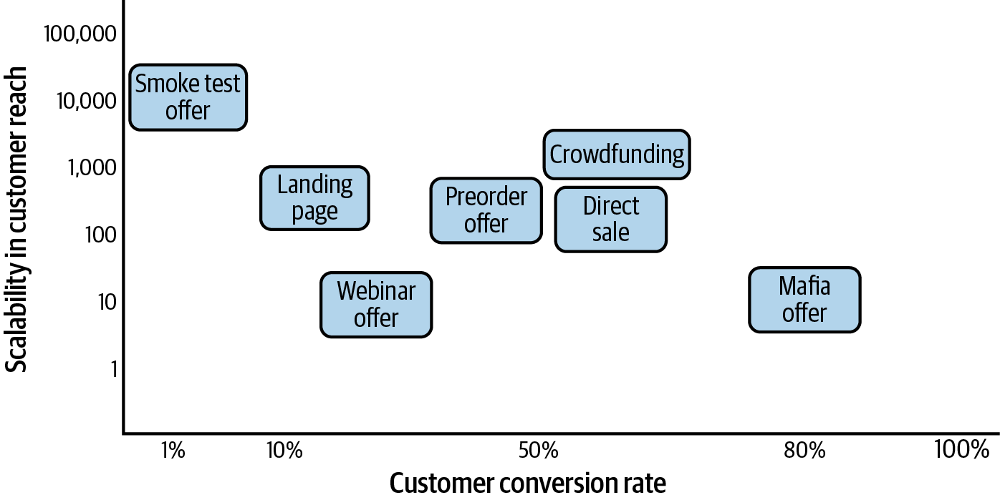

<!-- Page 201 -->

• Clearly define the smallest thing you need to build (your MVP) to deliver
•
value to your early adopters.
Achieving problem/solution fit typically takes one to two 90-day cycles (3–6
months).
Steve Calls a 90-Day Cycle Planning Meeting
The team gets together at the end of the week to review their offer campaign
proposals. Both Josh and Lisa want to take a Direct Sales approach, while
Steve suggests using a Landing Page to drive trial customers.
Mary weighs in, “While rushing to pitch an offer is definitely faster and better
than first building an MVP, it still isn’t the most optimal next step given where
you are.”
There are confused looks across the board.
“Didn’t you ask us to start with an offer in the last meeting?” Steve asks.
“Yes, I said to start with an offer. However, the most effective next step isn’t
pitching an offer, but first learning how to assemble the right offer,” Mary
explains.
Still seeing blank looks on everyone’s faces, she elaborates further.
“Let’s first take the landing page campaign. Sure, you can drive traffic to the
page with ads, but what if no one signs up? How do you know what to
fix? A landing page could fail at the headline, the visuals, copywriting, price,
design, and so on. Without customer feedback, this becomes a multivariate
optimization problem and a recipe for going around in circles.”
Steve muses, “Like the build trap we discussed earlier with rushing to build an
MVP.”
“Exactly,” says Mary. “Remember that an offer, while faster than an MVP, is
still a stand-in for your solution. If you simply guess, chances are high it will
fall flat. Worse, without customer feedback, the optimization trap ensues.”
Lisa then jumps in. “What about Direct Sales? Won’t we get customer feed-
back on the spot?”
Mary replies, “Yes, you will. An in-person pitch that works is a great thing,
but a pitch that lands flat typically gets awkward fast and goes nowhere. Right
now, all you have is a theory of what could make a compelling pitch; it’s
still largely built on a tower of untested assumptions best characterized as
leaps of faith. At this point, for instance, we don’t really know how many
AR/VR projects software companies take on or what impact 3D renderings,
and more specifically AR/VR, could have on the home construction space.

<!-- Page 202 -->

If any of your foundational assumptions around customer problems, existing
alternatives, etc., are wrong, the pitch will miss and position the product as a
weak nice-to-have versus a strong must-have.”
Lisa nods in acknowledgment and asks, “Sure, but even if we get parts of the
pitch wrong, won’t we still be able to learn from the prospect and iteratively
improve it?”
“Maybe,” Mary answers. “It largely depends on your prior relationship with
the prospect and the framing of the conversation. Unless the prospect knows
you, likes you, and trusts you, they’ll typically keep their cards close to their
chest. Most of the time, all you learn is that the offer missed the mark—it can
be challenging to go deeper and learn enough to pivot to something better.
You just get stuck, thank the prospect for their time, and politely end the
conversation. That’s a learning opportunity lost.”
“Hmmm…I see what you mean. Since we don’t really know anyone yet in this
space, we’ll be delivering cold pitches,” says Josh. “So what’s our best course
of action, then?”
“Learning before pitching,” Mary responds. “The way you build a compelling
pitch is by first taking the requisite time to deeply understand your customer’s
problems. This may sound weird, but it is possible to understand a customer’s
problems even better than they do. Armed with this understanding, you’ll then
be in the best position to design the right solution and assemble a compelling
pitch—a pitch that has a much higher probability of hitting the mark because
it nails a problem that you know your customers want to solve.”
“Is this ‘learning about our customers’ something we do before running one of
the offer campaigns you shared with us?” Lisa asks.
Mary replies, “No, one of the campaign types in that list incorporates all these
steps already as part of the campaign itself—the mafia offer.”
Steve jumps in. “I was initially drawn to the mafia offer campaign because
you’ve mentioned it before. But then I saw that it was the least scalable of
all the offer types, so I opted for something more fitting given the number of
customers we’ll need to acquire—”
Mary cuts in. “Yes, the mafia offer campaign is the least scalable, but it packs
in the most amount of learning per unit time. It also has the highest conversion
rate of all the offer types because it’s delivered to prospects in person, one-on-
one. Yes, it may seem to take longer than the other campaign types, but from
my experience it’s the fastest way to get you to repeatable sales. Once you
can repeatedly sell even 10 people on your product, how to scale from there
becomes a lot more obvious.”

<!-- Page 203 -->

“How is this different from direct sales?” Lisa asks.
“The mafia offer campaign is quite similar to direct sales once you start pitch-
ing,” Mary responds, “but it’s a lot more tactical on how to use discovery
conversations to learn before you pitch. You don’t pitch anything until you
uncover your early adopter criteria, identify your true competition, and deeply
understand the problems. Remember the Innovator’s Gift? At the business
model design phase, you used the Innovator’s Gift to stress test your models
using thought experiments. Here, you’ll run actual discovery experiments to
uncover and test these insights.”
“This all sounds very logical,” Steve comments, “but I’m still skeptical about
how we get people to open up to us and give us all this information if we’re
not allowed to pitch.”
“That’s a fair question,” Mary acknowledges. “Early prospecting tactics trip
up lots of founders. I’ve got a bunch of information I’ll send you guys on how
to set up these conversations, conduct interviews, and capture insights. Take a
few days to process this information, then let’s meet again to kick off your first
sprint.”
The Mafia Offer Campaign
A mafia offer is an offer your customers cannot refuse—not because you
strong-arm them, but because you create a compelling offer that:
• Nails your customers’ top problem(s)
•
• Demonstrates a solution for overcoming their problem(s)
•
• Provides a clear way for them to get started
•
Building a Mafia Offer
Rushing to craft a pitch or build a landing page is a suboptimal way of
building a mafia offer. Such offers are often predicated on a bunch of unvali-
dated assumptions (guesses), which typically lead to poor conversion rates.
Furthermore, trying to troubleshoot your offer when customers don’t buy is
a multivariate challenge. Did customers leave because of the UVP, the demo,
pricing, design, copywriting, or something else?

<!-- Page 204 -->

For these reasons, I advocate using a more systematic three-step approach,
shown in Figure 7-3.
Figure 7-3. The three steps to building a mafia offer
Let’s walk through the steps.
1. Problem discovery
Since most initial customer/problem assumptions on the Lean Canvas are best
guesses and often barely scratch the surface on the problems, building a mafia
offer starts with a deeper dive into understanding your customer’s problems.
The fastest way to deeply understand your customer is through face-to-face
interviews—not building landing pages, or releasing code, or collecting analyt-
ics, but talking to people.
The goal of problem discovery is uncovering problems worth solving with
the status quo (i.e., existing alternatives). You do this not by pitching your
solution, but rather by studying how people are currently getting the job done
with existing alternatives (Figure 7-4).

<!-- Page 205 -->

Figure 7-4. Step 1: Problem discovery
2. Solution design
A problem well-defined is half-solved.
—Charles Kettering, American inventor
If you can find a big enough struggle in the customer’s current workflow
(the status quo), that’s where you’ll find opportunities for causing a switch
(problems worth solving). The next step is designing or refining your product
to fit and cause a switch (Figure 7-5).

<!-- Page 206 -->

Figure 7-5. Step 2: Solution design
3. Offer delivery
The final step is assembling your solution into a mafia offer, which you then
deliver to customers as a pitch and test iteratively. This is where the rubber hits
the road.
If enough customers buy into your offer, you achieve problem/solution fit. You
then start the process of building out your MVP. How many customers are
“enough”? This is determined by your traction roadmap.
Running a Mafia Offer Campaign
The mafia offer campaign is designed to fit within a 90-day cycle. The reason
this is possible is that you don’t build a working product (MVP) during this
stage, but rather an offer, which is a much faster way to validate demand for
your product.
Figure 7-6 shows what a typical mafia offer campaign looks like within a
90-day cycle. You reserve up to two sprints for problem discovery, one sprint
for solution design, and up to two sprints for offer delivery. Note that these are
only guidelines, and your mileage could vary based on your specific product
and customer segment.

<!-- Page 207 -->

Figure 7-6. Typical 90-day cycle for achieving problem/solution fit using a mafia offer
When to Use a Mafia Offer Campaign
Due to the number of high-touch interactions required to implement this type
of campaign, it is tempting to dismiss it in favor of other more seemingly
scalable campaigns like crowdfunding or driving traffic to a landing page.
This often leads to suboptimal results, for the reasons I outlined earlier. The
counterintuitive reality is that you often go a lot faster later if you start slowly,
taking the time to focus on the right things.
The mafia offer campaign, while not the most scalable campaign, is the one
that yields the highest learning—which also translates into the highest conver-
sion rates.
NOTE
With a mafia offer, you can typically expect a 60–80% conversion rate from
qualified leads to paying customers.
For these reasons, I unequivocally recommend starting with a mafia offer
campaign—irrespective of product type. The insights you uncover here greatly

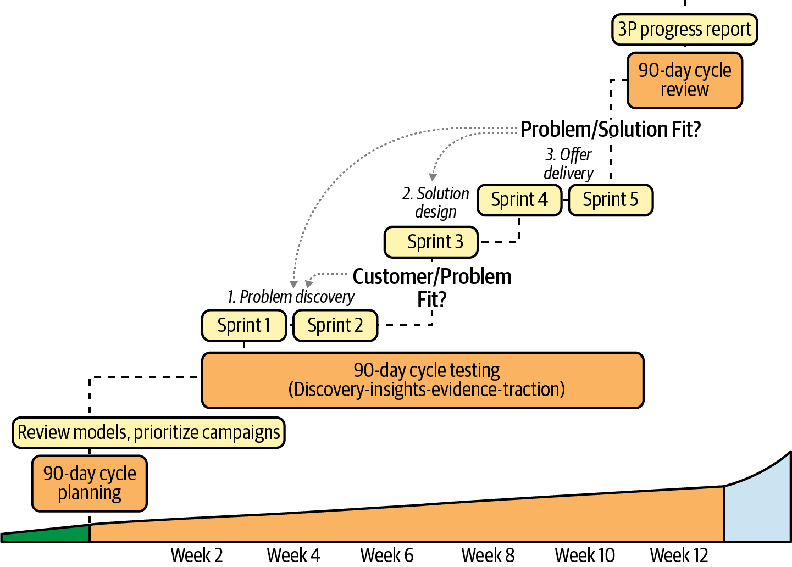

<!-- Page 208 -->

facilitate stacking a more scalable offer later, whether it’s crowdfunding, a
landing page, or hiring a sales force.
For example, I used the mafia offer campaign to launch the first edition of this
book (self-published) in 2010. My initial MSC goal was selling 10,000 copies
in 3 years. Using a 10x growth rate, I translated this to either selling 100
copies or securing 1,000 email addresses (qualified leads) of people interested
in buying the book as my problem/solution fit criteria.
Here’s how I stacked my offers to launch the book:
• Use a mafia offer campaign to secure 25 sales (4 weeks).
•
• Use learning from mafia offer to build a smoke test offer campaign with a
•
teaser page to collect email addresses and secure 1,000 qualified leads (8
weeks).
After hitting my problem/solution fit criteria, I started writing the book, which
took nine months to complete. Along the way, I continued to run multiple
campaigns to grow traction for the book. These included:
A workshop campaign
Teach concepts from the book and bundle a future copy of the book with
the ticket.
A speaking campaign
Give keynotes and bundle future copies of the book for all attendees.
A preorder campaign
Allow early adopters to purchase the book and get chapters incrementally
delivered to them as they are written.
These campaigns helped me write and launch the book iteratively with my
early adopters. The result was a book that readers wanted, which resulted in
book sales outpacing my traction roadmap. I sold 10,000 copies within 18
months of starting the project and increased my MSC goal to 100,000 copies.
Steve Tries Taking a Shortcut
Steve reviews the material Mary sent him on the mafia offer campaign.
“The fastest way to deeply understand your customer is through face-to-face
interviews.”
“Face-to-face interviews? That will take an eternity!” Steve thinks to himself.
He decides to use a survey instead.
Steve finds an online service that can target his specific audience for a fee and
spends the rest of the day designing the survey. He launches it the next day.

<!-- Page 209 -->

Results start pouring in almost immediately, and by the following day he has
over a hundred neatly tabulated responses, and some fancy charts. He beams
as he discovers that over 85% of the respondents ranked his top problem as a
“must-have.”
He immediately drafts Mary an email:
I know you said the problem discovery stage can take up to four weeks. I
used a survey to speed things up and got a strong signal that validates my
problem (85/100). Am I missing something or are we good to move on to
the solution design phase?
He gets a text message two minutes after he sends the email: “Let’s meet for
coffee asap. I’m free in 30 minutes— usual spot.”
Mary Bursts Steve’s Bubble (Again)
“I know the engineer in you craves efficiency,” Mary begins. “I was the same
way. But surveys aren’t the right tool for problem discovery.”
“Why not?” Steve asks.
“For a number of reasons. For starters, surveys assume you know the right
questions to ask. And because surveys are multiple choice, you also need to
know the right possible answers to list on the survey. At the earliest stages of a
project, you don’t know what you don’t know.”
She pauses for a second and then goes on. “Sure, surveys can be used for
problem validation once you know the right questions and answers to validate,
but they aren’t an effective problem discovery tool.”
Steve interjects. “Wasn’t the goal of this stage to validate the problem assump-
tions on the Lean Canvas?”
“Yes, but most of the problems entrepreneurs initially list on their canvas don’t
turn out to be the right ones.”
“Why is that?” Steve inquires.
“Because most entrepreneurs already have a solution in mind, which they can’t
simply shut off. Instead of asking ‘What are my customer’s top problems?’
many entrepreneurs ask ‘What top problems can I solve with my solution?’”
Steve gets a puzzled look on his face.
Mary goes on. “Remember, when you have already decided to build a hammer,
everything starts looking like a nail, and you fake the problems on the canvas
to justify your solution. When you put those same problems on a survey and
ask people to rank them, sure they can rank them relative to the other choices

<!-- Page 210 -->

in your survey. But if their top problem isn’t there, they have no way of letting
you know, and you never discover it.”
Mary lets that sink in and then adds, “Even if you get people responding that
they have a problem, you don’t get to the real ‘why’ with a survey. The real
‘why’ is often several levels deep, and the only way to get to it requires a
conversation. You don’t know what they have tried so far, why it didn’t work,
etc. Knowing these details is key to building a mafia offer later.”
“I see what you mean…So what’s the point of starting with a Lean Canvas
then?” Steve asks.
“The point is taking a snapshot of your business model, and baselining facts
from opinions. No matter how compelling your business model story is, unless
you have evidence to back up your assumptions, it’s still an opinion. The top
starting risks in any business model stem from your customer and problem
assumptions. You get those wrong and it’s easy to see how the rest of the
canvas falls apart. This is why the first step in the problem/solution fit process
is problem discovery. ”
“So is the point getting people to see their own bias for their solution?” Steve
asks.
Mary smiles. “In a way, yes. Concepts like the Innovator’s Bias and Innova-
tor’s Gift are easy to understand and often seem commonsensical, but they
require an acute self-awareness to spot in practice. You have to hone this
self-awareness over time because cognitive biases are sneaky and operate at an
unconscious level. I promise you’ll see the Innovator’s Bias rear its ugly head
many more times along the way.”
Steve laughs.
“At this stage,” Mary continues, “finding evidence of monetizable pain is your
number one priority, and running one-on-one problem interviews is your best
course of action. One-on-one interviews may not seem efficient, but you’ve got
to experience them to see what I mean when I say that they pack more learning
per unit time than anything else you could possibly do. You also don’t need as
many data points as you might think to start finding actionable patterns.”
“How many interviews are typically enough?”
“You start seeing patterns between 5–10 interviews, but it’s better to overcom-
pensate a bit to ensure you’re not prematurely drawing conclusions. When you
can start predicting what people are going to say before they say it, that’s when
you know you’re done. I’ve found it takes about 20 interviews to get to that.”

<!-- Page 211 -->

Steve nods. “Okay—I promise, no more shortcuts. I’ll finish reading all the
material you sent us on the mafia offer campaign, and we’ll get the team
together to kick off our first sprint.”
No Surveys or Focus Groups, Please
When asked to do the smallest thing to learn from customers, the first instinct
of many founders is to conduct a bunch of surveys or focus groups. While
running surveys and focus groups may seem more efficient than interviewing
customers, starting there is usually a bad idea. Here’s why:
Surveys assume you know the right questions to ask
It is hard, if not impossible, to script a survey that includes all the right
questions to ask, because you don’t yet know what they are. During a
customer interview, you can ask for clarification and explore areas outside
your initial understanding.
NOTE
Customer discovery is about exploring what you don’t know you don’t know.
Worse, surveys assume you know the right answers
In a survey, you not only have to ask the right questions but also provide
the customer with the right answer choices. How many times have you
taken a survey where your best answer to a question was “Other”?
TIP
The best initial learning comes from “open-ended” questions.
You can’t see the customer during a survey
Body language cues are as much an indicator of problem/solution fit as the
answers themselves.
Focus groups are just plain wrong
The problem with focus groups is that they quickly devolve into group-
think and only surface the opinions of the vocal minority, which isn’t
representative of the entire group.
Are Surveys Good for Anything?
While surveys are bad at supporting initial learning, they can be quite effective
at verifying what you learn from customer interviews. A customer interview is
a form of qualitative validation that is useful for uncovering strong signals for
or against hypotheses using a “reasonably” small sample size. Once you have

<!-- Page 212 -->

preliminary validation of your hypotheses, you can use what you have learned
to craft a survey and verify your findings quantitatively. The goal is no longer
learning but demonstrating scalability (or statistical significance) of the results.
Preemptive Strikes and Other Objections (or Why I Don’t Need to
Interview Customers)
Saying “Go talk to a customer” is about as useful as saying “Build something
people want.” Talking to customers is especially hard when you’re being asked
to interview them and can’t pitch your product to them:
• Who do you target?
•
• What do you say to them?
•
• What are you specifically trying to learn?
•
These are some of the questions I will address in the next chapter, but first, let
me address some common objections to the idea of interviewing customers so
you get these out of your system:
“Customers don’t know what they want.”
A lot of people declare talking to customers hopeless, often citing Henry
Ford: “If I had asked people what they wanted, they would have said
faster horses.” But hidden in this quote is a customer problem statement:
had customers said “faster horses,” they would really have been asking for
something faster than their existing alternative, which happened to be a
horse.
Given the right context, customers can clearly articulate their problems,
but it’s your job to come up with the solution. Or, as Steve Jobs put it, “It
is not the customer’s job to know what they want.”
“Talking to 20 people isn’t statistically significant.”
A startup is about bringing something bold and new into the world. Your
biggest challenge at first will be to get anyone to pay attention:
When 10 out of 10 people say they don’t want your product, that’s
statistically significant.
—Eric Ries
Once you can get 10 different people to repeatedly say yes, while that
may not be immediately statistically significant, the way you drive toward
statistical significance is by looking for common patterns (insights) across
people who say yes and those who don’t. You can then test these insights

<!-- Page 213 -->

over subsequent sprints, with the goal of verifying them with additional
data.
“I only rely on quantitative metrics.”
Another commonly used tactic is to sit back and rely solely on quantitative
metrics. The first problem with this approach is that initially you proba-
bly won’t have or be able to drive enough traffic. But more importantly,
metrics can only tell you what actions your visitors are (or aren’t) taking;
they can’t tell you why these actions are (or aren’t) happening. Did visitors
leave because of bad copy, graphics, pricing, or something else? You could
try endless combinations of fixes, or you could just ask the customers.
“I am my own customer, so I don’t need to talk to anyone else.”
Scratching your own itch is a great way to get started on an idea—many of
my own products (like the Lean Canvas) started this way—but it’s not an
excuse for not talking to customers. For one thing, can you really be that
objective about the problem and pricing when you are role-playing as both
the entrepreneur and the customer?
“My friends think it’s a great idea.”
I advocate talking to anyone at first, but be wary that your friends and
family may paint a rosier picture (or not) depending on their perceptions
of entrepreneurship as a profession. Instead, use your friends to practice
your script, and find more people to interview that are a few degrees out.
“Why spend weeks talking to customers when I can build something over a
weekend?”
“Release early, release often” was a mantra that software developers jum-
ped on several years ago as a means to facilitate faster feedback, but
spending any time building even a “small” release can be a waste.
First, these “small” releases are almost never “small” enough. But more
importantly, as we’ve already discussed, you don’t need to finish building a
solution in order to test it.
“I don’t need to test the problem, because it’s obvious.”
Problems may be obvious to you for a number of (sometimes) legitimate
reasons:
• You have extensive prior domain knowledge.
•
• You are solving generally acknowledged problems, such as improving
•
sales or conversion rates on a landing page.
• You are solving well-known but difficult problems, such as finding the
•
cure for cancer or fighting poverty.

<!-- Page 214 -->

In these cases, the bigger risks may not have to do with testing the prob-
lem, but rather understanding the problem—that is, which customers are
most affected (early adopters), how they solve these problems today (exist-
ing alternatives), and what you will offer that is different (UVP). Even in
these cases, I still recommend running a few problem discovery interviews
to validate your understanding of the problem before moving on to define/
validate your solution.
“I can’t test the problem, because it isn’t obvious.”
You might be building a product that you think isn’t designed to solve
a problem—for example, a video game, a short film, or a fiction novel.
I argue that there are underlying problems, albeit more desire- than pain-
driven, even in these cases. Rather than asking customers about problems,
it’s more helpful to focus on the bigger jobs they are trying to get done and
then look for obstacles or struggles in their way. We’ll cover how in the
next chapter.
“People will steal my idea.”
The initial interviews are entirely problem focused: you are seeking to
uncover problems faced by customers who already have them. So, there’s
nothing for people to steal from you. Even when you start pitching your
product, you only share your UVP and demo (not secrets) with qualified
early adopters who would rather pay for your product than build it
themselves.

<!-- Page 215 -->

C H A P T E R 8
Understand Your Customers
Better Than They Do
If you can describe your customers’ problems better than they can, there is
an automatic transfer of expertise—your customers start believing that you
must also have the right solution for them. Marketer Jay Abraham calls this
phenomenon the “Strategy of Preeminence.”
You’ve probably experienced this at your doctor’s office: after receiving a diag-
nosis, you believed they had miraculously figured out your ailment and rushed
to fill the prescription they’d ordered—even though the doctor was simply
following a systematic process of elimination by unpacking your symptoms
using educated guessing.
NOTE
Understanding your customer’s problems grants you superpowers.
This chapter shows you how to use problem discovery sprints to deeply under-
stand your customers (Figure 8-1).

<!-- Page 216 -->

Figure 8-1. The problem discovery sprint
The Problem with Problems
While the idea of uncovering problems through customer conversations is
simple, doing this effectively can be quite challenging. You can’t simply ask
customers to list their top problems, for reasons such as the following:
They may not know what they are
There’s a reason why people go to therapists. It often takes another person
to go beyond surface problems and get to root causes.
They may not want to tell you
If admitting to a problem makes your customers feel vulnerable or uncom-
fortable, unless they know you, like you, and trust you, they’ll deny having
the problem.
You’ll bias their responses
When you lead with a problem, you cast a spotlight on specific issues,
which tends to exaggerate the customer’s response. It’s easy to miss the
forest for the trees.

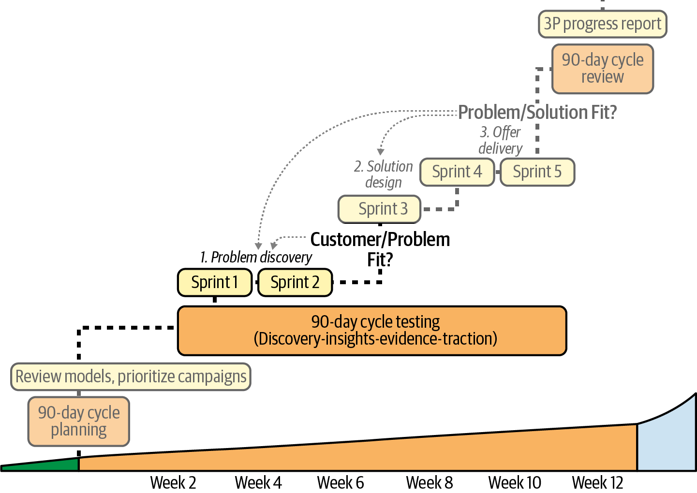

<!-- Page 217 -->

They might give you a solution instead of a problem
Be wary that even customers are prone to the Innovator’s Bias. When
asked about a problem, they will often tell you their idea of how to
solve the problem rather than exploring the problem fully with you. A
misdiagnosis here is a recipe for going down a rabbit hole.
It is for all these reasons that I recommend not even bringing up the word
“problem” during problem discovery interviews. Your objective during these
conversations isn’t to validate problems but to discover them. You do this not
by asking customers about problems, but by asking them how they currently
use existing alternatives. Finding points of friction in their stories (struggles,
workarounds, and pet peeves) and/or gaps between their desired and actual
outcomes is how you uncover problems worth solving.
Before diving into the mechanics of running a problem discovery sprint, let’s
see the problem discovery process in action with a case study.
Case Study: Using Problem Discovery Interviews to Drive New
Home Sales
Imagine that you’re a home builder looking to improve sales and considering
advertising. When would be the worst time of year to run ads for your homes?
Most people would say during the holiday season (October through Decem-
ber), when people don’t want to be bothered with house hunting and show-
ings. The thinking goes that if only a few people are searching for homes
during the holidays, why advertise? Wouldn’t it be better to save your ad
budget until the new year, when traffic picks up? What if I told you that the
holidays are a great time to run ads, albeit of a different kind?
One homebuilder effectively used problem discovery interviews to uncover key
insights that helped him build a steady pipeline of qualified leads. Here’s what
he did: he started by identifying the time of year when most homes are sold
(March through May), and targeted people to interview who had closed on
their homes during that period. It’s important to appreciate that he wasn’t
looking to pitch his houses to these people (remember, they had already just
bought a new house), but rather to learn from them. Specifically, he wanted to
understand the series of events that caused them to buy their home, starting
with the switching trigger, which led him back to the holidays.
While he uncovered a few different stories, one specific cluster stood out. A
number of his interviewees traced their first thought of buying a new home
back to the morning after a holiday party (say, Thanksgiving dinner) they
had hosted at their house. The morning after the party, the house was a mess
and the couple discussed the possibility of upgrading to a bigger home at the
breakfast table. Their house, which had seemed perfectly fine the day before

<!-- Page 218 -->

the party, now felt too small for them (expectation violation). They discussed
how their extended families had grown and talked about their desire to host
more family gatherings in the future, which necessitated the need for more
entertaining and living space.
The holiday party had served as the switching trigger, which broke their exist-
ing alternative (their current home) and pushed these home buyers to passively
look for a new home. Using the switching trigger to anchor the conversation,
the builder then asked these home buyers to walk him through the detailed
series of steps they took to research, find, purchase, and move into their new
home. He took copious notes and later postprocessed them into a set of action-
able insights.
The following holiday season, the builder was ready with a content market-
ing campaign. He wrote up several helpful articles that answered the most
common questions (points of friction) his interviewees had when navigating
their home-buying journey. He gave tips on things like where to find the best
mortgage interest rates, the best neighborhoods for schools, pitfalls to avoid
when hiring moving services, design trends, etc.
He linked these articles to hyper-local ads he ran during the holiday season,
with great effect. Come early January, while his competitors were just ratchet-
ing up their ad spend to attract new leads, he already had a steady pipeline of
qualified leads.
Focus on the Bigger Context: The Job-to-be-Done
As we discussed in Chapter 2, products compete in a bigger context, where dif-
ferent categories of products compete for the same jobs-to-be-done. Getting to
the bigger context during a customer interview is key to uncovering problem(s)
worth solving. Let’s see how this is done with another case study.
Case Study: Using Problem Discovery Interviews to Build Better
Drill Bits
People don’t want a quarter-inch drill bit, they want a quarter-inch hole.
—Theodore Levitt
Harvard professor Theodore Levitt made the case for focusing on finished-
story benefits over features. In other words, customers don’t want your solu-
tion, they want what your solution does for them—i.e., to achieve an outcome
or get a job done.
Suppose you are a drill bit manufacturer looking to build a better drill bit.
Instead of chasing random features, you decide to study how people use drill

<!-- Page 219 -->

bits. One of the problems that top the list is that drill bits often break. So, you
introduce a new titanium-coated drill bit with a unique value proposition of
“40% stronger.”
Sales are good for a while, until one day a new product shows up in the
hardware aisle next to your drill bit. Even though the product seems out of
place, customers flock to it and your sales start to erode. That product is
Command Strips made by 3M that allow people to get the job done without
having to drill a hole.
What just happened?
While Levitt’s insight had a profound impact in shifting our perspective from
features to outcomes, his example didn’t go far enough. A quarter-inch hole
represents a functional outcome, and it isn’t what people want, but rather
what they need to get a job done. An easy way to tell the difference is
noticing that “a quarter-inch hole” in itself is actually an undesired outcome.
People don’t want a quarter-inch hole, but something else that comes after
the quarter-inch hole. That is where the desired outcome lives—in the bigger
context.
NOTE
Features live in the product context, while outcomes and jobs live in the bigger
context.
Getting to this bigger context first requires a narrowing of focus. Levitt’s quote
references people in general, but that is too broad. The reason a homeowner
hires a drill bit is very different from the reason a construction worker does.
So, the first step is dividing your target audience into two more specific cus-
tomer segments, like homeowners and construction workers. Then, as before,
you set out to study how these customer segments use drill bits. But instead of
settling on quarter-inch holes as the desired outcome, you search for the bigger
context by looking beyond the quarter-inch hole for a more desirable outcome.
TIP
Chasing desirable outcomes is how you move out of the product context space
and into the bigger context.
In the case of homeowners, one of these desirable outcomes might be hanging
a painting. They drill a hole to secure a hook in order to hang a painting. A
painting on a wall is clearly more desirable than a hole or hook in a wall. It
represents a desired outcome.

<!-- Page 220 -->

The more interesting innovation question then becomes: how can you help
customers get the job done (hang a painting) without the undesired steps (like
drilling holes and using hooks)? That’s where the 3M Command Strips come
in. This solution requires no drilling, so there are no holes, no mess, and
hanging a painting is simpler and cheaper than with the alternative.
Focusing on the quarter-inch hole might help a drill bit manufacturer win the
battle of building a better drill bit against other drill bit manufacturers. But
they could still lose the war, which is fought on the battleground of a bigger
context.
Finding the Bigger Context
An effective way of quickly getting to the bigger context is applying this
exercise, from author Kathy Sierra:
• Don’t build a better (x). Build a better user of (x).
•
Here are some examples:
• Don’t build a better (camera). Build a better (photographer).
•
• Don’t build a better (business model canvas). Build a better (entrepreneur).
•
• Don’t build a better (drill bit). Build a better (DIY homeowner).
•
Focusing on making your customers better versus making your solution better
is a way of breaking through the product context. You move beyond your
product’s immediate features and benefits and instead focus on your custom-
ers’ desired outcomes or jobs-to-be-done. The challenge, of course, is that this
widening of perspective can lead to the identification of many more customer
jobs than you can reasonably take on. Where do you focus? The reality is that
most entrepreneurs stay stuck in their own product context and never think
beyond tasks or features. That’s a mistake.
TIP
It’s better to level up until you potentially get out of scope than to stay stuck in
the weeds.
Too narrow a job scope, and you risk getting displaced by a competitor that
addresses a larger job scope better. Too broad a job scope, and you may spread
yourself too thin. So how do you determine the right job scope?

<!-- Page 221 -->

Scoping the Bigger Context
The right job scope to tackle lies somewhere between your solution’s immedi-
ate functional benefit and making your customers better:
1. Start with the immediate functional benefit or outcome your customers
1.
will realize after using your solution.
2. If this outcome is still within your solution space and/or not yet desirable,
2.
keep leveling up by searching for what comes after.
3. Stop when the answers get out of scope.
3.
Applying these steps to the quarter-inch drill bit yields (Figure 8-2):
1. Why do DIY homeowners buy a quarter-inch drill bit?
1.
To get a quarter-inch hole (functional step, not desirable yet).
2. Why do they want a quarter-inch hole?
2.
To secure a hook (functional step, not desirable yet).
3. Why do they want to fasten a screw?
3.
To hang a painting (job, desirable).
4. Why do they want to hang a painting?
4.
To decorate their house (job, desirable).
5. Why do they want to decorate their house?
5.
To express themselves (job, desirable).
6. Why do they want to express themselves?
6.
Starting to get metaphysical.
Figure 8-2. The bigger context

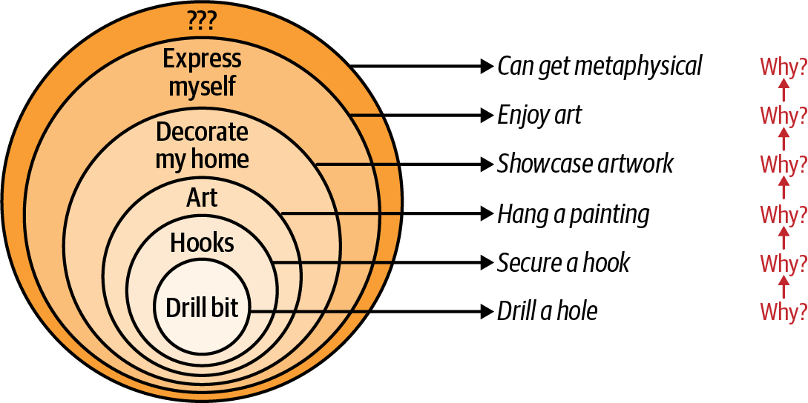

<!-- Page 222 -->

NOTE
The bigger context is where you find spaces for innovation.
Diving Deeper into a Bigger, More Specific Context
Once you identify the overlapping bigger contexts, pick one to explore further.
What you pick should ideally be constrained by your specific viability and
feasibility constraints.
Define your viability constraint in terms of the size of the problem you need to
find to make your business model work. Remember that this comes from your
traction roadmap. In our example, the “hang a painting” context is a $10–20
problem, but once you move to the context of art or decorating one’s home,
you can potentially find problems that are worth hundreds or thousands of
dollars.
Define your feasibility constraint in terms of your core competency constraints.
In other words, are there domains you would not want to compete in? If you
are a drill bit manufacturer, for instance, do you want to get into the glue
business?
Once you define the right bigger context for you, dive deeper to explore how
the job is done and look for struggles (problems worth solving).
Running a Problem Discovery Sprint
A problem discovery sprint is run in a two-week time box and utilizes one-
on-one interviews to understand why and how customers picked an existing
alternative to get a job done.
During the interview, it helps to take on the persona of a journalist or detective
and be genuinely curious. Your job is to uncover the series of events starting
with the switching trigger that set off the interviewee in search of the chosen
existing alternative and ending with their most recent encounter with the exist-
ing alternative.
You capture these insights after each interview on a Customer Forces Canvas.
We’ll cover how to do this later in this chapter.
Contrary to popular belief, it doesn’t take a lot of interviews for patterns to
emerge. With just 10–15 focused interviews, you can typically uncover 80% of
the insights. As Mary explained to Steve in the previous chapter, you know you
are done when you stop learning anything new from the interviews—in other
words, when you can accurately predict what the interviewee is going to say
just by asking a few qualifying questions, you’re finished.

<!-- Page 223 -->

Broad-Match Versus Narrow-Match Problem Discovery Sprints
While it’s tempting to immediately target your early adopters for interviews,
the danger here is going too narrow too quickly and falling prey to the local
maximum trap (discussed in Chapter 1). A more effective approach is setting
yourself to run two batches of interviews (over two sprints): a broad-match
problem discovery sprint and a narrow-match problem discovery sprint.
During the broad-match problem discovery sprint, you target people that have
recently bought and/or used an existing alternative. As we saw in the home-
builder case study, the builder did not initially target his early adopters, but
people who had recently bought a house.
Once you process your initial findings from the broad-match problem discov-
ery sprint, you are then able to further home in on your ideal early adopters.
That’s when you run the narrow-match problem discovery sprint to verify your
insights.
As a rule of thumb, be prepared to run two problem discovery sprints (broad-
match and narrow-match) and interview 20–30 people over a 4-week period.
This is roughly equivalent to talking to 5–8 people per week with some time
built in for processing your learnings.
By the end of your problem discovery sprint(s), you should be able to demon-
strate customer/problem fit (with evidence). You achieve customer/problem fit
when you have identified a big enough customer problem worth solving. I’ll
cover more detailed criteria for determining customer/problem fit toward the
end of this chapter.
Running a problem discovery sprint—whether broad-match or narrow-
match—involves three steps:
• Finding prospects
•
• Conducting interviews
•
• Capturing insights
•
Let’s take a closer look at each of these.
Finding Prospects
Since the goal of problem discovery is understanding how people currently
get a job done with existing alternatives, it follows that you should target
people who have recently attempted to use one or more of the popular existing
alternatives listed on your Lean Canvas. If you are unsure what existing alter-
natives your customers use, turn your focus to triggering events:

<!-- Page 224 -->

• When a customer encounters [a triggering event], they [use possible exist-
•
ing alternative].
• Example: When entrepreneurs get hit with an idea, they go to startup-
•
specific meetups.
Using this exercise, you may end up with indirect and even complementary
solutions, which is okay. You can use this approach to find potential people to
interview, and through the interviews discover the actual existing alternatives
that directly compete with your envisioned product.
Here are a few additional guidelines to keep in mind when prospecting for
interview candidates:
Target prospects based on how recently they switched to (or used) an existing
alternative
Because memory has a short half-life, it’s best to target people who have
either purchased or used an existing alternative within the last 90 days.
This time frame is short enough to allow people to recall important details
but long enough for them to have tried the existing alternative enough
times to be able to evaluate whether it got the job done.
Build a frame around learning, not pitching
In a pitch, since you’re doing most of the talking, it’s very easy for cus-
tomers to pretend to go along with what you’re saying, or to outright
lie to you. The problem with starting with a pitch is that it is predicated
on having knowledge about the “right” product for the customer. Before
you can pitch the “right” solution, you have to understand the “right”
customer problem.
In a learning frame, the roles are reversed: you set the context, but then
you let the customer do most of the talking. You don’t have to know all
the answers, and every customer conversation turns into an opportunity
for learning. Leading with a learning frame, where you’re seeking advice
and not selling anything, is also an effective disarming technique, which
allows your prospect to let down their guard and talk more freely.
Start with people you know
Finding people to interview can be challenging at first. Start with peo-
ple you know who fit your target profile. Some are wary that feedback
received from close contacts may be biased. My view is that talking to
anyone is better than talking to no one. Then use them to get two or
three degrees out to find other people to interview. Not only does this help
you practice and get comfortable with your interview script, but it’s an
effective way to get warm introductions to other prospects.

<!-- Page 225 -->

Ask for introductions
The next step is asking your “first-degree contacts” for introductions to
people they know who meet your target profile. It’s a good idea to provide
a message template that your contacts can simply cut and paste and for-
ward to save them time. Here’s an example I’ve used in the past:
Hey [friend],
Hope all is well…I have a quick favor to ask.
I’ve got a product idea that I’m trying to validate with wedding photog-
raphers. My goal is to chat with local photographers to better under-
stand their world and evaluate if it’s worthwhile pursuing this product.
I’d really appreciate it if you could send the message below along to
people you know who fit this target.
(Feel free to change it a bit if you like.)
---
Hello,
We are an Austin-based software company and are currently working
on a new service to simplify how photographers showcase and sell their
images online. We are specifically building better and faster tools for
online proofing, archiving, and selling.
I would love to get 30 minutes of your time to help us understand your
current workflow. I’m not selling anything, just looking for advice.
Thanks,
Ash
Play the local card
People are generally willing to meet if they can identify with you. The
email above emphasizes “Austin” in the body and was quite effective in
setting up meetings with local photographers.
Give something back
Turn the interview into a “real interview” and offer a writeup, podcast,
blog post, or video in exchange. This creates an incentive for your inter-
viewees to talk to you, in exchange for insights you’ll share with them or
publicity.
It’s okay to compensate prospects for these interviews
Since discovery interviews are geared at collecting factual information only
and you will not be pitching your solution, it’s okay to offer compensa-
tion to facilitate recruitment. A $25–75 gift card might be reasonable
compensation for a 30- to 45-minute interview, depending on the customer
segment you are targeting.

<!-- Page 226 -->

Steve Kicks Off the First Problem Discovery Sprint
Steve calls a sprint kickoff meeting with Mary, Lisa, and Josh. They are all
on board with starting with the mafia offer campaign. They plan on running
10 problem discovery interviews across 2 business model variants in the next
sprint: Software Developers and Home Construction.
“So how do we figure out who to target?” Josh asks.
“Well, the ‘software developers’ one is easier,” replies Steve. “I know a bunch
of developers and agencies that do AR/VR work, I can easily arrange 10
friendly interviews there. It’s the architects I’m not so sure about. Any of you
know any architects that we can speak with?”
“Not directly, but I’m sure I can ask around. If not, I’ve done lots of cold
prospecting before,” Lisa replies.
“With home construction, it may be helpful to take a two-pronged approach,”
Mary jumps in. “You certainly want to try and arrange some meetings with
architects, but I’d prioritize warm introductions over cold prospects, if possi-
ble, for all the reasons we discussed in the last meeting. In addition, I think it
would be a lot easier and beneficial to target clients of these architects—people
who’ve just finished building their homes.”
“That’s an interesting thought. Is it to get the end-client perspective too?” Josh
asks.
“Exactly,” replies Mary. “You need to see an idea from multiple perspectives,
and I always try to get as close to the end user as possible and work my
way backward. I guarantee that the problems an architect sees with building a
custom home will be very different from the homeowner’s perspective.”
“Totally. I can imagine the architect being all about efficiency and process
while the homeowner is where we’ll find lots of emotional energy—the bigger
context,” Josh adds.
“I like that approach, too. Mary, why did you say it would be a lot easier to
talk to homeowners?” asks Steve.
Mary smiles. “Because everyone likes talking about themselves, especially if
they’ve just finished building something they’re proud of. Here, too, if you
have any friends or friends of friends who’ve just completed a home construc-
tion project, go talk to them first. Then visit architects’ websites and look for
homes that were recently completed, and directly approach the homeowners.
Simply knock on their door, compliment their house, and let them know that
you are doing marketing research on the new home construction. Ask for 30–
45 minutes of their time and offer them a $50–75 gift card. I think that should
do it.”

<!-- Page 227 -->

“You make it sound so easy,” Steve laughs.
“Interviewing people is simple, but we make it hard on ourselves by overthink-
ing the conversation,” says Mary. “Remember, this isn’t a pitch. Get a little
outside your comfort zone, be genuinely curious, and let the other person do
most of the talking. You’ll be amazed, once they get going, how hard it can be
to get them to stop.”
“Okay, I’ll take your word for it,” Steve replies with a skeptical smile. “So
we’re going to interview three groups of people, then: software developers,
architects, and homeowners. We were originally planning on running these in
pairs and targeting five interviews each. Everyone still good with that?”
Josh and Lisa nod their heads in agreement.
Conducting Interviews
Like any skill worth developing, conducting interviews can be a bit uncomfort-
able at the beginning. But with a little practice (and some guidelines), it’s an
invaluable skill that will serve you throughout the product life cycle. Remem-
ber that Continuous Innovation requires building a continuous learning loop
with customers—and knowing how to talk to customers is the most effective
way to learn.
Here are some guidelines to get you started:
Prefer face-to-face interviews
In addition to picking up on body language cues, I find that meeting
someone in person instills a sense of closeness that you can’t re-create
over the phone. This is critical in customer relationship building. Even if
a face-to-face interview isn’t possible, prefer using a video call whenever
possible.
Pick a neutral location
I prefer to conduct the first interview in a coffee shop to create a more
casual atmosphere. Doing it at a prospect’s office makes it more “business-
like” and makes it feel more like a sales pitch—which it shouldn’t be. That
being said, I’ll agree to meet the prospect wherever they choose.
Ask for sufficient time
Problem discovery interviews typically run 45 minutes, without feeling
rushed. I would suggest asking for an hour and ending early if you’re done
sooner.

<!-- Page 228 -->

Consider outsourcing interview scheduling
The biggest source of waste during this period is waiting—waiting for
people to get back to you, coordinating around their schedules, juggling
time zones, and so on. If you do a little up-front work, you might be able
to successfully delegate this task to a virtual assistant or an online calendar
scheduling tool.
Here’s how I have made this work:
• I script all my email requests for interviews.
•
• I clear my afternoons so that it’s easy to schedule interviews.
•
• I’m copied on all the emails so that I can intervene when needed.
•
Conduct interviews in pairs
If you’ve got other team members, it always helps to conduct these inter-
views in pairs. This way, you can take turns asking questions while the
other person takes notes and formulates additional questions. It’s helpful
to compare notes later and is a great way of keeping your confirmation
biases in check.
Ask questions, don’t make assertions
Your objective with these interviews is to learn, not pitch. How do you
tell when an entrepreneur is pitching? Their lips are moving. The way
you sidestep this pitfall is by talking less and listening more during these
interviews. A good technique is to start or end every sentence (once the
interview is underway) with a question:
• Could you elaborate on that a bit more?
•
• What were you expecting to happen?
•
• What day was that?
•
Focus on facts, not hypotheticals
A golden rule for discovery interviews is focusing on what customers
actually did in the past rather than asking what they may (or may not) do
in the future.
Avoid asking questions like:
• Would you have done X if Y?
•
• Will you buy X in the future?
•
• In the future, would you Y?

<!-- Page 229 -->

Pretend you’re a journalist. Your job is to uncover the raw story and
capture facts, not fiction.
Don’t ask customers about problems
For the reasons I’ve already covered, avoid asking your customers about
problems. You’ll often end up with only descriptions of surface problems,
or the wrong list of problems. Instead, have your customers focus on
how they use existing alternatives and look for points of friction. For
example, if you had asked people about problems with taxis 15 years ago,
they might have said “rude drivers” and “dirty vehicles.” Neither of these
would have led to the invention of ride-sharing services.
If instead you focused on studying how they used taxis, you might have
seen that when people had a flight to catch, they:
• Booked a taxi the night before the flight
•
• Made the booking (and got up) two hours earlier than needed to
•
account for the taxi being late
• Called the taxi company multiple times to confirm that it was still
•
coming
These kinds of pet peeves and workarounds would have uncovered prob-
lems worth solving.
Go deep, be curious
When you’re interviewing customers, you’ll often find that until you break
the ice, they only give you short answers that skim surface problems. The
way to go deeper is to be naturally curious, don’t assume anything, and
follow up with qualifying open-ended questions like:
• How did you do that?
•
• What do you mean by X?
•
• I’m a bit confused…can we slow down the timeline and could you tell
•
me Y?
Chase the bigger context
As we covered earlier in this chapter, you need to search for desired out-
comes to get outside your product context and into the bigger context
where jobs-to-be-done live.

<!-- Page 230 -->

Record the interview (if possible)
If the prospect is okay with being recorded, it’s very helpful to record an
interview that you can listen to again, share with your team members, and
even run through a transcription service, which makes postprocessing a lot
easier.
Re-create the timeline of events
It helps to start the interview by anchoring the conversation around the
selection/purchase event of the existing alternative you are studying. You
then work backward from there to uncover the series of triggering events
that led up to the selection of this existing alternative. Finally, work the
timeline forward to explore the usage of the existing alternative all the way
up to the most recent usage.
Figure 8-3 is a sample timeline from an interview of someone who recently
joined a gym.

<!-- Page 231 -->

Figure 8-3. Customer timeline
Use a meta-script
Since you have limited time, you need to stay focused on your key objec-
tives during an interview to maximize your learning. This is where having
a meta-script helps.

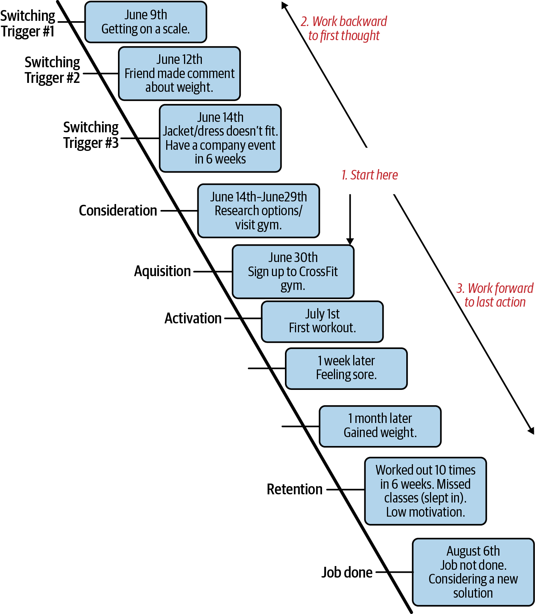

<!-- Page 232 -->

The Problem Discovery Interview Meta-Script (30–45 Minutes)
Welcome (set the stage)
(2 minutes)
Briefly set the stage for how the interview works:
Thank you very much for taking the time to speak with us today.
We are doing some early research around how and when people do [job-to-be-done]. I’d
like to stress that this is not a pitch. Our objective is to learn from you, not to sell or pitch
anything to you.
The best way to think about this interview is that there are no wrong answers. We simply
want to get your raw story. It sometimes helps to think of us shooting a documentary film.
We are the producer and director and we’d like to learn about all the details in order to fill
out the story.
Does that make sense?
Use the rest of the script like a meta-script. The best script for discovery is no script.
That said, it does help to have a few questions ready. But remember to be curious and
try to piece together the customer’s story by asking short, open-ended questions.
Anchor around the chosen existing alternative or the last time the job was done/
attempted (set the anchor)
(5 minutes)
Ask some specific questions to take the interviewee back to the purchase (or hire)
event:
When did you sign up to [existing alternative]?
When did you last use [existing alternative]?
As recollection fades quickly, ask for specific details to help jog the interviewee’s
memory. This has the added effect of further disarming them and opening them up to
your questions:
Do you remember what day of the week that was?
Were you alone or did you take someone with you?
You said you searched online, do you remember what search terms you used?
Look for triggering events (first thought to switching trigger)
(5 minutes)
Go back to earlier in the timeline and try to determine the series of triggering events
that pushed the interviewee to hire the chosen existing alternative:
Okay, so you bought the product on [day]. Do you remember what prompted the purchase?

<!-- Page 233 -->

What did you do next?
When was the first time you realized you needed a new [product]?
What would have happened if you did nothing?
You said you wanted something better. Can you define what you thought at the time would
be better?
Explore selection process (acquisition)
(5 minutes)
Go deeper and understand how they selected the chosen existing alternative:
What happened next? Can you walk us through your selection process?
What else did you consider?
Where did you hear about [existing alternative]?
Why did you pick [chosen existing alternative]?
Do you mind sharing how much you paid for [chosen existing alternative]?
Ask the interviewee to clarify vague terms:
How do you define simple?
You said this was the healthy alternative. Could you help me understand how you tell if
something is healthy?
Explore early use (activation)
(5 minutes)
Slow down time to right after the hire and ask them to share their first-use impressions.
If you hear a struggle or potential friction, dig deeper:
I’d like to go back to right after you signed up for/received [existing alternative]. Walk us
through the unboxing process.
How long did it take you to set it up?
Then what did you do?
How could you tell the product was working?
Explore recurring usage (retention), if applicable
(5 minutes)
Continue exploring ongoing usage and look for struggles and/or friction:
So, how often do you use [chosen existing alternative]?
When was the last time you used [chosen existing alternative]?

<!-- Page 234 -->

What’s next? (next summit)
(5 minutes)
Determine if the job was done successfully and what’s next for the interviewee:
So at the start, you wanted a product that did [desired outcome]. How did your [chosen
existing alternative] fare?
So what’s next?
Wrapping up (next steps)
(3 minutes)
Thank the interviewee for their time. Before leaving, you still potentially have one more
thing to do and two more questions to ask.
Even though you aren’t ready yet to talk about your solution, if the interviewee
matches your potential early adopter criteria, you need to provide a hook to maintain
interest. Your high-concept pitch or UVP is perfect for this.
Then ask for permission to follow up. And finally, ask for referrals to other potential
interviewees:
As we mentioned at the start, we’re just doing early research, but based on your responses
we think the product we are building may be a good fit. Our product aims to [state UVP].
Would it be okay to follow up with you in a couple of weeks to show you a demo?
Also, as we are in the early stages, we are looking to speak to as many people as possible to
learn. Would you be up for introducing us to more [people like yourself]?
Steve Creates a Meta-Script for His Interviews
As Steve has never run these interviews before, he decides to jot down a
meta-script to use with the homebuilders. His goal isn’t creating an exhaustive
list of questions, but organizing the flow of the interview and writing down
some learning questions that he can turn to during the interview.
Welcome (set the stage)
(2 minutes)
Thank you very much for taking the time to speak with us today.
We are doing some early marketing research for a major architecture firm in
the area and are studying the custom home design process. We saw your home
featured on [architect’s website]—you have a beautiful home, by the way—and
were wondering if you’d be up for sharing your design experience with us.
The interview should take roughly 45 minutes. We know your time is valuable
and we can offer you a $75 gift card of your choice for your time.

<!-- Page 235 -->

If it’s okay to proceed:
I’d like to stress that this is not a pitch. Our objective is to learn from you, not
to sell or pitch anything to you.
The best way to think about this interview is that there are no wrong answers.
We simply want to get your raw story. It sometimes helps to think of us
shooting a documentary film. We are the producer and director and we’d like
to learn about all the details in order to fill out the story.
Does that make sense?
Anchor around the chosen existing alternative (set the anchor)
(5 minutes)
When was your home completed?
When did you move in?
Is this your first custom home?
How long did the build take?
Look for triggering events (first thought to switching trigger)
(5 minutes)
So the build took [this long]. I’d like to go back much earlier in the timeline to
your first thought of building a custom home. What prompted that?
How did you know you wanted to build versus buy?
What were you looking to get or achieve?
Explore selection process (acquisition)
(5 minutes)
What happened next? Can you walk us through your selection process?
How did you pick your architect?
What else did you consider?
Explore early use (activation)
(5 minutes)
So, you’d selected your architect—what was the next step?
How long did the design phase take?
What artifacts did you use to select a design?

<!-- Page 236 -->

Explore recurring usage (retention), if applicable
(5 minutes)
How did you make material selections?
How long did that take?
What about construction costs? When did that happen?
What was the back and forth between design and budget, if any?
What’s next? (next summit)
(5 minutes)
So at the start, you wanted to build your dream home—how do think you did?
Are you looking to make any further changes or modifications to your home?
Wrapping up (next steps)
(3 minutes)
Thank you so much for your time. Here’s your gift card. I know it’s a small
gesture, but we really appreciate you inviting us into your beautiful home.
A final question: do you happen to have friends who’ve also built custom
homes? We are trying to speak to as many people as possible and would
greatly appreciate an introduction.
Capturing Insights
After each interview, you’ll end up with a lot of raw information, which can be
overwhelming to track. This problem is only exacerbated as you conduct more
interviews.
The end goal of these interviews isn’t creating a 20-page customer research
report, but summarizing your learnings into actionable insights that describe
the most common customer journey stories. For any given market, there isn’t
an infinite number of customer journey stories. Patterns quickly emerge, and
most markets have three to five stories that reoccur.
How do you find these patterns? On the one hand, your brain is naturally pat-
tern seeking and will automatically look for similarities across your interviews.
The problem, though, is that your brain can be easily fooled:
The first principle is that you must not fool yourself, and you are the easiest
person to fool.
—Richard P. Feynman, American theoretical physicist

<!-- Page 237 -->

This happens through the work of our cognitive biases. Two of the more
common biases to be particularly aware of here are confirmation bias and
recency bias.
Confirmation bias is where we tend to pay more attention to things we hear
that align with our own worldviews (like problems that justify our solution)
and less attention to things that don’t.
Recency bias is where we place more weight on things that just happened (like
hearing about a particular problem three times in a row) that when taken as a
whole may be outliers, not the common pattern.
The way to sidestep these biases is by taking an empirical approach to captur-
ing and ranking your insights on a Customer Forces Canvas (Figure 8-4).
Figure 8-4. The Customer Forces Canvas

<!-- Page 238 -->

Here are some guidelines for effectively capturing the insights from your
interviews:
Summarize your insights immediately after each interview
Reserve 5–10 minutes after each interview to postprocess your raw notes
into a Customer Forces Canvas. I generally block off an hour on my
calendar for a customer interview and aim to wrap up the interview within
45 minutes, leaving 15 minutes for postprocessing.
Avoid groupthink
If you’re interviewing in pairs, it’s best to create your own versions of the
customer story independently and then compare notes in order to avoid
groupthink.
Fill out the Customer Forces Canvas in chronological order
While the flow of problem discovery interviews will most likely not follow
a chronological timeline, your goal is reconstructing the customer story as
a series of causal events in chronological order.
Summarize your interview insights in the order shown in the following
sidebar. This is great practice for developing a customer story pitch, which
we’ll cover in Chapter 10.
Filling Out the Customer Forces Canvas
PUSH (motivation for progress)
Identify what changed in the interviewees’ environment that pushed them to get a job
done:
Triggering Event(s)
Start by identifying the first thought and any subsequent events that moved them
from doing nothing to passively looking, then actively looking for a solution.
Switching Trigger (If Any)
If the person switched from an old way to a new way of getting a job done,
highlight the causal event that caused them to switch. This could be due to:
• A bad experience with their current solution
•
• A change in their circumstances
•
• An awareness event, like getting diagnosed with high blood pressure at their
•
annual physical at the doctor’s office
Desired Outcome
What was the desired outcome at the start of their journey? What specific met-
ric(s) would they use to measure success?

<!-- Page 239 -->

What’s at Stake
What were the consequences (if any) for ignoring the triggering event(s) and
doing nothing?
PULL (attraction of the chosen solution)
Identify what attracted them to their chosen solution:
Consideration Set
What other existing alternatives were considered for the job?
Chosen Solution
List the chosen solution that was hired for the job. Make note of where they found
the chosen solution (channel) and what they paid (if applicable).
Unique Value Proposition (Promised Outcome)
What was the specific appeal of the chosen solution? In other words, why did they
pick this solution over other alternatives?
Expected Outcome
What did they expect to achieve with the chosen solution? What specific metric(s)
would they use to measure success?
INERTIA (resistance to changing the status quo)
List the resistive forces from their old ways. This could come from an existing solution
they are already using to get the job done, or if this is the first time they are attempting
this job, it could be from existing habits that get in the way.
Existing Solution (If Any)
If they are currently using a solution (old way) to get the job done, list here.
Otherwise, leave this box blank.
What’s Broken?
What specific problems have surfaced with their existing solution as a result of the
switching trigger?
Barriers to Switching
Identify any existing habits or switching costs that would prevent them from
switching solutions.
FRICTION (resistance to using the chosen solution)
List the resistive forces that get in the way as the person uses their chosen solution.
These are often caused by anxiety about change and other barriers to adoption, like
usability issues.
Anxieties
List any fears or worries the person expressed as they started using their chosen
solution.
Barriers to Adoption
List any challenges the person encountered with the chosen solution during
usage.

<!-- Page 240 -->

Additional Details (if any)
Use this section to capture any additional insights about the chosen solution.
WHAT’S NEXT?
Summarize the current state of the person.
Actual Outcome
What was the actual outcome the person experienced after using the chosen
solution?
Next Summit
What’s the next action for this person? Was the job done well enough? Will they
continue using their chosen solution or consider using a new solution?
Practice summarizing the customer journey story
As you complete your Customer Forces Canvas, verbalize your key
insights from each interview using the following story template:
When customers encountered a switching trigger,
they had an expectation violation (What’s at Stake).
So they started considering some new solutions (Consideration Set).
And they picked a new solution because (Unique Value Proposition).
What kept them from switching (INERTIA).
What pulled them to switching (PULL).
What anxieties they had (FRICTION).
Where they are now (Next Summit).
Categorize your Customer Forces Canvases into jobs-based customer segments
As you complete each Customer Forces Canvas, look for common patterns
around triggering events, desired outcomes, and existing alternatives, and
create one or more jobs-based customer segment buckets (Figure 8-5).

<!-- Page 241 -->

Figure 8-5. Jobs-based segmentation criteria
People who share similar triggering events, desired outcomes, and existing
alternatives tend to behave more similarly and can be grouped together as a
segment (Figure 8-6).

<!-- Page 242 -->

Figure 8-6. Creating jobs-based customer segments
For example, in the homebuilder case study, the builder uncovered the top
customer story clusters shown in Table 8-1.
Table 8-1. Top customer story clusters from the homebuilder case study
Switching trigger
Desired outcome
Chosen solution
Holiday party
Want a bigger house for more entertaining space
(growing family)
Picked a 3,000 sq ft home
Holiday party
Want to downsize because we don’t want to entertain
anymore (empty nesters)
Picked a 1,200 sq ft condo
Expecting a baby
Want two extra rooms and a backyard
Moved to suburbs
Moving for a job
Want to be close to work
Picked a home within five miles of
work
Now It’s Your Turn
Visit the LEANSTACK website to:
• Download a blank Customer Forces Canvas template.
•
• Upload your interview transcript and create your Customer Forces Canvas online.
•

<!-- Page 243 -->

Steve Reviews the Results of the Broad-Match Problem
Discovery Sprint
Steve kicks off the meeting. “Who would have thought interviewing customers
could be this much fun? Thinking of products in terms of these customer
forces is a game changer! It’s even made me more aware of how I buy
products.”
“I see you got over your stage fright quickly,” Mary comments.
“Yeah, having the meta-script was a nice safety net, but I found that once
the conversation started it was quite easy to keep the other person talking.
Even when I was pausing to think, probably sensing my confusion, people kept
talking to fill in the blanks.”
Mary laughs. “I see you stumbled into one of the more advanced interviewing
tactics. You can learn a lot about interviewing from negotiation tactics. There’s
a great book by Chris Voss, Never Split the Difference, that I highly recom-
mend picking up. So what did you guys learn from the interviews?”
Josh gestures to Steve to give the update.
“Well, I think the Software Developers model is a dead end. The demand for
AR/VR apps is still pretty fringe. Only one of the five agencies we spoke with
had recently completed a big VR project for a media company. They told us
that while there’s a lot of promise in this space, many of their clients are still
just playing around with the tech and aren’t confident enough yet to risk their
brand with a mainstream app. I think the industry needs to see a breakthrough
app first to pave the way for others to follow.”
“That’s often the case with new tech like this that is so radically different,”
says Mary. “How about home construction? How did those conversations
go?”
“Those were quite interesting,” Steve replies, “but I don’t think we’ve got
the whole story yet. You were right about there being two very different
perspectives here. We only got to talk to three architecture firms and they were
all business. They all offer 3D renderings as part of their design package for
higher-end homes, which they use to help the clients visualize the space. Other
clients can request renderings for a fee, which was pretty close to our estimate
of $3–5k. But here’s the funny part: they do walkthroughs with clients in their
office using a computer, but send the client home with a few color prints. They
never get the models.”
“Do any of them use AR/VR?” asks Mary.

<!-- Page 244 -->

“No. One of them mentioned seeing a demo at a conference once and also
thought the tech had a lot of potential, but they said it was still too expensive
and complicated. I was so tempted to show them a demo, but Josh kicked me
under the table.”
Josh laughs and taps Steve on the back. “We weren’t supposed to talk about
the solution. I also wanted to ask them if they would do more renderings if the
process were easier and stopped myself.”
Mary smiles. “Those were both the right calls. So what was the homeowners’
side of the story?”
“That’s where we found lots of energy,” Steve replies. “We spoke with five
homeowners—three of them got renderings as part of the standard package
and one of them paid to get them. They all described their first viewing of the
renderings as the moment when they really saw their home ‘come to life from a
floor plan.’ Those were their exact words.”
“Yeah, they were pretty excited, and some still have their printouts,” Josh
jumps in. “What I found interesting is after they were able to visualize their
space, that’s when they started requesting more changes, which pushed out the
design schedule by at least two weeks. In one case, it took three months to
land on a finished design.”
“Did they get updated renderings with each revision?” asks Mary.
“Not in all cases, which was a pet peeve for sure,” replies Josh. “There was the
story of this one homeowner who asked for the model file and created his own
renderings.”
“That’s interesting. Was he an architect or designer?”
“No, but he was pretty tech-savvy. He taught himself how to use the modeling
software and I think even bought it so that he could visualize the project and
make changes.”
“That’s a great sign. Then what happened?” Mary asks.
Josh and Steve look at each other. Then Steve begins, “That’s where we ended
our conversations. I think if we can build an app that clients can use to
visualize their homes from their phones, that would greatly speed up the design
process.”
“Sure, that could certainly be the case, but I’d like you to explore the impact
of homeowners having access to these models even beyond the design process,”
replies Mary. “Did the models play a role in cost, or materials selection, or
furniture selection? If so, how?”

<!-- Page 245 -->

Lisa finally jumps in. “One of the homeowners briefly mentioned using the
floor plans to buy IKEA furniture toward the end of our conversation. Appa-
rently, IKEA has a full-service design offering where they use a floor plan to
suggest room furnishings.”
“That’s exactly the kind of exploration you need to do in your next round
of narrow-match interviews—uncover the bigger context of these architecture
models,” Mary says. “I have a feeling they get hired for multiple jobs.”
When Are You Done with Problem Discovery?
At the end of each problem discovery sprint, review your jobs-based clusters of
Customer Forces Canvases and first determine if you’ve uncovered all the top
customer journey stories.
As we’ve discussed, there are typically three to five top stories in any customer
segment. If you’re still uncovering new information in each interview, plan on
running another batch of interviews and run another problem discovery sprint.
If, on the other hand, your recent interviews sounded similar to ones you’ve
previously run, and you’ve identified some clear patterns, you’ve probably
uncovered all the top stories. Move to test your top story clusters for cus-
tomer/problem fit—i.e., whether they represent a big enough problem worth
solving.
Test for customer/problem fit by asking two questions:
Have you uncovered a big enough problem(s) with the existing alternatives to
cause a switch?
Look for evidence of sufficient friction and/or dissatisfaction with the
existing alternatives. These could have come up as pet peeves, work-
arounds, usability issues, unmet needs or wants, and/or gaps between
desired outcomes, promised outcomes, and actual outcomes.
Is enough time, money, and effort currently being spent on the existing
alternative?
This is where you test whether the problem(s) is worth solving. Check
against your Fermi estimate assumptions (pricing and customer lifetime)
from your traction roadmap.
If the answer to both questions is yes, you’re ready to move on to the solution
design sprint, where you’ll design a solution to cause a switch.

<!-- Page 246 -->

The Altverse Team Uncovers Several Additional Jobs-to-
be-Done
The team assembles again at the end of their narrow-match problem discovery
sprint to review their learning. Steve begins, “So, we went back to our tech-
savvy homeowner, and interestingly enough, he’d used the model as recently
as last week to lay out his office furniture. He even brought up the model and
showed it to us. He also mentioned using it with his landscaper to design the
landscaping. He admitted the models are rudimentary, but he and his family
have used them to make lots of decisions.”
Lisa jumps in. “We additionally spoke to another 10 recent homeowners, and
a pattern is starting to emerge. There is a big pain point around the design
cycle time. They recounted numerous stories of how they were hoping to be
done in three months, and while getting to the first concept was fast, reaching
a final design that was also within budget took them twice as long.”
Josh adds, “This is also where we also struck a nerve with architects. They
charge a fixed design fee, so when the design stage takes twice as long, it
directly affects their bottom line.”
“So you think better round-trip visualizations would help them reach a final
design faster?” Mary asks.
Steve cuts in. ”I know we aren’t supposed to think about the solution, but in
addition to better visualization, since we’ll have all the material selections in
the model, we might be able to generate a rough cost estimate in real time.”
“That’s an interesting idea, Steve,” Mary responds. “And there’s nothing
wrong with thinking about solutions to new jobs like this one. I just don’t
want you to rush into building it out just yet. That said, it seems to me like
you’ve found at least three jobs to be done here: visualizing a design, pricing
the design, and laying out spaces. I’m sensing there’s a big enough problem
worth solving in here, which is the litmus test for customer/problem fit.”
“Cool —so what are the next steps?” Steve asks.
“The next step is running a solution design sprint where you design a mini-
mum viable product that can cause a switch.”

<!-- Page 247 -->

C H A P T E R 9
Design Your Solution to Cause a Switch
For people to hire your product, they have to fire something else.
—Clayton Christensen
By the end of your problem discovery sprint(s), you should have identified
one or more customer story clusters that represent one or more big enough
customer problems worth solving. Given enough time, money, and effort, you
can build almost anything today. The challenge, of course, is that you never
have enough of any of those. Yet, you have to build something remarkable
anyway—and quickly. Remember that speed of learning is the new unfair
advantage. This is where your minimum viable problem (MVP) comes in.
NOTE
The art of the MVP is racing to deliver the smallest solution that causes a switch.
While it’s normal to want to solve all the problems you’ve uncovered during
problem discovery, doing that easily leads to scope creep. Don’t automatically
assume that everything has to be included in your MVP. Instead, start with a
clean slate and use the next two-week sprint to design a solution that causes a
switch (Figure 9-1).

<!-- Page 248 -->

Figure 9-1. The solution design sprint
Steve Learns About the Concierge MVP
“I’ve mapped out the minimum feature set I think we’ll need for the home
construction use case. It will be able to accept a 2D floor plan and render a
fully immersive 3D model in less than five minutes. Architects can then specify
materials which get rendered from a catalog. The catalog will be seeded with
some commonly used materials, but anyone can add new materials from their
phone just by taking a few pictures of the real material. The resulting model
will be viewable on a mobile phone or tablet. We will, of course, probably
have to add more features, but this would be the minimum to start.”
“That sounds pretty impressive,” Mary says. “How long will it take to build?”
Steve lets out a little sigh. “We can demo a working version in two or three
weeks, but the fastest I can get a working MVP ready is four to six months.”
“Six months!” Lisa exclaims. “Can we speed things up if we get some offshore
developers?”
Steve responds, “I don’t think so. A lot of this is so new that it could take three
months just to bring someone else up to speed. And I wouldn’t want to share
the core code with anyone outside the company.”

<!-- Page 249 -->

“I agree with both of you,” says Mary. “Outsourcing is seldom effective for
products like these, and six months is too long. We need to find a way to get
something running in less than two months.”
“That’s going to be impossible!” Steve interjects.
Mary holds up a hand. “Hold on…I want to go back to something you said
earlier. You said you could demo a working version in the next two or three
weeks. Why can’t that be the MVP?”
“The core rendering engine is ready,” Steve says, “but there is no user interface
around it. I can render these models for the demo but I have to drive the
entire process from the command line using scripts. I was looking for ways to
automate these steps and seeing if we could build a Wizard-of-Oz MVP, but
there are still too many manual steps required. Building a user interface with
the right UX is where Josh comes in. We’ll also have to build a bunch of stuff
like user roles and permissions to really productize the engine—”
Mary interrupts Steve again. “So the steps to render the model are manual—
how about viewing it on a mobile phone?”
Steve responds, “That’s done. It’s the same app I showed you when we first
met.”
“I don’t see why you can’t launch your MVP now. You are the product, Steve.”
A confused look comes across Steve’s face.
“This is the perfect place to apply the Concierge MVP recipe, which is another
validation recipe popularized by the Lean Startup movement. I think Manuel
Rosso may have coined the term after he applied it to his startup, Food on the
Table.”
“How does it work?” Josh asks.
Mary explains, “At the end of the day, customers want an outcome, not a
product. The basic idea behind the Concierge MVP is using a services or
consulting model to deliver value to customers. Unless I’m missing something
obvious, you have all the pieces to render and view AR/VR models, minus the
end user product packaging. That’s not what’s riskiest, so skip the packaging
for now and just deliver the models as a service.”
“That makes total sense,” says Josh. “The architects take a couple of days
anyway to build their current 3D models, so this should work well as they
aren’t expecting a fully automated product.”
Steve jumps in. “That could certainly work, but it won’t be scalable. I can
probably turn around each model in half a day. The more complex ones might
take a day.”

<!-- Page 250 -->

“Your traction roadmap requires taking on just two customers a month,”
Mary comments. “I think you’ll be fine for a while.”
Steve nods. “Sure, that’s easy.”
“And remember,” Mary continues, “a Concierge MVP isn’t meant to be your
final product; it’s a tactic for racing to value delivery and testing your riskiest
assumptions. Along the way, unlike with traditional consulting, your objective
is replacing yourself as the product with something more automated and scala-
ble. The best way to do this is by making incremental investments to speed up
your efficiency. Your goal would be reducing the model rendering time from a
day to five minutes.”
A lightbulb goes off for Steve. “I totally get it now. This is another way to play
the hockey stick and grow traction in stages.”
“You got it.”
“Are there more MVP recipes?” Steve inquires.
“Yes,” Mary replies. “There are a couple more that could also be applied here.
But I think Concierge is the ticket to unblocking your delivery time.”
“How would we price the Concierge MVP,” Lisa asks, “since people are accus-
tomed to paying more for services than a software product? Do we charge
more now and drop pricing later?”
“Good questions, Lisa,” Mary replies. “The first thing is to determine a fair
price for your product based on the value you can deliver. With the Concierge
MVP, you certainly have the option of charging consulting rates now and
dropping the price over time as you productize, or starting with the product
price at the start. It often comes down to who your customer is. B2B custom-
ers, for instance, are accustomed to paying a lot more for services.”
“That makes total sense,” Lisa says. “Do you have some guidance on how to
set fair pricing?”
Mary replies, “Yes, that’s the work you’ll be doing during the solution design
sprint. Other than feasibility constraints, which we just discussed, you need to
tackle desirability and viability. I’ll send you all some material on that next.”
Running a Solution Design Sprint
A solution design sprint is run over a two-week time box, where you use the
insights you have gained from your problem discovery sprint(s) to design the
first iteration of your solution (MVP) to cause a switch.

<!-- Page 251 -->

While MVPs only emphasize viability, probably because this is often the most
overlooked aspect when designing products, the right solution needs to simul-
taneously balance desirability, viability, and feasibility in order to cause a
switch and make your business model work.
Over the next several sections, I’ll cover a step-by-step process for reviewing
the insights from your problem discovery sprints through the lenses of desira-
bility, viability, and feasibility. Keep in mind that the different lenses may pull
you in opposing directions. The art is finding the right balance, where all three
lenses intersect. This may require taking multiple passes through the steps.
Addressing Desirability
Desirability, in the context of causing a switch, comes down to problem and
promise. The promise is synonymous with your UVP, and the best way to craft
a compelling UVP is nailing a problem your customers are already familiar
with.
NOTE
A product that causes a switch promises customers a better way of getting their
job done without the problems they are currently struggling with.
Furthermore, as we’ve previously covered, in order to cause a switch your
promise needs to be significantly better than the existing alternatives. Incre-
mentally better (20–30%) isn’t enough—you need to be 3x–10x better.
Since your goal with your MVP is racing to deliver value, the right MVP then
needs to address the smallest subset of problems that, when solved, still create
a big enough promise to warrant switching to your product.
The remainder of this section will walk you through how to think through this
process.
Step 1: Identify the primary struggle
Problems can pop up anywhere in the customer journey, but look back over
your Customer Forces Canvases and identify the area of primary struggle.
This generally comes from:
• Dissatisfaction (i.e., a job not done well enough)
•
• Friction during usage of the chosen solution
•
• Friction during selection of a solution
•
To identify the area of primary struggle that your product will address:

<!-- Page 252 -->

Find and address dissatisfaction
Remember that all jobs-to-be-done start with a triggering event that ini-
tiates an unmet need or want—i.e., creates a gap between the current
outcome and the desired outcome. The first thing to evaluate is the size of
the gap between a customer’s desired outcome and the actual outcome. In
other words, start by checking to see if the job was done well enough.
If the answer is no and the gap between desired and actual outcomes is big
enough, this could be the basis for your UVP. An unmet desired outcome
makes for the most effective kind of switching trigger, provided you can
promise and deliver a better outcome.
If you find that the job is being done well enough, do not despair. Lots of
products cause a switch not by delivering a better outcome but by making
it easier to get the job done, which is the next hot spot to focus on.
Find and address friction during usage
Friction during usage will have manifested in your conversations as pet
peeves, workarounds, and/or usability issues. Do not underestimate these
types of problems—they can be just as effective at causing a switch.
Here are some examples:
• Uber doesn’t necessarily get you to the airport faster. It started by
•
making the car/taxi ordering process a lot easier, then moved on to
other parts of the experience, like payments.
• CDs didn’t necessarily deliver noticeably better sound quality for
•
most; they made it possible to play the songs you want to hear
instantaneously.
Find and address friction during selection
If you notice people getting stuck at the solution selection process, this
could represent a possible nonconsumption market. The reason people
aren’t finding the right solution for the job could be due to the product’s
cost, complexity, and/or positioning.
For example:
• Use of videoconferencing software exploded in 2020 due to the
•
Covid-19 pandemic, and we now take it for granted—but did you
know videoconferencing technology dates back to 1870?! It wasn’t
until a hundred years later that AT&T introduced the first commer-
cially packaged videoconferencing phone, which cost $160/mo for 30
minutes of call time (equivalent to $950/mo in today’s money) plus
$0.25 for each additional minute. In subsequent decades the technol-
ogy evolved, the public internet was created, and costs dropped until

<!-- Page 253 -->

usage went mainstream. Throughout this timeline, we can identify
many segments of customers who might have been interested in video-
conferencing capability but were shut out because of cost.
• In 2001, an Australian wine company launched the first low-cost
•
engineered wine, Yellow Tail, and became one of the most profitable
brands in the industry. This is a classic Blue Ocean Strategy case study,
described in the book of the same name by W. Chan Kim and Renée
Mauborgne (Harvard Business Review Press), that also addresses fric-
tion during selection. In this case, the company found that there was
a large segment of customers who had a desire to consume wine but
were frustrated by the process of selecting a wine, which was riddled
with complicated rules about grapes, vintage, price, etc. So Yellow Tail
launched a wine that was easy to select (red wine or white wine),
easy to drink (no corkscrew required and tasted good right out of the
bottle), and priced under $10 (positioned to compete with a six-pack
of beer, not a premium wine).
Step 2: Craft a compelling promise
Once you’ve identified the area of primary struggle, shift your attention to
crafting a promise that is different and better. Here are some guidelines to
follow:
Remember to not get hung up on just being functionally better
Emotion plays a big role in the perception and weighting of “better.”
That’s why we focus on desired outcomes and chase the bigger context—
aligning with customer wants versus needs.
Identify your axes of better
Based on the problems or struggles you identified in the last section,
identify the key attributes you would improve. If you were to draw a
two-by-two matrix mapping your product against the alternatives, what
would the x- and y-axes be (e.g., speed versus quality)?
This isn’t an exhaustive list, but it should give you a starting point for your
x- and y- axes:
• Speed
•
• Performance
•
• Healthy
•
• Sustainability
•
• Simplicity
•
• Scalability
•

<!-- Page 254 -->

• Organic
•
• Practicable
•
• Safety
•
• Trendiness
•
• Privacy
•
• Professionalism
•
• Exclusivity
•
Examples:
a. LEANSTACK: Simple and Practicable (practice trumps theory)
a.
b. Tesla: Sustainability and Performance
b.
c. iPhone: Smart (no physical keyboard) and Easy to use
c.
Go to extremes
When looking for your axes for better, it’s tempting to pick what’s popular.
But what’s popular is typically also crowded. You want to go for the edges.
Align with your purpose
Don’t treat identifying these axes simply as a positioning exercise that you
do once and then forget about. The right axes should also align with your
values and purpose. They should guide everything you do. That’s how you
build ongoing differentiation that compounds over time.
Don’t guess
Finally, don’t make this stuff up. The axes for better should come from
your customer discovery interviews. They should be things your customers
care deeply about. Their desired outcomes and trade-offs with current
alternatives are generally good places to uncover these.
Addressing Viability
Finding a problem that warrants switching isn’t enough—it also needs to rep-
resent a business model opportunity worth pursuing. This comes down to price
and people. As we’ve covered previously, the two are related: price determines
your customers, and vice versa.
Since the viability of your business model is already constrained by your MSC
goal and Fermi estimate assumptions (see Chapter 3), start by imposing these
constraints on your problems and UVP.
Specifically, remember that for a given MSC goal, the most actionable lever
that drives viability is your average revenue per user (ARPU) per year. Now is

<!-- Page 255 -->

the time to revisit your target ARPU and see which story clusters can deliver
on this target.
Step 1: Set a fair price
As before, your goal isn’t aiming for optimal pricing but fair pricing, anchored
against the existing alternatives and your UVP. Here are some guidelines:
Pick the right existing alternative
As existing alternatives typically set the anchor for your pricing, aim to
displace higher-priced alternatives whenever possible. In the next chapter,
you’ll learn how to effectively use price anchoring to deliver a more effec-
tive pitch. It’s perfectly okay to group multiple alternatives together into a
broader category.
Put a price on better
The best evidence of a monetizable problem is one where money is already
being spent. Also, make note of how much time and effort is being spent,
as this information can also be used to place a value on your UVP. Work
your way up or down from there based on your promise of better.
Don’t forget about retention
ARPU is a function of price and frequency of usage. Explore how often the
triggering event occurs. Triggering events that recur at least monthly lend
themselves well to subscription services, which is a great tactic to employ
for establishing your product as the new status quo.
Check against your Fermi estimate assumptions
Use your pricing and frequency of usage inputs to calculate your expected
ARPU. If this doesn’t align with your targeted ARPU from your Fermi
estimate, you need to revisit your problems and aim for a bigger promise.
Step 2: Identify your ideal early adopters
Imposing the existing alternative and Fermi estimate constraints may have nar-
rowed down your viable customer story clusters. Now you’re going to refine
your early adopter selection criteria even further.
Remember that the goal of problem discovery wasn’t to target early adopters,
but active customers (users of the existing alternatives). Your ideal early adopt-
ers may be a subset of this active customer segment, but they may also be a
past-state or future-state version of these active customers.
NOTE
A key insight is recognizing that identifying your ideal early adopters is more a
matter of when than who.

<!-- Page 256 -->

When in the timeline is the customer most likely to consider switching to your
product? That’s your ideal entry point.
TIP
The best time to offer a painkiller is when your customer is in pain.
You might be inclined to assume that the obvious entry point would be when
the customer’s struggle is most acute—i.e., where you identified the primary
struggle. That is certainly sometimes the case, but more often these points in
the timeline are hard to detect from the outside, making them hard to target.
For example, how do you target a customer having a bad taxi ride experience?
Other times, it may be possible to steer your customers early enough to avoid
the existing alternative altogether—for example, the builder who targets pros-
pects during the holidays.
For these reasons, you often have to consider a different entry point in the
timeline, which may be before or after the primary struggle.
Here’s how to think this through:
An early adopter is someone open to switching
The first significant event in the timeline is the switching trigger. This is
when the customer is pushed past the inertia of the status quo into the
consideration stage (passive looking for a new solution). Remember that
the status quo could be doing nothing if it’s a new job, or rehiring the
same product if it’s a recurring job.
If this is a new job the person is considering, unless the push of the
situation is greater than their inertia, they’ll do nothing. This is where
aspirational goals live. Many people would like to be healthier, wealthier,
and wiser, and every now and then they’ll make certain resolutions to
change but then not follow through with a single action. These are not
your early adopters.
When looking for an early adopter, the first consideration is looking for
someone who has experienced a switching trigger and taken some action.
Get clear on where your ideal early adopter is switching from
In the last section, you should have identified the existing alternative you
want to displace. The next question to consider is whether it’s easier to get
people to switch from using the existing alternative to your product, or to
switch from what they were using before the existing alternative (which
may be nothing) to your product. Your answer will depend on where you
found the primary struggle.

<!-- Page 257 -->

Define your switching triggers
Recall from Chapter 2 that there are three types of switching triggers:
1. Bad experience (with an existing alternative)
1.
2. Change in circumstance
2.
3. New awareness of a problem and/or better way
3.
If your UVP is predicated on problems people need to first experience
using the existing alternative (dissatisfaction or friction during usage), this
falls under the “bad experience” switching trigger. Your early adopters will
likely need to be active customers of the existing alternative. Home in on
how long after using the existing alternative the customer realizes this.
Your ideal entry point can then be worded as:
• [Customer segment] who started using [existing alternative] [x weeks]
•
ago.
Here’s an example from an analytics product, USERcycle, I launched in
2010. The UVP of USERcycle was: not more numbers, but actionable met-
rics. We helped startup founders stop drowning in a sea of nonactionable
data and instead use a handful of actionable metrics more effectively to
improve their conversion rates.
Our problem discovery interviews showed that:
• Most founders started with no metrics because they prioritized launch-
•
ing a product over analytics.
• The first triggering event was typically 30 days after launch, when
•
their conversion rates were below expectations.
• The first existing alternative they reached for was Google Analytics,
•
and/or some other freemium analytics products. They still hadn’t expe-
rienced the “drowning in metrics” problem, so they still didn’t repre-
sent our early adopters.
• Somewhere between the second or third month after launch, they
•
were drowning in numbers and failing to move the needle on their
conversion rates.
• That was our ideal entry point.
•
If on the other hand your UVP is aimed at someone taking on a new job
for the first time or someone prompted to improve how they currently do
a job due to an awareness event, your early adopters will likely be people
that just experienced the switching trigger. Your ideal entry point can then
be worded as:

<!-- Page 258 -->

• [Customer segment] who experienced a [switching trigger] [x days]
•
ago.
Examples:
• A new dad that takes on new child caring jobs
•
• Someone who gets diagnosed with high cholesterol and is prompted to
•
consider healthier alternatives
Addressing Feasibility
With desirability addressed and constraints in place, you should have at least
the beginning definition of an MVP that can cause a switch and make your
business model work. The next task is ensuring you can get this to your early
adopters quick enough. How quick is quick? How about two months?
Why two months? From the moment your customers buy into your offer (we’ll
cover offer delivery in the next chapter), most will only be willing to wait
up to two months for a solution before moving on to other alternatives. If
your product takes longer than that to build and launch, chances are high that
you’ll have to run through another problem discovery sprint in the future, as a
lot can change in that time.
NOTE
Note that two months is the time it will take to build out your MVP from the
point at which you achieve problem/solution fit, not two months from now.
You still need to define and validate the promise of your MVP using the offer
delivery sprint. The reason you need to look a little ahead and address the build
time constraint is that you don’t want to promise something you cannot deliver
quickly.
This leads us to the next propelling question: can you design a solution that
you can build and launch in two months or less?
With a little creativity and out-of-the-box thinking, it is possible to launch an
MVP for almost any type of product in this time frame. It comes down to
packaging—i.e., how you package your MVP to deliver value to your early
adopters.
Some guidelines follow:
Give yourself permission to start small and scale in stages
Remember, the strategy behind the staged rollout mindset is limiting your
initial rollout to a small batch of ideal early adopters. If you can’t get 10

<!-- Page 259 -->

ideal early adopters to the finish line, what makes you think you can do
that with hundreds or thousands of customers?
When you give yourself permission to start small and scale in stages, you
can go faster. You don’t need scalable channels or infrastructure, and can
solely focus on delivering value to your customers.
Revisit your early adopters
If there’s a subsegment of your early adopter population that could get
started with an even smaller MVP, consider starting there. Then utilize a
just-in-time approach to evolve your MVP and bring the rest of your early
adopters on board over time.
In other cases, you may be able to pivot your MVP toward an entirely
different early adopter segment in order to de-risk your solution (MVP),
and then come back to your original early adopter segment at a later time.
For example, I once coached a team that was developing a high-efficacy
calcium supplementation pill aimed at women. Even though their product
was ready, they were still six to nine months away from getting the reg-
ulatory clearance required for launch. In order to maintain momentum,
they pivoted to a different early adopter segment that had less stringent
regulatory requirements—pets and horses.
Consider nontraditional MVPs
The most common approach to building an MVP is scoping down and
building the smallest feature set that delivers on your UVP. This is the
Release 1.0 MVP validation recipe. There are three more validation rec-
ipes, though, that enable you to go a lot faster than the traditional
approach:
The Concierge MVP
You are the product until you are ready to fire yourself. This recipe
uses a services model to deliver value to customers while you incre-
mentally automate the most inefficient aspects of value delivery, until
you eventually replace yourself with a scalable product. A lot of my
own products, including the Lean Canvas and this book, started as
Concierge MVPs where I used workshops to teach (and learn) first,
then more scalable packaging of the products followed.
The Wizard-of-Oz MVP
Fake it until you are ready to make it. Here, you reduce the scope of
your initial MVP by cobbling together existing solutions, rather than
having to build everything from scratch. We saw an example of this
earlier with Tesla. Your UVP may come from a novel approach to
assembling existing solutions where the whole is greater than the sum

<!-- Page 260 -->

of its parts, or it may come from a novel component to the assembled
solution that you provide.
The Foot-in-the-Door MVP
Deliver the smallest UVP needed to get inside the customer’s world.
A lot of entrepreneurs take a Swiss Army knife approach to building
products, where they attempt to change too much in the customer’s
environment at once. You have to realize that before the Swiss Army
knife became popular, each of the individual tools was popular. If that
isn’t the case with your tools, focus on causing a switch one tool at a
time.
The 5 P’s of MVP
The 5 P’s of MVP—Problem, Promise, Price, People, and Packaging—are the
key elements that define your MVP. Once you’ve got a solution designed, use
the following questions to check that you have all bases covered:
Problem
Are you solving the smallest subset of problems possible (feasibility) that
can cause a switch (desirability) and make your business model work
(viability)?
Promise
Is your UVP different and attention-grabbing (desirability), does it com-
municate value (viability), and is it short-term enough to be specific and
measurable (feasibility)?
Price
Have you set a fair price for your product anchored against existing
alternatives (feasibility) and your UVP (desirability) that also makes your
business model work (viability)?
People
Have you identified an ideal early adopter segment that has above average
motivation to switch (desirability), that you can effectively reach (feasibil-
ity), and that is currently spending enough time, money, and effort on the
problem (viability)?
Packaging
Can you build and launch your MVP quickly (feasibility) in a way
that causes a switch (desirability) and makes your business model work
(viability)?

<!-- Page 261 -->

Steve Takes a Stab at the 5 P’s of MVP
For each of the 5 P’s of MVP, Steve jots down the following notes:
Problem
Difficult for first-time custom home owners to fully visualize architectural
plans.
• 2D floor plans lack depth.
•
• Current 3D solutions are expensive, complex, and not photorealistic
•
(video game–quality renderings).
Promise
Help your clients design, build, and fall in love with their dream home
faster.
• Turn a 2D floor plan into an immersive virtual reality model in
•
minutes.
• Customize the model with photorealistic assets to create Hollywood-
•
quality renderings.
• Cut design cycle time in half, from six months to three months.
•
Price
Current alternatives cost roughly $3–5k to create a single model.
• Software: $2k
•
• Modeling effort: 10–20 hours
•
We can offer a modeling-as-a-service package for $1k/model or $500/
month.
We’ll have to test which of these pricing models they’d go for…I’m think-
ing the first.
People
Early adopters: Custom home architects.
Packaging
Concierge MVP.
• Allows us to launch in less than four weeks (speed).
•
• Eliminates the need for customer training/onboarding (simple).
•
• Allows us to deliver what customers want (desired outcome).
•

<!-- Page 262 -->

Later that day, Steve walks the rest of the team through the design. “In addi-
tion to design visualization, there were certainly a number of additional jobs
we could take on, like pricing out a design or furnishing rooms, tying in to our
retail furniture business model. But I think the lowest common denominator
is starting with a new home owner at the design phase. And architects are the
perfect entry channel for that.”
“I agree,” says Josh. “Trying to get a homeowner to create a model without an
architect could get messy. But who’s our customer here? The architect or the
homeowner?”
“The bigger business model here unfolds over time as the homeowner uses
their model for other jobs,” Steve replies. “I’ve been thinking of a way to
make the homeowners our customers but use the architects as the vehicle
for getting Altverse in front of them. I think the simple solution is hosting
everything in the cloud and giving both architects and homeowners accounts,
with homeowners owning the model—so they can take it with them.”
Lisa nods. “That’s simple enough, but we’ll have to see how architects feel
about that. They already probably use a bunch of cloud solutions, so I don’t
think it would be a problem.”
Josh throws out an idea. “Hey, maybe we could help architects easily showcase
their portfolio of projects using these renderings and build a directory or
marketplace of sorts over time.”
“That’s a great idea, Josh,” says Mary. “I think once you hit a tipping point
on the number of models you create, there will be many interesting paths here.
And I agree that it does help to position the homeowner as the owner of the
model.”
“Okay, that’s what we’ll do. Setting up the app this way won’t take that long. I
can get this ready in two weeks,” says Steve.
Lisa asks, “So what do we do until then? More interviews?”
“Not interviews,” Mary responds. “Pitches. You’re ready to sell this. It’s time
to assemble your mafia offer.”

<!-- Page 263 -->

C H A P T E R 1 0
Deliver a Mafia Offer
Your Customers Cannot Refuse
Make them an offer they can’t refuse…
—Adapted quote from The Godfather
With your problem discovery and solution design sprints completed, you now
have all the ingredients to assemble and deliver a compelling mafia offer.
In these next two sprints (Figure 10-1), you’re going to put all the insights
you’ve painstakingly gathered to the test. This is where the rubber hits the
road. Your goal is to secure enough tangible commitments from early adopters
to warrant building your MVP.
Before diving into the mafia offer delivery sprint, let’s see what a mafia offer
looks like in action.

<!-- Page 264 -->

Figure 10-1. The offer assembly and delivery sprints
Case Study: The iPad Mafia Offer
I still remember Steve Jobs unveiling the original iPhone in 2007. As he opened
the keynote, he first set the stage by announcing that Apple was entering
the smartphone market with a revolutionary new device that combined three
devices in one: a music player, a PDA, and a phone. Then he quickly pointed
out the problems with existing smartphones: 40% of the phone is taken up
by a plastic keyboard (not smart) and they aren’t very easy to use. Before
showing the iPhone, he hinted at its UVP to great effect: What if you could
have a phone that was all screen? And instead of using a stylus to control
the phone, what if you could use your fingers? That was immediately different
and attention-grabbing. As he walked through the demo, I thought he was
performing a magic trick, as I had never seen any user interface like it before.
I was sold, and even stood in line to purchase the original iPhone when it
officially went on sale.
Three years later, there were rumors that Apple would be unveiling a new
tablet device—the iPad. This time, however, I was on the fence. I had been an
early adopter of several tablets before the iPad and had been underwhelmed
by all of them. Despite my skepticism, I still tuned in to watch the unveiling,
and again I ended up buying the product. Fast-forward to today, and there are

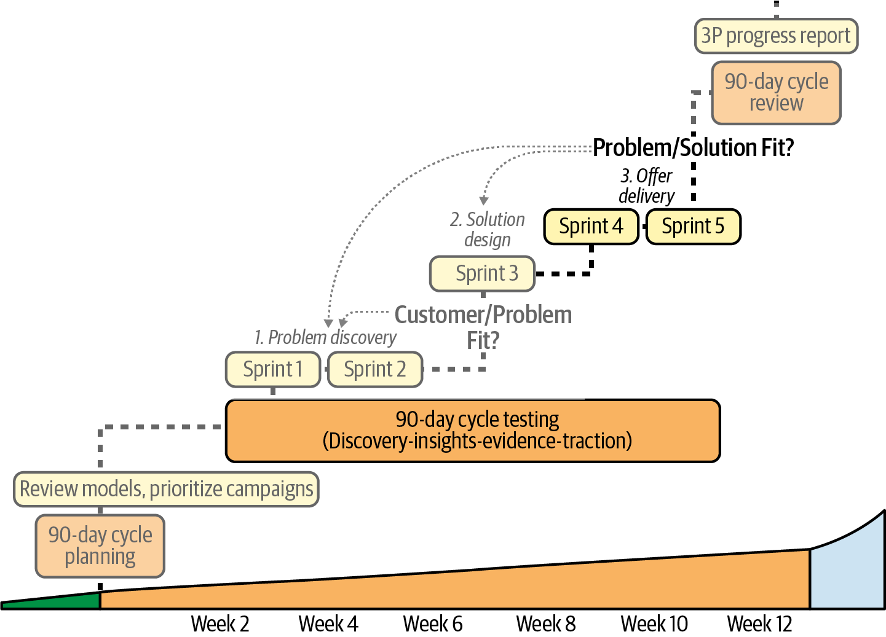

<!-- Page 265 -->

more iPads in my household than people. By that logic, you could argue that
the iPad was even more successful than the iPhone. How did that happen? Do
you remember how Steve Jobs pitched the iPad? Even if you didn’t watch the
keynote live, can you guess?
He could have come on stage and said: “We are Apple and we build great
products that are simple to use. We have built the best tablet in the world, so
buy one.” The problem, of course, is that no one other than a small sliver of
innovators and early evangelists was using tablets at the time. How do you
pitch a new category-defining product when the category doesn’t yet exist? The
answer is that you transcend category by going into the bigger context where
jobs-to-be-done live.
As Jobs opened the iPad keynote, he talked about how everyone was already
using laptops and smartphones and mused about whether there was room for
something in the middle. For that product to succeed, it would have to be far
better at doing certain key things than both the laptop and the smartphone.
He then rattled off some of those things: browsing the web, email, photos,
video, music, and reading eBooks. Then, as with the iPhone announcement,
he quickly named the existing alternative he’d like the iPad to displace—the
Netbook. If you don’t remember the Netbook, this was a marketing term used
to describe small and inexpensive laptops. Next, he went on to describe the
problem with Netbooks: “They’re just cheap laptops and not really better at
anything—they’re slow, with low-quality displays and clunky PC software.”
This set the stage for introducing the iPad.
Do you recognize what Jobs did here? He identified some jobs-to-be-done that
the existing alternatives were failing to do well enough, and he made a promise
for getting the jobs done better with an iPad—focusing not on new jobs, but
old jobs that people were already doing with existing alternatives. This is the
Innovator’s Gift.
As he began to demo the iPad, he made a comparison: “The iPad is so much
more intimate than a laptop and so much more capable than a smartphone.”
The job of the demo is not to train your customers on how to use your prod-
uct, but to highlight what is different and better. The demo walked through
these various jobs and showed how the iPad did them better. This is where the
emotional purchase happens—customers start imagining themselves achieving
their desired outcomes in a new and better way. But what makes this a mafia
offer is what comes next.
When he got to pricing, Jobs put up a big number on the screen: $999. He
then reminded the audience that the pundits thought the closest competitor to
the iPad was the Netbook, and for that reason they thought the iPad should
be priced similarly, at “just under a thousand dollars.” He then assured the
audience that Apple didn’t listen to the pundits and had worked really hard to

<!-- Page 266 -->

introduce the iPad not at a starting price of $999, but 499. The whole room
burst into applause as they celebrated the possibility of buying a $500 device.
You probably recognize this tactic as price anchoring, where you prime cus-
tomers with a high price and then reveal your pricing at a lower number. What
Steve Jobs did, however, was price anchoring taken to the next level. Instead of
using some random high number to prime his audience, he used the price of a
carefully chosen existing alternative (the Netbook). He had just spent the last
30 minutes convincing the audience that the iPad was better at getting several
jobs done than this alternative. Setting the starting iPad price at half the price
of a Netbook made it a no-brainer rational purchase.
That’s what made this a mafia offer—an offer customers could not refuse.
Running an Offer Delivery Sprint
An offer delivery sprint is run over a two-week time box where you first
assemble, then pitch your product one-on-one to qualified early adopter
prospects.
During a product pitch, most entrepreneurs never bring up their competition,
either because they don’t think they have any or because they don’t want to
tip their customers toward their competitors. This is a mistake, because your
customers are sophisticated and they will shop around anyway. Would you
prefer that they compare you to the competition without you in the room,
when you’ll have no say in the comparison?
NOTE
Your competition is the elephant in the room, and it’s your job to expose it and
diffuse it.
A good product pitch acknowledges the popular existing alternatives (your
true competition), then goes on to demonstrate how your solution is better.
You saw how Steve Jobs did this very early in both his iPhone and iPad
pitches. Naming the competition and the problems it has sets the stage for
your solution to shine.
Steve Jobs was a great storyteller, and you might be wondering how you’ll
ever get to delivering your pitch as naturally as he did. It comes down to
preparation and practice.
The first key to assembling a good pitch is using a good customer story pitch
template. A common fear around using a template is creating a pitch that
sounds forced. Don’t worry about this. We are naturally wired for stories, and
when we encounter the beginning of a good story, we can’t help but get pulled

<!-- Page 267 -->

in. I’ll present an effective story pitch template, built on the most popular story
arc of all time, in the next section.
Once your story pitch is assembled, the next key to delivering a good pitch is
practice. As gifted as Steve Jobs was at storytelling, he practiced every pitch
for hundreds of hours before getting on stage. The good news is that if you’ve
been doing the work from previous chapters, you’ve already been practicing
parts of the customer story pitch template.
Due to the goal-oriented nature of pitching, patterns emerge quickly. When
things work or don’t, you know almost instantly. It is, however, critical to
continue to maintain a learning mindset. Your goal with these pitches isn’t just
landing a few customers, but rather building a repeatable sales process.
Repeatable sales come from active listening and constant testing, where you
carefully parse out the key causal insights that make customers buy. When
things work in your pitch, you double down on them. When things don’t
work, you probe deeper to learn why not and make adjustments.
As a rule of thumb, be prepared to run 2 offer delivery sprints and pitch your
product to 20–30 people over a 4-week period. This is roughly equivalent to
pitching five to eight people per week with some time built in for processing
your learnings.
By the end of your offer delivery sprint(s), you should be able to optimize your
mafia offer to drive at least a 60–80% conversion rate from qualified leads to
your specific customer call-to-action. Getting there will take iterative testing,
and it’s best to plan on running one or two offer delivery sprints to get there.
Deliberately going slowly now to rigorously test your key insights will allow
you to go much faster later.
Depending on your 90-day traction roadmap goal, you may need to scale
beyond the mafia offer campaign to achieve problem/solution fit. I’ll share how
later in the chapter.
Running an offer delivery sprint involves three steps:
• Assembling your offer
•
• Delivering your offer
•
• Optimizing your offer
•
Let’s dive into each of these.

<!-- Page 268 -->

Assembling Your Offer
In this section, I’ll show you how to outline your pitch using the most popular
story arc of all time: the Hero’s Journey, popularized by Joseph Campbell in
his book The Hero with a Thousand Faces (New World Library).
This story arc shows up in all kinds of epic tales throughout history and is
still used today in most Hollywood blockbusters. Star Wars, Harry Potter,
Cinderella—they all share it. This same story arc can also be used to deliver a
compelling product pitch.
The first step to creating any story is defining the characters.
Define the Characters in Your Customer Story Pitch
All stories need characters. Who do you think are the essential characters for a
Hero’s Journey story? Yes, a hero and a villain. Ask yourself:
Who’s the hero in your story?
It may come as a surprise…but you aren’t the hero in the product pitch,
and neither is your product. The hero is your early adopter.
You don’t actually want to be the hero in this story. Think back to movies
like Harry Potter or Star Wars. The Hero’s Journey story is a transforma-
tion story that begins with a struggling protagonist who reluctantly accepts
the call to become a hero.
How about the villain?
This one is easier. Yes, the villain is your true competition. Your true
competition represents the group of existing alternatives you are seeking to
displace with your solution:
• In the case of the iPad, this was laptops (the Netbook).
•
• In the case of the iPhone, this was other smartphones.
•
• In the case of the iPod, these were other MP3 players and portable
•
music devices.
Remember that your true competition not only sets the stage for compar-
ing features, but also pricing—so pick carefully.
So, where do you fit in?
You are the person who guides the hero through their transformation
from ordinary to hero. You are the guide character. This is Obi-Wan
in Star Wars, Dumbledore in Harry Potter, and the Fairy Godmother in
Cinderella.

<!-- Page 269 -->

Where does your product fit in?
Your product is the gift you give the hero that makes this transformation
possible.
Let’s see how the Hero’s Journey story arc works using the original Star Wars
movie as an example:
The Star Wars Story Pitch
The movie introduces our hero character, Luke, as a regular young adult
who is bored out of his mind on a remote planet in the galaxy (STATUS
QUO).
Then 
something 
happens 
that 
changes 
everything 
(SWITCHING
TRIGGER).
Storm Troopers show up looking for secret plans hidden by Princess Leia in
a droid (R2-D2) that we see earlier on Luke’s planet. Luckily, Luke is off on
an errand when the Storm Troopers reach his village, but unfortunately, his
uncle and aunt aren’t spared.
These plans are the key to stopping a large weapon (the Death Star) from
being built. Once the weapon is completed, the entire galaxy could come
under the rule of the evil empire (WHAT’S AT STAKE).
While Luke would like to help destroy this weapon (DESIRED OUT-
COME), he has no special powers and cannot overcome the powerful
dark lord villain who commands the evil empire: Darth Vader (PROBLEM/
OBSTACLE).
Then our hero gets a gift—a lightsaber (PRODUCT)—from our guide char-
acter, Obi-Wan (THIS IS YOU).
Our hero reluctantly accepts the call-to-action. He encounters several set-
backs along the way, but eventually transforms himself into a powerful Jedi.
This gift and Jedi training (UVP) help our hero destroy the Death Star and
save the day.
Did you recognize this story arc? Yes, the Customer Forces Model also follows
the Hero’s Journey story arc. We can visualize a story pitch on the Customer
Forces Model, as shown in Figure 10-2.

<!-- Page 270 -->

Figure 10-2. The customer story pitch template
Outline the Structure of Your Customer Story Pitch
Screenwriters use a popular three-act story structure, dating back to Aristotle,
to organize their stories into a beginning, a middle, and an end. These are
often labeled the setup, confrontation, and resolution.
I organize my customer story pitches the same way. Additionally, since we are
looking to cause a switch at the end, I add a fourth act, the call-to-action:
• Act 1: Setup (share the bigger context)
•
• Act 2: Confrontation (break the old way)
•
• Act 3: Resolution (demo your better new way)
•
• Act 4: Call-to-action (ask for the switch)
•
Next, I’ll walk you through the steps for assembling each part of your cus-
tomer story pitch, illustrated with three different product pitches:
• The Continuous Innovation Framework (CIF)
•
• The Tesla Powerwall battery
•
• The iPad
•

<!-- Page 271 -->

Act 1: Setup (share the bigger context)
Act 1 sets up the bigger context for your pitch. It establishes your customer as
the protagonist and names a big and relevant change (switching trigger) that
raises the stakes and drives a sense of urgency for the desired outcome. Here
are some things you’ll want to consider for this part of the pitch:
Why not go straight to the problem?
For the same reasons we didn’t directly ask customers about problems dur-
ing the problem discovery interviews. Customers often don’t understand
their problems deeply enough and/or don’t want to admit they have them
until they know you, like you, and trust you. Imagine having to pitch the
CIF to the head of innovation at a large company. If you immediately start
attacking their current way of building products, you’ll put them on the
defensive and it’ll be harder to break through.
Another reason for starting with the bigger context (rather than problems)
is that it can inspire customers to buy into a much larger vision of better.
In the next section, we’ll see how Elon Musk reframed the Powerwall
battery pitch to share a much larger vision of clean energy instead of just
talking about a better battery.
Finally, remember that the bigger context is where jobs live, and it tran-
scends categories. Especially when you’re pitching a new category-defining
product, like the iPad, it helps to start with a bigger context, like Steve
Jobs did.
Pick an extrinsic switching trigger
The best switching triggers come from undeniable extrinsic shifts happen-
ing in the world rather than shifts you personally are trying to cause,
which could be construed as self-serving:
• The extrinsic switching trigger for the CIF is the global entrepreneurial
•
renaissance. Today, it is cheaper and easier than ever to build a prod-
uct, which means that there are many more people “starting up” all
over the world. Entrepreneurs are everywhere.
• Elon Musk used climate change as the big relevant change that set the
•
greater context for his Powerwall pitch.
• Steve Jobs didn’t need to explicitly name the switching trigger in his
•
iPad pitch because he had already named it several years earlier, after
the iPhone launch—calling it the beginning of a post-PC era. That’s
also when Apple dropped the word “Computer” from its name to
become “Apple Inc.”

<!-- Page 272 -->

Raise the stakes
Behavioral economists Amos Tversky and Daniel Kahneman identified a
phenomenon called loss aversion, where people tend to prefer avoiding
losses to acquiring equivalent gains. In other words, simply promising
something better with a new way isn’t enough. For a switching trigger to
be effective, it also needs to communicate the negative effects (crisis) of
sticking with the old way (status quo):
• The opportunity side of the global entrepreneurial renaissance is that
•
anyone, anywhere can start a company today. But more products cre-
ate more choices for customers, which spurs more competition. Doing
nothing can quickly make your business model irrelevant in the face of
all this new competition. That’s the crisis side.
• Elon Musk communicated the crisis side of climate change with
•
imagery showing smokestacks from factories and a chart showing the
exponential rate of growth of CO2 emissions extrapolated to the year
3000.
Show winners and losers
Optionally, back up your claim of what’s at stake by citing examples of
winners who won big because they changed to the new way and losers
who lost because they stuck to the status quo.
The winners’ list for a CIF pitch would include companies like Airbnb,
Dropbox, Google, Facebook, Netflix, and Amazon. All these companies
embrace a culture of continuous innovation. The losers list would include
companies like Blockbuster, Kodak, Nokia, RadioShack, and Tower
Records. All these companies lost because they stuck to the status quo
and got disrupted.
Tease your promise
End the first act of your pitch by teasing the superpower your customers
will need to acquire in order to overcome the obstacles posed by the
switching trigger:
• CIF superpower: speed of learning is the new unfair advantage. If you
•
can outlearn your competition, you win.
• Elon Musk painted the future as a zero-emissions civilization powered
•
by a giant fusion reactor in the sky—the Sun—as something within
reach.
• Steve Jobs teased a revolutionary device that combined three devices
•
in one with the iPhone, and a third category-defining product with the
iPad that would be better than both the smartphone and the laptop.

<!-- Page 273 -->

Act 2: Confrontation (break the old way)
Act 2 is where you name the specific existing alternative you’ll be displacing
(true competition), describe why the existing alternative falls short (problems),
and break it as a viable alternative for your customers. Here are a few
guidelines:
Name your true competition
Your true competition represents the existing alternative(s) you are seeking
to displace with your solution. This is the villain in your customer story
pitch:
• In the case of CIF, this is the execution mindset (the Analyze-Plan-
•
Execute way of building products).
• In the case of the Powerwall, this was existing batteries.
•
• In the case of the iPad, this was laptops (Netbooks).
•
List the problems with your true competition
This is where you describe the problems with the existing alternative(s),
now exacerbated by the switching trigger, as obstacles preventing your
customer from achieving their desired outcome.
This list should be a mix of familiar pet peeves and workarounds your cus-
tomers already know, and possibly some deeper problems you’ve uncov-
ered that make you look like an expert:
• Problems with the old way of building products (execution mindset)
•
are: too slow to market, creating fictional plans, making safe bets
versus big bets, and building something nobody wants.
• Elon Musk listed seven problems with existing batteries: expensive,
•
unreliable, poor integration, poor lifetime, low efficiency, not scalable,
and unattractive.
• Steve Jobs described Netbooks as slow, with low-quality displays and
•
clunky PC software.
Break the old way
By the end of the second act, you should have broken the existing alterna-
tive as a viable alternative for your customer. End this section by summa-
rizing why:
• This way of working (executing mindset) was never built for speed
•
and continuous innovation.
• Elon Musk ended this section by saying that existing batteries “just
•
suck.”

<!-- Page 274 -->

• Steve Jobs ended this section by labeling Netbooks as “just cheap
•
laptops and not better than laptops at anything.”
Act 3: Resolution (demo your new, better way)
Act 3 is where you reveal your gift (your new way) and demonstrate how
it helps your customers overcome the obstacles you’ve presented and achieve
their desired outcome. This is the job of your demo—and remember, this is
where the emotional purchase happens.
Your demo isn’t intended to be just a collection of pretty screenshots or a
working prototype, but rather a carefully scripted narrative that helps your
prospects visualize your unique value proposition and believe that you can pull
it off.
It should walk them from their current reality (riddled with existing problems
that stem from their existing alternatives) to your envisioned future reality for
them (one where these problems are solved with your solution).
Here are some guidelines that can help you script a powerful demo:
The demo needs to be realizable
I have friends at design studios who have special teams in place just to
build early user demos. These demos are very much part of the sales
process and a lot of emphasis is placed on them, but they often rely on
technologies that aren’t what the final product is built with. While they are
quite effective at making the sale, they make the job of the implementation
team quite difficult, with many of the more “flashy” elements being hard
or impossible to re-create. This leads to a disconnect between what is
promised (and sold) to the client and what is eventually delivered.
The demo needs to look real
I don’t like going to the other extreme either, of relying on bare-bones
wireframes or sketches. While they are faster to put together, they require
the customer to take a leap of faith on the finished product, which I try to
avoid.
The more real your “demo” looks, the more accurately you’ll be able to
test your solution.
The demo needs to be quick to iterate
You will probably get valuable usability feedback during your offer deliv-
ery interviews that you’ll need to quickly incorporate and test in subse-
quent interviews. This is where outsourcing your demo to an external
team could actually hurt you, if your ability to iterate is driven by their
schedule.

<!-- Page 275 -->

The demo needs to minimize waste
Creating a demo in anything other than the final technology in which the
product is to be delivered creates some waste. For my own demos, while I
start rapid prototyping using paper sketches, Photoshop, and Illustrator, at
some point I convert them into HTML/CSS, which results in less waste in
the long run.
The demo needs to use real-looking data
Instead of using “dummy data” (lorem ipsum), come up with “real-
looking” data that will not only help you lay out your screen but will
support your solution narrative. As Jeffrey Zeldman of A List Apart says:
“Content precedes design. Design in the absence of content is not design,
it’s decoration.”
Imagine the perfect before-and-after ad
Ask yourself, if you could commission a short 30-second ad showing the
before and after customer story:
• Who would the characters in the story be?
•
• How would the story start?
•
• What problems would the characters run into?
•
• How would they resolve the problems?
•
Keep it short, but not too short
Good demos need to arrive at your punch line (your UVP) quickly while
setting the requisite context. Aim to deliver your demo in 5–10 minutes.
Pick the best format for your demo
The goal of the demo is to showcase your UVP with the smallest thing pos-
sible in order to maximize the speed of learning. Don’t immediately reach
for a working prototype, but consider the best format for showcasing your
product. Ranked in order of preference, these are:
• Digital products:
•
• Verbal demo
•
• Screenshots or mockups
•
• Clickable prototypes
•
• Working prototype
•
• Physical products:
•
• Verbal demo
•
• Sketches or CAD diagrams
•

<!-- Page 276 -->

• Physical prototype
•
• Working prototype
•
• Service products:
•
• Verbal demo
•
• Process diagram to demonstrate how it works
•
• Sample deliverable (e.g., a report)
•
For example:
— A CIF demo could just be delivered as a presentation with slides.
—
— Elon Musk used a live demonstration showing that the auditorium
—
they were in was powered by batteries.
— Steve Jobs used a combination of slides and a live demonstration of
—
the iPad to show how it does certain jobs better than laptops.
Act 4: Call-to-action (ask for the switch)
Act 4 is where you clearly articulate the specific next action you want your
customers to take. Too many entrepreneurs cop out at this step and simply
settle for verbal commitments because it’s the easier thing to do. The mindset
in play here is one of “lowering sign-up friction.” We want to make it as easy
as possible for the customer to say yes and agree to take a chance on our
product—hoping the value we deliver over time will earn us the privilege of
their business.
The problem with verbal commitments is that they are easy to make and just
as easy to break. Not only does this approach delay validation because it’s
too easy to say yes, but a lack of strong customer “commitment” can also
be detrimental to optimal learning. This brings us to the guidelines for your
call-to-action:
Don’t lower sign-up friction—raise it
Your job at this point is finding early adopters who are at least as passion-
ate about the problems you’re addressing as you are. The way you do this
is not by lowering sign-up friction, but by raising it.
Position your MVP as a prize
Too many entrepreneurs are embarrassed by their MVPs and use labels
like alpha and beta to describe them. Alpha and beta labels frame your
product as less than perfect and ask for forgiveness even before your
customers get to use it.

<!-- Page 277 -->

If you’ve done all the work outlined in the previous chapters to meticu-
lously research and define your MVP, you shouldn’t be embarrassed by it,
but proud of it. In the customer story pitch, your MVP is the gift you give
your customers that helps them overcome their obstacles and achieve their
desired outcome. You should position it as such.
Instead of using alpha and beta labels, I prefer using early access, which
communicates that your MVP is a prize and is only going to be released
to a select few. When you label your MVP as an early access product, it
also signals scarcity, which works to drive up desire—especially for early
adopters.
Charge from day one
If you have a direct business model (where the buyer is in the room), you
should always include your pricing model in your call-to-action, for all the
reasons we’ve previously discussed:
• Price is part of your product.
•
• Price determines your customers.
•
• Price is one of your riskier assumptions.
•
TIP
Even if you choose to start with a free trial or pilot period, you should discuss
pricing up front.
In more complex sales where you don’t have the buyer in the room, ask
the prospect for an introduction to the buyer. If they move forward with
the introduction, they are still paying you—not with financial capital, but
their social capital.
Don’t ever ask customers what they are willing to pay
Can you imagine Steve Jobs asking you what you would have been willing
to pay for an iPad before it launched? Sounds ludicrous, right? Yet, you’ve
probably asked a customer for a “ballpark price” at some point.
Well, that’s just backward. Think about it for a moment. There is no
reasonable economic justification for a customer to offer anything but a
lowball figure. They may honestly not know how to answer you, and this
question only makes them uncomfortable.
You can’t (and shouldn’t) convince a customer they have a problem if they
don’t, but you often can (and should) convince a customer to pay a “fair”
price for your product, which is usually higher than what both you and the
customer think it is.

<!-- Page 278 -->

Build your pricing story
A lot of people get awkward or feel guilty when delivering their pricing
model to customers. But if you’ve done your research, and followed the
customer story pitch until this point, your prospects have already made an
emotional purchase of your new way.
Delivering your pricing model is all about making a logical case for how
you arrived at a fair price for your product, anchored against the exist-
ing alternatives and the value you promise to deliver. There is no need
for emotion to creep in. Remember, this is where the rational purchase
happens.
Clearly lay out what happens next
Once you’ve shared your pricing model, clearly lay out the steps for what
happens next, and ask for the sale.
Steve Shares His Customer Story Pitch Outline with the Team
Steve posts the following into the team chat window:
Here’s what I’ve got so far:
Act 1: Setup (share the bigger context)
Big relevant change: As a result of the pandemic, people are spending a lot
more time at home and upgrading their living and working spaces. This has
triggered a surge in new homeownership and remodels.
Raising the stakes: A lot of these new buyers are first-time homeowners.
They are also younger than before, and having grown up with Instagram
and Pinterest, are a lot more demanding on personalization and design—but
they lack home building experience.
Teasing your promise: They want to be able to design perfect living spaces
that express their unique identities without breaking the bank.
Act 2: Confrontation (break the old way)
Current artifacts (2D/3D renderings) fall short.
2D floor plans lack depth.
Current 3D solutions are expensive, complex, and not photorealistic (video
game–quality renderings).
Act 3: Resolution (reveal your Better new way)
Our solution helps your clients test drive your design concepts in virtual
reality exactly as they will look in reality when built. Here, let me show
you.
(This is where we have the architect walk through the reference model I’m
currently building).

<!-- Page 279 -->

Act 4: Call-to-action (ask for the switch)
Lisa, you’re much better at this than I am so I’ll defer to you. But I’m
guessing this is where we’ll talk about early access, the Concierge model,
etc., and hope we can close them on $5k/mo pricing. That would be huge.
Lisa responds: This is great, Steve, and thanks for sending it over. Yes, I’ve
got some ideas for the CTA and I’ll try to push them a bit more on pricing :)
How’s the demo coming along?
Steve: Almost there, I can’t wait to show it to you guys. I should have it
demo-able by the weekend and turn it over to you and Josh.
Josh: That’s great Steve. Based on what you showed me earlier, I can’t wait to
see the architects’ reactions to the demo.
Steve: Me too, but I’ll have to get back to getting the demo ready. There’s
always more work than one thinks, but I’m still sticking to the dates I shared.
Delivering Your Offer
With your offer assembled, you are now ready to deliver it. Both the iPad
and the Powerwall pitches were delivered onstage to a room full of people.
You aren’t going to start there, but as with your problem discovery interviews,
you’ll first deliver them one on one. Here are some guidelines for preparing
your mafia offer pitch:
Choose your targets wisely
Target a mix of old and new prospects:
Use old prospects that match your early adopter criteria
You should have received permission to follow up on your earlier
problem discovery interviews. If any of these prospects match your
early adopter criteria, these are warm qualified leads. Arrange a
follow-up conversation with them to deliver your mafia offer pitch.
Mix in some new prospects
It’s a good idea to mix in new prospects with every batch of pitches so
that you test all your insights with a “beginner’s mind.” Your earlier
pitches should have yielded some referrals that you can use.
Test new channels
This is also the time to start testing any other channels you identified
in your earlier sprints that can help you start building a repeatable
customer factory.

<!-- Page 280 -->

Ask for sufficient time
You will still be learning during your early pitches, so allocate enough time
for that. I recommend asking for 45 minutes and aiming to be done in 30
minutes.
Record the pitch (if possible)
As with problem discovery interviews, if the prospect is okay with being
recorded, record your pitches for learning and training purposes.
Maintain a learning mindset
The mafia offer pitch is all about testing the insights you’ve gathered from
your problem discovery sprints. If your insights are indeed on point, you
should see clear signs of resonance throughout the pitch, reflected in the
interviewees’ body language—nodding heads, smiles, and open feedback
are all great signs. If you don’t see these, don’t brute-force the pitch.
Instead, transition into understanding why.
It helps to build in a brief mental intermission between each act of your
customer story pitch in order to evaluate whether you’ve met the objec-
tives of that section. If not, that’s your cue to explore why not.
Use a meta-script
In addition to any supporting slides and demos you created in the last
section, it helps to write out a meta-script for your offer delivery. This not
only keeps you on point but is a great training and documentation tool
for when you’re ready to hand off and/or optimize your offer campaign.
You’ll find a sample script with some additional guidelines on delivery in
the following sidebar.
The Mafia Offer Pitch Script (30 Minutes)
Welcome (set the stage)
(2 minutes)
Briefly set the stage for how you’ll run the meeting.
Thank you very much for taking the time to speak with us today about our [product]. We
started building [product] after conducting dozens of interviews with other companies to
understand how they perform [job-to-be-done]. Before we dive in, it would be helpful to ask
you a few questions on how you currently do [job-to-be-done] to make sure there is a fit.
Is that okay?

<!-- Page 281 -->

Collect qualifying criteria (test for customer/problem fit)
(5 minutes)
Ask some qualifying questions to test for fit. If you’ve already interviewed/qualified
this prospect before, you can skip this section unless there are additional questions
you’ve uncovered since you last interviewed them. Bear in mind that this is not a
full-on problem discovery interview but a chance to qualify your prospect on the key
distinguishing characteristics that define your ideal early adopter profile.
How do you currently do [job-to-be-done]?
What solutions do you currently use?
(Ask any other qualifiers to determine if they are a fit.)
If you do encounter new insights that weren’t uncovered in your earlier problem
discovery sprints, stay curious and dig deeper. Problem discovery is only done when
you’ve heard all the stories out there.
If there is a fit, continue on. Otherwise, let the interviewee know there isn’t a fit and
why. You’ll both be 30 minutes richer.
Act 1: Setup (share the bigger context)
(2 minutes)
Share the bigger context for your pitch by:
• Naming the big relevant change (switching trigger)
•
• Raising the stakes
•
• Showing winners and losers
•
• Teasing your promise
•
In our research, we also found a number of companies, like you, using the [old way] for
doing [job-to-be-done].
But we are living in a new world today because of [switching trigger]—the way we do
[job-to-be-done] has fundamentally changed.
The [old way] worked reasonably well in the [old world] but no longer works in the [new
world].
The [new way] helps you achieve [better desired outcome]. Not doing anything results in
[what’s at stake].
In order to succeed in the [new world], you need [tease promise].
Act 2: Confrontation (break the old way)
(3 minutes)
Get really specific on why the old way (your true competition) no longer works.
The [old way] wasn’t built to handle [switching trigger]. Here’s why…

<!-- Page 282 -->

• Reason 1
•
• Reason 2
•
• Reason 3
•
If you did a thorough job during problem discovery, this is where you should see
visible signs of resonance and earn your prospect’s trust. This also opens up a curiosity
gap where the prospect wants to know how you solve these problems.
Be on the lookout for body language and other nonverbal cues. It always helps to be
able to see your prospects when pitching. As you walk them through your pitch, pause
frequently to check in with them and be on the lookout for any gestures that suggest
they aren’t following your story. When that occurs, stop and ask them if they have a
question.
Act 3: Resolution (reveal your better new way)
(10 minutes)
This is the heart of the pitch and where the emotional buy happens. Remember, the art
of a good demo is keeping it short and clear. Lead your prospect through your demo
and show them how you deliver on your unique value proposition.
Let me quickly show you how we solve these problems and do [job-to-be-done]:
• Demonstrate feature 1
•
• Demonstrate feature 2
•
• Demonstrate feature 3
•
So that’s what our product does. Do you have any questions?
Rather than jumping into the next steps or pricing, pause here and let the prospect
take the next step. There is little value in getting to next-step conversations unless the
prospect is sold on the value of the demo, so make sure that is in place first:
• If they are unsure about the demo, dig deeper.
•
• Ask for a referral if they loved the demo but aren’t the customer (buyer).
•
• If they ask about pricing or the next steps, move to the next act in the script.
•
Prospects will inevitably ask about other features not shown in your demo. Rather
than immediately rushing to agree to them, ask your prospects why they might want
it and how they would use this new feature. It’s perfectly okay to soft-commit to a
promising new feature at this stage without outright committing to it in your MVP. As
you postprocess these feature requests later, you’ll need to weigh them against your
MVP’s scope and be prepared to eliminate or schedule them for a future release on
your product roadmap.

<!-- Page 283 -->

Act 4: Call-to-action (ask for the switch)
(5 minutes)
Let your prospect know that you are early in the launch process and aren’t doing a
public launch or looking for beta users, but are looking to secure early access customers.
Since we chose to take on such a big problem, we decided to use a staged rollout approach
and first test our product with a small group of carefully selected customers.
From everything we’ve discussed so far, you are a perfect fit. And we’d love to have you be a
part of our early access group.
This is an optional but highly recommended step that helps increase willingness to buy
through framing your product as a prize and introducing scarcity.
Next is price anchoring. This is a well-known tactic, but it’s seldom used during pitches.
It’s best not to skip this step. If your offer includes any risk reversals or money-back
guarantees, state them as well.
So, let’s talk about pricing next.
In order to determine a fair price for our product we took a look at existing alternatives, and
we wanted to align our pricing model with the value we deliver.
Most people spend $X on existing alternatives and achieve [current outcome]. We have
shown you how we can help you achieve [better outcome], which helps you make/save
[value]. We wanted to make our product a no-brainer option, which is why we chose to
price it not at $X but at [state your pricing model].
Included in the pricing you get high-touch onboarding, where we’ll help you set up [the
platform] and get you up and running, along with monthly check-ins. We are doing this
only for our early access customers, because we are highly vested in the success of our early
customers. Once we open up the product more broadly, we will most likely charge more for
these options.
Wrapping up (next steps)
(3 minutes)
After presenting your pricing model, pause and read body language cues. Gauge the
prospect’s response immediately afterward. This is key for optimizing your pricing. If
they accept your pricing, make a note of whether they hesitated or readily accepted,
and move on to the next steps for moving the sale forward. If they readily accept, that’s
often a sign that the perceived value of your product is higher than what you think and
you should test a higher price in subsequent pitches.
If they need more time to come to a decision, offer to send them some follow-up
materials (like your slide deck) and a target date for a check-in.
If they don’t accept your pricing, dig deeper to understand the objection.

<!-- Page 284 -->

Optimizing Your Offer
The first step to optimizing your offer is weekly measuring of your customer
factory metrics. From there, identify the key constraint to optimize first.
Finally, get to root causes and formulate ways of breaking the constraint,
which you’ll test in subsequent offers.
Measure Your Customer Factory Metrics Weekly
Map specific user actions to each step in your customer factory. Prior to
launch, I recommend defining your customer factory steps this way:
1. Acquisition: Number of new leads (prospects)
1.
2. Activation: Number of demo calls booked
2.
3. Retention: Number of follow-ups post-demo (complex sale)
3.
4. Revenue: Number of people that accepted the offer
4.
5. Referrals: Number of leads that came through referrals
5.
Post-launch, you’ll redefine these steps differently; I’ll cover that in more detail
in Chapter 12. If you can use third-party tools to measure some of these
metrics, that’s great, but don’t overthink this. It’s perfectly okay to manually
measure these steps at the beginning.
At LEANSTACK, for every new product we launch, we usually create a slide
deck with a slide for each week and manually fill these in every Monday
morning (see Figure 10-3).
NOTE
You can download a blank customer factory dashboard template from the
LEANSTACK website.

<!-- Page 285 -->

Figure 10-3. Customer factory pre-launch metrics dashboard
Identify Your Key Constraint
Once you baseline your weekly metrics, work backward from your call-to-
action step (Revenue) and look for bottlenecks. Bottlenecks are places where
you find:
• Lots of people waiting (long cycle times)
•
• Lots of people leaving (high abandonment rates)
•
Prioritize your top bottleneck as the constraint to tackle first.
Formulate Ways of Breaking the Constraint
Remember that the constraint only points to the top bottleneck; it doesn’t
necessarily tell you why it’s occurred.
If your constraint is due to lots of people waiting at a step, chances are high
that you have a resource (people) constraint. For example, you might be gener-
ating 10 leads a week but conducting 5 pitches a week, due to poor follow-up.
In this case, look for ways to automate that step (e.g., use a calendar schedul-
ing tool) or get additional help (e.g., a virtual assistant).

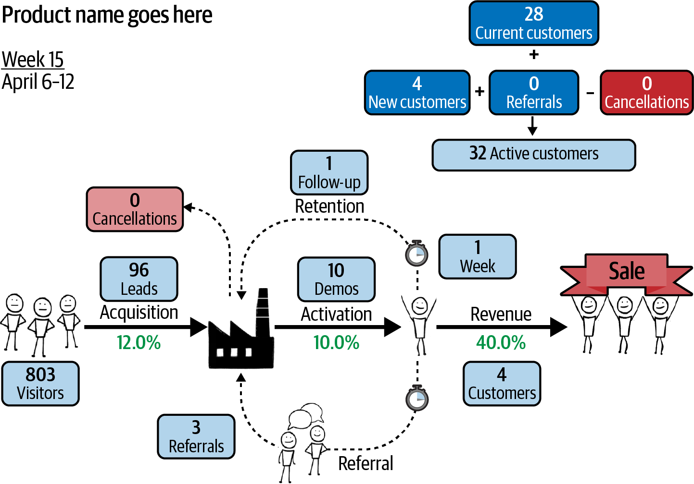

<!-- Page 286 -->

If your constraint is due to lots of people leaving at a step, chances are high
that this is due to a (sales) process constraint. For example, prospects may
not be buying because they perceive your pricing is too high, or people may
not be signing up for a demo because your promise (UVP) doesn’t grab their
attention. In this case, solutions often come from further analysis of these
unaddressed objections, which can be done either by actively listening during
pitches, postprocessing your pitches, or simply asking your prospects.
Steve Meets with the Team to Review the Results of Their
First Offer Delivery Sprint
Lisa leads off the conversation. “The long holiday pushed some of our pitches
to next week, so we only got one pitch done.”
“I’ll take some of the blame for slowing us down on the demo,” Steve admits.
“I wasn’t 100% happy with the quality of the rendering and took a few extra
days to tweak things.”
“Remember that perfect is the enemy of done,” Mary jumps in. “I know,
Steve, that you want to showcase the best possible solution here, but speed
of learning trumps perfection. You have to recalibrate your definition of good
enough by measuring against the customer’s existing alternative, not your ideal
standard.”
Steve nods silently in agreement. Mary then asks how the pitch went.
“The architect loved the demo but balked at our pricing,” Lisa replies. “We
tried anchoring against the cost of 3D renderings, but they don’t use them
today. He described 3D renderings and VR as a nice-to-have and was really
adamant about not incurring more costs.”
Mary nods. “Sure. First, don’t be discouraged, because this is just one conver-
sation. Early pitches are great learning opportunities, and they’re how you
iteratively optimize your pitch. My advice would be to pre-qualify the prospect
even further. The current pitch is aimed at switching firms from 3D renderings
to VR as a service. If they aren’t currently creating 3D renderings, you either
have to build another pitch or disqualify these prospects as early adopters.”
“Do you recommend one approach over the other?” asks Lisa.
“Getting customers to adopt brand new technology is always harder at the
beginning, which is why I’d vote for disqualifying prospects that aren’t cur-
rently using 3D rendering,” replies Mary.
“I agree,” Josh jumps in. “I think the switching comparison is a lot easier
to make when we’re asking them to fire a software solution instead of their
current processes.”

<!-- Page 287 -->

“Good point,” Mary responds. “So yes, let’s focus on pre-qualifying firms and
aim to run a lot more pitches in the next two-week sprint.”
“I’m on it,” Lisa says. “I’m scheduling demos with seven firms, and I will
pre-qualify them before we book the demos.”
When Are You Done with Offer Delivery?
You’re done with offer delivery when either of these things happens:
• You hit your problem/solution fit traction criteria, as defined by your
•
traction roadmap.
• You run out of time—i.e., reach the end of your 90-day cycle.
•
In both cases, move to review your 90-day cycle and use your learnings to
make an evidence-based decision on what’s next.

<!-- Page 288 -->

<!-- Page 289 -->

C H A P T E R 1 1
Run a 90-Day Cycle Review
At the end of the 90-day cycle, irrespective of where your customer factory
metrics end up, you need to get your team together for a 90-Day Cycle Review
Meeting.
This is where you review what you did and what you learned, and decide on
what’s next. A common regret many teams have is waiting too long to pivot
their idea. They hang on to a failing idea or validation campaign in the hopes
that things will eventually turn around, until it’s too late. The 90-day cycle
review (Figure 11-1) keeps you accountable by forcing you to confront the
reality of the present and make decisions for the next cycle—either stay the
course (persevere), pivot, or pause.

<!-- Page 290 -->

Figure 11-1. The 90-day cycle review
Steve Calls a Pre-Review Meeting Just with Mary
“What happens if we don’t hit our 90-day OKR? I know we only need to sign
up two customers…but what if no one signs up?” Steve asks Mary.
“First, I want to remind you that you don’t just need to sign up two customers,
you need to build a system (a customer factory) for repeatedly signing up two
customers per month for the next several months,” Mary responds.
Steve laughs nervously. “That’s right, and that’s an even scarier thought. If we
don’t close any customers, is that OK? Can we extend our traction roadmap
timelines?”
“You tell me,” Mary says. “Remember that your traction roadmap represents
your minimum success criteria curve that you came up with, Steve. Think of it
as the waterline on a beach. As you walk into the water, what happens when
you go below the waterline?”
“You hold your breath?” Steve answers.
“Yes, that’s right. But you can only hold your breath for so long. While it’s
okay to go below the waterline for short periods of time, you should be
fighting to get above the waterline as quickly as possible.”

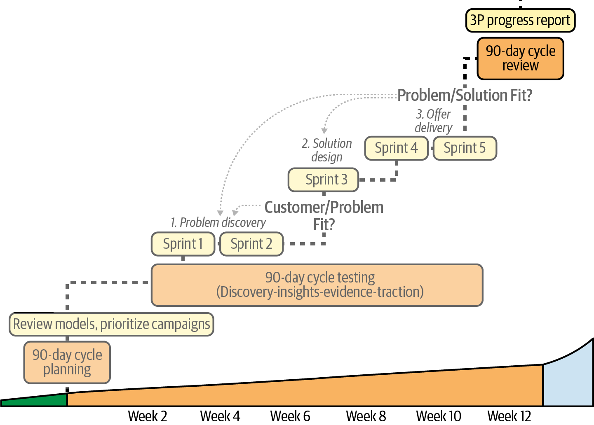

<!-- Page 291 -->

“What is as quickly as possible in this case?” Steve asks.
“Well, it’s been shown statistically that more than two-thirds of business mod-
els require a drastic pivot due to the highly uncertain nature of the early stage.
So, it’s fairly common for teams to miss their first 90-day OKR and take an
additional 90-day cycle to find problem/solution fit.”
“Okay, that makes me feel a lot better. So if we don’t make any sales, techni-
cally we can pivot and give ourselves another 90 days to achieve problem/solu-
tion fit?”
“Technically, yes. But remember that a pivot still needs to be grounded in
learning. What determines your next action isn’t simply hitting or missing the
goal, but what you learned during the 90-day cycle.”
Mary pauses to take a sip of her coffee, then continues. “Steve, I can sense that
you’re a bit anxious. Is there more to this conversation?”
“Yeah…I’m trying to prepare as best as I can for the 90-day review. Since I
brought Lisa and Josh into this project, I don’t want to let them down and see
them leave because we didn’t hit the goal.”
“I get that Steve, but remember they are cofounders in this project and just as
accountable. The power of using this framework comes from holding all the
players accountable—especially your business model.”
Steve chuckles. “I’m being serious. Have you heard of the Stockdale Paradox?”
“Yes, I remember reading about it in Jim Collins’s book Good to Great. Isn’t it
about confronting brutal facts?”
“Here, I pulled it up on my phone so I can read it verbatim:
Every good-to-great company embraced what we came to call the “Stock-
dale Paradox”: You must maintain unwavering faith that you can and will
prevail in the end, regardless of the difficulties, and at the same time, have
the discipline to confront the most brutal facts of your current reality,
whatever they might be.
“This is also the key to practicing the CIF. Challenge your beliefs rigorously,
but have faith in yourself and your team that you will prevail in the end.”
Preparing for the Meeting
You’ll open the 90-Day Cycle Review Meeting by delivering a 5- to 10-minute
business model progress report that walks your team through initial assump-
tions/goals from your Lean Canvas and traction roadmap, what you did dur-
ing the 90-day cycle, and what’s next.

<!-- Page 292 -->

If you’ve been disciplined about running sprints, documenting your experi-
ments, capturing insights, and measuring metrics along the way, the prepara-
tion required for a 90-day cycle review is minimal.
In this section, I’ll cover the artifacts you’ll need to collect/update in order to
assemble a progress report pitch deck, and what that deck should look like. In
the next section, I’ll cover how to run the review meeting.
Collect/Update Artifacts
For each business model variant that you’ve been exploring, you’ll need an
updated elevator pitch, Lean Canvas, and traction roadmap.
Elevator pitch
Revisit and update your elevator pitch based on your latest learnings from
your offer delivery sprint(s). As a reminder, here’s the template from Chapter 5:
When [customers] encounter a [triggering event],
they need to do [job-to-be-done] in order to achieve [desired outcome].
They would normally use [existing alternatives],
but because of [switching trigger] these [existing alternatives] have [these
problems]. If these problems are left unaddressed, then [what’s at stake].
So we built a solution that helps [customers]
achieve [desired outcome] by/with [unique value proposition].
You might have noticed already that your elevator pitch is essentially a more
condensed version of Acts 1 and 2 from your mafia offer campaign.
The goal of the elevator pitch is to quickly make the case for why your product
exists by describing:
• Who it’s for (customer segment)
•
• What’s changed (switching trigger)
•
• What’s broken as a result (with existing alternatives) that needs fixing
•
Your elevator pitch is a powerhouse opener for any conversation, pitch, or
business model update, which is why it’s important to keep it updated and
practice delivering it whenever you can.
Lean Canvas
Make sure your Lean Canvas (Figure 11-2) also reflects your latest thinking,
especially on customer segmentation, the problem, the solution, your UVP, and
pricing (revenue streams).

<!-- Page 293 -->

Figure 11-2. Keep your Lean Canvas updated
If you haven’t revisited your Lean Canvas since the start of the 90-day cycle,
you may be surprised at just how much has changed in your thinking in a
short amount of time. Unlike in traditional business planning, this isn’t a sign
of weakness, but progress.
Take a snapshot of what your Lean Canvas looked like 90 days ago—this
reflects your thinking at that time. During your review meeting, you’ll overlay
this snapshot with your latest version to highlight what you’ve learned.
Traction roadmap
Similarly, revisit your traction roadmap. First verify that none of your Fermi
estimate input assumptions have changed, such as your pricing model. If they
have changed, update your traction roadmap while keeping your MSC goal the
same. If you change your traction roadmap, first take a snapshot of what it
looked like 90 days ago.

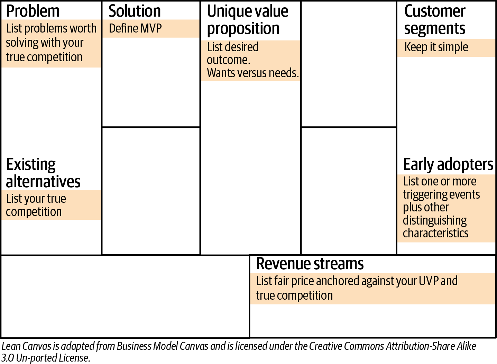

<!-- Page 294 -->

NOTE
Remember, your MSC is a nonnegotiable constraint you impose on your business
model that should only be changed with significant deliberation and team/stake-
holder input. If a change is required, this is something you can propose during the
90-day cycle review.
Next, plot your actual traction metric—e.g., number of customers signed up
to start a trial—and overlay it on your traction roadmap (Figure 11-3). This
is the most effective visual for communicating whether you’ve made progress
with your business model. Remember, traction is the goal.
Figure 11-3. Plot your actual traction against your traction roadmap
Assemble a Progress Report Pitch Deck
In Chapter 5, I provided a template for a 10-slide business model pitch deck.
You’ll need to assemble a similar deck for your 90-day cycle review, setting the
context for the meeting and reporting on your assumptions from the beginning
of the cycle, your actions during the cycle, the key takeaways and results, and
what’s next. The following sections detail what to address on each slide.

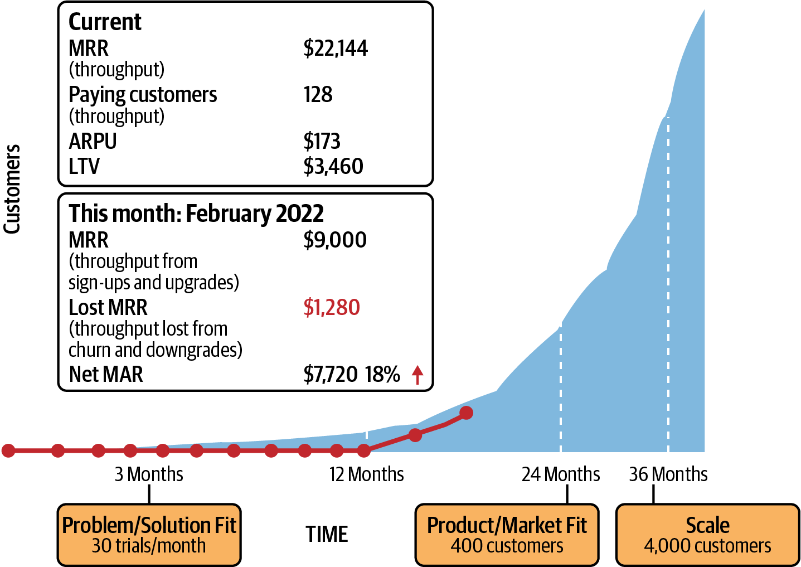

<!-- Page 295 -->

Set context
The opening slides should set the context for the meeting:
Slide 1: Review 90-day cycle objectives
Share the high-level objective of the 90-day cycle (e.g., achieve prob-
lem/solution fit) and summarize the number of business model variants
you were exploring. If more than one, start with the winning model.
Slide 2: Elevator pitch
Deliver your elevator pitch with supporting visuals.
What we thought
Next, review your thinking from the start of the current 90-day cycle:
Slide 3: Lean Canvas snapshot
Share the snapshot of your Lean Canvas from the start of the cycle and
highlight your key assumptions.
Slide 4: Traction roadmap snapshot
Share the snapshot of your traction roadmap from the start of the cycle
and highlight the key results you needed to hit to meet your 90-day goal.
What we did
The next slides should address what actions you took during this cycle:
Slide 5: Validation campaigns
Describe the validation campaign(s) you selected at the start of the 90-day
cycle.
Slide 6: Experiments
Summarize the experiments you ran—e.g., number of people interviewed,
number of pitches delivered, etc.
What we learned
And the following slides should present what you’ve learned and achieved
through those actions:
Slide 7: Insights
Summarize your key learnings. This is where it can be powerful to overlay
your latest Lean Canvas and/or traction roadmap updates and highlight
what warranted those changes.
Slide 8: Traction
Show your actual traction overlaid on your traction roadmap and summa-
rize the results from your campaign.

<!-- Page 296 -->

What’s next
Finally, address your plans for the future:
Slide 9: Current constraint
Share your perspective on the next constraint to tackle (if it has changed)
in your business model.
Slide 10: 3P Next action
Use the combination of your traction metrics and assessment of your
constraint to propose a 3P next action: persevere, pivot, or pause.
Remember the visual of the Idea Labyrinth I shared back in the Introduc-
tion to the book? The journey to product/market fit will be riddled with
straight shots (persevere), twists and turns (pivots), and dead ends and
backtracking (pauses). Here’s how to decide which action to take:
• If you’ve either met or exceeded your 90-day traction goal, you should
•
persevere. Highlight your next 90-day goal from your traction road-
map and describe the key objective for your next 90-day cycle (e.g.,
build and launch MVP).
• If you did not meet your 90-day traction goal but uncovered some key
•
insights that could potentially fix your business model in the next 90-
day cycle—e.g., pivoting to a different customer segment—you should
pivot. Be wary that a pivot not grounded in learning is simply a “see
what sticks” strategy. In order to make a compelling case for a pivot,
be prepared to share the evidence behind your recommendation.
• If you did not meet your 90-day traction goal and have either run out
•
of resources or uncovered enough evidence to call this business model
a dead end, you should pause.
Running the Meeting
The following are some guidelines for running an effective 90-Day Cycle
Review Meeting:
Who to invite
Invite your core team, plus any extended team members such as advisors
and investors.
Ask for sufficient time
I would suggest scheduling 45 minutes on everyone’s calendar.

<!-- Page 297 -->

Use a combination of slides and handouts
As with the earlier business model story pitch, your Lean Canvas and trac-
tion roadmap snapshots make for perfect handouts to avoid interruption
while leading your audience through the progress update.
Use a 20/80 rule
Plan on delivering your progress update in 10 minutes (20% of the meet-
ing) and use the remaining time to discuss, solicit feedback, and drive
decisions.
Solicit advice from your investors (external stakeholders)
Your investors aren’t just for money conversations, and if you involve
them in the right way, they can be an invaluable asset for unblocking your
business model constraints. They see lots of startups and can be a treasure
trove of new tactics that could unlock growth in your business model. But
they can’t share these with you unless they know you need them.
Here’s what not to do:
• Don’t play success theater. Many entrepreneurs tend to share only
•
good news with external stakeholders and hide any bad news for as
long as they can. This creates an unsustainable dichotomy over time.
Instead, seek to partner with your stakeholders. They want what you
want: a business model that works.
• Don’t blindly follow what they tell you. Another trap is wanting to
•
follow all the advice you are given, especially when it’s coming from
someone whom you respect or who is paying the bills. Left unchecked,
this does more to distract and derail you than to help.
Here’s what to do instead:
• Objectively share your progress update. Plan on presenting the
•
same information to your external stakeholders as you would your
core team. When you present skewed or selective data to external
stakeholders, their advice will be much less helpful. Try not to seek
validation.
• The buck stops with you. Always, remember that you are the ultimate
•
stakeholder (investor #1) in your own business. You don’t get a gold
star for following advice, but for achieving results.

<!-- Page 298 -->

Run a tight agenda
No one wants to spend needless time in meetings, so come prepared and
keep it tight. I’ve provided a sample agenda you can use in the following
sidebar.
90-Day Cycle Review Agenda (45 Minutes)
Welcome (set the stage)
(2 minutes)
Set the stage for the meeting by quickly running through the agenda:
• Progress update (uninterrupted): 10 minutes
•
• General discussion (Q&A): 15 minutes
•
• Solicit advice: 15 minutes
•
• 3P decision: 3 minutes
•
Deliver progress update (uninterrupted)
(10 minutes)
Deliver your progress update, using the slide deck and artifacts you put together in the
previous sections.
General discussion (Q&A)
(15 minutes)
Attendees can use this time to ask questions about the progress update and seek
clarification on how you may have arrived at certain insights, including how and why
you selected your winning business model variant if you were exploring multiple
variants. Be prepared to pull up experiment details, Customer Forces Canvases, and/or
metrics (if needed) to back up any of your claims.
Solicit advice
(15 minutes)
Seek alignment on your assessment of the current constraint and solicit feedback on
your next action proposal (persevere, pivot, or pause). Remember that just as in the
90-Day Cycle Kickoff Meeting, the goal here isn’t brainstorming new campaigns, but
rather aligning the entire team on the current reality of your business model, and
starting some discussion on your next 90-day cycle OKRs.

<!-- Page 299 -->

3P decision
(3 minutes)
Wrap up the meeting by summarizing the 3P decision and scheduling your next
90-Day Cycle Planning Meeting. Note that you won’t need another 90-Day Cycle Kickoff
Meeting to align your team members, as this meeting does that job.
Steve Calls a 90-Day Cycle Review Meeting
“I see smiles, so I’m guessing the cycle ended well,” Mary says.
Steve replies with a grin, “More than well. I can’t wait to deliver the update.”
He begins by quickly reviewing the current cycle’s objectives and what the
models looked like at the start of the cycle.
“You all know that we moved away from the Software Developers business
model and homed in, no pun intended, on Home Construction, with an ini-
tial early adopter focus on architects that currently use 3D renderings with
clients.”
Lisa and Josh smile and roll their eyes.
“While we were off to a rocky start, we made a big breakthrough in just
the last sprint. We were pitching Altverse as a way for architects to shorten
their design cycle with clients, but we stumbled into an even bigger job: client
education.”
He pauses to catch his breath, then goes on. “Architects spend 30–40 hours on
average to educate new clients. This includes meeting with them to discuss the
design, show them material choices, take them shopping, and help them make
design choices. They sometimes explicitly bill for this time, but most of the
time they don’t, which naturally eats into their profits. The way one architect
put it is that this time with clients is simply ‘the cost of doing business.’ It’s
to ensure that clients make decisions quickly and that any big design issues
are caught as quickly as possible to avoid much bigger problems later. He
went so far as to tell us that they budget 10–15% of their overall fee for
client education. We know a typical engagement is roughly $100k, so that’s
$10–15k.”
Steve sees a smile come across Mary’s face, and he keeps going. “That’s when
we threw out this idea for the firm to hire us on a monthly retainer, where
we’d ensure that their clients always had access to a photorealistic rendering
of their project with the latest design and material selections. While we’ll have
to test how much of the education overhead it will eliminate, after seeing the
realism of our renderings, the architects were convinced it will make a large

<!-- Page 300 -->

dent. We anchored against their overhead and threw out $1k/client/mo. They
agreed to pilot the service with one of their clients about to start the design
phase (three months). We took this same mafia offer to other firms, and were
able to convert three out of four of them on the same terms.”
Steve then summarized the next steps for the team. “Our next step will be
moving forward to finish packaging and delivering the Concierge MVP to
these four clients. We should be ready to bring them on in four to six weeks,
which matches their timelines as well. Any questions?”
Mary jumps in, “Congratulations to all of you for a job well done. I’m curi-
ous—how did you uncover this bigger job around client education?”
“It was the architect who brought this up,” Lisa answers. “He was completely
blown away by the realism of the rendering and told us that he thought
showing this to clients would answer so many frequently asked questions they
get from all their clients. He was then curious about our catalog of materials.
That’s when Steve got up and took a picture of the wallpaper in the conference
room, updated the model to use that in the rendering, and showed it to the
architect. He almost fell out of his chair. He was sold, and the rest was smooth
sailing from there. We built that bit into the standard demo.”
“That’s amazing,” says Mary. “Be sure to keep this architect really close and
treat him well. He’s definitely an early adopter and someone you want on your
side. Is there anything else anyone would like to share?”
Everyone shakes their head.
“Okay,” Mary continues, “then I’d like to share a couple of things. First, I
mentioned this to Steve already but wanted to reemphasize to all of you as
well that even though you’re going to be shifting focus to launching your MVP
next, you still need to keep your customer factory running.”
“You mean to keep pitching and closing more architects?” Lisa asks.
“Yes,” Mary replies, “but also investing in automating and scaling your efforts
on channels and campaigns. Remember that while the hockey-stick curve starts
rising slowly, you need to be constantly thinking about 10x’ing your traction.
So in addition to launching, you’ll need to scale up your mafia offer.”
She lets that sink in and then goes on. “Second, I think it would be a great idea
for you, Steve, to deliver this same update with a few tweaks to the two angel
investors you spoke to earlier.”
Josh asks, “Do you think we’re ready to raise investment?”

<!-- Page 301 -->

“You can make that determination when the time comes,” Mary replies, “but I
think you’re ready to start socializing your traction story to early-stage invest-
ors, especially since you know you’ll be raising money down the road. I also
think it’s time for you, Josh and Lisa, to make a personal go/no-go decision
on joining the team full time. While problem/solution fit can be achieved part-
time, the road ahead will require the full commitment of a complete team.”

<!-- Page 302 -->

<!-- Page 303 -->

PART III
GROWTH
Achieving problem/solution fit is the first significant validation milestone in
a startup. From a business model perspective, this indicates that you have suc-
cessfully demonstrated sufficient initial demand for your product to warrant
moving on to the build stage, which sets you off on your journey toward
product/market fit (stage 2).
However, be wary that when you first launch an MVP, lots of things can
and do go wrong. When that happens, it’s easy to slip back into viewing
your solution as the product. The typical reaction is to want to build more
stuff—especially when it comes disguised as a customer feature request. In
short order, your simple and focused MVP quickly devolves into a bloated
monster.
While listening to customers is key, you have to know how—and blindly push-
ing features is almost never the answer. You need to continue to holistically
view your business model as the product (Mindset #1) and use the same
process that got you here in the journey ahead.

<!-- Page 304 -->

More specifically, you need to continue running 90-day cycles where you:
• Define 90-day goals using your traction roadmap
•
• Identify the key constraints holding you back
•
• Make bets on campaigns for breaking these constraints
•
• Systematically test your campaigns using sprints
•
• Make evidence-based 3P (pivot, persevere, pause) decisions
•
The Journey Ahead
As we’ve covered previously, the journey from problem/solution fit to prod-
uct/market fit takes roughly 1–24 months. While that seems like a long time,
it’s only six to eight 90-day cycles. In that time, if you’re using a 10x growth
rate, you’ll need to 10x your traction twice.
While the thought of having to 100x your traction can feel overwhelming, it
helps to think in terms of systems. One 10x jump is roughly doubling three
times (23 = 8). Since you have six to eight cycles to get to product/market fit,
you can frame the mission of each cycle as doubling your traction—i.e., finding
one 2x lever for growth.
A systems perspective can also help inform the growth strategies (campaigns)
you employ within each cycle. The key deliverable of problem/solution fit was
getting your customer factory up and running—i.e., establishing repeatable
acquisition. As you optimize your customer factory to achieve product/market
fit, you can tackle this optimization process in stages.
That is, we can further break the journey to product/market fit into three
substages (Figure III-1):
• MVP launch
•
• Solution/customer fit
•
• Product/market fit
•

<!-- Page 305 -->

Figure III-1. Product/market fit substages
MVP Launch
Your objective here is getting your MVP ready for launch within the next
90-day cycle. This involves not only getting your solution ready for launch, but
also laying out a foundation for continually learning from your early adopters.
Solution/Customer Fit
Post-launch, you then focus on validating your value delivery hypotheses—
i.e., ensuring that your MVP indeed delivers on your UVP and creates happy
customers. The key deliverable at this stage is demonstrating that you can
repeatedly activate and retain your early customers.
Achieving solution/customer fit typically takes three to six months for most
products.
Product/Market Fit
Once your value delivery hypotheses are validated, your focus then shifts
toward accelerating growth. This starts your search for a sustainable engine
of growth, which can take another 6–12 months to achieve.

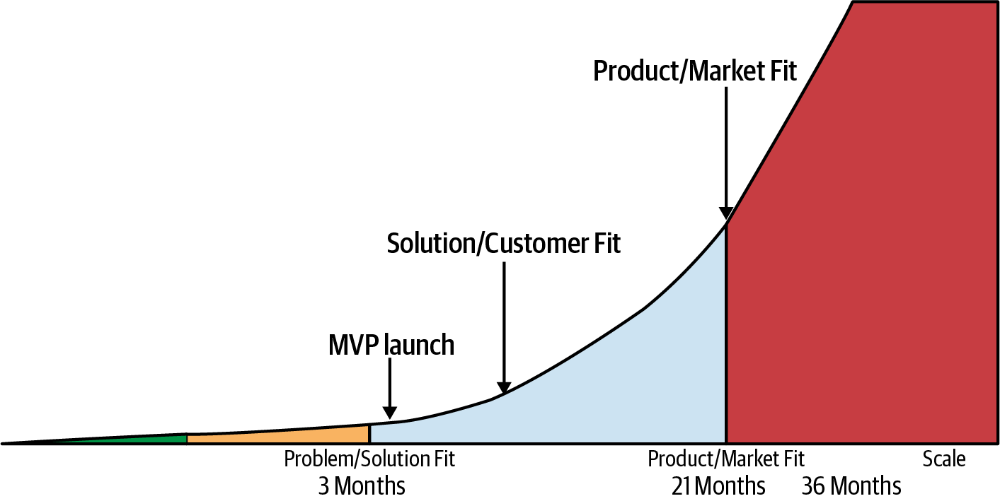

<!-- Page 306 -->

Part III of this book dives into practical steps for navigating these three sub-
stages for achieving product/market fit. In these final chapters, I’ll show you
how to:
• Get ready to launch (Chapter 12)
•
• Make happy customers (Chapter 13)
•
• Find your growth rocket (Chapter 14)

<!-- Page 307 -->

C H A P T E R 1 2
Get Ready to Launch
By this time, you definitely understand your customers’ needs better than you
did just a few weeks ago, and you have a much clearer definition of your MVP.
Continue to be wary, though, of the Innovator’s Bias. It’s still fairly easy to
get distracted during this stage and either build too much or build the wrong
product.
In addition to staying razor-focused on building out your MVP, you’ll need to
focus on a few other housekeeping items in order to optimize your product
launch for speed, learning, and focus.
Running a big launch campaign or a PR stunt isn’t one of those things. Trying
to build a lot of buzz or garner media attention for an unproven product is
premature optimization. Even if you succeed at generating a lot of traffic to
your product, unless you have something compelling to make them stay, that
traffic will quickly dissipate.
A much better strategy is to separate your product launch from your marketing
launch. Your product launch is best implemented as a soft launch to early
adopters where your key objective is validating for value delivery (i.e., whether
you’ve delivered on your unique value proposition).
Only when you can repeatedly demonstrate value delivery to your customers is
a big marketing launch warranted.
This chapter will show you how to optimize your product launch for speed,
learning, and focus.
Figure 12-1 shows what this looks like on a 90-day cycle. Aim to build your
MVP in four sprints or less (two months), spend a sprint preparing for launch,

<!-- Page 308 -->

and then kick off your early access launch. Note, however, that these are only
guidelines, and your mileage could vary based on your specific product.
Figure 12-1. Typical 90-day cycle for launching your MVP
The Altverse Team Prepare for Launch
After the last meeting, Steve met separately with Lisa and Josh to start discus-
sions about them joining the company full-time as cofounders. Both were keen
to come on board. Steve then presented a stock ownership and compensation
plan he had created with input from Mary.
In parallel, he presented an investor pitch to the two angel investors and was
in the final stages of raising a small seed round that would allow him to cover
payroll for a team of 5 people for the next 9–12 months. Both Lisa and Josh
agreed to all the terms and committed to officially join the team.
With his team and runway now secured, Steve kicks off the next 90-day cycle.
“I think we’re clear on the two campaigns we need for the next 90 days,” Steve
begins. “We need to get the Concierge MVP up and running, and continue
scaling beyond the mafia offer.”
“Given the price point of these deals, I would think that building a direct sales
campaign would be the next best campaign recipe to consider,” comments Lisa.

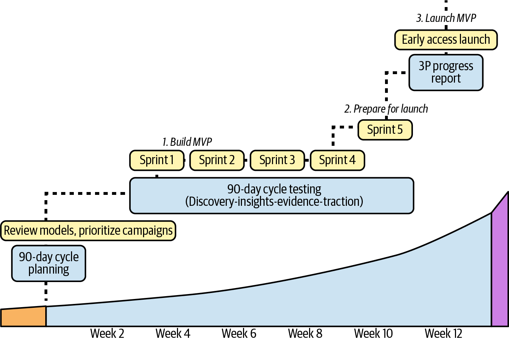

<!-- Page 309 -->

“I agree,” replies Mary. “You’re now ready to focus on systematizing every-
thing you’ve learned into a repeatable sales process, and I assume you’ll own
that, Lisa. I would also suggest using some kind of customer relationship
management system so that you can qualify and select your most promising
early adopters from other later-stage customers.”
Lisa nods her head in acknowledgment.
“It goes without saying, but I’ll say it anyway: the most important thing for
the next several sprints is staying razor-focused on getting the Concierge MVP
ready and not getting distracted by shiny objects,” adds Mary.
Steve blushes a little while nodding in agreement. “I’ve locked down the scope
of what we’ll need. There were a few additional feature requests that came up
during the demo, but we can push those to after the launch.”
Mary nods. “Sounds good. In addition to getting the MVP ready, you’ll also
want to start building out a company-wide dashboard. Granted, you’ll only be
starting with four firms, but including their clients, you’ll have 20–30 people
using the MVP, and those numbers will grow from here. You’ll need visibility
into how people are using the MVP to optimize.”
“Couldn’t we also set up regular check-ins with the architects to get feed-
back?” asks Josh.
“That’s a given, and the last point I wanted to make,” replies Mary. “Simply
throwing your solution over the fence to customers seldom works. You’ll
have to build a systematic process for turning these early adopters into happy
customers. That starts with rolling out your MVP in waves or batches, setting
expectations up front on success metrics, and establishing frequent check-ins.”
“Starting with a Concierge MVP should help with that, I’m guessing?” Josh
asks.
“It certainly does as you guys will be the primary customer-facing interface,
but you’ll still be surprised at how much effort it takes to switch customers
from their old way of working to a new way,” replies Mary. “But first things
first. I’ll send you guys some notes on how to get ready for launch. We’ll revisit
pilot management along the way.”
Keep Your Customer Factory Running
Once you’ve secured your first batch of early customers, it’s tempting to com-
pletely shift your focus to delivering value to them and wind down your
broader customer acquisition activities in order to focus on product develop-
ment. This is a mistake. Here are some reasons why:

<!-- Page 310 -->

Your customer factory is like a flywheel
It takes a lot of effort to initially get your customer factory up and run-
ning, but not as much effort to keep it running. If you bring your customer
factory to a halt, you’ll have to expend more effort in the future to start it
up again, which will cost you time.
Continuously optimizing your customer factory requires a continuous flow of
users
Your customer factory is a system of interconnected steps that work
together. Optimizing any one part of a system in isolation often ends
up hurting your overall system throughput. This is the local optimization
trap.
This is why you can’t afford to shut off or ignore certain steps. In order
to optimize the overall throughput of your customer factory, you need a
steady stream of users constantly flowing through the system.
NOTE
Your goal is establishing “just enough” traffic to support learning.
Establishing repeatability is a prerequisite for growth
Your customer factory is a system. A key attribute of systems is that they
are repeatable. When a factory manager wires up the machines on the
factory floor, they first establish a predictable throughput baseline (give
or take a small expected tolerance for variability) before undertaking any
optimization steps. Your customer factory is no different.
You can’t scale a business model that isn’t repeatable. Getting to your
first 10 customers, while an achievement, isn’t repeatable if you don’t
know where your next 10 customers will come from. In order to get to
repeatability, you need to keep your customer factory always running.
Look for Ways to Automate Your Customer Factory
An often-underutilized lever for growing traction is automating steps in your
customer factory. Too many entrepreneurs focus only on improving conversion
rates and ignore another powerful lever: cycle time.
TIP
Halving your sales cycle has the same effect as doubling your close rate.
Look for opportunities to replace any high-touch interactions in your acquisi-
tion and activation steps with more automated touchpoints. Be prepared to

<!-- Page 311 -->

experience a drop in conversion rates whenever you move from a high-touch
interaction to a more automated touchpoint, though—your customer factory
will require regular tending in order to drive repeatable growth.
Race to Value Delivery
As you transition into product development, it’s very easy to get into a state of
flow and lose your sense of time. To avoid this, it’s critical to be razor-focused
on getting to MVP release 1.0 and to fight off distractions. Here are some tips
on how to do this:
Set a nonnegotiable launch date and stick to it
Embrace the two-month MVP constraint from your solution design sprint
(Chapter 9), and take it a step further: announce a launch date to your
early adopters in order to hold yourself externally accountable.
Fight scope creep
More features dilute your unique value proposition. You’ve gone to great
effort to keep your MVP as small as possible; don’t dilute it with unneces-
sary distractions.
NOTE
Simple products are simple to understand.
Reduce scope to the first 90 days of usage
An effective way of limiting scope is only building for the first 90 days of
usage. Three months is typically enough time for a customer to make a
hire or fire decision on any product. Look for other opportunities to defer
non-core features to later.
Adopt a continuous delivery strategy
Instead of trying to cram every aspect of your product into your MVP,
embrace a just-in-time continuous delivery strategy. Continuous delivery
is where you continuously release new features into your product over
time using small, short cycles. While this is a commonly used technique in
software products, with a little creativity and planning you can implement
continuous delivery with non-software products too.
Here are a few examples:
• Tesla shipped its second car, the Model S, without many “promised”
•
features, like programmable seats and autonomous driving. Tesla was
careful to ship the cars with all the hardware needed to implement
these features and delivered the features later, with software updates.

<!-- Page 312 -->

• Playing Lean is a board game that teaches you Lean Startup principles.
•
The team behind the game implemented continuous delivery by ship-
ping customers new replacement packs and dice as they iterated on
game play.
Avoid premature optimization
All your energy needs to be channeled toward accelerating learning. Speed
is key. Don’t waste any effort trying to optimize your servers, code, data-
base, etc. for the future. Chances are quite high that you will not have
a scaling problem when you launch. In the rare event that you do (a
great problem to have), most scaling problems can be initially patched
with additional hardware, which you can justify because you should be
charging your customers—buying you time to address the problem more
efficiently.
Get feedback from your early-access customers along the way
Share screenshots and/or invite your customers to live demo events to
showcase your progress along the way. This is great for both maintaining
interest and gathering feedback from your early-access customers.
Extend Your Customer Factory Metrics Dashboard
A business should be run like an aquarium, where everybody can see what’s
going on.
—Jack Stack, The Great Game of Business
Now is the time to extend the company-wide dashboard you created in Chap-
ter 10 to include your product metrics as you prepare for launch.
Having a single company-wide dashboard helps your team to align around the
most pressing hot spots or constraints in your business model.
Here are some guidelines for how to build out your company-wide dashboard:
Don’t drown in a sea of nonactionable data
With the explosion in the number of analytics tools that are available
today, it has become significantly easier to measure lots of product metrics.
The common tendency with metrics is to collect and analyze as much data
as possible. We live in a world where we can measure almost anything, but
instead of getting clarity, we end up drowning in a sea of nonactionable
data.
If you have ever used Google Analytics, you know what I mean. Using a
tiny snippet of JavaScript code, you can start collecting thousands of data

<!-- Page 313 -->

points. Once you add a handful of other tools to the mix, these numbers
quickly explode. Like too much information, too much data is paralyzing.
NOTE
You don’t need lots of numbers, but a few key actionable metrics.
Start with your customer factory metrics
Revisit your customer factory and remap each step to one or more specific
actions your users will take with your product.
For example, here’s how we mapped the customer factory for our LEAN-
STACK SaaS product:
a. Acquisition: Signed up for a free account
a.
b. Activation: Completed a Lean Canvas
b.
c. Retention: Came back and used the product
c.
d. Revenue: Upgraded to a paid account
d.
e. Referrals: Invited others to their project
e.
As you might have noticed already, all of the steps in the customer factory
blueprint are really macro events that mark the most significant actions
your customers take. These macro events are usually composed of one or
more additional micro events. For instance, before someone signs up for a
LEANSTACK account (acquisition), they might click a link on a blog post,
visit a landing page, and browse around the site.
The purpose of the company-wide dashboard isn’t to capture every sub-
step—just the most significant customer life cycle events. Using fewer met-
rics not only keeps you from drowning in numbers, but also helps you
focus on the right hot spots in your business model (aka constraints).
Macro metrics help determine the general locations of the hot spots, while
micro metrics help determine their exact locations (and play a role in
troubleshooting).
Don’t feed your vanity
One of the reasons measuring the “true progress” of a product is hard is
that we prefer reporting good news over bad news. We like charts that
trend up and to the right, which isn’t intrinsically a bad thing—until we
start devising charts that can go nowhere but up and to the right.
Cumulative counts, like the total number of people who have ever signed
up for your service, regardless of whether they continue to use it, are
the perfect example. While these numbers can flatline, they can never go

<!-- Page 314 -->

down. That’s the first telltale sign that you have a vanity metric on your
hands.
To be fair, there is a place for vanity metrics. They can be used with
great effect on marketing websites to build up social proof and ward off
competition. But when you use these same metrics as internal measures of
progress, they provide only an illusion of progress and prevent you from
confronting brutal facts about your business.
NOTE
It is not the metric itself, but how you measure it, that makes it a vanity or an
actionable metric.
Strive for actionable metrics
An actionable metric is one that ties specific and repeatable actions to
observed results. In other words, you can derive causality. The gold stan-
dard for doing this is measuring your customer factory in batches (or
cohorts).
The concept of batches is even easier to understand with the factory meta-
phor. Daily run baselines build on the principle of repeatability and help
factory managers quickly detect problems on the factory floor. When a
particular batch yields abnormal results, they not only know something is
wrong, but can also quickly home in on the problem step.
You can take the same approach to benchmarking a customer factory. You
start by grouping your users into daily, weekly, and monthly batches based
on their join date (or sign-up date). Then, you measure their significant
user actions as they progress through your customer factory.
NOTE
Cohorts help you measure relative progress by pitting one batch of users
against another.
While measuring your metrics for cohorts is more work than simply meas-
uring them as an aggregate, a cohorts-based approach affords the follow-
ing benefits, which make it worth the extra effort:
Batches isolate common attributes
If you think of your product as a moving river that is constantly
changing, grouping users by their join date groups them into batches
that experience your product similarly enough. Together, they establish
a baseline or benchmark to beat. This concept of grouping users by a

<!-- Page 315 -->

common attribute can be extended beyond join dates. You can create
cohorts by gender, acquisition traffic source, release dates, use of a
particular feature, and so on.
Batches make it easier to visualize progress
Comparing the relative throughput of different batches over time pro-
vides you with an apples-to-apples comparison. Once you normalize
your data and track users as cohorts, numbers moving up and to the
right are no longer vanity metrics—they are an accurate measure of
progress.
Batches help you home in on causality
If you do see a spike across your batches, it allows you to home in on
possible causes by inspecting what changed in the batch. Your next job
is to further isolate the effect of that action, possibly by repeating the
action and looking for similar results. This is the basis of split testing
(also referred to as A/B testing).
Summarize your metrics on a single page
While there are lots of great third-party tools for measuring the various
steps in the customer factory blueprint, I haven’t yet found a single tool
that works across the full blueprint. As a result, we at LEANSTACK end
up using a number of different tools to piece together our company-wide
metrics dashboard on a single page. Figure 12-2 shows an example.
NOTE
You can download a blank company-wide metrics dashboard template on the
LEANSTACK website.

<!-- Page 316 -->

Figure 12-2. Company-wide metrics dashboard
Roll Out Your MVP in Batches
As we’ve discussed, when you first launch a product lots of things can—and
do—go wrong. This is why launching your MVP publicly or to your entire
customer list is often a bad idea.
A more effective strategy is soft-launching your MVP in batches, launching the
initial version only to your “best” early adopters, then refining it systematically
with each subsequent batch of early adopters.
Here’s how to formulate a batch rollout strategy:
Handpick your “best” early adopters for the initial batch
If you can’t deliver value to your biggest fans, what makes you think you’ll
be able to deliver value to strangers? Handpick your first batch of early
adopters based on who you determined to be the best fit during your mafia
offer delivery pitch.
NOTE
You don’t need a lot of users to support learning—just a few good customers.

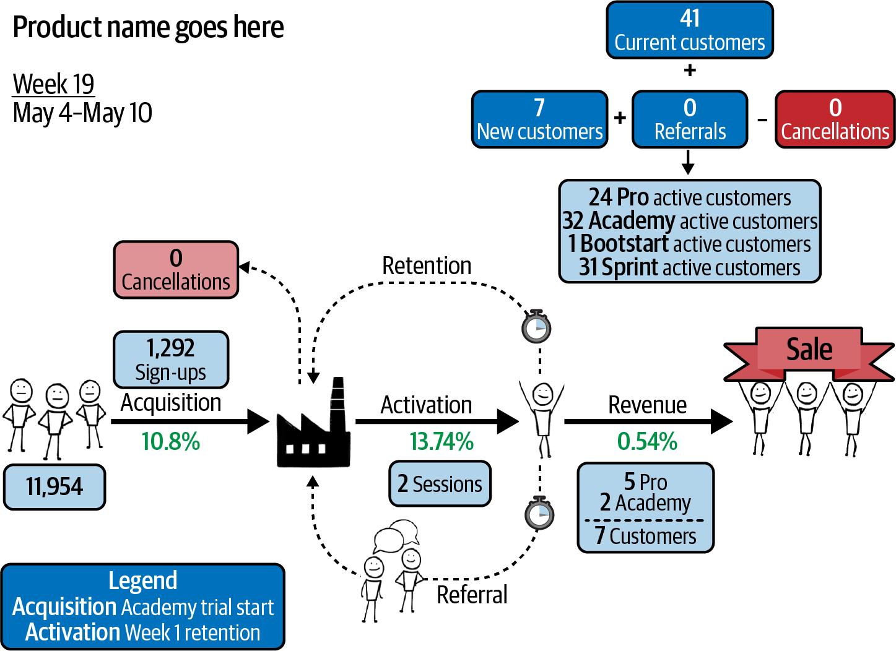

<!-- Page 317 -->

It’s okay to start with friends or friendly early adopters
Getting a product right is hard, and you don’t need to make it any harder.
In your first batch, it’s okay to recruit your friends or people you already
know that might qualify as friendly early adopters, like existing customers
from another product. They can help you find and fix any glaring obvious
issues quickly, without risk of losing the account.
Recruit your next best set on a motivation scale
Your next best set of early adopters are those that have above-average
motivation to use your product. You aren’t looking for tire kickers, but
those who have a sense of urgency and really want to use your product to
achieve a clear and specific desired outcome. Revisit your Customer Forces
Canvas notes to determine who these “next best” adopters may be.
Balance your batch sizes against your traction model
Use your traction model to size your batches so that you are always at or
above your traction goal while staying within your team’s and product’s
capacity limits—i.e., without compromising on value delivery.
The Altverse Team Launch Their Concierge MVP
Six weeks into the second 90-day cycle, the Altverse team brings its first two
architecture firms online. The team has a pipeline of 12 other firms and are
steadily signing up 3–4 firms a month for pilots. The team estimates the cur-
rent capacity limit of its Concierge MVP at 20 firms. They decides to ramp
up customers at a rate of one firm per week. This keeps them above their
traction goal while balancing their batch size against their current capacity.
This strategy will take them out to four or five months from now.
Meanwhile, Steve and Josh will be working on optimizing the slowest parts of
the Concierge MVP. Their goal is to double their delivery capacity well before
they hit that limit. They are off to a good start and set their sights on meeting
their next objective: making happy customers.

<!-- Page 318 -->

<!-- Page 319 -->

C H A P T E R 1 3
Make Happy Customers
All businesses, irrespective of business model type (B2B, B2C, digital, hard-
ware, services, etc.), share a common universal goal: make happy customers.
Making happy customers is not the same thing as making customers happy.
Making customers happy is easy—just give them lots of stuff for free. But that
doesn’t lead to a working business model. Making happy customers, on the
other hand, is not just about making customers feel good. It’s about helping
customers to achieve results (desired outcomes).
This chapter will show you how.
The Altverse Team Learns About Behavior Design
Steve kicks off the next team meeting by highlighting their current progress.
“At this point, we have eight architecture firms using Altverse, and we’ve
delivered three finished models to date.”
“I would have expected more models. Why so few?” asks Mary.
“Some of it is due to delays on their side,” Steve responds. “We’re waiting
for them to get back to us with plans and specs. But while we’re waiting, I’m
taking advantage of the downtime to build out the pricing module.”
“Has anyone pitched the pricing module to the architects, or did they ask for
this?” Mary asks.
Lisa and Josh shake their heads.
“Then why are we building this now?” Mary presses.
Steve jumps in. “I thought we’d get ahead of the curve—”

<!-- Page 320 -->

“Demo-Sell-Build isn’t just for the MVP,” interrupts Mary. “It’s how you
should validate every major feature that takes on a new JTBD from here on
out. But more importantly, until you can repeatedly deliver on the first job you
were hired to do, you shouldn’t be taking on any additional jobs. This is the
Innovator’s Bias rearing its ugly head again, Steve. I warned you this would
happen.”
Mary waits for a nod from Steve, then goes on. “Speed is key, but it’s impor-
tant not to rush into speed of implementation without learning. That is the
premature optimization trap and a recipe for focusing on the wrong things at
the wrong time.”
“So is the right thing here to increase the batch size and bring on more custom-
ers?” asks Steve.
“No,” answers Mary. “The right thing here is understanding why your current
customers aren’t behaving the way you expected they would. Simply adding
more customers is brute-forcing a fix to increase the aggregate number of
models and hides the fact that some of your customers aren’t engaging with the
promise of your product. They’ll eventually churn.”
“Hmmm…so how do we fix this? We can’t force our customers,” Steve says.
“Sure, you can’t force them, but you can certainly steer them.”
“Is this what you meant earlier by managing the pilot?” Josh asks.
“Yes, exactly. Immediately after purchase, customers start out with a high level
of motivation to switch, but motivation has a short half-life. Left unmanaged,
it dissipates quickly and inertia takes them back to their familiar old way—the
status quo.”
“I thought inertia applied only pre-acquisition?” Lisa comments.
“No, inertia is simply resistance to changing from the status quo,” Mary
replies. “Remember your high school physics: an object at rest stays at rest
and an object in motion stays in motion unless acted upon by an unbalanced
force.”
Lisa bursts out laughing. “It’s been a while, I can’t believe I still remember
Newton’s First Law of Motion.”
“So yes, the first battle is getting people moving toward the top of the meta-
phorical progress hill, but if this is a job the customer has done before, you
have to contend with their past habits built around the old way,” says Mary.
“That’s the status quo.”
“Sure, that makes sense. But habits are hard to change. How do we influence
them?” Lisa asks.

<!-- Page 321 -->

“The good news is there is a science to behavior design, which is finding
its way into product design as well. Acquisition is the first step, but making
happy customers requires establishing your product as the new status quo.
That means working on activation and retention.”
The Happy Customer Loop
Once you’ve established some level of repeatable acquisition in your customer
factory, the next most important step is activation. This is where value is
created for your customers. When you create value for your customers, they
reciprocate — allowing you to capture some of this back in the form of mone-
tizable value. But remember that in multisided business models, monetizable
value may not be the same thing as revenue.
The activation step is where happy customers are made, and it’s often also
referred to as the “aha moment” of a product. Notice in Figure 13-1 that
the activation step has the most lines leading out of it. This is what makes
activation a causal step.
Figure 13-1. Activation is a causal step
Creating happy customers causes:
• More time to be spent with your product (retention)
•
• More monetizable value to be captured (revenue)
•
• More goodwill to be spread (referral)
•
The inverse is also true.

<!-- Page 322 -->

Upon reaching the activation step, the next critical step isn’t revenue, but
retention. Even if you collect revenue upfront at the time of acquisition, unless
customers can derive value from your product, they will ask for a refund.
This is why the revenue step is shown after activation in the customer factory
figures. Furthermore, delivering value just once usually isn’t enough to make
your product stick. You need to repeatedly deliver value to customers over
multiple interactions to cause a real switch.
NOTE
Innovation is causing a switch from an old way of doing things to your new way.
A lot of marketers declare victory at acquisition, but acquisition is only the
first battle. It’s fairly common today for customers to sample multiple solutions
simultaneously for a period of time before picking the right solution for them.
This is true across every product type, whether it’s B2C or B2B, digital or
physical.
The activation and retention steps, taken together, form a happy customer
loop, as shown in Figure 13-2.
Figure 13-2. The happy customer loop
Some products may require just a few cycles through the happy customer loop
to cause a switch. Others may need more passes to convince the customer to
completely fire their old way of getting the job done and hire your new way.
This is the actual switch moment when your product becomes the new status
quo solution for your customer.

<!-- Page 323 -->

When you first launch a product, optimizing your happy customer loop is
where most of your attention should be focused. Figure 13-3 shows what that
looks like on a 90-day cycle.
Figure 13-3. Typical 90-day cycle for optimizing your happy customer loop
The initial user experiences that customers have with your product need to
get them to activation, or an aha moment. Activating your customers causes
subsequent revisits (retention), and these revisits need to continuously reinforce
the promise of your unique value proposition and get your customers closer to
their desired outcomes. That’s when you cause a switch.
Plan on using two sprints to get customers to the aha moment and three
sprints to get them to their switching moment, and reserve one sprint at the
end to gather your learnings into case studies. Note, again, that these are only
guidelines, and your mileage may vary based on your specific product.
In this section, I’ll share some tips on how to optimize your happy customer
loop—but let’s start with what not to do.

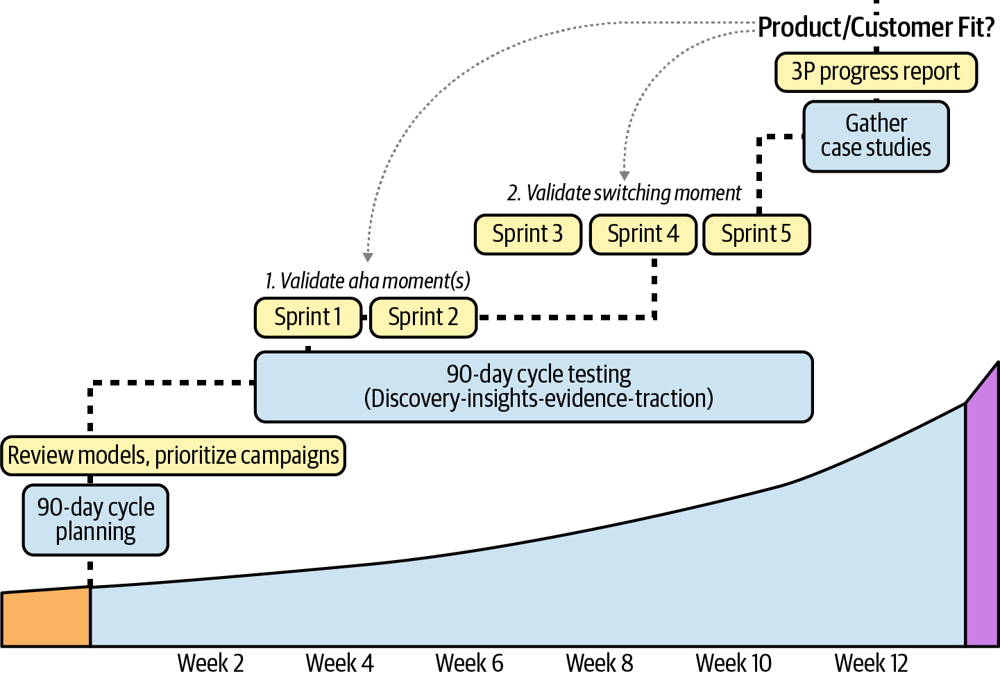

<!-- Page 324 -->

Don’t Be a Feature Pusher
In a great market—a market with lots of real potential customers—the
market pulls the product out of the startup.
—Marc Andreessen, The Pmarca Guide to Startups
When you first launch a product, a typical reaction is to want to build
more stuff—especially when it comes disguised as customer feature requests.
Remember that customers, too, are prone to the Innovator’s Bias. Most cus-
tomer feature requests are solutions disguised as problems. Even when you
build exactly what they ask for, they often don’t use it because it doesn’t solve
a real problem.
When you start adding lots of new features to your MVP, you quickly find
yourself back in the old world. In short order, your simple and focused MVP
devolves into a bloated monster.
Even after your product launch, listening to your customers is key—but you
have to know how. Blindly pushing more features is almost never the answer.
So how do you balance your natural urge to want to build more?
Implement an 80/20 Rule
A good rule of thumb for prioritizing focus on optimizing your happy cus-
tomer loop is implementing an 80/20 rule (Figure 13-4). This rule says that
most of your time immediately after launch (80%) should be spent measuring
and improving existing features, rather than chasing after new shiny features.
Figure 13-4. The 80/20 rule

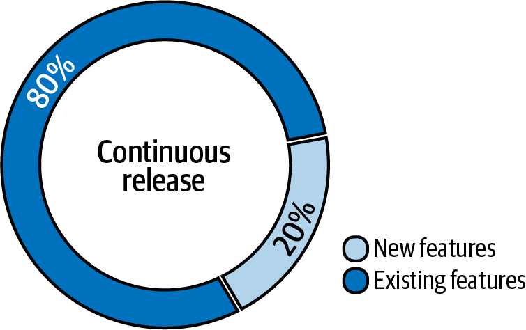

<!-- Page 325 -->

Prevent a Switch
Before acquisition, innovation is about causing a switch from the existing
alternatives to your product. After acquisition, innovation is about ensuring
customer activation and preventing a switch from your product to existing
alternatives.
The best way of preventing a switch isn’t by locking in your customers with
draconian policies or taxing them with high switching costs, but by getting the
job done better than the competition.
What does better mean? During the problem/solution fit process, you used the
Customer Forces Model to uncover the axes of better in order to position your
product uniquely against the existing alternatives (Chapter 9). Now you need
to deliver on the promise of your UVP.
Outlearn the Competition
One of the Innovator’s Gift’s tenets is that there is no such thing as a perfect
solution. Problems and solutions are two sides of the same coin. Even your
awesome new solution, once launched, will create problems of its own.
The key to staying relevant to your customers and growing your business
model after launching your MVP is not to throw more features at them, but
rather to continue to uncover problems within your own product, and address
them before your competitors do.
NOTE
Remember: speed of learning is the new unfair advantage.
Reduce Friction
Use the force, Luke!
—Obi-Wan Kenobi, Star Wars
You uncover problems in your product the same way you did with the existing
alternatives—by using the Customer Forces Canvas. This time, however, you
study the forces that PUSH or PULL your early adopters toward or away from
their desired outcomes as they use your product.
While a common tendency is to double down on those forces, these aren’t the
most effective places to focus. Your early adopters were motivated enough to
sign up for your product, which means the PUSH of their situation combined
with the PULL of your product were enough to get them to overcome their
INERTIA (i.e., doing nothing).

<!-- Page 326 -->

They are now making their way up the hill in the hopes of achieving their
desired outcomes. But going uphill takes effort, and therein lies another oppor-
tunity to learn from your customers.
The most effective place to double down on effort after acquisition is reducing
the one detracting force that slows your customers down (FRICTION), as
shown in Figure 13-5.
Figure 13-5. Reducing friction
There’s more to reducing friction than improving your product’s UX
One obvious way to reduce friction is to make your product as easy to use as
possible. While investing in a good user experience (UX) is key for any prod-
uct, that usually is only one part of the solution. Why? When your customers
switch to using your product, they go from being experts in their old way to
beginners in your new way. This takes them out of their comfort zone.
At the outset, you have to contend with your customers’ anxieties around
adopting a new way that is still largely unproven in their minds. You also have
to contend with another detractor—their comfort and familiarity with the old
way.

<!-- Page 327 -->

Adopting anything new takes effort. Doing things the way they’ve always been
done (the status quo) takes less effort, even if it’s riddled with problems. Why?
Because your customers have had enough time with the old way to either learn
to live with the problems or implement workarounds. In other words, you’re
up against their preexisting habits with regard to the old way.
Getting customers to switch to your product thus requires simultaneously
contending with their anxieties about your new way and their habits with the
old way. Taking this a step further, if you manage to get your customers to
form new habits with your product, your product becomes their new status
quo. This is the best switch prevention measure against the competition.
NOTE
Getting customers to switch from their old way to your new way requires behav-
ior change.
But if you’ve ever attempted to make or break a habit, you know that habit
change is hard. Motivation alone is seldom enough. The good news is that
there is a science to how habits work, which you can use to systematically
optimize your happy customer loop.
Learn the Science of Habits
I first learned about the habit loop in Charles Duhigg’s groundbreaking book
The Power of Habit (Random House). He describes the habit process as a loop
with three steps (Figure 13-6):
1. A cue or trigger prompts you to take action.
1.
2. A routine or specific action follows the cue.
2.
3. A reward lets you know whether the action worked and is worth repeating
3.
in the future.
Figure 13-6. The habit loop

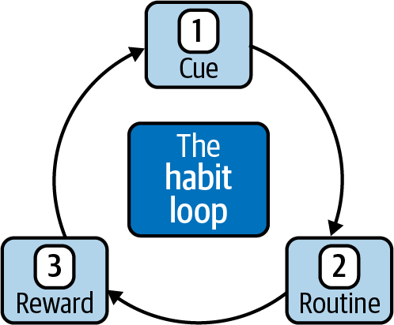

<!-- Page 328 -->

Ivan Pavlov accidentally stumbled upon the habit loop with his study with
dogs that led to the discovery of classical conditioning. Classical conditioning
is a type of learning that happens unconsciously, where an automatic condi-
tioned response is paired with a specific stimulus to create a behavior. If you’ve
ever tried to teach your dog a new trick, you most likely used the habit loop.
The habit loop, while simple, leads to some pretty interesting applications
beyond pet training. Consider the Pepsodent case study Duhigg shares in his
book: did you know that brushing teeth wasn’t a daily habit until the 1940s?
This wasn’t because toothpaste hadn’t been invented or because people had
healthy teeth—quite the opposite. The state of dental hygiene was so bad in
the United States that the federal government declared it a national security
risk. It took a marketer at toothpaste brand Pepsodent, Claude Hopkins, to
change all that. So what did he do differently?
Like other marketers at the time, Hopkins touted the benefits of clean and
healthy teeth, which represented people’s desired outcome. But he also recog-
nized that the gap between the current state of dental hygiene and the desired
outcome (clean teeth) was too big to bridge with brushing alone—so he intro-
duced an intermediate reward. He had his chemists add mint and citric acid
to the toothpaste, which created a cooling and tingling sensation that none
of the other kinds of toothpaste provided. This was not only different but,
more importantly, provided an immediate (albeit temporary) reward of slightly
better breath.
This was the missing aha moment that reinforced the action of brushing
teeth—the push people needed to come back and brush their teeth again the
next day, and then the day after. With each subsequent brushing, their teeth
got progressively healthier, and the habit of daily brushing stuck.
While there’s nothing magical about the habit loop, deconstructing the habit
process into three discrete steps (trigger, action, reward) opens the door to
taking control of these steps and designing for behavior change.
Going from the habit loop to behavior design
Behavioral scientist BJ Fogg and his team at Stanford coined the term behavior
design, and they have been studying human behavior for over a decade. Fogg
summarized the key models and methods for behavior design in his book Tiny
Habits (Mariner).
According to Fogg, a behavior happens when three things converge at the same
moment: motivation, ability, and prompt (see Figure 13-7).

<!-- Page 329 -->

Figure 13-7. The Fogg Behavior Model
In other words, a behavior happens when a person is prompted with a cue
or trigger, has sufficient motivation to take action, and finds the action within
their ability.
How does a one-time behavior turn into a habit? Through repetition. Main-
taining motivation, keeping the actions within one’s ability, and designing the
right prompts are all levers at your disposal. A final lever for encouraging
repetition is ending the behavior with the right kind of reward—one that
signals this behavior is worth repeating in the future.
The Customer Forces Model is a behavior model
You have probably noticed similar terminology across the habit loop, the
Fogg Behavior Model, and the Customer Forces Model. That’s because the
Customer Forces Model is a behavior model. It describes the customer journey
as a customer attempts to get a job done.
How it differs from traditional customer journey maps is that it uses a behav-
ioral lens to better understand why customers do what they do (e.g., motiva-
tion, triggers, aha moment), rather than just capturing what they do.
In the next several sections, you’ll use the Customer Forces Model to design
an ideal customer journey map with your product and use behavior design
principles to optimize your happy customer loop.
Chart a Customer Progress Roadmap
While the promise of a big desired outcome can be motivating at the outset
(time of acquisition), once your customers start making their way up the hill,
they may find it too high a summit to scale (i.e., beyond their ability). They
will also often quickly find themselves in uncharted territory having to learn a
new way, which triggers anxiety.
The first step to reducing friction is reconstructing the top of the hill into a
series of intermediate summits (Figure 13-8).

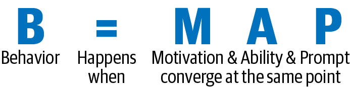

<!-- Page 330 -->

Figure 13-8. Break up the larger job
Each summit represents a smaller desired outcome (aha moment) that reinfor-
ces your overall unique value proposition and encourages your customers to
continually make progress.
Here are some guidelines for how to establish smaller summits:
Aim to deliver your first aha moment in under 30 minutes
When customers first sign up to use your product, it’s critical to get them
to their first aha moment as quickly as possible. Pepsodent was able to
deliver its first aha moment in under two minutes, which is the dentist-
recommended length for brushing teeth. While this may not be practical
for all products, aim to deliver your first aha moment in under 30 minutes,
which is the average upper limit for how long a customer’s first session
lasts.
Prefer intrinsic over extrinsic rewards
While a lot of products use badges to gamify rewards, these are short-term
motivators. Focus instead on intrinsic, not extrinsic, rewards. Intrinsic
rewards come from within, when the customer sees themselves making
progress toward their desired outcomes.
Remember, perfection isn’t the goal
When defining your first summit, it’s common to calibrate it against your
ideal desired outcome. Instead, calibrate it based on where your customers

<!-- Page 331 -->

are starting from. The goal of the first summit is to get your customers
to do something meaningful that leaves them better off than where they
started. Focus on the smallest step they can take.
Prefer doing over learning
Another common tendency is to immediately direct your customers to an
instruction manual. Customers don’t really want to learn how to use your
product; they want results with the least amount of work. Instead of a
learning-based first summit, aim for a doing-based first summit. Ditch the
instruction manual for a cheat sheet or quick start guide that gets them
moving up the hill.
Prefer outcomes over outputs
Remember the drill bit example? Customers don’t want a quarter-inch
hole, they want what comes after. Make sure your first summit delivers a
desired outcome, not an undesirable outcome. Aim to satisfy an emotional
want, not a functional need.
Progressively level up on desired outcomes with each summit
After your first summit, progressively level up your next set of summits
until the overall job is done. A good rule of thumb for designing your
summits is using a doubling rule, where mastery of each new summit takes
roughly twice the time and effort as the previous one. A good example of
this is the martial arts belt system.
Limit what your customer can do at each summit
Features that aren’t needed to scale the current summit clutter the path
and become cognitive drains (i.e., create friction). Rather than overwhelm-
ing your customers with features they don’t yet need, limit what they can
do, and even better, hide unnecessary features if possible.
Share your customer progress roadmap with your customers
Once you’ve designed your customer progress roadmap, share it with your
customers. Being able to see a clear set of steps for achieving their desired
outcomes boosts confidence and helps pull your customers up the hill.
With your customer progress roadmap laid out, let’s turn our attention next
to how you can utilize triggers, abilities, and rewards to help your customers
continually make progress toward their desired outcomes.
Trigger Your Customers
Until using your product becomes ingrained in habit, you can’t rely on your
customers automatically coming back to use it. You have to explicitly prompt
them.

<!-- Page 332 -->

Here are some tips for doing that:
Start with setting the right expectations
When your customers first start using your product, it’s a good idea to
remind them why they signed up, what to expect, and how best to achieve
their desired outcomes with your product. This could be done with a short
welcome message or quick start guide. If you have a customer progress
roadmap, this is the time to share it as well.
Suggest or help customers create calendar reminders
If your product requires regular use, make it easy for your customers to set
a reminder on their calendars or help them set up a reminder notification.
Share best practices
Study how and when your best customers use your product and share
those learnings as power tips and hacks.
Prompt with the next job to be done as soon as customers complete the
previous one
The art of good copywriting is getting the reader to want to read the next
sentence. Product retention is no different. If you successfully get your
customers to their first aha moment, celebrate their progress (reward), then
steer them toward the next summit. This works well with your initial
summits as they are smaller, but as you take on larger jobs, you’ll need to
invest in some additional prompts.
Prompt with regular check-in touchpoints
Out of sight is out of mind. An effective way of staying in-mind is by
implementing a regular check-in touchpoint. This could be implemented as
a daily or weekly activity report that gets emailed to your customers, or
as a weekly check-in call. Whatever the method, make sure to lead with
value.
Nudge with behaviorally targeted emails
If you can rely on analytics to determine where your customers are in their
journey, use behaviorally targeted emails (life cycle messaging) to nudge
them along and help those that get stuck.
Leverage existing routines
By far the most effective way of prompting customers is by integrating
your product into their preexisting routines or workflow.

<!-- Page 333 -->

Help Your Customers Make Progress
As your customers get past the initial summits, complexity goes up. You need
to step in using additional measures to help your customers continuously make
progress.
Here are some tips on how to do this:
Reduce the paradox of choice
It’s easy to think that giving your customers more choices with your prod-
uct gives them more control, but it’s quite the opposite. More choice leads
to more uncertainty, which leads to anxiety. Be the guide. Give them good
starting defaults and recommendations.
Allow them to experiment
Reduce anxiety and fear of failing by providing your customers with a safe
sandbox to experiment with. For instance, a lot of first-time homeowners
might more easily drill holes into their pristine walls if the drill had an
undo button. Short of that, a drill manufacturer could invite new home-
owners to a free workshop at the neighborhood hardware store where they
could experiment on practice walls.
Invest in good user experience (UX) design
Our customers don’t see what we see because we’re too close to the solu-
tion. Invest in good UX design best practices and run regular usability
tests. Strive to make your product as intuitive as possible—as Steve Krug
says, “Don’t make me think.”
Provide high-touch support
A great way to not only reduce your customers’ anxiety but also quicken
your speed of learning is offering high-touch support to your first few
batches of customers.
TIP
The fastest way to learn from customers is by talking to them.
When you don’t yet have lots of customers, you can afford to provide live
training, meet regularly, and be highly responsive to individual customer
issues. However, this won’t be scalable as your customer base grows,
which is why you need to also invest in the next step.
Continuously improve your product
As you uncover issues and problems with your product through your high-
touch support channel, continually invest in improving your product’s

<!-- Page 334 -->

usability and documentation. Make it a policy to tolerate product mistakes
only once.
Share customer case studies
Showcasing your customers that are making progress and/or achieving
their desired outcomes is a great way to motivate other customers earlier
in their journey. But be wary of only highlighting the success path—all
hero (and customer) journey stories are riddled with struggle. That’s what
makes them real and believable.
Make giving feedback easy
Provide multiple backchannels, like online chat, email, phone, etc., for
your customers to contact you.
Reinforce Progress
As we’ve covered already, the best kinds of rewards are intrinsic rewards
that help your customers see the progress they are making. Here are a few
additional ideas for how to build in other kinds of rewards:
Build progress indicators
Build feedback loops, dashboards, and reports that help your customers
experience the progress they are making.
Celebrate customer wins
Take the time to acknowledge major customer milestones and celebrate
their successes. Celebration is a type of reward.
Give meaningful gifts
Use meaningful gifts to reward and acknowledge your customers as they
make progress. Meaningful gifts aren’t about you or your brand, but
about the customer. For example, at LEANSTACK we send out a “Love
The Problem” t-shirt to customers who complete our Business Model
Design course, and a “Practice Trumps Theory” hoodie to those who
complete our intensive 90-Day Startup bootcamp. You can’t buy these
items—they have to be earned. That’s what makes them meaningful.
The Altverse Team Calls a 90-Day Cycle Review Meeting
By the end of their third 90-day cycle, the Altverse team has published six case
studies, which include numerous testimonials and powerful stories from happy
architects and even happier clients.
The team has managed to instill the Altverse VR model as an artifact architects
use in all their client meetings to make design decisions.

<!-- Page 335 -->

Already a few architects are starting to ask about more features, and the
team is getting ready to pitch the next job-to-be-done: price estimation. This
will potentially extend the customer lifetime from 3 months (the initial design
phase) to the full lifetime of the project, which could be 9–12 months.
Steve has hired two more developers and made substantial progress on auto-
mating the Concierge MVP, reducing model turnaround time from a day to
under 30 minutes. Within the next 90-day cycle, the team anticipates that this
will be fully automated.
Word of mouth is starting to set in, and the team is fielding inbound demo
inquiries from architecture firms around the world. While they need to con-
tinue to stay focused on value delivery, they’re starting to set their sights on
finding a repeatable and scalable engine of growth.

<!-- Page 336 -->

<!-- Page 337 -->

C H A P T E R 1 4
Find Your Growth Rocket
Once you start to see predictable repeatability in your happy customer loop—
that is, when your initial customer segments continue to demonstrate regular
use of the product and are making measurable progress toward their desired
outcomes, as evidenced by customer check-in interviews, dashboards, etc.—it’s
time to shift some of your focus toward growth. By “growth,” I mean building
a scalable channel or a growth rocket.
Up until now, you have relied on fairly high-touch (nonscalable) interactions
for acquisition and value delivery in order to prioritize speed of learning over
scalability. But in order to continue to deliver on your 90-day traction model
goals, which should be getting increasingly more challenging, you need to start
searching for more scalable paths to customers. While you may have outlined
a few possible scalable channel options on your Lean Canvas, you need to
identify which ones to double down on in order to get you to product/market
fit and beyond.
Identifying your scalable channel or growth rocket can be a multicycle process,
which is why I recommend starting early. This chapter outlines the high-level
process for doing so.
The Altverse Team Learns About Growth Rockets
At the end of their latest 90-day cycle review, after Steve aligns the team on the
next cycle’s goal, assumptions, and key constraint, Mary makes the following
suggestion. “In addition to focusing on your constraint—continuing to drive
retention—during the next cycle, I would recommend allocating 20% of your
time to finding your primary growth rocket.”

<!-- Page 338 -->

“A growth rocket?” asks Lisa.
“Yes,” replies Mary. “We often draw the hockey-stick curve as a smooth curve,
but if you chart a startup’s actual growth curve, you’ll find that it isn’t so
smooth after all. It’s made up of a series of staircase jumps. Since a lot of
people draw parallels between startups and rocket ships, think of your mission
as sending a rocket ship to Mars. You can’t do that with a single rocket. You
need multistage rockets that fire at different points in the journey. Each rocket
is responsible for getting your ship from one staircase jump in the hockey stick
curve to the next.”
“I love this metaphor,” Steve jumps in. “So if each rocket here represents a
customer acquisition channel, where does the customer factory fit in?”
Mary smiles. “I knew you’d like it. If a rocket is designed to create customers,
the customer factory describes the inner workings of the rocket’s engine. Each
rocket contains its own engine and propellant, or fuel. Even though we’ve been
viewing the business model as a single customer factory so far, there are in
reality many different customer factories, or rocket engines, at play.”
“I can see that,” Lisa remarks. “We’re currently using direct sales, events, and
some referrals to acquire customers. Each of these channels performs quite
differently. I’m guessing that each of these are examples of rockets with their
own customer factory engines?”
“You got it,” responds Mary.
“I see how the engine maps to the customer factory,” Steve says. “What’s the
propellant in this metaphor?”
“The propellant is the fuel that powers the rocket’s engine,” Mary explains.
“All engines require energy to run, and different engines require different types
of fuel. The most commonly used fuel at the early stages of startups is founder
time or sweat equity, but as you know, this is the most expensive type of non-
renewable fuel. Over time, money or capital or even your users and customers
can be used to fuel these engines.”
“I want to go back to something you said earlier,” Josh comments. “You
mentioned finding a ‘primary growth rocket,’ which implies just one rocket.
What did you mean by that? Isn’t it better to have more growth rockets?”
Mary pauses to see if Josh is done. “Because liftoff requires a lot of energy, you
often need multiple rockets to get the rocket ship off the ground. This is done
with one or more short-range booster rockets. Think of these booster rockets
as the nonscalable channels on your Lean Canvas, such as using warm referrals
from your first-degree network to find customers. They have limited range, and
once they burn out, each of these booster rockets is ejected to decrease the
remaining mass of the rocket ship. Then a new booster rocket takes its place.

<!-- Page 339 -->

You need these boosters to lift off, but they aren’t going to get you to Mars.
Trying to optimize the engines in the booster rockets past a certain point will
start yielding diminishing returns—”
Steve cuts in. “Is the goal of these booster rockets to help the rocket ship
achieve escape velocity, and the primary growth rocket is the one that then
carries the payload from there to Mars?”
“Yes, although you need to have figured out and tested your primary growth
rocket ideally before achieving escape velocity. For a startup, think of escape
velocity as the inflection point in the hockey-stick curve, or achieving prod-
uct/market fit. By then you should have started optimizing your primary
growth rocket because it’s going to propel you for a while,” Mary replies.
Steve throws out a couple of follow-up questions. “Even after escaping Earth’s
gravitational pull, it’s a long way to Mars. Is it reasonable to expect one
primary growth rocket to get you there? And how does one even begin picking
the right primary growth rocket?”
“There are two different questions there. I’ll start with the first,” responds
Mary. “Yes, when most startups start scaling, they almost always get most
of their growth from just one growth rocket. Over time, some may layer on
an additional growth rocket, but you always want to start with one for the
reasons we’ve been discussing: limiting the number of campaigns you take on
during a 90-day cycle, to align your team and focus.”
Mary pauses to let that sink in, then continues to address Steve’s second
question.
“What makes finding a primary growth rocket particularly challenging for
startups is twofold. First, all that startup founders usually see is an array of
possible rockets or growth hacks to deploy. Like a kid in a candy shop, they
think that surely more is better and start stacking rockets. But remember
that too many rockets increases the mass of the rocket ship. This makes
achieving escape velocity harder, not easier. The second and more important
reason that startups stumble with growth is that they often fail to recognize
the key characteristic that distinguishes growth rockets from booster rockets:
sustainability.”
“By sustainable, do you mean renewable?” asks Steve.
“Yes,” says Mary. “Remember Star Trek? The starship Enterprise was powered
by a antimatter warp drive, which was a highly efficient way of traveling
through space, and these starships had the ability to gather fuel from space and
to even generate antimatter on board. Leaving the science of all this aside for a
moment, the takeaway here is that your primary growth rocket needs to have a
flywheel or growth loop in its engine that allows it to sustain itself.”

<!-- Page 340 -->

“A growth loop?” Lisa wonders. “Would that be like reinvesting revenue from
existing customers to buy ads to acquire new customers?”
“That’s exactly right,” responds Mary. “However, there are certain conditions
you’ll have to meet to deem the loop sustainable, like making more money
from your customers than you spend on ads.”
“How about our original idea of launching a publicly browsable directory of
client projects?” Josh asks. “I guess the high-level concept would be creating a
Houzz or Pinterest for VR models.”
“Yes, that’s a great example of a user content–powered growth rocket, and
it too could be potentially sustainable since you’re leveraging the work from
existing customers to drive new customer acquisition. This one in particular
is also a great example of an initiative that could easily take multiple 90-day
cycles to develop and test, which is why you want to start early—as in now,”
Mary adds.
Steve looks at his watch, then jumps in to wrap up the meeting. “I guess
we’re out of time. This has all been very enlightening, as always, Mary. I
guess we all need to go away for a couple of days and additionally come up
with some primary growth rocket proposals. We’ll place our bets on the most
promising one to take on during the next 90-day cycle…and I’m guessing we’ll
start testing it using some smaller campaigns and sprints? Do you have some
additional guidance here, Mary?”
Mary smiles. “I sure do. It’s on its way to your inboxes.”
The Rocket Ship Growth Model
The Rocket Ship Growth Model likens launching a new product to launching a
rocket ship. Let’s start with some anatomy. A rocket ship is made of three basic
parts:
• A payload that carries the crew or cargo. Think of this as your core
•
product.
• One or more booster rockets to get the rocket ship into space. Think of
•
these as your initial nonscalable customer acquisition channels.
• A spacecraft, powered usually by a single growth rocket, that then carries
•
the payload to its destination. Think of this growth rocket as your primary
scalable customer acquisition channel.

<!-- Page 341 -->

Each rocket, irrespective of whether it’s a booster rocket or a growth rocket,
contains its own engine and propellant (fuel). Since the job of a rocket engine
is to gain altitude (traction), its inner workings are described by the steps in
a customer factory (AARRR). Powering a rocket engine takes energy, which
comes from the propellant (fuel). Different types of rockets use different types
of propellant (time, money, content, users, etc.).
The range of a rocket is determined by the efficiency of its engine and type
of propellant. While it’s tempting to load up on propellant, be wary that addi-
tional fuel adds weight to your rocket ship and can often slow you down. This
is why, given a certain type of propellant, the best approach to maximizing
the range of a rocket is to start by optimizing engine efficiency (the customer
factory).
But optimizing engine efficiency has its limits, which means that beyond a
certain point a rocket’s range will be dictated by the amount of propellant.
Every rocket will eventually burn out…unless you devise a way of regenerating
propellant. This is the key difference between growth rockets and booster
rockets.
NOTE
Growth rockets utilize a flywheel (growth loop) in their engine design that regen-
erates propellant, which drives sustainable growth (traction).
Launching Rocket Ships
As with product launches, rocket ship launches are multistage, including steps
for design, validation, and growth. Let’s walk through each of these stages,
and clarify where we are at this point in the journey (Figure 14-1).

<!-- Page 342 -->

Figure 14-1. The stages of launching a rocket ship
Part 1: Design (Mission Design)
This is where you define your mission (we discussed this in Chapters 1 through
5): where you’re headed (e.g., Mars), what your payload is (UVP), how many
multistage rockets you’ll need (nonscalable channels), how you’ll power your
spacecraft (scalable channel), etc. Mission design shapes the kind of rocket
ship you’ll build, much like business model design shapes the kind of product
you’ll build.
Part 2: Validation (Ignition)
Before attempting liftoff, you need to validate your design assumptions to
ensure that:
• If you build it, people will come (desirability).
•
• It is worth building (viability).
•
• It can make the trip (feasibility).
•
To do this, you first reduce the scope to achieve liftoff (MVP), then start
learning about, designing, and testing different rocket ship specs (using an
offer) with your first booster rocket (the mafia offer campaign). This booster
rocket is driven by a customer factory engine and powered primarily by sweat
equity (founder time).

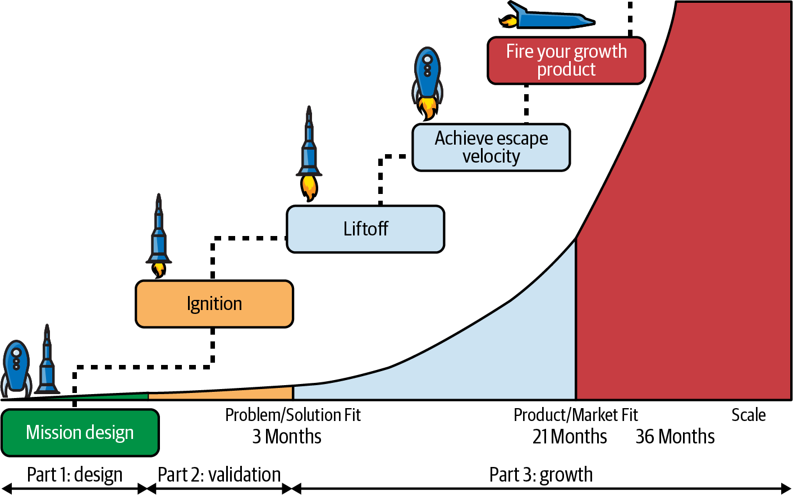

<!-- Page 343 -->

Your goal here is establishing repeatable ignition (acquisition)—i.e., achieving
problem/solution fit.
Part 3: Growth
There are three substages during the final growth stage: liftoff, achieving
escape velocity, and firing your growth rocket.
Liftoff. After validating booster rocket ignition, you prepare your rocket ship
for launch. As liftoff requires the greatest amount of energy, you often need to
layer additional booster rockets to get your rocket ship off the ground. These
booster rockets are also primarily powered by sweat equity in the early stages,
and help you accelerate traction for short periods of time.
Examples of booster rockets include things like:
• Early direct sales
•
• Events
•
• PR
•
Achieve escape velocity. Once your rocket ship has liftoff, you then need to
turn your attention toward optimizing your booster rocket engines (customer
factory) in order to maximize their range (traction) before they burn out. You
focus first on optimizing your core happy customer loop, then layer additional
booster rockets as needed, and repeat the process. The goal here is achieving
escape velocity (i.e., product/market fit).
Fire your growth rocket. As you start achieving escape velocity, you need to
prepare for the longer journey ahead. This is when you begin the search for
your primary growth rocket that will power the rest of your trip using a
sustainable flywheel or growth loop. In the next section, I’ll cover the three
types of growth loops.
The Three Types of Growth Loops
According to Eric Ries, author of The Lean Startup, sustainable growth is
characterized by one simple rule:
New customers come from the actions of past customers.
It’s easy to see how this works by revisiting our earlier definition of a business
model as a description of how you create, deliver, and capture value from
customers. Sustainable growth comes from reinvesting part of the value you
capture back from your existing customers into new customer acquisition.

<!-- Page 344 -->

There are generally three types of value (assets) you capture from existing
customers:
• Money (revenue)
•
• Content and data (byproducts of retention and engagement)
•
• Referrals
•
By reinvesting these assets into new customer acquisition, you build a growth
loop that can sustain itself. Let’s walk through the different kinds of growth
loops.
The Revenue Growth Loop
A revenue growth loop reinvests revenue generated from existing customers to
drive new customer acquisition (see Figure 14-2). Money or capital is the pro-
pellant here, which is used to buy ads or hire people to run these campaigns.
Figure 14-2. The revenue growth loop
Some common ways of building out this growth rocket include:
• Performance marketing (e.g., Facebook ads, Google ads, print ads, TV
•
ads)
• Sales (e.g., outbound sales, inbound sales)
•
• Company-generated content (e.g., newsletters, social media posts)
•
The money used to drive this growth rocket may come from growth capital
(investors), but it needs to be payable over time through customer revenues for
the engine to be sustainable.

<!-- Page 345 -->

There are two conditions typically used to test the sustainability of this engine:
1. LTV > 3 x CAC
1.
2. Months to recover CAC < 12 months
2.
where:
• LTV = lifetime value of customers
•
• CAC = cost to acquire customers
•
The first condition aims to allow for enough margins in the business model
to enable profit and other operating expenses. The second condition addresses
cash flow. If you are unable to recoup the cost to acquire customers within
a reasonable time period, you will not have cash on hand to reinvest toward
growth.
The Retention Growth Loop
The core retention loop in the customer factory, or the happy customer loop, is
used to drive customers back into your customer factory (Figure 14-3). While
this is critical for making happy customers and maximizing your customer
lifetime, that alone doesn’t create a sustainable growth loop.
Figure 14-3. The retention growth loop
You can turn the retention loop into a sustainable growth loop if you are able
to utilize derivative assets created through usage by your existing customers to
attract new customers. Content and data are typically the common propellants
here. Some ways of building out this engine include:

<!-- Page 346 -->

• User-generated content (e.g., YouTube, Pinterest)
•
• Reviews (e.g., Yelp)
•
• Data (e.g., Waze)
•
The Referral Growth Loop
The final type of growth loop is built on referrals, where you use your existing
users to drive new users into your customer factory (Figure 14-4). Happy
users/customers are the propellant here.
Figure 14-4. The referral/viral growth loop
Building a referral growth loop can be done in many ways, such as:
• Word of mouth
•
• Referral programs
•
• Inviting friends/team members
•
Some people use the term virality to define this type of loop, but that’s actually
a special case of the referral growth loop that makes it sustainable.
In order for a product to be considered viral, it needs to have a viral coefficient
(K) greater than 1, which is the same as an average referral rate of over 100%.
In other words, every user should on average be referring at least one other
user into your customer factory. It’s easy to see how going viral is the fastest
way to grow and also the hardest to build.

<!-- Page 347 -->

There are two metrics used to measure the referral growth loop:
Viral coefficient (K)
This is measured as the number of new users each user refers, on average.
When K > 1, the product grows virally.
Viral cycle time
This is the average time it takes for a referral to be made. Your goal is to
make this as short as possible.
Products that use the referral growth loop to drive their primary growth rocket
are typically inherently viral—that is, sharing is an intrinsic aspect of the
product, as in the case of Facebook, Twitter, or Snapchat.
That said, while many products don’t go viral, they still leverage this growth
loop with great effect through high referral rates as an additional growth
rocket to supplement their primary growth rocket.
Can You Have Multiple Growth Rockets?
As you’ve probably figured out, it is theoretically possible to have more than
one growth loop in a business model. But building a single growth loop that
works is challenging enough. While it’s fine to consider and even test multiple
growth rockets in parallel, doubling down on a single growth rocket will give
you the highest return on effort.
Finding Your Primary Growth Rocket
What’s stopping your business from growing 10x?
—David Skok, General Partner at Matrix Partners
Finding your primary growth rocket is typically a multicycle process that, like
a validation campaign, typically involves:
• Short-listing growth rocket candidates
•
• Validating your growth rocket
•
• Optimizing your growth rocket
•
The first two steps can typically be fit into a 90-day cycle, after which you
either invalidate the growth rocket and search for another one, or commit to
doubling down on the growth rocket.
Let’s walk through these steps.

<!-- Page 348 -->

Short-Listing Growth Rocket Candidates
Remember that building a growth rocket requires two things:
• A renewable propellant
•
• An efficient engine
•
Start picking possible growth rocket candidates by:
Selecting a renewable propellant
Revisit the three types of propellants (revenue, content/data, and referrals),
and select the one that you can use to build a sustainable growth loop.
For instance:
• If you have a direct business model (your users are your customers),
•
you could reinvest revenue into performance marketing.
• If the price point of your product is high enough, you could reinvest
•
revenue into building a sales team.
• If your users create interesting or valuable content that could be used
•
publicly, you could use this content to attract new users.
• If your product has inherent virality built in, you could use referrals to
•
drive growth.
Analyzing your current engine’s efficiency
Analyze your current customer factory metrics and use the gap between
where you are now and where you need to be to select an appropriate
growth rocket candidate that is up to the task.
For instance:
• For a revenue growth loop, start by measuring your unit economics
•
(LTV and CAC). Check that you are within striking distance of meet-
ing the margin and payback period conditions, covered earlier, to
make the growth rocket sustainable.
• For a content growth loop, try to assess the value of this content to
•
new users using tools like Google’s Keyword Planner to understand
search volume for certain keywords.
• For a referral growth loop, look for evidence of high organic word of
•
mouth (>40%) already happening with your product.

<!-- Page 349 -->

Validating Your Growth Rocket
Over the remaining 10 weeks of your 90-day cycle, design experiments and
test your key assumptions over sprints in order to validate the feasibility of
your selected growth rocket.
For instance:
• If you selected performance marketing, run a few ad campaigns and vali-
•
date your CAC and payback period assumptions.
• If you selected sales, hire one account executive and validate your ramp-up
•
time, CAC, and close rate assumptions.
• If you selected user-generated content, design an experiment to feature or
•
showcase some of this content publicly and measure engagement.
• If you selected virality, run a few experiments where you reduce sharing
•
friction and see if it drives up your viral coefficient and/or reduces your
viral cycle time.
After 10 weeks, make a 3P (persevere, pivot, pause) decision on your growth
rocket.
Optimizing Your Growth Rocket
If you successfully validated a possible growth rocket candidate, double down
on optimizing your growth rocket engine.
Since many growth rockets require extensive optimization (customer factory
tuning), training (e.g., for direct sales), and even product building (e.g., gener-
ating content pages automatically, launching referral programs, etc.), you may
want to form a small, dedicated team for this initiative.
Measure and report your progress in your 90-day progress reviews.
Steve Makes Mary an Offer She Can’t Refuse
It’s been 18 months since Altverse launched, and the team is within striking
distance of achieving escape velocity (product/market fit) as per the traction
roadmap. They were successful at leveraging customer content (VR models) to
build a sustainable growth rocket that is driving lots of new homeowners and
architects onto their platform. At Mary’s suggestion, Steve has been pitching
the company to VCs. He’s meeting with Mary to give her an update.
“Here, let me show you,” Steve says as he walks over to the Eames chair in
his office and starts taking a few pictures. A few seconds later, an Eames chair
appears in the VR model of Steve’s office projected on the big screen.

<!-- Page 350 -->

“Wow, that’s impressive,” Mary remarks. “It’s even in the exact same spot.”
“Yup. We use a bunch of tricks to geospatially match real-world objects into
the VR metaverse,” Steve replies with a smile. “This is the same demo I
showed the VC firm yesterday. There was a term sheet in my inbox within
an hour of them leaving the office.”
“I can see why,” Mary responds. “This plays nicely into your second act of
moving beyond home construction and bringing retail furniture stores into the
business model. There’s easily a 10x growth story here.”
“Yeah. But you know me. I still have butterflies in my stomach and don’t think
I can do this alone.”
“Hey, don’t undersell yourself. I remember when you were talking about pric-
ing your platform at $50/mo for unlimited projects with an ARPU of $600/yr.
What’s your ARPU up to now with architects?”
“Our typical deal size is $60k/yr, with a number of them that are starting to
trend into the six figures.”
“That’s what I thought. You’ve come a long way, Steve. I’m really proud of
what you’ve accomplished here.”
Steve laughs. “Yeah, I guess. But bringing on a VC is serious business, and I
think I’ll need to build a seasoned management team.”
“Oh, that goes without saying. You’re at a stage of the company where—”
Steve interrupts Mary for once. “That’s why I’d like you to take over as CEO.”
“What?” Mary blurts out.
“We wouldn’t be here without you. Looking back, I can’t believe how patient
you’ve been with us—and equally ruthless, mind you—calling out our BS
along the way.”
Steve sees Mary smile and blush a little, and continues. “I could pick your
brain on how to build an A+ management team, but I think it’d be much easier
if I just ask you to build one instead.”
“Well, I’m speechless. I didn’t see this one coming. But I’d be lying if I didn’t
admit that I’m flattered and excited to be considered. I’ve watched your pro-
gress in awe from the sidelines and would love to be a part of this,” Mary says.
“It’s settled then,” Steve says. “We can work out formalities later. I’ll forward
you the term sheet and let the VC know we have a new CEO.”
“You mean a new CEO and a new CTO,” Mary corrects him.
Steve laughs. “I guess you’re right, boss.”