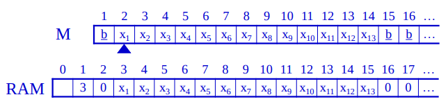
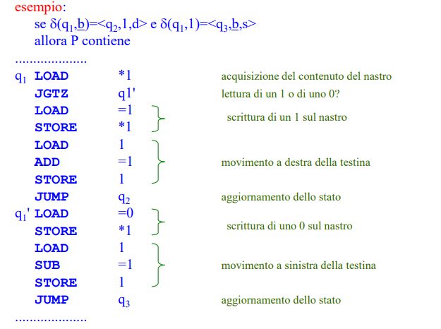

# Macchine a registri

Argomenti: Calcolabilità, MT -> RAM, RAM -> MT
.: No

## RAM e calcolabilità

- `teorema`: una funzione $f:N^n\to N$ è calcolabile da una RAM se esiste un programma $P$ tale che:
    - se $f(x_1,...,x_n)=y$ : cioè se $P$ ha sul nastro di input $x_1,...,x_2$ termina con $y$ sul nastro di output
    - se $f(x_1,...,x_n)$ non è definita allora $P$ non termina.

## MT $\to$ RAM

- `teorema`: sia $M=\left\langle \left\{1\right\},\underline{b}, K, q_0, F, \delta \right\rangle$ una $MT$ con nastro seminfinito che computa $q_0x\vdash ^*q_Fy$. Esiste una $RAM$ che se ha la stringa $x$ nelle celle $2,...,|x|+1$ allora al termine della computazione ha la stringa $y$ nelle celle $2,....,|y|+1$. Inoltre la $RAM$ simula $T$ passi di $M$ in tempo $O(T\cdot log(T))$ nel modello a costo logaritmici

Si stabilisce una corrispondenza tra la cella $i$ del nastro di $M$ e la cella $i+1$ della memoria della $RAM$.

SI usa la cella $1$ della $RAM$ per rappresentare la posizione della testina di $M$. Il programma $P$ contiene una sequenza di istruzioni per ogni stato di $M$

Ogni passo di $M$ è simulato da al più 8 istruzioni ognuna con costo $O(log(\text{maxmem}))$ dove $\text{maxmem}$ è il massimo numero di celle usate da $M$. Se $M$ esegue $T$ passi allora $\text{maxmem}\le T+1$, il costo complessivo è $O(T\cdot log(T))$

---

## RAM $\to$ MT

- `teorema`: data una RAM con programma $P$ che calcola la funzione $f$ esiste una MT $M$ tale che:
    - se $f(x_1,...,x_n)=y$ e sul nastro di input sono memorizzati in binario gli interi $x_1,...,x_n$ la macchina $M$ termina con la rappresentazione binaria di $y$ sul nastro di output.
    - se $f(x_1,...,x_n)$ non è definita allora $M$ non termina
    - se la computazione della $RAM$ ha costo $T$ nel modello a costi logaritmici allora $M$ la simula in $O(p(T))$ passi.
- `dimostrazione`: $M$ ha 5 nastri: uno di input, uno di output e 3 nastri di lavoro

Dei 3 nastri di lavoro: il nastro $(1)$ memorizza in binario i dati contenuti nella memoria della $RAM$ preceduti dal proprio indirizzo, rappresentato in binario, il nastro $(2)$ rappresenta il contenuto dell’accumulatore e il nastro $(3)$ è usato come memoria temporanea per il funzionamento di $M$.

Ogni sequenza di transizioni relativa ad un’operazione di $RAM$ costa ad $M$, nel caso peggiore, un tempo polinomiale nell’ordine della massima lunghezza `lungmax` del nastro $1$. Quindi se la $RAM$ opera con costo totale $T$ la MT $M$ opera in tempo $O(T\cdot p(\text{lungmax}))$