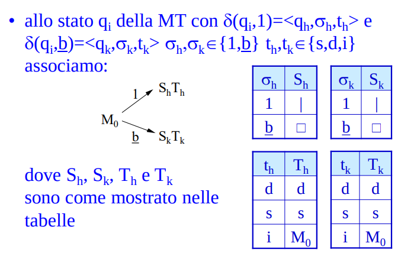

# Macchine di turing

Argomenti: MTM->MT, MTND->MT, Macchina di Turing Multitraccia, Macchina di Turing deterministica, Macchina di Turnin non deterministica
.: No

## Macchina di Turing deterministica

Una macchina di turing deterministica è definita come $M=\left\langle \Sigma,\underline{b},K,q_0,F, \delta \right\rangle$:

- $\Sigma$ alfabeto di simboli
- $\underline{b}$ carattere speciale, spazio bianco
- $K$ insieme finito di stati con $q_0$ stato iniziale
- $F$ insieme di stati finali
- $\delta$ funzione non necessariamente totale di transizione

Le macchine di turing sono usate sia per accettare stringhe sia per calcolare funzioni: `riconoscitori` e `trasduttori`.

Una configurazione di una MT è rappresentata dal contenuto del nastro, posizione della testina e stato corrente.

La $\delta$ è definita in questo modo $\delta:K\times(\Sigma\cup\left\{ \underline{b} \right\})\to K\times(\Sigma\cup\left\{ \underline{b} \right\}) \times \left\{ d,s,i \right\}$ dove $d,s,i$ indicano spostamento a destra, a sinistra e immobilità della testina

- `definizioni`:
    - una computazione finita $c_1 \vdash^* c_n$ è `massimale` se non esiste una configurazione $c$ tale che $c_n\vdash c$
    - una MT accetta una stringa $x$ quando ha come configurazione iniziale $q_0x$, ha luogo una computazione massimale la cui ultima configurazione è accettante

---

## Macchine di Turing multinastro

Se il nastro ha $h$ tracce, la testina può leggere/scrivere $h$ caratteri contemporaneamente, una macchina di turing a $k$ nastri è definita come $M^k=\left\langle \Sigma,\underline{b},K,q_0,F, \delta^{(k)} \right\rangle$:

- $\Sigma$ alfabeto di simboli
- $\underline{b}$ carattere speciale, spazio bianco
- $K$ insieme finito di stati con $q_0$ stato iniziale
- $F$ insieme di stati finali
- $\delta^{(k)}$ funzione di transizione

La configurazione accettante è quando $q$ appartiene a $F$

La funzione di transizione è definita come $\delta^{(k)}:K\times(\Sigma_{\underline{b}})^k\to K\times(\Sigma_{\underline{b}})^k\times \left\{ d,s,i \right\}^k$

---

## MTM $\to$ MT

- `teorema`: Data una MTM M a $k$ nastri esite una MT che simula $t$ passi di M in $O(t^2)$ passi usando un alfabeto di cardinalità $O((2|\Sigma|)^k)$.
- `dimostrazione`: si costruisce una MT $M'=\left\langle \Sigma', \underline{b},K', q_0', F', \delta' \right\rangle$ con nastro suddiviso in $2k$ tracce che simula $M$, dove le $k$ tracce di posto pari di $M'$ rappresentano i $k$ nastri di $M$ mentre le $k$ tracce di posto dispari di $M'$ rappresentano con il carattere $\downarrow$ la posizione delle testine sui $k$ nastri di $M$. Poi si costruisce una MT $M''$ equivalente a $M'$

Il nastro di $M'$ all’inizio della computazione si presenta con tutte le tracce pari “vuote” tranne la prima. La $\delta'$ per simulare la funzione di transizione $\delta^{(k)}$ deve rintraciare le posizioni dei marcatori, scrivere e spostare i marcatori e cambiare stato. Quindi per ogni passo di $M$, $M'$ deve eseguire una sequenza di un numero di passi proporzionale alla distanza tra i 2 marcatori più lontani.

Dopo $t$ passi 2 marcatori ppossono essersi allontanti di al più $O(t)$ caselle, se $M$ esegue $t$ passi allora $M'$ ne esegue $O(t^2)$, $M''$ esegue gli stessi passi di $M'$.

Per ciò che riguarda la cardinalità dell’alfabeto di $M''$, abbiamo da codificare con un solo alfabeto di stringhe di $2k$ simboli così composte:

- $k$ simboli appartengono a $\left\{ \underline{b},\downarrow  \right\}$
- $1$ simbolo appartiene a $\Sigma \cup \left\{ \underline{b} \right\}$
- $k-1$ simboli appartengono a $\Sigma \cup \left\{ \underline{b}, Z_0 \right\}$

$$
|\Sigma''|=2^k\cdot(|\Sigma|+1)\cdot(|\Sigma|+2)^{k-1}=O((2\cdot|\Sigma|)^k)
$$

---

## Macchina di turing non deterministica

Una macchina di turing non deterministica è definita come $M=\left\langle \Sigma,\underline{b},K,q_0, F,\delta_N \right\rangle$:

- $\Sigma$ alfabeto di simboli
- $\underline{b}$ carattere speciale, spazio bianco
- $K$ insieme finito di stati con $q_0$ stato iniziale
- $F$ insieme di stati finali
- $\delta_N$ funzione parziale di transizione

Ogni configurazione può dare luogo a più transizioni verso altre configurazioni

Il grado di non determinismo è definita come:

$$
v(M)=max|\delta_N(q_i,\sigma_j)|
$$

Coincide con il massimo numero di figli di un nodo dell’albero di computazione.

La $\delta_N$ è definita come $\delta_N:K\times (\Sigma \cup\left\{ \underline{b} \right\})\to P(K\times (\Sigma \cup \left\{ \underline{b} \right\})\times \left\{ d,s,i \right\})$

---

## MTND $\to$ MT

- `teorema`: per ogni MTND $M$ con grado di non determinismo $d$ esiste una MT $M'$ equivalente che simula $k$ passi di $M$ in $O(kd^k)$ passi.
- `dimostrazione`: l’albero di computazione di $M$ viene visitato in ampiezza da $M'$

$M'$ ha 3 nastri dove il primo contiene l’input, il secondo viene usato per generare tutte le sequenze finite composte da cifre comprese tra $1$ e $d$ dove le sequenze più corte sono generate prima e dove le sequenze con lo stesso numero di cifre sono generate in ordine numerico crescente. Il terzo nastro viene usato come nastro di lavoro.

Se su qualche foglia dell’albero di computazione di $M$ c’è uno stato finale, allora $M'$ lo raggiunge in tempo finito altrimenti $M'$ non raggiunge mai uno stato finale. Se $M$ termina in $k$ passi $M'$ ha bisogno di $O\left( \sum_{j=o}^{k}jd^j \right)=O\left( kd^k \right)$ passi. ($k$ altezza dell’albero di computazione e $d$ il branching factor)

---

## Descrizione linearizzata delle MT

- `teorema`: ogni MT è ottenibile per composizione di macchine elementari e ogni macchina ottenuta per composizione di macchine elementari è una MT.
- `dimostrazione`: la composizione di diagrammi di stato di MT restituisce diagrammi di stato di MT ciò prova la seconda parte. Per provare la prima parte associamo ad ogni stato la composizione di alcune macchine elementari.

---

## MT universale

- `teorema`: esiste una $MT$ $U=\left\langle \Sigma',\underline{b},K',q_0', F', \delta' \right\rangle$ tale che data ogni $MT$ $M=\left\langle \left\{ 1 \right\}, \underline{b},K, q_0, F, \delta\right\rangle$ allora $f_U(c_M\underline{b}x)=\underline{b}^hf_M(x)\underline{b}^h$ con $h,k\ge0$ e $x\in \left\{ 1,\underline{b} \right\}^*$
- `dimostrazione`: si fa la codifica di $M$ con $\Sigma=\left\{ 1 \right\}$, si fa la riduzione sull’insieme delle macchine necessarie, si eliminano i salti condizionati su $\underline{b}$ e si simula