# Metodo LRU

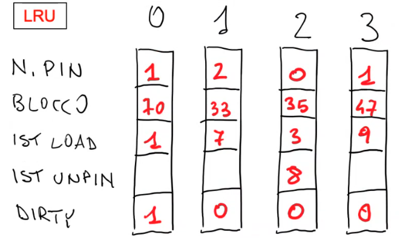

si inizia da qui

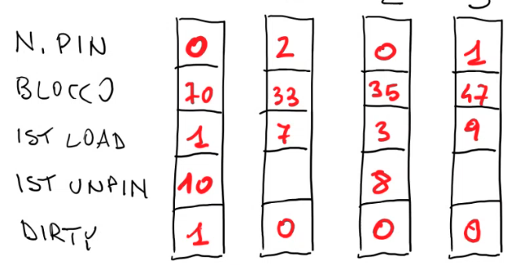

`unpin(70)`

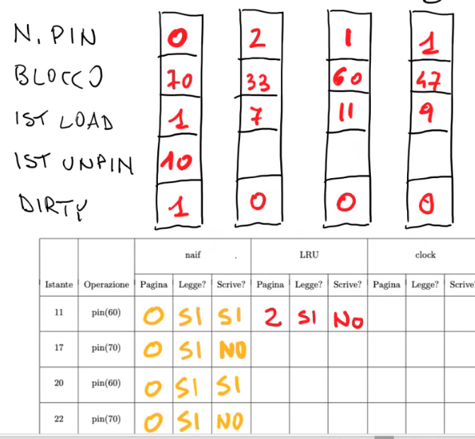

`pin(60)`: le pagine non utilizzate sono la $0$ e la $2$, si sceglie la $2$ perche è la pagina più vecchia 

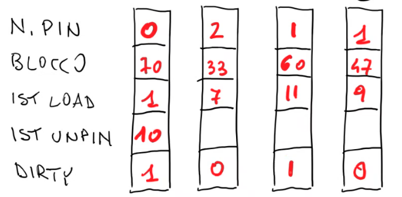

`setXXX(60,...)`

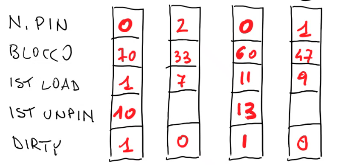

`unpin(60)`

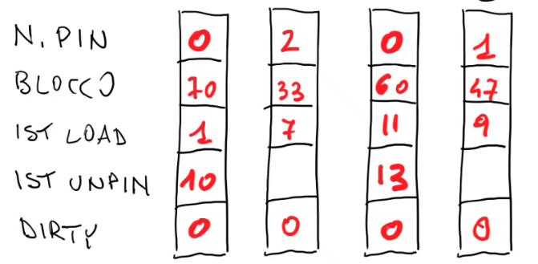

`flushAll`

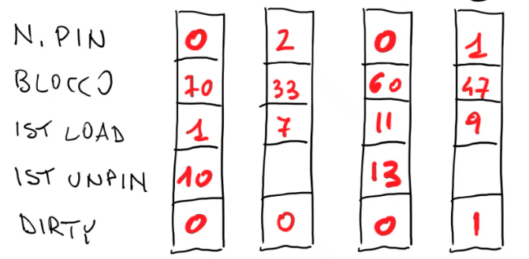

`setXXX(47,...)`

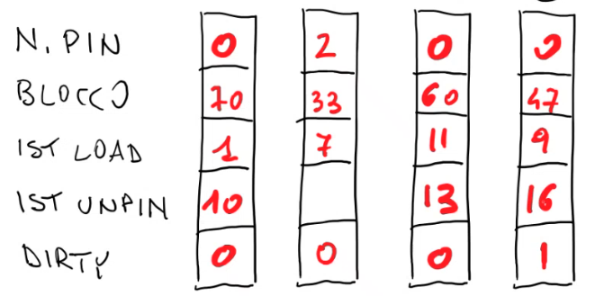

`unpin(47)`

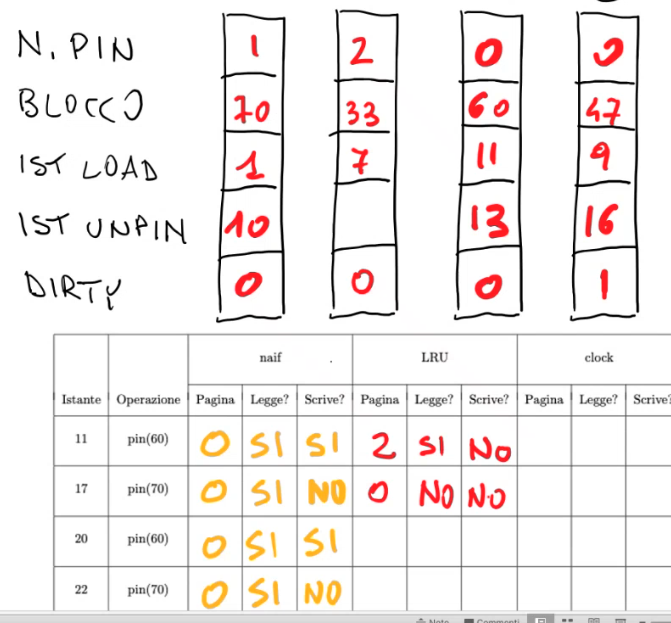

`pin(70)`

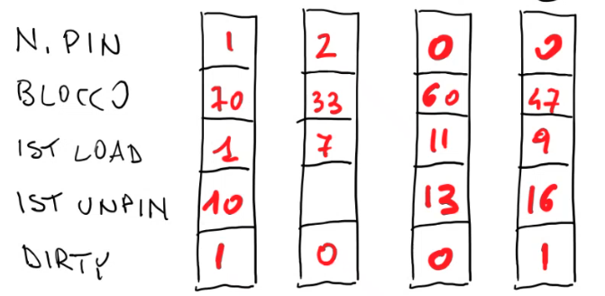

`setXXX(70,...)`

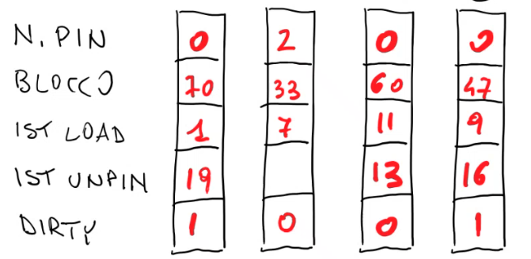

`unpin(70)`

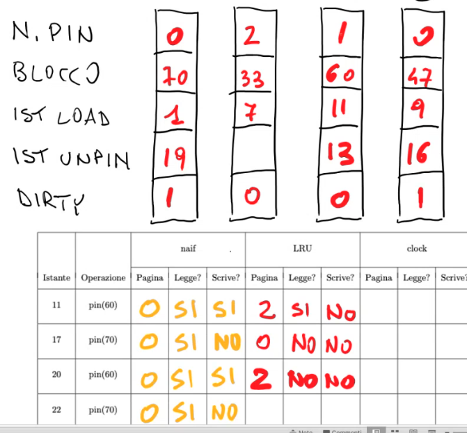

`pin(60)`

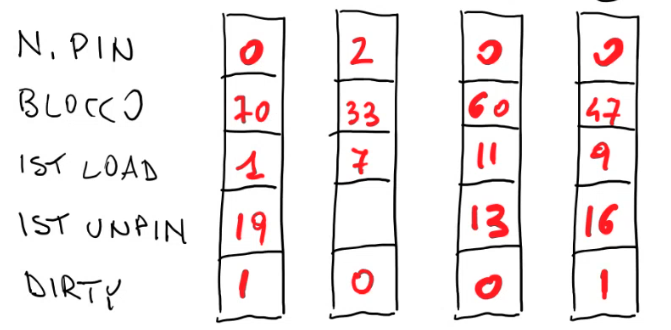

`unpin(60)`

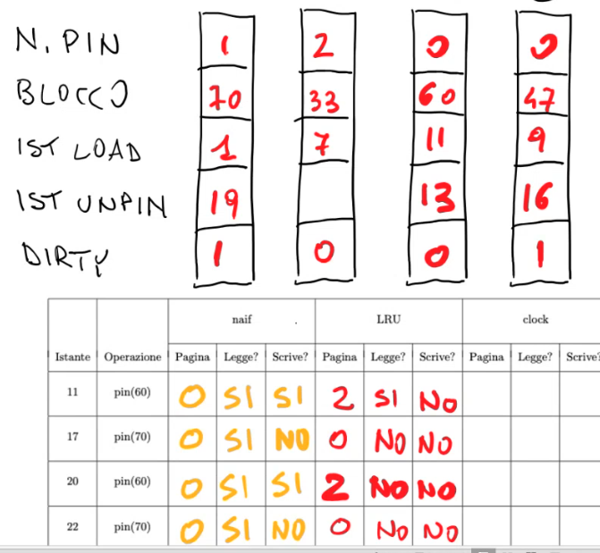

`pin(70)`