# Metodo NAIF

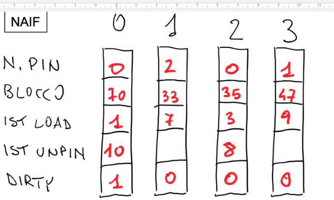

Si fa un `unpin(70)`, sul blocco 70:

- il blocco 70 si trova nella pagina 0 del buffer, quindi si decrementa di 1 il numero pin (1 → 0)
- si scrive quando viene liberata la pagina (10)

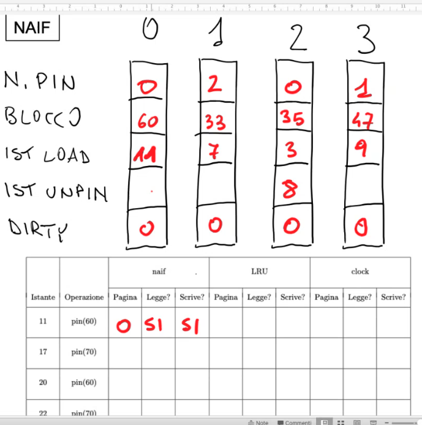

Si fa un `pin(60)`, libera la pagina 0

- scrive (dirty: 1 → 0), legge nella pagina 0 (deve prima salvare)
- si modifica quindi il blocco (70 → 60)
- si modifica l’istante di load (1 → 11)
- si modifica l’istante di unpin a 0

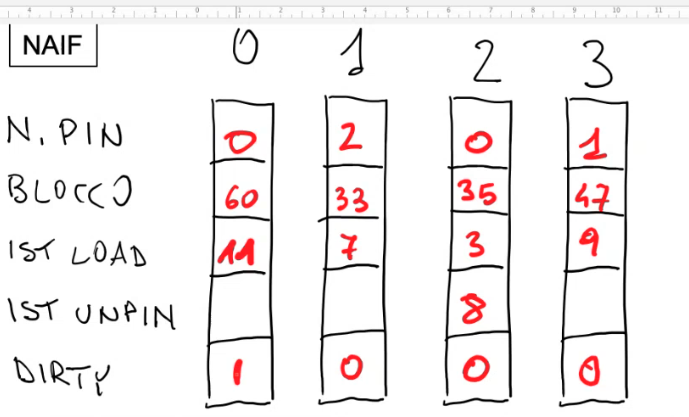

Si fa un `setXXX(60,...)` quindi l’unica cosa che cambia è il dirty bit(0 → 1)

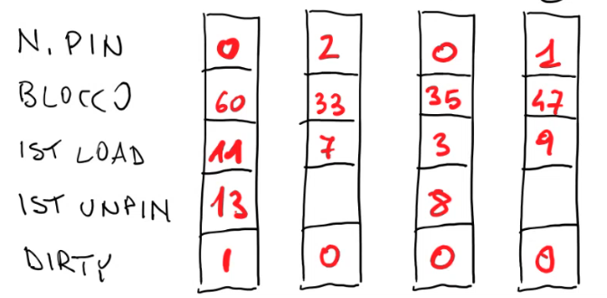

Si fa `unpin(60)`

- si mette istante di unpin a 13

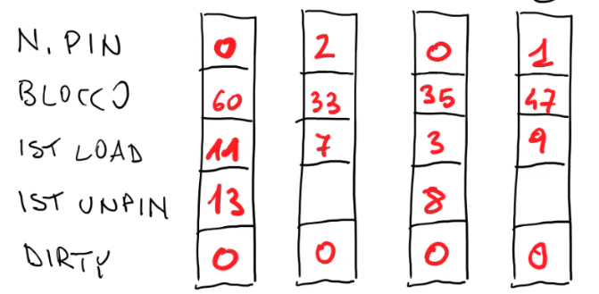

Si fa `flushAll`

- in pratica scrive su disco tutte le pagine quindi il risultato è che tutti i page sono salvati quindi i dirty bit vanno a 0

Si fa `setXXX(47,...)`

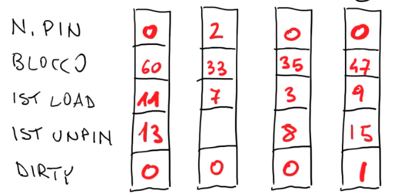

Si fa `unpin(47)`

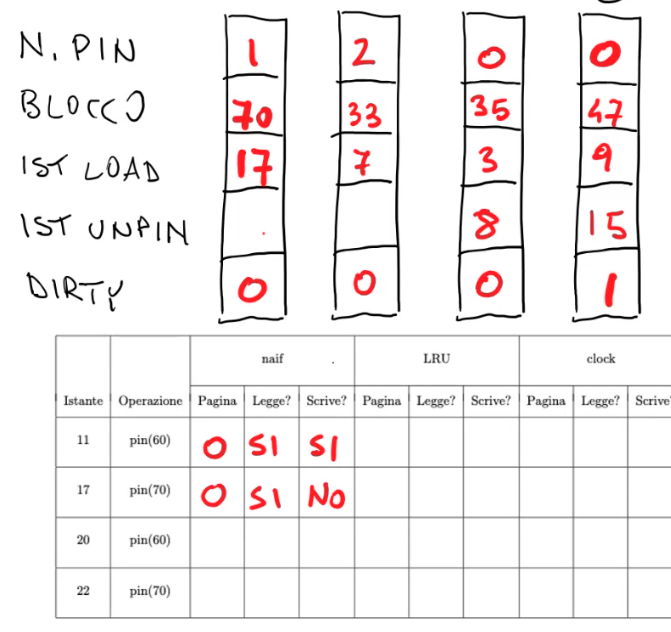

Si fa `pin(70)`, libera la pagina 0

- non c’è bisogno di scrivere perchè la pagina non è dirty
- si mette istante di load è 17
- si toglie istante di unpin

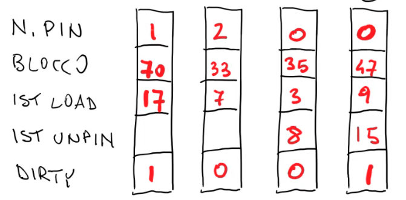

Si fa `setXXX(70,...)`

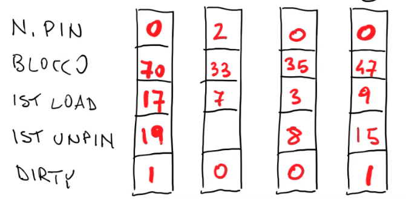

Si fa `unpin(70)`

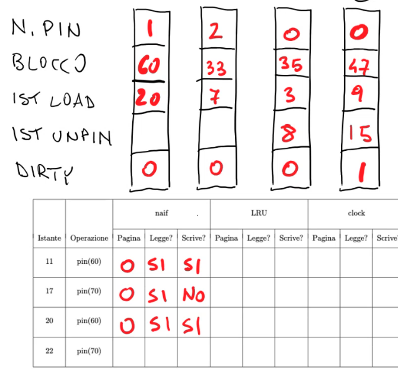

Si fa `pin(60)`: si libera la pagina 0

- si inizializza l’istante di load
- la pagina era sporca quindi si deve sia leggere sia scrivere

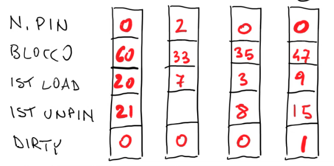

Si fa `unpin(60)`

- si decrementa il numero di pin
- si mette 21 all’istante di unpin

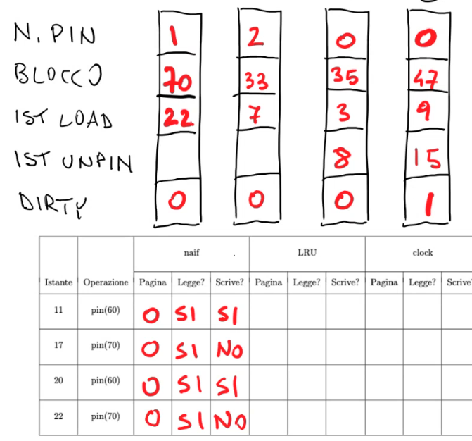

Si fa `pin(70)`