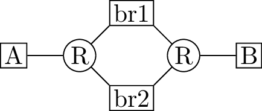
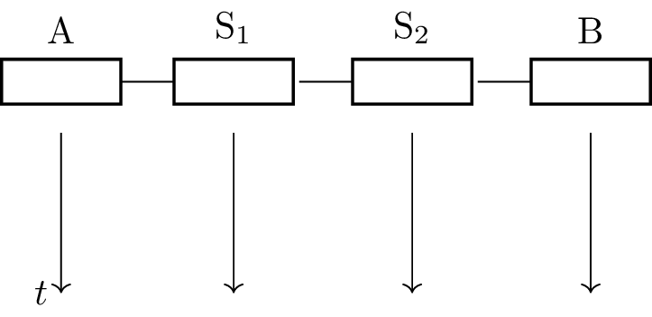
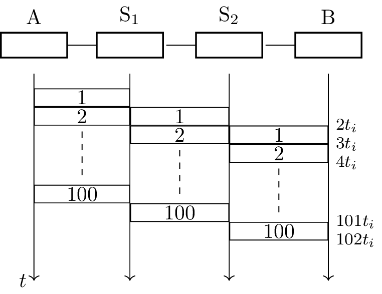
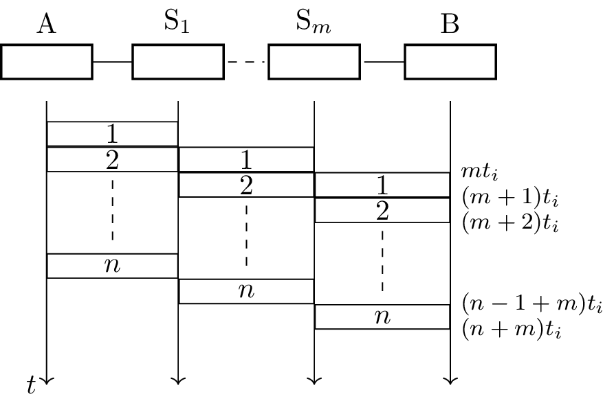
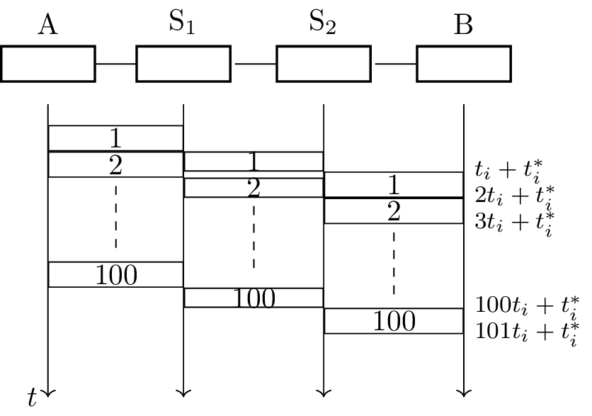
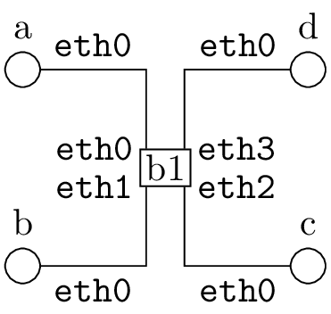
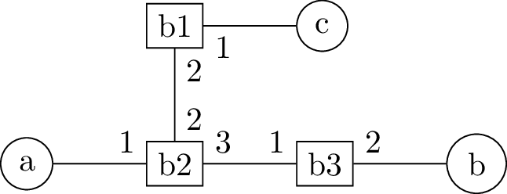

---
author:
- "*Giacomo Sturm*"
date: |
  *Dipartimento di Ingegneria Civile, Informatica e delle Tecnologie Aeronautiche  
  Università degli Studi “Roma Tre"*
title: |
  **Reti di Calcolatori**  
  Esercizi Svolti di Reti di Calcolatori  
  *Anno Accademico: 2024/25*
---

\providecommand{\labelText}[2]{#1}

# Esercitazione del 23 Ottobre

## Rete Bridge con Cicli

Si considera una rete locale IEEE 802.3 di topologia seguente:

<figure>

 

</figure>

Sono presenti due repeater R, e due computer A e B. Le connessioni avvengono solo su cavi utp, “Unshielded Twisted Pair”, si suppone che questi bridge numerati 1 e 2, non siano in grado di realizzare lo spanning tree. Quindi tutta la rete, compreso il ciclo, è attiva. Si suppone che tutte le porte dei bridge siano pienamente attive. Si suppone che i bridge siano appena stati accesi, quindi i loro filtering database siano vuoti.

Il primo evento in questa rete locale è l’invio di un pacchetto da A e B.

### Domanda 1

Determinare quanti pacchetti circolano nella rete dopo l’invio del singolo pacchetto:

Questo pacchetto `(A->B)` arriva ad entrambi i bridge `bridge 1` e `bridge 2`, che hanno un filtering database vuoto, per cui lo mandano su tutte le porte attive. Poiché il repeater può inviare ricevere un pacchetto alla volta si considera che il pacchetto del primo bridge arrivi per primo al repeater, nella contesa del dominio di collisione. Si considerano i due pacchetti copiati dai due bridge `(A->B)'`, il primo, e `(A->B)'`, il secondo. Ma il repeater invia il pacchetto ricevuto su tutte le direzioni, quindi oltre ad arrivare a B, arriva anche alla porta destra dell’altro bridge, che invia la sua copia del pacchetto dalla porta sinistra. Questo pacchetto incontra il repeater della sotto-rete A e viene ripetuto su tutte le porte del repeater. Quindi questo pacchetto oltre a raggiungere A viene inviato sulla porta sinistra dell’altro bridge, e si ripete la sequenza, per entrambi i bridge.

Quindi in questa situazione le copie del pacchetto `(A->B)'` viene inviato continuamente in un ciclo antiorario, mentre `(A->B)''` segue il percorso orario.

### Domanda 2

Determinare cosa succeeded al filtering database di `bridge 1` e `bridge 2`:

Ogni volta che il pacchetto copiato raggiunge un bridge, considera la porta da cui è arrivato la nuova posizione della stazione A, così per entrambi i bridge. Quindi la sua posizione nel filtering database cambia continuamente.

### Domanda 3

Determinare il comportamento dei bridge all’invio di un pacchetto `(B->A)`:

Se il pacchetto arriva ad entrambi i bridge quando la stazione A si trova nel filtering database sulla porta destra, il pacchetto non viene inviato ad A. Se solo uno presenta la stazione A alla porta sinistra, una singola copia raggiunge A. Se entrambi presentano la stazione A alla porta sinistra, questa riceve due volte il pacchetto.

Dati questi problemi non si accetta di avere un ciclo in una rete neanche per un tempo transitorio, poiché può saturare la rete ed impedire ai pacchetti necessari a passare. Gli algoritmi per determinare lo spanning tree sono molto conservativi, e prima di effettuare l’algoritmo interrompono il transito di tutti i pacchetti.

## Effetto dello Store & Forward sulla Latenza

Si considera una rete mostrata nella figura seguente, dove A e B sono computer e S1 e S2 sono switch. Dove i cavi ethernet sono utp, ed il ritardo di propagazione è trascurabile. Si suppone che le schede di rete utilizzate sono tutte a 10 Mb/s.

Questo disegno mostra cosa avviene sulla rete mentre è in funzione, rispetto al tempo:

<figure>

 

</figure>

Il computer deve spedire un file di 100000 bit a B, suddividendolo in 100 pacchetti. Si suppone che il trasferimento inizi all’istante $t=0$, e si suppone di trascurare gli header e l’IPG. Si suppone che la rete sia a completa disposizione del trasferimento dei file, che gli switch non operino in modalità “cut-through”. Si suppone che non siano utilizzati riscontri di alcun tipo.

### Domanda 1

Completa il diagramma temporale riportato al di sotto della figura con la rete, mostrando la sequenza dell’invio dei pacchetti dai vari componenti:

<figure>

 

</figure>

Ad ogni istante lo switch ha un pacchetto in ricezione su una porta, ed un pacchetto in trasmissione sulla seconda porta.

Per inviare un singolo pacchetto sulla rete si impiega un tempo $t_i$:

$$t_i=\displaystyle\frac{100000\,\mathrm{bit}/100\,\mathrm{pk}}{10^7 \mathrm{bit/s}}=10^{-4}\mathrm{s/pk}$$

In caso il ritardo non sia trascurabile, ogni segmento viene traslato verso il basso di questo ritardo.

### Domanda 2

In quale istante tutti i bit sono arrivati a B:

Il primo pacchetto viene ricevuto completamente ad un tempo $3t_i$, poiché deve passare attraverso tre spazi intermedi, dopo il quale i pacchetti arrivano ogni $t_i$, e rimanendo 99 pacchetti, l’ultimo arriverà al tempo $102t_i$. $$T=102\,t_i$$

### Domanda 3

Determinare una formula generale per risolvere ogni problema di questo tipo con $n$ pacchetti ed $m$ switch:

Ogni switch aggiunge un altro stadio alla trasmissione, quindi aumenta il tempo di un fattore $t_i$, da aggiungere al numero di pacchetti totali: $$T=(n+m)\cdot t_i$$

<figure>

 

</figure>

### Domanda 4

Determinare una formula generale che tenga conto di ritardi sul primo, sul secondo, o sul terzo filo:

In caso di un ritardo su un certo filo, questo rappresenta il collo di bottiglia del sistema, e quindi il tempo totale ne risentirà considerevolmente. Il tempo in cui il primo bit del primo pacchetto arriva $T_1$ è dato dal tempo di attraversamento di ogni filo, quindi è $T_1=3t_i+t_i^{\mathrm{r}}$, dove $t_i^{\mathrm{r}}$ rappresenta il tempo di ritardo su di un filo. Tutti gli altri $n-1$ pacchetti arriveranno ad intervalli di $t_i+t_i^{\mathrm{r}}$, quindi il tempo di arrivo dell’ultimo di $n$ pacchetti trasmessi è: $$T=T_1+(n-1)\cdot (t_i+t_i^{\mathrm{r}})=(n+2)\cdot t_i+nt_i^{\mathrm{r}}$$

### Domanda 5

Si suppone di poter aumentare la connessione ad una banda di 100 Mb/s, ma questo aumento è possibile solo su uno dei tre fili, utilizzando una doppia scheda su di un filo. Anche se il tempo di trasmissione di un pacchetto in uno dei fili diventa il decimo: $t^*_i=t_i/10$, il resto dei fili rimane alla stessa banda, quindi rappresenta il collo di bottiglia del sistema. Quindi l’aumento di banda su un singolo filo non influisce sulla diminuzione del tempo necessario per tutti i pacchetti, ma solo per il primo $T_1=2t_i+t_i^*$. Tutti gli altri 99 pacchetti arrivano alla destinazione ogni $t_i$, come per il problema originario: $$T=T_1+99t_i=101t_i+t_i^*$$

<figure>

 

</figure>

## Learning nei Bridge

### Domanda 1

Si considera un bridge b1 con quattro porte `eth0`, `eth1`, `eth2` e `eth3`, a cui sono collegati quattro computer a, b, c, d:

<figure>

 

</figure>

Nella rete transitano cinque pacchetti in sequenza, inviati dopo che il precedente è giunto a destinazione:

- t$_1$: `(a->b)`;

- t$_2$: `(b->a)`;

- t$_3$: `(c->d)`;

- t$_4$: `(c->d)`;

- t$_5$: `(d->a)`.

Descrivere il contenuto del filtering database di B1, dopo ciascun pacchetto, e specificare le porzioni di rete in cui i diversi pacchetti sono visibili.

Il pacchetto t$_1$ viene ricevuto dalla porta `eth0`, quindi viene assegnata ad A nel filtering database, e viene inviato su tutte le altre le porte. Il pacchetto t$_2$ viene ricevuto dalla porta `eth1`, questa porta viene associata al computer B, e sapendo dove si trova A, lo invia solamente sulla porta `eth0`. I pacchetti t$_3$ e t$_4$ effettuano un procedimento analogo a t$_1$ e t$_2$, sulle porte `eth2` e `eth3`. All’arrivo del pacchetto t$_5$, il bridge conosce l’intera topologia della rete.

Ma il filtering database non è statico, e viene dimenticato in intervalli di tempo prestabiliti, oppure se uno dei computer viene connesso ad un’altra porta e ne riceve un pacchetto. Quindi se uno di questi pacchetti arriva dopo che è stato resettato il filtering database, ricomincia il processo di learning.

### Domanda 2

Si considera la seguente topologia di rete ad albero, con tre bridge b1, b2, e b3, e tre computer a, b e c:

<figure>

 

</figure>

Nella rete vengono trasmessi tre pacchetti, inviati in tre istanti di tempo successivi:

- t$_1$:`(a->c)`;

- t$_2$:`(c->a)`;

- t$_3$:`(b->a)`.

Descrivere il filtering database per all’invio di ciascun pacchetto, e specificare in quali porzioni di rete i pacchetti sono visibili:

All’invio del primo pacchetto tutti i filtering database sono vuoti, quindi il pacchetto t$_1$ viene inviato su ogni porzione della rete. Dopo il suo invio, il bridge b2 ha sulla porta 2 la stazione a, il bridge b3 ha sulla porta 1 la stazione a, ed il bridge b1 la ha sulla porta 2. All’invio del pacchetto t$_2$, sia il bridge uno che due sanno dove si trova la stazione a, quindi il pacchetto viene prima inviato dalla stazione c a b1, poi da b1 all’altro bridge b2, poi da b2 alla stazione di arrivo a. Alla fine della trasmissione i bridge uno e due hanno la stazione c rispettivamente sulla porta 1, e 2. All’invio dell’ultimo pacchetto t$_3$, entrambi i bridge b3 e b2 hanno la stazione a nel loro filtering database, quindi effettua un percorso da b a b3, a b2 fino ad a. Il bridge b2 e b3 conoscono la posizione della stazione b rispettivamente sulle porte 3 e 2.

### Domanda 3

Considerando la stessa rete dell’esercizio seguente, come cambia il filtering database se i pacchetti precedenti vengono inviati nell’ordine:

- t$_1$:`(c->a)`;

- t$_2$:`(b->a)`;

- t$_3$:`(a->c)`.

I primi due pacchetti vengono trasmessi su tutta la rete, mentre solo l’ultimo viene trasmesso solo sulle porte necessarie, dato che i bridge conoscono la posizione del destinatario. Dopo il primo pacchetto i bridge b1, b2 e b3, conoscono la posizione della stazione c, rispettivamente sulla porta 1, 2, 1. All’invio del secondo pacchetto analogamente conoscono la posizione della stazione b sulle porte, 2, 2, 2. Mentre all’invio dell’ultimo pacchetto i bridge b1 e b2 conoscono la posizione della stazione a sulle porte 1 e 2. Rispetto alla domanda precedente, il bridge b3 ora conosce la posizione della stazione c, ma il bridge b3 non conosce la posizione della stazione a.

# Esercitazione del 13 Novembre

Lo spazio degli indirizzi viene rappresentato come un albero binario, etichettato sugli archi con un valore 0 o 1. L’arco che esce da un nodo verso il figlio sinistro viene etichettato come 0, mentre quello destro viene etichettato con un 1.

In questa rappresentazione ad albero una foglia, a profondità 32 rappresenta un indirizzi, il suo cammino fino alla radice rappresenta tutti i 32 bit dell’indirizzo IPv4 corrispondente. Gli indirizzi sono in corrispondenza biunivoca con le foglie dell’albero. Una net in questa rappresentazione corrisponde ad un nodo che non è una foglia, infatti tutte le macchine in una stessa net hanno un certo cammino dalla radice ad un nodo in comune. Il sotto-albero radicato in questo nodo rappresenta tutti gli indirizzi appartenenti alla stessa net. Il suo prefisso è ottenuto completando questa net con tutti zeri, quindi è il cammino sempre verso sinistra in questo sotto-albero

## Domanda 3

Come è possibile verificare che due net non abbiano indirizzi in comune?  
Dati due nodi dell’albero, se il più basso antenato comune corrisponde ad uno dei nodi dell’albero, allora gli indirizzi non sono disgiunti, mentre se gli indirizzi non si sovrappongono

## Domanda 4

Nella rappresentazione ad albero data una rappresentazione di una net A e la rappresentazione di una net B, come è possibile verificare che A e B siano il risultato esatto del “subnetting” di una terza net C?  
Bisogna

## Domanda 5

# Esercitazione del 20 Novembre

## Esercizio 1

### Domanda 1

Una società ottiene il blocco di indirizzi 200.100.50.0/24, con una netmask 255.255.255.0. Viene configurata una singola rete:

- QUante macchine possono essere collocate sulla LAN 200.100.50.0/24?

- Qual è l’indirizzo di broadcast della LAN A?

- Com’è composta la tabella di instradamento del router 1?

L’ultimo byte viene utilizzato per identificare le macchine sulla LAN A, sono possibili al massimo 254 macchine, tra cui il router. Non si può utilizzare né il primo che identifica la LAN 200.100.50.0, né l’ultimo che identifica l’indirizzo broadcast 200.100.50.255.

La LAN è connessa all’internet tramite il router 2 connesso su una LAN privata 10.0.0.0/30 ad il router 1, connesso a questa LAN. L’indirizzo ha i primi 6 bit del quarto byte pari a zero, e gli ultimi due bit per identificare macchine diverse, solo due possibili. Se si utilizzasse un indirizzo con 31 bit per la netmask, non sarebbe possibile identificare alcuna macchina, ma si potrebbe utilizzare per effettuare solamente trasmissioni broadcast. Questo tuttavia non viene effettuato, poiché su una LAN si deve attribuire un indirizzo valido, che comincia da una /30. A volte tuttavia è possibile che ci si riferisca ad un indirizzo /32, nella letteratura tecnica si indica che si interessa solamente quell’indirizzo. Si può utilizzare per realizzare tabelle di instradamento che indicano un singolo indirizzo.

La tabella di instradamento del router 1 contiene la subnet 200.100.50.0 sulla netmask 255.255.255.0, la subnet su 10.0.0.0 sulla netmask 255.255.255.252, entrambe direttamente connesse. La rotta di default è 0.0.0.0, con il next hop dato dall’indirizzo 10.0.0.1

- Quante macchine possono essere attestate sulla LAN 10.0.0.0/30?

- Qual è l’indirizzo broadcast della LAN 10.0.0.0/30? Viene mai utilizzato?

L’indirizzo MAC di broadcast sulla LAN 10.0.0.0/30 non viene mai utilizzato, ma poiché gli indirizzi nella tabella di instradamento vengono salvati su cache possono essere dimenticati e quindi dopo un certo periodo di tempo deve essere effettuata una nuova ARP request broadcast per cercare l’indirizzo MAC a cui inviare il pacchetto.

- Come si comporta il router 1 quando riceva un pacchetto destinato a 200.100.50.25?

- E quando riceve dalla LAN un pacchetto destinato a 200.100.51.25?

- 

### Domanda 2

Si considera la stessa società della domanda precedente, avendo due LAN connesse al router 1, ora con tre interfacce. Non può chiedere altri indirizzi e deve utilizzare lo stesso 200.100.50.0/24 per realizzare due prefissi. Bisogna tagliare in due questo indirizzo, i primi tre byte sono uguali, mentre il primo bit del quarto byte identifica una delle due subnet. Queste due LAN hanno un prefisso /25. Questi due prefissi sono:

- 200.100.50.0/25, con netmask 255.255.255.128;

- 200.100.50.128/25, con netmask 255.255.255.128.

Il primo è esattamente lo stesso della /24, quindi cambia solamente il numero di bit per la netmask. Di questi due prefissi si possono utilizzare solamente 126 macchine. Non si può dividere in tre parti uguali, si possono solo tagliare a metà un’altra parte. Ci sono indirizzi, e prefissi uguali con un numero di bit netmask diversi, ed è possibile che più indirizzi abbiano la stessa netmask. Tutti gli indirizzi aventi prefissi di stessa lunghezza utilizzano la stessa netmask.

- Com’è composta la tabella di instradamento del router 1?

Il router ha una tabella identica alla precedente, eccetto che l’indirizzo 200.100.50.0/24 viene sostituito da due prefissi 200.100.50.0 e 200.100.50.128 con la stessa netmask 255.255.255.128 direttamente connesse.

### Domanda 3

La stessa società subisce una riorganizzazione interna, in cui le risorse vengono distribuite nell’amministrazione che ospita metà delle macchine ed in due dipartimenti che si dividono le restanti. Per effettuare questa distribuzione bisogna suddividere nuovamente in metà uno dei due indirizzi, si sceglie l’indirizzo alto.

### Domanda 4

### Domanda 5

## Esercizio 2

Si suppone che ogni interfaccia IP, esclusi i bridge, produca un traffico broadcast di $0.1$ Mbit/s. Compila la tabella del carico del traffico broadcast che si aspetta sulle varie linee.

Questo traffico colpisce tutte le macchine sulla stessa LAN. Si considera ora un caso di traffico unicast di 1 Mbit/s, dal server SA a tutti i PC di tipo A. Compilare la tabella del traffico unicast che ci si aspetta sui varia domini di collisione:

Se si ha una LAN di passaggio, attraverso questa passeranno tutti i flussi unicast, che occupano tutta la banda del tratto intermedio.

# Esercitazione del 11 Dicembre: Stati di TCP

C’è uno scambio di dati tra due applicazioni A$_1$ ed A$_2$, la prima invia 3500 byte alla seconda applicazione. Entrambe le macchine sono su un livello 2 il cui campo dati ammetta una MTU di 1400 byte. Si ricorda che l’intestazione IPv4 e TCP occupano ciascuna 20 byte.

Il dialogo tra le dua applicazioni è mostrato a livello TCP nel diagramma che segue:

Si suppone che il primo byte inviato dal primo calcolatore abbia SN pari a zero. Ciascun pacchetto è etichettato in due modi:

- `SYN`, `FIN` e `ACK`;

- `SN`, `AN`.

## Domanda 1

Completa il diagramma nel modo seguente:

- Dove c’è `SYN`, scrivi un 1 accanto all’uguale se in quel pacchetto il bit SYN vale uno;

- Dove c’è `FIN`, scrivi un 1 accanto all’uguale se in quel pacchetto il bit FIN vale uno;

- Dove c’è `ACK`, scrivi un 1 accanto all’uguale se in quel pacchetto il bit ACK vale uno;

- Dove c’è `SN`, scrivi accanto all’uguale quanto vale il Sequence Number, in quel pacchetto;

- Dove c’è `AN`, scrivi accanto all’uguale quanto vale l’Acknowledgment Number, in quel pacchetto.

I primi tre pacchetti sono necessari alla sincronizzazione, per cui il primo pacchetto ha il bit SYN pari ad uno, ed i bit FIN ed ACK pari a zero, poiché ancora non è stata instaurata la connessione. La seconda applicazione se riscontra la connessione invia un pacchetto con SYN ed ACK pari ad uno. L’ultimo pacchetto nella sequenza di connessione dalla prima applicazione contiene il bit SYN pari a zero, poiché è già stata instaurata la connessione, ed il bit ACK pari ad uno.

Il primo pacchetto contenente dati contiene al massimo 1360 byte dati, sui 3500 byte da inviare, quindi ha il bit SN ha valore 0, poiché è il primo byte della comunicazione, ed un AN pari a zero, poiché la seconda applicazione ancora non ha spedito nulla. La seconda applicazione, se riceve correttamente questi 1360 byte, indicizzati a partire da zero, invia un pacchetto con AN uguale a 1360. Nel secondo pacchetto dati da A$_1$, il SN ha valore 1360, e l’AN ha valore 0. Il successivo pacchetto di acknowledgment ha un AN pari a 2720. Il terzo pacchetto dati ha SN pari a 2720 e AN pari a zero. Questo pacchetto viene riscontrato con AN pari a 3500, poiché sono presenti tutti i byte residui.

A questo punto si termina la connessione poiché si sono inviati tutti i byte descritti all’inizio. Il bit FIN del pacchetto sicuramente è pari ad uno, e gli altri due SYN e AN sono pari a zero. Ma generalmente viene inserito nel bit ACK l’ultimo riscontro effettuato, e quindi un valore di uno, poiché cambiare il valore di questo bit non ha un costo sulla comunicazione. Questo pacchetto viene riscontrato da A$_1$ con SYN e FIN pari a zero, ed ACK pari ad uno. Questo termina la chiusura da A$_2$ a A$_1$, per chiudere la connessione da A$_1$ ad A$_2$ bisogna inviare una coppia di pacchetti analoghi.

Dal punto di vista TPC le due macchine sono una il client e l’altra il server. L’applicazione che termina la connessione per prima appartiene al client, e quindi i ruoli sono invertiti rispetto alla prima parte della comunicazione, poiché i dati sono stati inviati da A$_1$ quindi si tratta di un server. È usuale all’interno di una comunicazione TCP che il server rilasci la connessione. Fin quando non viene ricevuto il pacchetto di fine della connessione da A$_2$, è possibile continuare ad inviare pacchetti da parte di A$_1$.

## Domanda 2

Nel diagramma, accanto agli assi temporali, sia dalla parte di C$_1$ che dalla parte di C$_2$ ci sono dei riquadri vuoti ciascuno riquadro è riferito, tramite una freccia, a un istante temporale completa il diagramma inserendo in ciascun riquadro lo stato in cui si trova TCP nell’istante corrispondente nel calcolatore corrispondente.

Si ricorda che gli stati in cui si può trovare TCP sono:

- closed;

- listen;

- syn-received;

- syn-sent;

- established;

- fin-wait-1: stato di chi inizia la chiusura;

- fin-wait-2: stato di chi inizia la chiusura;

- timed-wait;

- close-wait;

- last-ack: stato in cui si attende l’ultimo ack della connessione.

Il client ha richiesto un’instaurazione della connessione al primo pacchetto, per cominciare il three-way-handshake, quindi si trova in stato di syn-sent. Il server quando ha ricevuto il pacchetto syn, ha uno stato syn-received. La connessione è stata instaurata e durante lo scambio dei pacchetti, lo stato del client e del server è un macro-stato, established. Durante la fine della connessione A$_2$ si comporta come un client, ed i suoi stati attraversati sono quelli del client, quindi il primo stato è fin-wait-1. La prima applicazione quindi ha uno stato del server close-wait. Quando A$_2$ riceve l’ultimo pacchetto ed effettua l’ultimo acknowledgment entra in uno stato timed-wait, dal quale uscirà ed entrerà nello stato di effettiva chiusura, dopo un tempo di timeout. Questo stato comincia immediatamente dopo che è stato inviato questo pacchetto. Convenzionalmente si aspetta due volte il massimo tempo di vita del pacchetto.

# Esercitazione 20 Dicembre: Posta Elettronica e DNS
