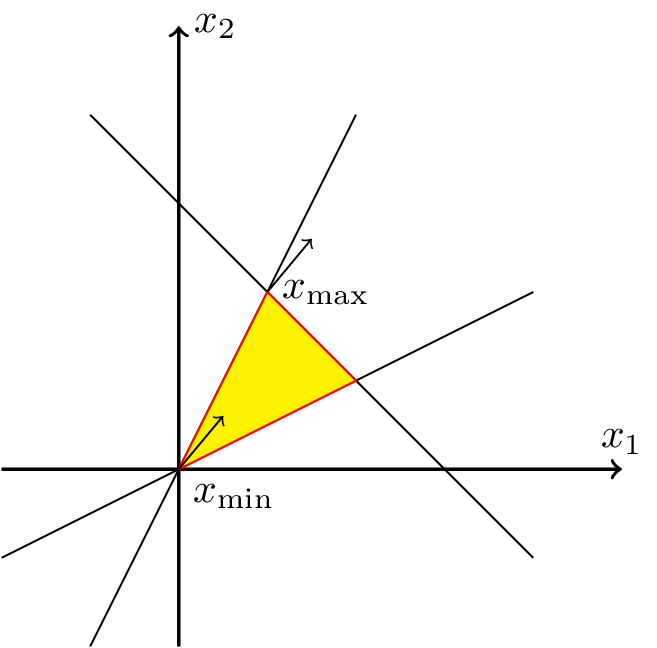
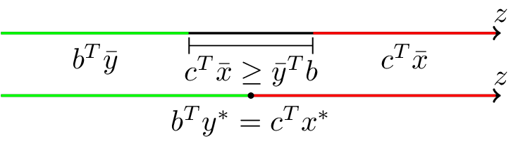

---
author:
- "*Giacomo Sturm*"
date: |
  *Dipartimento di Ingegneria Civile, Informatica e delle Tecnologie Aeronautiche  
  Università degli Studi “Roma Tre"*
title: |
  **Ricerca Operativa I**  
  Appunti delle Lezioni di Ricerca Operativa I  
  *Anno Accademico: 2023/24*
---

\providecommand{\labelText}[2]{#1}

# Introduzione

In generale la ricerca operativa studia i processi decisionali nei sistemi organizzati, i modelli ed i metodi utilizzati per prevedere il loro comportamento e la loro complessità, al fine di determinare ed identificare le decisioni che ottimizzano le prestazioni.

Per cui è una materia inter-disciplinare, in ambienti economici, ingegneristici, informatici e matematici. In ogni caso si parte dall’analisi di un problema reale, raccogliendo le informazioni più importanti per poter analizzare il sistema, estrapolandoli dall’interpretazione del problema. Un problema decisionale, reale, consiste nella scelta tra più possibili alternative, finite o infinite, individuate sulla base del problema o fornite esplicitamente, sulla base di almeno un criterio, chiamati obiettivi del problema, per rispettare certe condizioni di certezza, incertezza o rischio.

Per cui il problema fondamentale della ricerca operativa consiste nel trasformare un problema reale definito dal linguaggio, in un modello matematico su cui analizzare in maniera sistematica il problema originale, su cui è possibile dimostrare l’ottimalità delle soluzioni, se esistono.

Il modello matematico rappresenta un problema di programmazione lineare, in grado di individuare una soluzione sulla base di una serie di vincoli. Per cui sono necessari criteri per poter definire se una soluzione ad un dato problema è ottima o meno, alcuni di questi criteri sono l’efficienza computazionale dell’algoritmo risolutivo nel caso peggiore, la capacità di essere realizzato in modo tattico o strategico, etc. Un’ulteriore criterio è la robustezza dell’algoritmo, dove i dati sono stocastici, per cui la capacità dell’algoritmo di ottenere una soluzione ottima, nonostante errori nei dati o nei vincoli dati. Inoltre si considera se può essere dimostrato analiticamente che si tratta della risposta migliore ricavabile dal dato algoritmo. La scelta ottima dipende dalla specifiche richieste dal dato problema. Per ottimizzare la soluzione, data una formulazione matematica del problema, bisogna definire una certa funzione obiettivo $f(x)$, dove $x$ è una delle possibilità o soluzioni disponibili $x\in X$. Una soluzione si dice quindi ottimale se è in grado di minimizzare la funzione obiettivo $x\in X\to \min\{f(x)\}$.

Un modello di programmazione lineare di un problema assume una forma simile alla seguente: $$\begin{gathered}
    \min z=\displaystyle\sum_{j}c_jx_j\mbox{ t.c. } \begin{cases}
        \displaystyle\sum_{j}a_{ij}x_j\leq b_i &\forall i=1,\cdots,m\\
        x_j\geq0 &\forall j=1,\cdots,m
    \end{cases}
\end{gathered}$$ In questo caso $z$ corrisponde al valore della funzione obiettivo. I parametri $c_j$ rappresentano i contributi o pesi di ogni variabile $x_j$, forniti dal problema.

Nei problemi reali le variabili si considerano spesso non negative, se non viene specificato altrimenti dal problema.

# Modelli

Per realizzare un modello di ottimizzazione, analitico, si utilizza il metodo delle cinque fasi. Il primo passaggio consiste nella raccolta dei dati reali, da cui si identifica, nel passaggio successivo, il problema astratto, anche diverso dal problema originario. Da questo problema si costruisce un modello matematico nel passaggio successivo, definendo variabili di decisione, vincoli e funzioni obiettivo. In seguito si risolve il modello matematico, ottenendo delle soluzioni astratte. Queste soluzioni descritte da un modello astratto devono essere verificate nella realtà, ed in caso bisogna modificare il modello matematico, il problema, oppure raccogliere nuovi dati, per rendere il modello astratto adatto al problema reale affrontato. Dopo aver ottenuto una soluzione e verificato sia adatta al problema reale il lavoro di ottimizzazione e si può attuare ed implementare nella realtà, quindi termina il lavoro della ricerca operativa.

In questo corso ci si interessa prevalentemente dell’astrazione ad un modello matematico ed alla sua risoluzione tramite algoritmi esatti, in grado di dimostrare l’ottimalità di una soluzione, o la sua non esistenza.

Data una soluzione a questo modello, si cerca la soluzione pià simile a questa soluzione esatta, ed in caso si considera un certo errore per eccesso o per difetto su ogni vincolo del problema, e si cerca la soluzione in grado di minimizzare gli errori, cambiando quindi la funzione obiettivo, per ottenere la soluzione più simile all’ottimo. Se neanche in questo modo è stato possibile determinare una soluzione accettabile al problema, è necessario modificare i dati raccolti e riformulare il problema.

Vengono forniti due metodi risolutivi in questa sezione, il metodo grafico che si basa su una rappresentazione grafica del problema, un modo intuitivo e semplice per rappresentare l’insieme dei vincoli del problema e trovare la soluzione ottima, ma limitato a problemi di sole due variabili; ed il metodo di Fourier-Motzkin che utilizza le nozioni ottenute dalla rappresentazione grafica per estendere il suo approccio a problemi di più di due variabili.

In seguito verrà fornita un’analisi puramente analitica tramite concetti di algebra lineare e geometria poliedrale, per ottenere la stessa soluzione al problema, mostrando le connessioni tra la rappresentazione analitica e grafica dello stesso problema.

L’ultimo modello analizzato in questo corso corrisponderà ad un approccio di generalizzazione del problema tramite la struttura di dati grafi orientati, reti, e non orientati, per fornire algoritmi di risoluzione a diversi problemi, più affini a questa rappresentazione.

## Formulazione

Dopo aver raccolto i dati dal problema reale ed avere realizzato un problema astratto si crea un modello matematico, in base al tipo di problema astratto a cui si è arrivati. Si tratteranno cinque tipi diversi di problemi astratti:

- Miscelazione;

- Allocazione;

- Trasporto;

- Taglio Ottimo;

- Pianificazione.

Per definire un modello matematico bisogna definire un insieme di variabili di decisione, vincoli, ed una funzione obiettivo, su cui può essere risolto il modello. Dal problema si individuano un insieme di incognite ed ognuna viene associata ad una variabile $x_i$. Ognuna di queste variabile è generalmente associata ad un dato noto su cui può essere realizzata la funzione obiettivo come una combinazione lineare dei costi o guadagni $c:j$ associati a ciascuna variabile del problema $x_j$: $$\min z=\displaystyle\sum_j c_jx_j$$ In seguito si estrapolano dal problema i vincoli per ognuna delle variabile, in generale oltre a questi vincoli bisogna imporre che tutte le variabili siano non negative, se non viene specificato altrimenti per singole variabili. Quindi si definiscono dei coefficienti $a_{ij}$ e dei valori $b_i$ per realizzare l’insieme di vincoli del problema: $$\begin{gathered}
    \begin{cases}
        \displaystyle\sum_{j}a_{ij}x_j\gtreqless  b_i &\forall i=1,\cdots,m\\
        x_j\geq0 &\forall j=1,\cdots,m
    \end{cases}
\end{gathered}$$

Il problema di miscelazione consiste nell’individuare una combinazione di “ingredienti” per realizzare una miscela nota. Vengono forniti quindi un insieme di $n$ ingredienti contenenti ciascuno delle quantità note a priori e si vuole produrre una miscela con quantità fissate di ciascuna componente. Viene fornito il costo di ogni ingrediente e bisogna determinare la miscela a costo minimo. Gli $n$ ingredienti rappresentano le $n$ variabili $x_i$ del problema. I vincoli sono la quantità desiderata di ciascun componente nella miscela. Quando bisogna produrre $k$ miscele totali, sono necessarie $x_{ik}$ variabili per la quantità di ingredienti $i$ da aggiungere a ciascuna delle $k$ miscele. In questi casi viene fornito un limite alla quantità complessiva di un ingrediente. Bisogna quindi minimizzare il costo totale per realizzare le miscele richieste, dove ogni ingrediente $x_i$ contiene una quantità $a_{ij}$ per ognuno delle $m$ componenti, ed ha costo $c_i$.

Il problema di allocazione di risorse e di pianificazione della produzione fornisce informazioni su come produrre $n$ prodotti, avendo a disposizione un numero $m$ di risorse. Ad ognuna risorsa viene assegnata una disponibilità. Per ogni prodotto viene fornita una ricetta, la quantità di ciascuna risorsa da utilizzare per realizzare quel prodotto. Inoltre viene fornito il profitto di ciascun prodotto. Si vuole massimizzare il profitto totale. Le variabili sono le $n$ risorse $x_i$, mentre i vincoli vengono realizzati dal consumo $b_j$ di ogni risorsa rispetto alla sua disponibilità $a_{ij}$

Il problema del trasporto fornisce un insieme di unità di base da trasferire da un insieme di $m$ origini ad un insieme di $n$ destinazioni. Viene data la fornitura dei beni all’origine $f_h$ e la domanda $d_k$ di ogni bene. Inoltre viene fornito il costo di trasporto da ogni origine $h$ a ciascuna destinazione $k$: $c_{hk}$. La funzione obiettivo si realizza organizzando ogni spedizione da ciascuna origine a ciascuna destinazione, minimizzando i costi totali di trasporto. Bisogna rispettare l’ipotesi che la domanda totale sia pari all’offerta totale di ogni bene: $$\displaystyle\sum_h f_h=\sum_k d_k$$ Le variabili sono tutte le unità trasferita dalla $h$-esima sorgente alla $k$-esima destinazione $x_{hk}$. Sono presenti $m$ vincoli $n_h$ per le spedizioni da inviare da ogni sorgente, ed $n$ vincoli $b_k$ per ogni destinazione dove deve arrivare la domanda. Se l’ipotesi sulla domanda-offerta non è verificata, si ha un eccesso di domanda o offerta e si avranno delle disequazioni rispetto a quale unità parte o arriva al più. Si può sempre realizzare un problema associato equivalente dove l’ipotesi è verificata aggiungendo una fornitura o una destinazione fittizia, utilizzando delle variabili di scarto $s_i$.

Il problema del taglio ottimo consiste nel suddividere elementi base di un materiale per ricavare moduli di dimensioni minori prefissate. Bisogna soddisfare la domanda di ciascun modulo dato, noti il costo e la lunghezza di ogni elemento base. Bisogna quindi minimizzare il costo degli elementi necessari, minimizzando lo scarto $s_j$ del materiale utilizzato. Le $n$ variabili $x_i$ sono il numero di elementi tagliati secondo una certa modalità $j$, non specificata nel testo. Se sono presenti più tipologie di elementi base non cambia la formulazione, semplicemente saranno presenti più modalità di taglio possibili per i vari elementi base. Ad ogni modalità di taglio $j$ viene associato un certo numero di moduli prodotti di tipi diversi $a_{ij}$, i moduli prodotti tenendo conto di tutti i tipi di tagli devono rispettare i vincoli sulla produzione $b_i$ forniti dal testo.

In caso la funzione obiettivo ricavata da queste analisi non sia lineare, è possibile trasformarla in una funzione lineare, introducendo nuove variabili. Se si considera il valore minimo o massimo di un insieme di variabili $\{x\}$, si introduce una nuova variabile $z$ maggiore, o minore, a tutte le variabili. Vengono quindi introdotti $|\{x\}|=n$ nuovi vincoli: $$\begin{aligned}
    &\min \left(\max\{x\}\right)&\min z\\
    &\begin{cases}
        Ax\leq b\\
        x\geq0
    \end{cases}&\begin{cases}
        Ax\leq b\\
        x\geq0\\
        z\geq x_1\\
        \,\,\,\,\,\,\vdots\\
        z\geq x_n
    \end{cases}
\end{aligned}$$ Se nella funzione obiettivo è presente il modulo di una variabile, o combinazione lineare di variabili: $|f(x)|$, si introduce una nuova variabile $z$ per esprimere questo valore assoluto: $$\begin{aligned}
    &\min |f(x)|&\min z\\
    &\begin{cases}
        Ax\leq b\\
        x\geq0
    \end{cases}&\begin{cases}
        Ax\leq b\\
        x\geq0\\
        z\geq f(x)\\
        z\geq -f(x)
    \end{cases}
\end{aligned}$$

## Metodo Grafico

Dato un problema di PL formato da due variabili, è facilmente risolubile rappresentando su un piano cartesiano le due variabili ed i vincoli come rette che dividono il piano in diverse zone. Graficamente quindi una data soluzione è ammissibile se è contenuta nella parte di piano tagliata da tutte queste rette, in modo che rispetti ogni singolo vincolo. Questa parte di piano prende il nome di poliedro delle soluzioni. Graficamente quindi la soluzione ottima rappresenta un punto di questo poliedro, se esiste, identificabile, ed è possibile calcolarla analiticamente come una delle possibili intersezione delle rette rappresentanti i vincoli del problema. La soluzione ottima ad un problema viene rappresentata dalla sintassi: $x^*$ e le sue componenti $x_j^*$.

Si considera una generica equazione $a^Tx=b$, dove $x$ è il vettore (colonna) delle incognite, $a$ è la matrice dei coefficienti, e $b$ è il vettore (colonna) dei termini noti. In caso siano presenti solamente due incognite è possibile rappresentarle su un piano cartesiano dove l’asse delle ascisse e delle ordinate corrispondono rispettivamente alle incognite $x_1$ e $x_2$: $$f(x):\,a_1x_1+a_2x_2=b$$ In questo caso la matrice dei coefficienti $a$ corrisponde al gradiente dell’equazione fornita $a=\nabla f(x)$, poiché il gradiente di una funzione corrisponde al vettore delle derivate parziali della funzione: $$\begin{gathered}
    \nabla f(x)=\begin{bmatrix}
        \displaystyle\frac{\partial \strut f(x_1,_2)}{\partial x_1}=a_1\\
        \displaystyle\frac{\partial \strut f(x_1,_2)}{\partial x_2}=a_2
    \end{bmatrix}=a
\end{gathered}$$ In questo caso bidimensionale questo vettore interseca ad un angolo retto la retta definita dalla funzione $f(x)$. Si considera una soluzione a questa equazione $\alpha$, questa può essere espressa sul piano cartesiano considerando i suoi componenti: $$\begin{gathered}
    \alpha=\begin{bmatrix}
        \alpha_1\\
        \alpha_2
    \end{bmatrix}
\end{gathered}$$ Si considera ora uno spostamento $h$ da questo punto: $$\alpha+h=\begin{bmatrix}
        \alpha_1+h_1\\
        \alpha_2+h_2
    \end{bmatrix}$$ Si determina se il punto così ottenuto si trova sulla retta, alla sinistra o alla sua destra, inserendolo nell’equazione fornita: $$\begin{gathered}
    a^Tx=a^T(\alpha+h)=a^T\alpha+a^Th=b
\end{gathered}$$ Poiché $\alpha$ è una soluzione: $$\begin{gathered}
    a^T\alpha=b\\
    a^Th=0
\end{gathered}$$ Quindi se il vettore spostamento $h$ rispetta la precedente relazione allora il punto $\alpha+h$ si trova sulla retta, e forma un angolo retto con il gradiente della funzione $f(x)$, mentre se questo elemento $a^Th$ è negativo, allora si trova alla sinistra della retta, e la distanza dal punto $\alpha$ forma un angolo maggiore di $90^{\circ}$ con il gradiente, analogamente se è positivo si trova alla destra della retta e la sua distanza dal punto $\alpha$ forma un angolo minore di $90^{\circ}$: $$\begin{cases}
        a^T(\alpha+h)<b\iff a^Th<0\\
        a^T(\alpha+h)=b\iff a^Th=0\\
        a^T(\alpha+h)>b\iff a^Th>0
    \end{cases}$$

Dato un generico sistema di due disequazioni: $$\begin{gathered}
    \begin{cases}
        a_1^Tx\geq b_1\\
        a_2^Tx\geq b_2
    \end{cases}
\end{gathered}$$ Dove $x\in\mathbb{R}^2$. Per le considerazioni precedenti le soluzioni ammissibili si trovano nella zona del piano cartesiano dove punta il gradiente delle due disequazioni, mente in caso fossero minori uguali, allora le soluzioni ammissibili sono presenti nella zona di piano opposta alla direzione del gradiente.

<figure>
<p> </p>
<figcaption>Esempio Poliedro delle Soluzioni con Gradiente</figcaption>
</figure>

In questo modo si può ottiene il poliedro delle soluzioni ammissibili, ma per determinare la soluzione ottima, bisogna considerare il gradiente della funzione obiettivo, che rappresenta sul piano cartesiano una retta isocosto, dove tutti i punti hanno lo stesso valore della funzione obiettivo $g(x)$: $$\begin{gathered}
    g(x)\to c_1x_1+c_2x_2=c^Tx
\end{gathered}$$ Il vettore $c$ rappresenta il gradiente della funzione obiettivo. In base alla funzione obiettivo si considera in quale direzione bisogna spostarsi per ottenere una soluzione migliore, se la direzione è concorde alla direzione del gradiente, si indica come direzione di costo positivo, altrimenti si indica come direzione di costo negativo. In seguito si trasla la retta isocosto, su questa direzione, sul poliedro delle soluzioni ammissibili fino a quando non si incontra un unico punto $x^*$ che interseca la retta, oltre il quale non si può traslare ulteriormente la retta per ottenere una soluzione migliore. In questo modo si ottiene la soluzione ottima $x^*$, e per ottenere il valore $z$ è sufficiente sostituire i valori del punto nella funzione obiettivo: $z=g(x^*)$. Se la retta isocosto coincide ad un lato del poliedro allora si ottengono infiniti punti ottimali $x^*$, coincidenti ad infinite soluzioni ottime. Da queste considerazioni è possibile intuire come la soluzione ottima coincide unicamente ai vertici del poliedro.

In generale un problema di programmazione lineare PL può avere un’unica soluzione ottima, come un particolare vertice del poliedro, infinite soluzioni, quando la retta isocosto coincide ad un lato del poliedro, oppure nessuna soluzione. Se non è possibile alcuna soluzione allora è possibile che il poliedro sia vuoto, per cui il problema è inammissibile oppure mal posto. Altrimenti è possibile che il poliedro sia illimitato, in modo che per ogni soluzione ne esista un’altra, ammissibile, migliore, per cui si dice che il problema è illimitato inferiormente, se la funzione obiettivo è un minimo, oppure superiormente, se la funzione obiettivo è un massimo. In questo caso il poliedro diventa una retta, o semiretta, un oggetto monodimensionale, dove la direzione per ottenere una soluzione migliore è la stessa direzione della (semi)retta.

La condizione necessaria affinché un problema di programmazione lineare sia illimitato è che il poliedro delle soluzioni ammissibili sia illimitato, ma è possibile, dato un poliedro illimitato, un’unica soluzione ottima, poiché non rappresenta una condizione sufficiente.

Inoltre è possibile che un poliedro abbia una direzione di crescita infinita sia superiormente che inferiormente, per cui non presenta vertici, e sia per problemi di massimo o di minimo presenta infinite soluzioni ammissibili.

## Metodo di Fourier-Motzkin

Nonostante l’efficacia e la semplicità del metodo grafico, la maggior parte dei problemi di PL contengono più di due variabili, per cui non è possibile utilizzare questo metodo risolutivo. Tuttavia è possibile diminuire il numero di variabili in un problema di PL attraverso l’algoritmo di Fourier-Motzkin, utilizzabile per risolvere il problema o per portarlo in una forma risolubile dal metodo grafico. Questo metodo venne introdotto per analizzare sistemi di disequazioni nei quali è possibile esista più di una soluzione ottima, per individuare se esiste una soluzione: $$\begin{gathered}
    \min c^Tx\\
    \begin{cases}
        Ax\leq b
        x\geq0
    \end{cases}    
\end{gathered}$$

L’intuizione dietro questo algoritmo consiste nella possibilità di poter determinare se il poliedro delle soluzioni è vuoto o meno, in base alle sue proiezioni. Poiché se il poliedro non è vuoto allora necessariamente deve essere presente almeno un punto, proiezione del poliedro, su ogni asse $x_i$. Questa proiezione o immagine del poliedro è non finita solamente quando il poliedro è infinito e quindi il problema può essere illimitato, altrimenti è sempre possibili individuare dei limiti superiori ed inferiori al valore della variabile corrispondente all’asse di proiezione $x_i$: $[n,m]$. Nel caso più semplice si ha una coppia di disequazioni: $$\begin{gathered}
    \begin{cases}
        x_1\geq n\\
        x_1\leq m
    \end{cases}
\end{gathered}$$ Dato un qualsiasi punto appartenete al poliedro $\alpha$, la sua componente $\alpha_1$ dovrà quindi essere contenuta in questo intervallo così individuato $[n,m]$. Dati questi limiti, in base alla loro relazione si ha che:

- Il poliedro non è vuoto: $n\geq m$, l’intervallo contiene almeno un punto, immagine del poliedro;

- Il poliedro è un singolo punto: $n=m$, l’intervallo coincide ad un unico punto, proiezione del poliedro;

- Il poliedro è vuoto: $n<m$, non esiste alcuna soluzione ammissibile.

Questa proiezione può essere effettuata su poliedri di dimensione superiore a due. Per cui dato un poliedro ad $n$ dimensione, il metodo di Fourier-Motzkin consiste nel proiettare questo poliedro in un poliedro ad $n-1$ dimensioni, e quindi variabili, se possibile. Ripetendo questa proiezione ed eliminazione di variabile fino ad arrivare ad un poliedro monodimensionale, avente una sola variabile. In questo modo è possibile controllare i limiti ottenuti dalla proiezione $[n,m]$ per determinare se esiste una soluzione, con i metodi descritti precedentemente.

Dato un sistema in $n-1$ dimensioni: $\underline{A}x\leq \underline{b}, x\in\mathbb{R}^{n-1}$, questo rappresenta una proiezione del sistema ad $n$ dimensioni: $Ax\leq b, x\in\mathbb{R}^n$, per eliminazione della variabile $x_n$ se per ogni punto $\alpha$ ammissibile del sistema in $\mathbb{R}^n$, esiste un unico corrispondente punto $\alpha$ nel sistema in $\mathbb{R}^{n-1}$ ammissibile, avente tutte le componenti uguali, eccetto $\alpha_n$, rimossa: $$\forall\alpha=\begin{bmatrix}
        \alpha_1\\\vdots\\\alpha_n
    \end{bmatrix}\in\mathbb{R}^n\mbox{ t.c. }Ax\leq b\implies\exists!\alpha'=\begin{bmatrix}
        \alpha_1\\\vdots\\\alpha_{n-1}
    \end{bmatrix}\in\mathbb{R}^{n-1}\mbox{ t.c. }\underline{A}x\leq \underline{b}$$

Inoltre per ogni punto $\alpha$ del sistema $\mathbb{R}^{n-1}$ ammissibile deve esistere almeno un punto $\alpha$ ammissibile del sistema $\mathbb{R}^n$: $$\forall\alpha=\begin{bmatrix}
        \alpha_1\\\vdots\\\alpha_{n-1}
    \end{bmatrix}\in\mathbb{R}^{n-1}\mbox{ t.c. }\underline{A}x\leq \underline{b}\implies\exists\alpha'=\begin{bmatrix}
        \alpha_1\\\vdots\\\alpha_{n}
    \end{bmatrix}\in\mathbb{R}^n\mbox{ t.c. }Ax\leq b$$

Per costruire la proiezione di un poliedro, eliminando una variabile $x_n$, si dividono gli $m$ vincoli in tre possibili tipi: limiti inferiori per la variabile $x_n$, limiti superiori, e vincoli non correlati alla variabile $x_n$: $$\begin{gathered}
    \begin{matrix}
        \mathrm{I}\left.\right)\\ \mathrm{II}\left.\right)\\ \mathrm{III}\left.\right)
    \end{matrix}
    \begin{cases}
        \strut x_n\geq f_i(x_1,\cdots,x_{n-1})&\forall  i=1,\cdots,k\\
        \strut x_n\leq g_j(x_1,\cdots,x_{n-1})&\forall  j=1,\cdots,h\\
        \strut h_q(x_1,\cdots,x_{n-1})&\forall q=1,\cdots,m-k-h
    \end{cases}
\end{gathered}$$

Per ottenere una proiezione del poliedro sulla variabile $x_m$, bisogna avere almeno un vincolo di tipo uno e due, per ottenere un intervallo, altrimenti se non è possibile realizzare un intervallo la variabile $x_n$ è libera. Per ottenere un intervallo si considerano tutte i vincoli di tipo uno, per ogni vincolo di tipo 2, realizzando $k\times h$ nuovi vincoli che sostituiscono i $h+k$ precedenti. Il vincolo più stringente tra questi nuovi rappresenta quindi la proiezione della variabile $x_n$: $$\max\{g_j(x_1,\cdots,x_{n-1}),\forall j=1,\cdots,h\}\leq x_n\leq\min\{f_i(x_1,\cdots,x_n),\forall i=1,\cdots, k\}$$ Così si ottiene un sistema di $n-1$ variabili, corrispondente alla proiezione del poliedro per eliminazione della variabile $x_n$: $$\begin{gathered}
    \begin{cases}
        g_j(x)\geq f_i(x)& \forall i = 1,\cdots,h;\,\forall j=1,\cdots,h\\
        h_q(x)&\forall q=1,\cdots,m-k-h
    \end{cases}
\end{gathered}$$ Questo algoritmo di risoluzione non è efficiente, poiché ad ogni passo il numero di disequazioni aumenta da $m$ a $k\times h +m-k-h$, per aumenta quadraticamente rispetto al numero di vincoli ad ogni iterazione, nel caso peggiore, ed in generale il numero di vincoli aumenta ad ogni passaggio, rispetto all’iterazione successiva. Arrivati all’ultima iterazione, si ha un intervallo del tipo $n\leq x_1\leq m$, per cui è possibile individuare una soluzione ammissibile $\alpha$, appartenente al poliedro, e sostituendo il valore della sua componente $\alpha_1$ alla variabile $x_1$, è possibile risalire le dimensioni e determinare gli intervalli delle proiezioni di tutte le $x_i$ variabili, scegliendo ad ogni passaggio una componente valida da aggiungere a $\alpha$. Si avrà quindi un punto $\alpha\in\mathbb{R}^n$, sicuramente appartenente al poliedro delle soluzioni, e quindi ammissibile.

Se una variabile non è vincolata allora si può direttamente scegliere un valore qualsiasi $\alpha_i$, sicuramente ammissibile, per sostituire direttamente la variabile $x_i$.

Dato un problema di PL, oltre ad un sistema di disequazioni, è presente una funzione obiettivo $c^Tx$, che tiene conto di tutte le variabili del problema. Eliminando una variabile quindi viene rimosso il suo contributo dalla funzione obiettivo, per cui la soluzione ottima individuata in questo modo non corrisponde alla soluzione ottima del problema di partenza. Una variabile $x_n$ può essere eliminata per proiezione solamente se il suo costo associato è nullo $c_n=0$, in questo modo la sua mancanza non incide sul valore ottimo: $$\begin{gathered}
    \begin{bmatrix}
        c_1,\cdots,\cancelto{0}{c_n}
    \end{bmatrix}\cdot\begin{bmatrix}
        \alpha_1\\\vdots\\\alpha_n
    \end{bmatrix}=\begin{bmatrix}
            c_1,\cdots,c_{n-1}
    \end{bmatrix}\cdot\begin{bmatrix}
            \alpha_1\\\vdots\\\alpha_{n-1}
    \end{bmatrix}
\end{gathered}$$

In caso la funzione obiettivo non abbia alcun costo nullo, allora si introduce un’altra variabile $z$ da minimizzare ed un nuovo vincolo $z=c^Tx$. In seguito si applica una proiezione per sostituzione, eliminando il vincolo all’uguaglianza appena aggiunto, proiettando una variabile $x_i$. In questo modo si è generato un sistema ad $n$ variabili come il problema originale, ma in questo caso il vettore dei costi ha componenti nulle eccetto per la variabile aggiunta $z$, quindi è possibile eliminare per proiezione le restanti $n-1$ variabili, ottenendo un sistema finale del tipo: $$\begin{gathered}
    \begin{cases}
        z\leq n\\
        z\geq m
    \end{cases}
\end{gathered}$$

Poiché rappresenta il valore della funzione obiettivo, se è un problema di minimizzazione si prende il valore $n$, altrimenti $m$. Per calcolare le componenti della soluzione ottima si sostituisce la variabile $z$ nei vincoli precedenti, scegliendo ad una alla volta un valore ammissibile $\alpha_i$ per ogni variabile $x_i$. Se è presente un’unica soluzione allora ad ogni passaggio è possibile scegliere un unico valore ammissibile per ogni variabile $x_i$.

# Elementi di Algebra Lineare e Geometria Poliedrale

Dati $r$ vettori appartenenti ad uno spazio vettoriale $V$: $v_1,\cdots,v_r\in V$, ed altrettanti scalari $k_1,\cdots,k_r\in\mathbb{R}$, viene definita una combinazione lineare dei vettori di partenza $v_i$ a coefficienti $k_i$ come: $$\begin{gathered}
    v=\displaystyle\sum_{i=1}^rk_iv_i
\end{gathered}$$ Un insieme di $r$ vettori si dicono linearmente indipendenti se la loro combinazione lineare è nulla, se e solo se, tutti i loro coefficienti $k_i$ sono nulli: $$\begin{gathered}
    \displaystyle\sum_{i=1}^rk_iv_i=0\iff \forall i=1,\cdots,r:k_i=0
\end{gathered}$$ Si dicono invece linearmente dipendenti, se la loro combinazione lineare è nulla, ed almeno un coefficiente $k_i$ è non nullo: $$\begin{gathered}
    \displaystyle\sum_{i=1}^rk_iv_i=0\iff \exists k_i=0
\end{gathered}$$

Dati $r$ vettori $v_i\in V$ ed altrettanti coefficienti $k_i\in\mathbb{R}$, il vettore combinazione lineare $v$, si dice combinazione affine se la somma di tutti i coefficienti è pari ad uno: $$\begin{gathered}
    v=\displaystyle\sum_{i=1}^rk_iv_i\in V\mbox{ t.c. }\sum_{i=1}^rk_i=1
\end{gathered}$$ Geometricamente rappresenta la parte di piano a $r-1$ dimensioni, individuata dai vettori appartenenti alla combinazione affine.

Una combinazione lineare di $r$ vettori $v_i\in V$ ed altrettanti coefficienti $k_i\in\mathbb{R}$ si dice conica se tutti i coefficienti sono positivi: $$\begin{gathered}
    v=\displaystyle\sum_{i=1}^rk_iv_i\in V\mbox{ t.c. }\forall i=1,\cdots,r:k_i\geq0 
\end{gathered}$$ Geometricamente identifica la parte di piano a $r$ dimensioni racchiusa tra le rette su cui giacciono tutti i vettori.

Data una combinazione lineare di $r$ vettori $v_i\in V$, ed altrettanti scalari $k_i\in\mathbb{R}$, la loro combinazione lineare si dice combinazione convessa, se è sia affine che conica: $$\begin{gathered}
    v=\displaystyle\sum_{i=1}^rk_iv_i\in V\mbox{ t.c. }\forall i=1,\cdots,r:k_i\geq0 \land \sum_{i=1}^rk_i=1
\end{gathered}$$ La combinazione convessa rappresenta la sezione di piano di $r-1$ dimensioni, in comune tra la combinazione affine e la combinazione conica.

## Poliedri

Dato un insieme $C\subseteq\mathbb{R}^n$, si definisce convesso se dati due punti qualsiasi $x,y\in C$, il segmento che presenta i due punti come estremi, è interamente contenuto in C: $$\forall x,y\in C: kx+(1-k)y\in C\;\;\forall k\in[0,1]$$

Siano due vettori $a\in\mathbb{R}^n$ e $b\in\mathbb{R}$, si definisce iperpiano $H$ l’insieme formato da tutti i punti appartenenti allo spazio di appartenenza $\mathbb{R}n$ che soddisfano la seguente condizione: $$H:=\left\{x\in\mathbb{R}^n:a^Tx=b\right\}$$ Quindi contiene tutti i vettori $x$ che soddisfano l’equazione di coefficienti $a$ e termine noto $b$. Dato uno spazio vettoriale di partenza di $n$ dimensioni, un iperpiano è un particolare sotto-spazio vettoriale di dimensione $n-1$. Effettivamente divide lo spazio vettoriale in due semi-spazi in base al verso della disequazione: $$\begin{gathered}
    \begin{matrix}
    S^{\geq}:=\left\{x\in\mathbb{R}^n:a^Tx\geq b\right\}\\
    S^{\leq}:=\left\{x\in\mathbb{R}^n:a^Tx\leq b\right\}
    \end{matrix}
\end{gathered}$$ L’iperpiano è l’unica parte comune tra i due semispazi: $$\begin{gathered}
    S^{\geq}\cap S^{\leq}=H
\end{gathered}$$ Entrambi sono insiemi convessi.

Un problema di programmazione lineare viene definito da un insieme di disequazioni, rappresentato tramite una matrice dei coefficienti $A$, un vettore delle incognite $x$ ed un vettore dei termini noti $b$: $Ax\leq b$. Iterando su ogni disequazione si può identificare un iperpiano per poter delimitare lo spazio vettoriale di appartenenza, fino ad ottenere una regione dello spazio contenente tutte le soluzioni ammissibili del problema.

Un insieme $P$ viene chiamato poliedro se è esprimibile come intersezione di un numero finito $m$ di semispazi; cioè se esistono una matrice $A\in\mathbb{R}^{m\times n}$, un vettore dei termini noti $b\in\mathbb{R}^m$, ed un vettore di variabili $x\in\mathbb{R}^n$, tali che soddisfano la seguente condizione: $$P:=\left\{x\in\mathbb{R}^n:Ax\leq b\right\}$$ Geometricamente rappresenta l’intersezione di iperspazi ed iperpiani, di ogni singola disequazione. Un poliedro può essere limitato oppure illimitato. Ogni vincolo rappresenta un iperpiano oppure un iperspazio, che restringe la dimensione del poliedro.

Un poliedro limitato si definisce politopo, dati $r$ vettori $v_i\in\mathbb{R}^n$ ed altrettanti scalari $k_i\in\mathbb{R}$, il poliedro costruito tramite la loro combinazione lineare rappresenta il più piccolo politopo contenente tutti questi vettori: $$\begin{gathered}
    P:=\left\{\displaystyle x\in\mathbb{R}^n:v=\sum_{i=1}^rk_iv_i,k_i\geq0\;\;\forall i=1,\cdots,r,\sum_{i=1}^rk_i=1\right\}
\end{gathered}$$

Si definisce un vertice di un poliedro $P$ un punto $\bar{x}\in P$, che non può essere rappresentato come combinazione convessa di altri punti del poliedro: $$\begin{gathered}
    \nexists\,x,y\in P:\bar{x}=\alpha x+(1-\alpha)y,\,\alpha\in(0,1)
\end{gathered}$$ Si dimostrerà come i vertici di un poliedro rappresentano, se esiste, la soluzione ottima del problema di PL associato.

Una direzione di un poliedro è un versore $d\in\mathbb{R}^n$, un vettore di norma unitaria: $$||d||=\sqrt{d_1^2+\cdots+d_n^2}=1$$ Tale che la semiretta individuata da quel versore con origine in un qualunque punto del poliedro è contenuta nello stesso. Se un poliedro è limitato, non può contenere un’intera semiretta, per cui si usa come condizione per definire se un problema di programmazione lineare ha un numero finito di possibili soluzioni. Quindi il versore $d$ è una direzione di $P$ se soddisfa le seguente condizioni: $$\begin{gathered}
    \forall x\in P\land\forall\alpha\in\mathbb{R}^+:x'=x+\alpha d\in P
\end{gathered}$$ Una direzione $d$ si dice estrema di P, se non è esprimibile come combinazione conica di altre direzioni di $P$; quindi la direzione $d$ è estrema di $P$ se soddisfa le seguente condizioni: $$\begin{gathered}
    \nexists\,d_1,d_2\in P\land\nexists\,k_1,k_1\in\mathbb{R}^+: d=k_1d_1+k_2d_2
\end{gathered}$$

Se sono presenti almeno due direzioni, allora ne esistono infinite, date dalla combinazione conica delle due esistenti. Dato un vettore appartenente al poliedro, per ottenere il suo versore si normalizza, dividendo le sue componenti per la sua norma, in questo modo si possono ottenere le direzioni del poliedro.

Se un poliedro è limitato, allora esiste almeno una soluzione ottima.

## Problemi PL

La ricerca di una soluzione ottimale ad un problema di programmazione lineare corrisponde a cercare un punto appartenente al poliedro associato $x\in P$, che abbia costo massimo, o minimo, in base alla funzione obiettivo. Questa funzione obiettivo individua il criterio sulla base delle quale vengono giudicate le soluzioni, si parla di costo in caso di problemi di minimizzazione e di profitto in problemi di massimizzazione. Un problema di programmazione lineare è associato ad un insieme di vincoli, che tutte le soluzioni devono rispettare. Un problema di programmazione lineare $\min z(x)=c^Tx$ può appartenere a tre diverse categorie in base alle sue soluzioni, $x\in P$:

- Se $\exists x^*\in P:\forall x\in P\implies c^Tx^*\leq c^Tx$, allora il problema ammette una soluzione ottima $x^*$ di valore $z^*=z(x^*)$;

- Se $P=\emptyset$, allora il problema è inammissibile, non presenta soluzione;

- Se $\forall x\in P\,\exists \hat{x}\in P: c^{T}\hat{x}<c^Tx$, allora il problema si dice illimitato inferiormente, per cui presenta infinite soluzioni, ma nessuna è ottima: $z^*=-\infty$.

### Teroema di Weyl-Minkowski

Il teorema di Weyl-Minkowski fornisce informazioni sulla forma di un poliedro. Dato un poliedro $P=\left\{x\in\mathbb{R}^n:Ax\leq b\right\}$, con $A\in\mathbb{R}^{n\times m}$, $b\in\mathbb{R}^m$ ed $x\in\mathbb{R}^n$. Se il poliedro contiene almeno un vertice allora:

- I vertici del poliedro $P$ sono finiti;

- Le direzioni estreme del poliedro $P$ sono finite;

- Un versore $d$ è una direzione del poliedro $P$, se e solo se è una soluzione del sistema omogeneo $Ax\leq0$;

- Un qualsiasi punto del poliedro $x\in P$ può essere espresso come una combinazione convessa dei suoi vertici ed una combinazione conica delle sue direzioni estreme.

Considerando i $k$ vertici $x_j$ di del poliedro $P$, e le sue $h$ direzioni estreme $d_i$, si può esprimere un qualsiasi punto del poliedro come: $$\begin{gathered}
    x=\displaystyle\sum_{j=1}^k\lambda_jx_j+\sum_{i=1}^h\mu_id_i\tag{\stepcounter{equation}\theequation}\\
    \forall\lambda_j\geq0,j=1,\cdots,k:\displaystyle\sum_{j=1}^k\lambda_j=1\,\land\, \forall\mu_i\geq0,i=1,\cdots,h
\end{gathered}$$

### Condizione Geometrica di Illimitatezza

Dato un problema di programmazione lineare è sempre possibile determinare se il poliedro è vuoto, allora il problema è inammissibile, altrimenti è sempre possibile determinare se il problema è illimitato inferiormente; è possibile determinare analogamente se sia illimitato superiormente. Sia dato il poliedro $P$ associato al problema di programmazione lineare $\min\{c^Tx:x\in P\}$, il problema risulta essere illimitato inferiormente se esiste una direzione a costo negativo $c^Td<0$: $$c^Td<0\implies \mbox{ PL: illimitato}$$ Per dimostrare questo si considera un qualsiasi punto del poliedro $x\in P$, ed una direzione $d$: $$\begin{gathered}
    \hat{x}=x+\alpha d\in P, \forall\alpha\in\mathbb{R}:\alpha\geq0
\end{gathered}$$ Per ipotesi, se esiste una direzione a costo negativo $c^Td<0$, allora il punto $\hat{x}$ ha un costo inferiore al punto $x$ di partenza: $$\begin{gathered}
    c^T\hat{x}=c^T(x+\alpha d)+c^Tx+\alpha c^Td<c^Tx
\end{gathered}$$ Poiché questa relazione è generale per ogni punto del poliedro $\forall x\in P$, allora non esiste una soluzione ottimale a questo problema di minimo, quindi il problema è illimitato inferiormente, nei suoi costi.

### Condizione Geometrica di Ottimalità

Dato un problema PL $\min\{c^Tx:x\in P\}$, con il poliedro $P$, avente almeno un vertice, se esiste una soluzione ottima del problema, allora esiste un vertice ottimo del poliedro $P$: $$\exists x^*\in P\implies\exists\bar{x}^*\in P:\,\mbox{vertice}$$

Siano i $k$ vertici del poliedro $P$ $x_j$, e le sue $h$ direzioni estreme $d_i$. Sia $x^*$ il vertice di valore minimo: $c^Tx^*=\min\{c^Tx_j,j=1,\cdots,k\}$. Per essere una soluzione ottima deve verificare $c^Tx^*\leq c^Tx,\,\forall x\in P$. Per il teorema di Weyl-Minkowski, ogni punto del poliedro $P$ può essere espresso come una combinazione convessa dei vertici ed una combinazione conica delle direzioni del poliedro $P$: $$\begin{gathered}
    c^Tx=c^T\displaystyle\left(\sum_{j=1}^k\lambda_jx_j+\sum_{i=1}^h\mu_id_i\right)=\sum_{j=1}^k\lambda_j(c^Tx_j)+\sum_{i=1}^h\mu_i(c^Td_i)
\end{gathered}$$ Poiché $x^*$ è un vertice di costo minimo, allora per ogni vertice $x_j$ vale la relazione $c^Tx_j\geq c^Tx^*, \forall j=1,\cdots,k$, per cui la combinazione convessa dei vertici ha costo sicuramente maggiore al vertice $x^*$: $$\begin{gathered}
    \displaystyle\sum_{j=1}^k\lambda_j(c^Tx_j)\geq\sum_{j=1}^k\lambda_j(c^Tx^*)=c^Tx^*\cancelto{1}{\sum_{j=1}^k\lambda_j}
\end{gathered}$$ Poiché il problema ammette una soluzione ottima, non è illimitato inferiormente, per cui i costi delle direzioni sono sicuramente positivi, per cui la combinazione conica dei costi delle direzioni è positiva: $$\begin{gathered}
    \displaystyle\sum_{i=1}^h\mu_i(c^Td_i)=\alpha\geq0
\end{gathered}$$ Per cui il costo di un qualsiasi punto del poliedro è maggiore o uguale al costo del vertice ottimo: $$\begin{gathered}
    \displaystyle\sum_{j=1}^k\lambda(c^Tx_j)\geq c^Tx^*\\
    c^Tx=\displaystyle\sum_{j=1}^k\lambda(c^Tx_j)+\alpha\geq c^Tx^*+\alpha\geq c^Tx^*
\end{gathered}$$ Quindi il vertice di costo minimo $x^*$ rappresenta una soluzione ottima per il problema di PL.

## Forma Standard

Per trasformare un problema in forma standard bisogna avere una funzione obiettivo di minimo, ed una serie di vincoli all’uguaglianza, avendo tutte le variabili utilizzate non negative. Per trasformare un problema di massimo ad un problema di minimo data la funzione obiettivo $g(x)$ si inverte rispetto all’asse $x$ cambiandola di segno $-g(x)$, ottenendo una funzione dove il suo valore di minimo, o massimo, corrisponde al valore di massimo, o minimo, della funzione originaria $g(x)$. Per cui dato un problema di massimo $\max\, g(x)$ per individuare il valore massimo, è sufficiente cercare la soluzione al problema di minimo $\min\, -g(x)$, il valore di questa soluzione rappresenta il valore dell’ottimo della funzione obiettivo originaria, cambiata di segno.

Per ottenere una funzione di minimo che ottenga la stessa soluzione ottima del problema di massimo, bisogna ribaltare la funzione di massimo: $$\begin{gathered}
    \max c^Tx\equiv-\min(-c^Tx)
\end{gathered}$$ Il ribaltamento della funzione di minimo non viene compreso nel problema di minimizzazione, per cui dopo aver trovato il valore ottimale bisogna considerare quest’ulteriore ribaltamento per ottenere la soluzione ottimale al problema di massimizzazione. Introducendo questa forma standard si collega in maniera biunivoca la funzione di costo con la funzione di profitto tra le due forme. Per attuare questa trasformazione alla forma standard, bisogna introdurre dei nuovi vincoli, aggiungendo variabili di scarto. Per trasformare i vincoli si considerano una serie di variabili di scarto $s_i\geq0$ per ogni vincoli non all’uguaglianza. Data una disuguaglianza $A_ix\geq b_i$, bisogna diminuirne il valore per renderlo uguale al valore del termine noto $b_i$, quindi bisogna aggiungere una variabile di scarto $-s_i$: $A_ix-s_i=b$. Analogamente per disuguaglianze $A_ix\leq b_i$ bisogna aggiungere $s_i$: $A_ix+s_i=b$. $$\begin{gathered}
\begin{cases}
        A_ix\geq b\implies a_ix+s_i=b_i&s_i\geq0\\
        A_ix\leq b\implies a_ix-s_i=b_i&s_i\geq0
\end{cases}
\end{gathered}$$

Poiché le variabili nella forma standard sono maggiori di zero, bisogna utilizzare nuove variabili sempre positive, che riescono a rappresentare la variabile originaria: $$\begin{gathered}
    \begin{cases}
        x_i\leq0\implies x_i=-x_i^-&x_i^-\geq0\\
        x_i:\mbox{libera }\implies x_i=x_i^+-x_i^-&x_i^+,x_i^-\geq0
    \end{cases}
\end{gathered}$$ Le variabili non negative non creano problemi, quindi bisogna solo trasformare tutte le variabili libere o negative in positive. Per effettuarlo, si considera per ogni variabile libera una sua scomposizione in due variabili, una rappresenta il suo valore positivo, l’altra rappresenta il suo valore negativo: $x_i\to x_i^+-x_i^-,\,x_i^+,x_i^+\geq0$. Per le variabili negative si effettua un processo analogo $x_i\to -x_i^-,\, x_i^-\geq0$.

Per cui dato un qualsiasi problema di PL è possibile trasformarlo in forma standard: $$\begin{gathered}
    \begin{cases}
        \max c^Tx\\
        Ax\lesseqgtr b
    \end{cases}\to
    \begin{cases}
        \min c^Tx\\
        Ax=b\\
        x\geq0
    \end{cases}
\end{gathered}$$

Dato un problema PL in forma standard, si ha un sistema lineare del tipo $Ax=b$, dove $A\in\mathbb{R}^{m\times n}$, $b\in\mathbb{R}^m$ e $x\in\mathbb{R}^m$. Questo sistema di equazioni può non avere soluzioni, se $\mathrm{rk}(A)<\mathrm{rk}(A|b)$ per il teorema di Rouchè-Capelli, in caso il poliedro è vuoto; una singola soluzione, caso molto raro se $m=n$ ed il determinante della matrice dei coefficienti è diverso da zero, per il teorema di Cramer; oppure un numero non finito di soluzioni, se $\mathrm{rk}(A)=\mathrm{rk}(A|b)$ e $m\leq n$. Tra queste infinite soluzioni se è sempre possibile trovare una soluzione di costo più piccolo, allora il problema è illimitato inferiormente, quindi non esiste una soluzione ottima, altrimenti il problema si dice limitato, se è possibile individuare una specifica soluzione ottima.

### Teorema dell’Esistenza di un Vertice

Dato un poliedro in forma standard non vuoto $P=\left\{x\in\mathbb{R}^n:Ax=b,x\geq0\right\}$, con $A\in\mathbb{R}^{m\times n}$, $\mathrm{rk}(A)=m$, $m\leq n$, $b\in\mathbb{R}^m$ e $x\in\mathbb{R}^n$; se $P\neq \emptyset$, allora esiste sempre almeno un vertice: $$P\neq\emptyset\implies\exists x\in P:\,\mbox{vertice}$$ Per dimostrare questo teorema si considera un punto $\bar{x}\in P$, tale che le sue componenti siano limitate inferiormente, ciò è sempre vero per costruzione, poiché il valore minimo che possono assumere è zero, mentre le altre siano vincolate dalle precedenti componenti, fissate ad un certo valore: $$\begin{gathered}
    \bar{x}_1=\min\{x_1:x\in P\}\neq-\infty\\
    \bar{x}_2=\min\{x_2:x\in P,x_1=\bar{x}_1\}\\
    \vdots\\
    \bar{x}_n=\min\{x_n:x\in P, x_k=\bar{x}_k,k=1,\cdots, n-1\}
\end{gathered}$$

Per determinare se si tratta di un vertice bisogna verificare che questo punto non possa essere espresso come una combinazione convessa di altri due punti del poliedro. Si dimostra per assurdo, supponendo esistano due punti la cui combinazione convessa restituisce questo punto $\bar{x}$: $$\begin{gathered}
    \exists z,y\in P: \bar{x}=\lambda y+(1-\lambda)z,\;0<\lambda<1
\end{gathered}$$ Per costruzione si sono scelti i valori più piccoli che permettono di rimanere all’interno del poliedro, quindi per ogni componente $\bar{x}_i$ si ha: $$\begin{gathered}
    y_i,z_i\geq\bar{x}_i
\end{gathered}$$ Queste si possono esprimere questi punti rispetto alle componenti del punto $\bar{x}$ traslate di un fattore positivo: $$\begin{gathered}
    \begin{cases}
        y_i=\bar{x}_i+\alpha&\alpha\geq0\\
        z_i=\bar{x}_i+\beta&\beta\geq0
    \end{cases}
\end{gathered}$$ Si considera ora la combinazione convessa su una qualsiasi $k-$esima componente del punto $\bar{x}$: $$\begin{gathered}
    \bar{x}_k=\lambda(\bar{x}_k+\alpha)+(1-\lambda)(\bar{x}_k+\beta)=\bar{x}_k+\lambda\alpha+(1-\lambda)\beta\;\;\forall k=1,\cdots,n
\end{gathered}$$ Poiché $\lambda$ è strettamente positivo, affinché questa uguaglianza sia verificata, è necessario che i parametri $\alpha$ e $\beta$ siano nulli quindi i due punti $y$ e $z$ coincidono entrambi con $x$. Il punto $\bar{x}$ può essere espresso solamente come combinazione lineare di sé stesso, ciò è possibile solo se si tratta di un vertice del poliedro.

# Soluzioni di Base Ammissibili

Per individuare la soluzione ottima, invece di calcolare tutte le infinite soluzioni possibili, si calcolano un numero finito di soluzioni, candidate ad essere la soluzione ottima, per diminuire il tempo di necessario. Questi candidati sono le soluzioni di base del problema, trovate dalla sua forma standard. Considerando l’insieme di vincoli, si vuole dividere le variabili in fuori base e dentro base. Sia la matrice $A$ dei coefficienti dei vincoli di dimensione $m\times n$, con rango massimo $\mathrm{rk}(A)=m$, con $m\leq n$. Si suppone non siano presenti equazioni ridondanti ed esistono $m$ colonne nella matrice $A$ linearmente indipendenti. Queste $m$ colonne rappresentano la base $B$ della matrice $A$, individuata dagli indici di queste colonne: $$B=\{B(1),\cdots,B(m)\}$$ Questa matrice può quindi essere divisa in due sotto-matrici:

- La matrice dei coefficienti del sistema ridotto $A_B=\left[A_{B(1)},\cdots,A_B(m)\right]\in\mathbb{R}^{m\times m}$ non singolare, ovvero con determinante diverso da zero $\det A_B\neq0$, che rappresenta una base della matrice $A$, dove il pedice $B(i)$ indica le colonne della matrice $A$ linearmente indipendenti;

- La matrice dei coefficienti fuori base $A_N\in\mathbb{R}^{m\times(n-m)}$, formata rimuovendo dalla matrice $A$ le colonne in base.

Si ha quindi $A=[A_BA_N]$, e si divide il vettore delle incognite in due sotto-vettori:

- Il vettore delle variabili in base $x_B=[x_{B(1)},\cdots,x_{B(m)}]\in\mathbb{R}^m$ associato alle $m$ colonne in base di $A$;

- Il vettore delle variabili fuori base $x_N\in\mathbb{R}^{n-m}$.

Si ha quindi $x^T=[x_B^Tx_N^T]$. Analogamente per il vettore dei costi $c^T=[c^T_Bc^T_N]$, per cui si ha: $$\begin{gathered}
    \min c^T_Bx_B+c^T_Nx_N\\
    A_Bx_B+a_N+x_N=b\\
    x_B,x_N\geq0
\end{gathered}$$ Non necessariamente è presente un’univoca base della matrice. Si può quindi dividere il problema in due problemi di base e fuori base: $$\begin{gathered}
    Ax=[A_BA_N]\begin{bmatrix}
        x_B\\x_N
    \end{bmatrix}=A_Bx_B+A_Nx_N=b\\
    x_B=A_B^{-1}b-A_B^{-1}A_Nx_N\\
    x=\begin{bmatrix}
        A_B^{-1}b-A_B^{-1}A_Nx_N\\
        x_N
    \end{bmatrix}\tag{\stepcounter{equation}\theequation}
\end{gathered}$$ Quando si si pongono tutte le variabili dipendenti, ovvero fuori base, pari a zero, si ottiene una soluzione di base: $$\begin{gathered}
    x=\begin{bmatrix}
        A_B^{-1}b-A_B^{-1}A_N\cdot0\\
        0
    \end{bmatrix}=\begin{bmatrix}
        A_B^{-1}b\\
        0
    \end{bmatrix}
\end{gathered}$$

Dato un problema PL, in forma canonica, ovvero isolando il problema rispetto alle variabili di base e fuori base, la soluzione $\bar{x}\in\mathbb{R}^n$ ottenuta ponendo tutte le variabili fuori base pari a zero $\bar{x}_N=0$, da cui deriva le variabili in base hanno valore $\bar{x}_B=A^{-1}_Bb$, prende nome di soluzione di base di $P$, associata all’insieme di indici di base $B$. Data una soluzione di base $\bar{x}\in\mathbb{R}^n$, si definisce soluzione di base ammissibile o “SBA” se $\bar{x}\geq0$, ovvero se $\bar{x}_B=A_B^{-1}b\geq0$, e quindi rappresenta una soluzione ammissibile del sistema di equazioni fornite dai vincoli. Per ogni base della matrice $A$ esiste una soluzione di base, ma non necessariamente rappresenta anche una soluzione ammissibile. Data una soluzione di base ammissibile $\bar{x}\in P$ si dice degenere se esiste un indice $k$ in base, tale che la sua rispettiva variabile sia nulla: $\bar{x}_{B(k)}=0$. Invece si dice non degenere se ogni variabile in base è strettamente positiva: $x_B=A_{B}^{-1}b>0$.

## Corrispondenza tra SBA e Vertici

Dato un poliedro in forma standard $P=\left\{x\in\mathbb{R}^n:Ax=b,x\geq0\right\}$, con $A\in\mathbb{R}^{m\times n}$, $\mathrm{rk}(A)=m$, $m\leq n$, $b\in\mathbb{R}^m$, un punto $\bar{x}\in P$ è un vertice se e solo se $\bar{x}$ è una SBA: $$\bar{x}\in P:\,\mbox{vertice}\iff \bar{x}:\,\mbox{SBA}$$ Si dimostra per assurdo che data una soluzione di base ammissibile, ad essa corrisponde sempre, univocamente, un vertice. Data una SBA $\bar{x}$, cui non corrisponde un vertice: $$\begin{gathered}
    \bar{x}=\begin{bmatrix}
        \bar{x}_B\\\bar{x}_N
    \end{bmatrix}=\begin{bmatrix}
        A^{-1}b\\0
    \end{bmatrix}
\end{gathered}$$ Un punto non è un vertice quando può essere espresso come combinazione convessa di altri due punti del poliedro, per cui $\exists y,z\in P$ diversi tra loro $y\neq z$ tali che questa soluzione può essere rappresentata come una combinazione convessa di quest’ultimi: $$\begin{gathered}
    \bar{x}=\alpha z+(1-\alpha)y, \;\; 0<\alpha<1\\
    \bar{x}_i=\alpha z_i+(1-\alpha)y_i, \;\; i=1,\cdots, n
\end{gathered}$$ Poiché tutte le componenti fuori base sono nulle $\bar{x}_N=0$, per $i\in N$, la combinazione convessa di $y_i$ e $z_i$ deve essere pari a zero, ma poiché tutti i punti del poliedro sono non negativi, ed i fattori $\alpha$ e $1-\alpha$ sono anch’essi non negativi e diversi da zero, allora necessariamente si ha: $$\begin{gathered}
    \alpha z_i+(1-\alpha)y_i=0\implies y_i=z_i=0\;\;\forall i\in N
\end{gathered}$$ Poiché $y$ e $z$ sono soluzioni del sistema di vincoli si ha: $$\begin{gathered}
    Ay=b,\;y_N=0\implies A_By_B=b\\
    Az=b,\;z_N=0\implies A_Bz_B=b\\
    A_B(y_B-z_B)=0
\end{gathered}$$ Per verificare questa equazione si ha o $y_B=z_B$, oppure la matrice $A$ non ha rango massimo e quindi determinante nullo, per cui non rappresenta vincoli linearmente indipendenti. I punti $y_B$ e $z_B$ per poter rappresentare una combinazione convessa di un punto non vertice devono essere necessariamente diversi tra di loro, per cui la matrice dei coefficienti $A$ non ha rango massimo, ma questo nega l’ipotesi iniziale secondo cui $\bar{x}$ è una SBA, rappresentando un’assurdo. Quindi se un punto $\bar{x}$ è una SBA, allora è anche un vertice del poliedro $P$.

Dato un vertice $\bar{x}\in P$, si considera per assurdo che non sia una SBA, allora le $k$ componenti positive $\bar{x}_j$ di $\bar{x}$, corrispondono a $k$ colonne $A_j$ sulla matrice dei coefficienti $A$ linearmente dipendenti: $$\begin{gathered}
    \exists \alpha_j\in\mathbb{R},\;j=1\cdots,m\mbox{ t.c. }\displaystyle\sum_{j=1}^k\alpha_jA_j=0
\end{gathered}$$ Dove le componenti $\alpha_j$ non sono tutte nulle. Si considera il vertice $\bar{x}$ ed il vettore colonna $\alpha$: $$\begin{gathered}
    \bar{x}=\begin{bmatrix}
        \bar{x}_1\\\vdots\\\bar{x}_k\\0\\\vdots\\0
    \end{bmatrix}\;\;
    \alpha=\begin{bmatrix}
        \alpha_1\\\vdots\\\alpha_k\\0\\\vdots\\0
    \end{bmatrix}\\
    A\bar{x}=b\\
    A\alpha=0
\end{gathered}$$ Si considera un valore $\varepsilon\in\mathbb{R}^+$ arbitrariamente piccolo, tale che: $$\begin{gathered}
    A\varepsilon\alpha=0
\end{gathered}$$ Allora si considera: $$\begin{gathered}
    A\bar{x}\pm A\varepsilon\alpha=A(\bar{x}\pm\varepsilon\alpha)=b
\end{gathered}$$ Per cui i fattori $\bar{x}\pm\varepsilon\alpha\in\mathbb{R}^n$ sono una soluzione, e quindi rappresentano due punti del poliedro $\bar{x}+\varepsilon\alpha$ e $\bar{x}-\varepsilon\alpha$, con $\varepsilon$ sufficientemente piccolo, da rispettare l’area di ammissibilità: $$\begin{gathered}
    \begin{cases}
        \bar{x}_j\pm\varepsilon\alpha\geq0&j=1,\cdots,k\\
        \bar{x}_j=0&j=k+1,\cdots,n
    \end{cases}\in P
\end{gathered}$$ Si considera la combinazione convessa tra questi due punti: $$\begin{gathered}
    \lambda(\bar{x}+\varepsilon\alpha)+(1-\lambda)(\bar{x}-\varepsilon\alpha)=\bar{x}+(2\lambda-1)\varepsilon\alpha
\end{gathered}$$ Per $\lambda=1/2$ si ha: $$\begin{gathered}
    \lambda(\bar{x}+\varepsilon\alpha)+(1-\lambda)(\bar{x}-\varepsilon\alpha)=\bar{x}
\end{gathered}$$ Per cui il punto $\bar{x}$ non può essere un vertice essendo una combinazione convessa di due punti distinti $\bar{x}+\alpha\varepsilon$ e $\bar{x}-\alpha\varepsilon$, ma per ipotesi è un vertice, quindi si è trovato un assurdo. Per cui dato un vertice di un poliedro, necessariamente esso rappresenta anche una soluzione di base ammissibile.

Una soluzione di base ammissibile si dice degenere se ha una o più componente del vettore $\bar{x}_B$ è nulla. Se una SBA non è degenere è univoca per una base, mentre una SBA degenere può essere associata ad più di una base diversa.

## Esistenza di una SBA Ottima

Dato un poliedro in forma standard $P=\left\{x\in\mathbb{R}^n:Ax=b,x\geq0\right\}$, con $A\in\mathbb{R}^{m\times n}$, $\mathrm{rk}(A)=m$, $m\leq n$, $b\in\mathbb{R}^m$, se esiste una soluzione ottima, allora esiste una SBA ottima.

Dato un poliedro in forma standard $P$, non vuoto $P\neq\emptyset$, allora esiste sempre almeno un vertice. Per le condizioni geometriche di ottimalità, dato un problema PL, con $P$ contenente almeno un vertice, se esiste uan soluzione ottima, allora esiste un vertice ottimo. Ogni vertice è associato ad una SBA, per cui esiste anche una SBA ottima, associata al vertice ottimo. Per cui se esiste una soluzione ottima di un problema PL, allora necessariamente esiste una SBA ottima. Per cui si limita la ricerca delle soluzioni ottime alle SBA, candidate per essere la SBA ottima.

## Forma Canonica

Per rappresentare un problema PL in forma canonica, si dividono le variabili rispetto alle variabili in base e fuori base: $$\begin{gathered}
    \min c_B^Tx_B+c_N^Tx_N\\
    A_Bx_B+A_Nx_N=b\\
    x_B,x_N\geq0\\
    x=\begin{bmatrix}
        x_B\\x_N
    \end{bmatrix}=\begin{bmatrix}
        A_B^{-1}b-A_B^{-1}A_Nx_N\\x_N
    \end{bmatrix}\geq0
\end{gathered}$$ Si sostituiscono nella funzione obiettivo: $$\begin{gathered}
    c_B^Tx_B+c_N^Tx_N=c_B^TA_B^{-1}b-A_B^{-1}A_Nx_N+c_N^Tx_N=c_BA_B^{-1}b+(c_N^T-c_B^TA_B^{-1}A_N)x_N
\end{gathered}$$ La forma canonica poiché dipende dalla specifica base per attuare la divisione, esistono tante forme canoniche quante sono le rispettive basi di un problema PL, mentre esiste una singola forma standard. Si indicano costi ridotti delle variabili fuori base il fattore che moltiplica le variabili fuori base: $$\begin{gathered}
    c_N^T-c_B^TA_B^{-1}A_N
\end{gathered}$$ La funzione obiettivo è quindi una costante sommata a questo fattore che moltiplica le variabili fuori base. Si considera una soluzione di bae ammissibile, sulla stessa base, si ha quindi $x_N=0$, per cui il suo costo è: $$\begin{gathered}
    c_B^TA_Bb
\end{gathered}$$ Per cui il costo di una SBA dipende solamente dalle variabili fuori base, in questo modo per determinare una SBA ottimale si cercano le candidate che permettono di avere costi minori delle variabili fuori base. Per semplificare la notazione si definiscono i seguenti parametri: $$\begin{gathered}
    \begin{matrix}
        \bar{z}=c_B^TA_B^{-1}b\\
        \bar{c}_N^T=c_N^T-c_N^TA_B^{-1}A_N\\
        \bar{b}=A_B^{-1}b\\
        \bar{A}_N=A_B^{-1}A_N
    \end{matrix}
\end{gathered}$$ Un problema PL in forma canonica, rispetto ad una certa base, si può quindi esprimere come: $$\begin{gathered}
    \begin{matrix}
        \min \bar{z}+\bar{c}_N^Tx_N\\
        x_B=\bar{b}-\bar{A}_Nx_N\\
        x_B,x_N\geq0
    \end{matrix}
\end{gathered}$$

Per non dover cercare tutte le SBA si cerca un criterio tramite cui è possibile determinare se una SBA è ottima oppure no.

## Condizioni Algebriche di Ottimalità

Dato un poliedro in forma canonica rispetto ad una base $B$, se i costi ridotti fuori base sono non negativi $\bar{c}_N\geq0$, allora la SBA $x_B=\bar{b}$, $x_N=0$ è ottima. Inoltre se la SBA $x_B=\bar{b}$, $x_N=0$ è ottima e non degenere, allora sicuramente i costi ridotti fuori base sono non negativi $\bar{c}_N\geq0$: $$\begin{gathered}
    \bar{c}_N\geq0\implies x^*=\begin{bmatrix}
        \bar{b}\\0
    \end{bmatrix}:\,\mbox{SBA ottima}\\
    x^*=\begin{bmatrix}
        \bar{b}\\0
    \end{bmatrix}:\,\mbox{SBA ottima, non degenere}\implies\bar{c}_N\geq0
\end{gathered}$$

Si considera una SBA $x_B=\bar{b}$, $x_N=0$, il suo costo è $\bar{z}$. Per ipotesi i costi fuori base sono non negativi, si considera allora un’altra soluzione $\hat{x}$ con $\hat{x}_N\geq0$ poiché è ammissibile, il suo costo è allora $c^T\hat{x}=\bar{z}+\bar{c}^T\hat{x}_N\geq\bar{z}$. Per cui una qualunque soluzione può avere un costo al massimo pari a $\bar{z}$, costo della SBA, per cui rappresenta una soluzione ottima del problema PL in forma canonica.

Si considera una SBA $x_B=\bar{b}$, $x_N=0$ ottima e non degenere. Si considera per assurdo che non abbia costi ridotti delle variabili fuori base negativi $\bar{c}^T<0$. Esiste quindi almeno un costo negativo: $\bar{c}^T_j<0$, $j\in N$, Si considera la soluzione $\hat{x}$, $\hat{x}_j=\varepsilon$, valore arbitrariamente piccolo, abbastanza da non uscire dall’area di ammissibilità, poiché non è degenere, avente ogni altro componente nullo $\hat{x}_k=0$ $\forall k\in N\setminus\{j\}$, $\hat{x}_B=\bar{b}-\bar{A}_j\varepsilon$. Il suo costo è quindi $\bar{z}+\bar{c}_j\varepsilon<\bar{z}$, ma questo contraddice l’ipotesi di ottimalità della SBA. Quindi necessariamente data una SBA ottima e non degenere, i costi ridotti fuori base sono non negativi.

Dato un problema PL in forma canonica. Il numero massimo di basi dipende dal numero di combinazioni possibili di $m$ elementi da un insieme di $n$ elementi, con $m<n$: $$\begin{gathered}
    \dim (SBA)\leq\begin{pmatrix}
        n\\m
    \end{pmatrix}=\displaystyle\frac{n!}{m!(n-m)!}
\end{gathered}$$ Poiché non necessariamente tutte le basi sono distinte tra di loro, alcune SBA potrebbero essere associate a più di una singola base della matrice $A$.

## Condizioni Algebriche di Illimitatezza

Dato un problema PL in forma canonica rispetto ad una base $B$, con $\bar{b}\geq0$, se $\exists\, j\in N:\bar{c}_j<0$, $\bar{A}_j\leq0$, il problema è illimitato inferiormente.

Si considera una soluzione $\hat{x}$. Ha una componente $\hat{x}_j=\alpha\geq0$, mentre tutte le altre variabili fuori base sono nulle $\hat{x}_k=0\,\forall j\in N\setminus\{j\}$. Per cui le variabili in base sono $\hat{x}_B=\bar{b}-\bar{A}_j\alpha$. Questa soluzione appartiene all’area di ammissibilità per qualsiasi valore di $\alpha$. Inoltre il suo costo è $\bar{z}+\bar{c}_j\alpha$. Per il valore della variabile $\alpha$ tendente a valori non finiti si ha: $$\begin{gathered}
    \lim_{a\to+\infty}\bar{z}+\bar{c}_j\alpha=-\infty
\end{gathered}$$ Allora il problema è illimitato inferiormente.

La direzione di un poliedro è stata precedentemente definita geometricamente, algebricamente, un versore $d\in\mathbb{R}^n:||d||=1$ è direzione di $P=\{x\in\mathbb{R}^n:Ax=b,x\geq0\}$ se e solo se soddisfa il sistema omogeneo $Ad=0$, $d\geq0$.

Se è soddisfatto $Ad=0$, con $d\geq0$ allora questo vuol dire che $\forall x\in P$, per $\lambda\geq0$, si ha $A(x+\lambda d)=Ax+\lambda Ad=b+0=b$, quindi $z=x+\lambda d\in P$, da cui $d$ è direzione di $P$.

# Algoritmo del Simplesso

Dalle analisi precedenti sulle soluzioni di base ammissibili, sicuramente se il problema non è illimitato una delle SBA di un dato problema PL rappresenta la sua soluzione ottima. Quindi per individuare la soluzione ottima di un qualsiasi problema artificiale, limitato, è “sufficiente” verificare l’ottimalità di ogni SBA. Ma questo processo non è assolutamente efficiente, poiché il numero di SBA di un problema PL cresce esponenzialmente rispetto alla crescita del problema: $$\begin{gathered}
    \dim\{\mbox{SBA}\}\leq\begin{pmatrix}
        n\\m
    \end{pmatrix}=\displaystyle\frac{n!}{m!(n-m)!}
\end{gathered}$$

Per cui bisogna definire un algoritmo tale da poter iterare solamente sulle SBA strettamente necessarie per individuare la soluzione ottima di un problema PL. Per trovare questo algoritmo si definisce un metodo per iterare da una SBA ad un’altra. Per ottenere questo si definisce la proprietà di adiacente di due basi $B_1$ e $B_2$, si dicono adiacenti se le due basi differiscono per una sola colonna: $$\begin{gathered}
    \exists A_j\in B_1,\,\exists A_k\in B_2:\,B_2=(B_1\smallsetminus\{A_j\})\cup \{A_k\}
\end{gathered}$$

Partendo da una qualsiasi SBA, iterativamente si sostituisce la SBA corrente, con una SBA associata ad una base adiacente, di costo maggiore, fino a trovare la soluzione ottima del problema. Questo algoritmo viene chiamato “Simplesso”, e garantisce di trovare la soluzione ottima di un problema PL, in caso esiste. Dato un PL in forma canonica $\min\{\bar{z}+\bar{c}^T_Nx_N:\,x_B=\bar{b}-\bar{A}_Nx_N;\,x_N,x_N\geq0\}$, e base $B$ con una SBA $x_B=\bar{b}$ e $x_N=0$, per i criteri descritti nella sezione precedente se rispetta le condizioni algebriche di ottimalità o illimitatezza, l’algoritmo termina la sua esecuzione. Altrimenti si individua una SBA ammissibile, ma non ottima, se $\exists j\in N:\,\bar{c}_j<0$, $\exists i:\,\bar{a}_{ij}>0$; in questo caso è necessario iterare su un’altra base adiacente per continuare l’esecuzione dell’algoritmo.

Per trovare una soluzione di costo inferiore bisogna aumentare $x_j$, garantendo l’ammissibilità della soluzione. Si dice che la variabile $x_j$ fuori base, entra in base, sostituendo una delle variabili in base.

## Cambio di Base

Per permettere alla variabile $x_j$ di entrare in base, è necessario far uscire un’altra variabile. Affinché questa nuova base corrisponda ad una nuova SBA, è necessario che questa variabile uscente sia nulla. L’algoritmo del simplesso cerca di aumentar eil più possibile il valore delle altre variabili, mantenendo nullo il valore delle variabile fuori base.

Si considera la nuova soluzione $\hat{x}$, con $\hat{x}_j=\alpha\geq0$, dove tutte le componenti fuori base sono nulle, eccetto quest’indice $j$: $\hat{x}_k=0\,\,\forall k\in N\smallsetminus\{j\}$. Si cerca quindi il massimo valore di $\alpha$ per aumentare il valore della soluzione, mantenendo le variabili in base non negative: $\max\alpha:\,\hat{x}_B=\bar{b}-\bar{A}_j\alpha\geq0$, affinché sia una soluzione ammissibile. Per ogni riga $i$ della matrice dei coefficienti $A$ si individuano sulla colonna corrispondente alla variabile in entrata $j$ i coefficienti $a_{ij}>0$, bisogna quindi verificare che $\hat{x}_{B[i]}=\bar{b}_i-\bar{a}_{ij}\alpha\geq0$: $$\begin{gathered}
    \bar{b}_i-\bar{a}_{ij}\alpha\geq0\\
    \displaystyle\alpha\leq\frac{\bar{b}_i}{\bar{a}_{ij}}
\end{gathered}$$ Il massimo valore di $\alpha$ corrisponde quindi al minimo valore del rapporto tra i termini noti ed i coefficienti: $$\begin{gathered}
    \hat{x}_j=\max\alpha=\min_{i=1}^m\left\{\displaystyle\frac{\bar{b}_i}{\bar{a}_{ij}}:\,\bar{a}_{ij}>0\right\}
\end{gathered}$$ Non si considerano i coefficienti negativi, poiché non diminuiscono il valore delle variabili in base, non rischiano quindi di portare ad una soluzione inammissibile. Dopo aver trovato il valore di $\hat{x}_j$, una delle variabili in base deve uscire, per permettere a questa variabile di entrare. La variabile uscente corrisponde alla $k$-esima equazione, avente il valore minimo del rapporto precedentemente descritto, poiché il valore della variabile in base associata diventa nullo: $$\begin{gathered}
    x_j=\min_{i=1}^m\left\{\displaystyle\frac{\bar{b}_i}{\bar{a}_{ij}}:\,\bar{a}_{ij}>0\right\}=\frac{\bar{b}_k}{\bar{a}_{kj}}\\
    \bar{a}_{kj}x_j+x_{B[k]}=\bar{b}_k\\
    \bar{a}_{kj}\displaystyle\frac{\bar{b}_k}{\bar{a}_{kj}}+x_{B[k]}=\bar{b}_k\\
    x_{B[k]}=0
\end{gathered}$$ Per cui per individuare quale variabile deve uscire, si considera per quale indice si è trovato il minimo della precedente relazione: $$\begin{gathered}
    k=\mathrm{arg}\min_{i=1}^m\left\{\displaystyle\frac{\bar{b}_i}{\bar{a}_{ij}}:\,\bar{a}_{ij}>0\right\}
\end{gathered}$$

Algebricamente il cambio di base rappresenta lo spostarsi da una SBA ad un’altra ad essa adiacente.

Geometricamente data una SBA, si determina se rappresenta una soluzione ottimale, dati i suoi coefficienti dei costi ridotti, si considera la variabile associata a costi ridotti non positivi, se non è ottima, e si aumenta fino al limite del poliedro, arrivando ad un altro vertice, rappresentato da un’altra SBA, controllando ora che questa base associata abbia una soluzione ottimale, altrimenti si ripete questo procedimento, scorrendo sempre lungo un lato del poliedro, aumentando una delle possibili variabili da costi ridotti negativi. Se il lato lungo la quale si aumenta una variabile corrisponde ad una direzione di costo del poliedro, allora può aumentare arbitrariamente, quindi si tratta di un problema illimitato inferiormente. Se invece si trova una base i cui coefficienti dei costi ridotti sono positivi, allora rappresenta una soluzione ottima del problema.

Quindi questo algoritmo risolutivo permette di individuare la soluzione ottima, e determinare se il problema sia illimitato inferiormente.

## Simplesso

L’algoritmo del simplesso effettua questo procedimento, in due fasi. Nella prima fase dimostra se esiste una soluzione ammissibile, altrimenti il problema è inammissibile e termina. Se trova una base ammissibile calcola $y^T=c^T_BA^{-1}_B$, $\bar{b}=A^{-1}_Bb$, $\bar{z}=c^T_BA^{-1}_Bb$ e passa alla seconda fase, altrimenti si ferma. Nella fase due controlla se la soluzione individuata sia ottima, se è ottima: $\bar{c}_N^T=c_N^T-y^TA_B\geq0$ si arresta, altrimenti se esiste almeno un costo ridotto delle variabili fuori base non positivo, allora se il vettore di quella variabile è negativo il problema è illimitato inferiormente e l’algoritmo termina. Altrimenti sceglie una di queste variabili per uscire dalla base attuale, entrando i una base avente questa nuova variabile come componente. A questo punto ripete la seconda fase fino a quando non incontra uno dei criteri di arresto dell’algoritmo.

Data una base $B$ e una base $\hat{B}$ ottenuta tramite un cambio di base, partendo dalla base $B$, in cui entra $x_j$ ed esce $x_{B[k]}$, è necessario dimostrate che la nuova base $\hat{B}$ sia valida, tale che si possa utilizzare per poter trovare una SBA, ovvero bisogna dimostrare che sia invertibile $\det A_{\hat{B}}\neq0$.

Si considera il teorema di Binet: $\det(A\cdot B)=\det A \cdot\det B$. Per ipotesi la matrice $B$ è una base, per cui la matrice $A_B$ è invertibile, se si dimostra che $\det(A^{-1}_B\cdot A_{\hat{B}})\neq0$, allora per il teorema di Binet la matrice $A_{\hat{B}}$ è invertibile. Le due matrici corrispondenti alle due basi $B$ e $\hat{B}$ differiscono solamente per la $j$-esima colonna della matrice dei coefficienti, per cui per tutte le altre colonne il prodotto tra le due matrici produce la colonna corrispondente nella matrice unitaria. Il risultato quindi corrisponde differisce dalla matrice identità solamente per la colonna $\bar{A}_j$: $$\begin{gathered}
    A^{-1}_B\cdot A_{\hat{B}}=
    \begin{bmatrix}
        1 &\cdots&\bar{a}_{1j}&\cdots&0\\
        \vdots &\ddots&\vdots&\vdots&\vdots\\
        0&\cdots&\bar{a}_{kj}&\cdots&0\\
        \vdots&\vdots&\vdots&\ddots&\vdots\\
        0&\cdots&\bar{a}_{mj}&\cdots&1
    \end{bmatrix}\\
    \det(A^{-1}_B\cdot A_{\hat{B}})=\bar{a}_{kj}
\end{gathered}$$ Il determinante di questa matrice corrisponde al valore sulla diagonale della colonna $\bar{A}_j$: $\bar{a}_{kj}$, corrisponde alla riga della variabile che è uscita dalla base $B$. Per poter far uscire la variabile il suo coefficiente ridotto relativo alla variabile in entrata deve essere diverso da zero, per cui il determinante è anch’esso diverso da zero, e quindi si è dimostrato che la matrice corrispondente alla nuova base è invertibile.

Data la matrice inversa della base $B$, è possibile velocizzare il calcolo della matrice inversa della nuova base $\hat{B}$. Considerando le proprietà delle matrici si ha $(A\cdot B)^{-1}=B^{-1}\cdot A^{-1}$, si definisce $Q=A^{-1}_B\cdot A_{\hat{B}}$, la sua inversa è quindi $Q^{-1}=A_{\hat{B}}^{-1}\cdot A_B$. Per cui la matrice inverse della base $\hat{B}$ si ottiene come $Q^{-1}\cdot A^{-1}_B=A_{\hat{B}}^{-1}$. La matrice inversa della base $B$ si ha dal passaggio precedente nell’algoritmo del simplesso, mentre l’inverso della matrice $Q$ si ottiene semplicemente, poiché differisce dalla matrice unitaria per un’unica colonna, ed applicando un’operazione di pivot su questa colonna si sfrutta il metodo di eliminazione di Gauss-Jordan, poiché l’inversa di una matrice unitaria corrisponde alla matrice unitaria stessa. Questo metodo si applica affiancando una matrice identità accanto alla matrice da invertire $[A|I]$, applicando operazioni di Gauss fino ad ottenere nel lato sinistro una matrice identità, ottenendo quindi la matrice inversa nel lato destro: $[I|A^{-1}]$.

Per cui nella matrice $Q$ è sufficiente rendere a scalini la colonna $j$, per ottenere la sua matrice inversa: $[Q|I]\Rightarrow[I|Q^{-1}]$. Ma non è necessario calcolare esplicitamente questa inversa, poiché si vuole ottenere la matrice inversa della nuova base $\hat{B}$. Quindi si moltiplica lo stesso blocco in entrambi i lati per $A^{-1}_B$, si ottiene quindi: $$\begin{gathered}
\Rightarrow[I|A^{-1}_{\hat{B}}]
\end{gathered}$$ Inoltre la matrice $Q$ differisce per la matrice identità solamente per la colonna relativa alla variabile in uscita $\bar{A}_j$, per cui è sufficiente utilizzare questa colonna, trasformandola nella rispettiva colonna di una matrice identità: $$\begin{gathered}
\Rightarrow[I_k|A^{-1}_{\hat{B}}]
\end{gathered}$$ Tutte le operazioni per effettuare questa trasformazione dovranno utilizzare come pivot l’elemento alla $k$-esima riga, poiché in tutte le altre righe si modificherebbe il resto della matrice $Q$, anche se non viene espresso esplicitamente, in modo che non diventi una matrice identità. In questo modo si evita di invertire una matrice ad ogni iterazione dell’algoritmo, ma solamente effettuando un pivot sulla colonna relativa alla variabile in entrata alla nuova base.

Per velocizzare l’aggiornamento si utilizza un’altra matrice chiamata matrice carry, contenente tutti gli elementi ottenuti effettuando il pivot, utilizzati per valutare a quale punto della risoluzione ci si trova. Questi elementi sono la matrice dei coefficienti $A^{-1}_B$, il costo della soluzione di base $\bar{z}$, i suoi termini noti ridotti $\bar{b}$, ed i costi ridotti ed i coefficienti delle variabili fuori base tramite la trasposta $y^T$. In questo modo si possono aggiornare tutti questi valori tramite una singola operazione di pivot, dalla costruzione della matrice carry, contenente quattro blocchi, di dimensione complessiva $\mathbb{R}^{(m+1)\times(m+1)}$: $$\begin{gathered}
    \begin{bmatrix}
        -\bar{z}&-y^T\\
        \bar{b}&A^{-1}_B
    \end{bmatrix}
\end{gathered}$$ QUesta matrice richiede di accostare la colonna di lavoro, composta dai costi ridotti della variabile in entrata $\bar{c}_j$, e della sua colonna relativa nella matrice dei coefficienti $\bar{A}_j$: $$\begin{gathered}
    \begin{matrix}
        \bar{c}_j\\\bar{A}_j
    \end{matrix}
    \begin{bmatrix}
        -\bar{z}&-y^T\\
        \bar{b}&A^{-1}_B
    \end{bmatrix}
\end{gathered}$$

Per aggiornare la matrice di carry, relativa ad una nuova base, è sufficiente effettuare un’operazione di pivot sul termine $\bar{a}_{kj}$, coefficiente ridotto relativo alla variabile in uscita: $$\begin{gathered}
    \begin{matrix}
        0\\ I_k
    \end{matrix}
    \begin{bmatrix}
        -\hat{\bar{z}} & -\hat{y}^T\\\
        \hat{\bar{b}} & \strut A_{\hat{B}}^{-1}
    \end{bmatrix}
\end{gathered}$$

Sfruttando questa matrice di carry è possibile ottenere una versione più efficiente dell’algoritmo del simplesso, aggiornando tutti gli elementi di interesse, tramite un’unica operazione di pivot.

In generale è preferibile scegliere come base iniziale una base le cui variabili abbiano una matrice dei coefficienti matrice unitaria, poiché la sua inversa corrisponde essa stessa alla matrice unitaria.

Il passaggio da una base alla seguente, di costo minore, segue il procedimento algebrico, ma non calcola ad ogni iterazione la matrice inversa, poiché è già presente all’interno della matrice carry. Ad ogni iterazione si calcolano i costi ridotti di ogni variabile fuori base: $\exists j \in N: \bar{c}_j=c_j-y^TA_j$ e se risulta in una soluzione ottima, l’algoritmo termina, altrimenti se è presenta almeno una variabile disponibile ad entrare, si controlla quale variabile tende a zero più velocemente tra quelle in base. In seguito si fa uscire questa variabile e si calcola la colonna di lavoro rispettiva di questa $k$-esima variabile su cui effettuare l’operazione di pivot per cambiare base.

Se ad ogni iterazione dell’algoritmo si incontra una SBA non degenere, allora non si incontrerà mai una stessa base, e la funzione obiettivo diminuirà strettamente di ${\bar{c}_i}\bar{b}_k/{\bar{a}_{kj}}$ ad ogni passo. Questo algoritmo visita quindi tutte le basi una singola volta, terminando in un numero di passi finito: $$\begin{pmatrix}
        n\\m
    \end{pmatrix}=\displaystyle\frac{n!}{m!(n-m)!}$$

In caso si abbia almeno una SBA degenere, al cambio di base, si rimane sullo stesso vertice, quindi è possibile che si cambi tra due o più variabili che iterano sulla stessa SBA. Quando si itera su una base degenere si sceglie un pivot corrispondente alla variabile in base nulla, per cui la funzione obiettivo rimarrà costante, poiché diminuisce di ${\bar{c}_i}\bar{b}_k/{\bar{a}_{kj}}=0$. Si dice che l’iterazione è un pivot degenere. La colonna $\bar{b}$ rimane costante poiché il pivot è nullo $x_j=0$. Dal punto di vista geometrico un pivot degenere corrisponde a restare sullo stesso vertice.

Considerando pivot degeneri quindi l’algoritmo potrebbe visitare più di una volta una stessa base, oppure non terminare, continuando ad iterare tra una serie di SBA degeneri. Per cui furono introdotti una serie di criteri “anti-ciclo”, per evitare di bloccare l’algoritmo in uno di questi cicli di basi degeneri.

Un’altro di questi criteri si chiama metodo della perturbazione. Se $\bar{b}_k=0$, si perturba arbitrariamente la carry ponendo $\bar{b}_k=\varepsilon>0$, fino a quando questo valore sparisce, ricalcolando il valore corrette dopo qualche iterazione.

Un altro metodo chiamato regola di Bland o del minimo indice, entra in base la variabile di indice inferiore, ed esce dalla base la variabile di indice $B(k)$ minimo. Questo consiste nell’iterare nell’ordine in cui sono indicate le variabili fuori base, in questo modo se è già stata analizzata una certa base, l’algoritmo sicuramente non la analizzerà nuovamente.

Questi criteri rappresentano delle euristiche, non dimostrabili, ma presentano dei vantaggi pratici nell’evitare di iterare ripetutamente sulla stessa SBA. Se non è presente un criterio per gestire SBA degeneri è possibile che l’algoritmo rimanga fermo un unico punto locale.

## Problema Artificiale

Dato un problema in forma standard $\min\{c^Tx:Ax=b\geq0,x\geq0\}$, per cominciare l’algoritmo del simplesso, si trasforma in forma canonica rispetto ad una qualsiasi base per cercare una SBA, altrimenti se non esiste alcuna soluzione di base ammissibile, allora il problema è inammissibile.

Per effettuare questa ricerca in modo più efficiente si definisce un problema artificiale P.A, con $\varphi$ vettore delle variabili artificiali: $$\begin{gathered}
    \min\left\{\displaystyle\sum_{i=1}^m\varphi_i:\,Ax+I\varphi=b;\,x,\varphi\geq0\right\}
\end{gathered}$$

Se esiste una soluzione con $\varphi=0$, allora questa corrisponde ad una soluzione per il problema iniziale P.I, per cui si ha una SBA da poter utilizzare per poter passare alla fase successiva dell’algoritmo del simplesso, altrimenti se la soluzione a questo problema artificiale è strettamente maggiore o uguale $\varphi\geq0$, allora il problema iniziale è inammissibile, poiché non può esistere una soluzione $x$ al problema. Oltre a questo metodo è possibile utilizzare il metodo di Rouché-Capelli per verificare se il sistema di equazione ammette soluzioni, e data questa soluzione si ricava la SBA da utilizzare nella fase successiva dell’algoritmo.

Considerando i poliedri delle soluzioni del problema iniziale $P$ e di quello artificiale $P^{\alpha}$: $$\begin{gathered}
    P=\{x\in\mathbb{R}^n:Ax=b;x\geq0\}\\
    P^{\alpha}=\{x\in\mathbb{R}^n,\varphi\in\mathbb{R}^m:Ax+I\varphi=b; x,\varphi\geq0\}\\
    \begin{bmatrix}
        \bar{x}\\0_m
    \end{bmatrix}\in P^{\alpha}\iff \bar{x}\in P
\end{gathered}$$

Per evitare di effettuare calcoli superflui, è possibile introdurre tante variabili artificiali quante sono le colonne che mancano dai coefficienti della matrice in forma standard. Nel caso peggiore invece è necessario utilizzare tante variabili artificiali quanti sono i vincoli del problema.

Si aggiunge un’ulteriore limitazione al problema in forma standard, ovvero si considerano solamente termini noti non negativi, ovvero si inverte il segno di tutti i vincoli corrispondenti a termini noti negativi. In questo modo il problema artificiale creato sulla base di questo problema iniziale fornisce una soluzione ammissibile. Dato un problema artificiale così creato, la sua base è quindi formata da tutte variabili artificiali, per cui tutte le variabili fuori base corrispondo alle variabili del problema originale: $$\begin{gathered}
    \mathrm{SBA}^{P.A.}=\begin{bmatrix}
        x_B\\x_N
    \end{bmatrix}=\begin{bmatrix}
        \varphi\\ x
    \end{bmatrix}=\begin{bmatrix}
        b\\0
    \end{bmatrix}
\end{gathered}$$ Questo problema ammette sempre questa soluzione. Inoltre la soluzione $\bar{x}$ è in corrispondenza biunivoca con la soluzione: $$\begin{gathered}
    \begin{bmatrix}
        \bar{x}\\0_m
    \end{bmatrix}\in P^{\alpha}
\end{gathered}$$ Per costruzione questo problema artificiale non è illimitato inferiormente, in quando $\sum_{i=1,\cdots, m}\varphi_i\geq0$.

Se il problema iniziale non ammette soluzioni, il valore ottimo ottenuto dal problema artificiale presenta almeno una soluzione ottima avente almeno una variabile $\varphi_i\neq0$, per cui rappresenta una condizione di stop per l’algoritmo. Se vengono aggiunte solo $m$ $\varphi_i$, si ha una matrice carry iniziale: $$\begin{gathered}
    \begin{bmatrix}
        -\bar{z}&-y^T\\\bar{b}& A^{-1}_B
    \end{bmatrix}
    =\begin{bmatrix}
        -\sum b_i&-1^T\\b&I
    \end{bmatrix}
\end{gathered}$$ Poiché si ha: $$\begin{gathered}
    -y^T=-c_B^TA^{-1}_B=[-1\cdots-1]\cdot I\\
    \bar{b}=A^{-1}_Bb=I\\
    -\bar{z}=-c^T_BA^{-1}_Bb=[-1\cdots-1]\cdot b=-\sum b_i
\end{gathered}$$

Dato un problema PL, in forma standard, il problema iniziale P.I. $\min\{c^Tx:Ax=b\geq0,x\geq0\}$ è ammissibile, se dato un problema artificiale P.A. associato, esso ha una soluzione ottima di costo nullo.

Per dimostrare questo teorema si verifica che se il problema iniziale è ammissibile esiste almeno una soluzione $\bar{x}$ del problema iniziale. Questa soluzione si trova in corrispondenza biunivoca con la soluzione ammissibile del problema artificiale avente $x_B=\bar{x}$ e $x_N=\varphi=0_m$. Per il problema artificiale questa soluzione ha costo nullo, per cui è ammissibile e rappresenta una soluzione ottima per il problema artificiale: $$\begin{gathered}
    \displaystyle\sum_{i=1}^m\varphi\geq0
\end{gathered}$$ Sia data ora una soluzione ottima del problema artificiale $[x^*\;\;\varphi^*]^T$, se il costo di questa soluzione è nullo, necessariamente le variabili artificiali sono tutte nulle, poiché il costo del problema artificiale è una somma delle sole variabili artificiali $\varphi_i$. Quindi il vincolo di questo problema diventa: $Ax^*+\cancelto{0}{I\varphi^*}=Ax^*=b$. Inoltre essendo $x^*\geq0$ per costruzione del P.A., questa soluzione soddisfa i vincoli e le condizioni di ammissibilità del problema iniziale, quindi rappresenta una soluzione ammissibile.

Utilizzando l’algoritmo del simplesso per risolvere il problema artificiale si possono quindi ottenere due casi dalla sua soluzione ottima $[x^*\;\;\varphi^*]^T$. Se la soluzione ottima corrisponde a $\varphi^*=0$, allora $x^*$ corrisponde ad una soluzione ammissibile per il problema iniziale. Altrimenti se il costo è non nullo, questa soluzione non corrisponde ad una soluzione ammissibile per il problema iniziale. Avere una soluzione ammissibile per il problema iniziale non garantisce di avere una SBA, per cui è necessario aggiornare la matrice carry dopo aver ottenuto una base dal problem artificiale. Se tutte le variabili artificiali sono fuori base la base finale del problema artificiale è iniziale per il problema originale. Altrimenti se alcune delle variabili in base $\varphi_k=0$, la base ottima è degenere, per cui si deve effettuare un’operazione di pivot su questo elemento, uscendo, permettendo ad una qualsiasi variabile $x_j$ fuori base, di entrare al suo posto, se il coefficiente di questa variabile è non nullo $\bar{a}_{kj}$. Per cui queste due variabili devono avere influenza l’una sull’altra, in questo modo si ritorna al primo caso. Se nessuna delle variabili fuori base $x_j$ si candida ad entrare si ha $\bar{a}_k^T=0^T$. Dato che $\bar{b}=0$, la riga $k$ del problema iniziale è ridondante, si può quindi eliminare rimuovendo la variabile artificiale corrispondente $\varphi_k$, poiché non subisce influenza da nessuna delle variabili $x_j$. Si cancella quindi la riga e colonna $k$ nella matrice carry, ritornando così al primo caso.

Al passaggio al problema iniziale, la parte bassa della matrice carry, rimane invariata, mentre deve cambiare il costo $\bar{z}$, rispetto alla funzione di costo del problema iniziale, e i coefficienti delle variabili in base $y^T$: $$\begin{gathered}
    -y^T=-c_B^TA_B^{-1}\\
    -\bar{z}=-c_B^TA_{B}^{-1}b
\end{gathered}$$

## Esercizio Applicativo

Si considera il seguente problema lineare: $$\begin{gathered}
    \max 2x_2\\
    \begin{cases}
        -x_1+x_2\leq2\\
        x_1\geq2\\
        2x_1-x_2\leq6\\
        x_1\geq0\\
        x_2:\mathrm{ libera}    
    \end{cases}
\end{gathered}$$ Si porta in forma standard: $$\begin{gathered}
    \min -2x_2^++x_2^-\\
    \begin{cases}
        -x_1+x_2^+-x_2^-+x_3=2\\
        x_1-x_4=2\\
        2x_1-x_2^++x_2^-+x_5=6\\
        x_1,x_2^+,x_2^-,x_3,x_4,x_5\geq0\\    
    \end{cases}
\end{gathered}$$ Poiché il problema non si trova in forma canonica rispetto a nessuna base, si crea quindi un problema artificiale associato. $$\begin{gathered}
    A=\begin{bmatrix}
        -1&1&-1&1&0&0\\
        1&0&0&0&-1&0\\
        2&-1&1&0&0&1
    \end{bmatrix}
\end{gathered}$$ Non si può considerare la base $B=\{3,4,5\}$, poiché si porterebbe ad una soluzione di base non ammissibile, è possibile partire da questa base per ottenere una base utilizzabile su cui usare il simplesso. In questo caso si considera il problema artificiale P.A. $\min\varphi_2$: $$\begin{gathered}
    \begin{cases}
        -x_1+x_2^+-x_2^-+x_3=2\\
        x_1-x_4+\varphi_2=2\\
        2x_1-x_2^++x_2^-+x_5=6\\
        x\geq0\\    
    \end{cases}
\end{gathered}$$ Si ha quindi una base $B=\{x_3,\varphi_3,x_5\}$, ed una matrice carry: $$\begin{gathered}
    \begin{bmatrix}
        -2&0&-1&0\\
        2&1&0&0\\
        2&0&1&0\\
        6&0&0&1
    \end{bmatrix}
\end{gathered}$$ Si ha $\bar{c}_1=-1$, per cui la variabile $x_1$ è candidata ad entrare: $$\begin{gathered}
    \bar{c}_1=0+\begin{bmatrix}
        0&-1&0
    \end{bmatrix}\begin{bmatrix}
        -1\\1\\2
    \end{bmatrix}=-1\\
    \bar{A}_1=\begin{bmatrix}
        -1\\1\\2
    \end{bmatrix}\\
    k=\mathrm{argmin}\left\{\displaystyle\frac{\bar{b}_i}{\bar{a}_{ij}}:a_j>0\right\}=\{\bullet; 2;3\}=2
\end{gathered}$$ La variabile candidata ad uscire è $x_{B[2]}=\varphi_2$. Si effettua quindi l’operazione di pivot: $$\begin{gathered}
    \begin{matrix}
        -1\\-1\\1\\2
    \end{matrix}
    \begin{bmatrix}
        -2&0&-1&0\\
        2&1&0&0\\
        2&0&1&0\\
        6&0&0&1
    \end{bmatrix}
    \to
    \begin{matrix}
        0\\0\\1\\0
    \end{matrix}
    \begin{bmatrix}
        0&0&0&0\\
        4&1&1&0\\
        2&0&1&0\\
        2&0&-2&1
    \end{bmatrix}
\end{gathered}$$ Questa SBA, di base $B=\{x_3,x_1,x_5\}$ ha costo $\bar{z}=0$, per cui rappresenta la soluzione ottima del problema artificiale. Si ritorna quindi al problema iniziale utilizzando la stessa base. Si ottiene che la variabile candidata ad entrare è la variabile $x_2^+$: $$\begin{gathered}
    \bar{c}_{2^+}=-2\\
    \bar{A}_{2^+}=\begin{bmatrix}
        1&1&0\\0&1&0\\0&-2&1
    \end{bmatrix}\begin{bmatrix}
        1\\0\\-1
    \end{bmatrix}=\begin{bmatrix}
        1\\0\\-1
    \end{bmatrix}
\end{gathered}$$ Non ha alcun effetto su $x_1$, e non altra $x_5$, ma spinge fuori la variabile $x_3$, per cui questa è l’unica variabile candidata ad uscire: $$\begin{gathered}
    \begin{matrix}
        -2\\1\\0\\-1
    \end{matrix}
    \begin{bmatrix}
        0&0&0&0\\
        4&1&1&0\\
        2&0&1&0\\
        2&0&-2&1
    \end{bmatrix}
\end{gathered}$$ Si effettua il pivot sulla seconda riga: $$\begin{gathered}
    \begin{matrix}
        0\\1\\0\\0
    \end{matrix}
    \begin{bmatrix}
        8&2&2&0\\4&1&1&0\\2&0&1&0\\6&1&-1&1
    \end{bmatrix}
\end{gathered}$$ Questa soluzione non è ottima, poiché si ha: $$\begin{gathered}
    \bar{c}_{4}=-2
\end{gathered}$$ Si candida quindi ad entrare la variabile $x_4$: $$\begin{gathered}
    \bar{A}_4=\begin{bmatrix}
        1&1&0\\0&1&0\\1&-1&1
    \end{bmatrix}\begin{bmatrix}
        0\\-1\\0
    \end{bmatrix}=\begin{bmatrix}
        -1\\-1\\1
    \end{bmatrix}
\end{gathered}$$ Si candida ad uscire la variabile $x_5$, si effettua quindi l’operazione di pivot sulla quarta riga: $$\begin{gathered}
    \begin{matrix}
        -2\\-1\\-1\\1
    \end{matrix}
    \begin{bmatrix}
        8&2&2&0\\4&1&1&0\\2&0&1&0\\6&1&-1&1
    \end{bmatrix}\to\begin{matrix}
        0\\0\\0\\1
    \end{matrix}\begin{bmatrix}
        20&4&4&2\\10&2&0&1\\
        8&1&0&1\\
        6&1&-1&1
    \end{bmatrix}
\end{gathered}$$ Questa soluzione rappresenta la soluzione ottima del problema, per la base $B=\{x_2^+,x_1,x_4\}$, il costo del problema è quindi: $$\begin{gathered}
    -(\min-2x_2^++2x_2^-)=-(-2\cdot(10)+2\cancelto{0}{x_2^-})=20
\end{gathered}$$ Rispetto al problema originario la soluzione è quindi: $$\begin{gathered}
    \begin{pmatrix}
        8\\10
    \end{pmatrix}
\end{gathered}$$

# Teoria della Dualità

Si indica con lower e upper bounds di un problema di programmazione lineare, una stima per eccesso o difetto del valore ottimo del problema. Questi termini sono comuni ad ogni tipo di problema che ammette un ottimo, per determinare la qualità della soluzione migliore, in modo da individuare a quale punto del processo risolutivo ci si trova. In questo modo si possono trovare soluzioni accettabili al problema, invece di aspettare il termine dell’esecuzione dell’algoritmo, il quale potrebbe richiedere un tempo molto superiore a trovare la soluzione ottima, a differenza di una soluzione accettabile.

Si considera un problema di programmazione lineare: $$\begin{gathered}
    \min z=c^Tx\\
    Ax\leq b
\end{gathered}$$ L’“Upper Bound”, UB rappresenta una stima per eccesso, un estremo superiore della soluzione ottima $z^*$. Il “Lower Bound”, LB rappresenta una stima per difetto, un estremo inferiore alla soluzione ottima: $$\begin{gathered}
    \mathrm{LB}\leq z^*\leq\mathrm{UB}
\end{gathered}$$

Una qualsiasi soluzione ammissibile $\bar{x}$, di costo $\bar{z}$ rappresenta una stima per eccesso del problema, poiché esiste sicuramente una soluzione di costo minore: $$\begin{gathered}
    z^*\leq\bar{z}
\end{gathered}$$ Per determinare il LB, si effettuano delle valutazioni su soluzioni che non sono ammissibili; sulla base della formulazione del problema, la funzione obiettivo ed i suoi vincoli, si possono determinare dei limiti inferiori al valore di costo di una qualsiasi soluzione. Come il Lower Bound si riferisce ad una soluzione ammissibile, allora si è trovato il valore ottimo, poiché tendenzialmente non è un valore ammissibile. La differenza tra questi due valori viene definita “Gap di Ottimalità”, e rappresenta quanto ancora si può migliorare la soluzione prima di arrivare all’ottimo.

## Primale-Duale

Trovare il migliore LB di un problema corrisponde a trovare il valore ottimo del problema, per trovare il migliore LB quindi bisogna trovare dei moltiplicatori $y_i$ tali che moltiplicati per i vincoli si arrivi ad loro valore massimo, corrispondente al valore minimo della funzione obiettivo.

Questo rappresenta un problema di massimizzazione, soggetto a determinati vincoli. Si sta cercando un valore per difetto della data funzione obiettivo. In questo problema così costruito le variabili $y$ vengono vincolate ad essere non negative $y\geq0$, per mantenere il segno della disuguaglianza del LB, rispetto alla funzione obiettivo.

Questo problema così creato viene definito problema “duale”, ed ogni sua singola soluzione ammissibile rappresenta una particolare stima per difetto del problema originale, chiamato “primale”.

Dato un problema di programmazione lineare, per ottenere il suo problema duale, bisogna trasporre i componenti del problema primale. Poiché queste variabili $y$ rappresentano moltiplicatori dei vincoli del primale, per ottenere il vettore dei costi del duale è sufficiente trasporre il vettore dei termini noti del primale $b^T$. Analogamente la matrice dei coefficienti del duale corrisponde alla trasposta della matrice dei coefficienti del primale. I termini noti diventano il vettore dei costi del primale trasposti, mentre il numero di variabili dipende dal numero d vincoli del problema, ovvero quanti sono il numero di variabili nel problema: $$\begin{aligned}
    &z=\min c^Tx&z\geq\max b^Ty\\
    &\begin{cases}
        Ax\geq b\\
        x\geq0
    \end{cases}&\begin{cases}
        A^Ty\leq c\\
        y\geq0
    \end{cases}\\
    &A\in\mathbb{R}^{m\times n}&A^T\in\mathbb{R}^{n\times m}\\
    &b\in\mathbb{R}^m&c\in\mathbb{R}^n\\
    &x\in\mathbb{R}^m&y\in\mathbb{R}^n\\
    &c\in\mathbb{R}^n&b\in\mathbb{R}^m
\end{aligned}$$

Il problema duale può essere espresso rispetto alla matrice dei coefficienti non trasposta, trasponendo il vettore dei termini noti e delle variabili: $$\begin{gathered}
    \begin{matrix}
        \max b^Ty\\
        \begin{cases}
            A^Ty\leq c\\
            y\geq0
        \end{cases}\Rightarrow
    \end{matrix}
    \,\,
    \begin{matrix}
        \max y^Tb\\
        \begin{cases}
            y^TA\leq c^T\\
            y\geq0
        \end{cases}
    \end{matrix}
\end{gathered}$$

Quindi dato un problema primale il suo duale corrispondente si ottiene come: $$\begin{matrix}
        \min c^Tx&\\
        \begin{cases}
            Ax\geq b\\
            x\geq0
        \end{cases}&\iff
    \end{matrix}
    \,\,
    \begin{matrix}
        \max y^Tb\\
        \begin{cases}
            y^TA\leq c^T\\
            y\geq0
        \end{cases}
    \end{matrix}$$

## Teorema della Dualità Debole

Dato il problema Primale P$_{\min}$: $$\begin{gathered}
    \min c^Tx\\
    \begin{cases}
        Ax=b\\
        x\geq0
    \end{cases}
\end{gathered}$$ Viene definito il problema Duale D$_{\max}$: $$\begin{gathered}
    \max b^Ty\\
    \begin{cases}
        y^TA\leq c^T\\
        y\geq0
    \end{cases}
\end{gathered}$$

Il teorema della dualità debole afferma che qualunque sia la soluzione del primale e qualunque sia la soluzione del duale, la soluzione, ammissibile, del primale $\bar{x}$ è sempre al minimo uguale al costo di ogni soluzione ammissibile del duale $\bar{y}$: $$\begin{gathered}
    \forall \bar{x}\in P,\,\forall\bar{y}\in D\implies c^T\bar{x}\geq\bar{y}^Tb
\end{gathered}$$ Partendo dal vincolo del primale si moltiplicano entrambi i lati per $y^T$: $$\begin{gathered}
    A\bar{x}\geq b\\
    y^TA\bar{x}\geq y^Tb
\end{gathered}$$ Analogamente dal vincolo del duale per $x$: $$\begin{gathered}
    \bar{y}^TA\leq c^T\\
    \bar{y}^TAx\leq c^Tx
\end{gathered}$$ Poiché queste relazioni sono valide per qualunque soluzione, si considerano solo soluzioni ammissibili $\bar{x}\in P$ e $\bar{y}\in D$, e si combinano i vincoli così ottenuti: $$\begin{gathered}
    c^T\bar{x}\geq\bar{y}^TA\bar{x}\geq \bar{y}^Tb
\end{gathered}$$ Si è dimostrata così il teorema della dualità debole.

Si considera ora un problema in forma standard: $$\begin{aligned}
    &\min c^Tx&\max y^Tb\\
    &\begin{cases}
        Ax= b^T\\
        x\geq0
    \end{cases}&\begin{cases}
        y^TA\leq c^T\\
        y:\,\mbox{libera}
    \end{cases}
\end{aligned}$$ Poiché si ha un vincolo all’uguaglianza nel primale, i moltiplicatori non si devono preoccupare di mantenere il segno della disuguaglianza, per cui le variabili $y$ non sono vincolate. La dimostrazione in questo caso è analoga, ma bisogna utilizzare i vincoli all’uguaglianza per il problema primale, ottenendo: $$\begin{gathered}
    c^T\bar{x}\geq\bar{y}^TA\bar{x}=\bar{y}^Tb
\end{gathered}$$

## Trasformazione Primale-Duale

Per rappresentare una stima per difetto, le variabili $y_i$ del problema duale associate ai vincoli del problema primale devono avere un segno tale da rispettera la disuguaglianza del vincolo: $$\begin{aligned}
    &A_ix\geq b_i&y_i\geq0\\
    &A_ix\leq b_i&y_i\leq0\\
    &A_ix= b_i&y_i:\mbox{ libera}
\end{aligned}$$ Analogamente il segno delle variabili del problema primale influisce sulla disuguaglianza associata nel problema duale: $$\begin{aligned}
    &x_j\geq0&A_j^Ty\leq c_j\\
    &x_j\leq0&A_j^Ty\geq c_j\\
    &x_j:\mbox{ libera}&A_j^Ty= c_j
\end{aligned}$$ Questi rapporti tra le variabili ed i vincoli del problema primale ed i vincoli e le variabili del problema primale valgono per ogni problema primale ed il suo duale, nel caso in cui il primale è un problema di minimizzazione P$_{\min}$, poiché le soluzioni del problema duale rappresentano una stima per difetto del primale: $c^Tx\geq y^TAx\geq y^Tb$.

In caso il problema iniziale sia di massimizzazione P$_{\max}$, bisogna invertire il segno delle disuguaglianze del problema duale D$_{\min}$, poiché individua un limite superiore $c^Tx\leq y^TAx\leq y^Tb$, una stima per eccesso dell’ottimo: $$\begin{matrix}
    A_ix\geq b_i&y_i\leq0\\
    A_ix\leq b_i&y_i\geq0\\
    A_ix= b_i&y_i:\mbox{ libera}\\
    x_j\geq 0&A_j^Ty\geq c_j\\
    x_j\leq 0&A_j^Ty\leq c_j\\
    x_j:\mbox{ libera}&A_j^Ty= c_j
    \end{matrix}$$

Ogni variabile libera corrisponde ad un vincolo all’uguaglianza, poiché bisogna verificare entrambe le disuguaglianze, dato che una variabile libera può assumere segno sia positivo e negativo.

## Teorema della Dualità Forte

Dato il problema Primale P$_{\min}$: $$\begin{gathered}
    \min c^Tx\\
    \begin{cases}
        Ax=b\\
        x\geq0
    \end{cases}
\end{gathered}$$ Viene definito il problema Duale D$_{\max}$: $$\begin{gathered}
    \max b^Ty\\
    \begin{cases}
        y^TA\leq c^T\\
        y:\mbox{ libera}
    \end{cases}
\end{gathered}$$

Il teorema della dualità forte afferma che data la coppia primale-duale, la soluzione $\bar{x}$ di P$_{\min}$ è ottima se e solo se esiste una soluzione $\bar{y}$ ottima di D$_{\max}$ tale che $c^T\bar{x}=\bar{y}^Tb$: $$\bar{x}\in P,\,\bar{x} =x^*\iff\exists\bar{y}\in D,\,\bar{y}=y^*\mbox{ t.c. }c^T\bar{x}=\bar{y}^Tb$$

Per cui data una soluzione duale di costo uguale alla soluzione ammissibile primale, allora vuol dire che i limiti superiori ed inferiori sono stati aumentati a tal punto da chiudere il “gap”, intersecandosi nel punto di ottimalità.

Si dimostrano a partire dalla dualità debole le condizioni sufficienti di ottimalità: data una coppia P$_{\min}$-D$_{\max}$, se $c^T\bar{x}=\bar{y}^Tb$, allora $\bar{x}$ è ottima per il primale, e $\bar{y}$ è ottima per il duale. Si considera la specifica soluzione $\bar{y}\in D$. Data una soluzione del duale $\bar{y}\in D$, per la dualità debole si ha che questa soluzione ha costo minore uguale di una qualunque altra soluzione del problema primale: $$\begin{gathered}
    c^Tx\geq\bar{y}^Tb
\end{gathered}$$ Si può sostituire l’ipotesi iniziale $c^T\bar{x}=\bar{y}^Tb$ nella relazione: $$\begin{gathered}
    c^T\bar{x}\leq c^Tx
\end{gathered}$$ Per cui questa soluzione $\bar{x}$ ha costo più piccolo di qualsiasi altra soluzione del primale, quindi $\bar{x}$ è una soluzione ottima per il problema primale.

In maniera speculare si considera una specifica soluzione del problema primale $\bar{x}\in P$: $$\begin{gathered}
    c^T\bar{x}\geq{y}^Tb\\
    c^T\bar{x}=\bar{y}^Tb\mbox{ per HP}\\
    \bar{y}^Tb\geq y^Tb
\end{gathered}$$ Per cui $\bar{y}$ è una soluzione ottima per il duale.

Per dimostrare la condizione necessaria si considera una soluzione ottima per il primale $\bar{x}$. Dato che il primale è un problema in forma standard e ammette soluzione ottima, deve esistere una SBA ottima ed una base $B$, che soddisfa le condizioni algebriche di ottimalità $\bar{c}^T_N\geq0$. Per cui si può calcolare il costo della soluzione $\bar{x}$ utilizzando i coefficienti dei costi delle variabili in base: $$\begin{gathered}
    x_B=A^{-1}_Bb\geq0\\
    x_N=0\\
    \bar{c}^T_N=c^T_N-c^T_BA^{-1}_BA_N\geq0\\
    c^T\bar{x}=c_B^TA^{-1}_Bb
\end{gathered}$$ Quindi si cerca una soluzione ottima $\bar{y}$ di D$_{\max}$ di stesso costo. $\bar{y}^T$ viene calcolato come i costi delle variabili trasposti per la matrice dei coefficienti, per le SBA. Bisogna quindi dimostrare che rappresenta anche una soluzione ammissibile del duale. $$\begin{gathered}
    \bar{y}^T=c^T_BA^{-1}_B
\end{gathered}$$ Per essere ammissibile questa soluzione deve soddisfare i vincoli del problema duale, diviso in vincoli relativi alle variabili fuori base, e vincoli relativi alle variabili in base: $$\begin{gathered}
\begin{cases}
        {y}^TA_B\leq c^T_B\\
        {y}^TA_N\leq c^T_N
\end{cases}
\end{gathered}$$ Sostituendo il valore precedentemente ottenuto per $\bar{y}^T$, si ha: $$\begin{gathered}
    \begin{cases}
        c^T_BA^{-1}_BA_B\leq c^T_B\\
        c^T_BA^{-1}_BA_N\leq c^T_N
    \end{cases}\implies
    \begin{cases}
        c^T_B\leq c^T_B\\
        c^T_N-c^T_BA^{-1}A_N\geq0
    \end{cases}
\end{gathered}$$ Il primo vincolo è sempre soddisfatto, poiché sono uguali; il secondo vincolo corrisponde ai costi ridotti delle variabili fuori base $\bar{c}^T_N$, poiché la variabile $\bar{x}$ è ottima, allora i costi ridotti delle variabili fuori base sono maggiori uguali a zero, verificando il secondo vincolo. Quindi viene dimostrata la condizione necessaria per la dualità forte. Data una soluzione ottima per il primale $\bar{x}$, $\bar{y}$ è una soluzione ammissibile per il sistema duale ed ha lo stesso costo di $\bar{x}$: $c^T\bar{x}=c^T_BA^{-1}_Bb=\bar{y}^Tb$.

## Proprietà della Dualità

Questi due problema possono essere eseguiti in parallelo, poiché entrambi al termine della loro esecuzione individuano la stessa soluzione ottima, se esiste, in modo da renderne più efficiente la ricerca. La dualità debole mette in relazione i costi del primale con i costi del duale:

<figure>
<p> </p>
<figcaption>Gap di Dualità</figcaption>
</figure>

Eseguendo i due problemi si possono individuare due soluzioni ottime, che rappresentano gli estremi del gap di dualità: $c^T\bar{x}\geq b^T\bar{y}$. Per la dualità forte si individua un’unica soluzione: $c^Tx^*=b^Ty^*$.

Questi casi però si applicano solamente quando entrambi i problemi sono limitati ed ammissibili, per cui devono essere ancora analizzati per determinare il comportamento tra i due problemi primale-duale.

Se il primale è illimitato inferiormente, il duale è inammissibile, ovvero non può accettare soluzioni; analogamente quando il duale è illimitato superiormente, il problema primale non è ammissibile. Queste condizioni non sono necessarie e sufficienti, per cui se il primale o il duale sono inammissibili, non si può inferire sulla natura del suo duale, sicuramente non è ottimo, per cui o è inammissibile oppure è illimitato.

Si dimostra per assurdo considerando che il primale è illimitato inferiormente, ma il duale ha soluzione $\bar{y}$ ammissibile, questo contraddice il principio di dualità debole. Analogamente per il duale illimitato superiormente l’esistenza di una soluzione ammissibile del duale lo contraddirebbe: $$\begin{gathered}
    \mathrm{P}_{\min}\,\mbox{illimitato}: c^Tx<-\infty,\,\mbox{HP per assurdo }\exists y\in D\\
    \mbox{per D.B.}: c^Tx\geq y^Tb\implies -\infty>c^Tx\geq y^Tb:\,\mbox{assurdo}\implies \nexists y\in D\\
    \mathrm{D}_{\max}\,\mbox{illimitato}: y^Tb>+\infty,\,\mbox{HP per assurdo }\exists x\in P\\
    \mbox{per D.B.}: c^Tx\geq y^Tb\implies c^Tx\geq y^Tb>+\infty:\,\mbox{assurdo}\implies \nexists x\in P\\
    \mathrm{P}_{\min}/\mathrm{D}_{\max}\,\mbox{illimitato}\implies \nexists y\in D/\nexists x\in P\tag{\stepcounter{equation}\theequation}
\end{gathered}$$

Dato il problema primale P$_{\min}$ viene definito il problema duale D$_{\max}$, valgono quindi le seguenti proprietà:

<div class="center">

| P$_{\min}:\,\downarrow\,\,\,\,$ D$_{\max}:\,\to$ | Ottimo (Finito) | Illimitato | Impossibile |
|:------------------------------------------------:|:---------------:|:----------:|:-----------:|
|                 Ottimo (Finito)                  |       Sì        |     No     |     No      |
|                    Illimitato                    |       No        |     No     |     Sì      |
|                   Impossibile                    |       No        |     Sì     |     Sì      |

</div>

Nella matrice carry $-y^T$ rappresenta una soluzione di stesso costo della soluzione primale, nel problema duale. Quando vengono soddisfatte le condizioni di ottimalità per il primale $x_B=\bar{b}$ e $x_N=0$, la soluzione del duale $y^T=c_N^TA_B^{-1}$ è ottima. Ad ogni iterazione $\bar{b}$ è una soluzione ammissibile del primale, ma se esiste un costo ridotto fuori base negativo $\bar{c}_j<0$ allora $y$ viola la condizione di ammissibilità per il duale. Quindi durante l’esecuzione dell’algoritmo ci si muove all’esterno dello spazio ammissibile del duale, e solamente all’ultima iterazione $y$ identifica una soluzione ammissibile per il duale ed il suo ottimo, con $\bar{z}$ valore ottimo di entrambi i problemi. Per cui l’algoritmo del simplesso risolve contemporaneamente i due problemi del duale e del primale, individuando l’ottimo.

Due vettori $\bar{x}$ e $\bar{y}$ sono soluzioni ottime per il primale ed il duale rispettivamente se e solo se rispettano il seguente sistema di disequazioni: $$\bar{x}=x^*\land\bar{y}=y^*\iff
    \begin{cases}
        A\bar{x}=b\\
        x\geq0&\mbox{Ammissibilità del Primale}\\
        A^T\bar{y}\leq c&\mbox{Ammissibilità del Duale}\\
        c^T\bar{x}=b^T\bar{y}&\mbox{Condizione di Ottimalità}
    \end{cases}$$

## Condizioni di Ortogonalità

Data la coppia duale primale, sia $\bar{x}$ soluzione ammissibile del primale in forma standard: $Ax=b$, e $\bar{y}$ soluzione ammissibile del duale, sono ottime per i rispettivi problemi se e solo soddisfano la condizione di ortogonalità: $$\begin{gathered}
    \bar{x}=x^* \land\bar{y}=y^*\iff(c^T-\bar{y}^TA)\bar{x}=0
\end{gathered}$$

Si dimostra la condizione necessaria. Supponiamo $\bar{x}$ e $\bar{y}$ ottime, soddisfano la dualità forte: $$\begin{gathered}
    c^T\bar{x}=\bar{y}^Tb\\
    Ax=b
\end{gathered}$$ Si sostituiscono nel vincolo del problema primale e si raccoglie la soluzione $\bar{x}$: $$\begin{gathered}
    c^T\bar{x}-\bar{y}^Tb=0\\
    c^T\bar{x}-\bar{y}^TA\bar{x}=0\\
    (c^T-\bar{y}^TA)\bar{x}=0
\end{gathered}$$ Si dimostra ora la condizione sufficiente, data per ipotesi: $(c^T-\bar{y}^TA)\bar{x}=0$: $$\begin{gathered}
    c^T\bar{x}=\bar{y}^TA\bar{x}
\end{gathered}$$ Dal problema primale si ha $Ax=b$, per ogni soluzione del problema, per cui l’uguaglianza diventa: $$c^T\bar{x}=\bar{y}^Tb$$ E dalle condizioni sufficienti di ottimalità si ha che le due soluzioni $\bar{x}$ e $\bar{y}$ sono ottime.

Se il problema non è in forma standard, bisogna che le due soluzioni $\bar{x}$ e $\bar{y}$ soddisfino le seguenti condizioni di ortogonalità simmetriche: $$\bar{x}=x^*\land\bar{y}=y^*\iff
    \begin{cases}
        (c^T-\bar{y}^TA)\bar{x}=0\\
        \bar{y}^T(A\bar{x}-b)=0
    \end{cases}$$ Rappresentano il vettore degli scarti duali $c^T-\bar{y}^TA$, il primo, e vettore degli scarti primali $A\bar{x}-b$, il secondo.

Si dimostra la condizione necessaria. Si assume $\bar{x}$ e $\bar{y}$ siamo ottime, per cui vale la dualità forte, si somma e sottrae per $\bar{y}^TA\bar{x}$: $$\begin{gathered}
    c^T\bar{x}=\bar{y}^Tb\\
    c^T\bar{x}-\bar{y}^Tb=0\\
    c^T\bar{x}-\bar{y}^TA\bar{x}+\bar{y}^TA\bar{x}-\bar{y}^Tb=0\\
    (c^T-\bar{y}^TA)\bar{x}-\bar{y}^T(A\bar{x}-b)=0
\end{gathered}$$ Per il vincolo del problema duale si ha: $$\begin{gathered}
    y^TA\leq c^T\implies c^T-y^TA\geq0
\end{gathered}$$ Analogamente per il vincolo del problema primale si ha: $$\begin{gathered}
    Ax\geq b\implies Ax-b\geq0
\end{gathered}$$ Per cui i due componenti $c^T-\bar{y}^TA$ e $A\bar{x}-b$ sono entrambi maggiori di zero, come le due soluzioni $\bar{x}$ e $\bar{y}$, ottime e non negative: $$\overbrace{(c^T-\bar{y}^TA)}^{\geq0}\bar{x}-\bar{y}^T\overbrace{(A\bar{x}-b)}^{\geq0}=0$$ Per cui per verificare l’uguaglianza questi due componenti devono essere entrambi nulli: $$\begin{gathered}
    \begin{cases}
        (c^T-\bar{y}^TA)\bar{x}=0\\
        \bar{y}^T(A\bar{x}-b)=0
    \end{cases}
\end{gathered}$$

Per dimostrare la condizione sufficiente, si considerano $\bar{x}$ e $\bar{y}$ che soddisfano le condizioni di ortogonalità: $$\begin{aligned}
    &c^T\bar{x}-\bar{y}^TA\bar{x}=0&\bar{y}^TA\bar{x}-\bar{y}^Tb=0\\
    &c^T\bar{x}=\bar{y}^TA\bar{x}&\bar{y}^TA\bar{x}=\bar{y}^Tb
\end{aligned}$$ Si è verificata quindi la dualità forte: $$\begin{gathered}
    c^T\bar{x}=\bar{y}^Tb
\end{gathered}$$ Per le condizioni sufficienti di ottimalità queste due soluzioni sono ottime.

Data la coppia primale-duale P$_{\min}$ e D$_{\max}$, una coppia di soluzioni ammissibili rispettivamente per il primale ed il duale $x^*$ e $y^*$, è ottima se e solo se lo scarto di ogni vincolo è complementare alla variabile duale associata: $$x^*,y^*:\,\mbox{ottime}\iff
    \begin{cases}
        (c_j-y^{*T}A_j)x_j^*=0&j=[1,m]\\
        y_i^*(a_i^Tx^*-b_i)=0&i=[1,m]
    \end{cases}$$

## Analisi di Sensitività

Data una formulazione, i dati utilizzati per realizzarla rappresentano un’astrazione o semplificazione della realtà. La soluzione ottima quindi non si basa sui dati reali, ma sulle loro astrazioni matematiche pure. Quindi per valutare quanto una soluzione sia soddisfacente in un ambiente reale si effettua un’analisi della sensitività, per determinare fino a che punto del problema reale la soluzione è ammissibile, o ottima.

Si considera un problema PL con una base $B$ ammissibile e ottima: $$\begin{gathered}
    \begin{matrix}
        \min c^Tc\\
        \begin{cases}
            Ax=b\\
            x\geq0
        \end{cases}
    \end{matrix}\\
    x^*=\begin{bmatrix}
        x^*_B\\
        x^*_N
    \end{bmatrix}=\begin{bmatrix}
        A^{-1}_Bb\geq0\\0
    \end{bmatrix}\\
    \bar{c}_N^T=c_N^T-c_B^TA_B^{-1}A_N\geq0\\
    z^*=c_B^TA_B^{-1}b
\end{gathered}$$

Si considera una variazione dei termini $b$ di un fattore arbitrario $\delta$: $\tilde{b}=b+\delta$, bisogna verificare se cambia l’ammissibilità o l’ottimalità della base $B$. La base rimane ammissibile se le condizioni di ammissibilità sono verificate rispetto a $\tilde{b}$: $$\begin{gathered}
    A_B^{-1}\tilde{b}\geq0\\
    A_B^{-1}(b+\delta)\geq0\\
    A_B^{-1}\delta\geq-b\tag{\stepcounter{equation}\theequation}
\end{gathered}$$ Se la base rimane ammissibile, allora è anche ottima, poiché il vettore dei costi ridotti è indipendente dai termini noti. La SBA ed il valore ottimo diventano quindi: $$\begin{gathered}
    x^*_B=A_{-1}(b+\delta)=\bar{b}+A_B^{-1}\delta\\
    \tilde{z}^*=c_B^TA_B^{-1}(b+\delta)=z^*+c_B^TA_B^{-1}\delta=z^*+y^T\delta
\end{gathered}$$ Si può quindi analizzare l’effetto della perturbazione sul vettore $y$: $$\begin{gathered}
    \tilde{z}^*=z^*+\displaystyle\sum_{i=1}^my_i\delta_i\\
    y_i^*=\displaystyle\frac{\tilde{z}^*-z^*}{\delta}\tag{\stepcounter{equation}\theequation}
\end{gathered}$$ Si dice $y^*_i$ il valore marginale della $i$-esima risorsa, definisce il suo prezzo ombra. Può essere interpretato in chiave economica come l’aumento della disponibilità della risorsa stessa che causa l’incremento della funzione obiettivo.

Se cambiano invece i costi: $\tilde{c}=c+\delta$, rischia di cambiare l’ottimalità della soluzione, mentre rimane ammissibile, poiché la condizione di ammissibilità non dipende dai costi: $$x^*=\begin{bmatrix}
        x^*_B\\
        x^*_N
    \end{bmatrix}=\begin{bmatrix}
        A^{-1}_Bb\geq0\\0
    \end{bmatrix}\\$$ Bisogna verificare se i costi delle variabili fuori base sono diventati negativi, questo deve essere verificato sia nel caso che la perturbazione avviene sui costi in base, sia che avvenga sui costi fuori base: $$\begin{gathered}
    \bar{\tilde{c}}_N^T=\tilde{c}_N^T-\tilde{c}_B^TA_B^{-1}A_N=\begin{cases}
        c_N^T+\delta-{c}_B^TA_B^{-1}A_N=\bar{c}_N+\delta\geq0&\delta\to c_N\\
        c_N^T-(c_B^T+\delta)A_B^{-1}A_N=\bar{c}_N-\delta A_B^{-1}A_N\geq0&\delta\to c_B
    \end{cases}
\end{gathered}$$ Il valore della funzione obiettivo varia rispettivamente: $$\begin{gathered}
    \tilde{z}^*=\begin{cases}
        \tilde{c}_B^TA_B^{-1}b=z^*&\delta\to c_N\\
        \tilde{c}_B^TA_B^{-1}b=(c_B^T+\delta)A_B^{-1}b=z^*+\delta A_B^{-1}b&\delta\to c_B
    \end{cases}
\end{gathered}$$

# Nozioni di Base sui Grafi

I grafi sono delle entità matematiche su cui è possibile definire efficienti tecniche di Ricerca Operativa per modellare e risolvere problemi applicativi e teorici.

La struttura di un grafo può essere rappresentata mediante una matrice, insiemi di nodi ed archi orientati. Per cui formulare un problema di PL corrisponde a realizzare un certo grafo, che rappresenta tutti i vincoli del problema. Questa relazione è valida per ogni problema di PL.

I problemi su grafi sono di facile implementazioni, ed esistono algoritmi efficienti noti, di complessità lineare alla dimensione del grafo. I problemi analizzati possono essere sotto-problemi di problemi applicativi reali.

I problemi affrontati sui grafi saranno i seguenti:

- Collegare a costo minimo i vertici di un grafo non orientato;

- Trovare in un digrafo il percorso più breve o a minor costo;

- Massimizzare il flusso che scorre all’interno di una rete;

- Trovare il flusso di costo minimo che scorre nella rete.

La teoria dei grafi è stata introdotta da Eulero per risolvere il problema dei ponti di Köninsberg; nella città tedesca erano presenti due isole nel fiume che la attraversava, ed Eulero si chiese se fosse ritornare al punto di partenza della città attraversando tutti i ponti una sola volta. Eulero riuscì a dimostrare che un percorso simile era impossibile, per la collocazione dei ponti. Associò ad ogni zona di terra un vertice mentre ad ogni ponte uno spigolo o lato, creando quindi un grafo non orientato.

## Grafo Non Orientato

Un grafo, non orientato, $G=(V,E)$ è formato da due insiemi, l’insieme dei vertici $V$, o nodi, e l’insieme dei lati o spigoli $E$, “Edges”. Un lato di un grafo si identifica da una coppia non ordinata di due vertici $(i,j)$;

Un lato di un grafo si identifica da una coppia non ordinata di vertici, $i$ e $j$, che vengono collegati da tale lato: $(i,j)$. Questi due vertici $i$ e $j$ vengono chiamati vertici terminali del lato. Il lato si definisce incidente sui vertici terminali, e li collega. Due vertici qualsiasi $i$ e $j$ si dicono adiacenti se esiste un lato che li collega: $\exists(i,j)\in E$; mentre due lati si dicono adiacenti se presentano un vertice terminale in comune: $(i,j)$, $(j,k)$ sono adiacenti avendo in comune il vertice $k\in V$.

Si definisce cardinalità dell’insieme dei nodi $n=|V|$, mentre la cardinalità dell’insieme dei lati $m=|E|$. Si useranno queste misure per determinare la complessità dei problemi sui grafi rispetto alla sua dimensione.

Un lato identificato da $(i,i)$ ovvero che esce ed entra nello stesso nodo viene chiamato anello; i grafi analizzati non avranno mai anelli. Inoltre non avranno mai lati multipli, è possibile siano presenti nella formulazione, ma sarà sempre possibile ritornare ad un lato singolo. Un grafo contenente lati multipli o anelli viene chiamato multigrafo.

Un sottografo $G'$ rappresenta un sottoinsieme del grafo $G$, tale che l’insieme dei vertici e dei lati del sottografo sono completamente contenuti negli insiemi omologhi del grafo originario. Dato un grafo di partenza $G$, un sottografo si dice indotto se $E'$ è sottoinsieme di $E$, e ciascuno dei lati in $E'$ ha entrambi i vertici terminali in $V$. Un sottografo $G'$ si dice parziale, se ha esattamente tutti i vertici del grafo originale $V'\equiv V$, ma non necessariamente tutti i suoi lati $E'\subseteq E$. Quindi è possibile che sia non connesso, ovvero presenta almeno un vertice isolato. Tutti i grafi ottenuti tramite formulazione analizzati saranno connessi, ma tramite algoritmi di risoluzione si potrà fare riferimento a grafi non connessi.

Un grafo pesato ha ogni lato o vertice con associati pesi, chiamati costi, lunghezze, capacità, etc. Nelle successive analisi si analizzeranno solamente grafi aventi lati pesati, mai vertici. Dato un lato identificato dalla coppia di vertici $(i,j)$, si indica il peso come $c_{ij}$.

Il grado di un vertice $i$ si indica con $d(i)$ e rappresenta il numero di lati incidenti, mentre si definisce l’insieme dei lati incidenti, chiamato stella, con $\delta(i)$. Un vertice si dice pari o dispari in base al suo grado, mentre si indica un vertice di grado pari ad uno una foglia. La somma dei gradi di tutti i vertici corrisponde a due volte il numero dei lati del grafo: $\sum d(i) = 2\cdot m$, poiché per ogni vertice si considerano due volte tutti i lati, se non contiene anelli.

Si definisce un percorso la sequenza di vertici e lati adiacenti, che presenta un lato o vertice iniziale e finale. La lunghezza di un percorso rappresenta il numero dei lati attraversati dal percorso. Un sentiero è un percorso privo di lati ripetuti, mentre un cammino è un percorso privo di vertici ripetuti. Si definisce ciclo un percorso i cui vertici iniziali e terminali coincidono, se il grafo non contiene cicli si definisce aciclico.

Due vertici $i$ e $j$ si dicono connessi se esiste almeno un cammino tra i due. Un grafo si dice connesso se ogni coppia di vertici è connessa, altrimenti si dice disconnesso. Si dice componente di un grafo un sottografo massimale connesso. Un lato che se disconnesso genera un grafo disconnesso si chiama ponte, mentre un vertice che se rimosso genera un grafo disconnesso si chiama “cutvertex”.

Un taglio in un grafo rappresenta una partizione dell’insieme dei vertici in due sottoinsiemi disgiunti $S$ e $\underline{S}=V-S$, che non presentano nessun vertice in comune. Ogni taglio definisce un insieme di lati $[S,\underline{S}]$, con estremità in $S$ e $\underline{S}$, rimossi dal grafo per ottenere la partizione. Si definisce un taglio $s-t$ con il vertice $s\in S$ e $t\in\underline{S}$.

## Grafo Orientato

Un grafo orientato è un digrafo $G(N,A)$, con $N$ nodi e $A$ archi, lati orientati. Ogni archi viene identificato da una coppia ordinata di vertici $(i,j)$, dove $i$ è il nodo coda, da dove parte l’arco, e $j$ è il nodo testa, dove termina l’arco. Un arco si dice entrante nel nodo $j$, se $j$ è il suo nodo testa, mentre si dice uscente dal nodo $i$ se è il suo nodo coda. Per ogni nodo si suo contare il numero di archi entranti ed archi uscenti, se si ignora la direzione degli archi la definizione di grado è la stessa per un grafo non orientato, altrimenti è possibile definire grado interno ed esterno. Il grado esterno $d_+(i)$ di un nodo rappresenta il numero degli archi uscenti dal nodo $i$, analogamente il grado interno $d_-(i)$ rappresenta il numero degli archi entranti. Per ogni nodo $i\in V$ di un digrafo la somma del suo grado esterno ed interno corrisponde al grado del nodo: $d_+(i)+d_-(i)=d(i)$.

Si definisce rete un digrafo dove ogni arco e o nodo vengono associati ad un peso.

Un cammino orientato è un cammino composto da archi orientati aventi tutti la stessa direzione. Si definisce grafo fortemente connesso un grafo connesso, dove per ogni coppia di nodi esiste un cammino orientato che li collega, in entrambe le direzioni. Dato un taglio di un grafo orientato si indica con $[S,\underline{S}]_+$ o $(S,\underline{S})$ l’insieme di tutti gli archi uscenti dall’insieme $S$ ed entranti in $\underline{S}$ equivale alla stella degli archi uscenti da $S$: $\delta_+(S)$, mentre con $[S,\underline{S}]_-$ o $(\underline{S},S)$ si indica l’insieme degli archi entranti nell’insieme $S$ ed uscenti dall’insieme $\underline{S}$, equivale alla stella degli archi uscenti da $\underline{S}$: $\delta_+(\underline{S})$. In generale un grafo connesso, può avere nodi fortemente connessi, se i due nodi $i$ e $j$ sono collegati da un cammino orientato in entrambe le direzioni.

## Rappresentazione di un Grafo

Poiché un grafo è un’entità matematica, non è necessario rappresentarlo graficamente per poterlo utilizzare, per cui esistono diverse tecniche di rappresentazione di grafi, di diversa complessità spaziale in base alla necessità.

Un grafo può essere rappresentato da una matrice di incidenza vertice-lato, una matrice di dimensione $n\times m$, che contiene una riga per ogni vertice del grafo, ed ogni colonna per ogni arco del lato. Poiché ogni colonna rappresenta un lato, dato un lato $(i,j)$ la sua colonna avrà solo due valori non nulli, in corrispondenza della riga $i$ e $j$. In generale è una struttura di dati molto inefficiente per grafi poco connessi, poiché la maggior parte degli elementi della matrice sono nulli. In generale contiene solo $2m$ elementi non nulli su un totale di $n\cdot m$ elementi, realizzando un considerevole spreco di memoria, con complessità spaziale $O(n\cdot m)$. In questa struttura dati è possibile individuare le proprietà teoriche del grafo analizzato, più facilmente rispetto ad altre rappresentazioni.

Una matrice di adiacenza vertice-vertice, è una matrice di dimensione $n\times n$, simmetrica, composta da $n$ righe e $n$ colonne. Ogni elemento non nullo, di valore $1$, rappresenta un lato tra i vertici $i$ e $j$. Contiene $m$ elementi non nulli sui $n^2$ presenti, avendo una complessità spaziale $O(n^2)$. Non è una struttura efficiente poiché metà della matrice è superflua, poiché è simmetrica, mentre è efficiente per grafi sufficientemente densi. Tuttavia è una struttura dati di semplice implementazione.

Una lista di adiacenza contiene per ogni vertice una lista dei sui lati adiacenti, questa rappresenta la struttura più efficiente per rappresentare un grafo. Ogni elemento contiene una lista, contenente i vertici terminali dei lati adiacenti all’elemento, ed i suoi eventuali valori associati. Rappresenta una struttura dati efficiente anche per grafi sparsi, di complessità spaziale $O(n+m)$.

La rappresentazione “Forward Star”, è simile alla lista di incidenza, ma utilizza vettori statici e l’insieme stella di un vertice. Per ogni vertice viene memorizzata in memoria contigua la stella di lati incidenti ad esso. Quindi viene memorizzato lo stesso lato due volte. In un’altra struttura dati viene memorizzata la posizione del primo elemento nel vettore stella, per ogni vertice. Quando si utilizzano grafi orientati è possibile utilizzare anche la “Backward Star” in cui vengono memorizzate le stelle entranti, invece delle uscenti, per realizzare una rappresentazione completa del digrafo. Rappresenta una struttura dati molto efficiente come le liste di adiacenza, ed ha una complessità spaziale $O(n+m)$, lineare rispetto alla dimensione del grafo.

La matrice di incidenza vertice-lato è in grado di rappresentare grafi orientati, considerando per ogni lato un segno che indica se il nodo è il nodo testa o il nodo uscente dal un dato arco. Si considera un valore $1$ per indicare il vertice coda, mentre $-1$ per indicare il vertice testa, di un dato arco $e_k$. La matrice $H_G=[h_{ij}]$, con $i=[1, n]\cap\mathbb{N}$ e $k=[1,m]\cap\mathbb{N}$, è la matrice di incidenza del digrafo $G$, con $n=|N|$ e $m=|A|$, tale che: $$h_{ik}=\begin{cases}
        -1 & e_k=(i,\cdot)\\
        1 & e_k=(\cdot,i)\\
        0 & e_k=(\cdot,\cdot)
    \end{cases}$$

Un grafo si dice completo, o clique, se esiste un lato per ogni coppia di vertici. Un grafo completo ha quindi $n\cdot(n-1)/2$ lati, il numero di lati cresce quadraticamente rispetto al numero di nodi del grafo. Ogni vertice $i$ di un grafo completo ha grado $d(i)=n-1$.

Si definisce un grafo euleriano, un grafo dove è possibile percorrere in ciclo tutti i suoi lati, visitandoli una singola volta. Un ciclo euleriano percorre esattamente una volta tutti i lati del grafi, si riferisce al problema dei ponti di Köninsberg. Per il teorema di Eulero un grafo è euleriano se e solo se tutti i suoi vertici hanno grado pari.

Si definisce un percorso hamiltoniano, un percorso che passa per tutti i nodi del grafo una singola volta, mentre un circuito hamiltoniano, è un percorso hamiltoniano chiuso.

Un grafo $G$ si dice bipartito, se esiste una suddivisione dell’insieme dei vertici $V$: $V=V_1\cup V_2$, tale che la loro intersezione sia nulla: $V_1\cap V_2=\emptyset$, e per ogni lato se uno dei suoi due vertici terminali appartiene ad una partizione, allora sicuramente l’altro vertice appartiene all’altra partizione: $$\forall e=(u,v)\in E: \begin{cases}
        u\in V_1\implies v\in V_2\\
        u\in V_2\implies v\in V_1
    \end{cases}$$

Un grafo aclico è un grafo senza cicli, orientati o non. Un albero è un grafo connesso ed aciclico. Ogni grafo aciclico è in generale l’unione di alberi e viene detto foresta.

Un albero contiene sempre una radice, un vertice appartenente all’albero di grado maggiore di uno, contiene sempre almeno due foglie. Contiene esattamente $n-1$ lati, poiché se contenesse meno lati non sarebbe connesso, e se ne contenesse di più, sicuramente sarebbe presente un ciclo. Per ogni coppia di vertici in un albero esiste un solo percorso in grado di collegarli, altrimenti esisterebbe un ciclo all’interno del grafo, oppure il grafo non sarebbe connesso.

# Minimo Albero Ricoprente

Dato un grafo $G$ non orientato connesso, si definisce albero ricoprente $T_G$ del grafo, un albero che connette tutti i vertici del grafo. L’individuazione di un albero ricoprente rappresenta un problema comune in numero applicazioni, nella gestione di dati come nel data mining, la costruzione di reti di circuiti elettronici e reti di computer; inoltre si può utilizzare per astrarre problemi come la costruzione di collegamenti stradali e reti elettriche. Molto spesso in questi problemi, la distanza tra i vari nodi o vertici della rete è rilevante nell’individuare la soluzione ottima. Si considera quindi un grafo $G=(V,E)$ non orientato, pesato e connesso, e si vuole individuare un albero ricoprente ottimo $T_G^*$, tale che la somma dei costi di ogni lato appartenente all’albero sia minimizzata, quindi a costo minimo.

Se alcuni lati presentano lo stesso peso, allora è possibile individuare più di una soluzione ottima al problema, aventi lo stesso valore della funzione obiettivo. Dato un albero ricoprente $T_G$, si definisce l’insieme dei lati appartenenti ad esso $e_k\in T_G$ con $E(T_G)$, mentre l’insieme dei lati non appartenenti ad esso $f_k\notin T_G$ con $E\setminus E(T_G)$.

Dato un albero ricoprente $T_G$, aggiungendo un singolo lato, si crea un ciclo fondamentale. Il grafo $G$ contiene $m-n+1 = |E\setminus E(T_G)|$ lati che appartengono al grafo, ma non appartengono al suo albero ricoprente, quindi per ogni lato esiste un suo associato ciclo fondamentale. Inoltre dato un qualsiasi ciclo fondamentale, la rimozione di un singolo lato crea un albero ricoprente.

Si definisce inoltre taglio fondamentale, un taglio che rimuove esattamente un lato dall’albero ricoprente $T_G$, generando così due sottoalberi. Avendo $n-1$ lati è possibile individuare $n-1$ tagli fondamentali distinti tra di loro. Inoltre aggiungendo un qualsiasi lato appartenente al taglio $[S,\underline{S}]$ è possibile realizzare un nuovo albero ricoprente.

Quindi si sono così individuati due modi per modificare un albero ricoprente, trasformandolo in un altro albero ricoprente, i quali differenziano per un singolo lato.

## Condizione di Ottimalità sui Tagli

Dato un grafo $G=(V,E)$, con costo $c_{ij}$ associato ad ogni lato del grafo $(i,j)\in E$, un albero ricoprente $T_G^*$ è minimo solo e solo se per ogni lato appartenente all’albero $\forall(i,j)\in E(T_G^*)$, sia ottenuto un taglio di $G$ $[S,\underline{S}]$ rimuovendo il lato $(i,j)$ da $T_G^*$, realizzando due sottoalberi, in modo che risulta valida la condizione: $$c_{ij}\leq c_{pq}\forall (p,q)\in (S,\underline{S})$$ Dove $(S,\underline{S})$ è l’insieme dei lati del taglio $[S,\underline{S}]$. $$T_G^*:\min\iff\forall(i,j)\in E(T_G^*),\exists [S,\underline{S}]\supset \{(i,j)\}\mbox{ t.c. }\forall (p,q)\in (S,\underline{S}):c_{ij}\leq c_{pq}$$

Si considera un minimo albero ricoprente $T_G^*$ di un grafo $G$. Per dimostrare la condizione necessaria, si considera per assurdo che esista un lato $(p,q)\in(S,\underline{S})$ del taglio realizzato rimuovendo $(i,j)\in E(T_G^*)$, tale che $c_{ij}>c_{pq}$. Quindi sostituendo il lato $(p,q)$ individuato con il lato che ha realizzato il taglio $(i,j)$ si otterrebbe un albero ricoprente di costo inferiore a $T_G^*$, ma questo contraddice l’ipotesi iniziale, per cui rappresenta un assurdo. Quindi in un minimo albero ricoprente $T_G^*$, un qualsiasi lato $(i,j)$ che realizza un taglio $[S,\underline{S}]$, sarà sempre il lato ottimo in $[S,\underline{S}]$.

Per dimostrare la condizione sufficiente, il procedimento è più complesso: Si considera un albero ricoprente che soddisfa la condizione di ottimalita $T_G^*$, ed un minimo albero ricoprente $T_G'$ di $G$. Se $T_G^*\neq T_G'$, allora esiste almeno un lato $(i,j)$ per cui differiscono i due alberi: $(i,j)\in E\setminus E(T_G')$ e $(i,j)\in E(T_G^*)$. I lati di $T_G^*$ soddisfano la condizione di ottimalità, per cui si ha per ogni lato del taglio fondamentale, creato dalla rimozione di $(i,j)$, $c_{ij}\leq c_{pq}$; ma il lato $(p,q)$ appartiene all’albero $T_G'$, che per ipotesi è un minimo albero ricoprente, per cui si ha $c_{pq}\leq c_{ij}$. Quindi si ha che il costo dei due lati $(i,j)$ e $(p,q)$ è uguale: $c_{ij}=c_{pq}$. Si considera ora il taglio di $G$ ottenuto dalla rimozione del lato $(i,j)$ da $T_G^*$. Aggiungendo questo lato all’albero $T_G'$ si crea un ciclo $C$, contenente almeno un lato $(p,q)\in(S,\underline{S})$, di costo uguale al lato appena aggiunto $c_{ij}=c_{pq}$. Per cui è possibile sostituire questi due lati senza aumentare il costo dell’albero $T_G'$. Si ottiene un nuovo minimo albero ricoprente di $G$, che ha un lato $(i,j)$ in comune con $T_G^*$. Applicando questo procedimento per ogni lato appartenente a $T_G^*$, ma non a $T_G'$: $E(T_G^*)\cap (E\setminus E(T_G'))$, si può trasformare l’albero $T_G'$ nell’albero $T_G^*$, conservando la proprietà di ottimalità ad ogni passaggio, per cui l’albero $T_G^*$ è un minimo albero ricoprente.

Si può quindi teorizzare un algoritmo basato sui tagli, che ad ogni passaggio considera un taglio differente, aggiungendo all’albero il lato a costo minimo.

## Condizione di Ottimalità sui Cammini

Dato un grafo $G=(V,E)$, pesato di costo $c_{ij}$ associato ad ogni lato $(i,j)\in E$. Un albero ricoprente di $G$ $T_G^*$ è minimo se e solo se, per ogni coppia $(p,q)\in E\setminus E(T_G^*)$, considerando il cammino tra il vertice $p$ e $q$ $P_{pq}$ in $T_G^*$, risulta valida la condizione $c_{ij}\leq c_{pq}$ per ogni lato appartenente al cammino: $\forall(i,j)\in P_{pq}$: $$T_G^*:\min\iff\forall(p,q)\in E\setminus E(T_G^*),\exists P_{pq}\subseteq T_G^*\mbox{ t.c. }\forall(i,j)\in P_{pq}:c_{ij}\leq c_{pq}$$

Per dimostrare la condizione necessaria, si considera per ipotesi un minimo albero ricoprente di $G$ $T_G^*$. Per assurdo si considera un lato $(p,q)$ non appartenente all’albero: $(p,q)\in E\setminus E(T_G^*)$, e di un lato $(i,j)$ appartenente al cammino $P_{pq}$ in $T_G^*$, tale che valga la seguente relazione: $c_{ij}>c_{pq}$. Quindi è possibile realizzare un albero ricoprente a costo minore, sostituendo $(i,j)$ con $(p,q)$, ma questo rappresenta un assurdo, poiché contraddice l’ipotesi che $T_G^*$ sia un minimo albero ricoprente di $G$.

Per dimostrare la condizione sufficiente, si considera un albero ricoprente $T_G^*$, con $c_{ij}\leq c_{pq}$ per ogni lato appartenente al cammino $P_{pq}$. Si considerano le componenti $S$ e $\underline{S}$ ottenuto rimuovendo il lato $(i,j)$ dall’albero $T_G^*$. L’albero contiene un unico cammino che unisce i vertici $p$ e $q$ e che passa per $(i,j)$, l’unico lato che connette le componenti di $S$ con $\underline{S}$. Per ipotesi si ha $c_{ij}\leq c_{pq}$ per ogni lato appartenente al cammino $P_{pq}$. Poiché questo cammino collega le due componenti $S$ e $\underline{S}$, ogni lato $(p,q)\in(S,\underline{S})$ che le collega, appartiene al cammino, e quindi vale la relazione $c_{ij}\leq c_{pq}$, quindi l’albero $T_G^*$ è un minimo albero ricoprente, poiché ogni suo lato ha il costo minore possibile per poter collegare due qualsiasi componenti $S$ e $\underline{S}$ del grafo.

## Algoritmo di Kruskal

L’algoritmo di Kruskal utilizza le condizioni di ottimalità sui cammini per individuare un minimo albero ricoprente in un grafo. Questo algoritmo parte da un albero ricoprente vuoto $T=\emptyset$. In seguito si ordinano i lati del grafo in ordine crescente di peso in una lista, e si scorre la lista ad ogni passo scegliendo se il lato considerato di peso minore va aggiunto all’albero. Al termine dell’algoritmo si ha un albero ricoprente a costo minimo.

Il passaggio importante consiste nel valutare l’aggiunta di un lato all’albero, questo infatti può produrre due risultati: la creazione di un ciclo, o la connessione di due componenti connesse dell’albero. Se il lato aggiunto presenta entrambe le estremità nella stessa componente, allora genera un ciclo, e questo lato avrà costo maggiore tra i lati del ciclo, poiché tutti quelli aggiunti prima sono stati scelti dalla lista ordinata e sicuramente avranno costo inferiore. Quindi questo lato non appartiene alla soluzione ottima. Altrimenti il lato connette due componenti e appartiene alla soluzione ottima.

Si considera una possibile implementazione dell’algoritmo in pseudo-codice:

``` java
    // si divide il grafo in tante componenti tante 
    // quanti i vertici, nel vettore cmp
    for( i = 1; i <= |$n$|; i++ ) // $n = |V| $
        cmp[i-1] = i; 
    lati.sort();            // lati ordinati per costi crescenti
    i = 0;
    |$T = \emptyset$|;
    while ( |$ t < n -1$| )     // $t=|T|$
        e = lati[i];
        // se l'aggiunta del lato non crea un ciclo, si aggiunge all'albero
        // e si uniscono le componenti
        if( cmp[e.from] != cmp[e.to] )
            cmp[e.from] |$\,\cup\,$| cmp[e.to];
            |$T=T\,\cup$\,|e;
        i++;
```

Il vettore `cmp` individua per ogni vertice la sua componente, viene inizializzato al vertice stesso, poiché sono presenti $n$ componenti disconnesse all’inizio dell’algoritmo. Questo vettore viene aggiornato ogni volta che viene aggiunto un lato all’albero. Questa fase viene eseguita $n-1$ volte al massimo, e sono richiesti al massimo $n$ aggiornamenti del vettore `cmp`, avendo una complessità $O((n-1)\cdot n)=O(n^2)$. Mentre l’aggiornamento del vettore lati, utilizzando un algoritmo di ordinamento ottimo, al massimo $O(m\cdot\log m)$. Si può esprimere rispetto alla dimensione di $V$ considerando $O(m\cdot\log n)\leq O(m\cdot\log n^2)=O(2m\cdot\log n)=O(m\cdot\log n)$. L’algoritmo ha quindi complessità temporale data dalla combinazione di queste due complessità: $O(m\cdot \log(n)+n^2)$. Utilizzando strutture dati apposite invece di vettori, si può aumentare l’efficienza dell’algoritmo, portando la complessità teoretica dell’algoritmo di Kruskal a $O(m\cdot\log n)$.

## Algoritmo di Prim-Dijkstra

Mentre l’algoritmo di Kruskal utilizza le condizioni di ottimalità sui cammini, l’algoritmo di Prim-Dijkstra utilizza le condizioni di ottimalità sui tagli per generare l’albero. Partendo sempre da un albero ricoprente vuoto $T=\emptyset$, ad ogni iterazione si considera un taglio fondamentale $[S,\underline{S}]$ del grafo $G$ diverso dalle iterazioni precedenti, e si individua il lato $(i,j)$ che minimizza il peso, tra i lati appartenenti al taglio corrente: $(i,j)=\min\{c_{ij}:(i,j)\in(S,\underline{S})\}$. Dopo aver individuato questo lato, si aggiorna il taglio corrente tramite questo lato e si inserisce all’interno dell’albero ricoprente. Vengono ripetuti questi passaggi fino alla creazione dell’albero. Si considera una possibile implementazione dell’algoritmo, utilizzando una struttura `S` contenente i vertici che definiscono il taglio corrente:

``` java
    |$T=\emptyset$|;
    |$S=\{1\}$|;
    while( |$t<n-1$|) // $t=|T|$
        (i|$\,\in S$|, j|$\,\in\underline{S}$|) = |$\mathrm{argmin}\{c_h,h\in[S,\underline{S}]\}$|;
        |$T=T\,\cup$\,|(i,j);
        |$S = S\,\cup$|j;
```

La complessità di questo algoritmo dipende da come vengono individuati i lati di peso minimo nel taglio $[S,\underline{S}]$. Vengono eseguite $n-1$ iterazioni, ad ognuna delle quali viene aggiunto un vertice ed un lato all’albero ricoprente, per scegliere questo lato bisogna scorrere tutti i lati del grafo $m$, per stabilire se appartiene all’insieme $[S,\underline{S}]$ o meno, e stabilire se è il lato di costo minimo. Per cui ha una complessità temporale $O(m\cdot n)$ nel caso peggiore, considerando $m\ll n^2$ si può esprimere la complessità dell’algoritmo in questa versione come $O(n^3)$. Questo algoritmo quindi non è efficiente in questa implementazione, il collo di bottiglia è l’individuazione del lato a minor costo nel taglio. Questo algoritmo ricalcola ad ogni iterazione il taglio per intero, anche se non necessariamente tutti i lati cambiano, molti infatti rimangono gli stessi. Per cui migliorando questo procedimento è possibile rendere più efficiente l’intero algoritmo. Si usa una struttura dati specializzata per mantenere memorizzati i dati del taglio per utilizzarli all’iterazione successiva dell’algoritmo.

Questa struttura è composta da un vettore di booleani, di flag $V$, che indica se il vertice $i$ appartiene o meno all’insieme $S$, un vettore dei costi `C`, che mantiene aggiornato per ogni vertice in $\underline{S}$ il minor costo per connetterlo all’insieme $S$. Si utilizza inoltre la matrice di adiacenza $H$, contenente per ogni coppia di vertici $(i,j)$, il costo di congiungerli $h[i,j]$, se non esistesse il lato, allora si assume che abbia valore $+\infty$, altrimenti assume come valore il peso del lato $c_{ij}$.

Il vettore $C$ rappresenta una stima del costo minimo per congiungere le due componenti $S$ e $\underline{S}$, inizializzato con $+\infty$ se non esiste lato tra il vertice radice ed il generico vertice, altrimenti si utilizza il peso di questo lato. Durante l’esecuzione viene aggiornato diminuendoli non appena il vertice diventa raggiungibile, ovvero quando appartiene al taglio corrente. Se il costo rimane $+\infty$, allora non è ancora raggiungibile.

Si considera quindi l’implementazione dell’algoritmo utilizzando questa nuova struttura dati:

``` java
    |$T=\emptyset$|;
    for( i = 1 ; i <= |$n$| ; i++ )
        |$V$|[i] = ( i == 1 );
        |$C$|[i] = |$H$|[1,i];
    while( |$t<n-1$| )  // $t=|T|$
        k = |$\mathrm{argmin}:\{c_{xk}\in C\cap\neg V\}$|;
        |$V$|[k] = 1; 
        |$T = T\,\cup$\,|(x,k);
        for( j = 1 ; j <= |$n$| ; j++ )
            if(|$V$|[j] == 0 && |$H$|[k,j] < |$C$|[j])
                |$C$|[j] = |$H$|[k,j];
```

# Percorso Orientato Ottimo

Dato un grafo orientato $G$ pesato, un percorso orientato ottimo, è un percorso che minimizza il suo costo. Il digrafo potrebbe ammettere cicli orientati, se questi cicli sono a costo negativo, allora è possibile che l’algoritmo risolutivo li percorra indefinitamente diminuendo costantemente il costo.

## Teorema Percorso-Cammino in un Digrafo

Dato un digrafo pesato, se esiste un percorso ottimo $P^*$, tra due nodi $i_0$ e $i_r$, esso è un cammino orientato; oppure dal percorso si può ricavare un cammino orientato minimo di costo pari alla somma dei costi degli archi sul percorso orientato.

Se il percorso orientato non contiene cicli, allora rappresenta un cammino poiché non presenta nodi ripetuti. Altrimenti conterebbe dei cicli, di cui sono possibili tre casi in base al peso di questo ciclo:

- Il ciclo è di peso positivo: se così fosse allora il percorso che lo attraverserebbe non sarebbe ottimo, per cui non può essere di costo positivo;

- Il ciclo è di peso negativo: se così fosse gli archi del ciclo orientato verrebbero attraversati un numero indefinito di volte, senza produrre un percorso ottimo, quindi non può essere di costo negativo;

- Il ciclo è di peso nullo: l’unica possibilità per ogni ciclo in un percorso ottimo.

Poiché sono solo presenti cicli a peso nullo all’interno di un percorso ottimo, è possibile rimuovere tutti gli archi che formano questi cicli dal percorso, fino ad ottenere un cammino orientato ottimo.

Esistono diversi tipi di problemi legati alla ricerca di un percorso orientato ottimo:

- Ricerca del percorso ottimo tra due nodi;

- Ricerca del percorso ottimo da un nodo del digrafo (verso tutti gli altri nodi);

- Ricerca del percorso ottimo tra tutte le coppie di nodi.

Questi problemi di crescente complessità si differenziano per la singola o multipla natura dell’origine e della destinazione del percorso. Il problema della ricerca del percorso ottimo sorge in tutti i problemi dove bisogna trovare la strada migliore, che sia più breve o meno costosa, come nella gestione dei pacchetti in una rete di computer o gestione di veicoli in una rete di trasporti. Inoltre può presentarsi come un sottoproblema di un problema più complesso, come l’allocazione efficiente delle risorse per compiere una serie di attività.

Gli algoritmi risolutivi iterativi per questo tipo di problemi si possono classificare in tre diversi tipi:

- Algoritmo Iterativo;

- Algoritmo Label Setting;

- Algoritmo Label Correcting.

Il più semplice, l’algoritmo iterativo semplice, assegna ad ogni nodo una stima della lunghezza del percorso, in un etichetta o “Label”. Gli algoritmi successivi utilizzano questi label per rendere l’esecuzione più efficiente. L’algoritmo label setting fissa permanentemente l’etichetta di un nodo ad ogni iterazione, il valore che assume è ottimo. Mentre l’algoritmo label correcting, assegna ad ogni iterazione delle etichette temporanee ai nodi, fino al termine dell’esecuzione dove diventano permanenti e conterranno i valori ottimi. Questo tipo di algoritmi si applicano ad ogni problema di ricerca di percorso orientato minimo, poiché sono generali. Gli algoritmi label setting sono più efficienti, ma si possono applicare solamente se i costi degli archi sono non negativi, quindi su una classe ristretta dei problemi. Due algoritmi utilizzati sono l’algoritmo di Dijkstra, di tipo label setting, e l’algoritmo di Floyd-Warshall, di tipo label correcting.

## Algoritmo di Dijkstra

Dato un digrafo $G=(N,A)$, i cui pesi si suppongano siano non negativi sugli archi, $c_{ij}\geq0\,\forall i,j\in N$. Questa condizione è più stretta rispetto alla condizione di assenza di cicli di peso negativo, per cui il tipo di problema su cui si può applicare questo algoritmo è ancora più stringente. Tramite questo algoritmo è possibile trovare tutti i percorso orientati minimi da un nodo di partenza $x$ verso tutti gli altri nodi del digrafo.

### Condizione di Ottimalità

Dato un digrafo pesato $G=(N,A)$, con tutti i pesi non negativi, $c_{ij}\geq0\,\forall i,j\in N$, sia $s$ il nodo sorgente, e $D_i$ il valore permanentemente assunto dalle etichette dei nodi $\forall i\in N$. Dato un arco $(i,j)$ che minimizza il costo degli archi, uscenti, dal taglio $[S,\underline{S}]_+$, con $s\in S$: $$(i,j)=\mathrm{argmin}\{D_h+c_{hk}:(h,k)\in[S,\underline{S}]_+\}$$ Allora il valore dell’etichetta del nodo $j$: $D_j=D_i+c_{ij}$, corrisponde al costo del percorso orientato minimo da $s$ e $j$. Questo percorso ottimo presenta tutti i nodi interni alla componente $S$, eccetto il nodo destinazione, così come tutti i lati interni alla componente $S$, tranne l’unico lato che connette il percorso al nodo $j$ ed attraversa il taglio.

Per dimostrare questo teorema, si mostra come non sia possibile realizzare un altro percorso $P$ sa $s$ a $j$, di costo inferiore di $D_i+c_{ij}$. Si considera un percorso $P$ diviso in due percorsi $P_1$ e $P_2$, questo percorso connette il nodo $s$ al nodo $j$. Il percorso $P_1$ appartiene completamente all’insieme $S$, eccetto un lato che attraversa il taglio $(h,k)$. Per cui questo percorso connette il vertice $s$ al vertice $h$, appartenenti all’insieme $S$, e visitati permanentemente per costruzione. Mentre il percorso $P_2$, parte da $k$ ed arriva al nodo $j$, ed essendo esterno all’insieme $S$ non ha limitazioni sui nodi che può attraversare per raggiungerlo. Si considera il costo di questo percorso $P$ rispetto ai suoi sotto-percorsi: $c(P)=c(P_1)+c_{hk}+c(P_2)$; dato che il costo del percorso $P_2$ non è negativo per ipotesi, si ha: $c(P_2)\geq0$, mentre poiché $D_i+c_{ij}$ è il minimo percorso che connette $s$ ai nodi dell’insieme $\underline{S}$, si ha: $c(P_1)+c_{hk}\geq D_i+c_{ij}$, allora: $$c(P)=c(P_1)+c_{hk}+c(P_2)\geq D_i+c_{ij}$$ Il percorso orientato $P$ è al massimo di costo uguale al percorso minimo di costo $D_j=D_i+c_{ij}$, altrimenti non rappresenterebbe un percorso orientato ottimo per il digrafo, tra il nodo $s$ ed il nodo $j$.

### Implementazione

L’algoritmo si basa quindi su questa condizione di ottimalità per individuare con certezza il percorso orientato minimo tra due nodi. Si considera una sua possibile implementazione:

``` java
    |$S$| = {s};    // si crea l'insieme $S$ con solo $s$ sorgete
    // si imposta $s$ come nodo precedente a tutti i nodi
    for( i = 0 ; i < |$n$| ; i++ ) // $n=|V|$
        prev[i] = s;
    for( h = 0 ; h < |$n$| ; h++)
        // si trova l'arco che minimizza il costo 
        (i,j) = |$\mathrm{argmin}\{D_h+c_{hk}:(h,k)\in[S,\underline{S}]_+\}$|;
        prev[j] = i;          // si aggiorna il nodo precedente
        |$D$|[j] = |$D$|[i] + |$c_{ij}$|;   // si aggiorna l'etichetta
        |$S$| = |$S\cup\,$|j;            // si aggiunge il nodo all'insieme $S$
```

Si parte da un insieme iniziale contenente solamente il nodo sorgente $s$, si usa un vettore `prev` per memorizzare il nodo precedente di ogni nodo, inizializzato per ogni nodo ad $s$. Mentre si utilizza un altro vettore $D$ per memorizzare, permanentemente, il valore delle etichette di ogni nodo. Questo vettore viene inizializzato a seconda che il nodo sia adiacente al nodo iniziale o meno: $$D_i=\begin{cases}
        c_{si} & \exists (s,i)\\
        +\infty & \nexists (s,i)
    \end{cases}$$ Concettualmente è simile all’algoritmo di Prim-Dijkstra per trovare l’albero ricoprente minimo, la differenza è nella scelta dell’arco che minimizza il costo del taglio $S$. Inoltre la scelta del nodo iniziale nell’algoritmo di Prim-Dijkstra non influisce sul risultato finale, mentre per l’algoritmo di Dijkstra è un requisito del problema che si vuole risolvere.

L’algoritmo di Dijkstra esegue al massimo $n$ iterazioni, ad ognuna delle quali aggiunge un nodo all’insieme $S$, mentre il numero di operazioni svolte ad ogni iterazione dipende dal modo in cui viene individuato l’arco minimo di peso minimo del taglio. Quest’operazione può essere effettuata semplicemente, ma non efficientemente, scorrendo tutti gli archi del digrafo per stabilire se appartiene o meno al taglio, e stabilire se esso è il minimo. Quest’operazione ha quindi una complessità temporale $O(m)\leq O(n^2)$, e viene eseguita un massimo di $n$ volte, per cui l’algoritmo in questa implementazione ha una complessità temporale di $O(n^3)$. Tuttavia è possibile utilizzare dei metodi per rendere più efficiente la ricerca di quali lati appartengono al taglio, come per l’algoritmo di Prim-Dijkstra. Utilizza infatti la stessa struttura dati alternativa per rendere più efficiente l’implementazione . Al posto del vettore dei costi avrà quindi il vettore $D$ delle etichette che mantiene aggiornata la distanza minima per raggiungere il nodo da $s$. Questo vettore come nel caso di Prim-Dijkstra rappresenta una stima del valore ottimo, diminuita non appena il nodo diventa raggiungibile durante l’esecuzione dell’algoritmo, se la distanza rimane infinita, il nodo non è ancora raggiungibile.

``` java
    /*  imposta $s$ come nodo precedente a tutti i nodi,
        imposta $s$ come unico nodo del taglio sul vettore flag $V$,
        imposta i costi iniziali delle etichette sul vettore $D$ */
    for( i = 1 ; i <= |$n$| ; i++ )
        |$V$|[i] = ( i == s );
        |$D$|[i] = |$H$|[s,i];
        prev[i] = s;
    for( i = 1 ; i < |$n$| ; i++ )
        // si trova il nodo che minimizza la distanza con l'insieme $\underline{S}$
        h = |$\mathrm{argmin}\{D_k\in D\cap\neg V\}$|;
        |$V$|[h] = 1;   // si aggiunge il nodo al taglio $S$
        for( j = 1 ; j <= |$n$| ; j++ )
            /*  si aggiorna il vettore delle distanze, se sono raggiungibili
                nuovi nodi con un costo inferiore */
            if( |$V$|[j] == 0 && |$D$|[h] + |$H$|[h,j] < |$D$|[j] )
                |$D$|[j] = |$D$|[h] + |$H$|[h,j];
```

La sequenza dei nodi scelti è la stessa in entrambe le implementazioni dell’algoritmo, ma in questa versione non è necessario scorrere la lista dei lati per individuare quali appartengono al taglio, per cui cono solo $n$ operazioni è possibile aggiornare tutti le distanze ed i predecessori dopo l’aggiunta al taglio $S$, quindi l’algoritmo ha una complessità $O(n^2)$, essendo eseguite $n-1$ iterazioni.

Per digrafi completi sono necessarie esattamente $n^2$ operazioni, mentre per digrafi sparsi, si possono utilizzare ulteriori strutture dati per ridurre la complessità temporale dell’algoritmo.

## Algoritmo di Floyd-Warshall

L’algoritmo di Dijkstra permette di individuare il percorso di costo minimo da un nodo sorgente $s$, mentre per identificare tutti i percorsi di costo minimo per ogni coppia possibile di nodi, bisognerebbe eseguire l’algoritmo di Dijkstra $n$ volte, con una complessità temporale cubica $O(n^3)$. Invece di eseguire ripetutamente quest’algoritmo è possibile utilizzare un nuovo approccio che si basa sull’algoritmo di Floyd-Warshall, introdotto nel 1962. Questo algoritmo può essere applicato anche su digrafi con pesi negativi sugli archi, ammesso che non esistano cicli di peso negativo, in quel caso l’algoritmo termina la sua esecuzione senza risolvere il problema. La correttezza dell’algoritmo non è quindi garantita in questo caso.

Questo algoritmo si basa sulla proprietà dei percorsi di costo minimo, secondo cui dato un percorso orientato ottimo tra i nodi $s$ e $t$: $P_{st}^*=(i_{1\equiv s},\cdots,i_{r\equiv t})$, con più di tre nodi: $r\geq3$, allora per ogni nodo $q\in[2, r-1]$, il sottopercorso da $s$ a $i_q$: $P_{si_q}^*=(i_{1\equiv s},\cdots,i_{q})$ è un percorso ottimo da $s$ a $i_q$.

Per dimostrare questa proprietà si considera un sottopercorso $P_{i_qt}^*$ di un percorso orientato $P_{st}^*$, da $i_q$ a $t$. Si assume per assurdo l’esistenza di un percorso che collega i due nodi $s$ e $i_q$ $\underline{P}_{si_q}$ di costo inferiore a $P_{si_q}^*$: $c(\underline{P}_{si_q})<c(P_{si_q}^*)$. Per cui concatenando questo percorso ipotizzato da $s$ a $i_q$ con il sottopercorso da $i_q$ a $t$ si definisce un percorso da $s$ a $t$ di costo inferiore del percorso ottimo dato per ipotesi: $$c(\underline{P}_{si_q})+c(P_{i_qt}^*)<c(P_{si_q}^*)+c(P_{i_qt}^*)=c(P_{st}^*)$$ Ma questo contraddice l’ipotesi di ottimalità di $P_{st}^*$, per cui ogni sottopercorso di un percorso orientato ottimo deve essere necessariamente ottimo.

L’algoritmo si basa sulla ricerca di un percorso ottimo $P_{ij}^{(k)}$ tra due nodi $i$ e $j$ di un digrafo orientato, costituito esclusivamente da nodi intermedi, appartenenti all’insieme $\{1,\cdots, k\}$, con $1\leq k\leq n$.

Sia il costo del percorso orientato $P_{ij}^{(k)}$: $d_{[i,j]}^{(k)}$; il costo $d_{[i,j]}^*$ del percorso orientato ottimo $P_{ij}^*$ dal nodo $i$ al nodo $j$ si dimostra essere $d_{[i,j]}^{(n)}$. Quando il digrafo contiene cicli orientati di costo negativo, il problema si dice illimitato inferiormente per almeno una coppia di nodi.

### Condizione di Ottimalità

Il costo $d_{[i,j]}^{(k)}$, con $k\in[1,n]$, del percorso orientato ottimo $P_{ij}^{(k)}$ con nodi intermedi esclusivamente appartenenti all’insieme $\{1,\cdots, k\}$ equivale a: $$d_{[i,j]}^{(k)}=\min\left\{d_{[i,j]}^{(k-1)},d_{[i,k]}^{(k-1)}+d_{[k,j]}^{(k-1)}\right\}$$ Questo rappresenta un processo di “triangolarizzazione”, controllando se attraversare nodi intermedi è più convenienti rispetto ad attraversare il minor numero di nodi.

Per dimostrare questa condizione si considera un percorso orientato di costo minimo tra due nodi $i$ e $j$ di un digrafo pesato $G=(N,A)$: $P_{ij}^{(k)}$, che contiene esclusivamente nodi intermedi appartenenti a ${1,\cdots, k}$, allora si possono verificare solamente due casi:

- Il percorso $P_{ij}^{(k)}$ non contiene il nodo $k$;

- Il percorso $P_{ij}^{(k)}$ contiene il nodo $k$.

Se il percorso $P_{ij}^{(k)}$ non include il nodo $k$, coincide quindi con $P_{ij}^{(k-1)}$, per cui il costo del percorso coincide con: $$d_{[i,j]}^{(k)}=d_{[i,j]}^{(k-1)}=\min\left\{d_{[i,j]}^{(k-1)},d_{[i,k]}^{(k-1)}+d_{[k,j]}^{(k-1)}\right\}$$ Altrimenti se include il nodo $k$, il percorso di può decomporre in due sottopercorsi ottimi disgiunti dal nodo $i$ al nodo $k$: $P_{ik}^{(k-1)}$, e dal nodo $k$ al nodo $j$: $P_{kj}^{(k-1)}$, con costi rispettivamente $d_{[i,k]}^{(k-1)}$ e $d_{[k,j]}^{(k-1)}$. Per cui il costo del percorso completo è la somma del costo di questi due sottopercorsi: $$d_{[i,j]}^{(k)}=d_{[i,k]}^{(k-1)}+d_{[k,j]}^{(k-1)}=\min\left\{d_{[i,j]}^{(k-1)},d_{[i,k]}^{(k-1)}+d_{[k,j]}^{(k-1)}\right\}$$ Si è verificata così la condizione di ottimalità per l’algoritmo di Floyd-Warshall.

### Implementazione

Si utilizza la notazione $\mathrm{pred}_{[i,j]}^{(k)}$ per indicare il nodo precedessore di $j$ nel percorso orientato minimo $P_{ij}^{(k)}$. Se questo percorso include o non include il nodo $k$, si può esprimere come: $$\mathrm{pred}_{[i,j]}^{(k)}=\begin{cases}
        \mathrm{pred}_{[i,j]}^{(k-1)}&k\notin P_{ij}^{(k)}\\
        \mathrm{pred}_{[k,j]}^{(k-1)}&k\in P_{ij}^{(k)}
    \end{cases}$$ Inoltre per indicare il nodo predecessore di $j$ nel percorso orientato minimo da $i$ a $j$, si usa la notazione $\mathrm{pred}_{[i,j]}^*$.

L’algoritmo inizializza i costi dei percorsi per $k=0$: $$\begin{aligned}
    &d_{[i,i]}^{(0)}=0, \,\mathrm{pred}_{[i,i]}^{(0)}=i&i\in N\\
    &d_{[i,j]}^{(0)}=c_{ij}, \,\mathrm{pred}_{[i,j]}^{(0)}=i&(i,j)\in A \mbox{ e }i\neq j\\
    &d_{[i,j]}^{(0)}=+\infty, \,\mathrm{pred}_{[i,j]}^{(0)}=j&(i,j)\notin A\mbox{ e }i\neq j
\end{aligned}$$ Dopo questa inizializzazione l’algoritmo itera $n$ volte, ad ogni $k$-esima iterazione viene eseguita la triangolarizzazione relativa al nodo $k$, conoscendo i valori dei percorsi orientati minimi per ogni coppia di nodi $[i,j]\in N\times N$ dell’iterazione precedente $P_{ij}^{(k-1)}$; le etichette dei costi ottimi $d_{[i,j]}^{(k-1)}$ ed i nodi precedenti $\mathrm{pred}_{[i,j]}^{(k-1)}$. Dopo aver effettuato la triangolarizzazione si calcolano le nuove etichette per ogni coppia di nodi $[i,j]$: $d_{[i,j]}^{(k)}$ ed i nodi precedenti $\mathrm{pred}_{[i,j]}^{(k)}$ associati al nuovo percorso $P_{ij}^{(k)}$. Alla fine dell’algoritmo si ha $k=n$, per cui si hanno le etichette dei costi $d_{[i,j]}^{(n)}$ che corrispondono ai costi dei percorsi orientati ottimi $P_{ij}^*$: $d_{[i,j]}^*$; ed i nodi predecessori $\mathrm{pred}_{[i,j]}^{(n)}$ sono i predecessori $\mathrm{pred}_{[i,j]}^*$ nello stesso percorso.

L’implementazione dell’algoritmo in pseudocodice è quindi la seguente:

``` java
    // inizializzazione delle etichette e dei predecessori
    for( |$[i,j]\in N\times N$| )
        |$d_{[i,j]}^{(0)} = +\infty$|;
        |$\mathrm{pred}_{[i,j]}^{(0)} = j$|;
    for( i |$\in N$| )
        |$d_{[i,i]}^{(0)} = 0$|;
        |$\mathrm{pred}_{[i,i]}^{(0)} = i$|;
    for( (i,j) |$\in A$| )
        |$d_{[i,j]}^{(0)} = c_{ij}$|;
        |$\mathrm{pred}_{[i,j]}^{(0)} = i$|;
    // ricerca del percorso orientato minimo per ogni coppia di nodi
    for( k = 1 ; k <= |$n$| ; k++ )
        for( |$[i,j] \in N\times N$| )
            // si effettua la triangolarizzazione, fissando le etichette ed i nodi pred
            if( |$d_{[i,j]}^{(k-1)}$| > |$d_{[i,k]}^{(k-1)}+d_{[k,j]}^{(k-1)}$|)
                |$d_{[i,j]}^{(k)} = d_{[i,k]}^{(k-1)}+d_{[k,j]}^{(k-1)}$|;
                |$\mathrm{pred}_{[i,j]}^{(k)}=\mathrm{pred}_{[k,j]}^{(k-1)}$|;
            else
                |$d_{[i,j]}^{(k)} = d_{[i,j]}^{(k-1)}$|;
                |$\mathrm{pred}_{[i,j]}^{(k)}=\mathrm{pred}_{[i,j]}^{(k-1)}$|;
```

L’algoritmo esegue $n$ iterazioni, ad ognuna delle quali vengono aggiornate le etichette per tutte le possibili $n^2$ combinazioni di nodi, per cui ha una complessità temporale $O(n^3)$. Le etichette dei costi ed i nodi predecessori vengono contenuti in due matrici $N\times N$. Se il digrafo contiene cicli di peso negativo, non è garantito che vengano calcolati correttamente i valori delle etichette $d_{[i,j]}^{(k)}$. Eventualmente è possibile individuare la presenza di cicli orientati di costo negativo quando si ha $d_{[h,h]}^{(k)}<0$, dove $h$ è un nodo appartenente al ciclo, all’iterazione $k$.

Inoltre se all’iterazione corrente, uno dei due nodi della coppia corrisponde al nodo $k$, allora non è necessario effettuare aggiornamenti delle matrici, mentre bisogna cercare eventuali aggiornamenti quando si ha una coppia dello stesso nodo $(i,i)$ ed il nodo è diverso da $k$ all’iterazione corrente. Se nella diagonale principale della matrice dei costi è presente un valore negativo, allora è presente un ciclo a peso negativo.

Per svolgere più facilmente l’algoritmo, senza utilizzare un calcolatore, invece di riscrivere ad ogni iterazione le possibili coppie di nodi, si può lavorare esclusivamente sulle matrici dei costi e dei predecessori, senza considerare la rappresentazione del grafo.

Poiché ad un’iterazione $k$-esime non bisogna aggiornare le coppie di nodi aventi $k$ come uno dei nodi terminali, si segna la riga e colonna corrispondente a questo nodo ad ogni iterazione nella matrice dei costi. Quindi la matrice all’iterazione successiva avrà queste colonne e righe identiche, mentre per determinare se bisogna modificare le altre è sufficiente effettuare il minimo tra il valore attuale della matrice in una data posizione e la somma delle proiezioni sulla riga e sulla colonna $k$-esima. Nella matrice dei predecessori bisogna sostituire nella posizione corrispondente al costo appena modificato, il nodo nella stessa colonna, alla riga $k$-esima, se è stato sostituito il valore dei costi.

# Pianificazione di Progetti

Un progetto complesso può essere astratto ad un insieme di attività $\alpha_i$ correlate da vincoli di precedenza, ovvero alcune attività possono essere effettuate solamente dopo che altre hanno terminato la loro attività. Data un’attività $\alpha_j$, eseguita solo dopo un’altra attività $\alpha_i$, si indica con la sintassi $\alpha_j>\alpha_i$. Ad ognuna di queste attività viene associata una durata di tempo nota a priori e deterministica, un tempo di inizio $t_i$ ed un tempo di completamento $T_i$.

Dato un progetto $P$, l’insieme di attività può essere rappresentato come un insieme $N$ di nodi di un digrafo, mentre le relazioni di precedenza tra queste attività come gli archi orientati del digrafo $A$. Allora il digrafo $G=(N,A)$, è una rappresentazione del progetto come una rete con attività sui nodi. Si dice che il digrafo $G$ è un modello del progetto $P$. Le durate di ogni attività vengono rappresentate come i pesi degli archi: $c_{ij}=d_i$, per tutti gli archi uscenti da un nodo che rappresenta l’attività $\alpha_i$: $\forall (i,j)\in\delta(i)_+\implies c_{ij}=d_i$. In questo modo è possibile identificare il tempo necessario per completare il progetto utilizzando algoritmi risolutivi studiati sui grafi. La funzione obiettivo è quindi determinare l’istante di inizio di ogni attività $t_i$, ed il tempo di completamento dell’intero progetto.

Spesso per facilitare la modellazione vengono utilizzate attività fittizie. Un’attività fittizia rappresentata da un nodo $j$ ha una durata nulla $d_j=0$, e vengono quindi usate per rappresentare l’inizio o la fine di un progetto. Convenzionalmente si indica l’inizio di un progetto con il nodo 0, chiamato nodo sorgente del grafo $G$, mentre l’attività fine del progetto si indica con il nodo $*$, chiamato nodo pozzo di $G$. Il nodo sorgente non è preceduto da alcun nodo, mentre il nodo pozzo non è seguito da alcun nodo. Per indicare il tempo di completamento del progetto è sufficiente identificare il tempo di inizio dell’attività di fine progetto $t^*$. Si vuole minimizzare questo valore variando il tempo di inizio di ogni attività, stabilendo valori di massimo e di minimo per queste, tali da rispettare le relazioni di precedenza tra le attività ed i tempi delle attività stesse. Poiché un’attività $\alpha_j>\alpha_i$, non può avere un tempo di inizio minore della durata dell’attività $\alpha_i$; vale quindi la seguente relazione: $\forall \alpha_j:\alpha_j>\alpha_i\implies t_j\geq t_i+d_i$.

## Cammino Critico

Si definiscono quindi l’“Earliest Starting Time”, $EST_i$, il minimo istante di inizio dell’attività $\alpha_i$, ed il “Latest Starting Time”, $LST_i$, l’ultimo istante d’inizio dell’attività $\alpha_i$, senza procurare ritardi nella durata del progetto. Un’attività si definisce critica se non può essere ritardata senza ritardare l’intero progetto, per cui si ha ${EST}_i={LST}_i$. Inoltre si definisce lo slittamento o “Slack”, $s_i=EST_i-LST_i$, di un’attività $\alpha_i$ il possibile ritardo dell’attività, senza rallentare il progetto. Si definisce cammino critico, il cammino orientato di costo massimo che collega il nodo sorgente 0, al nodo pozzo $*$, composto da attività critiche di slack nullo. Generalmente ogni progetto presenta almeno un cammino critico. Per risolvere il problema di pianificazione è necessario calcolare questo cammino critico. Il digrafo che modella il progetto deve essere necessariamente aciclico, poiché rappresenterebbe una situazione non ammissibile e non realizzabile. Per trovare il cammino di costo massimo, è sufficiente calcolare il cammino di costo minimo con gli algoritmi già trattati precedentemente, invertendo il segno di tutti i pesi degli archi. Avendo archi di peso negativo, l’algoritmo di Dijkstra non può risolverlo, per cui è possibile utilizzare l’algoritmo di Floyd-Warshall, poiché nel digrafo non sono presenti cicli. Ma questo algoritmo ha una complessità temporale di $O(n^3)$, ed è possibile effettuare un altro approccio più efficiente per trovare la stessa soluzione ottima, con una complessità temporale quadratica $O(m)\leq O(n^2)$. Questo processo si basa sulla possibilità di poter sempre individuare in un digrafo aciclico un ordinamento topologico dei nodi. Questo tipo di ordinamento dei nodi è tale che se un nodo $i$ precede un nodo $j$, allora non è possibile individuare un percorso orientato che congiunge $i$ con $j$ nel grafo $G$. É possibile individuare più di un ordinamento topologico nello stesso digrafo aciclico.

Viene assegnato un indice di ordinamento ad ogni nodo, inizializzato a 0. Ad ogni iterazione viene scelto un nodo $k$ senza archi entranti $\delta_i(k)=0$, e gli viene assegnato il valore di ordinamento corrente. Vengono poi rimossi gli archi uscenti dal nodo $k$, si incrementa l’ordinamento e si esegue l’iterazione successiva. Di seguito un’implementazione in pseudocodice:

``` java
    for( i = 1 ; i <= |$n$| ; i++ )
        |$O$|[i] = 0;
    for( i = 1 ; i <= |$n$| ; i++ )
        k = |$\{k\in G: \delta_-(k)=0\}$|;
        |$O$|[k] = i;
        |$G$| = |$G\setminus\{k\}$|;    
```

Se fossero presenti dei cicli nel digrafo, sarebbero presenti dei nodi non ancora appartenenti all’ordinamento aventi sempre almeno un arco entrante. Dopo aver ordinato topologicamente i nodi per identificare il tempo minimo e massimo dell’inizio di un’attività, si scorrono tutti i nodi in ordine crescente per determinare $EST_i$, mentre in ordine decrescente per determinare $LST_i$. Il massimo periodo di attesa prima di poter cominciare un’attività $\alpha_i$ corrisponde al $EST_i$ e si calcola cercando tra tutti i suoi nodi entranti, quelli che ne massimizzano il costo. Mentre per $LST_i$ di un’attività $\alpha_i$ si comincia dal nodo pozzo, e si considera ad ogni iterazione tutti gli archi entranti per cercare il nodo che ne minimizza il costo.

``` java
    |$G$|.sort();   // ordinamento topologico dei nodi 
    est[0] = 0;     // si imposta il tempo di inizio progetto
    for( i = 1 ; i <= |$n$| ; i++ ) 
        // si cerca il massimo tra tutti i tempi minimi di inizio di un'attività 
        est[i] = |$\max\{EST_h + c_{hi}:(h,i)\in\delta_-(i)\}$|; 
    lst[*] = est[*];    // si imposta il tempo di fine progetto
    for( i = |$n$|; i >= 1 ; i-- )
        // si cerca il minimo tra tutti i tempi massimi di inizio di un'attività
        lst[i] = |$\min\{LST_h + c_{ih}:(i,h)\in\delta_+(i)\}$|;
```

## Diagramma di Gantt

I diagrammi di Gantt sono uno strumento per rappresentare lo svolgimento di un progetto rispetto al tempo. L’asse orizzontale del diagramma rappresenta il tempo, si possono rappresentare più attività su delle righe parallele l’una sopra l’altra. Ogni attività eseguita viene rappresentata da una barra orizzontale di lunghezza pari alla durata dell’attività $\alpha_i$: $d_i$. Inoltre si può rappresentare lo slittamento dell’attività $s_i$ segnando accanto al tempo di inizio effettivo il tempo minimo e massimo di inizio attività: $EST_i$ e $LST_i$, oppure si può rappresentare come una freccia bidirezionale che punta all’istante $EST_i$ e $LST_i$ della data attività.

# Massimo Flusso Minimo Taglio

L’astrazione di un problema reale in un digrafo, utilizzando solamente pesi, non rappresenta un’analisi completa per ogni ambito. Poiché ogni collegamento nella realtà è limitato fisicamente dal numero di entità capaci di attraversarlo, indicato come capacità. Questo tipo di analisi viene utilizzata nel campo dei trasporti, delle reti elettriche o di altre infrastrutture critiche. Per cui aggiungendo ad ogni arco oltre al peso un valore di capacità massima è possibile modellare anche questo aspetto della realtà. Si definisce allora flusso il trasferimento di un entità da un punto ad un altro del digrafo, ed il massimo flusso rappresenta il modo ottimo per effettuare questo trasferimento. In questi problemi si dice che il digrafo è capacitato, ovvero ogni arco ha una portata massima che non può essere superata. Per risolvere il problema devono essere analizzati sia il peso che la portata degli archi.

## Rete di Flusso

Si definisce rete di flusso un digrafo capacitato $R=(N,A,u)$, dove gli archi $(i,j)\in A$ hanno una capacità massima non negativa $u_{ij}\geq0$. Queste etichette associate agli archi sono fisse e non possono essere superate, non vengono minimizzate come per gli altri problemi sui grafi trattati precedentemente. In una rete di flusso si definisce un nodo sorgente $s$ ed un nodo destinazione $t$. Il problema del massimo flusso consiste nell’individuare il massimo flusso da $s$ a $t$, rispettando i vincoli dati nella rete: sulla capacità del flusso, e sul bilanciamento dei flussi entranti ed uscenti sui nodi. Si definisce il flusso che scorre nell’arco $(i,j)$ con lo scalare $x_{ij}$, in ogni soluzione ammissibile non sarà mai superiore alla capacità massima, ma eventualmente nullo: $$0\leq x_{ij}\leq u_{ij},\forall(i,j)\in A$$ Questo rappresenta il primo vincolo sul flusso, il secondo viene anche chiamato vincoli di bilanciamento delle masse ai nodi. Questi vincoli impongono che la somma dei flussi entranti in un nodo deve essere uguale alla somma dei flussi uscenti dal nodo: $$\sum_{(j,i)\in\delta_+(i)}x_{ji}=\sum_{(i,j)\in\delta_-(i)}x_{ij},\forall i\in N\setminus\{s,t\}$$

Se un flusso rispetta questi due vincoli per ogni arco e per ogni nodo della rete, allora si dice flusso ammissibile.

Se la rete di flusso non è orientata, è sempre possibile trasformare il grafo in un corrispondente digrafo, poiché ogni lato rappresenta due archi orientati speculari nel digrafo. Inoltre è possibile in alcune condizioni portare il digrafo ad avere capacità intere e non negative, da condizioni di partenza diverse. Se esiste un cammino che connette la sorgente $s$ al pozzo $t$, composto da tutti archi di capacità massima infinita, allora il flusso che può scorrere nella rete è illimitato. Le reti trattate saranno bidirezionali, dato un arco $(i,j)$ esiste un arco $(j,i)$, eventualmente di capacità nulla, nel caso in cui non compare nella rappresentazione iniziale del digrafo. Non devono essere presenti archi multipli, in caso è possibile sostituirli con un solo arco di capacità pari alla somma delle capacità di tutti gli archi multipli, dalla stessa testa alla stessa cosa. In caso la rete contenga più di un nodo sorgente o pozzo, è possibile generare una nuova rete di flusso che contenga solamente un nodo sorgente ed un nodo pozzo, equivalente alla rete originale. introducendo un nuovo nodo sorgente connesso a tutti i nodi sorgenti della rete originale, ed un nuovo nodo pozzo, connesso a tutti i nodi pozzi della rete originale, connessi con archi di capacità infinita.

Data una rete di flusso $R$, sia un taglio $[S,\underline{S}]$, si definisce la capacità del taglio $u[S,\underline{S}]$, la somma delle capacità degli archi uscenti dal taglio: $$u[S,\underline{S}]=\displaystyle\sum_{(i,j)\in(S,\underline{S})}u_{ij}$$ Poiché gli archi entranti nel taglio $[S,\underline{S}]$: $(h,k)\in(\underline{S},S)$ non influenzano la capacità massima dello stesso. Questa capacità è un limite superiore sul valore massimo di flusso che può scorrere attraverso una rete. Dato un flusso ammissibile $x$ in una rete, si definisce flusso netto del taglio, lo scalare $v=x[S,\underline{S}]$, dato dall’espressione: $$x[S,\underline{S}]=\displaystyle\sum_{(i,j)\in(S,\underline{S})}x_{ij}-\sum_{(j,i)\in(\underline{S},S)}x_{ji}$$ Il primo termine indica la quantità netta di flusso diretto che esce da $S$, mentre il secondo termine indica il flusso inverso che entra nel taglio, da $\underline{S}$. Quindi questo rappresenta il limite superiore sul flusso netto che può essere inviato da nodi in $S$ a nodi in $\underline{S}$.

Per ogni taglio $[S,\underline{S}]$, e per ogni flusso ammissibile $x$, di una rete $R=(N,A,u)$, vale la seguente relazione: $$v=x[S,\underline{S}]\leq u[S,\underline{S}]$$ Data la rete $R$, si ha per ipotesi che il flusso effettivo attraverso un arco è al massimo uguale alla portata massima dell’arco: $u_{ij}\geq x_{ij}$, inoltre il flusso effettivo attraverso un qualsiasi arco deve essere non negativo $x_{ij},x_{ji}\geq0$. Si può quindi dimostrare direttamente la relazione: $$v=\displaystyle\sum_{(i,j)\in(S,\underline{S})}x_{ij}-\sum_{(j,i)\in(\underline{S},S)}x_{ji}\leq\displaystyle\sum_{(i,j)\in(S,\underline{S})}x_{ij}\leq\displaystyle\sum_{(i,j)\in(S,\underline{S})}u_{ij}=u[S,\underline{S}]$$

Per cui se il flusso netto di un taglio corrisponde alla capacità del taglio, allora il flusso trovato è massimo: $x[S,\underline{S}]=u[S,\underline{S}]$; inoltre dato un massimo flusso, esiste sempre un taglio minimo per cui vale la relazione.

Dato un arco $(i,j)$ ed un flusso $x_{ij}$ che lo attraversa, l’arco si dice saturo se il flusso corrisponde alla portata massima: $x_{ij}=u_{ij}$, mentre scarico se il flusso è nullo: $x_{ij}=0$.

Data una rete $R=(N,A,u)$, ed un flusso $x$ ammissibile che l’attraversa, si definisce rete residua $R(x)=(N,\underline{A},r)$ la rete associata all’originale, dopo aver rimosso da $R(x)$ gli archi con capacità residua nulla $r_{ij}=0$, e sostituendo ogni arco $(i,j)$ di $R$ con due archi, uno diretto di capacità: $r_{ij}=u_{ij}-x_{ij}\geq0$ ed uno inverso: di capacità $r_{ji}=x_{ij}\geq0$. La rete residua viene definita in base al flusso ammissibile $x$, e permette di variare il flusso corrente, infatti la capacità degli archi diretti permette di incrementare il flusso corrente su un arco, mentre gli archi inversi permettono di diminuire il flusso.

Data una rete residua $R(x)$, si definisce cammino aumentante un cammino $P_{st}$ che unisce i nodi sorgente $s$ e pozzo $t$, attraverso sia archi diretti che inversi. Si considera il flusso che scorre attraverso un cammino aumentante con $\delta$. Il massimo flusso $\delta$ che può scorrere attraverso un cammino aumentante dipende dal collo di bottiglia dell’intero cammino, ovvero dalla minima capacità tra gli archi attraversati dal flusso: $$\delta=\min\{r_{ij}:(i,j)\in P\}>0$$ Dato il flusso attraverso un cammino aumentante $\delta$ allora il flusso $x$ nella rete originale può essere aumentato di questo valore $v=v+\delta$, rimanendo ammissibile, variando il flusso attraverso gli archi del cammino. Se il cammino aumentante attraversa un arco diretto, in $R(x)$, comporta un incremento del flusso su quell’arco, in $R$: $x_{ij}=x_{ij}+\delta$, mentre se attraversa un arco inverso, in $R(x)$, comporta la diminuzione del flusso sull’arco, in $R$: $x_{ij}=x_{ij}-\delta$.

## Condizione di Ottimalità di un Flusso

Data una rete $R=(N,A,u)$, un flusso ammissibile $x$ è ottimo se e solo se la rete residua $R(x)$ non contiene alcun cammino orientato dalla sorgente $s$ al pozzo $t$: $$x:\max\iff \nexists P_{st}\subseteq R(x)$$

Si dimostra la condizione necessaria, supponendo per assurdo che esista un cammino $P$ di flusso $\delta=\min\{\underline{r}_{ij}:(i,j)\in P\}>0$ in corrispondenza del flusso ottimo $x$ con valore $v$ nella rete residua $R(x)$. Per cui è possibile realizzare un flusso di valore $v'=v+\delta>v$ nella rete $R$, aumentando il flusso sugli archi diretti, e diminuendo il flusso sugli archi inversi, ma questo implicherebbe che $x$ non sia la soluzione ottima, contraddicendo l’ipotesi. Per cui dato un flusso ottimo $x$ in una rete $R$, non esiste nella rete residua $R(x)$ alcun cammino orientato $P_{st}$.

Per dimostrare la condizione sufficiente si considera che non esista un cammino aumentante nella rete residua $R(x)$, dato un flusso ammissibile $x$. Per cui deve esistere nella rete residua un taglio di flusso nullo $v=x[S,\underline{S}]=0$. Nella rete originale questo taglio è composto da soli archi saturi $(i,j)$ uscenti dal taglio: $x_{ij}=u_{ij}$, e scarichi $(j,i)$ entranti dal taglio: $x_{ji}=0$, poiché ha flusso nullo. Per cui vale la relazione: $$v=\displaystyle\sum_{(i,j)\in(S,\underline{S})}\cancelto{u_{ij}}{x_{ij}}-\cancelto{0}{\sum_{(j,i)\in(\underline{S},S)}x_{ji}}=\sum_{(i,j)\in(S,\underline{S})}u_{ij}=u[S,\underline{S}]$$ Poiché il valore netto del flusso corrisponde alla capacità del taglio, questo flusso è ottimo. Quindi dato un flusso ammissibile $x$ che genera una rete residua $R(x)$ senza cammini aumentanti $P_{st}$, tale flusso è ottimo.

In una rete di flusso capacitata, il massimo valore del flusso netto trasferibile dal nodo sorgente $s$ al nodo pozzo $t$ è uguale alla capacità del minimo taglio tra i due nodi $s$ e $t$: $$v^*=\displaystyle\sum_{(i,j)\in(S,\underline{S})}{x^*_{ij}}-{\sum_{(j,i)\in(\underline{S},S)}x_{ji}^*}=\sum_{(i,j)\in(S,\underline{S})}u_{ij}=u[S^*,\underline{S}^*]$$

I due problemi del massimo flusso e del minimo taglio sono quindi intrinsecamente connessi tra di loro. Rappresentano uno il problema duale dell’altro, la condizione di dualità debole impone che la soluzione del primale non è mai superiore alla soluzione del duale. Mentre la condizione di dualità forte impone che la soluzione ottima per il problema del massimo flusso sia la stessa soluzione per il problema del minimo taglio. Quindi un algoritmo risolutivo in grado di risolvere uno dei due problemi fornisce anche la soluzione ottima del duale.

## Algoritmo di Ford-Fulkerson

L’algoritmo di Ford-Fulkerson individua il massimo flusso in una rete $R$, partendo da un flusso di valore nullo $v=0$, ed inizializzando la rete residua $R(x)$ su questo flusso $x$. Ad ogni iterazione controlla se

esiste un cammino aumentante nella rete residua $P_{st}\in R(x)$: se esiste aumenta il flusso calcolando il massimo flusso aumentante, aggiorna i valori di flusso della rete $R$ e $v$ e ricalcola la rete residua $R(x)$; altrimenti se non esiste, per le condizioni di ottimalità del flusso, si è certi che abbia trovato il flusso ottimo attraverso la data rete. Viene fornita una sua implementazione in pseudocodice:

``` java
    v = 0;
    |$R(x)$|;   // costruisce $R(x)$ dalla distribuzione di flusso di $x$
    while( |$\exists P_{st}\in R(x)$| )
        |$\delta$| = |$\min\{r_{ij}:(i,j)\in P_{st}\}$|;    // trova il massimo flusso aumentante
        |$R:x$|;     // aggiorna il flusso in $R$
        |$R(x)$|;   // ricalcola $R(x)$
        v += |$\delta$|;    // aggiorna il massimo flusso corrente
```

Ad ogni iterazione viene cercato un cammino aumentante nella rete $R(x)$, operazione di complessità temporale $O(m)$ poiché deve iterare su tutti gli $m$ lati del grafo. Nel caso peggiore sono necessarie $O(n\cdot K)$ iterazioni per raggiungere il massimo flusso, dove $K$ è l’arco a capacità massima $K=\max\{u_{ij}\in\underline{A}\}$. Quindi ha una complessità temporale di $O(mnK)$, non polinomiale nella dimensione dell’istanza, poiché dipendente da $K$. Il flusso viene aumentato del valore minimo ad ogni iterazione, per cui è possibile che vengano effettuate un numero arbitrariamente elevato di iterazioni utilizzando questa versione dell’algoritmo.

L’algoritmo deve ricalcolarsi la rete residua ad ogni iterazione, ma ciò non è necessario. Introducendo due etichette ad ogni nodo è possibile identificare un albero dei cammini aumentati. Una prima etichetta $[j]$ memorizza la quantità di flusso che può essere portato su $j$ sul cammino aumentante da $s$ a $j$ con massimo flusso; mentre una seconda etichette pred$[j]$ memorizza il nodo predecessore di $j$ nel cammino aumentante da $s$ a $j$ con massimo flusso, il suo segno indica invece la direzione del flusso, se è positivo indica un flusso diretto verso $j$, se è negativo indica un flusso inverso da $j$. In questo modo ad ogni iterazione è sufficiente aggiornare l’albero dei cammini aumentanti, invece di ricalcolare l’intera rete residua, abbassando la complessità temporale di una singola iterazione.
