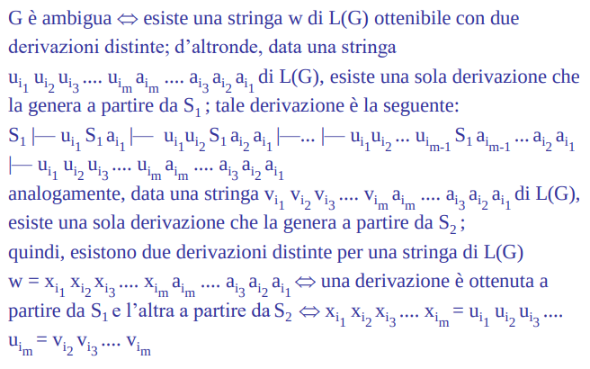

# Riducibilità

Argomenti: Indecidibilità di E, Indecidibilità di EQ, Indecidibilità di HALT
.: No

## Indecidibilità di $\text{HALT}_{TM}$

- `teorema`: Il linguaggio $\text{HALT}_{TM}$ è definito come $\left\{ \left\langle M,w \right\rangle \right\}$ tale che $M$ è una MT e $M$ quando ha in input la stringa $w$, si ferma. Si sfrutta l’indecidibilità di $A_{TM}$ per dimostrare quella di $\text{HALT}_{TM}$ cioè si cerca di mostrare che $A_{TM}$ è riducibile ad $\text{HALT}_{TM}$.
- `dimostrazione`: si suppone che esista una MT $H$ che decide $\text{HALT}_{TM}$, si usa questa macchina per costruire una MT $A$ che decide $A_{TM}$:
    - $A$ esegue $H$ sull’input $\left\langle M,w \right\rangle$
    - se $H$ rifiuta allora $A$ rifiuta, se invece $H$ accetta, allora $A$ simula $M$ fino a quando $M$ si ferma
    - se $M$ accetta, allora $A$ accetta, altrimenti $A$ rifiuta
    - se $H$ decide $\text{HALT}_{TM}$ allora $A$ decide $A_{TM}$, ma $A_{TM}$ è indecidibile quindi si ha un assurdo.

---

## Indecidibilità di $E_{TM}$

- `teorema`: il linguaggio $E_{TM}$ è definito come $\left\{ \left\langle M \right\rangle \right\}$ tale che $M$ è una MT e $L(M)=\empty$.
- `dimostrazione`: sia $M$ una $MT$ e sia $w$ una stringa, non è detto che $w\in L(M)$

Si costruisce una $MT$ $M_{M,w}^1$ che rifiuta tutte le stringhe $x\ne w$ e accetta $w$ se e solo se $w \in L(M)$. Si suppone esiste una $MT$ $E$ che decide $E_{TM}$ e lo si usa per costrure una $MT$ $A$ che decide $A_{TM}$ (si usa $M_{M,w}^1$ per costruire $A$).

$A$ esegue $E$ sull’input $M_{M,w}^1$, se $E$ accetta allora il linguaggio $L(M_{M,w}^1)$ è vuoto cioè $w$ non è accettata da $M$. Se $E$ rifiuta allora il linguaggio $L(M_{M,w}^1)$ non è vuoto, e quindi $L(M_{M,w}^1)=\left\{ w \right\}$ e $w$ è accettata da $M$.

Si ottiene che se $E$ decide $E_{TM}$ allora $A$ decide $A_{TM}$ ma questa è indecidibile quindi si ha un assurdo.

---

## Indecidibilità di $EQ_{TM}$

- `teorema`: il linguaggio $EQ_{TM}$ è definito come $\left\{ \left\langle M_1,M_2 \right\rangle \right\}$ tale che $M_1$ e $M_2$ sono MT e $L(M_1)=L(M_2)$. Sarebbe il problema dell’equivalenza tra 2 MT
- `dimostrazione`: si costruisce una riduzione $f$ da $E_{TM}$ a $EQ_{TM}$ dove data una $M$, $f$ calcola una coppia $\left\langle M,M_1 \right\rangle$ tale che $M_1$ è una macchina che rifiuta qualunque input.

---

## Riduzioni e decidibilità

- `teorema`: se $A\le B$ e $B$ è decidibile questo implica che $A$ è decidibile.
- `dimostrazione`: sia $M$ una MT che decide $B$ ed $f$ una riduzione da $A$ a $B$, si costruisce una MT $N$ che decide $A$ come segue:
    - dato un input $w$, $N$ prima calcola $f(w)$ e poi si esegue $M$ su $f(w)$
    - se $w \in A$ allora $f(w)\in B$, infatti $f$ è una riduzione da $A$ a $B$; quindi $M$ accetta $f(w)$ se e solo se $w \in A$
- per dimostrare che un problema $P$ è decidibile si cerca un problema $Q$ decidibile tale che $P\le Q$
- per dimostrare che un problema $P$ è indecidibile si cerca un problema $Q$ indecidibile tale che $Q\le P$

---

## Indecidibilità di $\text{INCLUSION}_{TM}$

- `teorema`: il linguaggio $\text{INCLUSION}_{TM}$ è definito come $\left\{ \left\langle M_1,M_2 \right\rangle \right\}$ dove $M_1$ ed $M_2$ sono MT e $L(M_1)\sube L(M_2)$
- `dimostrazione`: si dimostra che $A_{TM}$ è riducibile a $\text{INCLUSION}_{TM}$, si definisce quindi la funzione $f(\left\langle M,w \right\rangle)=\left\langle M_1,M_2 \right\rangle$ dove $M_1$ è una MT che riconosce solo $w$ (costruita come un ASF) mentre $M_2=M$

Per decidere che $L(M_1)\sube L(M_2)$ equivale a decidere se $w\in L(M_2)$ perchè $L(M_1)=\left\{ w \right\}$ ma questo equivale a decidere se $M_2=M$ si ferma accettando $w$ oppure no che sappiamo essere indecidibile.

---

## Indecidibilità di $\text{DISJOINTNESS}_{CFG}$

- `teorema`: il linguaggio $\text{DISJOINTNESS}_{CFG}$ è definito come $\left\{ \left\langle G_1,G_2 \right\rangle \right\}$ dove $G_1$ e $G_2$ sono grammatiche $CF$ e $L(G_1)\cap L(G_2)=\empty$
- `dimostrazione`: si cerca una riduzione $\text{PCP}\to_f \text{DISJOINTNESS}_{CFG}$

Si introducono $n$ simboli ausiliari $a_1,a_2,...,a_n$ che vengono utilizzate dalle produzioni delle 2 grammatiche in questo modo: $S_1\to u_ia_i$, $S_1\to u_iS_1a_i$ per $i=1,...,n$. Si dimostra che decidiere se esite una sequenza di indici $i_1,...,i_k$ tale che $u_{i1},u_{i2},...,u_{ik}=v_{i1},v_{i2},...,v_{ik}$ equivale a decidere se $L(G_1)\cap L(G_2)=\empty$.

Secondo la costruzione fatta si osserva che: $L(G_1)=\left\{ u_{i1},u_{i2},..,u_{im},a_{im},..,a_{i2},a_{i1} \right\}$ $\forall m\in \mathbb{N}$ ed $ij \in \left\{ 1,...,n \right\}$ (stessa cosa per $L(G_2)$ solo che al posto di $u$ si mette $v$). Ne segue che $w\in L(G_1)\cap L(G_2)$ se e solo se $w=u_{i1},u_{i2},..,u_{im},a_{i1},a_{i2},..,a_{im}=v_{i1},v_{i2},..,v_{im},a_{i1},a_{i2},..,a_{im}$ quindi quando $u_{i1},u_{i2},..,u_{im}=v_{i1},v_{i2},..,v_{im}$.

Quindi se $L(G_1)\cap L(G_2)=\empty$ allora non esiste una sequenza di indici $i_1,i_2,...,i_k$ tale che $u_{i1},u_{i2},...,u_{ik}=v_{i1},v_{i2},...,v_{ik}$.

---

## Indecidibilità di $\text{AMBIGUITY}_{CFG}$

- `teorema`: il linguaggio $\text{AMBIGUITY}_{CFG}$ è definito come $\left\{ G \right\}$ dove $G$ è una grammatica $CF$ ambigua
- `dimostrazione`: si cerca una riduzione $\text{PCP}\to_f \text{AMBIGUITY}_{CFG}$

$$
S\to S_1|S_2 \\
S_1\to u_ia_i,S_1\to u_iS_1a_i \\
S_2\to v_ia_i,S_2\to v_iS_2a_i
$$

Si definisce la funzione $f(C)=G$, si introducono $n$ simboli ausiliari $a_1,a_2,...,a_n$.

$G$ è la $CFG$ su $\Sigma \cup \left\{ a_1,a_2,...,a_n \right\}$

## $EQ_{TM}$ non è ne Turing-riconoscibile né co-Turing-riconoscibile

- `teorema`: $EQ_{TM}$ non è né Turing-riconoscibile né co-turing-riconoscibile
- `dimostrazione`: dimostriamo che $EQ_{TM}$ non è co-turing riconoscibile costruendo una riduzione $\underline{A}_{TM}\le \underline{EQ}_{TM}$.

In pratica si costruiscono 2 macchine: $M_1$ accetta sempre e $M_2$ esegue $M$ su $w$ e se accetta allora $M_2$ accetta

$M$ accetta $w$ se e solo se $M_1$ e $M_2$ sono equivalenti.
