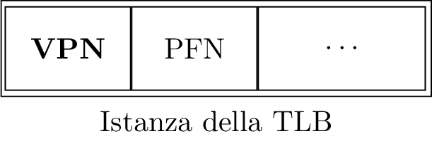
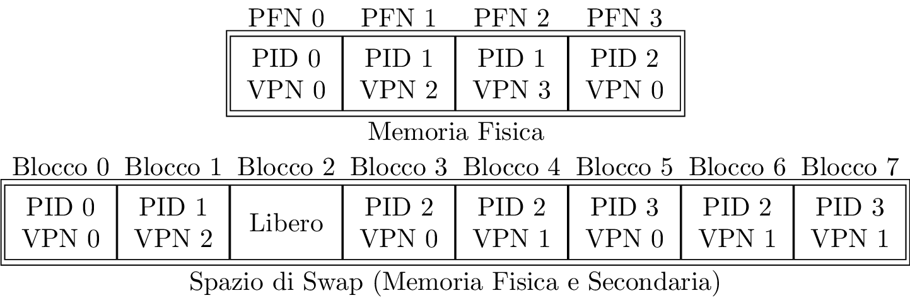

---
author:
- "*Giacomo Sturm*"
date: |
  *Dipartimento di Ingegneria Civile, Informatica e delle Tecnologie Aeronautiche  
  Università degli Studi “Roma Tre"*
title: |
  **Sistemi Operativi**  
  Appunti delle Lezioni di Sistemi Operativi  
  *Anno Accademico: 2024/25*
---

\providecommand{\labelText}[2]{#1}

# Introduzione e Docker

Questo corso anche se copre alcuni dei compiti di un amministratore di sistema, non rappresenta un corso di formazione per quest’ultimi. Si tratterà degli aspetti tipici di un kernel di un moderno sistema operativo, trattando nello specifico un sistema Linux, ma saranno applicabili ad ogni sistema operativo moderno. Sarà quindi necessaria una qualsiasi distribuzione Linux. Si utilizza Linux perché è un sistema gratuito e open-source. Si tratta di uno dei sistemi operativi più usati al mondo, usato nella maggior parte dei supercomputer e tra i web server rappresenta il 96% del primo milione in termini di traffico. Installato sul’85% di tutti gli smartphone e conta 1.6 miliardi di utenti. Una distribuzione Linux, o “distro”, consiste in un sistema operativo basato sul kernel di Linux, insieme a configurazioni predefinite distribuite da organizzazioni. Esistono centinaia, se non migliaia, di distribuzioni di Linux, ognuna con un suo diverso obiettivo e caratteristiche.

Per utilizzare una distribuzione di Linux si usera il programma Docker Desktop, un software di virtualizzazione leggera. In generale sono possibili due modi di simulare un applicazioni native ad un altro sistema operativo. Si può utilizzare una macchina virtuale, che riproduce il sistema operativo da virtualizzare, con tutte le sue librerie, su cui viene eseguita l’applicazione. Tutto questo a sua volta si poggia su un hypervisor per gestire questi sistemi operativi, poggiato a sua volta sul sistema operativo originario della macchina. Questa è una struttura molto profonda e presenta un elevato overhead, causa quindi una perdita di prestazioni.

Negli anni ’10 del 2000 si introdusse un meccanismo per alleggerire questo tipo di virtualizzazione, introducendo il concetto di container. Questi contenitori hanno al loro interno solamente l’applicazione nativa al sistema operativo e le sue librerie, senza simulare l’intero sistema operativo. Questi contenitori poggiano direttamente sul sistema operativo base, accompagnati dal software di docker. Questo processo di virtualizzazione leggera è possibile solo in alcuni casi, su Windows e Mac è possibile infatti una gestione semplificata di applicazioni per Linux in questo modo.

Docker rappresenta il software più utilizzato a livello globale per realizzare una virtualizzazione leggera. Tramite docker è possibile interagire direttamente con l’applicazione, anche se è comunque possibile caricare un sistema operativo diverso, in container Linux.

Docker presenta un’architettura a tre livelli, un client permette l’interfaccia con la macchina host, il docker host dove sono contenute le immagini ed i container. Inoltre è presente un registro online di immagini scaricabili. Un’immagine rappresenta un eseguibile con tutte le librerie al completo come container. Un’immagine rappresenta un’applicazione statica, indipendente da file esterni, ed è possibile realizzare un container basato solamente su quell’immagine. Si utilizzano immagini poiché molte applicazioni richiedono versioni diverse delle stesse librerie e file binari, per cui naturalmente solleveranno conflitti, che si vuole evitare.

Un container contiene un’applicazione eseguita in un ambiente isolato, da un’immagine base e le sue librerie e binari, da cui è possibile creare più di un container diversi. Ogni container può avere un volume, uno spazio su disco dove memorizzare dati e configurazioni indipendenti, in uno spazio isolato dall’immagine, per cui è possibile ricaricare l’immagine senza perdere i dati salvati sul volume. Si usa un volume poiché è buona norma che i container non abbiano uno stato, questo viene associato ad uno o più container specificando un mountpoint, accessibile in lettura o scrittura.

Le immagini sono dei template di sola lettura contenenti il root del filesystem che si vuole istanziare, i meta-dati, le variabili d’ambiente, e le varie configurazioni dell’applicazione che si vuole eseguire. Queste immagini vengono costruite a strati, ognuno di questi può aggiungere, modificare o rimuovere file. Si comincia a creare un’immagine partendo da un contenitore vuoto ed aggiungendo progressivamente nuovi strati l’uno sull’altro. Tutti questi strati sono in sola lettura, solamente l’ultimo strato di default è anche in scrittura, per aggiungere configurazioni o file finali, anche se si preferisce inserirli in un volume con un ciclo di vita isolato.

Utilizzando container, immagini e volume è possibile disaccoppiare tutte le componenti del sistema operativo, le applicazioni ed i dati, rispettivamente.

## Comandi di Docker

La sintassi di Docker venne ripulita ed aggiornata nel 2017, per cui risulta molto semplice ed intuitiva. Il comando principale è il prefisso `docker`, si possono scegliere operazioni sulla gestione di container, immagini o volumi specificando la parola chiave `container`, `image` o `volume`. Dopo di questi si possono inserire tipici comandi come `ls` per visualizzare gli elementi contenuti, rimuoverli con `rm`, etc. Si utilizza anche la parola chiave `network` per gestire la rete di container.

Il comando `help` fornisce una lista di comandi disponibili.

In questo corso si utilizzerà l’immagine, presente nel docker hub, `chmod84/os2425`.

Per creare un container sulla base di questa immagine, bisogna scaricarla con i seguenti comandi:

``` powershell
prompt> docker image pull chmod84/os2425
```

Questo comando di default prende l’ultima versione dell’immagine disponibile, in caso si voglia utilizzare una versione specifica si indica con `:` seguito dal numero di versione oppure `latest`, per l’ultima versione disponibile. Questo tag viene associato dal produttore della versione arbitrariamente, quindi potrebbe non corrispondere all’ultima versione esistente dell’immagine. In seguito per creare ed avviare il container si usa il seguente comando:

``` powershell
prompt> docker container run --name os2425 
        --hostname sistemi-operativi -v dati:/home/corso -it chmod84/os2425
```

Questo comando crea un volume chiamato “dati” nella directory `/home/corso`.

Per avviare o terminare un container si usano i comandi:

``` powershell
prompt> docker container start os2425
prompt> docker container stop os2425
```

Per aggiornare l’immagine bisogna prima rimuovere il vecchio container:

``` powershell
prompt> docker container rm os2425
```

In seguito si effettua una pull della nuova immagine e si crea il container come descritto precedentemente. Per avviare la shell di un container precedentemente avviato si utilizza il seguente comando:

``` powershell
prompt> docker container exec -it os2425 /bin/bash
```

# Introduzione alla Riga di Comando

All’apertura del container docker ci si trova davanti ad una riga di comando del tipo:

``` powershell
corso@sistemi-operativi:~$    
```

Il termina prima della chiocciola indica l’utente con cui si è effettuato l’accesso. La maggior parte dei sistemi operativi moderni infatti sono sviluppati su di una base multiutente. Per cui lo stesso sistema può essere utilizzato da utenti diversi, anche contemporaneamente con una separazione di privilegi, isolando i file appartenenti ai vari profili degli utenti. Si utilizza quindi l’utente `corso`. Mentre il nome dell’host è `sistemi-operativi`, specificato dopo la chiocciola. Un’ulteriore separatore `:` lo separa dai caratteri `~$`. Il primo rappresenta un percorso, descritto successivamente, indica la directory corrente, in questo caso `~` indica la cartella di base dell’utente utilizzato per sfruttare il sistema. Il carattere `$` indica dove viene inserito il comando o l’applicativo sulla riga di comando. Al posto di questo carattere può essere presente un cancelletto `#`, nel caso di livello di privilegio di amministratore.

Quando viene effettuato un comando, viene restituito un output a schermo, ed alla riga successiva, viene riproposto il prompt dei comandi. Non necessariamente tutti i comandi producono un output visivo a schermo.

La maggior parte dei comandi disponibili su Linux dispongono di un’opzione standard che fornisce una piccola guida d’uso per il comando, indicata da `--help`. Se un comando necessita di un argomento, e non viene fornito, attende un input dallo stdin. Questa possibilità è abbastanza utilizzata e comoda nell’esecuzione di comandi “in pipe”.

## Comandi su Directory

Il comando `pwd` “Print Working Directory” stampa a schermo la directory corrente dove si sta lavorando.

``` powershell
corso@sistemi-operativi:~$ pwd
/home/corso
corso@sistemi-operativi:~$    
```

Questo concetto è fondamentale, poiché mostra in quale posizione del filesystem vengono eseguiti i comandi proposti, all’interno del quale vengono effettuate le operazioni, che possono essere di creazione, modifica, rimozione, di file o di altre directory. L’indirizzo fornito si legge da sinistra verso destra, e specifica la root del filesystem `/`, dove si trova la cartella `home`, dove si trova la cartella `corso`, dove ci troviamo attualmente. Il filesystem è un oggetto di estrema complessità, che permette di astrarre in maniera semplice la virtualizzazione dei dati. Questo permette all’utente di interfacciarsi direttamente con l’hardware del calcolatore. Questo sistema organizza i file in cartelle, contenenti altre cartelle, identificate da un percorso o directory, per individuarli in modo univoco. Rappresenta il percorso dalla radice dell’albero al nodo specifico individuato nel filesystem. Le cartelle possono essere espresse equivalentemente sia come `cartella/` che `cartella`, si utilizza `/` dopo il nome della directory per specificare si tratti di una cartella e non di file. Se un nodo ha dei figli, allora si tratta di una cartella, mentre tutti i file sono foglie, ma non tutte le foglie sono file, e non possono essere espressi con uno `/` finale.

Per spostarsi all’interno del filesystem, è disponibile il comando `cd` “Change Directory”, seguito dal percorso:

``` powershell
corso@sistemi-operativi:~$ cd /home
corso@sistemi-operativi:/home$
```

Per ritornare alla directory iniziale è sufficiente effettuare nuovamente un `cd`:

``` powershell
corso@sistemi-operativi:/home$ cd corso
corso@sistemi-operativi:~$
```

Se viene eseguito correttamente, non produce alcune output, mentre se riscontra un errore viene mostrato a schermo.

Esistono essenzialmente due tipi di percorsi, relativi ed assoluti. Si distinguono semplicemente per la presenza di uno `/` iniziale. I percorsi assoluti specificano l’intero percorso nella sua interezza, partendo dalla radice del filesystem, come `/home/corso`. I percorsi che non iniziano con `/` sono percorsi relativi, come `corso`, all’interno di `/home`.

Se si utilizza un percorso assoluto, l’interprete dei comandi ci porta esattamente all’interno di quel percorso, altrimenti l’interprete dei comandi concatena la working directory con il comando relativo inserito, generando il percorso da seguire. Non c’è alcuna differenza nel funzionamento di questi due comandi, poiché viene gestito in modo trasparente dal sistema operativo.

Ogni directory contiene sempre due directory speciali: `.` e `..`, dove `.` indica la directory corrente. Per cui `/home/corso/.` è uguale a `/home/corso`. Sarà molto utile in comandi successivi. La directory `..` rappresenta la directory esattamente superiore nel filesystem. Per cui `/home/corso/..` è uguale a `/home`. Quest’ultima directory ci permette di risalire l’albero del filesystem gradualmente. Viene utilizzata per semplificare il movimento all’interno del filesystem, senza necessariamente conoscere tutti i percorsi possibili alle directory superiori. Anche la radice contiene queste due cartelle, quindi sembrerebbe possibile salire al livello superiore della radice, ma il comando `cd ..` riporta alla radice.

La home directory è dove vengono archiviati tutti i file di un determinato utente, in generale in un sistema Linux, ogni utente ha una sua directory all’interno della directory `/home`, chiamata con il proprio nome utente. Utilizzare nomi differenti è possibile, ma non avviene di default. In ogni posizione del filesystem è possibile utilizzare il comando `cd ~` per spostarsi direttamente nella home directory, ma questo simbolo non è presente nelle tastiere italiane, bisognerebbe utilizzare infatti la combinazione ASCII “Alt+126”. Tuttavia è possibile effettuare la stessa operazione con `cd` senza argomenti.

Per creare delle directory esiste il comando `mkdir` “Make Directory”, seguito dal percorso che si vuole realizzare, indicato con un percorso relativo o assoluto. Tutte le cartelle precedenti all’ultima devono esistere, per permettere di creare la cartella.

``` powershell
corso@sistemi-operativi:~$ mkdir tutorial
corso@sistemi-operativi:~$
```

Equivalente a:

``` powershell
corso@sistemi-operativi:~$ mkdir /home/corso/tutorial
corso@sistemi-operativi:~$
```

Si possono creare più cartelle contemporaneamente aggiungendo un altro percorso separato da spazi:

``` powershell
corso@sistemi-operativi:~$ mkdir dir1 dir2 dir3
corso@sistemi-operativi:~$
```

Esiste un’opzione che si può passare a `mkdir` per creare un intero percorso in una volta sola tramite `-p`:

``` powershell
corso@sistemi-operativi:~$ mkdir -p dir4/dir5/dir6
corso@sistemi-operativi:~$
```

Se questo comando viene chiamato senza argomento, stampa un errore a schermo, poiché richiede un argomento, una cartella da creare. Non si vuole memorizzare il contenuto di tutte le cartelle del filesystem, si utilizza quindi il comando `ls` “List”. Questo comando stampa a schermo la lista di tutti i file o cartelle contenute nella working directory:

``` powershell
corso@sistemi-operativi:~$ ls
tutorial dir1 dir2 dir3 dir4
corso@sistemi-operativi:~$
```

Si può passare come argomento un percorso nel filesystem per vedere i suoi contenuti:

``` powershell
corso@sistemi-operativi:~$ ls dir4
dir5
corso@sistemi-operativi:~$
```

Poiché due percorsi vengono separati da spazi, non sembra possibile poter creare una cartella che abbia un nome contenente spazi, un’opzione è utilizzare un underscore `_` al posto degli spazi nella stringa. Poiché questo gestisce la stringa come una singola parola, se si vogliono mantenere le parole differenti bisogna quindi inserire lo spazio nella stringa passata come argomento. Per poter inserire il carattere corrispondente allo spazio, si può incapsulare la stringa che si vuole utilizzare con singoli o doppi apici:`" ... "` o `' ... '`. Oppure si può utilizzare il carattere `\` seguito dallo spazio: `...\ ...`. Questo si chiama carattere di escape, ed indica che il carattere che viene dopo non deve essere interpretato dall’interprete dei comandi, ma appartiene alla stessa stringa che si sta inserendo. Questo carattere di escape è comune per molti linguaggi di programmazione quando si vogliono inserire caratteri speciali nelle stringhe. In generale se sono contenenti spazi in una stringa, questa viene mostrata tra singoli apici.

## Comandi su File

Oltre a gestire directory, il filesystem gestisce file regolari, ed è possibile crearli e modificarli analogamente alle directory. Il sistema operativo per mostrare a video un’informazione utilizza lo “Standard Output” o stdout, collegata al terminale, in modo da mostrare il risultato di ogni comando. La shell quindi legge il contenuto del file dello stdout e lo mostra a video. Poiché i comandi stampano il loro output su questo file virtuale, è possibile stampare gli output su di un file reale, presente nel filesystem. Utilizzando l’operatore di redirezione `>` invia l’output di un comando ad un file, indicando il suo percorso:

``` powershell
corso@sistemi-operativi:~$ ls > output.txt
corso@sistemi-operativi:~$
```

Se il file non esiste, viene creato all’invocazione del comando:

``` powershell
corso@sistemi-operativi:~$ ls
tutorial dir1 dir2 dir3 dir4 output.txt
corso@sistemi-operativi:~$
```

Si può esplicitare l’estensione del file, ma anche senza l’interprete dei comandi è in grado di creare un file di caratteri ASCII, quindi un file testuale. Per leggere il contenuto di un file quindi è possibile inviare il suo contenuto allo stdout. Uno dei comandi per effettuare questo è `cat`, “Concatenate”. Prende come argomento la lista dei file di cui si vuole stampare il contenuto a schermo, e produce una concatenazione dei contenuti di questi file:

``` powershell
corso@sistemi-operativi:~$ cat output.txt
tutorial 
dir1 
dir2
dir3
dir4
output.txt
corso@sistemi-operativi:~$
```

Se si utilizza il comando `ls` su di un file, questo cerca se esiste il file che stiamo cercando, mostrando il suo nome a schermo:

``` powershell
corso@sistemi-operativi:~$ ls output.txt
output.txt
corso@sistemi-operativi:~$
```

In realtà stampa il percorso relativo che è stato utilizzato come argomento, poiché il file che stiamo cercando si trova nella working directory, il percorso assoluto di questo output è  
`/home/corso/output.txt`.

L’operatore di redirezione rappresenta un modo abbastanza comune per creare file contenenti il risultato di comandi, o programmi articolati. Per creare dei file arbitrari, si può utilizzare il comando `echo`, insieme ad un operatore di redirezione. Questo comando infatti stampa a video quello che gli viene passato come argomento tra doppi apici:

``` powershell
corso@sistemi-operativi:~$ echo "test"
test
corso@sistemi-operativi:~$
```

Tramite l’operatore di redirezione si possono quindi realizzare file arbitrari:

``` powershell
corso@sistemi-operativi:~$ echo "test" > test
corso@sistemi-operativi:~$
```

L’uso esplicito di un estensione, risale agli anni ’80 dove i file venivano differenziati rispetto alla loro estensione, ma i sistemi operativi moderni sono in grado di determinare il contenuto di un file e quindi la sua estensione. Il comando chiamato `file`, seguito dal file di cui si vuole conoscere il tipo:

``` powershell
corso@sistemi-operativi:~$ file output.txt
output.txt: ASCII text
corso@sistemi-operativi:~$ file test
test: ASCII text
corso@sistemi-operativi:~$
```

L’operatore di redirezione, quando viene utilizzato su di un file, ne tronca il contenuto, lo azzera, per poi scrivere quello che viene passato allo stdout, dal primo byte del file. L’operatore di redirezione `>>` effettua la stessa operazione di `>`, ma scrive all’interno del file senza troncarlo, nel suo spazio vuoto, appendendo il contenuto nuovo alla fine:

``` powershell
corso@sistemi-operativi:~$ echo "test" >> output.txt
corso@sistemi-operativi:~$ cat output.txt
tutorial 
dir1 
dir2
dir3
dir4
output.txt
test
corso@sistemi-operativi:~$
```

Se si ha un file contenente un numero elevato di righe o parole, questo non permette di visualizzarlo interamente in una singola schermata. Si può scrollare per visualizzare l’intero file, poiché è contenuto in una finestra grafica che bufferizza tutto quello che succede. Ma per alcune funzioni questo non avviene, quindi si vuole poter determinare le proprietà di un file, senza doverlo visualizzare nella sua integrità. Il comando `less` prende come argomento un percorso, ed alla sua invocazione, trasforma l’interfaccia grafica in un programma di visualizzazione del file, in cui si può scorrere tra le sue righe utilizzando le freccette verso l’alto ed il basso, quando non è disponibile un’interfaccia grafica che permette di scrollare sul file. Questo comando è erede di un altro chiamato `more`, che realizza la stessa operazione in modo più grezzo, con meno funzionalità. Per ritornare alla riga di comando bisogna digitare il tasto `Q`. Questo programma offre un suo prompt, all’ultima riga dell’interfaccia grafica indicato da `:`, dove possono essere eseguite operazione sul file aperto.

Invece di utilizzare il comando `less`, per individuare caratteristiche di un file testuale molto lungo, si può usare il comando `wc`, che dispone di varie opzioni diverse, `-l` viene utilizzata per contare il numero di righe del testo, `-c` per il numero di caratteri e `-w` per il numero di parole, separate da spazi. Queste sono i tre parametri di default del comando senza opzioni aggiuntive, ma sono presenti opzioni aggiuntive per diversi parametri. Il comando prende come argomento il percorso del file e ne restituisce i parametri richiesti.

``` powershell
corso@sistemi-operativi:~$ wc output.txt
 7 7 40 output.txt
corso@sistemi-operativi:~$
```

Il comando `uniq` permette di contare il numero di righe uniche all’interno di un file. Per permettere il funzionamento di questo comando, le righe identiche devono essere adiacenti, quindi il file deve essere ordinato. Si può ordinare un file testuale alfabeticamente tramite il comando `sort`, seguito dal percorso del file.

## Spostamento e Copia di Elementi

Per spostare dei file si utilizza il comando “Move” `mv` seguito da una serie di argomenti, dove l’ultimo rappresenta il percorso dove vengono spostati i file o directory indicate nei precedenti argomenti:

``` powershell
corso@sistemi-operativi:~$ mv output.txt dir1
corso@sistemi-operativi:~$ ls dir1
output.txt
corso@sistemi-operativi:~$
```

Per riportarlo nella directory corrente, si può specificare per intero il percorso di questa, oppure si può utilizzare la directory `.`:

``` powershell
corso@sistemi-operativi:~$ mv dir1/output.txt .
corso@sistemi-operativi:~$ ls 
tutorial dir1 dir2 dir3 dir4 output.txt test
corso@sistemi-operativi:~$
```

Questo rappresenta uno degli utilizzi di queste due cartelle `.` e `..` per scrivere comandi in modo estremamente sintetico. Un modo analogo per effettuare quest’operazione consiste nell’usare `..`:

``` powershell
corso@sistemi-operativi:~$ cd dir1
corso@sistemi-operativi:~/dir1$ mv output.txt ..
corso@sistemi-operativi:~/dir1$ cd
corso@sistemi-operativi:~$ ls 
tutorial dir1 dir2 dir3 dir4 output.txt test
corso@sistemi-operativi:~$
```

Quando si utilizza una sequenza di argomenti per il comando `mv`, tutti gli argomenti eccetto l’ultimo sono gli elementi da spostare, mentre l’ultimo indica la destinazione di questi elementi:

``` powershell
corso@sistemi-operativi:~$ mv output.txt test dir3 dir2
corso@sistemi-operativi:~$ ls dir2
output.txt test dir3
corso@sistemi-operativi:~$
```

Se viene inserito come ultimo elemento un file, produce un errore.

Il comando `cp` “Copy”, copia un file di origine, in un percorso specificato del filesystem:

``` powershell
corso@sistemi-operativi:~$ cp dir2/output.txt .
corso@sistemi-operativi:~$ ls
tutorial dir1 dir2 dir4 output.txt
corso@sistemi-operativi:~$
```

Quando si effettua sulla stessa directory contenente il file origine, bisogna specificare un nuovo nome per questo file, altrimenti si rischierebbe di sovrascriverlo. Si realizza specificando un altro file, che il sistema crea all’invocazione del comando:

``` powershell
corso@sistemi-operativi:~$ cp output.txt output\ copy.txt
corso@sistemi-operativi:~$ ls
tutorial dir1 dir2 dir4 output.txt 'output copy.txt'
corso@sistemi-operativi:~$
```

In una singola operazione quindi è possibile creare una copia di un file in una directory, scegliendo un nome differente. Utilizzando il comando `mv` è possibile rinominare un file, specificando come ultimo argomento il suo nuovo nome:

``` powershell
corso@sistemi-operativi:~$ mv dir2/test dir2/test2
corso@sistemi-operativi:~$ ls dir2
output.txt test2 dir3
corso@sistemi-operativi:~$
```

Quindi se l’ultimo argomento è un file, il comando non può supportare una lista di elementi da spostare. É possibile rinominare allo stesso modo una cartella, mantenendo gli elementi contenuti:

``` powershell
corso@sistemi-operativi:~$ mv dir2 dirX
corso@sistemi-operativi:~$ ls dirX
output.txt test2 dir3
corso@sistemi-operativi:~$ mv dirX dir2
corso@sistemi-operativi:~$ ls dir2
output.txt test2 dir3
corso@sistemi-operativi:~$
```

Per rimuovere file, o cartelle in certe condizioni, si può utilizzare il comando “Remove” `rm`, seguito dal percorso dove si trova l’elemento da eliminare:

``` powershell
corso@sistemi-operativi:~$ rm dir2/test2
corso@sistemi-operativi:~$ ls dir2
output.txt dir3
corso@sistemi-operativi:~$
```

Questo comando non richiede conferme, quindi non è possibile correggere l’errore, come è possibile in sistemi operativi analoghi a Windows, dove è disponibile una cartella “Cestino” dove sono contenuti gli elementi eliminati. Per rimuovere le directory invece si può utilizzare il comando `rmdir`, “Remove Directory”:

``` powershell
corso@sistemi-operativi:~$ rmdir dir1
corso@sistemi-operativi:~$ ls
tutorial dir2 dir4 output.txt 'output copy.txt'
corso@sistemi-operativi:~$
```

Tuttavia questo non può essere effettuato per directory non vuote:

``` powershell
corso@sistemi-operativi:~$ rmdir dir2
rmdir: failed to remove 'dir2': Directory not empty 
corso@sistemi-operativi:~$
```

Allora per rimuovere questa cartella, si potrebbero rimuovere manualmente tutti i suoi file, risalendo fino a `dir2`. Esiste un’opzione che semplifica questo procedimento, effettuando una rimozione ricorsiva, rimuovendo tutti gli elementi contenuti all’interno del percorso specificato, prima di rimuovere gli elementi superiori. Quest’opzione di `rm` scende fino alle foglie, dato il percorso specificato, e le rimuovere, risalendo nell’albero fino a quando non è in grado di rimuovere tutto il percorso passato come argomento.

Quest’opzione da passare al comando è `-r`, per indicare di effettuare il comando ricorsivamente sul percorso specificato. Questi tipi di opzioni sono estremamente utili nel cambiare il comportamento dei comandi per effettuar precise operazioni, e ne esistono di svariate per tutti i comandi disponibili sul prompt. Si possono abbinare contemporaneamente più di un’opzione, e invece di inserirle singolarmente dopo ogni `-` si possono unire in una singola opzione. Si considera l’esempio della rimozione ricorsiva, su cui vuole essere associata anche l’opzione `-v`, che abilita un livello di verbosità maggiore sulla sua esecuzione:

``` powershell
corso@sistemi-operativi:~$ rm -rv dir2
removed: 'output.txt'
removed directory: 'dir2/dir3'
removed directory: 'dir2'
corso@sistemi-operativi:~$
```

L’opzione `-v` è comune a molti comandi, ma bisogna verificare per ogni sistema se si tratta dell’opzione richiesta. Per operazioni di rimozione, nei sistemi operativi moderni esiste un oggetto comunemente chiamato “Cestino”, dove vengono spostati gli elementi assegnati come rimossi, per evitare di eliminare accidentalmente file importanti per errore. L’operazione di rimozione non arriva fino al livello hardware dove vengono modificati direttamente i suoi valori contenuti, ma viene effettuata un’operazione di “unlink”, in modo che il filesystem li ritenga liberi. Vengono considerati liberi, anche se occupati da dati concreti, poiché questi dati sono stati rimossi dal sistema, e quindi il filesystem non ne deve più tenere traccia, si rimuovere il loro riferimento. Questo tipo di rimozione è quindi molto più veloce che una scrittura sull’intera zona di memoria dove erano salvati gli elementi. A volte è possibile recuperare file andati cancellati, poiché questi sono stati cancellati solamente tramite un unlink. E se quella zona nel disco non è stata sovrascritta allora è possibile risalire ai dati cancellati, ma non è possibile determinare quando quella zona sul disco venga utilizzata.

Anche il comando `rm` può prendere come argomenti una sequenza, di percorsi da dover eliminare. Con i privilegi di utente, è possibile cancellare file solamente nella home directory dell’utente.

## Espressioni Regolari

Generalmente si vuole trovare il modo più efficiente e semplice per scrivere comandi sul prompt, abbreviando i comandi utilizzando caratteri speciali ed espressioni regolari. I caratteri speciali `*` e `?` vengono utilizzati per ridurre la quantità di testo da scrivere per un singolo comando. Se si aggiunge il carattere `*` alla fine di una stringa, questo corrisponde a tutte le stringhe che hanno la stringa indicata come prefisso. Inversamente se viene una stringa viene posta dopo l’asterisco, questo corrisponde a tutte le stringhe che hanno la stringa indicata come suffisso. Se una stringa viene incapsulata da due asterischi, corrisponde a tutte le stringhe che contengono al loro interno la stringa utilizzata.

Il carattere speciale `?` appartiene alla stessa famiglia, ma mentre `*` corrisponde ad una sequenza qualunque di caratteri, `?` corrisponde ad un singolo carattere. Può essere posizionato analogamente al carattere `*`. Entrambi i caratteri possono apparire in posizioni arbitrarie di una stringa.

Se in una directory sono presenti file aventi una parte del nome uguale, è possibile utilizzare questi caratteri speciali per effettuare un comando su tutti questi elementi, senza doverli specificare tutti. A volte infatti è necessario operare su un numero molto elevato di elementi, con minime variazioni nei loro nomi, per cui sarebbe molto poco efficiente scrivere singolarmente tutti i loro nomi in un comando. Inoltre aumenta la comprensione del comando in modo da poter individuare con immediatezza gli elementi di considerati.

## Comandi in Pipe

Quando un comando viene invocato, i suoi argomenti provengono dallo stdin, ed è possibile che il programma scriva su due flussi di dati, stdout e stderr. Si vedono entrambi indipendentemente a schermo, per cui non è possibile distinguerli. Questa suddivisione è comoda per isolare cosa viene scritto su entrambe le parti. L’operatore di redirezione agisce esclusivamente sullo stdout. Esiste un altro operatore di redirezione che agisce sullo stderr. Di default ha lo stesso comportamento dello stdout, il suo contenuto viene mostrato a schermo. Si possono separare con due operatori di redirezione per impedire che convergano. Si vorrebbe inviare il risultato di un comando all’input di un altro programma. I comandi in Linux sono strutturati con la possibilità di non inserire l’argomento per poter realizzare catene di comandi in pipe, dove il risultato di uno viene inserito nello stdout e rappresenta l’input di un altro. Questo viene effettuato tramite l’operatore di pipe ``\|.

# Virtualizzazione del Processore: Esecuzione Diretta Limitata

Quando un programma viene eseguito segue sempre una serie di passaggi, comuni per ogni programma in esecuzione su un processore, chiamato ciclo di fetch-decode-execute, analizzato dettagliatamente nel corso di calcolatori elettronici:

- Fetch: il processore preleva l’istruzione da eseguire dal programma;

- Decode: l’istruzione viene trasformata in una o più istruzioni macchina (in base al tipo di architettura del processore);

- Execute: l’istruzione macchina viene effettuata dal processore;

- Il processore aumenta il PC e passa alla prossima istruzione.

Questo sistema si basa sul modello di Von Neumann, ma le prestazioni e le aspettative per calcolatori moderni sono molto maggiori di questo, una sostanziale differenza per le macchine moderne è la capacità di eseguire più di un programma in simultanea.

Il sistema operativo è ciò che permette ai calcolatori moderni di poter effettuare queste esecuzioni simultanee, quindi si trova responsabile della gestione di tutti i programmi in esecuzione su una macchina. Ha il compito di rendere semplice l’esecuzione di un programma, permettendogli di condividere memoria con tutti gli altri processi in esecuzione, e permettergli di interagire con periferiche o dispositivi di I/O. Il compito del sistema operativo consiste nell’effettuare queste operazioni efficientemente e velocemente.

## Sistema Operativo come Gestore di Risorse

Il sistema operativo effettua un’operazione di virtualizzazione, trasformando le componenti fisiche del calcolatore in una forma virtuale, indipendentemente, in modo che questi programmi siano in grado di interagirci. Ha la funzione di connettere questi programmi e l’hardware dove vengono eseguiti. Le risorse fisiche sono il processore, la memoria condivisa, il disco, le periferiche, ed altri dispositivi connessi. Questa forma virtuale è quindi più accessibile ai programmi e di più facile uso e generale. A volte quindi ci si può riferire al sistema operativo come una macchina virtuale, capace di creare versioni virtuali dei componenti del calcolatore.

Queste funzionalità introdotte dal sistema operativo possono venire invocate da parte di un qualsiasi programma, ma non è detto che a questo venga permesso di effettuare tutte le operazioni offerte. Tratteremo questo concetto nella sezione sui processi. Ai programmi sono disponibili delle chiamate di sistema, invocazioni di funzioni specifiche offerte dal sistema operativo sulle componenti virtuali, in modo che questo posso interfacciarsi direttamente con l’hardware, agendo come un intermediario per i programmi. In generale il sistema operativo offre delle librerie standard o API per potersi interfacciare con le chiamate di sistema. Queste chiamate di sistema consistono nell’eseguire programmi, accedere alla memoria e dispositivi di I/O, tra le più comuni ed utilizzate, ma in generale fornisce sulle centinaia di chiamate di sistema.

Il sistema operativo si comporta come un gestore di risorse, come il processore, la memoria ed il disco. Si definisce gestore poiché sceglie come condividere il processore a tutti i processi in esecuzione, contemporaneamente in accesso alla stessa memoria, ed allo stesso disco e periferiche.

Un calcolatore moderno dispone di un certo numero di processori fisici, o virtuali. Contengono una decina di core fisici, ma una macchina server potrebbe disporre di decine di core sparsi su più processori. Generalmente il numero di programmi in esecuzione è molto maggiore del numero di core o processori disponibili dalla macchina. Il sistema operativo è quindi in grado di fornire l’illusione di avere un numero molto elevato di core, per ciascuno dei processi in esecuzione, grazie alla virtualizzazione delle risorse.

Si considera un semplice esempio fornito dal docente nel file `cpu.c`:

``` c
  #include <stdio.h>
  #include <stdlib.h>
  #include <sys/time.h>
  #include <assert.h>
  #include "common.h"

  int
  main(int argc, char *argv[]){
    if (argc != 2) {
      fprintf(stderr, "usage: cpu <string>\n");
      exit(1);
    }
    char *str = argv[1];
    while (1) {
      Spin(1); // Repeatedly checks the time and
      returns once it has run for a second
      printf("%s\n", str);
    }
    return 0;
  }
```

Questo programma prende come argomento una stringa di caratteri e ripete costantemente dopo ogni secondo il primo carattere della stringa. Si può terminare con la combinazione di tasti “Control + C”. Dopo aver compilato in un file binario il codice, per eseguirlo si indica il suo indirizzo relativo, ed il sistema operativo automaticamente lo interpreta come un programma da eseguire, quindi non rappresenta un comando per eseguire direttamente il programma:

``` powershell
corso@sistemi-operativi:~$ gcc -o cpu cpu.c 
corso@sistemi-operativi:~$ ./cpu "A"
```

Inoltre si possono eseguire più di un programma contemporaneamente combinando i comandi con un `&`:

``` powershell
corso@sistemi-operativi:~$ ./cpu "A" & ./cpu "B" & ./cpu "C" & ./cpu "D"
```

Tutti questi processi sembrano essere eseguiti allo stesso tempo, si definisce processo un programma in esecuzione, ma l’ordine in cui vengono effettuate le istruzioni di ogni programma non è costante.

La memoria fisica è composta da un array di byte, ed un programma mantiene tutte le sue informazioni su strutture di dati in memoria. Divise in memoria in scrittura (store), specifica i dati da scrivere al dato indirizzo, e lettura (load), specificando l’indirizzo per accedere ai dati.

Si utilizza un altro programma offerto dal docente per poter analizzare il comportamento della memoria virtuale, chiamato `mem.c`:

``` c
    #include <unistd.h>
    #include <stdio.h>
    #include <stdlib.h>
    #include "common.h"

    int main(int argc, char *argv[]) {
        int *p = malloc(sizeof(int)); // a1: allocate some memory
        assert(p != NULL);
        printf("(%d) address of p: %08x\n",
        getpid(), (unsigned) p); // a2: print out the address of the memory
        *p = 0; // a3: put zero into the first slot of the memory
        while (1) {
            Spin(1);
            *p = *p + 1;
            printf("(%d) p: %d\n", getpid(), *p); // a4
        }
        return 0;
    }
```

Ogni istanza del programma alloca memoria allo stesso indirizzo, e sembra aggiornare i valori allo stesso indirizzo, indipendentemente.

Eseguendo più istanze di questo programma si rivela come ogni istanza del programma abbia una sua memoria virtuale dedicata, in realtà è il sistema operativo che mappa tra questi spazi di indirizzi virtuali e la memoria fisica. In questo modo si evitano interferenze tra processi, proteggendo la stabilità e sicurezza tra i vari processi.

Questi programmi vengono eseguiti essenzialmente in contemporanea, per cui il sistema operativo deve gestire il processore per fornire l’illusione che tutti questi programmi vengono eseguiti allo stesso tempo. Questo si chiama problema della concorrenza. Programmi moderni esacerbano questo necessitando di più thread, necessitando di più core virtuali.

Si considera il seguente codice:

``` c
    #include <stdio.h>
    #include <stdlib.h>
        #include <pthread.h>

    static volatile int counter = 0;
    int loops;

        void *worker(void *arg) {
            for (int i = 0; i < loops; i++)
                counter = counter + 1;
            return NULL;
    }
    int main(int argc, char *argv[]) {
            if (argc != 2) {
                fprintf(stderr, "usage: threads<value>\n");
                exit(1);
            }
            loops = atoi(argv[1]);
            pthread_t p1, p2;
            printf("Initial value : %d\n", counter);

            pthread_create(&p1, NULL, worker, NULL);
            pthread_create(&p2, NULL, worker, NULL);
            pthread_join(p1, NULL);
            pthread_join(p2, NULL);
            printf("Final value : %d\n", counter);
            return 0;
        }
```

Questo programma utilizza due threads per modificare una variabile condivisa, incrementandone il valore da zero ad ogni ciclo. Per un numero di cicli relativamente piccolo, il valore restituito da questo programma rappresenta esattamente il doppio del valore inserito come argomento. Ma per numeri più elevati di cicli di loop, il valore tende a cambiare rispetto al valore atteso. Il problema dipende dal modo in cui viene incrementato il contatore condiviso. L’incremento del contatore non corrisponde ad un’istruzione atomica, ma è composta da tre operazioni distinte, la lettura ed il carico del valore attuale su un registro, l’incremento, ed il trasferimento in memoria. Queste tre operazioni non vengono eseguite atomicamente, da cui sorge il problema della concorrenza. Se due thread eseguono quest’operazione simultaneamente allora, è possibile che uno di questi legga il valore che l’altro ancora non ha avuto tempo di trasferire in memoria prima dell’incremento. Questo fenomeno è noto come condizione di gara, dove il risultato dipende dall’ordine in cui i thread accedono alle risorse condivise. Per risolvere questi problemi possono introdurre meccanismi di lock o di blocco, per sincronizzare i due thread, in modo che solo unthread alla volta sia in grado di accedere alla risorsa condivisa.

Quando si utilizzano questi meccanismi evitare di utilizzarli in modo improprio, altrimenti è possibile che sorgano altri problemi di deadlock, dove i thread aspettano all’infinito lo sblocco di una risorsa condivisa.

Dispositivi di memoria condivisa come DRAM memorizzano i dati in modo voltatile, per l’esecuzione dei programmi. Ovvero perdono i valori memorizzati quando il sistema viene spento. Quindi si ha la necessità di memorizzare di dati in maniera persistente grazie a sistemi hardware e software. I sistemi utilizzano sistemi I/O come dischi a stato solido (SSD) o dischi rigidi (HDD), non volatile. Dal punto di vista del software invece, per la persistenza il filesystem gestisce il disco ed è responsabile per memorizzare tutti i file che verranno creati dall’utente. Questo gestore alloca lo spazio necessario sul disco per il file, organizza i suoi dati in modo da essere disponibile in futuro, e corregge e gestisce eventuali errori che potrebbero verificarsi nel processo di scrittura.

Si considera il seguente codice per la creazione di un file con scritto “Hello World” alla directory `/tmp/file` del container Linux:

``` c
    #include <stdio.h>
    #include <unistd.h>
    #include <assert.h>
    #include <fcntl.h>
    #include <sys/types.h>

    int main(int argc, char *argv[]) {
        int fd = open("/tmp/file", O_WRONLY | O_CREAT| O_TRUNC, S_IRWXU);
        assert(fd > -1);
        int rc = write(fd, "hello world\n", 13);
        assert(rc == 13);
        close(fd);
        return 0;
    }
```

Le funzioni `open()`, `write()` e `close()` vengono indirizzate alla parte del sistema operativo chiamato filesystem che gestisce questo tipo di richieste.

Questa parte del sistema operativo si occupa di strati aggiuntivi di astrazione come dischi RAID, gestori di volumi logici, etc. Trova una posizione sul disco dove i nuovi dati risiederanno. Infine invia richieste di I/O ai dispositivi di memoria specifici. Il filesystem si occupa degli errori in scrittura che possono sorgere durante la scrittura su disco o guasti ai dispositivi. Utilizza due diversi meccanismi il “journaling” o “copy-on-write”, e gestendo ed ordinando file in maniera efficiente sul disco. La tecnica di journaling consiste nel mantenere un registro di tutte le operazioni di scrittura, così da essere in modo ci completarle o ripristinare lo stato in caso di guasti al sistema. La tecnica di copy-on-write invece consiste nella creazione di una copia, invece di sovrascriverli alla modifica dei dati. In questo modo si evitano corruzioni dei dati durante la scrittura, nella nuova posizione.

## Processi

Un processo viene definito come un qualsiasi programma in esecuzione, dove un programma è un agglomerato di istruzioni isolati su una zona di memoria secondaria. Il sistema operativo ha il compito di caricare questo programma ed eseguirlo.

Per dare l’illusione di un’esecuzione simultanea di molti processi, il sistema operativo assegna ad ogni processo un quanto di tempo per cui quel processo può essere eseguito dal processore. Questi processi in esecuzione vengono poi interrotti tramite dei segnali di interrupt, ed il sistema operativo assegna il prossimo processo in coda ad essere eseguito. Il sistema operativo quindi genera una coda di processi da essere eseguiti in base in base a politiche diverse, trattate successivamente nella sezione dedicata allo scheduling. Questo processo di condivisione del tempo si chiama “time sharing”.

L’operazione di terminare preventivamente l’esecuzione di un processo per poi passare ad eseguirne un altro si chiama “context switching”. Questo fornisce l’illusione di avere molti processori virtuali dedicati ad ogni processo. Ma avere molti processi in esecuzione comporta quanti di tempo di lunghezza minore, assegnati a ciascun processo. Con un numero infinito di processi infatti, i quanti di tempo sarebbero di tempo infinitesimo, ed il sistema operativo sarebbe costantemente occupato ad effettuare l’operazione di context switching.

Quest’operazione viene effettuata dal sistema operativo indipendentemente dall’utente, la politica di gestione è salvata in un file sorgente specifico, non accessibile all’utente.

In generale un processo può essere caratterizzato dal suo stato di esecuzione, tutto ciò che questo può leggere o scrivere in esecuzione. È caratterizzato dal suo spazio di memoria assegnatoli in memoria centrale, contenente le sue istruzioni ed i suoi dati, e nei registri della CPU durante la sua esecuzione. Questi rappresentano essenzialmente un’estensione della RAM disponibile al processore. Memorizzano l’indirizzo della prossima istruzione da eseguire, il “Program Counter” (PC), e l’indirizzo dello stack, lo “Stack Pointer” (SP), associato a questa esecuzione del programma, i più importanti.

Il sistema operativo controlla il ciclo di vita dei processi, gestendo una serie di funzioni, disponibili attraverso l’API, “Application Programming Interface” dei processi:

- Create: crea un nuovo programma, caricandolo dal disco ed allocando le risorse necessarie;

- Destroy: interrompe l’esecuzione di un processo, attraverso una GUI, oppure con un comando “kill” o “kill all”. Questo processo non danneggia l’applicazione;

- Wait: mette in pausa l’esecuzione di un processo fino a quando non avviene un evento specifico;

- Miscellaneous Control: offre metodi vari per la sospendere l’esecuzione di un processo per poi riprenderla in seguito. È compreso nei meccanismi di time-sharing per permettere l’esecuzione degli altri processi in coda;

- Status: permette di ottenere informazioni riguardo il processo attuale.

### Creazione di un Processo

Per effettuare un’operazione di creazione il sistema operativo effettua una serie di operazioni. Durante l’operazioni di “Load” alloca lo spazio in memoria centrale per accomodare il programma. In seguito il programma, memorizzato sulla memoria secondaria in formato eseguibile, e viene trasferito in maniera “lazy”, pigra. Non viene trasferita la sua integrità, ma solo le istruzioni strettamente necessarie all’esecuzione del programma, e vengono trasferite ulteriori istruzioni quando vengono richieste da altre istruzioni nel processo in esecuzione. Nell’operazione di “Stack Allocation” alloca lo stack di esecuzione del programma, utilizzato per memorizzare le variabili locali, parametri di funzioni e indirizzi di ritorno. Inizializzato con gli argomenti passati alla funzione `main` nel programma, come `argc`, numero degli argomenti passati, e l’array degli stessi `argv`.

Nell’operazione di “Heap Creation” viene realizzato lo spazio di heap dove vengono contenuti i dati salvati durante l’esecuzione del programma, tramite operazioni di `malloc()`, richiedendo esplicitamente lo spazio. Questo viene poi liberato esplicitamente dal programma con un’operazione di `free()`, altrimenti viene liberato al termine della sua esecuzione.

“Initialize”: vengono inizializzati i tre descrittori di default per il programma, lo stdin, standard input; lo stdout, standard output; e lo stderr, standard errore. Canali attraverso cui il processo è in grado di comunicare con l’ambiente esterno tramite meccanismi di I/O, oppure notificare il sistema operativo di eventuali errori.

Alla fine di questo meccanismo di creazione, il sistema operativo trasferisce il controllo della CPU al processo, iniziando dalla prima istruzione dopo la funzione `main()`, punto di ingresso in molti linguaggi di programmazione.

### Divisione in Stati

Un processo può esser in tre stadi distinti durante la sua esecuzione. Il sistema operativo gestisce la transizione tra questi stati e garantisce che i processi vengano eseguiti correttamente, in modo efficiente.

- Running: il processo è in esecuzione, ovvero ha il controllo del processore ed esegue le sue istruzioni;

- Ready: il processo è pronto per essere eseguito , ma il sistema operativo non l’ha scelto e quindi aspetta il suo turno nella coda;

- Blocked: il processo è bloccato, perché ha richiesto delle operazioni ad alcuni dispositivi connessi al calcolatore. Impedisce che il processore rimanga occupato da un processo che non può effettivamente eseguire istruzioni.

In realtà sono presenti molti più stadi per lo stato di un processo, ma questa rappresenta una buona approssimazione.

Un processo pronto può essere schedulato per essere eseguito, oppure è possibile de-schedulato un processo in esecuzione per renderlo pronto. Un processo in esecuzione quando richiede accesso a memoria o a dispositivi di I/O viene bloccato, e poi sbloccato quando finisce questa operazione, diventando pronto per riprendere la sua esecuzione.

Con questi stati quindi i thread di esecuzione dei vari processi vengono intrecciati tra di loro ed il processore è sempre in esecuzione di un processo in ogni quanto di tempo. Per organizzare i dati necessari a gestire questi processi il sistema operativo utilizza strutture dati apposite, per memorizzare lo stack di esecuzione dei processi.

Si considera una di queste strutture dati:

``` c
// the registers xv6 will save and restore
// to stop and subsequently restart a process
struct context {
    int eip; // Instruction pointer register
    int esp; // Stack pointer register
    int ebx; // Called the base register
    int ecx; // Called the counter register
    int edx; // Called the data register
    int esi; // Source index register
    int edi; // Destination index register
    int ebp; // Stack base pointer register
};
// the different states a process can be in
enum proc_state { UNUSED, EMBRYO, SLEEPING,
RUNNABLE, RUNNING, ZOMBIE };

// the information xv6 tracks about each process
// including its register context and state
struct proc {
    char *mem; // Start of process memory
    uint sz; // Size of process memory
    char *kstack; // Bottom of kernel stack
    // for this process
    enum proc_state state; // Process state
    int pid; // Process ID
    struct proc *parent; // Parent process
    void *chan; // If non-zero, sleeping on chan
    int killed; // If non-zero, has been killed
    struct file *ofile[NOFILE]; // Open files
    struct inode *cwd; // Current directory
    struct context context; // Switch here to run process
    struct trapframe *tf; // Trap frame for the
    // current interrupt
};
```

Questo codice mostra come il sistema `xv6` traccia e gestisce i vari processi ed i registri per l’esecuzione dei vari processi. L’informazione relativa ai vari processi viene salvata nella struttura di tipo `proc`. Queste informazioni permettono di eseguire, terminare o riprendere l’esecuzione di un processo. Fornisce informazioni sulla memoria utilizzata dal processo, i registri utilizzati, il suo stato, i file aperti e la directory corrente, il puntatore al processore genitore.

### User e Kernel Mode

Il sistema operativo deve effettuare queste operazioni di time sharing efficientemente. Quindi bisogna minimizzare il tempo tra la fine di un processo e l’inizio del successivo. In questo modo si minimizza l’overhead. Oltre a risolvere questo problema di overhead, il sistema operativo deve riprendere il controllo dopo che il quanto di tempo assegnato a quel processo esaurisce, altrimenti potrebbe essere eseguito ininterrottamente, senza liberare le sue risorse. Inoltre se non mantiene il controllo del processore, un processo maligno potrebbe effettuare operazioni non autorizzate e mettere a rischio il calcolatore. Il sistema operativo deve essere in grado di poter effettuare controlli di sicurezza per verificare se un dato processo sia autorizzato a compiere una certa azione.

Per risolvere il problema delle prestazioni, il processo non viene eseguito attraverso il sistema operativo, come fosse un tramite, ma viene eseguito direttamente sul processore. Questa tecnica si chiama esecuzione diretta, senza passare un livello intermedio di emulazione o interpretazione. In questo modo si riduce al minimo l’intervento del sistema operativo durante l’esecuzione. Se il sistema operativo non mantenesse il controllo sarebbe ridotto ad una semplice libreria, per svolgere funzioni importanti dei vari processi, senza poter gestire le varie risorse. Ma se il processo viene eseguito direttamente sul processore, allora il sistema operativo non può essere eseguito per mantenere il controllo, e se il processo richiede un’operazione non consentita, il sistema operativo non ha modo di impedirglielo.

La soluzione per risolvere l’esecuzione di operazioni proibite consiste nell’avere due modalità di esecuzioni diverse, una per l’utente e l’altra per il sistema operativo. Nello spazio o modalità utente, i processi non hanno accesso a tutte le risorse hardware del calcolatore, mentre nella modalità kernel, il sistema operativo può utilizzare tutte le risorse della macchina. Le chiamate di sistema permettono ai processi di interfacciarsi con lo spazio kernel del sistema.

Nello spazio utente i processi vengono eseguiti con accesso limitato alle risorse dell’hardware, mentre le operazioni critiche come accessi in memoria, o a dispositivi di I/O non sono permesse direttamente. Nella modalità kernel ha pieno accesso a tutte le risorse del calcolatore, inclusi hardware e memoria. In questa modalità il sistema operativo esegue le operazioni richieste dai processi nello spazio utente, in questo modo gli permette di effettuare controlli di sicurezza su queste operazioni.

In generale per distinguere tra queste due modalità, è presente un flag in un registro del processore per segnalare in quale modalità ci si trova. In questo modo il processore può rifiutare le istruzioni ristrette in base al valore di questo flag. In pratica abilita il set completo delle istruzioni del kernel.

### Chiamate di Sistema

Si utilizzano le chiamate di sistema, interfaccia sicura e standardizzata per permettere ai processi di accedere a risorse di sistema o servizi critici. Permettono di eseguire operazioni come accedere al filesystem, creare o distruggere processi, comunicare con altri processi o allocare memoria. Per eseguire una chiamata di sistema il processo invoca una speciale istruzione di “trap”, che effettua insieme un salto nel kernel, ed un aumento del livello di privilegio alla modalità kernel. Viene realizzata al livello del processore, come un’operazione di salto alla prima istruzione della chiamata di sistema nel kernel. Il controllo allora passa al sistema operativo, all’interno del kernel, e viene modificato il PC.

Dopo aver eseguito l’operazione richiesta dall’utente, per restituire il controllo al processo, viene invocata una chiamata “return-from-trap”, ritorna all’istruzione subito seguente dalla chiamata di sistema nel programma e diminuisce il livello di privilegio allo spaio utente.

Ma bisogna impedire di effettuare salti arbitrari dentro al kernel, questo permetterebbe l’esecuzione di codice arbitrario all’interno del kernel, il quale potrebbe essere molto dannoso in caso sia presente un processo maligno o contenente errori o bug. Per questo al tempo di avvio del calcolatore viene generata una tabella chiamata “trap table” contenente l’indirizzo della prima istruzione di ogni chiamata di sistema, numerandole. In questo modo si può eseguire il codice del kernel in modo sicuro e solamente in punti predefiniti, riducendo il rischio di un’esecuzione dannosa di istruzioni nel kernel. Questa chiamate di sistema rappresentano l’unica un’interfaccia o API tra il processo nello spazio utente e le istruzioni del nello spazio del kernel. Tramite la trap table. A livello di hardware viene impostato su un registro l’indirizzo del gestore delle chiamate di sistema.

### Ciclo di Vita di un Processo

All’avvio di un programma viene creata un’entità processo da parte del sistema operativo, per allocare la memoria, ad una struttura dati del processo di tipo `proc`. Il codice del programma viene poi trasferito in memoria centrale, dal disco, in maniera lazy, ovvero trasferendo solamente il codice strettamente necessario, e successivamente si trasferisce solo il codice che viene utilizzato. Inoltre si realizza lo stack e l’heap dell’applicazione, e si realizza il doppio puntatore a caratteri argv, per gestire gli input per il processo. Si inserisce nello stack del kernel il registro ed il PC per tenere conto del processo in esecuzione, e tiene conto delle chiamate di sistema e dei loro argomenti per effettuare system call.

Alla fine di questo operazioni bisogna passare il controllo al programma appena avviato, utilizzando una chiamata “return from trap”, e bisogna specificare la prima istruzione da eseguire. L’hardware conosce l’indirizzo di memoria base dello stack che contiene il valore dei registri da inizializzare per avviare il processo. Dopo aver popolato i registri ed il PC, cambia la modalità di funzionamento allo spazio utente e salta alla prima istruzione nel metodo main.

Ora il programma in esecuzione segue le istruzioni sequenzialmente, ed eventualmente deve eseguire delle chiamate di sistema, quindi invoca una funzione di trap per saltare al livello spazio kernel, ma bisogna salvare i valori del processo nello spazio riservato nel kernel. Questo salvataggio viene effettuato in modo completamente autonomo da parte dell’hardware prima di cedere il controllo al kernel. Dopo averli salvati si eleva il livello di privilegi e si salta alla prima istruzione del gestore della trap, eseguito dal punto di vista del kernel, si eseguono le istruzioni della chiamata di sistema, e si effettua una istruzione return from trap. Il processore rimuove i valori salvati nello stack del kernel e si sposta allo spazio utente. Inoltre salta all’istruzione indicata dal PC dopo la chiamata trap.

Alla terminazione del processo non bisogna salvare i suoi valori poiché non avrà modo di effettuare altre chiamate di sistema, quindi l’hardware non svolge nessuna operazione. Il kernel quindi svuota svuota l’area di memoria assegnata al processo e lo rimuove dalla struttura dati utilizzata per contenere la lista dei processi.

### Gestione Efficiente dei Processi

Il sistema operativo ha come obiettivo la ricerca di prestazioni più alte possibili, bisogna quindi evitare di inserire livelli in più tra il processo al processore, per impedire rallentamenti nell’esecuzione del processo. Ma allo stesso tempo si vuole mantenere il controllo del processore da parte del sistema operativo. Data la modalità descritta precedentemente il processo restituisce il controllo al sistema operativo dopo una chiamata di sistema, quindi il processore mentre l’esecuzione del processo non sta eseguendo il sistema operativo. Questo rappresenta quindi un problema, poiché un processo malevolo potrebbe non effettuare mai chiamate di sistema, quindi non restituisce mai il controllo al sistema operativo e viene bloccata l’esecuzione del sistema operativo. Questo può essere realizzato facilmente tramite un ciclo infinito. Non necessariamente però dipende da una programmazione malevola, potrebbe essere causata ad un errore o bug nel programma.

Quindi è necessario cambiare l’approccio per riguadagnare il controllo del processore dal sistema operativo. Si definiscono quindi due approcci, uno cooperativo, l’altro non cooperativo. Il primo approccio consiste nella modalità precedente, dove il sistema operativo aspetta una chiamata di sistema per riprendere il controllo del processore, oppure se viene sollevata una qualche tipo di eccezione. Esiste una chiamata di sistema `yield()` che permette di cedere il controllo del processore al sistema operativo. Ma non è garantito che ogni processo contenga una chiamata di sistema, e che vengano chiamate periodicamente.

Si vorrebbe utilizzare un sistema dove il controllo viene ceduto al sistema operativo periodicamente, questo tuttavia non può essere realizzato interamente tramite software. Bisogna quindi ricorrere al supporto dell’hardware, generando un timer all’avvio di ogni processo. Quando questo timer arriva al termine viene invocato un interrupt che passa il controllo al sistema operativo, da parte di un gestore di interrupt. Questo rappresenta uno scheduling non cooperativo. I processi che vengono eseguiti non gestiscono il controllo del processore. In questo modo è possibile al sistema operativo riprendere il controllo nonostante la presenza di applicazioni malevoli. Questo timer lavora nell’ordine dei millisecondi, ed è indipendente dalla frequenza di aggiornamento del processore.

Un processo potrebbe terminare tra due di questi timer interrupt, quindi il controllo passa al sistema operativo alla terminazione del programma, ed in alcuni casi viene disattivato il gestore degli interrupt e si scartano alcuni interrupt. Se dei processi hanno una priorità diversa, invece di terminare la loro esecuzione al primo interrupt, il controllo viene lasciato al processo invece del sistema operativo, fino ad un certo numero di interrupt.

Viene chiamata la funzione scheduling ad ogni interrupt per scegliere se si continua ad eseguire il processo che era in esecuzione oppure eseguire un nuovo processo Quando viene scelto di cambiare il processo da eseguire, si effettua un context switch, un cambio di contesto, poiché tutti i valori associati al processore e dei registri vengono salvati per usarne di nuovi.

Con questa modalità, all’avvio si inizializza la trap table, ed il gestore degli interrupt decide l’intervallo tra gli interrupt. Quando viene sollevato il timer interrupt all’esecuzione di un processo, l’hardware effettua operazioni analoghe alla chiamata di sistema. I suoi valori e registri vengono salvati nel suo stack di processo, ed il processore cambia la modalità in kernel mode e passa il controllo al sistema operativo. Il sistema operativo sceglie dal suo scheduler a quale processo restituire il controllo del processore. Scelto il processo, l’hardware riassegna i valori ed i registri e salta allo spazio utente.

Se viene sollevato un interrupt mentre il processo sta scrivendo sul dati sul disco, oppure durante l’esecuzione di una chiamata di sistema, il sistema operativo può reagire in modi diversi. Potrebbe scartare gli interrupt sollevati durante una chiamata di sistema, oppure potrebbe usare sofisticati meccanismi di lock per proteggere l’accesso a strutture dati interne. Questi meccanismi saranno analizzati dettagliatamente in una successiva sezione del corso.

## Scheduling

Dopo aver trattato il meccanismo di context-switch bisogna analizzare le politiche di scheduling. Verranno utilizzate una serie di assunzione irrealistiche. La prima di queste assunzione è che tutti i “job”, lavori che il sistema deve eseguire, abbaino lo stesso tempo di esecuzione. Si assume che tutti i lavori arrivano allo stesso momento. Si considera che ciascuno di essi venga eseguito fino al suo completamento. Ognuno di questi utilizza esclusivamente il processore, non effettuano operazioni di input/output. Si suppone infine che si conosca a priori il tempo di esecuzione di tutti questi job.

Si vuole misurare in modo quantitativo le politiche di scheduling, si introducono quindi una serie di metriche. La prima chiamata turnaround time, è il tempo di lavoro di un job, si calcola come la differenza tra il tempo di arrivo ed il tempo di completamento, data l’assunzione che tutti questi job arrivano allo stesso momento, si impone sia nullo. Quindi con queste assunzioni il tempo di turnaround corrisponde al tempo ci completamento. La seconda metrica è la fairness, quanto le risorse vengono divise in modo equo rispetto a tutti i processi.

### First Come, First Served

La prima politica di scheduling è la FIFO, o FCFS, “First Come, First Served”, semplice e di facile implementazione. Si suppone arrivino sequenzialmente a distanza temporale minima, il primo job ad arrivare sarà il primo ad essere eseguito.

### Shortest Job First

Nel momento in cui si considerano situazioni più realistiche, questa politica perde di efficienza, poiché il primo job potrebbe richiedere un tempo molto superiore ai successivi, quindi si verifica l’effetto convoglio. Il primo “vagone” è molto più grosso dei seguenti e quindi il turnaround time è molto elevato.

Nello stesso contesto si può utilizzare una gestione diversa, per migliorare il tempo di ritorno. Si considera allora una politica che esegue i lavori più corti prima, SJF “Shortest Job First”, noto il tempo di esecuzione. In questo modo si minimizza il turnaround time, decisamente più basso della politica FIFO.

In uno scenario più realistico, non tutti i job arrivano nello stesso momento nel sistema, quindi è possibile che il primo lavoro che arriva sia l’unico possibile da eseguire, e sia anche il più lungo, quindi in queste condizioni si verifica nuovamente l’effetto convoglio.

### Shortest Time to Completion First

Per cui si considera un sistema dove se arriva un job che richiede un tempo minore per essere completato, viene interrotta l’esecuzione del processo attuale e viene eseguito questo nuovo processo. Questa politica si chiama STCF “Shortest Time to Completion First”, aggiunge un meccanismo di prevenzione a SJF, quindi viene chiamato anche PSJF, “Preemptive Shortest Job FIrst”. Ogni volta che un job entra nel sistema ne calcola il tempo di completamento e se è minore del processo attualmente in esecuzione allora si interrompe l’esecuzione del processo corrente e si esegue il nuovo processo. Quindi all’arrivo di un nuovo processo, il sistema operativo deve determinare il tempo di completamento per questi nuovi processi e per il processo attualmente in esecuzione.

### Round Robin

Esistono altre metriche altrettanto significative come il tempo di risposta, definito come il tempo in cui il job è stato in coda, prima di essere eseguito per la prima volta. Un modo per minimizzare o controllare il tempo di risposta per un determinato job si considera la politica di scheduling “Round Robin” (RR). Questa politica effettua una suddivisione nel tempo cambiando periodicamente quale dei processi in coda viene eseguito, fino all’esaurimento dei job in coda. In questo modo viene garantito a tutti i job un quanto di tempo, essenzialmente l’intervallo di tempo tra due interrupt. Ma è possibile che questo quanto di tempo sia un multiplo del timer interrupt, in modo per sintonizzare gli interrupt e questi quanti di tempo. Secondo la definizione di fairness, questo è una politica fair poiché assegna ad ogni jon la stessa quantità di CPU. Ma ottiene delle prestazioni pessime rispetto al tempo di ritorno. Infatti per minimizzare il tempo di ritorno il processore deve concentrarsi su un unico job alla volta.

La lunghezza del quanto di tempo è critico per il tempo di risposta. Diminuendo il quanto di tempo, l’overhead rappresentato dal context switch rappresenta una parte considerevole del quanto di tempo, ma diminuisce il tempo di risposta. Se aumenta il quanto di tempo, viene ammortizzato l’effetto del context switch, il tempo di risposta aumenta. Questa politica è tra le peggiori per il tempo di ritorno, ma è la più equa nella sua distribuzione delle risorse.

Si considerano ora job in grado di eseguire operazioni input/output o accessi a risorse esterne al processore, quindi possono passare dallo stato running allo stato blocked.

### Multi-Level Feedback Queue

In questi algoritmi il turnaround time ed il tempo di risposta sono inversamente proporzionali tra di loro, e non è stato possibile trovare un bilanciamento tra di loro. Queste due famiglie di algoritmi che minimizzano queste due caratteristiche sono separati fra di loro, e supportano due tipologie di programmi separate. Si utilizzano politiche di tipo round robin per programmi interattivi, dove si vuole minimizzare il tempo di attesa con l’utente stesso. Invece per i sistemi batch si vuole minimizzare il tempo di esecuzione complessivo del sistema, e si massimizza il throughput dei job realizzabili. L’algoritmo “Multi-Level Feedback Queue” MLFQ, si ottiene rilassando il vincolo sulla conoscenza a priori la durata di un job. Questo algoritmo prova ad minimizzare entrambi questi parametri. Questo algoritmo ha una serie di regole basi. Si assume che esistano una serie di code, gestite in base a livelli di priorità, quindi non permette all’utente di variare il livello di priorità di un job. Rappresenta un meccanismo interno utilizzato per inseguire gli obiettivi dell’algoritmo.

Se è presente un job nella coda a priorità più alta, sicuramente verrà eseguito. Queste varie code contengono job di stessa priorità, questi job di pari priorità verranno eseguiti in modalità RR. In base a queste due regole l’algoritmo è in grado di minimizzare queste due parametri caratteristici. Inoltre utilizza dei meccanismi di analisi del comportamento dei job per poter determinare dinamicamente la loro priorità. Se un job continuamente rilascia la CPU, per continue operazioni di I/O si vuole mantenere la sua priorità alta, si tratta quindi di un job interattivo, e si vuole ridurre il più possibile il suo tempo di risposta. Un job che non rilascia mai la CPU invece viene associato ad una priorità minore, poiché si comporta come un job di tipo batch. Questi tipi di job verranno messi nella coda più bassa, quindi si aumenta il loro turnaround time, ma poiché ha un tempo di completamento molto elevato, il turnaround time non rappresenta un overhead significativo. Una terza regola impone che ogni job al primo arrivo nel sistema sia trattato come un job interattivo.

Per la quarta regola, se un job impiega l’intero quanto di tempo assegnatoli, allora diminuisce la sua priorità. Se un job rilascia la CPU prima del termine dell’intervallo di tempo concessogli, allora la sua priorità rimane invariata.

Con l’insieme di regole definite, questo algoritmo approssima l’algoritmo STCF, ma allo tesso tempo non assume di conoscere la lunghezza di un job. Se un job di priorità elevata, e quindi di durata, probabilmente, minore, arriva nel sistema; questo interrompe l’esecuzione del job di priorità più bassa e durata maggiore per eseguire il job di priorità più alta. Questo emula il comportamento di STCF.

Questo algoritmo tuttavia non è perfetto. Se sono presenti abbastanza job interattivi per saturare la CPU, allora i nelle code di priorità di livello inferiore potrebbero andare in “starvation”, ovvero le risorse del sistema non verranno mai assegnate a loro. Inoltre è possibile ingannare lo scheduler, un programma malevolo potrebbe eseguire una serie di operazioni ed in seguito richiedere un’operazione di I/O, riceverà più operazioni di quanto un sistema a regime potrebbe. In questo modo si potrebbe usare l’intervallo di tempo assegnato per la maggior parte, ed in seguito rilasciare la CPU poco prima dello scadere. Un programma invece potrebbe cambiare il suo comportamento nel tempo, cambiando da un job batch ed interattivo.

Per provare a risolvere questi problemi, si introduce una nuova regola. Dopo un certo intervallo di tempo tutti i job nel sistema vengono inseriti nella coda più alta. Questo “Priority Boost” consente ai programmi in rischio di starvation di avere una possibilità nell’essere eseguiti. Allo stesso modo per i programmi in cui cambiano di comportamento, infatti potrebbero essere elevati di priorità al loro cambiamento.

Non è possibile conoscere in termini generali il tempo di attesa per effettuare questo priority boost, cambia da sistema a sistema, e rappresenta uno dei parametri più importanti di questo algoritmo.

Un sistema antivirus per effettuare controlli degli altri job, richiederebbe di un livello di priorità ancora superiore. Per risolvere questo gli antivirus vengono inseriti in una parte specifica del kernel, in modo che possono effettuare i loro controlli al tempo di context switch.

Invece per evitare che lo scheduler venga ingannato viene modificata la quarta regola dell’algoritmo. In questo modo impone che tutti i job che hanno utilizzato complessivamente tutto il loro quanto di tempo, avranno la loro priorità ridotta. Non solo quindi se esaurisce il quanto di tempo a sua disposizione.

La maggior parte degli algoritmi MLFQ utilizzano quanti di tempo elevati per code di bassa priorità, nell’ordine dei 100 ms, e tempi nell’ordine dei 10 ms per code di priorità più elevata.

Il sistema UNIX Solaris implementa l’algoritmo MLFQ utilizzando 60 code diverse, con un aumento graduale dell’intervallo di tempo assegnato ad ogni job, dai 20 alle centinaia di millisecondi. Ed effettua un priorità boost ogni secondo circa.

### Completely Fair Scheduling

Circa il 5% del tempo di CPU di tutti i data center Google sia dedicato allo scheduling, quindi è di principale importanza definire algoritmi di scheduling efficienti per migliorare le prestazioni.

Il sistema Linux utilizza un algoritmo diverso per effettuare il suo scheduling, chiamato “Completely Fair Scheduling” (CFS), lo scheduler attuale di tutte le macchine Linux. Le sue principali caratteristiche sono l’assenza di un quanto di tempo fisso, il supporto delle priorità, modificabili da parte dell’utente. Questo controllo viene gestito tramite un parametro chiamato “nice”, per definire quanto un processo debba essere gentile rispetto ad altri processi. I valori di nice negativi indicano una priorità elevata. Utilizza inoltre delle strutture dati molto efficienti per la ricerca, l’inserimento e l’eliminazione dei processi.

Il parametro “virtual runtime”, vruntime, rappresenta per quanto tempo il processo è stato eseguito dal momento in cui è stato avviato. Viene incrementato proporzionalmente rispetto al tempo reale di utilizzo della CPU. In generale l’algoritmo CFS seleziona sempre il processo di vruntime più basso.

Il parametro sched_latency indica l’intervallo di tempo dove viene eseguita la suddivisione in quanti temporali. Definendo questo parametro, è possibile garantire vincoli impliciti al tempo di risposta. Un valore tipico è di 48 ms. La durata di un quanto di tempo corrisponde a questo valore diviso per il numero di processi nel sistema.

Il parametro min_granularity indica l’intervallo minimo per un quanto di tempo, in modo da garantire che l’overhead del tempo di scheduling non sia eccessivo. Quando si arriva a questo tempo viene incrementato lo sched_latency. Ne risente il tempo di risposta del sistema, ed è indecidibile. Il valore di niceness varia tra -20 a +19. Questi valori vengono implicitamente tradotti con dei pesi a dei livelli di priorità-

Invece di assegnare in modo completamente equo il quanto di tempo, l’intervallo di tempo destinato ad un singolo processo non è lo stesso. Dato un processo $k$, il suo intervallo di tempo si ottiene dalla formula: $$\mathrm{time\_slice}_k=\displaystyle\frac{\mathrm{weight}_k}{\displaystyle\sum_{i=0}^{n-1}\mathrm{weight}_i}\cdot\mathrm{sched\_latency}$$

Il quanto di tempo associato ad un processo $k$ aumenta all’aumentare della suo contributo al peso totale di tutti i processi. In presenza di processi di priorità più alta allora bisogna aumentare il loro vruntime di una quantità minore rispetto agli altri processi. Questo vruntime equivale al tempo di esecuzione bilanciato dal peso: $$\mathrm{vruntime}_i=\mathrm{vruntime}_i+\displaystyle\frac{\mathrm{weight}_0}{\mathrm{weight}_i}\cdot\mathrm{runtime}_i$$

Questo algoritmo utilizza un albero rosso-nero per memorizzare i processi in coda. Questo è un albero binario, automaticamente bilanciato ad ogni inserimento o rimozione di un nodo. Vengono mantenuti solo i processi di stato running o ready, i processi in stato di blocked vengono rimossi da questo albero. Permette di individuare in tempo efficiente il processo con il vruntime minore. Se un processo vuole effettuare un’operazione di I/O, il suo vruntime rimane costante mentre il valore degli altri processi in esecuzione aumenta.

# Programmare con Chiamate di Sistema

Si può utilizzare un editor di testo nativo alla command line Linux, accessibile tramite il comando `nano`, per poter visualizzare e modificare file in C.

``` powershell
corso@sistemi-operativi:~$ nano hello.c
```

All’interno dell’editor, in basso sono presenti gli shortcut disponibili, per salvare un file si utilizza il comando “Ctrl+O”, ed in seguito si inserisce il nome del file e si conferma con invio. Per uscire dall’editor si utilizza il comando “Ctrl+X”.

Si crea questo file dove è presente una singola istruzione di stampa della stringa `Hello World`:

``` c
#include <stdio.h>

int main(){
    printf("Hello World\n");
}
```

Sono compilabili con la stessa sintassi dei precedenti codici, tramite l’interprete gcc:

``` powershell
corso@sistemi-operativi:~$ gcc -o hello hello.c
corso@sistemi-operativi:~$ ./hello
Hello World
corso@sistemi-operativi:~$
```

Invece di scrivere direttamente il codice sul container, è possibile trasferire un file scritto sulla macchina host, con il comando `cp` seguito dal nome del file da copiare sul container. Bisogna anche specificare dove bisogna salvare il file, si indica il nome del container e dopo i due punti il percorso assoluto al suo interno:

``` powershell
prompt> docker cp hello.c os2425:/home/corso 
```

Dentro la directory `/ostep-code/` sono presenti molti codici con esempi di , analizzate in questo corso.

Il comando `man` fornisce le pagine di manuali relativi alla chiamata di sistema o comando forniti come argomenti. Ognuna di queste pagina di manuale contiene una sezione che specifica i possibili valori di ritorno di questa chiamata di sistema. Questo manuale è disponibile in ogni sistema Linux, e rappresenta una delle funzioni più utili disponibili in un sistema operativo, poiché fornisce tutte le informazioni necessarie per utilizzare le chiamate di sistema nella programmazione.

La maggior parte delle pagine relative a chiamate di sistema sono divise in sezioni. Una prima sezione fornisce una descrizione sintetica del suo funzionamento, e viene descritta la sua sintassi, e le librerie necessarie per essere utilizzate. Molte di queste chiamate di sistema restituiscono un valore di tipo `pid_t`, essenzialmente un intero, ma fornisce informazioni aggiuntive quando viene riferito a dei processi. Segue una descrizione estesa della chiamata. Ognuna di queste pagine contiene una sezione per i valori i ritorno, molto utili per interpretare il comportamento della funzione. Per scorrere tra le varie pagine del manuale di una funzione si utilizza il tasto `F`, mentre per chiudere il manuale si utilizza il tasto `Q`.

Poiché è un elemento molto complesso, esiste una pagina di manuale dedicata ad esso stesso, che spiega come è diviso ed in quale capitoli trovare quello che si sta cercando. Questa suddivisione permette di risolvere omonimie. Per accedere alle pagine di manuale dedicate ad una di queste funzioni omonime, se non si vuole accedere alla prima, si inserisce prima del nome della chiamata di sistema.

Alcune di queste chiamate di sistema, non sono vere e proprie chiamate di sistema, ma rappresentano delle versioni “wrapped” di vere chiamate di sistema.

Per spostare la cartella di interessa si utilizza la flag `-r` sul comando `cp` che copia ricorsivamente una cartella:

``` powershell
corso@sistemi-operativi:~$ cd /ostep-code/
corso@sistemi-operativi:/ostep-code$ cp -r cpu-api/ /home/corso 
corso@sistemi-operativi:~$
```

Nel file `p1.c` sono presenti delle semplici chiamate di sistema:

``` c
#include <stdio.h>
#include <stdlib.h>
#include <unistd.h>

int main(int argc, char *argv[]) {
    printf("hello world (pid:%d)\n", (int) getpid());
    int rc = fork();
    if (rc < 0) { // fork failed; exit
        fprintf(stderr, "fork failed\n");
        exit(1);
    } else if (rc == 0) { // child (new process)
        printf("hello, I am child (pid:%d)\n", (int) getpid());
    } else { // parent goes down this path (original process)
        printf("hello, I am parent of %d (pid:%d)\n", rc, (int) getpid());
    }
    return 0;
}
```

La funzione `getpid()` restituisce il “Process ID”, pid, del processo che l’ha invocato. La funzione `fork()` crea un’altra istanza dello stesso processo, duplicando la memoria, un uno spazio separato, ma ha lo stesso contenuto, tranne per il valore di ritorno di questa funzione. Per il processo padre è il pid del padre, mentre per il figlio è esattamente 0. Per entrambi i processi la prima istruzione da eseguire è la prima istruzione seguente al fork.

Questo programma stampa il pid di questi due processi, verificando con un’istruzione condizionale il loro valore di ritorno. Non rappresenta un’esecuzione tramite threads, poiché non avviene sullo stesso spazio di memoria, e non sono presenti variabili condivise, che potrebbero generare conflitti, analizzati successivamente. Poiché questi processi vengono eseguiti su spazi di memoria isolati tra di loro, non per scambiarsi dati tra di loro devono utilizzare ulteriori chiamate di sistema come per generare collegamenti come “pipe” o “socket”.

Quando viene eseguito questo file `p1.c` non è garantito che venga sempre eseguito prima il processo padre e poi il processo figlio. Non è possibile conoscere a priori in termini generali come lo scheduler decide di gestire il processo padre ed il processo figlio. Nella vita reale potrebbe essere richiesto sincronizzare due processi, quindi bisognerebbe poter controllare il quando vengono eseguiti rispetto agli altri. Per risolvere questo problema ed inserire un ordine certo e noto a priori a questo output, si utilizza la funzione `wait()` per introdurre un meccanismo di attesa.

Nel file p2.c è contenuta la chiamata di sistema `wait()`, la funzione attende il cambiamento di stato di un processo, non solo la sua terminazione:

``` c
    #include <stdio.h>
    #include <stdlib.h>
    #include <unistd.h>
    
    int main(int argc, char *argv[]) {
        printf("hello world (pid:%d)\n", (int) getpid());
        int rc = fork();
        if (rc < 0) { // fork failed; exit
            fprintf(stderr, "fork failed\n");
            exit(1);
        } else if (rc == 0) { // child (new process)
            printf("hello, I am child (pid:%d)\n", (int) getpid());
            sleep(1)
        } else { // parent goes down this path (original process)
            int wc = wait(NULL)
            printf("hello, I am parent of %d (wc: %d) (pid:%d)\n", 
                    rc, wc, (int) getpid());
        }
        return 0;
    }
```

Questa funzione prendo come argomento un puntatore ad intero di tipo `Nullable`, quindi si può utilizzare il puntatore `null`, se non si vuole catturare il valore di ritorno. Esistono tre varianti della funzione `wait()`, `waitpid()` e `waitid()`. Il valore restituito dalla funzione è di tipo `pid_t`, o `int`, solo per `waitid()`, in caso di terminazione rappresenta l’id del processo terminato, oppure -1 se la funzione ha riscontrato errori o ha fallito. La prima funzione attende il cambiamento di un qualsiasi processo, la seconda attende il cambiamento di un processo specifico.

Queste funzioni vengono utilizzate per osservare il cambiamento di stato dei figli nel processo chiamante. Un cambiamento di stato sono la terminazione, l’aver ricevuto un ricevuto un segnale ed avere interrotto l’esecuzione o continuato l’esecuzione. Quando un figlio viene terminato, tramite una wait è possibile liberare le risorse associate al processo figlio. La differenza rispetto all’esecuzione di `p1.c` è che il processo padre non può stampare la sua riga di testo se non è stato eseguito il processo figlio, tramite una funzione `wait()`.

Per scrivere all’interno di un file, da creare o già esistere, si utilizzano tre chiamate di sistema, la `open()` per aprire il file e permettere di modificarlo, la `write()` per scrivere all’interno del file, e si utilizza la `close()` per chiudere il file aperto. Dalle pagine di manuale si osserva che la funzione `open()` necessita della librerie `fcntl.h` e richiede come argomento una stringa che contiene il percorso al file che si vuole aprire, o creare. Si può specificare inoltre il suo comportamento, e bisogna specificare la modalità del file, ovvero i suoi permessi, in caso si decida di crearlo. Si può concatenare la scrittura, troncare il file, oppure crearne uno nuovo, in base alle flag specificate nella `open()`. Queste flag possono essere concatenate insieme, tramite l’operatore ``\|. Si utilizzano le seguenti flag per indicare di troncare il file in caso esista `O_TRUNC`, ovvero eliminare il suo contenuto, altrimenti di crearlo `O_CREAT` e di assegnare privilegi di lettura e scrittura al possessore dello stesso `S_IRWXU`. Inoltre si specifica la modalità di accesso: in solo lettura, solo scrittura, oppure lettura e scrittura `O_WRONLY`. In questo caso si apre in modalità di sola scrittura:

``` c
    int fd = open("test.txt", O_CREAT | O_TRUNC | O_WRONLY, S_IRWXU);
```

Quando un file viene aperto in un sistema Linux, il sistema operativo mette a disposizione un riferimento al file, un “File Descriptor”, contenuto in un intero. Nelle seguenti operazioni si userà il FD, invece del percorso del file, per accedere al file aperto. Se non viene specificato il percorso del file, viene creato nella working directory.

Per effettivamente scrivere dentro al file si utilizza la funzione `write()`, che prende come argomento il FD, un buffer da cui prende cosa scrivere, ed un intero che specifica fino a quando deve continuare a scrivere byte per byte. Questa funzione richiede dell’ulteriore librerie `unistd.h`:

``` c
    char* txt = "test";
    int bytes = write(fd, txt, strlen(txt));
```

La funzione `write()` ha un suo valore di ritorno, restituisce il numero di byte che sono stati scritti dalla chiamata stessa. Ci si aspetta coincida al numero di byte dell’argomento della funzione. Nella maggior parte dei casi questo è vero, ma per una scrittura molto lunga, probabilmente la funzione non riuscirà a completare con una sola chiamata la scrittura totale, e quindi il valore di ritorno sarà minore. Si può inserire in un ciclo, per permettere di partire ad una distanza di offset pari a quanto è stato scritto per riuscire a scrivere tutto con più invocazioni alla funzione di scrittura. Questo potrebbe avvenire quando una chiamata di sistema del kernel viene interrotta durante la sua esecuzione.

Questo processo può avvenire anche con la chiamata `read()`, quando deve leggere un numero elevato di dati da disco.

Dopo aver effettuato queste modifiche si può chiudere il file tramite la `close()`, dato il FD. Si ha quindi un file completo del tipo:

``` c
#include <stdio.h>
#include <string.h>
#include <fcntl.h>
#include <unistd.h>

int main(){
    int fd = open("test.txt", O_CREAT | O_TRUNC | O_WRONLY, S_IRWXU);
    char* txt = "test";
    int bytes = write(fd, txt, strlen(txt));
    close(fd);
}
```

Se si utilizza invece di un dato che non sia una stringa, e ne viene passato il riferimento alla funzione `write()`, questa interpreta i byte indirizzati come caratteri e li scrive. Mentre non è possibile leggere questo file, poiché i byte non corrispondono ad alcuni caratteri:

``` c
#include <stdio.h>
#include <string.h>
#include <fcntl.h>
#include <unistd.h>

int main(){
    int fd = open("test.txt", O_CREAT | O_TRUNC | O_WRONLY, S_IRWXU);
    int buffer = 4;
    int bytes = write(fd, &buffer, sizeof(int));
    close(fd);
}
```

I byte salvati, se letti tramite `less` o `nano` corrispondono a `^D^@^@^@`, non permettono di essere letti come caratteri utilizzando comandi su riga, ma è possibile tramite il comando `read()` interpretarli come un intero e quindi leggere l’informazione loro contenuta:

``` c
#include <stdio.h>
#include <fcntl.h>
#include <unistd.h>

int main(){
    int fd = open("test.txt", O_RDONLY, S_IRWXU);
    int buffer = 0;
    buffer = read(fd, &buffer, sizeof(int));
    printf("%d\n", buffer);
    close(fd);
}
```

La lettura deve sapere la lunghezza di quello che legge, altrimenti andrebbe oltre i limiti consentiti a quella chiamata, causando un “segmentation fault”.

La funzione `exec()` permette di eseguire altre applicazioni presenti nel sistema, chiamando l’eseguibile. In pratica l’applicazione attuale viene sostituita in memoria dall’applicazione chiamata tramite `exec()`. Altre variazioni di questa chiamata permettono di utilizzare sintassi diverse, che permettono di effettuare una fork per eseguire entrambe le applicazioni, o di iniettare una funzione sulla riga di comando.

Si considera il seguente codice:

``` c
#include <stdio.h>
#include <fcntl.h>
#include <unistd.h>
#include <string.h>

int main(){
    int fd = open("test.txt", O_RDONLY, S_IRWXU);
    int buffer = 0;
    buffer = read(fd, &buffer, sizeof(int));
    printf("%d\n", buffer);
    close(fd);

    char* myarg[2];
    myarg[0] = strdup("ls");
    myarg[1] = NULL;
    execvp(myarg[0], myarg);
    printf("test\n");
}
```

La funzione `strdup` alloca una certa area di memoria per salvare il suo argomento, e ne restituisce l’indirizzo. Il comando `execvp()` permette di eseguire sulla linea di comando un comando esterno sulla riga di comando. Ma l’istruzione successiva in questo programma non viene eseguita perché viene sostituita dalla chiamata `ls`. Se la `exec` fallisce, il controllo passa alla prossima istruzione nel programma iniziale.

# Virtualizzazione della Memoria

Ogni processo in esecuzione non tiene conto di nessun altro processo, non è in grado di sapere che altri processi sono in esecuzione. La virtualizzazione della memoria garantisce l’isolamento dei processi in esecuzione, in modo che non possono accedere in lettura o scrittura alla memoria di altri processi, per motivi di sicurezza e di affidabilità del sistema. Fornisce ad ogni processo l’illusione di uno spazio di memoria libero da altri processi. Un astrazione della memoria sullo stesso modello dell’astrazione della CPU porta a benefici simili, a quelli trattati per il processore.

Nei primi sistemi operativi ogni processo che veniva eseguito era l’unico programma attivo per volta, per un piccolo intervallo di tempo, a cui era disponibili tutta la memoria non occupata dal sistema operativo. In questo modo l’utilizzo della memoria era molto efficiente, per un singolo processo in esecuzione.

Nei sistemi moderni più di un processo vengono eseguiti in contemporanea, in spazi di memoria distinti, ed il sistema operativo non deve eseguire solamente delle operazioni di context switch tra i processi, ma deve tenere traccia di tutti questi spazi disponibili nella memoria. Questa tecnica aumenta l’utilizzazione e l’efficienza della memoria centrale, ma è prone ad accessi in memoria da parte di altri processi in esecuzione diversi da quello corrente.

Il sistema operativo crea un’astrazione della memoria fisica, creando un spazio di indirizzi virtuale, in modo che ogni processo crede di essere l’unico processo in esecuzione. Viene così risolto il problema dell’accesso ad aree di memoria dedicate ad altri processi. Questo spazio è mediato dal sistema operativo, poiché questi indirizzi virtuali devono essere trasformati in indirizzi fisici. In questo spazio vengono creati l’heap e lo stack, dove gli indirizzi dell’heap e dello stack crescono in versi opposti. L’heap cresce dalla base, ovvero dal primo indirizzo disponibile, mentre lo stack dall’ultimo, verso il basso. Lo spazio interno è lo spazio libero che può essere allocato al processo. Questi indirizzi logici non permettono all’utente o al programmatore di interfacciarsi con gli indirizzi fisici.

L’heap contiene la memoria allocata dinamicamente dal programma in esecuzione, mentre lo stack contiene i valori e gli indirizzi di ritorno per chiamate a funzioni e variabili locali. Ogni indirizzo di un programma in esecuzione è un indirizzo virtuale, in seguito tradotto dal sistema operativo in un indirizzo fisico. Il programmatore quindi non è in grado di gestire in alcun modo gli indirizzi fisici della macchina, solamente attraverso questi indirizzi virtuali. Si considera il seguente programma per stampare l’indirizzo di varie locazioni di memoria di un processo in esecuzione:

``` c
    #include <stdio.h>
    #include <stdlib.h>
    int main(int argc, char *argv[]){
        printf("location of code : %p\n", (void *) main);
        printf("location of heap : %p\n", (void *) malloc(1));
        int x = 3;
        printf("location of stack : %p\n", (void *) &x);
        return x;
    }
```

Su una macchina Linux a 64 bit il risultato può essere simile al seguente:

``` powershell
location of code : 0x40057d
location of heap : 0xcf2010
location of stack : 0x7fff9ca45fcc    
```

L’indirizzo del codice e dei dati di questo processo si può ottenere dall’indirizzo dov’è contenuta la funzione `main` e comincia a partire da `0x400000`. L’indirizzo dell’heap parte da `0xcf2000`, e lo stack comincia, in senso decrescente, dall’indirizzo `0x7fff9ca49000`.

## Traduzione tra Indirizzi Virtuali e Fisici: Base & Bound

L’utilizzo della virtualizzazione permette un’elevata flessibilità di gestione della memoria, e permette di individuare accessi scorretti alla memoria da parte del sistema operativo. Nel meccanismo di per la virtualizzazione della CPU, si utilizzano supporti hardware per permettere al sistema operativo di rimanere sempre in controllo. Analogamente si vogliono utilizzare dei supporti hardware per ottenere risultati in termini di efficienza e controllo sulla virtualizzazione della memoria. Questo supporto consiste in un componente dedicato per realizzare le trasformazioni tra indirizzi virtuali a fisici, in modo da non dover sprecare il tempo di calcolo del processore per eseguire queste, per ora semplici, operazioni di traduzione. Anche se sono presenti queste componenti dedicate è il sistema operativo a guidarle nella traduzione. Questo componente prende il nome di “Memory Management Unit” (MMU).

Alcuni degli schemi di traduzione possibili includono solamente somme o sottrazioni, ma ulteriori meccanismi possono richiedere operazioni più costose in termini di tempo di calcolo. Questi meccanismi di ottimizzazione cresceranno di complessità, per permettere di associare l’indirizzo logico all’indirizzo fisico in modi migliori. Si considerano tra ipotesi, non realistiche, per cominciare a definire semplici modelli di traduzione:

- Si suppone il processo sia contenuto in memoria principale in memoria contigua, quindi il processo non può essere frammentato;

- Lo spazio di indirizzi logici è più piccolo dello spazio di memoria fisica. Questa ipotesi sembra non necessaria poiché non sembra possibile mappare un numero maggiore di indirizzi di quelli disponibili dall’hardware del calcolatore;

- Si suppone infine che ogni spazio degli indirizzi abbia la stessa dimensione.

Una semplice operazione di assegnazione, come l’assegnazione ed incremento di un valore ad una variabile locale `x=x+1` comprende una serie di operazioni. Bisogna caricare il valore della variabile dalla memoria, incrementarlo di uno ed in seguito spostarlo nuovamente in memoria centrale. In assembly quest’operazione consiste nelle seguenti istruzioni:

``` gas
    movl 0x0(%ebx), %eax      ; load 0+ebx into eax
    addl $0x01, %eax          ; add 1 to eax register
    movl %eax, 0x0(%ebx)      ; store eax back to mem
```

Lo spazio di indirizzi di un determinato processo viene contenuto nella memoria fisica del calcolatore, quindi è necessario tradurre gli indirizzi logici a fisici. Il modo più semplice per poter tradurre questi due indirizzi utilizza il meccanismo denominato “Base and Bound ”, introducendo due nuovi registri hardware nel processore. Questi contengono l’indirizzo di memoria fisica dove parte lo spazio degli indirizzi del processo considerato, “Base”,. Mentre il registro di “Bound” contiene sempre la dimensione dello spazio degli indirizzi considerato. Se il primo indirizzo viene utilizzato per effettuare la traduzione tra indirizzi logici e virtuali, il secondo viene utilizzato unicamente per effettuare controlli di sicurezza. $$\text{Indirizzo Fisico}=\text{Base}+\text{Indirizzo Virtuale}$$

La MMU deve quindi poter effettuare solamente addizioni. Il registro di bound permette di rifiutare richieste di accesso ad indirizzi logici corrispondenti ad indirizzi fisici non contenuti nello spazio di memoria dedicato al processo. Se l’indirizzo fisico ottenuto è maggiore dell’indirizzo base più l’indirizzo bound. $$\cancel{\text{Base}}+\text{Bound}<\cancel{\text{Base}}+\text{Indirizzo Virtuale}$$

Quindi semplicemente se l’indirizzo virtuale è più grande del valore contenuto nel registro bound per il dato processo: $$\text{Indirizzo Virtuale}>\text{Bound}$$

In questo caso viene sollevato un errore ed il processo termina.

Il sistema operativo per utilizzare questo approccio, alla creazione di un processo deve allocare una sezione della memoria centrale e popolare i registri di base e bound, se è presente uno spazio libero in memoria centrale. Il sistema operativo al termine di un programma deve rendere nuovamente disponibile lo spazio di memoria che aveva assegnato al processo. Inoltre il context switch deve recuperare i valori dei registri base e bound del processo che si vuole eseguire, oppure memorizzarli per poter nuovamente accedere al processo fermato.

Il sistema operativo deve poter assegnare spazi liberi a dei processi che vogliono essere eseguiti. Per trovare questo spazio disponibile può utilizzare una lista dove sono presenti tutti i valori del registro base corrispondenti a spazi di memoria vuoti. All’assegnazione di un processo ad uno spazio di memoria libero, questo viene rimosso dalla “free list”. Analogamente al termine di un processo, il suo spazio di memoria viene inserito nella free list.

Il sistema operativo tiene conto dei valori dei registri base e bound tramite un processo di controllo PCB, “Process Control Block”, per salvare e recuperare questi valori ad ogni context switch.

Per poter implementare i meccanismi appena descritti bisogna modificare opportunamente l’hardware ed il sistema operativo. Il calcolatore deve poter supportare la distinzione tra lo spazio utente e lo spazio kernel, deve esser presente una coppia di registri base e bound in tutti i core del processore. Deve essere possibile tradurre indirizzi virtuali e fisici, controllare la loro validità tramite un componente dedicato. Devono essere presenti istruzioni privilegiate per poter aggiornare il contenuto dei registri aggiunti di base e bound. Inoltre deve permette di sollevare eccezioni in caso si provi ad accedere ad indirizzi fuori dallo spazio degli indirizzi disponibile.

## Segmentazione

Con questo meccanismo base e bound lo spazio libero occupa comunque memoria fisica, poiché le zone di memoria vengono divise ed assegnate a priori, sprecando molta memoria. Considera lo spazio degli indirizzi come una scatola nera.

Si vuole cercare a rendere “white box” questo approccio, riconoscendo fin da subito di avere delle porzioni di memoria utilizzate per un determinato scopo. Si parla quindi di segmenti, la nuova unità base di allocazione della memoria, per evitare di riallocare per intero uno spazio di indirizzi. Un segmento rappresenta una porzione contigua di questo memoria, in uno spazio di indirizzi. Un segmento contiene dati logicamente coerenti con i dati dello spazio. Ogni segmento contiene dati differenti e può essere assegnato ad una zona diversa di memoria fisica. Si può ottenere una situazione dove le varie unità del programma vengono assegnate a diversi segmenti distinti, in posizioni diverse della memoria fisica. In questo modo non si spreca memoria occupando l’intero spazio degli indirizzi, ma solamente lo spazio di memoria strettamente necessario per i vari segmenti. Ma in questo modo bisogna avere una coppia di valori base e bound per ogni segmento, essendo in posizioni di memoria fisica diverse. Per ogni segmento viene utilizzato il meccanismo di base e bound, in modo da poter tradurre indirizzi virtuali ad indirizzi fisici. Si memorizzano questi valori in un ulteriore componente hardware, chiamato “Segment Register”, registro dei segmenti.

I segmenti possono essere fissi o di lunghezza variabile, in risposta alle caratteristiche dei dati contenuti, come l’heap e lo stack che variano nel tempo. Analogamente al base e bound normale, crescono l’heap verso l’alto ed il bound verso il basso. Se uno di questi segmenti raggiunge il limite della memoria fisica deve essere spostato in una diversa zona contigua di memoria.

Per accedere a questi segmenti si utilizza il medesimo meccanismo di base e bound sui valori memorizzati per lo specifico segmento. Bisogna sapere quindi quale porzione dello spazio degli indirizzi è assegnato ad ogni segmento. Per determinare a quale segmento appartiene un indirizzo virtuale si utilizza invece dell’indirizzo un offset, ottenuto dall’indirizzo virtuale, conoscendo la dimensione dei segmenti: $$\text{Indirizzo Fisico}=\text{Offset}+\text{Base}$$ Se i segmenti hanno la stessa dimensione, salvata nel valore bound, si può effettuare semplicemente considerando la divisione tra l’indirizzo virtuale attuale e la dimensione del segmento: $$\text{Offset}=\text{Indirizzo Virtuale}-\left\lfloor\displaystyle\frac{\text{Indirizzo Virtuale}}{\text{Bound}}\right\rfloor\cdot\text{Bound}$$ Quando si prova ad accedere ad un indirizzo di memoria al di fuori del segmento che si sta referenziando, viene sollevato un errore di tipo segmentation fault. Ed il sistema operativo termina l’esecuzione del programma. L’hardware è in grado di identificare che l’indirizzo è “out of bounds”.

Il numero $m$ di segmenti che compongono lo spazio degli indirizzi può essere noto a priori. Dati indirizzi virtuali da $n$ bit, si può attribuire un indice $r$ a ciascuno di questi $m$ segmenti. I primi $\lceil\log_2{m}\rceil$ bit significativi dell’indirizzo virtuale rappresentano l’indirizzo del segmento. I restanti bit $n-r$ identificano l’offset all’interno di quel segmento.

Per tenere traccia del verso in cui crescono i segmenti non fissi, si utilizza un altro campo, oltre a quelli contenenti la coppia di valori base e bound, per indicare se cresce positivamente o negativamente. Questo viene quindi memorizzato in un altro componente hardware nel registro dei segmenti. In generale se il valore contenuto in questo bit è uno, allora cresce positivamente, altrimenti cresce negativamente.

I segmenti possono essere condivisi tra vari spazi di indirizzi, per condividere informazioni tra vari processi, quindi si utilizza un ulteriore campo per impedire accessi non consentiti. Questi bit indicano il permesso di eseguire letture, scritture o esecuzione sui segmenti indicati, poiché nei sistemi operativi moderni è ancora comune la condivisione di codice tra varie applicazioni e quindi processi.

Nei sistemi operativi moderni esistono diversi tipi di segmenti di proprietà differenti e contrapposte. Esistono due tipi principali di segmentazione:

- Coarse-Grained;

- Fine-Grained.

Nel primo tipo di segmentazione, lo spazio degli indirizzi viene diviso in pochi segmenti di grande dimensione, questo permette maggiore facilità nell’accesso ai dati, con un numero minore di registri base e bound da implementare. Ma questo strategia è soggetta a massicce frammentazioni interne.

La seconda strategia di realizzazione di segmenti consiste nel creare tanti segmenti di piccole dimensioni. A livello hardware richiedono di molti più registri base e bound, quindi un numero limitato di registri definiti a priori potrebbe non bastare, ma offre una frammentazione decisamente inferiore rispetto all’approccio precedente.

Per memorizzare nella memoria fisica questi segmenti, il sistema operativo utilizza tecniche diverse. La più semplice è la frammentazione esterna, dove i vari segmenti provenienti da spazi degli indirizzi distinti vengono posizionati in memoria lasciando piccoli buchi tra di loro. Si dice esterna poiché è una frammentazione esterna all’unità di memoria considerata, il segmento. In questo modo tra vari spazi si trova memoria libera sprecata, poiché non sarebbe possibile utilizzare questi piccoli spazi per comporre nuovi segmenti. Infatti i segmenti richiedono di spazi di memoria fisica contigua.

Un altro approccio disponibili al sistema operativo è la compattazione, ovvero spostare e riallocare segmenti già presenti nella memoria fisica per ottimizzare gli spazi.  
Ma questo processo è brutto e cattivo (Marco è stato qui!)  
Questo processo di spostamento richiede la lettura della memoria fisica dei vari segmenti, ma questa lettura byte per byte è molto costosa in termini di efficienza. Durante l’esecuzione di un processo infatti bisogna fermare la sua esecuzione, copiare i valori contenuti nei segmenti e modificare i valori dei registri base e bound.

## Paginazione

La segmentazione viene utilizzata per dividere lo spazio degli indirizzi in più pezzi, di dimensione variabile. Uno dei problemi di questo approccio è la frammentazione della memoria.

La tecnica della paginazione o “Paging” divide lo spazio degli indirizzi in unità di lunghezza fissa chiamate pagine. Allo stesso modo viene divisa anche la memoria fisica in dei “page frame”. Il problema della traduzione diventa quindi come convertire in modo efficiente il numero di pagina virtuale, “Virtual Page Number” (VPN) al numero di pagina fisica “Page Frame Number” (PFN).

Questo approccio è più efficiente rispetto alla segmentazione, poiché non bisogna conoscere a priori come l’heap e lo stack crescono e c’è bisogno che le pagine contengano dati logicamente coerenti. Questo permette di gestire gli spazi liberi molto più facilmente che con la segmentazione, dove si verifica il fenomeno della frammentazione, dato che la pagina virtuale ed il page frame sono della stessa dimensione.

In generale la prima, o prime, page frame vengono riservate per il sistema operativo. Analogamente per i segmenti, dato uno spazio degli indirizzi avente $h$ byte, sono necessari $n=\lfloor\log_2{h}\rfloor$ per realizzare un indirizzo. Questo spazio viene diviso in $m$ pagine virtuali diverse, quindi i primi $r=\lfloor\log_2{m}\rfloor$ bit dell’indirizzo individuano la pagina corrispondente, metre i restanti $n-r$ individuano l’offset. Per convertire l’indice di una VPN ad un PFN si utilizza una tabella contenente gli identificatori corrispondenti nella memoria fisica. I primi $r$ bit vengono sostituiti da $r'$ bit corrispondenti all’indirizzo della pagina nella memoria fisica. I restanti $n-r$ bit rimangono invariati.

Questa tabella viene chiamata “page table” ed è una struttura dati utilizzata per indicizzare le pagine e creare una mappatura tra gli indirizzi di pagina virtuale e fisica. Si può realizzare nella sua forma più semplice utilizzando un array, con una tabella lineare. Questo array viene indicizzato tramite l’indirizzo di pagina virtuale VPN da parte del sistema operativo, ed il valore contenuto nell’indice corrispondente contiene il “Page-Number Entry” o PTE. Il PTE contiene il numero di pagina fisica, dei bit di validità, di protezione come per i segmenti, per indicare se sulla data pagina si hanno permessi di lettura, scrittura o esecuzione. Ulteriori bit indicano se questa pagina è stata spostata dalla memoria al disco. Dei bit chiamati “Dirty Bit” per indicare se la pagina è stata modificata da quando è stata spostata in memoria. Infine sono presenti dei bit di accesso per indicare se la pagina è stata acceduta.

Si considera un esempio pratico di una PTE di un sistema x86:

<figure>
<p> </p>
</figure>

Il problema della paginazione è la quantità di spazio necessario per conservare queste page table. Mentre per i segmenti erano necessari pochi registri di base e bound per memorizzare queste coppie. Anche nel caso più semplice è necessario un array di lunghezza pari al numero di pagine disponibili nella memoria fisica. Questo dipende dalla dimensione della singola pagina, su Linux questo si può controllare con il comando `getconf PAGE_SIZE`. In generale l’ordine di grandezza per queste tabelle è sui centinaia di MB.

Per individuare una certa PTE, l’indirizzo al primo elemento della tabella è necessario, se viene indicizzato come un array. Quindi per ogni traduzione di un’indirizzo di memoria è necessario effettuarne un’altra analoga per questo elemento. Il sistema operativo è quindi costretto ad effettuare il doppio delle operazioni per ogni accesso in memoria, e questa procedura risulta molto lenta.

Per semplificare questo processo si possono effettuare operazioni intermedie tramite delle “maschere” per la VPN o l”offset, queste maschere sono delle sequenze dei bit che contengono bit non nulli solo in corrispondenza della VPN o dell’offset. Quando si effettua un’operazione and bit per bit tra l’indirizzo di pagina virtuale e queste maschere si ottiene il VPN e l’offset senza doversi trasportare il resto dell’indirizzo.

Per mostrare il funzionamento e la lentezza della paginazione, si considera una semplice operazione di spostamento in memoria, ed un possibile frammento di codice utilizzato per convertire un’indirizzo di pagina virtuale ad uno fisico:

``` c
    // Extract the VPN from the virtual address
    VPN = (VirtualAddress & VPN_MASK) >> SHIFT

    // Form the address of the page-table entry (PTE)
    PTEAddr = PTBR + (VPN * sizeof(PTE))

    // Fetch the PTE
    PTE = AccessMemory(PTEAddr)

    // Check if process can access the page
    if (PTE.Valid == False)
        RaiseException(SEGMENTATION_FAULT)
    else if (CanAccess(PTE.ProtectBits) == False)
        RaiseException(PROTECTION_FAULT)
    else
        // Access is OK: form physical address and fetch it
        offset = VirtualAddress & OFFSET_MASK
        PhysAddr = (PTE.PFN << PFN_SHIFT) | offset
        Register = AccessMemory(PhysAddr)
```

Il primo passaggio consiste nel convertire l’ottenere la VPN partendo dall’indirizzo virtuale. Si utilizza una maschera per estrarre i primi $r$ bit della VPN, ed in seguito si effettua un’operazione di shift a destra di un numero di bit pari all’offset, per ottenere la `VPN`.

Dopo aver ottenuto la `VPN`, si accede alla page table, e si suppone sia già in memoria, quindi non debba essere eseguita un’altra operazione di accesso, all’indirizzo `PTBR`. Si accede quindi all’elemento corrispondente nella tabella, come se fosse un array, partendo da `PTBR` e scorrendo verso destra di un numero `VPN` di posizioni, si raggiunge la PTE corrispondente e si salva nella variabile `PTEAddr`. Noto l’indirizzo dov’è contenuta la PTE corrispondente alla VPN si accede con la funzione `AccessMemory()` e si salva il contenuto in `PTE`. Avendo la PTE possono essere effettuate verifiche di validità sull’indirizzo e sulla validità dell’operazione, sollevando in caso segmentation fault oppure protection fault. Se l’indirizzo è valido, ed è consentito l’accesso, si combina il PFN dalla PTE all’offset per realizzare l’indirizzo fisico, e si salva il suo contenuto su di un registro.

La tecnica di paging può essere molto lenta, data una semplice istruzione di accesso in memoria:

``` gas
    movl 21, %eax
```

Bisogna prima determinare la VPN, effettuando un’operazione and tra l’indirizzo virtuale e la maschera della VPN. Per interpretare questo valore correttamente bisogna shiftare a destra di un numero di bit pari al numero di bit dell’offset:

``` c
    VPN = (VirtualAddress & VPN_MASK) >> SHIFT
```

Questo valore ottenuto si utilizza come indice della page table per determinare la page table entry. Si accede a questa porzione di memoria dal suo indirizzo, dato che si tratta di un array:

``` c
    PTEAddr = PTBR + (VPN * sizeof(PTE))
    PTE = AccessMemory(PTEAddr)
```

Da questa PTE si leggono i suoi campi per determinare se è un accesso valido, è accessibile ed il valore della pagina fisica PFN. Se non è un accesso valido oppure si tratta di una zona di memoria senza i permessi di accesso in lettura si interrompe questo accesso. Altrimenti si continua l’accesso e bisogna determinare l’offset, analogamente a come si è ottenuto il VPN:

``` c
    offset = VirtualAddress & OFFSET_MASK
```

Si ipotizza che la memoria fisica sia maggiore della memoria virtuale. Dato il PFN bisogna effettuare uno shift verso sinistra di tanti bit quanti i bit di offset. Per completare l’indirizzo si aggiungono i bit dell’offset con un’operazione di or.

Se sono presenti molti processi con spazi di indirizzi, ogni processo ha la propria page table, identificata dal PTBR, contenuto in un registro hardware, popolato nel momento in cui si effettua un context switch.

### Translation Lookaside Buffer

Esistono sistemi che utilizzano page table gerarchie oppure utilizzano paging e segmentazione contemporaneamente. La parte più costosa di un’opzione di accesso con paging è l’accesso alla page table, poiché vengono effettuati due accessi per ogni singolo accesso. Per migliorare notevolmente le prestazioni si può inserire un componente hardware aggiuntivo chiamato “Translation Lookaside Buffer”. Questo componente è una cache contenente le traduzioni più popolari dalla page table. Se il valore voluto è contenuto si ha una TLB hit e si ha il valore per effettuare la traduzione, altrimenti se non è presente si ha una TLB miss e bisogna accedere alla page table direttamente.

<figure>
<p> </p>
</figure>

Si considera una possibile implementazione di questa tecnica:

``` c
    VPN = (VirtualAddress & VPN_MASK) >> SHIFT
    (Success, TLBEntry) = TLB_Lookup(VPN)
        if(Success == True){ // TLB hit
            if(CanAccess(TLBEntry.ProtectionBit) == True){
                offset = VirtualAddress & OFFSET_MASK
                PhysAddr = (PTE.PFN << PFN_SHIFT) | offset
                Register = AccessMemory(PhysAddr)
            }else RaiseException(PROTECTION_FAULT)
        }else{ // TLB miss

            // Form the address of the page-table entry (PTE)
            PTEAddr = PTBR + (VPN * sizeof(PTE)) 

            // Fetch the PTE
            PTE = AccessMemory(PTEAddr)

            // Check if process can access the page
            if (PTE.Valid == False)
                RaiseException(SEGMENTATION_FAULT)
            else if (CanAccess(PTE.ProtectBits) == False)
                RaiseException(PROTECTION_FAULT)
            else
                TLB_Insert(VPN, PTE.PFN, PTE.ProtectBit)
                RetryInstruction()
        }   
```

Se non viene trovata nella TLB, viene inserito il valore nella TLB, dopo aver effettuato l’accesso alla page table.

Si seguono due principi di località temporale e località spaziale. Per la località temporale un’istruzione o un dato che è stato acceduto è molto probabile venga acceduto in futuro. La località spaziale afferma che se un determinato programma accede ad un indirizzo, è molto probabile acceda ad indirizzi vicini. Se si vuole accedere a dati spazialmente o temporalmente vicini allora la TLB aumenta notevolmente le prestazioni, poiché si vuole accedere alle stesse pagine. Una TLB potrebbe avere 32, 64, 128 e molto raramente 256 istanze. La struttura di un’istanza in questa cache è molto simile ad una PTE, con l’indirizzo virtuale VPN, l’indirizzo fisico PFN ed un terzo campo per informazioni di validità o di protezione degli accessi, Read, Write o eXecute.

Se si effettua un context switch il VPN potrebbe corrispondere ad un VPN di un altro processo nella TLB. Per evitare questi conflitti si utilizza un altro campo ASID,“Address Space IDentifier” per distinguere a quale spazio degli indirizzi si riferisce. Inoltre è possibile condividere una pagina, inserendo nella TLB lo stesso PFN per due VPN diverse. In questo modo è possibile condividere memoria in modo semplice tra processi diversi, questo permette di diminuire la memoria fisica totale necessaria.

<div class="center">

| TLB Table |     |          |             |      |
|:---------:|:---:|:--------:|:-----------:|:----:|
|    VPN    | PFN | Validità | Prot. Flags | ASID |
|     0     |  0  |    1     |     rwx     |  1   |
| $\cdots$  |     |          |             |      |
|     0     |  1  |    1     |     rwx     |  2   |

</div>

Per sostituire gli elementi si possono utilizzare diverse politiche. La politica LRU, “Least Recently Used” impone che vengano scartati i dati meno recenti dalla TLB. Per il principio di località temporale è più probabile che gli ultimi indirizzi visitati vengano visitati nuovamente. Nel caso in cui si vuole accedere ad una sequenza di pagine di un’unità più grande del numero di slot disponibili nel LRU, si avrà solamente TLB miss, poiché si accede alle pagine non appena vengono rimosse. Un’altra politica di sostituzione sceglie un elemento casualmente dalla TLB da sostituire, è migliore della LRU in quest’ultimo caso.

### Meccanismo di Swapping

Inizialmente lo spazio degli indirizzi doveva essere minore della memoria fisica disponile su una machina, ma con il tempo si è avuta la necessità di memoria sempre maggiore. Il sistema operativo ha la necessità di salvare porzioni dello spazio degli indirizzi che attualmente non sta utilizzando, per lasciare spazio libero ad altri processi in esecuzione. Nei sistemi moderni questo ruolo è tipicamente riservato a dischi rigidi, che siano HDD o SSD, raramente si utilizzano altri dispositivi di memoria secondaria.

In generale si ha un rapporto inversamente proporzionale tra la velocità di accesso e la capacità delle memorie, e questi tipi di memoria vengono organizzati secondo la data gerarchia in un sistema operativo moderno:

- Registri;

- Cache;

- Memoria Principale (RAM);

- Memoria di Massa (SSD, HDD, Nastro Magnetico, ...).

Generante più grande è la memoria, più lenti sono i tempi di accesso, analogamente l’inverso, più è veloce l’accesso più è piccola la memoria disponibile. Si intrattiene la possibilità di inserire pagine non utilizzate attualmente su memorie secondarie, non in memoria principale. In questo modo si ha una quantità di memoria più grande.

Si può suddividere la memoria fisica in page frame, e si suddivide allo stesso modo nella memoria di massa, riservato per un utilizzo previsto per estendere la memoria fisica appartenente al sistema. Questo spazio viene chiamato spazio di swap.

<figure>
<p> </p>
</figure>

Si deve in qualche modo distinguere se una determinata pagina si trova nella memoria principale oppure in una memoria secondaria. Si può utilizzare un bit di presenza, ed in base a questo valore si fornisce un interpretazione diverse al PFN, può indicare una pagina in memoria principale oppure un blocco in memoria secondaria.

Quando un processo tenta di accedere ad una zona di memoria, utilizza il VPN per cercare un’istanza all’interno della TLB. Se trova il PFN corrispondente può effettuare l’accesso in memoria traducendo l’indirizzo. Altrimenti accede alla page table per ottenere il PTE ed il PFN, e si aggiorna la TLB. Se il sistema operativo controlla il PTE può essere che la pagina non si trova in memoria principale. Si parla di “Page Fault” quando un programma tenta di effettuare un accesso in una pagina che si trova in una memoria secondaria. Quando accade il sistema operativo deve portare questo dato in memoria principale. Ed in caso bisogna modificare il PFN per indicare che si tratta di una pagina in memoria principale e non più di un blocco in memoria secondaria. Questo controllo viene effettuato a livello hardware controllando il bit più alto. Se questo bit è uno, allora la pagina è presente in memoria, altrimenti la pagina si trova in memoria secondaria, ed il resto del PTE indica un indirizzo in memoria secondaria.

Un possibile accesso in memoria con questa tecnica viene quindi implementato in maniera simile:

``` c
    VPN = (VirtualAddress & VPN_MASK) >> SHIFT
    (Success, TlbEntry) = TLB_Lookup(VPN)
    if(Success == True){ // TLB hit
        if(CanAccess(TlbEntry.ProtectionBit) == True){
            offset = VirtualAddress & OFFSET_MASK
            PhysAddr = (PTE.PFN << PFN_SHIFT) | offset
            Register = AccessMemory(PhysAddr)
        }else RaiseException(PROTECTION_FAULT)
    }else{              // TLB miss
        PTEAddr = PTBR + (VPN * sizeof(PTE))
        PTE = AccessMemory(PTEAddr)

        if (PTE.Valid == False)
            RaiseException(SEGMENTATION_FAULT)
        else {
            if (CanAccess(PTE.ProtectBits) == False)    
                RaiseException(PROTECTION_FAULT)
            else if (PTE.Present == True){
                TLB_Insert(VPN, PTE.PFN, PTE.ProtectBit)
                RetryInstruction()
            }else if (PTE.Present == False){
                RaiseException(PAGE_FAULT)
                RetryInstruction()
            }
        }
    }   
```

Il sistema operativo deve decidere quando effettuare scambi tra porzioni di memoria fisica e memoria secondaria, deve quindi impostare una soglia limite di utilizzo della memoria principale, oltre la quale dovrà spostare pagine in memoria secondaria per continuare ad allocare nuova memoria. Lo “Swap Daemon” che effettua questo operazione ha due limiti: HW, “High Watermark”, e LW, “Low Watermark”. Quando il numero di pagine libere supera il LW allora si utilizza la memoria secondaria, se almeno fino a quando il numero di pagine libere non ritorna superiore a HW.

Su macchine Linux si utilizza il comando `vmstat` per ottenere informazioni sul sistema in una certa unità di tempo. Offre informazioni in più colonne, suddivisi in pià colonne. Le colonne relative alla memoria contengono la memoria spostata dal sistema operativo nella memoria secondaria in `swpd`, la memoria principale disponibile in `free`. Sotto la sezione `swap` si hanno due colonne `si` e `so` per indicare “Swap In” e “Swap Out”, la memoria spostata in memoria principale ed in memoria secondaria. Analogamente la sezione `io` individua la memoria in entrata ed in uscita da sistemi e periferiche di I/O `bi` e `bo`. Queste notazioni di memoria rappresentano MB di memoria. Seguono le sezioni `system` e `cpu`. La prima individua in `in` il numero di interrupt effettuati e la seconda `cs` il numero di context switch effettuati. Nella seconda sezione la colonna `us` individua la percentuale di tempo impiegata in user mode, `sy` individua la percentuale di tempo utilizzata dal sistema operativo, `id` il tempo in cui il processore era “idle”, non eseguiva alcuna operazione, e `wa` il tempo in cui il processore era in stato di wait. Si utilizzano e flag `vmstat -S M 1` per indicare di aggiornare questi dati ogni secondo. Il comando `top` fornisce le stesse informazioni sull’utilizzo in percentuale della CPU, ma fornisce per ogni processo la memoria utilizzata, la memoria occupata in memoria principale e secondaria, e quindi la memoria spostata in memoria di massa. Inoltre mostra la priorità ed il valore di niceness dei processi.

Se un programma effettua spesso accessi in memoria secondaria, questo può rallentare il sistema, poiché essendo più lento l’accesso dovrà aspettare e una parte maggiore del processore sarà in stato di wait. Se queste operazioni occorrono molto spesso, potrebbero ritardare l’esecuzione di programmi interattivi.

Se termina la memoria disponibile, il sistema operativo comincia ad uccidere processi, può essere il processo che sta occupando la memoria, oppure altri processi che occupano meno memoria. Il sistema operativo non può uccidere sé stesso, ma è possibile che la terminazione di alcuni processi possa generare instabilità nel sistema. Per esempio potrebbe terminare il processo per l’interfaccia grafica o altre processi necessari all’utilizzo del calcolatore.

# Programmazione Concorrente

Nei sistemi operativi si parla sempre di programmazione concorrente, poiché il sistema operativo deve gestire un numero molto elevato di interrupt ed operazioni al secondo, dove molte strutture dati in memoria devono essere accedute in modo concorrente per poter effettuare le adeguate operazioni da parte dei gestori degli interrupt.

## Thread

Si sono visti diversi tipi di astrazione, tramite la virtualizzazione del processore e della memoria, si introduce un nuovo tipo di astrazione tramite i “thread”. Questo tipo di programmazione è simile alla programmazione multi-processo utilizzando la chiamata di sistema `fork()`. Questi due tipi di programmazione concorrente sono diversi tipi di effettuare operazioni in parallelo. Se un processo non viene eseguito in modo concorrente in ogni istante di tempo una singola operazione viene eseguita, con un singolo program counter per l’avanzamento dell’esecuzione. Questo avviene per un programma multiprocesso. Un programma multithread rappresenta rappresenta più flussi di esecuzione e più program counter, quindi potenzialmente si possono avere più istruzioni in esecuzione in simultanea. A differenza della programmazione multiprocesso, tutti i thread si appoggiano sullo stesso spazio degli indirizzi, quindi è molto più semplice condividere informazioni tra i vari thread. Avviene un context switch ridotto per passare tra i vari thread. Si tratta di un context switch leggero poiché non è necessario cambiare la pagina in cui ci si trova, dato che è lo stesso spazio degli indirizzi. Ogni thread ha il suo PC, ed un insieme di registri per la computazione. Allo stesso modo dei processi lo stato di un thread viene salvato nel “Thread Control Block” TCB, per effettuare context switch tra i vari thread.

In un processo con un singolo thread si memorizzano le variabili all’interno dello stack, ma questo non è possibile per un processo multithread altrimenti le variabili e valori di ritorno per le funzioni verrebbero mischiati tra diversi flussi di esecuzione. I thread hanno bisogno di uno spazio all’interno dello stack per mantenere i loro valori, quindi sono presenti tanti stack quanti sono i thread in esecuzione in un dato processo. Esistono dei limiti sullo spazio disponibili da ogni stack all’interno dello spazio di memoria, gestibile dal sistema operativo. Dato che ogni stack cresce verso indirizzi più piccoli, tra uno stack ed il successivo, relativo a diversi thread, deve essere presente della memoria libera utilizzabile per espandere lo stack. Ed in caso un thread effettua operazioni molto intensive in memoria, è possibile che superi questo spazio libero e necessiti di ulteriore spazio in memoria per memorizzare i suoi valori. Questo sistema aggiunge notevole complessità al processo ma permette di migliorare notevolmente le prestazioni, effettuando operazioni in parallelo.

L’efficienza dei thread può essere descritta da due diversi fattori, su una macchina con più processori, è possibile utilizzare in parallelo i suoi processori per eseguire un singolo processo, dotato di più thread. Se il problema può essere parallelizzato, le risorse hardware possono essere utilizzate in modo più efficiente. Inoltre anche su sistemi con un singolo processore, con un singolo thread, è possibile dividere tipi di operazioni su diversi thread, per ottimizzare l’esecuzione del processo. Un thread potrebbe essere dedicato alla grafica, un altro dedicato alle operazioni di I/O, altre per operazioni di accesso in memoria, ed altri ancora per l’interazione con l’utente, etc. In questo modo è possibile continuare ad utilizzare il processo senza che questo venga bloccato a causa di certe operazioni effettuate dal processo stesso, mantenendo il processo sempre in esecuzione, su questi diversi thread.

La libreria più utilizzata per la programmazione concorrente in C è `pthread.h`. Mette a disposizione delle astrazioni relativamente semplici da utilizzare, ma è possibile effettuare tutte le operazioni offerte da questa libreria, senza utilizzare la stessa. Ma un ulteriore livello di astrazione rende molto più semplice la scrittura di codice dedicato alla programmazione concorrente. Si considera un semplice codice dedicato alla scrittura del messaggio “Hello World”, utilizzando questa libreria:

``` c
    #include <stdio.h>
    #include <stdlib.h>
    #include <pthread.h>
    
    void* my_thread(void* arg){
        printf("%s\n", (char*) arg);
        return NULL;
    }

    int main(int argc, char* argv[]){
        if (argc != 1){
            fprintf(stderr, "usage: main\n");
            exit(1);
        }

        pthread_t p1;
        pthread_t p2;
        printf("main: begin\n");
        pthread_create(&p1, NULL, my_thread, "A");
        pthread_create(&p2, NULL, my_thread, "B");
        pthread_join(p1, NULL)
        pthread_join(p2, NULL)
        printf("main: end\n");
        return 0;
    }   
```

In quest’applicazione si utilizzano due identificatori di thread di tipo `pthread_t`, eseguendo due volte la funzione `pthread_create()` per generare un thread affinché esso sia eseguito. Il primo parametro di questa funzione è un riferimento al thread, in modo che possa essere inizializzato e modificato all’interno del codice. Il terzo argomento è un puntatore all’indirizzo della funzione all’interno del programma. Rappresenta l’identificativo della funzione, ed è la funzione che verrà eseguita dall’esecuzione del thread. L’ultimo parametro è il parametro che viene passato come argomento per la funzione che viene eseguita all’interno del thread. Questa funzione ha un argomento di tipo `void*`, un puntatore generico ad un argomento di cui non conosciamo il tipo. In questo modo è possibile passare un argomento di tipo arbitrario ed effettuare un downcast all’interno della funzione per ottenere le informazioni necessarie. Se si vogliono passare più di un parametro, è sufficiente realizzare una struttura contenente questi parametri e passare un’istanza di questa struttura. La funzione passata al thread si comporta come un’altra funzione `main` in esecuzione, relativa al dato thread.

In ogni programma, è sempre presente il thread principale associato alla funzione `main()`, quindi è possibile che in un istante siano presenti tre thread contemporaneamente. La funzione `pthread_join()` è l’equivalente della chiamata di sistema `wait()`, infatti il thread che effettua la chiamata aspetta la terminazione del thread su cui è stata chiamata la funzione.

Ci possono essere diversi scenari di esecuzione per questa applicazione. I thread possono partire e finire l’esecuzione prima del comando join nella funzione principale, oppure si può dover aspettare la chiamata join. Al livello del programmatore non si può avere controllo sullo scheduler, quindi non è possibile controllare quale thread venga eseguito per primo. Per cui non è determinabile a priori in quale ordine vengano stampate le due stringhe passate come parametro ai due thread.

Questo codice `t0.c` è presente all’interno dell’immagine docker del corso nella posizione:

``` powershell
    corso@sistemi-operativi:~$ cd ostep-code/threads-intro/
```

Per eseguire questo programma è necessario aggiungere al momento della compilazione un link alla libreria utilizzata con la flag `-l` seguita dal nome della libreria o semplicemente `-pthread`:

``` powershell
    corso@sistemi-operativi:~/ostep-code/thread-info$ gcc -o t0 t0.c -pthread 
```

L’esecuzione di questo processo produce uno di due possibili risultati:

``` powershell
    corso@sistemi-operativi:~/ostep-code/thread-info$ ./t0
    main: begin
    A
    B
    main: end
    corso@sistemi-operativi:~/ostep-code/thread-info$
```

Oppure:

``` powershell
    corso@sistemi-operativi:~/ostep-code/thread-info$ ./t0
    main: begin
    B
    A
    main: end
    corso@sistemi-operativi:~/ostep-code/thread-info$
```

Per cui in un programma che utilizza thread non è scorretto inserire istruzioni supponendo l’esecuzione di altre istruzioni prima o dopo in altri thread, poiché l’ordine di esecuzione non è determinato dal programmatore.

Dalle pagine di manuale della `pthread_create()` il secondo parametro è una variabile che definisce attributi specifici per il thread, tra cui la dimensione dello stack. Invece per la funzione `pthread_join()`, il secondo valore rappresenta il valore di ritorno del thread. Ciò che viene restituito dall’esecuzione del thread viene catturato ed assegnato alla variabile di tipo `void**` passata come argomento.

## Lock

Utilizzando più thread è possibile condividere la stessa area di memoria e quindi è possibile in modo più semplice condividere informazioni tra vari thread. Si considera un codice simile a quello descritto precedentemente: .

In questo programma si condivide un’informazione tra i vari thread con una variabile globale `counter`. In questo modo entrambi i thread possono incrementare il valore contenuto nella variabile globale. Questo programma prende come input il numero di iterazioni da eseguire, ed ogni thread esegue queste operazioni ed incrementa la variabile globale condivisa, quindi ci si aspetta che al termine del programma questa variabile sia pari al doppio del valore fornito al programma. Questo funziona solamente per valori di input relativamente piccoli. Questo avviene poiché l’operazione di incremento non è un’operazione atomica, è composta da tre operazioni, in cui prima viene memorizzato dalla memoria in un registro del processore, poi viene incrementato ed in seguito viene aggiornato il valore in memoria. In determinate circostanze questo funziona poiché i due thread riescono ad effettuare le loro operazioni all’interno di un quanto di tempo loro assegnato, quindi vengono eseguiti sequenzialmente.

Questo problema sorge con l’aggiornamento concorrente di una variabile. Quando più thread tentano di accedere ed effettuare operazioni su una stessa variabile allo stesso momento, si verifica il fenomeno della “Race Condition”. In questo fenomeno il risultato della computazione dipende dall’ordine delle operazioni, ma in un sistema multi-threaded questo non può essere controllato. Nel momento in cui si ha una race condition, questa si ha sempre su una stessa sezione di codice chiamata “Critical Section” che può essere eseguita da più thread contemporaneamente, e può generare una race condition. In questo programma la sezione critica è:

``` c
    counter = counter + 1    
```

Questa può essere divisa in linguaggio assemblativo in tre diverse istruzioni:

``` gas
    mov 0x..., %eax    # spostamento dalla memoria al registro
    add $0x1,  %eax    # aggiornamento del valore nel registro
    mov %eax,  0x...   # spostamento dal registro alla memoria
```

Quindi è possibile che il sistema operativo invochi un interrupt durante lo svolgimento di questa sezione e quindi non venga completato l’aggiornamento del valore in memoria. Se questo succedesse, allora il secondo thread non lavorerebbe con il valore aggiornato della variabile, ed al termine del quanto di tempo dedicato a questo thread, il suo risultato verrebbe sovrascritto in memoria da quello del primo thread. Si potrebbe risolvere questo problema introducendo un’ulteriore istruzione atomica per effettuare in modo atomico l’incremento di un valore in memoria, chiamata `memory-add`:

``` gas
    memory-add 0x..., $0x1    
```

In questo modo l’operazione viene eseguita o non eseguita, e non è possibile che il sistema operativo interrompendo l’esecuzione di un thread, lasci quest’operazione in uno stato intermedio. Un’istruzione atomica di questo tipo è facilmente realizzabile, ma rappresenta una soluzione specifica per questo problema. In modo generale questo è impraticabile poiché bisognerebbe implementare a livello di hardware ogni tipo di operazioni che generano una race condition su ogni tipo di struttura dati.

Bisogna trovare una soluzione flessibile in modo che l’accesso ad una sezione critica sia serializzato, ovvero eliminare la concorrenza. In determinati casi come questi la concorrenza va eliminata, anche nel caso di programmazione concorrente. Questo si può effettuare utilizzando i “lock”, ci si aspetta di avere una data sezione critica vengano aggiunte due istruzioni che permettono soltanto ad un thread per volta di interagire con la sezione critica:

``` c
    lock_t mutex;
    // ... 
    lock(&mutex);
    counter = counter + 1;
    unlock(&mutex);
```

Uno dei problemi più difficili è identificare la sezione critica, se è troppo grande allora non avrebbe senso realizzare il programma tramite thread, se fosse troppo piccola, invece l’overhead dovuto a questo continuo locking ed unlocking della sezione critica sarebbe tale da diminuire le prestazioni del programma concorrente. In entrambi questi due casi limite quindi sarebbe più efficiente utilizzare un programma sequenziale e non concorrente. Un lock è una variabile che contiene un’informazione su quale thread possa eseguire il codice contenuto nella sezione critica. La variabile di lock contiene lo stato del lock, che può essere disponibile o libero, oppure un secondo valore acquisito o bloccato, che indica che qualche thread è andato ad acquisire il lock. Un thread tenta di accedere ad un lock subito prima di eseguire una sezione critica. Se il lock è libero lo acquisisce ed esegue la sezione critica, se non è libero allora nessun altro thread nel processo sarà in grado di acquisire lo stesso lock. Nello librerie POSIX i lock vengono chiamati mutex, “Mutual Exclusion”, e sono presenti nella libreria `pthread.h`:

``` c
    pthread_mutex_t lock = PTHREAD_MUTEX_INITIALIZER;
    // ... 
    pthread_mutex_lock(&lock);
    counter = counter + 1;
    pthread_mutex_unlock(&lock);
```

Dal punto di vista della programmazione è molto semplice l’utilizzo dei lock, ma al livello del sistema operativo è molto più complesso, e richiede anche l’intervento dell’hardware. Bisogna permettere ad ogni thread di accedere a questa variabile `lock` quindi in questo caso necessariamente bisogna rappresentarla come una variabile globale:

``` c
    #include <stdio,h>
    #include <stdlib.h>
    #include <pthread.h>

    static volatile int counter = 0;
    pthread_mutex_t lock = PTHREAD_MUTEX_INITIALIZER;
    int loop;

    void *worker(void *arg){
        for (int i = 0; i < loops; i++){
            pthread_mutex_lock(&lock);
            counter = counter + 1;
            pthread_mutex_unlock(&lock);
        }
        return NULL;
    }

    int main(int argc, char *argv[]){
        if (argc != 2){
            fprintf(stderr, "usage: threads<value>\n");
            exit(1);
        }

        loops = atoi(argv[1]);
        pthread_t p1, p2;
        printf("Initial value: %d\n", counter);

        pthread_create(&p1, NULL, worker, "A");
        pthread_create(&p2, NULL, worker, "B");
        pthread_join(p1, NULL);
        pthread_join(p2, NULL);
        printf("Final value: %d\n", counter);
        return 0;
    }
```

Oltre alle due funzioni sul lock appena viste, altre funzioni come la `try_lock()` tentano di accedere al lock, ma l’esecuzione non si ferma se questo non avviene. Questo permette di continuare ad eseguire altre operazioni mentre il lock è occupato. Queste operazioni per il lock prendono come parametro un puntatore alla variabile di tipo `mutex` nel programma.

Seppure dal punto di vista della programmazione è molto semplice, si potrebbe voler serializzare il minor possibile la sezione critica, ma questo competerebbe un pesante overhead. Si può determinare il tempo di esecuzione utilizzando la flag `time` quando viene eseguito un programma. Fornisce diverse statistiche sull’esecuzione del programma, tra cui il tempo di esecuzione. Se la sezione critica considerasse completamente il ciclo di aggiornamento della variabile `counter`, la velocità del programma è molto più veloce rispetto a questa implementazione, poiché l’overhead è di gran lunga maggiore del tempo necessario all’aggiornamento dell’elemento:

``` c
    void *worker(void *arg){
        pthread_mutex_lock(&lock);
        for (int i = 0; i < loops; i++)
            counter = counter + 1;
        pthread_mutex_unlock(&lock);
        return NULL;
    }
```

In casi come questi la serializzazione è solamente una questione di stile, poiché questo programma è equivalente ad un programma che esegue sequenzialmente questi due cicli, uno dopo l’altro.

I lock vengono implementati come delle operazioni atomiche, quindi permettono di aumentare le prestazioni in certi casi. Per confrontare le diverse implementazioni di lock, si utilizzano i criteri della mutua esclusione, di fairness e di prestazione. La mutua esclusione è la condizione minima indispensabile per poter rappresentare un thread, l’equità è un criterio che misura quando è possibile che in una data implementazione un thread vada in starvation, ovvero non gli venga ceduto accesso alla risorsa lock. Inoltre le prestazioni, l’overhead aggiunto dal lock non deve essere influente sul tempo di esecuzione del programma, o almeno non deve essere un incremento significativo rispetto ad una versione seriale dello stesso programma. La più semplice implementazione di lock consiste nella disabilitazione degli interrupt da parte del sistema operativo, quindi il thread ottiene il controllo completo del processore per l’intera sezione critica, ma questo richiede troppa fiducia nelle applicazioni.

``` c
    void lock(){
        DisableInterrupt();
    }
    void unlock(){
        EnableInterrupt();
    }
```

Non conviene utilizzare questo approccio poiché non si può affidare troppa responsabilità ad un semplice processo. Inoltre disabilitando gli interrupt è possibile perdere molte informazioni che altrimenti verrebbero rilevate. Se il calcolatore fosse multiprocessore, allora questo non impedirebbe ad altri thread di accedere alla sezione critica, se vengono eseguiti da un altro processore.

Un lock richiede essenzialmente di tre funzioni, una funzione per inizializzare il lock, una funzione per acquisirlo e rilasciarlo. Si considera una struttura dati del lock, contenente un unica flag rappresentata da un intero. Questa flag individua se il lock è occupato o libero. Si potrebbe stabilire che ad un valore di zero il lock è occupato, mentre è libero con un valore di uno:

``` c
    typedef struct __lock_t { int flag; } lock_t;

    void init(lock_t *mutex){
        mutex->flag = 0;
    }

    void lock(lock_t *mutex){
        while (mutex->flag == 1)
            ;   // spin
        mutex->flag = 1
    }

    void unlock(lock_t *mutex){
        mutex->flag = 0;
    }
```

Nella funzione `lock()` se il lock è occupato, allora si aspetta e si controlla continuamente se è libero, uscendo dal ciclo quando ciò è verificato. Questo approccio sembrerebbe funzionare, ma questa implementazione non funziona. Considerando due thread, il primo thread potrebbe chiamare la funzione `lock()` e potrebbe essere interrotto alla verifica della condizione del ciclo. A questo punto il secondo thread invoca la stessa funzione ed acquisisce il lock, ma il primo thread aveva già verificato la condizione, quindi quando verrà eseguito nuovamente accederà anch’esso al lock, generando una race condition. Ciò non risolve la mutua esclusività. Questo processo di aspettare la disponibilità del thread permette a più thread di accedere allo stesso lock. È quindi necessaria un’istruzione atomica fornita dall’hardware. Inoltre questo ciclo è molto costoso in termini di risorse, poiché esegue continuamente l’istruzione di verifica monopolizzando la CPU. Si introduce una nuova istruzione atomica:

``` c
    int TestAndSet(int *ptr, int new){
        int old = *ptr;
        *ptr = new;
        return old;
    }
```

Questa rappresenta una singola istruzione a livello hardware. Questa funzione prende due parametri, un puntatore ad intero, ed un nuovo valore da assegnare al riferimento all’intero come primo argomento. Il valore puntato viene letto e memorizzato in una variabile `old`, in seguito viene aggiornato con il secondo parametro e viene restituito il valore precedente. Rispetto alla struttura dati non cambia niente, cambia solamente la funzione `lock()`:

``` c
    void lock(lock_t *mutex){
        while (TestAndSet(&mutex->flag, 1) == 1)
            ;   // spin
    }
```

Ad ogni verifica si rimpiazza il valore del lock con un valore pari ad uno, se questo è verificato continua il ciclo. Quando il valore di flag è pari a zero, viene aggiornato ad uno, ed il vecchio valore viene restituito e verificato, questo interrompe il ciclo e permette al thread di acquisire il lock.

Quest’implementazione dal punto di vista della correttezza mantiene la mutua esclusività. Dal punto di vista della fairness, il primo thread che invoca la funzione su un lock libero lo acquisisce, quindi è indipendente dal tempo che un thread ha aspettato per acquisire il lock, quindi non è equa. Poiché la funzione si basa sulla “Spin Wait”, occupa costantemente il processore, e non è quindi favorevole al livello delle prestazioni.

Si vuole stabilire un ordine tra i thread per l’accesso al lock, realizzando una coda FIFO. Questo permette ai thread in attesa da più tempo di ricevere per primi l’accesso al lock. Si introduce una nuova istruzione atomica:

``` c
    int FetchAndAdd(int *ptr){
        int old = *ptr;
        *ptr = old + 1;
        return old;
    }
```

Simile alla funzione precedente, ma con un piccola differenza. Permette di realizzare l’incremento di un indice che può essere utilizzato per stabilire le posizioni di una coda. Si suppone di avere due variabili che definiscono lo stato del lock:

``` c
    typedef struct __lock_t{
        int ticket;
        int turn;
    }  lock_t;  
```

La prima variabile rappresenta il numero di thread che hanno tentato di accedere al lock, ed ogni volta che un thread tenta di accedere ad un lock gli viene assegnato un valore sempre maggiore. La seconda variabile determina il turno, ovvero il thread in coda a cui è concesso accedere al lock.

``` c
    void init(lock_t *mutex){
        mutex->ticket = 0;
        mutex->turn = 0;
    }

    void lock(lock_t *mutex){
        int my_turn = FetchAndAdd(&lock->ticket);
        while (mutex->turn != my_turn)
            ;   // spin
    }

    void unlock(lock_t *mutex){
        FetchAndAdd(&lock->ticket);
    }
```

Finché il turno del lock è diverso dal thread corrente, questo gira, aspetta fino a quando non diventa il suo turno, poiché ha la garanzia che quel ticket con quel numero sarà assegnato esclusivamente ad un singolo thread. La funzione di rilascio aumenta la variabile del turno, poiché avendo completato un turno passa al successivo.

Questo realizza un lock mutuo esclusivo e permette anche di avere fairness. Nonostante non sia necessario è preferibile avere un criterio di equità per i lock in caso sia necessario in futuro. Rimane una questione riguardo l’efficienza dei lock, la spin wait infatti è un’operazione molto costosa in grado di monopolizzare l’utilizzo del processore. Invece di avere un semplice ciclo, all’interno del ciclo si può inserire la funzione `yield()` per rilasciare da parte del thread chiamante l’utilizzo del processore. Nei sistemi POSIX questa funzione si chiama `sched_yield()`. È possibile inserire questa funzione in entrambe le implementazioni di lock precedenti:

``` c
    void lock(lock_t *mutex){
        int my_turn = FetchAndAdd(&lock->ticket);
        while (mutex->turn != my_turn)
            sched_yield();
    }    
```
